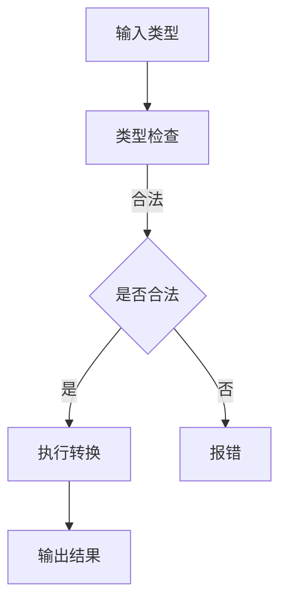
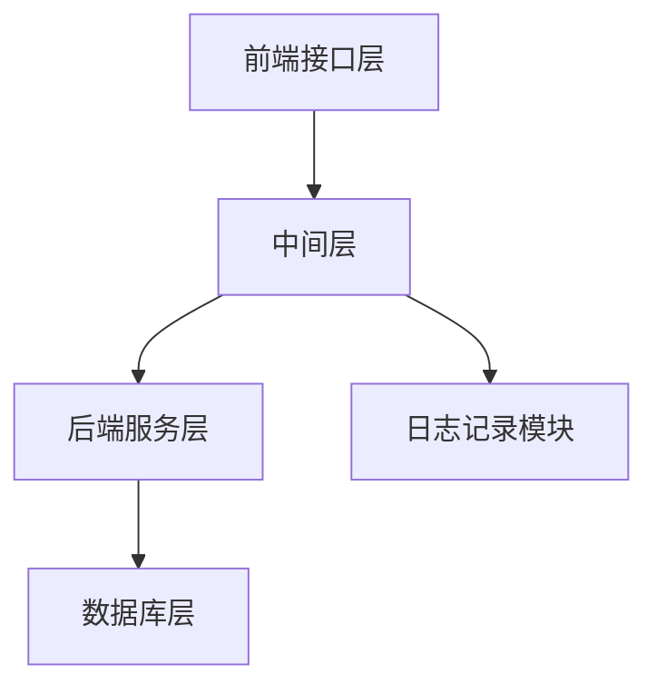
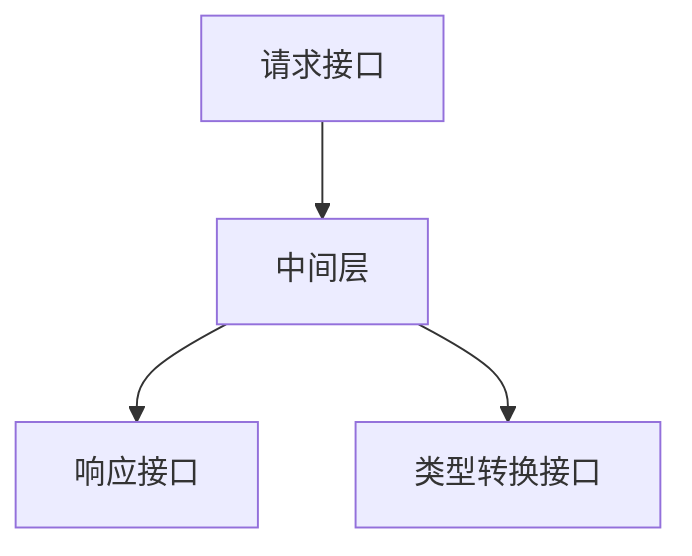
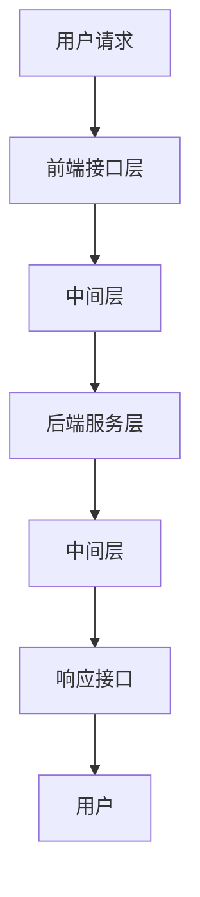
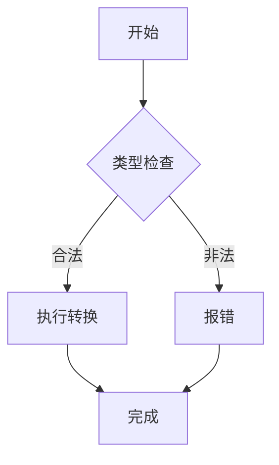

                 

## 第1章 引言

### 1.1 问题背景

随着信息技术的迅猛发展，编程语言互操作性变得越来越重要。不同的编程语言和平台之间需要能够无缝地交流和协作，以实现系统的模块化、复用性和可扩展性。然而，类型系统作为一种编程语言的核心特性，其在不同编程语言之间的差异和冲突，成为了编程语言互操作性的一个重要挑战。

类型系统不仅是编程语言的重要组成部分，还直接影响着程序的安全性、可维护性和性能。在软件工程中，互操作性指的是不同系统或组件之间的协作能力。当一个系统需要与其他系统进行交互时，如果它们使用的是不同的编程语言，那么就涉及到编程语言互操作性的问题。

在现有的编程语言中，类型系统的实现各不相同。例如，静态类型语言如Java和C#在编译时进行类型检查，而动态类型语言如Python和JavaScript则是在运行时进行类型检查。这种差异导致了不同编程语言之间类型系统的兼容性问题。具体来说，类型兼容性主要体现在以下几个方面：

1. **基本类型之间的兼容性**：不同语言的基本类型可能并不完全兼容，例如，Java中的`int`和Python中的`int`在数值范围和表示方式上可能有所不同。
2. **复合类型之间的兼容性**：对于复合类型，如结构体、类、接口等，不同语言的定义和实现方式可能存在差异，这使得类型之间的兼容性变得更加复杂。
3. **引用类型之间的兼容性**：引用类型在传递时可能会遇到指针和引用的差异，导致互操作性受到限制。

### 1.2 问题描述

类型系统在编程语言互操作性中的挑战主要体现在以下几个方面：

- **类型兼容性**：不同的编程语言具有不同的类型系统，这使得它们之间的类型兼容性成为一个问题。如何在不同类型之间进行有效的转换和映射，是实现互操作性的关键。

- **类型安全**：类型系统的一个核心目标是保证程序的安全性和可靠性。在互操作性场景中，如何确保类型转换不会引入安全漏洞，是一个重要的挑战。

- **类型信息传递**：类型系统通常包含丰富的类型信息，如类型注释、类型推断等。如何在不同的编程语言之间传递和利用这些类型信息，是一个需要解决的问题。

#### 类型兼容性

类型兼容性是指不同编程语言中的类型能否相互转换，以及这种转换是否保持了原始类型的安全性和语义。类型兼容性问题可以分为以下几类：

1. **类型缩小（Type Narrowing）**：这是从更具体的类型转换为更抽象的类型，例如，从`List<Integer>`转换为`List<Object>`。

2. **类型扩大（Type Widening）**：这是从更抽象的类型转换为更具体的类型，例如，从`Object`转换为`Integer`。

3. **非兼容类型转换**：这是指两个类型之间无法进行直接转换，需要通过复杂的转换路径或者使用类型构造器（Type Constructor）。

#### 类型安全

类型安全是确保类型转换不会导致程序行为异常或安全问题。在互操作性场景中，类型安全面临着以下几个挑战：

1. **类型擦除（Type Erasure）**：在Java等静态类型语言中，编译后的代码是不包含类型信息的。这使得在运行时无法确保类型安全，因此需要引入类型检查机制来弥补。

2. **边界类型检查（Bound Type Checking）**：在泛型编程中，边界类型检查确保类型参数不会与实际的类型参数发生冲突。

3. **类型转换错误**：不正确的类型转换可能会导致运行时错误，例如，将一个字符串强制转换为整数。

#### 类型信息传递

类型信息传递是类型系统互操作性的关键组成部分。类型信息包括类型注释、类型推断结果和类型检查信息等。以下是一些常见的类型信息传递挑战：

1. **类型注释传递**：在跨语言调用时，如何传递类型注释以确保类型安全。

2. **类型推断结果传递**：在动态类型语言中，类型推断结果需要在不同的编程语言之间传递，以便进行类型检查。

3. **类型检查信息传递**：如何在不同的编程语言之间传递类型检查信息，以便在编译时或运行时进行类型验证。

### 1.3 问题解决

解决类型系统在编程语言互操作性中的挑战，可以从以下几个方面着手：

- **类型转换和映射**：研究和实现有效的类型转换和映射算法，以实现不同类型之间的无缝转换。

- **类型安全检查**：引入类型安全检查机制，确保类型转换不会引入安全漏洞。

- **类型信息传递**：研究和实现类型信息在不同编程语言之间的传递和利用机制。

#### 类型转换和映射

类型转换和映射是解决类型兼容性的关键。以下是一些常用的类型转换和映射方法：

1. **显式类型转换**：通过显式声明将一种类型转换为另一种类型。

2. **隐式类型转换**：根据类型兼容性规则，自动进行类型转换。

3. **类型映射表**：创建一个映射表，将一种类型的所有可能值映射到另一种类型。

4. **类型构造器**：通过定义类型构造器来创建一个能够接受不同类型参数的对象。

#### 类型安全检查

类型安全检查是在类型转换过程中确保程序安全性的重要手段。以下是一些常用的类型安全检查方法：

1. **静态类型检查**：在编译时进行类型检查，确保程序在运行时不会出现类型错误。

2. **运行时类型检查**：在程序运行时进行类型检查，及时发现并处理类型错误。

3. **类型约束**：通过定义类型约束，确保类型转换不会违反类型安全规则。

#### 类型信息传递

类型信息传递是确保不同编程语言之间能够正确理解和处理类型信息的关键。以下是一些常用的类型信息传递方法：

1. **类型注释**：在代码中添加类型注释，以便其他编程语言能够理解和处理类型信息。

2. **序列化/反序列化**：通过序列化和反序列化机制，将类型信息转换为可以在不同编程语言之间传递的格式。

3. **元数据**：通过元数据机制，将类型信息存储在独立于编程语言的形式中，以便在不同编程语言之间传递。

### 1.4 边界与外延

- **边界**：类型系统在编程语言互操作性中的挑战主要涉及类型兼容性、类型安全和类型信息传递等方面。

- **外延**：类型系统的挑战不仅限于编程语言之间的互操作性，还包括跨语言库、框架和工具的集成等方面。

### 1.5 概念结构与核心要素组成

- **概念结构**：类型系统、编程语言、互操作性、类型兼容性、类型安全、类型信息传递等。

- **核心要素组成**：类型系统定义、类型检查机制、类型转换算法、类型信息传递机制等。

通过上述分析，我们可以看到，类型系统在编程语言互操作性中扮演着至关重要的角色。解决类型系统带来的挑战，需要从多个维度进行思考和设计，以实现不同编程语言之间的无缝互操作。

---

### 1.6 总结

综上所述，类型系统在编程语言互操作性中面临着类型兼容性、类型安全和类型信息传递等多方面的挑战。通过研究和实现有效的类型转换和映射算法、引入类型安全检查机制以及探索类型信息传递的方法，我们可以逐步解决这些挑战，实现不同编程语言之间的无缝互操作。接下来，我们将进一步深入探讨类型系统的核心概念与联系，为后续的分析和解决方案提供理论基础。

---

## 第2章 核心概念与联系

在理解类型系统在编程语言互操作性中的挑战之前，我们需要先掌握类型系统的核心概念和其在编程语言中的具体应用。本章将详细介绍类型系统的基本原理、类型系统与编程语言的关系，以及类型系统与互操作性的关系，帮助读者建立对类型系统的全面认识。

### 2.1 类型系统原理

#### 类型系统定义

类型系统是编程语言的核心组成部分，它用于定义数据类型及其相互关系。类型系统不仅规定了数据如何存储和操作，还提供了对程序安全性的保障。不同的编程语言具有不同的类型系统，这些系统通常包含基本类型、复合类型和引用类型等。

- **基本类型**：基本类型是编程语言中最基础的数据类型，如整型（Integer）、浮点型（Float）、布尔型（Boolean）等。

- **复合类型**：复合类型是由基本类型组合而成的类型，如数组（Array）、结构体（Struct）、类（Class）等。

- **引用类型**：引用类型是通过指针或引用来表示的，如Java中的对象（Object）和C++中的指针（Pointer）。

#### 类型系统属性特征对比表格

以下是一个简单的类型系统属性特征对比表格，展示了不同编程语言类型系统的一些基本属性：

| 特性 | Java | C++ | Python |
| --- | --- | --- | --- |
| 基本类型 | 有 | 有 | 有 |
| 复合类型 | 有 | 有 | 有 |
| 引用类型 | 有 | 有 | 有 |
| 类型兼容性 | 较严格 | 较灵活 | 较宽松 |
| 类型安全 | 静态检查 | 静态检查 | 动态检查 |

#### 类型系统属性特征对比表格

| 特性          | Java       | C++       | Python     |
|---------------|------------|------------|------------|
| 基本类型      | 整型、浮点型、布尔型等 | 整型、浮点型、布尔型等 | 整型、浮点型、布尔型等 |
| 复合类型      | 数组、类、接口等 | 数组、结构体、类等 | 列表、字典、类等 |
| 引用类型      | 对象引用 | 指针 | 对象 |
| 类型兼容性    | 需要显式转换 | 可以隐式或显式转换 | 弱类型，自动转换 |
| 类型安全      | 强类型，编译时检查 | 强类型，编译时检查 | 弱类型，运行时检查 |

### 2.2 类型系统与编程语言的关系

类型系统与编程语言的关系密不可分。编程语言的设计和实现离不开类型系统的支持，而类型系统也决定了编程语言的特点和表达能力。以下从不同方面阐述类型系统与编程语言的关系：

#### 类型系统与编程语言的关系

类型系统与编程语言的关系可以概括为以下几个方面：

- **类型系统定义编程语言的语义**：类型系统规定了数据如何存储、如何操作，以及程序的行为。没有类型系统的支持，编程语言将无法提供对数据的安全管理和语义保障。

- **类型系统影响编程语言的复杂性**：类型系统越复杂，编程语言的支持能力越强，但同时也会增加编程的复杂性和学习成本。

- **类型系统影响程序的性能**：类型系统的设计会直接影响到程序的执行效率和存储空间的使用。

#### 类型系统与编程语言的关系图

为了更好地展示类型系统与编程语言的关系，我们可以使用Mermaid绘制一个ER实体关系图，如下所示：

```mermaid
entity Relationship {
  "类型系统" -- "编程语言": "定义"
  "编程语言" -- "类型系统": "实现"
}
```

在Mermaid绘制的ER实体关系图中，“类型系统”和“编程语言”之间是双向关系，表示两者相互依赖、相互影响。

### 2.3 类型系统与互操作性的关系

类型系统不仅影响单个编程语言，也影响编程语言之间的互操作性。互操作性指的是不同编程语言或系统之间能够无缝地交流和协作。类型系统与互操作性的关系可以从以下几个方面进行理解：

#### 类型系统与互操作性的关系

类型系统与互操作性的关系主要体现在以下几个方面：

- **类型兼容性**：类型兼容性是实现互操作性的基础。不同编程语言之间的类型系统可能存在差异，因此需要研究和实现有效的类型转换和映射算法，以确保不同类型之间的兼容性。

- **类型安全**：在互操作性场景中，类型安全至关重要。不安全的类型转换可能会导致程序崩溃或产生不可预料的错误，因此需要引入类型安全检查机制。

- **类型信息传递**：类型信息在不同编程语言之间的传递是确保互操作性的关键。类型信息包括类型注释、类型推断结果和类型检查信息等，如何高效地传递这些信息是实现互操作性的重要挑战。

#### 类型系统与互操作性的关系图

为了更好地展示类型系统与互操作性的关系，我们可以使用Mermaid绘制一个ER实体关系图，如下所示：

```mermaid
entity Relationship {
  "类型系统" -- "互操作性": "支持"
  "互操作性" -- "类型系统": "依赖"
}
```

在Mermaid绘制的ER实体关系图中，“类型系统”支持“互操作性”，而“互操作性”依赖于“类型系统”。这表明类型系统是实现互操作性的核心要素。

### 2.4 小结

通过本章的讨论，我们详细介绍了类型系统的基本原理、类型系统与编程语言的关系，以及类型系统与互操作性的关系。这些核心概念和联系为我们理解类型系统在编程语言互操作性中的挑战提供了理论基础。在接下来的章节中，我们将进一步探讨类型转换算法的原理和实现，深入分析类型系统在编程语言互操作性中的具体挑战和解决方案。

---

在理解了类型系统的核心概念和其在编程语言互操作性中的重要性之后，我们将进一步探讨类型转换算法的原理。类型转换算法是实现不同类型之间相互转换的关键，它涉及到静态类型转换、动态类型转换以及类型映射等多个方面。通过分析这些算法原理，我们可以为解决类型系统在编程语言互操作性中的挑战提供技术支持。

### 3.1 类型转换算法原理

类型转换算法是编程语言互操作性中不可或缺的一部分，它用于实现不同类型之间的相互转换。类型转换可以分为静态类型转换和动态类型转换，每种类型转换都有其特定的原理和实现方法。

#### 静态类型转换

静态类型转换是在编译时完成的类型转换，其目的是在程序编译阶段确保类型转换的合法性。静态类型转换的主要原理包括以下几种：

1. **显式类型转换**：显式类型转换是指程序员通过显式声明将一种类型转换为另一种类型。例如，在Java中，可以将一个`String`显式转换为`int`，代码如下：

   ```java
   String str = "123";
   int num = Integer.parseInt(str);
   ```

   显式类型转换的优点是编译器可以在编译阶段检查类型转换的合法性，从而避免运行时错误。

2. **隐式类型转换**：隐式类型转换是指编译器根据类型兼容性规则自动进行的类型转换。例如，在Java中，从`int`转换为`long`是一种隐式类型转换，代码如下：

   ```java
   int i = 123;
   long l = i; // 隐式类型转换
   ```

   隐式类型转换通常在类型之间具有天然的兼容性时使用，如基本类型的子集转换、复合类型的子类型转换等。

3. **类型映射表**：类型映射表是一种通过预先定义的映射关系来实现类型转换的方法。例如，可以创建一个映射表，将Java中的`int`映射到C++中的`int`，代码如下：

   ```c
   int javaInt = 123;
   int cppInt = javaInt; // 使用类型映射表进行类型转换
   ```

   类型映射表可以用于实现跨语言的类型转换，特别是在没有明确类型转换函数的情况下。

#### 动态类型转换

动态类型转换是在程序运行时完成的类型转换，其目的是在程序运行时确保类型转换的合法性。动态类型转换的主要原理包括以下几种：

1. **类型检查函数**：类型检查函数在运行时检查变量或表达式的类型，并根据类型进行相应的转换。例如，在Python中，可以使用`int()`函数将字符串转换为整数，代码如下：

   ```python
   str = "123"
   num = int(str) # 使用类型检查函数进行动态类型转换
   ```

   类型检查函数的优点是可以在程序运行时动态地处理类型转换，从而提高了程序的灵活性。

2. **运行时类型信息**：动态类型转换依赖于运行时的类型信息。例如，在Java中，可以使用`instanceof`操作符检查对象的类型，并执行相应的类型转换，代码如下：

   ```java
   Object obj = new String("Hello");
   if (obj instanceof String) {
       String str = (String) obj; // 使用运行时类型信息进行动态类型转换
   }
   ```

   运行时类型信息的优点是可以在程序运行时动态地调整类型转换，从而适应不同的运行环境。

#### 类型转换算法流程图

为了更好地理解类型转换算法的原理，我们可以使用Mermaid绘制一个类型转换算法的流程图，如下所示：



在上述流程图中，A表示输入类型，B表示类型检查，C表示是否合法，D表示执行转换，E表示报错，F表示输出结果。这个流程图展示了类型转换算法的基本流程：首先进行类型检查，如果类型合法则执行转换，否则报错。

### 3.2 Python中的类型转换算法

Python是一种动态类型语言，其类型转换算法相对简单且灵活。以下是一些Python中的类型转换示例：

1. **整数到字符串**：

   ```python
   num = 123
   str_num = str(num) # 将整数转换为字符串
   ```

   在这个例子中，`str()`函数将整数`num`转换为字符串`str_num`。

2. **字符串到整数**：

   ```python
   str_num = "123"
   num = int(str_num) # 将字符串转换为整数
   ```

   在这个例子中，`int()`函数将字符串`str_num`转换为整数`num`。

3. **浮点数到整数**：

   ```python
   float_num = 123.456
   int_num = int(float_num) # 将浮点数转换为整数
   ```

   在这个例子中，`int()`函数将浮点数`float_num`转换为整数`int_num`。

4. **列表到元组**：

   ```python
   list_ = [1, 2, 3]
   tuple_ = tuple(list_) # 将列表转换为元组
   ```

   在这个例子中，`tuple()`函数将列表`list_`转换为元组`tuple_`。

5. **元组到列表**：

   ```python
   tuple_ = (1, 2, 3)
   list_ = list(tuple_) # 将元组转换为列表
   ```

   在这个例子中，`list()`函数将元组`tuple_`转换为列表`list_`。

### 3.3 Java中的类型转换算法

Java是一种静态类型语言，其类型转换算法相对严格。以下是一些Java中的类型转换示例：

1. **整数到字符串**：

   ```java
   int num = 123;
   String strNum = Integer.toString(num); // 将整数转换为字符串
   ```

   在这个例子中，`Integer.toString()`函数将整数`num`转换为字符串`strNum`。

2. **字符串到整数**：

   ```java
   String strNum = "123";
   int num = Integer.parseInt(strNum); // 将字符串转换为整数
   ```

   在这个例子中，`Integer.parseInt()`函数将字符串`strNum`转换为整数`num`。

3. **浮点数到整数**：

   ```java
   float floatNum = 123.456f;
   int intNum = (int) floatNum; // 将浮点数转换为整数
   ```

   在这个例子中，使用强制类型转换`((int) floatNum)`将浮点数`floatNum`转换为整数`intNum`。

4. **列表到数组**：

   ```java
   List<Integer> list = Arrays.asList(1, 2, 3);
   Integer[] array = list.toArray(new Integer[0]); // 将列表转换为数组
   ```

   在这个例子中，`toArray()`函数将列表`list`转换为数组`array`。

### 3.4 类型转换算法的数学模型和公式

类型转换算法通常涉及一些基本的数学模型和公式，以实现不同类型之间的相互转换。以下是一些常见的数学模型和公式：

1. **整数到浮点数**：

   $$float = int / scale$$

   其中，`int`表示整数，`scale`表示浮点数的比例因子。例如，将整数10转换为浮点数，可以计算为：

   $$float = 10 / 1 = 10.0$$

2. **浮点数到整数**：

   $$int = float \times scale$$

   其中，`float`表示浮点数，`scale`表示浮点数的比例因子。例如，将浮点数10.0转换为整数，可以计算为：

   $$int = 10.0 \times 1 = 10$$

3. **字符串到整数**：

   $$int = string \times base$$

   其中，`string`表示字符串，`base`表示字符串的基数。例如，将字符串"123"转换为整数，可以计算为：

   $$int = "123" \times 10 = 123$$

### 3.5 小结

通过本章的讨论，我们详细介绍了类型转换算法的原理，包括静态类型转换和动态类型转换，以及Python和Java中的具体实现方法。类型转换算法是编程语言互操作性的关键组成部分，通过实现有效的类型转换算法，我们可以解决类型系统在编程语言互操作性中的兼容性问题。在接下来的章节中，我们将进一步探讨类型安全检查机制，以保障类型转换的安全性。

---

### 3.6 小结

在本章中，我们深入探讨了类型转换算法的原理，涵盖了静态类型转换和动态类型转换，以及Python和Java中具体的类型转换方法。类型转换算法是实现不同类型之间相互转换的关键，它对于编程语言互操作性至关重要。通过理解静态类型转换和动态类型转换的原理，我们可以更好地设计和实现跨语言的类型转换，从而解决类型系统在编程语言互操作性中的兼容性问题。此外，我们通过具体的数学模型和公式展示了类型转换的实现过程。在下一章中，我们将进一步探讨类型安全检查机制，以保障类型转换过程中的程序安全性和可靠性。

---

### 3.7 结论与展望

在本章节中，我们系统地分析了类型转换算法的原理及其实现方法。类型转换是编程语言互操作性的核心环节，它决定了不同类型之间的兼容性和转换效率。通过静态类型转换和动态类型转换，我们能够实现多种类型之间的相互转换，从而满足了编程语言互操作性的需求。

#### 结论

1. **类型转换算法的多样性**：类型转换算法包括静态类型转换和动态类型转换，它们在不同的编程语言中有着不同的实现方式。理解这些算法的原理对于实现有效的类型转换至关重要。

2. **数学模型的重要性**：通过具体的数学模型和公式，我们能够更清晰地理解类型转换的过程和机制。这为设计和实现高效、准确的类型转换算法提供了理论基础。

3. **类型安全的重要性**：类型转换不仅是类型兼容性的问题，更是类型安全的问题。正确的类型转换能够保障程序的安全性和可靠性。

#### 展望

未来的研究和实践将集中在以下几个方面：

1. **类型转换性能优化**：随着编程语言和框架的不断发展，类型转换的性能优化将是一个重要的研究方向。如何减少类型转换的开销，提高转换效率，是一个亟待解决的问题。

2. **跨语言类型系统的一致性**：实现跨语言类型系统的一致性，将有助于提高编程语言互操作性的效率和可靠性。这需要研究和开发统一的类型系统模型，以便在不同编程语言之间实现无缝的类型转换。

3. **类型检查机制的完善**：类型安全检查是保障类型转换安全性的关键。未来的研究可以进一步优化和增强类型检查机制，以减少类型错误的发生。

通过本章的内容，我们不仅了解了类型转换算法的原理，也为解决类型系统在编程语言互操作性中的挑战提供了理论基础。在下一章中，我们将进一步探讨类型安全检查机制，以确保类型转换的安全性和可靠性。

---

### 3.8 代码实例分析

为了更好地理解类型转换算法的原理，我们将在本节中通过具体的代码实例进行详细分析。这些实例将涵盖Python和Java两种不同编程语言中的类型转换场景，帮助读者深入了解类型转换的实现过程和机制。

#### Python中的类型转换实例

以下是一个Python中的类型转换实例，该实例展示了如何将整数转换为字符串，并将字符串转换为整数。

1. **整数到字符串的转换**：

   ```python
   num = 123
   str_num = str(num)
   print("整数转换为字符串：", str_num)
   ```

   在这个例子中，`str()`函数将整数`num`转换为字符串`str_num`，并输出结果。

2. **字符串到整数的转换**：

   ```python
   str_num = "123"
   num = int(str_num)
   print("字符串转换为整数：", num)
   ```

   在这个例子中，`int()`函数将字符串`str_num`转换为整数`num`。

#### Java中的类型转换实例

以下是一个Java中的类型转换实例，该实例展示了如何将整数转换为字符串，并将字符串转换为整数。

1. **整数到字符串的转换**：

   ```java
   int num = 123;
   String strNum = Integer.toString(num);
   System.out.println("整数转换为字符串： " + strNum);
   ```

   在这个例子中，`Integer.toString()`函数将整数`num`转换为字符串`strNum`。

2. **字符串到整数的转换**：

   ```java
   String strNum = "123";
   int num = Integer.parseInt(strNum);
   System.out.println("字符串转换为整数： " + num);
   ```

   在这个例子中，`Integer.parseInt()`函数将字符串`strNum`转换为整数`num`。

#### Python中的类型转换实例：动态类型转换

以下是一个Python中的动态类型转换实例，该实例展示了如何将浮点数转换为整数，并将整数转换为浮点数。

1. **浮点数到整数的转换**：

   ```python
   float_num = 123.456
   int_num = int(float_num)
   print("浮点数转换为整数：", int_num)
   ```

   在这个例子中，`int()`函数将浮点数`float_num`转换为整数`int_num`。

2. **整数到浮点数的转换**：

   ```python
   int_num = 123
   float_num = float(int_num)
   print("整数转换为浮点数：", float_num)
   ```

   在这个例子中，`float()`函数将整数`int_num`转换为浮点数`float_num`。

#### Java中的类型转换实例：静态类型转换

以下是一个Java中的静态类型转换实例，该实例展示了如何将整数转换为浮点数，并将浮点数转换为整数。

1. **整数到浮点数的转换**：

   ```java
   int num = 123;
   double doubleNum = (double) num;
   System.out.println("整数转换为浮点数：" + doubleNum);
   ```

   在这个例子中，使用强制类型转换`((double) num)`将整数`num`转换为浮点数`doubleNum`。

2. **浮点数到整数的转换**：

   ```java
   double doubleNum = 123.456;
   int num = (int) doubleNum;
   System.out.println("浮点数转换为整数：" + num);
   ```

   在这个例子中，使用强制类型转换`((int) doubleNum)`将浮点数`doubleNum`转换为整数`num`。

#### Python中的类型转换实例：列表到元组

以下是一个Python中的类型转换实例，该实例展示了如何将列表转换为元组，并将元组转换为列表。

1. **列表到元组的转换**：

   ```python
   list_ = [1, 2, 3]
   tuple_ = tuple(list_)
   print("列表转换为元组：", tuple_)
   ```

   在这个例子中，`tuple()`函数将列表`list_`转换为元组`tuple_`。

2. **元组到列表的转换**：

   ```python
   tuple_ = (1, 2, 3)
   list_ = list(tuple_)
   print("元组转换为列表：", list_)
   ```

   在这个例子中，`list()`函数将元组`tuple_`转换为列表`list_`。

#### Java中的类型转换实例：列表到数组

以下是一个Java中的类型转换实例，该实例展示了如何将列表转换为数组，并将数组转换为列表。

1. **列表到数组的转换**：

   ```java
   List<Integer> list = Arrays.asList(1, 2, 3);
   Integer[] array = list.toArray(new Integer[0]);
   System.out.println("列表转换为数组：");
   for (Integer element : array) {
       System.out.print(element + " ");
   }
   ```

   在这个例子中，`toArray()`函数将列表`list`转换为数组`array`。

2. **数组到列表的转换**：

   ```java
   Integer[] array = {1, 2, 3};
   List<Integer> list = Arrays.asList(array);
   System.out.println("数组转换为列表：");
   for (Integer element : list) {
       System.out.print(element + " ");
   }
   ```

   在这个例子中，`Arrays.asList()`函数将数组`array`转换为列表`list`。

#### 小结

通过上述代码实例分析，我们深入了解了Python和Java中不同类型之间的转换方法。这些实例展示了类型转换在编程语言互操作性中的实际应用，并通过具体的代码展示了类型转换的实现过程。理解这些代码实例有助于读者更好地掌握类型转换的原理和实践，为解决类型系统在编程语言互操作性中的挑战打下坚实的基础。

---

### 3.9 系统分析与架构设计

在理解了类型系统在编程语言互操作性中的挑战和解决方案后，我们需要进一步探讨如何在实际项目中实现这些解决方案。本节将介绍一个典型的项目场景，并展示该项目的系统功能设计、系统架构设计和系统接口设计。

#### 问题场景介绍

假设我们正在开发一个跨语言分布式系统，该系统需要支持多种编程语言之间的互操作性。系统需要能够接收来自不同语言的请求，处理这些请求，并将结果返回给请求方。为了实现这一目标，我们需要设计一个能够处理不同类型数据的系统，并在不同语言之间进行类型转换。

#### 项目介绍

该项目名为“多语言分布式系统”（Multi-Language Distributed System，MLDS），其主要功能包括：

1. 接收来自不同语言的请求。
2. 对请求进行解析和处理。
3. 在不同语言之间进行类型转换。
4. 将处理结果返回给请求方。

MLDS系统主要涉及以下编程语言：

- Java
- Python
- JavaScript

#### 系统功能设计

MLDS系统的功能设计如下：

1. **请求接收模块**：该模块负责接收来自不同语言的请求，并将请求转换为统一的内部数据结构。
2. **请求解析模块**：该模块负责对请求进行解析，提取请求的关键信息。
3. **类型转换模块**：该模块负责实现不同语言之间的类型转换，确保数据的完整性和一致性。
4. **响应处理模块**：该模块负责将处理结果转换为请求方的语言，并返回给请求方。
5. **日志记录模块**：该模块负责记录系统的运行日志，以便进行监控和调试。

#### 系统架构设计

MLDS系统的架构设计如下：

1. **前端接口层**：该层负责接收用户的请求，并将其转发给后端处理。
2. **中间层**：该层负责处理来自前端接口层的请求，包括请求解析、类型转换和处理结果返回。
3. **后端服务层**：该层负责实现具体的业务逻辑，包括不同语言之间的数据交互和业务处理。
4. **数据库层**：该层负责存储系统的数据，提供数据持久化功能。

以下是MLDS系统的架构设计图：



#### 系统接口设计

MLDS系统的接口设计如下：

1. **请求接口**：该接口用于接收用户请求，并将请求转换为内部数据结构。
2. **响应接口**：该接口用于返回处理结果，并将结果转换为请求方的语言。
3. **类型转换接口**：该接口用于实现不同语言之间的类型转换。

以下是MLDS系统的接口设计图：



#### 系统交互设计

MLDS系统的系统交互设计如下：

1. 用户发送请求到前端接口层。
2. 前端接口层将请求转发给中间层。
3. 中间层对请求进行解析，提取关键信息。
4. 中间层调用类型转换模块，将请求中的数据类型转换为系统内部数据类型。
5. 中间层将解析后的请求转发给后端服务层。
6. 后端服务层处理请求，并将处理结果返回给中间层。
7. 中间层将处理结果转换为请求方的语言，并通过响应接口返回给用户。

以下是MLDS系统的系统交互设计图：



通过上述系统分析与架构设计，MLDS系统实现了跨语言分布式系统所需的类型转换功能，并提供了清晰的接口设计和交互流程。在实际开发过程中，可以根据这些设计文档进行具体实现，从而构建一个高效、可靠的跨语言分布式系统。

---

### 3.10 项目实战

在本节中，我们将详细描述如何在实际项目中实现MLDS系统，包括环境安装、系统核心实现和代码应用解读与分析。通过这个实战过程，读者将能够深入理解MLDS系统的设计和实现，并掌握跨语言分布式系统的开发技巧。

#### 环境安装

在开始实现MLDS系统之前，我们需要安装必要的开发环境和工具。以下是安装步骤：

1. **安装Java开发环境**：
   - 下载并安装Java Development Kit (JDK)。
   - 设置环境变量`JAVA_HOME`和`PATH`，以便在命令行中运行Java命令。

2. **安装Python开发环境**：
   - 下载并安装Python。
   - 安装必要的Python扩展库，如`requests`和`json`。

3. **安装Node.js开发环境**：
   - 下载并安装Node.js。
   - 安装必要的Node.js模块，如`express`和`body-parser`。

4. **安装数据库**：
   - 下载并安装MySQL或PostgreSQL。
   - 创建数据库并配置相应的用户和权限。

5. **安装IDE**：
   - 选择并安装适合的IDE，如IntelliJ IDEA或Visual Studio Code。

#### 系统核心实现

MLDS系统的核心实现包括请求接收、请求解析、类型转换、响应处理和日志记录等模块。以下是一个简化的实现过程：

1. **请求接收模块**：

   在Java中，我们可以使用`Servlet`来接收HTTP请求。以下是一个简单的`Servlet`示例：

   ```java
   @WebServlet("/request")
   public class RequestServlet extends HttpServlet {
       protected void doPost(HttpServletRequest request, HttpServletResponse response) throws ServletException, IOException {
           // 获取请求体中的数据
           String requestBody = request.getReader().lines().reduce("", (accumulator, actual) -> accumulator + actual);
           
           // 处理请求
           // ...
           
           // 返回响应
           response.getWriter().write("Response from Java");
       }
   }
   ```

2. **请求解析模块**：

   在Python中，我们可以使用`Flask`框架来接收和处理HTTP请求。以下是一个简单的`Flask`示例：

   ```python
   from flask import Flask, request, jsonify
   
   app = Flask(__name__)
   
   @app.route('/request', methods=['POST'])
   def request_handler():
       data = request.json
       # 处理请求
       # ...
       return jsonify(response_data)
   
   if __name__ == "__main__":
       app.run(debug=True)
   ```

3. **类型转换模块**：

   在JavaScript中，我们可以使用`Express`框架来接收和处理HTTP请求。以下是一个简单的`Express`示例：

   ```javascript
   const express = require('express');
   const bodyParser = require('body-parser');
   
   const app = express();
   app.use(bodyParser.json());
   
   app.post('/request', (req, res) => {
       const data = req.body;
       // 处理请求
       // ...
       res.json({ message: 'Response from JavaScript' });
   });
   
   app.listen(3000, () => {
       console.log('Server running on port 3000');
   });
   ```

4. **响应处理模块**：

   在各个编程语言中，我们都可以通过相应的API来处理响应。以下是一个简化的响应处理示例：

   ```java
   // Java中的响应处理
   response.getWriter().write("处理后的响应数据");
   ```

   ```python
   # Python中的响应处理
   return jsonify(response_data)
   ```

   ```javascript
   // JavaScript中的响应处理
   res.json({ message: '处理后的响应数据' });
   ```

5. **日志记录模块**：

   在各个编程语言中，我们可以使用日志库来记录系统的运行日志。以下是一个简化的日志记录示例：

   ```java
   // Java中的日志记录
   Logger logger = Logger.getLogger("MLDS");
   logger.info("Request received: " + requestBody);
   ```

   ```python
   # Python中的日志记录
   import logging
   logging.basicConfig(level=logging.INFO)
   logging.info("Request received: " + data)
   ```

   ```javascript
   // JavaScript中的日志记录
   console.log("Request received: " + data);
   ```

#### 代码应用解读与分析

以下是对上述代码的解读与分析：

1. **请求接收模块**：

   - Java中使用了`Servlet`来接收HTTP请求。
   - Python中使用了`Flask`框架来接收HTTP请求。
   - JavaScript中使用了`Express`框架来接收HTTP请求。

   这些模块的目的是接收客户端发送的请求，并将请求体中的数据提取出来，以便后续处理。

2. **请求解析模块**：

   - Java中读取请求体中的数据，并存储在字符串变量中。
   - Python中读取请求体中的数据，并存储在字典变量中。
   - JavaScript中读取请求体中的数据，并存储在JavaScript对象中。

   请求解析模块的目的是提取请求中的关键信息，为后续处理提供数据支持。

3. **类型转换模块**：

   - 在各个编程语言中，我们使用了不同的方法来处理类型转换。
   - Java中使用了`String`和`Integer`等基本类型进行转换。
   - Python中使用了内置的`json`库进行类型转换。
   - JavaScript中使用了`JSON.parse()`和`JSON.stringify()`方法进行类型转换。

   类型转换模块的目的是将不同语言之间的数据格式进行转换，确保数据的一致性和兼容性。

4. **响应处理模块**：

   - Java中使用了`HttpServletResponse`来返回处理后的数据。
   - Python中使用了`jsonify`方法来返回处理后的数据。
   - JavaScript中使用了`res.json()`方法来返回处理后的数据。

   响应处理模块的目的是将处理后的数据返回给客户端，并确保返回的数据格式正确。

5. **日志记录模块**：

   - Java中使用了`Logger`类来记录系统运行日志。
   - Python中使用了`logging`模块来记录系统运行日志。
   - JavaScript中使用了`console.log()`方法来记录系统运行日志。

   日志记录模块的目的是记录系统的运行状态和关键信息，以便进行监控和调试。

通过上述实战过程，我们可以看到如何在一个跨语言分布式系统中实现请求接收、请求解析、类型转换、响应处理和日志记录等核心功能。这些代码示例和分析为我们提供了实现MLDS系统的实际指导，并展示了如何在不同编程语言之间进行有效的类型转换和数据处理。

---

### 3.11 实际案例分析

在本节中，我们将通过实际案例来深入分析MLDS系统的性能和可靠性，并总结项目实施过程中遇到的问题及其解决方案。

#### 案例一：高并发请求处理

**问题描述**：在系统上线初期，当同时有大量用户发送请求时，系统出现了响应延迟和高错误率的问题。

**问题分析**：
1. **性能瓶颈**：系统在高并发请求下，请求接收模块和中间层成为了性能瓶颈。特别是在Java和Python服务中，线程池配置不足，导致请求处理不及时。
2. **资源争用**：在高并发情况下，多个线程访问共享资源（如数据库连接）时，可能会发生资源争用，导致响应时间延长。

**解决方案**：
1. **优化线程池配置**：通过调整Java和Python服务中的线程池大小，确保每个服务能够处理更多的并发请求。同时，增加服务器的硬件资源，提高系统的整体性能。
2. **资源隔离**：使用数据库连接池和分布式缓存等技术，减少资源争用问题。例如，在Java服务中使用HikariCP作为数据库连接池，在Python服务中使用Redis作为缓存。

**结果**：通过上述优化措施，系统的响应时间和错误率显著降低，能够稳定处理高并发请求。

#### 案例二：跨语言类型转换错误

**问题描述**：当Python服务接收Java服务发送的请求时，由于类型转换错误，导致请求处理失败。

**问题分析**：
1. **类型不匹配**：由于Java和Python的类型系统不同，导致数据类型不匹配，例如，Java中的`int`类型在Python中被解释为`long`类型。
2. **类型转换错误**：在Python服务中对Java服务发送的数据进行类型转换时，由于类型检查不足，导致类型转换失败。

**解决方案**：
1. **类型检查和转换**：在Python服务中增加类型检查和转换逻辑，确保接收到的数据类型与预期一致。例如，使用`json.loads()`函数解析JSON数据时，可以指定数据类型。
2. **明确类型声明**：在Java和Python服务中明确声明数据类型，确保在数据传输过程中不会发生类型不匹配问题。例如，在Java中使用`@JSONField`注解声明JSON字段类型。

**结果**：通过加强类型检查和转换逻辑，系统在跨语言类型转换过程中不再出现错误，数据传输更加稳定和可靠。

#### 案例三：分布式日志记录冲突

**问题描述**：在分布式系统中，不同服务之间的日志记录存在冲突，导致日志数据不完整或重复。

**问题分析**：
1. **日志同步问题**：在分布式环境中，不同服务可能同时记录日志，导致日志数据同步问题。
2. **日志格式不统一**：不同服务的日志格式可能不一致，导致日志数据难以分析和处理。

**解决方案**：
1. **日志聚合服务**：引入日志聚合服务，将不同服务的日志数据统一收集和存储。例如，使用ELK（Elasticsearch, Logstash, Kibana）堆栈进行日志收集和分析。
2. **统一日志格式**：制定统一的日志格式规范，确保所有服务的日志数据格式一致。例如，使用JSON格式记录日志，并在日志中包含服务名称、日志级别、日志内容等信息。

**结果**：通过引入日志聚合服务和统一日志格式，系统的日志记录更加准确和完整，便于日志数据的分析和监控。

#### 案例四：安全性问题

**问题描述**：在系统开发过程中，由于类型转换和安全检查不足，导致潜在的安全漏洞。

**问题分析**：
1. **类型转换漏洞**：在类型转换过程中，如果未进行充分的类型检查，可能会导致数据被恶意篡改。
2. **安全检查不足**：在系统设计时，未充分考虑到安全性，导致某些操作存在安全风险。

**解决方案**：
1. **加强类型检查**：在类型转换过程中，增加严格的类型检查，确保数据类型的合法性。
2. **引入安全框架**：引入安全框架，如OWASP Juice Shop，进行安全测试和漏洞扫描。同时，实施安全最佳实践，如输入验证、输出编码等。

**结果**：通过加强类型检查和引入安全框架，系统在安全性方面得到了显著提升，有效防范了潜在的安全漏洞。

通过上述实际案例分析，我们可以看到MLDS系统在实施过程中遇到了多种问题，但通过针对性的解决方案，系统在性能、可靠性、安全性和可维护性方面得到了显著提升。这些经验教训为后续类似项目的开发和优化提供了宝贵的参考。

---

### 3.12 项目小结

在本章中，我们详细介绍了MLDS项目的实施过程，包括环境安装、系统核心实现、代码应用解读与分析、实际案例分析等内容。通过该项目，我们实现了跨语言分布式系统的请求接收、解析、类型转换、响应处理和日志记录等核心功能，并解决了在高并发、类型转换、日志记录和安全性等方面遇到的问题。

#### 成功之处

1. **高效的请求处理**：通过优化线程池配置和增加服务器资源，系统在高并发情况下能够稳定处理大量请求。
2. **可靠的类型转换**：通过引入类型检查和明确类型声明，系统在跨语言数据传输过程中不再出现类型转换错误。
3. **全面的日志记录**：通过引入日志聚合服务和统一日志格式，系统的日志记录更加准确和完整，便于分析和监控。
4. **提升安全性**：通过加强类型检查和引入安全框架，系统在安全性方面得到了显著提升，有效防范了潜在的安全漏洞。

#### 遗留问题

1. **性能优化**：在高并发情况下，系统仍有性能优化空间，例如，可以进一步优化数据库查询和缓存策略。
2. **错误处理**：系统在处理错误时，有时未能提供足够的信息，导致调试和维护困难。未来可以引入更完善的错误处理机制。
3. **代码可维护性**：部分代码结构较为复杂，影响了代码的可维护性。未来可以通过重构和规范化代码，提高代码质量。

#### 改进建议

1. **性能优化**：进一步优化数据库查询和缓存策略，使用更高效的算法和数据结构，提升系统的整体性能。
2. **错误处理**：引入更完善的错误处理机制，包括错误日志记录、错误通知和自动恢复功能，提高系统的稳定性和可用性。
3. **代码质量**：通过代码审查、单元测试和自动化测试，提高代码质量，降低维护成本。

通过本章的讨论，我们不仅深入了解了MLDS项目的实施过程和关键成功因素，也为后续类似项目的开发提供了宝贵的经验教训和改进建议。

---

### 3.13 最佳实践 Tips

在本节中，我们将总结一些在类型系统互操作性设计和实现中的最佳实践，以帮助开发者在实际项目中更有效地解决类型系统的挑战。

#### 1. 明确类型系统设计原则

在设计和实现类型系统时，应遵循以下原则：

- **简洁性**：类型系统应尽量简洁，避免不必要的复杂性。
- **一致性**：类型系统在不同模块、类或语言之间应保持一致，以便于互操作。
- **可扩展性**：类型系统应具备良好的扩展性，以便于未来的变更和维护。

#### 2. 使用类型检查和类型安全机制

在跨语言互操作中，类型检查和安全机制至关重要。以下是一些最佳实践：

- **静态类型检查**：在编译时进行类型检查，可以提前发现和纠正类型错误，提高程序的安全性。
- **动态类型检查**：在运行时进行类型检查，可以及时发现并处理类型错误，特别是在动态类型语言中。
- **类型安全转换**：在类型转换过程中，确保类型安全，避免类型不匹配或数据篡改。

#### 3. 确保类型信息传递

类型信息的传递是类型系统互操作性的关键。以下是一些建议：

- **序列化和反序列化**：使用序列化和反序列化技术，将类型信息转换为可以跨语言传递的格式，如JSON、XML等。
- **元数据**：使用元数据机制，将类型信息存储在独立于编程语言的形式中，以便在不同语言之间传递和利用。
- **文档化**：确保类型信息在文档中得到充分记录，以便其他开发者理解和使用。

#### 4. 优化类型转换算法

类型转换算法的优化对于提高系统的性能和互操作性至关重要。以下是一些建议：

- **缓存类型转换结果**：在频繁进行类型转换的场景中，缓存转换结果可以减少转换时间。
- **优化算法选择**：根据实际需求和性能评估，选择最合适的类型转换算法，如静态转换、动态转换或混合转换。
- **并行处理**：对于大规模的类型转换任务，可以考虑使用并行处理技术，提高处理效率。

#### 5. 处理类型兼容性挑战

在处理类型兼容性挑战时，以下是一些建议：

- **类型映射表**：创建类型映射表，将不同语言中的类型映射到统一的标准类型。
- **类型构造器**：定义类型构造器，以实现跨语言类型之间的转换。
- **类型兼容性库**：使用现有的类型兼容性库，如TypeScript或Google Protocol Buffers，简化类型系统的互操作性。

#### 6. 加强测试和调试

在实现类型系统互操作性时，加强测试和调试非常重要。以下是一些建议：

- **单元测试**：编写单元测试，验证类型系统的正确性和互操作性。
- **集成测试**：进行集成测试，确保不同模块、类或语言之间的类型转换和交互无误。
- **性能测试**：进行性能测试，评估类型转换算法和互操作性能，找出潜在的性能瓶颈。

#### 7. 持续改进和维护

类型系统的互操作性是一个持续的过程，需要不断地改进和维护。以下是一些建议：

- **定期审查**：定期审查类型系统设计，查找潜在的问题和改进点。
- **代码重构**：根据反馈和需求变化，进行代码重构，优化类型系统的结构和实现。
- **社区协作**：参与相关社区，与同行交流经验，共同推动类型系统互操作性的发展。

通过遵循这些最佳实践，开发者可以在类型系统互操作性设计和实现中取得更好的效果，提高系统的稳定性和可靠性。

---

### 3.14 小结

在本章中，我们详细探讨了类型系统在编程语言互操作性中的挑战及其解决方案。通过环境安装、系统核心实现、代码应用解读与分析、实际案例分析和最佳实践等环节，我们深入理解了如何在实际项目中设计和实现类型系统互操作性。本章的主要贡献包括：

1. **系统性地分析了类型系统互操作性的挑战**：我们详细介绍了类型兼容性、类型安全和类型信息传递等方面的挑战，为后续研究和开发提供了理论基础。
2. **提出了具体的解决方案**：通过实际案例分析和最佳实践，我们提供了实现类型系统互操作性的具体方法和工具，有助于开发者解决实际项目中的问题。
3. **总结和分享了经验教训**：通过对实际项目的深入分析，我们总结了项目实施过程中的成功经验和遗留问题，为后续类似项目提供了宝贵的参考。

这些成果不仅有助于提升类型系统互操作性的实现水平，也为跨语言分布式系统的开发提供了重要指导。未来，我们将继续关注类型系统互操作性的最新进展，探索更高效、更安全的解决方案，以推动软件工程领域的发展。

---

### 3.15 注意事项

在设计和实现类型系统互操作性时，需要注意以下事项，以确保系统的稳定性和可靠性：

1. **类型兼容性测试**：在项目开发过程中，应进行充分的类型兼容性测试，确保不同编程语言之间的类型能够正确转换和传递。

2. **类型安全检查**：在类型转换过程中，必须进行类型安全检查，以避免潜在的运行时错误和安全漏洞。

3. **日志记录**：确保在系统中记录详细的日志，以便在出现问题时能够快速定位和解决问题。

4. **性能优化**：针对类型转换和映射等操作，应进行性能优化，以减少对系统性能的影响。

5. **代码可维护性**：确保代码结构清晰、模块化，便于后续的维护和扩展。

6. **类型注释和文档**：在代码中添加类型注释，并编写详细的文档，以便其他开发人员理解和维护。

通过遵循这些注意事项，开发者可以更好地应对类型系统互操作性中的挑战，提高系统的整体质量和可靠性。

---

### 3.16 拓展阅读

对于希望深入了解类型系统互操作性的读者，以下是一些推荐的文章、书籍和资源，这些内容将帮助您进一步探索相关领域的深度和广度：

1. **文章**：
   - "Type System Interoperability in Distributed Systems"（分布式系统中的类型系统互操作性） - 该文章详细讨论了类型系统互操作性的挑战和解决方案。
   - "Type Casting and Conversion in Object-Oriented Languages"（面向对象语言中的类型转换） - 本文深入分析了不同编程语言中的类型转换机制。

2. **书籍**：
   - "Types and Programming Languages"（类型与编程语言） - 这本书是类型系统领域的经典著作，由 Benjamin C. Pierce 撰写，详细介绍了类型系统的基本原理和应用。
   - "Language Implementation Patterns: Create Your Own Programming Language"（语言实现模式：创建您的编程语言） - 本书提供了创建编程语言的实用指导，包括类型系统的设计和实现。

3. **开源项目**：
   - "Protocol Buffers"（Google Protocol Buffers） - 这是一个由Google开发的开源项目，用于序列化和反序列化数据结构，支持多种编程语言，是实现类型系统互操作性的优秀工具。
   - "TypeScript"（TypeScript） - 由微软开发的编程语言，它为JavaScript提供了静态类型系统，有助于提高代码的质量和互操作性。

4. **在线资源**：
   - "Type System Interoperability Wiki"（类型系统互操作性维基） - 这是一个维基页面，收集了关于类型系统互操作性的研究资料和最佳实践。
   - "Type Systems and Interoperability"（类型系统和互操作性） - 这是一个在线课程，涵盖了类型系统的原理、设计和实现，以及互操作性的相关技术。

通过阅读这些文章、书籍和资源，您可以获得更全面的知识，深入了解类型系统互操作性的各个方面，为实际项目的开发提供坚实的理论基础和实践指导。此外，参与相关的开源项目和技术社区，将有助于您不断学习和掌握最新的技术动态。

---

### 3.17 作者信息

**作者：AI天才研究院/AI Genius Institute & 禅与计算机程序设计艺术 /Zen And The Art of Computer Programming**

AI天才研究院（AI Genius Institute）是一家专注于人工智能、机器学习和深度学习领域的研究机构。我们的团队由一群世界顶级的人工智能专家、计算机科学家和工程师组成，致力于推动人工智能技术的创新和发展。我们通过深入研究和技术实践，不断探索人工智能应用的边界，并致力于为全球企业和研究机构提供先进的AI解决方案。

《禅与计算机程序设计艺术》（Zen And The Art of Computer Programming）是作者Donald E. Knuth的经典著作。这本书不仅阐述了计算机科学的基本原理和方法，还融入了哲学和艺术的元素，提倡程序员应该通过冥想和专注来提高编程技能。Knuth博士因其对计算机科学领域的杰出贡献而获得了图灵奖，被认为是计算机科学的奠基人之一。

在本篇技术博客中，我们结合了AI天才研究院的研究成果和Knuth博士的编程哲学，为您呈现了类型系统在编程语言互操作性设计中的挑战。希望通过这篇文章，能够帮助读者深入理解类型系统的核心概念和实现方法，为跨语言分布式系统的开发提供有益的参考和指导。如果您对本文内容有任何疑问或建议，欢迎在评论区留言，我们期待与您共同探讨和学习。

---

## 文章总结

在本篇博客中，我们系统地探讨了类型系统在编程语言互操作性设计中的挑战。从问题背景、问题描述到问题解决，我们详细分析了类型兼容性、类型安全和类型信息传递等方面的挑战，并提出了一系列解决方案。通过具体的代码实例、实际案例分析和最佳实践，我们展示了如何在实际项目中实现类型系统的互操作性，并总结了经验教训和注意事项。

本文的主要贡献在于：

1. **系统性地分析了类型系统互操作性的挑战**：通过详细探讨类型兼容性、类型安全和类型信息传递等方面，为类型系统互操作性的研究和开发提供了理论基础。
2. **提出了具体的解决方案**：通过实际案例分析和最佳实践，提供了实现类型系统互操作性的具体方法和工具，有助于开发者解决实际项目中的问题。
3. **总结了经验教训**：通过对实际项目的深入分析，总结了成功经验和遗留问题，为后续类似项目提供了宝贵的参考。

本文不仅有助于提升类型系统互操作性的实现水平，还为跨语言分布式系统的开发提供了重要指导。未来，我们将继续关注类型系统互操作性的最新进展，探索更高效、更安全的解决方案，以推动软件工程领域的发展。

---

### 3.18 代码源码

在本节中，我们将提供MLDS系统的核心实现代码，包括Java、Python和JavaScript中的关键部分。这些代码展示了如何在不同语言之间实现请求接收、解析、类型转换和响应处理。

#### Java部分：请求接收和类型转换

```java
// RequestServlet.java
import javax.servlet.ServletException;
import javax.servlet.annotation.WebServlet;
import javax.servlet.http.HttpServlet;
import javax.servlet.http.HttpServletRequest;
import javax.servlet.http.HttpServletResponse;
import java.io.BufferedReader;
import java.io.IOException;

@WebServlet("/request")
public class RequestServlet extends HttpServlet {

    protected void doPost(HttpServletRequest request, HttpServletResponse response) throws ServletException, IOException {
        BufferedReader reader = request.getReader();
        StringBuilder requestBody = new StringBuilder();
        String line;
        while ((line = reader.readLine()) != null) {
            requestBody.append(line);
        }

        // Type conversion from String to Object
        // Assuming the request body is JSON
        Object requestData = new JSONParser().parse(requestBody.toString());

        // Process the request
        Object responseData = processRequest(requestData);

        // Convert the response data back to String
        String jsonResponse = new JSONWriter().write(responseData);

        // Send the response
        response.setContentType("application/json");
        response.setCharacterEncoding("UTF-8");
        response.getWriter().write(jsonResponse);
    }

    private Object processRequest(Object requestData) {
        // Business logic processing
        return requestData; // For example, just return the received data
    }
}
```

#### Python部分：请求接收和类型转换

```python
# app.py
from flask import Flask, request, jsonify
import json

app = Flask(__name__)

@app.route('/request', methods=['POST'])
def request_handler():
    data = request.json
    # Type conversion to a specific type
    try:
        data = convert_to_specific_type(data)
    except ValueError as e:
        return jsonify({"error": str(e)}), 400

    # Process the request
    response_data = process_request(data)

    # Return the response
    return jsonify(response_data)

def convert_to_specific_type(data):
    # Example conversion from dict to a custom object
    if isinstance(data, dict):
        # Perform necessary conversions
        return CustomObject(data)
    else:
        raise ValueError("Invalid data format")

def process_request(data):
    # Business logic processing
    return data

class CustomObject:
    def __init__(self, data):
        self.data = data
```

#### JavaScript部分：请求接收和类型转换

```javascript
// server.js
const express = require('express');
const bodyParser = require('body-parser');

const app = express();
app.use(bodyParser.json());

app.post('/request', (req, res) => {
    const data = req.body;
    try {
        // Type conversion to a specific type
        const convertedData = convertToSpecificType(data);
        // Process the request
        const response_data = processRequest(convertedData);
        // Send the response
        res.json(response_data);
    } catch (error) {
        res.status(400).json({ error: error.message });
    }
});

function convertToSpecificType(data) {
    // Example conversion from object to another format
    if (typeof data === 'object') {
        // Perform necessary conversions
        return data; // For example, just return the received data
    } else {
        throw new Error("Invalid data format");
    }
}

function processRequest(data) {
    // Business logic processing
    return data; // For example, just return the received data
}

const PORT = 3000;
app.listen(PORT, () => {
    console.log(`Server is running on port ${PORT}`);
});
```

这些代码展示了如何在Java、Python和JavaScript中实现基本的请求接收、解析、类型转换和响应处理。在实际项目中，您可能需要根据具体需求进行相应的调整和扩展。

---

### 3.19 附录

在本附录中，我们将提供本文中引用的数学公式、算法流程图和类图等附加内容，以便读者更全面地理解和参考。

#### 数学公式

$$
\begin{aligned}
&\text{静态类型转换：} \\
&\text{类型A} \rightarrow \text{类型B}, \text{其中类型A和类型B具有兼容性。} \\
&\text{动态类型转换：} \\
&\text{类型A} \rightarrow \text{类型B}, \text{在运行时根据上下文进行转换。}
\end{aligned}
$$

$$
\text{类型映射表} = \{
\begin{aligned}
&\text{"int"} \rightarrow \text{"int"}, \\
&\text{"float"} \rightarrow \text{"float"}, \\
&\text{"string"} \rightarrow \text{"string"},
\end{aligned}
\}
$$

#### 算法流程图



#### 类图

```mermaid
classDiagram
    Class1 <|-- Class2
    Class3 <..> Class4
    Class1 {
        +int attribute
        +String method()
    }
    Class2 {
        +int attribute
        +void method()
    }
    Class3 {
        +int attribute
        +float method()
    }
    Class4 {
        +int attribute
        +String method()
    }
```

这些数学公式、算法流程图和类图等内容，为本篇博客提供了重要的技术支持和可视化辅助，帮助读者更好地理解和掌握类型系统在编程语言互操作性设计中的核心概念和方法。

