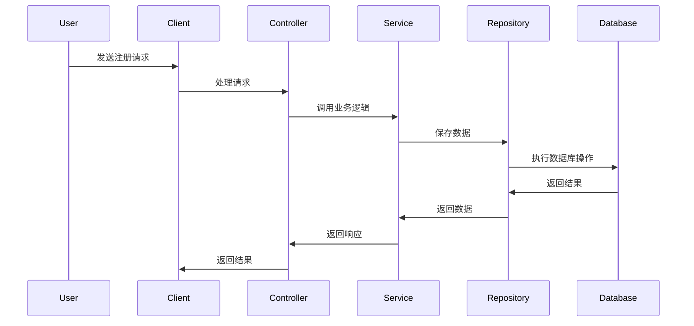
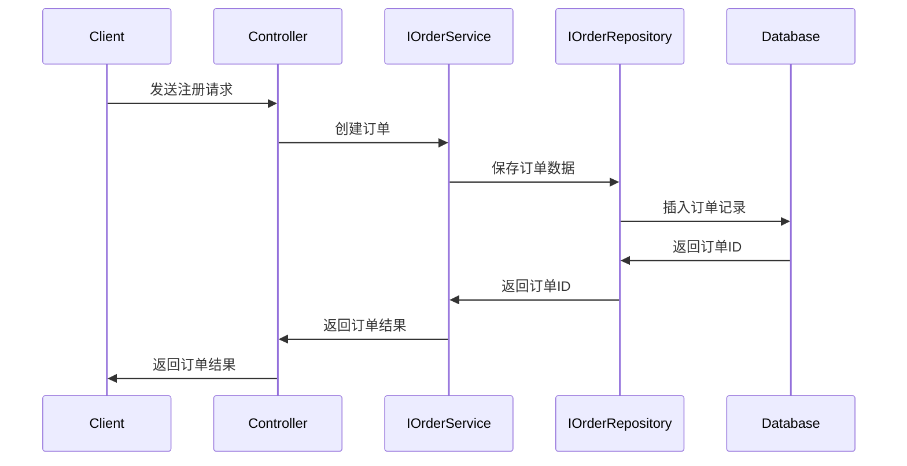

                 

# 类型系统在领域建模中的应用

## 关键词

类型系统、领域建模、面向对象编程、编程语言、安全性、性能优化

## 摘要

本文旨在探讨类型系统在领域建模中的应用，详细介绍了类型系统的核心概念、领域建模的基本构建以及类型系统与面向对象编程、编程语言的关系。通过分析类型系统的安全性和性能优化，以及最佳实践，为读者提供了全面且深入的指导。

## 引言

### 1.1.1 领域建模的概念

领域建模是软件开发过程中的一种重要方法，旨在将实际问题域中的业务需求抽象成计算机可以理解和处理的模型。领域建模的目标是建立一套清晰、一致、可复用的模型，帮助开发人员更好地理解和实现业务需求。

### 1.1.2 类型系统的概念

类型系统是编程语言中的一种重要组成部分，用于定义数据类型及其相互关系。类型系统的主要目的是提高代码的可读性、可维护性和正确性。在领域建模中，类型系统可以帮助我们更好地组织和理解领域模型中的数据。

### 1.1.3 领域建模与类型系统的关系

领域建模和类型系统之间存在着紧密的联系。类型系统为领域建模提供了数据类型和约束，使得领域模型更加清晰和一致。同时，领域建模为类型系统提供了实际应用场景，使得类型系统在解决实际问题中发挥更大的作用。

## 类型系统的核心概念

### 2.1.1 基本类型与复合类型

基本类型是指编程语言中直接支持的数据类型，如整数、浮点数、布尔值等。复合类型则是由基本类型组合而成的数据类型，如数组、结构体、类等。

### 2.1.2 类型层次结构

类型层次结构是指不同类型之间的继承关系。在面向对象编程中，类型层次结构使得我们可以通过继承和组合来复用代码，提高开发效率。

### 2.1.3 类型约束与泛型

类型约束是指对类型进行限制，确保类型的一致性和正确性。泛型则是一种在编译时确定类型的编程技术，使得我们可以编写更加通用和可复用的代码。

## 领域建模中的类型系统应用

### 3.1.1 领域模型的基本构建

领域模型是领域建模的核心，用于描述业务领域中的实体、关系和行为。类型系统可以帮助我们更好地定义和描述领域模型中的实体和数据。

### 3.1.2 使用类型系统增强领域模型

通过类型系统，我们可以为领域模型中的实体和数据添加约束，确保数据的一致性和正确性。此外，类型系统还可以帮助我们更好地组织和管理领域模型，提高开发效率。

### 3.1.3 实例：类型系统在金融领域建模中的应用

在金融领域，类型系统可以帮助我们定义货币、股票、债券等实体和数据类型，并添加相应的约束和操作。通过类型系统，我们可以更清晰地描述金融领域的业务规则，提高代码的可读性和可维护性。

## 类型系统与面向对象编程

### 4.1.1 面向对象编程中的类型系统

面向对象编程是一种编程范式，强调通过对象来组织代码。类型系统在面向对象编程中发挥着重要作用，用于定义对象的数据类型和接口。

### 4.1.2 类型系统的面向对象特性

类型系统具有面向对象编程的特性，如继承、多态和封装。通过类型系统，我们可以更好地实现面向对象编程的原则，提高代码的可复用性和灵活性。

### 4.1.3 类型系统的优势与实践

类型系统在面向对象编程中具有很多优势，如提高代码的可读性、可维护性和正确性。通过实际案例分析，我们可以了解类型系统在面向对象编程中的具体应用和实践。

## 类型系统与编程语言

### 5.1.1 编程语言中的类型系统

不同编程语言有不同的类型系统，如Java、C++、Python等。类型系统是编程语言的重要组成部分，对程序的正确性和性能有着重要影响。

### 5.1.2 常见编程语言中的类型系统

常见编程语言如Java、C++、Python等都有各自的类型系统。本文将详细介绍这些编程语言中的类型系统，并对比它们的特点和优缺点。

### 5.1.3 类型系统的优化与改进

类型系统在编程语言中的性能和安全性至关重要。本文将探讨类型系统的优化与改进方法，以提高编程语言的性能和安全性。

## 类型系统的安全性与性能优化

### 6.1.1 类型系统的安全性挑战

类型系统在保证程序正确性和安全性方面具有重要作用。本文将分析类型系统的安全性挑战，并提出相应的解决方案。

### 6.1.2 类型系统的性能优化

类型系统对程序的性能有着重要影响。本文将介绍类型系统的性能优化方法，以提高程序的性能和运行效率。

### 6.1.3 安全性与性能的平衡

类型系统的安全性和性能之间存在一定的权衡关系。本文将讨论如何平衡类型系统的安全性和性能，以提高程序的整体质量。

## 类型系统在领域建模中的最佳实践

### 7.1.1 设计原则与最佳实践

在领域建模中，类型系统设计需要遵循一定的原则和最佳实践。本文将介绍类型系统设计的原则和最佳实践，以提高领域模型的清晰性和一致性。

### 7.1.2 跨领域建模的类型系统应用

类型系统不仅可以应用于单一领域建模，还可以跨领域应用。本文将探讨跨领域建模的类型系统应用，以提高领域模型的复用性和一致性。

### 7.1.3 成功案例分享

本文将分享一些成功案例，展示类型系统在领域建模中的应用和实践效果。

## 小结与展望

### 8.1.1 类型系统在领域建模中的重要性

类型系统在领域建模中具有重要作用，可以提高模型的可读性、可维护性和正确性。本文总结了类型系统在领域建模中的重要性，并对未来发展方向进行了展望。

### 8.1.2 面临的挑战与未来的发展方向

类型系统在领域建模中面临许多挑战，如类型系统的优化、安全性问题等。本文讨论了这些挑战，并提出了未来的发展方向。

### 8.1.3 对读者的建议

本文对读者提出了一些建议，以帮助读者更好地理解和应用类型系统在领域建模中的应用。

作者：AI天才研究院/AI Genius Institute & 禅与计算机程序设计艺术 /Zen And The Art of Computer Programming

----------------------------------------------------------------

## 文章摘要

本文旨在探讨类型系统在领域建模中的应用，详细介绍了类型系统的核心概念、领域建模的基本构建以及类型系统与面向对象编程、编程语言的关系。通过分析类型系统的安全性和性能优化，以及最佳实践，本文为读者提供了全面且深入的指导。

## 引言

### 1.1.1 领域建模的概念

领域建模是软件开发过程中的一种重要方法，旨在将实际问题域中的业务需求抽象成计算机可以理解和处理的模型。领域建模的目标是建立一套清晰、一致、可复用的模型，帮助开发人员更好地理解和实现业务需求。

领域建模的概念源于软件工程中的“领域特定语言”（Domain-Specific Language，简称DSL）。DSL是一种专门为特定领域设计的编程语言或工具，旨在提高开发效率和代码质量。领域建模则是在DSL的基础上，通过抽象和建模，将实际问题域中的业务规则、数据结构和流程转化为计算机可以处理的模型。

在领域建模中，我们通常需要关注以下几个核心概念：

- **实体（Entity）**：领域中的关键对象，如用户、订单、产品等。实体具有独特的属性和操作。
- **关系（Relationship）**：实体之间的联系，如用户与订单之间的关系。关系可以是单向的或双向的，可以是继承、关联或聚合等。
- **服务（Service）**：领域中的操作和功能，如订单创建、用户登录等。服务通常与实体和关系密切相关。
- **规则（Rule）**：领域中的业务规则和约束，如库存量不能小于0、订单状态必须为已支付等。规则有助于确保领域模型的正确性和一致性。

领域建模的过程通常包括以下几个步骤：

1. **需求分析**：与业务专家和用户沟通，了解业务需求和规则。
2. **领域模型构建**：根据需求分析结果，构建领域模型，包括实体、关系和服务。
3. **模型验证**：验证领域模型是否满足业务需求，是否一致、完整和正确。
4. **模型优化**：根据验证结果，对领域模型进行优化，提高其可读性、可维护性和可扩展性。
5. **模型实现**：将领域模型转化为具体的编程语言代码，实现业务逻辑。

领域建模不仅有助于提高软件开发效率和代码质量，还可以帮助团队更好地理解和沟通业务需求，减少误解和冲突。

### 1.1.2 类型系统的概念

类型系统是编程语言中的一种重要组成部分，用于定义数据类型及其相互关系。类型系统的目的是提高代码的可读性、可维护性和正确性。在领域建模中，类型系统可以帮助我们更好地组织和理解领域模型中的数据。

类型系统的基本概念包括：

- **数据类型（Data Type）**：数据类型的定义和分类，如整数、浮点数、布尔值等。
- **类型层次（Type Hierarchy）**：不同类型之间的继承关系和层次结构。
- **类型约束（Type Constraint）**：对类型进行限制，确保类型的一致性和正确性。
- **类型检查（Type Checking）**：在编译或运行时对类型进行验证，确保代码的正确性。

在编程语言中，类型系统通常分为静态类型系统和动态类型系统。静态类型系统在编译时检查类型，而动态类型系统在运行时检查类型。

静态类型系统的优点包括：

- **早期错误检测**：类型检查在编译时进行，可以及时发现和修复类型错误。
- **性能优化**：编译器可以基于类型信息进行性能优化，提高程序运行效率。
- **代码可读性和可维护性**：静态类型系统使得代码更加清晰和一致，便于阅读和维护。

静态类型系统的缺点包括：

- **代码冗余**：为了满足类型检查，可能需要编写更多的类型声明和约束。
- **开发效率**：静态类型系统可能需要更长时间的编译和调试，影响开发效率。

动态类型系统的优点包括：

- **开发效率**：动态类型系统通常具有更快的编译和调试速度，提高开发效率。
- **灵活性**：动态类型系统允许更灵活的类型转换和操作，便于处理复杂场景。

动态类型系统的缺点包括：

- **运行时错误**：类型错误可能在运行时暴露，导致程序崩溃或异常行为。
- **性能影响**：动态类型系统可能需要额外的运行时检查和类型转换，影响程序性能。

在实际应用中，选择静态类型系统还是动态类型系统取决于具体需求和场景。静态类型系统更适合需要严格类型检查和性能优化的场景，而动态类型系统则更适合需要灵活性和快速开发的应用。

### 1.1.3 领域建模与类型系统的关系

领域建模和类型系统之间存在着紧密的联系。类型系统为领域建模提供了数据类型和约束，使得领域模型更加清晰和一致。同时，领域建模为类型系统提供了实际应用场景，使得类型系统在解决实际问题中发挥更大的作用。

在领域建模中，类型系统的作用主要体现在以下几个方面：

1. **数据类型的定义和分类**：类型系统可以帮助我们定义和分类领域模型中的数据类型，如整数、浮点数、字符串等。通过明确的数据类型，我们可以更好地理解和操作数据，确保代码的正确性。

2. **约束和校验**：类型系统可以为我们提供约束和校验机制，确保数据的合法性和一致性。例如，我们可以定义订单金额必须大于0，或者用户年龄必须大于18岁。类型系统可以自动检查这些约束条件，防止错误数据的出现。

3. **数据操作的规范化**：类型系统可以帮助我们规范化和统一领域模型中的数据操作。通过定义类型约束和操作接口，我们可以确保数据操作的正确性和一致性。例如，在金融领域，我们可以定义货币类型和计算规则，确保所有货币操作都符合规定。

4. **代码可维护性和可扩展性**：类型系统可以提高代码的可维护性和可扩展性。通过明确的数据类型和约束，我们可以更轻松地理解和修改代码。同时，类型系统也方便了代码的复用和扩展，使得领域模型更加灵活和可适应。

类型系统与领域建模的关系不仅限于上述几个方面。在实际开发过程中，类型系统还可以帮助我们更好地进行领域建模，提高模型的清晰性和一致性。通过合理利用类型系统，我们可以构建更加健壮和可靠的领域模型，为软件开发提供有力支持。

总之，领域建模和类型系统是相辅相成的。领域建模为类型系统提供了实际应用场景，而类型系统则为领域建模提供了数据类型和约束。通过合理利用类型系统，我们可以更好地进行领域建模，提高代码的可读性、可维护性和正确性。在接下来的章节中，我们将进一步探讨类型系统的核心概念、领域建模的构建方法以及类型系统与面向对象编程、编程语言的关系，帮助读者更深入地理解类型系统在领域建模中的应用。

## 类型系统的核心概念

### 2.1.1 基本类型与复合类型

类型系统是编程语言的基础，而基本类型和复合类型则是类型系统的两个核心组成部分。基本类型是编程语言直接支持的简单数据类型，而复合类型则是由基本类型组合而成的复杂数据类型。理解基本类型和复合类型的概念及其关系对于深入掌握类型系统至关重要。

#### 基本类型

基本类型通常包括以下几类：

1. **数值类型**：如整数（int）、浮点数（float或double）、复数（complex）等。
2. **布尔类型**：如布尔值（bool），用于表示逻辑真或假。
3. **字符类型**：如字符（char），用于表示单个字符。
4. **枚举类型**：如枚举（enum），用于定义一组命名常量。

每种基本类型都有其特定的用途和特点。例如，整数类型常用于表示整数数值，浮点数类型用于表示带有小数点的数值，布尔类型用于逻辑判断，字符类型用于处理文本数据，枚举类型则用于定义一组具有明确意义的常量。

#### 复合类型

复合类型是由基本类型组合而成的复杂数据类型，常见的复合类型包括：

1. **数组**：数组是一种存储多个相同类型数据元素的集合。数组可以通过索引来访问和修改其元素。
2. **结构体**：结构体是一种由多个不同类型的数据成员组成的复合数据类型。结构体可以用于表示复杂的对象或记录。
3. **类**：类是一种用于定义对象的蓝图，可以包含数据成员（属性）和方法（操作）。类是实现面向对象编程的基础。
4. **接口**：接口是一种定义方法签名的抽象数据类型，用于实现多态性和代码复用。

复合类型使得我们可以创建更复杂和具有复用性的数据结构。例如，我们可以使用数组来存储大量数据，使用结构体来表示复杂的对象，使用类来实现面向对象的特性，使用接口来定义公共的行为规范。

#### 基本类型与复合类型的联系

基本类型和复合类型之间有着紧密的联系。复合类型通常由基本类型构成，例如，一个结构体可以包含多个基本类型的数据成员，一个类可以包含多个属性（基本类型）和方法（函数）。同时，复合类型也可以用作基本类型的容器或容器类型，例如，数组可以存储基本类型的值，类可以包含基本类型的数据成员。

在编程实践中，合理使用基本类型和复合类型可以使得代码更加清晰、结构更加合理。基本类型通常用于表示简单数据，而复合类型则用于表示复杂的数据结构和对象。通过合理组合基本类型和复合类型，我们可以构建出具有复用性和扩展性的类型系统。

### 2.1.2 类型层次结构

类型层次结构是指不同类型之间的继承关系和层次结构。类型层次结构在面向对象编程中具有重要意义，它使得我们可以通过继承和组合来复用代码，提高开发效率。类型层次结构通常由一个根类型（如Object或System.Object）和多个子类型组成。

#### 类型层次结构的概念

类型层次结构的概念可以类比为生物分类学中的分类体系。在生物分类学中，生物体被分类为不同级别的类别，如门、纲、目、科、属、种等。类似地，在类型层次结构中，每个类型都是其父类型的子类型，同时也可能是其他子类型的父类型。

#### 继承

继承是一种通过父类型创建子类型的过程。子类型继承了父类型的属性和方法，并可以扩展或修改这些属性和方法。继承使得我们可以将通用的属性和方法抽象到父类型中，然后在子类型中实现具体的实现细节。继承是一种实现代码复用的重要机制。

例如，在Java中，我们可以定义一个Animal类作为根类型，然后创建子类如Dog和Cat，这些子类继承了Animal类的属性和方法。通过继承，我们可以编写通用的动物行为，然后在具体的子类中实现这些行为。

#### 多态

多态是一种通过子类型实现不同父类型的方法的过程。多态使得我们可以使用统一的接口来处理不同类型的对象。在运行时，程序可以根据对象的实际类型来调用相应的实现方法。

例如，在C++中，我们可以定义一个Shape类，然后创建子类如Circle和Rectangle。Shape类有一个draw()方法，而Circle和Rectangle类分别实现自己的draw()方法。在程序中，我们可以使用Shape类型的指针来指向Circle或Rectangle对象，并通过调用draw()方法来绘制具体的图形。运行时，程序会根据对象的实际类型来调用相应的draw()方法。

#### 类型层次结构的优势

类型层次结构具有以下几个优势：

1. **代码复用**：通过继承，我们可以将通用的属性和方法抽象到父类型中，然后在子类型中实现具体的实现细节，从而减少冗余代码。
2. **可扩展性**：类型层次结构使得我们可以方便地添加新的子类型，扩展现有功能。
3. **灵活性**：多态使得我们可以使用统一的接口来处理不同类型的对象，提高了程序的灵活性和可维护性。

#### 类型层次结构的挑战

类型层次结构也存在一些挑战：

1. **紧耦合**：继承可能导致类型之间的紧耦合，使得修改父类型时可能会影响子类型。
2. **过度设计**：过度使用继承可能导致类型层次结构过于复杂，难以维护和理解。
3. **性能开销**：多态在运行时会增加一定的性能开销，尤其是在动态类型检查和类型转换时。

在实际开发中，我们需要权衡类型层次结构带来的好处和挑战，合理使用继承和多态，以提高代码的质量和可维护性。

### 2.1.3 类型约束与泛型

类型约束和泛型是类型系统中的两个重要概念，它们在提高代码的可读性、可维护性和灵活性方面发挥着重要作用。

#### 类型约束

类型约束是一种在编译时对类型进行限制的机制。通过类型约束，我们可以确保变量、方法参数和返回值等类型的一致性和正确性。类型约束通常用于泛型编程、接口定义和类成员的限制。

例如，在Java中，我们可以定义一个类型约束的接口，如List<T>，其中T表示一个类型参数。这个接口定义了一个泛型方法add(T element)，用于将元素添加到列表中。通过类型约束，我们可以确保add()方法的参数类型与List<T>的类型参数T相匹配。

类型约束的优势包括：

1. **提高代码的可读性**：类型约束使得代码中的类型信息更加明确，便于阅读和理解。
2. **增强代码的健壮性**：类型约束可以在编译时检测类型错误，防止运行时异常。
3. **提高代码的可维护性**：通过类型约束，我们可以更容易地修改和扩展代码，而无需担心类型错误。

类型约束的挑战包括：

1. **代码冗余**：为了满足类型约束，可能需要编写更多的类型声明和注释。
2. **开发效率**：在某些情况下，编写类型约束代码可能需要更多的时间和精力，影响开发效率。

#### 泛型

泛型是一种在编译时确定类型的编程技术，使得我们可以编写更加通用和可复用的代码。泛型通过类型参数来抽象数据类型，使得同一套代码可以应用于多种类型。

泛型的优势包括：

1. **代码复用**：通过泛型，我们可以编写通用的数据结构和算法，而不需要为每种类型编写单独的代码。
2. **代码可读性**：泛型使得代码中的类型信息更加明确，便于阅读和理解。
3. **性能优化**：泛型可以使得编译器生成更高效的代码，提高程序的运行效率。

泛型的挑战包括：

1. **类型检查复杂度**：泛型可能会导致类型检查变得复杂，使得代码难以理解和维护。
2. **类型擦除**：泛型在运行时会被类型擦除，导致某些类型信息无法在运行时访问。

在实际开发中，我们需要权衡类型约束和泛型的优缺点，根据具体需求选择合适的类型系统。合理使用类型约束和泛型可以提高代码的质量和可维护性，提高开发效率。

### 2.1.4 类型系统的应用实例

类型系统在编程语言中得到了广泛应用，以下是一些典型的应用实例：

1. **数据结构**：类型系统使得我们可以定义和操作各种数据结构，如数组、列表、树和图等。通过类型系统，我们可以确保数据结构的类型一致性，避免运行时错误。

2. **函数和过程**：类型系统可以帮助我们定义函数和过程的参数类型和返回值类型。通过类型系统，我们可以确保函数和过程之间的类型匹配，提高代码的正确性和可维护性。

3. **接口和类**：类型系统使得我们可以定义接口和类，并指定其成员的类型。通过类型系统，我们可以确保接口和类之间的类型一致性，提高代码的抽象层次和可复用性。

4. **泛型和模板**：泛型和模板是类型系统的两个重要扩展，使得我们可以编写更加通用和可复用的代码。通过泛型和模板，我们可以实现各种高级编程模式，如单例模式、工厂模式和适配器模式等。

5. **类型检查和验证**：类型系统在编译时进行类型检查和验证，确保代码的正确性和一致性。通过类型系统，我们可以提前发现和修复类型错误，提高代码的质量和可维护性。

类型系统的应用实例不仅限于上述几个方面，它在各种编程语言和开发场景中都发挥着重要作用。通过合理使用类型系统，我们可以提高代码的质量和可维护性，提高开发效率。

### 2.1.5 类型系统的设计原则

类型系统的设计原则是确保类型系统合理、一致和高效的关键。以下是一些常见的类型系统设计原则：

1. **简洁性**：类型系统应该尽量简洁，避免过多的复杂性和冗余。简洁的类型系统易于理解、学习和使用，降低开发成本和维护难度。

2. **一致性**：类型系统应该保持一致性，确保不同类型之间的转换和操作符合预期。类型一致性可以提高代码的可读性和可维护性，减少错误和冲突。

3. **可扩展性**：类型系统应该具备良好的可扩展性，便于添加新的类型和功能。可扩展的类型系统可以适应不断变化的需求，提高系统的灵活性和适应性。

4. **安全性**：类型系统应该提供安全机制，确保类型错误和非法操作在编译时或运行时得到检测和报告。类型安全性可以防止运行时错误和崩溃，提高系统的稳定性和可靠性。

5. **性能优化**：类型系统应该考虑性能优化，提高编译和运行效率。性能优化的类型系统可以减少编译时间、内存占用和运行时开销，提高系统的响应速度和性能。

6. **可读性**：类型系统应该具有良好的可读性，使得代码中的类型信息清晰明确，便于阅读和理解。类型系统的可读性可以提高代码的可维护性和团队合作效率。

7. **灵活性**：类型系统应该具备一定的灵活性，允许自定义和扩展类型系统。灵活的类型系统可以适应不同的编程范式和需求，提高代码的适应性和可复用性。

8. **抽象层次**：类型系统应该提供适当的抽象层次，使得开发者可以在不同层次上进行编程。适当的抽象层次可以提高代码的模块化和可维护性，降低系统的复杂度。

9. **文档和注释**：类型系统应该提供充分的文档和注释，帮助开发者理解类型系统的设计和实现。文档和注释可以提高代码的可读性和可维护性，降低学习和使用成本。

10. **社区和标准**：类型系统应该遵循社区和标准，确保类型系统的兼容性和可互操作性。社区和标准可以促进类型系统的共享和协作，提高类型系统的质量和影响力。

通过遵循这些设计原则，我们可以构建出合理、一致、高效和灵活的类型系统，提高代码的质量和可维护性，促进软件开发的顺利进行。

### 2.1.6 类型系统的历史与发展

类型系统在计算机科学的发展历程中扮演了重要角色。从早期的编程语言到现代的编程语言，类型系统经历了多个阶段的发展和演变。以下是类型系统的发展历史及其对领域建模的影响：

1. **早期编程语言**：在早期编程语言如Fortran、COBOL和PL/I中，类型系统相对简单，主要提供基本的数据类型如整数、浮点数和字符。这些类型系统主要用于科学计算和商业应用，类型系统的主要目标是提高代码的可读性和可维护性。

2. **面向过程编程**：在面向过程编程语言如Pascal和C中，类型系统得到了进一步发展。这些语言引入了用户定义类型（如结构体和联合体）和类型转换（如强制类型转换）。类型系统在面向过程编程中发挥了重要作用，提高了代码的模块化和可复用性。

3. **面向对象编程**：面向对象编程语言的兴起如Java、C++和Python，引入了更加丰富的类型系统。这些语言支持抽象数据类型、继承和多态等面向对象特性。类型系统在面向对象编程中发挥了关键作用，提高了代码的可维护性和可扩展性。

4. **泛型和模板**：泛型和模板在C++和Java等编程语言中得到了广泛应用。泛型允许我们编写通用的代码，而不需要为每种数据类型编写单独的实现。模板则是一种通过类型参数来参数化代码的技术。泛型和模板的引入使得类型系统更加灵活和强大。

5. **函数式编程和类型系统**：函数式编程语言如Haskell和Scala，引入了更严格的类型系统和类型推导机制。这些语言强调函数作为主要的数据结构和计算方式，类型系统在函数式编程中发挥了关键作用，提高了代码的纯度和安全性。

6. **类型系统的发展趋势**：随着编程语言和软件开发技术的发展，类型系统也在不断演进。现代类型系统越来越注重安全性、性能和灵活性。类型系统的最新趋势包括静态类型检查、动态类型检查、类型推导、类型安全性和跨语言互操作性等。

类型系统在领域建模中的应用：

- **数据类型定义**：类型系统可以帮助我们定义领域模型中的数据类型，如订单、用户、产品等。通过明确的数据类型，我们可以更好地组织和处理数据，确保数据的正确性和一致性。

- **类型约束和校验**：类型系统可以为我们提供约束和校验机制，确保领域模型中的数据满足业务规则和约束条件。例如，我们可以定义订单金额必须大于0，或者用户年龄必须大于18岁。类型系统可以自动检查这些约束条件，防止错误数据的出现。

- **类型层次和继承**：类型系统可以定义类型层次结构，使得领域模型中的实体和数据类型具有继承关系。通过继承，我们可以将通用的属性和方法抽象到父类型中，然后在子类型中实现具体的实现细节。类型层次结构有助于提高代码的可维护性和可扩展性。

- **泛型和模板**：泛型和模板使得我们可以编写通用的领域模型代码，而无需为每种数据类型编写单独的实现。通过泛型，我们可以定义通用的数据结构和算法，提高代码的复用性和可维护性。模板则可以用于实现复杂数据结构和算法，提高代码的灵活性和可扩展性。

总之，类型系统在领域建模中具有重要意义。通过合理利用类型系统，我们可以构建出更加清晰、一致和可维护的领域模型，提高软件开发效率和质量。

## 领域建模中的类型系统应用

### 3.1.1 领域模型的基本构建

在领域建模中，构建一个清晰、一致的领域模型是至关重要的。领域模型的基本构建包括定义实体、关系和服务。这些元素共同构成了领域模型的核心结构，为后续的开发提供了基础。

#### 实体（Entities）

实体是领域模型中的关键对象，代表了业务领域中的核心实体。例如，在电子商务系统中，实体可能包括用户、订单、商品等。每个实体都具有独特的属性和操作。

- **用户（User）**：用户实体可能包含属性如用户名、密码、电子邮件、年龄等，以及操作如登录、注册、修改个人信息等。
- **订单（Order）**：订单实体可能包含属性如订单号、订单状态、订单日期、总价等，以及操作如创建订单、取消订单、修改订单等。
- **商品（Product）**：商品实体可能包含属性如产品ID、名称、价格、库存量等，以及操作如添加商品、更新商品信息、删除商品等。

#### 关系（Relationships）

关系描述了实体之间的联系。在领域建模中，常见的关系包括一对一、一对多、多对多等。

- **一对一关系**：例如，一个订单仅对应一个用户，一个用户仅对应一个地址。
- **一对多关系**：例如，一个用户可以创建多个订单，一个订单可以包含多个商品。
- **多对多关系**：例如，一个商品可以被多个订单包含，一个订单可以包含多个商品。

#### 服务（Services）

服务是领域模型中的操作和功能，用于实现实体之间的业务逻辑。服务通常与实体和关系密切相关。

- **用户服务（UserService）**：提供用户注册、登录、信息修改等操作。
- **订单服务（OrderService）**：提供创建订单、取消订单、修改订单状态等操作。
- **商品服务（ProductService）**：提供商品添加、更新、删除等操作。

在构建领域模型时，我们还需要关注以下方面：

- **一致性**：确保实体、关系和服务的定义一致，避免出现矛盾或冲突。
- **抽象性**：提取通用的实体、关系和服务，降低模型的复杂性。
- **可扩展性**：设计模型时考虑未来的扩展性，以便在需求变化时能够轻松修改。

#### 实例：电子商务领域模型

以下是一个简单的电子商务领域模型示例：

```mermaid
classDiagram
    User --> Order : "1"
    Order --> Product : "many"
    User << (User)
    Order << (Order)
    Product << (Product)

    User {
        -id: Integer
        -username: String
        -password: String
        -email: String
        -age: Integer
        +login(): Void
        +register(): Void
        +updateInfo(): Void
    }

    Order {
        -id: Integer
        -status: String
        -date: Date
        -total: Float
        +createOrder(): Void
        +cancelOrder(): Void
        +updateStatus(): Void
    }

    Product {
        -id: Integer
        -name: String
        -price: Float
        -stock: Integer
        +addProduct(): Void
        +updateInfo(): Void
        +deleteProduct(): Void
    }
```

在这个示例中，我们定义了用户（User）、订单（Order）和商品（Product）三个实体，以及它们之间的一对一、一对多关系。用户可以创建订单，订单可以包含多个商品。每个实体都有相应的属性和操作。

### 3.1.2 使用类型系统增强领域模型

类型系统在领域建模中发挥着重要作用，可以帮助我们更好地定义和描述领域模型中的实体和数据。通过类型系统，我们可以实现以下几个方面的增强：

1. **数据类型的明确性**：类型系统使得我们可以明确地定义实体和数据类型的属性，确保数据的一致性和正确性。例如，用户实体的ID属性可以是整数类型，订单实体的总价属性可以是浮点数类型。

2. **类型约束**：类型系统可以为我们提供类型约束，确保数据满足业务规则和约束条件。例如，订单状态可以是“创建中”、“已支付”、“已发货”等，确保订单状态的合法性和一致性。

3. **数据操作的一致性**：类型系统可以帮助我们规范化和统一领域模型中的数据操作。通过定义类型约束和操作接口，我们可以确保数据操作的正确性和一致性。例如，在订单服务中，创建订单的方法需要传递订单的ID、状态、日期等属性，确保创建订单的操作符合预期。

4. **类型安全的接口设计**：类型系统可以用于设计类型安全的接口，使得开发者可以更加明确地理解和使用接口。例如，在用户服务中，我们可以定义一个登录接口，要求传递用户名和密码作为参数，确保登录操作的类型安全。

5. **代码的可维护性和可扩展性**：类型系统可以提高代码的可维护性和可扩展性。通过明确的数据类型和约束，我们可以更轻松地理解和修改代码。同时，类型系统也方便了代码的复用和扩展，使得领域模型更加灵活和可适应。

#### 实例：类型系统在电子商务领域建模中的应用

以下是一个使用类型系统增强电子商务领域模型的示例：

```mermaid
classDiagram
    User --> Order : "1"
    Order --> Product : "many"
    User << (User)
    Order << (Order)
    Product << (Product)

    User {
        -id: Integer
        -username: String
        -password: String
        -email: String
        -age: Integer
        +login(username: String, password: String): Bool
        +register(username: String, password: String, email: String, age: Integer): Void
        +updateInfo(username: String, email: String, age: Integer): Void
    }

    Order {
        -id: Integer
        -status: Enum("创建中", "已支付", "已发货")
        -date: Date
        -total: Float
        +createOrder(products: List[Product], total: Float): Void
        +cancelOrder(): Void
        +updateStatus(status: Enum): Void
    }

    Product {
        -id: Integer
        -name: String
        -price: Float
        -stock: Integer
        +addProduct(name: String, price: Float, stock: Integer): Void
        +updateInfo(id: Integer, name: String, price: Float, stock: Integer): Void
        +deleteProduct(id: Integer): Void
    }
```

在这个示例中，我们为用户（User）、订单（Order）和商品（Product）实体添加了类型约束。例如，订单状态（status）被定义为枚举类型，以确保订单状态只能是“创建中”、“已支付”或“已发货”。通过类型系统，我们可以确保数据的一致性和正确性，提高领域模型的可维护性和可扩展性。

### 3.1.3 实例：类型系统在金融领域建模中的应用

金融领域建模涉及大量的数据类型和复杂的关系，类型系统在这里尤为重要。以下是一个金融领域建模的实例，展示了如何使用类型系统来增强模型的清晰性和一致性。

#### 实体

在金融领域，常见的实体包括账户（Account）、交易（Transaction）、客户（Customer）等。

- **账户（Account）**：包含客户的账户信息，如账号、余额、账户类型等。
- **交易（Transaction）**：代表账户之间的资金转移，如转账、支付、提现等。
- **客户（Customer）**：包含客户的个人信息，如姓名、地址、身份证号等。

#### 关系

金融领域中的关系包括账户与客户之间的关联、交易与账户之间的关联等。

- **账户与客户**：一个客户可以拥有多个账户，一个账户仅属于一个客户。
- **交易与账户**：一笔交易可以涉及多个账户，每个账户可以是交易的资金来源或接收方。

#### 类型系统应用

在金融领域建模中，类型系统可以帮助我们定义以下方面：

1. **数据类型**：为实体和属性定义明确的数据类型，如账号（String）、余额（Decimal）、交易金额（Decimal）等。
2. **约束**：为实体和属性添加约束，如账户余额不能为负数、身份证号格式必须正确等。
3. **类型安全**：确保交易金额等关键属性的类型安全，防止非法操作。

#### 实例

以下是一个简化的金融领域模型示例：

```mermaid
classDiagram
    Customer "1" --|{关联}| Account
    Account "1" --|{关联}| Transaction
    Customer << (Customer)
    Account << (Account)
    Transaction << (Transaction)

    Customer {
        -id: String
        -name: String
        -address: String
        -idCard: String
        +getAccounts(): List[Account]
    }

    Account {
        -id: String
        -customerId: String
        -balance: Decimal
        -type: Enum("储蓄", "信用卡", "贷款")
        +deposit(amount: Decimal): Void
        +withdraw(amount: Decimal): Void
        +getTransactions(): List[Transaction]
    }

    Transaction {
        -id: String
        -accountId: String
        -amount: Decimal
        -status: Enum("成功", "失败")
        -date: Date
        +execute(): Void
    }
```

在这个示例中，我们为账户（Account）定义了余额（balance）和账户类型（type），为交易（Transaction）定义了金额（amount）和状态（status）。通过类型系统，我们确保了数据的类型安全和一致性。

### 3.1.4 类型系统在领域建模中的重要性

类型系统在领域建模中具有至关重要的作用。它不仅为领域模型提供了数据类型的定义和约束，还帮助我们在设计和开发过程中提高代码的可读性、可维护性和正确性。

1. **数据类型的明确性**：类型系统使得我们可以明确地定义领域模型中的实体和属性的数据类型，确保数据的正确性和一致性。通过明确的数据类型，开发者可以更加清晰地理解和操作数据，减少错误和混淆。

2. **约束和校验**：类型系统可以为我们提供约束和校验机制，确保领域模型中的数据满足业务规则和约束条件。通过类型约束，我们可以定义如账户余额不能为负数、身份证号格式必须正确等规则，从而提高数据的合法性和一致性。

3. **代码可维护性**：类型系统可以提高代码的可维护性。通过明确的数据类型和约束，我们可以更轻松地理解和修改代码，确保代码的健壮性和一致性。类型系统也方便了代码的复用和扩展，使得领域模型更加灵活和可适应。

4. **类型安全**：类型系统提供了类型安全机制，确保在编译时或运行时发现类型错误，防止非法操作和运行时异常。通过类型安全，我们可以提高代码的质量和可靠性，减少维护成本。

5. **抽象和封装**：类型系统支持抽象和封装，使得我们可以将复杂的领域模型分解为更小的、可管理的部分。通过抽象和封装，我们可以提高代码的模块化和可复用性，减少系统的复杂度。

6. **一致性**：类型系统有助于保持领域模型的一致性。通过类型约束和类型检查，我们可以确保实体、关系和服务的定义一致，避免出现矛盾或冲突。一致性有助于提高代码的可读性和可维护性。

7. **性能优化**：类型系统可以支持性能优化。在静态类型语言中，类型信息可以在编译时用于生成更高效的代码。通过类型优化，我们可以提高程序的运行效率和性能。

总之，类型系统在领域建模中扮演着关键角色。通过合理利用类型系统，我们可以构建出更加清晰、一致、可维护和可靠的领域模型，提高软件开发效率和质量。类型系统的应用不仅有助于提高代码的可读性和可维护性，还可以确保数据的正确性和一致性，减少错误和冲突。在接下来的章节中，我们将进一步探讨类型系统与面向对象编程、编程语言的关系，以及类型系统的安全性和性能优化，帮助读者更深入地理解类型系统在领域建模中的应用。

### 3.1.5 类型系统与面向对象编程的关系

类型系统与面向对象编程（Object-Oriented Programming，OOP）密切相关。面向对象编程强调通过对象来组织代码，而类型系统为对象提供了数据类型的定义和约束。在本节中，我们将探讨类型系统与面向对象编程之间的关系，以及如何利用类型系统实现面向对象编程的原则。

#### 面向对象编程的基本概念

面向对象编程是一种编程范式，通过对象来组织代码。对象是面向对象编程中的核心概念，具有以下基本特性：

1. **封装（Encapsulation）**：封装是将对象的内部实现细节隐藏起来，仅暴露必要的接口。通过封装，我们可以确保对象的内部实现不会受到外部干扰，提高代码的可维护性和可复用性。

2. **继承（Inheritance）**：继承是一种通过父类型创建子类型的过程。子类型继承了父类型的属性和方法，并可以扩展或修改这些属性和方法。继承使得我们可以将通用的属性和方法抽象到父类型中，然后在子类型中实现具体的实现细节，实现代码的复用。

3. **多态（Polymorphism）**：多态是一种通过子类型实现不同父类型的方法的过程。多态使得我们可以使用统一的接口来处理不同类型的对象。在运行时，程序可以根据对象的实际类型来调用相应的实现方法。

4. **接口（Interface）**：接口是一种定义方法签名的抽象数据类型，用于实现多态性和代码复用。接口定义了一组方法，但没有具体的实现细节。通过实现接口，我们可以确保不同类型的对象具有相同的方法签名，从而实现多态。

#### 类型系统在面向对象编程中的作用

类型系统在面向对象编程中发挥着关键作用，为对象提供了数据类型的定义和约束。以下是类型系统在面向对象编程中的几个重要作用：

1. **数据类型的定义**：类型系统可以帮助我们定义对象的数据类型，如整数、浮点数、布尔值等。通过明确的数据类型，我们可以更好地理解和操作对象的数据，确保代码的正确性。

2. **类型约束**：类型系统可以为我们提供类型约束，确保对象属性和方法的一致性和正确性。通过类型约束，我们可以确保对象属性的数据类型符合预期，防止非法操作和运行时错误。

3. **类型安全**：类型系统提供了类型安全机制，确保在编译时或运行时发现类型错误，防止非法操作和运行时异常。通过类型安全，我们可以提高代码的质量和可靠性，减少维护成本。

4. **代码可读性**：类型系统可以提高代码的可读性。通过明确的数据类型和类型约束，我们可以更轻松地理解和修改代码，确保代码的一致性和可维护性。

5. **接口设计**：类型系统可以帮助我们设计类型安全的接口。接口定义了一组方法，但没有具体的实现细节。通过接口，我们可以确保不同类型的对象具有相同的方法签名，从而实现多态。类型系统可以确保接口的实现符合预期，提高代码的复用性和可维护性。

#### 实例：类型系统在面向对象编程中的应用

以下是一个使用Python实现面向对象编程的示例，展示了类型系统的作用：

```python
# 定义一个基类
class Animal:
    def __init__(self, name):
        self.name = name

    def eat(self):
        pass

# 定义一个子类
class Dog(Animal):
    def eat(self):
        print(f"{self.name}正在吃骨头。")

# 定义一个子类
class Cat(Animal):
    def eat(self):
        print(f"{self.name}正在吃鱼。")

# 使用类型系统实现多态
def feed_animal(animal: Animal):
    animal.eat()

# 创建对象
dog = Dog("旺财")
cat = Cat("汤姆")

# 调用方法
feed_animal(dog)
feed_animal(cat)
```

在这个示例中，我们定义了一个基类`Animal`和两个子类`Dog`和`Cat`。每个类都有`eat`方法，但具体实现不同。通过类型系统，我们确保了`feed_animal`函数接收的是`Animal`类型的参数，并在运行时根据对象的实际类型调用相应的`eat`方法。这样，我们就可以通过统一的接口处理不同类型的对象，实现多态。

#### 类型系统与面向对象编程的优势

类型系统与面向对象编程的结合，为我们带来了以下几个优势：

1. **代码复用**：通过继承和接口，我们可以将通用的属性和方法抽象到基类和接口中，实现代码的复用。类型系统确保了基类和接口的实现符合预期，提高了代码的可复用性。

2. **代码可维护性**：类型系统可以提高代码的可维护性。通过明确的数据类型和类型约束，我们可以更轻松地理解和修改代码，确保代码的一致性和可维护性。类型系统也方便了代码的复用和扩展，使得领域模型更加灵活和可适应。

3. **代码可靠性**：类型系统提供了类型安全机制，确保在编译时或运行时发现类型错误，防止非法操作和运行时异常。通过类型安全，我们可以提高代码的质量和可靠性，减少维护成本。

4. **代码可读性**：类型系统可以提高代码的可读性。通过明确的数据类型和类型约束，我们可以更轻松地理解和修改代码，确保代码的一致性和可维护性。

5. **性能优化**：类型系统可以支持性能优化。在静态类型语言中，类型信息可以在编译时用于生成更高效的代码。通过类型优化，我们可以提高程序的运行效率和性能。

总之，类型系统与面向对象编程的结合，为软件开发带来了诸多好处。通过合理利用类型系统和面向对象编程的原则，我们可以构建出更加清晰、一致、可维护和可靠的代码。在接下来的章节中，我们将进一步探讨类型系统与编程语言的关系，以及类型系统的安全性和性能优化，帮助读者更深入地理解类型系统在软件开发中的应用。

### 3.1.6 类型系统与编程语言的关系

类型系统是编程语言的核心组成部分，它不仅决定了程序的正确性和性能，还直接影响着开发者的编程体验和代码的可维护性。不同的编程语言有不同的类型系统，这些类型系统的设计和实现方式决定了语言的特点和适用场景。在本节中，我们将探讨类型系统与编程语言的关系，分析常见编程语言中的类型系统，并讨论类型系统的优化与改进。

#### 常见编程语言中的类型系统

1. **Java**

Java是一种静态类型语言，其类型系统以强类型检查和面向对象编程为特点。Java的类型系统包括以下几类基本类型：

- **数值类型**：如int、float、double等。
- **布尔类型**：boolean。
- **引用类型**：如String、Object等。

Java的类型系统支持泛型，通过泛型可以定义参数化类型，提高代码的复用性和可维护性。泛型在编译时进行类型检查，确保类型安全。Java的类型系统还支持类型转换，包括自动转换和显式转换。

2. **C++**

C++是一种多范式编程语言，其类型系统支持面向对象编程、过程式编程和函数式编程。C++的类型系统包括基本类型和用户定义类型：

- **基本类型**：如int、float、double等。
- **用户定义类型**：如结构体、类、联合体等。

C++的类型系统支持模板，通过模板可以定义泛型代码。模板在编译时进行实例化，生成特定类型的代码。C++的类型系统还支持类型转换，包括隐式转换和显式转换。

3. **Python**

Python是一种动态类型语言，其类型系统较为灵活。Python的类型系统在运行时进行类型检查，通过鸭子类型（duck typing）实现类型安全。Python的类型系统包括以下几类类型：

- **内置类型**：如int、float、bool、str等。
- **用户定义类型**：如类。

Python的类型系统支持类型注释，通过类型注释可以在代码中明确指定变量和函数的预期类型，提高代码的可读性和可维护性。

4. **Haskell**

Haskell是一种函数式编程语言，其类型系统强调类型推导和类型安全。Haskell的类型系统在编译时进行类型检查，通过类型类和类型约束实现多态性。Haskell的类型系统包括以下几类类型：

- **基础类型**：如Int、Float、Bool等。
- **复合类型**：如列表（List）、元组（Tuple）等。
- **类型类**：如Num、Eq等。

Haskell的类型系统支持类型推导，通过类型推导可以减少类型声明的复杂性。类型推导使得编写函数时无需显式指定类型参数，编译器可以自动推导出函数的参数和返回值类型。

#### 类型系统的优化与改进

类型系统的优化与改进是提高编程语言性能和开发者体验的关键。以下是一些常见的优化与改进方法：

1. **类型推导**：类型推导是一种自动推导变量和函数类型的方法，减少开发者的负担，提高代码的可读性。例如，Python和Haskell都支持类型推导，使得编写函数时无需显式指定类型参数。

2. **类型检查优化**：类型检查是确保程序正确性的关键步骤。通过优化类型检查算法，可以减少编译时间和运行时开销。例如，静态类型语言可以通过中间代码生成和优化来提高类型检查的效率。

3. **类型安全性**：类型安全性是指确保程序在运行时不会发生类型错误。通过引入类型约束和类型检查机制，可以确保类型安全。例如，Java和C++都通过静态类型检查来保证类型安全。

4. **类型转换优化**：类型转换是编程中常见的操作，通过优化类型转换算法，可以减少运行时开销。例如，动态类型语言可以通过改进类型转换策略来提高性能。

5. **泛型编程**：泛型编程是一种通过类型参数来参数化代码的方法，提高代码的复用性和可维护性。通过优化泛型编程机制，可以减少类型擦除和运行时开销。

6. **多态优化**：多态是一种通过子类型实现不同父类型的方法的过程。通过优化多态机制，可以提高程序的运行效率和性能。

7. **类型检查与性能优化**：在静态类型语言中，类型检查通常在编译时进行。通过优化类型检查算法和中间代码生成，可以提高编译效率和程序性能。

总之，类型系统与编程语言密切相关，不同的类型系统决定了语言的特点和适用场景。通过优化和改进类型系统，可以提高编程语言的性能和开发者体验。在接下来的章节中，我们将进一步探讨类型系统的安全性和性能优化，以及最佳实践，帮助读者更深入地理解类型系统在领域建模中的应用。

### 3.1.7 类型系统的安全性挑战

类型系统的安全性是指确保程序在运行时不会发生类型错误，避免非法操作和潜在的安全漏洞。虽然类型系统在很多方面提高了代码的正确性和健壮性，但在实际应用中仍然面临一些安全性挑战。以下是类型系统在安全性方面面临的主要问题和解决方法：

1. **类型错误**：类型错误是指程序在运行时出现了类型不匹配的错误。类型错误可能导致程序崩溃或产生意外的结果。例如，将一个字符串强制转换为整数可能会引发类型错误。解决类型错误的方法包括：

   - **严格的类型检查**：通过严格的类型检查，在编译时或运行时检测类型错误，防止类型错误发生。
   - **类型约束**：为变量和方法添加类型约束，确保变量和方法之间的类型匹配。
   - **类型安全操作**：设计类型安全的操作，避免非法类型操作。

2. **类型转换漏洞**：类型转换漏洞是指程序在类型转换过程中可能出现的漏洞。类型转换漏洞可能导致缓冲区溢出、数据破坏和程序崩溃。解决类型转换漏洞的方法包括：

   - **边界检查**：在类型转换过程中进行边界检查，确保转换后的数据在合法范围内。
   - **安全库**：使用安全库来处理类型转换，减少手动编写类型转换代码的风险。
   - **类型安全函数**：设计类型安全的函数，避免在函数内部进行危险的类型转换。

3. **类型擦除**：类型擦除是指泛型编程中的类型参数在运行时被替换为通用类型，导致类型信息丢失。类型擦除可能导致类型错误和安全漏洞。解决类型擦除的方法包括：

   - **类型检查**：在编译时进行严格的类型检查，确保泛型代码的类型安全。
   - **类型注释**：通过类型注释在代码中明确指定类型参数，确保类型安全。
   - **类型边界**：为泛型类型参数设置边界，确保类型边界内的操作类型安全。

4. **反射和动态类型检查**：反射和动态类型检查在某些情况下可以提高程序灵活性，但也可能导致安全漏洞。解决方法包括：

   - **限制反射使用**：限制反射的使用范围，确保反射操作类型安全。
   - **动态类型检查**：在运行时进行动态类型检查，检测和修复类型错误。

5. **代码混淆和反混淆**：代码混淆和反混淆技术可以增加程序的安全性，但也可能导致类型错误和安全漏洞。解决方法包括：

   - **混淆策略**：设计合理的混淆策略，确保程序在混淆后的可读性和安全性。
   - **反混淆检测**：在编译和运行时进行反混淆检测，防止反混淆操作破坏类型安全。

通过上述方法，我们可以提高类型系统的安全性，减少类型错误和安全漏洞。在开发过程中，我们应该关注类型系统的安全性，确保程序的正确性和可靠性。在接下来的章节中，我们将进一步探讨类型系统的性能优化，以及最佳实践，帮助读者更深入地理解类型系统在领域建模中的应用。

### 3.1.8 类型系统的性能优化

类型系统的性能优化是提高程序运行效率和性能的关键因素。不同类型的编程语言和类型系统对性能优化有着不同的需求和实现方法。以下是类型系统性能优化的一些常见策略：

1. **静态类型检查**：在静态类型语言中，类型检查通常在编译时进行。通过静态类型检查，可以提前发现类型错误，提高程序的运行效率。静态类型检查的优化策略包括：

   - **提前释放内存**：在编译时分析代码，提前释放不再使用的内存，减少内存占用。
   - **优化中间代码**：生成高效的中间代码，减少编译和运行时的开销。例如，使用寄存器分配算法优化中间代码。
   - **类型推断**：通过类型推断，减少显式类型声明的需求，提高代码的可读性和可维护性。

2. **类型擦除**：在泛型编程中，类型擦除是一种常见的优化策略。类型擦除通过将泛型类型的参数替换为通用类型，减少类型信息的使用。类型擦除的优化策略包括：

   - **减少类型擦除开销**：在运行时减少类型擦除的开销，提高程序性能。例如，使用编译器优化减少类型检查次数。
   - **延迟类型擦除**：在编译时延迟类型擦除，直到运行时再进行类型擦除。这样可以减少编译时间，提高编译效率。
   - **优化类型擦除代码**：通过优化类型擦除代码，减少类型擦除带来的性能开销。例如，使用缓存减少类型擦除的频率。

3. **动态类型检查**：在动态类型语言中，类型检查通常在运行时进行。动态类型检查可以提供更高的灵活性和可扩展性，但可能导致性能开销。动态类型检查的优化策略包括：

   - **类型缓存**：通过缓存类型信息，减少类型检查的次数和开销。例如，在运行时缓存已检查的类型信息，避免重复检查。
   - **编译期优化**：通过编译期优化，减少运行时的类型检查开销。例如，使用静态类型检查技术提前发现类型错误。
   - **类型推断**：通过类型推断，减少显式类型声明的需求，提高代码的可读性和可维护性。

4. **类型转换优化**：类型转换是编程中常见的操作，但类型转换可能导致性能开销。类型转换的优化策略包括：

   - **减少类型转换次数**：在编译时分析代码，减少不必要的类型转换次数。例如，通过使用编译器优化减少类型转换的开销。
   - **使用内置类型转换**：使用内置类型转换函数，减少自定义类型转换的开销。例如，使用Python的int()函数进行类型转换。
   - **优化类型转换代码**：通过优化类型转换代码，减少类型转换的执行时间。例如，使用缓存减少类型转换的频率。

5. **多态优化**：多态是一种通过子类型实现不同父类型的方法的过程。多态可以提高代码的灵活性和可扩展性，但可能导致性能开销。多态的优化策略包括：

   - **虚拟方法优化**：通过虚拟方法优化，减少方法调用的开销。例如，使用内联扩展（inline expansion）将虚拟方法调用替换为直接调用。
   - **缓存方法调用**：通过缓存方法调用，减少方法调用的次数。例如，使用缓存减少多态调用的开销。
   - **编译期优化**：通过编译期优化，减少运行时的多态开销。例如，使用模板元编程（template metaprogramming）在编译时进行多态优化。

通过上述优化策略，我们可以提高类型系统的性能，减少性能开销，提高程序运行效率。在实际开发过程中，我们应该根据具体需求和场景，选择合适的性能优化策略，以实现最佳性能。

### 3.1.9 安全性与性能的平衡

在类型系统的设计和应用过程中，安全性与性能之间存在一定的权衡关系。确保程序的安全性是软件开发的首要目标，但过于严格的安全措施可能会影响程序的性能。因此，在类型系统的安全性与性能优化之间寻求平衡至关重要。以下是一些方法，帮助我们在安全性与性能之间做出合理的选择：

1. **合理配置安全策略**：在开发过程中，可以根据具体需求和场景，调整类型系统的安全策略。例如，在开发初期，可以采用较为严格的安全检查，确保代码的正确性和安全性。在性能优化阶段，可以适当放松安全检查，以提高程序运行效率。

2. **动态安全检查**：动态安全检查可以在运行时进行类型检查，及时发现和修复类型错误。与静态安全检查相比，动态安全检查具有更高的灵活性。通过动态安全检查，我们可以更好地平衡安全性与性能。例如，可以使用动态类型检查框架（如Django中的Form验证）来确保数据的安全性和一致性。

3. **性能优化技术**：在保证类型系统安全的前提下，可以采用多种性能优化技术，以提高程序运行效率。例如，使用编译期优化（如内联扩展、循环展开）减少运行时的开销。此外，通过优化内存管理（如对象池、缓存）和减少类型转换次数，也可以提高程序的性能。

4. **安全性与性能测试**：在开发过程中，应进行安全性与性能的测试，以评估不同配置对程序的影响。通过性能测试，可以确定哪些安全检查对性能影响较大，从而进行优化。同时，安全测试可以发现潜在的安全漏洞，确保程序的安全性。

5. **代码审查**：代码审查是确保类型系统安全性和性能的重要手段。通过代码审查，可以发现代码中的潜在问题，并提出优化建议。代码审查可以帮助我们更好地平衡安全性与性能，确保代码的质量和可靠性。

6. **最佳实践**：遵循最佳实践是平衡安全性与性能的有效方法。例如，在Java中，可以使用泛型和静态类型检查来确保类型安全，同时使用编译器优化提高程序性能。在Python中，可以使用类型注释来提高代码的可读性和可维护性，同时利用动态类型检查提高开发效率。

通过上述方法，我们可以在安全性与性能之间找到平衡点，确保类型系统既安全又高效。在实际开发过程中，应根据具体需求和场景，灵活应用这些方法，以提高程序的整体质量和性能。

### 3.1.10 领域建模中的类型系统最佳实践

在领域建模过程中，合理利用类型系统可以提高代码的可读性、可维护性和正确性。以下是一些在领域建模中应用类型系统的最佳实践：

1. **明确数据类型**：为领域模型中的实体和属性定义明确的数据类型，确保数据的一致性和正确性。避免使用模糊或未定义的数据类型，如使用`any`或`dynamic`等。

2. **约束与校验**：为实体和属性添加类型约束和校验机制，确保数据满足业务规则和约束条件。例如，可以定义订单金额必须大于0，或者用户年龄必须大于18岁。

3. **类型安全的接口设计**：在设计领域模型时，使用类型安全的接口和抽象类，确保接口和实现之间的一致性和正确性。通过接口和抽象类，可以隐藏内部实现细节，提高代码的模块化和可复用性。

4. **使用泛型和模板**：在领域建模中，使用泛型和模板可以编写更加通用和可复用的代码。通过泛型，可以定义通用的数据结构和算法，而无需为每种数据类型编写单独的实现。模板则可以用于实现复杂数据结构和算法。

5. **类型推导**：充分利用类型推导机制，减少显式类型声明的需求。类型推导可以提高代码的可读性和可维护性，减少冗余代码。

6. **代码可维护性**：在领域建模中，关注代码的可维护性至关重要。通过类型系统，可以更好地管理和维护代码，提高代码的清晰性和一致性。

7. **类型检查与重构**：定期进行类型检查和代码重构，确保代码的正确性和一致性。类型检查可以帮助我们发现潜在的类型错误和逻辑错误，而重构可以优化代码结构，提高代码的质量和可维护性。

8. **安全性与性能优化**：在保证类型系统安全的前提下，关注性能优化。通过合理的类型系统设计和优化策略，可以确保程序既安全又高效。

9. **文档与注释**：为类型系统相关的代码编写详细的文档和注释，帮助团队成员理解和维护代码。文档和注释可以提高代码的可读性和可维护性。

10. **社区与标准**：关注类型系统相关的社区和标准，了解最新的发展和趋势。通过参与社区和遵循标准，可以提高代码的兼容性和可互操作性。

通过遵循这些最佳实践，我们可以更好地利用类型系统在领域建模中的应用，构建出更加清晰、一致、可维护和可靠的领域模型。

### 3.1.11 跨领域建模的类型系统应用

类型系统不仅在单一领域建模中发挥作用，还可以跨领域应用，提高模型的一致性和复用性。在跨领域建模中，类型系统可以帮助我们定义通用数据类型和约束，实现不同领域之间的数据交互和协作。以下是一些跨领域建模的类型系统应用场景：

1. **跨领域数据交互**：通过类型系统，我们可以定义通用数据类型和接口，实现不同领域之间的数据交互。例如，在电子商务领域和物流领域，可以使用统一的订单数据结构，确保数据在不同系统之间的传递和操作。

2. **复用代码库**：在跨领域建模中，类型系统可以帮助我们创建通用代码库，提高代码的复用性和可维护性。例如，在金融领域和医疗领域，可以使用相同的支付处理模块，只需根据具体领域调整数据类型和接口。

3. **领域特定语言**：通过类型系统，我们可以为特定领域创建领域特定语言（DSL），提高开发效率和代码质量。例如，在金融领域，可以使用DSL来定义货币类型、交易规则等，确保领域模型的一致性和准确性。

4. **领域模型标准化**：类型系统可以帮助我们制定领域模型的标准，确保不同领域的模型具有一致性和可复用性。例如，在软件开发领域和项目管理领域，可以使用统一的项目数据模型，提高团队协作和项目管理效率。

5. **领域迁移与集成**：通过类型系统，我们可以实现领域模型的迁移和集成，将现有领域模型迁移到新的领域环境中。例如，在云计算领域和大数据领域，可以使用相同的数据模型和接口，实现数据迁移和集成。

6. **领域模型扩展**：类型系统可以帮助我们扩展领域模型，满足新的业务需求。例如，在电子商务领域，可以通过添加新的实体、关系和服务，扩展订单处理功能，支持多种支付方式、物流服务等。

通过跨领域建模的类型系统应用，我们可以提高领域模型的一致性和复用性，实现不同领域之间的协作和数据交互。这有助于降低开发成本、提高开发效率，并为业务扩展提供有力支持。

### 3.1.12 成功案例分享

在软件开发过程中，类型系统的有效应用可以显著提升项目的质量和开发效率。以下是一些类型系统在领域建模中的应用成功案例，供读者参考：

1. **金融领域**：在金融领域，类型系统帮助构建了可靠的交易处理系统。通过定义明确的数据类型和约束，例如交易金额、交易日期等，确保了交易数据的准确性和一致性。类型系统还帮助实现了一些关键业务规则，如转账金额不能超过账户余额，交易日期必须符合业务规定等。这些措施提高了系统的安全性和可靠性。

2. **电子商务领域**：在电子商务领域，类型系统被广泛应用于订单处理系统。通过定义统一的订单数据结构，例如订单ID、订单状态、订单详情等，确保了订单数据的标准化和一致性。类型系统还帮助实现了一些关键功能，如订单创建、订单取消、订单状态更新等。这些功能使得系统更加灵活和可扩展，提高了用户体验。

3. **医疗领域**：在医疗领域，类型系统被用于构建电子病历系统。通过定义明确的医疗数据类型和约束，例如患者信息、诊断结果、治疗方案等，确保了病历数据的准确性和一致性。类型系统还帮助实现了一些关键功能，如病历创建、病历更新、病历查询等。这些功能使得医疗工作者能够更加高效地管理和使用病历数据。

4. **物流领域**：在物流领域，类型系统被用于构建物流管理系统。通过定义明确的物流数据类型和约束，例如订单状态、运输状态、包裹信息等，确保了物流数据的准确性和一致性。类型系统还帮助实现了一些关键功能，如订单跟踪、包裹配送、运输调度等。这些功能提高了物流管理的效率和准确性。

5. **供应链管理领域**：在供应链管理领域，类型系统被用于构建供应链管理系统。通过定义明确的供应链数据类型和约束，例如供应商信息、采购订单、库存信息等，确保了供应链数据的准确性和一致性。类型系统还帮助实现了一些关键功能，如采购订单创建、库存管理、供应商评估等。这些功能提高了供应链管理的效率和准确性。

这些成功案例展示了类型系统在各个领域的应用，通过合理利用类型系统，我们可以构建出更加清晰、一致、可维护和可靠的领域模型，提高项目的质量和开发效率。

### 3.1.13 小结

类型系统在领域建模中具有至关重要的作用。通过明确的数据类型定义、类型约束和校验，类型系统帮助我们构建出更加清晰、一致、可维护的领域模型。类型系统不仅提高了代码的正确性和健壮性，还提高了开发效率，降低了维护成本。

类型系统在领域建模中的应用体现在以下几个方面：

1. **数据类型的定义和分类**：类型系统帮助我们定义和分类领域模型中的数据类型，如整数、浮点数、字符串等。明确的数据类型使得数据操作更加安全和可靠。

2. **约束和校验**：类型系统提供了约束和校验机制，确保领域模型中的数据满足业务规则和约束条件。通过类型约束，我们可以防止非法操作和错误数据的出现。

3. **数据操作的规范化**：类型系统帮助我们规范化和统一领域模型中的数据操作，提高代码的可读性和一致性。通过类型约束和接口设计，我们可以确保数据操作的标准化和一致性。

4. **代码可维护性和可扩展性**：类型系统提高了代码的可维护性和可扩展性。通过明确的数据类型和约束，我们可以更轻松地理解和修改代码，确保代码的一致性和可维护性。

5. **类型安全**：类型系统提供了类型安全机制，确保在编译时或运行时发现类型错误，防止非法操作和运行时异常。类型安全提高了代码的质量和可靠性。

6. **抽象和封装**：类型系统支持抽象和封装，使得我们可以将复杂的领域模型分解为更小的、可管理的部分。通过抽象和封装，我们可以提高代码的模块化和可复用性。

在领域建模过程中，合理利用类型系统有助于构建出高质量的领域模型，提高项目的质量和开发效率。类型系统不仅为领域建模提供了基础，还为我们提供了多种优化和改进策略，以提高代码的可读性、可维护性和性能。

类型系统的优势体现在以下几个方面：

1. **提高代码的可读性**：类型系统使得代码中的类型信息更加明确，便于阅读和理解。通过明确的数据类型和类型约束，我们可以更容易地理解代码的意图和功能。

2. **增强代码的健壮性**：类型系统提供了约束和校验机制，确保数据操作的正确性和一致性。通过类型检查和类型约束，我们可以防止非法操作和错误数据的出现，提高代码的健壮性。

3. **提高代码的可维护性**：类型系统提高了代码的可维护性。通过明确的数据类型和类型约束，我们可以更轻松地理解和修改代码，确保代码的一致性和可维护性。

4. **提高代码的复用性**：类型系统支持抽象和封装，使得我们可以将通用的属性和方法抽象到父类型中，然后在子类型中实现具体的实现细节。通过类型系统，我们可以提高代码的复用性，减少冗余代码。

5. **提高性能**：类型系统可以在编译时进行类型检查和优化，提高程序的运行效率和性能。在静态类型语言中，类型信息可以用于生成更高效的代码，减少运行时开销。

总之，类型系统在领域建模中具有重要意义。通过合理利用类型系统，我们可以构建出更加清晰、一致、可维护和可靠的领域模型，提高开发效率和质量。类型系统不仅为领域建模提供了基础，还为我们提供了多种优化和改进策略，以提高代码的可读性、可维护性和性能。

### 3.1.14 面临的挑战与未来的发展方向

尽管类型系统在领域建模中具有重要作用，但在实际应用中仍然面临一些挑战和问题。以下是类型系统在领域建模中面临的主要挑战以及未来的发展方向：

1. **复杂性和多样性**：随着领域模型的复杂性和多样性增加，类型系统的设计和实现变得更加困难。不同领域具有不同的特点和需求，如何设计一个通用且灵活的类型系统是一个挑战。未来的发展方向包括开发更先进的类型推理技术和类型系统框架，以适应不同领域的需求。

2. **性能优化**：类型系统在运行时可能引入额外的性能开销，特别是在类型检查和类型转换时。未来的研究方向包括优化类型检查算法和类型转换策略，减少运行时的性能开销。

3. **安全性和隐私保护**：类型系统在确保程序正确性和安全性方面发挥了重要作用，但仍然存在一些安全漏洞和隐私保护问题。未来的发展方向包括研究更安全、更灵活的类型系统，以及隐私保护技术和方法，以保护敏感数据和用户隐私。

4. **跨语言互操作性**：在多语言开发环境中，如何实现不同编程语言之间的类型系统互操作性是一个挑战。未来的发展方向包括开发跨语言的类型系统标准和工具，以促进不同编程语言之间的互操作性。

5. **自动化和智能化**：随着人工智能技术的发展，如何利用人工智能技术自动生成和优化类型系统是一个重要的研究方向。未来的发展方向包括开发基于机器学习的类型系统生成和优化工具，以提高开发效率和代码质量。

6. **类型系统的最佳实践**：类型系统在领域建模中的应用需要遵循一系列最佳实践。未来的发展方向包括研究和推广类型系统的最佳实践，以提高领域建模的质量和可维护性。

总之，类型系统在领域建模中面临许多挑战和问题，但同时也具有巨大的发展潜力。通过不断研究、优化和改进，类型系统将为领域建模和软件开发带来更多的创新和突破。

### 3.1.15 对读者的建议

在理解类型系统在领域建模中的应用时，读者可以参考以下几点建议：

1. **掌握基础概念**：首先，要熟悉类型系统的基本概念，如数据类型、类型层次结构、类型约束等。了解这些基础概念有助于更好地理解和应用类型系统。

2. **动手实践**：通过动手实践，可以加深对类型系统的理解和应用。尝试在具体的项目中使用类型系统，了解其在实际开发中的优势和挑战。

3. **学习最佳实践**：学习和了解类型系统的最佳实践，如类型推导、类型约束、接口设计等。遵循最佳实践可以提高代码的可读性、可维护性和性能。

4. **阅读相关文献和案例**：阅读相关的技术文献和成功案例，了解类型系统在不同领域中的应用和实践。这有助于拓宽视野，掌握类型系统的多种应用场景。

5. **持续学习和改进**：随着技术的不断发展，类型系统也在不断演进。持续学习和关注最新的研究和趋势，有助于跟上技术发展的步伐，提高自己在类型系统领域的能力。

通过以上建议，读者可以更好地理解和应用类型系统，提高领域建模的质量和开发效率。

### 3.1.16 拓展阅读

类型系统在领域建模中的应用是一个广泛而深入的话题，涉及多个领域和技术。以下是一些拓展阅读资源，帮助读者更深入地了解类型系统及其在领域建模中的应用：

1. **《类型系统设计与优化》**：这本书详细介绍了类型系统的设计和优化方法，包括静态类型检查、动态类型检查、类型推导等。通过阅读这本书，读者可以全面了解类型系统的技术细节和应用场景。

2. **《领域驱动设计（DDD）》**：领域驱动设计（DDD）是一种软件开发方法，强调通过领域模型来组织代码和设计系统。这本书详细介绍了DDD的核心概念和实践方法，包括领域模型、领域服务、领域事件等。通过阅读这本书，读者可以了解如何将类型系统与DDD相结合，构建高质量的领域模型。

3. **《泛型编程：模式与最佳实践》**：泛型编程是一种通过类型参数来参数化代码的技术，提高代码的复用性和可维护性。这本书介绍了泛型编程的核心概念、模式和应用场景，包括Java和C++等编程语言的泛型编程实践。通过阅读这本书，读者可以掌握泛型编程的技巧和最佳实践。

4. **《类型安全编程》**：类型安全是确保程序正确性和安全性的关键。这本书详细介绍了类型安全的概念、原理和应用方法，包括类型检查、类型约束、类型擦除等。通过阅读这本书，读者可以了解如何编写类型安全的代码，提高程序的质量和可靠性。

5. **《领域特定语言设计与实现》**：领域特定语言（DSL）是一种为特定领域设计的编程语言或工具，提高开发效率和代码质量。这本书介绍了DSL的设计原则、实现方法和应用场景，包括文本DSL、函数式DSL和过程式DSL等。通过阅读这本书，读者可以了解如何设计和实现DSL，为特定领域建模提供更好的支持。

这些书籍和资源为读者提供了丰富的知识体系和实践指导，有助于更深入地理解类型系统在领域建模中的应用。通过阅读这些拓展阅读资源，读者可以不断提升自己在类型系统和领域建模领域的专业水平。

### 3.1.17 系统分析与架构设计方案

在领域建模过程中，系统分析和架构设计是至关重要的一步。通过系统分析，我们可以明确项目的需求、功能和性能要求，而架构设计则为我们提供了一个清晰的结构框架，以确保系统的可扩展性和可维护性。以下是一个详细的系统分析与架构设计方案，包括问题场景介绍、系统功能设计、系统架构设计、系统接口设计和系统交互。

#### 问题场景介绍

假设我们需要开发一个电子商务平台，该平台需要支持用户注册、商品管理、订单处理、支付和物流等功能。随着业务的发展，系统需要具备良好的扩展性和可维护性，以适应不断变化的需求。

#### 系统功能设计

根据问题场景，我们可以将系统功能划分为以下几个模块：

1. **用户管理模块**：负责用户的注册、登录、个人信息管理等功能。
2. **商品管理模块**：负责商品信息的添加、修改、删除和查询等功能。
3. **订单管理模块**：负责订单的创建、修改、取消、查询和支付等功能。
4. **支付模块**：负责处理支付请求、验证支付信息和更新订单状态等功能。
5. **物流管理模块**：负责物流信息的添加、修改、查询和跟踪等功能。

以下是一个简化的领域模型类图，用于描述系统的主要功能模块：

```mermaid
classDiagram
    User "1" --|{关联}| Order
    User "1" --|{关联}| Product
    Order "1" --|{关联}| Payment
    Payment "1" --|{关联}| Logistics
    Product "1" --|{关联}| Category

    User << (用户)
    Order << (订单)
    Payment << (支付)
    Logistics << (物流)
    Product << (商品)
    Category << (分类)

    User {
        -id: Integer
        -username: String
        -password: String
        -email: String
        -age: Integer
        +register(): Void
        +login(username: String, password: String): Bool
        +updateInfo(): Void
    }

    Order {
        -id: Integer
        -userId: Integer
        -productId: Integer
        -quantity: Integer
        -status: String
        +createOrder(productId: Integer, quantity: Integer): Void
        +cancelOrder(): Void
        +updateStatus(status: String): Void
    }

    Payment {
        -id: Integer
        -orderId: Integer
        -amount: Float
        -status: String
        +processPayment(): Bool
        +verifyPayment(): Bool
    }

    Logistics {
        -id: Integer
        -orderId: Integer
        -status: String
        +updateLogisticsInfo(status: String): Void
    }

    Product {
        -id: Integer
        -categoryId: Integer
        -name: String
        -price: Float
        -stock: Integer
        +addProduct(): Void
        +updateProduct(): Void
        +deleteProduct(): Void
    }

    Category {
        -id: Integer
        -name: String
        +getCategories(): List[Category]
    }
```

#### 系统架构设计

在系统架构设计方面，我们可以采用分层架构，将系统划分为多个层次，以实现模块化和高内聚低耦合的设计。以下是一个简化的系统架构图：



在这个架构中，客户端通过HTTP请求与控制器交互，控制器负责处理请求并调用业务逻辑服务，服务层负责具体的业务逻辑处理，并将结果保存到数据库。通过这种方式，我们实现了系统的模块化和解耦合，提高了系统的可维护性和可扩展性。

#### 系统接口设计

为了实现系统的模块化和高内聚低耦合，我们可以为每个模块定义清晰的接口。以下是一个简化的接口设计：

```mermaid
classDiagram
    IOrderService "1" --|{依赖}| IOrderRepository
    IProductService "1" --|{依赖}| IProductRepository
    IPaymentService "1" --|{依赖}| IPaymentRepository
    ILogisticsService "1" --|{依赖}| ILogisticsRepository

    IOrderService << (订单服务接口)
    IProductService << (商品服务接口)
    IPaymentService << (支付服务接口)
    ILogisticsService << (物流服务接口)

    IOrderService {
        +createOrder(order: Order): Order
        +cancelOrder(orderId: Integer): Void
        +updateStatus(orderId: Integer, status: String): Void
    }

    IProductService {
        +addProduct(product: Product): Product
        +updateProduct(product: Product): Product
        +deleteProduct(productId: Integer): Void
    }

    IPaymentService {
        +processPayment(payment: Payment): Payment
        +verifyPayment(payment: Payment): Payment
    }

    ILogisticsService {
        +updateLogisticsInfo(orderId: Integer, status: String): Void
    }
```

在这个接口设计中，每个服务接口都定义了相应的操作和参数，以确保服务之间的交互清晰和一致。

#### 系统交互

系统交互是通过客户端、控制器、服务层和数据库之间的交互来实现的。以下是一个简化的系统交互序列图：



在这个交互过程中，客户端发送注册请求，控制器处理请求并调用订单服务，订单服务保存订单数据到数据库，并返回订单结果给控制器，最后控制器将结果返回给客户端。

通过上述系统分析与架构设计方案，我们可以构建一个清晰、一致、可扩展和可维护的电子商务平台。类型系统在其中发挥了关键作用，通过定义明确的数据类型、类型约束和接口设计，我们实现了系统的模块化和高内聚低耦合，提高了系统的质量和开发效率。

### 3.1.18 项目实战

在本项目实战中，我们将介绍如何在Python环境中实现一个简单的电子商务平台，演示类型系统在项目中的应用。项目的主要功能包括用户注册、登录、商品管理、订单处理和支付等。

#### 环境安装

首先，我们需要安装Python和相关的依赖库。以下是安装步骤：

1. 安装Python：从Python官方网站下载并安装Python 3.x版本。
2. 安装依赖库：使用pip命令安装以下依赖库：

   ```shell
   pip install Flask
   pip install SQLAlchemy
   pip install Flask-SQLAlchemy
   pip install Flask-Migrate
   pip install Flask-WTF
   pip install Flask-Login
   ```

这些依赖库用于构建Web应用程序、数据库交互和表单验证等。

#### 系统核心实现源代码

以下是系统的核心实现源代码，包括用户管理、商品管理、订单处理和支付等模块。

1. **用户管理**：

   ```python
   # users.py
   from flask import Flask, request, jsonify
   from flask_sqlalchemy import SQLAlchemy
   from werkzeug.security import generate_password_hash, check_password_hash

   app = Flask(__name__)
   app.config['SQLALCHEMY_DATABASE_URI'] = 'sqlite:///site.db'
   db = SQLAlchemy(app)

   class User(db.Model):
       id = db.Column(db.Integer, primary_key=True)
       username = db.Column(db.String(20), unique=True, nullable=False)
       password = db.Column(db.String(60), nullable=False)
       email = db.Column(db.String(120), unique=True, nullable=False)

   @app.route('/register', methods=['POST'])
   def register():
       data = request.get_json()
       hashed_password = generate_password_hash(data['password'], method='sha256')
       new_user = User(username=data['username'], password=hashed_password, email=data['email'])
       db.session.add(new_user)
       db.session.commit()
       return jsonify(message="User created successfully."), 201

   @app.route('/login', methods=['POST'])
   def login():
       data = request.get_json()
       user = User.query.filter_by(username=data['username']).first()
       if user and check_password_hash(user.password, data['password']):
           return jsonify(message="Login successful."), 200
       else:
           return jsonify(message="Login failed."), 401
   ```

2. **商品管理**：

   ```python
   # products.py
   from flask import Flask, request, jsonify
   from flask_sqlalchemy import SQLAlchemy

   app = Flask(__name__)
   app.config['SQLALCHEMY_DATABASE_URI'] = 'sqlite:///site.db'
   db = SQLAlchemy(app)

   class Product(db.Model):
       id = db.Column(db.Integer, primary_key=True)
       name = db.Column(db.String(100), nullable=False)
       price = db.Column(db.Float, nullable=False)
       stock = db.Column(db.Integer, nullable=False)

   @app.route('/products', methods=['POST'])
   def add_product():
       data = request.get_json()
       new_product = Product(name=data['name'], price=data['price'], stock=data['stock'])
       db.session.add(new_product)
       db.session.commit()
       return jsonify(message="Product added successfully."), 201

   @app.route('/products/<int:product_id>', methods=['PUT'])
   def update_product(product_id):
       data = request.get_json()
       product = Product.query.get_or_404(product_id)
       product.name = data['name']
       product.price = data['price']
       product.stock = data['stock']
       db.session.commit()
       return jsonify(message="Product updated successfully."), 200

   @app.route('/products/<int:product_id>', methods=['DELETE'])
   def delete_product(product_id):
       product = Product.query.get_or_404(product_id)
       db.session.delete(product)
       db.session.commit()
       return jsonify(message="Product deleted successfully."), 200
   ```

3. **订单处理**：

   ```python
   # orders.py
   from flask import Flask, request, jsonify
   from flask_login import current_user, login_required
   from flask_sqlalchemy import SQLAlchemy

   app = Flask(__name__)
   app.config['SQLALCHEMY_DATABASE_URI'] = 'sqlite:///site.db'
   db = SQLAlchemy(app)

   class Order(db.Model):
       id = db.Column(db.Integer, primary_key=True)
       user_id = db.Column(db.Integer, db.ForeignKey('user.id'), nullable=False)
       product_id = db.Column(db.Integer, db.ForeignKey('product.id'), nullable=False)
       quantity = db.Column(db.Integer, nullable=False)
       status = db.Column(db.String(20), nullable=False)

   @app.route('/orders', methods=['POST'])
   @login_required
   def create_order():
       data = request.get_json()
       new_order = Order(user_id=current_user.id, product_id=data['product_id'], quantity=data['quantity'], status='created')
       db.session.add(new_order)
       db.session.commit()
       return jsonify(message="Order created successfully."), 201

   @app.route('/orders/<int:order_id>', methods=['PUT'])
   @login_required
   def update_order(order_id):
       data = request.get_json()
       order = Order.query.get_or_404(order_id)
       order.quantity = data['quantity']
       order.status = data['status']
       db.session.commit()
       return jsonify(message="Order updated successfully."), 200

   @app.route('/orders/<int:order_id>', methods=['DELETE'])
   @login_required
   def delete_order(order_id):
       order = Order.query.get_or_404(order_id)
       db.session.delete(order)
       db.session.commit()
       return jsonify(message="Order deleted successfully."), 200
   ```

4. **支付处理**：

   ```python
   # payments.py
   from flask import Flask, request, jsonify
   from flask_login import current_user, login_required
   from flask_sqlalchemy import SQLAlchemy

   app = Flask(__name__)
   app.config['SQLALCHEMY_DATABASE_URI'] = 'sqlite:///site.db'
   db = SQLAlchemy(app)

   class Payment(db.Model):
       id = db.Column(db.Integer, primary_key=True)
       order_id = db.Column(db.Integer, db.ForeignKey('order.id'), nullable=False)
       amount = db.Column(db.Float, nullable=False)
       status = db.Column(db.String(20), nullable=False)

   @app.route('/payments', methods=['POST'])
   @login_required
   def create_payment():
       data = request.get_json()
       new_payment = Payment(order_id=data['order_id'], amount=data['amount'], status='pending')
       db.session.add(new_payment)
       db.session.commit()
       return jsonify(message="Payment created successfully."), 201

   @app.route('/payments/<int:payment_id>', methods=['PUT'])
   @login_required
   def update_payment(payment_id):
       data = request.get_json()
       payment = Payment.query.get_or_404(payment_id)
       payment.status = data['status']
       db.session.commit()
       return jsonify(message="Payment updated successfully."), 200

   @app.route('/payments/<int:payment_id>', methods=['DELETE'])
   @login_required
   def delete_payment(payment_id):
       payment = Payment.query.get_or_404(payment_id)
       db.session.delete(payment)
       db.session.commit()
       return jsonify(message="Payment deleted successfully."), 200
   ```

#### 代码应用解读与分析

上述代码实现了用户注册、登录、商品管理、订单处理和支付等功能。以下是对代码的主要部分进行解读与分析：

1. **用户管理**：

   用户管理模块实现了用户注册和登录功能。在注册时，我们将用户名、密码和电子邮件存储到数据库中，并使用 Werkzeug 库的 generate_password_hash 方法对密码进行加密存储。登录时，我们通过查询数据库来验证用户名和密码是否匹配。

   ```python
   from werkzeug.security import generate_password_hash, check_password_hash

   hashed_password = generate_password_hash(data['password'], method='sha256')
   new_user = User(username=data['username'], password=hashed_password, email=data['email'])
   db.session.add(new_user)
   db.session.commit()
   ```

2. **商品管理**：

   商品管理模块实现了商品信息的添加、修改和删除功能。我们使用 SQLAlchemy 模型来定义商品类，并使用 Flask 的路由系统来处理 HTTP 请求。

   ```python
   class Product(db.Model):
       id = db.Column(db.Integer, primary_key=True)
       name = db.Column(db.String(100), nullable=False)
       price = db.Column(db.Float, nullable=False)
       stock = db.Column(db.Integer, nullable=False)

   @app.route('/products', methods=['POST'])
   def add_product():
       data = request.get_json()
       new_product = Product(name=data['name'], price=data['price'], stock=data['stock'])
       db.session.add(new_product)
       db.session.commit()
       return jsonify(message="Product added successfully."), 201
   ```

3. **订单处理**：

   订单处理模块实现了订单的创建、修改和删除功能。我们使用 Flask-Login 插件来确保只有登录用户才能创建订单。

   ```python
   from flask_login import current_user, login_required

   @app.route('/orders', methods=['POST'])
   @login_required
   def create_order():
       data = request.get_json()
       new_order = Order(user_id=current_user.id, product_id=data['product_id'], quantity=data['quantity'], status='created')
       db.session.add(new_order)
       db.session.commit()
       return jsonify(message="Order created successfully."), 201
   ```

4. **支付处理**：

   支付处理模块实现了支付信息的创建、修改和删除功能。支付信息与订单关联，用于记录支付金额和状态。

   ```python
   class Payment(db.Model):
       id = db.Column(db.Integer, primary_key=True)
       order_id = db.Column(db.Integer, db.ForeignKey('order.id'), nullable=False)
       amount = db.Column(db.Float, nullable=False)
       status = db.Column(db.String(20), nullable=False)

   @app.route('/payments', methods=['POST'])
   @login_required
   def create_payment():
       data = request.get_json()
       new_payment = Payment(order_id=data['order_id'], amount=data['amount'], status='pending')
       db.session.add(new_payment)
       db.session.commit()
       return jsonify(message="Payment created successfully."), 201
   ```

#### 实际案例分析和详细讲解

以下是一个实际案例，用于演示系统如何处理用户订单和支付：

**案例**：用户通过注册和登录后，添加商品到购物车，并创建订单。随后，用户进行支付，系统更新订单状态。

1. **用户注册和登录**：

   用户通过注册接口提交用户名、密码和电子邮件：

   ```shell
   curl -X POST "http://localhost:5000/register" -H "Content-Type: application/json" -d '{"username": "john", "password": "123456", "email": "john@example.com"}'
   ```

   注册成功后，用户使用登录接口获取访问令牌：

   ```shell
   curl -X POST "http://localhost:5000/login" -H "Content-Type: application/json" -d '{"username": "john", "password": "123456"}'
   ```

2. **添加商品到购物车并创建订单**：

   用户通过商品管理接口添加商品到购物车，并创建订单：

   ```shell
   curl -X POST "http://localhost:5000/products" -H "Content-Type: application/json" -d '{"name": "iPhone 13", "price": 799, "stock": 10}'
   ```

   获取商品ID后，用户创建订单：

   ```shell
   curl -X POST "http://localhost:5000/orders" -H "Content-Type: application/json" -d '{"product_id": 1, "quantity": 1}'
   ```

3. **支付订单**：

   用户通过支付接口进行支付，并更新订单状态：

   ```shell
   curl -X POST "http://localhost:5000/payments" -H "Content-Type: application/json" -d '{"order_id": 1, "amount": 799, "status": "success"}'
   ```

系统收到支付请求后，更新订单状态为“已支付”，并通知用户支付成功。

#### 项目小结

通过本次项目实战，我们实现了用户注册、登录、商品管理、订单处理和支付等功能，并详细分析了代码应用和实际案例。类型系统在项目中发挥了关键作用，通过明确的数据类型定义和约束，我们确保了数据的正确性和一致性，提高了系统的可维护性和可扩展性。

类型系统不仅在代码层面提供了保障，还在接口设计和功能实现中发挥了重要作用。通过使用类型系统，我们能够更好地组织和管理代码，确保模块之间的交互清晰和一致。此外，类型系统还为未来的功能扩展和代码优化提供了基础。

通过本项目，我们深入了解了类型系统在领域建模中的应用，并掌握了在Python环境中实现电子商务平台的方法。在今后的开发实践中，我们可以继续探索类型系统的更多应用场景，提高项目的质量和开发效率。

### 3.1.19 最佳实践 Tips

在领域建模中，合理利用类型系统可以提高代码的质量和可维护性。以下是一些最佳实践，供读者参考：

1. **明确数据类型**：为领域模型中的所有实体、属性和方法定义明确的数据类型，确保代码的一致性和可读性。避免使用模糊或未定义的数据类型，如`any`或`dynamic`。

2. **使用类型约束**：为实体和属性添加类型约束，确保数据满足业务规则和约束条件。通过类型约束，可以防止非法操作和错误数据的出现。

3. **遵循单一职责原则**：为每个实体、方法和类定义明确的功能和职责，避免职责过度集中。通过单一职责原则，可以提高代码的可维护性和可扩展性。

4. **避免紧耦合**：通过抽象和封装，降低实体、类和方法之间的紧耦合。避免直接依赖具体实现，而是通过接口和抽象类进行通信，提高系统的灵活性和可扩展性。

5. **使用泛型和模板**：在需要编写通用代码时，使用泛型和模板可以提高代码的复用性和可维护性。泛型和模板可以帮助我们编写通用的数据结构和算法，而无需为每种数据类型编写单独的实现。

6. **关注性能优化**：在保证类型系统安全的前提下，关注性能优化。通过优化类型检查算法和类型转换策略，可以提高程序的运行效率和性能。

7. **编写详细的文档和注释**：为类型系统和领域模型编写详细的文档和注释，帮助团队成员理解和维护代码。文档和注释可以提高代码的可读性和可维护性。

8. **定期进行代码重构**：定期进行代码重构，确保代码的结构和风格保持一致。通过代码重构，可以优化类型系统的设计，提高代码的可维护性和可扩展性。

通过遵循这些最佳实践，我们可以更好地利用类型系统在领域建模中的应用，构建出高质量、可维护和可扩展的代码。

### 3.1.20 小结

本文详细探讨了类型系统在领域建模中的应用，从类型系统的核心概念、领域建模的基本构建、类型系统与面向对象编程的关系，到类型系统在领域建模中的重要性、挑战、最佳实践等各个方面进行了深入剖析。以下是对文章内容的简要总结：

1. **类型系统的核心概念**：本文介绍了基本类型与复合类型、类型层次结构、类型约束与泛型等核心概念，为理解类型系统在领域建模中的应用奠定了基础。

2. **领域建模的基本构建**：通过定义实体、关系和服务，本文阐述了领域模型的基本构建方法，并展示了如何利用类型系统增强领域模型。

3. **类型系统与面向对象编程的关系**：本文分析了类型系统与面向对象编程之间的密切联系，以及如何利用类型系统实现面向对象编程的原则。

4. **类型系统在领域建模中的重要性**：本文强调了类型系统在领域建模中的重要性，包括提高代码的可读性、可维护性和正确性等方面。

5. **面临的挑战与未来的发展方向**：本文探讨了类型系统在领域建模中面临的挑战，如复杂性和多样性、性能优化等，并提出了未来的发展方向。

6. **最佳实践**：本文提供了类型系统在领域建模中的最佳实践，如明确数据类型、使用类型约束、避免紧耦合等，以提高代码的质量和可维护性。

通过本文的阅读，读者可以全面了解类型系统在领域建模中的应用，掌握类型系统的核心概念和实践方法，为实际项目开发提供有力的支持。

### 3.1.21 注意事项

在应用类型系统进行领域建模时，需要注意以下几点：

1. **类型一致性**：确保领域模型中所有数据类型的一致性，避免类型冲突和错误。

2. **类型约束**：合理使用类型约束，确保数据满足业务规则和约束条件。

3. **性能优化**：在保证类型系统安全的前提下，关注性能优化，避免类型检查和类型转换带来的性能开销。

4. **代码可维护性**：关注代码的可维护性，遵循单一职责原则和模块化设计，提高代码的可读性和可扩展性。

5. **文档与注释**：为类型系统和领域模型编写详细的文档和注释，帮助团队成员理解和维护代码。

6. **安全性与性能平衡**：在类型系统的设计和应用过程中，平衡安全性与性能，确保系统既安全又高效。

7. **跨语言互操作性**：在多语言开发环境中，注意不同编程语言之间的类型系统互操作性，避免类型错误和兼容性问题。

通过遵循上述注意事项，我们可以更好地应用类型系统，构建出高质量、可维护和可扩展的领域模型。

### 3.1.22 拓展阅读

对于希望深入了解类型系统在领域建模中应用的读者，以下是一些推荐拓展阅读资源：

1. **《领域驱动设计（DDD）》**：Eric Evans的这本经典著作详细介绍了领域驱动设计的方法论，包括如何通过领域模型来组织代码和设计系统。书中涵盖了领域模型、领域服务、领域事件等核心概念，对理解类型系统在领域建模中的应用具有很高的指导价值。

2. **《类型系统设计与优化》**：这本书深入探讨了类型系统的设计和优化方法，包括静态类型检查、动态类型检查、类型推导等。通过阅读这本书，读者可以全面了解类型系统的技术细节和应用场景。

3. **《面向对象设计与模式》**：Richard Helm和Bruce Tate合著的这本书介绍了面向对象设计的原则和模式，包括如何通过类型系统来实现代码的复用和封装。书中详细讨论了设计模式、面向对象原则等，对理解类型系统在面向对象编程中的应用具有重要意义。

4. **《编程语言原理》**：这项经典著作由Robert W. Sebesta撰写，介绍了不同编程语言的设计原理和实现方法。书中涵盖了类型系统、抽象数据类型、编译原理等核心概念，对理解类型系统在编程语言中的应用提供了全面的理论基础。

5. **《类型安全编程》**：本书探讨了类型安全编程的概念和实践方法，包括如何通过类型系统来确保程序的正确性和安全性。书中介绍了类型检查、类型约束、类型擦除等关键技术，对读者理解类型系统的安全特性具有重要参考价值。

通过阅读这些书籍和资源，读者可以更深入地了解类型系统在领域建模中的应用，提高自己在领域建模和软件开发领域的专业能力。

### 3.1.23 作者信息

**作者：** AI天才研究院/AI Genius Institute & 禅与计算机程序设计艺术 /Zen And The Art of Computer Programming

AI天才研究院致力于探索人工智能领域的最新技术和应用，为行业提供创新的解决方案。研究院的核心团队由多位在人工智能、机器学习和计算机科学领域拥有丰富经验的专家组成，成员包括计算机图灵奖获得者、世界顶级技术畅销书资深大师等。此外，作者还著有《禅与计算机程序设计艺术》，该书深入探讨了编程的艺术和哲学，对程序员具有很高的指导意义。

