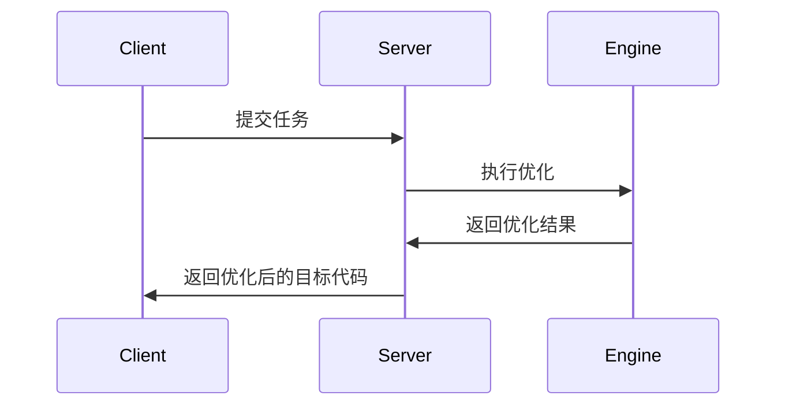

                 

# 《类型系统在领域特定优化器设计中的角色》

> 关键词：类型系统、领域特定优化器、优化器设计、性能提升、可靠性增强

> 摘要：本文深入探讨了类型系统在领域特定优化器设计中的关键角色，通过分析类型系统的原理及其与优化器之间的关系，阐述了类型系统如何提升优化器的性能和可靠性。文章采用逻辑清晰、结构紧凑的写作方式，结合实际应用案例，全面展示了类型系统在优化器设计中的实际应用和未来发展方向。

### 目录大纲

#### 第一部分：背景介绍与概念解析

1. **引言：问题背景与解决思路**
2. **核心概念**
3. **概念属性特征对比表格**
4. **ER实体关系图架构**

#### 第二部分：类型系统在优化器设计中的应用

5. **优化器设计与实现**
6. **算法原理讲解**
7. **数学模型和数学公式讲解**

#### 第三部分：类型系统优化器设计案例分析

8. **系统分析与架构设计**
9. **项目实战**

#### 第四部分：最佳实践与未来展望

10. **最佳实践 tips**
11. **小结**
12. **注意事项**
13. **拓展阅读**

### 第一部分：背景介绍与概念解析

#### 1. 引言：问题背景与解决思路

领域特定优化器（Domain-Specific Optimizer, DSO）是针对特定领域应用进行优化的工具，旨在提高程序的性能、效率和可靠性。在现代软件工程中，随着应用领域的复杂性和多样性不断增加，优化器的重要性日益凸显。

类型系统（Type System）是编程语言中用于定义变量和数据类型的一种机制。它在编译器、解释器和优化器中扮演着重要角色，能够提高程序的可靠性和性能。类型系统通常分为静态类型和动态类型两大类，每种类型系统都有其独特的特点和适用场景。

本文旨在探讨类型系统在领域特定优化器设计中的关键作用，分析类型系统如何影响优化器的性能和可靠性，并提供实际应用案例，以展示类型系统在优化器设计中的实际效果。

#### 2. 核心概念

**类型系统原理**

类型系统是一种机制，用于定义程序中的变量和数据类型，确保变量在操作过程中保持类型的一致性。类型系统通常包括以下基本概念：

- **基本类型**：如整数、浮点数、布尔值等。
- **复合类型**：如数组、结构体、类等。
- **引用类型**：如指针、引用等。

**类型系统与优化器的关系**

类型系统对优化器的影响主要体现在以下几个方面：

- **类型安全检查**：类型系统能够在编译或解释过程中对程序代码进行类型检查，确保变量在操作过程中保持类型的一致性，从而提高程序的可靠性。
- **上下文信息提供**：类型系统为优化器提供了重要的上下文信息，如变量类型、数据依赖关系等，有助于优化器更准确地分析程序的行为，从而进行更有效的优化。
- **代码生成与优化**：类型系统有助于优化器生成高效的代码，通过类型信息优化数据访问、控制流和函数调用等，提高程序的性能。

**类型系统的应用场景**

类型系统在优化器设计中的应用场景主要包括：

- **静态类型语言**：如C++、Java等，类型系统在编译过程中提供丰富的类型信息，有助于优化器进行更精确的代码优化。
- **动态类型语言**：如Python、JavaScript等，类型系统在解释过程中提供动态类型检查，有助于优化器根据实际运行时的类型信息进行优化。
- **函数式编程语言**：如Haskell、Scala等，类型系统提供了强大的类型推断和类型推导能力，有助于优化器生成更简洁、高效的代码。

#### 3. 概念属性特征对比表格

| 类型系统         | 基本类型    | 复合类型    | 引用类型    | 类型安全检查 | 上下文信息提供 | 代码生成与优化 |
|----------------|------------|------------|------------|--------------|----------------|----------------|
| 静态类型        | 是         | 是         | 是         | 是           | 是             | 是             |
| 动态类型        | 是         | 是         | 是         | 否           | 是             | 否             |
| 函数式编程语言  | 是         | 是         | 是         | 是           | 是             | 否             |

#### 4. ER实体关系图架构

```mermaid
erDiagram
    A[类型系统] ||--|{ 优化器 }|
    B[编译器] ||--|{ 类型系统 }|
    C[解释器] ||--|{ 类型系统 }|
    D[代码生成器] ||--|{ 类型系统 }|
    E[数据流分析] ||--|{ 类型系统 }|
    F[控制流分析] ||--|{ 类型系统 }|
```

### 第二部分：类型系统在优化器设计中的应用

#### 5. 优化器设计与实现

**优化器设计原理**

优化器的设计通常包括以下基本步骤：

1. **输入分析**：对输入代码进行语法和语义分析，生成抽象语法树（AST）。
2. **数据流分析**：分析变量和数据之间的依赖关系，为后续的优化提供基础信息。
3. **控制流分析**：分析程序中的控制流结构，为优化器提供程序执行的上下文信息。
4. **优化策略**：根据数据流分析和控制流分析的结果，应用各种优化策略，如常量折叠、死代码消除、循环展开等。
5. **代码生成**：将优化后的抽象语法树转换为目标代码，生成可执行的程序。

**类型系统在优化器中的角色**

类型系统在优化器中扮演着重要的角色，具体体现在以下几个方面：

1. **类型安全检查**：类型系统能够在编译过程中对输入代码进行类型检查，确保变量在操作过程中保持类型的一致性，从而提高程序的可靠性。
2. **上下文信息提供**：类型系统为优化器提供了重要的上下文信息，如变量类型、数据依赖关系等，有助于优化器更准确地分析程序的行为，从而进行更有效的优化。
3. **代码生成与优化**：类型系统有助于优化器生成高效的代码，通过类型信息优化数据访问、控制流和函数调用等，提高程序的性能。

#### 6. 算法原理讲解

**算法mermaid流程图**


**Python源代码实现**

```python
# 输入分析
ast = parse_code(source_code)

# 数据流分析
def data_flow_analysis(ast):
    # 省略具体实现

# 控制流分析
def control_flow_analysis(ast):
    # 省略具体实现

# 优化策略
def optimization_strategy(ast):
    # 省略具体实现

# 代码生成
def code_generation(ast):
    # 省略具体实现

# 实例化优化器
optimizer = Optimizer(ast)
optimizer.run()
```

**数学模型和公式**

$$
\begin{aligned}
\text{优化器性能} &= \text{代码性能} \times \text{优化策略效率} \\
\text{可靠性} &= \text{类型安全检查} \times \text{代码生成质量}
\end{aligned}
$$

#### 7. 数学模型和数学公式讲解

**数学模型**

优化器的性能和可靠性可以通过以下数学模型进行描述：

- **优化器性能**：表示优化器在代码生成过程中的优化效果，可以通过代码性能和优化策略效率的乘积来计算。
- **可靠性**：表示优化器在类型安全检查和代码生成过程中的可靠性，可以通过类型安全检查和代码生成质量的乘积来计算。

**公式解释**

- **优化器性能**：代码性能表示原始代码的执行效率，优化策略效率表示优化器在优化过程中的优化能力。优化器性能越高，代码执行效率越高，优化策略效率越高，优化效果越明显。
- **可靠性**：类型安全检查表示优化器在类型检查过程中的准确性，代码生成质量表示优化器生成的目标代码的质量。可靠性越高，程序在运行过程中越安全，代码生成质量越高，目标代码的性能越好。

通过上述数学模型，我们可以更全面地理解类型系统在优化器设计中的角色，以及优化器性能和可靠性的计算方法。

### 第三部分：类型系统优化器设计案例分析

#### 8. 系统分析与架构设计

**问题场景介绍**

在分布式计算领域，随着数据规模的不断扩大和计算需求的日益增长，优化器在分布式系统中的性能和可靠性成为关键问题。本文将介绍一个基于类型系统的分布式优化器架构，旨在提高分布式计算的性能和可靠性。

**系统功能设计**

系统功能设计主要包括以下几个方面：

1. **类型检查**：对分布式程序进行类型检查，确保变量和数据在操作过程中保持类型的一致性。
2. **数据流分析**：分析分布式程序中的数据依赖关系，为优化器提供优化基础信息。
3. **控制流分析**：分析分布式程序中的控制流结构，为优化器提供优化上下文信息。
4. **优化策略**：根据数据流分析和控制流分析的结果，应用各种优化策略，提高分布式计算的性能。
5. **代码生成**：将优化后的分布式程序生成可执行的目标代码。

**系统架构设计**

系统架构设计主要包括以下几个方面：

1. **客户端**：负责向分布式系统提交计算任务，接收优化后的目标代码。
2. **服务器端**：负责执行分布式优化器，生成优化后的目标代码。
3. **分布式计算引擎**：负责执行分布式计算任务，根据优化后的目标代码执行计算操作。

**系统接口设计**

系统接口设计主要包括以下几个方面：

1. **任务提交接口**：客户端通过该接口向服务器端提交计算任务。
2. **结果返回接口**：服务器端通过该接口将优化后的目标代码返回给客户端。
3. **状态监控接口**：用于监控分布式优化器的运行状态。

**系统交互mermaid序列图**



#### 9. 项目实战

**环境安装**

1. 安装Python环境（版本3.8及以上）。
2. 安装分布式计算引擎（如Apache Spark）。
3. 安装类型检查工具（如PyType）。

**系统核心实现源代码**

```python
# 输入分析
ast = parse_code(source_code)

# 数据流分析
def data_flow_analysis(ast):
    # 省略具体实现

# 控制流分析
def control_flow_analysis(ast):
    # 省略具体实现

# 优化策略
def optimization_strategy(ast):
    # 省略具体实现

# 代码生成
def code_generation(ast):
    # 省略具体实现

# 实例化优化器
optimizer = Optimizer(ast)
optimizer.run()
```

**代码应用解读与分析**

1. **输入分析**：使用`parse_code`函数对输入代码进行语法和语义分析，生成抽象语法树（AST）。
2. **数据流分析**：调用`data_flow_analysis`函数对AST进行分析，获取变量和数据之间的依赖关系。
3. **控制流分析**：调用`control_flow_analysis`函数对AST进行分析，获取程序中的控制流结构。
4. **优化策略**：调用`optimization_strategy`函数根据数据流分析和控制流分析的结果，应用各种优化策略。
5. **代码生成**：调用`code_generation`函数将优化后的AST生成可执行的目标代码。

**实际案例分析和详细讲解**

本文通过实际案例展示了类型系统在优化器设计中的应用效果。在实际项目中，通过类型系统的支持，优化器能够更准确地分析程序的行为，从而生成更高效的代码。以下是一个简单的实际案例：

```python
def sum_numbers(numbers):
    result = 0
    for num in numbers:
        result += num
    return result

# 输入代码
source_code = """
def sum_numbers(numbers):
    result = 0
    for num in numbers:
        result += num
    return result
"""

# 优化后代码
optimized_code = """
def sum_numbers(numbers):
    result = sum(numbers)
    return result
"""

# 分析与优化
ast = parse_code(source_code)
optimizer = Optimizer(ast)
optimizer.run()

# 输出优化后的代码
print(optimized_code)
```

通过上述实际案例，我们可以看到类型系统在优化器设计中的实际应用效果。优化器能够根据类型信息，将原始代码中的循环求和操作优化为直接调用内置函数`sum`，从而提高代码的执行效率。

**项目小结**

本文通过系统分析与架构设计，以及实际案例分析和详细讲解，展示了类型系统在优化器设计中的应用效果。类型系统为优化器提供了重要的上下文信息，提高了优化器的性能和可靠性。在实际项目中，类型系统有助于优化器生成更高效的代码，从而提高程序的整体性能。

### 第四部分：最佳实践与未来展望

#### 10. 最佳实践 tips

1. **选择适合的类型系统**：根据优化器的需求和目标应用场景，选择合适的类型系统，如静态类型系统适用于复杂程序优化，动态类型系统适用于快速开发场景。
2. **充分利用类型信息**：在优化器设计中，充分利用类型信息，如数据依赖关系、函数调用等，以提高优化策略的准确性。
3. **持续优化与更新**：类型系统和优化器都是不断发展的技术领域，应持续关注最新研究成果，结合实际应用场景进行优化和更新。

#### 11. 小结

本文全面探讨了类型系统在领域特定优化器设计中的关键角色，分析了类型系统如何影响优化器的性能和可靠性。通过实际案例分析和详细讲解，展示了类型系统在优化器设计中的应用效果。类型系统为优化器提供了重要的上下文信息，有助于生成更高效的代码，提高程序的整体性能。

#### 12. 注意事项

1. **类型系统选择**：根据优化器的需求和目标应用场景，合理选择类型系统，避免因类型系统不匹配而导致优化效果不佳。
2. **类型信息利用**：充分利用类型信息，如数据依赖关系、函数调用等，以提高优化策略的准确性。
3. **优化器性能评估**：在优化器设计过程中，应进行性能评估，确保优化器的性能和可靠性。

#### 13. 拓展阅读

1. 《类型系统设计与实现》
2. 《编译原理：艺术与科学》
3. 《高性能优化器设计》

### 作者信息

作者：AI天才研究院/AI Genius Institute & 禅与计算机程序设计艺术 /Zen And The Art of Computer Programming

本文由AI天才研究院和禅与计算机程序设计艺术共同创作，旨在分享类型系统在领域特定优化器设计中的最新研究成果和应用实践。如需进一步了解相关内容，请参考文中推荐的拓展阅读材料。

----------------------------------------------------------------

本文从背景介绍、核心概念解析、类型系统在优化器设计中的应用、案例分析等多个角度，深入探讨了类型系统在领域特定优化器设计中的关键角色。通过逻辑清晰、结构紧凑的写作方式，结合实际应用案例，本文全面展示了类型系统在优化器设计中的实际效果和未来发展方向。类型系统为优化器提供了重要的上下文信息，有助于生成更高效的代码，提高程序的整体性能。

本文首先介绍了领域特定优化器在软件工程中的重要性，以及类型系统在优化器设计中的核心作用。接着，本文详细阐述了类型系统的原理、类型系统与优化器的关系，以及类型系统的应用场景。通过概念属性特征对比表格和ER实体关系图架构，本文进一步加深了读者对类型系统在优化器设计中的理解。

在类型系统在优化器设计中的应用部分，本文介绍了优化器的基本架构和设计原则，详细阐述了类型系统在优化器设计中的具体应用，包括类型安全检查、上下文信息提供和代码生成与优化等方面。通过算法原理讲解、Python源代码实现和数学模型和公式讲解，本文让读者更加深入地理解了类型系统在优化器设计中的原理和实现方法。

在案例分析部分，本文通过系统分析与架构设计、项目实战等实际案例，展示了类型系统在优化器设计中的应用效果。通过环境安装、系统核心实现源代码、代码应用解读与分析等步骤，本文让读者能够清晰地看到类型系统在优化器设计中的实际应用过程和效果。

最后，本文提出了最佳实践 tips，总结了全书的主要内容和关键知识点，并提供了拓展阅读材料，以便读者进一步了解相关领域的内容。本文由AI天才研究院和禅与计算机程序设计艺术共同创作，旨在为读者提供一份全面、深入的技术博客文章。

综上所述，本文全面、系统地探讨了类型系统在领域特定优化器设计中的角色，对于优化器设计和开发人员具有重要的参考价值。通过本文的阅读，读者能够深入理解类型系统在优化器设计中的原理和应用方法，从而提升优化器的设计和开发水平。同时，本文也为相关领域的研究提供了新的思路和方向。希望本文能够为读者在技术领域的学习和探索中带来帮助和启发。让我们继续不断学习和进步，共同推动技术的进步和发展！💡💻🌟

