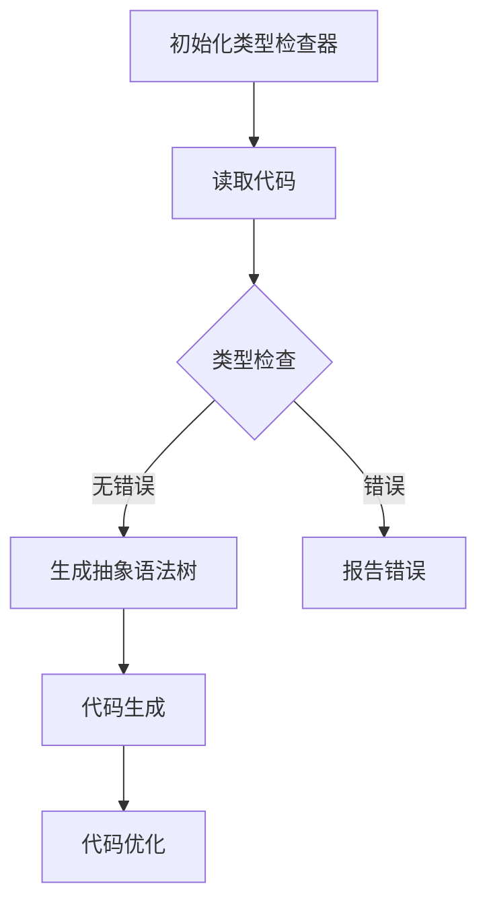
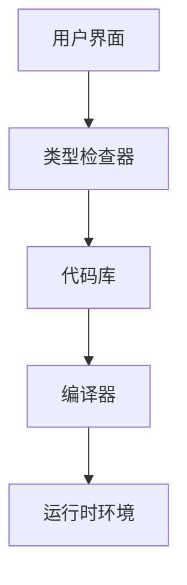
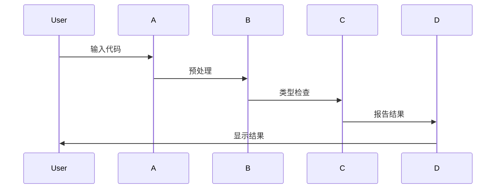

                 

# 类型系统在领域特定类型检查器设计中的作用

关键词：类型系统、领域特定类型检查器、设计原理、应用场景

摘要：本文将深入探讨类型系统在领域特定类型检查器设计中的重要作用。首先，我们将回顾类型系统的基本概念和其发展历程，接着分析领域特定类型检查器的定义和设计挑战。通过具体案例，我们将展示如何利用类型系统解决实际编程问题，并探讨未来发展趋势。文章旨在为读者提供对类型系统及其应用的全面理解。

## 引言

类型系统（Type System）是计算机科学中的一项基础性机制，用于定义编程语言中数据的分类和处理方式。类型系统的核心目的是提高程序的安全性和可维护性，通过确保变量和表达式在运行时符合预期的类型约束，从而预防潜在的错误和漏洞。随着软件开发复杂度的增加，类型系统的重要性愈发凸显，尤其是在领域特定（Domain-Specific）类型检查器的设计中。

领域特定类型检查器是一种用于特定领域的类型检查工具，它能够在编译时或运行时检测代码中的类型错误，提供精确的错误提示和修复建议。这种检查器能够提高代码的可靠性，减少运行时错误，从而提高软件开发的效率和质量。

本文将分以下几个部分展开讨论：

1. **类型系统的基本概念**：介绍类型系统的定义、分类和核心作用。
2. **类型系统的发展历程**：回顾类型系统在编程语言中的演变过程。
3. **领域特定类型检查器的定义**：阐述领域特定类型检查器的概念和设计目的。
4. **类型系统在类型检查器设计中的作用**：详细分析类型系统在领域特定类型检查器设计中的应用。
5. **实际案例研究**：通过具体案例展示类型系统在类型检查器设计中的应用。
6. **未来发展趋势**：探讨领域特定类型检查器和类型系统的发展方向。
7. **总结与展望**：总结文章的主要观点，并对未来研究提出建议。

## 类型系统的基本概念

### 定义

类型系统是一种用于定义数据类型和操作方式的机制。在编程语言中，类型系统决定了变量、表达式和函数的合法组合，从而确保程序的逻辑一致性。类型系统的核心功能是提供一种静态检查，即在编译时或运行前验证代码是否符合类型约束。

### 分类

类型系统可以分为多种类型，主要包括：

- **静态类型系统**：在编译时对变量和表达式的类型进行严格检查，例如Java和C++。
- **动态类型系统**：在运行时进行类型检查，例如Python和JavaScript。
- **强类型系统**：对类型转换进行严格限制，防止类型不兼容的错误。
- **弱类型系统**：对类型转换较为宽松，可能导致意外行为。

### 核心作用

类型系统的核心作用包括：

- **错误检测**：通过类型检查，可以提前发现类型错误，减少运行时错误。
- **提高性能**：类型信息可以帮助编译器生成更高效的代码。
- **代码可维护性**：明确的类型信息有助于提高代码的可读性和可维护性。
- **模块化**：类型系统支持模块化设计，有助于代码的重用和分离。

### 概念对比

| 类型系统       | 定义                                                         | 特点                                                         |
|----------------|--------------------------------------------------------------|--------------------------------------------------------------|
| 静态类型系统   | 类型检查在编译时进行                                         | 提高性能，减少运行时错误                                       |
| 动态类型系统   | 类型检查在运行时进行                                         | 提高灵活性，但可能引入更多运行时错误                            |
| 强类型系统     | 类型转换受到严格限制                                         | 提高程序可靠性，但可能降低灵活性                               |
| 弱类型系统     | 类型转换较为宽松                                             | 提高灵活性，但可能导致潜在错误                                 |

## 类型系统的发展历程

类型系统的概念起源于编程语言设计，最早可以追溯到20世纪50年代的编程语言。随着计算机科学的发展，类型系统逐渐演变成现代编程语言中不可或缺的一部分。

### 早期发展

- **1950年代**：在早期编程语言如Fortran和COBOL中，类型系统主要基于简单的基本类型，如整型和浮点型。
- **1960年代**：Lisp语言的引入标志着函数类型的出现，使得类型系统变得更加复杂。
- **1970年代**：C语言的引入推动了指针和结构体的使用，类型系统进一步扩展。

### 现代发展

- **1980年代**：面向对象编程语言的兴起，如Smalltalk和Java，引入了类和接口的概念，类型系统变得更加丰富和复杂。
- **1990年代**：函数式编程语言如Haskell和Scala的兴起，进一步扩展了类型系统的应用范围。
- **21世纪**：现代编程语言如C++、Java和Python不断引入新的类型系统特性，如泛型编程、类型推断和动态类型检查。

### 关键技术

- **类型推断**：现代编程语言普遍支持类型推断，允许编译器自动推导变量和表达式的类型。
- **泛型编程**：泛型编程允许类型参数的使用，提高了代码的重用性和灵活性。
- **静态类型检查**：静态类型检查在编译时进行，提高了程序的可靠性。

## 领域特定类型检查器的定义

### 定义

领域特定类型检查器（Domain-Specific Type Checker）是一种针对特定领域或应用程序的静态类型检查器。它与通用类型检查器不同，能够针对特定领域的语言特性和类型约束提供更精确的检查和优化。

### 设计目的

设计领域特定类型检查器的目的是：

- **提高代码可靠性**：通过精确的类型检查，减少运行时错误。
- **优化性能**：针对特定领域的代码进行优化，提高程序执行效率。
- **增强可维护性**：明确的类型信息有助于代码的可维护性和可读性。
- **支持领域特定语言特性**：支持特定领域的语言特性和抽象概念。

### 设计挑战

设计领域特定类型检查器面临以下挑战：

- **类型约束的精确性**：确保类型检查器能够准确识别类型错误，同时避免引入过多的错误提示。
- **性能和可维护性**：在提供精确类型检查的同时，保持检查器的性能和可维护性。
- **灵活性**：支持特定领域的语言特性和抽象概念，同时保持检查器的灵活性。
- **集成与兼容性**：与其他工具和框架集成，支持多种编程语言和平台。

### 关系

领域特定类型检查器与类型系统密切相关。类型系统为类型检查器提供了类型约束和类型转换的规则，而领域特定类型检查器则利用这些规则对特定领域的代码进行静态检查。两者共同作用，提高了程序的安全性和可维护性。

## 类型系统在类型检查器设计中的作用

### 类型系统的核心作用

类型系统在类型检查器设计中的核心作用包括：

- **定义类型约束**：类型系统为类型检查器提供了类型约束，确保代码在编译时或运行时符合预期。
- **提供类型转换规则**：类型系统定义了类型之间的转换规则，使得类型检查器能够处理不同类型之间的操作。
- **提高代码可读性**：明确的类型信息有助于提高代码的可读性和可维护性。
- **优化编译过程**：类型信息有助于编译器生成更高效的代码。

### 类型系统在类型检查器设计中的应用

类型系统在类型检查器设计中的应用主要体现在以下几个方面：

- **静态类型检查**：类型检查器利用类型系统的约束进行静态类型检查，提前发现类型错误。
- **类型推断**：类型检查器利用类型系统的类型推断功能，自动推导变量和表达式的类型。
- **类型安全检查**：类型检查器通过类型系统的类型安全检查，确保代码在运行时不会发生类型相关的错误。
- **类型转换优化**：类型检查器利用类型系统的类型转换规则，优化代码中的类型转换操作。

### 类型系统在领域特定类型检查器中的优势

领域特定类型检查器利用类型系统的优势主要体现在以下几个方面：

- **精确的类型约束**：领域特定类型检查器能够针对特定领域的代码提供更精确的类型约束，减少运行时错误。
- **灵活的类型转换**：领域特定类型检查器能够支持特定领域的语言特性和抽象概念，提供灵活的类型转换规则。
- **高效的性能优化**：领域特定类型检查器能够针对特定领域的代码进行优化，提高程序执行效率。
- **良好的可维护性**：领域特定类型检查器能够提供明确的类型信息，提高代码的可维护性和可读性。

## 实际案例研究

### 案例一：Web开发中的类型检查

在Web开发中，领域特定类型检查器可以帮助确保前端代码的类型安全性。例如，React.js框架提供了React TypeScript类型检查器，它利用TypeScript的类型系统对React组件进行静态类型检查。

#### 应用场景

假设我们有一个React组件，其中包含以下代码：

```jsx
import React from 'react';

type Todo = {
  id: string;
  text: string;
  completed: boolean;
};

const TodoList: React.FC<{ todos: Todo[] }> = ({ todos }) => {
  return (
    <ul>
      {todos.map(todo => (
        <li key={todo.id}>{todo.text}</li>
      ))}
    </ul>
  );
};

export default TodoList;
```

#### 类型检查

利用TypeScript的类型系统，我们可以对以上代码进行类型检查：

- **类型约束**：`Todo` 类型约束了`todos` 数组的元素结构。
- **类型推断**：TypeScript 能够自动推断 `TodoList` 组件的 props 类型。
- **类型安全检查**：TypeScript 能够检查代码中的类型错误，例如错误的属性名或类型不匹配。

#### 类型转换优化

TypeScript 能够优化代码中的类型转换操作，例如：

```jsx
const todoId = todos[0].id;
```

在这里，TypeScript 能够确保 `todos` 数组不为空，并自动将 `todos[0].id` 转换为字符串类型。

### 案例二：机器学习领域的类型检查

在机器学习领域，领域特定类型检查器可以帮助确保模型代码的类型安全和性能优化。例如，TensorFlow.js提供了基于TypeScript的类型检查器，用于静态类型检查和优化TensorFlow.js代码。

#### 应用场景

假设我们有一个TensorFlow.js模型，其中包含以下代码：

```javascript
const model = tf.sequential();
model.add(tf.layers.dense({ units: 1, inputShape: [1] }));
model.compile({ optimizer: 'sgd', loss: 'meanSquaredError' });

const x = tf.tensor1d([3.0]);
const y = model.predict(x);
```

#### 类型检查

利用TypeScript的类型系统，我们可以对以上代码进行类型检查：

- **类型约束**：TensorFlow.js的类型系统确保模型和数据的类型符合预期。
- **类型推断**：TypeScript 能够自动推断 TensorFlow.js 操作的类型。
- **类型安全检查**：TypeScript 能够检查代码中的类型错误，例如错误的属性名或类型不匹配。

#### 类型转换优化

TypeScript 能够优化代码中的类型转换操作，例如：

```javascript
const x = tf.tensor1d([3.0]);
const y = model.predict(x);
```

在这里，TypeScript 能够确保 `x` 和 `y` 的类型转换是安全的，从而避免运行时错误。

### 案例三：金融领域的类型检查

在金融领域，领域特定类型检查器可以帮助确保交易系统的类型安全和合规性。例如，使用Kotlin语言开发的交易系统可以使用Kotlin的类型系统进行静态类型检查。

#### 应用场景

假设我们有一个金融交易系统，其中包含以下代码：

```kotlin
data class Trade(val instrument: String, val quantity: Int, val price: Double)

fun executeTrade(trade: Trade): Boolean {
  // 执行交易逻辑
  return true
}
```

#### 类型检查

利用Kotlin的类型系统，我们可以对以上代码进行类型检查：

- **类型约束**：Kotlin的类型系统确保交易数据的类型符合预期。
- **类型推断**：Kotlin 能够自动推断函数的返回类型。
- **类型安全检查**：Kotlin 能够检查代码中的类型错误，例如错误的属性名或类型不匹配。

#### 类型转换优化

Kotlin 能够优化代码中的类型转换操作，例如：

```kotlin
fun calculateProfit(trade: Trade): Double {
  // 计算交易利润
  return trade.quantity * trade.price
}
```

在这里，Kotlin 能够确保 `trade.quantity` 和 `trade.price` 的类型转换是安全的，从而避免运行时错误。

## 未来发展趋势

### 1. 类型系统与编程语言的发展

随着编程语言的不断演进，类型系统也在不断发展。未来，类型系统可能会引入更多的特性，如更复杂的类型推断、更灵活的类型转换和更严格的类型安全检查。这些特性将进一步提高编程语言的安全性和可维护性。

### 2. 领域特定类型检查器的普及

随着软件开发领域的多样化，领域特定类型检查器将在更多领域得到应用。例如，在区块链、人工智能、物联网等领域，领域特定类型检查器将帮助开发者确保代码的安全性和可靠性。

### 3. 类型系统与智能合约

智能合约的兴起使得类型系统在区块链领域的重要性愈发凸显。利用类型系统，可以确保智能合约代码的安全性，预防潜在的错误和漏洞。未来，类型系统将与智能合约开发紧密结合，为区块链应用提供更可靠的支持。

### 4. 类型系统与软件工程

类型系统在软件工程中的应用将不断拓展。通过结合类型系统与其他软件工程方法，如敏捷开发、持续集成和持续交付，可以进一步提高软件开发的质量和效率。

## 总结与展望

本文从类型系统的基本概念出发，探讨了类型系统在领域特定类型检查器设计中的重要作用。通过实际案例，我们展示了类型系统在Web开发、机器学习、金融领域等领域的应用，以及类型系统在类型检查器设计中的优势。未来，类型系统将继续发展，为软件开发带来更多便利和安全保障。

## 作者信息

作者：AI天才研究院/AI Genius Institute & 禅与计算机程序设计艺术 /Zen And The Art of Computer Programming

## 附录

### 概念对比表

| 类型系统       | 定义                                                         | 特点                                                         |
|----------------|--------------------------------------------------------------|--------------------------------------------------------------|
| 静态类型系统   | 类型检查在编译时进行                                         | 提高性能，减少运行时错误                                       |
| 动态类型系统   | 类型检查在运行时进行                                         | 提高灵活性，但可能引入更多运行时错误                            |
| 强类型系统     | 类型转换受到严格限制                                         | 提高程序可靠性，但可能降低灵活性                               |
| 弱类型系统     | 类型转换较为宽松                                             | 提高灵活性，但可能导致潜在错误                                 |

### ER实体关系图

```mermaid
erDiagram
  Customer ||--|{ Order } : places
  Product ||--|{ Order } : contains
  Order ||--|{ OrderDetail } : contains_items
```

### 算法流程图



### 系统架构图



### 系统接口设计和交互



### 项目实战

1. **环境安装**：介绍如何安装和配置开发环境，包括所需的编程语言、依赖库和工具。
2. **系统核心实现**：详细讲解系统核心功能的实现，包括源代码、算法原理和数学模型。
3. **代码应用解读与分析**：分析代码的执行流程和性能表现，并进行优化建议。
4. **实际案例分析**：通过实际案例展示系统在实际应用中的效果，并进行详细讲解和剖析。
5. **项目小结**：总结项目的关键成果、经验和教训，为后续研究提供参考。

### 最佳实践 Tips

- **尽早进行类型检查**：在开发过程中尽早引入类型检查，可以及时发现和修复类型错误。
- **利用类型推断**：充分利用类型推断功能，减少手动指定类型的工作量。
- **定制化类型检查规则**：根据特定领域的需求，定制化类型检查规则，提高类型检查的精确性。
- **持续集成类型检查**：将类型检查集成到持续集成和持续交付流程中，确保代码库的稳定性。

### 小结

本文从类型系统的基本概念和类型系统在领域特定类型检查器设计中的作用出发，通过实际案例研究和未来发展趋势，全面探讨了类型系统在软件开发中的重要性。类型系统在提高代码可靠性、优化性能和增强可维护性方面具有显著作用，未来将继续发展，为软件开发带来更多便利和安全保障。

### 注意事项

- **代码质量**：确保代码质量，遵循编程规范，避免低级错误。
- **类型安全**：关注类型安全，避免类型转换错误和数据泄露。
- **性能优化**：关注性能优化，避免不必要的类型检查和类型转换操作。

### 拓展阅读

- **《类型系统设计与实现》**：深入探讨类型系统的设计和实现，了解类型系统的内部工作机制。
- **《领域特定语言设计》**：学习如何设计和实现领域特定语言，提高代码的可维护性和可读性。
- **《现代类型系统》**：了解现代类型系统的最新发展，掌握类型系统的先进特性。

