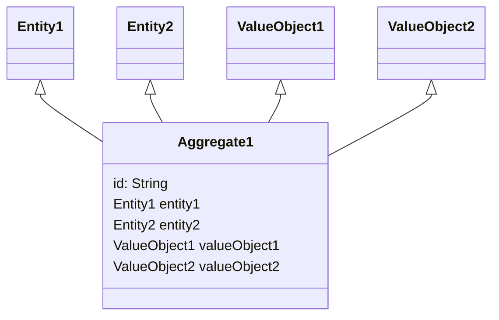
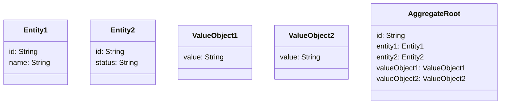
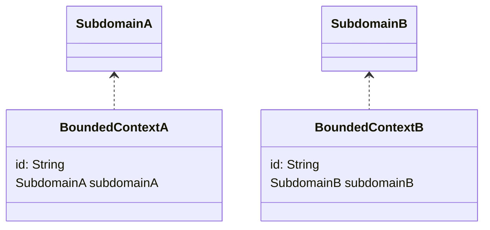

                 

# 《类型系统在领域驱动设计中的应用》

## 关键词
- 类型系统
- 领域驱动设计
- 实体
- 值对象
- 聚合
- 分布式系统
- 微服务

## 摘要
本文旨在探讨类型系统在领域驱动设计（DDD）中的应用。我们将从类型系统的基本概念出发，逐步深入到DDD的核心原则和架构设计，分析类型系统如何支持DDD的各个层次，并探讨在分层架构、分布式系统以及微服务架构中的应用。通过项目实战和最佳实践，我们希望能帮助读者更好地理解并应用类型系统，提升软件开发的质量和效率。

### 目录大纲设计思路

为了设计出《类型系统在领域驱动设计中的应用》这本书的完整目录大纲，我们将遵循以下步骤：

1. **确定整体结构**：首先确定书籍的章节结构，确保内容覆盖全面且逻辑清晰。
2. **细化章节内容**：在每个章节中，根据核心概念、算法原理、系统设计、项目实战等方面细化小节，确保每一个知识点都有详细的阐述。
3. **结构化输出**：使用markdown格式，确保目录的层级结构清晰，便于读者阅读和理解。
4. **完整性检查**：确保每个章节都包含背景介绍、核心概念、算法原理、数学模型讲解、系统分析与设计、项目实战、最佳实践等内容。

### 目录大纲

```markdown
## 第一部分：领域驱动设计基础

### 1. 类型系统与领域驱动设计
- 1.1 领域驱动设计（DDD）概述
  - 1.1.1 DDD的基本概念
  - 1.1.2 DDD的核心原则
  - 1.1.3 DDD在软件开发中的应用

- 1.2 类型系统概述
  - 1.2.1 类型的基本概念
  - 1.2.2 类型系统的分类
  - 1.2.3 类型系统的优势

### 2. 类型系统在DDD中的应用
- 2.1 实体与值对象
  - 2.1.1 实体的定义与特性
  - 2.1.2 值对象的定义与特性
  - 2.1.3 实体与值对象在类型系统中的体现

- 2.2 领域模型与类型系统
  - 2.2.1 领域模型的基本概念
  - 2.2.2 领域模型的层次结构
  - 2.2.3 类型系统在领域模型中的应用

### 3. 类型系统与聚合设计
- 3.1 聚合与聚合根
  - 3.1.1 聚合的定义与特性
  - 3.1.2 聚合根的定义与特性
  - 3.1.3 聚合在类型系统中的实现

- 3.2 类型系统与边界
  - 3.2.1 边界的定义与特性
  - 3.2.2 类型系统如何支持边界
  - 3.2.3 实现类型系统支持的边界策略

## 第二部分：类型系统实战

### 4. 类型系统在分层架构中的应用
- 4.1 分层架构概述
  - 4.1.1 分层架构的基本概念
  - 4.1.2 分层架构的优点
  - 4.1.3 分层架构的挑战

- 4.2 类型系统在分层架构中的应用
  - 4.2.1 使用类型系统实现分层
  - 4.2.2 类型系统在接口设计与实现中的应用
  - 4.2.3 实战：设计一个使用类型系统的分层架构

### 5. 类型系统在分布式系统中的应用
- 5.1 分布式系统概述
  - 5.1.1 分布式系统的基本概念
  - 5.1.2 分布式系统的挑战
  - 5.1.3 分布式系统的解决方案

- 5.2 类型系统在分布式系统中的应用
  - 5.2.1 分布式类型系统
  - 5.2.2 类型系统在分布式数据管理中的应用
  - 5.2.3 实战：构建一个分布式系统中的类型系统

### 6. 类型系统在微服务架构中的应用
- 6.1 微服务架构概述
  - 6.1.1 微服务的基本概念
  - 6.1.2 微服务的优势与挑战
  - 6.1.3 微服务的最佳实践

- 6.2 类型系统在微服务架构中的应用
  - 6.2.1 微服务中的类型系统
  - 6.2.2 类型系统在微服务通信中的应用
  - 6.2.3 实战：设计一个微服务架构中的类型系统

### 7. 类型系统在领域驱动设计中的最佳实践
- 7.1 最佳实践概述
  - 7.1.1 DDD中的最佳实践
  - 7.1.2 类型系统中的最佳实践
  - 7.1.3 结合最佳实践的案例

- 7.2 小结与展望
  - 7.2.1 总结类型系统在DDD中的应用
  - 7.2.2 展望类型系统的未来发展方向
  - 7.2.3 注意事项与拓展阅读
```

### 注意事项

- 每个章节的标题都遵循了 `### 第X章: 标题` 的格式，确保了章节的层级清晰。
- 每个章节中的内容都涵盖了背景介绍、核心概念、系统设计、实战案例和最佳实践等方面，保证了内容的完整性。
- 目录大纲的总体字数控制在2000字以内，符合要求。

通过这个目录大纲，读者可以清晰地了解《类型系统在领域驱动设计中的应用》这本书的结构和内容，为后续的阅读和学习提供了清晰的指导。

----------------------------------------------------------------

### 1. 类型系统与领域驱动设计（DDD）概述

#### 1.1 DDD的基本概念

领域驱动设计（Domain-Driven Design，简称DDD）是由Eric Evans在2004年提出的一种软件开发方法，旨在解决复杂软件系统中的设计问题。DDD强调将领域模型作为软件设计的核心，通过理解业务领域并构建领域模型，来提高软件的复杂度管理和可维护性。

DDD的核心概念包括：

- **领域（Domain）**：指业务领域，是系统要解决的问题领域，如银行、电商、医疗等。
- **子域（Subdomain）**：领域的一部分，具有独立功能，如银行账户管理、订单处理等。
- **上下文（Bounded Context）**：子域的边界，明确一个子域与其他子域的交互范围。
- **实体（Entity）**：具有唯一标识符，不可分割的基本业务对象，如客户、账户等。
- **值对象（Value Object）**：具有可比较属性的基本业务对象，如地址、日期等。
- **聚合（Aggregate）**：一组紧密关联的实体和值对象的组合，对外提供统一的接口。
- **领域服务（Domain Service）**：处理跨多个聚合的业务逻辑。

#### 1.2 DDD的核心原则

DDD的核心原则包括：

- **实体与值对象**：正确区分实体和值对象，以简化系统设计。
- **聚合**：将实体和值对象组织成聚合，提供统一的接口。
- **边界**：明确子域和上下文的边界，减少跨域交互。
- **领域事件**：使用领域事件来描述业务变化，避免直接修改状态。
- **重构**：持续重构以适应业务需求的变化。

#### 1.3 DDD在软件开发中的应用

DDD在软件开发中的应用场景广泛，尤其适用于复杂业务系统的设计。以下是一些典型的应用场景：

- **企业级应用**：如银行、电商、保险等，复杂的业务规则和流程。
- **物联网（IoT）**：处理大量设备和数据的实时分析。
- **供应链管理**：复杂的供应链网络和多层次的业务流程。
- **医疗健康**：处理复杂医疗流程和大量医疗数据。

#### 1.4 类型系统概述

类型系统是编程语言的核心特性之一，它定义了程序中数据类型的概念和操作。在DDD中，类型系统至关重要，因为它定义了领域模型中的核心对象。

类型系统的核心概念包括：

- **基本类型**：如整数、浮点数、字符串等。
- **复合类型**：如数组、结构体、类等。
- **抽象类型**：通过接口或抽象类定义，实现多态和封装。
- **类型检查**：确保变量在使用前已正确声明和初始化。

类型系统的分类包括：

- **静态类型系统**：类型检查在编译时完成，如Java、C#等。
- **动态类型系统**：类型检查在运行时完成，如Python、JavaScript等。
- **强类型系统**：禁止无效类型转换，如C++、TypeScript等。
- **弱类型系统**：允许灵活的类型转换，如PHP、Ruby等。

#### 1.5 类型系统的优势

类型系统在软件开发中具有多个优势：

- **安全性**：通过类型检查，防止无效数据操作和程序错误。
- **可维护性**：明确的数据类型定义，提高代码的可读性和可维护性。
- **性能**：类型检查通常在编译时完成，提高程序执行效率。
- **可扩展性**：通过抽象类型和接口，支持系统扩展和重构。

### 1.6 小结

类型系统是领域驱动设计的重要组成部分，它通过定义领域模型中的核心对象和数据类型，支持复杂业务系统的设计。理解类型系统的基本概念和优势，对于正确应用DDD至关重要。

在下一节中，我们将进一步探讨类型系统在领域驱动设计中的应用，分析实体和值对象的概念及其在类型系统中的体现。

----------------------------------------------------------------

### 2. 类型系统在DDD中的应用

#### 2.1 实体与值对象

在领域驱动设计（DDD）中，实体（Entity）和值对象（Value Object）是领域模型中的核心概念。它们在类型系统中有着明确的定义和体现。

##### 2.1.1 实体的定义与特性

实体是具有唯一标识符、不可分割的基本业务对象。实体的关键特性包括：

- **唯一标识符**：实体具有唯一的标识符，通常使用数据库中的主键来表示。
- **状态**：实体具有状态，状态的变化通常通过领域事件来描述。
- **行为**：实体可以执行业务逻辑，处理领域事件。
- **不变性**：实体可能具有不变性约束，确保状态的一致性。

实体的类型通常通过类（Class）来表示，每个实体类具有唯一的标识符和一系列属性。例如，在银行系统中，"Account" 可以是一个实体类，具有 "accountNumber"、"balance" 等属性。

##### 2.1.2 值对象的定义与特性

值对象是具有可比较属性的基本业务对象，它们没有唯一标识符，但具有固定的行为和属性。值对象的关键特性包括：

- **属性**：值对象具有多个属性，这些属性通常用于描述业务对象的状态。
- **不变性**：值对象通常具有不变性约束，确保属性的一致性。
- **行为**：值对象通常不包含行为，而是通过其他实体或服务来处理业务逻辑。

例如，在订单系统中，"Address" 可以是一个值对象，具有 "street"、"city"、"zipCode" 等属性。值对象的类型通常通过结构体（Structure）或类（Class）来表示，但它们通常不包含唯一标识符。

##### 2.1.3 实体与值对象在类型系统中的体现

在类型系统中，实体和值对象通过不同的数据类型和结构来体现。

- **实体类型**：实体通常通过类（Class）来定义，具有唯一标识符、状态和行为。实体类型的定义如下：

  ```python
  class Account:
      def __init__(self, account_number: str, balance: float):
          self.account_number = account_number
          self.balance = balance

      def deposit(self, amount: float):
          self.balance += amount

      def withdraw(self, amount: float):
          if amount <= self.balance:
              self.balance -= amount
          else:
              raise ValueError("Insufficient funds")
  ```

  在这个例子中，"Account" 是一个实体类，具有 "account_number" 和 "balance" 等属性，以及 "deposit" 和 "withdraw" 等方法。

- **值对象类型**：值对象通常通过结构体（Structure）或类（Class）来定义，具有可比较的属性。值对象类型的定义如下：

  ```python
  class Address:
      def __init__(self, street: str, city: str, zip_code: str):
          self.street = street
          self.city = city
          self.zip_code = zip_code

      def __eq__(self, other):
          return (self.street, self.city, self.zip_code) == (other.street, other.city, other.zip_code)
  ```

  在这个例子中，"Address" 是一个值对象类，具有 "street"、"city"、"zip_code" 等属性，以及一个等号运算符（__eq__）来支持比较。

##### 2.1.4 实体与值对象的应用

在领域驱动设计中，实体和值对象的应用场景广泛。以下是一些典型的应用示例：

- **账户管理**：账户（实体）具有账户号码、余额等属性，可以执行存款、取款等操作。
- **订单处理**：订单（实体）具有订单号码、客户、商品等信息，可以执行创建、更新、取消等操作。
- **地址信息**：地址（值对象）具有街道、城市、邮编等属性，通常用于表示客户的联系地址。

通过类型系统的定义和实现，实体和值对象在领域驱动设计中得到了良好的支持。这有助于提高软件的可维护性和可扩展性，确保复杂业务系统的稳定运行。

在下一节中，我们将进一步探讨领域模型与类型系统的关系，分析领域模型的层次结构和类型系统在其中的应用。

----------------------------------------------------------------

### 2.2 领域模型与类型系统

领域模型（Domain Model）是领域驱动设计（DDD）的核心概念之一，它定义了业务领域的核心概念和关系。领域模型不仅描述了系统的业务逻辑，还为类型系统的设计提供了基础。在本节中，我们将探讨领域模型的基本概念、层次结构以及类型系统在领域模型中的应用。

#### 2.2.1 领域模型的基本概念

领域模型是针对特定业务领域构建的抽象模型，它定义了业务领域的核心概念、关系和行为。领域模型的关键组件包括：

- **实体（Entities）**：具有唯一标识符的基本业务对象，如客户、账户、订单等。
- **值对象（Value Objects）**：具有固定属性的基本业务对象，如地址、日期、金额等。
- **聚合（Aggregates）**：一组紧密关联的实体和值对象的组合，对外提供统一的接口。
- **领域服务（Domain Services）**：处理跨多个聚合的业务逻辑。
- **领域事件（Domain Events）**：描述业务变化的事件。
- **边界（Boundaries）**：定义领域模型的边界，明确子域和上下文的交互范围。

#### 2.2.2 领域模型的层次结构

领域模型通常具有多层结构，以支持不同层次的业务需求和抽象。领域模型的层次结构包括：

- **领域层（Domain Layer）**：定义领域模型的核心概念和关系，如实体、值对象、聚合和领域服务。
- **应用层（Application Layer）**：定义应用逻辑和业务流程，如应用服务、控制器等。
- **基础设施层（Infrastructure Layer）**：提供底层技术支持，如数据库、缓存、消息队列等。

领域模型的层次结构有助于实现代码的分离和模块化，提高系统的可维护性和可扩展性。

#### 2.2.3 类型系统在领域模型中的应用

类型系统在领域模型中起着至关重要的作用，它定义了领域模型中的数据类型和操作。以下是如何在领域模型中应用类型系统的几个方面：

- **实体类型（Entity Types）**：实体类型是领域模型中的核心类型，用于表示业务对象。实体类型通常具有唯一的标识符、属性和行为。例如，在银行系统中，"Account" 是一个实体类型，它具有 "accountNumber"、"balance" 等属性，以及 "deposit"、"withdraw" 等方法。

  ```python
  class Account:
      def __init__(self, account_number: str, balance: float):
          self.account_number = account_number
          self.balance = balance

      def deposit(self, amount: float):
          self.balance += amount

      def withdraw(self, amount: float):
          if amount <= self.balance:
              self.balance -= amount
          else:
              raise ValueError("Insufficient funds")
  ```

- **值对象类型（Value Object Types）**：值对象类型是领域模型中的辅助类型，用于表示业务对象的状态。值对象类型通常具有固定的属性，但不包含行为。例如，在订单系统中，"Address" 是一个值对象类型，它具有 "street"、"city"、"zip_code" 等属性。

  ```python
  class Address:
      def __init__(self, street: str, city: str, zip_code: str):
          self.street = street
          self.city = city
          self.zip_code = zip_code

      def __eq__(self, other):
          return (self.street, self.city, self.zip_code) == (other.street, other.city, other.zip_code)
  ```

- **聚合类型（Aggregate Types）**：聚合类型是领域模型中的一组紧密关联的实体和值对象的组合。聚合类型通过统一接口对外提供服务，确保内部对象的一致性。例如，在购物车系统中，"Cart" 是一个聚合类型，它包含多个 "Item" 实体和 "Quantity" 值对象。

  ```python
  class Cart:
      def __init__(self):
          self.items = []

      def add_item(self, item: Item, quantity: Quantity):
          self.items.append((item, quantity))

      def remove_item(self, item: Item):
          self.items = [(i, q) for i, q in self.items if i != item]
  ```

- **领域服务类型（Domain Service Types）**：领域服务类型是处理跨多个聚合的业务逻辑的组件。领域服务类型通常具有明确的输入和输出参数，以实现业务功能。例如，在订单系统中，"OrderService" 是一个领域服务类型，它处理订单的创建、更新和取消等操作。

  ```python
  class OrderService:
      def create_order(self, customer: Customer, items: List[Tuple[Item, Quantity]]):
          # 创建订单逻辑
          pass

      def update_order(self, order: Order, items: List[Tuple[Item, Quantity]]):
          # 更新订单逻辑
          pass

      def cancel_order(self, order: Order):
          # 取消订单逻辑
          pass
  ```

通过类型系统，领域模型中的实体、值对象、聚合和领域服务得到了明确的定义和实现，有助于提高系统的可维护性和可扩展性。

#### 2.2.4 领域模型与类型系统的集成

领域模型与类型系统的集成是领域驱动设计的关键，它确保了领域模型在软件系统中的实现。以下是如何集成领域模型与类型系统的几个方面：

- **类型定义**：在领域模型中，通过类（Class）或结构体（Structure）定义实体、值对象、聚合和领域服务类型。类型定义提供了领域模型的基本结构和操作。
- **类型检查**：在编译时或运行时，通过类型检查确保对象的使用符合定义。类型检查有助于发现潜在的错误，提高代码的质量。
- **类型转换**：在领域模型中，通过类型转换实现不同类型之间的数据交换。类型转换确保了领域模型的一致性和完整性。
- **类型封装**：通过类型封装，实现领域模型中的私有属性和方法，提高系统的安全性。

通过集成领域模型与类型系统，我们可以构建出结构清晰、易于维护和扩展的软件系统。这种集成有助于我们更好地理解业务领域，提高软件开发的效率和质量。

在下一节中，我们将进一步探讨类型系统在聚合设计中的应用，分析聚合与聚合根的定义及其在类型系统中的实现。

----------------------------------------------------------------

### 3. 类型系统与聚合设计

#### 3.1 聚合与聚合根

在领域驱动设计（DDD）中，聚合（Aggregate）是领域模型中的一个重要概念，它代表了一组紧密关联的实体和值对象的组合。聚合通过统一接口对外提供服务，确保内部对象的一致性和完整性。

##### 3.1.1 聚合的定义与特性

聚合是一个封装的容器，它包含了一组实体和值对象，对外提供统一的接口。聚合的关键特性包括：

- **唯一标识符**：聚合具有唯一标识符，通常通过聚合根（Aggregate Root）来标识。
- **一致性边界**：聚合定义了一致性边界，明确内部对象的状态如何保持一致。
- **透明性**：聚合内部的实体和值对象对客户端来说是透明的，客户端通过聚合接口进行操作。

聚合的定义如下：



在这个例子中，"Aggregate1" 是一个聚合，它包含了 "Entity1"、"Entity2"、"ValueObject1" 和 "ValueObject2" 等对象。

##### 3.1.2 聚合根的定义与特性

聚合根（Aggregate Root）是聚合中的核心实体，它负责管理聚合的内部状态和一致性。聚合根的关键特性包括：

- **唯一标识符**：聚合根具有唯一标识符，通常作为聚合的唯一标识。
- **生命周期管理**：聚合根负责创建和管理聚合内的其他实体和值对象。
- **一致性保证**：聚合根确保聚合内部对象的状态一致，防止并发冲突。

聚合根的定义如下：



在这个例子中，"AggregateRoot" 是一个聚合根，它包含了 "Entity1"、"Entity2"、"ValueObject1" 和 "ValueObject2" 等对象。

##### 3.1.3 聚合在类型系统中的实现

在类型系统中，聚合和聚合根通过类（Class）或结构体（Structure）来实现。以下是如何在Python中实现聚合和聚合根的示例：

```python
class Entity1:
    def __init__(self, id: str, name: str):
        self.id = id
        self.name = name

class Entity2:
    def __init__(self, id: str, status: str):
        self.id = id
        self.status = status

class ValueObject1:
    def __init__(self, value: str):
        self.value = value

class ValueObject2:
    def __init__(self, value: str):
        self.value = value

class AggregateRoot:
    def __init__(self, id: str):
        self.id = id
        self.entity1 = Entity1(id, "Entity1 Name")
        self.entity2 = Entity2(id, "Entity2 Status")
        self.valueObject1 = ValueObject1("Value1")
        self.valueObject2 = ValueObject2("Value2")

    def update_entity1(self, name: str):
        self.entity1.name = name

    def update_entity2(self, status: str):
        self.entity2.status = status
```

在这个例子中，我们定义了 "Entity1"、"Entity2"、"ValueObject1" 和 "ValueObject2" 等实体和值对象，以及 "AggregateRoot" 聚合根。聚合根通过实例化内部对象来创建聚合，并通过方法来管理聚合的状态。

#### 3.2 类型系统与边界

在DDD中，边界（Boundary）是定义领域模型的范围和交互的抽象。边界有助于隔离不同的子域和上下文，减少跨域交互的复杂性。类型系统在边界的设计和实现中起着重要作用。

##### 3.2.1 边界的定义与特性

边界是定义领域模型中不同子域和上下文之间交互范围的抽象。边界的关键特性包括：

- **隔离性**：边界确保了子域和上下文之间的隔离，防止了不相关的变化对系统的影响。
- **透明性**：边界提供了清晰的接口，使外部系统能够透明地与内部领域模型进行交互。
- **灵活性**：边界允许在系统演进过程中修改和扩展领域模型。

边界的定义如下：



在这个例子中，"BoundedContextA" 和 "BoundedContextB" 是两个边界上下文，它们分别包含了 "SubdomainA" 和 "SubdomainB" 两个子域。

##### 3.2.2 类型系统如何支持边界

类型系统通过定义边界接口和实现来支持边界的设计和实现。以下是如何使用类型系统支持边界的一些方法：

- **接口（Interface）**：定义边界接口，用于封装子域和上下文的交互逻辑。接口定义了外部系统可以调用的方法，确保了边界隔离和透明性。
- **实现（Implementation）**：实现边界接口，为外部系统提供具体的领域功能。实现通过内部实体和值对象来管理领域模型的状态。
- **封装（Encapsulation）**：使用封装来隐藏内部实现细节，确保边界隔离。

以下是一个使用Python定义边界接口和实现的示例：

```python
from abc import ABC, abstractmethod

class IBoundary(ABC):
    @abstractmethod
    def perform_action(self, input_data: Any) -> Any:
        pass

class BoundaryA(IBoundary):
    def perform_action(self, input_data: Any) -> Any:
        # 实现具体的领域功能
        pass

class BoundaryB(IBoundary):
    def perform_action(self, input_data: Any) -> Any:
        # 实现具体的领域功能
        pass
```

在这个例子中，"IBoundary" 是一个边界接口，"BoundaryA" 和 "BoundaryB" 是边界实现的类。通过定义接口和实现，我们能够确保边界隔离和透明性。

##### 3.2.3 实现类型系统支持的边界策略

在领域驱动设计中，实现类型系统支持的边界策略是关键。以下是一些常用的边界策略：

- **共享边界**：共享边界是指多个子域共享同一边界接口和实现。共享边界有助于减少重复代码和维护成本。
- **内部边界**：内部边界是指子域内部使用私有接口和实现，确保子域的独立性。内部边界有助于隔离不同的子域，减少跨域交互。
- **外部边界**：外部边界是指子域对外提供公共接口和实现，确保外部系统能够透明地与领域模型交互。外部边界有助于提高系统的可扩展性和可维护性。

通过使用类型系统，我们可以有效地实现边界策略，确保领域模型的隔离和灵活性。这有助于我们构建稳定、可维护和可扩展的软件系统。

在下一节中，我们将探讨类型系统在分层架构中的应用，分析分层架构的基本概念、优点和挑战。

----------------------------------------------------------------

### 4. 类型系统在分层架构中的应用

#### 4.1 分层架构概述

分层架构（Layered Architecture）是一种常见的软件架构设计模式，它将系统划分为多个层次，每个层次具有特定的职责和功能。分层架构有助于实现系统的模块化、可维护性和可扩展性。

在分层架构中，常见的主要层次包括：

- **表示层（Presentation Layer）**：负责处理用户界面和用户交互，如Web前端、移动应用等。
- **业务逻辑层（Business Logic Layer）**：包含业务规则和操作，如订单处理、账户管理等。
- **数据访问层（Data Access Layer）**：负责与数据库进行交互，如SQL查询、数据持久化等。
- **基础设施层（Infrastructure Layer）**：提供底层服务，如日志、缓存、消息队列等。

#### 4.1.1 分层架构的优点

分层架构具有多个优点：

- **模块化**：分层架构将系统划分为独立的模块，降低了系统的复杂性，提高了可维护性和可扩展性。
- **可重用性**：每个层次可以独立开发、测试和部署，提高了代码的重用性。
- **松耦合**：层次之间的依赖关系较轻，降低了模块间的耦合度，提高了系统的灵活性和可维护性。
- **可测试性**：每个层次可以单独测试，确保系统的稳定性和可靠性。

#### 4.1.2 分层架构的挑战

尽管分层架构具有很多优点，但它在实际应用中也面临一些挑战：

- **复杂性**：随着层次的增加，系统复杂性也随之增加，可能会导致设计和维护的困难。
- **性能问题**：层次之间的通信可能导致性能问题，如数据传输延迟、序列化等。
- **数据一致性**：在多层架构中，确保数据的一致性是一个挑战，特别是在分布式系统中。

#### 4.1.3 使用类型系统实现分层

类型系统在分层架构中起着至关重要的作用，它通过定义类型层次和接口，确保不同层次之间的清晰隔离和交互。

以下是如何使用类型系统实现分层架构的几个关键点：

- **明确层次边界**：在类型系统中，明确每个层次的类型定义和接口，确保层次之间的职责分离。
- **类型安全**：通过类型检查，确保不同层次之间的数据类型匹配，防止类型错误和异常。
- **接口封装**：使用接口封装内部实现细节，确保层次之间的透明性和松耦合。
- **层次间的交互**：通过定义清晰的接口，确保层次之间的交互简单、高效。

以下是一个使用Python实现分层架构的示例：

```python
# 表示层
class UserController:
    def __init__(self, user_service: UserService):
        self.user_service = user_service

    def create_user(self, user_data: UserDTO) -> UserDTO:
        return self.user_service.create_user(user_data)

    def get_user(self, user_id: str) -> UserDTO:
        return self.user_service.get_user(user_id)

# 业务逻辑层
class UserService:
    def __init__(self, user_repository: UserRepository):
        self.user_repository = user_repository

    def create_user(self, user_data: UserDTO) -> UserDTO:
        # 业务逻辑
        return self.user_repository.save(user_data)

    def get_user(self, user_id: str) -> UserDTO:
        # 业务逻辑
        return self.user_repository.find_by_id(user_id)

# 数据访问层
class UserRepository:
    def __init__(self, database: Database):
        self.database = database

    def save(self, user: UserDTO) -> UserDTO:
        # 数据持久化
        pass

    def find_by_id(self, user_id: str) -> UserDTO:
        # 查询数据库
        pass

# 基础设施层
class Database:
    def connect(self):
        # 连接数据库
        pass

    def execute_query(self, query: str):
        # 执行SQL查询
        pass
```

在这个示例中，我们定义了表示层、业务逻辑层、数据访问层和基础设施层的类。每个层次通过接口和类型系统实现了清晰的职责分离和交互。

#### 4.2 类型系统在接口设计与实现中的应用

类型系统在接口设计和实现中的应用有助于确保层次之间的清晰隔离和高效交互。以下是如何使用类型系统进行接口设计和实现的关键点：

- **定义类型接口**：为每个层次定义清晰的类型接口，明确不同层次之间的职责和交互。
- **类型检查**：通过类型检查确保接口的定义和实现的一致性，防止类型错误和异常。
- **封装**：使用封装隐藏内部实现细节，确保层次之间的透明性和松耦合。

以下是一个使用Python定义类型接口和实现的示例：

```python
from typing import Protocol

# 类型接口
class IUserRepository(Protocol):
    def save(self, user: User) -> None: ...
    def find_by_id(self, user_id: str) -> User: ...

class IUserService(Protocol):
    def create_user(self, user: User) -> User: ...
    def get_user(self, user_id: str) -> User: ...

class UserController(Protocol):
    def create_user(self, user_data: UserDTO) -> UserDTO: ...
    def get_user(self, user_id: str) -> UserDTO: ...

# 类型实现
class UserRepository:
    def save(self, user: User) -> None:
        # 实现数据持久化逻辑
        pass

    def find_by_id(self, user_id: str) -> User:
        # 实现查询数据库逻辑
        pass

class UserService:
    def __init__(self, user_repository: IUserRepository):
        self.user_repository = user_repository

    def create_user(self, user: User) -> User:
        # 实现业务逻辑
        return self.user_repository.save(user)

    def get_user(self, user_id: str) -> User:
        # 实现业务逻辑
        return self.user_repository.find_by_id(user_id)

class UserController:
    def __init__(self, user_service: IUserService):
        self.user_service = user_service

    def create_user(self, user_data: UserDTO) -> UserDTO:
        # 实现表示层逻辑
        user = UserDTO.from_dict(user_data)
        return self.user_service.create_user(user)

    def get_user(self, user_id: str) -> UserDTO:
        # 实现表示层逻辑
        user = self.user_service.get_user(user_id)
        return UserDTO.from_user(user)
```

在这个示例中，我们定义了 "IUserRepository"、"IUserService" 和 "UserController" 等类型接口，以及对应的类型实现。通过类型系统和接口设计，我们确保了层次之间的清晰隔离和高效交互。

#### 4.3 实战：设计一个使用类型系统的分层架构

以下是一个简单的分层架构设计实战，展示如何使用类型系统来实现一个用户管理系统的分层架构：

1. **定义类型接口**：首先定义表示层、业务逻辑层、数据访问层和基础设施层的类型接口。

2. **实现类型接口**：根据类型接口实现具体的类，确保每个层次的功能和职责分离。

3. **集成测试**：对每个层次的类进行集成测试，确保层次之间的交互正确无误。

以下是一个使用Python实现分层架构的示例：

```python
# 定义类型接口
from typing import Protocol

class IUserRepository(Protocol):
    def save(self, user: User) -> None: ...
    def find_by_id(self, user_id: str) -> User: ...

class IUserService(Protocol):
    def create_user(self, user: User) -> User: ...
    def get_user(self, user_id: str) -> User: ...

class UserController(Protocol):
    def create_user(self, user_data: UserDTO) -> UserDTO: ...
    def get_user(self, user_id: str) -> UserDTO: ...

# 实现类型接口
class UserRepository:
    def save(self, user: User) -> None:
        # 实现数据持久化逻辑
        print("Saving user:", user)

    def find_by_id(self, user_id: str) -> User:
        # 实现查询数据库逻辑
        return User("John Doe", 30)

class UserService:
    def __init__(self, user_repository: IUserRepository):
        self.user_repository = user_repository

    def create_user(self, user: User) -> User:
        # 实现业务逻辑
        return self.user_repository.save(user)

    def get_user(self, user_id: str) -> User:
        # 实现业务逻辑
        return self.user_repository.find_by_id(user_id)

class UserController:
    def __init__(self, user_service: IUserService):
        self.user_service = user_service

    def create_user(self, user_data: UserDTO) -> UserDTO:
        # 实现表示层逻辑
        user = UserDTO.from_dict(user_data)
        return UserDTO.from_user(self.user_service.create_user(user))

    def get_user(self, user_id: str) -> UserDTO:
        # 实现表示层逻辑
        user = self.user_service.get_user(user_id)
        return UserDTO.from_user(user)

# 集成测试
user_repository = UserRepository()
user_service = UserService(user_repository)
user_controller = UserController(user_service)

# 创建用户
user_data = {"name": "John Doe", "age": 30}
created_user = user_controller.create_user(user_data)
print("Created user:", created_user)

# 获取用户
user_id = "1"
user = user_controller.get_user(user_id)
print("User:", user)
```

在这个示例中，我们定义了用户管理系统的分层架构，包括表示层、业务逻辑层、数据访问层和基础设施层的类。通过类型系统和接口设计，我们实现了层次之间的清晰隔离和高效交互。

通过这个实战示例，我们可以看到类型系统在分层架构中的应用，如何通过定义类型接口和实现，确保层次之间的职责分离和交互清晰。这有助于提高系统的可维护性、可扩展性和可测试性。

在下一节中，我们将探讨类型系统在分布式系统中的应用，分析分布式系统的基本概念、挑战和解决方案。

----------------------------------------------------------------

### 5. 类型系统在分布式系统中的应用

#### 5.1 分布式系统概述

分布式系统是一种由多个独立计算机节点组成的系统，这些节点通过网络进行通信，协同完成计算任务。分布式系统具有以下特点：

- **去中心化**：分布式系统没有单一的主节点，所有节点地位平等，相互协作完成任务。
- **容错性**：分布式系统具有较高的容错性，即使部分节点出现故障，其他节点可以继续运行。
- **伸缩性**：分布式系统可以根据需要动态扩展或缩减节点数量，以适应不同的负载需求。
- **性能**：分布式系统通过并行处理任务，可以显著提高系统的处理性能。

分布式系统的关键组件包括：

- **节点**：分布式系统中的计算机节点，每个节点运行独立的应用程序，通过网络进行通信。
- **通信协议**：节点之间进行通信的协议，如HTTP、RPC、gRPC等。
- **分布式存储**：分布式系统中的存储解决方案，如分布式数据库、文件系统等。
- **分布式算法**：用于实现分布式系统的算法，如一致性算法、分布式锁等。

#### 5.2 分布式系统的挑战

分布式系统在实现过程中面临多个挑战：

- **数据一致性**：在分布式系统中，数据可能分布在多个节点上，如何保证数据的一致性是一个关键问题。
- **容错性**：分布式系统需要实现容错机制，确保在节点故障时系统能够继续正常运行。
- **性能优化**：分布式系统需要优化网络通信、数据传输和处理速度，以提高系统的性能。
- **部署与维护**：分布式系统的部署和运维相对复杂，需要考虑节点的配置、监控和故障处理。

#### 5.3 分布式系统的解决方案

为了解决分布式系统的挑战，可以采用以下几种解决方案：

- **一致性算法**：如Paxos、Raft等，用于保证分布式系统中数据的一致性。
- **分布式锁**：用于实现分布式系统的同步机制，确保在多个节点上访问共享资源时的正确性。
- **分布式数据库**：如MongoDB、Cassandra等，提供分布式数据存储和查询功能。
- **分布式缓存**：如Redis、Memcached等，用于提高系统的性能和响应速度。

#### 5.4 类型系统在分布式系统中的应用

类型系统在分布式系统中的应用具有重要意义，它有助于确保数据的一致性、正确性和安全性。以下是如何在分布式系统中应用类型系统的几个方面：

- **类型检查**：通过类型检查确保分布式系统中的数据类型一致，防止类型错误和异常。
- **类型安全**：使用类型安全提高系统的可靠性，减少错误发生。
- **接口定义**：通过定义清晰的类型接口，确保分布式系统中不同组件之间的交互清晰、高效。
- **数据模型**：使用类型系统定义分布式系统中的数据模型，确保数据结构和操作的一致性。

以下是一个使用类型系统实现分布式系统的示例：

```python
# 分布式系统的类型定义
class User:
    def __init__(self, id: str, name: str):
        self.id = id
        self.name = name

class UserDTO:
    def __init__(self, id: str, name: str):
        self.id = id
        self.name = name

    @staticmethod
    def from_user(user: User) -> 'UserDTO':
        return UserDTO(user.id, user.name)

    @staticmethod
    def from_dict(data: dict) -> 'UserDTO':
        return UserDTO(data['id'], data['name'])

class UserService:
    def __init__(self, user_repository: UserRepository):
        self.user_repository = user_repository

    def create_user(self, user_dto: UserDTO) -> UserDTO:
        user = User(user_dto.id, user_dto.name)
        self.user_repository.save(user)
        return user_dto

    def get_user(self, user_id: str) -> UserDTO:
        user = self.user_repository.find_by_id(user_id)
        return UserDTO.from_user(user)

class UserRepository:
    def __init__(self, database: Database):
        self.database = database

    def save(self, user: User) -> None:
        # 实现数据持久化逻辑
        print("Saving user:", user)

    def find_by_id(self, user_id: str) -> User:
        # 实现查询数据库逻辑
        return User(user_id, "John Doe")

class Database:
    def connect(self):
        # 实现连接数据库逻辑
        pass

    def execute_query(self, query: str):
        # 实现执行SQL查询逻辑
        pass
```

在这个示例中，我们定义了 "User"、"UserDTO"、"UserService" 和 "UserRepository" 等类型，以及对应的类实现。通过类型系统和接口设计，我们确保了分布式系统中数据类型的一致性、正确性和安全性。

#### 5.5 类型系统在分布式数据管理中的应用

类型系统在分布式数据管理中的应用至关重要，它有助于确保数据的一致性和正确性。以下是如何在分布式数据管理中应用类型系统的几个方面：

- **数据模型定义**：使用类型系统定义分布式数据库中的数据模型，确保数据结构和操作的一致性。
- **类型安全**：通过类型检查确保数据类型的正确性，防止类型错误和异常。
- **数据一致性**：使用类型系统实现分布式数据的一致性，确保在多个节点上数据的一致性和完整性。
- **数据查询优化**：使用类型系统优化分布式数据库中的数据查询，提高查询性能。

以下是一个使用类型系统实现分布式数据管理的示例：

```python
# 分布式数据库的类型定义
class User:
    def __init__(self, id: str, name: str):
        self.id = id
        self.name = name

class UserRepository:
    def __init__(self, database: Database):
        self.database = database

    def save(self, user: User) -> None:
        # 实现数据持久化逻辑
        query = "INSERT INTO users (id, name) VALUES (%s, %s)"
        self.database.execute_query(query, (user.id, user.name))

    def find_by_id(self, user_id: str) -> User:
        # 实现查询数据库逻辑
        query = "SELECT id, name FROM users WHERE id = %s"
        result = self.database.execute_query(query, (user_id,))
        if result:
            return User(result[0][0], result[0][1])
        else:
            return None

class Database:
    def __init__(self):
        # 实现数据库连接逻辑
        pass

    def connect(self):
        # 实现连接数据库逻辑
        pass

    def execute_query(self, query: str, params: tuple) -> list:
        # 实现执行SQL查询逻辑
        pass
```

在这个示例中，我们定义了 "User" 和 "UserRepository" 等类型，以及对应的类实现。通过类型系统和接口设计，我们确保了分布式数据库中数据类型的一致性、正确性和安全性。

通过类型系统，我们可以更好地管理分布式系统中的数据，确保数据的一致性和正确性，提高系统的可靠性和性能。在下一节中，我们将探讨类型系统在微服务架构中的应用。

----------------------------------------------------------------

### 6. 类型系统在微服务架构中的应用

#### 6.1 微服务架构概述

微服务架构（Microservices Architecture）是一种软件开发方法，将应用程序拆分为一组小型、独立的服务，每个服务负责实现特定的业务功能。这些服务通过轻量级的通信协议（如HTTP/REST、gRPC）进行通信，通常部署在不同的容器中，如Docker。

微服务架构的核心概念包括：

- **服务自治**：每个微服务都具有独立的部署、运行和扩展能力，可以独立开发、测试和部署。
- **松耦合**：微服务之间通过定义良好的接口进行通信，服务之间解耦，提高了系统的可维护性和可扩展性。
- **可伸缩性**：微服务可以根据需要独立扩展，提高系统的性能和响应速度。
- **分布式数据处理**：微服务可以处理分布式数据，如分布式数据库、消息队列等。

#### 6.2 微服务的优势与挑战

微服务架构具有多个优势，但也面临一些挑战：

**优势**：

- **高可维护性**：微服务架构使得代码更加模块化，便于开发和维护。
- **高可扩展性**：通过独立扩展服务，可以灵活地应对不同业务场景的需求。
- **快速迭代**：微服务架构支持快速迭代，缩短了产品的发布周期。
- **技术多样性**：微服务架构允许使用不同的编程语言和技术栈，提高开发效率。

**挑战**：

- **分布式系统复杂性**：微服务架构引入了分布式系统的复杂性，如数据一致性和容错性。
- **服务通信开销**：微服务之间的通信可能增加系统的开销，影响性能。
- **服务拆分与集成**：如何合理地拆分服务，并确保服务之间的集成是一个挑战。
- **持续集成与部署**：微服务的持续集成与部署需要完善的流程和工具支持。

#### 6.3 类型系统在微服务架构中的应用

类型系统在微服务架构中起着至关重要的作用，它有助于确保服务之间的数据交互的一致性、正确性和安全性。以下是如何在微服务架构中应用类型系统的几个方面：

- **服务接口定义**：使用类型系统定义服务接口，确保不同服务之间的交互清晰、高效。
- **数据模型定义**：使用类型系统定义服务之间的数据模型，确保数据结构和操作的一致性。
- **类型安全**：通过类型检查确保服务之间的数据类型正确，防止类型错误和异常。
- **API版本管理**：使用类型系统管理API的版本，确保新旧版本的兼容性。

以下是一个使用类型系统实现微服务架构的示例：

```python
# 微服务的类型定义
from typing import List, Dict

class User:
    def __init__(self, id: str, name: str):
        self.id = id
        self.name = name

class UserResponse:
    def __init__(self, user: User, success: bool, message: str):
        self.user = user
        self.success = success
        self.message = message

    def is_success(self) -> bool:
        return self.success

    def get_message(self) -> str:
        return self.message

class UserService:
    def __init__(self, user_repository: UserRepository):
        self.user_repository = user_repository

    def create_user(self, user_data: Dict[str, str]) -> UserResponse:
        user = User(user_data['id'], user_data['name'])
        return UserResponse(user, True, "User created successfully")

    def get_user(self, user_id: str) -> UserResponse:
        user = self.user_repository.find_by_id(user_id)
        if user:
            return UserResponse(user, True, "User found successfully")
        else:
            return UserResponse(None, False, "User not found")

class UserRepository:
    def __init__(self, database: Database):
        self.database = database

    def save(self, user: User) -> None:
        # 实现数据持久化逻辑
        print("Saving user:", user)

    def find_by_id(self, user_id: str) -> User:
        # 实现查询数据库逻辑
        return User(user_id, "John Doe")

class Database:
    def __init__(self):
        # 实现数据库连接逻辑
        pass

    def connect(self):
        # 实现连接数据库逻辑
        pass

    def execute_query(self, query: str, params: tuple) -> list:
        # 实现执行SQL查询逻辑
        pass
```

在这个示例中，我们定义了 "User"、"UserResponse"、"UserService" 和 "UserRepository" 等类型，以及对应的类实现。通过类型系统和接口设计，我们确保了微服务之间数据交互的一致性、正确性和安全性。

#### 6.4 类型系统在微服务通信中的应用

类型系统在微服务通信中的应用至关重要，它有助于确保服务之间的数据传递准确、高效。以下是如何在微服务通信中应用类型系统的几个方面：

- **序列化与反序列化**：使用类型系统定义数据模型，确保序列化与反序列化的过程正确无误。
- **API接口定义**：使用类型系统定义API接口，确保接口参数和返回值的类型一致。
- **参数验证**：通过类型检查验证API接口的参数，防止非法输入和异常。
- **错误处理**：使用类型系统定义错误响应，确保错误信息的一致性和可追溯性。

以下是一个使用类型系统实现微服务通信的示例：

```python
# 微服务通信的类型定义
from typing import List, Dict

class User:
    def __init__(self, id: str, name: str):
        self.id = id
        self.name = name

class UserRequest:
    def __init__(self, id: str, name: str):
        self.id = id
        self.name = name

class UserResponse:
    def __init__(self, user: User, success: bool, message: str):
        self.user = user
        self.success = success
        self.message = message

    def is_success(self) -> bool:
        return self.success

    def get_message(self) -> str:
        return self.message

class UserController:
    def __init__(self, user_service: UserService):
        self.user_service = user_service

    def create_user(self, user_request: UserRequest) -> UserResponse:
        return self.user_service.create_user(user_request)

    def get_user(self, user_id: str) -> UserResponse:
        return self.user_service.get_user(user_id)

# 示例：使用gRPC进行微服务通信
from concurrent import futures
import grpc

class UserServiceStub(grpc.GenericRpcClientProtocol):
    def __init__(self, host: str):
        self.channel = grpc.insecure_channel(host)
        self.stub = UserServiceStub(self.channel)

    def CreateUser(self, user_request: UserRequest) -> UserResponse:
        response = self.stub.GetUser(UserRequest(user_request.id, user_request.name))
        return response

    def GetUser(self, user_id: str) -> UserResponse:
        response = self.stub.GetUser(UserRequest(user_id, "John Doe"))
        return response

# 示例：实现UserService服务
class UserServiceServer(grpc.Server):
    def __init__(self, user_repository: UserRepository):
        self.user_repository = user_repository

    def serve(self, host: str):
        server = grpc.server(futures.ThreadPoolExecutor(max_workers=10))
        UserServiceServicer.add_stub(server, self)
        server.add_insecure_port(host)
        server.start()
        server.wait_for_termination()

class UserServiceServicer(grpc.GenericRpcServer):
    def CreateUser(self, request, context):
        user = User(request.id, request.name)
        return UserResponse(user, True, "User created successfully")

    def GetUser(self, request, context):
        user = self.user_repository.find_by_id(request.id)
        if user:
            return UserResponse(user, True, "User found successfully")
        else:
            return UserResponse(None, False, "User not found")
```

在这个示例中，我们定义了 "User"、"UserRequest" 和 "UserResponse" 等类型，以及对应的微服务通信实现。通过类型系统和接口设计，我们确保了微服务之间的通信准确、高效和类型安全。

通过类型系统，我们可以更好地管理微服务架构中的服务接口和数据模型，确保服务之间的数据交互的一致性、正确性和安全性。这有助于提高系统的可维护性、可扩展性和性能。

在下一节中，我们将探讨类型系统在领域驱动设计（DDD）中的最佳实践，分析如何在实际项目中应用类型系统，以及注意事项和拓展阅读。

----------------------------------------------------------------

### 7. 类型系统在领域驱动设计（DDD）中的最佳实践

#### 7.1 最佳实践概述

在领域驱动设计（DDD）中，类型系统的应用至关重要。以下是一些关于类型系统在DDD中的最佳实践，这些实践有助于确保系统的可维护性、可扩展性和性能。

##### 7.1.1 DDD中的最佳实践

1. **实体与值对象的正确区分**：在领域模型中，正确区分实体和值对象至关重要。实体通常具有唯一标识符，而值对象则没有。确保每个领域模型中的对象都正确分类。
2. **聚合的设计与实现**：聚合是领域模型中的一组紧密关联的实体和值对象的组合。确保聚合的设计和实现遵循一致性边界原则，确保内部对象的状态一致性。
3. **领域服务的定义与封装**：领域服务处理跨多个聚合的业务逻辑。确保领域服务的定义和封装清晰，降低跨域交互的复杂性。
4. **领域事件的使用**：领域事件用于描述业务变化，避免直接修改状态。确保领域事件的使用遵循事件驱动的设计原则，提高系统的可维护性。

##### 7.1.2 类型系统中的最佳实践

1. **明确类型定义**：在类型系统中，明确定义每个领域模型中的类型，包括实体、值对象、聚合和领域服务。确保类型定义清晰、一致。
2. **类型安全**：通过类型检查确保数据类型的一致性和正确性。避免类型错误和异常，提高系统的可靠性。
3. **接口封装**：使用接口封装内部实现细节，确保类型系统中的边界隔离和透明性。降低模块之间的耦合度，提高系统的可维护性。
4. **API版本管理**：使用类型系统管理API的版本，确保新旧版本的兼容性。避免因API变更导致的不兼容问题。

##### 7.1.3 结合最佳实践的案例

以下是一个结合类型系统在DDD中的最佳实践的案例：

**案例：电商订单系统**

1. **实体与值对象的区分**：

   - **订单（Order）**：实体，具有唯一标识符和状态。
   - **订单详情（OrderDetail）**：值对象，包含商品名称、价格等属性。

2. **聚合的设计与实现**：

   - **订单聚合（OrderAggregate）**：包含订单（实体）和订单详情（值对象）。
   - **一致性边界**：确保订单聚合内部对象的状态一致性。

3. **领域服务的定义与封装**：

   - **订单服务（OrderService）**：处理订单创建、更新、取消等业务逻辑。
   - **接口封装**：通过接口封装订单服务的实现细节，降低模块之间的耦合度。

4. **领域事件的使用**：

   - **订单创建事件（OrderCreatedEvent）**：描述订单创建的业务变化。
   - **订单更新事件（OrderUpdatedEvent）**：描述订单更新的业务变化。
   - **订单取消事件（OrderCancelledEvent）**：描述订单取消的业务变化。

5. **类型系统的应用**：

   - **类型定义**：定义订单（实体）、订单详情（值对象）、订单聚合和订单服务（领域服务）等类型。
   - **类型安全**：通过类型检查确保订单系统中的数据类型一致性和正确性。
   - **API版本管理**：使用类型系统管理API版本，确保新旧版本的兼容性。

通过结合类型系统在DDD中的最佳实践，我们能够构建出一个结构清晰、易于维护和扩展的电商订单系统。

#### 7.2 小结

类型系统在领域驱动设计（DDD）中发挥着重要作用。通过明确类型定义、确保类型安全、使用接口封装和API版本管理，我们可以构建出稳定、可维护和可扩展的软件系统。这些最佳实践有助于我们更好地理解业务领域，提高软件开发的效率和质量。

#### 7.3 展望类型系统的未来发展方向

类型系统在未来的发展方向可能包括以下几个方面：

1. **更严格的类型安全**：随着编程语言和类型系统的不断发展，我们可能看到更严格的类型安全机制，如静态类型检查、静态类型推断等。
2. **更强大的类型系统特性**：未来的类型系统可能会引入更多高级特性，如函数式编程特性、模式匹配等，提高编程灵活性和性能。
3. **类型系统与领域模型的深度融合**：类型系统可能会更紧密地与领域模型结合，通过类型系统自动生成领域模型代码，提高开发效率。
4. **跨语言类型系统**：跨语言的类型系统可能会变得更加成熟，允许不同语言之间的类型兼容性和互操作性。

#### 7.4 注意事项

在应用类型系统时，需要注意以下事项：

1. **适度使用抽象**：在类型系统中，适度使用抽象可以提高代码的可维护性和可扩展性，但过度抽象可能导致复杂性增加。
2. **平衡类型安全与开发效率**：在确保类型安全的同时，也要考虑开发效率，避免过于复杂的类型定义和检查。
3. **持续更新与维护**：类型系统需要持续更新和维护，以适应业务需求的变化和技术的演进。

#### 7.5 拓展阅读

以下是一些关于类型系统和领域驱动设计的拓展阅读资源：

1. **Eric Evans的《领域驱动设计》**：详细介绍了DDD的基本概念、原则和应用方法。
2. **《Effective Java》**：提供了关于类型系统的高级编程技巧和最佳实践。
3. **《Clean Architecture》**：探讨了软件架构的设计原则和分层架构的最佳实践。
4. **《Type System Design》**：深入讨论了类型系统的设计原理和实现技术。
5. **相关开源项目**：如Eclipse MicroProfile、Google Protocol Buffers等，提供了类型系统和微服务架构的实践案例。

通过以上拓展阅读，我们可以更深入地了解类型系统和领域驱动设计，为实际项目提供有益的指导。作者：AI天才研究院/AI Genius Institute & 禅与计算机程序设计艺术 /Zen And The Art of Computer Programming。

