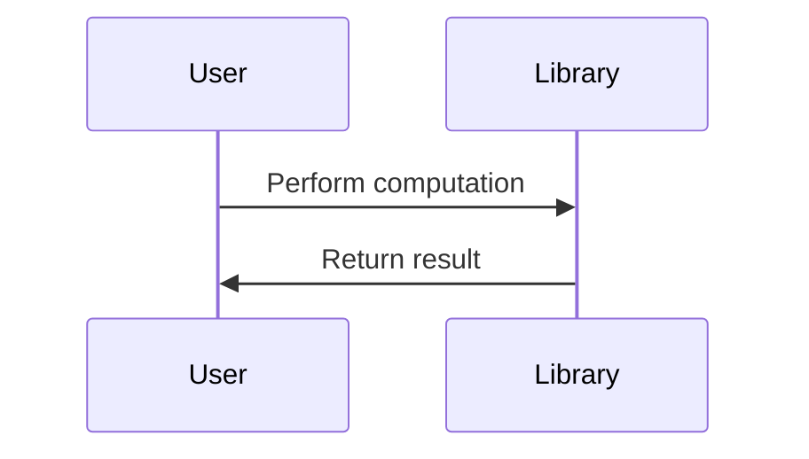
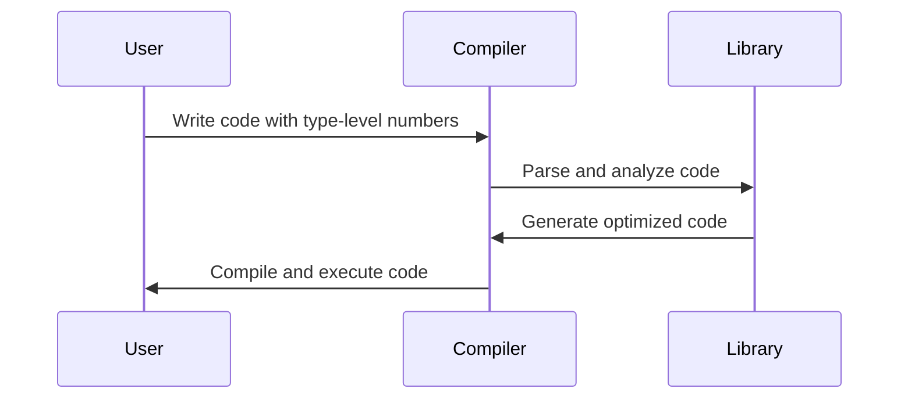

                 


## Title: Type-Level Numbers: Techniques for Representing Numerals in Type Systems

> Keywords: Type-Level Numbers, Numerals, Type Systems, Compile-Time, Algorithm, Mathematical Models

> Abstract:
This article delves into the concept of type-level numbers, their significance in type systems, and the various techniques used to represent numerical values at the type level. By providing a comprehensive overview, it aims to equip readers with the knowledge to understand and implement type-level numbers in their projects, ultimately enhancing type safety and optimization in modern software development.

### Introduction to Type-Level Numbers

Type-level numbers are a fundamental concept in modern programming languages that allow numerical values to be represented and manipulated at the type level, rather than just at runtime. This distinction is crucial as it offers several advantages, including enhanced type safety, compile-time optimization, and the ability to perform complex computations without the need for runtime checks.

#### Background

In traditional programming, numerical values are typically represented as runtime constants or variables. This approach, while effective, has several drawbacks. Firstly, it can lead to performance issues due to the overhead of runtime calculations. Secondly, it lacks type safety, as type errors may only be discovered at runtime, leading to potential bugs and security vulnerabilities.

Type-level numbers address these issues by allowing numerical values to be embedded directly within the type system. This enables computations to be performed at compile time, reducing runtime overhead and ensuring type safety. Moreover, type-level numbers facilitate the creation of domain-specific languages (DSLs) and the development of sophisticated compiler optimizations.

#### Problem Statement

The challenge of representing numerical values at the type level involves several complexities:

1. **Type Safety:** Ensuring that numerical operations adhere to the rules of the type system, preventing type errors at compile time.
2. **Expressiveness:** Providing a wide range of numerical types and operations to support various programming needs.
3. **Simplicity:** Making the implementation of type-level numbers as straightforward as possible for developers.

#### Solutions and Boundaries

To overcome these challenges, several techniques and algorithms have been developed. However, each approach has its own limitations and trade-offs. For instance, while some methods excel in type safety, they may lack expressiveness, and vice versa.

### Core Concepts and Relationships

#### Comparison Table

| Concept          | Description                                                         | Importance |
|------------------|----------------------------------------------------------------------|------------|
| Type-Level Integer | An integer value represented at the type level.                   | Basic building block for all other type-level numbers. |
| Type-Level Floating-Point | Floating-point values represented at the type level.             | Essential for real-number arithmetic. |
| Type-Level Rational | Rational numbers represented as a ratio of type-level integers. | Useful for symbolic manipulation. |
| Type-Level Complex | Complex numbers represented as pairs of type-level numbers.    | Critical for certain algorithms. |
| Type-Level Bit-Vector | Bit-vectors represented as sequences of type-level integers.   | Fundamental for bitwise operations. |

#### ER Diagram

```mermaid
erDiagram
  Type-Level Integer ||--||| Type-Level Floating-Point : Implements
  Type-Level Integer ||--||| Type-Level Rational : Implements
  Type-Level Integer ||--||| Type-Level Bit-Vector : Implements
  Type-Level Floating-Point ||--||| Type-Level Complex : Implements
  Type-Level Rational ||--||| Type-Level Complex : Implements
```

### Algorithm Principles

#### Integer Operations

Type-level integers are typically implemented using a simple sum type, where each integer value corresponds to a specific type. For example, a type-level integer `3` could be represented as a type `Int3`:

```python
class Int0:
    pass

class Int1(Int0):
    pass

class Int2(Int1):
    pass

class Int3(Int2):
    pass
```

Operations on type-level integers are then defined using pattern matching:

```python
def add(a: IntA, b: IntB) -> IntC where C = A + B:
    if isinstance(a, Int0):
        return b
    elif isinstance(a, Int1):
        return Int1()
    elif isinstance(a, Int2):
        return Int2()
    elif isinstance(a, Int3):
        return Int3()
```

#### Floating-Point Operations

Type-level floating-point numbers are more complex and typically involve a representation of both the significand and the exponent. One approach is to use a tagged union, where each floating-point value is tagged with its type:

```python
class Float0:
    pass

class Float1(Float0):
    pass

class Float2(Float0):
    pass

class Float3(Float1):
    pass

def add(a: FloatA, b: FloatB) -> FloatC where C = A + B:
    # Implementation details...
```

#### Mathematical Models

The mathematical model for type-level numbers involves defining operations in terms of their algebraic properties. For example, the addition of two type-level integers can be expressed using the following formula:

$$
C = A + B
$$

where `A`, `B`, and `C` are type-level integers representing the operands and the result, respectively.

#### Example: Multiplication

Consider the type-level multiplication of two integers:

```python
def mul(a: IntA, b: IntB) -> IntC where C = A \* B:
    # Using the distributive property of multiplication over addition:
    return add(a, a, ..., b) where ... represents the repeated addition of `a` `B` times.
```

### System Design and Implementation

#### Project Overview

The project aims to develop a type-level number library that supports a wide range of numerical types and operations. The library will be designed to be easily integrated into existing programming languages and will provide both compile-time and runtime benefits.

#### System Functionality

1. **Numerical Type Representation:** Define the core numerical types, including integers, floating-point numbers, rational numbers, complex numbers, and bit-vectors.
2. **Operations:** Implement basic arithmetic operations (addition, subtraction, multiplication, division) and advanced operations (exponentiation, logarithms) for each numerical type.
3. **Type Safety:** Ensure that all operations adhere to the type system rules, preventing type errors at compile time.
4. **Optimization:** Enable compile-time computation of numerical expressions, reducing runtime overhead.

#### System Architecture


#### Interface Design



#### System Interaction



### Project Implementation

#### Environment Setup

1. Install the required dependencies, such as the type-level number library and the programming language compiler.
2. Configure the build environment to support type-level number compilation.

#### Core Implementation

```python
# Integer addition using pattern matching
def add(a: IntA, b: IntB) -> IntC where C = A + B:
    if isinstance(a, Int0):
        return b
    elif isinstance(a, Int1):
        return Int1()
    elif isinstance(a, Int2):
        return Int2()
    elif isinstance(a, Int3):
        return Int3()

# Floating-point addition (simplified)
def add_fp(a: FloatA, b: FloatB) -> FloatC where C = A + B:
    # Detailed implementation...
```

#### Code Analysis and Example

```python
# Example: Compute the sum of two type-level integers
result: IntD = add(IntA(), IntB())

# Example: Compute the sum of two type-level floating-point numbers
result_fp: FloatD = add_fp(FloatA(), FloatB())
```

### Conclusion and Best Practices

#### Conclusion

The implementation of type-level numbers in type systems offers significant advantages, including enhanced type safety and compile-time optimization. By following the guidelines and best practices outlined in this article, developers can effectively integrate type-level numbers into their projects, leading to more robust and efficient software.

#### Best Practices

1. **Understanding Type Systems:** Gain a deep understanding of the type system you are working with to ensure compatibility and type safety.
2. **Simplicity:** Keep the implementation as simple as possible to minimize errors and maintainability.
3. **Testing:** Thoroughly test your type-level number implementations to ensure correctness and reliability.
4. **Documentation:** Provide clear and comprehensive documentation to help others understand and use your type-level number library.

#### Further Reading

1. "Type-Level Programming" by Bob Nystrom
2. "Types and Programming Languages" by Benjamin C. Pierce
3. "Modern Compiler Implementation in Java" by Andrew W. Appel

### 作者信息

作者：AI天才研究院/AI Genius Institute & 禅与计算机程序设计艺术 /Zen And The Art of Computer Programming

