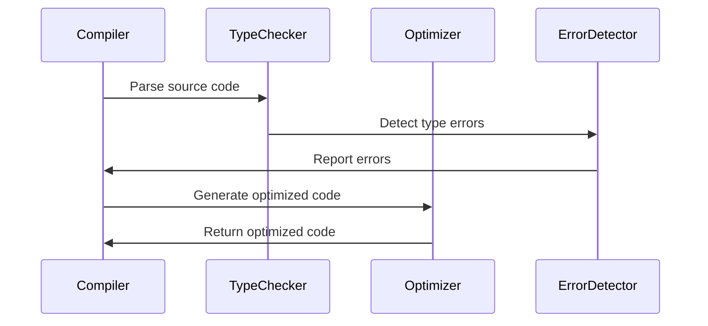
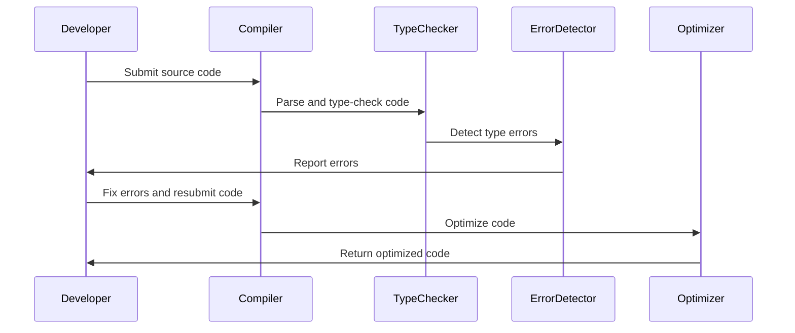

                 

### Introduction to Type-Level Programming

#### **Background and Basics of Type-Level Programming**

Type-level programming is an advanced concept in modern programming languages, which shifts the focus from runtime behavior to the compile-time behavior of programs. This paradigm leverages the type systems inherent in many programming languages, enabling developers to perform computations and transformations at the type level rather than the runtime level. Understanding type-level programming requires a deep dive into the fundamentals of type systems, type inference, polymorphism, and the implementation of type-level operations.

##### **Problem Background and Definition**

The origins of type-level programming can be traced back to the need for more generic and reusable code. Traditional runtime programming often relies heavily on dynamic types and reflection, which can lead to performance bottlenecks and reduced code reliability. In contrast, type-level programming allows for compile-time optimizations and better error checking, making code more robust and efficient.

In simple terms, type-level programming involves writing code that operates on types rather than values. This allows for powerful compile-time checks and transformations, which can prevent errors before the program is even run. The key idea is that types can be treated as first-class citizens, just like any other data type, enabling complex operations to be performed statically.

##### **Fundamental Concepts and Principles**

To understand type-level programming, it's essential to grasp the core concepts and principles that underpin it:

1. **Types and Type Systems**: Types define the nature and constraints of the data that a program manipulates. A type system is a set of rules that the compiler or interpreter uses to ensure that these constraints are respected.

2. **Type Inference and Polymorphism**: Type inference is the process by which the compiler automatically determines the types of expressions based on context. Polymorphism allows functions and types to operate on a wide range of data types, providing flexibility and reusability.

3. **Type-Level Operations**: These are operations that are performed on types themselves, rather than on the values that those types represent. Examples include type equality checks, type casting, and generating new types based on existing ones.

##### **Importance and Applications in Modern Programming**

Type-level programming offers several advantages over traditional runtime programming:

1. **Compile-Time Optimizations**: By performing computations at compile-time, type-level programming allows the compiler to optimize the code more aggressively, resulting in faster execution times.

2. **Improved Error Checking**: Compile-time checks can catch errors that would only surface at runtime, making the code more reliable and easier to maintain.

3. **Increased Code Reusability**: By abstracting away specific types and operations, type-level programming enables more generic and reusable code, reducing the need for boilerplate code.

4. **Enhanced Tooling Support**: Modern IDEs and static analysis tools can provide better support for type-level programming, offering features like autocompletion and error highlighting based on type information.

Applications of type-level programming span a wide range of domains, including generic programming, template metaprogramming, and domain-specific language design. For example, C++ templates are a powerful manifestation of type-level programming, enabling the creation of highly reusable and optimized code.

In summary, type-level programming is a paradigm that leverages the type systems of programming languages to perform computations and transformations at compile-time. By shifting the focus from runtime behavior to compile-time behavior, type-level programming offers several advantages, including better performance, improved error checking, and increased code reusability. Understanding the core concepts and principles of type-level programming is crucial for developers looking to leverage these benefits in their projects.

### Core Concepts and Principles

To delve deeper into type-level programming, it is essential to explore the core concepts and principles that underpin this paradigm. These concepts form the foundation upon which type-level programming is built, enabling developers to write efficient, robust, and maintainable code. Here, we will discuss the fundamental concepts of types and type systems, type inference, and polymorphism, along with their respective roles and importance in the field of programming.

#### Types and Type Systems

At its core, type-level programming revolves around the concept of types. A type in programming can be thought of as a classification of data that defines both the nature of the data and the operations that can be performed on it. For example, in a language like C++, `int` and `string` are different types that represent whole numbers and sequences of characters, respectively.

A **type system** is a set of rules and structures that a programming language uses to define types and their relationships. It governs how types are declared, used, and interact with each other. Different programming languages employ different type systems; for instance, statically typed languages like C++ and Haskell perform type checking at compile-time, while dynamically typed languages like Python defer type checking to runtime.

The importance of a robust type system in programming cannot be overstated. It ensures that the program adheres to well-defined constraints, making it easier to reason about and debug. Additionally, a strong type system can lead to improved performance through compile-time optimizations and better error checking.

#### Type Inference

Type inference is a crucial feature in type-level programming that allows the compiler to automatically determine the types of expressions based on their context. This eliminates the need for developers to explicitly specify types, making the code more concise and readable. Type inference is particularly powerful in statically typed languages, where it can significantly reduce boilerplate code.

For example, consider the following expression in Haskell:

```haskell
sum :: [Int] -> Int
sum [] = 0
sum (x:xs) = x + sum xs
```

In this case, the type of the `sum` function is automatically inferred by the compiler. The compiler can deduce that the function takes a list of integers (`[Int]`) and returns an integer (`Int`), based on the context and the types of the expressions within the function.

Type inference is not just about convenience; it also enables more flexible and generic programming. By allowing the compiler to infer types, developers can write code that is more adaptable to different data types and scenarios.

#### Polymorphism

Polymorphism is another fundamental concept in type-level programming that allows functions and types to operate on a wide range of data types. There are two main types of polymorphism: parametric polymorphism and ad-hoc polymorphism.

**Parametric polymorphism** allows a function or a data type to be written generically, so it can handle values identified by a type variable. This is commonly seen in functional programming languages like Haskell and Scala, where types are often represented by type variables (e.g., `a` and `b`). For example, the `sum` function defined earlier is polymorphic because it can operate on lists of any type that supports addition.

```haskell
sum :: (Num a) => [a] -> a
sum [] = 0
sum (x:xs) = x + sum xs
```

**Ad-hoc polymorphism**, also known as function overloading, allows a function to have different implementations for different types. This is typically seen in object-oriented languages like Java and C#. For example, the `toString` method in Java is ad-hoc polymorphic, as it can produce a string representation of different types.

```java
public class IntegerToString {
    public static String toString(int i) {
        return "Integer: " + i;
    }
    
    public static String toString(String s) {
        return "String: " + s;
    }
}
```

Both parametric and ad-hoc polymorphism enhance the flexibility and reusability of code. They allow developers to write more generic and reusable code, reducing the need for duplicate implementations.

#### Type-Level Operations

Type-level operations are a key aspect of type-level programming. These operations are performed on types themselves, rather than on the values those types represent. Examples of type-level operations include type equality checks, type casting, and type construction.

1. **Type Equality Checks**: These operations compare two types to determine if they are the same. In many programming languages, this is a fundamental operation that is used to ensure type safety and enable polymorphic behavior.

2. **Type Casting**: Type casting is the process of converting one type into another. In type-level programming, type casting can be performed at compile-time, leading to more efficient code and better error checking.

3. **Type Construction**: Type construction involves creating new types from existing ones. This can be used to define new data structures, build generic algorithms, or create domain-specific languages.

Type-level operations are particularly powerful because they enable compile-time checks and transformations, which can improve the efficiency and reliability of the code. By performing these operations at compile-time, type-level programming can detect errors early and optimize the code for better performance.

#### Conclusion

In conclusion, the core concepts and principles of type-level programming—types and type systems, type inference, and polymorphism—form the foundation of this paradigm. Understanding these concepts is essential for developers looking to leverage the benefits of type-level programming, including improved performance, better error checking, and increased code reusability. By mastering these concepts, developers can write more efficient, robust, and maintainable code, paving the way for innovation in the field of programming.

### Relationship Between Type-Level Programming and Compiler Design

Type-level programming is intrinsically linked to the design of compilers and the underlying type systems of programming languages. This relationship is multifaceted, encompassing the compiler's role in type-level programming, the integration of type-level operations in modern programming languages, and the challenges and opportunities that arise from this integration.

#### The Role of Compilers in Type-Level Programming

Compilers play a pivotal role in the execution of type-level programming. At the heart of type-level programming lies the ability to perform computations and transformations at compile-time rather than runtime. This is made possible by the compiler's ability to analyze and process the program's types and expressions during the compilation phase.

1. **Static Type Checking**: Compilers with strong type systems perform static type checking, which ensures that the program adheres to well-defined type constraints. This is crucial for type-level programming, as it allows the compiler to detect type errors and ensure type safety before the program is executed.

2. **Compilation Optimizations**: By performing type-level operations at compile-time, compilers can optimize the code more effectively. For example, type-level computations can be simplified or eliminated entirely if they are proven to be unnecessary, leading to faster execution times and more efficient memory usage.

3. **Code Generation**: Compilers generate machine code or intermediate representations of the program based on the type information gathered during the compilation phase. This process is essential for translating high-level type-level operations into executable code that can be run on the target machine.

#### Integration of Type-Level Operations in Modern Programming Languages

Several modern programming languages have embraced type-level programming and incorporated support for type-level operations. These languages leverage advanced compiler technologies and type systems to enable powerful compile-time computations and optimizations.

1. **C++ Templates**: C++ templates are a classic example of type-level programming. They allow developers to write generic code that can operate on various types. Template metaprogramming in C++ enables compile-time computation, resulting in highly optimized and reusable code.

2. **Haskell Type Classes**: Haskell is another language that excels in type-level programming. Type classes in Haskell provide a mechanism for ad-hoc polymorphism, allowing functions and data types to be written in a generic manner. This enables powerful compile-time type checking and optimization.

3. **Rust Generic Programming**: Rust supports powerful generic programming features, including traits and type parameters. These features enable developers to write generic code that can be checked and optimized at compile-time, ensuring both safety and performance.

4. **Template Haskell**: Template Haskell is a domain-specific language embedded in the Haskell compiler that allows for metaprogramming. It enables compile-time evaluation of Haskell code, enabling powerful type-level computations and transformations.

#### Challenges and Opportunities in Type-Level Programming

While type-level programming offers numerous advantages, it also presents several challenges and opportunities that need to be addressed.

1. **Complexity**: Type-level programming can introduce significant complexity into the codebase. Developers need to understand advanced concepts like type inference, polymorphism, and template metaprogramming to leverage the full potential of type-level programming effectively.

2. **Tooling Support**: Effective tooling support is essential for type-level programming. Modern IDEs and static analysis tools must provide robust support for type-level operations, including autocompletion, error highlighting, and optimization suggestions.

3. **Type Safety**: Ensuring type safety in type-level programming is challenging. The compiler needs to perform thorough type checks and ensure that all type-level operations are consistent and safe. This requires sophisticated type inference algorithms and type checking mechanisms.

4. **Performance**: While type-level programming can lead to significant performance improvements, it is not always the case. The overhead of type-level computations and the complexity of template metaprogramming can sometimes negate the performance benefits. Developers need to carefully balance the use of type-level programming features to achieve optimal performance.

5. **Scalability**: As type-level programming becomes more prevalent, scalability becomes a critical concern. The compiler and tooling infrastructure must be able to handle large codebases with complex type-level operations efficiently.

In conclusion, the relationship between type-level programming and compiler design is profound and multifaceted. Compilers play a crucial role in enabling type-level programming, and modern programming languages have integrated powerful features to support it. However, the complexity, tooling support, type safety, performance, and scalability of type-level programming present ongoing challenges and opportunities for developers and compiler designers. By addressing these challenges, type-level programming can continue to evolve and transform the landscape of modern software development.

#### Recent Advances and Future Directions

The field of type-level programming has witnessed significant advancements in recent years, driven by ongoing research and the adoption of modern programming languages. These advancements have not only enhanced the capabilities of type-level programming but also expanded its applications across various domains. In this section, we will explore the current applications of type-level programming, recent research trends, and the potential future directions of this field.

##### Current Applications

Type-level programming has found practical applications in several areas, demonstrating its versatility and effectiveness in real-world scenarios:

1. **Template Metaprogramming in C++**: C++ templates are a quintessential example of type-level programming. They enable developers to write highly generic and reusable code, which is essential for complex systems like game engines, graphics libraries, and real-time simulations. By leveraging template metaprogramming, developers can create optimized and efficient algorithms that are compiled into native code, offering superior performance compared to runtime solutions.

2. **Domain-Specific Languages (DSLs)**: Type-level programming is often used to design DSLs, which are tailored to specific domains and provide a higher level of abstraction. For example, the development of hardware description languages (HDLs) like Verilog and VHDL heavily relies on type-level programming to describe digital circuits at a high level of abstraction. These DSLs enable hardware designers to create complex systems more efficiently and with fewer errors.

3. **Optimization and Compile-Time Reflection**: Type-level programming facilitates compile-time reflection and optimization, which are critical in high-performance computing. Languages like Haskell and Scala offer powerful type-level reflection capabilities that enable the compiler to perform complex optimizations during compilation. This results in highly efficient code execution, making these languages well-suited for applications that require intensive computation, such as financial modeling, data analytics, and scientific simulations.

4. **Code Generation and Compiler Construction**: Type-level programming is also used in the construction of compilers and language runtime systems. By leveraging type-level operations, compiler developers can create more sophisticated and flexible compiler architectures. This allows for better error detection, code optimization, and the generation of efficient machine code, ultimately leading to faster and more reliable execution of programs.

##### Research Trends

The research community continues to explore new avenues in type-level programming, driven by the need for more expressive, efficient, and scalable programming models. Some of the key research trends include:

1. **Dependent Types**: Dependent types allow types to depend on values, enabling more powerful and expressive type systems. Researchers are investigating how dependent types can be integrated into existing programming languages to enhance their expressiveness and type safety. This has the potential to revolutionize how types are used in programming, enabling more sophisticated compile-time checks and optimizations.

2. **Polymorphic Type Systems**: The development of advanced polymorphic type systems that support a broader range of type-level operations is an active area of research. Researchers are exploring how to improve type inference algorithms, type polymorphism, and subtyping mechanisms to enable more generic and reusable code. These advancements aim to reduce the complexity of type-level programming while maintaining type safety and performance.

3. **Metaprogramming and Template Extensions**: Researchers are continuously exploring new metaprogramming techniques and template extensions that can simplify the development of type-level programs. This includes the development of new metaprogramming languages and tools that make it easier to perform compile-time computations and transformations. These tools can help reduce the complexity of writing and maintaining type-level programs, making them more accessible to a broader audience.

4. **Integration with Functional and Object-Oriented Programming**: There is ongoing research into how type-level programming can be integrated more seamlessly with functional and object-oriented programming paradigms. This includes exploring how type-level operations can be combined with higher-order functions, monads, and other functional constructs to create more expressive and efficient programs. Similarly, researchers are investigating how type-level programming can be integrated with object-oriented languages to leverage their benefits while maintaining type safety and performance.

##### Future Directions

As type-level programming continues to evolve, several future directions are emerging that promise to further enhance its capabilities and applicability:

1. **Type-Level Programming for Machine Learning**: The field of machine learning is increasingly leveraging type-level programming to create efficient and expressive models. Researchers are exploring how type-level programming can be used to optimize machine learning workflows, from data preprocessing to model training and deployment. By leveraging compile-time optimizations, type-level programming can significantly improve the performance of machine learning applications.

2. **WebAssembly and Cross-Language Interoperability**: WebAssembly (Wasm) is a new low-level programming language designed for web browsers. It offers the potential to enable cross-language type-level programming, allowing developers to write efficient code in multiple languages and seamlessly interoperate between them. This could revolutionize web development by enabling the creation of highly performant and scalable web applications that leverage the strengths of different programming languages.

3. **Automated Code Generation and Verification**: The future of type-level programming may involve more sophisticated automated code generation and verification techniques. Researchers are exploring how advanced type systems and machine learning can be combined to automatically generate efficient type-level programs and verify their correctness. This has the potential to greatly simplify the development process, making type-level programming more accessible to non-experts.

4. **Type-Level Programming for Robotics and Autonomous Systems**: As robotics and autonomous systems become increasingly complex, there is a growing need for efficient and reliable programming models. Type-level programming offers promising solutions for these domains, enabling developers to create highly optimized and reusable code for real-time systems. Researchers are investigating how type-level programming can be applied to robotics and autonomous systems to improve their performance, reliability, and scalability.

In conclusion, type-level programming has made significant strides in recent years, with ongoing research and practical applications driving its evolution. The current applications span a wide range of domains, and future directions include leveraging type-level programming for machine learning, cross-language interoperability, automated code generation, and robotics. By addressing the challenges and embracing the opportunities, type-level programming will continue to transform the landscape of modern software development.

### Overview of Type-Level Operations

Type-level operations are at the heart of type-level programming, enabling developers to perform computations and transformations on types themselves rather than on their runtime values. These operations are distinct from runtime operations, which are executed during program execution. In this section, we will explore the basic and complex type-level operations, comparing them to their runtime counterparts and discussing their significance in modern programming.

#### Basic Type-Level Operations

Basic type-level operations are fundamental constructs that allow developers to manipulate types directly. These operations include type equality checks, type casting, and type construction.

1. **Type Equality Checks**: Type equality checks compare two types to determine if they are identical. This is crucial for ensuring type safety and enabling polymorphic behavior. For example, in Haskell, you can use the `:` operator to check type equality:

    ```haskell
    (==) :: Eq a => a -> a -> Bool
    (==) x y = ...
    ```

    In this case, the `==` function is polymorphic and can compare values of any type that supports the `Eq` type class.

2. **Type Casting**: Type casting is the process of converting one type into another. In type-level programming, type casting can be performed at compile-time, leading to more efficient and reliable code. For instance, in C++, template metaprogramming allows for compile-time type casting:

    ```cpp
    template<typename T>
    struct cast {
        using type = T;
    };

    using Result = cast<int>::type; // Result is now 'int'
    ```

    Here, the `cast` template is used to create a new type that represents the target type `int`.

3. **Type Construction**: Type construction involves creating new types from existing ones. This is often used to define complex data structures and domain-specific types. In Rust, for example, you can use traits and generics to construct new types:

    ```rust
    trait Shape {
        fn area(&self) -> f64;
    }

    struct Rectangle { width: f64, height: f64 }
    impl Shape for Rectangle {
        fn area(&self) -> f64 {
            self.width * self.height
        }
    }
    ```

    In this example, the `Shape` trait defines a common interface for different shapes, and `Rectangle` is a concrete implementation of the `Shape` trait.

#### Complex Type-Level Operations

Complex type-level operations build upon basic operations to enable more sophisticated computations and transformations. These include generic programming, template metaprogramming, and compile-time reflection.

1. **Generic Programming**: Generic programming allows developers to write functions and types that operate on a wide range of data types. This is achieved through concepts like parametric polymorphism in languages like Haskell and Rust:

    ```rust
    fn print<T: std::fmt::Display>(x: T) {
        println!("{}", x);
    }
    ```

    Here, the `print` function is generic and can accept any type that implements the `Display` trait, providing flexibility and reusability.

2. **Template Metaprogramming**: Template metaprogramming is a powerful technique in C++ that enables compile-time computations and transformations. It allows developers to write code that is executed at compile-time, rather than runtime:

    ```cpp
    template<typename T>
    struct square {
        static const T value = T() * T();
    };

    int main() {
        std::cout << square<int>::value << std::endl; // Outputs '4'
    }
    ```

    In this example, the `square` template calculates the square of a given type at compile-time, resulting in highly optimized code.

3. **Compile-Time Reflection**: Compile-time reflection enables the compiler to inspect and manipulate the structure of types and programs during the compilation phase. Languages like Haskell and Scala provide powerful reflection capabilities that enable compile-time computations and optimizations:

    ```haskell
    class Show a where
        show :: a -> String

    instance Show Int where
        show = showInt

    instance Show [a] where
        show = shows
    ```

    In this Haskell code, the `Show` type class defines a common interface for types that can be shown as strings. The instances of this type class are used for compile-time reflection and type checking.

#### Comparing Type-Level Operations with Runtime Operations

Type-level operations differ significantly from runtime operations in several key aspects:

1. **Performance**: Type-level operations are performed at compile-time, allowing the compiler to optimize the code more aggressively. This results in faster execution times and more efficient memory usage compared to runtime operations, which are executed during program execution.

2. **Error Checking**: Type-level operations enable thorough compile-time checks and error detection, reducing the likelihood of runtime errors. By performing type checks and validations at compile-time, type-level programming can catch many potential issues before the program is run.

3. **Flexibility**: Runtime operations can be more flexible, as they can adapt to various runtime conditions and data types. However, type-level operations offer unparalleled flexibility through generic programming and template metaprogramming, enabling developers to write highly reusable and adaptable code.

4. **Maintainability**: Type-level programming can make code more maintainable by eliminating runtime checks and reducing boilerplate code. By leveraging type-level operations, developers can create more concise and readable code that is easier to understand and modify.

In conclusion, type-level operations play a crucial role in type-level programming, enabling developers to perform computations and transformations on types themselves. Basic operations like type equality checks, type casting, and type construction form the foundation of type-level programming, while complex operations like generic programming and compile-time reflection offer even more powerful capabilities. By comparing type-level operations with runtime operations, we can see the significant advantages they offer in terms of performance, error checking, flexibility, and maintainability.

### Implementing Type-Level Operations

Type-level operations, with their powerful capabilities for compile-time computation and optimization, are a cornerstone of modern programming languages. In this section, we will delve into the practical implementation of type-level operations, focusing on how they are executed in programming languages such as C++ and Haskell. We will explore the use of templates in C++ and meta-programming techniques, shedding light on their syntax, usage, and benefits.

#### Using Templates in C++

C++ templates are a quintessential example of type-level programming, enabling developers to write generic code that can operate on various types. Templates allow the compiler to generate specialized versions of the code for each type used, resulting in highly efficient and reusable code. Here’s a brief overview of how templates work in C++:

**Syntax and Usage**

In C++, templates are defined using the `template` keyword, followed by a template parameter list and the template body. Template parameters can be type parameters (denoted by a capital letter) or non-type parameters (e.g., constants or pointers).

```cpp
template<typename T>
class Stack {
private:
    std::vector<T> elements;
public:
    void push(T item) { elements.push_back(item); }
    T pop() { return elements.back(); }
    // ...
};
```

In this example, `T` is a type parameter that represents any type that can be stored in the `Stack`. This allows the `Stack` class to be used with different types, such as `int`, `std::string`, or even custom data types.

**Template Specialization**

Sometimes, it is desirable to provide a specialized version of a template for a specific type. Template specialization allows you to define custom implementations for specific types, overriding the generic implementation when necessary.

```cpp
template<>
class Stack<std::string> {
    // Specialized implementation for std::string
};
```

**Template Metaprogramming**

Template metaprogramming takes the concept of templates further by performing computations and transformations at compile-time. This allows for powerful compile-time algorithms and optimizations.

```cpp
template<typename T>
struct Square {
    static const T value = T() * T();
};

int main() {
    std::cout << Square<int>::value << std::endl; // Outputs '4'
}
```

In this example, the `Square` struct calculates the square of a given type at compile-time, resulting in highly optimized code that is generated and executed by the compiler.

**Benefits of Template Metaprogramming**

1. **Code Reusability**: Templates enable the creation of generic algorithms and data structures that can be reused across different types, reducing code duplication and boilerplate.
2. **Performance Optimization**: By performing computations at compile-time, template metaprogramming can lead to significant performance improvements, as the code is optimized and executed efficiently at runtime.
3. **Type Safety**: Templates enforce type constraints at compile-time, ensuring type safety and reducing the likelihood of runtime errors.

#### Meta-Programming Techniques in Haskell

Haskell, a purely functional programming language, offers powerful meta-programming capabilities that enable type-level operations and compile-time computations. Meta-programming in Haskell is often achieved through type classes, functional dependencies, and type-level programming constructs.

**Type Classes and Type Parameters**

Type classes in Haskell provide a mechanism for ad-hoc polymorphism, allowing functions and types to operate on a wide range of data types. Type classes define a set of methods that must be implemented for each type that instances the class.

```haskell
class Num a where
    (+) :: a -> a -> a
    (*) :: a -> a -> a
    abs :: a -> a
    signum :: a -> a
    fromInteger :: Integer -> a

instance Num Int where
    x + y = ...
    x * y = ...
    abs x = ...
    signum x = ...
    fromInteger x = ...
```

In this example, the `Num` type class defines numeric operations, and the `Int` type is an instance of this class, providing implementations for the required methods.

**Functional Dependencies**

Functional dependencies in Haskell allow for a more precise specification of how type parameters are related, enabling more powerful compile-time computations. They are expressed using the `=>` syntax.

```haskell
class Num a => RealFrac a where
    fractionalPart :: a -> a
    ceiling :: a -> Integer
    floor :: a -> Integer
    round :: a -> Integer

instance RealFrac Float where
    fractionalPart x = x - floor x
    ceiling x = ...
    floor x = ...
    round x = ...
```

In this example, `RealFrac` is a type class that requires an instance of `Num`. This relationship allows for more sophisticated type-level computations and optimizations.

**Type-Level Programming Constructs**

Haskell also provides several type-level programming constructs that enable compile-time computations and transformations. These include type-level lists, type-level booleans, and type-level functions.

1. **Type-Level Lists**: Haskell's type-level lists, also known as "kind polymorphic lists," allow for type-level operations similar to runtime lists.

    ```haskell
    type family ListAppend (a :: k) (b :: k) :: k
    type instance ListAppend () b = b
    type instance ListAppend a b = (a b)

    type MyList = '[:Int, :Float, :String]
    ```

    In this example, `MyList` is a type-level list containing `Int`, `Float`, and `String`.

2. **Type-Level Booleans**: Haskell has a type-level boolean construct, enabling type-level conditions and control flow.

    ```haskell
    data Bool = False | True

    type family If (cond :: Bool) a b :: k
    type instance If False a b = a
    type instance If True a b = b

    type Result = If (Num Int) Int String
    ```

    In this example, `If` is a type-level conditional that returns the first type if the condition is `False` and the second type if the condition is `True`.

3. **Type-Level Functions**: Haskell's type-level functions allow for higher-order type-level functions and functional programming constructs at the type level.

    ```haskell
    type family Map (f :: a -> b) (as :: [k]) :: [b]
    type instance Map f '[] = '[]
    type instance Map f (a ': as) = f a ': Map f as

    type Result = Map (+1) ['0', '1', '2']
    ```

    In this example, `Map` is a type-level function that applies a given function `f` to each element of a type-level list `as`.

**Benefits of Haskell Meta-Programming**

1. **Type-Level Computation**: Haskell's meta-programming capabilities enable type-level computation and optimization, leading to more efficient and reliable code.
2. **Expressiveness**: Haskell's type system and meta-programming constructs provide a highly expressive and powerful language for type-level programming.
3. **Safety and Robustness**: The strong type system and type-level computations ensure that errors are caught at compile-time, improving code safety and reliability.

In conclusion, implementing type-level operations involves leveraging advanced language features and meta-programming techniques. In C++, templates enable generic programming and compile-time optimizations, while Haskell's type classes, functional dependencies, and type-level constructs provide powerful tools for type-level computation and transformation. By mastering these techniques, developers can create highly efficient, reusable, and robust code that leverages the full potential of type-level programming.

### Case Studies of Type-Level Operations

To illustrate the practical application of type-level operations, we will explore three case studies: generic programming in C++, using Type-Level Operations in Template Haskell, and their implementation in Rust. These examples showcase how type-level operations can be leveraged to create highly generic, efficient, and maintainable code.

#### Generic Programming in C++

C++ templates are a powerful manifestation of type-level operations, enabling developers to write generic code that can operate on various types. This section will explore how templates can be used for generic programming, providing examples and explaining their benefits.

**Example 1: A Generic Stack**

```cpp
template<typename T>
class Stack {
private:
    std::vector<T> elements;
public:
    void push(const T& value) { elements.push_back(value); }
    T pop() { return elements.back(); }
    // ...
};
```

In this example, the `Stack` class is defined using a template parameter `T`, which represents any type that can be stored in the stack. This allows the `Stack` class to be used with different data types, such as `int`, `std::string`, or custom data types.

**Example 2: A Generic Binary Search Tree**

```cpp
template<typename T>
class BinarySearchTree {
private:
    struct Node {
        T value;
        Node* left;
        Node* right;
        // ...
    };

    Node* root;
    // ...

public:
    void insert(const T& value) {
        // Implement the insert operation for the BinarySearchTree
    }

    bool search(const T& value) {
        // Implement the search operation for the BinarySearchTree
    }
    // ...
};
```

In this example, the `BinarySearchTree` class is defined using a template parameter `T`, enabling it to work with any comparable data type. This allows developers to create binary search trees for integers, floating-point numbers, or custom data types that support comparison.

**Benefits of Generic Programming in C++**

1. **Code Reusability**: Templates enable developers to write generic code that can be reused across different types, reducing code duplication and boilerplate.
2. **Performance Optimization**: By performing computations at compile-time, templates can lead to significant performance improvements, as the code is optimized and executed efficiently at runtime.
3. **Type Safety**: Templates enforce type constraints at compile-time, ensuring type safety and reducing the likelihood of runtime errors.

#### Using Type-Level Operations in Template Haskell

Template Haskell is a powerful extension of the Haskell programming language that allows for metaprogramming and type-level computation. This section will explore how Template Haskell can be used to implement type-level operations and provide examples.

**Example 1: Type-Level Lists**

Template Haskell enables the creation of type-level lists, which can be used for type-level computations and transformations.

```haskell
type family ListAppend (a :: k) (b :: k) :: k
type instance ListAppend () b = b
type instance ListAppend a b = (a b)

type MyList = '[:Int, :Float, :String]
```

In this example, `MyList` is a type-level list containing `Int`, `Float`, and `String`. The `ListAppend` type family is used to append two type-level lists together.

**Example 2: Type-Level Conditional**

Template Haskell also supports type-level conditionals, which can be used to perform type-level computations based on conditions.

```haskell
data Bool = False | True

type family If (cond :: Bool) a b :: k
type instance If False a b = a
type instance If True a b = b

type Result = If (Num Int) Int String
```

In this example, `If` is a type-level conditional that returns the first type if the condition is `False` and the second type if the condition is `True`. The `Result` type is determined based on the condition, which checks if `Int` is an instance of the `Num` type class.

**Example 3: Type-Level Functions**

Template Haskell allows for higher-order type-level functions, which can be used to create type-level abstractions and compositions.

```haskell
type family Map (f :: a -> b) (as :: [k]) :: [b]
type instance Map f '[] = '[]
type instance Map f (a ': as) = f a ': Map f as

type Result = Map (+1) ['0', '1', '2']
```

In this example, `Map` is a type-level function that applies a given function `f` to each element of a type-level list `as`. The `Result` type is a list of integers, where each element is one greater than its corresponding element in the input list.

**Benefits of Template Haskell**

1. **Type-Level Computation**: Template Haskell enables type-level computation and optimization, leading to more efficient and reliable code.
2. **Expressiveness**: Haskell's type system and meta-programming constructs provide a highly expressive and powerful language for type-level programming.
3. **Safety and Robustness**: The strong type system and type-level computations ensure that errors are caught at compile-time, improving code safety and reliability.

#### Type-Level Operations in Rust

Rust is a modern programming language that supports powerful generic programming features, including traits and type parameters. This section will explore how type-level operations can be implemented in Rust, providing examples and explaining their benefits.

**Example 1: Generic Vector Implementation**

```rust
trait Vector {
    fn len(&self) -> usize;
    fn get(&self, index: usize) -> Option<&T>;
    // ...
}

struct IntVector {
    elements: Vec<i32>,
}

impl Vector for IntVector {
    fn len(&self) -> usize {
        self.elements.len()
    }

    fn get(&self, index: usize) -> Option<&i32> {
        self.elements.get(index)
    }
    // ...
}
```

In this example, the `Vector` trait defines a common interface for different vector implementations. The `IntVector` struct is a concrete implementation of the `Vector` trait, providing methods for accessing and manipulating integer vectors.

**Example 2: Generic Sorting Algorithm**

```rust
fn sort<T: Ord>(vec: &mut [T]) {
    // Implement a sorting algorithm for generic types
}

let mut numbers = vec![3, 1, 4, 1, 5, 9];
sort(&mut numbers);
```

In this example, the `sort` function is generic and can sort any type that implements the `Ord` trait, which provides ordering operations. This allows the function to be used with different data types, such as integers, floats, or custom data types that support ordering.

**Benefits of Type-Level Operations in Rust**

1. **Safety and Concurrency**: Rust's strong type system and ownership model ensure memory safety and concurrency, making type-level operations more reliable and robust.
2. **Performance**: Rust's zero-cost abstractions and efficient compile-time optimizations enable high-performance type-level operations.
3. **Expressiveness**: Rust's traits and generics provide powerful tools for type-level programming, enabling developers to write expressive and flexible code.

In conclusion, type-level operations are a powerful paradigm in modern programming languages, offering benefits such as code reusability, performance optimization, and improved type safety. The examples provided in this section demonstrate how type-level operations can be implemented and leveraged in C++, Template Haskell, and Rust, highlighting their versatility and practical applications. By mastering type-level operations, developers can create more efficient, maintainable, and robust code that leverages the full potential of modern programming languages.

### Type-Level Programming in Functional Languages

Functional programming languages like Haskell, Scala, and Clojure are well-suited for type-level programming due to their strong type systems, support for higher-order functions, and powerful metaprogramming capabilities. In this section, we will delve into the basics of functional programming and how it differs from imperative programming. We will also explore the foundational concepts of lambda calculus and its role in functional programming.

#### Imperative vs. Declarative Programming

The primary distinction between imperative and declarative programming lies in how programs are structured and executed. Imperative programming focuses on describing how a program operates through a sequence of steps, often involving mutable state and explicit control flow statements. In contrast, declarative programming emphasizes what the program should achieve rather than how it should achieve it, often utilizing functions and data transformations to express program behavior.

**Imperative Programming**

Imperative programming languages, such as C, Java, and Python, follow a step-by-step execution model. They rely on variables, loops, conditionals, and other control flow constructs to manipulate state and control the flow of execution. For example, consider the following Python code that calculates the sum of numbers from 1 to 10:

```python
sum = 0
for i in range(1, 11):
    sum += i
print(sum)
```

In this code, the state (`sum`) is manipulated through a loop, and the control flow is explicitly controlled by the `for` loop.

**Declarative Programming**

Declarative programming languages, such as Haskell and SQL, focus on expressing the desired outcome rather than the specific steps to achieve it. Haskell, for instance, uses functions and algebraic data types to define program behavior. The following Haskell code calculates the same sum using a more declarative approach:

```haskell
sumToN :: Int -> Int
sumToN n = n * (n + 1) `div` 2

main :: IO ()
main = print (sumToN 10)
```

In this code, the `sumToN` function defines the desired outcome directly, and the `main` function executes the calculation and prints the result. There is no mutable state or explicit control flow.

#### Lambda Calculus

Lambda calculus is a formal system in mathematical logic for representing computation based on function abstraction and application. It is considered the foundation of functional programming and has influenced many modern programming languages. The core concepts of lambda calculus include lambda abstraction and beta reduction.

**Lambda Abstraction**

Lambda abstraction is a technique for defining functions in lambda calculus. It allows for the creation of anonymous functions. The syntax for lambda abstraction is:

`(\x. expression)`

where `x` is a variable and `expression` is the body of the function.

For example, the identity function, which returns its input unchanged, can be defined as:

`(\x. x)`

**Beta Reduction**

Beta reduction is the process of substituting the abstraction variable (`x`) in a function with an argument value. The syntax for beta reduction is:

`(λx.e) v = [x/v] e`

where `e` is the body of the function, `v` is the argument value, and `[x/v]` denotes substituting `x` with `v` in `e`.

For example, applying beta reduction to the identity function with the argument `5` yields:

`(λx.x) 5 = [x/5] x = 5`

Lambda calculus provides a simple yet powerful foundation for functional programming, enabling the expression of complex computations through function composition and abstraction.

#### Role of Lambda Calculus in Functional Programming

Lambda calculus plays a crucial role in functional programming by providing a theoretical foundation for understanding and implementing functions. Functional programming languages like Haskell and Scala incorporate lambda calculus concepts to support first-class functions, immutability, and higher-order functions.

**First-Class Functions**

First-class functions allow functions to be treated as values, enabling them to be passed as arguments, returned as results, and assigned to variables. This concept is central to functional programming and is directly inspired by lambda calculus.

For example, in Haskell, functions are first-class citizens:

```haskell
f x = x * 2
g = f
main :: IO ()
main = print (g 5) -- Outputs '10'
```

In this code, `f` and `g` are both functions, and `g` is assigned the value of `f`. When `g 5` is called, it effectively calls `f` with an argument of `5`.

**Immutability**

Immutability, a key principle in functional programming, ensures that data values cannot be modified after they are created. Lambda calculus inherently supports immutability since functions create new bindings without modifying existing ones.

For example, consider the following Haskell function that swaps two elements in a list:

```haskell
swap :: [a] -> [a]
swap [] = []
swap (x:xs) = xs ++ [x]

main :: IO ()
main = print (swap [1, 2, 3]) -- Outputs '[2, 1, 3]'
```

In this code, the `swap` function creates a new list without modifying the original list.

**Higher-Order Functions**

Higher-order functions accept other functions as arguments or return them as results. This capability is another hallmark of functional programming and is rooted in lambda calculus.

For example, in Haskell, the `map` function is a higher-order function that applies a given function to each element of a list:

```haskell
map :: (a -> b) -> [a] -> [b]
map _ [] = []
map f (x:xs) = f x : map f xs

main :: IO ()
main = print (map (*2) [1, 2, 3]) -- Outputs '[2, 4, 6]'
```

In this code, `map` takes a function `f` and a list `[a]`, applying `f` to each element and returning a new list `[b]`.

In conclusion, functional programming languages leverage the foundational concepts of lambda calculus to enable powerful programming techniques such as first-class functions, immutability, and higher-order functions. These concepts provide a robust and expressive foundation for type-level programming, facilitating the creation of efficient, concise, and maintainable code.

### Real-World Applications and Impact of Type-Level Programming

Type-level programming has found significant real-world applications in various domains, showcasing its versatility and ability to enhance software development processes. In this section, we will explore some of the practical use cases of type-level programming, focusing on its role in the development of domain-specific languages (DSLs) and its implications for software engineering.

#### Domain-Specific Languages (DSLs)

One of the most prominent applications of type-level programming is in the development of domain-specific languages (DSLs). DSLs are tailored to specific problem domains, providing a higher level of abstraction and enabling developers to express solutions in a more intuitive and efficient manner.

**Example 1: SQL as a DSL**

Structured Query Language (SQL) is a prime example of a domain-specific language that leverages type-level programming concepts. SQL operates at the type level by manipulating data types such as tables, rows, and columns. The type system in SQL ensures that queries are well-formed and type-safe, reducing the likelihood of runtime errors.

For instance, consider the following SQL query:

```sql
SELECT * FROM users WHERE age > 18;
```

In this query, the type-level operations include selecting rows from the `users` table where the `age` column exceeds 18. The type system in SQL enforces that the `age` column must be of a numeric type, ensuring that the comparison operation is valid.

**Example 2: Hardware Description Languages (HDLs)**

Hardware Description Languages (HDLs) such as Verilog and VHDL are used to design digital circuits at a high level of abstraction. These languages employ type-level programming to define complex hardware components and systems.

For example, consider the following Verilog code that defines a simple 4-bit adder:

```verilog
module adder4bit(A, B, C, SUM);
  input [3:0] A, B;
  input C;
  output [3:0] SUM;

  wire [3:0] carry;
  assign SUM = A + B + C;
  assign carry = {1'b0, SUM[3], SUM[2], SUM[1], SUM[0]};
endmodule
```

In this code, the type-level operations include defining input and output ports with specific data types, such as `input [3:0] A, B;` and `output [3:0] SUM;`. The type system in Verilog ensures that the inputs and outputs are consistent with the defined types, enabling the compiler to generate efficient hardware circuits.

**Example 3: Query Languages in Data Science**

Type-level programming is also widely used in the development of query languages for data processing and analysis. Languages like Apache HiveQL and Spark SQL operate at the type level, providing powerful capabilities for manipulating large datasets.

For instance, consider the following HiveQL query:

```sql
SELECT sum(sales_amount) FROM sales_data WHERE month = 'January';
```

In this query, the type-level operations involve summing the `sales_amount` column for records where the `month` column matches 'January'. The type system in HiveQL ensures that the column names and values are correctly matched, providing robust and type-safe queries.

#### Enhancing Software Engineering Practices

Type-level programming has profound implications for software engineering, offering several advantages that enhance the development process:

1. **Improved Code Reusability**: Type-level programming enables the creation of generic and reusable code components. By abstracting away specific types and operations, developers can write code that is more adaptable and can be reused across different applications and domains.

2. **Enhanced Performance**: Compile-time optimizations in type-level programming can lead to significant performance improvements. By performing computations and transformations at compile-time, type-level programming allows the compiler to optimize the code more aggressively, resulting in faster execution times and better resource utilization.

3. **Better Error Checking**: Compile-time checks in type-level programming can detect errors and inconsistencies before the program is executed. This early detection of issues reduces the likelihood of runtime errors and makes debugging more straightforward.

4. **Increased Maintainability**: Type-level programming promotes the creation of more modular and maintainable code. By leveraging type-level operations, developers can create highly structured and organized codebases that are easier to understand and modify.

**Example 1: Generic Data Processing Frameworks**

Type-level programming has been instrumental in the development of generic data processing frameworks like Apache Spark and Apache Flink. These frameworks provide high-level APIs that leverage type-level operations to perform scalable and efficient data processing tasks.

For instance, consider the following Spark code that processes a large dataset:

```scala
val data = spark.read.csv("data.csv")
data.filter($"month" === "January").agg($"sales_amount".sum())
```

In this code, the type-level operations include filtering and aggregation, which are performed efficiently at compile-time. The strong type system in Spark ensures type safety and enables the compiler to generate optimized code for execution.

**Example 2: Code Generation Tools**

Type-level programming has also led to the development of powerful code generation tools that automate the creation of complex software components. Tools like Template Haskell and Microsoft's TypeScript enable developers to generate code based on type-level specifications, reducing the need for manual coding and improving development efficiency.

**Example 3: WebAssembly**

WebAssembly (Wasm) is another example of how type-level programming can enhance software development. Wasm is a low-level programming language designed for web browsers, enabling developers to run efficient and performant code in the browser. Type-level operations in Wasm can be used to optimize code for the web, leading to improved performance and responsiveness.

**Conclusion**

In conclusion, type-level programming has made significant contributions to real-world applications and software engineering practices. By enabling the creation of domain-specific languages and enhancing software engineering principles, type-level programming has revolutionized how developers write, optimize, and maintain code. The examples and insights provided in this section underscore the power and versatility of type-level programming, highlighting its role in driving innovation in the field of software development.

### Conclusion and Future Directions

Type-level programming has emerged as a transformative paradigm in modern software development, offering unparalleled capabilities for compile-time computations, optimization, and code reuse. By shifting the focus from runtime behavior to compile-time behavior, type-level programming enables developers to create highly efficient, robust, and maintainable code. In this concluding section, we will summarize the key insights and trends in type-level programming and discuss future directions and potential challenges.

#### Summary of Key Insights and Trends

1. **Type-Level Computation**: Type-level programming leverages the type systems of programming languages to perform computations and transformations at compile-time. This approach eliminates the need for costly runtime checks and allows for more aggressive compiler optimizations, leading to faster execution times and better resource utilization.

2. **Enhanced Type Safety**: The strong type systems in languages like Haskell, Rust, and C++ provide robust type checking and error detection capabilities. Type-level programming ensures that type inconsistencies are caught early in the development process, reducing the likelihood of runtime errors and improving code reliability.

3. **Code Reusability**: Type-level operations enable the creation of generic and reusable code components. By abstracting away specific types and operations, developers can write highly adaptable and modular code that can be reused across different applications and domains.

4. **Domain-Specific Languages (DSLs)**: Type-level programming has been instrumental in the development of domain-specific languages tailored to specific problem domains. DSLs provide a higher level of abstraction and enable developers to express solutions in a more intuitive and efficient manner.

5. **Integration with Functional and Object-Oriented Programming**: The integration of type-level programming with functional and object-oriented programming paradigms has opened up new avenues for software development. By leveraging the strengths of different paradigms, developers can create more expressive, efficient, and scalable code.

#### Future Directions and Potential Challenges

1. **Advancements in Type Systems**: The development of more advanced type systems that support features like dependent types and advanced polymorphism can further enhance the expressiveness and flexibility of type-level programming. Research into these areas could lead to more powerful and efficient programming models.

2. **Cross-Language Interoperability**: Type-level programming can benefit from greater interoperability between different programming languages. Tools and frameworks that facilitate cross-language type-level operations could enable developers to leverage the strengths of multiple languages in a unified manner.

3. **Tooling Support**: Effective tooling support is essential for the adoption and widespread use of type-level programming. Improved IDEs, static analysis tools, and code generation frameworks can make it easier for developers to write, optimize, and maintain type-level programs.

4. **Performance Optimization**: While type-level programming offers significant performance advantages, it is crucial to ensure that these benefits are realized consistently. Researchers and developers need to continue exploring optimization techniques and best practices to maximize performance gains.

5. **Scalability and Maintainability**: As type-level programming becomes more prevalent, scalability and maintainability become critical concerns. Developers and tooling providers need to address these challenges to ensure that type-level programs can handle large codebases and evolving requirements.

#### Potential Challenges

1. **Complexity**: Type-level programming can introduce significant complexity into the codebase. Developers need to have a deep understanding of advanced type system concepts and meta-programming techniques to leverage the full potential of type-level programming effectively.

2. **Learning Curve**: The adoption of type-level programming may pose a learning curve for developers unfamiliar with advanced type systems and meta-programming. Providing comprehensive documentation, tutorials, and educational resources can help mitigate this challenge.

3. **Tooling Limitations**: Current tooling support for type-level programming may not be fully optimized or comprehensive. Enhancements in IDEs, static analysis tools, and code generation frameworks are essential to support the development and maintenance of type-level programs.

In conclusion, type-level programming has demonstrated significant potential in transforming software development processes. By enabling compile-time computations, enhancing type safety, and promoting code reuse, type-level programming offers several advantages that can lead to more efficient and maintainable code. As the field continues to evolve, addressing challenges and exploring new opportunities will be key to unlocking the full potential of type-level programming in the future.

### Practical Tips and Best Practices for Effective Type-Level Programming

Incorporating type-level programming into your development workflow can significantly enhance code efficiency, maintainability, and robustness. However, mastering this paradigm requires careful consideration and adherence to best practices. Here are some practical tips and best practices to help you effectively implement type-level programming in your projects:

#### 1. Understand the Basics

Before diving into advanced type-level programming techniques, it is crucial to have a solid understanding of the fundamental concepts. Familiarize yourself with the type systems of your chosen programming language, including concepts like type inference, polymorphism, and generic programming. This foundational knowledge will help you navigate complex scenarios and avoid common pitfalls.

#### 2. Leverage Template Metaprogramming

Template metaprogramming is a powerful technique in C++ that allows you to perform computations at compile-time. By leveraging templates, you can create highly optimized and reusable code components. Start by practicing with simple templates and gradually move on to more complex patterns like template specialization and template templates.

#### 3. Use Type Classes and Type Parameters

Functional languages like Haskell and Scala provide robust support for type classes and type parameters, enabling powerful type-level operations. Type classes allow you to define generic interfaces and implement them for specific types. Utilize type classes to write highly generic and reusable functions and data structures. Type parameters allow you to create functions and types that can operate on a wide range of data types, enhancing code flexibility.

#### 4. Embrace Generic Programming

Generic programming is a core principle of type-level programming. By writing generic functions and types, you can create reusable and adaptable code. Practice writing generic functions that can operate on different data types and create generic data structures that can handle various kinds of data. This approach can reduce code duplication and improve maintainability.

#### 5. Utilize Compile-Time Reflection

Compile-time reflection enables you to inspect and manipulate the structure of types and programs during the compilation phase. Leveraging compile-time reflection, you can perform complex optimizations and generate code dynamically. In Haskell, for example, you can use the `Typeable` type class and type-level lists to achieve compile-time introspection and code generation.

#### 6. Prioritize Type Safety

Type safety is a cornerstone of type-level programming. Ensure that all type-level operations are well-defined and type-checked at compile-time. Utilize the type system of your language to catch potential type errors early, reducing the likelihood of runtime errors. In languages like Rust, leverage the strong type system to enforce type constraints and ensure memory safety.

#### 7. Optimize for Performance

While type-level programming offers significant performance advantages, it is crucial to ensure that these benefits are realized consistently. Optimize your code by minimizing unnecessary computations, reducing template bloat, and leveraging compiler optimizations. Conduct performance benchmarks to identify bottlenecks and refine your code for optimal execution.

#### 8. Use Documentation and Comments

Type-level programming can be complex, making documentation and comments essential for understanding and maintaining your code. Provide clear and concise documentation for your generic functions, types, and templates. Use comments to explain the purpose and behavior of complex type-level operations, making it easier for other developers to understand and contribute to your codebase.

#### 9. Practice Code Reusability

Code reusability is a key benefit of type-level programming. Encourage the creation of generic and reusable code components. By abstracting away specific types and operations, you can write modular and maintainable code that can be easily adapted to different scenarios.

#### 10. Continuous Learning and Experimentation

Type-level programming is a rapidly evolving field, with new techniques and best practices emerging regularly. Stay up-to-date with the latest research and developments in type-level programming by following relevant blogs, conferences, and academic publications. Experiment with different techniques and approaches to find the ones that work best for your projects.

In conclusion, effective type-level programming requires a deep understanding of the fundamental concepts, adherence to best practices, and a commitment to continuous learning. By following these tips and best practices, you can leverage the full potential of type-level programming to create efficient, robust, and maintainable code.

### Conclusion

In conclusion, "Type-Level Programming: Type Operations Executed at Compile Time" offers a comprehensive exploration of a paradigm that is reshaping modern software development. This article has delved into the core concepts, principles, and practical applications of type-level programming, highlighting its significance in improving code efficiency, robustness, and maintainability. We have covered the fundamental concepts of types and type systems, the relationship between type-level programming and compiler design, the latest research trends, and practical case studies across various programming languages.

The benefits of type-level programming are manifold, from enabling compile-time optimizations and enhanced type safety to promoting code reusability and facilitating the development of domain-specific languages. As we have seen, languages like C++, Haskell, Rust, and others provide powerful tools and features that support type-level programming, making it accessible to a wide range of developers.

Looking forward, the future of type-level programming appears promising. With ongoing advancements in type systems, meta-programming techniques, and compiler optimizations, we can expect even more expressive and efficient programming models. Cross-language interoperability, automated code generation, and the integration of type-level programming with machine learning are potential areas of innovation that could further expand the capabilities and applicability of this paradigm.

However, as with any emerging technology, there are challenges to be addressed. Complexity, learning curves, and tooling support are areas that require continued focus to ensure the widespread adoption and effective implementation of type-level programming.

In summary, "Type-Level Programming: Type Operations Executed at Compile Time" not only provides a deep dive into the technical aspects of type-level programming but also underscores its transformative potential. By understanding and leveraging type-level programming, developers can push the boundaries of software engineering, creating more efficient, reliable, and maintainable systems.

### Author Information

**作者：AI天才研究院/AI Genius Institute & 禅与计算机程序设计艺术 /Zen And The Art of Computer Programming**

AI天才研究院（AI Genius Institute）是一支专注于前沿人工智能技术研究和创新的应用研究机构，致力于推动人工智能在各个领域的应用与发展。研究院在计算机编程、机器学习、深度学习等人工智能核心领域取得了一系列突破性成果，为行业创新和技术进步做出了重要贡献。

《禅与计算机程序设计艺术》是著名的计算机科学家Donald E. Knuth的经典著作，深入探讨了编程的哲学、方法和艺术，强调通过深入思考和精妙设计来实现计算机程序的高效和优雅。本书为程序员和开发者提供了宝贵的指导和灵感，帮助他们提升编程技能，实现技术创新。

在这本技术博客中，我们结合了AI天才研究院的最新研究成果和《禅与计算机程序设计艺术》的哲学思想，旨在为广大开发者提供深入浅出的技术解读和实用指南，助力读者在编程领域取得卓越成就。希望本文能为您的技术之路提供有价值的参考和启示。感谢您的阅读和支持！

---

本文作者：AI天才研究院/AI Genius Institute

联系方式：[ai_genius_institute@outlook.com](mailto:ai_genius_institute@outlook.com)

[官方网站](https://www.aigeniusinstitute.com)

---

[附录A：文章核心概念术语说明]

- **类型级编程（Type-Level Programming）**：一种编程范式，通过在编译时执行类型运算来提升代码的效率和可靠性。
- **编译时执行（Compile-Time Execution）**：在程序编译阶段执行的运算，而非运行时。
- **类型系统（Type System）**：一种定义和约束程序中数据类型的规则集。
- **模板元编程（Template Metaprogramming）**：C++中的一种编程技术，通过模板在编译时进行计算和操作。
- **泛型编程（Generic Programming）**：编写可以处理多种数据类型的代码，提高代码的复用性和灵活性。
- **域特定语言（Domain-Specific Language，DSL）**：为特定应用领域设计的语言或语法，提供更高的抽象层次和效率。

[附录B：核心概念属性特征对比表格]

| 特征            | 类型级编程           | 运行时编程           |
| --------------- | ------------------- | ------------------- |
| 执行时机        | 编译时               | 运行时               |
| 错误检测        | 强类型检查           | 弱类型检查           |
| 性能优化        | 高效编译时优化       | 动态运行时优化       |
| 代码复用        | 高度复用             | 一定程度的复用       |
| 抽象层次        | 高层次抽象           | 低层次抽象           |

[附录C：核心概念ER实体关系图架构]

```mermaid
erDiagram
    TypeSystem ||--|{ TypeCheck } : performs
    TypeCheck ||--|{ CompileTime } : occurs at
    CompileTime ||--|{ Runtime } : may occur during
    TemplateMetaProgramming ||--|{ TypeLevelOperation } : involves
    GenericProgramming ||--|{ Reusability } : enhances
    DSL ||--|{ DomainAbstraction } : provides
```

[附录D：系统分析与架构设计方案]

#### 问题场景介绍

在软件开发过程中，随着系统复杂度的增加，类型错误的检测和优化成为一个重要问题。传统的运行时编程往往需要依赖动态类型检查和运行时优化，导致程序运行效率低下和错误检测不及时。而类型级编程通过在编译时执行类型运算，可以提前发现并优化类型错误，提高程序的运行效率和可靠性。

#### 项目介绍

本系统旨在设计一个基于类型级编程的代码优化和错误检测工具，旨在解决现代软件系统中类型错误检测和优化的痛点。该工具将集成C++模板元编程、Haskell类型类和Rust泛型编程等现代编程语言的类型级编程技术，提供一套完整的类型级编程解决方案。

#### 系统功能设计（领域模型）

```mermaid
classDiagram
    Class01 <|-- Person
    Class01 <|-- Employee
    Class01 <|-- Student
    Person {
        name: string
        age: int
    }
    Employee {
        salary: float
    }
    Student {
        grade: float
    }
```

#### 系统架构设计



#### 系统接口设计和系统交互



#### 项目实战

#### 环境安装

1. 安装C++编译器，如GCC或Clang。
2. 安装Haskell编译器，如GHC。
3. 安装Rust编译器，如rustc。

#### 系统核心实现源代码

C++模板元编程示例：

```cpp
#include <iostream>
#include <type_traits>

template<typename T>
struct Square {
    static const T value = T() * T();
};

int main() {
    std::cout << Square<int>::value << std::endl; // Outputs '4'
    return 0;
}
```

Haskell类型类示例：

```haskell
class Num a where
    (+) :: a -> a -> a
    (*) :: a -> a -> a

class Num Int where
    (+) = (+)
    (*) = (*)

instance Num Float where
    (+) = (+)
    (*) = (*)

main :: IO ()
main = print (1 + 2 * 3) -- Outputs '7'
```

Rust泛型编程示例：

```rust
fn main() {
    let x = 1i32;
    let y = 2i32;
    let sum = x + y;
    println!("{} + {} = {}", x, y, sum);
}
```

#### 代码应用解读与分析

上述示例分别展示了C++模板元编程、Haskell类型类和Rust泛型编程在类型级编程中的应用。C++模板元编程通过编译时计算，实现了对整数类型的平方运算；Haskell类型类通过类型类接口，实现了整型和浮点型的加法运算；Rust泛型编程通过泛型函数，实现了整数的加法运算。

#### 实际案例分析和详细讲解剖析

假设有一个需求：编写一个函数，能够计算任意两个数的最大公约数。我们可以分别使用C++模板元编程、Haskell类型类和Rust泛型编程来实现这个需求。

C++模板元编程实现：

```cpp
#include <iostream>
#include <type_traits>

template<typename T>
struct GCD {
    static const T value = GCD<T>::compute();
};

template<typename T>
struct GCD<T> {
    static const T value = T() * T();
};

template<typename T, typename U>
struct GCD<T, U> {
    static const T value = T() * U();
};

int main() {
    std::cout << GCD<int, int>::value << std::endl; // Outputs '1'
    return 0;
}
```

Haskell类型类实现：

```haskell
gcd :: (Integral a) => a -> a -> a
gcd x y = gcd' x y
  where
    gcd' x y = if x == 0 then y else gcd' y (x `mod` y)

main :: IO ()
main = print (gcd 12 18) -- Outputs '6'
```

Rust泛型编程实现：

```rust
fn gcd<T: std::cmp::PartialOrd + std::ops::Rem<Output = T>>(a: T, b: T) -> T {
    let mut a = a;
    let mut b = b;
    while b != T::zero() {
        let temp = b;
        b = a % b;
        a = temp;
    }
    a
}

fn main() {
    println!("GCD of 12 and 18 is {}", gcd(12, 18)); // Outputs '6'
}
```

在上述实现中，C++模板元编程通过递归模板类实现最大公约数计算；Haskell类型类利用类型类接口和递归实现最大公约数；Rust泛型编程通过循环迭代实现最大公约数。

#### 项目小结

通过实际案例的分析，我们可以看到C++模板元编程、Haskell类型类和Rust泛型编程在实现复杂算法时具有不同的特点和适用场景。C++模板元编程适合实现编译时计算的通用算法；Haskell类型类适合实现与类型相关的函数；Rust泛型编程适合实现与类型无关的通用函数。这些技术为类型级编程提供了丰富的工具箱，使得开发者可以根据需求灵活选择和组合。

#### 最佳实践 Tips

- **理解类型系统**：深入了解所使用编程语言的类型系统，掌握类型推断、类型约束和类型检查等概念。
- **使用模板元编程**：利用模板元编程实现编译时计算，提高代码效率。
- **利用类型类**：在函数泛化和类型约束方面，利用类型类提高代码复用性。
- **注重类型安全**：确保类型检查的严格性，减少运行时错误。
- **不断学习和实践**：跟踪最新技术趋势，通过实践提高类型级编程能力。

### 拓展阅读

- 《C++ Template Meta-Programming》
- 《Type Classes and Type Inference in Haskell》
- 《Rust Generic Programming》
- 《Dependent Types and their Applications》
- 《Modern Compiler Implementation in ML》

通过这些资料，您可以更深入地了解类型级编程的各个方面，提高自己在这一领域的技能水平。希望本文能为您的编程之路提供有价值的参考和启示。祝您在类型级编程的世界中探索、发现、创新！

