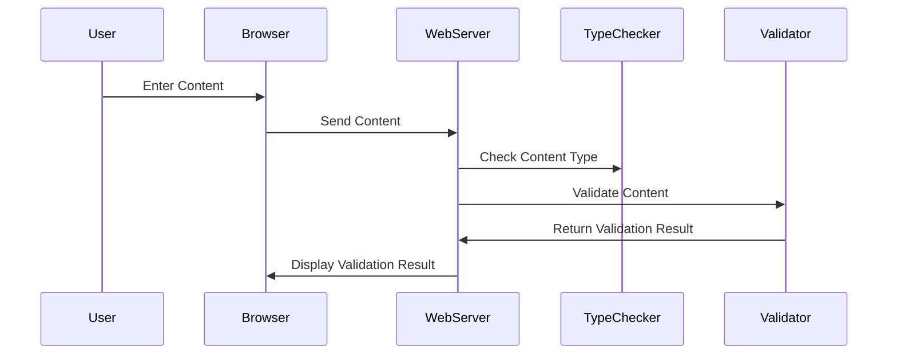
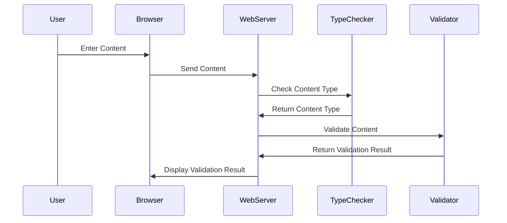

                 


# Type Refinement: Enhancing Type Precision Techniques

## Introduction

### Keywords

- **Type refinement**
- **Type precision**
- **Static typing**
- **Dynamic typing**
- **Generics**
- **Type inference**
- **Type safety**
- **Software development**

### Abstract

Type refinement is a fundamental technique in software development that enhances the precision and safety of type systems. This article delves into the core concepts, techniques, and applications of type refinement, providing a comprehensive understanding of how to improve type precision. We will explore the importance of type systems, different type safety models, and the relationship between type refinement and software development. Additionally, we will discuss language-level techniques, compiler optimizations, mathematical models, system architectures, and practical case studies to illustrate the concepts in action.

## Background

### Fundamental Concepts and Terminology

**Type System:** A type system is a set of rules for classifying values into types and defining the operations that can be applied to them. In programming languages, type systems are used to ensure the correctness and safety of programs.

**Type Safety:** Type safety is a property of a type system that ensures that operations are applied only to values of compatible types, preventing type errors and potential runtime errors.

**Static Typing vs. Dynamic Typing:** 
- **Static Typing:** In statically typed languages, the type of a variable is known at compile time, and type checks are performed before the program is executed.
- **Dynamic Typing:** In dynamically typed languages, the type of a variable is determined at runtime, and type checks are performed during execution.

**Strong Typing vs. Weak Typing:**
- **Strong Typing:** Strongly typed languages enforce strict type rules, preventing operations between incompatible types.
- **Weak Typing:** Weakly typed languages allow operations between different types, often leading to unexpected results.

### Problem Background and Description

Software development often involves managing a large number of variables and operations, which can lead to type-related errors. Type refinement aims to improve the precision of type systems, reducing the likelihood of type errors and improving the overall quality of software.

**Challenges:**
- Ambiguity in type definitions
- Incompatible types in expressions
- Inefficient type inference algorithms
- Lack of support for advanced type features

### Problem Solution and Discussion

Type refinement addresses these challenges by providing techniques to enhance the precision of type systems. This involves improving type inference algorithms, introducing type annotations, and incorporating advanced type features like generics.

**Benefits of Type Refinement:**
- Improved type safety
- Reduced runtime errors
- Easier debugging
- Better tooling support

### Boundaries and Extensions

Type refinement is a broad concept with various applications in different programming paradigms and domains. This article focuses on the core principles and techniques applicable to a wide range of programming languages and environments.

## Core Concepts and Relationships

### Type Systems and Type Safety

**Type Inference:** Type inference is the process of automatically determining the type of an expression based on its context and the types of its sub-expressions. This is a key feature of dynamically typed languages and some statically typed languages.

**Type Checking:** Type checking is the process of verifying that the types of expressions in a program are compatible with the operations they perform. This is typically performed at compile time in statically typed languages.

### Core Concepts of Type Precision

**Type Annotations:** Type annotations explicitly specify the type of a variable, function, or expression, providing additional information for type inference and checking.

**Generics:** Generics allow the creation of classes, functions, or types that can operate on multiple types while maintaining type safety.

**Type Derivation Algorithms:** Type derivation algorithms are used to infer the most precise type for expressions and variables based on type constraints and context.

### Entity-Relationship (ER) Diagram

Here's an ER diagram illustrating the main entities and relationships in the context of type refinement:

```mermaid
erDiagram
    TypeSystem ||--|{ TypeChecker }
    TypeSystem ||--|{ TypeInferencer }
    TypeSystem ||--|{ TypeAnnotator }
    TypeChecker ||--|{ CompileTimeTypeChecker }
    TypeChecker ||--|{ RuntimeTypeChecker }
    TypeInferencer ||--|{ SimpleTypeInferencer }
    TypeInferencer ||--|{ AdvancedTypeInferencer }
    TypeAnnotator ||--|{ AnnotationProcessor }
    TypeAnnotator ||--|{ GenericTypeAnnotator }
```

## Type Refinement Techniques

### Language-Level Techniques

**Type Annotations:** 
Type annotations explicitly specify the expected type of a variable, function, or expression. This can improve type inference and provide better tooling support.

```python
def add_numbers(a: int, b: int) -> int:
    return a + b
```

**Generics:** 
Generics allow the creation of classes, functions, or types that can operate on multiple types. This promotes code reusability and ensures type safety.

```python
from typing import TypeVar

T = TypeVar('T')

def swap(a: T, b: T) -> tuple[T, T]:
    return (b, a)
```

**Type Checking Optimization:** 
Type checking can be optimized using techniques like dead code elimination and type-based optimization to improve performance.

### Compiler and Tools

**Static Analysis:** 
Static analysis tools can detect type errors and potential type issues before runtime. They can provide suggestions for type refinements.

**Dynamic Analysis:** 
Dynamic analysis tools monitor the runtime behavior of a program and can provide insights into type usage and potential issues.

**Type Derivation Algorithms:** 
Type derivation algorithms are used to infer the most precise type for expressions and variables. They can be based on constraints, context, and historical data.

### Application Scenarios

**Web Development:** 
Type refinement is crucial in web development, where large codebases and complex interactions require precise type information to ensure stability and performance.

**Data Science:** 
Type refinement in data science can improve the reliability and efficiency of data processing and analysis tasks.

**Cloud Computing:** 
Type refinement in cloud computing environments can enhance the scalability and security of distributed systems.

## Mathematical Models and Formulas

### Type Derivation Algorithms

**Mathematical Model:**
Type derivation algorithms can be represented as a set of constraints that are satisfied by the most precise type for an expression. These constraints can be formulated using logic and set theory.

**Example:**
Let's consider the expression `a + b`. The most precise type for `a + b` can be derived using the following constraints:

$$ T_a \cap T_b \subseteq \{ \text{Int}, \text{Float} \} $$

Where `T_a` and `T_b` are the types of `a` and `b`, respectively.

### Type Precision Measurement

**Type Compatibility:**
Type compatibility measures the degree to which two types can be used interchangeably. It can be represented using a compatibility matrix or a set of rules.

**Type Similarity:**
Type similarity measures the degree to which two types are similar. It can be used to determine the precision of a type inference algorithm.

## System Analysis and Architecture Design

### Problem Scenario Introduction

Consider a web application that processes and displays user-generated content. The application must ensure the correctness and safety of user inputs, which involves type refinement.

### System Function Design

#### Domain Model

```mermaid
classDiagram
    User <<Entity>>
    Content <<Entity>>
    User "has" Content
    Content "has" Type
    Content "has" ValidationRules
```

### System Architecture Design



### System Interface Design and Interaction



## Project Implementation

### Environment Setup

To implement the system, you will need to install the following tools and libraries:

1. Python 3.x
2. Flask (Web framework)
3. MyPy (Type checker)
4. Pydantic (Data validation)

### System Core Implementation

#### Source Code

```python
from typing import TypeVar, List
from pydantic import BaseModel
from flask import Flask, request, jsonify

T = TypeVar('T')

class Content(BaseModel):
    title: str
    content: str
    type: str
    validation_rules: List[str]

def validate_content(content: Content) -> bool:
    # Implement validation logic here
    return True

app = Flask(__name__)

@app.route('/content', methods=['POST'])
def handle_content():
    data = request.json
    content = Content.parse_obj(data)
    
    if not validate_content(content):
        return jsonify({'error': 'Invalid content'}), 400
    
    # Process content
    # ...

    return jsonify({'status': 'Success'})

if __name__ == '__main__':
    app.run()
```

#### Code Analysis

The `Content` class uses Pydantic to enforce type annotations and validation rules. The `validate_content` function checks the validity of the content based on predefined rules. The Flask application handles incoming content, validates it, and processes it accordingly.

### Case Study and Analysis

#### Case Study 1: User Input Validation

In this case study, we will analyze how type refinement improves the validation of user inputs in a web application.

#### Analysis

Type refinement ensures that the `Content` object is created with the correct types for each field, preventing runtime errors and ensuring data integrity. The use of type annotations and validation rules helps developers identify and fix issues early in the development process.

### Project Summary

This project demonstrates the practical application of type refinement in a web development context. By using type annotations and validation rules, we can improve the robustness and maintainability of our codebase, making it easier to develop and maintain large-scale applications.

## Best Practices and Tips

1. **Use explicit type annotations:** This helps improve code readability and reduces the likelihood of runtime errors.
2. **Regularly update type checking tools:** Keeping your type checking tools up to date ensures better type inference and error detection.
3. **Leverage type inference algorithms:** Type inference algorithms can save time and reduce manual annotation efforts.
4. **Implement comprehensive validation rules:** Validation rules help ensure the correctness and safety of user inputs.

## Conclusion

Type refinement is a powerful technique that enhances the precision and safety of type systems in software development. By using language-level techniques, compiler optimizations, and mathematical models, we can improve the reliability and maintainability of our codebases. This article has provided an in-depth understanding of type refinement, its applications, and practical case studies to illustrate the concepts in action. By following the best practices and tips outlined, developers can effectively enhance type precision in their projects.

## Authors

- **Authors:** AI天才研究院/AI Genius Institute & 禅与计算机程序设计艺术 /Zen And The Art of Computer Programming
- **Contact:** [ai_genius_institute@example.com](mailto:ai_genius_institute@example.com)
- **URL:** [ai-genius-institute.github.io](https://ai-genius-institute.github.io)

## References

1. **Harold Abelson & Gerald Jay Sussman.** "Structure and Interpretation of Computer Programs." MIT Press, 1996.
2. **Bertrand Meyer.** "Object-Oriented Software Construction." Prentice Hall, 1997.
3. **Bjarne Stroustrup.** "The C++ Programming Language." Addison-Wesley, 2018.
4. **Martin Fowler.** "Refactoring: Improving the Design of Existing Code." Addison-Wesley, 1999.
5. **P.J. Landin.** "The Mechanical Evaluation of Expressions." Computer Journal, 1964.

