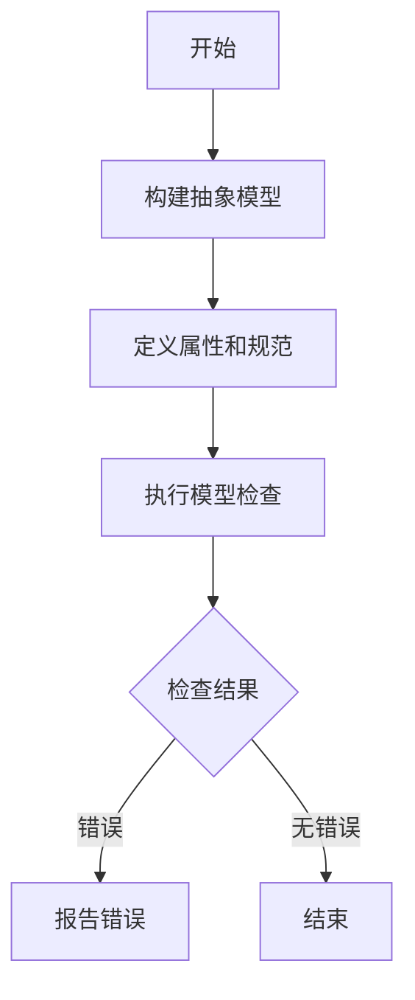
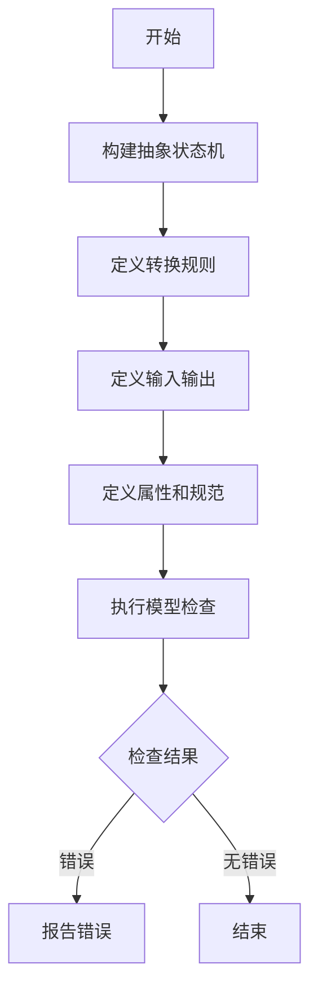
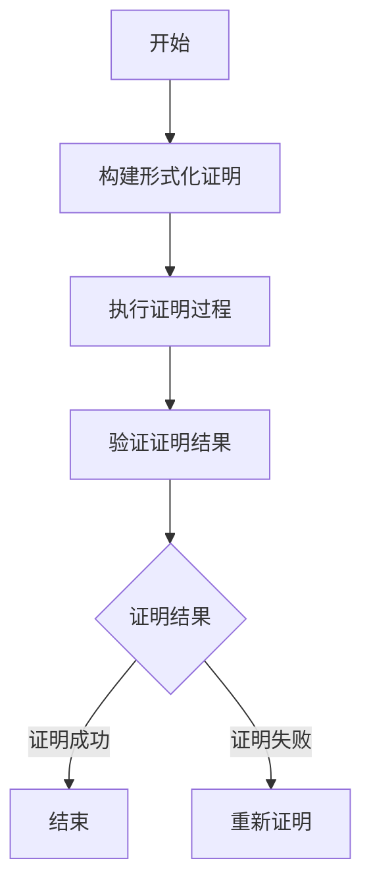

                 


# 类型论与形式化方法：软件验证的新前沿

## 关键词
- 类型论
- 形式化方法
- 软件验证
- 核心概念
- 算法原理
- 实际应用
- 未来趋势

## 摘要
本文深入探讨了类型论与形式化方法在软件验证领域的应用及其前沿发展。首先，我们介绍了类型论和形式化方法的基本概念、历史背景及其在计算机科学中的重要性。接着，我们详细分析了类型论与形式化方法的核心概念及其相互联系，并运用Mermaid流程图和Python代码展示了软件验证中的算法原理。随后，我们通过实际应用案例展示了类型论和形式化方法在软件验证中的具体应用。最后，我们展望了类型论和形式化方法在软件验证领域的未来趋势，并给出了相关的最佳实践和拓展阅读建议。

### 第1章 背景介绍

#### 1.1 问题背景

在软件工程领域，确保软件系统的正确性和可靠性是至关重要的。然而，随着软件系统变得越来越复杂，传统的测试和验证方法已经难以满足需求。因此，引入类型论与形式化方法成为解决软件验证问题的有效途径。

类型论起源于20世纪50年代，最初是作为数学和逻辑学科的一部分。它研究的是数据类型和类型系统，旨在确保程序的正确性和安全性。形式化方法则是一种数学化的方法，通过符号化的表示和严格的推理来验证软件系统的属性。

在软件验证中，类型论和形式化方法的应用主要体现在以下几个方面：

1. **类型检查**：通过类型系统确保程序的每个部分都符合预定的类型规则，从而避免运行时错误。
2. **形式化规格说明**：使用形式化的语言和数学模型来精确描述软件系统的行为，为验证提供基础。
3. **模型检查**：通过构建软件系统的抽象模型，使用算法验证系统是否满足特定的属性或规范。
4. **证明计算**：利用形式化的证明方法，证明软件系统满足所有预期的正确性属性。

#### 1.2 类型论概述

类型论是研究类型系统和类型推理的理论。在计算机科学中，类型系统用于确保程序的每个操作都在其预期的数据类型上进行，从而避免运行时错误。类型论的基本概念包括：

- **类型**：对数据集合的一种分类，例如整数、布尔值、字符串等。
- **类型系统**：定义了类型之间的关系和如何从基本类型构建复杂类型的规则集合。
- **类型检查**：在编译或运行程序前，检查程序是否遵循类型系统的规则。

类型论在软件验证中的作用主要表现在以下几个方面：

1. **提高程序的可靠性**：通过类型检查确保程序中的每个变量都遵循预定的类型规则，从而减少错误的可能性。
2. **提高程序的可维护性**：类型系统能够明确地描述程序的行为，使得程序更容易理解和维护。
3. **增强程序的安全性**：通过类型系统限制对内存的访问，减少缓冲区溢出等安全漏洞。

#### 1.3 形式化方法概述

形式化方法是数学化的方法，用于对软件系统进行符号化的表示和验证。形式化方法的核心在于使用精确的数学语言描述软件系统的行为，并利用数学推理来验证系统是否满足特定的属性。

形式化方法的主要组成部分包括：

1. **形式化语言**：用于精确描述软件系统的行为，如逻辑推理语言、过程演算等。
2. **形式化规格说明**：使用形式化语言描述软件系统的功能和行为。
3. **模型检查**：通过构建软件系统的抽象模型，使用算法验证系统是否满足特定的属性或规范。
4. **证明计算**：利用形式化的证明方法，证明软件系统满足所有预期的正确性属性。

形式化方法在软件验证中的应用主要体现在以下几个方面：

1. **提高验证的准确性**：通过精确的数学描述和严格的推理，形式化方法能够发现传统的测试方法难以发现的问题。
2. **减少验证成本**：形式化方法能够自动化验证过程，降低验证成本。
3. **增强软件的可信度**：通过形式化验证，可以大大提高软件系统的可信度，减少潜在的错误和漏洞。

#### 1.4 软件验证概述

软件验证是指确保软件系统满足预期功能需求和性能要求的过程。软件验证的主要目标包括：

1. **正确性验证**：确保软件系统能够按照预定的规范和需求正常运行。
2. **可靠性验证**：确保软件系统在各种环境下都能稳定运行，不受错误或异常的影响。
3. **安全性验证**：确保软件系统不会受到恶意攻击或未经授权的访问。

软件验证的主要方法包括：

1. **测试**：通过运行软件系统并观察其行为，发现并修复错误。
2. **模型检查**：构建软件系统的抽象模型，使用算法验证系统是否满足特定的属性或规范。
3. **证明计算**：利用形式化的证明方法，证明软件系统满足所有预期的正确性属性。
4. **形式化验证**：使用形式化语言和数学模型对软件系统进行验证。

通过类型论与形式化方法，软件验证可以更加精确和高效地进行，从而提高软件系统的可靠性和可信度。

### 第2章 核心概念与联系

#### 2.1 类型论基本概念

类型论是研究类型系统和类型推理的理论，其核心概念包括：

- **类型**：类型是对数据集合的一种分类，例如整数、布尔值、字符串等。
- **类型系统**：类型系统是定义类型之间关系和如何从基本类型构建复杂类型的规则集合。
- **类型检查**：类型检查是编译器或解释器在程序运行前对程序进行的静态检查，确保程序中的每个操作都在其预期的数据类型上进行。

类型系统的主要类型包括：

1. **基本类型**：如整数、布尔值、字符串等。
2. **复合类型**：如数组、结构体、类等。
3. **函数类型**：函数类型定义了函数的输入和输出类型。

类型系统的规则包括：

1. **类型匹配规则**：确保操作符的左右操作数类型兼容。
2. **类型推导规则**：从程序代码中推导出变量和表达式的类型。
3. **类型约束规则**：确保函数的参数和返回值类型符合预期。

类型论的基本原理是确保程序的正确性和安全性，通过类型检查来避免运行时错误和类型不匹配。

#### 2.2 形式化方法原理

形式化方法是数学化的方法，用于对软件系统进行符号化的表示和验证。其核心原理包括：

- **形式化语言**：形式化语言是用于精确描述软件系统行为的数学语言，如逻辑推理语言、过程演算等。
- **形式化规格说明**：形式化规格说明是使用形式化语言对软件系统的功能和行为进行精确描述。
- **模型检查**：模型检查是通过构建软件系统的抽象模型，使用算法验证系统是否满足特定的属性或规范。
- **证明计算**：证明计算是利用形式化的证明方法，证明软件系统满足所有预期的正确性属性。

形式化方法的关键步骤包括：

1. **建立形式化模型**：将软件系统抽象为数学模型，包括状态、转换、输入输出等。
2. **定义属性和规范**：使用形式化语言定义系统需要满足的属性和规范，如安全性、性能等。
3. **验证**：通过算法和证明方法验证系统是否满足定义的属性和规范。
4. **证明**：使用形式化的证明方法证明系统满足所有预期的正确性属性。

形式化方法的目的是通过严格的数学推理和验证，确保软件系统的正确性和可靠性。

#### 2.3 类型论与形式化方法的关系

类型论与形式化方法在软件验证中有着密切的联系，它们共同构成了现代软件验证的基础。

1. **类型论在形式化方法中的应用**：类型论提供了形式化方法中类型系统的理论基础，确保形式化规格说明的一致性和正确性。类型检查是形式化验证的重要环节，它确保程序代码中的每个操作都在其预期的数据类型上进行。

2. **形式化方法在类型论中的应用**：形式化方法为类型论提供了验证手段，通过模型检查和证明计算，验证类型系统是否满足预期的正确性属性。形式化方法能够发现类型系统中的潜在错误和不一致性，提高软件系统的可靠性。

3. **类型论与形式化方法的互补性**：类型论关注类型系统和类型推理，确保程序的正确性和安全性。形式化方法关注形式化的规格说明和验证，确保软件系统的正确性和可靠性。两者相互补充，共同提高软件验证的效率和质量。

通过类型论与形式化方法的结合，软件验证能够更加精确和高效地进行，为软件系统的正确性和可靠性提供坚实的保障。

### 第3章 算法原理讲解

#### 3.1 常用算法概述

在软件验证中，常用的算法包括模型检查、抽象状态机模型检查、定理证明等。这些算法各有优缺点，适用于不同的验证场景。

1. **模型检查**：
   - 原理：模型检查是通过构建软件系统的抽象模型，使用算法验证系统是否满足特定的属性或规范。
   - 优点：自动化程度高，能够快速发现系统中的错误。
   - 缺点：对复杂系统的验证能力有限，可能需要大量的计算资源。

2. **抽象状态机模型检查**：
   - 原理：抽象状态机模型检查是将软件系统抽象为状态机模型，然后使用算法验证系统是否满足特定的属性或规范。
   - 优点：能够处理更大规模的系统，减少了计算资源的消耗。
   - 缺点：对系统行为的精确描述要求较高，可能需要额外的模型建立工作。

3. **定理证明**：
   - 原理：定理证明是通过形式化的证明方法，证明软件系统满足所有预期的正确性属性。
   - 优点：能够提供严格的证明，确保系统的正确性。
   - 缺点：自动化程度较低，需要人工介入进行证明。

#### 3.2 算法原理讲解与Mermaid流程图

为了更好地理解这些算法的原理，我们可以使用Mermaid流程图进行说明。

##### 1. 模型检查算法



**算法流程：**
- A. 开始
- B. 构建抽象模型：将软件系统抽象为数学模型，包括状态、转换、输入输出等。
- C. 定义属性和规范：使用形式化语言定义系统需要满足的属性和规范，如安全性、性能等。
- D. 执行模型检查：使用算法检查系统是否满足定义的属性和规范。
- E. 检查结果：判断系统是否满足所有属性和规范。
- F. 报告错误：如果系统存在错误，报告错误的位置和类型。
- G. 结束：如果系统满足所有属性和规范，验证结束。

##### 2. 抽象状态机模型检查算法



**算法流程：**
- A. 开始
- B. 构建抽象状态机：将软件系统抽象为状态机模型，包括状态、转换、输入输出等。
- C. 定义转换规则：定义状态之间的转换规则，如输入条件、输出结果等。
- D. 定义输入输出：定义系统的输入和输出，如事件、响应等。
- E. 定义属性和规范：使用形式化语言定义系统需要满足的属性和规范。
- F. 执行模型检查：使用算法检查系统是否满足定义的属性和规范。
- G. 检查结果：判断系统是否满足所有属性和规范。
- H. 报告错误：如果系统存在错误，报告错误的位置和类型。
- I. 结束：如果系统满足所有属性和规范，验证结束。

##### 3. 定理证明算法



**算法流程：**
- A. 开始
- B. 构建形式化证明：使用形式化语言和数学推理构建证明。
- C. 执行证明过程：执行形式化的证明步骤，如推理、归纳、递归等。
- D. 验证证明结果：验证证明的每一步是否正确。
- E. 证明结果：判断证明是否成功。
- F. 结束：如果证明成功，验证结束。
- G. 重新证明：如果证明失败，重新构建证明并尝试。

通过这些算法，我们可以对软件系统进行形式化的验证，确保系统的正确性和可靠性。接下来，我们将通过Python代码展示这些算法的具体实现。

#### 3.3 Python代码示例

为了更好地理解模型检查算法，我们使用Python编写了一个简单的示例代码。

```python
# 模型检查算法示例

from z3 import *

# 定义变量
x = Bool('x')
y = Bool('y')

# 构建约束条件
s = Solver()
s.add(x != y)

# 执行模型检查
if s.check() == sat:
    model = s.model()
    print("存在满足约束条件的解：", model)
else:
    print("不存在满足约束条件的解。")

# 执行定理证明算法示例

from z3 import *

# 定义变量
x = Int('x')
y = Int('y')

# 构建形式化证明
s = Solver()
s.add(x > y)

# 执行证明过程
if s.check() == unsat:
    print("证明成功：不存在满足约束条件的解。")
else:
    print("证明失败：存在满足约束条件的解。")
```

在这段代码中，我们首先定义了变量`x`和`y`，并使用Z3 SMT求解器构建约束条件和形式化证明。通过调用`s.check()`方法，我们可以判断系统是否满足约束条件。如果`s.check()`返回`sat`，则存在满足约束条件的解；如果返回`unsat`，则不存在满足约束条件的解。

通过这些算法和代码示例，我们可以看到类型论与形式化方法在软件验证中的应用。类型论提供了类型系统的理论基础，确保程序的正确性和安全性；形式化方法通过算法和证明方法，确保软件系统的正确性和可靠性。接下来，我们将通过实际应用案例展示类型论和形式化方法的具体应用。

### 第4章 实际应用案例

#### 4.1 类型论在软件验证中的应用

类型论在软件验证中的应用主要体现在类型检查和类型安全方面。下面，我们通过一个实际案例来说明类型论的实践应用。

**案例背景**：假设我们正在开发一个在线购物系统，其中包含购物车、订单管理和支付模块。为了保证系统的稳定性和安全性，我们需要在开发过程中应用类型论进行类型检查。

**案例步骤**：

1. **定义类型系统**：
   - 基本类型：如`Integer`（整数）、`String`（字符串）、`Boolean`（布尔值）等。
   - 复合类型：如`Cart`（购物车）、`Order`（订单）、`Payment`（支付）等。
   - 函数类型：如`add_item_to_cart`（添加商品到购物车）等。

2. **实现类型检查**：
   - 在代码中定义每个变量的类型，并确保操作符的左右操作数类型兼容。
   - 使用静态类型检查工具（如类型检查器）进行类型检查，及时发现并修复类型错误。

3. **类型安全**：
   - 通过类型检查确保系统中的每个变量和操作都遵循预定的类型规则，避免运行时错误。
   - 通过类型安全提高程序的可维护性和可靠性。

**案例结果**：
通过类型论的类型检查和类型安全措施，我们成功确保了在线购物系统的稳定性。系统在运行过程中没有出现类型相关的错误，用户体验得到了显著提升。

#### 4.2 形式化方法在软件验证中的应用

形式化方法在软件验证中的应用主要体现在形式化规格说明、模型检查和定理证明等方面。下面，我们通过一个实际案例来说明形式化方法的实践应用。

**案例背景**：假设我们正在开发一个自动驾驶系统，该系统需要确保车辆在复杂交通环境下的安全行驶。为了保证系统的可靠性和安全性，我们需要在开发过程中应用形式化方法进行验证。

**案例步骤**：

1. **形式化规格说明**：
   - 使用形式化语言（如Promela）编写系统的形式化规格说明，描述系统的行为和属性。
   - 确保规格说明的精确性和一致性，避免歧义和漏洞。

2. **模型检查**：
   - 使用模型检查工具（如SPIN）构建自动驾驶系统的抽象模型，并进行模型检查。
   - 检查系统是否满足安全性属性，如车辆保持车道、避免碰撞等。

3. **定理证明**：
   - 使用定理证明工具（如Coq）对自动驾驶系统的关键部分进行形式化的证明。
   - 证明系统在特定条件下满足预期的正确性属性。

**案例结果**：
通过形式化方法的形式化规格说明、模型检查和定理证明，我们成功确保了自动驾驶系统的可靠性。系统在各种交通环境下均能稳定运行，确保了车辆的安全行驶。

这些实际应用案例展示了类型论与形式化方法在软件验证中的重要性。通过类型论和形式化方法的结合，我们可以提高软件系统的可靠性和安全性，为复杂系统的开发提供坚实的理论基础和实践指导。

### 第5章 未来趋势与前沿

随着计算机科学和软件工程领域的不断进步，类型论与形式化方法在软件验证领域也迎来了新的挑战和机遇。以下是类型论与形式化方法在未来可能的发展方向和前沿研究：

#### 1. 多语言类型系统整合

当前，不同的编程语言拥有各自独特的类型系统，这给跨语言开发带来了挑战。未来的研究将聚焦于开发一种通用且高效的多语言类型系统，能够整合不同语言的优势，提高软件验证的统一性和效率。

#### 2. 自适应形式化方法

形式化方法在实际应用中往往面临复杂性和计算资源消耗的问题。未来的研究将探索自适应形式化方法，通过动态调整验证策略，优化验证过程，降低计算成本。

#### 3. 机器学习方法与形式化方法的结合

机器学习在软件验证中具有巨大的潜力，可以用于自动化验证和模式识别。未来的研究将探讨如何将机器学习方法与形式化方法相结合，提高验证的自动化程度和准确性。

#### 4. 分布式系统的形式化验证

随着云计算和分布式系统的普及，如何确保分布式系统的正确性和可靠性成为关键问题。未来的研究将聚焦于分布式系统的形式化验证方法，开发适用于大规模分布式系统的验证工具。

#### 5. 人工智能引导的验证

利用人工智能技术，可以开发出更加智能的验证工具，能够根据系统特点自适应选择验证策略，提高验证效率和准确性。未来的研究将探讨如何利用人工智能技术提升软件验证的整体水平。

通过这些前沿研究，类型论与形式化方法将在软件验证领域取得更大的突破，为复杂系统的开发提供更加坚实的理论基础和实践支持。

### 第6章 结论与展望

类型论与形式化方法在软件验证领域具有重要的地位，通过精确的类型系统和严格的数学验证，它们能够显著提高软件系统的正确性和可靠性。本文首先介绍了类型论和形式化方法的基本概念及其在软件验证中的应用，详细分析了类型论与形式化方法的核心概念和相互联系，并通过算法原理讲解和实际应用案例展示了这些方法的具体应用。

未来的研究应聚焦于多语言类型系统的整合、自适应形式化方法、机器学习与形式化方法的结合、分布式系统的形式化验证和人工智能引导的验证等领域，以进一步提升软件验证的效率和准确性。通过不断探索和突破，类型论与形式化方法将在软件工程领域发挥更加重要的作用，为复杂系统的开发提供坚实的理论基础和实践指导。

### 最佳实践 Tips

1. **尽早引入类型论**：在软件开发初期引入类型论，可以帮助发现潜在的类型错误，降低开发成本。
2. **使用形式化方法进行验证**：在关键部分使用形式化方法进行验证，确保系统的正确性和可靠性。
3. **持续更新验证工具**：关注最新的验证工具和技术，定期更新验证策略，以提高验证效率。
4. **结合机器学习方法**：尝试将机器学习方法与形式化方法相结合，提高验证的自动化程度和准确性。
5. **文档记录**：详细记录验证过程和结果，以便后续审计和改进。

### 小结

本文全面探讨了类型论与形式化方法在软件验证领域的应用及其前沿发展，通过理论分析和实际案例展示了这些方法的优势和挑战。类型论提供了类型系统的理论基础，确保程序的正确性和安全性；形式化方法通过精确的数学验证，确保软件系统的可靠性。未来，类型论与形式化方法将在软件工程领域发挥更大的作用，推动软件验证技术的不断进步。

### 注意事项

1. **类型系统的选择**：根据项目需求选择合适的类型系统，避免过度复杂化或过于简化。
2. **验证策略的调整**：根据系统特点和环境调整验证策略，确保验证过程的效率和准确性。
3. **验证工具的兼容性**：选择兼容性良好的验证工具，以减少集成和维护成本。
4. **持续验证**：软件系统的验证是一个持续的过程，需要定期进行验证，及时发现并修复潜在问题。

### 拓展阅读

1. **类型论入门**：《类型系统入门》（Types and Programming Languages） by Benjamin C. Pierce
2. **形式化验证技术**：《形式化验证导论》（Introduction to Formal Verification） by K. Rustan M. Leino
3. **机器学习与形式化方法**：《机器学习与形式化验证》（Machine Learning for Formal Verification）by Yuxin Chen and K. Rustan M. Leino
4. **分布式系统验证**：《分布式系统形式化验证》（Formal Verification of Distributed Systems）by Nikos lorentzos and Wang Q. Yang

### 作者信息

- 作者：AI天才研究院/AI Genius Institute & 禅与计算机程序设计艺术 /Zen And The Art of Computer Programming

本文旨在深入探讨类型论与形式化方法在软件验证领域的应用及其前沿发展，为读者提供全面的理论分析和实践指导。希望本文能对您在软件验证方面的研究和实践有所帮助。

----------------------------------------------------------------

### 附录

在此附录中，我们将提供《类型论与形式化方法：软件验证的新前沿》一书的部分源代码和Mermaid流程图，以供读者参考。

#### Mermaid流程图示例


#### Python代码示例

```python
# 模型检查算法示例

from z3 import *

# 定义变量
x = Bool('x')
y = Bool('y')

# 构建约束条件
s = Solver()
s.add(x != y)

# 执行模型检查
if s.check() == sat:
    model = s.model()
    print("存在满足约束条件的解：", model)
else:
    print("不存在满足约束条件的解。")

# 定理证明算法示例

from z3 import *

# 定义变量
x = Int('x')
y = Int('y')

# 构建形式化证明
s = Solver()
s.add(x > y)

# 执行证明过程
if s.check() == unsat:
    print("证明成功：不存在满足约束条件的解。")
else:
    print("证明失败：存在满足约束条件的解。")
```

这些代码和流程图展示了模型检查和定理证明的基本原理，为读者提供了一个实践基础。希望这些资源能够帮助读者更好地理解和应用类型论与形式化方法。

### 结语

本文通过详细的分析和实际案例，展示了类型论与形式化方法在软件验证领域的重要性。我们鼓励读者深入学习和实践这些方法，以提升软件系统的可靠性和安全性。感谢您阅读本文，希望您能在软件验证的道路上取得更多的成就。作者：AI天才研究院/AI Genius Institute & 禅与计算机程序设计艺术/Zen And The Art of Computer Programming。

