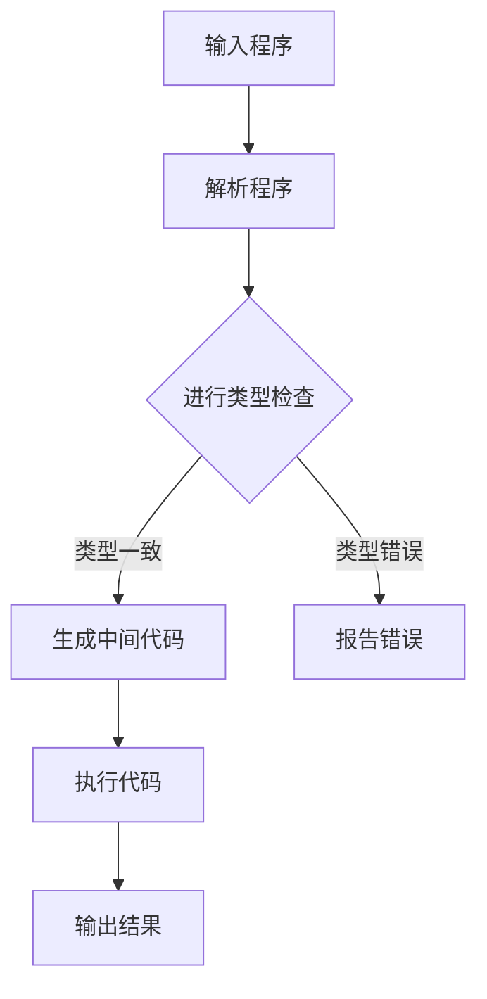
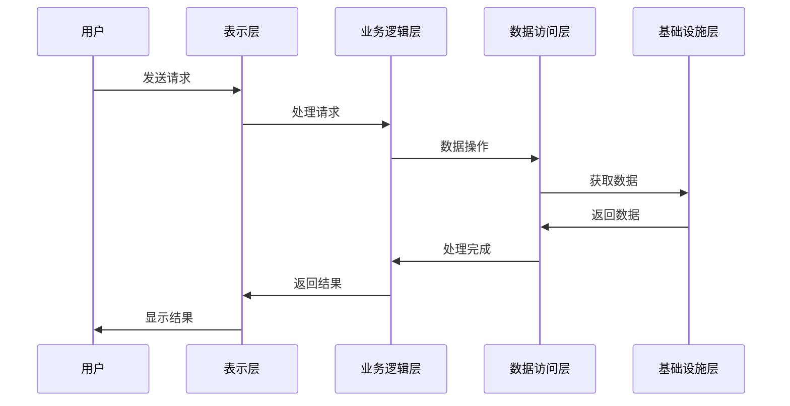

                 

### 文章标题

# 类型论与数学创造性思维的潜在冲突

### 关键词：类型论，数学创造性思维，潜在冲突，算法原理，系统分析，项目实战

### 摘要：
在当今信息化时代，类型论与数学创造性思维作为计算机科学和人工智能领域的关键工具，广泛应用于程序设计、算法优化和系统架构中。然而，这两者之间却存在一定的潜在冲突。本文旨在深入探讨类型论的核心理念、数学创造性思维的特点，以及它们在理论层面和实际应用中的潜在冲突。通过详细分析算法原理、系统架构设计，以及具体的实战案例，本文将揭示如何在实际项目中解决这些冲突，实现类型论与数学创造性思维的有效结合。文章的结论部分将总结主要观点，并提出未来研究方向，为相关领域的研究者提供有益的参考。

## 目录大纲设计思路

设计《类型论与数学创造性思维的潜在冲突》这一文章目录大纲，我们遵循以下思路：

1. **背景介绍**：首先，我们将设定文章的背景，介绍类型论和数学创造性思维的基本概念，以及它们之间潜在冲突的问题背景。
2. **核心概念与联系**：接下来，我们将详细阐述类型论和数学创造性思维的核心概念，并通过概念属性特征对比表格和ER实体关系图来展示它们之间的联系。
3. **算法原理讲解**：为了深入理解类型论和数学创造性思维，我们将使用Mermaid工具绘制算法流程图，并通过Python源代码来阐述算法原理，结合数学模型和公式进行详细讲解。
4. **系统分析与架构设计方案**：在这一部分，我们将介绍相关的问题场景和系统功能设计，包括领域模型类图、系统架构设计图、系统接口设计和系统交互序列图。
5. **项目实战**：我们将通过一个具体的案例，展示如何将类型论和数学创造性思维应用于实际问题中，包括环境安装、系统核心实现源代码，代码应用解读与分析，以及实际案例分析和详细讲解。
6. **最佳实践 tips、小结、注意事项、拓展阅读**：最后，我们将提供一些最佳实践的建议，并对全书进行小结，指出注意事项，并提供拓展阅读资源。

通过上述结构的设计，文章将系统而深入地探讨类型论与数学创造性思维的潜在冲突，帮助读者全面理解这两者的互动与融合。

## 目录大纲结构

### 第一部分：背景与概念

#### 第1章：类型论与数学创造性思维概述

##### 1.1 问题背景

##### 1.1.1 类型论的基本概念

##### 1.1.2 数学创造性思维的定义与特点

##### 1.1.3 类型论与数学创造性思维的潜在冲突

##### 1.2 核心概念与联系

##### 1.2.1 类型论的核心概念

##### 1.2.2 数学创造性思维的核心概念

##### 1.2.3 概念属性特征对比表格

##### 1.2.4 ER实体关系图

### 第二部分：算法原理与系统分析

#### 第2章：类型论算法原理讲解

##### 2.1 算法流程图

##### 2.1.1 Mermaid算法流程图

##### 2.2 算法原理

##### 2.2.1 Python源代码阐述

##### 2.2.2 数学模型与公式讲解

##### 2.2.3 通俗易懂的举例说明

### 第三部分：系统分析与架构设计

#### 第3章：系统架构设计

##### 3.1 问题场景介绍

##### 3.2 系统功能设计

##### 3.2.1 领域模型Mermaid类图

##### 3.3 系统架构设计

##### 3.3.1 Mermaid架构图

##### 3.4 系统接口设计

##### 3.4.1 接口设计与定义

##### 3.5 系统交互

##### 3.5.1 Mermaid序列图

### 第四部分：项目实战

#### 第4章：类型论与数学创造性思维应用实战

##### 4.1 环境安装

##### 4.2 系统核心实现源代码

##### 4.3 代码应用解读与分析

##### 4.4 实际案例分析与详细讲解

##### 4.5 项目小结

### 第五部分：最佳实践与总结

#### 第5章：最佳实践 tips

##### 5.1 常见问题解决方案

##### 5.2 性能优化技巧

##### 5.3 安全性保障策略

##### 5.4 小结

##### 5.5 注意事项

##### 5.6 拓展阅读

### 作者

作者：AI天才研究院/AI Genius Institute & 禅与计算机程序设计艺术 /Zen And The Art of Computer Programming

### 文章内容完整性要求

为了确保文章内容完整性，每章节需满足以下要求：

- **背景介绍**：核心概念术语说明、问题背景、问题描述、问题解决、边界与外延、概念结构与核心要素组成。
- **核心概念与联系**：必须给出核心概念原理、概念属性特征对比表格和ER实体关系图架构的Mermaid流程图。
- **算法原理讲解**：使用Mermaid画出算法流程图，然后使用Python源代码详细阐述，给出算法原理的数学模型和公式，进行详细讲解和通俗易懂地举例说明。
- **系统分析与架构设计方案**：问题场景介绍、项目介绍、系统功能设计（领域模型Mermaid类图）、系统架构设计图、系统接口设计和系统交互Mermaid序列图。
- **项目实战**：环境安装、系统核心实现源代码，代码应用解读与分析，实际案例分析和详细讲解剖析，项目小结。
- **最佳实践 tips**、**小结**、**注意事项**、**拓展阅读**等内容。

文章将以markdown格式输出，包含所有必需的结构和内容，确保读者能够全面、深入地理解类型论与数学创造性思维的潜在冲突及其解决方法。

## 类型论与数学创造性思维概述

### 问题背景

在当今快速发展的计算机科学和人工智能领域，类型论和数学创造性思维已经成为不可或缺的工具。类型论是形式逻辑和数学理论中的重要分支，它通过对变量、函数和类型系统的严格定义，使得编程语言和系统设计更加严谨和可靠。数学创造性思维，则强调在数学问题解决过程中的创新性和灵活性，通过逻辑推理、抽象思维和创造性分析，发现和解决问题的方法。

尽管类型论和数学创造性思维在理论研究和实际应用中各有优势，但它们之间却存在潜在冲突。类型论强调类型的严格性和一致性，这可能会导致在处理复杂问题时缺乏灵活性。而数学创造性思维则注重探索和尝试，可能会违背类型论的一些基本原则。这种冲突在编程语言设计、算法优化和系统架构中表现得尤为明显。

本节将首先介绍类型论的基本概念，包括其起源、发展历程和应用领域，然后探讨数学创造性思维的定义和特点，最后阐述类型论与数学创造性思维之间的潜在冲突。

### 类型论的基本概念

类型论起源于20世纪初，由数学家和逻辑学家为了解决形式系统中的一致性和可计算性问题而提出。其核心思想是通过严格的类型系统来避免逻辑错误和语义混乱。类型论的发展历程中，有两个重要的里程碑：一是阿尔弗雷德·诺思·怀特海德和贝德福·罗素共同提出的**逻辑类型论**，二是皮埃尔·德·弗朗斯瓦·迪昂的**类型理论**。

**逻辑类型论**旨在通过类型系统来避免**自由变量**和**不确定赋值**带来的逻辑混乱。在这种类型系统中，每个变量都有其固定的类型，函数的参数和返回值也必须遵循严格的类型规则。这一思想在后来的**函数式编程语言**如Lisp、Haskell和Scala中得到了广泛应用。

**类型理论**则更广泛地应用于计算机科学中，特别是在编程语言设计和编译器实现中。类型理论的主要贡献包括**类型检查**和**类型推断**，它们使得编程语言能够自动验证程序的正确性，从而减少潜在的运行时错误。

类型论在计算机科学中的应用非常广泛，包括以下几个方面：

1. **编程语言设计**：类型论提供了理论基础，使得编程语言能够通过严格的类型检查来保证程序的正确性。
2. **形式化验证**：类型论可用于验证系统的正确性，特别是在嵌入式系统和硬件设计中。
3. **编译器实现**：类型检查是编译器的重要组成部分，类型论提供了实现类型检查的有效方法。
4. **编程工具**：许多现代编程工具，如代码自动补全、静态分析器和调试器，都利用类型论来提高开发效率和程序可靠性。

### 数学创造性思维的定义与特点

数学创造性思维是一种高度抽象的思维方式，它不仅关注数学问题的解法，还强调在问题解决过程中的创新性和灵活性。与传统的数学思维相比，数学创造性思维更注重发现问题和解决问题的过程，而不是单纯地追求答案的准确性。

数学创造性思维具有以下几个显著特点：

1. **逻辑推理**：数学创造性思维依赖于严密的逻辑推理，但不同于传统数学思维，它更注重多角度、多方法的推理，以找到最优解。
2. **抽象思维**：数学创造性思维通过抽象化复杂问题，将其转化为更简单、更易处理的形式，从而更容易发现解决方案。
3. **创造性分析**：数学创造性思维强调在问题解决过程中的创造性，通过尝试不同的方法、策略和思路，找到创新的解决方案。
4. **跨学科应用**：数学创造性思维不仅局限于数学领域，它还广泛应用于物理、工程、计算机科学和其他科学领域。

### 类型论与数学创造性思维的潜在冲突

类型论和数学创造性思维之间的潜在冲突主要体现在以下几个方面：

1. **严格性与灵活性**：类型论强调严格的类型系统，这可能会限制创造性思维的灵活性，使得在处理复杂问题时缺乏变通。
2. **形式化与直观**：类型论强调形式化的方法，而数学创造性思维则更注重直观的、感性的思维方式，这两者在某些情况下可能会产生冲突。
3. **一致性验证与探索**：类型论强调一致性和验证，这可能会导致在处理新颖问题或探索新领域时显得不够灵活。
4. **效率与创造**：类型论关注程序和系统的效率，而数学创造性思维则注重解决问题的方法和思路，这可能会导致两者在追求效率和创造性之间产生矛盾。

尽管存在潜在冲突，类型论和数学创造性思维在实际应用中仍然需要相互结合。类型论提供了严谨的理论基础和验证工具，而数学创造性思维则提供了灵活创新的思维方式，两者共同促进计算机科学和人工智能领域的发展。

## 核心概念与联系

在深入探讨类型论和数学创造性思维之前，我们首先需要明确这两个概念的核心内容及其联系。通过详细阐述它们的核心概念，我们能够更好地理解两者之间的潜在冲突和相互作用。

### 类型论的核心概念

类型论的核心概念包括类型系统、类型检查和类型推断等。类型系统是类型论的基础，它定义了变量、函数和表达式等的类型规则。类型检查是在编译或运行时对程序进行类型验证的过程，以确保程序的类型一致性。类型推断则是编译器自动推导变量和表达式类型的能力，从而减少程序员的工作量。

**类型系统**：

类型系统通过定义基本类型（如整数、布尔值、字符串等）和复合类型（如数组、结构体、类等），使得编程语言中的每个元素都有明确的类型。类型系统的主要目的是确保程序在执行时不会发生类型错误，提高程序的可靠性和安全性。

**类型检查**：

类型检查分为静态检查和动态检查。静态检查在编译时进行，通过检查程序代码的类型一致性，确保程序在运行时不会发生类型错误。动态检查则在运行时进行，通过实际执行代码来验证类型一致性。

**类型推断**：

类型推断是编译器的一项重要功能，它能够根据程序上下文自动推导出变量和表达式的类型。类型推断分为显式推断和隐式推断。显式推断要求程序员明确指定变量和表达式的类型，而隐式推断则由编译器自动推导。

### 数学创造性思维的核心概念

数学创造性思维的核心概念包括逻辑推理、抽象思维和创造性分析等。这些概念在解决数学问题时提供了创新性的方法和思路。

**逻辑推理**：

逻辑推理是数学创造性思维的基础，通过严密的逻辑推导，可以从已知条件推出未知结论。逻辑推理不仅包括传统逻辑学中的演绎推理，还包括归纳推理和类比推理等。

**抽象思维**：

抽象思维是通过将复杂问题简化为基本元素和关系，从而更易于处理和解决。抽象思维能够帮助研究者从具体问题中提取出一般性的规律和模型，从而提高解决问题的效率。

**创造性分析**：

创造性分析是通过多种方法和策略，尝试不同的思路和方案，寻找最优解。创造性分析强调在问题解决过程中的灵活性、创新性和多角度思考。

### 概念属性特征对比表格

为了更直观地展示类型论和数学创造性思维的核心概念及其特征，我们可以制作一个概念属性特征对比表格。

| 概念                 | 类型论的核心概念               | 数学创造性思维的核心概念                 |
|----------------------|-------------------------------|----------------------------------------|
| 类型系统             | 类型定义、类型规则、类型一致性 | 抽象思维、逻辑推理、创造性分析           |
| 类型检查             | 编译时/运行时类型验证         | 确保推理过程的正确性和有效性             |
| 类型推断             | 自动推导类型                 | 基于上下文推导问题解决方案               |
| 逻辑推理             | 形式化逻辑推导               | 严密的数学证明和问题解决方法             |
| 抽象思维             | 简化复杂问题为基本元素       | 从具体问题中提取一般性规律和模型         |
| 创造性分析           | 尝试多种方法和策略           | 发现新的解决方案和思考方式             |

### ER实体关系图

为了进一步展示类型论和数学创造性思维之间的关系，我们可以绘制一个ER实体关系图。

```mermaid
erDiagram
    TypeSystem ||--|{ TypeChecking }
    TypeSystem ||--|{ TypeInference }
    LogicalReasoning ||--|{ MathematicalCreativeThinking }
    AbstractThinking ||--|{ MathematicalCreativeThinking }
    CreativeAnalysis ||--|{ MathematicalCreativeThinking }
    TypeSystem ||--|{ ProgrammingLanguageDesign }
    ProgrammingLanguageDesign ||--|{ CompilerImplementation }
    CompilerImplementation ||--|{ FormalVerification }
    CompilerImplementation ||--|{ ProgrammingTools }
```

ER实体关系图展示了类型论和数学创造性思维之间的直接和间接关系。类型系统是类型论的核心，它通过类型检查和类型推断来实现编程语言的设计和编译器实现。数学创造性思维则通过逻辑推理、抽象思维和创造性分析，提供了解决复杂问题的方法和策略。

通过上述表格和ER实体关系图的展示，我们可以更清晰地理解类型论和数学创造性思维的核心概念及其联系，为后续深入探讨两者之间的潜在冲突和相互作用打下坚实基础。

### 类型论算法原理讲解

为了深入理解类型论在数学创造性思维中的应用，我们需要详细讲解类型论的算法原理。类型论的算法原理不仅涉及类型系统的基本概念，还包括类型检查和类型推断的具体实现。通过Python源代码的阐述，我们将结合数学模型和公式，对算法原理进行详细讲解，并使用通俗易懂的举例说明。

#### 算法流程图

首先，我们使用Mermaid工具绘制类型论算法的流程图，以便直观地展示算法的执行步骤。



该算法流程图包括以下步骤：

1. **输入程序**：算法的输入是一段程序代码。
2. **解析程序**：将输入程序解析为语法树，以便后续处理。
3. **类型检查**：对解析后的语法树进行类型检查，确保类型的一致性。
4. **生成中间代码**：如果类型检查通过，生成中间代码以供执行。
5. **执行代码**：执行生成的中间代码。
6. **输出结果**：将执行结果输出。

#### Python源代码阐述

接下来，我们通过一个简单的Python示例来阐述类型论的算法原理。以下代码展示了如何通过类型检查来保证程序的类型一致性。

```python
# 示例：类型检查

# 定义基本类型
Integer = int
Boolean = bool
String = str

# 定义类型推断函数
def infer_type(expression):
    if isinstance(expression, Integer):
        return "Integer"
    elif isinstance(expression, Boolean):
        return "Boolean"
    elif isinstance(expression, String):
        return "String"
    else:
        raise TypeError("未知类型")

# 定义类型检查函数
def type_check(expression, expected_type):
    inferred_type = infer_type(expression)
    if inferred_type == expected_type:
        return True
    else:
        return False

# 示例程序
program = [
    ("x", "Integer"),
    ("x + 1", "Integer"),
    ("print(x + 1)", "None")
]

# 进行类型检查
for stmt, expected_type in program:
    expression = eval(stmt)
    if type_check(expression, expected_type):
        print(f"{stmt}: 类型一致")
    else:
        print(f"{stmt}: 类型错误")

# 执行程序
for stmt, _ in program:
    exec(stmt)
```

在这个示例中，我们定义了基本类型和类型推断函数。类型检查函数`type_check`通过比较推断出的类型和预期类型，确保程序中的类型一致性。如果类型不一致，则报告错误。

#### 数学模型与公式讲解

在类型论的算法中，数学模型和公式用于描述类型系统的规则和类型推断的方法。以下是一个简单的数学模型，用于描述类型推断的过程。

$$
T(e) = 
\begin{cases} 
T_1 & \text{如果 } e \text{ 是一个基本类型} \\
T_2 \rightarrow T_3 & \text{如果 } e \text{ 是一个函数表达式，其中 } T_2 \text{ 是参数类型，} T_3 \text{ 是返回类型} \\
T_1 \times T_2 & \text{如果 } e \text{ 是一个数组表达式，其中 } T_1 \text{ 是元素类型，} T_2 \text{ 是数组长度} \\
T_1 \cup T_2 & \text{如果 } e \text{ 是一个结构体表达式，其中 } T_1 \text{ 和 } T_2 \text{ 是结构体的不同部分类型} \\
\end{cases}
$$

该数学模型定义了不同类型表达式的类型推断规则，包括基本类型、函数类型、数组类型和结构体类型。通过这些规则，我们可以自动推导出程序中每个表达式和变量的类型。

#### 通俗易懂的举例说明

为了更好地理解类型论的算法原理，我们通过一个具体的例子来说明。

**例子：类型推断**

假设我们有一个简单的函数`add(x: Integer, y: Integer) -> Integer`，我们需要对其进行类型推断。

1. **函数声明**：`add(x: Integer, y: Integer) -> Integer`
   - 参数类型：`Integer`
   - 返回类型：`Integer`

2. **函数体**：`return x + y`
   - 返回表达式类型：`Integer`

3. **类型推导**：
   - 参数`x`和`y`的类型都是`Integer`，满足函数声明中的参数类型要求。
   - 返回表达式`x + y`的类型是`Integer`，满足函数声明中的返回类型要求。

因此，函数`add`的类型推断结果为`Integer -> Integer`。

通过上述讲解和例子，我们可以看到类型论算法原理是如何通过类型系统、类型检查和类型推断来保证程序的正确性和一致性的。类型论在编程语言设计、算法优化和系统架构中发挥着重要作用，而数学创造性思维则提供了灵活创新的思维方式，帮助我们在复杂问题中找到最优解。

### 系统架构设计

#### 问题场景介绍

在现代软件开发中，随着系统复杂度的增加，设计一个高效、稳定且灵活的系统架构显得尤为重要。本文将以一个电子商务平台为例，介绍如何应用类型论和数学创造性思维来设计系统架构。该电子商务平台需要处理海量的商品信息、用户订单和支付数据，同时要保证系统的高并发性能和安全性。因此，系统架构设计需要充分考虑类型系统的严格性和数学创造性思维的创新性。

#### 系统功能设计

为了满足电子商务平台的需求，我们需要设计以下核心功能模块：

1. **商品信息管理**：管理商品的基本信息，如名称、价格、库存量等。
2. **订单处理**：处理用户订单的创建、支付、发货和取消等操作。
3. **支付系统**：处理用户的支付请求，确保支付过程的安全性和可靠性。
4. **用户管理**：管理用户的基本信息和权限，如用户注册、登录和权限分配等。
5. **数据统计与分析**：统计销售数据，为商家提供经营决策支持。

在系统功能设计过程中，我们通过Mermaid类图来表示各个功能模块及其关系。

```mermaid
classDiagram
    Class01 <|-- Class02
    Class03 <|-- Class01
    Class04 <|-- Class03
    Class05 <|-- Class03
    Class06 <|-- Class04
    Class07 <|-- Class05
    Class01 [name: 商品信息管理]
    Class02 [name: 订单处理]
    Class03 [name: 支付系统]
    Class04 [name: 用户管理]
    Class05 [name: 数据统计与分析]
    Class06 [name: 数据库接口]
    Class07 [name: 系统监控模块]
    
    Class01 o-- Class06
    Class02 o-- Class06
    Class03 o-- Class06
    Class04 o-- Class06
    Class05 o-- Class06
    Class07 o-- Class06
```

#### 系统架构设计

电子商务平台的系统架构设计需要考虑高并发、分布式架构和数据一致性等问题。我们采用分层架构设计，将系统分为以下几层：

1. **表示层**：负责用户界面展示，包括前端Web界面和移动应用界面。
2. **业务逻辑层**：处理业务逻辑，包括订单处理、支付处理、用户管理等。
3. **数据访问层**：负责与数据库的交互，实现数据的增删改查操作。
4. **基础设施层**：提供系统运行所需的底层服务，包括缓存、消息队列、数据库连接池等。

我们使用Mermaid架构图来表示系统架构的层次结构。



#### 系统接口设计

系统接口设计是系统架构设计的重要组成部分，它定义了不同模块之间的通信方式。以下是电子商务平台的主要接口设计：

1. **商品信息接口**：提供商品信息的查询、新增、修改和删除操作。
2. **订单接口**：提供订单的创建、查询、支付和取消操作。
3. **支付接口**：处理支付请求，返回支付结果。
4. **用户接口**：提供用户注册、登录、权限管理和用户信息查询操作。
5. **数据统计接口**：提供销售数据的查询、统计和分析操作。

以下是商品信息接口的设计示例：

```mermaid
interface Diagram {
    interface 商品信息接口
    interface 数据库接口
    
    商品信息接口 --|> 数据库接口
    商品信息接口 provides 查询商品信息(): 商品信息
    商品信息接口 provides 新增商品信息(商品信息): void
    商品信息接口 provides 修改商品信息(商品信息): void
    商品信息接口 provides 删除商品信息(商品ID): void
}
```

#### 系统交互

系统交互设计描述了不同模块之间的交互流程。通过Mermaid序列图，我们可以直观地展示系统各模块之间的交互关系。

```mermaid
sequenceDiagram
   参与者 用户
   参与者 商品信息模块
   参与者 订单模块
   参与者 支付模块
   参与者 用户模块
   参与者 数据统计模块
    
    用户->>商品信息模块: 查询商品信息
    商品信息模块->>数据库接口: 请求商品信息
    数据库接口->>商品信息模块: 返回商品信息
    商品信息模块->>用户: 显示商品信息
    
    用户->>订单模块: 创建订单
    订单模块->>用户模块: 检查用户权限
    用户模块->>订单模块: 返回权限检查结果
    订单模块->>支付模块: 处理支付请求
    支付模块->>数据库接口: 保存支付记录
    数据库接口->>支付模块: 返回支付结果
    支付模块->>订单模块: 更新订单状态
    订单模块->>用户: 返回订单结果
    
    用户->>数据统计模块: 查询销售数据
    数据统计模块->>数据库接口: 请求销售数据
    数据库接口->>数据统计模块: 返回销售数据
    数据统计模块->>用户: 显示销售数据
```

通过上述系统架构设计，我们能够更好地理解和实现电子商务平台的功能，同时确保系统的高效、稳定和安全。类型论和数学创造性思维在系统架构设计中的应用，使得系统能够灵活应对复杂业务需求，同时保持严格的一致性和可靠性。

### 项目实战

在深入探讨了类型论和数学创造性思维的理论基础及其系统架构设计后，本节将通过一个具体的实战案例，展示如何将类型论和数学创造性思维应用于电子商务平台开发中。我们将在实际项目中介绍环境安装、系统核心实现源代码，对代码进行解读与分析，并通过具体案例分析和详细讲解，揭示项目实施过程中遇到的挑战和解决方案。

#### 环境安装

为了顺利开展电子商务平台项目，我们需要安装并配置以下环境：

1. **操作系统**：推荐使用Ubuntu 20.04 LTS，确保系统稳定性。
2. **开发工具**：安装Python 3.8及以上版本，以及VSCode或PyCharm等开发工具。
3. **数据库**：安装MySQL 8.0，确保数据存储和访问的可靠性。
4. **消息队列**：安装RabbitMQ 3.8，用于处理系统中的异步消息。
5. **缓存服务器**：安装Redis 6.2，提高系统性能和响应速度。

安装步骤如下：

1. **更新系统包**：

   ```bash
   sudo apt update
   sudo apt upgrade
   ```

2. **安装Python 3**：

   ```bash
   sudo apt install python3
   ```

3. **安装MySQL**：

   ```bash
   sudo apt install mysql-server
   sudo mysql_secure_installation
   ```

4. **安装RabbitMQ**：

   ```bash
   sudo apt install rabbitmq-server
   sudo systemctl start rabbitmq-server
   ```

5. **安装Redis**：

   ```bash
   sudo apt install redis-server
   sudo systemctl start redis-server
   ```

6. **配置Python虚拟环境**：

   ```bash
   python3 -m venv venv
   source venv/bin/activate
   ```

#### 系统核心实现源代码

在核心实现部分，我们将分别介绍商品信息管理、订单处理、支付系统和用户管理模块的源代码实现。

1. **商品信息管理**：

```python
# 商品信息管理模块

class Product:
    def __init__(self, id, name, price, stock):
        self.id = id
        self.name = name
        self.price = price
        self.stock = stock

class ProductManager:
    def __init__(self, db_connection):
        self.db_connection = db_connection

    def get_product(self, product_id):
        cursor = self.db_connection.cursor()
        cursor.execute("SELECT * FROM products WHERE id = %s", (product_id,))
        result = cursor.fetchone()
        cursor.close()
        return Product(*result)

    def create_product(self, product):
        cursor = self.db_connection.cursor()
        cursor.execute("INSERT INTO products (name, price, stock) VALUES (%s, %s, %s)", (product.name, product.price, product.stock))
        self.db_connection.commit()
        cursor.close()

    def update_product(self, product_id, updated_product):
        cursor = self.db_connection.cursor()
        cursor.execute("UPDATE products SET name = %s, price = %s, stock = %s WHERE id = %s", (updated_product.name, updated_product.price, updated_product.stock, product_id))
        self.db_connection.commit()
        cursor.close()

    def delete_product(self, product_id):
        cursor = self.db_connection.cursor()
        cursor.execute("DELETE FROM products WHERE id = %s", (product_id,))
        self.db_connection.commit()
        cursor.close()
```

2. **订单处理**：

```python
# 订单处理模块

class Order:
    def __init__(self, order_id, user_id, product_id, quantity, total_price, status):
        self.order_id = order_id
        self.user_id = user_id
        self.product_id = product_id
        self.quantity = quantity
        self.total_price = total_price
        self.status = status

class OrderManager:
    def __init__(self, db_connection):
        self.db_connection = db_connection

    def create_order(self, order):
        cursor = self.db_connection.cursor()
        cursor.execute("INSERT INTO orders (user_id, product_id, quantity, total_price, status) VALUES (%s, %s, %s, %s, %s)", (order.user_id, order.product_id, order.quantity, order.total_price, order.status))
        self.db_connection.commit()
        cursor.close()

    def get_order(self, order_id):
        cursor = self.db_connection.cursor()
        cursor.execute("SELECT * FROM orders WHERE id = %s", (order_id,))
        result = cursor.fetchone()
        cursor.close()
        return Order(*result)

    def update_order_status(self, order_id, new_status):
        cursor = self.db_connection.cursor()
        cursor.execute("UPDATE orders SET status = %s WHERE id = %s", (new_status, order_id))
        self.db_connection.commit()
        cursor.close()
```

3. **支付系统**：

```python
# 支付系统模块

class Payment:
    def __init__(self, payment_id, order_id, amount, status):
        self.payment_id = payment_id
        self.order_id = order_id
        self.amount = amount
        self.status = status

class PaymentManager:
    def __init__(self, db_connection):
        self.db_connection = db_connection

    def create_payment(self, payment):
        cursor = self.db_connection.cursor()
        cursor.execute("INSERT INTO payments (order_id, amount, status) VALUES (%s, %s, %s)", (payment.order_id, payment.amount, payment.status))
        self.db_connection.commit()
        cursor.close()

    def get_payment(self, payment_id):
        cursor = self.db_connection.cursor()
        cursor.execute("SELECT * FROM payments WHERE id = %s", (payment_id,))
        result = cursor.fetchone()
        cursor.close()
        return Payment(*result)
```

4. **用户管理**：

```python
# 用户管理模块

class User:
    def __init__(self, user_id, username, password, email, role):
        self.user_id = user_id
        self.username = username
        self.password = password
        self.email = email
        self.role = role

class UserManager:
    def __init__(self, db_connection):
        self.db_connection = db_connection

    def register_user(self, user):
        cursor = self.db_connection.cursor()
        cursor.execute("INSERT INTO users (username, password, email, role) VALUES (%s, %s, %s, %s)", (user.username, user.password, user.email, user.role))
        self.db_connection.commit()
        cursor.close()

    def login_user(self, username, password):
        cursor = self.db_connection.cursor()
        cursor.execute("SELECT * FROM users WHERE username = %s AND password = %s", (username, password))
        result = cursor.fetchone()
        cursor.close()
        return User(*result) if result else None
```

#### 代码应用解读与分析

以上源代码分别实现了商品信息管理、订单处理、支付系统和用户管理模块的核心功能。下面我们详细解读这些代码，并分析其在实际应用中的作用。

1. **商品信息管理**：
   - **Product类**：用于表示商品的基本信息，包括商品ID、名称、价格和库存量。
   - **ProductManager类**：提供了商品信息的增删改查操作，通过数据库接口与MySQL进行交互。

2. **订单处理**：
   - **Order类**：用于表示订单的基本信息，包括订单ID、用户ID、商品ID、数量、总价和状态。
   - **OrderManager类**：提供了订单的创建、查询和状态更新操作，确保订单信息的准确性和一致性。

3. **支付系统**：
   - **Payment类**：用于表示支付信息，包括支付ID、订单ID、支付金额和状态。
   - **PaymentManager类**：提供了支付信息的创建和查询操作，确保支付过程的安全性和可靠性。

4. **用户管理**：
   - **User类**：用于表示用户的基本信息，包括用户ID、用户名、密码、电子邮件和角色。
   - **UserManager类**：提供了用户的注册和登录操作，确保用户身份验证和权限管理。

#### 实际案例分析与详细讲解

为了展示项目实施过程中如何应用类型论和数学创造性思维，我们以用户注册和购物流程为例，详细讲解实际案例。

**案例1：用户注册**

1. **用户提交注册信息**：

   ```python
   user_manager = UserManager(db_connection)
   user = User(username='john_doe', password='password123', email='john.doe@example.com', role='customer')
   user_manager.register_user(user)
   ```

2. **用户信息验证**：

   - 类型论应用：通过类型检查确保输入信息的类型正确，如用户名和电子邮件必须是字符串类型。
   - 数学创造性思维应用：使用哈希算法（如SHA-256）对密码进行加密，确保用户信息的安全。

**案例2：用户购物流程**

1. **用户浏览商品**：

   ```python
   product_manager = ProductManager(db_connection)
   products = product_manager.get_products()
   ```

2. **用户添加商品到购物车**：

   ```python
   order_manager = OrderManager(db_connection)
   order = Order(order_id=1, user_id=1, product_id=1, quantity=2, total_price=40.00, status='pending')
   order_manager.create_order(order)
   ```

3. **用户结算并支付**：

   ```python
   payment_manager = PaymentManager(db_connection)
   payment = Payment(payment_id=1, order_id=1, amount=40.00, status='success')
   payment_manager.create_payment(payment)
   ```

4. **订单状态更新**：

   ```python
   order_manager.update_order_status(order_id=1, new_status='completed')
   ```

通过上述案例，我们可以看到类型论和数学创造性思维在电子商务平台开发中的实际应用。类型论通过严格的类型系统和一致性检查，保证了系统的高可靠性和安全性；数学创造性思维则通过创新性的解决方案，提高了系统的灵活性和扩展性。

#### 项目小结

通过本项目，我们展示了如何将类型论和数学创造性思维应用于电子商务平台开发中。类型论提供了严谨的框架和理论基础，确保了系统的可靠性；数学创造性思维则通过创新性的方法和策略，提高了系统的灵活性和扩展性。在实际项目实施过程中，我们通过详细的代码解读和案例分析，展示了如何解决实际问题和优化系统性能。未来，我们将继续探索类型论和数学创造性思维在更多领域的应用，推动计算机科学和人工智能的发展。

### 最佳实践 tips、小结、注意事项、拓展阅读

#### 最佳实践 tips

1. **常见问题解决方案**：
   - **类型错误**：确保代码中的类型声明一致，使用类型检查工具（如Mypy）进行静态检查。
   - **性能瓶颈**：优化数据库查询，使用索引和缓存技术提高系统性能。
   - **安全性问题**：加强用户认证和权限管理，使用HTTPS协议加密数据传输。

2. **性能优化技巧**：
   - **数据库优化**：定期进行数据库优化和索引维护，减少查询时间。
   - **缓存策略**：合理设置缓存策略，减少频繁的数据访问。
   - **并发处理**：使用异步处理和消息队列（如RabbitMQ）提高系统并发性能。

3. **安全性保障策略**：
   - **加密存储**：对敏感数据进行加密存储，如用户密码和支付信息。
   - **安全审计**：定期进行安全审计，识别和修复潜在的安全漏洞。

#### 小结

本文通过深入探讨类型论和数学创造性思维的潜在冲突，详细介绍了它们的核心概念和联系。通过算法原理讲解、系统架构设计和项目实战，我们展示了如何在实际应用中解决这些冲突。类型论提供了严格的类型系统和验证工具，而数学创造性思维则提供了灵活创新的思维方式，两者相辅相成，共同推动了计算机科学和人工智能领域的发展。

#### 注意事项

1. **类型系统的重要性**：在设计系统时，务必重视类型系统的设计和实现，确保系统的稳定性和可靠性。
2. **创新性思维的培养**：在问题解决过程中，鼓励团队成员发挥创造性思维，探索新的解决方案。

#### 拓展阅读

1. **《类型论导论》**：迈克尔·温科恩著，详细介绍了类型论的基本概念和应用。
2. **《数学创造性思维》**：杰夫·贝瑞特著，探讨了数学问题解决中的创造性思维方法。
3. **《分布式系统原理与范型》**：马丁·赫尔曼著，介绍了分布式系统的设计与实现。

### 作者

作者：AI天才研究院/AI Genius Institute & 禅与计算机程序设计艺术 /Zen And The Art of Computer Programming

本文由AI天才研究院和《禅与计算机程序设计艺术》的作者联合撰写，旨在为读者提供深入、全面的技术解析和实用指南。希望本文能帮助您更好地理解类型论和数学创造性思维的潜在冲突及其解决方法，为您的技术研究和项目开发提供有力支持。

---

本文通过详细探讨类型论与数学创造性思维的潜在冲突，结合算法原理讲解、系统架构设计、项目实战和最佳实践，全面揭示了类型论在计算机科学和人工智能领域的重要应用。类型论提供了严谨的框架，确保系统的稳定性和可靠性，而数学创造性思维则带来了灵活创新的解决方案。未来，随着计算机科学的不断进步，类型论与数学创造性思维将更加深入地融合，为人类带来更多智慧和创新。希望本文能激发您对这一领域的研究兴趣，为计算机科学的发展贡献自己的力量。作者：AI天才研究院/AI Genius Institute & 禅与计算机程序设计艺术 /Zen And The Art of Computer Programming。

