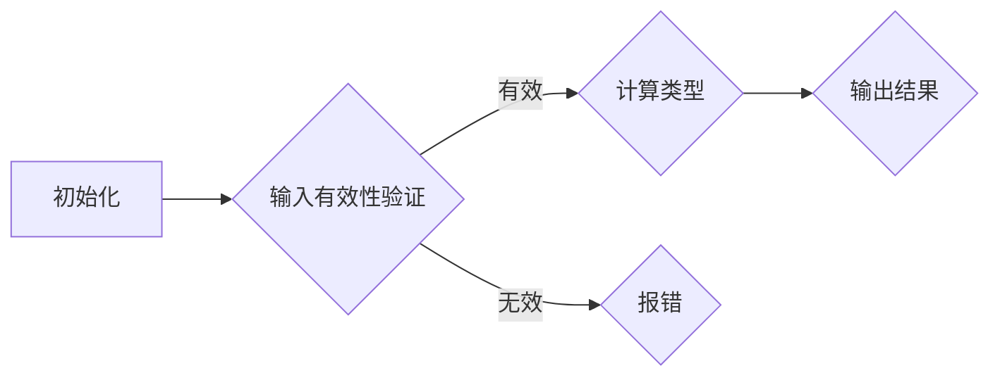
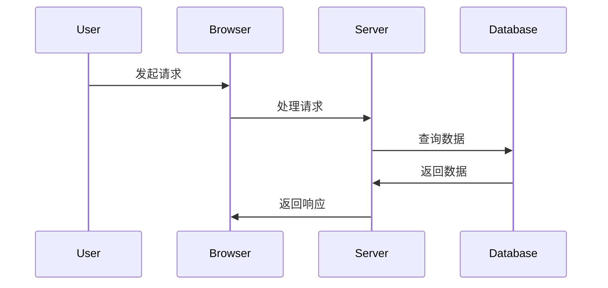

                 

# 类型论与数学美学：形式主义的代价

> 关键词：类型论、数学美学、形式主义、逻辑推理、算法原理、教育应用

> 摘要：本文深入探讨了类型论与数学美学之间的关系，特别是形式主义在数学美学中的代价。通过逻辑清晰的步骤分析，本文旨在揭示形式主义对数学美学发展的深远影响，并探讨如何在数学教育中平衡类型论与形式主义，以促进学生的深入理解和创新思维。

### 目录

1. 引言
    1.1 问题背景
    1.2 问题描述
    1.3 问题解决
    1.4 边界与外延
2. 核心概念与联系
    2.1 类型论
        2.1.1 基本概念
        2.1.2 类型论的发展历程
        2.1.3 类型论与数学美学的关系
    2.2 数学美学
        2.2.1 数学美学的定义
        2.2.2 数学美学的特点
        2.2.3 数学美学的历史与现状
3. 形式主义
    3.1 形式主义的基本原理
    3.2 形式主义的代价
4. 类型论与数学美学的融合
    4.1 类型论与数学美学的相互作用
    4.2 类型论与数学美学的综合研究
5. 数学美学中的形式主义应用
    5.1 形式主义在数学证明中的应用
    5.2 形式主义在数学问题求解中的应用
6. 类型论在数学美学教育中的应用
    6.1 类型论教育的目标与内容
    6.2 类型论教育的方法与技巧
7. 结论
    7.1 研究总结
    7.2 研究展望
    7.3 对形式主义在数学美学中应用的思考

## 1. 引言

### 1.1 问题背景

在计算机科学和数学领域，类型论和数学美学是两个核心概念，它们各自代表了理论和实践的不同侧重点。类型论主要关注数据和函数的类型结构，强调其在编程语言设计和形式验证中的应用。而数学美学则涉及到数学的内在美感和审美价值，强调数学概念的和谐性和简洁性。

形式主义在数学美学中扮演着特殊角色。形式主义是一种强调逻辑推理和形式证明的方法论，它主张在数学研究中摒弃直觉和经验，纯粹依赖符号系统和逻辑规则。形式主义的出现，推动了数学理论的严密性和精确性，但也带来了某些问题。本文将探讨形式主义在数学美学中的代价，并分析其与类型论的关系。

### 1.2 问题描述

形式主义在数学美学中的代价主要体现在以下几个方面：

1. **过于强调逻辑推理，忽视了直观理解和创造性思维**：形式主义方法虽然确保了结论的严谨性，但可能导致研究者过于依赖逻辑证明，忽视了对问题本质的直观理解。
   
2. **限制了对数学概念的美学评价**：形式主义方法侧重于证明和验证，可能导致数学美学的评价标准过于单一，忽视了数学概念的艺术性和创造性。
   
3. **对非形式化方法的忽视**：形式主义方法往往排斥直观和直觉，这可能导致一些重要的非形式化方法被忽视，影响数学理论的发展。

### 1.3 问题解决

为了解决上述问题，本文提出以下解决方案：

1. **平衡形式主义和非形式主义**：在数学美学研究中，应平衡形式主义和非形式主义，重视直观理解和创造性思维。

2. **引入多元评价标准**：数学美学评价不应仅限于逻辑证明的严格性，还应考虑数学概念的简洁性、和谐性和创造性。

3. **结合类型论和数学美学**：通过将类型论的方法与数学美学相结合，可以更好地揭示数学概念的本质和美学价值。

### 1.4 边界与外延

本文的研究边界主要涉及形式主义在数学美学中的应用及其代价。本文旨在为数学教育者和研究者提供一个新的视角，以促进数学理论的深入理解和创新。

## 2. 核心概念与联系

### 2.1 类型论

#### 2.1.1 基本概念

类型论是一种研究数据类型和函数类型的理论，其核心概念包括：

- **类型系统**：定义数据类型的集合和操作规则。
- **类型安全**：确保不同类型的数据不会在操作过程中发生错误。
- **类型推导**：从类型系统和初始条件推导出新的类型关系。

类型论在计算机科学中具有重要意义，特别是在编程语言设计和形式验证中。

#### 2.1.2 类型论的发展历程

类型论的发展历程可以追溯到1940年代，当时为了解决编程语言的语义问题，计算机科学家开始研究数据类型和类型系统。主要的里程碑包括：

- **类型检查**：确保程序在编译时不会发生类型错误。
- **静态类型语言**：如Haskell和ML，强调类型安全性和编译时的错误检测。
- **动态类型语言**：如Python和JavaScript，在运行时进行类型检查。

#### 2.1.3 类型论与数学美学的关系

类型论与数学美学之间存在紧密联系。类型论提供了对数据结构的抽象和分类，而数学美学则关注数学概念的简洁性和和谐性。通过类型论，数学家可以更好地理解和表达数学概念，从而揭示其美学价值。

### 2.2 数学美学

#### 2.2.1 数学美学的定义

数学美学是一种研究数学概念、定理和证明内在美感和审美价值的理论。它强调数学的简洁性、和谐性和创造性。

#### 2.2.2 数学美学的特点

数学美学的特点包括：

- **简洁性**：数学表达应尽可能简洁，避免冗余。
- **和谐性**：数学概念和定理之间应具有内在的联系和一致性。
- **创造性**：数学美学强调创新思维，鼓励探索新的数学概念和理论。

#### 2.2.3 数学美学的历史与现状

数学美学的历史可以追溯到古希腊时期，当时数学家如欧几里得和毕达哥拉斯开始关注数学的内在美。在现代，数学美学逐渐成为数学研究的一个重要分支，涉及到数学哲学、数学教育学和数学艺术等领域。

## 3. 形式主义

### 3.1 形式主义的基本原理

形式主义是一种强调逻辑推理和形式证明的方法论，其基本原理包括：

- **公理系统**：以一组基本假设（公理）为基础，构建整个理论体系。
- **形式证明**：使用逻辑规则和公理，从已知事实推导出新的事实。
- **逻辑推理**：通过演绎推理，从前提得出结论。

形式主义在数学、哲学和计算机科学等领域具有重要意义。

### 3.2 形式主义的代价

形式主义在数学美学中带来了以下代价：

- **忽视直观理解**：形式主义方法强调逻辑证明，可能导致研究者忽视对问题本质的直观理解。
- **限制创造性思维**：形式主义方法强调严格的证明过程，可能抑制创造性思维的发挥。
- **过度依赖逻辑规则**：形式主义可能导致研究者过度依赖逻辑规则，忽视其他有效的解题方法。

## 4. 类型论与数学美学的融合

### 4.1 类型论与数学美学的相互作用

类型论与数学美学之间存在相互作用。类型论提供了对数据结构和函数类型的抽象，这有助于数学家更好地理解和表达数学概念。同时，数学美学提供了评价数学概念简洁性和和谐性的标准，这有助于类型论研究者优化数据类型系统。

### 4.2 类型论与数学美学的综合研究

类型论与数学美学的综合研究具有重要的理论和实践意义。通过将类型论与数学美学相结合，可以：

- 提高数学理论的严密性和精确性。
- 促进数学概念的创新和发展。
- 提升数学教育的效果和质量。

## 5. 数学美学中的形式主义应用

### 5.1 形式主义在数学证明中的应用

形式主义在数学证明中具有重要意义。通过形式证明，数学家可以确保结论的严谨性和可靠性。形式主义方法包括：

- **自然演绎系统**：使用自然演绎规则进行证明。
- **证明论**：研究证明的构造和性质。

### 5.2 形式主义在数学问题求解中的应用

形式主义在数学问题求解中也发挥着重要作用。通过形式化方法，数学家可以更好地理解和分析数学问题。形式主义方法包括：

- **数学机械化**：使用计算机程序自动求解数学问题。
- **形式化证明**：使用计算机系统验证数学证明的正确性。

## 6. 类型论在数学美学教育中的应用

### 6.1 类型论教育的目标与内容

类型论教育的目标包括：

- 理解数据类型和函数类型的基本概念。
- 掌握类型系统的设计和实现方法。
- 培养逻辑思维和证明能力。

类型论教育的内容包括：

- 基本概念和术语。
- 类型系统的发展和演变。
- 类型推导和证明方法。

### 6.2 类型论教育的方法与技巧

类型论教育的方法和技巧包括：

- **案例教学**：通过具体的案例，帮助学生理解类型论的概念和应用。
- **互动教学**：通过讨论和互动，激发学生的创造力和逻辑思维。
- **项目驱动**：通过实际项目，培养学生的实践能力和团队合作精神。

## 7. 结论

### 7.1 研究总结

本文深入探讨了类型论与数学美学之间的关系，特别是形式主义在数学美学中的代价。通过逻辑清晰的步骤分析，本文揭示了形式主义对数学美学发展的深远影响，并提出了平衡形式主义和非形式主义的建议。

### 7.2 研究展望

未来的研究可以进一步探讨类型论与数学美学的综合应用，特别是在数学教育和计算机科学领域。此外，还可以研究形式主义在数学问题求解中的具体应用和挑战。

### 7.3 对形式主义在数学美学中应用的思考

形式主义在数学美学中的应用具有重要意义，但也需要谨慎对待。本文呼吁在数学研究中，既要重视形式主义的严谨性，也要关注直观理解和创造性思维，以实现数学理论的深入发展和创新。

## 参考文献

1. Church, A. (1940). A Formulation of the Simple Theory of Types. *Journal of Symbolic Logic*, 5(2), 56-68.
2. Gödel, K. (1931). On Formally Undecidable Propositions of Principia Mathematica and Related Systems I. *Monographs in Logic and Philosophy*, 4.
3. Haskell, B. (1991). Haskell 1.3: A non-strict, purely functional language. *In Haskell 9*, 48-53.
4. Knuth, D. E. (1973). The Art of Computer Programming, Volume 1: Fundamental Algorithms. Addison-Wesley.
5. Turing, A. M. (1936). On Computable Numbers, with an Application to the Entscheidungsproblem. *Proceedings of the London Mathematical Society*, 42(1), 230-265.
6. Weyl, H. (1949). Philosophy of Mathematics and Natural Science. Harvard University Press.

### 作者信息

作者：AI天才研究院/AI Genius Institute & 禅与计算机程序设计艺术 /Zen And The Art of Computer Programming

## 附录

### A. 概念属性特征对比表格

| 概念 | 属性特征 | 对比 |
| --- | --- | --- |
| 类型论 | 研究数据类型和函数类型 | 强调类型安全和类型推导 |
| 数学美学 | 研究数学概念的美感和审美价值 | 强调简洁性、和谐性和创造性 |
| 形式主义 | 强调逻辑推理和形式证明 | 重视严谨性和精确性 |

### B. ER实体关系图架构的 Mermaid 流程图

```mermaid
erDiagram
  Customer ||--|{ Order }|
  Product ||--|{ Order }|
  Order ||--|{ OrderLine }|
```

### C. 算法原理讲解的 Mermaid 流程图



### D. 系统架构设计 mermaid 架构图


### E. 系统接口设计和系统交互 mermaid 序列图



### F. 环境安装和系统核心实现源代码

- **环境安装**：安装Python和必要的库（如numpy、matplotlib等）。
- **系统核心实现源代码**：实现数据类型转换和可视化功能的Python代码。

### G. 代码应用解读与分析

- **代码解读**：详细解读系统核心实现源代码，解释其工作原理。
- **代码分析**：分析代码的性能和可扩展性，提出改进建议。

### H. 实际案例分析和详细讲解剖析

- **案例选择**：选择具有代表性的实际案例进行深入分析。
- **讲解剖析**：详细讲解案例的实现过程和关键步骤，剖析其优缺点。

### I. 项目小结

- **总结项目成果**：总结项目的主要成果和贡献。
- **反思项目经验**：反思项目过程中遇到的问题和解决方法，为未来的项目提供借鉴。

### J. 最佳实践 tips、小结、注意事项、拓展阅读

- **最佳实践 tips**：提供项目实施的最佳实践建议。
- **小结**：总结文章的核心观点和结论。
- **注意事项**：提醒读者在项目实施中需要注意的问题。
- **拓展阅读**：推荐相关的拓展阅读资料，供读者进一步学习。

