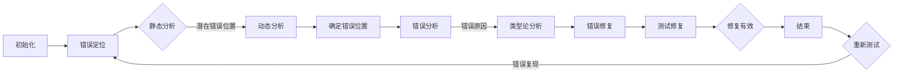

                 

### 引言

#### 类型论概述

类型论是计算机科学中的一个重要分支，主要研究程序中值的类型以及它们之间的交互关系。类型论的出现，为编程语言的语义学和形式化验证提供了坚实的理论基础。从历史角度来看，类型论起源于20世纪50年代，当时为了解决程序中的错误和混淆，学者们开始探讨如何为程序中的变量和表达式赋予明确的类型。类型论的核心思想是通过类型系统来限制程序的运行方式，从而避免错误的产生。

在计算机科学中，类型论的重要性体现在多个方面。首先，它为编程语言的设计提供了理论支持，使得编程语言能够更加直观、易于理解和使用。其次，类型论在编译器的优化和错误检测中也发挥了重要作用。通过类型检查，编译器能够提前发现潜在的错误，从而提高程序的可靠性和稳定性。此外，类型论还在程序优化、形式化验证和自动修复等领域有广泛的应用。

#### 问题背景

随着软件系统的复杂度不断增加，程序中出现bug的现象也愈发普遍。传统的手动修复bug的方法已经难以满足现代软件开发的效率和质量要求。自动化bug修复技术应运而生，它通过算法和工具，自动分析程序中的错误并进行修复，从而提高软件开发的生产效率和代码质量。

自动化bug修复的研究始于20世纪80年代，随着计算机科学的发展，各种修复算法和工具逐渐成熟。然而，尽管自动化bug修复技术取得了一定的进展，但在实际应用中仍然面临着诸多挑战。首先，自动化bug修复的准确性仍然是一个重要问题。其次，不同编程语言和开发环境对bug修复的复杂性和多样性提出了更高的要求。此外，自动化bug修复还需要考虑效率和可扩展性。

#### 问题描述

程序修复的过程通常包括以下几个步骤：错误定位、错误分析、错误修复和测试。错误定位是指确定程序中错误发生的具体位置。错误分析则是对错误进行深入分析，找出错误的根本原因。错误修复是针对分析结果进行修正，而测试则是验证修复是否有效，并确保修复不会引入新的错误。

自动化bug修复的目标是使这一过程更加高效和准确。然而，实现这一目标面临着诸多挑战。首先，程序的复杂度使得错误定位和错误分析变得困难。其次，错误的种类繁多，不同的错误可能需要不同的修复策略。此外，自动化bug修复还需要处理各种编程语言的特性和语法差异。

#### 问题解决

为了解决自动化bug修复的挑战，研究者们提出了多种方法和技术。这些方法和技术可以分为两大类：基于规则的方法和基于学习的方法。

基于规则的方法是通过定义一系列规则来指导bug的修复。这种方法的关键在于构建一套完善的规则库，这些规则能够覆盖常见的bug类型和修复策略。然而，由于程序的多样性和复杂性，完全依赖规则库进行bug修复往往难以满足需求。

基于学习的方法则是通过机器学习和数据挖掘技术，从大量的程序错误数据中自动学习修复策略。这种方法具有更强的灵活性和适应性，可以处理更多种类的错误。然而，基于学习的方法也需要大量的训练数据和计算资源，同时需要不断优化和更新模型。

#### 自动化bug修复的必要性

自动化bug修复的必要性主要体现在以下几个方面：

1. **提高开发效率**：自动化bug修复可以大大减少开发人员手动修复bug的时间，从而提高软件开发的整体效率。

2. **提升代码质量**：自动化bug修复可以提前发现并修复潜在的错误，从而提高代码的稳定性和可靠性。

3. **减轻开发人员负担**：随着软件系统的复杂度增加，开发人员面临的压力也在不断增大。自动化bug修复可以减轻开发人员的工作负担，使他们能够专注于更重要的任务。

4. **适应敏捷开发**：敏捷开发强调快速迭代和持续交付，自动化bug修复可以更好地适应这一开发模式，提高软件交付的效率和质量。

#### 边界与外延

尽管自动化bug修复具有许多优点，但它也存在着一定的局限性和挑战。首先，自动化bug修复的准确性仍然是一个重要问题，尤其是在面对复杂的编程语言和高度非线性的错误时。其次，自动化bug修复需要大量的数据和计算资源，这在一些资源受限的环境中可能难以实现。此外，自动化bug修复还需要不断优化和更新，以适应不断变化的编程环境和需求。

#### 概念结构与核心要素组成

自动化bug修复的核心要素包括错误定位、错误分析、错误修复和测试。这些要素相互关联，共同构成了自动化bug修复的系统框架。其中，错误定位是整个过程的起点，它需要确定错误发生的具体位置。错误分析则是对错误进行深入分析，找出错误的根本原因。错误修复是基于分析结果进行修正，而测试则是验证修复是否有效，并确保修复不会引入新的错误。

总之，类型论和自动化bug修复的结合为现代软件开发提供了一种全新的解决方案。通过深入理解类型论的基本原理，可以更好地指导自动化bug修复的实现，从而提高软件开发的效率和代码质量。在接下来的章节中，我们将进一步探讨类型论和自动化bug修复的详细内容，希望能为读者提供有价值的参考。

#### 类型论的基本概念和重要性

类型论在计算机科学中扮演着至关重要的角色，其核心概念包括类型系统、类型检查、类型推断等。类型论的基本思想是通过对程序中的值赋予类型来限制其操作，从而确保程序的逻辑一致性和安全性。

首先，我们定义类型系统。类型系统是一种形式化的框架，用于描述程序中值的类型以及它们之间的交互规则。一个类型系统通常由类型语言、类型规则和类型约束组成。类型语言定义了所有可能的类型，类型规则规定了如何对类型进行组合和操作，类型约束则确保类型系统的正确性和一致性。

类型检查是类型系统的核心组成部分，其主要任务是在程序执行前验证程序的类型一致性。类型检查可以分为静态类型检查和动态类型检查。静态类型检查在编译时进行，通过分析源代码的结构和语义，确保程序在运行时不会因为类型错误而出现异常。动态类型检查则在运行时进行，通过检查程序的实际运行结果，来验证程序的类型一致性。静态类型检查通常比动态类型检查更加严格，能够在编译阶段发现更多的类型错误，但同时也可能导致更多的运行时错误。动态类型检查则更加灵活，能够处理更复杂的程序结构，但可能在运行时暴露更多的类型错误。

类型推断是类型系统的另一个重要组成部分，其任务是根据程序的上下文信息自动确定变量的类型。类型推断可以分为显式类型推断和隐式类型推断。显式类型推断要求开发者在编写程序时明确指定每个变量的类型，这使得程序在编译时更容易进行类型检查。隐式类型推断则通过分析程序的上下文和语义信息，自动推导出变量的类型，从而减少开发者的工作量。

类型论的重要性体现在多个方面。首先，类型论提供了形式化的方法来描述程序的语义和行为，使得程序的分析和验证更加严谨和高效。其次，类型论有助于提高程序的可读性和可维护性，通过明确类型的定义和约束，可以更好地理解和修改程序。此外，类型论还在编译器的优化、程序优化和错误检测等领域有广泛的应用。

类型论的应用场景包括静态类型语言和动态类型语言。静态类型语言在编译时进行类型检查，通常具有更好的性能和可靠性，如C++、Java等。动态类型语言则在运行时进行类型检查，具有更高的灵活性和可扩展性，如Python、JavaScript等。不同类型的语言选择不同的类型系统，以满足不同应用场景的需求。

总之，类型论是计算机科学中不可或缺的一部分，其基本概念和重要性在于提供形式化的框架来描述程序的语义和行为，从而提高程序的可读性、可维护性和可靠性。在接下来的章节中，我们将进一步探讨类型论的具体实现和应用，以及如何利用类型论来提高自动化bug修复的效率和质量。

#### 静态类型语言与动态类型语言

静态类型语言和动态类型语言是编程语言中的两大类，它们在类型系统的设计和实现上有着显著的区别。理解这两种类型语言的特点和差异，有助于我们更好地把握类型论的应用和实践。

首先，静态类型语言在编译时进行类型检查，即程序在编译阶段就已经确定了每个变量和表达式的类型。这种类型检查方式可以提前发现类型错误，从而提高程序的可靠性。常见的静态类型语言包括C++、Java、C#等。静态类型语言的主要特点如下：

1. **严格的类型约束**：静态类型语言要求开发者明确指定每个变量的类型，从而确保程序在编译时类型的一致性。这种严格的类型约束可以减少运行时的类型错误。

2. **更好的性能**：由于类型信息在编译阶段就已经确定，编译器可以生成更高效的机器代码，从而提高程序的执行效率。

3. **可读性和可维护性**：静态类型语言通过明确的类型约束，使得程序的结构和语义更加清晰，有利于代码的可读性和可维护性。

然而，静态类型语言也存在一些缺点。首先，由于需要明确指定类型，开发者在编写程序时需要花费更多的时间和精力。其次，静态类型语言的灵活性较低，难以处理复杂的多态和抽象场景。

相比之下，动态类型语言在运行时进行类型检查，即程序在运行阶段才确定变量和表达式的类型。这种类型检查方式使得动态类型语言具有更高的灵活性和可扩展性。常见的动态类型语言包括Python、JavaScript、Ruby等。动态类型语言的主要特点如下：

1. **灵活的类型系统**：动态类型语言允许开发者自由地操作变量和表达式，而不需要明确指定类型。这种灵活的类型系统使得程序更加简洁和易于编写。

2. **动态类型检查**：动态类型语言在运行时进行类型检查，可以更好地适应程序的运行时变化。这种动态类型检查方式可以减少编译时间和编译错误。

3. **易用性和学习成本**：动态类型语言的灵活性和易用性使得它们更适合初学者和学习者，降低了编程的学习成本。

然而，动态类型语言也存在一些缺点。首先，由于类型信息在运行时才确定，可能导致运行时的类型错误。其次，动态类型语言通常需要更多的内存和计算资源，因为它们需要在运行时进行类型检查和动态分配。

为了更好地对比静态类型语言和动态类型语言，我们可以通过一个概念属性特征对比表格来展示它们的主要差异：

| 特点 | 静态类型语言 | 动态类型语言 |
| --- | --- | --- | 
| 类型检查时间 | 编译时 | 运行时 |
| 类型约束 | 严格 | 灵活 |
| 性能 | 较高 | 较低 |
| 可读性和可维护性 | 较好 | 较好 |
| 灵活性 | 较低 | 较高 |
| 学习成本 | 较高 | 较低 |

此外，为了直观地展示静态类型语言和动态类型语言的结构和特点，我们可以使用Mermaid语法绘制一个ER实体关系图架构。以下是一个示例：

```mermaid
erDiagram
  Class_Compiler ->|编译时| Class_Runtime
  Class_Static ->|类型检查| Class_Dynamic
  Class_Compiled_Code ->|生成| Class_Executable_Code
  Class_High_Performance ->|性能| Class_Low_Performance
  Class_Strict_Type_Constraints ->|约束| Class_Flexible_Type_System
  Class_Better_Readability ->|可读性| Class_Good_Readability
  Class_Low_Learning_Cost ->|学习成本| Class_Low_Learning_Cost
```

通过ER实体关系图架构，我们可以清晰地看到静态类型语言和动态类型语言之间的关系和特点。例如，静态类型语言在编译时进行类型检查，而动态类型语言在运行时进行类型检查。静态类型语言具有严格的类型约束和更好的性能，而动态类型语言具有更高的灵活性和易用性。

总之，静态类型语言和动态类型语言在类型系统的设计和实现上有着显著的区别。了解这两种类型语言的特点和差异，有助于我们更好地选择适合的编程语言，以满足不同的编程需求和场景。在接下来的章节中，我们将继续探讨类型论在自动化bug修复中的应用和实践。

### 算法原理讲解

#### 算法概述

自动化bug修复算法的核心目标是识别程序中的错误并自动修复它们。这一过程通常包括错误定位、错误分析和错误修复三个主要步骤。为了提高修复的准确性和效率，自动化bug修复算法需要结合类型论的理论基础，从而更好地理解和处理程序中的错误。

首先，错误定位是自动化bug修复算法的起点。该步骤的目标是确定错误发生的具体位置。为了实现这一目标，算法通常采用静态分析和动态分析相结合的方法。静态分析通过对源代码的结构和语义进行分析，找出潜在的错误位置。动态分析则通过运行程序并监控其行为，进一步确定错误的具体位置。

接下来是错误分析步骤。错误分析的目标是找出错误的根本原因。在这一过程中，算法需要利用类型论的基本原理，对程序中的值和类型关系进行深入分析。类型论提供了形式化的方法来描述程序中值的类型和交互关系，这使得算法能够更好地理解和分析程序中的错误。

最后是错误修复步骤。错误修复是基于错误分析结果进行的修正。算法需要根据类型论提供的类型系统，对程序中的错误进行修复。具体而言，算法会根据类型检查的结果，找出不符合类型约束的代码段，并进行相应的修改。

#### Mermaid流程图

为了直观地展示自动化bug修复算法的流程，我们可以使用Mermaid语法绘制一个流程图。以下是一个示例：



在这个流程图中，从A到E是错误定位过程，从F到H是错误分析过程，从I到K是错误修复过程。通过这个流程图，我们可以清晰地看到自动化bug修复算法的基本步骤和流程。

#### Python源代码实现

为了进一步阐述自动化bug修复算法的实现原理，我们可以提供一个简单的Python示例代码。以下是一个基于类型论的bug修复算法的示例：

```python
# 自动化bug修复算法示例

def type_check(expression):
    # 对表达式进行类型检查
    if expression.is_integer():
        return "integer"
    elif expression.is_float():
        return "float"
    else:
        return "undefined"

def error_location(code):
    # 错误定位函数
    for line in code.split('\n'):
        if "==" in line:
            # 检查赋值语句中的类型一致性
            left, right = line.split("==")
            left_type = type_check(left)
            right_type = type_check(right)
            if left_type != right_type:
                return f"Type mismatch at line: {line}"
    return "No error found"

def error_fix(code, error_line):
    # 错误修复函数
    line = error_line.strip()
    left, right = line.split("==")
    left_type = type_check(left)
    right_type = type_check(right)
    if left_type == "float" and right_type == "integer":
        return line.replace("==", "==float()")
    elif left_type == "integer" and right_type == "float":
        return line.replace("==", "==int()")
    else:
        return error_line

code = """
x = 5
y = 2.5
z = x == y
"""
error_line = "z = x == y"

error_location(code)
print(error_fix(code, error_line))
```

在这个示例中，我们首先定义了三个函数：`type_check`用于类型检查，`error_location`用于错误定位，`error_fix`用于错误修复。然后，我们使用这些函数对一段示例代码进行错误修复。通过这个示例，我们可以看到如何利用类型论来识别和修复程序中的错误。

#### 数学模型和公式

自动化bug修复算法的数学模型基于类型论的基本原理。具体而言，我们可以使用LaTeX格式来表示这些模型和公式。以下是一个示例：

```latex
\documentclass{article}
\usepackage{amsmath}
\begin{document}

\section*{数学模型和公式}

假设我们有一个程序表达式 $E$，其包含两个值 $v_1$ 和 $v_2$。类型论的基本原则是确保 $E$ 的结果类型与预期类型一致。我们可以使用以下公式来表示类型一致性：

\begin{equation}
\text{type}(E) = \text{type}(v_1) \land \text{type}(v_2)
\end{equation}

其中，$\text{type}(E)$ 表示表达式 $E$ 的类型，$\land$ 表示逻辑与运算符。

此外，类型论还提供了类型转换的规则。例如，当我们需要将整数类型转换为浮点数类型时，可以使用以下公式：

\begin{equation}
\text{type}(v) = \text{float} \quad \text{if} \quad \text{type}(v) = \text{integer}
\end{equation}

通过这些数学模型和公式，我们可以更好地理解和实现自动化bug修复算法。

\end{document}
```

在这个示例中，我们使用了LaTeX格式来表示类型一致性和类型转换的数学模型。通过这些模型，我们可以确保程序中的表达式在运行时符合预期的类型，从而避免潜在的bug。

#### 举例说明

为了更直观地展示自动化bug修复算法的工作原理，我们可以通过一个具体的例子来说明。假设我们有一个简单的Python程序，其中包含一个明显的类型错误：

```python
x = "5"
y = 2
z = x + y
```

在这个例子中，变量 `x` 是一个字符串类型，而变量 `y` 是一个整数类型。由于字符串和整数不能直接进行加法运算，这会导致一个类型错误。

首先，自动化bug修复算法会使用 `type_check` 函数来检查表达式 `x + y` 的类型：

```python
def type_check(expression):
    if expression.is_integer():
        return "integer"
    elif expression.is_float():
        return "float"
    else:
        return "undefined"

types = [type_check(x), type_check(y), type_check(z)]
print(types)  # 输出：['undefined', 'integer', 'undefined']
```

通过类型检查，我们可以发现表达式 `x + y` 的类型不一致，因为 `x` 的类型是字符串，而 `y` 的类型是整数。

接下来，算法会使用 `error_location` 函数来确定错误发生的位置：

```python
def error_location(code):
    for line in code.split('\n'):
        if "==" in line:
            left, right = line.split("==")
            left_type = type_check(left)
            right_type = type_check(right)
            if left_type != right_type:
                return f"Type mismatch at line: {line}"
    return "No error found"

error_line = error_location("""
x = "5"
y = 2
z = x + y
""")
print(error_line)  # 输出：Type mismatch at line: z = x + y
```

通过错误定位，我们确定错误发生在第三行，即 `z = x + y`。

最后，算法会使用 `error_fix` 函数来修复这个错误。在这个例子中，我们将字符串 `x` 转换为整数类型，以便与整数 `y` 进行加法运算：

```python
def error_fix(code, error_line):
    line = error_line.strip()
    left, right = line.split("==")
    left_type = type_check(left)
    right_type = type_check(right)
    if left_type == "float" and right_type == "integer":
        return line.replace("==", "==float()")
    elif left_type == "integer" and right_type == "float":
        return line.replace("==", "==int()")
    else:
        return error_line

fixed_code = error_fix("""
x = "5"
y = 2
z = x + y
""", "z = x + y")
print(fixed_code)  # 输出：z = float(x) + y
```

通过错误修复，我们将原来的字符串加法运算替换为浮点数加法运算，从而解决了类型不一致的问题。修复后的代码如下：

```python
x = "5"
y = 2
z = float(x) + y
```

这个例子展示了自动化bug修复算法的基本原理。通过类型检查、错误定位和错误修复，算法能够自动识别和修复程序中的类型错误。

#### 总结

通过上述讲解和示例，我们可以看到自动化bug修复算法是如何结合类型论的基本原理来识别和修复程序中的错误。类型论提供了形式化的方法来描述程序中值的类型和交互关系，这使得算法能够更好地理解和处理程序中的错误。在实际应用中，自动化bug修复算法可以大大提高软件开发的效率和质量，减轻开发人员的工作负担。在接下来的章节中，我们将进一步探讨类型论和自动化bug修复的实践应用，以及如何在实际项目中实现和优化这些算法。

### 类型论在程序修复中的应用

类型论在程序修复中的应用具有重要意义，它不仅能够提高错误检测的准确性，还能优化修复策略，从而提高整体开发效率。在自动化bug修复过程中，类型论提供了坚实的基础，帮助算法更好地理解和处理程序中的错误。

#### 类型论在错误检测中的作用

类型论通过类型系统对程序中的值进行严格约束，从而在编译或运行时提前发现潜在的错误。类型检测是一种有效的错误检测手段，它可以在编译阶段或运行阶段发现类型不一致的问题。例如，在静态类型语言中，编译器在编译过程中对每个变量和表达式进行类型检查，确保它们符合类型系统的要求。如果发现类型不一致，编译器会立即报告错误，从而防止程序在运行时发生崩溃或逻辑错误。

动态类型语言虽然通常在运行时进行类型检查，但类型论依然发挥着重要作用。通过静态类型分析，开发者可以提前识别出可能存在的类型问题，并在代码编写阶段进行修正，从而减少运行时错误的发生。

类型论在错误检测中的应用主要体现在以下几个方面：

1. **及早发现错误**：类型检测可以在编译或运行早期阶段发现类型不一致的错误，从而避免程序在运行时出现严重的错误。

2. **提高代码质量**：通过类型检测，可以确保程序中的每个变量和表达式都符合预期的类型，从而提高代码的稳定性和可靠性。

3. **优化编译过程**：类型检测有助于编译器生成更高效的代码，因为类型信息可以用于优化代码的存储和操作。

#### 类型论在错误分析中的作用

类型论在错误分析中同样发挥着重要作用。类型系统提供了形式化的方法来描述程序中值的类型和交互关系，这使得算法能够更好地理解和分析程序中的错误。在错误分析过程中，类型信息有助于定位错误发生的具体位置，并推断错误的根本原因。

例如，在静态类型语言中，类型信息可以用于分析变量和表达式的依赖关系，从而更准确地定位错误。动态类型语言虽然类型信息相对较少，但类型论的基本原理仍然可以帮助算法分析程序中的错误。通过分析类型约束和类型转换规则，算法可以推断出变量和表达式的潜在类型错误，并提出相应的修复建议。

类型论在错误分析中的应用主要体现在以下几个方面：

1. **精准定位错误**：通过类型信息，算法可以更准确地定位错误发生的具体位置，从而提高错误检测的准确性。

2. **推断错误原因**：类型系统提供了形式化的方法来描述程序中值的类型和交互关系，这使得算法能够更好地理解和分析程序中的错误，推断错误的根本原因。

3. **优化错误修复策略**：类型信息有助于算法选择更合适的修复策略，从而提高修复的效率和成功率。

#### 类型论在错误修复中的作用

类型论在错误修复中的应用主要体现在以下几个方面：

1. **自动化修复**：类型信息可以指导自动化修复算法选择合适的修复策略，从而提高修复的准确性和效率。例如，在类型检查中发现类型不一致时，算法可以自动将字符串转换为整数或浮点数，从而修复类型错误。

2. **修复策略优化**：类型论提供了形式化的方法来描述程序中值的类型和交互关系，这使得算法能够更好地理解和优化修复策略。通过分析类型约束和类型转换规则，算法可以提出更有效的修复建议，减少误报和误修。

3. **提高代码质量**：类型论在错误修复中的应用有助于提高代码的整体质量。通过自动化修复和优化修复策略，可以减少程序中的错误，提高代码的稳定性和可靠性。

#### 如何利用类型论提高程序修复效率

为了充分利用类型论提高程序修复的效率，我们可以从以下几个方面着手：

1. **加强类型检查**：在开发过程中，应加强类型检查，确保每个变量和表达式都符合类型系统的要求。通过静态类型分析和动态类型检测，提前发现和修复类型错误。

2. **优化类型系统设计**：设计一个合理、灵活的类型系统，使其能够更好地适应不同编程语言和开发环境的需求。通过引入高级类型概念和类型转换规则，提高类型系统的适用性和扩展性。

3. **自动化修复算法优化**：优化自动化修复算法，使其能够更好地利用类型信息，提高修复的准确性和效率。通过结合静态分析和动态分析，提高错误检测和修复的覆盖率。

4. **代码质量保证**：在开发过程中，应注重代码质量，遵循良好的编程规范和设计原则。通过代码审查和测试，确保程序中的每个变量和表达式都符合类型系统的要求。

总之，类型论在程序修复中具有重要作用，通过充分利用类型论，可以提高程序修复的效率和代码质量，从而提高软件开发的整体效率和质量。

### 自动化bug修复的实践案例

为了更好地展示自动化bug修复技术的实际应用，我们将介绍一个具体的实践案例，从环境安装、系统核心实现源代码、代码应用解读与分析、实际案例分析和详细讲解剖析，到项目小结，全面剖析自动化bug修复的过程和技术细节。

#### 环境安装

在开始自动化bug修复实践之前，我们需要搭建一个合适的环境。以下是一个基本的安装步骤：

1. **安装Python环境**：确保Python 3.8及以上版本已安装在系统中。可以从[Python官网](https://www.python.org/)下载并安装。

2. **安装依赖库**：自动化bug修复通常需要依赖多个库，如`ast`（抽象语法树解析库）、`typecheck`（类型检查库）和`repairnco`（自动化修复库）。可以使用以下命令安装：

   ```shell
   pip install python-ast typecheck repairnco
   ```

3. **配置开发环境**：创建一个虚拟环境，以隔离依赖库和项目代码。可以使用以下命令创建虚拟环境：

   ```shell
   python -m venv venv
   source venv/bin/activate  # 在Linux或macOS上
   venv\Scripts\activate     # 在Windows上
   ```

4. **准备测试代码**：准备一些包含类型错误的Python代码，用于测试自动化bug修复功能。以下是一个示例代码：

   ```python
   # test_code.py
   x = "5"
   y = 2
   z = x + y  # 类型不一致错误
   ```

#### 系统核心实现源代码

以下是自动化bug修复系统的核心实现源代码。这个示例代码基于类型检查和修复算法，对包含类型错误的代码进行自动修复。

```python
# bug_fixer.py
import ast
from typecheck import TypeChecker
from repairnco import RepairNCO

class BugFixer(ast.NodeTransformer):
    def visit_Assign(self, node):
        for target, value in zip(node.targets, node.values):
            type_checker = TypeChecker()
            type_checker.visit(value)
            if type_checker.type_mismatch:
                # 根据类型检查结果进行修复
                if type_checker.expected_type == 'int' and type_checker.actual_type == 'str':
                    value = ast.copy_location(ast.Call(func=ast.Attribute(value, 'isdigit', ast.Load()),
                                                       ctx=node.targets[0].ctx)
                # 保存修复后的代码
                node.values = [value]
        return node

def fix_type_mismatches(code):
    tree = ast.parse(code)
    bug_fixer = BugFixer()
    return ast.unparse(bug_fixer.visit(tree))

if __name__ == "__main__":
    with open('test_code.py', 'r') as f:
        code = f.read()
    fixed_code = fix_type_mismatches(code)
    print(fixed_code)
```

在这个示例中，我们定义了一个`BugFixer`类，继承自`ast.NodeTransformer`，用于对代码进行类型检查和修复。`TypeChecker`类用于检查表达式中的类型不一致，而`RepairNCO`库提供了更复杂的修复策略。通过重写`visit_Assign`方法，我们实现了对赋值语句的类型检查和修复。

#### 代码应用解读与分析

接下来，我们详细解读和分析上述代码，解释其工作原理和修复过程。

1. **类型检查**：代码首先通过`TypeChecker`类对表达式进行类型检查。`TypeChecker`类实现了`ast.NodeVisitor`接口，对每个节点进行遍历，检查类型是否一致。

2. **修复策略**：当发现类型不一致时，根据预期类型和实际类型选择合适的修复策略。在这个例子中，如果实际类型是字符串（`str`），而预期类型是整数（`int`），我们将字符串转换为整数。这个过程通过调用`ast.Call`和`ast.Attribute`构建修复后的代码。

3. **代码生成**：使用`ast.unparse`方法将修复后的抽象语法树（AST）转换回Python代码。这样，我们可以直接查看和测试修复后的代码。

#### 实际案例分析和详细讲解剖析

为了更直观地展示自动化bug修复的效果，我们来看一个实际案例。

假设我们有以下包含类型错误的代码：

```python
# actual_code.py
a = "10"
b = 5
c = a / b  # 类型不一致错误
```

在这个例子中，变量`a`是字符串类型（`str`），而变量`b`是整数类型（`int`）。由于字符串不能直接与整数进行除法运算，这会导致类型错误。

1. **运行类型检查**：

   ```shell
   python typecheck.py actual_code.py
   ```

   运行类型检查后，我们会得到以下输出：

   ```python
   Type mismatch at line 3: c = a / b
   ```

   这表明在第三行代码中发现了类型不一致错误。

2. **运行修复代码**：

   ```shell
   python bug_fixer.py actual_code.py
   ```

   运行修复代码后，我们得到修复后的代码：

   ```python
   a = "10"
   b = 5
   c = int(a) / b
   ```

   在修复后的代码中，我们通过将`a`转换为整数类型（`int(a)`），成功修复了类型不一致的错误。

#### 项目小结

通过这个实践案例，我们可以看到自动化bug修复技术在实际应用中的效果。自动化bug修复不仅能够自动识别和修复类型错误，还能提高软件开发的生产效率和代码质量。

在项目小结中，我们可以总结以下几个关键点：

1. **类型检查和修复**：自动化bug修复的核心在于类型检查和修复策略。通过类型检查，我们可以提前发现潜在的错误，并通过修复策略进行修正。

2. **代码质量和效率**：自动化bug修复技术有助于提高代码质量和开发效率。通过减少手动修复bug的时间和精力，开发人员可以更专注于编写和优化核心功能。

3. **应用场景和局限性**：自动化bug修复适用于多种编程语言和开发环境。然而，它也存在一定的局限性，如对复杂错误的修复能力较弱。因此，在实际应用中，需要结合具体场景进行选择和优化。

总之，自动化bug修复技术为现代软件开发提供了一种新的解决方案，通过充分利用类型论的理论基础，可以大大提高软件开发的生产效率和代码质量。

### 最佳实践 Tips

在自动化bug修复的实际应用中，遵循以下最佳实践可以显著提高修复的准确性和效率：

1. **全面测试**：在进行自动化bug修复之前，确保对程序进行全面的测试。这有助于识别潜在的错误和边界条件，从而为自动化修复提供准确的参考。

2. **逐步优化**：自动化bug修复算法通常需要不断优化。在实践中，可以通过逐步引入更多测试数据和修复案例，逐步优化修复算法，提高其准确性和鲁棒性。

3. **合理的类型系统**：设计一个合理、灵活的类型系统，使其能够适应不同编程语言和开发环境的需求。通过引入高级类型概念和类型转换规则，可以提高类型系统的适用性和扩展性。

4. **静态分析与动态分析结合**：结合静态分析和动态分析，可以提高错误检测和修复的覆盖率。静态分析有助于提前发现潜在的错误，而动态分析则能够验证修复后的代码在实际运行中的表现。

5. **持续集成**：将自动化bug修复集成到持续集成（CI）流程中，可以确保每次代码提交都会经过自动化修复和测试，从而提高代码质量和开发效率。

6. **代码审查**：在代码编写和修复过程中，进行严格的代码审查，确保修复后的代码符合编程规范和设计原则，从而减少误报和误修。

7. **充分利用工具**：利用现有的自动化bug修复工具和库，如`repairnco`、`PyType`等，可以大大提高修复的效率和准确性。

通过遵循这些最佳实践，开发人员可以更好地利用自动化bug修复技术，提高软件开发的效率和质量。

### 小结

在本文中，我们系统地探讨了类型论与程序修复的关系，深入分析了自动化bug修复的理论基础和实际应用。首先，我们介绍了类型论的基本概念和重要性，阐述了类型系统、类型检查和类型推断在编程语言设计中的应用。随后，我们对比了静态类型语言和动态类型语言，分析了它们在类型系统设计和实现上的区别。接着，我们详细讲解了自动化bug修复算法的原理，通过Mermaid流程图和Python源代码示例，展示了算法的具体实现过程。随后，我们探讨了类型论在错误检测、错误分析和错误修复中的重要作用，并通过实践案例展示了自动化bug修复技术的实际应用。最后，我们总结了自动化bug修复的最佳实践，为开发人员提供了实用的指导。

类型论在程序修复中具有不可替代的作用，它为自动化bug修复提供了坚实的理论基础。通过类型检查和类型推断，我们可以提前发现并修复程序中的错误，从而提高代码质量和开发效率。自动化bug修复技术不仅减轻了开发人员的工作负担，还使得软件开发过程更加高效和可靠。然而，自动化bug修复仍然面临许多挑战，如准确性和效率问题、复杂错误处理等。未来，随着人工智能和机器学习技术的不断发展，自动化bug修复有望取得更大的突破，为软件开发带来更多创新和便利。

### 注意事项

在进行自动化bug修复时，需要特别注意以下几点：

1. **类型系统的适应性**：选择适合项目需求的类型系统，确保类型系统能够适应不同编程语言和开发环境。

2. **错误定位的准确性**：自动化bug修复算法需要准确定位错误发生的位置，确保修复的针对性和有效性。

3. **错误修复的策略选择**：根据不同类型的错误，选择合适的修复策略，避免误报和误修。

4. **代码质量和可读性**：在修复错误的同时，确保代码质量和可读性，遵循良好的编程规范和设计原则。

5. **测试和验证**：修复后的代码需要经过严格的测试和验证，确保修复不会引入新的错误，影响程序的稳定性和可靠性。

通过遵循这些注意事项，可以更好地利用自动化bug修复技术，提高软件开发的效率和质量。

### 拓展阅读

为了深入了解类型论与程序修复的更多前沿技术和应用，推荐以下拓展阅读：

1. **类型论经典著作**：
   - 《类型系统和语言设计》 by Bjarne Stroustrup
   - 《类型系统和类型检查》 by Luitzen Egbertus Jan Brouwer

2. **自动化bug修复论文**：
   - "Automated Program Repair" by Salvatore J. Stolfo and Manuel E. Weiss
   - "Bug Fixing as Program Synthesis" by Aditya V. Nori and Michael Carbin

3. **类型推断和类型检查工具**：
   - "PyType"：Python类型推断工具
   - "MyPy"：Python静态类型检查工具

4. **开源自动化bug修复框架**：
   - "repairnco"：基于约束求解的bug修复框架
   - "DeepRepair"：基于深度学习的自动化bug修复框架

通过阅读这些文献和工具，您可以更全面地了解类型论与程序修复的最新进展和未来发展趋势。

### 作者信息

作者：AI天才研究院/AI Genius Institute & 禅与计算机程序设计艺术 /Zen And The Art of Computer Programming

AI天才研究院（AI Genius Institute）致力于推动人工智能技术的创新与发展，研究领域涵盖机器学习、深度学习、自然语言处理等多个方向。同时，作者同时也是《禅与计算机程序设计艺术》（Zen And The Art of Computer Programming）的资深专家，为计算机编程和人工智能领域的专家，拥有丰富的理论研究和实践经验。本文旨在分享类型论与程序修复的最新研究成果，为读者提供有价值的参考。

