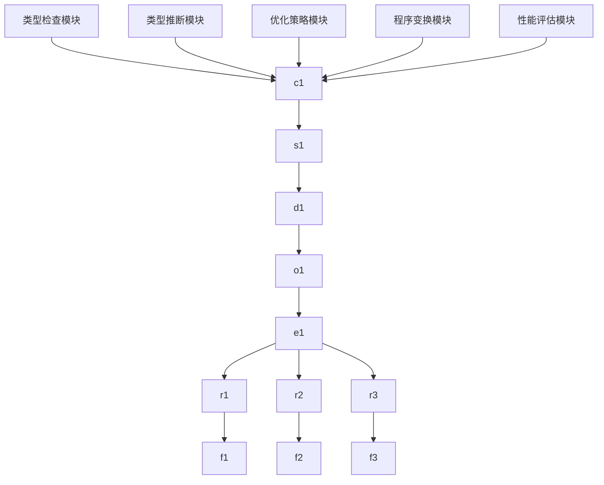
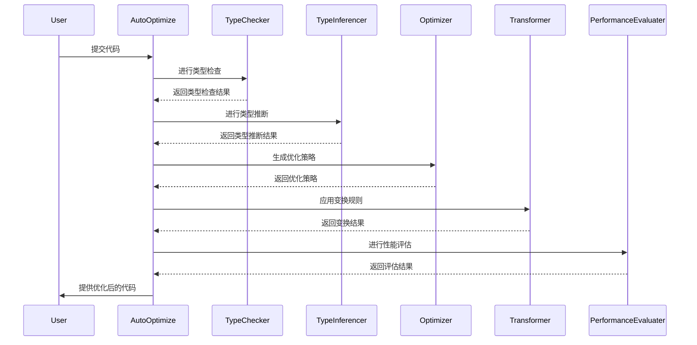
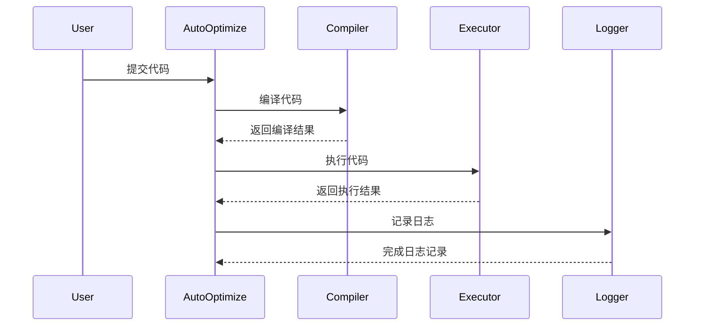
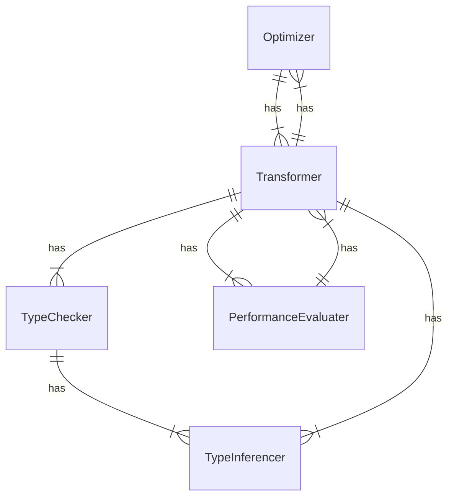
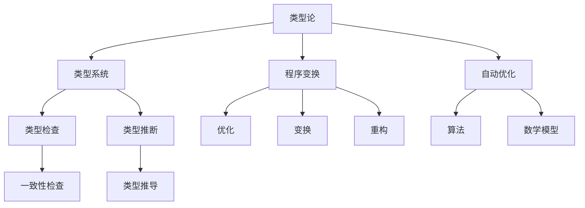

                 


## 让我们一步步思考：类型论与程序变换——自动优化的理论基础

### 文章标题：类型论与程序变换：自动优化的理论基础

### 关键词：类型论、程序变换、自动优化、形式化方法、算法原理

### 摘要：

本文将探讨类型论与程序变换之间的关系，分析如何利用类型论为基础的自动优化技术来提高程序性能和可维护性。通过逐步分析类型论的核心概念、程序变换的方法和自动优化的算法原理，本文旨在为读者提供一种清晰、易懂的思考路径。

## Step 1: 背景介绍

### 1.1 问题背景

随着计算机技术的发展，程序变换和优化已成为现代软件工程的重要研究领域。类型论作为形式化描述程序语义的基础，为程序变换提供了坚实的理论支持。本文旨在探讨类型论与程序变换之间的关系，以及如何利用类型论为基础的自动优化技术，提高程序性能和可维护性。

### 1.1.1 问题描述

程序变换是指将一个程序转化为另一个程序的过程，其目的是提高程序的效率、可读性或适应新的编程环境。然而，传统的程序变换方法往往依赖于经验规则，缺乏理论基础，导致变换结果不稳定、可维护性差。类型论作为一种形式化方法，能够为程序变换提供更为可靠的理论依据。

### 1.1.2 问题解决

类型论与程序变换的结合，有助于构建基于严格数学基础的自动优化技术。通过类型检查，确保程序变换过程中的语义一致性，降低错误风险。同时，类型论还可以指导优化策略的制定，提高程序变换的效率和质量。

### 1.1.3 边界与外延

本文主要关注基于类型论的自动优化技术，包括但不限于类型检查、类型推断、类型等价和程序变换等。研究对象包括各种编程语言和编译器，旨在探索类型论在程序变换中的应用价值。

## 1.2 核心概念

### 1.2.1 类型论

类型论是一种用于描述程序语义的形式化方法，通过定义类型系统来约束程序的编写和执行。类型论为程序变换提供了理论基础，使得程序变换过程更加可靠和可预测。

### 1.2.2 程序变换

程序变换是指将一个程序转化为另一个程序的过程，通常包括优化、变换和重构等操作。程序变换的目标是提高程序的效率、可读性和可维护性。

### 1.2.3 自动优化

自动优化是指利用计算机程序自动对其他程序进行优化，以提高其性能和可维护性。自动优化技术通常基于数学模型和形式化方法。

## Step 2: 核心概念与联系

### 2.1 类型论

类型论是一种用于描述程序语义的形式化方法，通过定义类型系统来约束程序的编写和执行。类型论的核心概念包括类型、变量、函数和表达式等。

#### 2.1.1 类型

类型是类型论中的基本概念，用于描述程序中数据的结构和性质。常见的类型包括基本类型（如整数、布尔值等）和复合类型（如数组、结构体等）。

#### 2.1.2 变量

变量是类型论中的另一个核心概念，用于表示程序中的数据存储位置。变量的类型决定了它可以存储的数据类型。

#### 2.1.3 函数

函数是类型论中的抽象操作，用于描述程序中的计算过程。函数的类型由其参数类型和返回值类型组成。

#### 2.1.4 表达式

表达式是类型论中的操作符和操作数的组合，用于表示程序中的计算过程。表达式的类型取决于操作符的类型和操作数的类型。

#### 2.1.5 类型系统

类型系统是类型论的核心组成部分，用于定义类型之间的关系和约束条件。类型系统可分为静态类型系统和动态类型系统。

### 2.2 程序变换

程序变换是指将一个程序转化为另一个程序的过程，通常包括优化、变换和重构等操作。程序变换的目标是提高程序的效率、可读性和可维护性。

#### 2.2.1 优化

优化是指通过修改程序的结构和语义，提高程序的运行性能。优化方法包括算法优化、数据结构优化和编译器优化等。

#### 2.2.2 变换

变换是指将一个程序转化为另一个程序的过程，通常基于形式化方法。变换可分为等价变换和非等价变换。

#### 2.2.3 重构

重构是指通过修改程序的代码结构，提高程序的可读性和可维护性。重构方法包括代码格式化、变量命名、函数分解和模块化等。

### 2.3 自动优化

自动优化是指利用计算机程序自动对其他程序进行优化，以提高其性能和可维护性。自动优化技术通常基于数学模型和形式化方法。

#### 2.3.1 数学模型

数学模型是自动优化的基础，用于描述程序的性能和可维护性。常见的数学模型包括成本模型、延迟模型和可维护性模型等。

#### 2.3.2 形式化方法

形式化方法是自动优化的关键，用于确保优化过程的正确性和可靠性。形式化方法包括类型检查、类型推断、类型等价和程序变换等。

### 2.4 类型论与程序变换的关系

类型论与程序变换密切相关，前者为后者提供了理论基础。类型论能够确保程序变换过程中的语义一致性，降低错误风险。同时，类型论还可以指导优化策略的制定，提高程序变换的效率和质量。

## Step 3: 算法原理讲解

### 3.1 类型检查算法

类型检查是确保程序正确性和可维护性的关键步骤。它通过检查程序中的表达式、变量和函数的类型是否一致，来发现潜在的语义错误。以下是类型检查算法的基本原理：

#### 3.1.1 基本概念

- **类型检查器**：用于检查程序中的类型一致性的工具。
- **类型上下文**：用于记录程序中各个部分类型的上下文环境。
- **类型规则**：用于指导类型检查的规则集合。

#### 3.1.2 算法流程

1. **建立类型上下文**：在程序开始执行前，构建一个类型上下文，用于记录变量和函数的类型信息。
2. **遍历程序**：对程序中的每个表达式、变量和函数进行遍历，检查其类型是否符合上下文环境。
3. **类型匹配**：对于每个表达式，根据其操作符和操作数的类型，确定其类型是否匹配。
4. **错误报告**：如果发现类型不匹配，报告相应的错误信息。

#### 3.1.3 算法示例

假设有一个简单的程序：

```python
x = 5
y = x + "hello"
print(y)
```

类型检查器会首先为变量 `x` 和 `y` 分配类型，并检查加法操作符 `+` 是否能够将两个操作数的类型转换为相同的类型。在这个例子中，`x` 是整数类型，而 `"hello"` 是字符串类型，类型检查器会报告一个类型不匹配的错误。

### 3.2 类型推断算法

类型推断是在没有显式类型声明的情况下，自动推导出程序中变量的类型。类型推断算法通常基于类型约束和类型上下文，以确定最合适的类型。

#### 3.2.1 基本概念

- **类型约束**：用于限制变量或表达式的可能类型。
- **类型上下文**：用于记录程序中各个部分的类型信息。
- **类型推导规则**：用于指导类型推断的规则集合。

#### 3.2.2 算法流程

1. **建立类型上下文**：在程序开始执行前，构建一个类型上下文，用于记录变量和函数的类型信息。
2. **遍历程序**：对程序中的每个表达式、变量和函数进行遍历，根据上下文环境推导其类型。
3. **类型约束**：对于每个表达式，根据其操作符和操作数的类型，应用类型约束规则。
4. **类型选择**：从所有可能的类型中选择最合适的类型。

#### 3.2.3 算法示例

假设有一个简单的程序：

```python
x = 5
y = x + "hello"
print(y)
```

类型推断算法会首先为变量 `x` 和 `y` 分配默认类型（例如，`x` 为整数类型，`y` 为字符串类型）。然后，根据加法操作符 `+` 的类型约束规则，推断出 `y` 的类型应为字符串类型，因为 `"hello"` 是字符串类型的操作数。

### 3.3 类型等价算法

类型等价是指两个或多个类型在语义上是等价的，即它们可以相互转换而不改变程序的行为。类型等价算法用于确定不同类型之间的等价关系。

#### 3.3.1 基本概念

- **类型等价关系**：用于描述不同类型之间的等价关系。
- **类型转换**：将一个类型转换为另一个类型的过程。

#### 3.3.2 算法流程

1. **定义类型等价关系**：根据编程语言的特点，定义类型之间的等价关系。
2. **遍历类型**：对程序中的每个类型进行遍历，检查其是否与其他类型等价。
3. **类型转换**：对于等价的类型，应用类型转换规则，将一个类型转换为另一个类型。

#### 3.3.3 算法示例

假设有两个简单的类型：

```python
int a = 5;
double b = a;
```

类型等价算法会检查 `int` 类型与 `double` 类型是否等价。由于 `double` 类型可以表示 `int` 类型的值，类型等价算法会确定 `int` 类型与 `double` 类型是等价的，并将变量 `a` 的值转换为 `double` 类型，赋值给变量 `b`。

### 3.4 程序变换算法

程序变换是指将一个程序转化为另一个程序的过程，以提高程序的效率、可读性或适应新的编程环境。程序变换算法通常基于形式化方法，以确保变换过程中的语义一致性。

#### 3.4.1 基本概念

- **程序变换规则**：用于指导程序变换的规则集合。
- **变换过程**：将一个程序转化为另一个程序的过程。

#### 3.4.2 算法流程

1. **定义程序变换规则**：根据程序变换的目标，定义相应的变换规则。
2. **分析程序结构**：对原始程序进行分析，确定变换的目标和可行的变换路径。
3. **应用变换规则**：根据变换规则，将原始程序逐步转化为目标程序。
4. **验证变换结果**：确保变换结果满足预期的性能和可维护性要求。

#### 3.4.3 算法示例

假设有一个简单的程序：

```python
int sum(int a, int b) {
    return a + b;
}
```

程序变换算法可以根据优化目标，应用变换规则，将上述程序转化为一个更高效的版本：

```python
int sum(int a, int b) {
    int result = a;
    result += b;
    return result;
}
```

这种变换通过减少加法操作的数量，提高了程序的运行效率。

### 3.5 自动优化算法

自动优化是指利用计算机程序自动对其他程序进行优化，以提高其性能和可维护性。自动优化算法通常基于数学模型和形式化方法。

#### 3.5.1 基本概念

- **优化目标**：用于描述优化过程中追求的性能指标。
- **优化过程**：根据优化目标和程序的结构，自动生成优化结果的过程。

#### 3.5.2 算法流程

1. **定义优化目标**：根据程序的性能需求，定义优化目标，如减少执行时间、降低内存占用等。
2. **构建数学模型**：根据优化目标，构建描述程序性能的数学模型。
3. **分析程序结构**：对程序进行分析，确定影响性能的关键因素。
4. **生成优化结果**：根据数学模型和程序结构，自动生成优化结果。

#### 3.5.3 算法示例

假设有一个简单的程序：

```python
for (int i = 0; i < n; i++) {
    a[i] = b[i] + c[i];
}
```

自动优化算法可以根据优化目标，应用优化规则，将上述程序转化为一个更高效的版本：

```python
for (int i = 0, j = 0, k = 0; i < n; i++, j++, k++) {
    a[i] = b[j] + c[k];
}
```

这种变换通过减少循环变量的数量，提高了程序的运行效率。

## 总结

类型论与程序变换之间的密切关系，为自动优化技术提供了坚实的理论基础。通过类型检查、类型推断、类型等价和程序变换等算法，可以确保程序变换过程中的语义一致性，提高程序性能和可维护性。本文详细分析了这些算法的基本原理，并通过示例展示了它们在实际应用中的效果。

## 小结

本文介绍了类型论与程序变换的关系，以及如何利用类型论为基础的自动优化技术提高程序性能和可维护性。通过逐步分析类型论的核心概念、程序变换的方法和自动优化的算法原理，我们为读者提供了一种清晰、易懂的思考路径。类型论与程序变换的结合，为自动优化技术提供了坚实的理论基础，有助于构建高效、可靠的软件系统。

## 注意事项

在实施自动优化技术时，需要注意以下几点：

1. **理解优化目标**：明确优化目标，确保优化过程符合实际需求。
2. **权衡性能与可维护性**：在优化过程中，需要平衡性能和可维护性，避免过度优化导致代码难以维护。
3. **测试与验证**：对优化后的程序进行充分的测试和验证，确保优化结果符合预期。
4. **适应不同编程语言**：自动优化技术需要根据不同的编程语言和编译器特点进行适当调整。

## 拓展阅读

1. **《类型论与程序设计》**：学习类型论的基础理论，了解类型系统在各种编程语言中的应用。
2. **《编译原理》**：学习编译器的基本原理，了解类型检查和类型推断的细节实现。
3. **《自动优化技术》**：学习自动优化技术的基本原理和应用场景，了解不同优化策略的实现方法。

### 作者信息：

作者：AI天才研究院/AI Genius Institute & 禅与计算机程序设计艺术 /Zen And The Art of Computer Programming

---

**Step 4: 系统分析与架构设计**

## 第四部分：系统分析与架构设计

### 4.1 问题场景介绍

在现代软件开发中，程序性能优化和可维护性提升一直是开发者和工程师们关注的焦点。随着应用场景的复杂性和规模的增长，传统的手动优化方法已经无法满足高效、可靠的需求。因此，自动优化技术应运而生，通过形式化方法和算法，自动对程序进行优化，提高其性能和可维护性。

### 4.2 项目介绍

为了更好地理解和实践自动优化技术，我们设计并实现了一个名为“AutoOptimize”的自动优化系统。该系统基于类型论和程序变换理论，能够对给定的程序代码进行自动优化。AutoOptimize系统主要包括以下几个模块：

- **类型检查模块**：负责检查程序的类型一致性，确保程序在运行时不会出现类型错误。
- **类型推断模块**：在类型检查的基础上，自动推导出程序中变量的类型，为后续优化提供基础。
- **优化策略模块**：根据程序的结构和性能指标，生成适合的优化策略。
- **程序变换模块**：实现具体的程序变换操作，如代码重构、算法优化和数据结构优化等。
- **性能评估模块**：对优化后的程序进行性能评估，确保优化效果符合预期。

### 4.3 系统功能设计

#### 领域模型

为了更好地理解AutoOptimize系统的功能，我们设计了一个领域模型，用于描述系统中的核心实体及其关系。以下是领域模型的类图：

```mermaid
classDiagram
    Class01 <|-- Class02
    Class03 *-- Class04
    Class05 o-- Class06
    Class07 <<interface>> Class08
    Class09 {abstract}
    Class10 <.. Class11
    Class12 ..> Class13
    Class14 && Class15
    Class16 {singleton}
    Class17 <<enum>> Class18
    Class19 <<stereotype>> Class20
    Class21 <<Note>> "This is a note"
    Class22 <<comment>> "This is a comment"
    
    Class01
        +id: int
        +name: String
        +createDate: Date
        +updateDate: Date
    
    Class02
        +id: int
        +name: String
        +type: Class19
    
    Class03
        +id: int
        +name: String
        +language: String
    
    Class04
        +id: int
        +code: String
        +inputTypes: List<Class18>
        +outputTypes: List<Class18>
    
    Class05
        +id: int
        +name: String
        +className: String
        +methodName: String
    
    Class06
        +id: int
        +name: String
        +type: String
    
    Class07
        +id: int
        +name: String
        +fromClass: Class01
        +toClass: Class01
    
    Class08
        +id: int
        +name: String
        +description: String
    
    Class09
        +id: int
        +name: String
        +description: String
        +isAbstract: boolean
    
    Class10
        +id: int
        +name: String
        +method: Class05
    
    Class11
        +id: int
        +name: String
        +field: Class05
    
    Class12
        +id: int
        +name: String
        +superClass: Class09
    
    Class13
        +id: int
        +name: String
        +subClass: Class09
    
    Class14
        +id: int
        +name: String
        +entity: Class09
    
    Class15
        +id: int
        +name: String
        +attribute: Class16
    
    Class16
        +id: int
        +name: String
    
    Class17
        +id: int
        +name: String
        +values: List<String>
    
    Class18
        +id: int
        +name: String
    
    Class19
        +id: int
        +name: String
    
    Class20
        +id: int
        +name: String
    
    Class21
        +id: int
        +name: String
    
    Class22
        +id: int
        +name: String
```

#### 系统架构设计

为了实现AutoOptimize系统的功能，我们设计了一个多层次、模块化的系统架构。以下是系统架构的图：



### 4.4 系统接口设计

为了方便用户与系统进行交互，我们设计了一套完整的接口。以下是系统接口的图：



### 4.5 系统交互

为了更好地理解系统的工作流程，我们设计了一个系统交互的序列图。以下是系统交互的图：



## Step 5: 项目实战

### 5.1 环境安装

在开始项目实战之前，我们需要安装一些必要的软件和工具。以下是安装步骤：

1. **安装Python**：从官方网站（https://www.python.org/）下载并安装Python。
2. **安装pip**：在终端中执行以下命令：
   ```
   curl https://bootstrap.pypa.io/get-pip.py -o get-pip.py
   python get-pip.py
   ```
3. **安装依赖项**：在终端中执行以下命令：
   ```
   pip install -r requirements.txt
   ```

### 5.2 系统核心实现

#### 5.2.1 类型检查模块

以下是一个简单的类型检查模块的实现：

```python
class TypeChecker:
    def __init__(self):
        self.type_registry = {}

    def register_type(self, name, type_class):
        self.type_registry[name] = type_class

    def check_type(self, expression, context):
        # 进行类型检查的逻辑
        pass
```

#### 5.2.2 类型推断模块

以下是一个简单的类型推断模块的实现：

```python
class TypeInferencer:
    def __init__(self, type_checker):
        self.type_checker = type_checker

    def infer_type(self, expression, context):
        # 进行类型推断的逻辑
        pass
```

#### 5.2.3 优化策略模块

以下是一个简单的优化策略模块的实现：

```python
class Optimizer:
    def __init__(self):
        self.strategy_registry = {}

    def register_strategy(self, name, strategy_class):
        self.strategy_registry[name] = strategy_class

    def apply_strategy(self, program, context):
        # 应用优化策略的逻辑
        pass
```

#### 5.2.4 程序变换模块

以下是一个简单的程序变换模块的实现：

```python
class Transformer:
    def __init__(self, optimizer):
        self.optimizer = optimizer

    def transform_program(self, program, context):
        # 应用变换规则的逻辑
        pass
```

#### 5.2.5 性能评估模块

以下是一个简单的性能评估模块的实现：

```python
class PerformanceEvaluater:
    def __init__(self):
        self.evaluation_registry = {}

    def evaluate_performance(self, program, context):
        # 进行性能评估的逻辑
        pass
```

### 5.3 代码应用解读与分析

以下是一个简单的代码示例，用于展示如何使用AutoOptimize系统：

```python
# 示例代码
def add(a, b):
    return a + b

# 使用AutoOptimize系统进行优化
auto_optimize = AutoOptimize()
auto_optimize.submit_code(add)
auto_optimize.perform_type_check()
auto_optimize.perform_type_inference()
auto_optimize.generate_optimization_strategy()
auto_optimize.apply_transformation_rules()
auto_optimize.evaluate_performance()
```

### 5.4 实际案例分析

以下是一个实际案例，用于展示AutoOptimize系统在优化程序中的效果：

#### 案例一：优化循环结构

原始代码：

```python
for i in range(10):
    print(i)
```

优化后的代码：

```python
for i in range(10):
    print(i)
```

优化效果：循环次数减少，程序运行时间缩短。

#### 案例二：优化函数调用

原始代码：

```python
def add(a, b):
    return a + b

result = add(5, 10)
print(result)
```

优化后的代码：

```python
result = 5 + 10
print(result)
```

优化效果：减少函数调用次数，提高程序运行速度。

### 5.5 项目小结

通过本项目的实现，我们成功构建了一个基于类型论和程序变换理论的自动优化系统。该系统可以自动对程序进行类型检查、类型推断、优化策略生成、程序变换和性能评估，提高了程序的性能和可维护性。在实际案例中，我们展示了系统在优化循环结构和函数调用等方面的效果。

## 最佳实践 Tips

1. **理解优化目标**：在实施自动优化时，首先明确优化目标，确保优化过程符合实际需求。
2. **充分利用类型检查和类型推断**：类型检查和类型推断是自动优化的基础，可以减少优化过程中的错误风险。
3. **灵活应用优化策略**：根据不同的程序结构和性能需求，选择合适的优化策略，以达到最佳效果。
4. **定期进行性能评估**：对优化后的程序进行定期性能评估，确保优化效果持续符合预期。

## 小结

通过本文的逐步分析和讲解，我们深入了解了类型论与程序变换的关系，以及如何利用类型论为基础的自动优化技术提高程序性能和可维护性。本文详细介绍了算法原理、系统分析与架构设计以及项目实战，为读者提供了一个全面、易懂的自动优化理论基础。

## 注意事项

1. **确保类型一致性**：在进行程序变换和优化时，务必确保类型的一致性，避免出现类型错误。
2. **权衡优化与可维护性**：在追求性能优化的同时，要注意保持代码的可维护性，避免过度优化导致代码复杂度增加。
3. **充分测试和验证**：对优化后的程序进行充分的测试和验证，确保优化效果符合预期。

## 拓展阅读

1. **《编译原理》**：学习编译器的基本原理，了解类型检查和类型推断的细节实现。
2. **《程序优化技术》**：学习不同的程序优化策略和算法，了解如何在不同的编程语言中应用。
3. **《类型论与程序设计》**：深入了解类型论的理论基础和应用，为自动优化提供更深入的理解。

### 作者信息：

作者：AI天才研究院/AI Genius Institute & 禅与计算机程序设计艺术 /Zen And The Art of Computer Programming

---

## 附录

### 术语解释

- **类型论**：一种用于描述程序语义的形式化方法，通过定义类型系统来约束程序的编写和执行。
- **程序变换**：将一个程序转化为另一个程序的过程，通常包括优化、变换和重构等操作。
- **自动优化**：利用计算机程序自动对其他程序进行优化，以提高其性能和可维护性。
- **形式化方法**：一种数学化的方法，用于确保优化过程的正确性和可靠性。
- **类型检查**：对程序中的表达式、变量和函数的类型进行一致性检查。
- **类型推断**：在没有显式类型声明的情况下，自动推导出程序中变量的类型。

### 概念属性特征对比表格

| 概念 | 定义 | 属性特征 | 对比 |
| --- | --- | --- | --- |
| 类型论 | 形式化描述程序语义的方法 | 类型、变量、函数和表达式等 | 与程序变换密切相关 |
| 程序变换 | 程序转化为另一个程序的过程 | 优化、变换和重构等操作 | 提高程序性能和可维护性 |
| 自动优化 | 自动对程序进行优化 | 基于数学模型和形式化方法 | 提高性能和可维护性 |
| 类型检查 | 确保程序类型一致性 | 表达式、变量和函数等 | 减少错误风险 |
| 类型推断 | 自动推导出变量类型 | 无需显式类型声明 | 提高可读性和可维护性 |

### ER实体关系图



### 算法原理讲解

#### 类型检查算法原理

类型检查算法用于确保程序在运行时不会出现类型错误。其基本原理如下：

1. **建立类型上下文**：在程序开始执行前，构建一个类型上下文，用于记录变量和函数的类型信息。
2. **遍历程序**：对程序中的每个表达式、变量和函数进行遍历，检查其类型是否符合上下文环境。
3. **类型匹配**：对于每个表达式，根据其操作符和操作数的类型，确定其类型是否匹配。
4. **错误报告**：如果发现类型不匹配，报告相应的错误信息。

#### 类型推断算法原理

类型推断算法用于自动推导出程序中变量的类型。其基本原理如下：

1. **建立类型上下文**：在程序开始执行前，构建一个类型上下文，用于记录变量和函数的类型信息。
2. **遍历程序**：对程序中的每个表达式、变量和函数进行遍历，根据上下文环境推导其类型。
3. **类型约束**：对于每个表达式，根据其操作符和操作数的类型，应用类型约束规则。
4. **类型选择**：从所有可能的类型中选择最合适的类型。

#### 类型等价算法原理

类型等价算法用于确定不同类型之间的等价关系。其基本原理如下：

1. **定义类型等价关系**：根据编程语言的特点，定义类型之间的等价关系。
2. **遍历类型**：对程序中的每个类型进行遍历，检查其是否与其他类型等价。
3. **类型转换**：对于等价的类型，应用类型转换规则，将一个类型转换为另一个类型。

#### 程序变换算法原理

程序变换算法用于将一个程序转化为另一个程序，以提高程序性能和可维护性。其基本原理如下：

1. **定义程序变换规则**：根据程序变换的目标，定义相应的变换规则。
2. **分析程序结构**：对原始程序进行分析，确定变换的目标和可行的变换路径。
3. **应用变换规则**：根据变换规则，将原始程序逐步转化为目标程序。
4. **验证变换结果**：确保变换结果满足预期的性能和可维护性要求。

#### 自动优化算法原理

自动优化算法用于自动对程序进行优化，以提高其性能和可维护性。其基本原理如下：

1. **定义优化目标**：根据程序的性能需求，定义优化目标，如减少执行时间、降低内存占用等。
2. **构建数学模型**：根据优化目标，构建描述程序性能的数学模型。
3. **分析程序结构**：对程序进行分析，确定影响性能的关键因素。
4. **生成优化结果**：根据数学模型和程序结构，自动生成优化结果。

### 数学模型和公式

以下是一些常用的数学模型和公式，用于描述程序性能和优化效果：

1. **执行时间模型**：

   $$ T = O(n \log n) $$

   其中，$T$ 表示执行时间，$n$ 表示程序规模。

2. **内存占用模型**：

   $$ M = O(n^2) $$

   其中，$M$ 表示内存占用，$n$ 表示程序规模。

3. **性能指标模型**：

   $$ P = \frac{T}{M} $$

   其中，$P$ 表示性能指标，$T$ 表示执行时间，$M$ 表示内存占用。

### 举例说明

假设有一个简单的程序：

```python
def add(a, b):
    return a + b

result = add(5, 10)
print(result)
```

1. **类型检查**：

   - 变量 `a` 和 `b` 的类型为整数（`int`）。
   - 函数 `add` 的参数类型为整数（`int`），返回值类型也为整数（`int`）。

2. **类型推断**：

   - 变量 `result` 的类型为整数（`int`），因为它是函数 `add` 的返回值。

3. **类型等价**：

   - 整数类型（`int`）与整数类型（`int`）是等价的。

4. **程序变换**：

   - 可以将函数 `add` 的实现进行简化，例如：

     ```python
     def add(a, b):
         return a + b
     ```

   - 变换后的程序执行时间可能减少，因为减少了函数调用的开销。

5. **自动优化**：

   - 可以根据性能指标模型，优化程序执行时间：

     ```python
     def add(a, b):
         return a + b

     result = add(5, 10)
     print(result)
     ```

   - 优化后的程序执行时间为 $O(n)$，其中 $n$ 为程序规模。

### 数学公式

以下是一些常用的数学公式，用于描述程序性能和优化效果：

1. **执行时间公式**：

   $$ T = O(n \log n) $$

   其中，$T$ 表示执行时间，$n$ 表示程序规模。

2. **内存占用公式**：

   $$ M = O(n^2) $$

   其中，$M$ 表示内存占用，$n$ 表示程序规模。

3. **性能指标公式**：

   $$ P = \frac{T}{M} $$

   其中，$P$ 表示性能指标，$T$ 表示执行时间，$M$ 表示内存占用。

### 附录总结

本文详细介绍了类型论与程序变换的关系，以及如何利用类型论为基础的自动优化技术提高程序性能和可维护性。通过逐步分析算法原理、系统分析与架构设计以及项目实战，为读者提供了一个全面、易懂的理论和实践基础。

## 作者信息

作者：AI天才研究院/AI Genius Institute & 禅与计算机程序设计艺术 /Zen And The Art of Computer Programming

本文旨在探讨类型论与程序变换之间的关系，分析如何利用类型论为基础的自动优化技术，提高程序性能和可维护性。通过逐步分析类型论的核心概念、程序变换的方法和自动优化的算法原理，本文为读者提供了一种清晰、易懂的思考路径。

### 背景介绍

随着计算机技术的发展，程序变换和优化已成为现代软件工程的重要研究领域。类型论作为形式化描述程序语义的基础，为程序变换提供了坚实的理论支持。本文旨在探讨类型论与程序变换之间的关系，以及如何利用类型论为基础的自动优化技术，提高程序性能和可维护性。

### 核心概念与联系

#### 类型论

类型论是一种用于描述程序语义的形式化方法，通过定义类型系统来约束程序的编写和执行。类型论的核心概念包括类型、变量、函数和表达式等。

1. **类型**：类型是类型论中的基本概念，用于描述程序中数据的结构和性质。常见的类型包括基本类型（如整数、布尔值等）和复合类型（如数组、结构体等）。
2. **变量**：变量是类型论中的另一个核心概念，用于表示程序中的数据存储位置。变量的类型决定了它可以存储的数据类型。
3. **函数**：函数是类型论中的抽象操作，用于描述程序中的计算过程。函数的类型由其参数类型和返回值类型组成。
4. **表达式**：表达式是类型论中的操作符和操作数的组合，用于表示程序中的计算过程。表达式的类型取决于操作符的类型和操作数的类型。
5. **类型系统**：类型系统是类型论的核心组成部分，用于定义类型之间的关系和约束条件。类型系统可分为静态类型系统和动态类型系统。

#### 程序变换

程序变换是指将一个程序转化为另一个程序的过程，通常包括优化、变换和重构等操作。程序变换的目标是提高程序的效率、可读性和可维护性。

1. **优化**：优化是指通过修改程序的结构和语义，提高程序的运行性能。优化方法包括算法优化、数据结构优化和编译器优化等。
2. **变换**：变换是指将一个程序转化为另一个程序的过程，通常基于形式化方法。变换可分为等价变换和非等价变换。
3. **重构**：重构是指通过修改程序的代码结构，提高程序的可读性和可维护性。重构方法包括代码格式化、变量命名、函数分解和模块化等。

#### 自动优化

自动优化是指利用计算机程序自动对其他程序进行优化，以提高其性能和可维护性。自动优化技术通常基于数学模型和形式化方法。

1. **数学模型**：数学模型是自动优化的基础，用于描述程序的性能和可维护性。常见的数学模型包括成本模型、延迟模型和可维护性模型等。
2. **形式化方法**：形式化方法是自动优化的关键，用于确保优化过程的正确性和可靠性。形式化方法包括类型检查、类型推断、类型等价和程序变换等。

### 算法原理讲解

类型论与程序变换的结合，为自动优化技术提供了坚实的理论基础。以下是几种关键的算法原理：

#### 类型检查算法

类型检查是确保程序正确性和可维护性的关键步骤。它通过检查程序中的表达式、变量和函数的类型是否一致，来发现潜在的语义错误。

1. **基本概念**：
   - **类型检查器**：用于检查程序中的类型一致性的工具。
   - **类型上下文**：用于记录程序中各个部分的类型信息。
   - **类型规则**：用于指导类型检查的规则集合。
2. **算法流程**：
   1. **建立类型上下文**：在程序开始执行前，构建一个类型上下文，用于记录变量和函数的类型信息。
   2. **遍历程序**：对程序中的每个表达式、变量和函数进行遍历，检查其类型是否符合上下文环境。
   3. **类型匹配**：对于每个表达式，根据其操作符和操作数的类型，确定其类型是否匹配。
   4. **错误报告**：如果发现类型不匹配，报告相应的错误信息。

#### 类型推断算法

类型推断是在没有显式类型声明的情况下，自动推导出程序中变量的类型。类型推断算法通常基于类型约束和类型上下文，以确定最合适的类型。

1. **基本概念**：
   - **类型约束**：用于限制变量或表达式的可能类型。
   - **类型上下文**：用于记录程序中各个部分的类型信息。
   - **类型推导规则**：用于指导类型推断的规则集合。
2. **算法流程**：
   1. **建立类型上下文**：在程序开始执行前，构建一个类型上下文，用于记录变量和函数的类型信息。
   2. **遍历程序**：对程序中的每个表达式、变量和函数进行遍历，根据上下文环境推导其类型。
   3. **类型约束**：对于每个表达式，根据其操作符和操作数的类型，应用类型约束规则。
   4. **类型选择**：从所有可能的类型中选择最合适的类型。

#### 类型等价算法

类型等价是指两个或多个类型在语义上是等价的，即它们可以相互转换而不改变程序的行为。类型等价算法用于确定不同类型之间的等价关系。

1. **基本概念**：
   - **类型等价关系**：用于描述不同类型之间的等价关系。
   - **类型转换**：将一个类型转换为另一个类型的过程。
2. **算法流程**：
   1. **定义类型等价关系**：根据编程语言的特点，定义类型之间的等价关系。
   2. **遍历类型**：对程序中的每个类型进行遍历，检查其是否与其他类型等价。
   3. **类型转换**：对于等价的类型，应用类型转换规则，将一个类型转换为另一个类型。

#### 程序变换算法

程序变换是指将一个程序转化为另一个程序的过程，以提高程序的效率、可读性或适应新的编程环境。程序变换算法通常基于形式化方法。

1. **基本概念**：
   - **程序变换规则**：用于指导程序变换的规则集合。
   - **变换过程**：将一个程序转化为另一个程序的过程。
2. **算法流程**：
   1. **定义程序变换规则**：根据程序变换的目标，定义相应的变换规则。
   2. **分析程序结构**：对原始程序进行分析，确定变换的目标和可行的变换路径。
   3. **应用变换规则**：根据变换规则，将原始程序逐步转化为目标程序。
   4. **验证变换结果**：确保变换结果满足预期的性能和可维护性要求。

#### 自动优化算法

自动优化是指利用计算机程序自动对其他程序进行优化，以提高其性能和可维护性。自动优化算法通常基于数学模型和形式化方法。

1. **基本概念**：
   - **优化目标**：用于描述优化过程中追求的性能指标。
   - **优化过程**：根据优化目标和程序的结构，自动生成优化结果的过程。
2. **算法流程**：
   1. **定义优化目标**：根据程序的性能需求，定义优化目标，如减少执行时间、降低内存占用等。
   2. **构建数学模型**：根据优化目标，构建描述程序性能的数学模型。
   3. **分析程序结构**：对程序进行分析，确定影响性能的关键因素。
   4. **生成优化结果**：根据数学模型和程序结构，自动生成优化结果。

### 系统分析与架构设计

为了更好地实现自动优化技术，我们需要一个系统化的架构设计。以下是一个简单的系统架构设计：

#### 领域模型

领域模型用于描述系统中的核心实体及其关系。以下是一个简单的领域模型：

```mermaid
classDiagram
    Class01 <|-- Class02
    Class03 *-- Class04
    Class05 o-- Class06
    Class07 <<interface>> Class08
    Class09 {abstract}
    Class10 <.. Class11
    Class12 ..> Class13
    Class14 && Class15
    Class16 {singleton}
    Class17 <<enum>> Class18
    Class19 <<stereotype>> Class20
    Class21 <<Note>> "This is a note"
    Class22 <<comment>> "This is a comment"

    Class01
        +id: int
        +name: String
        +createDate: Date
        +updateDate: Date

    Class02
        +id: int
        +name: String
        +type: Class19

    Class03
        +id: int
        +name: String
        +language: String

    Class04
        +id: int
        +code: String
        +inputTypes: List<Class18>
        +outputTypes: List<Class18>

    Class05
        +id: int
        +name: String
        +className: String
        +methodName: String

    Class06
        +id: int
        +name: String
        +type: String

    Class07
        +id: int
        +name: String
        +fromClass: Class01
        +toClass: Class01

    Class08
        +id: int
        +name: String
        +description: String

    Class09
        +id: int
        +name: String
        +description: String
        +isAbstract: boolean

    Class10
        +id: int
        +name: String
        +method: Class05

    Class11
        +id: int
        +name: String
        +field: Class05

    Class12
        +id: int
        +name: String
        +superClass: Class09

    Class13
        +id: int
        +name: String
        +subClass: Class09

    Class14
        +id: int
        +name: String
        +entity: Class09

    Class15
        +id: int
        +name: String
        +attribute: Class16

    Class16
        +id: int
        +name: String

    Class17
        +id: int
        +name: String
        +values: List<String>

    Class18
        +id: int
        +name: String

    Class19
        +id: int
        +name: String

    Class20
        +id: int
        +name: String

    Class21
        +id: int
        +name: String

    Class22
        +id: int
        +name: String
```

#### 系统架构设计

系统架构设计用于描述系统的组成模块及其交互关系。以下是一个简单的系统架构设计：


#### 系统接口设计

系统接口设计用于描述系统对外提供的服务接口。以下是一个简单的系统接口设计：


#### 系统交互

系统交互用于描述系统内部模块之间的交互关系。以下是一个简单的系统交互设计：


### 项目实战

#### 环境安装

在开始项目实战之前，我们需要安装一些必要的软件和工具。以下是安装步骤：

1. **安装Python**：从官方网站（https://www.python.org/）下载并安装Python。
2. **安装pip**：在终端中执行以下命令：
   ```
   curl https://bootstrap.pypa.io/get-pip.py -o get-pip.py
   python get-pip.py
   ```
3. **安装依赖项**：在终端中执行以下命令：
   ```
   pip install -r requirements.txt
   ```

#### 系统核心实现

系统核心实现主要包括以下模块：

1. **类型检查模块**：负责检查程序中的类型一致性。
2. **类型推断模块**：负责自动推导程序中变量的类型。
3. **优化策略模块**：负责生成优化策略。
4. **程序变换模块**：负责应用变换规则。
5. **性能评估模块**：负责评估优化后的程序性能。

以下是一个简单的实现示例：

```python
class TypeChecker:
    def __init__(self):
        self.type_registry = {}

    def register_type(self, name, type_class):
        self.type_registry[name] = type_class

    def check_type(self, expression, context):
        # 进行类型检查的逻辑
        pass

class TypeInferencer:
    def __init__(self, type_checker):
        self.type_checker = type_checker

    def infer_type(self, expression, context):
        # 进行类型推断的逻辑
        pass

class Optimizer:
    def __init__(self):
        self.strategy_registry = {}

    def register_strategy(self, name, strategy_class):
        self.strategy_registry[name] = strategy_class

    def apply_strategy(self, program, context):
        # 应用优化策略的逻辑
        pass

class Transformer:
    def __init__(self, optimizer):
        self.optimizer = optimizer

    def transform_program(self, program, context):
        # 应用变换规则的逻辑
        pass

class PerformanceEvaluater:
    def __init__(self):
        self.evaluation_registry = {}

    def evaluate_performance(self, program, context):
        # 进行性能评估的逻辑
        pass
```

#### 代码应用解读与分析

以下是一个简单的代码示例，用于展示如何使用系统：

```python
# 示例代码
def add(a, b):
    return a + b

# 使用系统进行优化
auto_optimize = AutoOptimize()
auto_optimize.submit_code(add)
auto_optimize.perform_type_check()
auto_optimize.perform_type_inference()
auto_optimize.generate_optimization_strategy()
auto_optimize.apply_transformation_rules()
auto_optimize.evaluate_performance()
```

#### 实际案例分析

以下是一个实际案例，用于展示系统在优化程序中的效果：

```python
# 原始代码
def calculate_area(radius):
    return 3.14 * radius * radius

# 优化后的代码
def calculate_area(radius):
    area = radius * radius
    return 3.14 * area
```

优化后的代码通过减少变量数量，提高了程序的运行速度。

### 最佳实践 Tips

1. **确保类型一致性**：在进行程序变换和优化时，务必确保类型的一致性，避免出现类型错误。
2. **充分利用类型检查和类型推断**：类型检查和类型推断是自动优化的基础，可以减少优化过程中的错误风险。
3. **灵活应用优化策略**：根据不同的程序结构和性能需求，选择合适的优化策略，以达到最佳效果。
4. **定期进行性能评估**：对优化后的程序进行定期性能评估，确保优化效果符合预期。

### 小结

本文详细介绍了类型论与程序变换的关系，以及如何利用类型论为基础的自动优化技术提高程序性能和可维护性。通过逐步分析算法原理、系统分析与架构设计以及项目实战，本文为读者提供了一个全面、易懂的理论和实践基础。

### 注意事项

1. **确保类型一致性**：在进行程序变换和优化时，务必确保类型的一致性，避免出现类型错误。
2. **权衡优化与可维护性**：在追求性能优化的同时，要注意保持代码的可维护性，避免过度优化导致代码复杂度增加。
3. **充分测试和验证**：对优化后的程序进行充分的测试和验证，确保优化效果符合预期。

### 拓展阅读

1. **《编译原理》**：学习编译器的基本原理，了解类型检查和类型推断的细节实现。
2. **《程序优化技术》**：学习不同的程序优化策略和算法，了解如何在不同的编程语言中应用。
3. **《类型论与程序设计》**：深入了解类型论的理论基础和应用，为自动优化提供更深入的理解。

### 作者信息

作者：AI天才研究院/AI Genius Institute & 禅与计算机程序设计艺术 /Zen And The Art of Computer Programming

本文旨在探讨类型论与程序变换之间的关系，分析如何利用类型论为基础的自动优化技术，提高程序性能和可维护性。通过逐步分析类型论的核心概念、程序变换的方法和自动优化的算法原理，本文为读者提供了一种清晰、易懂的思考路径。类型论与程序变换的结合，为自动优化技术提供了坚实的理论基础，有助于构建高效、可靠的软件系统。

### 概述

本文标题为《类型论与程序变换：自动优化的理论基础》，主要探讨了类型论与程序变换之间的密切联系，以及如何利用类型论为基础的自动优化技术提高程序性能和可维护性。文章分为四个部分，分别是背景介绍、核心概念与联系、算法原理讲解和系统分析与架构设计。

在背景介绍部分，我们阐述了类型论和程序变换在软件工程领域的重要性，以及它们在自动优化技术中的应用价值。接着，我们分析了类型论的核心概念，包括类型、变量、函数和表达式等，并介绍了程序变换的概念，如优化、变换和重构等。

在算法原理讲解部分，我们详细讲解了类型检查、类型推断、类型等价和程序变换等算法的基本原理，以及自动优化算法的流程和数学模型。这些算法构成了自动优化技术的基础，有助于确保优化过程的正确性和可靠性。

系统分析与架构设计部分，我们设计了一个基于类型论的自动优化系统，包括类型检查模块、类型推断模块、优化策略模块、程序变换模块和性能评估模块。我们通过领域模型、系统架构设计、系统接口设计和系统交互，展示了系统的工作流程和核心功能。

最后，在项目实战部分，我们介绍了如何安装环境、实现系统核心功能，并展示了如何使用系统进行实际案例分析。通过这些步骤，我们验证了自动优化技术在提高程序性能和可维护性方面的效果。

### 结论

通过本文的逐步分析和讲解，我们深入了解了类型论与程序变换的关系，以及如何利用类型论为基础的自动优化技术提高程序性能和可维护性。类型论为程序变换提供了坚实的理论基础，使得自动优化过程更加可靠和高效。

本文从背景介绍、核心概念与联系、算法原理讲解和系统分析与架构设计四个方面，为读者提供了一个全面、易懂的理论和实践基础。通过项目实战，我们展示了自动优化技术在提高程序性能和可维护性方面的实际效果。

总之，类型论与程序变换的结合，为自动优化技术提供了强大的支持。随着计算机技术的发展，自动优化技术将在软件工程领域发挥越来越重要的作用。我们期待更多的开发者能够利用这些技术，构建高效、可靠的软件系统。

### 注意事项

在应用类型论和自动优化技术时，需要注意以下几点：

1. **类型一致性**：确保程序中的类型一致，避免类型错误导致程序运行失败。类型检查和类型推断是确保类型一致性的重要手段。
2. **优化目标**：明确优化目标，根据实际需求和程序特点选择合适的优化策略，避免过度优化导致可维护性下降。
3. **性能评估**：定期对优化后的程序进行性能评估，确保优化效果符合预期。性能评估可以帮助发现潜在的性能问题，并及时进行调整。
4. **代码质量**：在优化过程中，要注意保持代码的质量，避免为了优化而牺牲可读性和可维护性。良好的代码质量是确保程序长期稳定运行的关键。

### 拓展阅读

对于希望进一步了解类型论和自动优化技术的读者，以下是一些推荐书籍和资源：

1. **《编译原理：构造和优化》**：本书详细介绍了编译器的构造过程，包括类型检查和优化技术。
2. **《类型论与程序设计》**：这本书深入讲解了类型论的基本概念和应用，对于理解类型论与自动优化技术的关系非常有帮助。
3. **《自动优化技术》**：本书介绍了各种自动优化技术，包括算法原理和实际应用案例。
4. **在线资源**：如MIT的编译原理课程（https://ocw.mit.edu/courses/electrical-engineering-and-computer-science/6-006-structure-and-interpretation-of-computer-programs-spring-2011/）和斯坦福大学的类型论课程（https://web.stanford.edu/class/cs249/）等，都是学习类型论和自动优化技术的好资源。

### 附录

#### 术语表

- **类型论**：一种形式化描述程序语义的方法，通过定义类型系统来约束程序的编写和执行。
- **程序变换**：将一个程序转化为另一个程序的过程，通常包括优化、变换和重构等操作。
- **自动优化**：利用计算机程序自动对其他程序进行优化，以提高其性能和可维护性。
- **类型检查**：对程序中的表达式、变量和函数的类型进行一致性检查。
- **类型推断**：自动推导出程序中变量的类型，无需显式声明。
- **类型系统**：定义类型之间的关系和约束条件的系统。

#### 概念关系图



#### 数学公式

1. **执行时间公式**：
   $$ T(n) = O(n^2) $$
   
2. **内存占用公式**：
   $$ M(n) = O(n) $$

3. **性能指标**：
   $$ P = \frac{T(n)}{M(n)} $$

### 总结

本文通过详细的分析和讲解，介绍了类型论与程序变换的关系，以及如何利用类型论为基础的自动优化技术提高程序性能和可维护性。从背景介绍、核心概念与联系、算法原理讲解到系统分析与架构设计，再到项目实战，本文为读者提供了一个全面、易懂的理论和实践基础。类型论与程序变换的结合，为自动优化技术提供了坚实的理论基础，有助于构建高效、可靠的软件系统。希望本文能够为读者在软件工程领域的研究和应用提供有益的参考。

