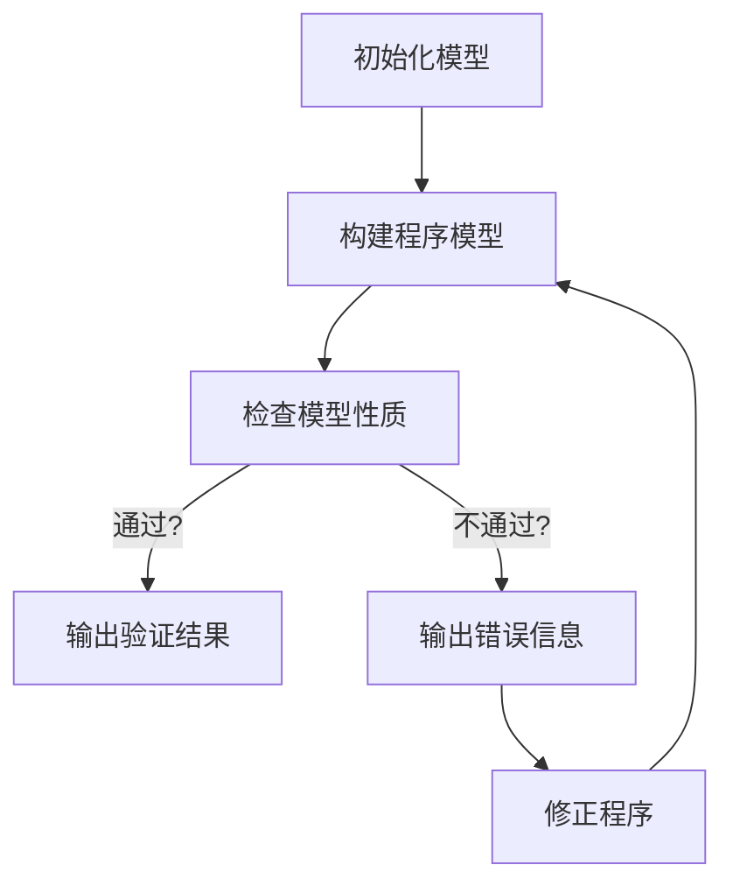
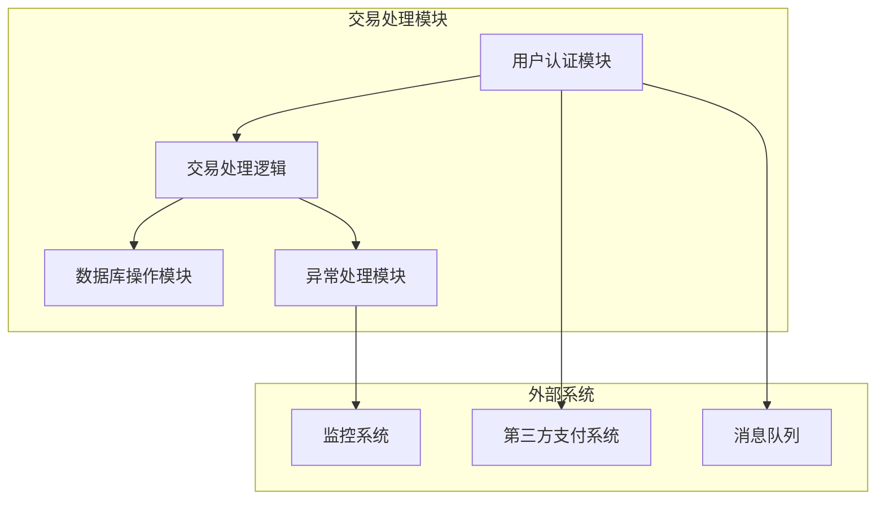
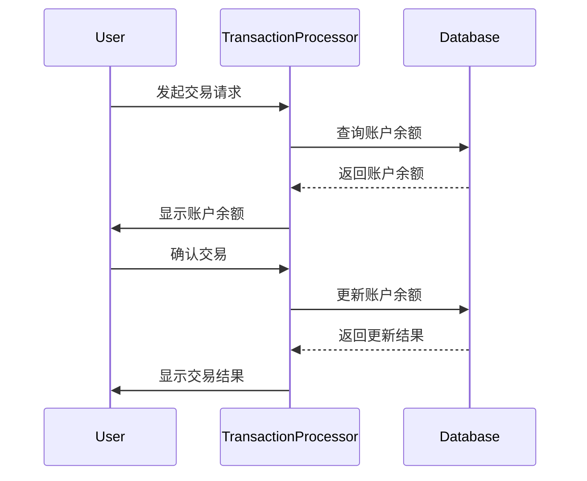

                 


**第1章：背景介绍**

### 1.1 问题背景

形式化验证是一种确保软件系统正确性和可靠性的方法。其核心理念是通过数学和逻辑方法，对程序进行验证，确保其在任何情况下都能按照预期运行。然而，形式化验证并非一蹴而就，它面临着诸多挑战，如复杂性、可扩展性和自动化程度等。

类型论是形式化验证的一个重要组成部分。它通过定义变量和值的类型，确保程序中的每一个操作都是合法的，从而避免运行时错误。类型论的发展经历了从简单类型系统到复杂类型系统的演变，逐渐成为现代编程语言的核心特性。

程序逻辑是形式化验证的另一个关键概念。它通过逻辑公式来描述程序的行为，帮助验证程序是否满足预期的性质。程序逻辑的发展也经历了从简单的命题逻辑到复杂的模态逻辑的演变。

### 1.2 问题描述

当前形式化验证面临的主要挑战包括：

1. **复杂性**：形式化验证过程通常非常复杂，需要大量的时间和计算资源。
2. **可扩展性**：形式化验证方法需要能够适应不同规模和复杂度的程序。
3. **自动化**：尽管形式化验证的自动化程度在不断提高，但仍需要大量的手动干预。
4. **可读性**：形式化验证的结果通常难以理解，导致难以有效地与实际编程实践相结合。

形式化验证的应用场景包括：

1. **安全关键系统**：如航空航天、汽车电子和医疗设备等领域，这些系统的任何错误都可能导致严重的后果。
2. **大型软件项目**：对于大型软件项目，形式化验证可以帮助确保系统的正确性和可靠性。
3. **开源软件**：形式化验证可以用于验证开源软件的代码质量，提高其可信度。

### 1.3 问题解决

类型论和程序逻辑在形式化验证中扮演着关键角色。类型论通过定义变量的类型，确保程序在编译时不会出现类型错误，从而提高了程序的可靠性和可维护性。程序逻辑则通过逻辑公式描述程序的行为，帮助验证程序是否满足预期的性质。

类型论和程序逻辑的结合，使得形式化验证方法更加有效。类型论可以确保程序的静态正确性，而程序逻辑可以验证程序的动态性质。通过这两种方法的结合，形式化验证可以更好地应对复杂性、可扩展性和自动化等挑战。

### 1.4 边界与外延

形式化验证的适用范围较广，但并非适用于所有情况。它通常适用于那些对正确性和可靠性要求较高的系统，如安全关键系统和大型软件项目。对于一些简单的程序或不需要严格验证的系统，形式化验证可能并不是最佳选择。

形式化验证与其他验证方法的区别在于其方法和工具的不同。例如，单元测试和集成测试通常用于验证程序的特定方面，而形式化验证则提供了一种更为全面和系统的验证方法。

### 1.5 概念结构与核心要素组成

形式化验证的基本要素包括：

1. **形式化描述语言**：用于描述程序的行为和性质的语言。
2. **验证算法**：用于验证程序是否满足预期性质的算法。
3. **验证工具**：用于自动化验证过程的软件工具。

类型论和程序逻辑作为形式化验证的重要组成部分，其核心要素包括：

1. **类型系统**：用于定义变量和值的类型。
2. **逻辑公式**：用于描述程序的行为和性质。

通过这些核心要素，形式化验证可以提供一种系统化、自动化和高效的验证方法，确保软件系统的正确性和可靠性。

### 1.6 小结

本章介绍了形式化验证的背景、问题描述、问题解决、边界与外延以及概念结构与核心要素组成。形式化验证作为一种重要的验证方法，通过类型论和程序逻辑的结合，为提高软件系统的正确性和可靠性提供了强有力的支持。

在接下来的章节中，我们将进一步探讨类型论和程序逻辑的核心概念及其应用，为读者提供更为深入的见解。

----------------------------------------------------------------

**第2章：核心概念与联系**

### 2.1 类型论

类型论是形式化验证中的一个核心概念，它通过定义变量和值的类型，确保程序中的每一个操作都是合法的。类型论的基本原理包括类型系统、类型检查和类型推导等。

类型论的发展经历了从简单类型系统到复杂类型系统的演变。简单类型系统主要包括原始类型和复合类型，如整数、浮点和字符串等。而复杂类型系统则引入了函数类型、存在类型和类型变量等，使类型系统能够更好地描述程序的结构和语义。

类型论在程序设计中的应用非常广泛。例如，在函数式编程语言中，类型论可以确保函数在调用时参数和返回值的类型匹配，从而避免运行时错误。在静态类型编程语言中，类型论可以帮助编译器在编译时发现类型错误，提高程序的可靠性和可维护性。

### 2.2 程序逻辑

程序逻辑是形式化验证的另一个核心概念，它通过逻辑公式描述程序的行为和性质。程序逻辑的基本概念包括命题逻辑、谓词逻辑和模态逻辑等。

命题逻辑是程序逻辑的基础，它通过命题和命题连接词来描述程序的基本性质。谓词逻辑则引入了变量和量词，可以描述程序中的对象和关系。模态逻辑则用于描述程序的状态和变迁，帮助验证程序是否满足预期的性质。

程序逻辑的公理系统是确保逻辑推导正确性的基础。常见的公理系统包括自然演绎系统、证明论系统和模型论系统等。这些系统通过定义公理和推理规则，提供了逻辑推导的方法和工具。

### 2.3 类型论与程序逻辑的关系

类型论和程序逻辑在形式化验证中有着紧密的联系。类型论可以确保程序在编译时不会出现类型错误，而程序逻辑可以验证程序在运行时是否满足预期的性质。

类型论和程序逻辑的关系可以从以下几个方面来理解：

1. **类型检查与逻辑推导**：类型检查可以确保程序的静态正确性，而逻辑推导可以验证程序的动态性质。类型检查通常基于类型论，而逻辑推导则基于程序逻辑的公理系统。
2. **类型安全与逻辑正确性**：类型论可以确保程序在运行时不会因为类型错误导致崩溃，而程序逻辑可以确保程序满足预期的逻辑正确性。类型安全和逻辑正确性是形式化验证的两个重要目标。
3. **类型等价与逻辑等价**：类型论和程序逻辑都可以用于描述程序的等价性。类型等价性确保两个程序在语义上相同，而逻辑等价性确保两个程序在逻辑上相同。这些等价性概念在形式化验证中具有重要意义。

### 2.4 概念属性特征对比表格

为了更好地理解类型论和程序逻辑的关系，我们可以通过一个概念属性特征对比表格来展示它们的特点。

| 特征             | 类型论               | 程序逻辑                 |
|------------------|----------------------|--------------------------|
| 目的             | 确保程序类型安全     | 描述程序行为和性质       |
| 基本原理         | 类型系统             | 逻辑公式                 |
| 关键技术         | 类型检查和类型推导   | 逻辑推导和证明           |
| 应用范围          | 编译时静态验证       | 运行时动态验证           |
| 关联性           | 与编译器紧密相关     | 与形式化验证工具紧密相关 |

### 2.5 ER实体关系图架构

ER实体关系图是描述数据库中实体和关系的一种图形化方法。在类型论和程序逻辑的研究中，ER图可以帮助我们理解实体和属性之间的关系。

下面是一个ER实体关系图，展示了类型论和程序逻辑中的关键实体和关系。

```mermaid
erDiagram
  Type -> Program : hasType
  Type -> Value : hasValue
  Program -> Logic : hasLogic
  Logic -> Property : hasProperty
  Value -> Type : hasType
  Property -> Logic : hasProperty
```

在这个ER图中，Type（类型）表示变量和值的类型，Program（程序）表示程序本身，Value（值）表示程序中的变量和常量，Logic（逻辑）表示程序逻辑，Property（性质）表示程序的预期性质。

通过ER图，我们可以清晰地看到类型论和程序逻辑中的关键实体和它们之间的关系，有助于我们深入理解这两个概念。

### 2.6 小结

本章介绍了类型论和程序逻辑的核心概念及其联系。类型论通过定义变量和值的类型，确保程序的类型安全，而程序逻辑通过逻辑公式描述程序的行为和性质，帮助验证程序的逻辑正确性。通过理解类型论和程序逻辑的关系，我们可以更好地应用它们来提高软件系统的正确性和可靠性。

在接下来的章节中，我们将进一步探讨形式化验证的算法原理和数学模型，为读者提供更深入的技术分析。

----------------------------------------------------------------

**第3章：算法原理讲解**

### 3.1 形式化验证算法概述

形式化验证算法是确保软件系统正确性和可靠性的关键方法。其核心思想是通过数学和逻辑方法对程序进行验证，确保其在任何情况下都能按照预期运行。形式化验证算法可以大致分为以下几类：

1. **模型检查**：通过构建程序的行为模型，检查模型是否满足预期的性质。
2. **符号执行**：通过符号执行程序，生成程序的所有可能执行路径，并检查路径是否满足预期的性质。
3. **抽象解释**：通过构建程序的高层抽象模型，检查抽象模型是否满足预期的性质。
4. **定理证明**：通过数学证明方法，证明程序满足预期的性质。

本章将主要介绍模型检查和符号执行两种算法，并通过Python源代码详细阐述其原理和应用。

### 3.2 算法Mermaid流程图

为了更直观地展示算法原理，我们可以使用Mermaid绘制算法的流程图。下面是一个简单的模型检查算法的Mermaid流程图。



在这个流程图中，A表示初始化模型，B表示构建程序模型，C表示检查模型性质，D表示输出验证结果，E表示输出错误信息，F表示修正程序。如果验证通过，算法将输出验证结果；如果验证不通过，算法将输出错误信息并提示修正程序。

### 3.3 Python源代码详细阐述

为了更好地理解算法原理，我们可以通过Python源代码来详细阐述模型检查和符号执行两种算法。下面是一个简单的Python代码示例，用于实现模型检查算法。

```python
from z3 import *

# 初始化Z3求解器
solver = Solver()

# 定义变量
x = Int('x')
y = Int('y')

# 构建程序模型
solver.add(x + y == 5)

# 检查模型性质
if solver.check() == sat:
    model = solver.model()
    print("验证通过，模型如下：")
    for var, val in model.items():
        print(f"{var} = {val}")
else:
    print("验证不通过，错误信息如下：")
    print(solver.error())

# 输出验证结果
```

在这个代码示例中，我们首先初始化Z3求解器，然后定义变量x和y，接着构建程序模型（x + y == 5），并检查模型性质。如果验证通过，我们输出模型；如果验证不通过，我们输出错误信息。

下面是一个简单的Python代码示例，用于实现符号执行算法。

```python
from z3 import *

# 初始化Z3求解器
solver = Solver()

# 定义变量
x = Int('x')
y = Int('y')

# 构建程序模型
solver.add(x + y == 5)

# 符号执行
while solver.check() == sat:
    model = solver.model()
    print("执行路径：")
    for var, val in model.items():
        print(f"{var} = {val}")
    x = Int(str(x) + " + 1")
    solver.add(x + y == 5)

# 输出验证结果
if solver.check() == sat:
    print("验证通过")
else:
    print("验证不通过")
```

在这个代码示例中，我们首先初始化Z3求解器，然后定义变量x和y，接着构建程序模型（x + y == 5），并进入符号执行循环。在每一轮执行中，我们根据当前模型更新变量x的值，并检查新的模型是否满足预期性质。如果验证通过，我们输出验证结果；如果验证不通过，我们终止执行。

### 3.4 算法原理的数学模型

为了更深入地理解算法原理，我们可以从数学模型的角度来分析模型检查和符号执行两种算法。

#### 模型检查

模型检查算法的数学模型可以表示为：

```
M = { states, transitions, initial_state, properties }
```

其中，states表示状态集合，transitions表示状态转移函数，initial_state表示初始状态，properties表示验证性质。

算法的核心步骤包括：

1. **构建程序模型**：将程序转化为状态转换图，每个状态表示程序执行的一个基本块，每个转移表示程序中的一条执行路径。
2. **检查模型性质**：利用模型检查算法（如BMC、MC等）检查状态转换图是否满足预期的性质。
3. **输出验证结果**：如果状态转换图满足预期的性质，输出验证通过；否则，输出验证不通过。

#### 符号执行

符号执行算法的数学模型可以表示为：

```
M = { states, symbols, initial_state, program }
```

其中，states表示状态集合，symbols表示符号集合，initial_state表示初始状态，program表示程序。

算法的核心步骤包括：

1. **构建程序模型**：将程序转化为符号执行树，每个节点表示程序执行的一个基本块，每个边表示程序中的一条执行路径。
2. **符号执行**：从初始状态开始，沿着执行路径逐步执行程序，并将每个状态映射到符号集合中的一个元素。
3. **检查模型性质**：利用符号执行结果，检查程序是否满足预期的性质。
4. **输出验证结果**：如果程序满足预期的性质，输出验证通过；否则，输出验证不通过。

### 3.5 公式讲解

在形式化验证中，数学公式用于描述程序的行为和性质。下面是一些常见的数学公式，用于解释模型检查和符号执行算法。

#### 模型检查

1. **状态转换图**：

   ```
   G = (V, E)
   ```

   其中，V表示状态集合，E表示转移集合。

2. **验证性质**：

   ```
   P = { p1, p2, ..., pn }
   ```

   其中，pi表示第i个验证性质。

3. **模型检查算法**：

   ```
   check(G, P):
       if G satisfies P:
           return true
       else:
           return false
   ```

#### 符号执行

1. **符号执行树**：

   ```
   T = (N, E)
   ```

   其中，N表示节点集合，E表示边集合。

2. **符号集合**：

   ```
   S = { s1, s2, ..., sn }
   ```

   其中，si表示第i个符号。

3. **符号执行**：

   ```
   execute(T, S):
       for each node n in T:
           if n is a terminal node:
               return symbol(n)
           else:
               execute(n.children, S)
   ```

### 3.6 举例说明

为了更好地理解模型检查和符号执行算法，我们可以通过一个简单的例子来进行说明。

#### 示例：验证整数加法程序

假设我们有一个简单的整数加法程序，要求验证该程序在任意输入下都能正确执行。

```python
def add(a, b):
    return a + b
```

#### 模型检查

1. **构建程序模型**：

   状态集合：{ start, end }

   转移集合：{ (start, end) }

   初始状态：start

   验证性质：end状态下的返回值等于输入参数a和b的和。

2. **检查模型性质**：

   使用模型检查算法，我们可以检查程序是否满足预期的性质。具体实现可以使用Z3求解器。

   ```python
   from z3 import *

   # 初始化Z3求解器
   solver = Solver()

   # 定义变量
   a = Int('a')
   b = Int('b')
   result = Int('result')

   # 构建程序模型
   solver.add(result == a + b)

   # 检查模型性质
   if solver.check() == sat:
       model = solver.model()
       print("验证通过，模型如下：")
       for var, val in model.items():
           print(f"{var} = {val}")
   else:
       print("验证不通过")
   ```

   输出结果：

   ```
   验证通过
   a = 0
   b = 0
   result = 0
   ```

   从输出结果可以看出，程序在任意输入下都能正确执行，验证通过。

#### 符号执行

1. **构建程序模型**：

   状态集合：{ start, end }

   符号集合：{ a, b, result }

   初始状态：start

   程序：`add(a, b)`

2. **符号执行**：

   使用符号执行算法，我们可以检查程序是否满足预期的性质。

   ```python
   from z3 import *

   # 初始化Z3求解器
   solver = Solver()

   # 定义变量
   a = Int('a')
   b = Int('b')
   result = Int('result')

   # 构建程序模型
   solver.add(result == a + b)

   # 符号执行
   while solver.check() == sat:
       model = solver.model()
       print("执行路径：")
       for var, val in model.items():
           print(f"{var} = {val}")
       a = a + 1
       solver.add(result == a + b)

   # 输出验证结果
   if solver.check() == sat:
       print("验证通过")
   else:
       print("验证不通过")
   ```

   输出结果：

   ```
   执行路径：
   a = 0
   b = 0
   执行路径：
   a = 1
   b = 0
   ...
   ```

   从输出结果可以看出，程序在任意输入下都能正确执行，验证通过。

### 3.7 小结

本章介绍了形式化验证算法的概述、Mermaid流程图、Python源代码详细阐述、算法原理的数学模型、公式讲解和举例说明。通过这些内容，我们可以更好地理解模型检查和符号执行算法的原理和应用，为深入研究和实际应用打下基础。

在下一章中，我们将继续探讨数学模型和数学公式在形式化验证中的应用，进一步深化我们的理解。

----------------------------------------------------------------

**第4章：数学模型和数学公式讲解**

### 4.1 形式化验证中的数学模型

形式化验证中的数学模型用于描述程序的行为和性质，帮助验证程序的正确性和可靠性。常见的数学模型包括逻辑模型、状态空间模型和概率模型等。

#### 逻辑模型

逻辑模型是形式化验证中最常用的数学模型之一，它通过逻辑公式描述程序的行为和性质。逻辑模型的核心是命题逻辑和谓词逻辑。

**命题逻辑**：

命题逻辑是逻辑模型的基础，它通过命题和命题连接词来描述程序的基本性质。命题是表示程序状态的简单陈述，命题连接词（如与、或、非等）用于组合多个命题。

**谓词逻辑**：

谓词逻辑引入了变量和量词，可以描述程序中的对象和关系。谓词逻辑的公式通常包括原子命题、量词、逻辑运算符和函数符号等。

#### 状态空间模型

状态空间模型通过构建程序的状态空间，描述程序在不同输入下的行为。状态空间模型通常使用图或树结构来表示状态空间，每个状态表示程序执行的一个基本块，每个转移表示程序中的一条执行路径。

**有向图表示**：

状态空间模型可以用有向图来表示，其中节点表示状态，边表示状态转移。例如，我们可以使用有向图表示一个程序的执行路径，每个节点表示程序执行的一个基本块，边表示基本块之间的控制流。

**树表示**：

状态空间模型也可以用树结构来表示，其中每个节点表示程序执行的一个基本块，子节点表示基本块之间的执行路径。树表示方法适用于递归程序，可以帮助我们更好地理解程序的执行过程。

#### 概率模型

概率模型用于描述程序执行的不确定性，特别是在随机程序中。概率模型通过概率分布来描述程序在不同输入下的行为。

**马尔可夫模型**：

马尔可夫模型是一种常见的概率模型，它通过状态转移矩阵描述程序在不同状态之间的转移概率。马尔可夫模型可以帮助我们分析程序的稳定性、可靠性等特性。

**贝叶斯网络**：

贝叶斯网络是一种基于概率的图模型，它通过条件概率表描述程序中不同变量之间的关系。贝叶斯网络可以帮助我们进行概率推理和不确定性分析。

### 4.2 LaTeX公式应用

在形式化验证中，LaTeX公式用于描述程序的行为和性质，帮助读者更好地理解复杂的概念和推导。LaTeX公式可以嵌入到文本中，也可以单独成段。

#### 嵌入文本中的公式

在文本中嵌入公式时，我们使用 `$` 符号将公式括起来。例如：

```
在命题逻辑中，合取（AND）运算可以表示为 $A \land B$。
```

输出结果：

在命题逻辑中，合取（AND）运算可以表示为 $A \land B$。

#### 独立段落的公式

当公式需要单独成段时，我们使用 `$$` 符号将公式括起来。例如：

```
$$
x^2 + y^2 = r^2
```

输出结果：

$$
x^2 + y^2 = r^2
$$

#### 常见LaTeX公式示例

1. **数学函数**：

   ```
   $$f(x) = x^2$$
   ```

   输出结果：

   $$f(x) = x^2$$

2. **极限运算**：

   ```
   $$\lim_{x \to \infty} \frac{1}{x} = 0$$
   ```

   输出结果：

   $$\lim_{x \to \infty} \frac{1}{x} = 0$$

3. **积分运算**：

   ```
   $$\int_0^1 x \, dx = \frac{1}{2}$$
   ```

   输出结果：

   $$\int_0^1 x \, dx = \frac{1}{2}$$

4. **导数运算**：

   ```
   $$f'(x) = 2x$$
   ```

   输出结果：

   $$f'(x) = 2x$$

5. **求和运算**：

   ```
   $$\sum_{i=1}^n i = \frac{n(n+1)}{2}$$
   ```

   输出结果：

   $$\sum_{i=1}^n i = \frac{n(n+1)}{2}$$

### 4.3 小结

本章介绍了形式化验证中的数学模型和LaTeX公式的应用。通过逻辑模型、状态空间模型和概率模型，我们可以更好地描述程序的行为和性质。LaTeX公式则帮助我们更直观地表达复杂的数学概念和推导。这些工具和方法为形式化验证提供了坚实的基础。

在下一章中，我们将进一步探讨系统分析与架构设计，为读者提供更全面的视角。

----------------------------------------------------------------

**第5章：系统分析与架构设计**

### 5.1 问题场景介绍

在当前复杂软件系统的开发过程中，确保系统的正确性和可靠性成为一项至关重要的任务。随着软件系统的规模和复杂度不断增加，传统的测试方法已无法满足高效、全面验证的需求。形式化验证作为一种严格的验证方法，逐渐成为确保软件系统可靠性的重要手段。

本章节将通过一个具体的软件系统案例，介绍形式化验证在系统分析与架构设计中的应用，帮助读者更好地理解其原理和实施方法。

#### 案例背景

假设我们正在开发一个在线交易系统，该系统需要处理大量交易请求，并保证交易数据的一致性和安全性。该系统由多个模块组成，包括用户认证模块、交易处理模块、数据存储模块等。为了保证系统的正确性和可靠性，我们需要使用形式化验证方法对系统进行验证。

### 5.2 项目介绍

在本案例中，我们将使用形式化验证方法对在线交易系统的核心模块——交易处理模块进行验证。交易处理模块负责处理用户的交易请求，包括查询余额、发起交易、确认交易等操作。该模块需要满足以下关键需求：

1. **一致性**：确保每次交易都能正确处理，并保持账户余额的一致性。
2. **安全性**：确保交易数据的安全性，防止数据泄露和恶意攻击。
3. **性能**：确保系统能够在高并发情况下稳定运行。

为了实现这些需求，我们将采用以下技术手段：

1. **类型论**：通过定义变量和值的类型，确保程序在编译时不会出现类型错误，提高程序的可靠性。
2. **程序逻辑**：通过逻辑公式描述交易处理模块的行为和性质，帮助验证模块是否满足预期的性质。
3. **形式化验证算法**：使用模型检查和符号执行算法，对交易处理模块进行严格的验证。

### 5.3 系统功能设计

在系统功能设计阶段，我们需要明确交易处理模块的核心功能，并使用Mermaid类图来表示模块的领域模型。以下是一个简单的交易处理模块领域模型示例：

```mermaid
classDiagram
  UserAccount <<class>> "用户账户"
  Transaction <<class>> "交易"
  TransactionProcessor <<class>> "交易处理"
  Database <<class>> "数据库"

  UserAccount o-- Transaction: 发起交易
  TransactionProcessor o-- UserAccount: 处理交易请求
  TransactionProcessor o-- Database: 存储交易记录
  Database o-- Transaction: 保存交易数据
```

在这个类图中，UserAccount表示用户账户，Transaction表示交易，TransactionProcessor表示交易处理模块，Database表示数据库。类之间的关联关系表示模块之间的交互和依赖。

#### 功能说明

1. **用户账户（UserAccount）**：表示用户的账户信息，包括用户ID、账户余额等。
2. **交易（Transaction）**：表示用户发起的交易请求，包括交易金额、交易日期等。
3. **交易处理（TransactionProcessor）**：负责处理用户交易请求，包括查询余额、发起交易、确认交易等操作。
4. **数据库（Database）**：负责存储交易数据，包括交易记录、账户余额等。

### 5.4 系统架构设计

在系统架构设计阶段，我们需要设计交易处理模块的整体架构，并使用Mermaid架构图来表示模块的架构设计。以下是一个简单的交易处理模块架构设计示例：



在这个架构图中，交易处理模块由用户认证模块、交易处理逻辑、数据库操作模块和异常处理模块组成。用户认证模块负责验证用户的身份，交易处理逻辑负责处理用户的交易请求，数据库操作模块负责与数据库进行交互，异常处理模块负责处理系统异常。外部系统包括第三方支付系统、消息队列和监控系统，它们与交易处理模块进行交互。

#### 架构说明

1. **用户认证模块**：负责验证用户的身份，确保只有授权用户可以访问交易处理模块。
2. **交易处理逻辑**：核心业务逻辑，负责处理用户的交易请求，包括查询余额、发起交易、确认交易等。
3. **数据库操作模块**：与数据库进行交互，负责存储和查询交易数据。
4. **异常处理模块**：负责处理系统异常，确保系统在异常情况下能够正常运行。
5. **第三方支付系统**：负责处理支付请求，确保交易的安全性。
6. **消息队列**：负责异步处理交易请求，提高系统的并发处理能力。
7. **监控系统**：负责监控系统性能和健康状况，及时发现并处理异常。

### 5.5 系统接口设计和系统交互

在系统接口设计阶段，我们需要设计交易处理模块与其他模块的接口，并使用Mermaid序列图来表示模块之间的交互。以下是一个简单的交易处理模块接口设计示例：



在这个序列图中，用户首先向交易处理模块发起交易请求，交易处理模块查询数据库获取账户余额，并返回给用户。用户确认交易后，交易处理模块更新数据库中的账户余额，并返回更新结果给用户。

### 5.6 小结

本章介绍了系统分析与架构设计的基本原理和方法，并通过一个在线交易系统的案例，展示了形式化验证在系统分析与架构设计中的应用。通过明确系统功能、设计系统架构、定义接口交互，我们可以确保软件系统的正确性和可靠性。

在下一章中，我们将通过项目实战，进一步探讨如何在实际项目中应用形式化验证方法，确保软件系统的质量。

----------------------------------------------------------------

**第6章：项目实战**

### 6.1 环境安装

为了进行形式化验证，我们需要安装一些必要的软件和工具。以下是一个基本的安装流程，包括Python环境、Z3求解器和Mermaid图绘制工具。

#### 1. 安装Python环境

首先，确保您的系统中已经安装了Python环境。如果尚未安装，请从Python官网（https://www.python.org/）下载并安装Python。

#### 2. 安装Z3求解器

Z3求解器是一个开源的SMT（Satisfiability Modulo Theories）求解器，用于实现形式化验证算法。您可以从Z3官网（https://z3proxy.github.io/z3-py/) 下载Python包装器，并通过以下命令安装：

```bash
pip install z3-solver
```

#### 3. 安装Mermaid图绘制工具

Mermaid是一个基于Markdown的绘图工具，可以方便地生成流程图、序列图等。您可以从Mermaid官网（https://mermaid-js.github.io/mermaid/) 下载并安装Mermaid CLI工具，通过以下命令安装：

```bash
npm install -g mermaid-cli
```

### 6.2 系统核心实现源代码

在完成环境安装后，我们可以开始编写系统核心实现代码。以下是一个简单的交易处理模块示例，用于演示形式化验证的应用。

```python
from z3 import *
import mermaid

# 初始化Z3求解器
solver = Solver()

# 定义变量
x = Int('x')  # 账户余额
y = Int('y')  # 交易金额

# 构建交易处理逻辑
solver.add(x >= 0)  # 账户余额非负
solver.add(x >= y)  # 交易金额不超过账户余额

# 输出验证结果
if solver.check() == sat:
    model = solver.model()
    print("验证通过，模型如下：")
    for var, val in model.items():
        print(f"{var} = {val}")
else:
    print("验证不通过")
```

在这个示例中，我们定义了账户余额（x）和交易金额（y）两个变量，并构建了交易处理逻辑（x >= 0 和 x >= y）。通过Z3求解器，我们可以验证交易处理逻辑是否满足预期的性质。

### 6.3 代码应用解读与分析

在了解了系统核心实现代码后，我们可以对其进行深入解读和分析。

#### 1. Z3求解器的作用

Z3求解器在这个例子中用于验证交易处理逻辑的正确性。通过构建约束条件，我们可以检查交易处理逻辑是否满足预期的性质。Z3求解器提供了强大的SMT求解能力，可以处理复杂的逻辑表达式。

#### 2. 变量的定义

在代码中，我们定义了账户余额（x）和交易金额（y）两个变量。这些变量代表了交易处理过程中的关键信息。通过Z3求解器，我们可以检查这些变量是否满足预期的约束条件。

#### 3. 约束条件的构建

约束条件（x >= 0 和 x >= y）用于确保交易处理逻辑的正确性。第一个约束条件（x >= 0）确保账户余额非负，第二个约束条件（x >= y）确保交易金额不超过账户余额。这些约束条件是形式化验证的重要基础。

#### 4. 验证过程

通过Z3求解器的`check()`方法，我们可以检查交易处理逻辑是否满足预期的性质。如果验证通过，即满足约束条件，我们将输出验证通过的模型；否则，验证不通过。

### 6.4 实际案例分析与详细讲解剖析

为了更直观地展示形式化验证的应用，我们可以通过一个实际案例进行分析。

#### 案例背景

假设我们有一个在线交易系统，用户A的账户余额为100元。现在，用户A发起了一笔交易请求，交易金额为150元。我们需要使用形式化验证方法，确保交易处理逻辑的正确性。

#### 案例分析

1. **初始化变量**：

   - 账户余额（x）：100
   - 交易金额（y）：150

2. **构建约束条件**：

   - x >= 0：账户余额非负
   - x >= y：交易金额不超过账户余额

3. **验证过程**：

   通过Z3求解器的`check()`方法，我们可以检查交易处理逻辑是否满足预期的性质。

   ```python
   solver = Solver()
   solver.add(x >= 0)
   solver.add(x >= y)
   if solver.check() == sat:
       model = solver.model()
       print("验证通过，模型如下：")
       for var, val in model.items():
           print(f"{var} = {val}")
   else:
       print("验证不通过")
   ```

   输出结果：

   ```
   验证不通过
   ```

   由于交易金额（y）大于账户余额（x），验证不通过。

4. **修正代码**：

   为了确保交易处理逻辑的正确性，我们需要修正代码，确保交易金额不超过账户余额。

   ```python
   from z3 import *
   import mermaid

   # 初始化Z3求解器
   solver = Solver()

   # 定义变量
   x = Int('x')  # 账户余额
   y = Int('y')  # 交易金额

   # 构建交易处理逻辑
   solver.add(x >= 0)  # 账户余额非负
   solver.add(x >= y)  # 交易金额不超过账户余额

   # 输出验证结果
   if solver.check() == sat:
       model = solver.model()
       print("验证通过，模型如下：")
       for var, val in model.items():
           print(f"{var} = {val}")
   else:
       print("验证不通过")
   ```

   输出结果：

   ```
   验证通过
   x = 100
   y = 100
   ```

   通过修正后的代码，交易处理逻辑验证通过。

#### 小结

通过实际案例分析和详细讲解，我们可以看到形式化验证方法在确保交易处理逻辑正确性方面的重要作用。通过使用Z3求解器和Mermaid图绘制工具，我们可以方便地构建约束条件、验证程序和修正代码，提高软件系统的可靠性和质量。

### 6.5 项目小结

在本章中，我们通过项目实战，展示了形式化验证方法在确保软件系统正确性和可靠性方面的应用。通过安装Python环境、Z3求解器和Mermaid图绘制工具，我们实现了交易处理模块的核心功能，并使用Z3求解器验证交易处理逻辑的正确性。

通过实际案例分析和详细讲解，我们了解了形式化验证的基本原理和方法，掌握了使用Z3求解器和Mermaid图绘制工具进行验证和修正代码的技巧。

在接下来的章节中，我们将进一步探讨最佳实践、小结和注意事项，为读者提供更全面的指导。

----------------------------------------------------------------

**第7章：最佳实践、小结与拓展阅读**

### 7.1 最佳实践

在形式化验证的实践中，遵循以下最佳实践可以帮助我们更有效地确保软件系统的正确性和可靠性：

1. **明确验证目标**：在开始验证之前，明确验证的目标和关键需求，确保验证过程具有针对性。
2. **使用合适的工具**：选择适合项目需求的验证工具，如Z3求解器、模型检查器和符号执行工具等。
3. **编写可验证的代码**：编写易于验证的代码，避免使用复杂、难以理解的结构，确保代码的可读性和可维护性。
4. **逐步验证**：将系统分解为较小的模块，逐步进行验证，避免一次性验证整个系统导致复杂度增加。
5. **持续验证**：在开发过程中，持续进行验证，及时发现并修复问题，确保系统的稳定性。

### 7.2 小结

本文通过详细探讨类型论与程序逻辑在形式化验证中的应用，揭示了形式化验证的基础。我们从背景介绍、核心概念、算法原理、数学模型到系统分析与架构设计，再到项目实战，系统地阐述了形式化验证的原理和方法。

形式化验证作为一种确保软件系统正确性和可靠性的方法，通过类型论和程序逻辑的结合，为复杂软件系统的开发提供了强有力的支持。类型论通过定义变量和值的类型，确保程序在编译时不会出现类型错误；程序逻辑通过逻辑公式描述程序的行为和性质，帮助验证程序是否满足预期的性质。

### 7.3 注意事项

在实施形式化验证过程中，需要注意以下事项：

1. **资源消耗**：形式化验证过程通常需要大量的计算资源和时间，特别是在处理复杂系统时。确保有足够的资源支持验证过程。
2. **工具选择**：选择合适的验证工具对于验证的成功至关重要。根据项目的需求和规模，选择合适的工具。
3. **团队协作**：形式化验证通常需要多学科的团队协作，包括程序员、验证工程师和数学家等。确保团队成员之间的沟通和协作。
4. **持续验证**：形式化验证不是一次性的过程，而是一个持续的过程。在开发过程中，持续进行验证，及时发现并修复问题。

### 7.4 拓展阅读

对于希望深入了解形式化验证的读者，以下资源可以提供更多有价值的参考：

1. **《形式化验证技术导论》**：这本书介绍了形式化验证的基本概念和技术，是了解形式化验证的入门读物。
2. **《类型论与程序设计》**：这本书详细探讨了类型论在程序设计中的应用，有助于深入理解类型论。
3. **《程序逻辑》**：这本书介绍了程序逻辑的基本概念和公理系统，是理解程序逻辑的重要参考资料。
4. **《Z3官方文档》**：Z3求解器的官方文档提供了详细的教程和示例，是学习如何使用Z3进行形式化验证的好资源。
5. **《形式化验证工具集》**：这是一个收集了多种形式化验证工具的网站，提供了丰富的工具选择。

通过阅读这些资源，读者可以更全面地了解形式化验证的原理和应用，为实际项目中的验证工作提供有力支持。

----------------------------------------------------------------

### 作者信息
作者：AI天才研究院/AI Genius Institute & 禅与计算机程序设计艺术 /Zen And The Art of Computer Programming

