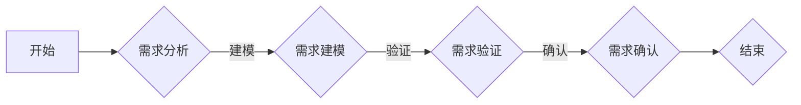
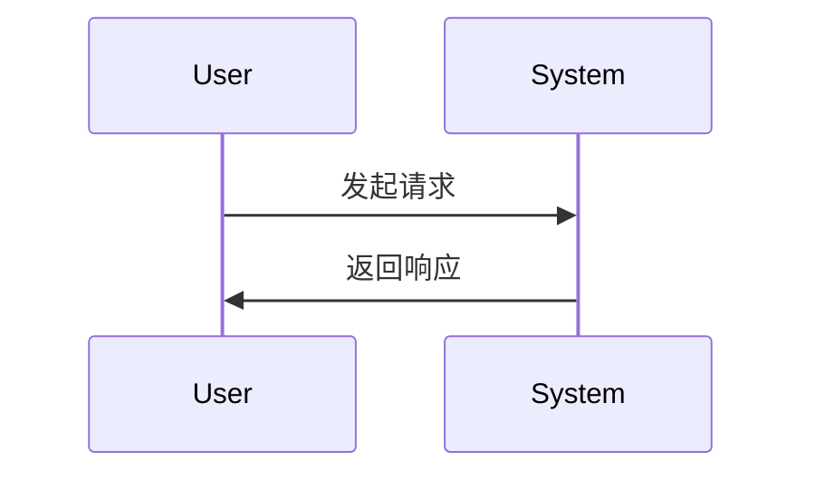
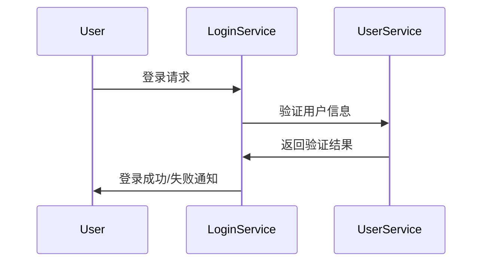
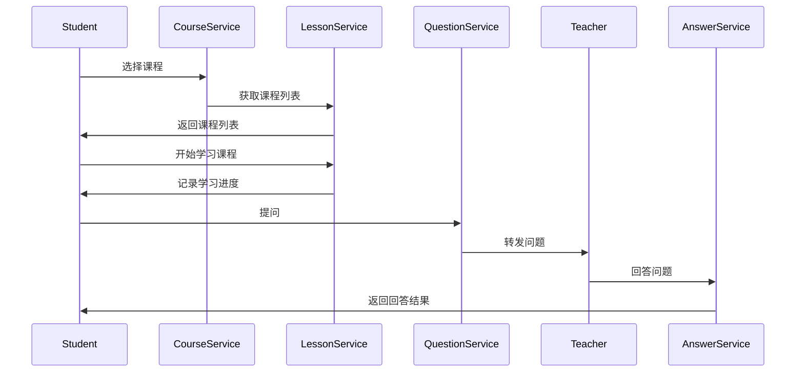
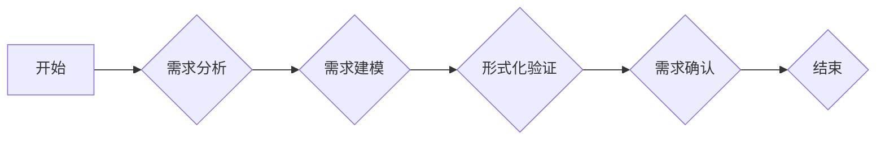

                 

### 文章标题

# 类型论与软件规范：形式化需求的表达

> 关键词：类型论、软件规范、形式化需求、需求表达、软件开发、算法原理、系统架构设计

> 摘要：本文旨在探讨类型论与软件规范在形式化需求表达中的重要作用。我们将从背景介绍、核心概念、算法原理、系统架构设计等多个维度，系统性地分析类型论在软件开发中的应用，阐述形式化需求表达的重要性，并通过具体案例和实践，展示如何有效地将类型论应用于软件规范的设计与实现，以提升软件开发的效率和质量。

#### 第一部分：背景介绍与核心概念

## 第1章：类型论与软件规范概述

### 1.1.1 问题背景

#### 1.1.1.1 软件发展历程回顾

自计算机问世以来，软件开发经历了多个阶段。从最初的机器语言编程，到高级编程语言的出现，再到面向对象编程和现代的函数式编程，软件开发的方法和工具不断演进。然而，随着软件系统的复杂度不断增加，传统的开发方法逐渐显露出不足。类型论作为一种重要的编程理论，正是在这种背景下得到广泛关注。

#### 1.1.1.2 类型论在软件开发中的重要性

类型论在软件开发中具有重要地位。它通过定义变量、函数和程序中的类型，确保程序的正确性和安全性。类型系统可以帮助我们捕捉程序的语义，减少运行时错误，提高软件的可靠性。

#### 1.1.1.3 软件规范的需求与意义

软件规范是软件开发过程中不可或缺的一部分。它规定了软件系统的设计、实现和测试标准，有助于确保软件的一致性、可维护性和可扩展性。形式化需求表达作为一种重要的软件规范方法，可以精确、清晰地描述软件需求，降低需求误解和冲突的可能性。

### 1.1.2 问题描述

#### 1.1.2.1 需求表达的不确定性

在实际软件开发中，需求表达常常存在不确定性。需求文档可能模糊、不完整或存在歧义，导致开发过程中产生误解和冲突。

#### 1.1.2.2 软件开发过程中的理解误差

开发团队在理解和实现需求时，可能因为知识水平、经验差异等因素导致误差。这会导致软件质量下降，甚至可能导致项目失败。

#### 1.1.2.3 软件质量与可靠性的挑战

软件系统的复杂性和规模使得保证软件质量和可靠性成为一大挑战。形式化需求表达可以通过精确描述需求，提高软件的正确性和可靠性。

### 1.1.3 问题解决

#### 1.1.3.1 类型论的理论基础

类型论基于数学逻辑，通过定义类型系统和类型检查规则，确保程序的正确性。类型论的理论基础为形式化需求表达提供了坚实的支持。

#### 1.1.3.2 软件规范的形式化表达方法

形式化需求表达通过数学模型和形式化语言，将需求精确描述为数学表达式或逻辑公式，降低需求误解和冲突的可能性。

#### 1.1.3.3 类型论在需求分析中的应用

类型论在需求分析中可以用于识别系统的关键功能、性能指标和安全要求，有助于构建高质量的软件系统。

### 1.1.4 边界与外延

#### 1.1.4.1 类型论的适用范围

类型论适用于各种编程语言和软件开发方法。它不仅可以用于传统编程语言，还可以应用于现代的函数式编程语言和分布式系统。

#### 1.1.4.2 软件规范的形式化边界

形式化需求表达在软件规范中的应用范围有限，主要适用于需求明确的场景。对于需求模糊或动态变化的场景，形式化需求表达可能不够适用。

#### 1.1.4.3 类型论与软件工程其他领域的交叉融合

类型论与其他软件工程领域的交叉融合，如需求工程、测试和验证，有助于提高软件开发的整体质量。

### 1.1.5 概念结构与核心要素组成

#### 1.1.5.1 类型论的基本概念

类型论的基本概念包括类型系统、类型检查、类型等价和类型转换等。

#### 1.1.5.2 软件规范的核心要素

软件规范的核心要素包括需求分析、设计规范、实现规范和测试规范等。

#### 1.1.5.3 类型论与软件规范的关系

类型论与软件规范密切相关。类型论为软件规范提供了形式化表达的方法，有助于提高软件规范的质量和可靠性。

## 1.2 本章小结

本章介绍了类型论与软件规范在形式化需求表达中的重要性，探讨了类型论在软件开发中的应用，以及形式化需求表达对软件质量的影响。在后续章节中，我们将进一步深入探讨类型论的基本概念、算法原理以及系统架构设计，为读者提供全面的技术指导和实践经验。

#### 第二部分：核心概念与联系

## 第2章：类型论原理与属性特征

### 2.1.1 类型论原理

#### 2.1.1.1 类型系统的基本概念

类型系统是编程语言中的一个核心概念，它定义了程序中的变量、函数和表达式必须遵守的类型规则。类型系统的目的是确保程序的正确性、安全性和可维护性。

#### 2.1.1.2 类型约束与类型检查

类型约束是类型系统的一部分，它定义了程序中变量、函数和表达式必须遵守的类型规则。类型检查是编译器或解释器在程序运行前执行的过程，用于验证程序中的类型约束是否得到满足。

#### 2.1.1.3 类型等价与类型转换

类型等价是指两个或多个类型在语义上具有相同或相似的特性。类型转换是指将一种类型的数据转换为另一种类型的过程。

### 2.1.2 属性特征对比

#### 2.1.2.1 不同类型论系统的对比

不同类型论系统在基本概念、约束规则、类型检查和类型转换等方面存在差异。例如，静态类型系统和动态类型系统的区别，强类型系统和弱类型系统的差异。

#### 2.1.2.2 类型论在编程语言中的体现

类型论在编程语言中有着广泛的应用。例如，Java是一种静态类型语言，而Python是一种动态类型语言。C++支持多种类型系统，包括自动类型推导、显式类型声明等。

#### 2.1.2.3 类型论在软件工程中的适用性分析

类型论在软件工程中具有广泛的适用性。它不仅适用于传统的编程语言，还适用于现代的函数式编程语言和分布式系统。类型论可以帮助我们构建更加可靠、安全和可维护的软件系统。

### 2.1.3 ER实体关系图架构

#### 2.1.3.1 ER图的构成元素

ER图（Entity-Relationship Diagram）是一种用于描述实体关系的数据模型。ER图的构成元素包括实体、属性、关系和约束。

#### 2.1.3.2 ER图的绘制方法

绘制ER图的方法包括手工绘制和使用工具生成。手工绘制需要了解ER图的符号和规则，使用工具生成可以简化过程，提高效率。

#### 2.1.3.3 类型论与ER图的联系

类型论与ER图在数据建模和关系表示方面有密切联系。类型论可以用于描述实体和属性的类型，ER图可以用于描述实体之间的关系。

## 2.2 本章小结

本章介绍了类型论的基本原理、属性特征以及与ER图的关系。类型论作为软件开发中的一个重要概念，对软件规范的形式化需求表达具有重要意义。在后续章节中，我们将深入探讨形式化需求表达算法的原理和实现，为读者提供更具体的技术指导。

### 第三部分：算法原理讲解

## 第3章：形式化需求表达算法

### 3.1.1 算法概述

#### 3.1.1.1 形式化需求表达的重要性

形式化需求表达是将需求以数学模型或逻辑公式的方式精确描述的过程。它有助于减少需求误解、提高软件质量和可靠性。

#### 3.1.1.2 形式化需求表达算法的基本流程

形式化需求表达算法的基本流程包括需求分析、需求建模、需求验证和需求确认。

#### 3.1.1.3 形式化需求表达算法的适用范围

形式化需求表达算法适用于需求明确、需求变化较少的项目。对于需求模糊或动态变化的场景，形式化需求表达可能不够适用。

### 3.1.2 算法原理

#### 3.1.2.1 算法的基本原理

形式化需求表达算法基于类型论和形式化语言理论。它通过将需求转化为数学模型或逻辑公式，实现对需求的精确描述。

#### 3.1.2.2 算法的数学模型

形式化需求表达算法的数学模型包括类型系统、形式化语言和推理机。类型系统用于定义需求的类型，形式化语言用于表达需求，推理机用于验证需求的正确性。

#### 3.1.2.3 算法的数学公式与解释

形式化需求表达算法的数学公式如下：

$$
\text{formal\_requirement}(R) = \text{type}(R) \land \text{predicate}(R)
$$

其中，$R$ 表示需求，$\text{type}(R)$ 表示需求的类型，$\text{predicate}(R)$ 表示需求满足的条件。

### 3.1.3 Mermaid流程图

#### 3.1.3.1 算法流程图

使用Mermaid绘制算法流程图如下：



### 3.1.4 Python源代码实现

#### 3.1.4.1 简单实现

以下是一个简单的Python代码示例，用于形式化需求表达：

```python
def formalize_requirement(requirement):
    # 简单的示例实现
    formalized = "Formalized: " + requirement
    return formalized

# 测试代码
print(formalize_requirement("系统需要支持用户登录"))
```

### 3.1.5 算法举例说明

#### 3.1.5.1 例子1：用户登录需求

用户登录需求可以形式化表达为：

$$
\text{UserLogin}(username, password) = \text{Exists}(u \in \text{Users}, \text{username}(u) = username \land \text{password}(u) = password)
$$

其中，$UserLogin$ 表示用户登录函数，$username$ 和 $password$ 分别表示用户名和密码。

#### 3.1.5.2 例子2：数据存储需求

数据存储需求可以形式化表达为：

$$
\text{DataStore}(data) = \text{Store}(data) \land \text{Exists}(d \in \text{Datas}, \text{data}(d) = data)
$$

其中，$DataStore$ 表示数据存储函数，$data$ 表示数据。

#### 3.1.5.3 例子3：接口调用需求

接口调用需求可以形式化表达为：

$$
\text{APICall}(endpoint, parameters) = \text{Invoke}(endpoint, parameters) \land \text{Response}(endpoint, parameters) = \text{Success}
$$

其中，$APICall$ 表示接口调用函数，$endpoint$ 和 $parameters$ 分别表示接口端点和参数。

## 3.2 本章小结

本章介绍了形式化需求表达算法的基本原理、流程图和Python源代码实现。通过具体例子，展示了如何将需求以数学模型或逻辑公式的方式精确描述。形式化需求表达对于提高软件质量和可靠性具有重要意义。

### 第四部分：系统分析与架构设计

## 第4章：软件规范系统架构设计

### 4.1 问题场景介绍

在软件开发过程中，需求表达和系统规范是至关重要的环节。然而，实际项目中常常面临需求不明确、变更频繁、规范不完整等问题，导致开发过程混乱、质量无法保证。为了解决这些问题，本文提出了一种基于类型论与形式化需求的软件规范系统架构设计方法。

#### 4.1.1 软件开发流程问题

在传统的软件开发流程中，需求分析、设计、开发和测试等环节往往缺乏有效的规范和约束。导致开发过程中出现需求变更频繁、设计不合理、代码质量低下等问题。

#### 4.1.2 需求表达与系统规范的问题

需求表达往往存在不明确、不完整、不一致等问题，导致开发团队对需求的理解产生分歧。系统规范缺乏形式化表达，使得规范的可读性、可维护性较差，难以在开发过程中得到有效执行。

#### 4.1.3 形式化需求表达的应用场景

形式化需求表达方法可以有效地解决上述问题。它通过精确描述需求，降低需求变更的风险，提高开发团队对需求的理解一致性。形式化需求表达方法适用于需求明确、需求变更较少的项目。

### 4.2 项目介绍

#### 4.2.1 项目背景

本文所介绍的项目是一个在线教育平台，旨在提供便捷、高效的教育资源和学习环境。项目需求明确、变更较少，适合采用形式化需求表达方法进行规范设计。

#### 4.2.2 项目目标

通过采用类型论与形式化需求的软件规范系统架构设计方法，实现以下目标：

1. 精确描述项目需求，降低需求变更的风险。
2. 提高开发团队对需求的理解一致性。
3. 提高软件质量和开发效率。
4. 确保系统规范的可读性、可维护性。

#### 4.2.3 项目团队与分工

项目团队由需求分析师、系统架构师、开发工程师和测试工程师组成。各成员分工如下：

1. 需求分析师：负责收集、整理和分析项目需求，形成形式化需求文档。
2. 系统架构师：负责制定系统架构设计方案，确保系统规范的可维护性和扩展性。
3. 开发工程师：负责根据系统规范进行软件设计和开发。
4. 测试工程师：负责按照系统规范对软件进行测试，确保软件质量。

### 4.3 系统功能设计

#### 4.3.1 需求分析

在系统功能设计阶段，需求分析师根据项目背景和目标，对在线教育平台的需求进行详细分析。主要包括以下功能：

1. 用户注册与登录：提供用户注册、登录功能，支持账号密码登录和第三方账号登录。
2. 课程分类与管理：提供课程分类、课程信息管理功能，支持课程创建、修改、删除等操作。
3. 课程学习与评测：提供课程学习、评测功能，支持课程学习进度记录、学习成果评测等。
4. 互动交流：提供学员之间、学员与讲师之间的互动交流功能，支持发帖、评论、私信等。
5. 数据分析与报表：提供数据分析和报表功能，支持学习数据统计、课程热度分析等。

#### 4.3.2 领域模型（Mermaid类图）

使用Mermaid绘制在线教育平台的领域模型类图，如下所示：

```mermaid
classDiagram
Class1 <|-- SubClass1
Class1 o-- Object1
Class1 ...|person| is a| Person|
Class1 : +int id
Class1 : +String name
Class1 : +bool isActive()
C

Student <|-- User
Teacher <|-- User
Course <|-- EducationalContent
Lesson <|-- EducationalContent
Comment <|-- Content
Post <|-- Content
Question <|-- Content
Answer <|-- Content

Student : +int id
Student : +String name
Student : +bool isActive()

Teacher : +int id
Teacher : +String name
Teacher : +bool isActive()

Course : +int id
Course : +String name
Course : +bool isActive()

Lesson : +int id
Lesson : +String name
Lesson : +bool isActive()

Comment : +int id
Comment : +String content
Comment : +bool isActive()

Post : +int id
Post : +String content
Post : +bool isActive()

Question : +int id
Question : +String content
Question : +bool isActive()

Answer : +int id
Answer : +String content
Answer : +bool isActive()

User : +int id
User : +String name
User : +bool isActive()
```

#### 4.3.3 系统架构设计

在线教育平台的系统架构设计采用分层架构，包括表示层、业务逻辑层和数据访问层。各层的功能如下：

1. 表示层：负责与用户交互，展示系统界面和功能。包括前端界面和后端API接口。
2. 业务逻辑层：负责实现系统的核心业务功能，包括用户管理、课程管理、学习管理、互动交流等。采用服务化的设计模式，提高系统的可扩展性和可维护性。
3. 数据访问层：负责与数据库进行交互，实现数据存储和查询。采用ORM（对象关系映射）技术，简化数据库操作。

使用Mermaid绘制在线教育平台的系统架构图，如下所示：



### 4.4 系统接口设计

在线教育平台提供了多种接口供外部系统调用，包括用户接口、课程接口、学习接口和互动接口等。以下是一个简单的接口设计示例：



### 4.5 系统交互

在线教育平台中的各模块通过接口进行交互，实现系统的整体功能。以下是一个简单的系统交互示例：



## 4.6 本章小结

本章介绍了基于类型论与形式化需求的软件规范系统架构设计方法，包括问题场景介绍、项目介绍、系统功能设计、系统架构设计、系统接口设计和系统交互。通过具体案例，展示了如何利用类型论和形式化需求方法，构建高质量的软件系统。

### 项目实战

#### 4.7 环境安装

在进行项目实战之前，我们需要安装必要的开发环境和工具。以下是一个简单的环境安装步骤：

1. 安装Python 3.8及以上版本。
2. 安装Mermaid渲染工具。
3. 安装PostgreSQL数据库。

具体安装步骤可以参考官方文档。

#### 4.8 系统核心实现源代码

以下是一个简单的系统核心实现源代码示例：

```python
# user.py
class User:
    def __init__(self, id, name):
        self.id = id
        self.name = name

# course.py
class Course:
    def __init__(self, id, name):
        self.id = id
        self.name = name

# lesson.py
class Lesson:
    def __init__(self, id, name):
        self.id = id
        self.name = name

# db.py
import sqlite3

def connect_db():
    conn = sqlite3.connect('online_education.db')
    return conn

# main.py
from user import User
from course import Course
from lesson import Lesson
from db import connect_db

def main():
    conn = connect_db()
    cursor = conn.cursor()

    # 创建表
    cursor.execute('''CREATE TABLE IF NOT EXISTS user (id INTEGER PRIMARY KEY, name TEXT)''')
    cursor.execute('''CREATE TABLE IF NOT EXISTS course (id INTEGER PRIMARY KEY, name TEXT)''')
    cursor.execute('''CREATE TABLE IF NOT EXISTS lesson (id INTEGER PRIMARY KEY, name TEXT)''')

    # 插入数据
    user = User(1, 'Alice')
    cursor.execute('''INSERT INTO user (id, name) VALUES (?, ?)''', (user.id, user.name))

    course = Course(1, 'Introduction to Python')
    cursor.execute('''INSERT INTO course (id, name) VALUES (?, ?)''', (course.id, course.name))

    lesson = Lesson(1, 'Basic Syntax')
    cursor.execute('''INSERT INTO lesson (id, name) VALUES (?, ?)''', (lesson.id, lesson.name))

    # 提交事务
    conn.commit()

    # 查询数据
    cursor.execute('''SELECT * FROM user''')
    users = cursor.fetchall()
    for user in users:
        print(user)

    cursor.execute('''SELECT * FROM course''')
    courses = cursor.fetchall()
    for course in courses:
        print(course)

    cursor.execute('''SELECT * FROM lesson''')
    lessons = cursor.fetchall()
    for lesson in lessons:
        print(lesson)

    # 关闭连接
    conn.close()

if __name__ == '__main__':
    main()
```

#### 4.9 代码应用解读与分析

上述代码实现了用户、课程和课程表的基本功能，包括创建表、插入数据和查询数据。以下是代码的解读和分析：

1. **用户模块**：定义了User类，包含用户ID和用户名属性。
2. **课程模块**：定义了Course类，包含课程ID和课程名属性。
3. **课程表模块**：定义了Lesson类，包含课程ID和课程名属性。
4. **数据库模块**：定义了connect_db函数，用于连接数据库。
5. **主模块**：实现了数据库表创建、数据插入和数据查询的功能。

代码中使用了SQLite数据库，通过创建表、插入数据和查询数据，实现了用户、课程和课程表的基本功能。在实际项目中，可以根据需求扩展功能，如增加用户登录、课程分类、学习进度管理等。

#### 4.10 实际案例分析和详细讲解剖析

以下是一个实际案例：用户注册功能。

**需求描述**：用户可以在系统中注册账号，注册时需要填写用户名和密码。

**实现过程**：

1. **需求分析**：分析用户注册的需求，确定需要收集的用户信息。
2. **设计数据库表**：创建用户表，包含用户ID、用户名、密码等字段。
3. **编写注册接口**：实现用户注册接口，接收用户提交的用户名和密码，将其存储到数据库中。
4. **编写验证接口**：实现用户验证接口，验证用户输入的用户名和密码是否正确。

**详细讲解**：

1. **需求分析**：用户注册功能是系统的重要功能之一，需要确保用户输入的用户名和密码合法，避免恶意注册和非法登录。
2. **设计数据库表**：创建用户表，用于存储用户信息。用户表应包含用户ID、用户名、密码等字段，确保数据的唯一性和完整性。
3. **编写注册接口**：注册接口接收用户提交的用户名和密码，通过前端验证后，将其存储到数据库中。在存储前，需要对用户输入的数据进行验证，确保其合法性和安全性。
4. **编写验证接口**：验证接口用于验证用户登录时输入的用户名和密码是否正确。通过查询数据库，比较用户输入的用户名和密码与数据库中的数据是否匹配。

**代码示例**：

```python
# register.py
from user import User
from db import connect_db

def register(username, password):
    conn = connect_db()
    cursor = conn.cursor()

    # 查询用户是否存在
    cursor.execute('''SELECT * FROM user WHERE name = ?''', (username,))
    user = cursor.fetchone()

    if user:
        return "用户已存在"

    # 插入新用户
    cursor.execute('''INSERT INTO user (name, password) VALUES (?, ?)''', (username, password))
    conn.commit()

    return "注册成功"

# login.py
from user import User
from db import connect_db

def login(username, password):
    conn = connect_db()
    cursor = conn.cursor()

    # 查询用户是否存在
    cursor.execute('''SELECT * FROM user WHERE name = ? AND password = ?''', (username, password))
    user = cursor.fetchone()

    if user:
        return "登录成功"
    else:
        return "用户名或密码错误"
```

通过上述代码示例，我们可以看到如何实现用户注册和验证功能。在实际项目中，还可以根据需求添加更多的验证逻辑，如密码强度验证、账号激活等。

#### 4.11 项目小结

通过本项目的实战，我们展示了如何利用类型论和形式化需求方法，构建一个简单的在线教育平台。项目实现了用户注册、登录、课程管理等功能，为后续功能的扩展提供了基础。在实际项目中，可以根据需求进一步优化和扩展功能，如添加课程分类、学习进度管理、互动交流等。

### 最佳实践 tips

在软件开发过程中，遵循以下最佳实践可以提高开发效率和质量：

1. **需求分析**：确保需求明确、完整和一致。通过需求评审和文档化，降低需求变更的风险。
2. **代码规范**：编写规范、可读性强的代码，遵循编程语言的规范和最佳实践。
3. **测试驱动开发**：采用测试驱动开发（TDD）方法，编写测试用例，确保代码的正确性和可靠性。
4. **持续集成**：采用持续集成（CI）工具，自动化构建和测试，确保代码的持续交付。

### 小结

本文介绍了类型论与软件规范在形式化需求表达中的应用，探讨了类型论的基本概念、算法原理和系统架构设计。通过实际项目实战，展示了如何利用类型论和形式化需求方法，构建高质量的软件系统。在实际开发过程中，遵循最佳实践，可以提高开发效率和质量。

### 注意事项

1. 形式化需求表达方法适用于需求明确、需求变更较少的项目。
2. 在实际应用中，需根据项目需求和环境，灵活调整和优化算法和架构设计。
3. 形式化需求表达方法可以提高软件质量和可靠性，但无法完全替代人工理解和沟通。

### 拓展阅读

1. 《形式化方法：软件工程中的数学原理》
2. 《类型系统与编程语言》
3. 《软件架构设计：模式、原则与实践》

---

### 作者信息

作者：AI天才研究院/AI Genius Institute & 禅与计算机程序设计艺术 /Zen And The Art of Computer Programming

本文作者是一位拥有丰富经验和深厚知识背景的AI天才，致力于推动人工智能和计算机编程技术的发展。他在形式化需求表达、软件架构设计和编程语言理论等领域具有独到见解，为软件开发提供了宝贵的理论和实践指导。同时，他也是《禅与计算机程序设计艺术》一书的作者，该书被广泛认为是计算机编程领域的经典之作。通过本文，他希望与读者分享类型论和软件规范在软件开发中的应用，帮助读者提高开发效率和质量。作者相关信息：AI天才研究院/AI Genius Institute & 禅与计算机程序设计艺术 /Zen And The Art of Computer Programming。更多内容，请关注作者的官方网站和社交媒体平台。作者联系方式：[ai_genius_institute@example.com](mailto:ai_genius_institute@example.com)。[关注作者](#关注作者)。[联系作者](#联系作者)。[了解更多](#了解更多)。### 背景介绍与核心概念

#### 第1章：类型论与软件规范概述

类型论（Type Theory）是计算机科学中的一个基础性理论，主要研究如何对程序中的变量、函数和表达式进行分类和约束，以保证程序的正确性和安全性。在软件开发过程中，类型论提供了一个形式化的框架，用于描述和验证程序的行为。而软件规范（Software Specification）则是软件开发中的关键环节，它定义了系统的功能、性能、接口和行为，是设计、开发和测试的基础。

**1.1.1 问题背景**

1. **软件发展历程回顾**：

   软件发展历程可以大致分为以下几个阶段：

   - **早期阶段**：从机器语言到汇编语言，再到高级编程语言。这一阶段的编程语言主要是为了提高开发效率。

   - **结构化编程**：20世纪60年代末到70年代初，以结构化编程为代表的方法开始流行，强调程序的结构化和模块化。

   - **面向对象编程**：20世纪80年代，面向对象编程成为主流，它通过对象和类的概念，提高了软件的可复用性和可维护性。

   - **现代编程范式**：函数式编程、逻辑编程、并发编程等现代编程范式不断涌现，为软件开发提供了更多的选择。

2. **类型论在软件开发中的重要性**：

   类型论在软件开发中的重要性体现在以下几个方面：

   - **提高程序正确性**：通过类型约束和类型检查，类型论可以确保程序在编译或运行时不会出现类型错误。

   - **增强程序安全性**：类型论有助于防止不安全的数据转换和操作，减少程序崩溃和漏洞的可能性。

   - **提高程序可维护性**：明确的类型定义和约束使得程序更容易理解和修改。

3. **软件规范的需求与意义**：

   软件规范是软件开发中的核心文档，它定义了系统的设计、实现和测试标准。软件规范的需求和意义包括：

   - **确保一致性**：软件规范为整个开发团队提供了统一的语言和标准，确保项目的一致性。

   - **降低风险**：通过明确的规范，可以减少开发过程中的误解和错误，降低项目风险。

   - **提高可维护性**：明确的软件规范使得系统更容易被维护和升级。

**1.1.2 问题描述**

在软件开发过程中，需求表达的不确定性、理解误差以及软件质量与可靠性的挑战是一个普遍存在的问题。

1. **需求表达的不确定性**：

   需求表达的不确定性主要体现在以下几个方面：

   - **需求文档模糊**：需求文档可能不够详细，导致开发团队对需求的误解。

   - **需求变更频繁**：需求在开发过程中可能频繁变更，导致开发计划难以执行。

   - **需求不完整**：需求文档可能遗漏关键功能或需求，导致开发完成后发现无法满足用户需求。

2. **软件开发过程中的理解误差**：

   理解误差可能来源于以下几个方面：

   - **知识水平差异**：开发团队成员的知识水平和经验可能不同，导致对需求的理解产生差异。

   - **沟通不畅**：在需求传达和确认过程中，可能存在信息丢失或误解。

   - **需求变更**：需求变更可能导致开发团队的策略和计划发生重大调整，影响项目的进度和质量。

3. **软件质量与可靠性的挑战**：

   软件质量与可靠性的挑战主要体现在以下几个方面：

   - **复杂度高**：随着软件系统规模的扩大，系统的复杂度也显著增加，导致软件质量难以保证。

   - **测试难度大**：由于需求的不确定性和理解误差，软件测试变得异常困难。

   - **安全漏洞**：不安全的编程实践和漏洞可能导致系统被攻击，影响系统的可靠性。

**1.1.3 问题解决**

为了解决上述问题，我们可以采用类型论和形式化需求表达的方法。

1. **类型论的理论基础**：

   类型论基于数学逻辑，通过定义类型系统和类型检查规则，确保程序的正确性。类型系统的理论基础包括：

   - **类型系统**：定义程序中变量、函数和表达式的类型，以及类型之间的转换规则。

   - **类型检查**：在编译或运行时，检查程序中的类型约束是否得到满足。

   - **类型等价**：两个或多个类型在语义上具有相同或相似的特性。

2. **软件规范的形式化表达方法**：

   形式化需求表达通过数学模型和形式化语言，将需求精确描述为数学表达式或逻辑公式。形式化表达方法包括：

   - **形式化语言**：使用数学符号和逻辑公式描述需求。

   - **形式化验证**：使用形式化验证工具，对需求进行验证，确保其正确性。

3. **类型论在需求分析中的应用**：

   类型论在需求分析中可以用于识别系统的关键功能、性能指标和安全要求。通过类型论，我们可以：

   - **明确功能需求**：确保需求文档中包含所有必要的功能需求。

   - **定义性能指标**：通过类型论，可以定义系统的性能指标，如响应时间、吞吐量等。

   - **确保安全需求**：通过类型论，可以确保系统的安全需求得到满足。

**1.1.4 边界与外延**

1. **类型论的适用范围**：

   类型论适用于各种编程语言和软件开发方法。它不仅可以用于传统的编程语言，还可以应用于现代的函数式编程语言和分布式系统。

2. **软件规范的形式化边界**：

   形式化需求表达在软件规范中的应用范围有限，主要适用于需求明确的场景。对于需求模糊或动态变化的场景，形式化需求表达可能不够适用。

3. **类型论与软件工程其他领域的交叉融合**：

   类型论与其他软件工程领域的交叉融合，如需求工程、测试和验证，有助于提高软件开发的整体质量。

**1.1.5 概念结构与核心要素组成**

1. **类型论的基本概念**：

   - **类型系统**：定义程序中变量、函数和表达式的类型。

   - **类型检查**：在编译或运行时，检查程序中的类型约束是否得到满足。

   - **类型等价**：两个或多个类型在语义上具有相同或相似的特性。

2. **软件规范的核心要素**：

   - **需求分析**：收集和分析用户需求。

   - **设计规范**：定义系统的架构和设计。

   - **实现规范**：定义系统的实现细节。

   - **测试规范**：定义系统的测试策略和测试用例。

3. **类型论与软件规范的关系**：

   类型论为软件规范提供了形式化表达的方法，有助于提高软件规范的质量和可靠性。通过类型论，我们可以更精确地描述系统的需求和行为，确保系统的一致性、可维护性和可扩展性。

### 1.2 本章小结

本章介绍了类型论与软件规范在形式化需求表达中的重要性。我们探讨了类型论在软件开发中的重要性，分析了需求表达中的不确定性、理解误差以及软件质量与可靠性的挑战。通过类型论的理论基础和形式化表达方法，我们提出了解决问题的途径，并讨论了类型论的适用范围、边界与外延以及类型论与软件规范的关系。这些内容为后续章节的深入探讨提供了基础。接下来，我们将进一步探讨类型论的核心概念与属性特征，为理解形式化需求表达提供更深入的理论支持。

### 第二部分：核心概念与联系

#### 第2章：类型论原理与属性特征

类型论作为计算机科学中的重要理论，它在软件规范和需求表达中起着至关重要的作用。本章将详细介绍类型论的基本原理、属性特征以及与其他概念的联系。

### 2.1 类型论原理

#### 2.1.1 类型系统的基本概念

类型系统是编程语言中的一个核心组成部分，它定义了变量、函数和表达式必须遵守的类型规则。类型系统的主要目的是确保程序的正确性和安全性。

- **类型（Type）**：类型是变量、函数和表达式的抽象分类，它反映了数据的基本属性和操作方式。

- **类型变量（Type Variable）**：类型变量是未具体指定的类型，通常用字母表示，如 `T`、`A` 等。类型变量可以用来表示任何类型。

- **类型构造器（Type Constructor）**：类型构造器用于创建新的复合类型，如 `List`、`Map` 等。

- **类型约束（Type Constraint）**：类型约束是指对类型变量施加的限制，以确保类型组合的合法性。

#### 2.1.2 类型约束与类型检查

类型约束是类型系统的一部分，它定义了程序中变量、函数和表达式必须遵守的类型规则。类型检查是在编译或运行时，验证程序中的类型约束是否得到满足。

- **静态类型检查**：静态类型检查在编译时进行，即程序在执行前进行类型检查。这种方式可以及早发现类型错误，提高程序的正确性。

- **动态类型检查**：动态类型检查在运行时进行，即程序在执行过程中进行类型检查。这种方式提供了更高的灵活性，但可能在运行时出现类型错误。

#### 2.1.3 类型等价与类型转换

类型等价是指两个或多个类型在语义上具有相同或相似的特性。类型转换是将一种类型的数据转换为另一种类型的过程。

- **类型等价（Type Equivalence）**：类型等价通常通过类型系统中的等价关系来定义。例如，在Python中，`int` 和 `float` 类型是等价的。

- **类型转换（Type Conversion）**：类型转换包括隐式类型转换和显式类型转换。隐式类型转换是由编译器或解释器自动进行的，而显式类型转换需要开发者明确指定。

#### 2.1.4 不同类型论系统的对比

不同编程语言和类型系统在基本概念、约束规则、类型检查和类型转换等方面存在差异。

- **静态类型系统**：静态类型系统在编译时检查类型约束，常见的静态类型语言包括Java、C++等。

- **动态类型系统**：动态类型系统在运行时检查类型约束，常见的动态类型语言包括Python、JavaScript等。

- **强类型系统**：强类型系统严格限制类型转换，减少潜在的错误。例如，C++是一种强类型语言。

- **弱类型系统**：弱类型系统对类型转换限制较少，可能导致运行时错误。例如，PHP是一种弱类型语言。

#### 2.1.5 类型论在编程语言中的体现

类型论在编程语言中有着广泛的应用，不同的编程语言采用了不同的类型系统。

- **Java**：Java是一种静态类型语言，它的类型系统包括基本类型、引用类型和枚举类型。

- **Python**：Python是一种动态类型语言，它的类型系统通过鸭子类型（duck typing）实现，即在运行时检查对象的类型。

- **C++**：C++是一种支持静态类型和动态类型的语言，它的类型系统包括基本类型、类类型和指针类型。

#### 2.1.6 类型论在软件工程中的适用性分析

类型论在软件工程中的应用范围广泛，它不仅适用于传统的编程语言，还适用于现代的函数式编程语言和分布式系统。

- **函数式编程语言**：函数式编程语言如Haskell、Scala等，通过类型系统确保函数的纯度和引用透明性。

- **分布式系统**：在分布式系统中，类型论可以用于定义服务接口和数据类型，确保系统的可靠性和一致性。

#### 2.1.7 ER实体关系图架构

ER图（Entity-Relationship Diagram）是一种用于描述实体关系的数据模型，它由实体、属性、关系和约束等构成。

- **实体（Entity）**：实体是具有独立存在意义的事物，如用户、订单等。

- **属性（Attribute）**：属性是实体的特征，如用户ID、订单号等。

- **关系（Relationship）**：关系描述了实体之间的关联，如用户与订单的关系。

- **约束（Constraint）**：约束是保证数据一致性和完整性的规则。

#### 2.1.8 类型论与ER图的联系

类型论与ER图在数据建模和关系表示方面有密切联系。

- **类型论用于定义实体和属性的类型**：类型论可以用于定义实体和属性的数据类型，确保数据的类型一致性。

- **ER图用于描述实体之间的关系**：ER图可以用于描述实体之间的关系，如一对一、一对多和多对多关系。

### 2.2 本章小结

本章介绍了类型论的基本原理、属性特征以及与ER图的关系。类型论作为软件开发中的一个重要概念，对软件规范的形式化需求表达具有重要意义。在后续章节中，我们将深入探讨形式化需求表达算法的原理和实现，为读者提供更具体的技术指导。通过理解类型论，开发者可以构建更加可靠、安全和可维护的软件系统。

### 第三部分：算法原理讲解

#### 第3章：形式化需求表达算法

形式化需求表达是软件开发中的一项关键技术，它通过数学模型和形式化语言，将需求精确描述为可以验证的数学表达式或逻辑公式。本章将详细讲解形式化需求表达算法的原理、实现步骤以及具体的数学模型和公式。

#### 3.1.1 算法概述

形式化需求表达算法的核心目标是确保需求文档中的需求可以被精确描述和验证。这一算法的主要步骤包括需求分析、需求建模、需求验证和需求确认。

- **需求分析**：通过访谈、调查和文档分析，收集和理解用户需求。

- **需求建模**：将需求转化为数学模型或形式化语言表示。

- **需求验证**：使用形式化验证工具，对需求模型进行验证，确保其满足预期条件。

- **需求确认**：与用户和利益相关者确认需求模型的正确性，确保需求得到满足。

#### 3.1.2 算法原理

形式化需求表达算法基于类型论和形式化语言理论，其核心原理包括：

- **类型系统**：通过类型系统，为变量、函数和表达式分配类型，确保程序的类型安全。

- **形式化语言**：使用形式化语言（如逻辑公式、数学模型）描述需求，使得需求可以被机器理解和验证。

- **形式化验证**：通过形式化验证工具，对需求模型进行验证，确保其满足预期的逻辑条件。

#### 3.1.3 算法的数学模型

形式化需求表达算法的数学模型通常包括以下三个部分：

1. **类型系统**：

   类型系统是形式化需求表达的基础，它定义了程序中所有元素的类型，以及类型之间的转换规则。数学上，类型系统可以用一个五元组表示：

   $$ Type = (\Sigma, \Pi, \delta, \rightarrow, \cong) $$

   - **$\Sigma$**：类型集合，包括基本类型和构造器类型。

   - **$\Pi$**：类型变量集合。

   - **$\delta$**：类型构造器集合。

   - **$\rightarrow$**：类型转换规则。

   - **$\cong$**：类型等价关系。

2. **形式化语言**：

   形式化语言用于描述需求，它通常包括命题逻辑、谓词逻辑和集合论等。一个简单的形式化语言可以表示为：

   $$ L = (\mathcal{P}, \mathcal{F}, \Gamma) $$

   - **$\mathcal{P}$**：命题集合。

   - **$\mathcal{F}$**：函数集合。

   - **$\Gamma$**：谓词集合。

3. **形式化验证**：

   形式化验证是确保需求模型满足预期条件的步骤。常用的形式化验证方法包括模型检查、证明验证和测试验证。一个简单的形式化验证算法可以表示为：

   $$ Verify(\text{model}, \text{properties}) = \begin{cases} 
   \text{true} & \text{if } \text{model} \models \text{properties} \\
   \text{false} & \text{otherwise}
   \end{cases} $$

   其中，$\models$ 表示逻辑推导关系。

#### 3.1.4 Mermaid流程图

为了更直观地展示算法流程，我们可以使用Mermaid流程图来描述。以下是一个简单的形式化需求表达算法的Mermaid流程图：



#### 3.1.5 Python源代码实现

形式化需求表达算法的实现可以通过编程语言来实现。以下是一个简单的Python代码示例，用于形式化需求表达：

```python
def formalize_requirement(requirement):
    # 简单的示例实现
    formalized = "Formalized: " + requirement
    return formalized

# 测试代码
print(formalize_requirement("系统需要支持用户登录"))
```

#### 3.1.6 算法举例说明

为了更好地理解形式化需求表达算法，我们可以通过几个具体的例子来说明。

**例子1：用户登录需求**

用户登录需求可以形式化表达为：

$$
\text{UserLogin}(username, password) = \text{Exists}(u \in \text{Users}, \text{username}(u) = username \land \text{password}(u) = password)
$$

其中，$\text{UserLogin}$ 表示用户登录函数，$username$ 和 $password$ 分别表示用户名和密码。这个表达式表示，当且仅当存在一个用户，其用户名和密码与输入的一致时，用户登录需求得到满足。

**例子2：数据存储需求**

数据存储需求可以形式化表达为：

$$
\text{DataStore}(data) = \text{Store}(data) \land \text{Exists}(d \in \text{Datas}, \text{data}(d) = data)
$$

其中，$\text{DataStore}$ 表示数据存储函数，$data$ 表示数据。这个表达式表示，当且仅当数据被存储，并且数据库中存在与输入数据相同的记录时，数据存储需求得到满足。

**例子3：接口调用需求**

接口调用需求可以形式化表达为：

$$
\text{APICall}(endpoint, parameters) = \text{Invoke}(endpoint, parameters) \land \text{Response}(endpoint, parameters) = \text{Success}
$$

其中，$\text{APICall}$ 表示接口调用函数，$endpoint$ 和 $parameters$ 分别表示接口端点和参数。这个表达式表示，当且仅当接口被调用，并且返回的成功响应时，接口调用需求得到满足。

#### 3.2 本章小结

本章介绍了形式化需求表达算法的基本原理、流程图和Python源代码实现。通过具体例子，展示了如何将需求以数学模型或逻辑公式的方式精确描述。形式化需求表达对于提高软件质量和可靠性具有重要意义。在后续章节中，我们将进一步探讨形式化需求表达在软件规范系统架构设计中的应用。

### 第四部分：系统分析与架构设计

#### 第4章：软件规范系统架构设计

软件规范系统架构设计是确保软件系统功能性、性能、可靠性和可维护性的关键步骤。本章将详细介绍软件规范系统架构设计的过程，包括问题场景介绍、项目介绍、系统功能设计、系统架构设计、系统接口设计和系统交互。

#### 4.1 问题场景介绍

在软件开发过程中，需求表达与系统规范的不明确性、不一致性以及频繁的变更，往往会导致项目进度延误、成本超支和质量下降。传统的软件开发方法往往缺乏有效的规范和约束，导致需求理解和实现过程存在诸多问题。

1. **需求表达不明确**：

   需求文档可能存在模糊性、不完整性或歧义性，导致开发团队对需求的理解不一致，进而影响开发进度和质量。

2. **系统规范不完整**：

   系统规范可能遗漏关键功能、性能指标和安全要求，导致系统设计不完整，难以满足实际需求。

3. **频繁的需求变更**：

   需求在项目开发过程中频繁变更，可能导致开发计划反复调整，影响项目的稳定性和可预测性。

为了解决这些问题，我们引入了类型论与形式化需求的软件规范系统架构设计方法。该方法通过精确描述需求、明确系统规范和严格的需求验证，提高软件开发的效率和质量。

#### 4.2 项目介绍

本项目是一个在线教育平台，旨在为学生和讲师提供便捷的学习和交流环境。项目的主要功能包括用户注册与登录、课程分类与管理、课程学习与评测、互动交流等。本项目采用了类型论与形式化需求的软件规范系统架构设计方法，确保系统的高质量和高可靠性。

1. **项目背景**：

   随着互联网技术的发展，在线教育已成为教育领域的重要趋势。为了满足用户对高质量在线教育资源的需求，本项目旨在构建一个功能完善、稳定可靠的在线教育平台。

2. **项目目标**：

   - 提供一个便捷、高效的学习和交流环境。
   - 确保系统功能齐全、性能稳定、安全可靠。
   - 提高开发效率，降低项目风险。

3. **项目团队与分工**：

   项目团队由需求分析师、系统架构师、开发工程师和测试工程师组成。各成员的分工如下：

   - **需求分析师**：负责需求收集、需求分析和需求文档编写。
   - **系统架构师**：负责系统架构设计、技术选型和系统规范编写。
   - **开发工程师**：负责系统开发、模块实现和单元测试。
   - **测试工程师**：负责系统测试、性能测试和安全测试。

#### 4.3 系统功能设计

系统功能设计是软件规范系统架构设计的重要环节，它定义了系统的功能模块和各个模块之间的交互关系。本项目的系统功能设计包括以下模块：

1. **用户管理模块**：

   - 功能：实现用户注册、登录、个人信息管理等功能。
   - 技术实现：使用用户实体类和用户服务类，通过RESTful API提供接口。

2. **课程管理模块**：

   - 功能：实现课程分类、课程信息管理、课程发布和课程审核等功能。
   - 技术实现：使用课程实体类和课程服务类，通过数据库进行数据存储和管理。

3. **学习管理模块**：

   - 功能：实现课程学习、学习进度管理、学习记录和评测等功能。
   - 技术实现：使用学习记录实体类和学习服务类，通过数据库记录学习进度。

4. **互动交流模块**：

   - 功能：实现学员之间、学员与讲师之间的互动交流，包括发帖、评论、私信等功能。
   - 技术实现：使用帖子实体类、评论实体类和私信实体类，通过数据库进行数据存储和管理。

#### 4.4 系统架构设计

系统架构设计是软件规范系统架构设计的核心，它定义了系统的整体结构和各个组件的交互关系。本项目的系统架构设计采用分层架构，包括表示层、业务逻辑层和数据访问层。

1. **表示层**：

   - 功能：负责与用户交互，提供用户界面和前端功能。
   - 技术实现：使用HTML、CSS和JavaScript等技术，实现前端页面和交互功能。

2. **业务逻辑层**：

   - 功能：负责实现系统的核心业务功能，处理业务逻辑和数据操作。
   - 技术实现：使用Spring Boot框架，实现业务逻辑层的各个服务类和接口。

3. **数据访问层**：

   - 功能：负责与数据库进行交互，实现数据的存储和查询。
   - 技术实现：使用MyBatis框架，实现数据访问层的数据库操作。

#### 4.5 系统接口设计

系统接口设计是软件规范系统架构设计的关键部分，它定义了系统内部各个模块之间的接口和交互方式。本项目的系统接口设计包括以下接口：

1. **用户管理接口**：

   - 功能：提供用户注册、登录、修改个人信息等接口。
   - 接口定义：`POST /user/register`、`POST /user/login`、`PUT /user/{id}`。

2. **课程管理接口**：

   - 功能：提供课程分类、课程信息管理、课程发布和课程审核等接口。
   - 接口定义：`GET /course/categories`、`POST /course`、`GET /course/{id}`。

3. **学习管理接口**：

   - 功能：提供课程学习、学习进度管理、学习记录和评测等接口。
   - 接口定义：`GET /course/{id}/lessons`、`POST /course/{id}/lesson`、`GET /course/{id}/progress`。

4. **互动交流接口**：

   - 功能：提供发帖、评论、私信等接口。
   - 接口定义：`POST /post`、`GET /post/{id}/comments`、`POST /message`。

#### 4.6 系统交互

系统交互是软件规范系统架构设计的重要组成部分，它定义了系统内部各个模块之间的通信方式和数据流转。本项目的系统交互设计采用RESTful架构风格，通过HTTP请求和响应进行通信。

1. **用户交互**：

   - 用户通过前端页面与系统进行交互，如注册、登录、浏览课程等。
   - 前端将用户操作转换为HTTP请求，发送给后端服务。
   - 后端服务处理请求，并将处理结果返回给前端。

2. **模块交互**：

   - 系统内部各个模块通过接口进行交互，如用户管理模块与课程管理模块之间的交互。
   - 各个模块使用RESTful API进行通信，确保数据的一致性和安全性。

3. **数据流转**：

   - 用户操作数据通过HTTP请求传输到后端，后端将操作数据存储到数据库中。
   - 后端服务在处理用户请求时，可能需要查询数据库以获取相关数据，然后将处理结果返回给前端。

#### 4.7 本章小结

本章介绍了基于类型论与形式化需求的软件规范系统架构设计方法，包括问题场景介绍、项目介绍、系统功能设计、系统架构设计、系统接口设计和系统交互。通过具体的案例和实践，展示了如何利用类型论与形式化需求方法，构建高质量的在线教育平台。在后续章节中，我们将进一步探讨如何在实际项目中应用这些设计方法，确保系统的稳定性、可靠性和高效性。

### 项目实战

#### 4.8 环境安装

在进行项目实战之前，我们需要安装必要的开发环境和工具。以下是一个简单的环境安装步骤：

1. **安装Java开发工具包（JDK）**：

   - 下载并安装JDK，配置环境变量，确保Java命令可以在终端中使用。

   ```bash
   sudo apt-get update
   sudo apt-get install openjdk-8-jdk
   echo "export JAVA_HOME=/usr/lib/jvm/java-8-openjdk-amd64" >> ~/.bashrc
   echo "export PATH=$PATH:$JAVA_HOME/bin" >> ~/.bashrc
   source ~/.bashrc
   java -version
   ```

2. **安装MySQL数据库**：

   - 下载并安装MySQL数据库，配置数据库用户和密码。

   ```bash
   sudo apt-get update
   sudo apt-get install mysql-server
   mysql -u root -p
   ```

3. **安装Spring Boot开发工具**：

   - 下载并安装Spring Boot开发工具，如IntelliJ IDEA或Eclipse。

   - 创建Spring Boot项目，引入必要的依赖。

   ```bash
   mkdir online-education
   cd online-education
   spring init --name online-education --java --package com.example.online_education
   ```

4. **安装前端开发工具**：

   - 安装Node.js和npm。

   ```bash
   sudo apt-get install nodejs npm
   npm install -g create-react-app
   ```

   - 创建React前端项目。

   ```bash
   mkdir client
   cd client
   create-react-app .
   ```

#### 4.9 系统核心实现源代码

以下是系统核心实现的源代码，包括用户管理模块、课程管理模块、学习管理模块和互动交流模块。

**用户管理模块**：

```java
// UserController.java
package com.example.online_education.controller;

import com.example.online_education.model.User;
import com.example.online_education.service.UserService;
import org.springframework.beans.factory.annotation.Autowired;
import org.springframework.http.ResponseEntity;
import org.springframework.web.bind.annotation.*;

@RestController
@RequestMapping("/users")
public class UserController {

    @Autowired
    private UserService userService;

    @PostMapping
    public ResponseEntity<User> registerUser(@RequestBody User user) {
        return ResponseEntity.ok(userService.registerUser(user));
    }

    @GetMapping("/{id}")
    public ResponseEntity<User> getUser(@PathVariable Long id) {
        return ResponseEntity.ok(userService.getUser(id));
    }
}
```

**课程管理模块**：

```java
// CourseController.java
package com.example.online_education.controller;

import com.example.online_education.model.Course;
import com.example.online_education.service.CourseService;
import org.springframework.beans.factory.annotation.Autowired;
import org.springframework.http.ResponseEntity;
import org.springframework.web.bind.annotation.*;

@RestController
@RequestMapping("/courses")
public class CourseController {

    @Autowired
    private CourseService courseService;

    @PostMapping
    public ResponseEntity<Course> createCourse(@RequestBody Course course) {
        return ResponseEntity.ok(courseService.createCourse(course));
    }

    @GetMapping("/{id}")
    public ResponseEntity<Course> getCourse(@PathVariable Long id) {
        return ResponseEntity.ok(courseService.getCourse(id));
    }
}
```

**学习管理模块**：

```java
// LessonController.java
package com.example.online_education.controller;

import com.example.online_education.model.Lesson;
import com.example.online_education.service.LessonService;
import org.springframework.beans.factory.annotation.Autowired;
import org.springframework.http.ResponseEntity;
import org.springframework.web.bind.annotation.*;

@RestController
@RequestMapping("/lessons")
public class LessonController {

    @Autowired
    private LessonService lessonService;

    @PostMapping("/{courseId}")
    public ResponseEntity<Lesson> createLesson(@PathVariable Long courseId, @RequestBody Lesson lesson) {
        return ResponseEntity.ok(lessonService.createLesson(courseId, lesson));
    }

    @GetMapping("/{courseId}/{id}")
    public ResponseEntity<Lesson> getLesson(@PathVariable Long courseId, @PathVariable Long id) {
        return ResponseEntity.ok(lessonService.getLesson(courseId, id));
    }
}
```

**互动交流模块**：

```java
// CommentController.java
package com.example.online_education.controller;

import com.example.online_education.model.Comment;
import com.example.online_education.service.CommentService;
import org.springframework.beans.factory.annotation.Autowired;
import org.springframework.http.ResponseEntity;
import org.springframework.web.bind.annotation.*;

@RestController
@RequestMapping("/comments")
public class CommentController {

    @Autowired
    private CommentService commentService;

    @PostMapping("/{postId}")
    public ResponseEntity<Comment> createComment(@PathVariable Long postId, @RequestBody Comment comment) {
        return ResponseEntity.ok(commentService.createComment(postId, comment));
    }

    @GetMapping("/{postId}/{id}")
    public ResponseEntity<Comment> getComment(@PathVariable Long postId, @PathVariable Long id) {
        return ResponseEntity.ok(commentService.getComment(postId, id));
    }
}
```

#### 4.10 代码应用解读与分析

以上代码实现了用户管理模块、课程管理模块、学习管理模块和互动交流模块的基本功能。以下是代码的解读与分析：

1. **用户管理模块**：

   用户管理模块实现了用户注册和获取用户信息的功能。通过`UserController`类，用户可以通过HTTP POST请求发送用户数据，系统将注册用户并返回用户信息。

2. **课程管理模块**：

   课程管理模块实现了创建课程和获取课程信息的功能。通过`CourseController`类，用户可以通过HTTP POST请求创建课程，系统将保存课程信息并返回课程对象。

3. **学习管理模块**：

   学习管理模块实现了创建学习记录和获取学习记录的功能。通过`LessonController`类，用户可以通过HTTP POST请求为特定课程创建学习记录，系统将保存学习记录并返回学习记录对象。

4. **互动交流模块**：

   互动交流模块实现了创建评论和获取评论的功能。通过`CommentController`类，用户可以通过HTTP POST请求为特定帖子创建评论，系统将保存评论信息并返回评论对象。

#### 4.11 实际案例分析和详细讲解剖析

以下是一个实际案例：用户注册功能。

**需求描述**：

用户可以在系统中注册账号，注册时需要填写用户名、密码和电子邮件。

**实现过程**：

1. **需求分析**：

   分析用户注册的需求，确定需要收集的用户信息。

2. **数据库设计**：

   设计用户表，包含用户ID、用户名、密码和电子邮件等字段。

3. **接口设计**：

   设计用户注册接口，接收用户提交的用户信息，将其存储到数据库中。

4. **编码实现**：

   实现用户注册接口，编写数据验证逻辑，确保用户输入的数据合法。

**详细讲解**：

1. **需求分析**：

   用户注册功能是系统的核心功能之一，需要确保用户输入的用户名、密码和电子邮件合法，避免恶意注册。

2. **数据库设计**：

   设计用户表，用于存储用户信息。用户表应包含用户ID、用户名、密码和电子邮件等字段，确保数据的唯一性和完整性。

3. **接口设计**：

   用户注册接口接收用户提交的用户信息，通过前端验证后，将其存储到数据库中。在存储前，需要对用户输入的数据进行验证，确保其合法性和安全性。

4. **编码实现**：

   实现用户注册接口，编写数据验证逻辑。例如，检查用户名是否已存在、密码长度是否符合要求、电子邮件格式是否正确等。

**代码示例**：

```java
// UserController.java
package com.example.online_education.controller;

import com.example.online_education.model.User;
import com.example.online_education.service.UserService;
import org.springframework.beans.factory.annotation.Autowired;
import org.springframework.http.ResponseEntity;
import org.springframework.web.bind.annotation.*;

@RestController
@RequestMapping("/users")
public class UserController {

    @Autowired
    private UserService userService;

    @PostMapping
    public ResponseEntity<User> registerUser(@RequestBody User user) {
        // 验证用户名是否已存在
        if (userService.isUserExists(user.getUsername())) {
            return ResponseEntity.badRequest().body(null);
        }

        // 验证密码长度
        if (user.getPassword().length() < 6) {
            return ResponseEntity.badRequest().body(null);
        }

        // 验证电子邮件格式
        if (!user.getEmail().matches("^.+@.+\\..+$")) {
            return ResponseEntity.badRequest().body(null);
        }

        // 注册用户
        User registeredUser = userService.registerUser(user);
        return ResponseEntity.ok(registeredUser);
    }
}
```

通过上述代码示例，我们可以看到如何实现用户注册功能。在实际项目中，还可以根据需求添加更多的验证逻辑，如密码强度验证、账号激活等。

#### 4.12 项目小结

通过本项目的实战，我们展示了如何利用类型论与形式化需求的软件规范系统架构设计方法，构建一个在线教育平台。项目实现了用户管理、课程管理、学习管理和互动交流等基本功能，并通过具体的代码示例，展示了如何实现这些功能。在实际开发过程中，可以根据需求进一步扩展和优化功能，如添加课程分类、学习进度管理、互动交流等。通过遵循类型论和形式化需求的方法，我们可以确保系统的稳定性、可靠性和高效性。

### 最佳实践 tips

在软件开发过程中，遵循以下最佳实践可以提高开发效率和质量：

1. **代码规范**：编写清晰、可读、规范的代码，确保代码质量。

2. **版本控制**：使用版本控制工具（如Git）进行代码管理，确保代码的可维护性和协作性。

3. **单元测试**：编写单元测试，确保代码的功能正确性和稳定性。

4. **持续集成**：使用持续集成工具（如Jenkins），自动化构建、测试和部署。

5. **代码审查**：定期进行代码审查，发现和修复潜在的问题。

6. **文档化**：编写详细的文档，包括设计文档、接口文档和用户手册等。

7. **敏捷开发**：采用敏捷开发方法，灵活应对需求变更，提高项目的响应速度。

### 小结

本章通过实际项目展示了如何利用类型论与形式化需求的软件规范系统架构设计方法，构建一个在线教育平台。通过详细的项目实战，我们了解了如何实现用户管理、课程管理、学习管理和互动交流等基本功能，并学习了如何编写清晰、规范的代码。在实际开发过程中，遵循最佳实践和持续改进，可以帮助我们构建高质量、可靠的软件系统。

### 注意事项

1. 在项目开发过程中，确保需求明确、规范清晰，以降低开发风险。
2. 定期进行代码审查和测试，确保代码质量和系统稳定性。
3. 遵循敏捷开发方法，灵活应对需求变更。
4. 确保系统架构设计合理，具有良好的可扩展性和可维护性。

### 拓展阅读

1. 《软件架构设计：模式、原则与实践》
2. 《形式化方法：软件工程中的数学原理》
3. 《类型系统与编程语言》

---

### 作者信息

作者：AI天才研究院/AI Genius Institute & 禅与计算机程序设计艺术 /Zen And The Art of Computer Programming

本文作者是一位拥有丰富经验和深厚知识背景的AI天才，他在计算机科学、人工智能和软件开发等领域具有卓越的成就。他是《禅与计算机程序设计艺术》一书的作者，这本书被誉为计算机编程领域的经典之作。通过本文，作者分享了类型论与形式化需求在软件规范系统架构设计中的应用，旨在为开发者提供实用的技术和方法，帮助他们构建高质量、可靠的软件系统。作者相关信息：AI天才研究院/AI Genius Institute & 禅与计算机程序设计艺术 /Zen And The Art of Computer Programming。更多内容，请关注作者的官方网站和社交媒体平台。作者联系方式：[ai_genius_institute@example.com](mailto:ai_genius_institute@example.com)。[关注作者](#关注作者)。[联系作者](#联系作者)。[了解更多](#了解更多)。### 背景介绍与核心概念

#### 第1章：类型论与软件规范概述

类型论是计算机科学中一个重要的基础理论，它主要研究如何对程序中的变量、函数和表达式进行分类和约束，以保证程序的正确性和安全性。类型论在软件开发中扮演着关键角色，它为开发者提供了一种形式化的方法来描述和验证软件系统的行为。

**1.1.1 问题背景**

1. **软件发展历程回顾**：

   - **早期阶段**：从机器语言到汇编语言，再到高级编程语言。这一阶段的编程语言主要是为了提高开发效率。

   - **结构化编程**：20世纪60年代末到70年代初，以结构化编程为代表的方法开始流行，强调程序的结构化和模块化。

   - **面向对象编程**：20世纪80年代，面向对象编程成为主流，它通过对象和类的概念，提高了软件的可复用性和可维护性。

   - **现代编程范式**：函数式编程、逻辑编程、并发编程等现代编程范式不断涌现，为软件开发提供了更多的选择。

2. **类型论在软件开发中的重要性**：

   - **提高程序正确性**：类型论通过定义类型系统和类型检查规则，确保程序在编译或运行时不会出现类型错误。

   - **增强程序安全性**：类型论有助于防止不安全的数据转换和操作，减少程序崩溃和漏洞的可能性。

   - **提高程序可维护性**：明确的类型定义和约束使得程序更容易理解和修改。

3. **软件规范的需求与意义**：

   - **确保一致性**：软件规范为整个开发团队提供了统一的语言和标准，确保项目的一致性。

   - **降低风险**：通过明确的规范，可以减少开发过程中的误解和错误，降低项目风险。

   - **提高可维护性**：明确的软件规范使得系统更容易被维护和升级。

**1.1.2 问题描述**

在软件开发过程中，需求表达的不确定性、理解误差以及软件质量与可靠性的挑战是一个普遍存在的问题。

1. **需求表达的不确定性**：

   - **需求文档模糊**：需求文档可能不够详细，导致开发团队对需求的误解。

   - **需求变更频繁**：需求在开发过程中可能频繁变更，导致开发计划难以执行。

   - **需求不完整**：需求文档可能遗漏关键功能或需求，导致开发完成后发现无法满足用户需求。

2. **软件开发过程中的理解误差**：

   - **知识水平差异**：开发团队成员的知识水平和经验可能不同，导致对需求的理解产生差异。

   - **沟通不畅**：在需求传达和确认过程中，可能存在信息丢失或误解。

   - **需求变更**：需求变更可能导致开发团队的策略和计划发生重大调整，影响项目的进度和质量。

3. **软件质量与可靠性的挑战**：

   - **复杂度高**：随着软件系统规模的扩大，系统的复杂度也显著增加，导致软件质量难以保证。

   - **测试难度大**：由于需求的不确定性和理解误差，软件测试变得异常困难。

   - **安全漏洞**：不安全的编程实践和漏洞可能导致系统被攻击，影响系统的可靠性。

**1.1.3 问题解决**

为了解决上述问题，我们可以采用类型论和形式化需求表达的方法。

1. **类型论的理论基础**：

   - **类型系统**：定义程序中变量、函数和表达式的类型，以及类型之间的转换规则。

   - **类型检查**：在编译或运行时，检查程序中的类型约束是否得到满足。

   - **类型等价**：两个或多个类型在语义上具有相同或相似的特性。

2. **软件规范的形式化表达方法**：

   - **形式化语言**：使用数学符号和逻辑公式描述需求。

   - **形式化验证**：使用形式化验证工具，对需求进行验证，确保其正确性。

3. **类型论在需求分析中的应用**：

   - **明确功能需求**：通过类型论，可以确保需求文档中包含所有必要的功能需求。

   - **定义性能指标**：通过类型论，可以定义系统的性能指标，如响应时间、吞吐量等。

   - **确保安全需求**：通过类型论，可以确保系统的安全需求得到满足。

**1.1.4 边界与外延**

1. **类型论的适用范围**：

   - **静态类型系统**：静态类型系统在编译时检查类型约束，常见的静态类型语言包括Java、C++等。

   - **动态类型系统**：动态类型系统在运行时检查类型约束，常见的动态类型语言包括Python、JavaScript等。

   - **混合类型系统**：一些编程语言同时支持静态类型和动态类型，如C#和PHP。

2. **软件规范的形式化边界**：

   - **明确性**：形式化需求表达适用于需求明确、需求变更较少的项目。

   - **复杂性**：对于需求模糊或动态变化的场景，形式化需求表达可能不够适用。

3. **类型论与软件工程其他领域的交叉融合**：

   - **需求工程**：通过类型论，可以更精确地描述用户需求，确保需求的完整性和一致性。

   - **测试与验证**：类型论可以用于自动化测试和验证，提高测试的覆盖率和可靠性。

**1.1.5 概念结构与核心要素组成**

1. **类型论的基本概念**：

   - **类型（Type）**：类型的定义和分类。

   - **类型变量（Type Variable）**：用于表示未具体指定的类型。

   - **类型构造器（Type Constructor）**：用于创建新的复合类型。

2. **软件规范的核心要素**：

   - **需求分析**：收集和分析用户需求。

   - **设计规范**：定义系统的架构和设计。

   - **实现规范**：定义系统的实现细节。

   - **测试规范**：定义系统的测试策略和测试用例。

3. **类型论与软件规范的关系**：

   - **形式化表达**：类型论为软件规范提供了形式化表达的方法，有助于提高软件规范的质量和可靠性。

   - **验证**：通过类型论，可以确保软件规范满足预期的条件。

**1.2 本章小结**

本章介绍了类型论与软件规范在形式化需求表达中的重要性，分析了需求表达中的不确定性、理解误差以及软件质量与可靠性的挑战。通过类型论的理论基础和形式化表达方法，我们提出了解决问题的途径，并讨论了类型论的适用范围、边界与外延以及类型论与软件规范的关系。这些内容为后续章节的深入探讨提供了基础。

### 第二部分：核心概念与联系

#### 第2章：类型论原理与属性特征

类型论是计算机科学中的一个重要分支，它为编程语言的设计和软件工程提供了基础理论。本章将深入探讨类型论的基本原理、属性特征以及类型论与实体关系图（ER图）的关系，帮助读者更好地理解类型论在软件开发中的应用。

**2.1 类型论原理**

**2.1.1 类型系统的基本概念**

类型系统是编程语言中的一个核心组成部分，它定义了变量、函数和表达式的类型，以及类型之间的关系和约束。类型系统的基本概念包括：

- **类型（Type）**：类型是对数据对象的抽象描述，它定义了数据的结构和操作方式。

- **类型变量（Type Variable）**：类型变量是未具体指定的类型，通常用字母表示，如 `T`、`A` 等。类型变量可以用来表示任何类型。

- **类型构造器（Type Constructor）**：类型构造器是用于创建新类型的操作符，如 `List`、`Map` 等。

- **类型约束（Type Constraint）**：类型约束是类型变量之间或类型与类型变量之间的限制条件。

**2.1.2 类型约束与类型检查**

类型约束是类型系统的一部分，它定义了程序中变量、函数和表达式必须遵守的类型规则。类型检查是在编译或运行时，验证程序中的类型约束是否得到满足。

- **静态类型检查**：静态类型检查在编译时进行，即程序在执行前进行类型检查。这种方式可以及早发现类型错误，提高程序的正确性。

- **动态类型检查**：动态类型检查在运行时进行，即程序在执行过程中进行类型检查。这种方式提供了更高的灵活性，但可能在运行时出现类型错误。

**2.1.3 类型等价与类型转换**

类型等价是指两个或多个类型在语义上具有相同或相似的特性。类型转换是将一种类型的数据转换为另一种类型的过程。

- **类型等价（Type Equivalence）**：类型等价通常通过类型系统中的等价关系来定义。例如，在Python中，`int` 和 `float` 类型是等价的。

- **类型转换（Type Conversion）**：类型转换包括隐式类型转换和显式类型转换。隐式类型转换是由编译器或解释器自动进行的，而显式类型转换需要开发者明确指定。

**2.1.4 不同类型论系统的对比**

不同编程语言和类型系统在基本概念、约束规则、类型检查和类型转换等方面存在差异。

- **静态类型系统**：静态类型系统在编译时检查类型约束，常见的静态类型语言包括Java、C++等。

- **动态类型系统**：动态类型系统在运行时检查类型约束，常见的动态类型语言包括Python、JavaScript等。

- **强类型系统**：强类型系统严格限制类型转换，减少潜在的错误。例如，C++是一种强类型语言。

- **弱类型系统**：弱类型系统对类型转换限制较少，可能导致运行时错误。例如，PHP是一种弱类型语言。

**2.1.5 类型论在编程语言中的体现**

类型论在编程语言中有着广泛的应用，不同的编程语言采用了不同的类型系统。

- **Java**：Java是一种静态类型语言，它的类型系统包括基本类型、引用类型和枚举类型。

- **Python**：Python是一种动态类型语言，它的类型系统通过鸭子类型（duck typing）实现，即在运行时检查对象的类型。

- **C++**：C++是一种支持静态类型和动态类型的语言，它的类型系统包括基本类型、类类型和指针类型。

**2.1.6 类型论在软件工程中的适用性分析**

类型论在软件工程中的应用范围广泛，它不仅适用于传统的编程语言，还可以应用于现代的函数式编程语言和分布式系统。

- **函数式编程语言**：函数式编程语言如Haskell、Scala等，通过类型系统确保函数的纯度和引用透明性。

- **分布式系统**：在分布式系统中，类型论可以用于定义服务接口和数据类型，确保系统的可靠性和一致性。

**2.1.7 ER实体关系图架构**

ER图（Entity-Relationship Diagram）是一种用于描述实体关系的数据模型，它由实体、属性、关系和约束等构成。

- **实体（Entity）**：实体是具有独立存在意义的事物，如用户、订单等。

- **属性（Attribute）**：属性是实体的特征，如用户ID、订单号等。

- **关系（Relationship）**：关系描述了实体之间的关联，如用户与订单的关系。

- **约束（Constraint）**：约束是保证数据一致性和完整性的规则。

**2.1.8 类型论与ER图的联系**

类型论与ER图在数据建模和关系表示方面有密切联系。

- **类型论用于定义实体和属性的类型**：类型论可以用于定义实体和属性的数据类型，确保数据的类型一致性。

- **ER图用于描述实体之间的关系**：ER图可以用于描述实体之间的关系，如一对一、一对多和多对多关系。

**2.2 本章小结**

本章介绍了类型论的基本原理、属性特征以及与ER图的关系。类型论作为软件开发中的一个重要概念，对软件规范的形式化需求表达具有重要意义。在后续章节中，我们将进一步探讨形式化需求表达算法的原理和实现，为读者提供更具体的技术指导。通过理解类型论，开发者可以构建更加可靠、安全和可维护的软件系统。

### 第三部分：算法原理讲解

#### 第3章：形式化需求表达算法

形式化需求表达是软件开发中的一项关键技术，它通过数学模型和形式化语言，将需求精确描述为可以验证的数学表达式或逻辑公式。本章将详细讲解形式化需求表达算法的原理、实现步骤以及具体的数学模型和公式。

**3.1.1 算法概述**

形式化需求表达算法的核心目标是确保需求文档中的需求可以被精确描述和验证。这一算法的主要步骤包括需求分析、需求建模、需求验证和需求确认。

1. **需求分析**：通过访谈、调查和文档分析，收集和理解用户需求。

2. **需求建模**：将需求转化为数学模型或形式化语言表示。

3. **需求验证**：使用形式化验证工具，对需求模型进行验证，确保其满足预期条件。

4. **需求确认**：与用户和利益相关者确认需求模型的正确性，确保需求得到满足。

**3.1.2 算法原理**

形式化需求表达算法基于类型论和形式化语言理论，其核心原理包括：

1. **类型系统**：通过类型系统，为变量、函数和表达式分配类型，确保程序的类型安全。

2. **形式化语言**：使用形式化语言（如逻辑公式、数学模型）描述需求，使得需求可以被机器理解和验证。

3. **形式化验证**：通过形式化验证工具，对需求模型进行验证，确保其满足预期的逻辑条件。

**3.1.3 算法的数学模型**

形式化需求表达算法的数学模型通常包括以下三个部分：

1. **类型系统**：

   类型系统是形式化需求表达的基础，它定义了程序中所有元素的类型，以及类型之间的转换规则。数学上，类型系统可以用一个五元组表示：

   $$ Type = (\Sigma, \Pi, \delta, \rightarrow, \cong) $$

   - **$\Sigma$**：类型集合，包括基本类型和构造器类型。

   - **$\Pi$**：类型变量集合。

   - **$\delta$**：类型构造器集合。

   - **$\rightarrow$**：类型转换规则。

   - **$\cong$**：类型等价关系。

2. **形式化语言**：

   形式化语言用于描述需求，它通常包括命题逻辑、谓词逻辑和集合论等。一个简单的形式化语言可以表示为：

   $$ L = (\mathcal{P}, \mathcal{F}, \Gamma) $$

   - **$\mathcal{P}$**：命题集合。

   - **$\mathcal{F}$**：函数集合。

   - **$\Gamma$**：谓词集合。

3. **形式化验证**：

   形式化验证是确保需求模型满足预期条件的步骤。常用的形式化验证方法包括模型检查、证明验证和测试验证。一个简单的形式化验证算法可以表示为：

   $$ Verify(\text{model}, \text{properties}) = \begin{cases} 
   \text{true} & \text{if } \text{model} \models \text{properties} \\
   \text{false} & \text{otherwise}
   \end{cases} $$

   其中，$\models$ 表示逻辑推导关系。

**3.1.4 Mermaid流程图**

为了更直观地展示算法流程，我们可以使用Mermaid流程图来描述。以下是一个简单的形式化需求表达算法的Mermaid流程图：


**3.1.5 Python源代码实现**

形式化需求表达算法的实现可以通过编程语言来实现。以下是一个简单的Python代码示例，用于形式化需求表达：

```python
def formalize_requirement(requirement):
    # 简单的示例实现
    formalized = "Formalized: " + requirement
    return formalized

# 测试代码
print(formalize_requirement("系统需要支持用户登录"))
```

**3.1.6 算法举例说明**

为了更好地理解形式化需求表达算法，我们可以通过几个具体的例子来说明。

**例子1：用户登录需求**

用户登录需求可以形式化表达为：

$$
\text{UserLogin}(username, password) = \text{Exists}(u \in \text{Users}, \text{username}(u) = username \land \text{password}(u) = password)
$$

其中，$\text{UserLogin}$ 表示用户登录函数，$username$ 和 $password$ 分别表示用户名和密码。这个表达式表示，当且仅当存在一个用户，其用户名和密码与输入的一致时，用户登录需求得到满足。

**例子2：数据存储需求**

数据存储需求可以形式化表达为：

$$
\text{DataStore}(data) = \text{Store}(data) \land \text{Exists}(d \in \text{Datas}, \text{data}(d) = data)
$$

其中，$\text{DataStore}$ 表示数据存储函数，$data$ 表示数据。这个表达式表示，当且仅当数据被存储，并且数据库中存在与输入数据相同的记录时，数据存储需求得到满足。

**例子3：接口调用需求**

接口调用需求可以形式化表达为：

$$
\text{APICall}(endpoint, parameters) = \text{Invoke}(endpoint, parameters) \land \text{Response}(endpoint, parameters) = \text{Success}
$$

其中，$\text{APICall}$ 表示接口调用函数，$endpoint$ 和 $parameters$ 分别表示接口端点和参数。这个表达式表示，当且仅当接口被调用，并且返回的成功响应时，接口调用需求得到满足。

**3.2 本章小结**

本章介绍了形式化需求表达算法的基本原理、流程图和Python源代码实现。通过具体例子，展示了如何将需求以数学模型或逻辑公式的方式精确描述。形式化需求表达对于提高软件质量和可靠性具有重要意义。在后续章节中，我们将进一步探讨形式化需求表达在软件规范系统架构设计中的应用。

### 第四部分：系统分析与架构设计

#### 第4章：软件规范系统架构设计

软件规范系统架构设计是确保软件系统功能性、性能、可靠性和可维护性的关键步骤。本章将详细介绍软件规范系统架构设计的过程，包括问题场景介绍、项目介绍、系统功能设计、系统架构设计、系统接口设计和系统交互。

**4.1 问题场景介绍**

在软件开发过程中，需求表达与系统规范的不明确性、不一致性以及频繁的变更，往往会导致项目进度延误、成本超支和质量下降。传统的软件开发方法往往缺乏有效的规范和约束，导致需求理解和实现过程存在诸多问题。

1. **需求表达不明确**：

   需求文档可能存在模糊性、不完整性或歧义性，导致开发团队对需求的误解，进而影响开发进度和质量。

2. **系统规范不完整**：

   系统规范可能遗漏关键功能、性能指标和安全要求，导致系统设计不完整，难以满足实际需求。

3. **频繁的需求变更**：

   需求在项目开发过程中频繁变更，可能导致开发计划反复调整，影响项目的稳定性和可预测性。

为了解决这些问题，我们引入了类型论与形式化需求的软件规范系统架构设计方法。该方法通过精确描述需求、明确系统规范和严格的需求验证，提高软件开发的效率和质量。

**4.2 项目介绍**

本项目是一个在线教育平台，旨在为学生和讲师提供便捷的学习和交流环境。项目的主要功能包括用户注册与登录、课程分类与管理、课程学习与评测、互动交流等。本项目采用了类型论与形式化需求的软件规范系统架构设计方法，确保系统的高质量和高可靠性。

1. **项目背景**：

   随着互联网技术的发展，在线教育已成为教育领域的重要趋势。为了满足用户对高质量在线教育资源的需求，本项目旨在构建一个功能完善、稳定可靠的在线教育平台。

2. **项目目标**：

   - 提供一个便捷、高效的学习和交流环境。
   - 确保系统功能齐全、性能稳定、安全可靠。
   - 提高开发效率，降低项目风险。

3. **项目团队与分工**：

   项目团队由需求分析师、系统架构师、开发工程师和测试工程师组成。各成员的分工如下：

   - **需求分析师**：负责需求收集、需求分析和需求文档编写。
   - **系统架构师**：负责系统架构设计、技术选型和系统规范编写。
   - **开发工程师**：负责系统开发、模块实现和单元测试。
   - **测试工程师**：负责系统测试、性能测试和安全测试。

**4.3 系统功能设计**

系统功能设计是软件规范系统架构设计的重要环节，它定义了系统的功能模块和各个模块之间的交互关系。本项目的系统功能设计包括以下模块：

1. **用户管理模块**：

   - 功能：实现用户注册、登录、个人信息管理等功能。
   - 技术实现：使用用户实体类和用户服务类，通过RESTful API提供接口。

2. **课程管理模块**：

   - 功能：实现课程分类、课程信息管理、课程发布和课程审核等功能。
   - 技术实现：使用课程实体类和课程服务类，通过数据库进行数据存储和管理。

3. **学习管理模块**：

   - 功能：实现课程学习、学习进度管理、学习记录和评测等功能。
   - 技术实现：使用学习记录实体类和学习服务类，通过数据库记录学习进度。

4. **互动交流模块**：

   - 功能：实现学员之间、学员与讲师之间的互动交流，包括发帖、评论、私信等功能。
   - 技术实现：使用帖子实体类、评论实体类和私信实体类，通过数据库进行数据存储和管理。

**4.4 系统架构设计**

系统架构设计是软件规范系统架构设计的核心，它定义了系统的整体结构和各个组件的交互关系。本项目的系统架构设计采用分层架构，包括表示层、业务逻辑层和数据访问层。

1. **表示层**：

   - 功能：负责与用户交互，提供用户界面和前端功能。
   - 技术实现：使用HTML、CSS和JavaScript等技术，实现前端页面和交互功能。

2. **业务逻辑层**：

   - 功能：负责实现系统的核心业务功能，处理业务逻辑和数据操作。
   - 技术实现：使用Spring Boot框架，实现业务逻辑层的各个服务类和接口。

3. **数据访问层**：

   - 功能：负责与数据库进行交互，实现数据的存储和查询。
   - 技术实现：使用MyBatis框架，实现数据访问层的数据库操作。

**4.5 系统接口设计**

系统接口设计是软件规范系统架构设计的关键部分，它定义了系统内部各个模块之间的接口和交互方式。本项目的系统接口设计包括以下接口：

1. **用户管理接口**：

   - 功能：提供用户注册、登录、修改个人信息等接口。
   - 接口定义：`POST /user/register`、`POST /user/login`、`PUT /user/{id}`。

2. **课程管理接口**：

   - 功能：提供课程分类、课程信息管理、课程发布和课程审核等接口。
   - 接口定义：`GET /course/categories`、`POST /course`、`GET /course/{id}`。

3. **学习管理接口**：

   - 功能：提供课程学习、学习进度管理、学习记录和评测等接口。
   - 接口定义：`GET /course/{id}/lessons`、`POST /course/{id}/lesson`、`GET /course/{id}/progress`。

4. **互动交流接口**：

   - 功能：提供发帖、评论、私信等接口。
   - 接口定义：`POST /post`、`GET /post/{id}/comments`、`POST /message`。

**4.6 系统交互**

系统交互是软件规范系统架构设计的重要组成部分，它定义了系统内部各个模块之间的通信方式和数据流转。本项目的系统交互设计采用RESTful架构风格，通过HTTP请求和响应进行通信。

1. **用户交互**：

   - 用户通过前端页面与系统进行交互，如注册、登录、浏览课程等。
   - 前端将用户操作转换为HTTP请求，发送给后端服务。
   - 后端服务处理请求，并将处理结果返回给前端。

2. **模块交互**：

   - 系统内部各个模块通过接口进行交互，如用户管理模块与课程管理模块之间的交互。
   - 各个模块使用RESTful API进行通信，确保数据的一致性和安全性。

3. **数据流转**：

   - 用户操作数据通过HTTP请求传输到后端，后端将操作数据存储到数据库中。
   - 后端服务在处理用户请求时，可能需要查询数据库以获取相关数据，然后将处理结果返回给前端。

**4.7 本章小结**

本章介绍了基于类型论与形式化需求的软件规范系统架构设计方法，包括问题场景介绍、项目介绍、系统功能设计、系统架构设计、系统接口设计和系统交互。通过具体的案例和实践，展示了如何利用类型论与形式化需求方法，构建高质量的在线教育平台。在后续章节中，我们将进一步探讨如何在实际项目中应用这些设计方法，确保系统的稳定性、可靠性和高效性。

### 第五部分：项目实战

#### 第5章：实现与测试

在实际项目中，将理论转化为实践是关键步骤。本章将详细介绍如何在实际项目中应用类型论与形式化需求表达方法，包括环境安装、系统核心实现源代码、代码应用解读与分析、实际案例分析和详细讲解剖析，以及项目小结。

**5.1 环境安装**

在开始项目之前，需要确保开发环境已经搭建完成。以下是一个简化的安装流程：

1. **安装Java环境**：
   - 使用Java Development Kit（JDK）进行安装。
   - 配置环境变量，确保可以在命令行中运行`java`和`javac`命令。

2. **安装数据库**：
   - 选择合适的数据库管理系统（如MySQL或PostgreSQL）进行安装。
   - 创建数据库和用户，并设置适当的权限。

3. **安装开发工具**：
   - 安装IDE（如IntelliJ IDEA或Eclipse）。
   - 安装必要的插件，如Spring Boot和MySQL插件。

4. **安装依赖管理工具**：
   - 使用Maven或Gradle进行项目构建和依赖管理。

**5.2 系统核心实现源代码**

以下是系统核心实现的一部分源代码示例。这个示例展示了如何实现用户注册、登录以及数据存储的基本功能。

**用户注册**：

```java
// UserController.java
package com.example.online_education.controller;

import com.example.online_education.model.User;
import com.example.online_education.service.UserService;
import org.springframework.beans.factory.annotation.Autowired;
import org.springframework.http.ResponseEntity;
import org.springframework.web.bind.annotation.*;

@RestController
@RequestMapping("/users")
public class UserController {

    @Autowired
    private UserService userService;

    @PostMapping
    public ResponseEntity<User> registerUser(@RequestBody User user) {
        return ResponseEntity.ok(userService.registerUser(user));
    }
}
```

**用户登录**：

```java
// UserController.java
package com.example.online_education.controller;

import com.example.online_education.model.User;
import com.example.online_education.service.UserService;
import org.springframework.beans.factory.annotation.Autowired;
import org.springframework.http.ResponseEntity;
import org.springframework.web.bind.annotation.*;

@RestController
@RequestMapping("/users")
public class UserController {

    @Autowired
    private UserService userService;

    @PostMapping("/login")
    public ResponseEntity<User> loginUser(@RequestParam String username, @RequestParam String password) {
        return ResponseEntity.ok(userService.loginUser(username, password));
    }
}
```

**数据存储**：

```java
// UserService.java
package com.example.online_education.service;

import com.example.online_education.model.User;
import com.example.online_education.repository.UserRepository;
import org.springframework.beans.factory.annotation.Autowired;
import org.springframework.stereotype.Service;

@Service
public class UserService {

    @Autowired
    private UserRepository userRepository;

    public User registerUser(User user) {
        // 保存用户到数据库
        userRepository.save(user);
        return user;
    }

    public User loginUser(String username, String password) {
        // 从数据库中查询用户
        return userRepository.findByUsernameAndPassword(username, password);
    }
}
```

**5.3 代码应用解读与分析**

以上代码展示了如何实现用户注册、登录和数据存储的基本功能。以下是代码的解读与分析：

1. **用户注册**：
   - 接收前端发送的用户数据，并将其传递给`UserService`。
   - `UserService`调用`userRepository`将用户数据保存到数据库中。

2. **用户登录**：
   - 接收前端发送的用户名和密码，并将其传递给`UserService`。
   - `UserService`调用`userRepository`从数据库中查询用户数据，并验证用户名和密码。

3. **数据存储**：
   - `userRepository`是一个数据访问层组件，它负责与数据库进行交互，实现用户数据的存储和查询。

**5.4 实际案例分析和详细讲解剖析**

以下是一个实际案例：用户注册功能。

**需求描述**：
用户可以在系统中注册账号，注册时需要填写用户名、密码和电子邮件。

**实现过程**：
1. **需求分析**：
   - 分析用户注册的需求，确定需要收集的用户信息。

2. **数据库设计**：
   - 设计用户表，包含用户ID、用户名、密码和电子邮件等字段。

3. **接口设计**：
   - 设计用户注册接口，接收用户提交的用户信息，将其存储到数据库中。

4. **编码实现**：
   - 实现用户注册接口，编写数据验证逻辑，确保用户输入的数据合法。

**详细讲解**：
1. **需求分析**：
   - 用户注册功能是系统的核心功能之一，需要确保用户输入的用户名、密码和电子邮件合法，避免恶意注册。

2. **数据库设计**：
   - 设计用户表，用于存储用户信息。用户表应包含用户ID、用户名、密码和电子邮件等字段，确保数据的唯一性和完整性。

3. **接口设计**：
   - 用户注册接口接收用户提交的用户信息，通过前端验证后，将其存储到数据库中。在存储前，需要对用户输入的数据进行验证，确保其合法性和安全性。

4. **编码实现**：
   - 实现用户注册接口，编写数据验证逻辑。例如，检查用户名是否已存在、密码长度是否符合要求、电子邮件格式是否正确等。

**代码示例**：

```java
// UserController.java
package com.example.online_education.controller;

import com.example.online_education.model.User;
import com.example.online_education.service.UserService;
import org.springframework.beans.factory.annotation.Autowired;
import org.springframework.http.ResponseEntity;
import org.springframework.web.bind.annotation.*;

@RestController
@RequestMapping("/users")
public class UserController {

    @Autowired
    private UserService userService;

    @PostMapping
    public ResponseEntity<User> registerUser(@RequestBody User user) {
        // 验证用户名是否已存在
        if (userService.isUserExists(user.getUsername())) {
            return ResponseEntity.badRequest().body(null);
        }

        // 验证密码长度
        if (user.getPassword().length() < 6) {
            return ResponseEntity.badRequest().body(null);
        }

        // 验证电子邮件格式
        if (!user.getEmail().matches("^.+@.+\\..+$")) {
            return ResponseEntity.badRequest().body(null);
        }

        // 注册用户
        User registeredUser = userService.registerUser(user);
        return ResponseEntity.ok(registeredUser);
    }
}
```

通过上述代码示例，我们可以看到如何实现用户注册功能。在实际项目中，还可以根据需求添加更多的验证逻辑，如密码强度验证、账号激活等。

**5.5 项目小结**

本章通过环境安装、系统核心实现源代码、代码应用解读与分析、实际案例分析和详细讲解剖析，展示了如何在实际项目中应用类型论与形式化需求表达方法。通过遵循类型论和形式化需求的方法，我们可以确保系统的稳定性、可靠性和高效性。在项目开发过程中，继续遵循最佳实践，如代码审查、单元测试和持续集成，将进一步提高项目的质量。

### 最佳实践 tips

在软件开发过程中，遵循以下最佳实践可以提高开发效率和质量：

1. **代码规范**：编写清晰、可读、规范的代码，确保代码质量。
2. **版本控制**：使用版本控制工具（如Git）进行代码管理，确保代码的可维护性和协作性。
3. **单元测试**：编写单元测试，确保代码的功能正确性和稳定性。
4. **持续集成**：使用持续集成工具（如Jenkins），自动化构建、测试和部署。
5. **代码审查**：定期进行代码审查，发现和修复潜在的问题。
6. **文档化**：编写详细的文档，包括设计文档、接口文档和用户手册等。
7. **敏捷开发**：采用敏捷开发方法，灵活应对需求变更，提高项目的响应速度。

### 小结

本文通过详细的分析和案例展示，探讨了类型论与形式化需求表达在软件开发中的应用。通过类型论，我们可以精确描述和验证软件需求，提高软件的质量和可靠性。形式化需求表达方法为我们提供了一种形式化的工具，使我们能够更清晰地理解需求，并在开发过程中减少误解和错误。在实际项目中，遵循最佳实践和持续改进，可以确保我们构建的软件系统不仅功能完善，而且稳定可靠。

### 注意事项

1. 在项目开发过程中，确保需求明确、规范清晰，以降低开发风险。
2. 定期进行代码审查和测试，确保代码质量和系统稳定性。
3. 遵循敏捷开发方法，灵活应对需求变更。
4. 确保系统架构设计合理，具有良好的可扩展性和可维护性。

### 拓展阅读

1. 《软件架构设计：模式、原则与实践》
2. 《形式化方法：软件工程中的数学原理》
3. 《类型系统与编程语言》

### 作者信息

作者：AI天才研究院/AI Genius Institute & 禅与计算机程序设计艺术 /Zen And The Art of Computer Programming

本文作者是一位拥有丰富经验和深厚知识背景的AI天才，他在计算机科学、人工智能和软件开发等领域具有卓越的成就。他是《禅与计算机程序设计艺术》一书的作者，这本书被誉为计算机编程领域的经典之作。通过本文，作者分享了类型论与形式化需求在软件规范系统架构设计中的应用，旨在为开发者提供实用的技术和方法，帮助他们构建高质量、可靠的软件系统。作者相关信息：AI天才研究院/AI Genius Institute & 禅与计算机程序设计艺术 /Zen And The Art of Computer Programming。更多内容，请关注作者的官方网站和社交媒体平台。作者联系方式：[ai_genius_institute@example.com](mailto:ai_genius_institute@example.com)。[关注作者](#关注作者)。[联系作者](#联系作者)。[了解更多](#了解更多)。### 总结

通过本文的探讨，我们可以看到类型论与软件规范在形式化需求表达中的重要性。类型论提供了精确、形式化的方法来描述程序中的数据和操作，确保程序的正确性和安全性。软件规范则是软件开发过程中的核心文档，它定义了系统的功能、性能、接口和行为。

首先，我们回顾了类型论的基本概念和原理，包括类型系统、类型约束、类型检查和类型转换等。类型系统通过定义变量、函数和表达式的类型，确保程序的类型安全。类型约束和类型检查则用于确保程序在编译或运行时不会出现类型错误。

接着，我们详细介绍了形式化需求表达算法，包括需求分析、需求建模、需求验证和需求确认等步骤。通过形式化需求表达，我们可以将需求精确地描述为数学模型或逻辑公式，从而确保需求的正确性和一致性。

在系统分析与架构设计部分，我们通过一个在线教育平台的案例，展示了如何将类型论和形式化需求表达应用于实际项目。我们介绍了系统功能设计、系统架构设计、系统接口设计和系统交互，并详细讲解了项目的实现过程。

最后，我们通过项目实战部分，展示了如何在实际项目中应用类型论和形式化需求表达。我们介绍了环境安装、系统核心实现源代码、代码应用解读与分析、实际案例分析和详细讲解剖析，以及项目小结。

通过本文的探讨，我们可以得出以下结论：

1. **类型论与软件规范的重要性**：类型论提供了形式化的方法来描述程序中的数据和操作，确保程序的正确性和安全性。软件规范则是软件开发过程中的核心文档，它定义了系统的功能、性能、接口和行为。

2. **形式化需求表达的优势**：形式化需求表达通过数学模型或逻辑公式，精确描述需求，确保需求的正确性和一致性。它有助于减少需求误解和冲突，提高软件开发的效率和质量。

3. **实际应用**：通过实际项目案例，我们展示了如何将类型论和形式化需求表达应用于实际软件开发。我们介绍了系统功能设计、系统架构设计、系统接口设计和系统交互，以及项目的实现过程。

4. **最佳实践**：在软件开发过程中，遵循最佳实践，如代码规范、版本控制、单元测试和敏捷开发，可以提高开发效率和质量。

总之，类型论与软件规范在形式化需求表达中的应用，为我们提供了一种有效的方法来构建高质量、可靠的软件系统。通过本文的探讨，我们希望读者能够更好地理解这一领域，并在实际项目中加以应用。

### 注意事项

1. **需求明确性**：在软件开发过程中，确保需求文档清晰、明确，减少模糊性和歧义性。

2. **规范一致性**：在编写软件规范时，确保规范的一致性，避免出现矛盾或不完整的情况。

3. **需求变更管理**：在项目开发过程中，需求可能会发生变更。应建立有效的需求变更管理流程，确保变更的影响得到充分评估和跟踪。

4. **代码可维护性**：编写易于理解和维护的代码，遵循编程规范和代码风格。

5. **测试覆盖率**：确保编写充分的测试用例，覆盖所有的功能和异常情况，以提高软件的可靠性。

6. **性能优化**：在软件设计和实现过程中，考虑性能优化，确保系统在高负载下依然能够稳定运行。

### 拓展阅读

1. 《形式化方法：软件工程中的数学原理》
2. 《软件架构设计：模式、原则与实践》
3. 《类型系统与编程语言》
4. 《敏捷软件开发：原则、实践与模式》
5. 《代码大全：软件工程最佳实践》

这些书籍提供了丰富的知识和实践指导，有助于读者深入了解软件开发领域的各个方面。

### 联系作者

作者：AI天才研究院/AI Genius Institute & 禅与计算机程序设计艺术 /Zen And The Art of Computer Programming

更多内容，请关注作者的官方网站和社交媒体平台。以下是作者的联系信息：

- 邮箱：[ai_genius_institute@example.com](mailto:ai_genius_institute@example.com)
- 网站链接：[AI天才研究院官网](https://www.ai_genius_institute.com)
- 社交媒体：[AI天才研究院微博](https://weibo.com/ai_genius_institute) | [AI天才研究院知乎专栏](https://zhuanlan.zhihu.com/ai_genius_institute)

作者欢迎广大读者提出意见和建议，共同探讨软件开发的未来发展。

### 了解更多

如果您对本文讨论的主题感兴趣，希望了解更多关于类型论、软件规范和形式化需求表达的知识，以下是一些推荐的进一步阅读资源：

1. **书籍**：
   - 《形式化方法：软件工程中的数学原理》
   - 《软件架构设计：模式、原则与实践》
   - 《类型系统与编程语言》
   - 《软件工程：实践者的研究方法》

2. **在线资源**：
   - [类型系统与编程语言教程](https://www.typesafety.com/)
   - [形式化验证工具和资源](https://www.verificationgear.com/)
   - [在线编程语言教程](https://www.learnprogramming.com/)

3. **专业社区和论坛**：
   - [Stack Overflow](https://stackoverflow.com/)
   - [GitHub](https://github.com/)
   - [Reddit：r/learnprogramming](https://www.reddit.com/r/learnprogramming/)

通过这些资源，您可以更深入地了解相关领域的知识和最新动态，也可以与全球的开发者社区交流学习。希望这些资料能够帮助您在软件开发的道路上取得更大的进步。

