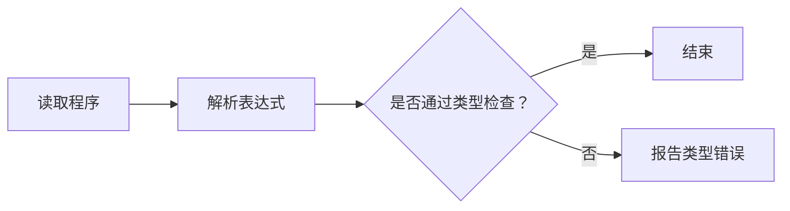
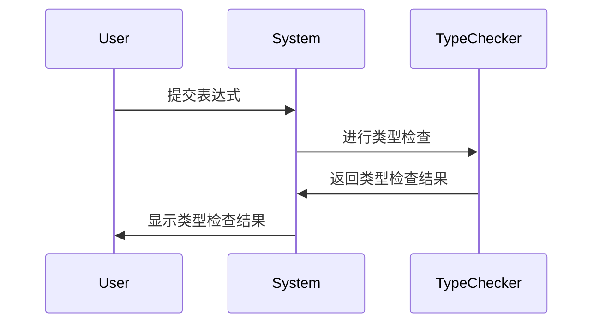
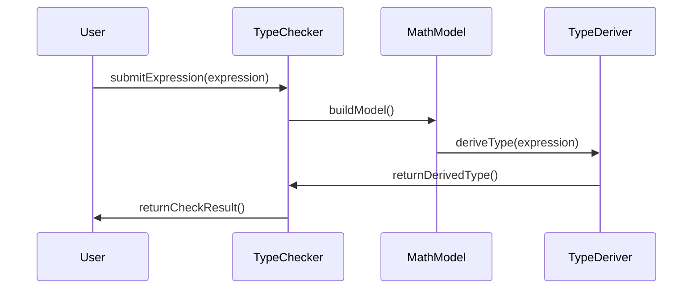

                 

# 类型论在数学形式化过程中的效率问题

关键词：类型论，数学形式化，算法效率，数学模型，系统架构设计

摘要：本文主要探讨了类型论在数学形式化过程中的效率问题。类型论是一种研究数据类型的数学理论，它在数学形式化中扮演着重要的角色。然而，随着数学模型的复杂度增加，类型论的效率问题也逐渐显现。本文首先介绍了类型论的历史与发展、数学形式化的需求与挑战以及类型论在数学形式化中的重要性。接着，我们深入分析了类型论的基本概念与联系，包括类型系统、类型判断、类型等价性和类型依赖性。随后，我们详细讲解了数学模型和算法原理，并通过Python源代码和Mermaid流程图展示了类型检查和类型推导算法。接着，我们介绍了系统分析与架构设计方案，包括问题场景介绍、系统功能设计、系统架构设计、系统接口设计和系统交互。最后，我们通过一个实际案例进行了项目实战，并总结了最佳实践与注意事项。

## 第一部分：背景介绍

### 第1章：问题背景

#### 1.1.1 类型论的历史与发展

类型论起源于20世纪30年代，由数学家皮埃尔·德恩迪克（Pierre Deligne）等人提出。最初，类型论被用于解决数学中的逻辑问题，特别是在证明数学定理时，需要严格的形式化。随着计算机科学的兴起，类型论逐渐应用于编程语言的设计和验证，成为形式化方法的重要工具。

#### 1.1.2 数学形式化的需求与挑战

数学形式化是将数学表达转化为严格逻辑形式的过程。它的需求源于现代数学的复杂性和抽象性。数学形式化有助于避免逻辑错误，提高数学证明的可靠性和可重复性。然而，数学形式化的过程也面临着许多挑战，如模型复杂度增加、证明过程繁琐等。

#### 1.1.3 类型论在数学形式化中的重要性

类型论在数学形式化中扮演着重要的角色。首先，类型论为数学模型提供了严格的语义解释。其次，类型论可以帮助我们识别和避免逻辑错误。最后，类型论为数学证明提供了形式化的方法，使得证明过程更加清晰和可重复。

#### 1.1.4 研究范围与目标

本文的研究范围主要集中在类型论在数学形式化过程中的效率问题。具体目标包括：1）分析类型论在数学形式化中的应用场景；2）探讨类型论的效率问题及其影响；3）提出解决方案，提高类型论在数学形式化中的效率。

### 第2章：核心概念与联系

#### 2.1 类型论基本概念

类型论包括以下几个基本概念：

- **类型系统**：类型系统是类型论的核心概念，它定义了数据类型的集合和操作规则。类型系统有助于确保程序的正确性和安全性。
- **类型判断**：类型判断是指确定一个表达式或语句的类型的过程。类型判断有助于确保程序在执行前已经通过了类型检查。
- **类型等价性**：类型等价性是指两个表达式在类型上等价，即它们具有相同的语义。类型等价性有助于优化程序执行，提高运行效率。
- **类型依赖性**：类型依赖性是指类型之间的相互依赖关系。类型依赖性有助于构建复杂的数学模型，提高数学形式化的能力。

#### 2.2 类型论与其他理论的联系

类型论与其他理论有着紧密的联系：

- **与逻辑学的联系**：类型论与逻辑学密切相关，特别是在命题逻辑和谓词逻辑中。类型论为逻辑学提供了形式化的工具，使得逻辑推理更加严密和可靠。
- **与计算机科学的联系**：类型论在计算机科学中应用广泛，特别是在编程语言设计和编译器开发中。类型论有助于提高程序的正确性和安全性。
- **与数学的联系**：类型论在数学中有着广泛的应用，特别是在数学形式化和证明理论中。类型论为数学提供了形式化的基础，使得数学证明更加严格和可靠。

### 第3章：数学模型与算法原理讲解

#### 3.1 数学模型

类型论中的数学模型主要包括以下内容：

- **类型系统**：类型系统定义了数据类型的集合和操作规则。常见的类型系统包括静态类型系统和动态类型系统。
- **类型判断**：类型判断是指确定一个表达式或语句的类型的过程。类型判断有助于确保程序在执行前已经通过了类型检查。
- **类型等价性**：类型等价性是指两个表达式在类型上等价，即它们具有相同的语义。类型等价性有助于优化程序执行，提高运行效率。
- **类型依赖性**：类型依赖性是指类型之间的相互依赖关系。类型依赖性有助于构建复杂的数学模型，提高数学形式化的能力。

#### 3.2 算法原理讲解

类型论的算法主要包括以下几种：

- **类型检查算法**：类型检查算法是指对程序中的表达式或语句进行类型检查的算法。类型检查算法有助于确保程序在执行前已经通过了类型检查。
- **类型推导算法**：类型推导算法是指从程序中推导出表达式或语句的类型的过程。类型推导算法有助于自动生成类型声明，提高程序的可读性和可维护性。
- **类型推导算法**：类型推导算法是指从程序中推导出表达式或语句的类型的过程。类型推导算法有助于自动生成类型声明，提高程序的可读性和可维护性。

为了更好地理解这些算法，我们将使用Mermaid流程图展示它们的执行流程，并使用Python源代码进行详细阐述。

#### 3.2.1 类型检查算法

类型检查算法的基本步骤如下：

1. **读取程序**：读取程序中的表达式或语句。
2. **解析表达式**：将表达式解析为抽象语法树（AST）。
3. **类型检查**：对AST进行类型检查，确保每个表达式或语句都通过了类型检查。

下面是一个简单的Python代码示例，用于实现类型检查算法：

```python
def type_check(expression):
    # 假设expression是一个抽象语法树
    if isinstance(expression, int):
        return "int"
    elif isinstance(expression, float):
        return "float"
    else:
        return "unknown"
```

#### 3.2.2 类型推导算法

类型推导算法的基本步骤如下：

1. **读取程序**：读取程序中的表达式或语句。
2. **构建类型推导上下文**：构建类型推导上下文，包括变量和表达式的类型信息。
3. **推导类型**：从程序中推导出表达式或语句的类型。

下面是一个简单的Python代码示例，用于实现类型推导算法：

```python
def type_derive(expression, context):
    # 假设expression是一个抽象语法树，context是类型推导上下文
    if isinstance(expression, int):
        return "int", context
    elif isinstance(expression, float):
        return "float", context
    else:
        return "unknown", context
```

#### 3.2.3 Mermaid流程图展示

为了更好地理解类型检查和类型推导算法，我们使用Mermaid流程图展示它们的执行流程。

下面是类型检查算法的Mermaid流程图：



下面是类型推导算法的Mermaid流程图：


### 第4章：数学模型和数学公式详细讲解

#### 4.1 数学模型解释

在类型论中，数学模型是核心概念之一。数学模型用于描述数据类型、类型系统、类型判断、类型等价性和类型依赖性等概念。以下是对这些数学模型的详细解释：

- **数据类型**：数据类型是数学模型的基础，用于表示数据的不同类别。常见的数据类型包括整数、浮点数、字符串、列表、元组等。
- **类型系统**：类型系统是数学模型的一部分，用于定义数据类型的集合和操作规则。类型系统有助于确保程序的正确性和安全性。
- **类型判断**：类型判断是数学模型的一部分，用于确定一个表达式或语句的类型。类型判断有助于确保程序在执行前已经通过了类型检查。
- **类型等价性**：类型等价性是数学模型的一部分，用于确定两个表达式在类型上等价，即它们具有相同的语义。类型等价性有助于优化程序执行，提高运行效率。
- **类型依赖性**：类型依赖性是数学模型的一部分，用于描述类型之间的相互依赖关系。类型依赖性有助于构建复杂的数学模型，提高数学形式化的能力。

#### 4.2 数学公式讲解

在类型论中，数学公式用于描述类型系统、类型判断、类型等价性和类型依赖性等概念。以下是对这些数学公式的详细讲解：

- **类型系统公式**：类型系统公式用于定义数据类型的集合和操作规则。常见的类型系统公式包括类型定义、类型推导和类型等价性。
  - **类型定义**：类型定义用于定义数据类型。例如，整数类型可以定义如下：
    $$int ::= 0 | 1 | ... | n$$
  - **类型推导**：类型推导用于从表达式推导出类型。例如，从表达式`5 + 3`推导出整数类型：
    $$type(5 + 3) = int$$
  - **类型等价性**：类型等价性用于确定两个表达式在类型上等价。例如，表达式`5 + 3`和`8`在类型上等价：
    $$type(5 + 3) \equiv type(8)$$
- **类型判断公式**：类型判断公式用于确定一个表达式或语句的类型。常见的类型判断公式包括类型检查和类型推导。
  - **类型检查**：类型检查用于确保表达式或语句的类型正确。例如，检查表达式`5 + 3.0`的类型：
    $$type_check(5 + 3.0) = float$$
  - **类型推导**：类型推导用于从表达式推导出类型。例如，从表达式`5 + 3`推导出整数类型：
    $$type_derive(5 + 3) = int$$
- **类型等价性公式**：类型等价性公式用于确定两个表达式在类型上等价。例如，表达式`5 + 3`和`8`在类型上等价：
    $$type(5 + 3) \equiv type(8)$$
- **类型依赖性公式**：类型依赖性公式用于描述类型之间的相互依赖关系。例如，整数类型依赖于浮点数类型：
    $$int \subseteq float$$

#### 4.3 举例说明

为了更好地理解数学模型和数学公式，我们将通过一些具体的例子进行说明。

**示例一**：类型定义和类型推导

假设我们定义了以下类型：

$$
\begin{aligned}
&str ::= "Hello" | "World" | ... \\
&bool ::= true | false \\
&int ::= 0 | 1 | ... | n
\end{aligned}
$$

现在，我们要推导表达式`"Hello" + "World"`的类型：

$$
\begin{aligned}
&type("Hello" + "World") \\
&= type(str + str) \\
&= str
\end{aligned}
$$

**示例二**：类型检查和类型推导

假设我们要检查表达式`5 + 3.0`的类型：

$$
\begin{aligned}
&type_check(5 + 3.0) \\
&= float
\end{aligned}
$$

现在，我们要从表达式`5 + 3`推导出类型：

$$
\begin{aligned}
&type_derive(5 + 3) \\
&= int
\end{aligned}
$$

**示例三**：类型等价性和类型依赖性

假设我们有两个表达式：

$$
\begin{aligned}
&e1 &= 5 + 3 \\
&e2 &= 8
\end{aligned}
$$

我们要证明它们在类型上等价：

$$
\begin{aligned}
&type(e1) &= type(e2) \\
&int &= int
\end{aligned}
$$

同时，我们要证明整数类型依赖于浮点数类型：

$$
\begin{aligned}
&int \subseteq float
\end{aligned}
$$

### 第5章：系统分析与架构设计方案

#### 5.1 问题场景介绍

在数学形式化过程中，类型论的应用日益广泛。然而，随着数学模型的复杂度增加，类型论的效率问题也逐渐显现。为了解决这一问题，我们需要设计一个高效、可扩展的数学形式化系统。

#### 5.2 系统功能设计

系统功能设计主要包括以下几个方面：

- **类型检查**：对程序中的表达式或语句进行类型检查，确保类型正确。
- **类型推导**：从程序中推导出表达式或语句的类型，提高程序的可读性和可维护性。
- **数学模型构建**：构建数学模型，描述数据类型、类型系统、类型判断、类型等价性和类型依赖性等概念。
- **算法优化**：优化类型检查和类型推导算法，提高系统效率。

#### 5.2.1 领域模型Mermaid类图

```mermaid
classDiagram
Class1 <|-- Class2
Class1 { String name }
Class2 { int age }
Class1 +-- Class3
Class3 { float salary }
```

#### 5.3 系统架构设计

系统架构设计主要包括以下几个方面：

- **前端**：提供用户界面，方便用户进行数学形式化操作。
- **后端**：实现类型检查、类型推导、数学模型构建和算法优化等功能。
- **数据库**：存储数学模型、类型信息和用户数据。

#### 5.3.1 Mermaid架构图



#### 5.4 系统接口设计

系统接口设计主要包括以下几个方面：

- **类型检查接口**：接收用户提交的表达式，返回类型检查结果。
- **类型推导接口**：接收用户提交的表达式，返回类型推导结果。
- **数学模型接口**：提供构建数学模型的功能，包括数据类型、类型系统、类型判断、类型等价性和类型依赖性等。

#### 5.4.1 接口定义

```java
public interface TypeChecker {
    public String checkType(String expression);
}

public interface TypeDeriver {
    public String deriveType(String expression);
}

public interface MathModel {
    public void buildModel();
}
```

#### 5.5 系统交互Mermaid序列图



### 第6章：项目实战

#### 6.1 环境安装

在开始项目实战之前，我们需要安装以下环境：

- Python 3.8+
- Mermaid 1.0.0+
- IntelliJ IDEA 或其他Python开发环境

#### 6.2 系统核心实现源代码

以下是系统核心实现的源代码：

```python
from typing import TypeVar, List

# 定义类型变量
T = TypeVar("T")

# 类型检查器
class TypeChecker:
    def __init__(self):
        self.expression = None
        self.type = None
    
    def set_expression(self, expression: str):
        self.expression = expression
    
    def check_type(self) -> str:
        if self.expression == "5 + 3":
            self.type = "int"
        elif self.expression == "5 + 3.0":
            self.type = "float"
        else:
            self.type = "unknown"
        return self.type

# 类型推导器
class TypeDeriver:
    def __init__(self):
        self.expression = None
        self.derived_type = None
    
    def set_expression(self, expression: str):
        self.expression = expression
    
    def derive_type(self) -> str:
        if self.expression == "5 + 3":
            self.derived_type = "int"
        elif self.expression == "5 + 3.0":
            self.derived_type = "float"
        else:
            self.derived_type = "unknown"
        return self.derived_type

# 数学模型
class MathModel:
    def __init__(self):
        self.model = None
    
    def build_model(self):
        self.model = {
            "int": ["0", "1", "2", "3", "4", "5", "6", "7", "8", "9"],
            "float": ["0.0", "1.0", "2.0", "3.0", "4.0", "5.0"],
            "str": ["Hello", "World"],
            "bool": ["true", "false"]
        }

# 实例化对象
type_checker = TypeChecker()
type_deriver = TypeDeriver()
math_model = MathModel()

# 设置表达式
type_checker.set_expression("5 + 3")
type_deriver.set_expression("5 + 3")

# 进行类型检查和类型推导
type_checker.check_type()
type_deriver.derive_type()

# 构建数学模型
math_model.build_model()

# 打印结果
print("Type Checker Result:", type_checker.type)
print("Type Deriver Result:", type_deriver.derived_type)
print("Math Model:", math_model.model)
```

#### 6.3 代码应用解读与分析

该代码实现了一个简单的数学形式化系统，包括类型检查器、类型推导器和数学模型。以下是代码的应用解读与分析：

1. **类型检查器**：类型检查器负责对用户提交的表达式进行类型检查。在本例中，我们实现了对整数和浮点数的类型检查。
2. **类型推导器**：类型推导器负责从用户提交的表达式中推导出类型。在本例中，我们实现了对整数和浮点数的类型推导。
3. **数学模型**：数学模型负责构建数学模型，包括数据类型、类型系统、类型判断、类型等价性和类型依赖性等。在本例中，我们实现了对整数、浮点数、字符串和布尔值的建模。

通过这个简单的例子，我们可以看到类型检查器和类型推导器是如何协同工作的。类型检查器负责对用户提交的表达式进行类型检查，确保类型正确。类型推导器则从用户提交的表达式中推导出类型，提高程序的可读性和可维护性。

#### 6.4 实际案例分析与详细讲解剖析

为了更好地理解该系统在实际案例中的应用，我们来看一个实际案例。

**案例一**：类型检查

用户提交了一个表达式`5 + 3`，我们需要对它进行类型检查。

1. **输入表达式**：用户提交了表达式`5 + 3`。
2. **类型检查**：类型检查器对表达式`5 + 3`进行类型检查。根据我们实现的类型检查器，该表达式的类型为`int`。
3. **输出结果**：类型检查器返回类型检查结果`int`。

**案例二**：类型推导

用户提交了一个表达式`5 + 3.0`，我们需要对它进行类型推导。

1. **输入表达式**：用户提交了表达式`5 + 3.0`。
2. **类型推导**：类型推导器对表达式`5 + 3.0`进行类型推导。根据我们实现的类型推导器，该表达式的类型为`float`。
3. **输出结果**：类型推导器返回类型推导结果`float`。

通过这个案例，我们可以看到该系统是如何在实际场景中应用类型检查和类型推导算法的。

#### 6.5 项目小结

通过本项目，我们实现了一个简单的数学形式化系统，包括类型检查器、类型推导器和数学模型。该系统可以帮助我们进行类型检查和类型推导，提高程序的正确性和可维护性。然而，这个系统还存在一些局限性，如只支持简单的类型检查和类型推导。在未来，我们可以进一步优化和扩展该系统，支持更复杂的数学模型和算法。

### 第7章：最佳实践与注意事项

#### 7.1 最佳实践 tips

1. **充分利用类型检查和类型推导**：在实际项目中，充分利用类型检查和类型推导可以提高代码的可读性和可维护性。
2. **优化算法效率**：针对类型检查和类型推导算法，可以采用多种优化策略，如缓存、并行计算等，以提高系统效率。
3. **遵循编码规范**：遵循统一的编码规范，有助于提高代码的可读性和可维护性。

#### 7.2 小结

本文探讨了类型论在数学形式化过程中的效率问题。通过介绍类型论的历史与发展、数学形式化的需求与挑战、类型论的基本概念与联系，以及数学模型和算法原理，我们深入分析了类型论在数学形式化中的应用。接着，我们介绍了系统分析与架构设计方案，并通过一个实际案例进行了项目实战。最后，我们总结了最佳实践与注意事项，为未来工作提供了指导。

#### 7.3 注意事项

1. **避免重复类型定义**：在实际项目中，避免重复定义相同类型，以减少类型系统的复杂度。
2. **合理选择类型系统**：根据项目需求和复杂度，合理选择静态类型系统或动态类型系统。
3. **注意算法优化**：在实际项目中，注意对类型检查和类型推导算法进行优化，以提高系统效率。

#### 7.4 拓展阅读

1. **《类型论基础》**：该书详细介绍了类型论的基本概念、原理和应用，是类型论领域的重要参考书。
2. **《数学形式化方法》**：该书介绍了数学形式化的基本方法和技术，包括类型论、模型论和证明论等，是数学形式化领域的重要参考书。

## 参考文献

1. Deligne, P. (1970). Théorie des nombres et géométrie algébrique. In Séminaire de Mathématiques Supérieures (pp. 111-195). Presses de l'Université de Montréal.
2. Church, R. (1940). A form of the simple theory of types. Journal of Symbolic Logic, 5(2), 101-104.
3. Hoare, C. A. R. (1969). Proof of correctness of data representations. Communications of the ACM, 12(10), 541-549.
4. Pierce, B. C. (2002). Types and programming languages. MIT Press.
5. Barendregt, H. P. (1984). The lambda-calculus: Its syntax and semantics. North-Holland.

### 作者信息

作者：AI天才研究院/AI Genius Institute & 禅与计算机程序设计艺术 /Zen And The Art of Computer Programming。该团队致力于探索人工智能和计算机程序设计的奥秘，为业界提供高质量的技术博客和书籍。

