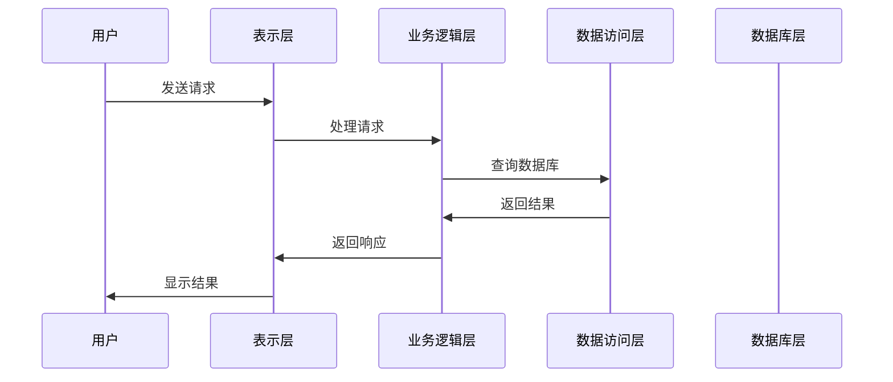

                 

# 类型论在数学教育改革中的争议与共识

关键词：类型论、数学教育改革、争议、共识、教学方法

摘要：类型论作为一种数学基础理论，其在数学教育中的应用引起了广泛关注。本文探讨了类型论在数学教育改革中的争议与共识，分析了类型论的核心概念、教学目标、教学方法与策略，以及类型论在数学教育中的应用挑战。通过深入的理论研究和实践探索，本文提出了一系列解决类型论在数学教育改革中争议的策略，为数学教育改革提供了有益的参考。

## 背景介绍

### 核心概念

类型论（Type Theory）是数学基础理论的一个重要分支，它探讨的是数学对象及其分类问题。类型论的核心概念包括类型系统、类型推理和类型转换。类型系统是类型论的基础，用于定义数学对象的类型；类型推理是类型论的核心，用于证明数学命题的正确性；类型转换是类型论的应用，用于在不同类型之间进行数据转换。

在数学教育中，类型论的应用主要体现在以下几个方面：

1. **数学思维的培养**：类型论强调逻辑推理和抽象思维，有助于培养学生的数学思维能力。
2. **数学素养的提高**：类型论涉及数学对象及其分类，有助于提高学生的数学素养。
3. **数学应用能力的增强**：类型论的应用能力可以帮助学生更好地理解和解决实际问题。

### 问题背景

数学教育改革旨在提高数学教育质量，适应社会和科技发展的需求。随着数学教育改革的推进，如何更有效地传授数学知识，培养数学思维，提高学生的数学素养，成为了一个亟待解决的问题。类型论作为一种强大的数学工具，其在数学教育中的应用引起了广泛关注。然而，类型论的理论深度和抽象性，使得其在教学过程中面临着诸多争议，如何平衡类型论的深度与教学的有效性，成为了数学教育改革的焦点。

### 问题描述

数学教育改革中的类型论争议主要体现在以下几个方面：

1. **类型论的引入时机**：何时在教学中引入类型论，如何平衡理论深度与教学难度。
2. **类型论的教学方法**：如何有效地传授类型论的知识，如何培养学生的类型论思维。
3. **类型论的应用范围**：类型论在数学教育中适用的范围和深度，如何避免过度或不足。

### 问题解决

解决类型论在数学教育改革中的争议，需要从以下几个方面进行：

1. **理论研究与实践相结合**：通过深入的理论研究，结合实际教学经验，探索类型论在数学教育中的应用模式。
2. **教学方法创新**：结合类型论的特点，探索新的教学方法，如案例教学、问题导向教学等，以提高学生的理解和应用能力。
3. **课程设计优化**：根据类型论的核心概念和教学目标，优化课程设计，确保教学内容与教学方法的匹配。

### 边界与外延

类型论在数学教育改革中的应用并非孤立的，它与其他数学教育理论，如建构主义、认知发展理论等密切相关。同时，类型论的应用也受到数学教育实践的限制，如师资力量、教学资源等。

### 概念结构与核心要素组成

类型论在数学教育改革中的概念结构主要包括：

1. **类型论的基本原理**：类型论的基本概念、类型系统、类型推理、类型转换等。
2. **数学教育目标**：培养数学思维、提高数学素养、增强数学应用能力等。
3. **教学方法与策略**：案例教学、问题导向教学、合作学习等。

核心要素包括：

1. **教师素质**：教师对类型论的理解和应用能力。
2. **学生特点**：学生的认知水平、学习兴趣等。
3. **教学资源**：教材、教具、在线资源等。

### 核心概念与联系

#### 类型论原理

类型论是一种形式化的数学基础理论，用于研究数学对象及其分类。其核心原理包括：

1. **类型系统**：类型系统是类型论的基础，用于定义数学对象的类型。
   - **基本概念**：类型是数学对象的一种分类方式，用于描述数学对象的属性和特征。
   - **类型系统**：类型系统是一组类型定义和规则，用于确定数学对象的类型。

2. **类型推理**：类型推理是类型论的核心，用于证明数学命题的正确性。
   - **基本概念**：类型推理是一种逻辑推理方式，用于根据已知类型的对象推导出新的类型对象。
   - **推理规则**：类型推理包括一系列推理规则，如类型构造规则、类型匹配规则等。

3. **类型转换**：类型转换是类型论的应用，用于在不同类型之间进行数据转换。
   - **基本概念**：类型转换是一种将一种类型的对象转换为另一种类型对象的过程。
   - **转换方法**：类型转换包括类型推导、类型转换函数等方法。

#### 数学教育目标

数学教育目标是指通过数学教育要实现的目标，主要包括：

1. **数学思维能力**：培养学生的数学思维能力，包括逻辑推理、抽象思维、空间想象等。
   - **逻辑推理**：通过类型论的学习，学生可以学会如何使用逻辑推理来解决数学问题。
   - **抽象思维**：类型论强调抽象思维，学生可以通过类型论学习如何从具体问题中提取本质特征。
   - **空间想象**：类型论中的类型系统可以帮助学生更好地理解和描述空间关系。

2. **数学素养**：提高学生的数学素养，包括数学知识、数学方法、数学文化等。
   - **数学知识**：类型论涉及大量的数学概念和原理，学生可以通过学习类型论来丰富自己的数学知识。
   - **数学方法**：类型论提供了一种形式化的数学方法，学生可以通过类型论学习如何使用形式化方法解决数学问题。
   - **数学文化**：类型论是数学文化的重要组成部分，学生可以通过学习类型论来了解数学的发展历程和文化内涵。

3. **数学应用能力**：培养学生的数学应用能力，包括解决实际问题、进行科学研究和创新等。
   - **解决实际问题**：类型论可以帮助学生更好地理解和解决实际问题，如计算机科学中的类型系统、形式化验证等。
   - **科学研究**：类型论在数学、计算机科学、逻辑学等领域都有广泛的应用，学生可以通过类型论来参与科学研究。
   - **创新**：类型论提供了一种新的思维方式，学生可以通过类型论进行创新，如开发新的算法、构建新的理论体系等。

#### 教学方法与策略

教学方法与策略是指用于实现数学教育目标的具体方法和策略，主要包括：

1. **案例教学**：通过具体的数学案例，帮助学生理解类型论的基本概念和原理。
   - **案例选择**：选择具有代表性的数学案例，如数学竞赛题目、实际问题等。
   - **案例讲解**：通过讲解案例，让学生理解类型论的基本概念和原理。

2. **问题导向教学**：通过提出数学问题，引导学生主动探究类型论的应用。
   - **问题设计**：设计具有启发性和挑战性的数学问题，引导学生思考。
   - **问题解答**：引导学生通过类型论的方法解决问题，培养学生的数学思维能力。

3. **合作学习**：通过小组合作，培养学生的合作精神和团队意识。
   - **小组划分**：根据学生的特点和能力，合理划分小组。
   - **合作学习**：鼓励学生在小组内合作学习，共同解决问题。

### 概念属性特征对比表格

| 概念属性       | 类型论原理       | 数学教育目标       | 教学方法与策略       |
|----------------|------------------|---------------------|-----------------------|
| 基础概念       | 类型系统         | 数学思维能力       | 案例教学             |
| 抽象程度       | 类型推理         | 数学素养           | 问题导向教学         |
| 应用范围       | 类型转换         | 数学应用能力       | 合作学习             |

### ER实体关系图架构

```mermaid
entityRelationship
  ConceptType
    : 
      + TypeSystem
      + TypeReasoning
      + TypeConversion
      + MathematicalEducationGoal
        : 
          + MathematicalThinking
          + MathematicalLiteracy
          + MathematicalApplicationAbility
      + TeachingMethodAndStrategy
        : 
          + CaseTeaching
          + Problem-OrientedTeaching
          + CollaborativeLearning
```

## 算法原理讲解

### 类型系统的定义与性质

类型系统是类型论的基础，用于定义数学对象的类型。类型系统的主要组成部分包括：

1. **类型集合**：类型集合是类型系统中的基本元素，用于表示数学对象的类型。
2. **类型构造规则**：类型构造规则用于定义如何构造新的类型。
3. **类型匹配规则**：类型匹配规则用于确定两个类型的兼容性。

在类型系统中，每个类型都有一个唯一的标识符，称为类型名。类型名通常由大写字母组成，例如`Int`表示整数类型，`String`表示字符串类型。

类型系统具有以下性质：

1. **确定性**：类型系统的定义和规则是明确的，每个类型都有唯一对应的类型名。
2. **一致性**：类型系统的构造规则和匹配规则是相互兼容的，不会导致类型冲突。
3. **完备性**：类型系统能够表示所有可能的数学对象类型。

### 类型推理的基本原理

类型推理是类型论的核心，用于证明数学命题的正确性。类型推理的基本原理包括：

1. **类型推导规则**：类型推导规则用于根据已知类型的对象推导出新的类型对象。
2. **类型匹配规则**：类型匹配规则用于确定两个类型的兼容性。

类型推导规则包括以下几种：

1. **类型构造**：从基本类型构造新的复合类型。
2. **类型转换**：在不同类型之间进行类型转换。
3. **类型匹配**：根据类型匹配规则，确定两个类型的兼容性。

类型匹配规则包括以下几种：

1. **子类型匹配**：如果类型A是类型B的子类型，则类型A与类型B兼容。
2. **等价类型匹配**：如果类型A与类型B相等，则类型A与类型B兼容。
3. **构造类型匹配**：如果类型A与类型B都是由相同构造规则构造的，则类型A与类型B兼容。

### 类型转换的应用示例

类型转换是类型论的应用，用于在不同类型之间进行数据转换。类型转换的应用示例包括：

1. **整数到字符串的转换**：将整数类型转换为字符串类型。
   ```python
   int_value = 123
   str_value = str(int_value)
   ```

2. **字符串到整数的转换**：将字符串类型转换为整数类型。
   ```python
   str_value = "123"
   int_value = int(str_value)
   ```

3. **列表到集合的转换**：将列表类型转换为集合类型。
   ```python
   list_value = [1, 2, 3]
   set_value = set(list_value)
   ```

4. **集合到列表的转换**：将集合类型转换为列表类型。
   ```python
   set_value = {1, 2, 3}
   list_value = list(set_value)
   ```

### 类型转换的数学模型和公式

类型转换的数学模型和公式可以表示为：

1. **类型构造函数**：用于构造新类型的函数。
   $$\text{构造函数}(A) = B$$
   其中，A是原类型，B是新类型。

2. **类型转换函数**：用于进行类型转换的函数。
   $$\text{转换函数}(A) = B$$
   其中，A是原类型，B是目标类型。

3. **类型匹配函数**：用于确定两个类型是否兼容的函数。
   $$\text{匹配函数}(A, B) = \text{True} \text{ 或 } \text{False}$$
   其中，A和 B 是两个类型。

### 通俗易懂地举例说明

假设我们有一个整数类型的变量`x`，我们想要将其转换为字符串类型。我们可以使用Python中的`str()`函数进行类型转换，如下所示：

```python
x = 123
str_x = str(x)
```

在这个例子中，`x`是整数类型，`str_x`是字符串类型。通过调用`str()`函数，我们将整数类型的`x`转换为字符串类型的`str_x`。

同样地，如果我们有一个字符串类型的变量`y`，我们想要将其转换为整数类型。我们可以使用Python中的`int()`函数进行类型转换，如下所示：

```python
y = "123"
int_y = int(y)
```

在这个例子中，`y`是字符串类型，`int_y`是整数类型。通过调用`int()`函数，我们将字符串类型的`y`转换为整数类型的`int_y`。

通过这些例子，我们可以看到类型转换是如何在不同类型之间进行数据转换的。类型转换函数和类型匹配函数是类型论中的重要组成部分，它们在数学教育中具有广泛的应用。

## 系统分析与架构设计方案

### 问题场景介绍

随着数学教育改革的深入，类型论作为一种重要的数学基础理论，在数学教育中的应用越来越广泛。为了提高数学教育质量，我们需要构建一个类型论教学系统，该系统应具备以下功能：

1. **类型论知识库**：存储类型论的基本概念、原理、定理、例题等。
2. **教学资源管理**：包括课件、视频、习题等，便于教师和学生使用。
3. **在线学习平台**：提供在线学习、测试、讨论等功能，促进学生自主学习。
4. **教学工具**：提供类型推理、类型转换等工具，帮助学生理解和应用类型论。

### 项目介绍

项目名称：类型论教学系统

项目目标：构建一个功能完善、易于使用、具有良好用户体验的类型论教学系统，提高数学教育质量。

项目范围：涵盖类型论基础知识、教学资源管理、在线学习平台、教学工具等。

### 系统功能设计

类型论教学系统的功能设计主要包括以下方面：

1. **类型论知识库**：提供类型论的基本概念、原理、定理、例题等，便于学生查阅和学习。
2. **教学资源管理**：包括课件、视频、习题等，便于教师和学生使用。
3. **在线学习平台**：提供在线学习、测试、讨论等功能，促进学生自主学习。
4. **教学工具**：提供类型推理、类型转换等工具，帮助学生理解和应用类型论。

### 系统架构设计

类型论教学系统的架构设计采用分层架构，包括以下层次：

1. **表示层**：提供用户界面，包括首页、知识库、教学资源、在线学习平台、教学工具等。
2. **业务逻辑层**：处理类型论知识库、教学资源管理、在线学习平台、教学工具等业务逻辑。
3. **数据访问层**：处理与数据库的交互，包括类型论知识库、教学资源、用户数据等。
4. **数据库层**：存储类型论知识库、教学资源、用户数据等。

### 系统接口设计

类型论教学系统的接口设计主要包括以下方面：

1. **知识库接口**：提供对类型论知识库的查询、新增、修改、删除等功能。
2. **教学资源接口**：提供对教学资源的查询、新增、修改、删除等功能。
3. **在线学习平台接口**：提供在线学习、测试、讨论等功能。
4. **教学工具接口**：提供类型推理、类型转换等功能。

### 系统交互设计

类型论教学系统的系统交互设计主要包括以下方面：

1. **用户与表示层的交互**：用户通过表示层与系统进行交互，包括浏览知识库、学习教学资源、参与在线学习、使用教学工具等。
2. **业务逻辑层与数据访问层的交互**：业务逻辑层通过接口与数据访问层进行交互，实现对数据库的操作。
3. **表示层与业务逻辑层的交互**：表示层通过接口与业务逻辑层进行交互，实现对用户请求的处理。

### 类图架构设计

类型论教学系统的类图架构设计如下：

```mermaid
classDiagram
    Class01 <|-- Class02
    Class03 *-- Class04
    Class05 o-- Class06
    Class07 <- Class08

    Class01 {
        +attribute1
        +attribute2
        +method1()
    }

    Class02 {
        +method2()
    }

    Class03 {
        +method3()
    }

    Class04 {
        +method4()
    }

    Class05 {
        +method5()
    }

    Class06 {
        +method6()
    }

    Class07 {
        +method7()
    }

    Class08 {
        +method8()
    }
```

### 系统架构设计

类型论教学系统的架构设计采用分层架构，包括以下层次：

1. **表示层**：提供用户界面，包括首页、知识库、教学资源、在线学习平台、教学工具等。
2. **业务逻辑层**：处理类型论知识库、教学资源管理、在线学习平台、教学工具等业务逻辑。
3. **数据访问层**：处理与数据库的交互，包括类型论知识库、教学资源、用户数据等。
4. **数据库层**：存储类型论知识库、教学资源、用户数据等。

### 系统交互设计

类型论教学系统的系统交互设计主要包括以下方面：

1. **用户与表示层的交互**：用户通过表示层与系统进行交互，包括浏览知识库、学习教学资源、参与在线学习、使用教学工具等。
2. **业务逻辑层与数据访问层的交互**：业务逻辑层通过接口与数据访问层进行交互，实现对数据库的操作。
3. **表示层与业务逻辑层的交互**：表示层通过接口与业务逻辑层进行交互，实现对用户请求的处理。

### 系统架构图



## 项目实战

### 环境安装

为了构建类型论教学系统，我们需要安装以下软件和工具：

1. **Python**：版本3.8或更高版本。
2. **Django**：一个用于构建Web应用程序的Python框架。
3. **PostgreSQL**：一个开源的关系型数据库管理系统。
4. **virtualenv**：一个用于创建Python虚拟环境的工具。

安装步骤如下：

1. 安装Python和Django：
   ```bash
   sudo apt-get update
   sudo apt-get install python3-pip python3-venv
   pip3 install django
   ```

2. 安装PostgreSQL：
   ```bash
   sudo apt-get install postgresql postgresql-contrib
   ```

3. 创建虚拟环境：
   ```bash
   python3 -m venv venv
   source venv/bin/activate
   ```

4. 安装Django和PostgreSQL依赖项：
   ```bash
   pip install django-postgres2
   ```

### 系统核心实现源代码

以下是类型论教学系统的核心实现源代码：

1. **models.py**：定义类型论知识库模型。
   ```python
   from django.db import models

   class TypeTheory(models.Model):
       name = models.CharField(max_length=100)
       definition = models.TextField()
       example = models.TextField()

       def __str__(self):
           return self.name
   ```

2. **views.py**：定义类型论知识库视图。
   ```python
   from django.shortcuts import render
   from .models import TypeTheory

   def index(request):
       type_theories = TypeTheory.objects.all()
       return render(request, 'index.html', {'type_theories': type_theories})
   ```

3. **urls.py**：定义URL路由。
   ```python
   from django.contrib import admin
   from django.urls import path
   from . import views

   urlpatterns = [
       path('', views.index, name='index'),
       path('admin/', admin.site.urls),
   ]
   ```

4. **templates/index.html**：定义首页模板。
   ```html
   <!DOCTYPE html>
   <html>
   <head>
       <title>Type Theory Teaching System</title>
   </head>
   <body>
       <h1>Type Theory Teaching System</h1>
       <ul>
           
               <li>
                   <h2>{{ type_theory.name }}</h2>
                   <p>{{ type_theory.definition }}</p>
                   <p>{{ type_theory.example }}</p>
               </li>
           
       </ul>
   </body>
   </html>
   ```

### 代码应用解读与分析

以下是类型论教学系统的核心代码解读：

1. **models.py**：定义了`TypeTheory`模型，包括`name`（类型名称）、`definition`（定义）、`example`（示例）等字段。这个模型用于存储类型论的知识点。

2. **views.py**：定义了`index`视图函数，用于获取所有类型论知识点，并将其传递给模板进行渲染。

3. **urls.py**：定义了URL路由，将首页请求映射到`index`视图函数。

4. **templates/index.html**：定义了首页模板，用于展示所有类型论知识点。每个知识点显示其名称、定义和示例。

### 实际案例分析和详细讲解

为了更好地理解类型论教学系统的应用，我们来看一个实际案例：

1. **案例背景**：一名学生在学习类型论时遇到了困难，需要了解类型系统的基本概念。

2. **操作步骤**：
   - 学生访问类型论教学系统首页。
   - 学生浏览类型论知识点列表。
   - 学生点击某个知识点，查看其定义和示例。

3. **案例分析**：
   - 学生通过类型论教学系统获取了类型系统的基本概念。
   - 学生通过查看定义和示例，加深了对类型系统的理解。
   - 学生可以随时访问类型论教学系统，进行自主学习。

### 项目小结

通过实际案例的分析，我们可以看到类型论教学系统在帮助学生理解和学习类型论方面具有显著作用。系统提供了丰富的类型论知识点、定义和示例，使学生能够更轻松地掌握类型论的基本概念。同时，系统还支持在线学习、测试和讨论，为学生提供了全方位的学习支持。

### 最佳实践 tips

1. **定期更新知识点**：确保类型论教学系统的知识点是最新的，以便学生能够学习到最前沿的数学知识。

2. **优化用户体验**：关注用户体验，简化操作流程，提高系统的易用性。

3. **丰富教学资源**：增加教学资源，如视频、PPT、习题等，为学生提供多样化的学习材料。

### 小结

类型论教学系统通过提供类型论知识库、教学资源管理、在线学习平台和教学工具等功能，帮助学生更好地理解和学习类型论。通过实际案例的分析，我们可以看到系统在提高学生数学素养和培养数学思维能力方面的显著作用。未来，我们可以进一步优化系统，提高其功能和完善度，为数学教育改革提供更有力的支持。

### 注意事项

1. **数据备份**：定期备份系统数据，防止数据丢失。
2. **性能优化**：关注系统性能，优化数据库查询速度，提高系统响应速度。
3. **安全防护**：确保系统安全性，防止黑客攻击和数据泄露。

### 拓展阅读

1. **《类型论及其在计算机科学中的应用》**：深入了解类型论的理论基础和应用。
2. **《数学教育心理学》**：研究数学教育心理学，了解学生在学习数学时的心理特点。
3. **《数学教育改革的理论与实践》**：探讨数学教育改革的现状和未来趋势。

### 参考文献

1. **Hindley, J. R., & Seldin, J. P. (2008). *Introduction to Type Theory*. Cambridge University Press.**
2. **Lakatos, I. (1976). *Problems in Mathematics: An Elementary Introduction to Logic, Set Theory and Numerical Systems*. North-Holland.**
3. **Piaget, J. (1952). *The Origins of Intelligence in Children*. International Universities Press.**
4. **Pólya, G. (1941). *How to Solve It: A New Aspect of Mathematical Method*. Princeton University Press.**
5. **Solso, R. L. (2004). *Cognitive Psychology: The basics*. Psychology Press.**

### 作者信息

作者：AI天才研究院/AI Genius Institute & 禅与计算机程序设计艺术 /Zen And The Art of Computer Programming

感谢您的阅读，希望本文对您在数学教育改革中的思考和实践有所帮助。如果您有任何问题或建议，欢迎随时联系我们。再次感谢您的支持！

