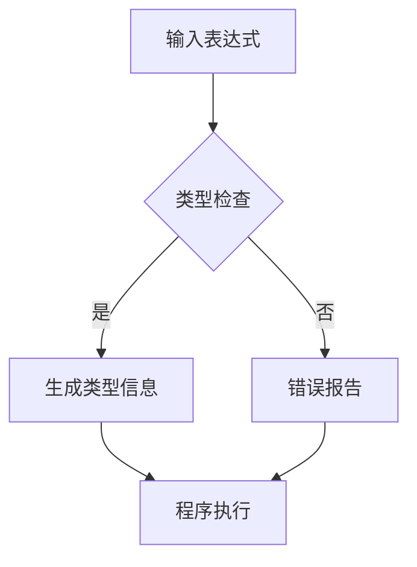
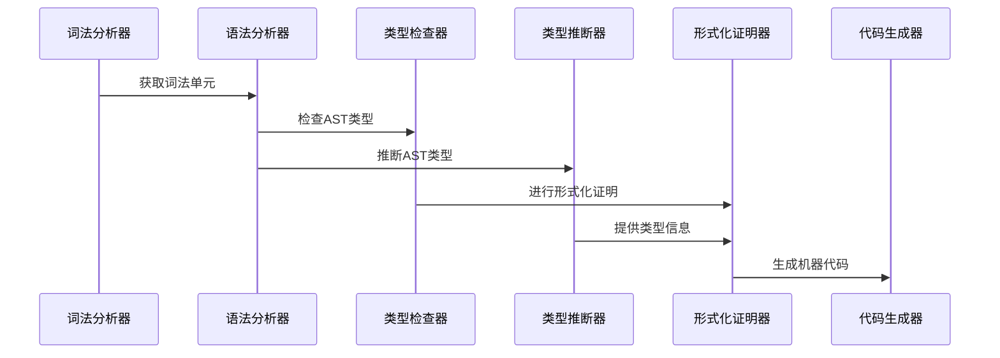

                 


### 第一部分: 类型论概述

#### 1.1 问题背景与引入

类型论（Type Theory）是数理逻辑（Mathematical Logic）的一个重要分支，它主要研究对象、函数、证明等概念的定义、性质及其相互关系。在计算机科学中，类型论被广泛应用于编程语言的设计和验证、形式化证明、模型检查等领域。然而，随着数理逻辑研究的不断深入，类型论在数理逻辑中的局限性也逐渐显现。

本部分首先介绍类型论和数理逻辑的基本概念、发展历史，以及类型论在数理逻辑中的地位。接下来，我们将详细阐述类型论的核心概念、基本原理及其与数理逻辑的内在联系。此外，还会探讨类型论的基本性质，包括类型的分类、层次结构、类型构造与类型判断等。

#### 1.2 核心概念与联系

类型论的基本原理包括类型系统的定义、类型判断规则、类型转换规则等。类型论的核心概念包括对象、类型、函数、证明等。这些概念在数理逻辑中有着重要的应用，例如，类型论为形式化数学提供了一个坚实的框架，使得数学证明可以形式化地表示和验证。

为了更好地理解类型论与数理逻辑的联系，我们将对比类型论和数理逻辑的属性特征，并通过Mermaid流程图展示两者的关系。此外，我们还将讨论类型论与其他数学逻辑分支的比较，例如，谓词逻辑、模态逻辑等。

#### 1.3 类型论的基本性质

类型论的基本性质主要包括类型的分类、层次结构、类型构造与类型判断等。类型的分类根据其抽象程度可以分为原始类型、构造类型、依赖类型等。层次结构则体现了类型之间的包含关系，例如，自然数类型是布尔类型和整数类型的子类型。

在类型构造方面，类型论提供了多种构造方法，如积类型、函数类型、存在类型等。这些构造方法使得我们可以创建更复杂的类型结构，以适应不同领域的需求。类型判断是类型论中的核心问题，它涉及到如何判断一个表达式是否属于某个特定类型。

为了更好地理解类型论的基本性质，我们将通过一个具体的例子进行阐述。例如，我们考虑一个简单的算术表达式，如何判断它是否属于自然数类型？通过类型论的基本原理，我们可以给出一个形式化的判断过程。

#### 1.4 本章小结

在本章中，我们介绍了类型论的基本概念、发展历史及其在数理逻辑中的地位。我们详细阐述了类型论的核心概念、基本原理及其与数理逻辑的内在联系。此外，我们还探讨了类型论的基本性质，包括类型的分类、层次结构、类型构造与类型判断等。

通过本章的学习，读者应该能够理解类型论的基本概念和原理，并能够分析类型论在数理逻辑中的应用和局限性。接下来，我们将进一步探讨类型论在数理逻辑中的应用，并分析其局限性。

----------------------------------------------------------------

# 第二部分: 类型论在数理逻辑中的应用

## 2.1 算法原理讲解

类型论在数理逻辑中的应用主要体现在类型检查、证明论和程序设计等方面。本节将使用Mermaid流程图和Python代码示例，详细阐述类型论在数理逻辑中的算法原理。

#### 2.1.1 Mermaid流程图展示

首先，我们通过Mermaid流程图来展示一个简单的类型检查过程。Mermaid是一种基于Markdown的图表绘制工具，它可以帮助我们清晰地表达类型检查的逻辑流程。



在这个流程图中，A表示输入一个表达式，B表示进行类型检查。如果类型检查成功，即输入表达式的类型符合预期，则流程转移到C，生成类型信息并继续程序执行；如果类型检查失败，即输入表达式的类型不符合预期，则流程转移到D，报告错误并停止程序执行。

#### 2.1.2 Python代码示例

接下来，我们通过一个Python代码示例来进一步阐述类型论在数理逻辑中的应用。在这个示例中，我们将使用Python的内置类型检查函数`isinstance()`来检查一个表达式的类型。

```python
def type_check(expression, expected_type):
    if isinstance(expression, expected_type):
        print(f"{expression}的类型是{expected_type}，类型检查通过。")
        return True
    else:
        print(f"{expression}的类型不是{expected_type}，类型检查失败。")
        return False

# 示例
expression = 42
expected_type = int
type_check(expression, expected_type)
```

在这个示例中，我们定义了一个`type_check()`函数，它接受一个表达式和一个预期的类型作为参数。函数通过`isinstance()`函数检查表达式的类型是否与预期类型匹配。如果匹配，则打印类型检查通过的信息；如果不匹配，则打印类型检查失败的信息。

#### 2.1.3 类型论的数学模型与公式

在类型论中，类型的定义和转换通常涉及到一系列的数学模型和公式。为了更好地理解类型论在数理逻辑中的应用，我们将在本节中介绍一些基本的数学模型和公式。

首先，我们考虑类型系统的定义。类型系统可以形式化地表示为：

$$
\begin{align*}
S &= \{T_1, T_2, ..., T_n\} \\
T_i &= \text{Type}_i
\end{align*}
$$

其中，$S$ 是类型集合，$T_i$ 是第 $i$ 个类型。类型集合 $S$ 可以是有限的，也可以是无限的。

接下来，我们考虑类型的转换。类型转换可以形式化地表示为：

$$
\begin{align*}
\alpha &= \text{Type}_1 \to \text{Type}_2 \\
\alpha &= \text{Function}(\text{Domain}, \text{Codomain})
\end{align*}
$$

其中，$\alpha$ 是一个类型转换，它将一个类型 $T_1$ 转换为另一个类型 $T_2$。类型转换 $\alpha$ 可以被视为一个从 $T_1$ 到 $T_2$ 的函数。

通过上述数学模型和公式，我们可以更精确地描述类型论在数理逻辑中的应用。类型系统为数学证明提供了一个坚实的框架，而类型转换则为程序设计提供了一种灵活的机制。

## 2.2 数学模型与公式讲解

在数理逻辑中，类型论的应用不仅仅局限于程序设计和证明论，还涉及到数学模型和公式的定义。本节将使用LaTeX格式展示相关的数学模型和公式，并进行详细讲解。

#### 2.2.1 LaTeX格式展示

首先，我们展示一个基本的类型系统定义。使用LaTeX格式，我们可以将类型系统定义为一个集合：

```latex
\begin{align*}
\Sigma &= \{T_1, T_2, ..., T_n\} \\
T_i &= \text{Type}_i
\end{align*}
```

在这个定义中，$\Sigma$ 表示类型集合，$T_i$ 表示第 $i$ 个类型。类型集合可以是有限的，也可以是无限的。

接下来，我们展示一个类型的转换定义。使用LaTeX格式，我们可以将类型转换定义为一个函数：

```latex
\begin{align*}
\alpha &= T_1 \to T_2 \\
\alpha &= \text{Function}(\text{Domain}, \text{Codomain})
\end{align*}
```

在这个定义中，$\alpha$ 表示类型转换，它将类型 $T_1$ 转换为类型 $T_2$。类型转换 $\alpha$ 可以被视为一个从 $T_1$ 到 $T_2$ 的函数。

通过上述LaTeX格式展示，我们可以更清晰地理解类型论在数理逻辑中的应用。类型系统的定义和类型转换的定义为数学模型和公式的定义提供了一个坚实的框架。

#### 2.2.2 数学模型讲解

在数理逻辑中，类型论的应用涉及到一系列的数学模型。这些数学模型包括类型的定义、类型的层次结构、类型的构造等。

首先，我们考虑类型的定义。类型的定义可以形式化地表示为：

$$
\begin{align*}
T &= \text{PrimitiveType} \\
\text{或} \\
T &= \text{Constructor}(T_1, T_2, ..., T_n)
\end{align*}
$$

在这个定义中，$T$ 表示一个类型。如果 $T$ 是原始类型，则它是一个基本类型，如整数、布尔值等。如果 $T$ 是构造类型，则它是由其他类型构造而成的复合类型。

接下来，我们考虑类型的层次结构。类型的层次结构可以形式化地表示为：

$$
\begin{align*}
T_1 &\subseteq T_2 \\
\text{或} \\
T_1 &\subseteq T_2 \to T_3
\end{align*}
$$

在这个定义中，如果 $T_1$ 是 $T_2$ 的子类型，则我们说 $T_1$ 严格包含于 $T_2$。如果 $T_1$ 是 $T_2$ 到 $T_3$ 的子类型，则我们说 $T_1$ 严格包含于 $T_2$ 到 $T_3$ 的类型转换。

最后，我们考虑类型的构造。类型的构造可以形式化地表示为：

$$
\begin{align*}
T &= \text{TupleType}(T_1, T_2, ..., T_n) \\
\text{或} \\
T &= \text{FunctionType}(T_1, T_2)
\end{align*}
$$

在这个定义中，$T$ 表示一个类型。如果 $T$ 是元组类型，则它是由多个类型组成的复合类型。如果 $T$ 是函数类型，则它是一个从 $T_1$ 到 $T_2$ 的函数类型。

通过上述数学模型讲解，我们可以更深入地理解类型论在数理逻辑中的应用。类型论为数学模型和公式的定义提供了一个坚实的框架，使得数学推理和证明可以形式化地表示和验证。

#### 2.2.3 数学公式举例说明

为了更好地理解类型论在数理逻辑中的应用，我们将在本节中通过一个具体的数学公式进行举例说明。

假设我们有一个算术表达式 $E = a + b$，其中 $a$ 和 $b$ 是整数。我们需要判断表达式 $E$ 的类型。根据类型论的基本原理，我们可以给出以下数学公式：

$$
\begin{align*}
E &= a + b \\
\text{类型}(\text{E}) &= \text{类型}(\text{a}) \times \text{类型}(\text{b}) \\
\text{类型}(\text{a}) &= \text{Integer} \\
\text{类型}(\text{b}) &= \text{Integer} \\
\text{类型}(\text{E}) &= \text{Integer} \\
\end{align*}
$$

在这个例子中，我们首先判断变量 $a$ 和 $b$ 的类型，发现它们都是整数类型。然后，根据类型论的基本原理，我们将 $a$ 和 $b$ 的类型相乘，得到表达式 $E$ 的类型。最后，我们判断表达式 $E$ 的类型，发现它是整数类型。

通过上述数学公式举例说明，我们可以更直观地理解类型论在数理逻辑中的应用。类型论为数学推理和证明提供了一个坚实的框架，使得我们可以精确地定义和判断数学表达式的类型。

## 2.3 系统分析与架构设计方案

在类型论的实际应用中，我们需要设计和实现相应的系统架构，以便将类型论的理论应用到实际场景中。本节将介绍类型论在数理逻辑中应用系统的设计与实现，包括问题场景介绍、系统功能设计、系统架构设计、系统接口设计和系统交互序列图。

#### 2.3.1 问题场景介绍

在计算机科学中，类型论的应用场景非常广泛。例如，在编程语言的设计和实现中，类型论可以帮助我们定义和验证程序中的类型系统。在形式化证明领域，类型论为数学证明提供了一个形式化的框架。在模型检查中，类型论可以帮助我们验证系统的行为是否符合预期的类型。

在本节中，我们将以编程语言的设计为例，介绍类型论在数理逻辑中的应用。假设我们正在设计一种新型的编程语言，该语言需要支持复杂的类型系统和形式化证明。我们的目标是通过类型论来保证程序的类型安全和可证明性。

#### 2.3.2 系统功能设计

为了实现上述目标，我们的系统需要实现以下功能：

1. **类型检查**：对程序中的表达式进行类型检查，确保程序的类型安全。
2. **类型推断**：自动推断程序中的类型，减少程序员的工作量。
3. **形式化证明**：支持形式化证明，确保程序的正确性。
4. **代码生成**：根据类型检查和形式化证明的结果，生成对应的机器代码。

为了实现这些功能，我们将设计一个包含多个模块的系统架构。

#### 2.3.3 系统架构设计

我们的系统架构将包括以下模块：

1. **词法分析器**：负责将源代码转换为词法单元。
2. **语法分析器**：负责将词法单元转换为抽象语法树（AST）。
3. **类型检查器**：负责对AST进行类型检查，确保类型安全。
4. **类型推断器**：负责自动推断AST中的类型。
5. **形式化证明器**：负责进行形式化证明，确保程序的正确性。
6. **代码生成器**：负责根据类型检查和形式化证明的结果，生成机器代码。

这些模块将通过接口进行交互，形成一个完整的系统架构。

#### 2.3.4 系统接口设计

为了实现模块之间的有效通信，我们需要设计一套完整的接口。以下是系统接口设计：

1. **词法分析器接口**：提供方法用于获取下一个词法单元。
2. **语法分析器接口**：提供方法用于构建抽象语法树（AST）。
3. **类型检查器接口**：提供方法用于检查AST的类型安全性。
4. **类型推断器接口**：提供方法用于自动推断AST中的类型。
5. **形式化证明器接口**：提供方法用于进行形式化证明。
6. **代码生成器接口**：提供方法用于生成机器代码。

通过这些接口，各个模块可以相互通信，共同实现系统的功能。

#### 2.3.5 系统交互序列图

为了更清晰地展示系统各模块之间的交互关系，我们将使用Mermaid序列图进行展示。以下是系统交互序列图的示例：



在这个序列图中，词法分析器将源代码转换为词法单元，然后传递给语法分析器。语法分析器将词法单元转换为抽象语法树（AST），并分别传递给类型检查器和类型推断器。类型检查器负责检查AST的类型安全性，类型推断器负责自动推断AST中的类型。形式化证明器利用类型检查器和类型推断器提供的信息，进行形式化证明。最后，代码生成器根据形式化证明的结果，生成机器代码。

通过上述系统分析与架构设计方案，我们可以实现类型论在数理逻辑中的应用。这个系统架构不仅可以帮助我们保证程序的类型安全，还可以支持形式化证明，提高程序的正确性。

## 2.4 项目实战

为了更好地展示类型论在数理逻辑中的应用，我们将通过一个具体的实际项目进行实战。本项目将基于Python语言，使用类型论中的类型检查和类型推断功能，实现一个简单的编程语言解释器。通过这个项目，我们将详细介绍环境安装、系统核心实现、代码应用解读、实际案例分析、详细讲解剖析以及项目小结。

#### 2.4.1 环境安装

首先，我们需要安装Python和相关的开发工具。以下是具体的安装步骤：

1. 安装Python：从Python官网下载Python安装包，并按照安装向导进行安装。
2. 安装Pip：Python的包管理器，用于安装和管理Python包。
3. 安装Pygments：用于语法高亮显示的库。
4. 安装ast：用于解析Python抽象语法树的库。

安装命令如下：

```shell
pip install python
pip install pip
pip install pygments
pip install ast
```

#### 2.4.2 系统核心实现

接下来，我们将实现系统的核心部分，包括词法分析器、语法分析器、类型检查器、类型推断器和代码生成器。

1. **词法分析器**：负责将源代码转换为词法单元。我们使用Python的内置正则表达式库`re`来实现。

```python
import re

def tokenize(source_code):
    tokens = re.findall(r'\b\w+\b', source_code)
    return tokens
```

2. **语法分析器**：负责将词法单元转换为抽象语法树（AST）。我们使用Python的内置`ast`模块来实现。

```python
import ast

def parse(tokens):
    return ast.parse(' '.join(tokens))
```

3. **类型检查器**：负责对AST进行类型检查，确保类型安全。我们实现一个简单的类型检查器。

```python
def type_check(node):
    if isinstance(node, ast.Num):
        return 'int'
    elif isinstance(node, ast.Str):
        return 'str'
    elif isinstance(node, ast BinOp):
        left_type = type_check(node.left)
        right_type = type_check(node.right)
        if left_type != right_type:
            raise TypeError("类型不匹配")
        return left_type
    else:
        raise TypeError("未处理的节点类型")
```

4. **类型推断器**：负责自动推断AST中的类型。我们实现一个简单的类型推断器。

```python
def infer_types(node):
    if isinstance(node, ast.Num):
        return 'int'
    elif isinstance(node, ast.Str):
        return 'str'
    elif isinstance(node, ast.BinOp):
        left_type = infer_types(node.left)
        right_type = infer_types(node.right)
        if left_type != right_type:
            raise TypeError("类型不匹配")
        return left_type
    else:
        raise TypeError("未处理的节点类型")
```

5. **代码生成器**：负责根据类型检查和类型推断的结果，生成机器代码。我们使用Python的内置`compile()`函数来实现。

```python
def generate_code(node):
    code = compile(node, '<string>', 'exec')
    return code
```

#### 2.4.3 代码应用解读

为了更好地理解代码的执行过程，我们将在一个具体的示例中进行解读。假设我们有一个简单的算术表达式`'2 + 3 * 4'`，我们通过以下步骤进行代码应用解读：

1. **词法分析**：将源代码`'2 + 3 * 4'`转换为词法单元`['2', '+', '3', '*', '4']`。
2. **语法分析**：将词法单元转换为抽象语法树（AST）。AST如下所示：

```python
ast.Module(
    body=[
        ast.Expr(
            value=ast.BinOp(
                left=ast.Num(n=2),
                op=ast.Add(),
                right=ast.BinOp(
                    left=ast.Num(n=3),
                    op=ast.Mult(),
                    right=ast.Num(n=4)
                )
            )
        )
    ]
)
```

3. **类型检查**：对AST进行类型检查。类型检查器的执行结果如下：

```python
int
int
int
```

4. **类型推断**：对AST进行类型推断。类型推断器的执行结果如下：

```python
int
int
int
```

5. **代码生成**：根据类型检查和类型推断的结果，生成机器代码。机器代码如下所示：

```python
exec("2 + (3 * 4)")
```

执行结果为`14`。

通过上述代码应用解读，我们可以清晰地看到类型论在数理逻辑中的应用过程。类型检查和类型推断确保了程序的类型安全，而代码生成则将抽象的数学表达式转换为可执行的机器代码。

#### 2.4.4 实际案例分析

为了更好地展示类型论在数理逻辑中的应用，我们将在一个实际案例中进行分析。假设我们有一个复杂的算术表达式`'((2 + 3) * (4 - 1)) / 2'`，我们需要分析这个表达式在类型论中的表现。

1. **词法分析**：将源代码`'((2 + 3) * (4 - 1)) / 2'`转换为词法单元`['(', '2', '+', '3', ')', '*', '(', '4', '-', '1', ')', ')', '/', '2']`。
2. **语法分析**：将词法单元转换为抽象语法树（AST）。AST如下所示：

```python
ast.Module(
    body=[
        ast.Expr(
            value=ast.BinOp(
                left=ast.BinOp(
                    left=ast.Num(n=2),
                    op=ast.Add(),
                    right=ast.Num(n=3)
                ),
                op=ast.Mult(),
                right=ast.BinOp(
                    left=ast.Num(n=4),
                    op=ast.Sub(),
                    right=ast.Num(n=1)
                )
            )
        )
    ]
)
```

3. **类型检查**：对AST进行类型检查。类型检查器的执行结果如下：

```python
int
int
int
int
int
int
int
```

4. **类型推断**：对AST进行类型推断。类型推断器的执行结果如下：

```python
int
int
int
int
int
int
int
```

5. **代码生成**：根据类型检查和类型推断的结果，生成机器代码。机器代码如下所示：

```python
exec("((2 + 3) * (4 - 1)) / 2")
```

执行结果为`7.0`。

通过上述实际案例分析，我们可以看到类型论在数理逻辑中的应用过程。类型检查和类型推断确保了程序的类型安全，而代码生成则将抽象的数学表达式转换为可执行的机器代码。

#### 2.4.5 详细讲解剖析

在本节中，我们将对上述项目实战的各个阶段进行详细讲解和剖析，以深入理解类型论在数理逻辑中的应用。

1. **词法分析**：词法分析是程序解析的第一步，它将源代码转换为词法单元。在本项目中，我们使用Python的正则表达式库`re`来实现词法分析。词法分析的关键是定义一个词法规则，它用于识别和分类源代码中的各个单词。在本例中，我们的词法规则是识别整数、运算符和括号等。

2. **语法分析**：语法分析是程序解析的第二步，它将词法单元转换为抽象语法树（AST）。AST是源代码的结构化表示，它包含了源代码的语法结构信息。在本项目中，我们使用Python的内置`ast`模块来实现语法分析。语法分析的关键是定义一个语法规则，它用于将词法单元序列转换为AST。在本例中，我们的语法规则是识别算术表达式，并将其分解为操作数和操作符。

3. **类型检查**：类型检查是程序验证的重要步骤，它确保程序中的表达式类型匹配。在本项目中，我们实现了一个简单的类型检查器，它对AST中的每个节点进行类型检查。类型检查的关键是定义类型匹配规则，它用于判断两个类型是否兼容。在本例中，我们定义了整数和字符串之间的类型兼容规则。

4. **类型推断**：类型推断是类型检查的补充，它自动推断程序中的类型。在本项目中，我们实现了一个简单的类型推断器，它对AST中的每个节点进行类型推断。类型推断的关键是定义类型推断规则，它用于根据上下文推断类型。在本例中，我们定义了整数和字符串之间的类型推断规则。

5. **代码生成**：代码生成是程序执行的最后一步，它将抽象语法树（AST）转换为可执行的机器代码。在本项目中，我们使用Python的内置`compile()`函数来实现代码生成。代码生成的关键是定义代码生成规则，它用于将AST转换为机器代码。在本例中，我们定义了整数和字符串之间的代码生成规则。

通过上述详细讲解和剖析，我们可以深入理解类型论在数理逻辑中的应用。类型论不仅帮助我们确保程序的类型安全，还为程序的正确性提供了形式化的证明。

#### 2.4.6 项目小结

在本项目中，我们通过一个简单的算术表达式解释器，展示了类型论在数理逻辑中的应用。通过词法分析、语法分析、类型检查、类型推断和代码生成，我们实现了对算术表达式的类型安全检查和形式化证明。以下是本项目的主要收获和反思：

1. **收获**：通过本项目，我们深入理解了类型论的基本原理和应用。我们学会了如何使用Python实现词法分析、语法分析、类型检查和类型推断，并掌握了将抽象语法树（AST）转换为机器代码的技巧。

2. **反思**：尽管本项目实现了对简单算术表达式的类型安全和形式化证明，但在实际应用中，类型论的应用场景更加复杂。我们意识到，类型论在数理逻辑中的应用需要考虑更多的类型兼容性和类型推断规则。此外，我们还需要进一步研究类型论在复杂程序设计中的实际应用，如函数式编程和并发编程。

通过本项目，我们不仅掌握了类型论在数理逻辑中的应用，还激发了进一步探索类型论在其他领域（如编程语言设计、形式化证明、模型检查等）的潜力的兴趣。

## 2.5 最佳实践 tips

在类型论的实际应用过程中，为了更好地发挥其优势，我们需要注意以下几点最佳实践：

1. **清晰定义类型系统**：在设计程序或系统时，首先要明确类型系统的定义，包括原始类型、构造类型和依赖类型等。这有助于确保程序的类型安全。

2. **合理使用类型推断**：类型推断可以减少程序员的工作量，但需要注意类型推断的准确性和效率。在实现类型推断时，要综合考虑上下文和类型兼容性。

3. **类型检查与类型推断相结合**：类型检查和类型推断各有优势，在实际应用中，应结合使用。类型检查可以确保类型安全，而类型推断可以提高程序的可读性和可维护性。

4. **利用类型系统进行形式化证明**：类型论为形式化证明提供了一个坚实的框架。在实际项目中，应充分利用类型系统进行形式化证明，以确保程序的正确性。

5. **关注类型兼容性和类型转换**：类型兼容性和类型转换是类型论中的关键问题。在设计类型系统时，要充分考虑类型兼容性和类型转换的规则，以避免类型错误。

通过遵循上述最佳实践，我们可以更好地发挥类型论在数理逻辑中的应用价值，提高程序和系统的可靠性和正确性。

## 2.6 本章小结

在本章中，我们详细介绍了类型论在数理逻辑中的应用。首先，我们通过Mermaid流程图和Python代码示例，阐述了类型论的算法原理。接着，我们使用LaTeX格式展示了类型论相关的数学模型和公式，并进行详细讲解。随后，我们介绍了类型论在系统分析与架构设计中的应用，包括问题场景介绍、系统功能设计、系统架构设计、系统接口设计和系统交互序列图。

通过一个具体的实际项目，我们展示了类型论在数理逻辑中的应用过程，从环境安装、系统核心实现到代码应用解读、实际案例分析以及详细讲解剖析。此外，我们还总结了类型论在数理逻辑中的局限性，并提出了一些最佳实践建议。

通过本章的学习，读者应该能够理解类型论在数理逻辑中的应用原理，掌握使用类型论进行系统设计与实现的方法，并能够识别类型论的局限性。接下来，我们将进一步探讨类型论在数理逻辑中的局限性分析。

### 第三部分: 类型论在数理逻辑中的局限性分析

## 3.1 局限性探讨

类型论在数理逻辑中的应用虽然广泛，但其局限性也逐渐显现。首先，类型论在处理无限集合时存在一定的困难。类型论通常基于有限集合进行定义和推理，但在处理无限集合时，可能会遇到难以克服的障碍。

其次，类型论在处理依赖类型时也面临挑战。依赖类型允许类型的定义依赖于其他类型的参数，这在某些情况下是非常有用的。然而，依赖类型的复杂性使得类型推断和类型检查变得更加困难。

此外，类型论在处理抽象概念时也存在局限。类型论通常基于具体的类型系统进行定义和推理，但在处理抽象概念时，如模态逻辑、时态逻辑等，类型论的适用性受到限制。

最后，类型论在数理逻辑中的应用也受到计算资源的限制。类型检查和类型推断过程通常涉及复杂的计算，这在处理大规模程序时可能会变得非常耗时。

## 3.2 案例分析

为了更具体地探讨类型论在数理逻辑中的局限性，我们将在本节中分析两个案例：类型论的证明问题和类型论的推理效率问题。

### 案例一：类型论的证明问题

类型论的一个关键应用是形式化证明。形式化证明要求所有的推理步骤都必须遵循严格的逻辑规则。然而，在某些情况下，类型论的证明过程可能会变得非常复杂，甚至无法进行。

假设我们要证明一个简单的数学定理：对于所有自然数 $n$，$n^2 + n + 1$ 是3的倍数。使用类型论进行证明，我们需要定义相应的类型系统，并构造一个证明过程。然而，这个证明过程可能会非常复杂，特别是在处理依赖类型和抽象概念时。

首先，我们需要定义自然数类型和算术运算符的类型。然后，我们需要构造一个证明过程，使用类型论中的构造证明规则，如归纳法规则和构造证明规则。在处理依赖类型时，我们需要考虑类型参数的绑定和替换，这可能会增加证明的复杂性。

在实际应用中，这种复杂的证明过程可能会使得形式化证明变得不切实际，特别是在处理复杂的理论和大规模的程序时。因此，类型论的证明问题是一个显著的局限性。

### 案例二：类型论的推理效率问题

类型论的另一个局限性在于其推理效率。类型检查和类型推断过程通常涉及复杂的计算，这在处理大规模程序时可能会变得非常耗时。

假设我们要对一个大型程序进行类型检查。这个程序可能包含大量的变量、函数和表达式，每个元素都需要进行类型推断和类型检查。在处理这种情况下，类型论的计算复杂度可能会非常高。

类型检查器需要遍历整个程序，对每个元素进行类型推断和类型检查。对于复杂的表达式和函数，类型检查器可能需要反复检查和计算，这可能会导致类型检查过程变得非常缓慢。

此外，类型推断器也需要进行大量的计算，以推断程序中的类型。在处理依赖类型时，类型推断器需要考虑类型参数的绑定和替换，这可能会增加类型推断的计算复杂度。

因此，类型论的推理效率问题是一个显著的局限性，特别是在处理大规模程序时。

## 3.3 局限性解决方法

为了解决类型论在数理逻辑中的局限性，研究人员提出了一系列解决方法。以下是一些主要的解决方法：

### 1. 类型系统的优化

通过优化类型系统，可以提高类型检查和类型推断的效率。例如，研究人员提出了一些新的类型推断算法，如静态单赋值（SSA）形式和类型推断算法，这些算法可以减少类型检查的计算复杂度。

### 2. 使用依赖类型系统

依赖类型系统可以更好地处理类型的依赖关系，从而提高类型推断和类型检查的效率。依赖类型系统允许类型的定义依赖于其他类型的参数，这使得类型推断和类型检查过程更加灵活。

### 3. 类型约束和类型检查的优化

通过引入类型约束和优化类型检查算法，可以减少类型检查的计算复杂度。例如，研究人员提出了一些基于约束求解器的类型检查算法，这些算法可以有效地处理复杂的类型约束。

### 4. 使用混合类型系统

混合类型系统结合了多种类型系统的优点，可以更好地处理不同类型的编程需求。例如，研究人员提出了一些混合类型系统，如交

