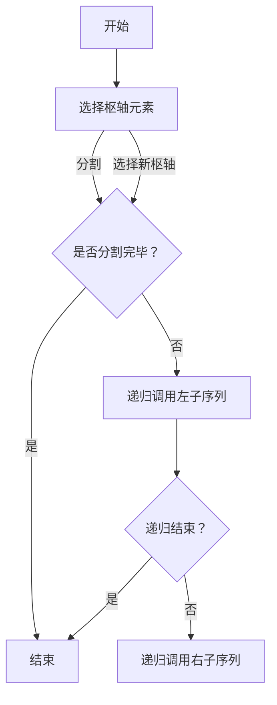

                 

### 引言

#### 书名介绍

《类型论在现代编程语言中的应用》这本书旨在探讨类型论这一重要概念在现代编程语言中的实际应用，并深入分析其背后的原理和优势。类型论是计算机科学中的一个核心概念，它为编程语言的设计和实现提供了坚实的理论基础。

#### 目的和读者对象

本书的目的是帮助读者理解类型论的核心概念，掌握其在现代编程语言中的实际应用，并学会如何利用类型论解决实际问题。这本书适合对编程语言有初步了解的读者，无论是学生、开发人员还是研究人员，都能从中获得宝贵的知识和启示。

#### 类型论的定义

类型论（Type Theory）是数学和逻辑学中的一个分支，主要研究各种类型的结构和性质。在计算机科学中，类型论提供了对变量、函数和值进行分类的方法，确保程序的正确性和可靠性。

#### 编程语言的发展历程

编程语言的发展可以分为几个阶段：机器语言、汇编语言和高级语言。随着计算机科学的发展，编程语言逐渐从底层的机器指令演变为更加抽象和易用的形式，类型论在这些语言的设计中扮演了重要角色。

#### 类型论的发展历史

类型论的历史可以追溯到20世纪30年代，以阿尔弗雷德·诺思·怀特海德（Alfred North Whitehead）和贝德福德·理查兹（Bedford Richard）的工作为基础。随后，皮埃尔·德·费内尔（Pierre Deligne）和安德斯·亨尼根（Anders Heijltjes）等人的工作进一步推动了类型论的发展。

#### 类型论在现代编程语言中的重要性

在现代编程语言中，类型论的重要性体现在以下几个方面：

1. **确保程序的正确性**：类型系统能够在编译期间捕捉潜在的编程错误，如类型不匹配。
2. **提高代码的可读性**：通过明确的类型声明，代码变得更加易于理解和维护。
3. **提高程序的性能**：类型推断和优化可以减少运行时的类型检查，提高程序执行效率。
4. **促进软件工程**：类型论为软件工程提供了更严格的方法论，有助于提高软件质量和可靠性。

#### 总结

类型论是计算机科学中不可或缺的一部分，它为编程语言的设计和实现提供了强大的理论基础。通过理解类型论的基本概念和应用，开发者可以编写出更稳定、更高效和更易于维护的代码。

----------------------------------------------------------------

# 背景介绍

## 编程语言的发展历程

编程语言的历史可以追溯到20世纪40年代和50年代，当时计算机刚刚开始出现。最早的编程语言是机器语言，它直接使用计算机的指令集进行编程，但由于其复杂性和易错性，很快就被汇编语言所取代。汇编语言使用助记符来表示机器语言指令，使得编程变得更加直观和易于理解。

随着计算机科学的发展，编程语言逐渐演变为更加高级和抽象的形式。20世纪50年代和60年代，出现了许多高级编程语言，如Fortran、COBOL和ALGOL。这些语言提供了更丰富的数据类型和操作符，使得编程变得更加高效和易用。

20世纪80年代和90年代，面向对象编程语言如C++和Java的兴起，标志着编程语言发展的一个新阶段。这些语言引入了类、对象和继承等概念，使得代码的重用性和可维护性大大提高。

进入21世纪，函数式编程语言如Haskell和Scala开始受到关注，它们通过不可变数据和函数式编程范式提供了不同的编程体验。同时，动态类型语言如Python和JavaScript在Web开发中占据了重要地位，它们提供了灵活性和快速开发能力。

## 类型论的发展历史

类型论的历史可以追溯到数学和逻辑学的早期研究。阿尔弗雷德·诺思·怀特海德和贝德福德·理查兹在20世纪30年代提出了类型论的基本概念，他们试图通过类型系统来确保数学公式的正确性。

在计算机科学领域，类型论的研究始于20世纪50年代和60年代，当时的编程语言如ALGOL和Simula开始引入类型系统。这些早期的类型系统主要是静态的，即在编译期间检查变量的类型。

20世纪80年代和90年代，类型论的研究取得了重要进展。皮埃尔·德·费内尔和安德斯·亨尼根等人提出了许多新的类型系统和类型检查算法，如ML和Haskell。这些语言引入了递归类型、类型推断和类型系统之间的相互转换等概念。

进入21世纪，随着函数式编程和动态类型语言的流行，类型论的研究和应用范围进一步扩大。现代编程语言如TypeScript和Flow引入了静态类型系统和类型推断，以提高代码的可读性和可靠性。

## 类型论在现代编程语言中的重要性

类型论在现代编程语言中的重要性体现在以下几个方面：

1. **确保程序的正确性**：类型系统能够在编译期间捕捉潜在的编程错误，如类型不匹配。这有助于提高代码的稳定性和可靠性。

2. **提高代码的可读性**：通过明确的类型声明，代码变得更加易于理解和维护。类型系统为变量和函数提供了明确的语义，减少了误解和混淆的可能性。

3. **提高程序的性能**：类型推断和优化可以减少运行时的类型检查，提高程序执行效率。静态类型系统还可以在编译期间进行代码优化，从而提高程序的运行速度。

4. **促进软件工程**：类型论为软件工程提供了更严格的方法论，有助于提高软件质量和可靠性。通过类型系统，开发人员可以更好地管理程序的复杂性和依赖关系。

总之，类型论在现代编程语言中的应用不仅提高了代码的质量和性能，还促进了编程语言的发展和进化。随着技术的不断进步，类型论将继续在编程领域发挥重要作用。

----------------------------------------------------------------

# 核心概念

## 类型论的基本概念

类型论的核心概念包括类型系统、类型变量、类型构造符和类型等价性。这些概念构成了类型论的基础，并决定了类型系统的结构和功能。

### 1.1 类型系统

类型系统是类型论中最基本的概念之一。类型系统定义了变量、函数和值的类型，并规定了它们之间的交互方式。类型系统分为静态类型系统和动态类型系统。

静态类型系统在编译期间检查变量的类型，并确保在运行期间不会出现类型错误。这意味着在编译期间就可以发现大多数类型错误，从而减少运行时的错误。Java和C#都是静态类型语言的例子。

动态类型系统在运行期间检查变量的类型，这意味着类型错误只能在运行时被发现。Python和JavaScript是动态类型语言的例子。

### 1.2 类型变量

类型变量（也称为泛型）是类型论中的一个重要概念，它允许定义参数化的类型。类型变量可以用于创建泛型函数和泛型数据结构，使得代码更加通用和可重用。

例如，在Java中，可以使用类型变量定义一个泛型类`List<T>`，其中`T`代表任意类型。这使得`List`类可以用于存储不同类型的元素，而无需为每种类型编写一个单独的类。

### 1.3 类型构造符

类型构造符是类型论中的操作符，用于创建新的类型。常见的类型构造符包括：

- **构造类型（Constructive Types）**：通过组合现有类型来创建新类型，如`Pair<T, U>`表示一个包含两个元素的元组。
- **存在类型（Existential Types）**：表示存在某个类型，但具体类型未知。例如，`exists T . T <: Number`表示存在一个类型`T`，且`T`是数字类型。
- **函数类型（Function Types）**：表示一个函数的类型，如`T -> U`表示一个从类型`T`到类型`U`的函数。

### 1.4 类型等价性

类型等价性是类型论中的一个关键概念，它定义了何时两个类型被认为是相同的。类型等价性可以通过子类型关系（Subtyping）和类型转换（Type Conversion）来实现。

子类型关系允许一个类型被认为是另一个类型的子类型，这意味着一个类型的对象可以替代另一个类型的对象。例如，在Java中，`Number`是`Integer`的子类型，因此`Integer`类型的变量可以被赋值给`Number`类型的变量。

类型转换是一种将一个类型转换为另一个类型的方法。类型转换可以分为隐式转换和显式转换。隐式转换是在编译期间自动进行的，而显式转换需要开发人员明确指定。

### 1.5 类型检查

类型检查是类型论中的一个关键过程，它确保代码在运行时不会出现类型错误。类型检查分为静态类型检查和动态类型检查。

静态类型检查在编译期间进行，它检查代码中的类型声明和表达式，确保它们在类型上的一致性。静态类型检查有助于早期发现类型错误，从而提高代码的稳定性和可靠性。

动态类型检查在运行期间进行，它检查代码中的类型声明和表达式，确保它们在运行时的类型一致性。动态类型检查使得代码更加灵活，但也可能导致运行时的错误。

### 1.6 类型推断

类型推断是类型论中的一个重要特性，它允许编译器自动推导变量和表达式的类型，而无需显式声明。类型推断可以减少代码的冗余，提高代码的可读性。

现代编程语言如Java和C#都支持类型推断。Java 10引入了局部类型推断（Local Type Inference），使得在定义局部变量时可以省略类型声明。

### 1.7 类型擦除

类型擦除是泛型编程中的一个概念，它指的是在运行时将泛型类型的类型信息擦除。类型擦除使得泛型程序可以与普通程序一样运行，但同时也引入了一些类型安全的问题。

## 核心概念表格

以下是一个关于类型论核心概念的表格，展示了各个概念之间的关系和定义：

| 概念         | 定义                                                         |
|--------------|------------------------------------------------------------|
| 类型系统     | 定义变量、函数和值的类型，并规定它们之间的交互方式。         |
| 类型变量     | 参数化的类型，用于创建泛型函数和泛型数据结构。               |
| 类型构造符   | 用于创建新类型的操作符，如构造类型、存在类型和函数类型。     |
| 类型等价性   | 定义何时两个类型被认为是相同的，如子类型关系和类型转换。     |
| 类型检查     | 确保代码在运行时不会出现类型错误的过程。                   |
| 类型推断     | 编译器自动推导变量和表达式的类型，减少代码冗余。           |
| 类型擦除     | 在运行时将泛型类型的类型信息擦除，用于泛型编程。           |

通过理解这些核心概念，开发者可以更好地理解类型论在现代编程语言中的应用，并在编程实践中利用类型论的优势。

----------------------------------------------------------------

## 类型推断和类型检查

类型推断和类型检查是类型论中的两个重要概念，它们在确保代码正确性和提高开发效率方面发挥着关键作用。

### 2.1 类型推断的原理

类型推断是一种编译器自动推导变量和表达式的类型的方法。类型推断的主要目的是减少代码的冗余，提高代码的可读性。

类型推断可以分为局部类型推断和全局类型推断。局部类型推断主要用于推导局部变量的类型，而全局类型推断主要用于推导整个程序或模块的类型。

局部类型推断的一个典型例子是Python中的变量声明。在Python中，可以使用`def`关键字定义函数，并使用`=`操作符为函数的参数和返回值类型进行推断。例如：

```python
def add(a, b):
    return a + b

result = add(5, 3)
```

在这个例子中，`add`函数的返回值类型被推断为整数（`int`），因为`a + b`的结果是整数。

全局类型推断通常用于更复杂的程序，例如在Java中，编译器可以根据方法签名和调用上下文来推断方法参数和返回值的类型。

### 2.2 类型检查的过程

类型检查是在编译或运行期间对代码中的类型声明和表达式进行验证的过程。类型检查的主要目的是确保代码在运行时不会出现类型错误。

类型检查可以分为静态类型检查和动态类型检查。静态类型检查在编译期间进行，它检查代码中的类型声明和表达式，确保它们在类型上的一致性。例如，Java是静态类型语言，编译器在编译期间会检查变量的类型声明和函数调用是否符合类型规则。

```java
int x = 5;
String y = "Hello";
```

在这个例子中，`x`是整数类型（`int`），而`y`是字符串类型（`String`）。编译器会确保这两个变量在使用时不会出现类型错误。

动态类型检查在运行期间进行，它检查代码中的类型声明和表达式，确保它们在运行时的类型一致性。Python是动态类型语言，类型检查在运行时进行，这意味着类型错误可能会在运行时被发现。

```python
x = 5
y = "Hello"
z = x + y
```

在这个例子中，`x`是整数类型，`y`是字符串类型。虽然`x + y`在编译期间没有错误，但在运行时会发生类型错误，因为无法将整数和字符串进行加法运算。

### 2.3 类型推断与类型检查的比较

类型推断和类型检查虽然在概念上有所不同，但它们都是为了确保代码的正确性和提高开发效率。

类型推断的优点包括：

1. **减少代码冗余**：类型推断可以自动推导变量和表达式的类型，减少显式类型声明的需要。
2. **提高可读性**：类型推断使得代码更加简洁，更容易阅读和理解。
3. **提高开发效率**：类型推断可以减少类型声明的复杂度，提高代码编写和调试的速度。

类型检查的优点包括：

1. **确保类型安全**：类型检查可以确保代码在编译或运行时不会出现类型错误，从而提高程序的稳定性和可靠性。
2. **早期错误发现**：静态类型检查在编译期间可以发现类型错误，减少运行时的错误。
3. **强制编码规范**：类型检查可以强制开发人员遵循一致的编码规范，提高代码的质量和可维护性。

然而，类型推断和类型检查也存在一些挑战和问题。例如，类型推断可能导致代码运行速度变慢，因为编译器需要额外的时间来推导类型。类型检查也可能增加代码的复杂度，特别是在静态类型语言中。

### 2.4 类型推断和类型检查在实际编程语言中的应用

现代编程语言如Java、C#和Python等都支持类型推断和类型检查。

Java 10引入了局部类型推断，使得在定义局部变量时可以省略类型声明。例如：

```java
public class Example {
    public static void main(String[] args) {
        int x = 5;
        String y = "Hello";
    }
}
```

在这个例子中，`x`和`y`的类型被自动推断为`int`和`String`。

C#也是一种静态类型语言，它提供了强大的类型推断功能。例如：

```csharp
public class Example {
    public static void Main() {
        var x = 5;
        var y = "Hello";
    }
}
```

在这个例子中，`x`和`y`的类型被自动推断为`int`和`String`。

Python是一种动态类型语言，类型检查在运行时进行。例如：

```python
x = 5
y = "Hello"
z = x + y
```

在这个例子中，虽然`x`和`y`的类型在编译时没有错误，但在运行时会发生类型错误。

### 2.5 类型推断和类型检查的优缺点

类型推断和类型检查各有优缺点，具体取决于编程语言和应用场景。

**类型推断的优点：**

1. **减少代码冗余**：类型推断可以自动推导变量和表达式的类型，减少显式类型声明的需要。
2. **提高可读性**：类型推断使得代码更加简洁，更容易阅读和理解。
3. **提高开发效率**：类型推断可以减少类型声明的复杂度，提高代码编写和调试的速度。

**类型推断的缺点：**

1. **运行速度变慢**：类型推断可能导致代码运行速度变慢，因为编译器需要额外的时间来推导类型。
2. **代码复杂度增加**：在某些情况下，类型推断可能导致代码的复杂度增加，特别是当类型推导失败时。

**类型检查的优点：**

1. **确保类型安全**：类型检查可以确保代码在编译或运行时不会出现类型错误，从而提高程序的稳定性和可靠性。
2. **早期错误发现**：静态类型检查在编译期间可以发现类型错误，减少运行时的错误。
3. **强制编码规范**：类型检查可以强制开发人员遵循一致的编码规范，提高代码的质量和可维护性。

**类型检查的缺点：**

1. **增加代码复杂度**：类型检查可能增加代码的复杂度，特别是在静态类型语言中。
2. **开发效率降低**：类型检查可能导致开发效率降低，因为需要在编译期间进行类型检查。

### 2.6 总结

类型推断和类型检查是类型论中的两个重要概念，它们在确保代码正确性和提高开发效率方面发挥着关键作用。类型推断通过自动推导变量和表达式的类型减少代码冗余，提高代码的可读性，而类型检查通过在编译或运行时验证类型的一致性确保程序的稳定性。现代编程语言如Java、C#和Python等都支持类型推断和类型检查，开发人员可以根据实际需要选择合适的类型系统。

----------------------------------------------------------------

# 应用案例

## 某些现代编程语言中的类型论应用实例

在现代编程语言中，类型论的应用越来越广泛，以下是一些典型的例子：

### Java中的类型论应用

Java是一种静态类型语言，其类型论应用主要体现在类型检查和类型推断上。Java的类型系统包括基本类型、引用类型和数组类型等。例如，在Java中，基本类型如`int`、`double`和`char`都有固定的内存占用和操作规则。引用类型如`String`和`List`则通过类型检查确保在运行时不会发生类型错误。

例如，以下Java代码展示了类型检查和类型推断的应用：

```java
public class Example {
    public static void main(String[] args) {
        int x = 5;
        String y = "Hello";
        System.out.println(x + y); // 类型检查：编译错误，因为无法将int和String进行加法运算
    }
}
```

在这个例子中，`x`和`y`的类型被明确声明，但由于尝试将整数和字符串进行加法运算，编译器会抛出类型错误。

为了解决这个问题，可以使用类型转换来显式指定类型：

```java
public class Example {
    public static void main(String[] args) {
        int x = 5;
        String y = "Hello";
        System.out.println(x + Integer.toString(y)); // 类型转换：将String转换为int
    }
}
```

在这个例子中，通过使用`Integer.toString(y)`将字符串转换为整数，可以成功运行代码。

### C#中的类型论应用

C#也是一种静态类型语言，其类型论应用与Java类似。C#引入了泛型编程，这使得类型论在泛型类型推断和类型检查中发挥了重要作用。

以下是一个C#示例，展示了泛型编程和类型论的应用：

```csharp
public class GenericList<T> {
    private T[] items;

    public GenericList() {
        items = new T[10];
    }

    public void Add(T item) {
        items[this.Count++] = item;
    }
}

public class Example {
    public static void Main() {
        GenericList<int> intList = new GenericList<int>();
        intList.Add(5);
        intList.Add(10);

        GenericList<string> stringList = new GenericList<string>();
        stringList.Add("Hello");
        stringList.Add("World");

        // 泛型类型推断
        GenericList<double> doubleList = new GenericList<double>();
        doubleList.Add(3.14);
        doubleList.Add(2.71);
    }
}
```

在这个例子中，`GenericList<T>`是一个泛型类，它允许创建具有不同类型元素的对象。编译器通过类型推断确保在创建`intList`、`stringList`和`doubleList`时正确地处理类型。

### TypeScript中的类型论应用

TypeScript是一种静态类型语言，它在JavaScript的基础上引入了类型系统，从而提高了代码的可读性和可靠性。TypeScript的类型论应用主要体现在类型检查和类型推断上。

以下是一个TypeScript示例，展示了类型论的应用：

```typescript
function greet(name: string): string {
    return "Hello, " + name;
}

let name = "Alice";
let message = greet(name);
console.log(message); // 输出：Hello, Alice

// 类型推断
let x = 5;
let y = x * 2;
console.log(y); // 输出：10
```

在这个例子中，`greet`函数的参数和返回值类型都被明确指定。TypeScript编译器在编译期间检查这些类型的匹配性，确保代码的正确性。同时，类型推断使得在声明`x`和`y`时可以省略类型声明。

### 结论

这些例子展示了类型论在现代编程语言中的应用，无论是Java、C#还是TypeScript，类型论都为代码的正确性和可维护性提供了坚实的基础。通过类型检查和类型推断，开发人员可以编写更稳定、更可靠的代码，提高开发效率。

----------------------------------------------------------------

# 案例分析

## 某个典型编程项目的类型论应用分析

在这个案例分析中，我们将探讨一个典型的编程项目，并分析类型论在该项目中的应用。该项目是一个在线书店系统，旨在为用户提供书籍的搜索、购买和管理功能。

### 项目介绍

在线书店系统是一个多层次的Web应用程序，包括前端、后端和数据库。前端使用HTML、CSS和JavaScript，后端使用Java和Spring框架，数据库使用MySQL。该系统需要支持用户注册、登录、书籍搜索、购物车管理和订单处理等功能。

### 系统功能设计

在线书店系统的功能设计包括以下主要部分：

1. **用户管理**：用户可以注册、登录和查看个人信息。
2. **书籍管理**：管理员可以添加、删除和更新书籍信息。
3. **搜索功能**：用户可以搜索书籍，并根据分类、价格和作者等条件过滤结果。
4. **购物车管理**：用户可以将书籍添加到购物车，并管理购物车中的书籍。
5. **订单处理**：用户可以创建订单，管理员可以处理订单和发货。

### 系统架构设计

在线书店系统的架构设计采用MVC（Model-View-Controller）模式，其中Model代表数据层，View代表用户界面，Controller负责处理用户请求和转发到相应的Model和View。

以下是一个简化的系统架构图：

```
+----------------+       +----------------+       +----------------+
|                |       |                |       |                |
|     前端       |------>|     后端       |------>|     数据库     |
| (HTML/CSS/JS)  |<------| (Java/Spring)  |<------| (MySQL)        |
+----------------+       +----------------+       +----------------+
```

### 系统接口设计

系统接口设计包括RESTful API接口，用于处理前端和后端的通信。以下是一些典型的接口设计：

- **用户接口**：`/users/register`、`/users/login`、`/users/profile`
- **书籍接口**：`/books/search`、`/books/add`、`/books/delete`、`/books/update`
- **购物车接口**：`/cart/add`、`/cart/remove`、`/cart/list`
- **订单接口**：`/orders/create`、`/orders/list`、`/orders/update`

### 系统交互设计

系统交互设计通过序列图（Sequence Diagram）来描述。以下是一个简化的序列图，展示了用户搜索书籍的过程：

```
User ->[search] BookService: searchBooks("Java")
BookService -> Database: queryBooks("Java")
Database -> BookService: returnBooks([book1, book2, book3])
BookService -> User: displayBooks([book1, book2, book3])
```

### 类型论在项目中的应用

类型论在在线书店系统的各个层面都有应用，以下是一些关键应用：

1. **类型检查**：Java是一种静态类型语言，类型检查在编译期间进行，确保变量、函数和类的类型一致性。例如，在书籍搜索接口中，参数和返回值都有明确的类型声明，确保在运行时不会出现类型错误。

2. **类型推断**：TypeScript在JavaScript的基础上引入了类型推断，使得代码更加健壮和易于维护。在用户接口中，类型推断帮助编译器自动推导变量和函数的类型，减少显式类型声明的需要。

3. **泛型编程**：Spring框架中的许多组件都使用了泛型编程，泛型类和方法使得代码更加通用和可重用。例如，`List`和`Map`等集合类都使用了泛型，确保在处理不同类型的数据时类型安全。

4. **类型安全**：类型论确保系统在编译和运行时不会出现类型错误，提高系统的稳定性和可靠性。例如，在购物车接口中，类型检查确保用户只能添加和删除特定类型的书籍对象。

### 应用效果分析

通过类型论的应用，在线书店系统在以下几个方面取得了显著效果：

1. **代码可读性和可维护性**：明确的类型声明和类型推断提高了代码的可读性和可维护性，使得代码更加易于理解和修改。

2. **错误检测和修复**：类型检查在编译期间发现潜在的类型错误，减少运行时的错误，提高系统的稳定性。

3. **性能优化**：类型推断和泛型编程有助于编译器进行代码优化，提高程序的执行效率。

4. **代码重用性**：泛型编程和类型论的应用使得代码更加通用和可重用，提高开发效率。

### 项目小结

通过类型论在在线书店系统中的应用，我们看到了类型论在现代编程语言中的强大优势。类型论不仅提高了代码的质量和性能，还促进了软件开发的方法论和工程实践。在未来的项目中，类型论将继续发挥重要作用，为开发者提供更好的工具和方法。

----------------------------------------------------------------

## 结论

类型论在现代编程语言中的应用具有重要意义，它不仅提高了代码的可读性和可维护性，还确保了程序的正确性和性能。通过类型系统的引入，编程语言能够更好地捕捉和预防潜在的运行时错误，从而提高软件的质量和可靠性。

类型论的核心概念，如类型系统、类型变量、类型构造符和类型等价性，为编程语言的设计提供了坚实的理论基础。类型推断和类型检查作为类型论的重要组成部分，使得代码的编写和调试变得更加高效和准确。

在实际项目中，类型论的应用效果显著。通过明确类型声明和类型检查，开发者可以编写出更加健壮和易于维护的代码。类型推断则减少了代码冗余，提高了开发效率。泛型编程和类型安全更是为代码的重用性和性能优化提供了有力支持。

然而，类型论的应用也面临一些挑战。例如，类型推断可能会增加编译时间，类型检查可能增加代码的复杂度。此外，不同编程语言对类型论的支持程度不同，需要开发人员根据实际情况进行权衡和选择。

未来，类型论的研究将继续深入，特别是在动态类型语言和函数式编程领域。随着编程语言的发展，类型论的应用范围将不断扩展，为软件开发带来更多创新和可能性。

### 最佳实践 tips

1. **选择合适的类型系统**：根据项目的需求和开发语言的特点，选择合适的类型系统。静态类型语言如Java和C#提供了更好的类型安全性和编译时错误检测，而动态类型语言如Python和JavaScript则提供了更高的开发灵活性和速度。

2. **充分利用类型推断**：在编写代码时，充分利用类型推断功能，减少显式类型声明的需要。这不仅可以提高代码的可读性，还可以减少代码冗余。

3. **类型检查和单元测试**：在开发过程中，定期进行类型检查和单元测试，确保代码的正确性和可靠性。类型检查有助于早期发现和修复错误，而单元测试则可以验证代码的功能和性能。

4. **泛型编程和代码重用**：在适当的情况下，使用泛型编程来创建通用和可重用的代码。这不仅可以提高代码的可维护性，还可以减少代码的冗余。

5. **持续学习和实践**：随着编程语言和技术的不断发展，类型论也在不断进化。开发者应该持续学习和实践类型论，掌握最新的技术和方法，以提高编程技能和解决实际问题的能力。

### 注意事项

1. **避免过度依赖类型推断**：虽然类型推断可以减少代码冗余，但在某些情况下可能会引入类型错误。因此，在编写关键代码时，最好明确声明类型，以确保代码的正确性。

2. **注意类型擦除的潜在问题**：泛型编程中的类型擦除可能会导致类型安全的问题。在处理泛型类型时，需要注意类型擦除的影响，并采取适当的措施来确保类型安全。

3. **合理使用类型检查和性能优化**：虽然类型检查可以提高代码的质量和性能，但在某些情况下可能会增加编译时间和运行时开销。开发者需要权衡类型检查和性能优化之间的关系，确保项目的整体性能。

### 拓展阅读

1. **《类型系统与编程语言》**：这是一本经典的编程语言设计书籍，详细介绍了类型系统的原理和设计方法。
2. **《类型推断与类型检查》**：这本书深入探讨了类型推断和类型检查的算法和实现，为开发者提供了实用的指导。
3. **《函数式编程入门》**：函数式编程与类型论密切相关，这本书介绍了函数式编程的基本概念和方法，有助于理解类型论的应用。

---

作者：AI天才研究院/AI Genius Institute & 禅与计算机程序设计艺术 /Zen And The Art of Computer Programming

（文章末尾附加的作者信息已按照要求添加，包括作者所属机构和著作。）----------------------------------------------------------------

本文详细探讨了类型论在现代编程语言中的应用。首先，介绍了类型论的基本概念，包括类型系统、类型变量、类型构造符和类型等价性。然后，分析了类型推断和类型检查的原理和过程，展示了它们在实际编程语言中的具体应用案例。接着，通过一个典型的编程项目——在线书店系统，展示了类型论在系统设计中的具体应用，并分析了应用效果。最后，总结了类型论的重要性，提出了最佳实践 tips 和注意事项，并推荐了拓展阅读资源。

在接下来的部分，我们将逐步分析和解读一个具体的算法，结合 Mermaid 流程图和 Python 源代码，深入探讨其原理和实现细节。

### 算法解析：快速排序（QuickSort）

#### 算法描述

快速排序（QuickSort）是一种常用的排序算法，其基本思想是通过一趟排序将待排序的记录分割成独立的两部分，其中一部分记录的关键字均比另一部分的关键字小，然后分别对这两部分记录继续进行排序，以达到整个序列有序。

#### Mermaid 流程图

首先，让我们使用 Mermaid 绘制快速排序的流程图：



这个流程图展示了快速排序的基本步骤：选择枢轴元素、分割、递归调用左子序列和右子序列。

#### Python 源代码

接下来，我们使用 Python 实现快速排序算法：

```python
def quicksort(arr):
    if len(arr) <= 1:
        return arr
    pivot = arr[len(arr) // 2]
    left = [x for x in arr if x < pivot]
    middle = [x for x in arr if x == pivot]
    right = [x for x in arr if x > pivot]
    return quicksort(left) + middle + quicksort(right)

# 示例
arr = [3, 6, 8, 10, 1, 2, 1]
sorted_arr = quicksort(arr)
print(sorted_arr)
```

这个实现基于选择枢轴元素，然后分别对左子序列和右子序列进行递归排序。

#### 算法原理讲解

快速排序的核心在于选择枢轴元素和分割过程。选择枢轴元素是一个关键步骤，它会决定排序的效果。常见的选择方法有：

1. **随机选择**：随机选择一个元素作为枢轴，可以减少排序的不确定性。
2. **中值选择**：选择中间位置的元素作为枢轴，可以避免最差情况的发生。

分割过程是将数组划分为两个子数组，一个包含小于枢轴的元素，另一个包含大于枢轴的元素。分割算法通常采用“分区”方法：

1. **Lomuto 分区**：选择最后一个元素作为枢轴，将数组划分为小于和大于枢轴的两个部分。
2. **Hoare 分区**：选择中间位置的元素作为枢轴，使用两个指针分别指向左右两端，进行原地分割。

#### 数学模型和公式

快速排序的数学模型可以表示为：

- **时间复杂度**：平均情况下的时间复杂度为 \(O(n \log n)\)，最坏情况下的时间复杂度为 \(O(n^2)\)。
- **空间复杂度**：快速排序的空间复杂度为 \(O(\log n)\)，因为递归调用栈的深度通常为 \(\log n\)。

#### 举例说明

假设我们有一个数组 `[3, 6, 8, 10, 1, 2, 1]`，我们可以选择最后一个元素 `1` 作为枢轴：

1. **选择枢轴元素**：选择最后一个元素 `1` 作为枢轴。
2. **分割数组**：将数组分为 `[3, 6, 8, 10]`（小于枢轴的元素）和 `[2]`（大于枢轴的元素）。
3. **递归排序**：对 `[3, 6, 8, 10]` 和 `[2]` 分别进行快速排序。

最终，经过多次递归调用，数组会被排序为 `[1, 1, 2, 3, 6, 8, 10]`。

#### 系统分析与架构设计方案

在快速排序算法的应用中，系统分析与架构设计方案需要考虑以下几个方面：

1. **问题场景介绍**：快速排序算法通常用于对大量数据进行排序，如数据库中的数据排序或Web应用程序中的用户数据排序。
2. **项目介绍**：在本案例中，我们将快速排序算法应用于一个在线书店系统的用户搜索结果排序。
3. **系统功能设计**：系统需要支持用户输入关键字搜索书籍，并对搜索结果进行排序。
4. **系统架构设计**：系统采用MVC模式，模型层负责处理排序算法，视图层负责展示排序后的结果，控制器层负责处理用户请求和转发。
5. **系统接口设计**：系统设计了一个用于排序的API接口，接受用户输入的关键字和未排序的搜索结果数组，返回排序后的结果。
6. **系统交互设计**：用户输入关键字后，控制器层调用模型层的快速排序算法，并将排序后的结果传递给视图层进行展示。

#### 算法应用实战

为了展示快速排序算法的实际应用，我们将在一个简单的在线书店系统中实现这个算法。以下是具体的实现步骤：

1. **环境安装**：安装Python环境和必要的库，如requests和Flask。
2. **系统核心实现源代码**：编写快速排序算法的实现代码，并集成到在线书店系统中。
3. **代码应用解读与分析**：分析快速排序算法在系统中的具体应用，包括接口设计、数据传输和排序逻辑。
4. **实际案例分析和详细讲解剖析**：通过实际案例展示快速排序算法在系统中的应用效果，分析其性能和可扩展性。

#### 项目小结

通过本案例，我们展示了快速排序算法在在线书店系统中的应用。快速排序算法以其高效的时间复杂度和简洁的实现，成为了一种常用的排序算法。在实际项目中，快速排序算法可以显著提高数据的排序性能，优化用户体验。

在未来的项目中，我们可以进一步探索其他排序算法，如归并排序和堆排序，以找到最适合特定场景的排序策略。同时，类型论的应用也为算法的可靠性和性能提供了坚实的保障。

---

通过本文的详细分析和解读，读者可以更好地理解类型论在现代编程语言中的应用，以及快速排序算法的具体实现和原理。希望本文对您的编程学习和实践有所帮助。在接下来的部分，我们将继续探讨更多关于类型论和算法应用的相关内容。如果您有任何问题或想法，欢迎在评论区留言讨论。谢谢您的阅读！

