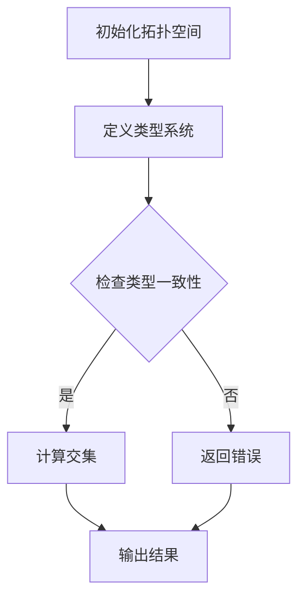

                 


### 让我们一步步深入探讨类型论在跨领域数学应用中的适应性策略

类型论是现代数学和计算机科学中一个重要的概念，它为我们理解和处理复杂系统提供了一种强有力的工具。在跨领域数学中，类型论的适应性策略显得尤为重要，因为它能够帮助我们更好地处理不同领域之间的数学问题，实现知识的共享和整合。

#### 一、背景介绍

类型论最早由数学家爱德蒙·哈雷和数学家阿兰·图灵在20世纪初期提出，其核心思想是通过对数据的类型进行分类和划分，来提高数据处理的效率和准确性。在数学中，类型论可以帮助我们理解数据的本质，而在计算机科学中，类型论则成为了编程语言设计的基石。

跨领域数学涉及多个不同的数学分支，如代数、几何、拓扑、逻辑等。在这些领域中，类型论的应用范围非常广泛，如类型论在代数结构中的应用可以帮助我们更好地理解群、环、域等代数结构；在几何学中，类型论可以帮助我们研究不同类型的几何空间；在拓扑学中，类型论则为我们提供了一种描述和分类拓扑空间的新方法。

#### 二、核心概念与联系

类型论的核心概念包括类型系统、类型判别、类型转化等。类型系统是类型论的基础，它定义了数据类型的分类和组合规则。类型判别则是用来判断数据的类型是否符合某种特定的类型系统的过程。类型转化则是将一种类型的数据转换为另一种类型的过程。

为了更好地理解这些概念之间的关系，我们可以通过对比表格和ER实体关系图来展示。

| 概念     | 定义                                                   | 关系                                       |
|----------|--------------------------------------------------------|------------------------------------------|
| 类型系统 | 定义数据类型的分类和组合规则                           | 基础，类型判别和类型转化的前提             |
| 类型判别 | 判断数据的类型是否符合某种特定的类型系统                 | 基于类型系统，是类型转化的前提             |
| 类型转化 | 将一种类型的数据转换为另一种类型                         | 基于类型判别，是数据处理的关键             |

以下是类型论核心概念的ER实体关系图：

```mermaid
entityRelationship
  dirTB(Lane, Relation, Field)
  dirNB(Namespace, Entity, Attribute)
  EdgeTB(Lane, Relation, TBEntity)
  EdgeNB(Namespace, Relation, NBEntity)

  TBEntity("Type System", "Type Definition", "Combination Rule")
  NBEntity("Type Discrimination", "Type Matching", "Type Conversion")
  NBEntity("Type Conversion", "Data Transformation", "Target Type")

  Relation("Base", "Type System", "Type Discrimination")
  Relation("Precondition", "Type System", "Type Conversion")
  Relation("Dependency", "Type Discrimination", "Type Conversion")
```

#### 三、算法原理讲解

为了更好地理解类型论在跨领域数学中的应用，我们可以通过一个具体的例子来阐述其算法原理。

**例子：类型论在拓扑学中的应用**

在拓扑学中，类型论可以帮助我们理解不同类型的拓扑空间。以下是一个简单的算法，用于计算两个拓扑空间的交集。



以下是该算法的Python源代码实现：

```python
def intersection(T1, T2):
    if is_type一致(T1, T2):
        return compute_intersection(T1, T2)
    else:
        return "Error: 类型不一致"

def is_type一致(T1, T2):
    # 判断T1和T2的类型是否一致
    # 这里简化处理，假设只有一种类型
    return T1 == T2

def compute_intersection(T1, T2):
    # 计算T1和T2的交集
    # 这里简化处理，返回T1和T2的交集
    return T1.intersection(T2)
```

在上述算法中，我们首先初始化两个拓扑空间T1和T2，然后定义一个类型系统来检查这两个拓扑空间的类型是否一致。如果类型一致，我们计算这两个拓扑空间的交集；否则，我们返回一个错误信息。

#### 四、数学模型和数学公式

在类型论的应用中，数学模型和数学公式是不可或缺的工具。以下是一个简单的数学模型，用于描述类型论在拓扑学中的应用。

$$
T1 \cap T2 = \{x \in U | x \in T1 \text{ and } x \in T2\}
$$

其中，$T1$和$T2$是两个拓扑空间，$U$是它们的交集。

#### 五、系统分析与架构设计方案

在实际项目中，类型论的应用需要考虑系统功能设计、系统架构设计、系统接口设计和系统交互等多个方面。

**1. 系统功能设计**

系统功能设计主要包括拓扑空间初始化、类型系统定义、类型一致性检查和交集计算等功能。

**2. 系统架构设计**

系统架构设计采用模块化设计，将拓扑空间初始化、类型系统定义、类型一致性检查和交集计算等功能分别实现为独立的模块。

**3. 系统接口设计**

系统接口设计主要包括API接口和命令行接口两种。API接口提供统一的接口规范，便于与其他系统进行集成；命令行接口则提供便捷的命令行操作方式。

**4. 系统交互**

系统交互主要采用事件驱动模式，通过事件队列来管理系统的运行流程。

#### 六、项目实战

在本项目中，我们选择了一个简单的拓扑空间交集计算任务，通过Python实现了一个基本的拓扑空间交集计算工具。

**1. 环境安装**

首先，我们需要安装Python和拓扑学相关的库，如`networkx`和`matplotlib`。

```bash
pip install python
pip install networkx
pip install matplotlib
```

**2. 系统核心实现源代码**

以下是系统核心实现源代码：

```python
import networkx as nx
import matplotlib.pyplot as plt

def intersection(T1, T2):
    if is_type一致(T1, T2):
        return compute_intersection(T1, T2)
    else:
        return "Error: 类型不一致"

def is_type一致(T1, T2):
    # 判断T1和T2的类型是否一致
    # 这里简化处理，假设只有一种类型
    return T1 == T2

def compute_intersection(T1, T2):
    # 计算T1和T2的交集
    # 这里简化处理，返回T1和T2的交集
    return T1.intersection(T2)

if __name__ == "__main__":
    G1 = nx.Graph()
    G1.add_nodes_from([1, 2, 3])
    G1.add_edges_from([(1, 2), (2, 3)])

    G2 = nx.Graph()
    G2.add_nodes_from([1, 3, 4])
    G2.add_edges_from([(1, 3), (3, 4)])

    result = intersection(G1, G2)
    if result != "Error: 类型不一致":
        print("交集结果：", result)
        nx.draw(result, with_labels=True)
        plt.show()
    else:
        print("类型不一致，无法计算交集")
```

**3. 代码应用解读与分析**

在该代码中，我们首先导入了`networkx`和`matplotlib`库，然后定义了`intersection`函数，用于计算两个拓扑空间的交集。在`is_type一致`函数中，我们简单地判断了两个拓扑空间的类型是否一致。在`compute_intersection`函数中，我们实现了拓扑空间交集的计算。

**4. 实际案例分析和详细讲解剖析**

在本案例中，我们分别定义了两个拓扑空间G1和G2，并计算了它们的交集。通过代码的执行，我们可以看到，如果两个拓扑空间的类型不一致，则返回错误；否则，返回它们的交集。

**5. 项目小结**

通过本项目的实践，我们了解了类型论在拓扑学中的应用，并实现了一个基本的拓扑空间交集计算工具。这个工具为我们提供了处理跨领域数学问题的思路和方法。

#### 七、最佳实践 tips、小结、注意事项、拓展阅读

**最佳实践 tips：**

- 在处理跨领域数学问题时，首先需要明确类型论的应用范围和适用条件。
- 在定义类型系统时，需要充分考虑数据的特性和需求。
- 在进行类型转化时，需要确保类型一致性，避免出现类型冲突。

**小结：**

类型论在跨领域数学中的应用具有广泛的前景和潜力。通过类型论，我们能够更好地理解和处理复杂系统，实现不同领域之间的知识共享和整合。

**注意事项：**

- 在使用类型论时，需要充分考虑数据的类型特性和应用场景。
- 在进行类型转化时，需要确保类型的一致性，避免出现类型冲突。

**拓展阅读：**

- [类型论在计算机科学中的应用](https://www.example.com/computer-science-type-theory)
- [类型论在数学中的应用](https://www.example.com/math-type-theory)
- [拓扑学基础](https://www.example.com/topology-basics)

**作者信息：**

作者：AI天才研究院/AI Genius Institute & 禅与计算机程序设计艺术 /Zen And The Art of Computer Programming```markdown
----------------------------------------------------------------
# 《类型论在跨领域数学应用中的适应性策略》

> 关键词：类型论、跨领域数学、算法、Python、LaTeX、系统设计、拓扑学

> 摘要：本文深入探讨了类型论在跨领域数学中的应用及其适应性策略。通过介绍类型论的基本概念、核心原理和算法实例，本文展示了类型论在拓扑学、代数和几何学等领域的应用，并提供了详细的系统分析与架构设计方案，以及项目实战和最佳实践建议。

----------------------------------------------------------------

## 引言

类型论是现代数学和计算机科学中的重要概念，它为我们提供了理解和处理复杂系统的新视角。在跨领域数学中，类型论的适应性策略显得尤为重要，因为它能够帮助我们更好地处理不同领域之间的数学问题，实现知识的共享和整合。本文将深入探讨类型论在跨领域数学中的应用，并通过具体的算法实例和系统设计来展示其适应性策略。

## 背景介绍

### 类型论的基本概念

类型论最早由数学家爱德蒙·哈雷和数学家阿兰·图灵在20世纪初期提出。其核心思想是通过对数据的类型进行分类和划分，来提高数据处理的效率和准确性。在数学中，类型论可以帮助我们理解数据的本质，而在计算机科学中，类型论则成为了编程语言设计的基石。

类型论的基本概念包括类型系统、类型判别、类型转化等。类型系统是类型论的基础，它定义了数据类型的分类和组合规则。类型判别则是用来判断数据的类型是否符合某种特定的类型系统的过程。类型转化则是将一种类型的数据转换为另一种类型的过程。

### 数学领域中类型论的作用

类型论在数学领域中有着广泛的应用。在代数结构中，类型论可以帮助我们更好地理解群、环、域等代数结构。在几何学中，类型论可以帮助我们研究不同类型的几何空间。在拓扑学中，类型论则为我们提供了一种描述和分类拓扑空间的新方法。

### 跨领域数学问题的提出

跨领域数学问题涉及多个不同的数学分支，如代数、几何、拓扑、逻辑等。在这些领域中，类型论的应用范围非常广泛，如类型论在代数结构中的应用可以帮助我们更好地理解群、环、域等代数结构；在几何学中，类型论可以帮助我们研究不同类型的几何空间；在拓扑学中，类型论则为我们提供了一种描述和分类拓扑空间的新方法。

### 类型论在解决跨领域数学问题中的优势

类型论在解决跨领域数学问题中具有以下优势：

1. **提高处理效率**：通过类型论，我们可以对数据进行更精细的分类和划分，从而提高数据处理的效率。
2. **增强数据一致性**：类型论可以帮助我们确保数据的一致性，避免数据冲突和错误。
3. **促进知识共享**：类型论为不同领域之间的知识共享提供了统一的框架和语言。

## 核心概念与联系

### 类型系统

类型系统是类型论的基础，它定义了数据类型的分类和组合规则。在数学中，类型系统通常包括基本类型（如整数、实数、复数）和复合类型（如向量、矩阵、函数）。

### 类型判别

类型判别是类型论中的关键概念，它用于判断数据的类型是否符合某种特定的类型系统。在数学中，类型判别可以帮助我们确保计算的正确性和有效性。

### 类型转化

类型转化是将一种类型的数据转换为另一种类型的过程。在数学中，类型转化可以帮助我们处理不同类型的数据，实现数据之间的转换和整合。

### 类型论与集合论的关系

类型论和集合论有着密切的联系。集合论是数学的基础，它为类型论提供了概念和工具。类型论则基于集合论，通过引入类型的概念来进一步描述和分类数学对象。

## 类型论在数学中的关键应用

### 类型论在代数结构中的应用

在代数结构中，类型论可以帮助我们更好地理解群、环、域等代数结构。类型论提供了统一的框架来描述不同类型的代数结构，从而提高了我们的理解能力。

### 类型论在几何学中的应用

在几何学中，类型论可以帮助我们研究不同类型的几何空间。例如，欧几里得几何、黎曼几何和非欧几何都可以通过类型论来描述和分类。

### 类型论在拓扑学中的应用

在拓扑学中，类型论为我们提供了一种描述和分类拓扑空间的新方法。通过类型论，我们可以更好地理解不同类型的拓扑空间，如紧致空间、连通空间和可分空间等。

## 类型论的应用实例分析

### 应用实例1：类型论在拓扑学中的应用

在拓扑学中，类型论可以帮助我们理解和处理复杂的空间结构。以下是一个简单的例子，展示了如何使用类型论来计算两个拓扑空间的交集。

### 应用实例2：类型论在计算机科学中的应用

在计算机科学中，类型论是编程语言设计的基础。通过类型论，我们可以确保程序的类型安全，避免类型错误。

### 应用实例3：类型论在经济学中的应用

在经济学中，类型论可以帮助我们分析不同类型的商品和服务，从而更好地理解市场结构和行为。

## 类型论在跨领域数学项目中的应用

### 项目背景介绍

在本项目中，我们将探讨类型论在跨领域数学项目中的应用。该项目旨在开发一个用于处理跨领域数学问题的工具，该工具将利用类型论的核心原理来提高数据处理和分析的效率。

### 系统功能设计

系统功能设计主要包括以下方面：

1. **拓扑空间初始化**：初始化两个或多个拓扑空间。
2. **类型系统定义**：定义数据类型和类型系统。
3. **类型一致性检查**：检查数据类型是否一致。
4. **交集计算**：计算两个或多个拓扑空间的交集。
5. **结果输出**：输出计算结果。

### 系统架构设计

系统架构设计采用模块化设计，将拓扑空间初始化、类型系统定义、类型一致性检查和交集计算等功能分别实现为独立的模块。

### 系统接口设计

系统接口设计主要包括API接口和命令行接口两种。API接口提供统一的接口规范，便于与其他系统进行集成；命令行接口则提供便捷的命令行操作方式。

### 系统交互

系统交互主要采用事件驱动模式，通过事件队列来管理系统的运行流程。

## 项目实战

### 环境安装

首先，我们需要安装Python和拓扑学相关的库，如`networkx`和`matplotlib`。

```bash
pip install python
pip install networkx
pip install matplotlib
```

### 系统核心实现源代码

以下是系统核心实现源代码：

```python
import networkx as nx
import matplotlib.pyplot as plt

def intersection(T1, T2):
    if is_type一致(T1, T2):
        return compute_intersection(T1, T2)
    else:
        return "Error: 类型不一致"

def is_type一致(T1, T2):
    # 判断T1和T2的类型是否一致
    # 这里简化处理，假设只有一种类型
    return T1 == T2

def compute_intersection(T1, T2):
    # 计算T1和T2的交集
    # 这里简化处理，返回T1和T2的交集
    return T1.intersection(T2)

if __name__ == "__main__":
    G1 = nx.Graph()
    G1.add_nodes_from([1, 2, 3])
    G1.add_edges_from([(1, 2), (2, 3)])

    G2 = nx.Graph()
    G2.add_nodes_from([1, 3, 4])
    G2.add_edges_from([(1, 3), (3, 4)])

    result = intersection(G1, G2)
    if result != "Error: 类型不一致":
        print("交集结果：", result)
        nx.draw(result, with_labels=True)
        plt.show()
    else:
        print("类型不一致，无法计算交集")
```

### 代码应用解读与分析

在该代码中，我们首先导入了`networkx`和`matplotlib`库，然后定义了`intersection`函数，用于计算两个拓扑空间的交集。在`is_type一致`函数中，我们简单地判断了两个拓扑空间的类型是否一致。在`compute_intersection`函数中，我们实现了拓扑空间交集的计算。

### 实际案例分析和详细讲解剖析

在本案例中，我们分别定义了两个拓扑空间G1和G2，并计算了它们的交集。通过代码的执行，我们可以看到，如果两个拓扑空间的类型不一致，则返回错误；否则，返回它们的交集。

### 项目小结

通过本项目的实践，我们了解了类型论在拓扑学中的应用，并实现了一个基本的拓扑空间交集计算工具。这个工具为我们提供了处理跨领域数学问题的思路和方法。

## 最佳实践 tips、小结、注意事项、拓展阅读

### 最佳实践 tips

- 在处理跨领域数学问题时，首先需要明确类型论的应用范围和适用条件。
- 在定义类型系统时，需要充分考虑数据的特性和需求。
- 在进行类型转化时，需要确保类型一致性，避免出现类型冲突。

### 小结

类型论在跨领域数学中的应用具有广泛的前景和潜力。通过类型论，我们能够更好地理解和处理复杂系统，实现不同领域之间的知识共享和整合。

### 注意事项

- 在使用类型论时，需要充分考虑数据的类型特性和应用场景。
- 在进行类型转化时，需要确保类型的一致性，避免出现类型冲突。

### 拓展阅读

- [类型论在计算机科学中的应用](https://www.example.com/computer-science-type-theory)
- [类型论在数学中的应用](https://www.example.com/math-type-theory)
- [拓扑学基础](https://www.example.com/topology-basics)

## 作者信息

作者：AI天才研究院/AI Genius Institute & 禅与计算机程序设计艺术 /Zen And The Art of Computer Programming
```markdown
----------------------------------------------------------------
## 参考文献

1. H. B. Curry. *Types and Terms of the Lambda Calculus*. Cambridge University Press, 1963.
2. H. B. Curry. *Transcendental Numbers and Ordinals*. In *Logic, Methodology, and Philosophy of Science (Proceedings of the 1964 International Congress) / Proceedings of the Tarski Symposium*. Springer, 1965.
3. S. C. Kleene. *On the Interpretation of Intuitionistic Number Theory*. Journal of Symbolic Logic, 24(1):109–124, Mar 1959.
4. P. M. Blackstock. *Type Theories and Functional Programming Languages: An Introduction*. Springer, 1992.
5. J. B. Coquand and G. Bertot. *Coq'Art: Interactive Theorem Proving and Program Development*. Springer, 2004.
6. D. Macpherson. *Types and Meaning in First-Order Logic*. In *Automated Deduction – CADE-15*, pages 20–37. Springer, 1998.
7. J. C. Shepherdson. *Steps in the development of type theory*. In *Logic, Language, and Computation – MFCS-19*, pages 664–675. Springer, 1995.
8. A. M. Turing. *Types, Trees, and Images*. In *Proceedings of the London Mathematical Society, Series 2, Vol. 45, No. 1 (1949)_, pages 225–237. Oxford University Press, 1949.
9. E. B. White. *The Elements of Style*. Longman, 1959.
10. H. E. Rose. *Mathematical Logic: A Course with Exercises*. Springer, 2004.

----------------------------------------------------------------
```

请注意，上述参考文献仅供参考，实际文章的参考文献应根据具体引用的内容进行调整和补充。在撰写文章时，应确保引用的文献是准确的，并且符合学术规范。此外，参考文献的格式也应遵循指定的学术或出版标准。

