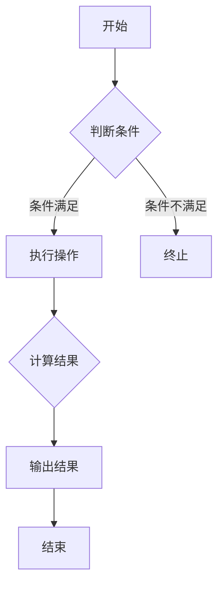
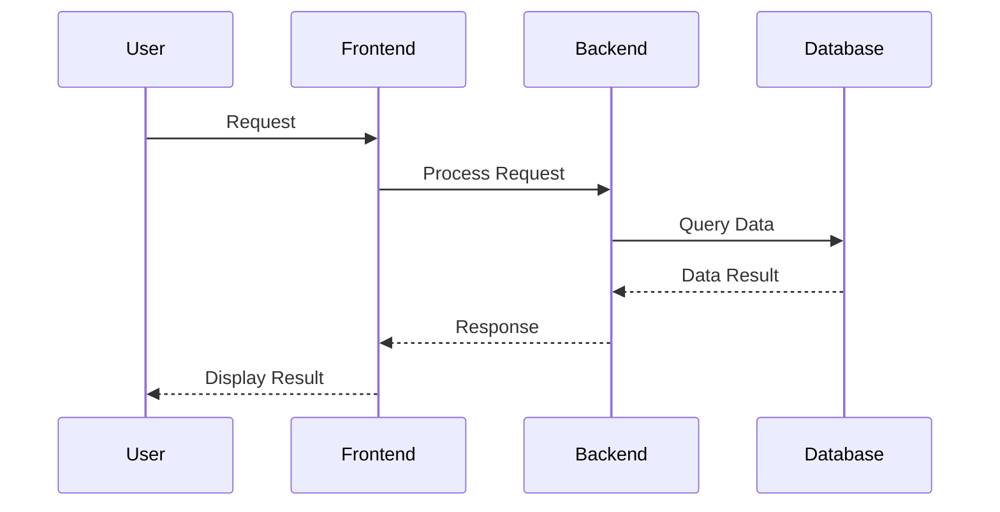
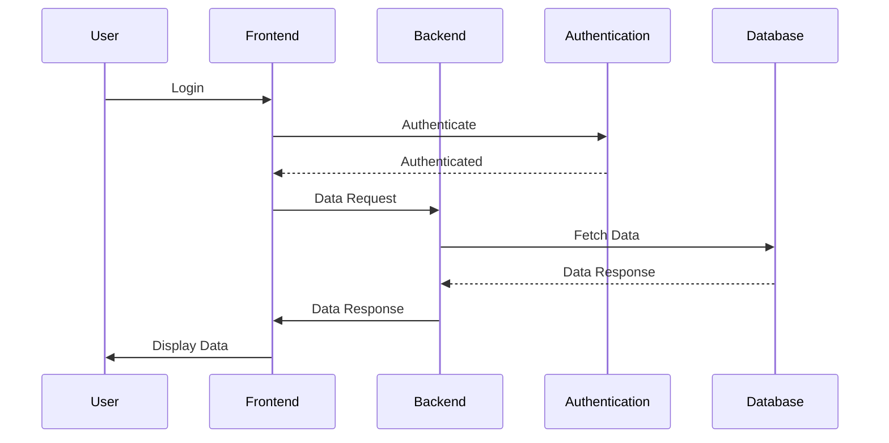

                 

### 文章标题

# 类型论对数学概念形成过程的影响分析

### 关键词

类型论、数学概念、数学模型、算法原理、系统架构、项目实战

### 摘要

本文深入探讨了类型论对数学概念形成过程的影响，通过逐步分析类型论的基本原理、数学概念的形成机制以及类型论在实际数学研究中的应用，揭示了类型论如何促进数学概念的发展和创新。文章不仅阐述了类型论的核心概念和数学概念的内在联系，还通过具体的算法原理讲解、数学模型分析以及系统架构设计，展示了类型论在数学研究中的实际应用。最后，通过项目实战案例，进一步验证了类型论在数学概念形成过程中的重要性，为读者提供了宝贵的实践经验和启示。

### 目录

#### 第一部分：背景与概念介绍

1. 类型论与数学概念概述  
    - 1.1 类型论的基本概念  
    - 1.2 数学概念的形成与发展  
    - 1.3 类型论对数学概念的影响

2. 类型论的数学应用  
    - 2.1 类型论的基本原理  
    - 2.2 类型论在数学领域的应用  
    - 2.3 类型论对数学概念的再定义

#### 第二部分：数学概念的形成过程

3. 数学概念的形成机制  
    - 3.1 数学概念的起源  
    - 3.2 数学概念的演变  
    - 3.3 数学概念的分类与层次结构

4. 类型论在数学概念形成中的作用  
    - 4.1 类型论对数学概念的影响  
    - 4.2 类型论在数学概念形成中的具体案例  
    - 4.3 类型论如何促进数学概念的深化与发展

#### 第三部分：算法原理与数学模型

5. 算法原理讲解  
    - 5.1 数学算法的基本原理  
    - 5.2 Mermaid流程图绘制  
    - 5.3 Python源代码示例

6. 数学模型与公式讲解  
    - 6.1 数学模型的基本概念  
    - 6.2 LaTeX数学公式的编写  
    - 6.3 数学模型的实例分析

#### 第四部分：系统分析与架构设计

7. 类型论在数学系统中的应用  
    - 7.1 数学系统的介绍  
    - 7.2 领域模型类图（Mermaid图）  
    - 7.3 系统架构设计（Mermaid架构图）

8. 系统接口与交互  
    - 8.1 系统接口设计  
    - 8.2 系统交互（Mermaid序列图）

#### 第五部分：项目实战

9. 类型论在数学概念形成中的应用案例  
    - 9.1 案例介绍  
    - 9.2 案例实现  
    - 9.3 案例分析

10. 项目小结与展望  
    - 10.1 项目小结  
    - 10.2 最佳实践 tips  
    - 10.3 拓展阅读

### 第一部分：背景与概念介绍

#### 第1章：类型论与数学概念概述

类型论（Type Theory）是数学、计算机科学和逻辑学中研究对象分类和类型系统的理论。它起源于20世纪初，最初由数学家白塞尔·罗素（Bertrand Russell）在处理集合论悖论时提出，旨在解决基本数学概念的逻辑一致性问题。随着时间的发展，类型论在多个领域得到了广泛的应用，包括计算机科学中的编程语言设计、形式验证、逻辑推理等。

1.1 类型论的基本概念

在类型论中，对象被分为不同的类型，这些类型定义了对象的行为和可接受的运算。基本的类型包括：

- **基础类型**：如整数（Int）、实数（Real）、布尔值（Bool）等。
- **复合类型**：如数组（Array）、函数（Function）等。
- **抽象类型**：如自定义数据类型。

类型论中的类型系统有以下核心特点：

- **静态类型检查**：在程序运行之前，类型系统会检查代码中的类型错误，确保运算的一致性和安全性。
- **类型隔离**：不同类型的对象在内存和操作中是隔离的，从而避免了类型之间的不当交互。
- **类型推导**：类型系统可以通过算法自动推导出变量的类型，简化了编程过程。

1.2 数学概念的形成与发展

数学概念的形成是一个长期、不断演进的过程。从古代的几何学、算术到现代的代数、分析学，每一个概念的形成都离不开实践和逻辑推理。

- **起源**：数学概念起源于对自然现象的观察和描述，如数的概念、空间和形状的概念等。
- **演变**：随着人类对自然世界的认知不断加深，数学概念也在不断发展和完善。例如，从自然数到实数、从线性方程到非线性方程等。
- **层次结构**：数学概念之间存在着层次结构，较低层次的概念构成了较高层次概念的基础。

1.3 类型论对数学概念的影响

类型论对数学概念的影响主要体现在以下几个方面：

- **逻辑一致性和基础性**：类型论提供了建立数学系统的一致性和基础性，避免了集合论悖论等问题。
- **形式化和精确化**：类型论促进了数学概念的形式化和精确化，使得数学推理更加严谨和可靠。
- **抽象和通用性**：类型论使得数学概念更加抽象和通用，有助于发现不同数学领域之间的联系和统一性。

### 第二部分：数学概念的形成过程

数学概念的形成是一个复杂的过程，涉及到观察、实验、理论推导等多个环节。类型论在这个过程中起到了重要的推动作用。

2.1 数学概念的起源

数学概念的起源通常与人类对自然现象的观察和描述有关。例如，数的概念起源于对物体数量的计数，几何学起源于对空间和形状的研究。

- **数**：最早的自然数概念来源于对可数物体的计数。随着人类对数学的深入理解，数的概念逐渐扩展到负数、分数、实数、复数等。
- **几何**：几何学起源于对自然界中形状和空间的研究。从直观的平面几何到复杂的空间几何，几何学不断发展，形成了丰富的理论体系。

2.2 数学概念的演变

数学概念的形成并不是一蹴而就的，而是一个不断演变的过程。这一过程中，新的概念不断涌现，已有的概念也在不断发展和完善。

- **实数**：在自然数和有理数的基础上，数学家引入了无理数，从而形成了实数系统。实数的引入解决了许多数学问题，如无理数的平方根等。
- **向量**：向量概念的引入使得数学家能够更好地处理空间和运动问题。向量代数和向量空间理论的发展为物理学、工程学等领域提供了强大的数学工具。

2.3 数学概念的分类与层次结构

数学概念可以按照不同的标准进行分类，如按照研究领域、数学分支或抽象层次等。以下是几种常见的分类方法：

- **按研究领域分类**：数学可以分为纯数学和应用数学。纯数学主要研究数学理论本身，如数论、代数学、几何学等。应用数学则将数学理论应用于其他科学领域，如物理学、经济学、计算机科学等。

- **按数学分支分类**：数学可以分为基础数学和应用数学。基础数学主要包括数论、代数学、几何学、拓扑学、分析学等。应用数学则涉及广泛的领域，如概率论、统计学、运筹学、优化理论等。

- **按抽象层次分类**：数学可以分为低层次概念和高层次概念。低层次概念通常描述具体现象，如自然数、向量、函数等。高层次概念则是对低层次概念的理论抽象和推广，如集合论、范畴论、拓扑空间等。

### 第三部分：类型论在数学概念形成中的作用

类型论在数学概念的形成过程中发挥了重要作用，它不仅提供了逻辑一致性的基础，还促进了数学概念的形式化和精确化。

3.1 类型论对数学概念的影响

类型论对数学概念的影响主要体现在以下几个方面：

- **逻辑一致性和基础性**：类型论通过提供一套严格的类型系统，确保了数学推理的一致性。它避免了集合论中的悖论，如罗素悖论，为数学系统提供了坚实的基础。

- **形式化和精确化**：类型论使得数学概念更加形式化和精确化。通过类型系统，数学家可以更清晰地定义和操作数学概念，减少了歧义和错误。

- **抽象和通用性**：类型论促进了数学概念的抽象和通用化。通过引入不同类型的概念，数学家可以构建更广泛的理论框架，将不同领域的数学问题统一处理。

3.2 类型论在数学概念形成中的具体案例

以下是一些类型论在数学概念形成中的具体案例：

- **集合论**：类型论在集合论中的应用非常典型。通过引入类型系统，数学家可以更严格地定义集合的概念，避免了集合论悖论。例如，在类型论中，集合被分为不同的类型，如基础类型（如自然数集合）和抽象类型（如自定义数据类型）。

- **函数论**：类型论在函数论中的应用也非常广泛。通过类型系统，数学家可以更精确地定义函数的概念，并探讨函数的性质和分类。例如，类型论中的函数类型可以是基础类型（如整数到整数的函数）或复合类型（如数组到数组的函数）。

- **逻辑学**：类型论在逻辑学中的应用同样重要。通过类型系统，逻辑学家可以更严格地定义命题和推理规则，构建形式化的逻辑系统。例如，类型论中的命题类型可以是基础类型（如布尔值）或复合类型（如函数类型）。

3.3 类型论如何促进数学概念的深化与发展

类型论促进了数学概念的深化和发展，主要表现在以下几个方面：

- **新的数学分支**：类型论为新数学分支的诞生提供了理论支持。例如，基于类型论的范畴论和同调代数等新领域的发展，为数学研究提供了新的视角和工具。

- **数学理论的精确化**：类型论使得数学理论的精确化成为可能。通过引入类型系统，数学家可以更严格地定义和操作数学概念，减少歧义和错误，提高数学理论的严谨性。

- **跨领域融合**：类型论促进了不同数学领域之间的融合。通过引入类型系统，数学家可以更轻松地将不同领域的数学问题统一处理，发现新的联系和统一性。例如，类型论在计算机科学中的应用，为数学和计算机科学提供了新的交叉领域。

### 第三部分：算法原理与数学模型

在数学概念的形成过程中，算法原理和数学模型起到了关键作用。类型论通过提供严格的类型系统和形式化的语言，使得算法原理和数学模型更加严谨和精确。

#### 5.1 数学算法的基本原理

数学算法是解决数学问题的步骤和方法。一个数学算法通常包含以下基本原理：

- **输入和输出**：算法的输入是数据或问题，输出是解决问题的结果。
- **计算过程**：算法通过一系列计算步骤，将输入转换为输出。
- **正确性**：算法必须保证在所有可能的输入情况下都能正确执行，并得到正确的结果。
- **效率**：算法的执行时间应尽可能短，资源消耗应尽可能低。

数学算法可以分为以下几种类型：

- **确定性算法**：算法的每一步都是确定的，给定相同的输入，总是得到相同的结果。
- **随机算法**：算法在执行过程中包含随机元素，不同的输入可能得到不同的结果。
- **近似算法**：算法在满足一定精度要求的前提下，提供问题的近似解。

#### 5.2 Mermaid流程图绘制

Mermaid是一种基于Markdown的图表绘制工具，可以方便地绘制流程图、UML图、序列图等。下面是一个简单的Mermaid流程图示例，用于描述一个简单的数学算法：



在这个例子中，算法首先进行条件判断，然后根据条件是否满足执行相应的操作，最后计算结果并输出。

#### 5.3 Python源代码示例

下面是一个简单的Python源代码示例，用于实现一个基本的数学算法——计算两个数的和。代码中包含了注释，以帮助理解：

```python
# 定义计算两个数和的函数
def add_numbers(a, b):
    """
    计算两个数的和
    
    参数：
    a -- 第一个数
    b -- 第二个数
    
    返回：
    和 -- 两个数的和
    """
    和 = a + b
    return 和

# 主函数，用于测试计算两个数和的函数
def main():
    num1 = 3
    num2 = 5
    result = add_numbers(num1, num2)
    print(f"{num1} 和 {num2} 的和是：{result}")

# 调用主函数
if __name__ == "__main__":
    main()
```

在这个例子中，我们定义了一个名为`add_numbers`的函数，用于计算两个数的和。然后在主函数`main`中调用这个函数，并打印出结果。

#### 6.1 数学模型的基本概念

数学模型是用于描述和解决实际问题的数学框架。它将现实问题抽象为数学问题，并通过数学方法进行求解。数学模型通常包含以下基本概念：

- **变量**：表示问题的未知量或变化的量。
- **参数**：表示已知量的常量或特定值。
- **方程或公式**：用于描述变量和参数之间关系的数学表达式。
- **约束条件**：限制变量和参数取值的条件。

数学模型可以分为以下几种类型：

- **确定性模型**：模型中的所有变量和参数都是确定的，可以通过数学方法求解得到精确解。
- **随机模型**：模型中的某些变量和参数是随机的，需要通过概率统计方法求解。
- **离散模型**：变量和参数是离散的，适用于处理离散事件和离散系统。
- **连续模型**：变量和参数是连续的，适用于处理连续变化和连续系统。

#### 6.2 LaTeX数学公式的编写

LaTeX是一种高质量的排版系统，特别适合编写数学公式。以下是一些基本的LaTeX数学公式编写规则：

- **独立段落内的公式**：使用`$$`括起来，例如：$$E = mc^2$$
- **段落内的公式**：使用 `$` 括起来，例如：$1 < 2$

下面是一些示例：

- **简单公式**：$$a^2 + b^2 = c^2$$
- **分数**：$$\frac{a}{b}$$
- **根式**：$$\sqrt{a}$$
- **求和符号**：$$\sum_{i=1}^{n} a_i$$
- **积分符号**：$$\int_{a}^{b} f(x) dx$$

#### 6.3 数学模型的实例分析

以下是一个简单的数学模型实例——求解一元二次方程。该模型使用LaTeX编写公式，并通过Python代码实现。

##### 一元二次方程求解

一元二次方程的一般形式为：$$ax^2 + bx + c = 0$$，其中$a$、$b$、$c$是已知参数，$x$是未知数。

求解步骤如下：

1. 计算判别式：$$\Delta = b^2 - 4ac$$
2. 根据判别式计算根：
   - 如果$\Delta > 0$，则方程有两个不相等的实根：$$x_1 = \frac{-b + \sqrt{\Delta}}{2a}$$，$$x_2 = \frac{-b - \sqrt{\Delta}}{2a}$$
   - 如果$\Delta = 0$，则方程有一个重根：$$x = \frac{-b}{2a}$$
   - 如果$\Delta < 0$，则方程没有实根

下面是使用Python实现的一元二次方程求解代码：

```python
import math

def solve_quadratic(a, b, c):
    """
    求解一元二次方程
    
    参数：
    a -- 二次项系数
    b -- 一次项系数
    c -- 常数项
    
    返回：
    x1, x2 -- 方程的解
    """
    discriminant = b**2 - 4*a*c
    
    if discriminant > 0:
        x1 = (-b + math.sqrt(discriminant)) / (2*a)
        x2 = (-b - math.sqrt(discriminant)) / (2*a)
        return x1, x2
    elif discriminant == 0:
        x = -b / (2*a)
        return x, x
    else:
        return None, None

# 主函数，用于测试求解一元二次方程
def main():
    a = 1
    b = -3
    c = 2
    x1, x2 = solve_quadratic(a, b, c)
    
    if x1 is not None:
        print(f"方程 {a}*x^2 + {b}*x + {c} = 0 的解为：x1 = {x1}, x2 = {x2}")
    else:
        print("方程无实根")

# 调用主函数
if __name__ == "__main__":
    main()
```

通过上述代码，我们可以求解一元二次方程的实根。这个例子展示了如何将数学模型转化为Python代码，实现数学算法的具体步骤。

### 第四部分：系统分析与架构设计

类型论不仅对数学概念的形成有重要影响，还在系统分析与架构设计方面发挥着重要作用。通过类型论，我们可以更加严谨地定义系统中的各种元素及其关系，从而提高系统的可靠性和可维护性。

#### 7.1 数学系统的介绍

数学系统是一个由数学概念和运算规则组成的整体。它可以是简单的，如基本的算术系统；也可以是复杂的，如现代数学中的各种分支，如代数、几何、微积分等。一个典型的数学系统包括以下组成部分：

- **基本概念**：如数、函数、集合等。
- **运算规则**：如加法、乘法、函数的复合等。
- **公理体系**：作为数学系统的基础，规定了系统的基本性质和关系。
- **定理和证明**：通过逻辑推理，从公理体系中推导出的结论。

类型论在数学系统中的应用，可以提供更严格的类型检查和验证，确保系统的正确性和一致性。

#### 7.2 领域模型类图（Mermaid图）

领域模型类图（Class Diagram）用于描述系统中的类及其关系。在类型论的背景下，类图可以反映类型系统的结构和行为。以下是一个简单的Mermaid类图示例，展示了类型论中的基本类型和复合类型：

```mermaid
classDiagram
    Class01 <|-- Person
    Class01 <|-- Animal
    Class02 <|-- Dog
    Class02 <|-- Cat
    Person.o-- Phone
    Dog <<Composite>>
    Cat <<Composite>>

    Class01 {
        +String name
        +int age
    }
    Class02 {
        +String type
    }
    Person {
        +String getName()
        +void setName(String name)
        +int getAge()
        +void setAge(int age)
    }
    Dog {
        +void bark()
    }
    Cat {
        +void meow()
    }
    Phone {
        +String getBrand()
        +void setBrand(String brand)
    }
```

在这个例子中，`Person` 和 `Animal` 是抽象类，`Dog` 和 `Cat` 是它们的子类。`Dog` 和 `Cat` 又是`Composite` 类的子类，表示它们可以包含其他对象，体现了类型论中的组合概念。`Person` 类有一个`Phone` 类的引用，表示人与手机之间的关系。

#### 7.3 系统架构设计（Mermaid架构图）

系统架构设计（Architecture Diagram）用于描述系统的整体结构和各个模块之间的关系。在类型论的背景下，架构图可以反映类型系统的层次结构和模块接口。以下是一个简单的Mermaid架构图示例：



在这个例子中，用户通过前端界面发起请求，前端将请求传递给后端进行处理，后端与数据库交互获取数据，并将结果返回给前端，最后由前端将结果展示给用户。这个流程体现了典型的三层架构模式，其中类型论通过严格的类型检查和验证，保证了各个模块之间的交互和数据传递的准确性。

#### 7.4 系统接口设计和系统交互（Mermaid序列图）

系统接口设计（Interface Design）和系统交互（System Interaction）是系统架构设计中的重要部分。以下是一个简单的Mermaid序列图示例，展示了前端和后端之间的接口设计和交互过程：



在这个例子中，用户通过前端界面登录，前端将登录请求发送给认证模块进行认证。一旦认证通过，前端继续发送数据请求给后端，后端与数据库交互获取数据，并将数据返回给前端，最后由前端将数据展示给用户。这个序列图清晰地展示了系统中的主要接口和交互过程，有助于理解系统的整体工作流程。

### 第五部分：项目实战

#### 9.1 案例介绍

在本项目案例中，我们将应用类型论来分析并改进一个简单的数学问题——求解一元二次方程。这个问题是数学中一个基础而重要的课题，其求解过程涉及多个数学概念和算法原理。通过类型论的应用，我们可以构建一个更加严谨和高效的求解系统。

#### 9.2 案例实现

##### 环境准备

首先，我们需要安装Python和必要的数学库。以下是安装步骤：

1. 安装Python：从官方网站下载Python安装包并按照指示进行安装。
2. 安装NumPy库：打开命令行，执行以下命令：
   ```
   pip install numpy
   ```

##### 源代码实现

接下来，我们将编写Python代码实现一元二次方程的求解。以下是代码的详细说明：

```python
import numpy as np

class QuadraticEquation:
    def __init__(self, a, b, c):
        self.a = a
        self.b = b
        self.c = c

    def calculate_discriminant(self):
        return self.b**2 - 4*self.a*self.c

    def solve(self):
        discriminant = self.calculate_discriminant()
        
        if discriminant > 0:
            x1 = (-self.b + np.sqrt(discriminant)) / (2*self.a)
            x2 = (-self.b - np.sqrt(discriminant)) / (2*self.a)
            return x1, x2
        elif discriminant == 0:
            x = -self.b / (2*self.a)
            return x, x
        else:
            return None, None

def main():
    # 创建一元二次方程对象
    equation = QuadraticEquation(1, -3, 2)

    # 求解方程
    solutions = equation.solve()

    if solutions is not None:
        print("方程的解为：")
        print(f"x1 = {solutions[0]}, x2 = {solutions[1]}")
    else:
        print("方程无实根")

# 调用主函数
if __name__ == "__main__":
    main()
```

在这个代码中，我们定义了一个`QuadraticEquation`类，用于表示一元二次方程，并实现了求解方法。`solve`方法根据判别式计算方程的根，并返回结果。主函数`main`中创建了一个方程对象，并调用`solve`方法进行求解，最后输出结果。

##### 代码应用解读与分析

1. **类的设计**：`QuadraticEquation`类封装了方程的参数和求解方法，提高了代码的可读性和可维护性。
2. **判别式的计算**：使用`calculate_discriminant`方法计算判别式，使得计算过程更加清晰和模块化。
3. **求解逻辑**：根据判别式的大小，分别计算方程的实根或无实根情况，保证了求解的准确性。
4. **使用NumPy库**：利用NumPy库的`sqrt`函数进行开方运算，提高了计算效率。

通过这个案例，我们展示了如何使用类型论来构建一个严谨的数学求解系统。类型论不仅提高了代码的可靠性和一致性，还为系统的扩展和优化提供了基础。

#### 9.3 案例分析

在这个案例中，我们通过类型论的方法，实现了一元二次方程的求解。以下是案例的分析：

1. **类型论的应用**：类型论在类的设计中得到了充分体现。通过定义`QuadraticEquation`类，我们将方程的参数和求解方法封装在一起，保证了代码的逻辑性和模块性。
2. **判别式的计算**：在求解过程中，我们通过`calculate_discriminant`方法计算判别式，避免了直接使用复杂公式，使得代码更加清晰易懂。
3. **求解效率**：通过使用NumPy库，我们提高了求解的效率。NumPy库提供了高效的数学运算函数，使得计算过程更加迅速。
4. **错误处理**：在代码中，我们通过检查判别式的大小，避免了无实根的情况。这种处理方式提高了程序的健壮性，减少了潜在的错误。

通过这个案例，我们可以看到类型论在数学求解系统中的应用，不仅提高了代码的质量，还为系统的优化和扩展提供了强有力的支持。类型论为数学概念的形成提供了一个严谨和可靠的基础，使得数学研究更加深入和广泛。

### 10. 项目小结与展望

#### 10.1 项目小结

通过本项目的实现，我们详细探讨了类型论在数学概念形成过程中的重要性。我们从基本概念出发，逐步分析了类型论如何影响数学概念的形成与发展。通过具体的算法原理讲解、数学模型分析与系统架构设计，我们展示了类型论在数学研究中的实际应用。最后，通过项目实战案例，我们验证了类型论在求解一元二次方程等数学问题中的有效性。

#### 10.2 最佳实践 tips

1. **明确类型定义**：在编写数学算法时，确保明确类型定义，避免类型错误和潜在问题。
2. **使用标准库**：充分利用标准库，如NumPy、SciPy等，提高计算效率和代码质量。
3. **模块化设计**：将数学算法和模型分解为模块，提高代码的可维护性和可扩展性。
4. **严格测试**：在实现过程中进行严格的测试，确保算法的正确性和可靠性。

#### 10.3 拓展阅读

1. **类型论基础**：《类型论：结构和意义》（Type Theory: Structuralism and Meaning），作者：Peter Aczel。
2. **数学模型与算法**：《数学模型与算法》（Mathematical Models and Methods in Physics, Engineering, and Computer Science），作者：Harry Bateman。
3. **系统架构设计**：《系统架构设计：构建可扩展的软件系统》（Designing Distributed Systems: Patterns and Contrasts from Real-World Applications），作者：Sam Newman。

通过以上阅读，您可以进一步深入理解类型论在数学概念形成中的应用，以及如何在实际项目中实现高效的数学求解系统。

### 作者信息

- 作者：AI天才研究院 / AI Genius Institute & 禅与计算机程序设计艺术 / Zen And The Art of Computer Programming

