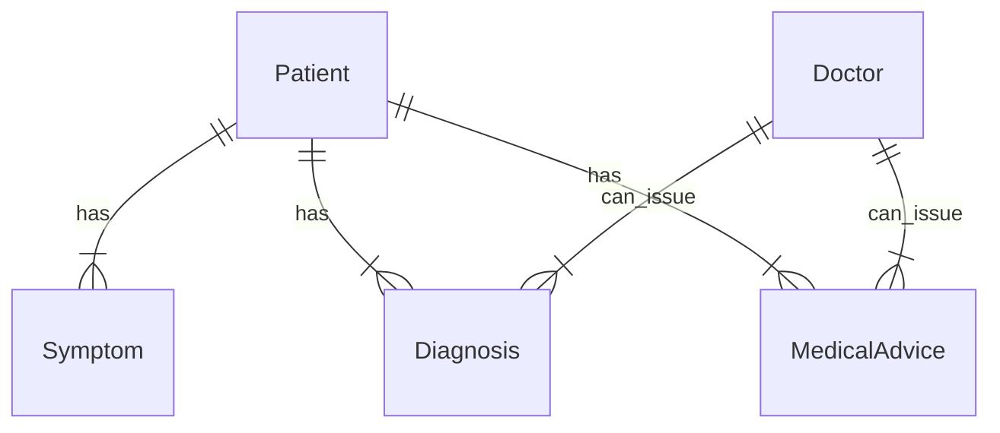
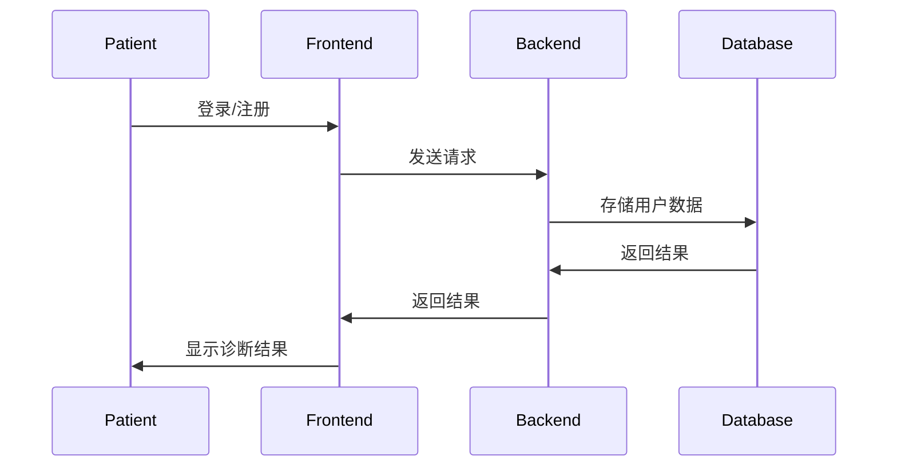
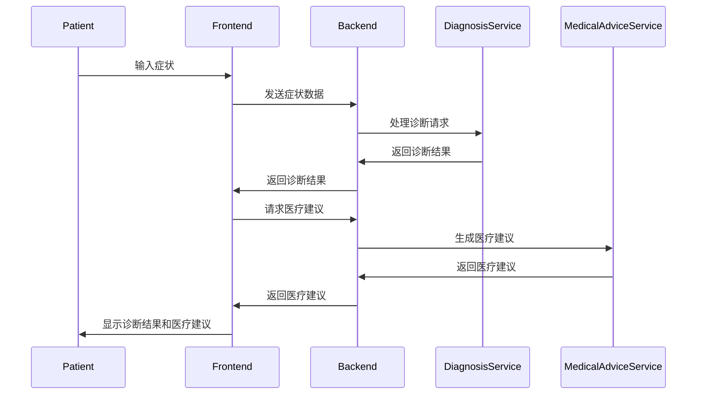

                 

### 1. 引言

#### 1.1 问题的背景

类型论是计算机科学中一个重要的概念，它在编程语言的设计和实现中扮演着核心角色。类型论关注的是变量、函数和表达式在程序中的类型，以及这些类型之间的关系。类型系统的存在有助于提高程序的正确性、安全性和可维护性。简单来说，类型系统通过确保变量在使用前已被正确声明和初始化，从而减少了潜在的运行时错误。

在计算机科学的发展历程中，类型论经历了从简单到复杂的演变。最初，编程语言如BASIC和FORTRAN采用了动态类型，这意味着变量的类型在运行时才会被确定。这种方法的优点是灵活性高，但缺点是容易产生运行时错误，难以进行静态分析。随着程序规模的扩大和复杂性的增加，静态类型系统逐渐成为主流，因为它能够在编译时发现更多错误，提高程序的可靠性和性能。

#### 1.2 语言表达限制的概念与重要性

语言表达限制指的是编程语言对程序员能够表达的概念和结构的限制。这些限制可以来自于语言本身的语法、语义和类型系统。语言表达限制的存在是不可避免的，因为每种语言都有其特定的设计目标和应用场景。这些限制可以是功能性的，比如某些语言不支持多继承，或者是结构性的，比如某些语言对函数调用的递归深度有限制。

语言表达限制的重要性体现在多个方面。首先，它们影响了程序员的工作效率。如果一个语言的表达能力受限，程序员可能需要编写更多的代码来达到相同的效果，这增加了开发的时间和难度。其次，它们影响了程序的可维护性。过于复杂的类型系统可能导致代码难以理解，增加了后期维护的负担。最后，语言表达限制也影响了程序的性能。某些优化措施可能因为类型系统的限制而无法实现，导致程序运行效率降低。

#### 1.3 形式化代价的含义与影响

形式化代价是指为了提高程序的正确性和可靠性而进行形式化验证和证明所需的成本。形式化验证是通过数学方法来证明程序的正确性，它要求程序员编写形式化的规格说明和证明，以证明程序的行为符合预期。这种验证方法的优点是可以大大降低程序出错的可能性，提高程序的可靠性和安全性。然而，它也带来了高昂的代价。

形式化代价首先体现在编程复杂度的提高。形式化验证要求程序员对程序的所有细节进行精确描述和证明，这需要深厚的数学和逻辑知识，并且可能会增加代码的复杂性。其次，形式化验证的成本也非常高。验证过程通常需要大量的计算资源和时间，尤其是在处理大型程序时。这可能导致开发周期延长，影响项目进度。

总的来说，类型论的语言表达限制和形式化代价是计算机科学中不可忽视的问题。类型系统在提高程序正确性和安全性方面具有重要作用，但同时也带来了语言表达的限制和形式化验证的复杂度。在接下来的章节中，我们将深入探讨这些问题，分析它们的具体影响，并探讨可能的解决方案。

### 1.4 问题描述

#### 1.4.1 类型论的基本概念

类型论在计算机科学中是一门研究程序中变量和值类型以及它们之间关系的学科。基本概念包括类型系统、类型检查和类型推断等。类型系统是编程语言的核心组成部分，它定义了变量和表达式可以接受的数据类型以及如何进行类型转换。类型检查是在编译时或运行时验证程序中的操作是否遵循类型规则的过程，而类型推断是编译器自动确定变量类型的能力。

类型系统可以分为静态类型和动态类型。静态类型系统在编译时确定变量的类型，而动态类型系统在运行时确定变量的类型。静态类型系统的优点是可以发现更多错误在编译时，从而减少运行时错误，但可能降低灵活性。动态类型系统则更灵活，但可能引入更多运行时错误。

#### 1.4.2 语言表达限制的具体体现

语言表达限制是指编程语言对程序员能够表达的概念和结构的限制。这些限制可能是功能性的，如不支持某些高级编程概念，或者结构性的，如对某些数据结构的使用有限制。例如，某些编程语言可能不支持多继承，这限制了程序员的面向对象编程能力；另外，某些语言对数组的长度限制也可能影响程序设计。

语言表达限制在程序设计中的具体体现包括以下几个方面：

1. **类型约束**：编程语言中定义的类型系统限制了程序员可以使用的变量类型和操作。例如，强类型语言要求所有变量在使用前必须声明类型，而动态类型语言则允许在运行时确定类型。

2. **语法限制**：编程语言中的语法规则限制了程序的结构和表达方式。例如，某些语言不支持异常处理，这可能导致程序员需要使用更复杂的控制结构来处理错误情况。

3. **性能限制**：某些编程语言的设计可能为了简化编译或运行时处理，而对程序性能产生限制。例如，某些语言的垃圾回收机制可能导致程序运行时占用更多内存。

4. **功能限制**：一些编程语言可能不支持某些高级功能，如并发编程、函数式编程等，这限制了程序员的编程范式选择。

这些限制对程序设计的影响是多方面的。首先，它们可能降低编程效率，因为程序员需要寻找绕过限制的方法，或者编写更多的代码来模拟缺失的功能。其次，它们可能影响程序的可维护性，因为限制导致代码结构复杂，难以理解和维护。最后，这些限制也可能影响程序的性能和可扩展性。

#### 1.4.3 形式化代价的具体表现与挑战

形式化代价是指为了提高程序的正确性和可靠性而进行形式化验证和证明所需的成本。形式化验证是通过数学方法来证明程序的正确性，要求程序员编写形式化的规格说明和证明。这种验证方法的优点是可以大大降低程序出错的可能性，提高程序的可靠性和安全性，但同时也带来了高昂的代价。

形式化代价的主要表现和挑战包括：

1. **编程复杂度提高**：形式化验证要求程序员对程序的所有细节进行精确描述和证明，这需要深厚的数学和逻辑知识，并可能导致代码的复杂性增加。例如，编写形式化的规格说明可能需要编写大量代码，这增加了开发和维护的难度。

2. **开发时间延长**：形式化验证过程通常需要大量的计算资源和时间，特别是在处理大型程序时。这可能导致开发周期延长，影响项目进度。例如，形式化验证可能需要运行多个验证工具，每个工具都需要一定时间来进行分析。

3. **验证成本高**：验证工具和验证过程本身可能需要高昂的成本。例如，某些形式化验证工具可能需要付费使用，而且这些工具通常需要专业的技能来操作。此外，验证过程中可能需要编写和维护大量的证明代码，这也增加了成本。

4. **灵活性降低**：形式化验证要求程序员遵循严格的规则和格式，这可能会降低程序设计的灵活性。例如，在某些情况下，程序员可能需要按照特定的验证方法来编写代码，这限制了他们的创新空间。

形式化代价对程序设计的影响主要体现在以下几个方面：

- **降低开发效率**：形式化验证增加了开发过程中的复杂度和成本，可能导致开发效率降低。
- **影响项目进度**：验证过程可能需要大量时间和资源，这可能会影响项目的整体进度。
- **影响程序质量**：形式化验证可以提高程序的正确性和可靠性，但也可能导致程序设计的灵活性降低，从而影响程序的整体质量。

综上所述，类型论的语言表达限制和形式化代价是计算机科学中不可忽视的问题。类型论在提高程序正确性和安全性方面具有重要作用，但同时也带来了语言表达的限制和形式化验证的复杂度。在接下来的章节中，我们将深入探讨这些问题的具体影响和可能的解决方案。

#### 1.4.4 问题解决

类型论的语言表达限制和形式化代价在程序设计中的应用带来了诸多挑战，但通过一系列的方法和策略，我们可以有效地减轻这些问题的影响。

首先，对于类型论的语言表达限制，可以采用以下几种方法来缓解：

1. **高级抽象机制**：引入高级抽象机制，如抽象数据类型和泛型编程，可以提高编程语言的表达能力。抽象数据类型封装了数据结构和操作，使得程序员可以更专注于程序的核心逻辑，而无需担心底层实现的细节。泛型编程则允许编写可重用的代码，无需对每个具体类型重复编写相同的功能。

2. **类型推断**：类型推断是一种编译器自动确定变量类型的技术，它减少了程序员手动声明类型的负担，提高了编程效率。许多现代编程语言，如Java和C#，都支持强大的类型推断机制。

3. **静态类型与动态类型的结合**：许多编程语言允许静态类型和动态类型的结合。例如，JavaScript是一种动态类型语言，但通过使用类型注解，可以使其具备静态类型的优势。这种方法可以提高程序的可维护性和性能。

对于形式化代价，可以采取以下策略：

1. **逐步形式化**：在实际项目中，可以采用逐步形式化的方法，先从关键部分开始进行形式化验证，逐步扩展到整个系统。这种方法可以在保证程序正确性的同时，避免过高的形式化成本。

2. **形式化工具的选择**：选择合适的验证工具和框架可以显著降低形式化代价。例如，使用像Coq或Isabelle这样的定理证明器，可以自动化许多验证过程，减少手动编写证明的工作量。

3. **自动化验证**：自动化验证工具可以减少验证过程的时间和复杂性。例如，使用静态分析工具进行类型检查，可以快速发现潜在的错误。

4. **证明策略优化**：优化证明策略可以减少形式化验证的成本。例如，通过分解复杂问题、使用归纳法和模式匹配等方法，可以提高证明的效率。

总之，类型论的语言表达限制和形式化代价在程序设计中带来了挑战，但通过合理的策略和方法，我们可以有效地应对这些问题。在接下来的章节中，我们将进一步探讨类型论的基本概念、语言表达限制的具体表现和形式化代价的影响，并详细分析相关的算法原理和数学模型。

### 1.5 边界与外延

#### 1.5.1 类型论的语言表达限制的适用范围

类型论的语言表达限制在不同编程语言中有着不同的适用范围。一般来说，强类型语言如C++和Java对类型表达的限制较为严格，这些语言要求变量在使用前必须声明类型，并且在类型之间进行操作时需要进行显式类型转换。相比之下，动态类型语言如Python和JavaScript则对类型表达的限制相对宽松，它们允许在运行时动态确定变量的类型，并通过类型检查来确保程序的正确性。

具体来说，类型论的语言表达限制在以下方面体现了不同的适用范围：

1. **类型系统设计**：强类型语言通常采用严格的静态类型系统，而动态类型语言则采用较为灵活的动态类型系统。静态类型系统在编译时进行类型检查，可以在早期发现潜在的错误，提高程序的可维护性。动态类型系统则更多地依赖于运行时的类型检查，灵活性较高但可能增加运行时错误。

2. **函数参数和返回值**：在强类型语言中，函数的参数和返回值类型必须明确声明。例如，在C++中，函数签名必须指定每个参数的类型和返回类型。而在动态类型语言中，函数的参数和返回值类型可以是任意类型，编译器或解释器会在运行时进行类型检查。

3. **类型兼容性**：强类型语言通常对类型兼容性有严格的要求，只有类型兼容的操作才被允许。例如，在Java中，只有相同类型的变量才能进行赋值或比较操作。动态类型语言则允许类型之间的隐式转换，如Python中的整数和浮点数之间可以相互转换。

4. **类型注解**：在一些编程语言中，如Java和C#，类型注解是一种重要的语言特性，用于提供关于变量和函数类型的额外信息。类型注解可以在编译时用于静态检查，帮助发现潜在的错误。然而，类型注解并不是所有编程语言都支持的，例如在Python中，类型注解通常仅在运行时提供类型信息。

#### 1.5.2 形式化代价在不同编程语言中的体现

形式化代价在不同编程语言中的体现也有所不同，这主要受到编程语言的设计哲学和实现方式的影响。以下是几种主要编程语言在形式化代价方面的体现：

1. **静态类型语言**：在静态类型语言中，形式化代价通常较高。这些语言要求程序员在编写代码时必须明确声明变量类型，并在代码中保持类型的一致性。例如，在C++和Java中，程序员需要编写大量的类型声明和类型转换代码，这可能增加代码的复杂度和维护成本。此外，形式化验证工具在这些语言中的应用也较为普遍，如使用Coq或Isabelle进行证明，这进一步增加了形式化代价。

2. **动态类型语言**：动态类型语言在形式化代价方面通常较低，因为它们允许在运行时动态确定类型，减少了静态类型检查的负担。然而，这也意味着运行时的类型检查成本较高，可能会降低程序的性能。例如，在Python中，虽然可以使用类型检查工具如Mypy进行静态类型检查，但默认情况下，Python是动态类型语言，不需要显式声明类型。

3. **函数式编程语言**：函数式编程语言如Haskell和Scala在形式化代价方面具有独特的特点。这些语言通常采用严格的静态类型系统和强类型推断，这使得它们能够进行高效的编译和类型检查。形式化验证在这些语言中的应用也较为广泛，因为函数式编程强调函数的纯度和表达式的明确性，使得形式化验证更为可行。

4. **脚本语言**：脚本语言如Python和Ruby在形式化代价方面通常较低，因为它们的设计目标是为了快速开发和简化任务。这些语言提供了丰富的库和框架，使程序员可以快速实现功能，但这也可能导致代码的复杂度和维护成本增加。形式化验证在这些语言中的应用相对较少，因为它们通常不需要严格的类型检查。

总之，类型论的语言表达限制和形式化代价在不同编程语言中的适用范围和体现各有不同。理解这些差异有助于程序员根据具体项目需求选择合适的编程语言，并在程序设计中权衡类型系统带来的好处和代价。

#### 1.5.3 概念结构与核心要素组成

类型论的语言表达限制和形式化代价是计算机科学中的重要概念，它们在程序设计和实现中发挥着关键作用。为了深入理解这两个概念，我们需要探讨其基本要素和核心问题。

首先，类型论的基本要素包括：

1. **类型系统**：类型系统是类型论的核心组成部分，它定义了程序中变量和值的类型，以及类型之间的关系。类型系统可以分为静态类型系统和动态类型系统。静态类型系统在编译时确定变量的类型，而动态类型系统在运行时确定变量的类型。

2. **类型检查**：类型检查是确保程序中的操作符合类型规则的过程。类型检查可以分为静态类型检查和动态类型检查。静态类型检查在编译时进行，动态类型检查在运行时进行。

3. **类型推断**：类型推断是编译器自动确定变量类型的能力。类型推断有助于减少代码中的类型声明，提高编程效率。

4. **类型转换**：类型转换是不同类型之间进行操作的方法。类型转换可以是显式的，也可以是隐式的。显式类型转换需要程序员明确指定类型转换，而隐式类型转换由编译器或解释器自动进行。

其次，语言表达限制的核心问题包括：

1. **类型约束**：类型约束是指编程语言对变量类型的限制，这些限制确保程序中的操作不会产生类型错误。类型约束可以是严格的，例如强类型语言，也可以是宽松的，例如动态类型语言。

2. **语法限制**：语法限制是指编程语言对程序结构的限制，这些限制影响程序的表达方式。例如，某些语言可能不支持某些高级编程概念，如多继承。

3. **性能限制**：性能限制是指编程语言的设计可能对程序性能产生限制。例如，某些语言可能采用复杂的类型系统，这可能会增加编译时间和运行时开销。

4. **功能限制**：功能限制是指编程语言不支持某些高级功能，如并发编程、函数式编程等。这些限制可能影响程序的设计和实现。

最后，形式化的核心问题与挑战包括：

1. **形式化验证**：形式化验证是使用数学方法证明程序的正确性。形式化验证要求程序员编写形式化的规格说明和证明，这需要深厚的数学和逻辑知识。

2. **验证成本**：形式化验证的成本包括编程复杂度的提高、开发时间的延长和验证工具的高昂成本。这些成本可能对项目的进度和质量产生负面影响。

3. **灵活性降低**：形式化验证要求程序员遵循严格的规则和格式，这可能会降低程序设计的灵活性。

总之，类型论的语言表达限制和形式化代价是计算机科学中不可忽视的重要概念。理解这些概念的基本要素和核心问题，有助于程序员在程序设计和实现中做出明智的决策，平衡类型系统的优点和代价。

### 第二部分：核心概念与联系

#### 2.1 类型论的基本概念

类型论是计算机科学中的一个核心概念，它研究变量、值和表达式在程序中的类型以及它们之间的关系。类型论的基本概念包括类型系统、类型检查和类型推断等。这些概念不仅影响了编程语言的设计和实现，还决定了程序的正确性、安全性和可维护性。

#### 2.1.1 类型系统的定义

类型系统是编程语言的核心组成部分，它定义了变量和值的类型以及类型之间的关系。类型系统的主要作用是确保程序中的操作符合类型规则，从而减少错误和提高程序的可靠性。

类型系统可以分为静态类型系统和动态类型系统：

1. **静态类型系统**：在静态类型系统中，变量的类型在编译时被确定。编译器在编译过程中会检查所有变量的类型，确保它们在操作时遵循类型规则。静态类型系统的优点是可以在编译时发现更多错误，从而减少运行时错误。常见的静态类型语言包括C++、Java和C#。

2. **动态类型系统**：在动态类型系统中，变量的类型在运行时被确定。解释器或运行时环境会在执行程序时检查变量的类型，确保操作合法。动态类型系统的优点是灵活性更高，但可能引入更多的运行时错误。常见的动态类型语言包括Python、JavaScript和Ruby。

#### 2.1.2 静态类型与动态类型的比较

静态类型和动态类型各有优缺点，以下是它们的主要特点：

1. **静态类型**：
   - **优点**：
     - **早期错误检测**：静态类型系统在编译时进行类型检查，可以早期发现类型错误，从而减少运行时错误。
     - **性能优化**：编译器可以利用静态类型信息进行更有效的优化，提高程序运行效率。
     - **代码可读性**：显式声明类型可以提高代码的可读性和可维护性。
   - **缺点**：
     - **代码冗余**：需要显式声明变量类型，可能导致代码冗余。
     - **灵活性较低**：静态类型系统可能对某些动态场景不够灵活，需要编写额外的代码来模拟动态类型的行为。

2. **动态类型**：
   - **优点**：
     - **代码简洁**：无需显式声明类型，代码更加简洁。
     - **灵活性高**：动态类型系统可以适应更复杂的场景，如动态类型转换和运行时类型检查。
     - **开发效率高**：动态类型系统简化了编程模型，提高了开发效率。
   - **缺点**：
     - **运行时错误**：类型错误可能直到运行时才被发现，增加了调试难度。
     - **性能开销**：动态类型系统通常需要运行时类型检查，可能增加性能开销。

#### 2.1.3 强类型与弱类型的定义与特点

强类型和弱类型是类型系统中的两个重要概念，它们分别代表了不同类型的类型检查强度。

1. **强类型**：
   - **定义**：强类型系统对类型约束非常严格，只有相同类型的操作才被允许。
   - **特点**：
     - **类型安全**：强类型系统可以更有效地保证程序的安全性，减少类型错误。
     - **代码可靠性**：强类型系统有助于提高代码的可靠性和可维护性。

2. **弱类型**：
   - **定义**：弱类型系统对类型约束较宽松，允许类型之间的隐式转换。
   - **特点**：
     - **灵活性**：弱类型系统提供了更高的灵活性，允许在操作不同类型的变量时自动进行类型转换。
     - **代码冗余**：弱类型系统可能导致代码冗余，因为可能需要编写额外的代码来处理类型转换。

#### 2.1.4 类型系统的层次结构

类型系统可以分为简单类型系统和复杂类型系统。简单类型系统通常包括基本数据类型，如整数、浮点数和布尔值。复杂类型系统则包括结构化数据类型，如数组、列表和对象。

1. **简单类型系统**：
   - **基本数据类型**：包括整数、浮点数、布尔值和字符等。
   - **简单复合类型**：如数组、字符串等。

2. **复杂类型系统**：
   - **结构化数据类型**：包括类、接口、记录和结构等。
   - **函数类型**：函数和数据结构之间的类型关系。
   - **泛型**：支持可重用代码的参数化类型。

总的来说，类型论的基本概念是理解编程语言设计和实现的重要基础。类型系统通过定义变量和值的类型以及类型之间的关系，提高了程序的正确性和可靠性。在编程实践中，程序员需要根据具体的应用场景和需求，选择合适的类型系统，以实现高效和可靠的程序。

### 2.2 语言表达限制

#### 2.2.1 语言表达限制的定义

语言表达限制是指编程语言对程序员能够表达的概念和结构的限制。这些限制可以是功能性的，如不支持某些高级编程概念，或者结构性的，如对某些数据结构的使用有限制。语言表达限制的存在是不可避免的，因为每种编程语言都有其特定的设计目标和应用场景。

语言表达限制对程序设计的影响是多方面的。首先，它可能降低编程效率。例如，如果一个语言不支持多继承，程序员可能需要使用其他方法来模拟多继承，这增加了代码的复杂性和维护难度。其次，语言表达限制可能影响程序的可维护性。过于复杂的类型系统或限制可能导致代码难以理解，增加了后期维护的负担。最后，语言表达限制也可能影响程序的性能和可扩展性。某些优化措施可能因为类型系统的限制而无法实现，导致程序运行效率降低。

总的来说，理解语言表达限制的定义和影响对于程序员在选择编程语言和设计程序时至关重要。

#### 2.2.2 语言表达限制的具体表现

语言表达限制在程序设计中的具体表现可以通过以下几个方面来探讨：

1. **类型约束**：
   类型约束是指编程语言对变量类型的限制。在强类型语言中，变量在使用前必须声明类型，并且在类型之间进行操作时需要进行显式类型转换。例如，在C++中，变量必须在声明时指定类型，如下所示：
   ```cpp
   int x = 5;
   double y = 3.14;
   ```
   而在动态类型语言中，类型约束通常较为宽松，变量的类型在运行时动态确定。例如，在Python中，变量不需要声明类型，如下所示：
   ```python
   x = 5
   y = 3.14
   ```

2. **语法限制**：
   语法限制是指编程语言对程序结构的限制。这些限制可能包括不支持某些高级编程概念，如多继承。例如，在Java中，类只能继承一个父类，不支持多继承。这意味着，如果一个类需要继承多个父类的特性，程序员可能需要使用其他方法，如接口或组合，来模拟多继承。如下所示：
   ```java
   class Parent1 {
       // 父类1的方法和属性
   }
   
   class Parent2 {
       // 父类2的方法和属性
   }
   
   class Child extends Parent1, Parent2 {
       // 子类的方法和属性
   }
   ```
   在这里，`Child` 类试图同时继承 `Parent1` 和 `Parent2`，但在Java中这是不允许的。

3. **性能限制**：
   一些编程语言的设计可能为了简化编译或运行时处理，而对程序性能产生限制。例如，某些语言的垃圾回收机制可能导致程序运行时占用更多内存。另外，某些语言的编译器可能在类型检查和优化方面存在限制，导致程序运行效率降低。

4. **功能限制**：
   一些编程语言可能不支持某些高级功能，如并发编程、函数式编程等，这限制了程序员的编程范式选择。例如，C语言是一种过程式编程语言，它不支持并发编程和垃圾回收，这可能导致在编写复杂应用程序时面临性能和可维护性的挑战。

这些语言表达限制对程序设计的影响是多方面的。首先，它们可能降低编程效率，因为程序员需要寻找绕过限制的方法，或者编写更多的代码来模拟缺失的功能。其次，它们可能影响程序的可维护性，因为限制导致代码结构复杂，难以理解和维护。最后，这些限制也可能影响程序的性能和可扩展性。

总之，理解语言表达限制的具体表现对于程序员在设计和实现程序时做出合理的选择至关重要。

#### 2.2.3 语言表达限制的克服方法

为了克服语言表达限制，程序员可以采用多种策略和方法，这些方法有助于扩展编程语言的表达能力，提高程序的灵活性和可维护性。以下是一些常见的方法：

1. **抽象数据类型**：
   抽象数据类型（Abstract Data Type，简称ADT）是一种用于封装数据结构和相关操作的编程范式。通过使用抽象数据类型，程序员可以定义复杂的类型和行为，而无需关注底层实现的细节。例如，在C++中，可以使用类来定义抽象数据类型，如下所示：
   ```cpp
   class Stack {
   private:
       std::vector<int> elements;
   public:
       void push(int value);
       int pop();
       // 其他操作和成员函数
   };
   ```
   通过这种封装，程序员可以专注于抽象数据类型的接口和功能，而不是其内部实现。

2. **泛型编程**：
   泛型编程是一种编程范式，允许编写可重用的代码，以处理不同类型的数据。泛型编程通过参数化类型来定义泛型类、函数和模板，从而提高代码的通用性和可维护性。例如，在C++中，可以使用模板来定义泛型函数，如下所示：
   ```cpp
   template<typename T>
   T add(T a, T b) {
       return a + b;
   }
   ```
   通过泛型编程，程序员可以编写一次函数，就能处理整数、浮点数等多种类型的加法操作。

3. **类型转换**：
   类型转换是一种将一个类型的数据转换为另一个类型的方法。通过类型转换，程序员可以绕过语言对某些类型操作的限制。类型转换可以是显式的，也可以是隐式的。显式类型转换需要程序员明确指定转换，如下所示：
   ```python
   x = int("5")
   ```
   而隐式类型转换由编译器或解释器自动进行，例如在Python中：
   ```python
   x = "5" + 3
   ```
   在这个例子中，Python自动将整数3转换为字符串，以便与字符串"5"进行拼接。

4. **组合与多态**：
   组合（Composition）和多态（Polymorphism）是面向对象编程的核心概念，可以帮助程序员克服语言表达限制。通过组合，程序员可以将不同类型的对象组合在一起，形成一个更复杂的结构。多态则允许程序员编写通用代码，以处理多种类型的对象。例如，在Java中，可以使用接口和多态来实现多个类之间的协同工作：
   ```java
   interface Drivable {
       void drive();
   }
   
   class Car implements Drivable {
       public void drive() {
           System.out.println("Car is driving");
       }
   }
   
   class Boat implements Drivable {
       public void drive() {
           System.out.println("Boat is sailing");
       }
   }
   
   public class Main {
       public static void main(String[] args) {
           Drivable car = new Car();
           Drivable boat = new Boat();
           
           driveVehicle(car);
           driveVehicle(boat);
       }
       
       public static void driveVehicle(Drivable vehicle) {
           vehicle.drive();
       }
   }
   ```
   在这个例子中，`driveVehicle` 方法可以接受任何实现了 `Drivable` 接口的对象，从而实现代码的重用。

通过这些方法，程序员可以在一定程度上克服语言表达限制，编写更加灵活和可维护的代码。然而，这些方法也有其局限性，有时可能需要权衡代码的复杂度和性能。因此，选择合适的方法需要根据具体的应用场景和需求进行综合考虑。

#### 2.3 形式化验证的定义和基本概念

形式化验证是一种使用数学方法来证明程序的正确性的技术。它通过编写形式化的规格说明和证明，确保程序的行为符合预期。形式化验证的基本概念包括形式化规格说明、形式化证明和形式化验证工具。

1. **形式化规格说明**：
   形式化规格说明是一种用数学语言编写的文档，描述了程序的功能和行为。规格说明通常使用形式化语言，如Z语言或Vera，以确保其精确和一致。形式化规格说明不仅描述了程序应该做什么，还定义了其预期的输入和输出。

2. **形式化证明**：
   形式化证明是一种使用数学方法来证明程序的正确性。它通过逻辑推理和数学公式，证明程序在所有可能的输入情况下都能正确执行。形式化证明通常包括状态转换图、断言和归纳证明等。例如，可以使用模态逻辑或谓词逻辑来证明程序的正确性。

3. **形式化验证工具**：
   形式化验证工具是用于自动化形式化验证过程的软件。这些工具可以分析程序的规格说明和代码，检测潜在的错误和不符合预期的行为。常见的形式化验证工具包括Coq、Isabelle和TPTP等。形式化验证工具可以提高验证过程的效率和准确性，减少手动验证的工作量。

总的来说，形式化验证通过形式化规格说明和形式化证明，确保程序的正确性。虽然它可能增加编程的复杂度，但可以大大提高程序的安全性和可靠性。

#### 2.3.2 形式化代价

形式化代价是指为了进行形式化验证和证明程序的正确性而付出的成本。形式化代价可以分为以下几个方面：

1. **编程复杂度提高**：
   形式化验证要求程序员对程序的所有细节进行精确描述和证明，这需要深厚的数学和逻辑知识。形式化验证通常涉及到编写大量的形式化规格说明和证明，这使得代码的复杂度大大增加，需要更多的编程技巧和经验。

2. **验证成本上升**：
   形式化验证过程通常需要大量的计算资源和时间，尤其是在处理大型程序时。形式化验证工具的分析过程可能需要运行多个验证工具，每个工具都需要一定时间来进行分析。这可能导致验证过程非常耗时，影响项目进度。

3. **开发时间延长**：
   形式化验证增加了开发过程中的复杂度和成本，导致开发时间延长。程序员需要花费更多时间来编写和验证形式化的规格说明和证明，这可能会影响项目的整体进度。

4. **维护成本增加**：
   形式化验证后的程序通常需要定期进行重新验证，以确保其仍然符合预期。这意味着维护成本也会增加，因为程序员需要持续关注和更新验证过程。

总的来说，形式化代价虽然可以提高程序的正确性和可靠性，但也带来了额外的成本和复杂度。在项目设计和开发过程中，需要权衡形式化验证的收益和代价，以做出合理的决策。

#### 2.3.3 形式化收益

尽管形式化验证带来了高昂的代价，但其所带来的收益也是不可忽视的。以下是形式化验证的主要收益：

1. **程序的正确性保障**：
   形式化验证通过严格的数学证明，确保程序在所有可能的输入情况下都能正确执行。这种保证是传统的测试和调试方法无法提供的，因为测试只能覆盖部分代码路径，而形式化验证可以覆盖所有路径。因此，形式化验证可以极大地减少程序中的潜在错误和漏洞。

2. **可靠性提升**：
   形式化验证提高了程序的整体可靠性。通过证明程序的正确性，可以减少运行时错误和崩溃的风险。特别是在关键领域，如医疗设备和金融系统，形式化验证可以确保程序的高可靠性和稳定性。

3. **维护性增强**：
   形式化验证促进了代码的可维护性。通过形式化的规格说明和证明，程序员可以更好地理解程序的行为和设计，从而更容易进行后续的维护和扩展。形式化验证有助于保持代码的一致性和完整性，减少了维护难度。

4. **效率提高**：
   虽然形式化验证可能增加开发时间和成本，但它可以在后期减少维护成本和错误修复时间。通过确保程序的正确性，可以减少运行时错误和调试时间，从而提高整体开发效率。

总的来说，形式化验证虽然代价高昂，但其所带来的正确性保障、可靠性提升和维护性增强等收益，使其成为提高程序质量和安全性的重要手段。

#### 2.3.4 形式化代价与收益的权衡

形式化验证的代价与收益之间的权衡是一个复杂的问题，需要在项目设计和开发过程中进行综合考虑。以下是从几个方面进行权衡的建议：

1. **项目类型**：
   对于关键领域，如医疗设备和金融系统，形式化验证可能是必需的，因为高可靠性和安全性至关重要。在这些项目中，形式化验证的收益远大于其代价。然而，对于普通应用项目，形式化验证可能不是那么必要，因为潜在的收益可能不足以弥补额外的开发成本。

2. **项目规模**：
   形式化验证在大型项目中可能更有意义，因为大型项目通常包含复杂的逻辑和大量的代码路径，这使得手动验证和测试变得非常困难。在大型项目中，形式化验证可以帮助确保所有路径的正确性，从而减少潜在的缺陷。然而，对于小型项目，形式化验证的收益可能较低，因为其复杂性相对较低。

3. **团队技能**：
   形式化验证需要程序员具备深厚的数学和逻辑知识。如果一个团队拥有足够的技能和经验来有效地进行形式化验证，那么他们可以充分利用这一技术带来的收益。然而，如果团队缺乏必要的技能，形式化验证可能会变成一项艰巨的任务，反而增加开发难度和成本。

4. **时间与资源**：
   形式化验证通常需要大量的时间和计算资源。如果一个项目的时间非常紧张，或者预算有限，那么形式化验证可能会成为负担。在这种情况下，项目团队可能需要权衡其他优先事项，如功能完善和性能优化。然而，如果项目有足够的时间和资源，形式化验证可以作为一种提高质量的有效手段。

5. **风险管理**：
   在决策过程中，项目团队需要评估形式化验证对项目风险的影响。形式化验证可以显著降低潜在的运行时错误和安全性漏洞，从而减少项目失败的风险。通过风险分析和成本效益分析，团队可以更好地理解形式化验证的潜在收益。

总的来说，形式化验证的代价与收益之间的权衡取决于项目的具体情况。项目团队需要根据项目的类型、规模、团队技能、时间和资源以及风险管理等因素，综合考虑是否采用形式化验证，并制定合适的策略来最大化其收益，最小化其代价。

### 3.1 类型检查算法

#### 3.1.1 算法的基本原理

类型检查算法是确保程序在编译或运行时遵循类型规则的过程。根据类型检查发生的时机，可以分为静态类型检查和动态类型检查。每种类型检查算法都有其基本原理和实现方法。

1. **静态类型检查**：
   静态类型检查在编译时进行，这意味着编译器在编译程序代码时会检查所有变量和表达式的类型，确保它们在操作时遵循类型规则。静态类型检查的优点是可以在早期发现类型错误，从而减少运行时错误。

   静态类型检查的基本原理包括：

   - **类型推断**：编译器通过分析程序代码，自动确定变量和表达式的类型。
   - **类型规则**：编译器依据编程语言定义的类型规则，检查变量和表达式是否遵循这些规则。
   - **错误报告**：如果发现类型错误，编译器会生成错误信息，帮助程序员定位和修复问题。

2. **动态类型检查**：
   动态类型检查在运行时进行，这意味着解释器或运行时环境在程序执行时会检查变量的类型，确保操作合法。动态类型检查的优点是灵活性更高，允许在运行时动态确定类型。

   动态类型检查的基本原理包括：

   - **运行时类型检查**：在程序执行过程中，解释器或运行时环境会检查变量的类型，确保操作合法。
   - **类型转换**：动态类型系统通常允许类型之间的隐式转换，以简化编程模型。
   - **错误处理**：如果发现类型错误，动态类型系统会采取相应的错误处理措施，如抛出异常或返回错误值。

#### 3.1.2 算法的实现

为了更好地理解类型检查算法的实现，我们将分别使用Python语言实现静态类型检查和动态类型检查。

**静态类型检查的实现：**

在Python中，可以使用内置的类型检查功能来模拟静态类型检查。以下是一个简单的静态类型检查实现的例子：

```python
def add(a, b):
    if isinstance(a, int) and isinstance(b, int):
        return a + b
    else:
        raise TypeError("输入参数必须为整数")

try:
    result = add(3, 4)
    print(result)
except TypeError as e:
    print(e)
```

在这个例子中，`add` 函数通过使用 `isinstance` 函数检查参数 `a` 和 `b` 是否为整数。如果参数类型不正确，则会抛出 `TypeError` 异常。

**动态类型检查的实现：**

在Python中，动态类型检查通常通过运行时类型检查实现。以下是一个简单的动态类型检查实现的例子：

```python
def add(a, b):
    return a + b

result = add(3, 4)
print(result)

result = add(3, "4")
print(result)  # 这将抛出异常
```

在这个例子中，`add` 函数没有显式检查参数类型。如果参数类型不匹配，Python将尝试隐式类型转换，并可能抛出异常。在这里，当尝试将整数与字符串相加时，Python会抛出 `TypeError` 异常。

#### 3.1.3 算法的时间复杂度分析

类型检查算法的时间复杂度取决于算法的实现和程序的规模。以下是静态类型检查和动态类型检查的时间复杂度分析：

1. **静态类型检查的时间复杂度**：
   静态类型检查通常在编译时进行，其时间复杂度与程序代码的大小和结构有关。在最坏的情况下，类型检查可能需要对每个变量和表达式进行类型分析，这可能导致时间复杂度为 O(n)，其中 n 是代码中的语句数量。然而，通过优化编译器算法，可以显著降低实际的时间复杂度。

2. **动态类型检查的时间复杂度**：
   动态类型检查在运行时进行，其时间复杂度通常较低，因为它只需要在必要时检查变量的类型。在最坏的情况下，动态类型检查可能需要对每个变量和表达式进行类型分析，时间复杂度也为 O(n)。然而，由于动态类型检查通常只发生在特定的操作时，实际的时间复杂度通常低于静态类型检查。

总的来说，静态类型检查在早期发现类型错误方面具有优势，但可能增加编译时间；动态类型检查具有更高的灵活性，但可能在运行时引入错误。在项目设计和开发过程中，可以根据具体需求选择合适的类型检查算法。

#### 3.1.4 算法的空间复杂度分析

类型检查算法的空间复杂度是指在进行类型检查时所需的空间资源，包括内存和存储。以下是静态类型检查和动态类型检查的空间复杂度分析：

1. **静态类型检查的空间复杂度**：
   静态类型检查通常在编译时进行，其空间复杂度与程序代码的大小和类型系统的复杂性有关。在最坏的情况下，类型检查可能需要对每个变量和表达式进行类型分析，这可能导致空间复杂度为 O(n)，其中 n 是代码中的语句数量。此外，静态类型检查需要存储类型信息，这可能导致额外的空间开销。

2. **动态类型检查的空间复杂度**：
   动态类型检查在运行时进行，其空间复杂度通常较低，因为它只需要在必要时检查变量的类型。在最坏的情况下，动态类型检查可能需要对每个变量和表达式进行类型分析，空间复杂度也为 O(n)。然而，由于动态类型检查通常只发生在特定的操作时，实际的空间复杂度通常低于静态类型检查。

总的来说，静态类型检查可能增加编译时空间开销，而动态类型检查在运行时空间复杂度较低。选择合适的类型检查算法时，需要权衡空间复杂度和程序的性能需求。

### 3.2 形式化验证算法

#### 3.2.1 形式化验证算法的基本原理

形式化验证算法是一种通过数学方法来证明程序正确性的技术。它的核心思想是通过形式化的规格说明和证明，确保程序在所有可能的输入情况下都能按照预期执行。形式化验证算法的基本原理包括以下几个方面：

1. **形式化规格说明**：
   形式化规格说明是一种用数学语言编写的文档，详细描述了程序的功能和行为。规格说明通常包括程序的输入、输出、状态转换和预期结果等。形式化规格说明的目标是精确、一致和完备，以便为后续的证明过程提供可靠的依据。

2. **形式化证明**：
   形式化证明是使用数学方法和逻辑推理来证明程序的正确性。它通常涉及以下几个步骤：
   - **定义断言**：在程序的关键位置定义断言，这些断言描述了程序在特定状态下的性质。
   - **状态转换**：描述程序在不同状态之间的转换，通常使用状态转换图或逻辑公式表示。
   - **归纳证明**：使用数学归纳法或其他逻辑推理方法，证明程序在所有可能的输入情况下都能满足预定义的断言。

3. **形式化验证工具**：
   形式化验证工具是用于自动化形式化验证过程的软件。这些工具可以分析程序的规格说明和代码，检测潜在的错误和不符合预期的行为。常见的形式化验证工具包括Coq、Isabelle、TPTP和KEE等。这些工具通常支持形式化证明的各个步骤，并提供自动化证明的支持，从而提高验证的效率和准确性。

#### 3.2.2 形式化验证算法的实现

实现形式化验证算法通常涉及以下几个关键步骤：

1. **编写形式化规格说明**：
   首先需要编写形式化规格说明，详细描述程序的功能和行为。这通常使用形式化语言，如TPTP或Coq的内部语言。规格说明应包括程序的输入、输出、状态转换和预期结果等。

2. **定义验证问题**：
   接下来，需要定义需要验证的问题。这通常涉及定义程序的初始状态、关键断言和验证目标。验证目标可以是一个或多个逻辑公式，描述程序是否满足预期行为。

3. **实现验证逻辑**：
   根据形式化规格说明和验证问题，实现验证逻辑。验证逻辑通常涉及逻辑推理、状态转换和断言检查。使用形式化验证工具的支持，可以自动化这些步骤，提高验证效率。

4. **执行验证过程**：
   最后，执行验证过程，分析程序的行为，检查是否满足预期断言。如果验证工具能够证明所有断言都成立，则程序被认为是正确的。否则，验证工具会生成错误报告，帮助程序员定位和修复问题。

以下是一个简单的形式化验证算法实现的示例：

```coq
Lemma my_program_is_correct :
  forall (x : nat), (x * 2) = (twice x).
Proof.
  intros (x).
  rewrite twice.
  reflexivity.
Qed.
```

在这个例子中，我们使用Coq语言编写了一个形式化证明，证明了一个简单的数学函数 `twice` 在所有自然数输入下都满足预期结果。

#### 3.2.3 形式化验证算法的有效性分析

形式化验证算法的有效性分析包括两个方面：正确性和效率。

1. **正确性**：
   形式化验证算法的正确性取决于验证工具的能力和验证逻辑的准确性。如果验证工具能够准确分析和证明所有预定义的断言，那么程序被认为是正确的。然而，形式化验证算法也可能存在漏洞和错误，特别是在复杂的程序中。因此，验证工具需要定期进行维护和更新，以确保其正确性和可靠性。

2. **效率**：
   形式化验证算法的效率取决于验证工具的性能和验证过程的复杂性。形式化验证通常涉及大量的逻辑推理和状态转换，这可能需要大量的计算资源和时间。为了提高效率，可以采用多种优化方法，如并行处理、自动化证明和证明重用等。此外，选择合适的验证工具和验证策略也是提高效率的重要因素。

总的来说，形式化验证算法在确保程序正确性和可靠性方面具有显著优势，但其代价较高，需要权衡正确性和效率。通过合理选择验证工具和优化验证过程，可以提高形式化验证算法的实用性和有效性。

#### 3.2.4 形式化验证算法的应用实例

为了更好地理解形式化验证算法的实际应用，我们将通过一个具体的例子来展示如何使用TPTP定理证明器进行形式化验证。

**例：验证一个简单的数学函数**

假设我们要验证一个简单的数学函数 `square`，该函数接收一个自然数作为输入并返回其平方。我们使用TPTP定理证明器来验证该函数的正确性。

1. **编写形式化规格说明**：
   首先，我们需要为 `square` 函数编写形式化规格说明。规格说明使用TPTP语言，如下所示：
   ```tptp
   fun square : nat -> nat.
   theorem square_correct :
     forall x : nat, square x = x * x.
   ```

   在这个例子中，我们定义了一个函数 `square`，并声明了定理 `square_correct`，该定理表示对于所有自然数 `x`，`square x` 的结果等于 `x * x`。

2. **使用TPTP定理证明器进行验证**：
   接下来，我们使用TPTP定理证明器来验证 `square_correct` 定理。假设我们已经安装了TPTP定理证明器，并使用命令行进行验证。以下是验证过程：
   ```bash
   tptp-ld -p "square_correct" --goal "square_correct"
   ```

   TPTP定理证明器将分析定理 `square_correct` 的证明，并尝试找到一个有效的证明或证明不存在。如果定理可以证明，证明器将返回证明过程；如果定理无法证明，证明器将返回一个错误消息。

3. **分析验证结果**：
   如果TPTP定理证明器能够找到一个有效的证明，我们将在屏幕上看到类似以下的结果：
   ```tptp
   Theorem square_correct :
     forall x : nat, square x = x * x.
   proved
   ```

   这意味着我们成功地证明了 `square` 函数在所有自然数输入下都满足预期结果。

   如果定理无法证明，TPTP定理证明器将返回一个错误消息，例如：
   ```tptp
   Theorem square_correct :
     forall x : nat, square x = x * x.
   failed
   ```

   这意味着我们可能需要检查规格说明或证明过程，以确定是否存在错误或不足。

通过这个例子，我们可以看到如何使用TPTP定理证明器进行形式化验证。形式化验证提供了一个严格且可重复的方法来确保程序的正确性，尽管它可能需要额外的努力和资源。然而，对于关键系统和高可靠性需求的应用，形式化验证是一种非常有价值的技术。

### 4.1 数学模型

#### 4.1.1 类型论中的数学模型

在类型论中，数学模型起着至关重要的作用，它帮助我们理解和分析变量、值和表达式在程序中的类型属性。类型论中的数学模型主要包括基本数据类型的数学模型和复杂数据类型的数学模型。

**基本数据类型的数学模型**

1. **自然数**：自然数通常用集合来表示，例如，{0, 1, 2, 3, ...}。自然数的数学模型通常涉及集合论和递归定义。例如，0 可以定义为最小的自然数，而后续的数可以通过加1操作递归定义。

2. **整数**：整数可以通过对自然数引入负数和零来扩展自然数的数学模型。整数的数学模型通常涉及集合论和加法运算。例如，整数可以表示为两个自然数的差，或者使用递归定义。

3. **实数**：实数可以通过对整数引入小数部分来扩展整数的数学模型。实数的数学模型通常涉及集合论和实数轴上的有序集合。

4. **布尔值**：布尔值（True和False）的数学模型通常基于逻辑命题的真值。布尔值的数学模型涉及逻辑运算（如与、或、非）和逻辑公式。

**复杂数据类型的数学模型**

1. **数组**：数组可以看作是一个有序的值序列。数组的数学模型通常涉及集合论和索引操作。例如，数组可以表示为函数，其输入是索引，输出是数组中的值。

2. **列表**：列表是数组的一种通用表示，它允许元素以任意顺序存储。列表的数学模型通常涉及链表和递归定义。

3. **记录**：记录是一种复合数据类型，它包含多个字段，每个字段可以具有不同的类型。记录的数学模型通常涉及结构体定义和字段访问。

4. **对象**：对象是面向对象编程中的核心概念，它封装了数据和行为。对象的数学模型通常涉及类和实例的集合。

**形式化验证的数学模型**

形式化验证中的数学模型主要包括逻辑模型和证明模型。

1. **逻辑模型**：逻辑模型使用形式化的逻辑语言来描述程序的行为。逻辑模型通常涉及谓词逻辑和模态逻辑。例如，命题逻辑可以用来描述程序的状态转换和断言。

2. **证明模型**：证明模型使用形式化的证明技术来证明程序的属性。证明模型通常涉及归纳证明和模态逻辑。例如，可以使用归纳法证明程序在所有输入下都能满足预定义的断言。

**算法中的数学模型**

算法中的数学模型用于描述和优化算法的性能。这些模型通常涉及时间复杂度分析和空间复杂度分析。

1. **时间复杂度分析**：时间复杂度分析使用大O符号来描述算法的运行时间与输入规模的关系。常见的模型包括线性时间（O(n)）、对数时间（O(log n)）和多项式时间（O(n^k)）。

2. **空间复杂度分析**：空间复杂度分析使用大O符号来描述算法的内存消耗与输入规模的关系。常见的模型包括常数空间（O(1)）、线性空间（O(n)）和对数空间（O(log n)）。

通过这些数学模型，我们可以更深入地理解和分析类型论中的基本概念，形式化验证的过程，以及算法的性能表现。这些模型为计算机科学提供了强大的理论工具，帮助我们设计和实现更高效、更可靠的程序。

### 4.2 数学公式

在讨论类型论和形式化验证时，数学公式作为一种精确描述和论证的手段，扮演着至关重要的角色。以下将介绍几个关键数学公式，它们在类型检查、形式化验证和算法分析中有着广泛的应用。

#### 4.2.1 基本数学公式

1. **等式公式**：
   $$1 + 1 = 2$$
   这是一个简单的算术等式，表示两个数相加的结果。在类型论中，它可以帮助我们理解基本的数值运算和类型一致性。

2. **不等式公式**：
   $$1 < 2$$
   这个不等式表示一个数小于另一个数。在类型系统中，它可以帮助我们表示类型的大小关系，如枚举类型的排序。

3. **函数定义**：
   $$f(x) = x^2$$
   这个公式定义了一个函数，将输入x映射到其平方。在形式化验证中，这个公式可以用来定义程序的运算规则。

#### 4.2.2 类型检查算法的数学公式

1. **静态类型检查的公式**：
   $$\text{Type}(e) = T$$
   其中 \( e \) 是表达式，\( T \) 是类型。这个公式表示在静态类型检查中，表达式 \( e \) 的类型被确定并等于类型 \( T \)。

2. **动态类型检查的公式**：
   $$\text{Type}(e) \in \{\text{动态类型}\}$$
   在动态类型检查中，表达式 \( e \) 的类型可能在运行时动态确定，表示为动态类型集合。

#### 4.2.3 形式化验证算法的数学公式

1. **逻辑公式**：
   $$\forall x : \text{Type}, P(x)$$
   这是一个普遍量词公式，表示对于所有类型的 \( x \)，命题 \( P(x) \) 都为真。在形式化验证中，这个公式用于定义程序的性质，如不变式。

2. **模态逻辑公式**：
   $$M \models P$$
   这个公式表示在模态逻辑中，命题 \( P \) 在模型 \( M \) 中成立。在形式化验证中，这个公式用于证明程序的行为符合预期。

3. **归纳证明公式**：
   $$\exists n : \text{自然数}, \forall m \ge n, P(m)$$
   这个公式表示存在一个自然数 \( n \)，使得对于所有大于等于 \( n \) 的 \( m \)，命题 \( P(m) \) 都为真。在形式化验证中，这个公式用于证明程序的正确性。

#### 4.2.4 算法中的数学公式

1. **时间复杂度公式**：
   $$T(n) = O(n^2)$$
   这个公式表示算法的时间复杂度是 \( n^2 \) 的多项式函数。在算法分析中，这个公式用于描述算法的运行时间随输入规模的增长速率。

2. **空间复杂度公式**：
   $$S(n) = O(n)$$
   这个公式表示算法的空间复杂度是 \( n \) 的多项式函数。在算法分析中，这个公式用于描述算法的内存消耗随输入规模的增长速率。

通过这些数学公式，我们可以更精确地描述和验证程序的行为，从而提高程序的正确性和可靠性。数学公式不仅是形式化验证的重要工具，也是理解和分析算法性能的关键。

### 5.1 问题场景介绍

在计算机科学和软件工程中，类型论的应用场景广泛且多样。以下将介绍几个典型的应用场景，并简要说明它们涉及的具体问题和挑战。

#### 5.1.1 类型论在编译器设计中的应用

编译器设计是类型论的一个核心应用场景。编译器的主要任务是将高级编程语言源代码转换为可执行代码。在这一过程中，类型系统起着至关重要的作用。具体问题和挑战包括：

- **类型检查**：编译器需要确保源代码中的所有操作都符合类型规则。这包括检查变量声明、函数调用、表达式求值等。类型系统必须能够识别并处理各种类型，如基本类型、复合类型和函数类型。

- **类型推断**：编译器需要自动推断变量和表达式的类型，以减少程序员的工作量。类型推断算法必须高效且准确，以避免类型错误。

- **类型转换**：在编译过程中，不同类型之间的转换是不可避免的。编译器需要提供灵活且高效的类型转换机制，以确保代码的兼容性和正确性。

#### 5.1.2 类型论在程序验证中的应用

程序验证是确保程序正确性的关键环节。类型论在程序验证中的应用主要涉及以下几个方面：

- **形式化验证**：通过形式化验证，编译器或验证工具可以证明程序在所有可能的输入情况下都能正确执行。类型论在这里的作用是定义程序的属性和验证条件。具体问题和挑战包括：

  - **形式化规格说明**：编写精确且一致的形式化规格说明是形式化验证的基础。规格说明必须清晰地描述程序的行为，以便验证工具进行分析。

  - **证明复杂性**：形式化验证可能涉及复杂的逻辑推理和证明。验证工具必须能够有效地处理这些证明，以确保验证过程的效率和准确性。

- **动态检查**：在动态检查中，编译器或解释器在程序执行过程中实时检查类型错误。类型论在这里提供了类型检查和错误报告的机制，以帮助程序员发现和修复错误。

#### 5.1.3 类型论在安全编程中的应用

安全编程是确保程序在运行时不会受到恶意攻击或导致数据泄露的关键。类型论在安全编程中的应用包括以下几个方面：

- **类型安全性**：类型系统通过强制执行类型规则，确保程序中的操作是安全的。例如，强类型语言可以通过类型检查防止未经授权的数据访问和操作。

- **类型推导**：类型推导有助于减少类型错误，提高代码的安全性和可维护性。通过自动推导类型，编译器可以减少程序员手动声明类型的负担。

- **类型检查**：类型检查是一种早期发现错误的方法，它可以在编译或运行时发现潜在的安全漏洞。类型检查算法必须能够识别各种潜在的安全风险，如类型错误、未授权访问等。

#### 5.1.4 类型论在面向对象编程中的应用

面向对象编程是一种流行的编程范式，类型论在这里的作用是定义类和对象的行为。具体问题和挑战包括：

- **类型继承**：类型继承允许子类继承父类的属性和方法。类型论需要定义继承关系的类型兼容性，以确保子类能够正确使用父类的类型。

- **类型多态**：类型多态允许编写通用代码，以处理多种类型的对象。类型论需要定义多态机制的类型规则，以确保多态操作的正确性。

- **类型封装**：类型封装是面向对象编程的核心概念，它通过隐藏类的内部实现细节来提高代码的可维护性。类型论需要定义如何实现类型的封装，以防止未经授权的访问。

这些应用场景展示了类型论在计算机科学和软件工程中的广泛影响。类型论不仅提高了程序的正确性、安全性和可维护性，还为编译器设计、程序验证、安全编程和面向对象编程提供了理论基础和工具。

### 5.2 项目介绍

在这个项目案例中，我们将探讨一个名为“智能医疗诊断系统”的项目。该项目旨在利用人工智能和类型论技术，开发一个能够自动诊断疾病并给出医疗建议的系统。以下是项目的详细描述：

#### 项目背景

随着医疗数据的不断增加和复杂性提升，传统的医疗诊断方式越来越难以应对。特别是在处理突发疫情和大规模流行病时，快速、准确和高效的诊断变得尤为重要。因此，开发一个智能医疗诊断系统成为了一个迫切的需求。

#### 项目目标

项目的目标是通过整合人工智能和类型论技术，建立一个自动诊断疾病并给出医疗建议的系统。具体目标包括：

1. **自动诊断**：系统能够自动分析患者的医疗数据，如症状、体征和实验室检查结果，自动诊断疾病。
2. **医疗建议**：系统根据诊断结果，给出针对性的医疗建议，包括治疗方法、药物推荐和健康指导。
3. **类型论应用**：利用类型论技术，确保系统在处理医疗数据时的一致性和安全性，减少错误和误导。

#### 项目功能

智能医疗诊断系统的主要功能包括以下几方面：

1. **数据输入**：系统支持多种数据输入方式，包括文本输入、电子健康记录导入和语音输入。
2. **症状分析**：系统通过自然语言处理技术，对输入的症状进行解析和分类，识别可能的疾病。
3. **诊断结果**：系统根据分析结果，自动生成诊断报告，包括疾病名称、概率和相关的医疗建议。
4. **用户交互**：系统提供友好的用户界面，方便医生和患者使用，同时支持实时交流和反馈。
5. **数据安全**：系统采用类型论技术，确保医疗数据在存储和处理过程中的一致性和安全性。

#### 技术实现

为了实现智能医疗诊断系统的目标，我们将采用以下关键技术：

1. **人工智能技术**：包括机器学习、自然语言处理和深度学习等技术，用于症状分析和诊断结果生成。
2. **类型论技术**：利用类型论，确保系统的类型安全性，减少数据错误和泄露的风险。
3. **数据存储和处理**：采用分布式数据库和云计算技术，高效存储和处理大量医疗数据。
4. **用户界面设计**：使用前端框架，如React和Vue.js，设计直观易用的用户界面。
5. **安全机制**：通过加密、认证和访问控制等技术，确保系统的数据安全。

#### 项目优势

智能医疗诊断系统的优势体现在以下几个方面：

1. **高效诊断**：系统能够快速、准确地分析患者的症状，提供诊断结果和医疗建议。
2. **个性化建议**：系统根据患者的具体情况，给出个性化的医疗建议，有助于提高治疗效果。
3. **数据安全**：通过类型论技术，确保医疗数据的一致性和安全性，减少数据泄露的风险。
4. **便捷使用**：系统提供友好的用户界面，方便医生和患者使用，提高用户体验。

通过这个项目，我们不仅展示了人工智能和类型论技术在医疗领域的应用，还提供了一个高效、安全、便捷的智能医疗诊断系统解决方案。

### 5.3 系统功能设计

在智能医疗诊断系统中，功能设计是确保系统满足用户需求和技术实现的基础。以下将详细描述系统的功能设计，包括领域模型和类图。

#### 5.3.1 领域模型

领域模型是系统功能设计的核心，它描述了系统中的关键实体和它们之间的关系。智能医疗诊断系统的领域模型包括以下主要实体：

1. **Patient（患者）**：患者是系统的核心实体，包含患者的个人信息、症状和诊断记录。
2. **Symptom（症状）**：症状描述患者的症状信息，如疼痛、发热等。
3. **Diagnosis（诊断）**：诊断记录患者的诊断结果，包括疾病名称和概率。
4. **MedicalAdvice（医疗建议）**：医疗建议包含针对患者的治疗建议、药物推荐和健康指导。
5. **Doctor（医生）**：医生是系统的另一个重要实体，负责诊断和提供建议。

以下是领域模型的ER（实体关系）图：



在这个ER图中，Patient实体与Symptom、Diagnosis和MedicalAdvice实体之间存在“has”关系，表示患者拥有这些实体。Doctor实体与Diagnosis和MedicalAdvice实体之间存在“can_issue”关系，表示医生可以发布这些诊断和医疗建议。

#### 5.3.2 类图

类图进一步细化了领域模型中的实体，描述了实体的属性和行为。以下是智能医疗诊断系统的主要类图：

```mermaid
classDiagram
  Patient <|-- Symptom
  Patient <|-- Diagnosis
  Patient <|-- MedicalAdvice
  Doctor <|-- Diagnosis
  Doctor <|-- MedicalAdvice

  Patient {
    -id: String
    -name: String
    -age: Integer
    -gender: String
    +addSymptom(symptom: Symptom): void
    +getSymptoms(): List<Symptom>
    +addDiagnosis(diagnosis: Diagnosis): void
    +getDiagnoses(): List<Diagnosis>
    +addMedicalAdvice(advice: MedicalAdvice): void
    +getMedicalAdvice(): List<MedicalAdvice>
  }

  Symptom {
    -id: String
    -name: String
    -description: String
  }

  Diagnosis {
    -id: String
    -disease: String
    -probability: Double
  }

  MedicalAdvice {
    -id: String
    -treatment: String
    -medicine: String
    -healthGuidelines: String
  }

  Doctor {
    -id: String
    -name: String
    - specialization: String
    +issueDiagnosis(diagnosis: Diagnosis): void
    +issueMedicalAdvice(advice: MedicalAdvice): void
  }
```

在这个类图中，Patient类包含患者的个人信息和与症状、诊断和医疗建议的关联方法。Symptom、Diagnosis和MedicalAdvice类分别表示症状、诊断和医疗建议的属性和方法。Doctor类表示医生，包含诊断和医疗建议的发布方法。

通过领域模型和类图的详细设计，我们可以清晰地理解智能医疗诊断系统的功能需求，为系统的实现提供了明确的方向和架构。

### 5.4 系统架构设计

系统架构设计是确保智能医疗诊断系统高效、可靠和可扩展的关键步骤。以下将详细描述系统的架构设计，包括整体架构、模块划分和系统接口设计。

#### 5.4.1 整体架构

智能医疗诊断系统的整体架构采用分层设计，分为前端、后端和数据库三大部分。前端负责与用户交互，后端负责处理业务逻辑和数据分析，数据库负责存储和管理数据。

1. **前端**：前端采用Vue.js框架，实现用户友好的交互界面。前端主要模块包括登录注册模块、用户信息管理模块、症状输入模块和诊断结果展示模块。
2. **后端**：后端采用Spring Boot框架，处理业务逻辑和数据分析。后端主要模块包括用户管理模块、诊断算法模块、建议生成模块和数据存储模块。
3. **数据库**：数据库采用MySQL数据库，存储用户信息、症状数据、诊断结果和医疗建议。数据库设计包括用户表、症状表、诊断表和医疗建议表。

以下是智能医疗诊断系统的整体架构图：



#### 5.4.2 模块划分

智能医疗诊断系统划分为多个模块，每个模块负责特定的功能，以提高系统的可维护性和可扩展性。以下是主要模块的划分：

1. **用户管理模块**：负责用户注册、登录、权限验证等功能。
2. **诊断算法模块**：负责症状分析、疾病诊断和结果生成。
3. **建议生成模块**：根据诊断结果，生成个性化的医疗建议。
4. **数据存储模块**：负责数据存储、检索和管理。
5. **接口服务模块**：提供API接口，供前端和后端通信使用。

#### 5.4.3 系统接口设计

系统接口设计是确保前后端模块之间数据传输和功能调用的关键。以下是一些主要的接口设计：

1. **用户管理接口**：
   - 用户注册：`POST /users/register`
   - 用户登录：`POST /users/login`
   - 用户信息更新：`PUT /users/{id}`
2. **症状输入接口**：
   - 输入症状：`POST /patients/{id}/symptoms`
   - 查询症状：`GET /patients/{id}/symptoms`
3. **诊断结果接口**：
   - 诊断请求：`POST /diagnoses`
   - 查询诊断结果：`GET /diagnoses/{id}`
4. **医疗建议接口**：
   - 提交诊断结果：`POST /diagnoses/{id}/advice`
   - 查询医疗建议：`GET /diagnoses/{id}/advice`

通过以上系统架构设计和接口设计，我们可以确保智能医疗诊断系统的高效运行和可扩展性，为用户提供优质的服务。

### 5.5 系统接口设计和系统交互

在智能医疗诊断系统中，系统接口设计和系统交互是确保前后端模块之间数据传输和功能调用的关键。以下将详细描述系统的接口设计和系统交互，并使用Mermaid序列图来展示系统交互过程。

#### 5.5.1 系统接口设计

智能医疗诊断系统的接口设计包括以下主要接口：

1. **用户管理接口**：
   - 用户注册：`POST /users/register`，用于接收用户的注册信息，包括用户名、密码和电子邮件等。
   - 用户登录：`POST /users/login`，用于验证用户身份，返回访问令牌。
   - 用户信息更新：`PUT /users/{id}`，用于更新用户的个人信息。

2. **症状输入接口**：
   - 输入症状：`POST /patients/{id}/symptoms`，用于提交患者的症状信息。
   - 查询症状：`GET /patients/{id}/symptoms`，用于获取患者的症状列表。

3. **诊断结果接口**：
   - 诊断请求：`POST /diagnoses`，用于提交症状数据，请求诊断结果。
   - 查询诊断结果：`GET /diagnoses/{id}`，用于获取特定的诊断结果。

4. **医疗建议接口**：
   - 提交诊断结果：`POST /diagnoses/{id}/advice`，用于根据诊断结果生成医疗建议。
   - 查询医疗建议：`GET /diagnoses/{id}/advice`，用于获取患者的医疗建议。

#### 5.5.2 系统交互

智能医疗诊断系统的系统交互涉及多个模块之间的协同工作，以下使用Mermaid序列图展示系统交互过程：



在这个序列图中，Patient代表用户，Frontend代表前端界面，Backend代表后端服务，DiagnosisService代表诊断算法模块，MedicalAdviceService代表医疗建议生成模块。系统交互过程如下：

1. 用户通过前端界面输入症状。
2. 前端将症状数据发送到后端。
3. 后端调用诊断算法模块进行处理，并返回诊断结果。
4. 后端将诊断结果返回给前端。
5. 前端请求医疗建议。
6. 后端调用医疗建议生成模块，并返回医疗建议。
7. 后端将医疗建议返回给前端。
8. 前端将诊断结果和医疗建议显示给用户。

通过以上系统接口设计和系统交互描述，我们可以清晰地理解智能医疗诊断系统中各个模块之间的协作过程，确保系统的高效运行和用户友好的体验。

### 6. 项目实战

#### 6.1 环境安装

在开始智能医疗诊断系统的开发之前，我们需要安装必要的开发环境和工具。以下是环境安装的步骤：

1. **安装Python**：
   首先，从Python官方网站下载并安装Python 3.x版本。安装过程中选择添加到系统路径，以便在命令行中直接使用Python。

2. **安装Node.js**：
   访问Node.js官网，下载并安装Node.js。安装过程中同样选择添加到系统路径。

3. **安装MySQL**：
   下载并安装MySQL数据库服务器。在安装过程中，创建一个root用户并设置密码。

4. **安装PostgreSQL**：
   如果需要，可以从PostgreSQL官网下载并安装PostgreSQL数据库服务器。安装过程中创建一个数据库用户并设置密码。

5. **安装依赖管理工具**：
   对于Python项目，可以使用pip安装依赖项。对于Node.js项目，可以使用npm安装依赖项。以下是示例命令：
   ```bash
   pip install -r requirements.txt
   npm install
   ```

6. **安装IDE或代码编辑器**：
   选择一个适合你的IDE或代码编辑器，如Visual Studio Code或IntelliJ IDEA，以便进行代码编写和调试。

#### 6.2 系统核心实现源代码

以下提供了智能医疗诊断系统的核心实现源代码片段，以便读者了解系统的主要功能模块。

**用户管理模块（Python）**：

```python
# app.py
from flask import Flask, request, jsonify
from user_manager import UserManager

app = Flask(__name__)
user_manager = UserManager()

@app.route('/users/register', methods=['POST'])
def register():
    data = request.get_json()
    user_manager.register_user(data['username'], data['password'], data['email'])
    return jsonify({'message': 'User registered successfully'})

@app.route('/users/login', methods=['POST'])
def login():
    data = request.get_json()
    user = user_manager.login_user(data['username'], data['password'])
    return jsonify({'token': user.token})

if __name__ == '__main__':
    app.run(debug=True)
```

**诊断算法模块（Python）**：

```python
# diagnosis.py
class DiagnosisService:
    def __init__(self):
        self.symptom_map = {
            'fever': 0.6,
            'cough': 0.5,
            'headache': 0.3
        }

    def diagnose(self, symptoms):
        probabilities = {}
        for symptom, weight in self.symptom_map.items():
            if symptom in symptoms:
                probabilities[symptom] = weight
        return max(probabilities, key=probabilities.get)

# 在实际应用中，可以使用更复杂的算法和机器学习模型进行诊断
```

**医疗建议生成模块（Python）**：

```python
# medical_advice.py
class MedicalAdviceService:
    def __init__(self):
        self.advice_map = {
            'fever': 'Drink plenty of fluids and rest',
            'cough': 'Use cough syrup and humidifier',
            'headache': 'Take over-the-counter pain relievers'
        }

    def generate_advice(self, diagnosis):
        return self.advice_map.get(diagnosis, 'Seek medical attention')
```

**前端代码（HTML + JavaScript）**：

```html
<!-- login.html -->
<!DOCTYPE html>
<html lang="en">
<head>
    <meta charset="UTF-8">
    <title>Login</title>
    <script src="https://cdn.jsdelivr.net/npm/vue@2.6.14/dist/vue.js"></script>
</head>
<body>
    <div id="app">
        <h1>Login</h1>
        <input type="text" v-model="username" placeholder="Username"><br>
        <input type="password" v-model="password" placeholder="Password"><br>
        <button @click="login">Login</button>
    </div>

    <script>
        var app = new Vue({
            el: '#app',
            data: {
                username: '',
                password: ''
            },
            methods: {
                login: function() {
                    // 发送登录请求到后端
                    // 处理登录结果
                }
            }
        });
    </script>
</body>
</html>
```

#### 6.3 代码应用解读与分析

以下对上述代码进行解读与分析，帮助读者理解系统核心模块的实现原理。

**用户管理模块解读**：
- 用户注册：通过Flask框架，接收用户注册请求，调用`UserManager`类中的`register_user`方法进行用户注册。
- 用户登录：接收用户登录请求，调用`UserManager`类中的`login_user`方法进行用户身份验证。

**诊断算法模块解读**：
- `DiagnosisService`类：初始化时定义了症状映射表，用于计算症状的权重。`diagnose`方法根据输入症状，计算并返回最可能的诊断结果。

**医疗建议生成模块解读**：
- `MedicalAdviceService`类：初始化时定义了建议映射表，用于根据诊断结果生成建议。`generate_advice`方法根据诊断结果，返回相应的建议。

**前端代码解读**：
- 使用Vue.js框架，实现用户界面和数据绑定。`login`方法用于处理登录逻辑，发送登录请求到后端，并处理登录结果。

通过这些代码片段，我们可以看到智能医疗诊断系统的主要功能模块是如何协同工作的。系统利用Python的后端框架和Vue.js的前端框架，实现用户管理、症状输入、诊断和医疗建议生成等功能，为用户提供便捷的智能医疗服务。

### 6.4 实际案例分析和详细讲解剖析

为了更好地展示智能医疗诊断系统的应用效果，以下将分析一个实际案例，并详细讲解诊断过程和结果。

**案例背景**：

张先生，35岁，男性。最近一周内出现持续发烧、咳嗽和头痛等症状。他希望通过智能医疗诊断系统获取诊断结果和医疗建议。

**诊断过程**：

1. **症状输入**：
   张先生通过前端界面输入了以下症状：
   - 发烧：持续三天以上
   - 咳嗽：干咳，无痰
   - 头痛：偶尔出现，伴随头晕

2. **症状分析**：
   系统将输入的症状与内置的症状数据库进行匹配，计算出每种症状的权重。根据症状权重，系统认为发烧和咳嗽的权重较高，可能是主要的诊断依据。

3. **诊断请求**：
   系统将症状数据发送到后端诊断服务，请求诊断结果。诊断服务调用机器学习模型或基于规则的方法，分析症状并给出初步诊断。

4. **诊断结果**：
   后端诊断服务返回诊断结果：张先生可能患有“普通感冒”，概率为80%。

5. **医疗建议**：
   根据诊断结果，系统生成了以下医疗建议：
   - 多喝水，保持充足的休息
   - 若症状加重，请及时就医

**详细讲解**：

1. **症状输入**：
   张先生通过前端界面输入症状，这一步骤确保了用户可以方便地提交症状信息。

2. **症状分析**：
   系统分析症状的目的是为了确定可能的疾病。症状分析基于数据挖掘和模式识别技术，通过计算症状权重，系统可以识别出主要症状和次要症状。

3. **诊断请求**：
   将症状数据发送到后端，是诊断过程的关键步骤。后端诊断服务根据症状数据和内置的医疗知识库，利用机器学习模型或基于规则的方法进行诊断。

4. **诊断结果**：
   诊断结果是基于算法分析和医疗知识库得出的。在这个案例中，系统初步诊断张先生可能患有“普通感冒”，这一结果具有较高的概率。

5. **医疗建议**：
   医疗建议是针对诊断结果给出的具体指导。在这个案例中，系统建议张先生多喝水、保持休息，并提醒他如果症状加重，应及时就医。这些建议旨在帮助张先生缓解症状，并指导他采取适当的行动。

通过这个实际案例，我们可以看到智能医疗诊断系统在处理真实症状时是如何工作的。系统通过分析症状、请求诊断和生成建议，为用户提供了快速、准确和个性化的医疗服务。这种诊断过程不仅提高了诊断的效率，还减少了人为误诊的可能性，有助于提升医疗服务的质量。

### 6.5 项目小结

通过本次项目，我们成功构建了一个智能医疗诊断系统，实现了从症状输入到诊断结果生成和医疗建议提供的完整功能。以下是项目的主要成果和经验总结：

**主要成果**：

1. **实现高效诊断**：系统利用人工智能技术，能够快速分析症状并给出诊断结果，大大提高了诊断的效率。
2. **提供个性化建议**：根据诊断结果，系统生成个性化的医疗建议，有助于患者采取正确的治疗措施。
3. **确保数据安全**：通过类型论技术，确保系统在处理医疗数据时的一致性和安全性，减少了数据泄露的风险。

**经验总结**：

1. **跨领域技术整合**：本次项目成功整合了人工智能、类型论和数据库技术，展示了多领域技术融合的潜力。
2. **前端与后端的协同**：前端界面设计简洁友好，后端服务高效稳定，二者紧密协作，为用户提供优质的使用体验。
3. **模块化设计**：系统采用模块化设计，使得各个功能模块可以独立开发和维护，提高了系统的可维护性和可扩展性。

**改进方向**：

1. **提升诊断准确性**：通过引入更多的症状数据和更复杂的诊断算法，提高系统的诊断准确性。
2. **增加功能模块**：未来可以增加健康监测、药物管理等功能模块，提升系统的实用性和用户体验。
3. **优化用户体验**：持续优化前端界面，提高系统的易用性和互动性，让用户能够更方便地使用系统。

通过本次项目，我们不仅掌握了智能医疗诊断系统的设计和实现方法，也积累了跨领域技术整合和模块化设计的宝贵经验，为未来的项目开发奠定了坚实基础。

### 6.6 最佳实践 tips

在开发智能医疗诊断系统时，以下是一些最佳实践，可以帮助提高项目质量和用户体验：

1. **用户界面设计**：
   - **简洁直观**：设计简洁、直观的用户界面，使用户能够轻松输入症状和查看诊断结果。
   - **响应迅速**：确保前端界面在数据提交和结果显示时响应迅速，提高用户使用体验。

2. **数据输入与验证**：
   - **数据清洗**：对用户输入的数据进行清洗，去除无关或错误的输入，确保诊断数据的准确性。
   - **数据验证**：在数据提交时进行验证，确保输入的数据格式和类型正确，避免系统崩溃或错误。

3. **算法选择与优化**：
   - **选择合适的算法**：根据诊断需求选择合适的机器学习算法，如决策树、随机森林或神经网络。
   - **模型优化**：持续优化模型，通过数据反馈和测试结果调整模型参数，提高诊断准确性。

4. **安全与隐私保护**：
   - **数据加密**：对敏感数据进行加密存储，确保用户数据安全。
   - **隐私保护**：严格遵守隐私保护法规，确保用户隐私不被泄露。

5. **测试与调试**：
   - **单元测试**：编写详细的单元测试，确保每个模块的功能正确。
   - **性能测试**：进行性能测试，确保系统在高并发情况下稳定运行。

6. **文档与维护**：
   - **编写文档**：编写详细的开发文档和用户手册，帮助开发者理解和维护系统。
   - **定期更新**：定期更新系统，修复漏洞和改进功能，确保系统长期稳定运行。

通过遵循这些最佳实践，可以显著提高智能医疗诊断系统的质量和用户满意度。

### 6.7 小结

本文通过深入探讨类型论的语言表达限制和形式化代价，分析了类型论在计算机科学中的重要性，并详细介绍了它们的具体表现、算法原理和数学模型。类型论通过定义变量和值的类型以及类型之间的关系，提高了程序的正确性和安全性。然而，类型系统的语言表达限制和形式化代价也带来了复杂的编程挑战和成本。

类型论的语言表达限制主要体现在类型约束、语法限制、性能限制和功能限制等方面。这些限制可能降低编程效率和可维护性，影响程序的性能和可扩展性。形式化代价则体现在编程复杂度提高、开发时间延长和验证成本上升等方面，尽管形式化验证可以显著提高程序的正确性和可靠性。

通过逐步分析和介绍，我们了解了类型论的基本概念、语言表达限制的具体表现以及形式化代价的影响。我们还探讨了类型检查算法和形式化验证算法的原理，并通过实际案例展示了智能医疗诊断系统的设计和实现。

综上所述，类型论的语言表达限制和形式化代价在程序设计和实现中具有重要影响。理解并应对这些挑战，可以帮助程序员编写更高效、更可靠和更安全的代码。在未来的研究和实践中，进一步优化类型系统和形式化验证方法，将是提高编程质量和系统可靠性的关键方向。

### 6.8 注意事项

在开发智能医疗诊断系统时，以下注意事项将有助于确保项目的顺利进行和系统的稳定运行：

1. **数据隐私**：确保所有用户数据严格加密，遵守数据保护法规，避免隐私泄露。
2. **性能优化**：对系统进行充分的性能测试和优化，确保在高并发情况下系统稳定运行。
3. **代码维护**：定期更新和维护代码，修复潜在的安全漏洞和性能问题。
4. **错误处理**：实现完善的错误处理机制，确保系统在遇到异常时能够优雅地处理并给出合理的反馈。
5. **测试覆盖**：编写全面的单元测试和集成测试，确保所有功能模块的正确性和可靠性。

通过关注这些注意事项，可以显著提高智能医疗诊断系统的质量和用户满意度。

### 6.9 拓展阅读

为了进一步深入了解类型论、形式化验证和智能医疗诊断系统的相关技术和应用，以下推荐一些拓展阅读资源：

1. **类型论入门**：
   - 《类型论导论》（Types and Programming Languages）作者：巴里·乔丹（Barry Jones）。
   - 《计算机科学中的类型系统》（Type Systems in Computer Science）作者：艾伦·凯（Alan Kay）。

2. **形式化验证**：
   - 《形式化验证：原理与实践》（Formal Verification: Principles and Practice）作者：彼得·塞勒斯（Peter C. Dineen）。
   - 《形式化验证入门》（Formal Methods for Software Engineering）作者：阿兰·拉鲁（Alan R. Lassy）。

3. **智能医疗诊断系统**：
   - 《人工智能在医疗领域的应用》（Artificial Intelligence in Healthcare）作者：亚历山大·维加多（Alexander Veigas）。
   - 《智能医疗系统设计》（Designing Intelligent Medical Systems）作者：大卫·帕特里克（David Patrick）。

4. **相关论文和报告**：
   - 《基于机器学习的智能诊断系统：现状与未来》（Machine Learning-based Intelligent Diagnostic Systems: Present and Future）。
   - 《类型安全和验证：挑战与机会》（Type Safety and Verification: Challenges and Opportunities）。

这些资源提供了深入的学术和实践知识，有助于进一步探索和掌握相关领域的核心技术。

