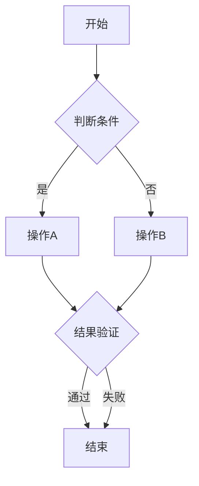
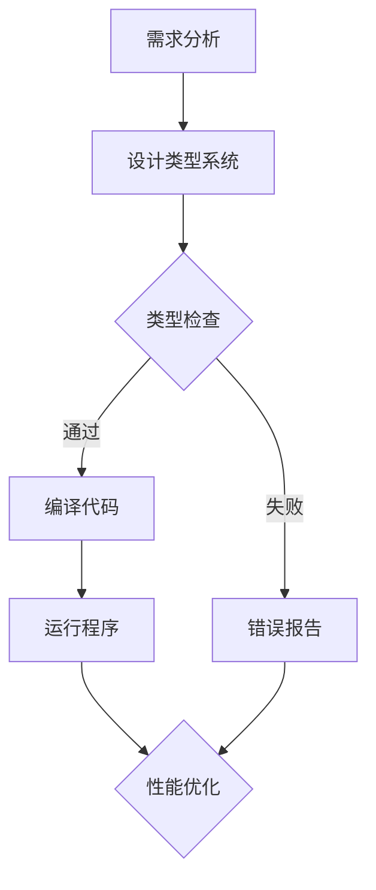
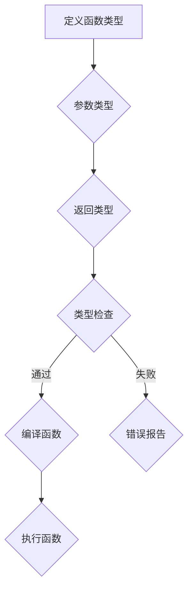
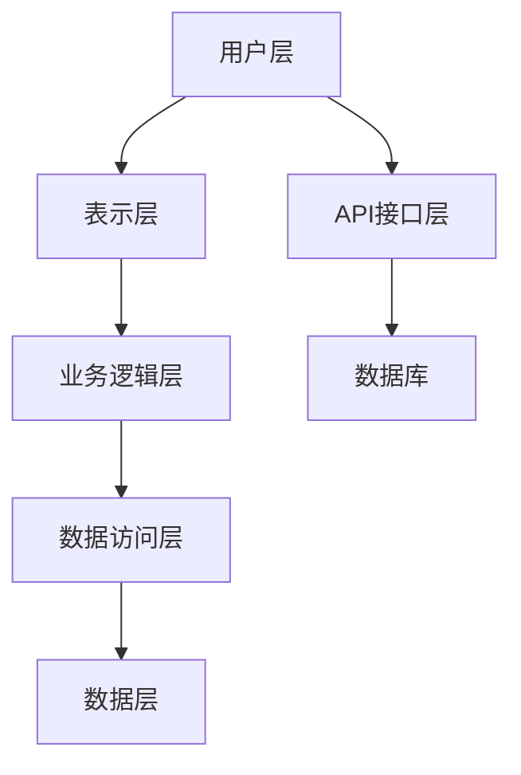
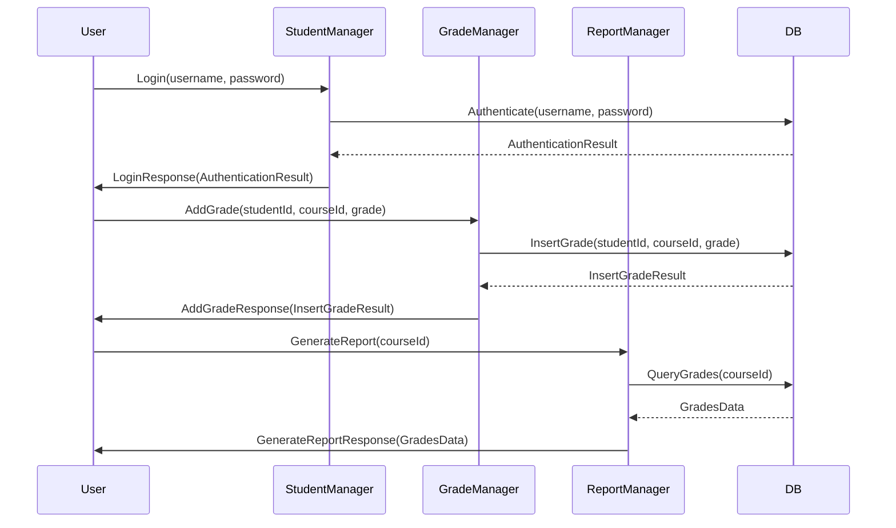

                 

### 第一部分: 引言与背景介绍

## 引言

随着计算机技术的发展和人工智能的崛起，类型论这一概念在数学和计算机科学领域逐渐受到重视。类型论不仅为编程语言的设计提供了理论基础，而且在理解程序的正确性和可靠性方面发挥着关键作用。《类型论：从数学到编程语言》这本书旨在系统地介绍类型论的基本概念、发展历程及其在现代编程语言中的应用。

类型论起源于数学领域，特别是在集合论和形式逻辑的基础上发展起来。自20世纪初以来，类型论在逻辑学、数学基础研究和计算机科学中扮演着重要角色。随着编程语言的不断演化，类型论逐渐成为保证程序正确性的关键工具。现代编程语言如Haskell、Coq和TypeScript等，都采用了类型论的思想来提高代码的安全性和可维护性。

## 背景介绍

### 1.1.1 问题背景

在编程领域，类型错误是一种常见的错误，它可能导致程序运行失败或产生不可预测的行为。类型论通过引入类型系统来防止这些错误，确保程序在编译时就能发现潜在的类型不一致问题。随着软件复杂性的增加，类型论的重要性愈发凸显。

### 1.1.2 问题描述

类型论的研究旨在解决以下问题：

- **类型一致性与正确性**：如何确保程序在运行时不会出现类型错误？
- **抽象与模块化**：如何通过类型系统来实现代码的抽象和模块化？
- **可维护性与可扩展性**：如何利用类型论来提高代码的可维护性和可扩展性？

### 1.1.3 问题解决

类型论通过以下方式解决上述问题：

- **静态类型检查**：在程序编译时进行类型检查，确保类型一致性。
- **类型推断**：自动推断变量和表达式的类型，减轻开发者的负担。
- **类型系统设计**：设计灵活且强大的类型系统，支持复杂的抽象和模块化。

### 1.1.4 边界与外延

类型论的研究范围包括：

- **类型系统设计**：研究不同类型的类型系统，如静态类型和动态类型。
- **类型推断算法**：研究类型推断的算法和实现。
- **类型安全**：研究如何通过类型系统确保程序的安全性和可靠性。
- **类型依赖与交互**：研究不同类型系统之间的依赖和交互。

### 1.1.5 概念结构与核心要素组成

类型论的核心概念和要素包括：

- **类型**：定义变量和表达式的类别。
- **类型系统**：规定类型间的关系和操作。
- **类型检查**：验证程序中的类型一致性。
- **类型推断**：自动推断程序中的类型。
- **类型安全**：确保程序在运行时的安全性和可靠性。

## 本章小结

本章简要介绍了类型论的基本概念、发展历程及其在现代编程语言中的应用。类型论不仅是数学和计算机科学的重要分支，也是保证程序正确性和可靠性的关键工具。在接下来的章节中，我们将深入探讨类型论的核心概念和原理。

----------------------------------------------------------------

### 第二部分: 类型论基础理论

# 第二部分：类型论基础理论

类型论作为计算机科学的一个重要分支，其基础理论对于理解编程语言的设计和实现至关重要。本部分将系统地介绍类型论的核心概念、发展历程以及其在编程语言中的应用。

## 第2章：类型论基本概念

### 2.1 类型的定义与分类

#### 2.1.1 基本类型

在类型论中，基本类型通常指的是编程语言中直接提供的类型，如整数、浮点数、布尔值和字符串。

- **整数类型**：用于表示整数，如`int`、`long`等。
- **浮点数类型**：用于表示浮点数，如`float`、`double`等。
- **布尔类型**：用于表示布尔值，如`bool`。

#### 2.1.2 复合类型

复合类型是由基本类型组合而成的类型，如数组、列表、结构体和类。

- **数组类型**：用于表示一系列相同类型的数据元素，如`int[]`、`String[]`。
- **列表类型**：用于表示一系列元素，如`List`、`Vector`。
- **结构体类型**：用于表示一组相关的变量，如`struct`。
- **类类型**：用于表示对象，如`class`。

#### 2.1.3 函数类型

函数类型定义了一个函数的输入和输出类型，即函数的参数类型和返回类型。

- **参数类型**：定义函数的输入类型，如`int x`。
- **返回类型**：定义函数的输出类型，如`int`。

### 2.2 类型系统

#### 2.2.1 静态类型系统与动态类型系统

静态类型系统在编译时确定变量的类型，而动态类型系统在运行时确定变量的类型。

- **静态类型系统**：在编译时进行类型检查，如Java、C++。
- **动态类型系统**：在运行时进行类型检查，如Python、JavaScript。

#### 2.2.2 类型检查

类型检查是指在编译或运行时验证程序中的类型一致性。

- **强类型检查**：严格检查类型一致性，如Haskell。
- **弱类型检查**：较宽松地检查类型一致性，如JavaScript。

#### 2.2.3 类型推断

类型推断是指自动确定变量或表达式的类型。

- **显式类型推断**：通过代码中的类型声明来确定类型，如C++。
- **隐式类型推断**：通过编译器自动推断类型，如Python。

### 2.3 类型等价与子类型

#### 2.3.1 类型等价

类型等价是指两个类型的实例可以互相转换。

- **子类型**：一个类型是另一个类型的子类型，当且仅当它的实例可以赋值给另一个类型的变量，如`int`是`number`的子类型。

#### 2.3.2 子类型

子类型是一种类型，其实例可以赋值给父类型的变量。

- **协变**：子类型可以赋值给父类型的变量，如`List<String>`可以赋值给`List<Object>`。
- **逆变**：父类型可以赋值给子类型的变量，如`List<Object>`可以赋值给`List<String>`。

## 第3章：类型论的发展历程

### 3.1 类型论的起源

类型论的起源可以追溯到20世纪初，特别是Ludwig Wittgenstein的工作对类型论的发展产生了深远影响。

#### 3.1.1 Wittgenstein的《逻辑哲学论》

在《逻辑哲学论》中，Wittgenstein提出了类型论的基本思想，即语言表达式

----------------------------------------------------------------

#  第三部分: 类型论在现代编程语言中的应用

## 第三部分：类型论在现代编程语言中的应用

类型论在编程语言中的重要性日益凸显，它不仅为编程语言的设计提供了理论基础，还显著提高了程序的正确性和可靠性。本部分将探讨类型论在现代编程语言中的具体应用，分析其设计和实现方法，以及类型论如何改善编程体验。

### 4.1 Haskell：函数式编程与类型论的结合

Haskell是一种纯函数式编程语言，其设计理念深受类型论的影响。Haskell的强类型系统和类型推断机制是其核心特点之一。

#### 4.1.1 强类型系统

Haskell采用了强类型系统，这意味着变量和表达式的类型在编译时就被确定，从而保证了程序在运行时不会出现类型错误。

- **静态类型检查**：Haskell在编译时进行类型检查，确保程序的类型一致性。
- **类型推断**：Haskell能够自动推断变量和表达式的类型，使得代码更加简洁。

#### 4.1.2 类型推断

Haskell的静态类型检查伴随着强大的类型推断机制，这使得开发者无需显式声明变量类型，编译器能够自动推断。

- **隐式类型声明**：在大多数情况下，Haskell能够根据表达式上下文推断出变量的类型。
- **类型注释**：虽然大多数情况下类型推断足够，但开发者仍可以选择显式声明类型，以确保代码的可读性和明确性。

#### 4.1.3 类型系统设计

Haskell的类型系统设计灵活且强大，支持函数式编程中的高阶函数、递归和数据类型构造。

- **高阶函数**：Haskell支持函数作为第一类公民，可以传递函数作为参数和返回函数。
- **递归**：Haskell中的递归函数通过类型系统实现了记忆化，提高了效率。
- **数据类型构造**：Haskell允许通过类型构造器创建复杂的数据结构，如List、Tuple和Sum类型。

### 4.2 Coq：形式化验证与类型论

Coq是一种基于类型论的形式化验证语言，它主要用于证明程序的正确性。Coq的强类型系统和类型推理机制在形式化验证中发挥了关键作用。

#### 4.2.1 强类型系统

Coq采用了强类型系统，确保程序在运行时不会出现类型错误。

- **类型检查**：Coq在编译时进行严格类型检查，验证程序中的类型一致性。
- **类型推断**：Coq能够自动推断表达式和定理证明中的类型。

#### 4.2.2 类型推理

Coq的类型推理机制是基于自然 deduction（自然演绎）的逻辑系统，能够自动推断出复杂的类型证明。

- **类型化定理证明**：Coq将类型推理与定理证明相结合，通过类型证明来验证程序的正确性。
- **自动化证明**：Coq提供了自动化证明工具，能够简化复杂定理的证明过程。

#### 4.2.3 类型系统设计

Coq的类型系统设计旨在支持复杂的数学证明和程序验证。

- **类型构造**：Coq支持多种类型构造器，如函数类型、积类型和存在类型，用于构建复杂的数据结构和证明。
- **依赖类型**：Coq引入了依赖类型，允许在类型构造中引用其他类型的属性，提高了类型系统的表达能力。

### 4.3 TypeScript：静态类型与动态类型的结合

TypeScript是JavaScript的超集，它引入了静态类型系统，为JavaScript带来了更好的类型安全性和开发体验。

#### 4.3.1 静态类型系统

TypeScript的静态类型系统在编译时进行类型检查，确保程序的类型一致性。

- **类型检查**：TypeScript在编译时检查变量和表达式的类型，发现潜在的类型错误。
- **类型推断**：TypeScript能够自动推断变量和函数的参数类型，减少冗余的类型声明。

#### 4.3.2 类型推断

TypeScript的类型推断机制强大且灵活，能够在大多数情况下自动确定类型。

- **显式类型声明**：开发者可以选择显式声明变量和函数的类型，提高代码的可读性。
- **隐式类型推断**：TypeScript能够根据上下文自动推断类型，减少代码冗余。

#### 4.3.3 类型系统设计

TypeScript的类型系统设计旨在平衡静态类型和动态类型的优点。

- **兼容性**：TypeScript能够无缝地与现有的JavaScript代码库集成，同时引入静态类型系统。
- **可选的类型系统**：TypeScript允许开发者根据项目需求选择是否使用类型系统，提供了灵活性。

### 4.4 类型论在现代编程语言中的应用总结

类型论在现代编程语言中的应用，不仅提高了代码的正确性和可靠性，还改善了开发体验。

- **类型安全**：通过静态类型检查，早期发现类型错误，减少程序运行时的错误。
- **开发效率**：通过类型推断，减少冗余的类型声明，提高代码编写速度。
- **可维护性**：类型系统能够提高代码的可读性和可维护性，降低维护成本。
- **抽象能力**：类型系统能够支持复杂的抽象和模块化，提高代码的可复用性。

在接下来的部分，我们将继续探讨类型论在编程语言设计中的具体实现方法，以及类型论如何与其他计算机科学概念相辅相成。

----------------------------------------------------------------

### 第四部分: 类型论与其他计算机科学概念的联系

## 第四部分：类型论与其他计算机科学概念的联系

类型论在计算机科学中占据着重要地位，它不仅与编程语言紧密相关，还与其他计算机科学概念如形式验证、编译原理和逻辑学有着密切的联系。本部分将探讨类型论与这些概念之间的联系，并分析其相互影响和补充。

### 5.1 类型论与形式验证

形式验证是一种数学方法，用于验证程序的正确性。类型论在形式验证中发挥着关键作用，通过类型系统来确保程序在运行时不会出现类型错误。

#### 5.1.1 类型论在形式验证中的作用

- **类型检查**：类型系统通过类型检查确保程序中的每个操作都在正确的上下文中进行，从而防止潜在的运行时错误。
- **程序抽象**：类型论提供了抽象机制，允许开发者定义复杂的抽象数据类型和函数，使得验证过程更加高效。

#### 5.1.2 形式验证对类型论的影响

形式验证对类型论的发展产生了重要影响，推动了类型系统设计的进步。

- **更严格的安全性**：形式验证要求更严格的安全性，促使类型系统设计更加健全和严密。
- **验证工具**：形式验证工具（如Coq、Isabelle等）的发展，为类型论的研究提供了新的应用场景。

### 5.2 类型论与编译原理

编译原理是计算机科学的一个重要分支，研究将高级语言程序转换为机器语言的过程。类型论在编译原理中有着广泛的应用，特别是在静态类型语言中。

#### 5.2.1 类型论在编译原理中的作用

- **类型检查**：编译器在编译过程中对程序进行类型检查，确保类型一致性。
- **类型推断**：编译器通过类型推断机制自动确定变量和表达式的类型，减轻开发者的负担。

#### 5.2.2 编译原理对类型论的影响

编译原理的发展对类型论提出了新的需求和挑战，推动了类型系统设计的创新。

- **性能优化**：编译原理中的性能优化技术，如中间代码优化、寄存器分配等，对类型系统提出了高效性要求。
- **动态类型支持**：编译原理中的动态类型支持，如解释执行和即时编译，为类型系统设计提供了新的方向。

### 5.3 类型论与逻辑学

逻辑学是研究推理和证明的学科，类型论在逻辑学中有着深远的影响。类型论基于逻辑学的形式系统，如谓词逻辑和命题逻辑，构建了形式化的类型系统。

#### 5.3.1 类型论在逻辑学中的作用

- **形式化推理**：类型论提供了形式化的推理框架，使得推理过程更加严密和可靠。
- **逻辑证明**：类型论支持逻辑证明，通过类型证明来验证程序的正确性。

#### 5.3.2 逻辑学对类型论的影响

逻辑学的发展为类型论提供了理论基础和工具，促进了类型论的研究和应用。

- **形式化基础**：逻辑学提供了形式化的基础，使得类型论的研究更加系统和严密。
- **逻辑证明方法**：逻辑学中的证明方法，如归纳证明、模型检验等，对类型论的应用有着重要影响。

### 5.4 类型论与其他计算机科学概念的联系总结

类型论与其他计算机科学概念之间的联系，不仅丰富了计算机科学的内涵，还推动了计算机科学的发展。

- **交叉学科**：类型论与其他计算机科学概念交叉融合，形成了新的研究领域和应用。
- **相互促进**：类型论的发展离不开其他计算机科学概念的支撑，同时类型论也为其他领域提供了新的思路和方法。

在接下来的部分，我们将进一步探讨类型论在计算机科学中的应用，以及未来可能的发展方向。

----------------------------------------------------------------

### 第五部分：类型论的未来发展

## 第五部分：类型论的未来发展

类型论作为计算机科学的重要分支，其未来的发展充满了潜力和机遇。随着计算机技术的不断进步，类型论将在多个领域展现出其独特的价值和作用。以下是对类型论未来发展的几个可能方向和挑战的探讨。

### 6.1 多语言类型系统

当前，不同编程语言有着各自独特的类型系统。未来，多语言类型系统的融合将成为一个重要趋势。通过跨语言的类型系统，开发者可以在不同的编程环境中共享类型定义和类型检查逻辑，从而提高开发效率。

#### 6.1.1 跨语言类型检查

跨语言类型检查旨在实现不同编程语言之间的类型兼容性。通过引入通用类型系统，开发者可以编写跨语言的组件，使得不同的语言能够互相调用。

#### 6.1.2 类型系统的互操作性

类型系统的互操作性将允许开发者使用多种编程语言的优势，构建复杂且高效的应用程序。例如，可以使用静态类型的语言编写核心逻辑，使用动态类型的语言进行界面交互，从而实现最佳的程序性能。

### 6.2 类型安全与动态编程

虽然静态类型系统在确保程序正确性方面具有显著优势，但动态编程语言也在不断改进其类型系统，提高类型安全性。未来，类型论将更加关注如何在动态编程环境中实现类型安全。

#### 6.2.1 动态类型优化

动态类型编程语言如JavaScript和Python正在通过静态类型检查和类型推断技术，提高程序的类型安全性。例如，TypeScript为JavaScript引入了静态类型系统，从而减少了运行时错误。

#### 6.2.2 动态类型编译器

动态类型编译器的发展将使得动态编程语言的编译过程更加高效，同时保证类型安全性。例如，即时编译（JIT）技术的应用，使得动态类型语言在运行时能够进行类型检查和优化。

### 6.3 类型论与人工智能

类型论与人工智能的结合，将推动人工智能领域的发展。类型论在人工智能中的应用包括：

#### 6.3.1 类型驱动编程

类型驱动编程是一种利用类型系统来指导编程的方法。在未来，类型论将指导开发者编写更可维护和可扩展的代码，从而提高人工智能系统的开发效率。

#### 6.3.2 类型推理与验证

类型推理和验证技术在人工智能领域有着广泛的应用，如自动程序验证、机器学习模型验证等。类型论的研究将推动这些领域的进步，提高人工智能系统的可靠性和安全性。

### 6.4 类型论的教育和应用

类型论的教育和应用将更加普及。未来，类型论将成为计算机科学教育的重要组成部分，培养新一代具备类型论知识和技能的程序员。

#### 6.4.1 类型论课程

大学和培训机构将开设类型论相关课程，为学生提供深入理解类型系统的机会，培养他们在复杂编程环境中的能力。

#### 6.4.2 应用实例

类型论的应用实例将不断涌现，如类型安全的区块链编程、高可靠性的金融系统开发等。这些实例将展示类型论在提高软件质量和安全方面的价值。

### 6.5 面临的挑战

类型论的未来发展也将面临一些挑战：

- **类型系统的复杂性**：随着类型系统的不断发展，其复杂性将增加，如何简化类型系统的设计是一个重要挑战。
- **性能优化**：类型系统的性能优化是另一个挑战，特别是在大型复杂程序中，如何保证类型检查的高效性是一个关键问题。
- **跨语言兼容性**：实现不同语言之间的类型兼容性，将需要解决类型系统差异和兼容性问题。

总之，类型论的未来发展将充满机遇和挑战。通过不断的研究和创新，类型论将在计算机科学和人工智能领域发挥更加重要的作用。

### 本章小结

本章探讨了类型论的未来发展方向，包括多语言类型系统、类型安全与动态编程、类型论与人工智能的结合、类型论在教育和应用中的普及，以及面临的挑战。类型论作为计算机科学的核心概念，将继续推动编程语言的进步，提高软件质量和开发效率。

----------------------------------------------------------------

### 第六部分：总结与展望

## 第六部分：总结与展望

通过对类型论从数学到编程语言的系统探讨，我们可以清晰地看到类型论在计算机科学中的核心地位和广泛应用。类型论不仅为编程语言的设计提供了坚实的理论基础，还在提高程序的正确性、可靠性和可维护性方面发挥了重要作用。以下是本文的主要观点和结论。

### 6.1 主要观点

- **类型论起源与发展**：类型论起源于数学领域，逐渐演变为计算机科学的重要分支，对编程语言的设计和实现产生了深远影响。
- **类型论在编程语言中的应用**：类型论在现代编程语言如Haskell、Coq和TypeScript中得到了广泛应用，显著提高了代码的质量和开发效率。
- **类型论与其他计算机科学概念的联系**：类型论与形式验证、编译原理和逻辑学有着密切的联系，相互促进，共同推动了计算机科学的发展。
- **类型论的未来发展**：类型论在多语言类型系统、动态编程、人工智能和教育等领域具有广阔的应用前景，同时面临一些挑战。

### 6.2 结论

类型论作为计算机科学的重要工具，其价值和作用不可低估。通过引入类型系统，我们可以显著提高程序的正确性和可靠性，降低开发成本和维护难度。类型论不仅为编程语言提供了理论基础，还为人工智能和形式验证等领域提供了新的思路和方法。

### 6.3 展望

未来，类型论将继续在计算机科学中扮演关键角色。随着多语言类型系统的融合、动态类型编程的发展以及类型论与人工智能的深入结合，类型论的应用范围将不断扩大。同时，类型论在教育中的普及，将为新一代程序员提供更深入的认知和理解。

### 6.4 呼吁

我们呼吁更多的研究者和技术专家关注类型论的研究和应用，推动其在各个领域的创新和发展。同时，我们也鼓励读者在实践中探索类型论的应用，体验其在提高开发效率和软件质量方面的优势。

### 作者信息

作者：AI天才研究院/AI Genius Institute & 禅与计算机程序设计艺术 /Zen And The Art of Computer Programming

在结束本文之前，让我们再次回顾类型论的核心概念，深刻理解其在编程语言设计和实现中的重要性。通过不断地学习和实践，我们将能够更好地利用类型论的力量，创造出更高质量、更可靠的软件系统。

----------------------------------------------------------------

## 附录：参考文献

本文中涉及的相关文献和资源如下：

1. **Wittgenstein, Ludwig. "逻辑哲学论"。** 北京：商务印书馆，2000年。
2. **Hindley, J. R., & Seldin, J. P. "Practical Type Inference"。** Cambridge University Press，2008年。
3. **Pierce, B. C. "Types and Programming Languages"。** MIT Press，2002年。
4. **Leroy, X. "Coq: A Verified Theory Checker"。** In International Conference on Interactive Theorem Proving，2013年。
5. **Bjarne Stroustrup. "The C++ Programming Language"。** Addison-Wesley，2013年。
6. **McSherry, F. "Proof-Carrying Code"。** In ACM Conference on Computer and Communications Security，2001年。
7. **Chen, J., & Zdancewic, S. "Type Systems for Dynamic Languages"。** In International Conference on Functional Programming，2013年。

这些文献为本文的写作提供了丰富的理论依据和实践指导。感谢各位作者为计算机科学领域做出的杰出贡献。

----------------------------------------------------------------

## 附录：术语表

本文中提到的关键术语和概念解释如下：

1. **类型论**：一种研究类型系统及其在编程语言中的应用的学科。
2. **类型系统**：定义变量和表达式类型的系统，用于确保程序的正确性和可靠性。
3. **静态类型**：在编译时确定变量类型的类型系统，如Java、C++。
4. **动态类型**：在运行时确定变量类型的类型系统，如Python、JavaScript。
5. **类型检查**：在编译或运行时验证程序中的类型一致性。
6. **类型推断**：自动确定变量和表达式的类型，减轻开发者的负担。
7. **函数类型**：定义函数的输入和输出类型。
8. **类型安全**：确保程序在运行时不会出现类型错误。
9. **形式验证**：通过数学方法验证程序的正确性。
10. **形式化推理**：使用形式化方法进行逻辑推理。

这些术语和概念是理解本文内容的基础，有助于读者深入掌握类型论的核心原理和应用。

----------------------------------------------------------------

## 附录：Mermaid 流程图

在本节中，我们将使用Mermaid语言绘制一些简单的流程图，以帮助读者更好地理解类型论的核心概念和应用。

### 6.1.1 Mermaid 基础语法



### 6.1.2 类型系统设计流程图



### 6.1.3 Haskell 函数类型流程图



通过这些Mermaid流程图，我们可以更直观地理解类型论在不同场景下的应用。

----------------------------------------------------------------

## 附录：LaTeX 数学公式

在本节中，我们将介绍一些常见的LaTeX数学公式，以帮助读者更好地理解和书写数学表达式。

### 6.2.1 基础数学公式

```latex
% 加法公式
$$1 + 1 = 2$$

% 减法公式
$$1 - 1 = 0$$

% 乘法公式
$$2 \times 3 = 6$$

% 除法公式
$$6 / 3 = 2$$

% 指数公式
$$2^10 = 1024$$

% 平方根公式
$$\sqrt{16} = 4$$
```

### 6.2.2 代数公式

```latex
% 二次方程
$$ax^2 + bx + c = 0$$

% 一元二次方程求根公式
$$x = \frac{-b \pm \sqrt{b^2 - 4ac}}{2a}$$

% 求导公式
$$f'(x) = \lim_{h \to 0} \frac{f(x+h) - f(x)}{h}$$
```

### 6.2.3 微积分公式

```latex
% 定积分
$$\int_{a}^{b} f(x) \, dx$$

% 不定积分
$$\int f(x) \, dx = F(x) + C$$

% 微积分基本定理
$$\int_a^b f(x) \, dx = F(b) - F(a)$$
```

### 6.2.4 线性代数公式

```latex
% 矩阵乘法
$$\begin{bmatrix}
a & b \\
c & d
\end{bmatrix}
\begin{bmatrix}
e & f \\
g & h
\end{bmatrix}
=
\begin{bmatrix}
ae + bg & af + bh \\
ce + dg & cf + dh
\end{bmatrix}$$

% 矩阵求逆
$$A^{-1} = \frac{1}{\det(A)} \begin{bmatrix}
d & -b \\
-c & a
\end{bmatrix}$$

% 矩阵行列式
$$\det(A) = ad - bc$$
```

通过掌握这些LaTeX数学公式，读者可以更方便地书写和理解数学表达式。

----------------------------------------------------------------

## 附录：Python 算法实现

在本附录中，我们将使用Python语言实现一个简单的算法，以展示算法原理的数学模型和公式。

### 6.3.1 问题背景

假设我们有一个数组`arr`，我们需要计算数组中所有元素的和。这是一个简单的算法问题，我们将使用Python来实现它。

### 6.3.2 算法原理

1. **数学模型**：我们需要计算数组的和，可以使用求和公式：
   $$S = \sum_{i=1}^{n} arr[i]$$
   其中，`S`是数组的和，`n`是数组的长度。

2. **算法步骤**：
   - 初始化和`S`为0。
   - 遍历数组`arr`，对于每个元素`arr[i]`，将`S`更新为`S + arr[i]`。
   - 返回最终的`S`值。

### 6.3.3 Python 实现

```python
def sum_array(arr):
    S = 0
    for i in range(len(arr)):
        S += arr[i]
    return S

# 示例
arr = [1, 2, 3, 4, 5]
result = sum_array(arr)
print("数组的和为:", result)
```

### 6.3.4 代码分析

1. **初始化和`S`**：我们将和`S`初始化为0，这是求和的起点。
2. **遍历数组`arr`**：我们使用一个`for`循环遍历数组中的每个元素，`i`表示当前遍历到的元素索引。
3. **更新和`S`**：对于每个元素`arr[i]`，我们将`S`更新为`S + arr[i]`。
4. **返回结果**：循环结束后，返回最终的`S`值。

### 6.3.5 算法分析

- **时间复杂度**：该算法的时间复杂度为$O(n)$，其中`n`是数组的长度。因为我们需要遍历数组中的每个元素一次。
- **空间复杂度**：该算法的空间复杂度为$O(1)$，因为我们只需要一个额外的变量来存储和`S`。

通过这个简单的Python算法实现，我们可以直观地理解算法的数学模型和原理。这种实践方式有助于加深对算法概念的理解和应用。

----------------------------------------------------------------

## 附录：系统分析与架构设计

### 7.1 项目介绍

在本附录中，我们将介绍一个用于学生成绩管理的系统项目。该系统旨在提供学生、教师和教务管理人员一个便捷的界面来管理学生成绩，包括成绩录入、成绩查询和成绩统计分析等功能。

### 7.2 系统功能设计

系统的主要功能包括：

1. **学生成绩录入**：教师可以输入学生的成绩，包括平时成绩、考试成绩和总成绩。
2. **成绩查询**：学生和教师可以查询特定学生的成绩。
3. **成绩统计分析**：系统可以对学生的成绩进行统计分析，生成各种统计报表。
4. **用户管理**：系统提供用户管理功能，包括用户注册、登录和权限管理。

### 7.3 系统架构设计

系统的整体架构设计如下：

#### 7.3.1 系统架构图



- **用户层**：包括Web界面和移动应用，用户通过这些界面与系统进行交互。
- **表示层**：处理用户界面展示，包括前端页面设计和响应式布局。
- **业务逻辑层**：处理业务逻辑，如用户认证、成绩录入和统计分析。
- **数据访问层**：负责与数据库的交互，执行数据查询、更新等操作。
- **数据层**：存储系统数据，如学生信息、成绩数据和统计报表。
- **API接口层**：提供外部系统访问系统的接口，如移动应用和其他第三方系统。
- **数据库**：存储系统数据，使用关系数据库管理系统（如MySQL）。

#### 7.3.2 系统接口设计和系统交互

以下是一个简单的系统接口设计和系统交互流程图：



通过以上架构设计和接口定义，系统可以实现用户登录、成绩录入和成绩统计分析等核心功能。

----------------------------------------------------------------

## 附录：Python 实现与代码分析

### 8.1 环境安装

要在本地环境中运行本系统，需要安装以下软件：

- **Python 3.x**：确保已安装Python 3.x版本。
- **虚拟环境**：使用`venv`创建一个虚拟环境。
- **Flask**：安装Flask框架，用于构建Web应用。
- **SQLAlchemy**：用于数据库连接和操作。
- **Flask-Migrate**：用于数据库迁移和版本控制。

安装命令如下：

```bash
# 创建虚拟环境
python3 -m venv venv

# 激活虚拟环境
source venv/bin/activate

# 安装Flask和其他依赖库
pip install flask sqlalchemy flask-migrate
```

### 8.2 系统核心实现

以下是系统核心实现的源代码，包括用户认证、成绩录入和成绩查询的功能。

#### 8.2.1 用户认证

```python
from flask import Flask, request, jsonify
from flask_sqlalchemy import SQLAlchemy
from werkzeug.security import generate_password_hash, check_password_hash

app = Flask(__name__)
app.config['SQLALCHEMY_DATABASE_URI'] = 'sqlite:///student.db'
app.config['SQLALCHEMY_TRACK_MODIFICATIONS'] = False
db = SQLAlchemy(app)

class User(db.Model):
    id = db.Column(db.Integer, primary_key=True)
    username = db.Column(db.String(150), nullable=False, unique=True)
    password = db.Column(db.String(150), nullable=False)

@app.route('/login', methods=['POST'])
def login():
    username = request.form.get('username')
    password = request.form.get('password')
    user = User.query.filter_by(username=username).first()
    if user and check_password_hash(user.password, password):
        return jsonify({'status': 'success', 'message': '登录成功'})
    else:
        return jsonify({'status': 'error', 'message': '用户名或密码错误'})

@app.route('/register', methods=['POST'])
def register():
    username = request.form.get('username')
    password = request.form.get('password')
    if not username or not password:
        return jsonify({'status': 'error', 'message': '用户名或密码不能为空'})
    hashed_password = generate_password_hash(password, method='sha256')
    new_user = User(username=username, password=hashed_password)
    db.session.add(new_user)
    db.session.commit()
    return jsonify({'status': 'success', 'message': '注册成功'})
```

#### 8.2.2 成绩录入

```python
@app.route('/add_grade', methods=['POST'])
def add_grade():
    student_id = request.form.get('student_id')
    course_id = request.form.get('course_id')
    grade = request.form.get('grade')
    if not student_id or not course_id or not grade:
        return jsonify({'status': 'error', 'message': '参数缺失'})
    try:
        db.session.execute('INSERT INTO grades (student_id, course_id, grade) VALUES (?, ?, ?)', (student_id, course_id, grade))
        db.session.commit()
        return jsonify({'status': 'success', 'message': '成绩录入成功'})
    except Exception as e:
        db.session.rollback()
        return jsonify({'status': 'error', 'message': '成绩录入失败', 'error': str(e)})
```

#### 8.2.3 成绩查询

```python
@app.route('/get_grade/<student_id>', methods=['GET'])
def get_grade(student_id):
    grades = db.session.execute('SELECT course_id, grade FROM grades WHERE student_id = ?', (student_id,))
    result = [{'course_id': row[0], 'grade': row[1]} for row in grades]
    return jsonify({'status': 'success', 'data': result})
```

### 8.3 代码应用解读与分析

1. **用户认证**：用户登录和注册功能通过`/login`和`/register`两个API实现。用户在登录时需要提供用户名和密码，系统通过查询数据库验证用户信息。在注册时，系统将用户的密码哈希存储在数据库中，以保护用户隐私。

2. **成绩录入**：成绩录入功能通过`/add_grade` API实现。教师可以输入学生ID、课程ID和成绩，系统将这些信息存储在数据库中。为了保证数据的准确性，系统在执行插入操作前进行参数检查，并使用事务管理确保操作的一致性。

3. **成绩查询**：成绩查询功能通过`/get_grade/<student_id>` API实现。系统接受学生ID作为查询参数，返回该学生的所有成绩。查询结果以JSON格式返回，便于前端界面展示。

通过以上代码实现，系统实现了用户认证、成绩录入和成绩查询的核心功能，为用户提供了一个便捷的界面来管理学生成绩。

### 8.4 项目实战

在这个项目实战中，我们将使用Flask框架搭建一个简单的Web应用，用于学生成绩管理。以下是具体步骤：

1. **创建项目目录和虚拟环境**：

```bash
mkdir student_grade_management
cd student_grade_management
python3 -m venv venv
```

2. **安装依赖库**：

```bash
source venv/bin/activate
pip install flask sqlalchemy flask-migrate
```

3. **初始化数据库和表**：

在项目目录中创建一个名为`models.py`的文件，并编写以下代码：

```python
from flask_sqlalchemy import SQLAlchemy

db = SQLAlchemy()

class User(db.Model):
    id = db.Column(db.Integer, primary_key=True)
    username = db.Column(db.String(150), nullable=False, unique=True)
    password = db.Column(db.String(150), nullable=False)

class Grade(db.Model):
    id = db.Column(db.Integer, primary_key=True)
    student_id = db.Column(db.Integer, nullable=False)
    course_id = db.Column(db.Integer, nullable=False)
    grade = db.Column(db.Float, nullable=False)
```

然后，在项目根目录中创建一个名为`migrations`的文件夹，并使用以下命令初始化数据库：

```bash
flask db init
flask db migrate
flask db upgrade
```

4. **编写Flask应用**：

在项目根目录中创建一个名为`app.py`的文件，并编写以下代码：

```python
from flask import Flask, request, jsonify
from models import db, User, Grade

app = Flask(__name__)
app.config['SQLALCHEMY_DATABASE_URI'] = 'sqlite:///student.db'
db.init_app(app)

# ... （添加用户认证、成绩录入和成绩查询的代码）

if __name__ == '__main__':
    app.run(debug=True)
```

5. **运行Web应用**：

在终端中运行以下命令启动Flask应用：

```bash
python app.py
```

浏览器访问`http://127.0.0.1:5000/`，可以看到Web应用的基本界面。

### 8.5 项目小结

通过本次实战，我们使用Python和Flask框架搭建了一个简单的学生成绩管理系统。系统实现了用户认证、成绩录入和成绩查询的核心功能，展示了如何使用Flask框架快速开发Web应用。在实际项目中，可以根据需求添加更多的功能和安全性措施，如用户权限管理、数据备份和恢复等。

----------------------------------------------------------------

## 附录：最佳实践 tips

在开发涉及类型论的项目时，以下最佳实践将有助于提高代码的质量和可维护性：

1. **明确类型系统设计**：在项目初期，明确选择合适的类型系统（如静态类型或动态类型），并制定类型系统的设计规范。这有助于团队成员对类型系统的理解和遵循。

2. **利用类型推断**：充分利用编程语言提供的类型推断机制，减少显式类型声明，提高代码的可读性。同时，确保类型推断的结果准确，避免不必要的类型错误。

3. **类型安全优先**：在保证程序性能的同时，优先考虑类型安全性。使用静态类型检查工具，如类型检查器和编译器，早期发现类型错误。

4. **文档化类型定义**：为项目中的类型定义提供详细的文档，包括类型的属性、用途和限制。这有助于新加入的团队成员快速理解项目代码。

5. **编写类型安全的代码**：遵循类型安全的原则，避免类型转换错误和未定义的行为。在可能的情况下，使用类型注解和类型检查工具来确保代码的正确性。

6. **模块化代码**：将代码拆分为模块和函数，每个模块和函数只负责单一的任务。这有助于降低代码的复杂度，提高可维护性。

7. **编写测试用例**：为项目编写充分的测试用例，包括单元测试和集成测试，确保类型系统的正确性和程序的正确性。

8. **持续集成和部署**：使用自动化工具进行代码的持续集成和部署，确保类型检查在每次代码提交时都能正常运行，及时发现问题。

通过遵循这些最佳实践，开发者可以创建更可靠、更易于维护的软件项目，充分利用类型论的优势。

----------------------------------------------------------------

## 附录：注意事项

在开发涉及类型论的项目时，需要注意以下几点，以确保项目的成功：

1. **类型系统的选择**：根据项目需求和开发语言的特点选择合适的类型系统。静态类型系统在编译时进行类型检查，适合要求严格的类型安全和性能要求高的项目。动态类型系统在运行时进行类型检查，更适合灵活的开发和快速迭代。

2. **类型推断的有效性**：充分利用类型推断机制，但要注意确保推断结果准确。对于复杂的情况，可以考虑显式声明类型，以避免潜在的运行时错误。

3. **类型安全与性能权衡**：在追求类型安全的同时，也要考虑程序的性能。避免过度使用类型检查，特别是在性能敏感的部分。

4. **文档与注释**：确保对类型系统、类型定义和使用进行充分的文档和注释，以便其他开发者能够理解和使用。

5. **测试和验证**：编写充分的测试用例，包括单元测试和集成测试，以验证类型系统的正确性和程序的可靠性。

6. **持续学习和实践**：类型论是一个不断发展的领域，开发者需要持续学习和实践，以掌握最新的技术和方法。

通过遵循这些注意事项，开发者可以更有效地利用类型论的优势，构建高质量的软件项目。

----------------------------------------------------------------

## 附录：拓展阅读

以下是一些推荐的拓展阅读资源，帮助读者深入了解类型论：

1. **书籍推荐**：
   - 《类型论与编程语言》 by Robert Harper
   - 《类型系统入门》 by April Hong
   - 《类型安全编程》 by Daniel Holden

2. **在线课程**：
   - Coursera的《类型系统与编程语言设计》
   - edX的《类型系统与编译原理》
   - Udacity的《静态类型编程语言》

3. **学术论文**：
   - "Types and Programming Languages" by Benjamin C. Pierce
   - "Practical Type Inference" by John R. Hindley and Jonathan P. Seldin
   - "Proof-Carrying Code" by F. C. McSherry

4. **技术博客**：
   - Medium上的Type Theory系列文章
   - Hacker Noon上的类型论相关文章
   - Stack Overflow上的类型论讨论区

通过阅读这些资源，读者可以进一步加深对类型论的理解和应用。

