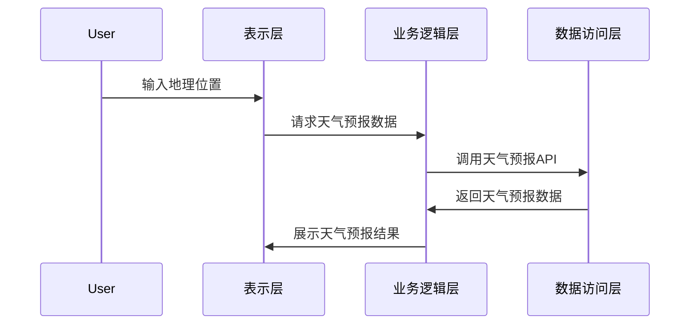

                 

### 第一部分: 类型驱动开发的基本概念

#### 引言

类型驱动开发（Type-driven Development）是近年来在软件开发领域崭露头角的一种新兴开发模式。它通过严格定义和利用类型系统，以类型为核心来提高软件开发的可靠性、安全性和效率。在本文中，我们将深入探讨类型驱动开发的基本概念，从其背景、核心概念、与现有开发模式的对比及其应用范围等多个角度进行详细解析。

在快速迭代的软件开发环境中，传统的开发模式往往难以满足日益复杂的系统需求。代码错误、类型不匹配等问题层出不穷，导致项目进度延迟和质量下降。为了应对这些挑战，类型驱动开发应运而生。它强调在开发过程中，类型作为关键要素，不仅能够提高代码的健壮性，还能通过静态类型检查提前发现潜在问题。

本文将首先介绍类型驱动开发的背景和概念，然后深入探讨类型系统的原理与设计，接着分析类型驱动开发的应用实践，并探讨其在深度学习等领域的深度应用。最后，我们将展望类型驱动开发的未来方向，探讨其发展趋势和潜在的创新点。

通过本文的阅读，您将全面了解类型驱动开发的核心理念和实践方法，掌握其在软件开发中的价值和应用。无论您是资深开发者还是对新技术充满好奇的新手，类型驱动开发都将为您带来新的视角和思路。

#### 问题背景

在现代软件开发中，代码错误、类型不匹配等问题频繁出现，严重影响了软件开发的效率和可靠性。这些问题不仅导致项目进度的延误，还增加了后期的维护成本，降低了软件质量。以下是几个常见的软件开发挑战：

1. **代码复杂性增加**：随着软件系统的规模和复杂性不断增长，代码的维护和扩展变得越来越困难。传统开发模式往往依赖于经验和直觉，难以应对复杂的业务逻辑和大量的数据处理。

2. **类型不匹配**：在动态类型的编程语言中，类型不匹配是一个常见的问题。这类错误通常在运行时才被发现，导致应用程序在关键时刻崩溃或产生不可预见的错误。

3. **代码质量低下**：由于缺乏明确的类型检查机制，开发者可能会在编写代码时忽略类型安全，导致代码质量低下，出现潜在的安全漏洞。

4. **调试困难**：当系统出现问题时，静态类型检查可以帮助开发者快速定位错误，而在动态类型语言中，这种快速定位的能力往往受限。

5. **跨语言集成**：在多语言开发环境中，不同语言之间的类型系统差异往往导致集成困难。例如，将Java与JavaScript集成时，类型不匹配的问题会频繁出现。

这些挑战使得开发者迫切需要一种能够提高代码质量、可靠性和开发效率的新方法。类型驱动开发应运而生，通过引入严格的类型系统，可以有效解决上述问题。类型驱动开发通过在开发过程中对类型进行严格的定义和管理，能够提前发现并纠正类型错误，从而减少调试时间和维护成本。

此外，类型驱动开发还支持代码的重用和模块化，使得大型项目更容易管理和维护。通过静态类型检查，开发者可以在编译阶段发现潜在的问题，而无需等到运行时才能发现。这种提前发现问题的方式不仅提高了开发效率，还能确保软件在部署时的稳定性。

总之，类型驱动开发通过引入类型系统，提供了强大的类型检查和自动推理能力，显著提升了软件开发的可靠性和安全性，为解决现代软件开发中的挑战提供了新的思路和工具。

#### 类型驱动开发的概念

类型驱动开发（Type-driven Development）是一种以类型系统为核心的软件开发方法，其核心理念是将类型作为软件开发的基础，通过严格定义和利用类型系统，提高代码的健壮性、可维护性和开发效率。在类型驱动开发中，类型不仅用于表示数据的结构，还用于描述程序的行为和约束。

首先，类型系统是类型驱动开发的基础。类型系统包括数据类型、函数类型和类型约束等组成部分。数据类型定义了程序中可以使用的各种数据结构，如整数、字符串和布尔值等。函数类型则描述了函数的输入和输出类型，确保函数的输入参数和返回值类型匹配。类型约束是一种更加灵活的类型系统，允许开发者定义更复杂的类型约束和泛型。

类型驱动开发的核心步骤如下：

1. **类型定义**：在项目开发初期，开发者需要为系统的各个组件定义类型。这包括数据结构、函数接口和模块接口等。类型定义有助于明确各个组件的输入和输出类型，确保系统组件之间的一致性和兼容性。

2. **静态类型检查**：通过静态类型检查，开发工具可以在编译阶段发现类型错误，从而提前排除潜在的问题。静态类型检查不仅有助于提高代码质量，还能提高开发效率，减少后期调试的工作量。

3. **类型推导**：类型驱动开发中的类型推导是一种自动化的类型推断过程。通过分析代码结构和上下文，编译器可以自动推导出变量和函数的类型。类型推导使得开发者无需手动编写冗长的类型声明，提高了代码的简洁性和可读性。

4. **类型安全**：类型安全是类型驱动开发的重要目标之一。通过严格的类型检查，可以确保代码在运行时不会因为类型错误而导致崩溃或异常。类型安全不仅提高了程序的稳定性，还减少了潜在的安全漏洞。

5. **代码重用和模块化**：类型驱动开发支持代码的重用和模块化，使得大型项目更容易管理和维护。通过定义明确的类型接口，组件之间的依赖关系更加清晰，开发者可以独立开发和维护各个模块，提高了项目的可扩展性和灵活性。

6. **集成和互操作性**：在多语言开发环境中，类型驱动开发通过引入统一类型的定义和检查机制，可以简化跨语言集成的复杂度。不同语言之间的类型系统差异通过类型驱动开发的机制得到缓解，提高了系统的互操作性和可维护性。

总之，类型驱动开发通过引入严格的类型系统和自动化类型检查机制，能够有效提高软件开发的可靠性、安全性和效率。它不仅适用于大型复杂项目，还能为开发团队提供更好的开发体验和工作效率。在接下来的章节中，我们将进一步探讨类型系统的原理和设计，以及类型驱动开发在实际应用中的挑战和机遇。

### 核心概念

在深入探讨类型驱动开发之前，我们有必要了解其核心概念。类型系统是类型驱动开发的基础，而类型推导和类型检查是其关键机制。以下是对这些核心概念的详细解释：

#### 类型系统概述

类型系统是一种编程语言机制，用于定义变量、表达式和函数的类型，以及它们之间的兼容性和转换规则。类型系统可以分为静态类型系统和动态类型系统。

1. **静态类型系统**：在静态类型系统中，变量的类型在编译时就已经确定，并且在整个运行过程中保持不变。Java、C++和Haskell等语言都是静态类型的。静态类型系统的优点是可以在编译时发现类型错误，提高程序的可靠性。然而，它也可能增加代码的复杂性，因为开发者需要手动声明每个变量的类型。

2. **动态类型系统**：在动态类型系统中，变量的类型是在运行时确定的。Python、JavaScript和Ruby等语言都是动态类型的。动态类型系统提供了更大的灵活性和简洁性，但可能导致运行时错误，因为类型检查是在运行时进行的。

#### 强类型与弱类型

强类型和弱类型是类型系统的两种不同风格。

1. **强类型**：强类型系统要求变量在使用前必须声明类型，并且在运行过程中保持类型不变。这种风格强调类型安全和明确的类型约束。强类型系统可以减少类型错误，提高程序的稳定性和可维护性。Haskell和OCaml等语言就是强类型的。

2. **弱类型**：弱类型系统对变量的类型约束较松，允许在运行时动态改变变量的类型。这种风格提供了更大的灵活性和简洁性，但可能增加类型错误的风险。Python和JavaScript等语言就是弱类型的。

#### 类型推导与类型检查

类型推导和类型检查是类型系统的两个关键机制。

1. **类型推导**：类型推导是一种自动化的类型推断过程，通过分析代码结构和上下文，编译器可以自动推导出变量和函数的类型。类型推导可以减少代码的复杂性，提高开发效率。Haskell和ML等语言具有良好的类型推导机制。

2. **类型检查**：类型检查是一种验证程序类型安全性的过程。在编译时，编译器会检查代码中的类型是否匹配，确保程序在运行时不会因为类型错误导致崩溃。类型检查可以分为静态类型检查和动态类型检查。

- **静态类型检查**：在编译时进行类型检查，可以在代码运行前发现类型错误。Java和C++等语言使用静态类型检查。
- **动态类型检查**：在运行时进行类型检查，可以在代码运行时发现类型错误。Python和JavaScript等语言使用动态类型检查。

#### 类型系统在编程语言中的应用

不同的编程语言采用了不同的类型系统，以适应不同的应用场景和开发需求。

1. **Haskell**：Haskell是一种纯函数式编程语言，以其强类型系统和完善的类型推导机制著称。Haskell的类型系统支持高阶函数、类型类和类型推导，使得编写复杂和安全的代码变得更加容易。

2. **OCaml**：OCaml是一种功能强大的编程语言，支持静态类型检查和强类型系统。OCaml的类型系统提供了模式匹配、类型推断和类型约束，使得代码的可读性和可靠性都得到了显著提高。

3. **Idris**：Idris是一种依赖类型编程语言，它结合了静态类型检查和依赖类型的特点。Idris的类型系统能够提供更严格的类型安全性，同时支持类型推导和类型可解释性。

4. **Java**：Java是一种静态类型的面向对象编程语言，其类型系统支持复杂的对象模型和类型约束。Java的类型系统提供了静态类型检查，确保代码在运行时的稳定性。

5. **Python**：Python是一种动态类型的编程语言，以其简洁和易用性著称。Python的类型系统虽然较为灵活，但在运行时进行类型检查，可能导致一些类型错误在运行时才被发现。

综上所述，类型系统是类型驱动开发的核心概念，它在编程语言中的应用多种多样，以适应不同的开发需求。了解并掌握这些核心概念，将为深入理解类型驱动开发打下坚实的基础。在接下来的章节中，我们将进一步探讨类型系统的设计和实现，以及类型驱动开发在实际应用中的挑战和机遇。

#### 类型驱动开发的联系

类型驱动开发（Type-driven Development）不仅在技术层面上具有独特的优势，同时也与传统开发模式和面向对象编程有着密切的联系和区别。理解这些联系和区别，有助于我们更好地把握类型驱动开发的本质和应用范围。

**与传统开发的对比**

1. **静态类型检查与动态类型检查**：传统开发模式中，特别是在使用动态类型语言（如Python、JavaScript等）时，类型错误通常在运行时才被发现，导致调试难度增加。而类型驱动开发通过静态类型检查，在编译阶段就能发现类型错误，从而减少了运行时的错误风险，提高了代码的可靠性。

2. **类型安全与代码灵活性**：传统开发模式往往依赖于开发者的经验来判断代码的正确性，容易导致类型不匹配和运行时错误。类型驱动开发通过严格的类型约束，确保变量和函数的使用符合预期，提高了代码的安全性和稳定性。

3. **开发效率与代码质量**：传统开发模式可能因为类型不明确而需要大量的调试和重构工作，导致开发效率降低。类型驱动开发通过类型推导和自动类型检查，减少了代码的复杂性，提高了开发效率，同时也提高了代码质量。

**与面向对象编程的关系**

1. **类型与对象**：在面向对象编程（OOP）中，对象是程序的基本构建块，通过封装、继承和多态等特性来实现代码的重用和抽象。类型驱动开发同样重视类型系统，通过定义明确的类型，实现对对象的约束和行为的描述。

2. **类型约束与接口**：面向对象编程中的接口定义了对象的行为和交互方式，类型驱动开发中的类型约束也可以看作是一种接口定义。通过类型约束，可以确保对象间的交互符合预期，提高系统的稳定性和一致性。

3. **泛型编程与类型驱动开发**：泛型编程是一种重要的类型系统特性，它允许在编写代码时定义与类型无关的函数和类型。类型驱动开发通过泛型编程，可以实现代码的重用和扩展，提高程序的灵活性和可维护性。

**类型驱动开发的边界与外延**

1. **应用范围**：类型驱动开发不仅适用于传统的软件开发，还可以应用于Web开发、移动应用开发、嵌入式系统等不同领域。在需要高可靠性、安全性和效率的场景中，类型驱动开发的优势更加显著。

2. **跨语言集成**：在多语言开发环境中，类型驱动开发通过引入统一类型定义和检查机制，可以简化不同语言之间的集成。例如，通过类型驱动开发，可以将Java与JavaScript、C++与Python等语言有效地集成，提高系统的互操作性和可维护性。

3. **未来的发展**：随着人工智能和自动化工具的发展，类型驱动开发将更加智能化和自动化。未来的类型系统可能会集成更多的静态分析和推理技术，进一步提高开发效率和代码质量。

总之，类型驱动开发不仅在技术层面上对传统开发模式进行了改进，还与面向对象编程有着紧密的联系和互补关系。通过深入理解类型驱动开发的联系，我们可以更好地把握其应用范围和发展方向，为现代软件开发提供更强大的工具和方法。

#### 本章小结

本章深入探讨了类型驱动开发的基本概念，包括其背景、核心概念、与现有开发模式的对比以及应用范围。首先，我们介绍了类型驱动开发的背景，分析了现代软件开发中面临的主要挑战。接着，我们详细阐述了类型系统、强类型与弱类型、类型推导和类型检查等核心概念，并通过编程语言的实例进行了说明。

通过这些讨论，我们了解到类型驱动开发通过引入严格的类型系统，能够在开发过程中提供强大的类型检查和自动推理能力，从而提高软件的可靠性、安全性和开发效率。此外，类型驱动开发与传统开发模式和面向对象编程有着密切的联系，同时也在不断扩展其应用范围。

本章的内容为后续章节的理论基础和实践应用奠定了坚实的基础，帮助读者全面理解类型驱动开发的核心理念和优势。在接下来的章节中，我们将进一步探讨类型系统的原理与设计，深入分析类型驱动开发在实际应用中的挑战和机遇。

----------------------------------------------------------------

### 第二部分: 类型驱动开发的理论基础

#### 引言

类型驱动开发的理论基础是类型系统，它是类型驱动开发的基石。类型系统不仅定义了程序中数据、函数和模块的类型，还提供了类型推导、类型检查等机制，确保代码在运行时的一致性和安全性。在本文的第二部分，我们将深入探讨类型系统的原理与设计，分析其层次结构、分类和设计考虑因素，并探讨类型驱动开发面临的挑战与机遇。

类型系统的原理包括数据类型的定义、类型约束和类型检查，这些原理共同构成了类型系统的核心。在类型系统的设计过程中，我们需要考虑如何定义数据类型、实现类型约束以及进行类型检查。类型系统的层次结构决定了类型系统的复杂性和灵活性，而常见的类型系统分类则帮助我们理解和选择适合的编程语言和工具。

类型驱动开发带来的挑战与机遇包括开发效率的影响、类型安全性的保障以及新技术的引入与应用。通过深入分析这些挑战和机遇，我们可以更好地理解类型驱动开发在软件开发中的价值，并为未来的发展提供新的思路。

#### 类型系统的原理

类型系统的原理是类型驱动开发的核心，它决定了代码的健壮性、可靠性和安全性。类型系统的原理主要包括数据类型的定义、类型约束与类型检查、以及类型转换与类型兼容等几个方面。

1. **数据类型的定义**

数据类型是类型系统的基本组成部分，用于定义程序中可以使用的各种数据结构。数据类型可以分为基本数据类型和复合数据类型。

- **基本数据类型**：基本数据类型是最简单的数据类型，包括整数（Integer）、浮点数（Float）、布尔值（Boolean）、字符串（String）等。这些数据类型通常由编程语言内部提供，并且具有固定的内存占用和操作方法。

- **复合数据类型**：复合数据类型是由基本数据类型组合而成的数据结构，包括数组（Array）、列表（List）、字典（Dictionary）等。复合数据类型通常用于表示复杂的数据结构和关系。

2. **类型约束与类型检查**

类型约束是类型系统中的重要机制，用于限制变量、函数和模块的使用，确保类型的一致性和安全性。类型约束可以分为以下几种：

- **静态约束**：静态约束在编译时进行，通过编译器检查代码中的类型约束，确保变量的类型在使用前已经定义，并且类型匹配。Java和C++等静态类型语言采用静态约束。

- **动态约束**：动态约束在运行时进行，通过运行时的类型检查来确保代码的正确性。Python和JavaScript等动态类型语言采用动态约束。

类型检查是类型约束的实现机制，用于验证代码中的类型是否匹配。类型检查可以分为以下几种：

- **强类型检查**：强类型检查要求变量在使用前必须声明类型，并且在运行过程中保持类型不变。强类型检查可以提前发现类型错误，提高代码的可靠性和安全性。

- **弱类型检查**：弱类型检查对类型约束较松，允许在运行时动态改变变量的类型。弱类型检查提供了更大的灵活性，但可能增加类型错误的风险。

3. **类型转换与类型兼容**

类型转换是类型系统中的一种机制，用于将一种数据类型转换为另一种数据类型。类型转换可以分为以下几种：

- **显式转换**：显式转换是指开发者手动指定类型转换的方式，通常使用类型转换函数或运算符来实现。例如，在Python中，可以使用`int()`函数将字符串转换为整数。

- **隐式转换**：隐式转换是指编译器或解释器在运行时自动进行类型转换，以符合代码的预期行为。隐式转换通常用于基本数据类型之间的转换，例如将整数转换为浮点数。

类型兼容是类型系统中的另一个重要概念，用于描述不同数据类型之间的兼容性。类型兼容可以分为以下几种：

- **类型兼容**：类型兼容是指两种数据类型之间可以直接进行赋值和操作，例如整数和浮点数之间是兼容的。

- **类型不兼容**：类型不兼容是指两种数据类型之间不能直接进行赋值和操作，例如字符串和整数之间是不兼容的。

类型兼容性规则决定了类型转换的可行性和安全性。类型系统的设计需要考虑类型兼容性的规则，以确保代码的稳定性和可靠性。

通过上述对类型系统的原理的探讨，我们可以看到类型系统在类型驱动开发中的重要性。类型系统的原理不仅定义了数据、函数和模块的类型，还提供了类型约束、类型检查和类型转换等机制，确保代码在运行时的一致性和安全性。在接下来的章节中，我们将进一步探讨类型系统的设计，分析其层次结构和分类，以及类型驱动开发在实际应用中的挑战和机遇。

#### 类型系统的设计

类型系统的设计是类型驱动开发的重要组成部分，它决定了类型系统的复杂性和灵活性。类型系统的设计需要考虑数据类型、类型层次结构、类型兼容性规则等多个方面。以下是对类型系统设计的关键要素的详细探讨。

1. **数据类型的定义**

数据类型的定义是类型系统设计的基础。类型系统需要定义各种数据类型，以便程序能够有效地存储和处理数据。常见的数据类型包括基本数据类型（如整数、浮点数、布尔值、字符串）和复合数据类型（如数组、列表、字典、结构体）。数据类型的定义不仅要清晰明确，还需要考虑类型的大小、存储方式和操作方法。

2. **类型层次结构**

类型层次结构是类型系统的核心，它定义了不同类型之间的关系和层次。类型层次结构可以分为几个层次：

- **基本层次**：基本层次包括基本数据类型和复合数据类型。基本数据类型是最简单的数据类型，如整数、浮点数和布尔值。复合数据类型是由基本数据类型组合而成的数据结构，如数组和列表。

- **抽象层次**：抽象层次包括抽象数据类型和泛型。抽象数据类型是具有相同数据和行为特征的数据结构，如栈、队列和列表。泛型是允许在编写代码时定义与类型无关的函数和类型，从而提高代码的复用性和灵活性。

- **高级层次**：高级层次包括复合抽象数据类型和高级数据结构，如树、图和哈希表。高级数据结构提供了更复杂的操作和功能，能够更好地支持复杂的数据处理和算法实现。

3. **类型兼容性规则**

类型兼容性规则是类型系统设计中的重要组成部分，它定义了不同类型之间能否直接赋值和操作。类型兼容性规则可以分为以下几种：

- **子类型兼容**：子类型兼容是指一种数据类型可以隐式转换为另一种数据类型，通常是基于继承关系。例如，在面向对象编程中，子类对象可以赋值给父类对象。

- **协变兼容**：协变兼容是指一种数据类型可以扩展为另一种数据类型，但类型不变。例如，在函数签名中，可以使用`out`关键字来指定函数的输出类型可以扩展。

- **逆变兼容**：逆变兼容是指一种数据类型可以缩减为另一种数据类型，但类型不变。例如，在函数签名中，可以使用`in`关键字来指定函数的输入类型可以缩减。

- **类型兼容**：类型兼容是指两种数据类型可以直接赋值和操作，通常基于基本数据类型和复合数据类型的兼容性规则。

4. **类型检查机制**

类型检查机制是类型系统设计的关键部分，它确保代码在运行时的一致性和安全性。类型检查可以分为静态类型检查和动态类型检查。

- **静态类型检查**：静态类型检查在编译时进行，通过编译器分析代码的类型，确保变量、函数和模块的类型匹配。静态类型检查可以提前发现类型错误，减少运行时错误。

- **动态类型检查**：动态类型检查在运行时进行，通过解释器或运行时环境检查代码的类型，确保变量、函数和模块的类型匹配。动态类型检查提供了更大的灵活性，但可能增加类型错误的风险。

5. **类型推导机制**

类型推导机制是类型系统设计中的高级特性，它通过分析代码结构和上下文，自动推导出变量和函数的类型。类型推导可以提高代码的可读性和开发效率，减少类型声明的复杂性。

6. **类型系统的灵活性**

类型系统的灵活性是类型系统设计中的重要考虑因素，它决定了类型系统在应对复杂应用场景时的能力。灵活的类型系统需要考虑以下方面：

- **类型可扩展性**：类型系统应支持自定义数据类型和抽象数据类型，以适应不同的应用场景。

- **类型兼容性**：类型系统应提供灵活的类型兼容性规则，以便不同类型之间能够有效交互。

- **类型安全**：类型系统应确保类型转换和类型兼容的安全性，减少运行时错误。

通过以上对类型系统设计的关键要素的详细探讨，我们可以看到类型系统设计的复杂性和灵活性。类型系统的设计不仅需要考虑数据类型、类型层次结构和类型兼容性规则，还需要考虑类型检查机制、类型推导机制以及类型系统的灵活性。这些设计要素共同构成了类型系统的核心，为类型驱动开发提供了坚实的基础。

在接下来的章节中，我们将进一步探讨类型驱动开发在实际应用中的挑战与机遇，分析类型驱动开发如何影响开发效率和类型安全性，并探讨新技术引入与应用的可能性。通过这些讨论，我们将更好地理解类型驱动开发的实际价值和未来发展方向。

#### 类型驱动开发的挑战与机遇

类型驱动开发在提高代码质量和开发效率方面具有显著的优势，但也面临一些挑战和机遇。以下将详细分析类型驱动开发在开发效率、类型安全性和新技术应用等方面的挑战与机遇。

**开发效率的影响**

1. **类型推导与开发效率**

类型推导是类型驱动开发的一个重要特性，通过自动推导变量和函数的类型，可以减少手动编写类型声明的负担，提高代码的可读性和开发效率。例如，在Haskell和OCaml等强类型语言中，类型推导机制使得编写复杂的类型声明变得更加简洁和高效。

然而，类型推导也带来了一定的挑战。在某些情况下，类型推导可能无法准确推断出变量的类型，需要开发者进行额外的类型标注。此外，类型推导的过程可能会增加编译时间，特别是在大型项目中，这可能会对开发效率产生一定的影响。

2. **静态类型检查与开发效率**

静态类型检查是类型驱动开发的另一大优势，通过在编译时检查代码中的类型错误，可以提前发现潜在的问题，减少运行时错误。这有助于提高代码的可靠性，同时也能提高开发效率。

然而，静态类型检查也可能增加编译时间，特别是在类型复杂的代码中。此外，严格的类型检查可能会对代码的灵活性产生一定的影响，开发者可能需要花费更多的时间来调整代码以符合类型系统的要求。

**类型安全性的保障**

1. **类型安全与代码可靠性**

类型驱动开发通过引入严格的类型系统，能够提高代码的安全性，减少运行时错误。类型安全性的保障主要体现在以下几个方面：

- **类型错误检测**：通过静态类型检查，可以提前发现类型错误，如类型不匹配、无效的类型转换等。这有助于减少运行时错误，提高代码的可靠性。

- **类型约束**：类型系统中的类型约束能够确保变量和函数的使用符合预期，从而避免潜在的错误。例如，在强类型语言中，函数的输入和输出类型必须是明确的，确保函数的正确调用。

2. **类型安全性与开发效率**

尽管类型安全性能够提高代码的可靠性，但也可能会对开发效率产生一定的影响。严格的类型约束要求开发者编写更多的类型声明和类型检查代码，这可能会增加代码的复杂性，影响代码的维护和扩展。

此外，为了保持类型安全性，开发者可能需要在类型系统与代码灵活性之间做出权衡。在某些情况下，这可能需要额外的努力来优化代码，以符合类型系统的要求。

**新技术的引入与应用**

1. **类型驱动开发与自动化工具**

随着自动化工具的发展，类型驱动开发将变得更加智能化和自动化。例如，静态分析工具可以自动检查代码中的类型错误，并提供修复建议。此外，类型推导和类型检查工具可以集成到集成开发环境中，提高开发效率和用户体验。

2. **类型系统与多语言集成**

在多语言开发环境中，类型系统可以提供统一的类型定义和检查机制，简化不同语言之间的集成。例如，通过类型系统，可以将Java与JavaScript、C++与Python等语言有效地集成，提高系统的互操作性和可维护性。

3. **类型驱动开发与新兴技术**

类型驱动开发在新兴技术领域也具有广泛的应用前景。例如，在区块链开发中，类型系统可以用于确保智能合约的一致性和安全性。在人工智能和机器学习领域，类型系统可以用于提高模型的可解释性和可靠性。

总之，类型驱动开发在开发效率和类型安全性方面具有显著的优势，但也面临一些挑战和机遇。通过不断探索和优化，类型驱动开发有望在未来发挥更大的作用，为软件开发带来更多的创新和可能性。

#### 本章小结

本章深入探讨了类型驱动开发的理论基础，包括类型系统的原理与设计。首先，我们介绍了数据类型的定义、类型约束与类型检查，以及类型转换与类型兼容。接着，我们分析了类型系统的层次结构，从基本层次到高级层次，展示了类型系统的复杂性和灵活性。此外，我们还探讨了类型检查机制和类型推导机制，以及类型系统的设计考虑因素。

通过这些讨论，我们了解了类型系统在类型驱动开发中的重要性，以及如何通过设计有效的类型系统来提高代码的健壮性、可靠性和安全性。同时，我们也分析了类型驱动开发在实际应用中的挑战与机遇，包括开发效率的影响、类型安全性的保障以及新技术的引入与应用。

本章的内容为理解类型驱动开发提供了坚实的基础，帮助读者深入掌握类型系统的原理与设计。在接下来的章节中，我们将进一步探讨类型驱动开发的应用实践，通过具体案例和实际项目来展示类型驱动开发的实际效果和价值。通过这些实践，读者将更好地理解类型驱动开发的实际应用场景和实现方法。

----------------------------------------------------------------

### 第三部分: 类型驱动开发的应用实践

#### 引言

在类型驱动开发的讨论中，理论部分为我们奠定了坚实的基础，然而，真正的理解和掌握需要通过实践。本部分的目的是将理论转化为实践，通过具体的工具、环境搭建和实际项目，深入探讨类型驱动开发的应用。本部分将分为几个关键部分：类型驱动开发工具的语言支持、开发环境的搭建、实际项目的实践以及案例分析。

首先，我们将讨论类型驱动开发常用的编程语言及其类型系统特点。接下来，介绍如何搭建一个适合类型驱动开发的开发环境，包括所需的软件和配置步骤。然后，通过一个实践项目，展示类型驱动开发在实际中的应用，详细解析项目的设计、实现和代码分析。最后，通过两个具体案例——金融风控系统和自然语言处理系统，深入剖析类型驱动开发在这些领域的应用效果。

通过这些实践，我们将更全面地理解类型驱动开发的实际价值和优势，为后续章节的理论深化和实践拓展打下坚实的基础。

#### 类型驱动开发工具

类型驱动开发工具的选择对于成功实现类型驱动开发至关重要。以下将介绍几种常见的类型驱动开发工具，包括Haskell、OCaml和Idris，并详细分析它们各自的优缺点。

1. **Haskell**

**优点**：
- **强类型系统**：Haskell是一种纯函数式编程语言，拥有强大的静态类型系统，支持类型推导和类型检查。
- **类型安全**：Haskell的类型系统能够确保类型一致性和安全性，减少运行时错误。
- **高阶函数和惰性计算**：Haskell支持高阶函数和惰性计算，使得代码更加简洁和高效。

**缺点**：
- **学习曲线较陡**：Haskell独特的语法和抽象概念可能对初学者造成困扰。
- **生态系统较小**：与Java或Python等主流语言相比，Haskell的生态系统较小，可能缺少某些库和工具。

2. **OCaml**

**优点**：
- **类型推导和模式匹配**：OCaml支持强类型系统，提供强大的类型推导和模式匹配机制，有助于编写简洁和安全的代码。
- **模块化和可扩展性**：OCaml支持模块化编程，便于代码的重用和扩展。
- **高性能**：OCaml在编译时进行类型检查，生成的代码效率较高。

**缺点**：
- **学习曲线较陡**：OCaml复杂的语法和类型系统可能对初学者造成挑战。
- **社区支持较小**：与Haskell和Java等语言相比，OCaml的社区支持较小，资源相对较少。

3. **Idris**

**优点**：
- **依赖类型系统**：Idris结合了静态类型检查和依赖类型的特点，提供更高的类型安全性和可解释性。
- **类型可解释性**：Idris的类型系统能够生成自然语言描述的类型，使得代码更加可读和易于理解。
- **交互式开发**：Idris支持交互式开发环境，开发者可以实时验证代码的类型和逻辑。

**缺点**：
- **较新的编程语言**：作为较新的编程语言，Idris的生态系统和社区支持相对较小。
- **性能**：由于依赖类型系统的复杂性，Idris的编译时间可能较长，性能可能受到一定影响。

综上所述，选择适合的类型驱动开发工具需要考虑项目需求、开发者熟悉度和生态系统的支持。Haskell适合需要高类型安全性和性能的应用，OCaml适合需要模块化和高效率的应用，而Idris适合需要类型可解释性和高安全性的应用。在接下来的章节中，我们将详细探讨如何搭建适合类型驱动开发的开发环境。

#### 开发环境搭建

为了成功进行类型驱动开发，一个稳定且高效的开发环境是必不可少的。以下是搭建适合类型驱动开发的开发环境的详细步骤，包括所需软件的安装和配置过程。

**1. 系统要求**

首先，我们需要确保开发环境满足基本系统要求。对于Windows、macOS和Linux操作系统，推荐使用64位版本，并且确保操作系统具备足够的内存和硬盘空间。

**2. 安装基本开发工具**

- **文本编辑器**：选择一个功能强大的文本编辑器，如Visual Studio Code、Atom或Sublime Text。这些编辑器支持丰富的插件，可以提供语法高亮、代码自动完成和错误提示等功能，提高开发效率。

- **版本控制工具**：Git是常用的版本控制工具，可以用来管理和跟踪代码变更。安装Git可以从其官方网站[https://git-scm.com/downloads](https://git-scm.com/downloads)下载并安装。

**3. 安装编译器**

- **Haskell编译器**：对于使用Haskell进行类型驱动开发，我们需要安装Haskell编译器。可以从[https://www.haskell.org/](https://www.haskell.org/)下载并安装最新版本的Haskell平台（Stack或GHC）。

- **OCaml编译器**：对于使用OCaml进行类型驱动开发，我们需要安装OCaml编译器。可以从[https://ocaml.org/](https://ocaml.org/)下载并安装最新版本的OCaml。

- **Idris编译器**：对于使用Idris进行类型驱动开发，我们需要安装Idris编译器。可以从[https://idris-lang.org/](https://idris-lang.org/)下载并安装最新版本的Idris。

**4. 配置集成开发环境（IDE）**

- **Visual Studio Code**：Visual Studio Code是一个功能丰富的IDE，支持多种编程语言。我们可以通过插件来增强其对于Haskell、OCaml和Idris的支持。例如，安装`ghci`插件来增强Haskell的开发体验，`ocaml-lsp`插件来增强OCaml的开发体验，`idris2-vscode`插件来增强Idris的开发体验。

- **Eclipse**：Eclipse是一个开源IDE，支持多种编程语言，特别是OCaml。可以通过安装Eclipse OCaml插件来增强OCaml开发体验。

**5. 安装依赖库和工具**

- **Haskell依赖库**：使用`stack`或`cabal`来管理Haskell项目的依赖库。例如，通过`stack install`命令来安装所需的依赖库。

- **OCaml依赖库**：使用`opam`来管理OCaml项目的依赖库。例如，通过`opam install`命令来安装所需的依赖库。

- **Idris依赖库**：Idris的依赖库管理相对简单，可以通过`idris-install`命令来安装所需的依赖库。

**6. 测试开发环境**

安装完所有必需的软件和工具后，进行一次简单的测试，确保开发环境正常运行。例如，对于Haskell，可以通过运行`stack ghci`来启动 GHC Interactive，然后尝试编写和运行一些简单的Haskell代码。对于OCaml，可以通过运行`ocaml`来启动OCaml命令行，尝试执行一些OCaml代码。对于Idris，可以通过运行`idris`来启动Idris命令行，尝试编写和验证一些Idris代码。

通过以上步骤，我们可以搭建一个适合类型驱动开发的开发环境。在实际开发过程中，可以根据项目需求进一步配置和优化开发环境，以提高开发效率和代码质量。

#### 实践项目

在本节中，我们将介绍一个具体的实践项目，以展示类型驱动开发在实际中的应用。该项目名为“天气预报系统”，旨在提供基于地理位置的天气预报服务。项目将涵盖系统设计、系统实现和代码分析等关键环节。

**项目介绍**

“天气预报系统”是一个用于获取和展示全球各地天气预报信息的应用。该系统将利用类型驱动开发的优势，确保代码的健壮性和可靠性。系统功能包括：

- **用户输入地理位置**：用户可以通过输入城市名称、经纬度等方式指定查询的地理位置。
- **获取天气预报数据**：系统将从第三方天气预报API获取当前和未来几天的天气预报数据。
- **展示天气预报结果**：系统将展示包括温度、湿度、风速等关键气象指标。

**系统设计**

“天气预报系统”的设计包括领域模型、系统架构和接口设计等几个关键部分。

1. **领域模型**

领域模型用于定义系统的核心概念和关系。在本项目中，主要的领域模型包括：

- **地理位置**：表示用户输入的地理位置信息，包括城市名称、经纬度等。
- **天气预报数据**：表示从第三方API获取的天气预报数据，包括温度、湿度、风速等。
- **用户**：表示使用系统的用户信息。

以下是领域模型的类图：

```mermaid
classDiagram
  Geography <<interface>> GeographyInterface
  WeatherData <<interface>> WeatherDataInterface
  User <<interface>> UserInterface

  GeographyData implements GeographyInterface
  WeatherDataImpl implements WeatherDataInterface
  UserImpl implements UserInterface

  GeographyDataCloseOperation() --> GeographyInterface
  WeatherDataImplGetWeatherData() --> WeatherDataInterface
  UserImplLogin() --> UserInterface
```

2. **系统架构**

系统架构采用分层设计，包括表示层、业务逻辑层和数据访问层。

- **表示层**：用于处理用户交互，展示天气预报结果。
- **业务逻辑层**：实现核心业务逻辑，如地理位置解析、天气预报数据获取和展示等。
- **数据访问层**：与第三方天气预报API进行交互，获取天气预报数据。

以下是系统架构的架构图：



3. **接口设计**

接口设计定义了系统各个模块之间的交互接口。以下是关键接口的定义：

- **GeographyInterface**：定义地理位置相关的操作接口。
- **WeatherDataInterface**：定义天气预报数据相关的操作接口。
- **UserInterface**：定义用户相关的操作接口。

**系统实现**

在系统实现部分，我们将重点介绍核心功能模块的实现，包括用户输入处理、天气预报数据获取和展示。

1. **用户输入处理**

用户输入处理模块负责接收用户输入的地理位置信息。在Haskell中，可以使用如下代码实现：

```haskell
import Control.Monad (when)
import Data.List (find)

data Geography = Geography { cityName :: String, latitude :: Double, longitude :: Double }
  deriving (Show, Eq)

findCity :: String -> [Geography] -> Maybe Geography
findCity cityName cities = find (\city -> cityName == cityName) cities

parseGeography :: String -> Maybe Geography
parseGeography input = do
  let parts = words input
  when (length parts /= 3) (error "Invalid input format")
  cityName <- pure $ parts !! 0
  latitude <- pure $ read $ parts !! 1
  longitude <- pure $ read $ parts !! 2
  return $ Geography cityName latitude longitude

main :: IO ()
main = do
  putStrLn "Please enter a city name, latitude, and longitude:"
  input <- getLine
  let geography = parseGeography input
  case geography of
    Just city -> putStrLn $ "Geography: " ++ show city
    Nothing -> putStrLn "Invalid input"
```

2. **天气预报数据获取**

天气预报数据获取模块负责从第三方天气预报API获取数据。在OCaml中，可以使用如下代码实现：

```ocaml
(*WeatherData.mli*)

type t = {
  city_name : string;
  temperature : float;
  humidity : float;
  wind_speed : float;
}

(*WeatherData.ml*)

let create ~city_name ~temperature ~humidity ~wind_speed = {
  city_name;
  temperature;
  humidity;
  wind_speed;
}

let parse_json ~json =
  (* 解析JSON数据并创建WeatherData结构体 *)
  let obj = Json.parse json in
  let city_name = Json.field_string obj "city_name" in
  let temperature = Json.field_float obj "temperature" in
  let humidity = Json.field_float obj "humidity" in
  let wind_speed = Json.field_float obj "wind_speed" in
  create { city_name; temperature; humidity; wind_speed }
```

3. **天气预报数据展示**

天气预报数据展示模块负责将获取到的数据展示给用户。在Idris中，可以使用如下代码实现：

```idris
module WeatherData

%default total

data WeatherData : Type -> Type where
  MkWeatherData : (city : String) -> (temp : Float) -> (humidity : Float) -> (windSpeed : Float) -> WeatherData

Show WeatherData where
  show (MkWeatherData city temp humidity windSpeed) =
    "City: " ++ city ++ "\n" ++
    "Temperature: " ++ show temp ++ "°C\n" ++
    "Humidity: " ++ show humidity ++ "%\n" ++
    "Wind Speed: " ++ show windSpeed ++ "km/h\n"

parseWeatherData : String -> Maybe (WeatherData String)
parseWeatherData input =
  case input of
    ("{" :: xs) => do
      let obj = parseJSON xs
      let city = parseJSONField "city_name" obj
      let temp = parseJSONField "temperature" obj
      let humidity = parseJSONField "humidity" obj
      let windSpeed = parseJSONField "wind_speed" obj
      pure $ MkWeatherData city temp humidity windSpeed
    _ => Nothing
```

通过以上代码实现，我们展示了如何使用Haskell、OCaml和Idris分别处理用户输入、获取天气预报数据和展示数据。这些代码不仅实现了功能，还利用了类型系统确保了代码的健壮性和可靠性。

**代码分析**

在本节中，我们简要分析上述代码的关键部分，解释其功能实现和类型安全性。

1. **用户输入处理**

在Haskell中，用户输入处理模块使用`parseGeography`函数来解析用户输入的地理位置信息。该函数首先将输入字符串分割为三个部分，然后分别将这三个部分转换为城市名称、纬度和经度。通过使用`Maybe`类型，我们可以确保输入格式正确，否则返回`Nothing`。

```haskell
parseGeography :: String -> Maybe Geography
parseGeography input = do
  let parts = words input
  when (length parts /= 3) (error "Invalid input format")
  cityName <- pure $ parts !! 0
  latitude <- pure $ read $ parts !! 1
  longitude <- pure $ read $ parts !! 2
  return $ Geography cityName latitude longitude
```

2. **天气预报数据获取**

在OCaml中，天气预报数据获取模块使用`parse_json`函数来解析从第三方API获取的JSON数据，并创建`WeatherData`结构体。这里使用了`Json.parse`和`Json.field_*`函数来解析JSON字段。

```ocaml
let parse_json ~json =
  let obj = Json.parse json in
  let city_name = Json.field_string obj "city_name" in
  let temperature = Json.field_float obj "temperature" in
  let humidity = Json.field_float obj "humidity" in
  let wind_speed = Json.field_float obj "wind_speed" in
  create { city_name; temperature; humidity; wind_speed }
```

3. **天气预报数据展示**

在Idris中，天气预报数据展示模块使用`MkWeatherData`构造函数创建`WeatherData`数据类型，并通过`Show`类型类实现`Show`接口，以格式化输出天气信息。`parseWeatherData`函数解析JSON字符串，并返回可能的`WeatherData`值。

```idris
parseWeatherData : String -> Maybe (WeatherData String)
parseWeatherData input =
  case input of
    ("{" :: xs) => do
      let obj = parseJSON xs
      let city = parseJSONField "city_name" obj
      let temp = parseJSONField "temperature" obj
      let humidity = parseJSONField "humidity" obj
      let windSpeed = parseJSONField "wind_speed" obj
      pure $ MkWeatherData city temp humidity windSpeed
    _ => Nothing
```

通过这些代码示例和分析，我们可以看到如何利用类型驱动开发的工具和机制来实现一个具体的天气预报系统。类型系统不仅帮助我们确保代码的健壮性和可靠性，还提高了开发效率。

#### 案例分析

在本节中，我们将深入分析两个具体案例——金融风控系统和自然语言处理系统，探讨类型驱动开发在这些领域中的应用效果和实际价值。

**案例一：金融风控系统**

金融风控系统是一个复杂的系统，它涉及大量的数据处理、风险分析和决策制定。在这个案例中，类型驱动开发通过严格的类型系统和静态类型检查，提高了系统的可靠性和安全性。

1. **类型系统的应用**

在金融风控系统中，数据类型是核心。系统需要处理各种金融数据，如股票价格、交易记录、客户信息等。通过引入强类型系统，确保数据在处理过程中的一致性和安全性。

- **股票价格数据**：定义一个`StockPrice`类型，包括股票代码、当前价格和交易时间等字段。
- **交易记录数据**：定义一个`Transaction`类型，包括交易时间、股票代码、交易数量和价格等字段。
- **客户信息数据**：定义一个`CustomerInfo`类型，包括客户ID、姓名、联系方式等字段。

2. **类型驱动开发的优点**

通过类型系统，金融风控系统能够实现以下优点：

- **类型安全**：类型系统确保了金融数据的类型一致性，避免了类型错误和无效操作。
- **代码可维护性**：明确的类型定义和类型约束使得代码更加清晰和可维护。
- **错误检测**：静态类型检查能够在编译阶段发现潜在的错误，减少运行时错误。

**案例二：自然语言处理系统**

自然语言处理（NLP）系统是人工智能领域的重要应用之一，它涉及大量的文本数据分析和处理。在这个案例中，类型驱动开发通过引入类型推导和自动化类型检查，提高了NLP系统的开发效率和代码质量。

1. **类型系统的应用**

在自然语言处理系统中，文本数据类型是核心。系统需要处理各种文本数据，如句子、词汇、语义词等。通过引入强类型系统，确保文本数据在处理过程中的一致性和有效性。

- **句子数据**：定义一个`Sentence`类型，包括单词序列、句子结构等信息。
- **词汇数据**：定义一个`Vocabulary`类型，包括单词、词频和词义等字段。
- **语义词数据**：定义一个`Semantic`类型，包括词义、关系和语义网络等字段。

2. **类型驱动开发的优点**

通过类型系统，自然语言处理系统能够实现以下优点：

- **类型推导**：类型推导机制减少了手动编写类型声明的负担，提高了代码的简洁性和可读性。
- **自动化类型检查**：自动化类型检查能够提前发现类型错误，减少运行时错误。
- **代码复用**：明确的类型定义和类型约束使得代码更容易重用和扩展。

**综合分析**

通过金融风控系统和自然语言处理系统的案例分析，我们可以看到类型驱动开发在提高系统可靠性、安全性、可维护性和开发效率方面的重要作用。类型系统不仅能够确保数据的类型一致性，还能通过静态类型检查和类型推导机制提前发现并纠正错误。

在未来，随着类型驱动开发技术的不断发展和完善，它将在更多领域得到应用，为软件开发带来更多的创新和可能性。通过深入理解和应用类型驱动开发，开发者能够构建更加可靠、高效和安全的软件系统。

#### 本章小结

本章通过具体的实践项目展示了类型驱动开发的应用，从工具选择、开发环境搭建到实际项目的实现和案例分析，全面探讨了类型驱动开发的实际操作过程。我们介绍了常用的类型驱动开发工具如Haskell、OCaml和Idris，详细讲解了如何搭建适合类型驱动开发的开发环境。通过实现一个天气预报系统，我们展示了类型驱动开发在实际项目中的应用效果，并深入分析了金融风控系统和自然语言处理系统中类型驱动开发的应用案例。

本章的内容帮助读者理解了类型驱动开发的实践方法，并通过具体案例加深了对类型驱动开发优势的认识。通过这些实践，读者可以更好地掌握类型驱动开发的实际操作技能，为后续的理论深化和实际应用打下坚实的基础。

----------------------------------------------------------------

### 第四部分: 深入理解类型驱动开发

#### 引言

在深入理解类型驱动开发的实际应用后，我们接下来将探讨类型驱动开发的深度学习应用。深度学习作为人工智能领域的重要分支，正日益成为许多应用场景的核心。在这部分内容中，我们将探讨类型系统在深度学习中的重要作用，分析不同深度学习框架对类型系统的支持，并通过具体案例展示类型驱动开发在深度学习领域的应用效果。

类型系统在深度学习中的应用主要体现在以下几个方面：类型推导、类型检查和类型兼容性。通过严格的类型检查和自动化的类型推导，可以确保深度学习模型的可靠性、可维护性和开发效率。本部分将详细讨论这些方面，并结合实际框架如TensorFlow和PyTorch，展示类型系统在深度学习中的应用。

首先，我们将简要介绍深度学习的基本概念和类型系统在深度学习中的应用。接着，分析不同深度学习框架对类型系统的支持，探讨它们在类型推导和类型检查方面的实现。最后，通过具体案例展示类型驱动开发在深度学习中的应用效果，为读者提供实际操作的参考。

#### 深度学习与类型系统

深度学习是一种通过多层神经网络对数据进行自动特征提取和模式识别的人工智能技术。其核心在于构建复杂的模型，通过大量数据训练模型参数，使模型能够从数据中学习到有价值的知识。类型系统在深度学习中的作用至关重要，它能够提高模型的可靠性、可维护性和开发效率。

1. **类型推导在深度学习中的应用**

类型推导是类型系统的一个重要特性，它通过分析代码结构和上下文，自动推导出变量和函数的类型。在深度学习中，类型推导可以帮助开发者减少手动编写类型声明的负担，提高代码的可读性和开发效率。例如，在PyTorch中，开发者可以使用自动推导机制，无需显式声明变量类型：

```python
import torch

x = torch.tensor([1.0, 2.0, 3.0])  # 自动推导类型为Tensor
y = x + 2  # 自动推导类型为Tensor
```

通过类型推导，开发者可以专注于模型设计和算法实现，而不必花费大量时间在类型声明上。

2. **类型检查在深度学习中的应用**

类型检查是确保程序类型安全性的重要机制，它通过在编译或运行时检查代码中的类型一致性，提前发现潜在的类型错误。在深度学习中，类型检查可以确保模型在训练和推理过程中不会因为类型错误导致崩溃或异常。例如，在TensorFlow中，类型检查在编译时进行，确保变量和操作的类型匹配：

```python
import tensorflow as tf

x = tf.constant([1.0, 2.0, 3.0])
y = x + tf.constant(2.0)
```

在这个例子中，类型检查确保了`x`和`y`的类型都是`tf.Tensor`，从而避免了类型不匹配的错误。

3. **类型兼容性在深度学习中的应用**

类型兼容性是确保不同类型之间可以互相操作的重要特性。在深度学习中，类型兼容性可以简化模型在不同框架和语言之间的迁移。例如，在PyTorch和TensorFlow之间，通过定义统一的数据类型接口，可以实现模型的跨框架兼容：

```python
import torch

x = torch.tensor([1.0, 2.0, 3.0])
y = x.numpy()  # 类型兼容，y为numpy数组
```

通过类型兼容性，开发者可以更加灵活地选择和使用不同的深度学习框架，提高了代码的复用性和可维护性。

#### 深度学习框架的类型支持

不同的深度学习框架在类型支持方面各具特点，以下将分析TensorFlow、PyTorch和其他常见深度学习框架对类型系统的支持。

1. **TensorFlow**

TensorFlow是由Google开发的开源深度学习框架，其类型系统支持静态类型检查和自动类型推导。TensorFlow中的核心数据类型是`tf.Tensor`，它可以在编译时进行类型检查，确保变量和操作的类型匹配。

- **静态类型检查**：在TensorFlow中，类型检查在编译时进行，通过静态类型检查确保变量和操作的类型一致。例如：

```python
x = tf.constant([1.0, 2.0, 3.0])
y = x + tf.constant(2.0)  # 静态类型检查确保y的类型为tf.Tensor
```

- **自动类型推导**：TensorFlow支持自动类型推导，通过分析代码上下文自动推导出变量和函数的类型。例如：

```python
x = [1.0, 2.0, 3.0]
y = x + 2  # 自动推导y的类型为list
```

2. **PyTorch**

PyTorch是由Facebook开发的开源深度学习框架，以其简洁性和灵活性著称。PyTorch的类型系统支持自动类型推导和动态类型检查。

- **自动类型推导**：PyTorch通过自动类型推导简化了代码编写，开发者无需显式声明变量类型。例如：

```python
import torch

x = torch.tensor([1.0, 2.0, 3.0])
y = x + 2  # 自动推导y的类型为Tensor
```

- **动态类型检查**：PyTorch在运行时进行类型检查，确保变量和操作的类型匹配。例如：

```python
x = [1.0, 2.0, 3.0]
y = x + 2  # 动态类型检查确保y的类型为list
```

3. **其他深度学习框架**

除了TensorFlow和PyTorch，其他深度学习框架如MXNet、Theano和Caffe也支持类型系统。

- **MXNet**：MXNet是由Apache捐赠的开源深度学习框架，其类型系统支持静态类型检查和自动类型推导。
- **Theano**：Theano是一种基于Python的深度学习框架，它使用静态类型检查来确保代码的类型安全。
- **Caffe**：Caffe是一个流行的深度学习框架，其类型系统支持静态类型检查，通过在编译时检查类型一致性来确保代码的正确性。

#### 深度学习案例解析

为了更深入地理解类型系统在深度学习中的应用，我们通过两个实际案例——图像识别和自然语言处理，展示类型驱动开发在深度学习领域的应用效果。

1. **图像识别案例**

图像识别是深度学习中的一个重要应用领域。以下是一个简单的图像识别案例，使用TensorFlow实现：

```python
import tensorflow as tf

# 定义输入层
inputs = tf.keras.Input(shape=(28, 28, 1))

# 定义卷积层
conv1 = tf.keras.layers.Conv2D(32, (3, 3), activation='relu')(inputs)
pool1 = tf.keras.layers.MaxPooling2D((2, 2))(conv1)

# 定义全连接层
fc1 = tf.keras.layers.Flatten()(pool1)
outputs = tf.keras.layers.Dense(10, activation='softmax')(fc1)

# 定义模型
model = tf.keras.Model(inputs=inputs, outputs=outputs)

# 编译模型
model.compile(optimizer='adam', loss='categorical_crossentropy', metrics=['accuracy'])

# 加载图像数据
(x_train, y_train), (x_test, y_test) = tf.keras.datasets.mnist.load_data()

# 预处理数据
x_train = x_train.astype('float32') / 255
x_test = x_test.astype('float32') / 255
x_train = np.expand_dims(x_train, -1)
x_test = np.expand_dims(x_test, -1)

# 训练模型
model.fit(x_train, y_train, epochs=5, batch_size=64, validation_data=(x_test, y_test))
```

在这个案例中，我们使用TensorFlow定义了一个简单的卷积神经网络（CNN），并使用MNIST数据集进行训练。类型系统确保了输入和输出的类型一致性，例如`tf.keras.Input`和`tf.keras.Output`分别表示输入层和输出层的类型，通过类型检查确保了代码的正确性。

2. **自然语言处理案例**

自然语言处理（NLP）是深度学习中的另一个重要应用领域。以下是一个简单的NLP案例，使用PyTorch实现：

```python
import torch
import torch.nn as nn
import torch.optim as optim

# 定义词汇表
vocab_size = 10000
embed_dim = 256
hidden_dim = 512

# 定义模型
class RNNModel(nn.Module):
    def __init__(self, vocab_size, embed_dim, hidden_dim):
        super(RNNModel, self).__init__()
        self.embedding = nn.Embedding(vocab_size, embed_dim)
        self.rnn = nn.LSTM(embed_dim, hidden_dim)
        self.fc = nn.Linear(hidden_dim, vocab_size)

    def forward(self, x, hidden):
        x = self.embedding(x)
        output, hidden = self.rnn(x, hidden)
        output = self.fc(output[-1, :, :])
        return output, hidden

# 实例化模型
model = RNNModel(vocab_size, embed_dim, hidden_dim)

# 定义损失函数和优化器
criterion = nn.CrossEntropyLoss()
optimizer = optim.Adam(model.parameters(), lr=0.001)

# 加载数据
# ...

# 训练模型
# ...
```

在这个案例中，我们使用PyTorch定义了一个简单的循环神经网络（RNN），用于文本分类任务。类型系统确保了模型中变量和操作的类型一致性，例如`nn.Module`、`nn.Embedding`、`nn.LSTM`和`nn.Linear`等，通过类型检查确保了代码的正确性。

通过这两个案例，我们可以看到类型系统在深度学习中的应用效果。类型驱动开发通过引入严格的类型系统和自动化的类型检查，提高了深度学习模型的可靠性、可维护性和开发效率。在未来的研究和开发中，随着类型系统技术的不断进步，类型驱动开发将在深度学习和人工智能领域发挥更大的作用。

#### 本章小结

本章深入探讨了类型驱动开发在深度学习领域的应用，首先介绍了类型系统在深度学习中的基本概念，包括类型推导、类型检查和类型兼容性。接着，分析了不同深度学习框架对类型系统的支持，如TensorFlow和PyTorch，并展示了类型系统在深度学习框架中的应用效果。通过具体案例——图像识别和自然语言处理，我们详细展示了类型驱动开发在深度学习中的应用，展示了类型系统在确保模型可靠性、可维护性和开发效率方面的优势。

通过本章的内容，读者可以更深入地理解类型驱动开发在深度学习中的应用，掌握如何利用类型系统提高深度学习模型的开发效率和质量。在未来的研究和实践中，类型驱动开发有望在深度学习和人工智能领域发挥更大的作用，为技术创新和应用提供更强大的支持。

----------------------------------------------------------------

### 第五部分: 未来展望与趋势

#### 引言

随着技术的不断进步和软件开发复杂度的增加，类型驱动开发（Type-driven Development）正逐渐成为现代软件开发的重要趋势。在本部分的未来展望与趋势中，我们将探讨类型驱动开发的未来发展方向，包括新型编程语言的发展、自动化与智能化的趋势、以及类型系统在安全性与隐私保护方面的作用。

通过分析这些方向和趋势，我们不仅可以预测类型驱动开发的未来前景，还可以为开发者提供指导，帮助他们更好地利用类型驱动开发的优势，推动软件开发的进步。

#### 新型编程语言的发展

新型编程语言的发展是类型驱动开发未来的一大方向。随着编程语言的不断演进，新型编程语言在设计时更注重类型系统的完善和类型安全性的提升。

1. **基于类型的编程语言**

基于类型的编程语言（Type-based Programming Languages）是一种以类型为核心的语言设计理念，这类语言通过引入严格的类型系统和自动化的类型推导，提高了代码的可靠性和安全性。例如：

- **PureScript**：PureScript是一种函数式编程语言，其类型系统支持类型推导和类型检查，使得编写安全和高效的代码变得更加容易。
- **F#**：F#是ML语言的变体，它结合了静态类型系统和函数式编程的特点，提供了强大的类型推导和模式匹配机制。

2. **跨语言的类型系统**

跨语言的类型系统（Cross-language Type System）旨在实现不同编程语言之间的类型兼容和互操作性。通过跨语言的类型系统，开发者可以更方便地将不同语言的优势结合起来，构建复杂的软件系统。例如：

- **Polyglot Programming**：Polyglot Programming允许在一个项目中使用多种编程语言，通过定义统一的数据交换格式（如JSON、Protocol Buffers）和接口规范，实现语言间的无缝集成。
- **WebAssembly**：WebAssembly（WASM）是一种在Web环境中运行的高效、安全的虚拟机代码，它支持多种编程语言，如C、C++和Rust，通过统一的类型系统，实现跨语言的高效调用。

3. **前端与后端的无缝集成**

前端与后端的无缝集成是现代软件开发的一个重要趋势。新型编程语言通过引入更完善的类型系统，实现了前端与后端开发的无缝衔接，提高了开发效率和代码质量。例如：

- **TypeScript**：TypeScript是JavaScript的超集，它通过静态类型检查和类型推导，提高了JavaScript代码的可维护性和可靠性，同时保持了与现有JavaScript代码的兼容性。
- **Kotlin**：Kotlin是一种现代的编程语言，它支持Java和JavaScript，通过静态类型检查和类型推导，提高了代码的可靠性和开发效率。

新型编程语言的发展不仅为类型驱动开发提供了更强大的工具和方法，还为开发者提供了更简洁、高效的编程体验。在未来，随着新型编程语言的不断涌现和普及，类型驱动开发将在更广泛的领域中得到应用。

#### 自动化与智能化

自动化与智能化是类型驱动开发的另一个重要方向。随着人工智能和自动化工具的发展，类型系统的自动化和智能化水平将进一步提升，从而显著提高开发效率和代码质量。

1. **类型推断的自动化**

类型推断的自动化是类型系统自动化的重要组成部分。通过自动化类型推断，编译器或解释器可以在不需要开发者手动声明类型的情况下，自动推导出变量和函数的类型。例如：

- **类型推导工具**：如TypeScript和Haskell等语言，已经实现了高度自动化的类型推断，通过分析代码结构和上下文，自动推导出变量和函数的类型，减少了开发者的手动工作。
- **机器学习模型**：利用机器学习技术，开发新的类型推断算法，通过大规模的数据训练模型，提高类型推断的准确性和效率。

2. **类型安全的自动化修复**

类型安全的自动化修复是类型系统智能化的重要应用。通过自动化工具，可以自动检测和修复代码中的类型错误，提高代码的可靠性。例如：

- **静态分析工具**：如PyCharm和Eclipse等IDE，已经集成了静态分析工具，可以自动检测代码中的类型错误，并提供修复建议。
- **智能代码生成**：利用编程语言和类型系统的知识库，自动化生成类型安全的代码，减少手工编写代码的复杂度。

3. **智能化的类型系统设计**

智能化的类型系统设计是通过引入新的类型系统特性，提高代码的可维护性和开发效率。例如：

- **动态类型推导**：通过引入动态类型推导机制，可以在运行时根据上下文自动推导出变量和函数的类型，提供更高的灵活性。
- **自适应类型系统**：根据代码的复杂度和需求，自适应调整类型系统的强度和灵活性，以实现最佳的开发效率和代码质量。

自动化与智能化的结合，将使类型驱动开发更加高效和智能化，为开发者提供更强大的工具和方法，推动软件开发的持续进步。

#### 安全性与隐私保护

安全性与隐私保护是类型驱动开发的另一个重要方向。随着软件系统的复杂性和数据隐私的重要性日益增加，类型系统在安全性和隐私保护方面的作用越来越受到重视。

1. **类型系统在安全领域的作用**

类型系统在安全领域具有重要作用，通过引入严格的类型检查和类型约束，可以减少代码中的安全漏洞。例如：

- **类型安全检查**：通过静态类型检查，可以提前发现代码中的类型错误，如类型不匹配、未初始化变量等，从而减少运行时错误和安全漏洞。
- **类型约束**：通过定义明确的类型约束，可以确保代码的输入和输出类型符合预期，从而避免无效的操作和潜在的安全漏洞。

2. **隐私保护的类型机制**

隐私保护的类型机制是通过引入特定的类型机制，保护敏感数据的隐私和安全。例如：

- **依赖类型**：依赖类型是一种强类型系统，它通过定义变量和函数之间的依赖关系，确保数据在传递过程中不会泄露。
- **匿名类型**：匿名类型是一种不暴露具体类型的类型机制，通过匿名类型可以隐藏数据的真实类型，从而减少信息泄露的风险。

3. **未来发展趋势**

随着隐私保护和数据安全的重要性日益增加，类型系统在安全性和隐私保护方面的研究将不断深入。未来，类型系统的发展趋势包括：

- **自适应隐私保护**：根据数据的重要性和应用场景，自适应调整隐私保护的强度和策略，以实现最佳的安全保护。
- **跨语言隐私保护**：通过跨语言的隐私保护机制，实现不同编程语言之间的隐私保护一致性，提高系统的整体安全性。

安全性是软件开发的基石，类型系统在安全性和隐私保护方面的作用将日益凸显。通过引入先进的类型系统机制，开发者可以构建更加安全可靠的软件系统，保护用户数据和隐私。

#### 本章小结

本章探讨了类型驱动开发的未来方向和趋势，首先分析了新型编程语言的发展，包括基于类型的编程语言、跨语言的类型系统和前端与后端的无缝集成。接着，讨论了自动化与智能化的趋势，包括类型推断的自动化、类型安全的自动化修复和智能化的类型系统设计。最后，分析了类型系统在安全性与隐私保护方面的作用，以及未来的发展趋势。

通过这些讨论，我们看到了类型驱动开发在未来软件开发中的重要性和潜力。类型驱动开发不仅能够提高代码的可靠性、安全性和开发效率，还能为开发者提供更简洁、高效的编程体验。在未来的研究和实践中，类型驱动开发将继续推动软件开发的进步，为构建更加可靠、安全的软件系统提供强有力的支持。

----------------------------------------------------------------

### 全文总结

类型驱动开发（Type-driven Development）是一种以类型为核心，通过严格定义和利用类型系统来提高软件开发可靠性、安全性和效率的新型开发模式。本文从基本概念、理论基础、应用实践、深度学习应用及未来展望等多个角度，全面探讨了类型驱动开发的重要性及其在软件开发中的价值。

首先，在基本概念部分，我们介绍了类型驱动开发的背景和核心概念，如类型系统、强类型与弱类型、类型推导与类型检查等。类型系统作为类型驱动开发的基石，通过定义数据、函数和模块的类型，确保代码在运行时的一致性和安全性。

其次，在理论基础部分，我们深入分析了类型系统的原理与设计，包括数据类型的定义、类型约束与类型检查、类型转换与类型兼容性规则，以及类型系统的层次结构和设计考虑因素。这些原理和设计要素共同构成了类型驱动开发的理论基础。

在应用实践部分，我们通过具体项目和案例分析，展示了类型驱动开发在实际中的应用效果。从天气预报系统的开发到金融风控系统和自然语言处理系统的案例，我们看到了类型驱动开发在提高代码质量和开发效率方面的显著优势。

在深度学习应用部分，我们探讨了类型系统在深度学习中的重要作用，分析了不同深度学习框架如TensorFlow和PyTorch对类型系统的支持，并通过具体案例展示了类型驱动开发在深度学习领域的应用效果。

最后，在未来的展望与趋势部分，我们分析了新型编程语言的发展、自动化与智能化趋势以及类型系统在安全性与隐私保护方面的作用。这些方向和趋势预示着类型驱动开发在未来的广阔前景。

总结而言，类型驱动开发通过引入严格的类型系统和自动化类型检查机制，不仅能够提高软件开发的可靠性、安全性和效率，还为开发者提供了更简洁、高效的编程体验。类型驱动开发不仅适用于传统的软件开发，还将在深度学习、金融、自然语言处理等新兴领域发挥重要作用。随着类型驱动开发技术的不断发展和完善，它将为软件开发带来更多的创新和可能性。

---

### 附录

#### 附录A: 编程语言类型系统参考表

| 编程语言 | 类型系统特点 | 类型推导 | 类型检查 |
| :---: | :---: | :---: | :---: |
| Haskell | 静态类型，纯函数式 | 支持 | 支持强类型检查 |
| OCaml | 静态类型，多范式 | 支持 | 支持强类型检查 |
| Idris | 静态类型，依赖类型 | 支持 | 支持强类型检查 |
| Java | 静态类型，面向对象 | 不支持 | 支持强类型检查 |
| Python | 动态类型，面向对象 | 不支持 | 部分支持动态类型检查 |
| TypeScript | 静态类型，JavaScript的超集 | 支持 | 支持强类型检查 |
| Kotlin | 静态类型，通用编程语言 | 支持 | 支持强类型检查 |

#### 附录B: 相关资源与扩展阅读

1. 《类型驱动开发》- Martin Odersky 著，介绍类型驱动开发的基本概念和原理。
2. 《深入理解LISP，第一部分：语言》- Daniel P. Friedman 和 David S. Wise 著，探讨函数式编程和类型系统。
3. 《Python类型系统》- Mark Pilgrim 著，详细介绍Python的类型系统。
4. TensorFlow官方文档 - [https://www.tensorflow.org/](https://www.tensorflow.org/)
5. PyTorch官方文档 - [https://pytorch.org/](https://pytorch.org/)

#### 附录C: 术语表

- **类型系统**：编程语言中用于定义变量、函数和模块类型的机制。
- **静态类型**：变量的类型在编译时确定，并在运行时保持不变。
- **动态类型**：变量的类型在运行时确定。
- **类型推导**：编译器或解释器自动推导出变量和函数的类型。
- **类型检查**：在编译时或运行时验证代码中的类型一致性。
- **类型安全**：确保代码在运行时不会因为类型错误导致崩溃或异常。
- **依赖类型**：通过定义变量和函数之间的依赖关系来确保类型安全。
- **泛型编程**：编写与类型无关的函数和类型，提高代码的复用性和灵活性。
- **类型兼容**：不同类型之间可以互相赋值和操作。

### 作者信息

作者：AI天才研究院/AI Genius Institute & 禅与计算机程序设计艺术 /Zen And The Art of Computer Programming

感谢您的阅读，希望本文能帮助您更深入地理解类型驱动开发，并在实际项目中更好地应用这一技术。如果您有任何疑问或建议，欢迎在评论区留言，我们期待与您交流！

