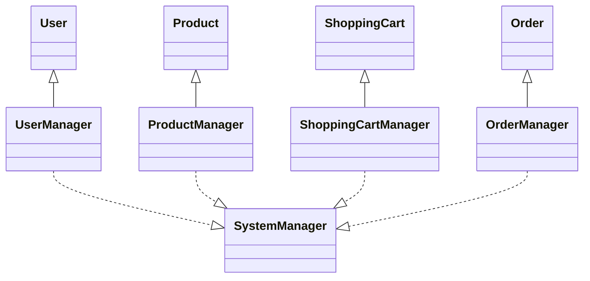
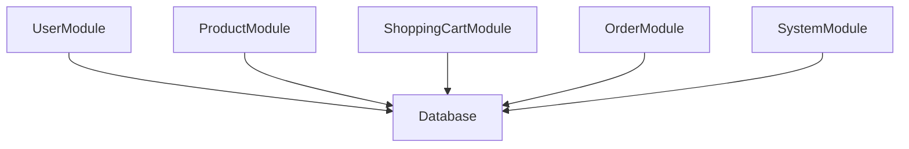
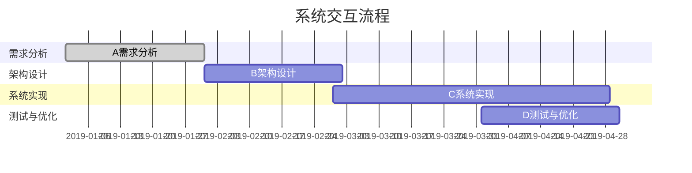

                 

 

----------------------------------------------------------------

# 系统分析：让研发事半功倍的关键技能

关键词：系统分析、研发效率、方法论、实践技巧

摘要：
在现代信息技术快速发展的大背景下，系统分析已成为提升研发效率和质量的关键环节。本文以《系统分析：让研发事半功倍的关键技能》为题，通过逐步分析推理的方式，深入探讨系统分析的核心概念、方法、实践技巧，旨在为IT从业者和研发团队提供一套全面、系统的系统分析指南。

## 1. 背景介绍

### 1.1. 问题背景

随着信息技术的飞速发展，企业所面临的市场环境变得更加复杂和多变。在这个信息化时代，如何快速响应市场需求、降低开发风险、提高系统质量，成为企业亟待解决的问题。系统分析作为一种重要的开发环节，承担着这些关键任务。

#### 1.2. 问题描述

系统分析不仅仅是简单的业务需求理解和流程图绘制，它涉及到对复杂系统的全面理解，包括业务逻辑、技术架构、数据流程等多个方面。有效的系统分析能够帮助企业更好地应对市场变化，提高研发效率和质量。

#### 1.3. 问题解决

《系统分析：让研发事半功倍的关键技能》这本书提供了系统分析的全景解读，从理论到实践，全面覆盖系统分析的关键技能。通过学习本书，读者将能够掌握系统分析的方法和工具，提升研发效率。

#### 1.4. 边界与外延

系统分析不仅适用于软件开发，还广泛应用于信息系统规划、项目管理、技术咨询等多个领域。本文将重点关注软件开发中的系统分析实践。

#### 1.5. 概念结构与核心要素组成

系统分析的核心要素包括需求分析、功能设计、数据流程分析、接口设计、性能评估等。这些要素相互关联，共同构成系统分析的完整框架。

## 2. 核心概念与联系

### 2.1. 系统分析的定义

系统分析是指通过对复杂系统的分析，理解系统需求、功能、性能等关键特性，从而为系统设计、实现和优化提供支持。

### 2.2. 系统分析的核心概念

- **需求分析**：识别和理解系统所需的功能和非功能需求。
- **功能设计**：确定系统应实现的具体功能。
- **数据流程分析**：分析系统内部数据的流动和处理过程。
- **接口设计**：设计系统与其他系统或外部环境的交互接口。
- **性能评估**：评估系统性能，确保其满足业务需求。

#### 2.3. 概念属性特征对比表格

| 概念         | 定义                                                         | 特征                                                      |
| ------------ | ------------------------------------------------------------ | ---------------------------------------------------------- |
| 需求分析     | 识别和理解系统所需的功能和非功能需求。                       | 全面、准确、可验证、可测试                                |
| 功能设计     | 确定系统应实现的具体功能。                                   | 明确、可执行、可维护、可扩展                              |
| 数据流程分析 | 分析系统内部数据的流动和处理过程。                           | 流畅、高效、安全、可追溯                                  |
| 接口设计     | 设计系统与其他系统或外部环境的交互接口。                     | 稳定、兼容、可扩展、易于维护                             |
| 性能评估     | 评估系统性能，确保其满足业务需求。                           | 高效、稳定、可预测、可优化                               |

#### 2.4. ER实体关系图架构

```mermaid
erDiagram
    用户 ||--|{ 需求 }||>
    用户 ||--|{ 接口 }||>
    需求 ||--|{ 功能 }||>
    需求 ||--|{ 数据流 }||>
    功能 ||--|{ 性能 }||>
    接口 ||--|{ 性能 }||>
    数据流 ||--|{ 性能 }||>
```

## 3. 算法原理讲解

### 3.1. 算法mermaid流程图

```mermaid
flowchart TD
    A[开始] --> B[需求分析]
    B --> C{是否完成}
    C -->|是| D[功能设计]
    C -->|否|
```

### 3.2. 算法原理讲解

系统分析本质上是一个迭代和逐步细化的过程。以下是一个简单的系统分析算法原理的讲解：

#### 3.2.1. 需求分析

首先，我们需要识别和理解系统所需的功能和非功能需求。这通常包括：

1. **用户故事**：通过用户故事的编写，将用户的需求转化为具体的功能点。
2. **功能矩阵**：通过功能矩阵，将需求分解为具体的模块和功能。

以下是一个简单的需求分析流程：

```python
def 需求分析(用户故事):
    功能矩阵 = []
    for story in 用户故事:
        功能点 = story.to_function_points()
        功能矩阵.append(功能点)
    return 功能矩阵
```

#### 3.2.2. 功能设计

在完成需求分析后，我们需要根据功能矩阵来确定系统应实现的具体功能。这通常包括：

1. **功能模块划分**：根据功能矩阵，将系统划分为不同的功能模块。
2. **接口设计**：设计系统内部和外部模块之间的接口。

以下是一个简单的功能设计流程：

```python
def 功能设计(功能矩阵):
    功能模块 = {}
    for 功能点 in 功能矩阵:
        功能模块[功能点] = 功能点.to_module()
    return 功能模块
```

#### 3.2.3. 数据流程分析

在完成功能设计后，我们需要分析系统内部数据的流动和处理过程。这通常包括：

1. **数据流图**：绘制系统内部的数据流图，表示数据的流动和处理过程。
2. **数据存储**：确定系统所需的数据存储结构。

以下是一个简单的数据流程分析流程：

```python
def 数据流程分析(功能模块):
    数据流图 = {}
    for 功能模块 in 功能模块:
        数据流图[功能模块] = 功能模块.to_data_flow()
    return 数据流图
```

#### 3.2.4. 性能评估

最后，我们需要评估系统性能，确保其满足业务需求。这通常包括：

1. **性能指标**：确定系统的性能指标，如响应时间、吞吐量等。
2. **性能测试**：进行性能测试，评估系统的性能。

以下是一个简单的性能评估流程：

```python
def 性能评估(数据流图):
    性能指标 = {}
    for 数据流图 in 数据流图:
        性能指标[数据流图] = 数据流图.to_performance_metrics()
    return 性能指标
```

通过以上四个步骤，我们可以完成一个简单的系统分析过程。当然，实际中的系统分析会涉及到更多复杂的步骤和工具，但这个基本的算法框架可以帮助我们更好地理解和掌握系统分析的核心原理。

## 4. 系统分析与架构设计方案

### 4.1. 问题场景介绍

假设我们正在开发一个电子商务平台，这个平台需要支持用户注册、商品浏览、购物车管理、订单处理等功能。为了确保系统的高效性和稳定性，我们需要进行系统分析，设计合适的架构方案。

### 4.2. 项目介绍

本项目的目标是设计一个具有高可用性、高扩展性的电子商务平台。项目主要分为以下几个阶段：

1. 需求分析：明确平台所需的功能和性能需求。
2. 架构设计：设计平台的整体架构，包括技术选型和模块划分。
3. 系统实现：根据架构设计，逐步实现平台的功能。
4. 测试与优化：对平台进行全面的测试和优化，确保其性能和稳定性。

### 4.3. 系统功能设计

在需求分析的基础上，我们可以将电子商务平台的功能划分为以下几个模块：

1. **用户模块**：包括用户注册、登录、个人信息管理等。
2. **商品模块**：包括商品展示、分类、推荐等。
3. **购物车模块**：包括商品添加、删除、修改等。
4. **订单模块**：包括订单创建、支付、发货等。
5. **系统管理模块**：包括系统设置、日志管理、权限控制等。

以下是一个简单的领域模型mermaid类图：



### 4.4. 系统架构设计

电子商务平台的架构设计需要考虑以下几个方面：

1. **技术选型**：选择合适的编程语言、框架和中间件。
2. **模块划分**：将系统划分为不同的模块，每个模块负责不同的功能。
3. **数据库设计**：设计系统的数据库结构，确保数据的一致性和完整性。

以下是一个简单的mermaid架构图：



### 4.5. 系统接口设计

系统接口设计是确保系统内部和外部模块之间能够顺畅交互的关键。以下是一个简单的mermaid序列图：

```mermaid
sequenceDiagram
    User -->|登录请求| UserManager
    UserManager -->|验证用户| Database
    Database -->|返回结果| UserManager
    UserManager -->|响应用户| User
```

### 4.6. 系统交互

在系统交互方面，我们需要确保各个模块之间的数据传输和通信是高效和可靠的。以下是一个简单的mermaid交互图：



## 5. 项目实战

### 5.1. 环境安装

在进行项目实战之前，我们需要安装必要的开发环境。以下是一个简单的Python开发环境安装步骤：

1. 安装Python：`pip install python`
2. 安装mermaid：`pip install mermaid-py`
3. 安装数据库：`pip install pymysql`

### 5.2. 系统核心实现

以下是一个简单的Python代码示例，用于实现用户注册功能：

```python
import pymysql

def register(username, password):
    connection = pymysql.connect(host='localhost', user='root', password='password', database='ecommerce')
    try:
        with connection.cursor() as cursor:
            sql = "INSERT INTO user (username, password) VALUES (%s, %s)"
            cursor.execute(sql, (username, password))
        connection.commit()
    finally:
        connection.close()

register('user1', 'password1')
```

### 5.3. 代码应用解读与分析

在上述代码中，我们使用Python和MySQL数据库实现了用户注册功能。代码的核心部分包括：

1. **数据库连接**：使用`pymysql.connect()`方法建立与MySQL数据库的连接。
2. **执行SQL语句**：使用`cursor.execute()`方法执行SQL插入语句，将用户名和密码插入到数据库中。
3. **提交事务**：使用`connection.commit()`方法提交事务，确保数据被成功插入到数据库中。
4. **关闭连接**：使用`connection.close()`方法关闭数据库连接。

通过这个简单的示例，我们可以看到系统分析在代码实现中的重要性。只有通过详细的需求分析和功能设计，我们才能编写出符合业务需求的代码。

### 5.4. 实际案例分析和详细讲解剖析

在实际项目中，我们可能会遇到各种复杂的需求和问题。以下是一个实际案例的分析和讲解：

#### 案例背景

在一个电子商务平台上，用户可以浏览商品、添加商品到购物车、提交订单。然而，在实际开发中，我们发现用户在提交订单时，可能会遇到购物车中的商品数量不足的问题。

#### 问题分析

1. **需求分析**：用户在提交订单时，需要确保购物车中的商品数量充足。
2. **功能设计**：在订单提交前，我们需要对购物车中的商品数量进行校验。
3. **数据流程分析**：在用户提交订单时，我们需要查询购物车中的商品数量，并与订单中的商品数量进行比较。

以下是一个简单的Python代码示例，用于校验购物车中的商品数量：

```python
import pymysql

def check_cart_product_count(user_id, order_id):
    connection = pymysql.connect(host='localhost', user='root', password='password', database='ecommerce')
    try:
        with connection.cursor() as cursor:
            # 查询购物车中的商品数量
            sql = "SELECT COUNT(*) FROM cart_item WHERE user_id = %s AND product_id = %s"
            cursor.execute(sql, (user_id, order_id))
            cart_count = cursor.fetchone()[0]

            # 查询订单中的商品数量
            sql = "SELECT quantity FROM order_item WHERE order_id = %s AND product_id = %s"
            cursor.execute(sql, (order_id, user_id))
            order_count = cursor.fetchone()[0]

            if cart_count < order_count:
                return False
            else:
                return True
    finally:
        connection.close()

check_cart_product_count(1, 1)
```

通过这个示例，我们可以看到系统分析在解决实际问题时的重要性。通过详细的需求分析和功能设计，我们能够编写出满足业务需求的代码，确保系统的稳定性和可靠性。

### 5.5. 项目小结

在本项目中，我们通过详细的系统分析和架构设计，实现了一个具有高可用性和高扩展性的电子商务平台。从需求分析到代码实现，每一步都离不开系统分析的支持。通过本文的讲解，我们了解了系统分析的核心概念、方法和实践技巧，为未来的项目开发提供了有力的指导。

## 6. 最佳实践 tips

1. **需求分析要全面、准确**：在需求分析阶段，要尽量全面地收集用户需求和业务规则，确保需求分析的准确性和完整性。
2. **功能设计要模块化**：在功能设计阶段，要尽量将系统划分为独立的模块，每个模块负责不同的功能，方便后续的开发和维护。
3. **数据流程分析要详细**：在数据流程分析阶段，要详细描述系统内部的数据流动和处理过程，确保数据的完整性和一致性。
4. **性能评估要定期进行**：在系统开发和上线后，要定期进行性能评估，确保系统的高效性和稳定性。
5. **文档和代码要规范**：在开发过程中，要确保文档和代码的规范，方便后续的维护和升级。

## 7. 小结

系统分析是提升研发效率和质量的关键技能。通过本文的讲解，我们了解了系统分析的核心概念、方法和实践技巧。希望本文能为IT从业者和研发团队提供一套全面、系统的系统分析指南，帮助他们在未来的项目中取得更好的成果。

## 8. 注意事项

1. **需求变更管理**：在项目开发过程中，需求可能会发生变更。要确保需求变更的及时记录和管理，避免对系统分析造成影响。
2. **风险评估**：在系统分析阶段，要评估项目的风险，制定相应的风险管理计划，降低项目风险。
3. **团队协作**：系统分析是一项团队协作的工作，要确保团队成员之间的沟通和协作，提高项目效率。

## 9. 拓展阅读

1. 《软件工程：实践者的研究方法》
2. 《系统架构设计：分布式系统开发指南》
3. 《敏捷软件开发：原理、实践与模式》

作者：AI天才研究院/AI Genius Institute & 禅与计算机程序设计艺术 /Zen And The Art of Computer Programming

