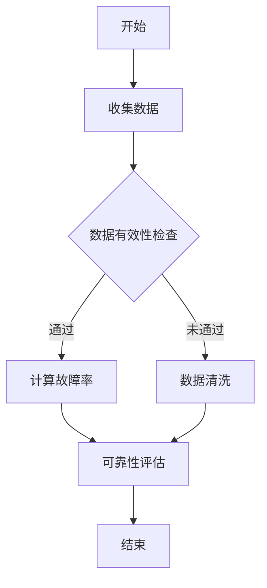

                 

## 引言与背景

### 第1章 系统可靠性工程概述

#### 1.1 问题背景

随着信息技术的快速发展，系统可靠性在现代社会中变得越来越重要。无论是个人用户还是企业用户，对系统的稳定性和可靠性都提出了更高的要求。然而，系统可靠性面临着诸多挑战与威胁，如硬件故障、软件缺陷、网络攻击、环境变化等。这些因素可能导致系统崩溃、数据丢失、业务中断等问题，给个人和企业带来严重的损失。

**问题的提出：** 系统可靠性在现代社会中的重要性

- **问题描述：** 系统可靠性面临的挑战与威胁

  - 硬件故障：硬件设备的寿命限制、性能不稳定、故障率高。
  - 软件缺陷：代码中的逻辑错误、安全漏洞、兼容性问题。
  - 网络攻击：恶意软件、网络钓鱼、拒绝服务攻击等。
  - 环境变化：自然灾害、电力故障、温度变化等。

- **问题解决：** 系统可靠性工程的概念及其核心目标

  系统可靠性工程是一种综合性的技术和管理方法，旨在确保系统在各种环境条件下能够稳定、可靠地运行。通过系统可靠性工程，可以识别和分析系统的潜在风险，制定相应的预防措施，提高系统的可靠性和可用性。

**概念阐述与定义：** 系统可靠性工程的概念

- **系统可靠性：** 系统在规定的时间内和特定的条件下，无故障完成规定功能的概率。
- **可靠性特性：** 可靠性、可用性、可维护性和安全性。

  - **可靠性：** 系统在规定时间内无故障运行的能力。
  - **可用性：** 系统在需要时能够正常运行的能力。
  - **可维护性：** 系统在出现故障后能够快速恢复的能力。
  - **安全性：** 系统在遭受攻击或异常情况下能够保持正常运行的能力。

**核心目标：** 提高系统的可靠性、可用性、可维护性和安全性。

通过系统可靠性工程，可以确保系统在面临各种风险和挑战时，能够保持稳定、可靠地运行，从而为个人、企业和社会创造更大的价值。

#### 1.2 系统可靠性工程的基本概念

系统可靠性工程是一个涉及多个学科领域的综合性工程，它不仅包括硬件和软件的可靠性，还涉及到系统的可靠性设计、测试、评估和管理。以下是对系统可靠性工程的基本概念进行详细介绍。

**系统可靠性定义：** 概念阐述与定义

系统可靠性是指系统在规定的时间范围内和特定的条件下，无故障地完成预定功能的能力。它通常用概率来衡量，表示系统在给定时间内能够正常运行的概率。

**系统可靠性特性：** 可靠性、可用性、可维护性和安全性

1. **可靠性（Reliability）**

   可靠性是系统可靠性的核心特性，它反映了系统在规定时间内无故障运行的能力。可靠性的量化通常使用失效率（Failure Rate）来衡量，失效率表示单位时间内系统发生故障的概率。

   **可用性（Availability）**

   可用性是系统在需要时能够正常运行的能力，它是可靠性和维护性的综合表现。可用性通常用百分比表示，计算公式为：

   \[ \text{可用性} = \frac{\text{系统正常运行时间}}{\text{系统总运行时间}} \times 100\% \]

   **可维护性（Maintainability）**

   可维护性是指系统在发生故障后能够快速恢复的能力。一个高可维护的系统应该能够快速诊断和修复故障，减少系统停机时间。

   **安全性（Safety）**

   安全性是系统在遭受攻击或异常情况下能够保持正常运行的能力。安全性包括对恶意攻击的防御、对异常情况的响应和系统的容错能力。

**可靠性工程的价值：** 对个人、企业和社会的贡献

系统可靠性工程的价值主要体现在以下几个方面：

1. **减少损失：** 提高系统的可靠性可以减少因系统故障导致的损失，包括经济损失、用户满意度下降等。
2. **提高竞争力：** 高可靠性的系统可以增强企业的竞争力，提高市场占有率。
3. **保障安全：** 对于关键系统，如航空航天、医疗设备等，可靠性工程可以保障系统的安全性，防止严重事故的发生。
4. **提升用户体验：** 高可靠性的系统可以提供更好的用户体验，增强用户对系统的信任和满意度。

**可靠性工程的应用领域：** 跨行业对比与案例分析

系统可靠性工程广泛应用于多个行业，如航空航天、汽车制造、医疗设备、金融服务等。以下是一些行业对比和案例分析：

1. **航空航天：** 航空航天领域对系统的可靠性要求极高，因为任何故障都可能造成严重后果。例如，航空器的自动飞行控制系统必须具备极高的可靠性，以防止事故发生。
2. **汽车制造：** 汽车制造行业也对系统的可靠性提出了高要求。现代汽车中的电子系统越来越多，如自动驾驶系统、安全气囊控制系统等，这些系统都需要保证高可靠性，以保障乘客的安全。
3. **医疗设备：** 医疗设备如心脏起搏器、CT扫描仪等需要高可靠性，因为它们直接关系到患者的生命健康。
4. **金融服务：** 金融服务行业如银行、证券交易等对系统的可靠性要求也非常高，任何故障都可能导致严重的经济损失。

**总结：** 系统可靠性工程是一个跨学科、综合性工程，它在现代社会中的重要性日益凸显。通过可靠性工程，可以确保系统在各种环境下能够稳定、可靠地运行，为个人、企业和社会创造更大的价值。

### 1.3 系统可靠性工程的重要性

系统可靠性工程在现代社会中扮演着至关重要的角色，其价值不仅体现在技术和经济层面，还涉及到社会安全和公共利益的维护。以下是系统可靠性工程在各个层面的重要性及其对个人、企业和社会的具体贡献。

#### 1.3.1 技术层面

**提高系统稳定性与安全性**

系统可靠性工程的核心目标是通过一系列设计、测试、评估和管理措施，提高系统的稳定性和安全性。高可靠性的系统意味着在长时间内保持无故障运行，减少停机和故障率，从而确保关键业务流程的连续性和数据的完整性。

**增强系统适应性**

随着技术的不断进步，系统需要适应更复杂和多变的环境。系统可靠性工程通过引入冗余设计、容错机制和故障恢复策略，使系统能够在面对各种异常情况时依然保持稳定运行。这种适应性不仅提高了系统的可靠性，也为企业提供了更灵活的技术解决方案。

**优化系统性能**

系统可靠性工程不仅关注故障率，还关注系统的整体性能。通过优化设计、提高硬件和软件的效率，可靠性工程可以显著提升系统的响应速度和处理能力，从而为企业带来更好的业务表现。

#### 1.3.2 经济层面

**降低维护成本**

高可靠性的系统减少了故障率和维护需求，从而降低了长期的维护成本。企业可以节省大量的人力和物力资源，将更多资金投入到创新和扩展业务中。

**减少停机损失**

系统故障可能导致业务中断，造成经济损失。通过系统可靠性工程，企业可以减少系统停机时间，确保关键业务的连续性，从而降低停机损失。

**提高投资回报率**

系统可靠性工程有助于提高系统的稳定性和适应性，延长系统的使用寿命。这不仅可以减少更换和升级系统的频率，还能提高投资回报率。

#### 1.3.3 社会层面

**保障公共安全**

对于涉及公共安全的关键系统，如交通控制、电力供应、医疗设备等，系统可靠性工程是保障公共安全的重要手段。高可靠性的系统可以降低事故风险，确保公共基础设施的安全运行。

**提升社会信任度**

在信息时代，系统可靠性直接影响用户对企业和服务的信任。高可靠性的系统可以提升用户满意度，增强企业品牌形象，提高市场竞争力。

**促进技术创新**

系统可靠性工程推动了技术在可靠性、安全性和适应性方面的不断创新。这种创新不仅促进了技术发展，也为企业提供了新的商业机会。

#### 1.3.4 跨行业对比与案例分析

**航空航天：** 航空航天行业对系统可靠性的要求极高，任何故障都可能导致灾难性后果。通过系统可靠性工程，航空公司可以确保飞行器的安全运行，减少事故风险。

**汽车制造：** 汽车行业对系统的可靠性要求同样很高。现代汽车中电子设备众多，如自动驾驶系统、安全气囊等，这些系统的可靠性直接关系到乘客的安全。通过系统可靠性工程，汽车制造商可以提升车辆的安全性能，增强用户信任。

**医疗设备：** 医疗设备如心脏起搏器、CT扫描仪等对可靠性要求极高。系统可靠性工程确保了这些设备在关键时刻能够正常运行，保障患者的生命安全。

**金融服务：** 金融行业对系统的可靠性要求也非常高。银行、证券交易等金融服务系统需要保证高可用性和数据完整性，以避免因故障导致的金融风险。

**总结：** 系统可靠性工程在技术、经济和社会层面都具有重要的价值。通过提高系统的可靠性，企业不仅可以降低成本、减少风险，还能提升竞争力、增强用户信任。同时，系统可靠性工程也是保障公共安全、促进技术创新的重要手段。在各个行业中，系统可靠性工程都发挥着不可替代的作用。

### 1.4 系统可靠性工程的基本原则

系统可靠性工程的基本原则是指在设计和实施系统时，为了确保系统的可靠性，需要遵循的一系列核心原则和方法。以下是对这些原则的详细解析。

#### 1.4.1 可靠性设计原则

**预防性设计**

预防性设计是可靠性工程的基础，它旨在通过设计手段减少系统发生故障的可能性。预防性设计包括以下几个方面：

- **冗余设计**：通过引入冗余组件，提高系统的容错能力。例如，在关键设备上使用备份设备，当主设备出现故障时，备份设备可以自动接管工作。
- **模块化设计**：将系统划分为多个模块，每个模块具有独立的功能和操作。这样可以减少故障传播的可能性，并简化故障诊断和修复过程。
- **容错设计**：通过设计容错机制，使系统能够在出现故障时继续运行。例如，使用错误检测和纠正技术、冗余计算等。

**安全性设计**

安全性设计是确保系统在遭受攻击或异常情况下能够保持正常运行的能力。安全性设计包括以下几个方面：

- **安全协议**：制定严格的安全协议，确保系统的数据传输和存储安全。
- **访问控制**：实施访问控制措施，限制未经授权的访问和操作。
- **加密技术**：使用加密技术保护系统的数据和通信，防止数据泄露和篡改。

**适应性设计**

适应性设计是指系统在面临环境变化时能够快速调整和适应的能力。适应性设计包括以下几个方面：

- **弹性设计**：使系统能够在资源受限或网络不稳定的情况下正常运行。例如，通过负载均衡和资源调度技术，确保系统在高负载下依然稳定运行。
- **自适应控制**：通过实时监测系统状态和环境变化，自动调整系统参数，以适应不同运行条件。

#### 1.4.2 可靠性测试与验证

**测试计划**

可靠性测试是确保系统满足可靠性要求的重要手段。测试计划应包括以下几个方面：

- **测试目标**：明确可靠性测试的目的和目标，例如验证系统的稳定性、安全性、可用性等。
- **测试内容**：确定测试的具体内容和方法，例如功能测试、性能测试、压力测试、安全测试等。
- **测试环境**：搭建与实际运行环境相似的测试环境，以确保测试结果的准确性。

**测试方法**

可靠性测试通常包括以下几种方法：

- **功能测试**：验证系统的功能是否符合设计要求。
- **性能测试**：评估系统在特定负载下的性能表现，如响应时间、吞吐量等。
- **压力测试**：通过模拟高负载环境，测试系统在极端条件下的稳定性和可靠性。
- **安全测试**：检测系统的安全漏洞和弱点，确保系统的数据安全和完整性。

**验证过程**

验证过程是指通过测试和分析结果，确认系统是否满足可靠性要求的步骤。验证过程包括以下几个方面：

- **结果分析**：对测试结果进行分析，识别系统中的潜在问题和不足。
- **缺陷修复**：针对分析结果，修复系统中的缺陷和问题。
- **再测试**：在修复后对系统进行再测试，确认缺陷是否已经得到解决。

#### 1.4.3 可靠性评估方法

**可靠性评估模型**

可靠性评估模型是用于预测和分析系统可靠性的工具。常见的可靠性评估模型包括：

- **概率模型**：使用概率方法评估系统的可靠性，如蒙特卡洛模拟、故障树分析等。
- **时间模型**：使用时间序列方法评估系统的可靠性，如威布尔分布、泊松过程等。
- **统计模型**：使用统计方法评估系统的可靠性，如回归分析、方差分析等。

**可靠性度量指标**

可靠性度量指标是用于衡量系统可靠性的量化指标。常见的可靠性度量指标包括：

- **故障率**：单位时间内系统发生故障的次数，通常用 \( \lambda \) 表示。
- **可靠性系数**：表示系统在规定时间内无故障运行的概率，通常用 \( R(t) \) 表示。
- **平均故障间隔时间**：系统两次故障之间的平均时间，通常用 \( MTBF \) 表示。

**评估流程**

可靠性评估流程通常包括以下几个步骤：

- **需求分析**：明确系统的可靠性需求，包括可靠性目标、可靠性特性等。
- **数据收集**：收集与系统可靠性相关的数据，如故障记录、性能数据等。
- **模型建立**：根据收集的数据建立可靠性评估模型。
- **评估计算**：使用评估模型计算系统的可靠性指标。
- **结果分析**：对评估结果进行分析，识别系统的可靠性问题和改进空间。

#### 1.4.4 总结

可靠性设计原则、可靠性测试与验证、可靠性评估方法是系统可靠性工程的核心组成部分。通过遵循这些基本原则和方法，可以显著提高系统的可靠性，确保系统在各种环境下稳定、可靠地运行。同时，这些原则和方法也为系统可靠性的持续改进提供了基础。

### 1.5 系统可靠性工程的边界与外延

系统可靠性工程是一个涉及多个学科领域的综合性工程，它不仅包括硬件和软件的可靠性，还涉及到系统的可靠性设计、测试、评估和管理。然而，系统可靠性工程也有其明确的边界，并与其他工程领域有明确的区分。

#### 界定边界

**边界界定：** 与其他工程领域的区分

系统可靠性工程与其他工程领域的主要区别在于其关注的核心问题和目标。例如：

- **系统工程**：系统工程主要关注系统的整体设计和集成，确保系统能够满足用户需求。它侧重于系统功能、性能、成本和进度等方面，而系统可靠性工程则更加关注系统在长时间内保持无故障运行的能力。
- **软件工程**：软件工程主要关注软件开发过程和方法，确保软件产品的质量和可靠性。虽然软件工程中也涉及到可靠性问题，但其重点在于软件设计和实现，而系统可靠性工程则更加关注系统整体可靠性的提高。
- **硬件工程**：硬件工程主要关注硬件设备的设计、制造和测试，确保硬件设备的质量和可靠性。虽然硬件可靠性是系统可靠性的一部分，但系统可靠性工程更加关注硬件与其他系统组件的协同工作。

**外延扩展：** 可靠性工程的发展趋势

系统可靠性工程的外延扩展体现在以下几个方面：

- **跨领域融合**：随着信息技术、物联网、人工智能等技术的快速发展，系统可靠性工程与其他领域的融合趋势日益明显。例如，在物联网系统中，设备数量和种类繁多，如何确保这些设备的可靠性成为系统可靠性工程的重要课题。
- **智能化与自动化**：人工智能和机器学习技术的发展，使得可靠性工程变得更加智能化和自动化。通过数据分析和机器学习算法，可以更准确地预测系统故障，制定更有效的可靠性提升策略。
- **可持续发展**：在可持续发展的背景下，系统可靠性工程不仅要关注系统的技术可靠性，还要关注环境、社会和经济方面的可持续性。例如，在电动汽车领域，电池的可靠性和续航能力是影响整个系统可靠性的重要因素。

**总结：** 系统可靠性工程的边界与外延明确，它不仅与其他工程领域有明确的区分，还随着技术的发展不断扩展其应用范围。通过跨领域融合和智能化、自动化技术的应用，系统可靠性工程在未来将继续发挥重要作用，为个人、企业和社会创造更大的价值。

### 1.6 核心概念结构与要素组成

系统可靠性工程是一个涉及多个学科领域的综合性工程，其核心概念和要素组成对于理解和实施可靠性工程至关重要。以下是对系统可靠性工程核心概念与要素组成的详细解析。

#### 核心概念

**系统可靠性定义**

系统可靠性是指系统在规定的时间范围内和特定的条件下，无故障地完成预定功能的能力。它通常用概率来衡量，表示系统在给定时间内能够正常运行的概率。

**可靠性特性**

系统可靠性特性包括以下几个主要方面：

1. **可靠性（Reliability）**

   可靠性是系统可靠性的核心特性，它反映了系统在规定时间内无故障运行的能力。通常用失效率（Failure Rate）来衡量，失效率表示单位时间内系统发生故障的概率。

2. **可用性（Availability）**

   可用性是系统在需要时能够正常运行的能力，它是可靠性和维护性的综合表现。可用性通常用百分比表示，计算公式为：

   \[ \text{可用性} = \frac{\text{系统正常运行时间}}{\text{系统总运行时间}} \times 100\% \]

3. **可维护性（Maintainability）**

   可维护性是指系统在发生故障后能够快速恢复的能力。一个高可维护的系统应该能够快速诊断和修复故障，减少系统停机时间。

4. **安全性（Safety）**

   安全性是系统在遭受攻击或异常情况下能够保持正常运行的能力。安全性包括对恶意攻击的防御、对异常情况的响应和系统的容错能力。

#### 要素组成

系统可靠性工程的要素组成主要包括以下几个方面：

1. **可靠性模型**

   可靠性模型是用于预测和分析系统可靠性的工具。常见的可靠性模型包括概率模型、时间模型和统计模型等。这些模型可以帮助工程师理解系统的可靠性特性，制定相应的可靠性提升策略。

2. **可靠性度量**

   可靠性度量是用于衡量系统可靠性的量化指标。常见的可靠性度量指标包括故障率、可靠性系数、平均故障间隔时间等。通过这些度量指标，可以评估系统的可靠性水平，识别潜在的问题和改进空间。

3. **可靠性评估**

   可靠性评估是确保系统满足可靠性要求的重要手段。可靠性评估通常包括测试计划、测试方法、验证过程等步骤。通过可靠性评估，可以确认系统是否满足可靠性目标，发现并修复潜在的问题。

4. **可靠性设计原则**

   可靠性设计原则是确保系统可靠性的基本方法。这些原则包括预防性设计、安全性设计、适应性设计等。通过遵循这些原则，可以显著提高系统的可靠性。

5. **可靠性测试与验证**

   可靠性测试与验证是确保系统可靠性的重要环节。可靠性测试包括功能测试、性能测试、压力测试、安全测试等，验证过程则通过测试结果分析、缺陷修复和再测试等步骤，确保系统可靠性要求的实现。

6. **可靠性管理**

   可靠性管理是系统可靠性工程的重要组成部分。可靠性管理包括可靠性计划、可靠性监控、可靠性改进等环节。通过可靠性管理，可以确保系统在整个生命周期内保持高可靠性。

#### 总结

系统可靠性工程的核心概念和要素组成对于理解和实施可靠性工程至关重要。通过明确系统可靠性的定义、特性以及可靠性模型、度量、评估、设计原则、测试与验证和管理等要素，可以确保系统在各种环境下稳定、可靠地运行。这些核心概念和要素不仅为系统可靠性工程提供了理论基础，也为实际工程实践提供了具体的指导和实施策略。

### 1.7 本章小结

在本章中，我们系统地介绍了系统可靠性工程的基本概念、核心目标和重要性。首先，我们提出了系统可靠性在现代社会中的重要性，并详细阐述了系统可靠性工程的概念和核心特性，包括可靠性、可用性、可维护性和安全性。接着，我们分析了系统可靠性工程在不同领域的应用，从技术、经济和社会层面探讨了其价值。此外，我们还介绍了系统可靠性工程的基本原则，包括可靠性设计、测试与验证以及评估方法，以及其边界与外延。

通过本章的学习，我们了解到系统可靠性工程不仅仅是一个技术问题，更是一个涉及多个领域的综合性工程。它对于提高系统的稳定性、降低维护成本、保障公共安全和促进技术创新具有重要意义。本章的内容为后续章节的深入讨论奠定了基础，帮助读者全面理解系统可靠性工程的本质和实际应用。

在接下来的章节中，我们将进一步探讨系统可靠性工程的核心概念与联系，详细讲解可靠性原理、可靠性度量、评估方法和设计与优化策略，帮助读者深入掌握系统可靠性工程的理论和实践方法。

## 第二部分：系统可靠性核心概念与联系

### 第2章 系统可靠性核心概念

#### 2.1 可靠性原理

可靠性原理是系统可靠性工程的基础，它涉及系统的故障类型、故障模型及其影响。理解这些基本概念有助于我们更好地设计和评估系统的可靠性。

**故障类型**

故障可以分为以下几类：

1. **硬件故障**：硬件设备发生故障，如硬件损坏、性能下降等。
2. **软件故障**：软件缺陷导致系统崩溃、功能失效等。
3. **环境故障**：外部环境因素导致的故障，如温度变化、电源中断等。
4. **操作故障**：由于用户操作不当导致的故障，如误操作、设置错误等。

**故障模型**

故障模型用于描述系统故障的发生和发展。常见的故障模型包括：

1. **泊松过程**：假设故障发生是随机的，且故障之间的时间间隔服从泊松分布。
2. **威布尔分布**：用于描述故障时间分布，适用于各种类型和条件的故障。
3. **故障树分析（FTA）**：通过分析系统中的各个组件和故障路径，构建故障树，评估系统故障的可能性。

**故障影响**

故障影响是指故障对系统性能和业务连续性的影响。故障影响包括以下几个方面：

1. **故障率**：表示单位时间内发生故障的概率，通常用 \( \lambda \) 表示。
2. **修复时间**：故障发生后系统恢复正常运行所需的时间。
3. **业务中断时间**：故障导致业务中断的时间，直接影响业务连续性和客户满意度。

#### 2.2 可靠性度量

可靠性度量是评估系统可靠性的关键步骤。通过量化指标，我们可以了解系统的可靠性水平，并识别改进空间。

**可靠性度量方法**

可靠性度量方法包括以下几种：

1. **失效率（Failure Rate）**：失效率表示单位时间内系统发生故障的概率，是衡量系统可靠性的重要指标。
2. **平均故障间隔时间（MTBF）**：MTBF是系统平均无故障运行时间的度量，计算公式为：

   \[ \text{MTBF} = \frac{\text{总运行时间}}{\text{故障次数}} \]

3. **平均修复时间（MTTR）**：MTTR是系统故障平均修复时间的度量，计算公式为：

   \[ \text{MTTR} = \frac{\text{总修复时间}}{\text{故障次数}} \]

4. **可用性（Availability）**：可用性是系统在规定时间内无故障运行的概率，计算公式为：

   \[ \text{可用性} = \frac{\text{MTBF}}{\text{MTBF + MTTR}} \]

**关键指标解析**

1. **故障率（Failure Rate）**

   故障率是描述系统可靠性的基本指标，它表示单位时间内系统发生故障的概率。故障率通常用 \( \lambda \) 表示，计算公式为：

   \[ \lambda = \frac{1}{\text{MTBF}} \]

2. **MTBF（平均故障间隔时间）**

   MTBF是衡量系统可靠性的重要指标，它反映了系统在长时间内无故障运行的能力。MTBF越高，系统的可靠性越高。

3. **MTTR（平均修复时间）**

   MTTR是衡量系统可维护性的指标，它反映了系统在发生故障后恢复的时间。MTTR越低，系统的可维护性越好。

4. **可用性（Availability）**

   可用性是系统的综合可靠性指标，它表示系统在需要时能够正常运行的能力。高可用性系统可以提供更好的用户体验和业务连续性。

通过这些可靠性度量方法，我们可以定量地评估系统的可靠性水平，并制定相应的改进策略。

#### 2.3 可靠性评估方法

可靠性评估方法是确保系统满足可靠性要求的重要手段。以下介绍几种常见的可靠性评估方法。

**可靠性评估方法**

1. **统计评估方法**：基于历史数据和分析结果，统计评估系统的可靠性。常见的统计评估方法包括回归分析、方差分析等。

2. **模拟评估方法**：通过模拟系统在各种运行条件下的性能和可靠性，评估系统的可靠性。常见的模拟评估方法包括蒙特卡洛模拟、故障树分析等。

3. **测试评估方法**：通过实际测试系统的性能和可靠性，评估系统的可靠性。常见的测试评估方法包括功能测试、性能测试、压力测试等。

**案例分析**

以某企业数据中心为例，说明可靠性评估方法的应用。

1. **统计评估方法**：

   - **数据收集**：收集过去一年内数据中心的故障记录、运行时间、修复时间等数据。
   - **回归分析**：通过回归分析模型，预测未来数据中心的故障率和可用性。
   - **结果分析**：根据预测结果，制定相应的维护和优化策略。

2. **模拟评估方法**：

   - **模拟条件**：设置数据中心在不同负载条件下的运行状态。
   - **故障模拟**：模拟故障发生时的系统响应，评估数据中心的可靠性和可用性。
   - **结果分析**：根据模拟结果，优化数据中心的硬件配置和软件策略。

3. **测试评估方法**：

   - **功能测试**：测试数据中心的各项功能是否正常。
   - **性能测试**：测试数据中心的响应时间、吞吐量等性能指标。
   - **压力测试**：模拟高负载条件，评估数据中心的稳定性和可靠性。
   - **结果分析**：根据测试结果，发现并修复潜在问题，提升数据中心的可靠性。

通过这些评估方法，企业可以全面了解数据中心的可靠性水平，并制定有效的改进措施，确保数据中心的稳定运行。

#### 2.4 可靠性设计与优化

可靠性设计与优化是确保系统可靠性的关键步骤。以下介绍几种常见的可靠性设计与优化策略。

**设计原则**

1. **预防性设计**：通过设计手段减少系统故障的可能性，如冗余设计、容错设计等。
2. **安全性设计**：确保系统在遭受攻击或异常情况下能够保持正常运行，如安全协议、访问控制等。
3. **适应性设计**：使系统能够适应各种运行环境，如弹性设计、自适应控制等。

**优化策略**

1. **冗余设计**：通过引入冗余组件，提高系统的容错能力，如备份硬件、备份软件等。
2. **负载均衡**：通过合理分配系统资源，减少单点故障的风险，如负载均衡器、分布式架构等。
3. **故障检测与恢复**：通过实时监测系统状态，及时发现和修复故障，如故障检测算法、自动恢复机制等。

**案例分析**

以某企业电子商务系统为例，说明可靠性设计与优化策略的应用。

1. **预防性设计**：

   - **冗余设计**：在关键组件上引入冗余机制，如数据库集群、应用服务器集群等。
   - **安全性设计**：采用严格的安全协议和访问控制措施，保护系统数据和用户隐私。

2. **适应性设计**：

   - **弹性设计**：通过云平台和分布式架构，使系统能够根据业务需求动态扩展和缩减资源。
   - **自适应控制**：通过实时监测系统状态，自动调整系统参数，提高系统的适应性和稳定性。

3. **优化策略**：

   - **负载均衡**：使用负载均衡器，合理分配用户请求，减少单个服务器的负载压力。
   - **故障检测与恢复**：通过实时监控和自动化故障恢复机制，快速检测和修复系统故障。

通过可靠性设计与优化策略，企业可以显著提高电子商务系统的可靠性，确保业务的稳定运行和用户满意度。

#### 2.5 可靠性测试与验证

可靠性测试与验证是确保系统可靠性的关键环节。以下介绍几种常见的可靠性测试方法和验证过程。

**测试方法**

1. **功能测试**：验证系统功能是否符合设计要求，包括基本功能测试和边界条件测试等。
2. **性能测试**：评估系统在特定负载条件下的性能表现，包括响应时间、吞吐量等。
3. **压力测试**：模拟高负载条件，测试系统的稳定性和可靠性，包括最大负载测试和长时间运行测试等。
4. **安全测试**：检测系统的安全漏洞和弱点，确保系统的数据安全和完整性。

**验证过程**

1. **测试计划**：明确可靠性测试的目标、内容和环境，制定详细的测试计划。
2. **测试执行**：按照测试计划执行各项测试任务，记录测试结果。
3. **结果分析**：对测试结果进行分析，识别系统中的潜在问题和不足。
4. **缺陷修复**：针对分析结果，修复系统中的缺陷和问题。
5. **再测试**：在修复后对系统进行再测试，确认缺陷是否已经得到解决。

**案例分析**

以某企业数据中心为例，说明可靠性测试与验证过程。

1. **测试计划**：

   - **测试目标**：验证数据中心的功能、性能和安全性。
   - **测试内容**：包括功能测试、性能测试、压力测试和安全测试。
   - **测试环境**：搭建与实际运行环境相似的测试环境。

2. **测试执行**：

   - **功能测试**：测试数据中心的基本功能和边界条件。
   - **性能测试**：测试数据中心在标准负载条件下的响应时间和吞吐量。
   - **压力测试**：模拟高负载条件，测试数据中心的稳定性和可靠性。
   - **安全测试**：检测数据中心的安全漏洞和弱点。

3. **结果分析**：

   - **功能测试结果**：发现个别功能模块存在缺陷，需要进行修复。
   - **性能测试结果**：数据中心在标准负载条件下性能良好，但存在响应时间较长的问题。
   - **压力测试结果**：在高负载条件下，数据中心的性能有所下降，但仍然能够保持稳定运行。
   - **安全测试结果**：发现系统存在潜在的安全漏洞，需要进行加固和修复。

4. **缺陷修复**：

   - **功能测试缺陷修复**：修复发现的功能缺陷。
   - **性能优化**：通过优化数据库查询、缓存策略等，提高数据中心的响应时间。
   - **安全加固**：加固系统安全防护措施，修复潜在的安全漏洞。

5. **再测试**：

   - **功能测试再测试**：确认修复后的功能缺陷是否已解决。
   - **性能测试再测试**：确认优化后的性能是否达到预期。
   - **压力测试再测试**：确认修复后的数据中心在高负载条件下的稳定性和可靠性。
   - **安全测试再测试**：确认加固后的系统安全防护是否有效。

通过可靠性测试与验证过程，企业可以确保数据中心的功能、性能和安全达到预期标准，为业务的稳定运行提供保障。

#### 2.6 可靠性管理与持续改进

可靠性管理与持续改进是确保系统长期可靠性的关键。以下介绍可靠性管理体系和持续改进策略。

**管理体系**

1. **可靠性计划**：制定可靠性目标和计划，明确可靠性管理的要求和流程。
2. **可靠性监控**：实时监控系统的运行状态和性能，及时发现和解决问题。
3. **可靠性评估**：定期对系统进行可靠性评估，识别潜在的风险和改进空间。
4. **可靠性改进**：根据评估结果，制定并实施改进措施，提升系统的可靠性。

**持续改进策略**

1. **故障预防**：通过预防性维护和改进措施，减少故障发生。
2. **过程优化**：优化可靠性管理流程和操作流程，提高工作效率和系统可靠性。
3. **知识管理**：积累可靠性管理经验，建立知识库，为持续改进提供参考。
4. **持续监控**：持续监控系统运行状态，及时发现和解决问题。

**案例分析**

以某企业数据中心为例，说明可靠性管理与持续改进策略。

1. **可靠性计划**：

   - **可靠性目标**：确保数据中心的高可用性和数据安全性。
   - **可靠性要求**：制定可靠性标准和要求，明确关键性能指标。

2. **可靠性监控**：

   - **监控工具**：部署监控系统，实时监控数据中心的运行状态和性能。
   - **报警机制**：设置报警阈值，及时通知相关人员处理潜在问题。

3. **可靠性评估**：

   - **定期评估**：定期对数据中心进行可靠性评估，识别潜在的风险和改进空间。
   - **风险评估**：评估数据中心的可靠性风险，制定相应的应对措施。

4. **可靠性改进**：

   - **预防性维护**：定期进行硬件和软件维护，减少故障发生。
   - **流程优化**：优化数据中心的操作流程和管理流程，提高工作效率。
   - **知识管理**：建立知识库，记录可靠性管理经验，为持续改进提供参考。

通过可靠性管理与持续改进，企业可以确保数据中心在长期运行过程中保持高可靠性，为业务的稳定运行提供保障。

#### 2.7 核心概念对比与联系

**对比分析**

可靠性、可用性、可维护性和安全性是系统可靠性工程中的四个核心概念。它们虽然密切相关，但各自有着不同的侧重点。

- **可靠性**：主要关注系统在规定时间内无故障运行的能力，是系统可靠性的基础。
- **可用性**：关注系统在需要时能够正常运行的能力，是可靠性和维护性的综合表现。
- **可维护性**：关注系统在发生故障后能够快速恢复的能力，直接影响系统的可用性。
- **安全性**：关注系统在遭受攻击或异常情况下能够保持正常运行的能力，是系统可靠性的重要保障。

**整合应用**

在实际工程中，这些核心概念需要整合应用，以实现系统的全面可靠性。

1. **可靠性设计与优化**：在系统设计阶段，通过冗余设计、容错设计和安全性设计，提高系统的可靠性。例如，在数据中心设计中，可以使用冗余电源和备份硬件来提高系统的可靠性。

2. **可靠性测试与验证**：在系统开发和测试阶段，通过功能测试、性能测试、压力测试和安全测试，验证系统的可靠性。例如，在数据中心测试中，可以模拟高负载和异常情况，验证系统的稳定性和安全性。

3. **可靠性管理与持续改进**：在系统运行和维护阶段，通过可靠性监控、可靠性评估和可靠性改进，确保系统的长期可靠性。例如，数据中心可以通过实时监控和定期评估，及时发现和解决潜在问题。

通过整合应用这些核心概念，企业可以确保系统在长时间内保持高可靠性，为业务的稳定运行提供保障。

#### 2.8 本章小结

在本章中，我们详细介绍了系统可靠性工程的核心概念与联系。首先，我们介绍了可靠性原理，包括故障类型、故障模型及其影响。接着，我们探讨了可靠性度量方法，包括失效率、MTBF、MTTR和可用性等关键指标。然后，我们介绍了可靠性评估方法，包括统计评估、模拟评估和测试评估等。此外，我们还详细讲解了可靠性设计与优化策略、可靠性测试与验证方法以及可靠性管理与持续改进策略。最后，我们对比分析了可靠性、可用性、可维护性和安全性的核心概念，并探讨了它们的整合应用。

通过本章的学习，读者可以全面理解系统可靠性工程的核心概念与联系，掌握可靠性评估和优化方法，为实际工程实践提供指导和参考。在下一章中，我们将进一步探讨系统可靠性算法原理，深入解析可靠性算法的基本公式和实现方法。

## 第三部分：系统可靠性算法原理讲解

### 第3章 系统可靠性算法原理

#### 3.1 可靠性算法概述

系统可靠性算法是用于预测和分析系统可靠性的方法，它们在系统可靠性工程中发挥着重要作用。以下是系统可靠性算法的基本分类和特点。

**算法分类**

系统可靠性算法可以分为以下几类：

1. **概率算法**：基于概率论的方法，通过计算系统在给定时间内的故障概率，评估系统的可靠性。
2. **时间算法**：基于时间序列分析的方法，通过分析系统在历史数据中的故障模式和时间分布，预测系统的可靠性。
3. **统计算法**：基于统计学的方法，通过收集和分析系统运行数据，评估系统的可靠性。
4. **仿真算法**：通过模拟系统在各种运行条件下的性能和故障情况，评估系统的可靠性。

**算法特点**

不同类型的可靠性算法具有各自的特点：

1. **概率算法**：直观、易于理解和实现，适用于简单系统。
2. **时间算法**：能够反映系统故障的时间特性，适用于具有时间依赖性的系统。
3. **统计算法**：基于大量数据，具有较高的准确性，但可能受数据质量影响。
4. **仿真算法**：适用于复杂系统，能够提供详细的故障预测和评估，但计算成本较高。

#### 3.2 重要性

**理论基础**

可靠性算法的理论基础主要包括概率论、统计学、时间序列分析和仿真技术。这些理论为可靠性算法提供了数学模型和计算方法，使可靠性评估和预测更加准确和可靠。

**实际意义**

可靠性算法在实际工程中具有重要意义：

1. **故障预测**：通过可靠性算法，可以预测系统在未来可能发生的故障，提前采取预防措施，减少故障风险。
2. **性能优化**：可靠性算法可以帮助工程师识别系统的瓶颈和薄弱环节，优化系统设计和配置，提高系统性能。
3. **决策支持**：可靠性算法为决策者提供可靠性的定量分析结果，帮助制定维护策略和优化方案，提高系统运行效率。

#### 3.3 数学模型

**基本公式**

可靠性算法通常基于以下数学模型：

1. **状态空间模型**

   状态空间模型是一种描述系统可靠性的概率模型，用于分析系统在不同状态下的可靠性。常见的状态空间模型包括马尔可夫模型和离散时间马尔可夫模型。

   \[
   \begin{aligned}
   P(X_t = x_t | X_{t-1} = x_{t-1}) &= f(x_{t-1}, u_t) \\
   P(Y_t = y_t | X_t = x_t) &= g(x_t)
   \end{aligned}
   \]

   其中，\( X_t \) 表示系统的状态，\( u_t \) 表示系统受到的外部因素，\( f \) 和 \( g \) 分别表示状态转移概率和输出概率。

2. **期望寿命模型**

   期望寿命模型用于计算系统的平均寿命，即系统从开始运行到发生故障的平均时间。常见的期望寿命模型包括泊松模型和指数模型。

   \[
   \begin{aligned}
   \mathbb{E}[T] &= \int_{0}^{\infty} (1 - F_T(t)) dt \\
   F_T(t) &= 1 - e^{-\lambda t}
   \end{aligned}
   \]

   其中，\( T \) 表示系统寿命，\( F_T(t) \) 表示在时间 \( t \) 内系统发生故障的概率，\( \lambda \) 表示故障率。

**模型推导**

1. **状态空间模型推导**

   假设系统在时间 \( t \) 的状态为 \( X_t \)，受到的外部因素为 \( u_t \)。状态空间模型通过以下公式推导：

   \[
   \begin{aligned}
   P(X_t = x_t | X_{t-1} = x_{t-1}) &= f(x_{t-1}, u_t) \\
   P(Y_t = y_t | X_t = x_t) &= g(x_t)
   \end{aligned}
   \]

   其中，\( f(x_{t-1}, u_t) \) 表示系统从状态 \( x_{t-1} \) 转移到状态 \( x_t \) 的概率，\( g(x_t) \) 表示系统在状态 \( x_t \) 下输出 \( y_t \) 的概率。

2. **期望寿命模型推导**

   假设系统在时间 \( t \) 内发生故障的概率为 \( F_T(t) \)，故障率为 \( \lambda \)。期望寿命模型通过以下公式推导：

   \[
   \begin{aligned}
   \mathbb{E}[T] &= \int_{0}^{\infty} (1 - F_T(t)) dt \\
   F_T(t) &= 1 - e^{-\lambda t}
   \end{aligned}
   \]

   其中，\( 1 - F_T(t) \) 表示系统在时间 \( t \) 内未发生故障的概率，积分计算期望寿命。

通过这些数学模型和公式，我们可以分析和预测系统的可靠性，为系统的设计和优化提供理论基础。

#### 3.3.1 状态空间模型

状态空间模型是一种用于描述系统在时间序列上状态转移和输出的数学模型，它广泛应用于可靠性工程、控制理论和信号处理等领域。以下是对状态空间模型的基本介绍和推导。

**状态空间模型的定义**

状态空间模型由以下两个概率分布函数定义：

1. **状态转移概率分布**：\( P(X_t = x_t | X_{t-1} = x_{t-1}) = f(x_{t-1}, u_t) \)
2. **输出概率分布**：\( P(Y_t = y_t | X_t = x_t) = g(x_t) \)

其中：
- \( X_t \) 表示系统在时刻 \( t \) 的状态。
- \( u_t \) 表示系统在时刻 \( t \) 接受的外部因素。
- \( f(x_{t-1}, u_t) \) 是系统从状态 \( x_{t-1} \) 在外部因素 \( u_t \) 下转移到状态 \( x_t \) 的概率。
- \( g(x_t) \) 是系统在状态 \( x_t \) 下产生输出 \( y_t \) 的概率。

**状态空间模型的推导**

状态空间模型的推导通常基于系统动力学方程和概率论。假设系统由一组状态变量 \( X_t = (X_{t1}, X_{t2}, ..., X_{tn}) \) 描述，每个状态变量可以取有限个离散值。外部因素 \( u_t \) 可以是输入信号、环境因素或其他控制变量。

1. **状态转移概率**

   假设系统在时刻 \( t \) 的状态为 \( X_t = x_t \)，在时刻 \( t-1 \) 的状态为 \( X_{t-1} = x_{t-1} \)。系统在时刻 \( t \) 的状态转移概率可以表示为：

   \[
   P(X_t = x_t | X_{t-1} = x_{t-1}) = f(x_{t-1}, u_t)
   \]

   这个概率分布函数 \( f(x_{t-1}, u_t) \) 描述了系统在当前状态 \( x_{t-1} \) 和外部因素 \( u_t \) 下转移到状态 \( x_t \) 的概率。它可以是条件概率分布，也可以是联合概率分布。

2. **输出概率**

   系统在时刻 \( t \) 的状态为 \( X_t = x_t \) 时，产生的输出 \( Y_t \) 的概率可以表示为：

   \[
   P(Y_t = y_t | X_t = x_t) = g(x_t)
   \]

   这个概率分布函数 \( g(x_t) \) 描述了系统在状态 \( x_t \) 下产生输出 \( y_t \) 的概率。

**状态空间模型的数学表达**

状态空间模型可以用以下数学形式表示：

\[
\begin{aligned}
X_t &= f(X_{t-1}, u_t) \\
Y_t &= g(X_t)
\end{aligned}
\]

这里，\( X_t \) 是系统的状态向量，\( u_t \) 是外部输入向量，\( f \) 是状态转移函数，\( g \) 是输出函数。

**示例：离散时间马尔可夫模型**

离散时间马尔可夫模型（DTMC）是最简单的一种状态空间模型，它假设系统的状态转移仅依赖于当前状态，与过去状态无关。

假设系统有 \( n \) 个状态 \( X_t \in \{1, 2, ..., n\} \)，每个状态发生的概率为 \( P(X_t = i) = p_i \)。状态转移概率矩阵 \( P \) 定义为：

\[
P = \begin{bmatrix}
p_{11} & p_{12} & \cdots & p_{1n} \\
p_{21} & p_{22} & \cdots & p_{2n} \\
\vdots & \vdots & \ddots & \vdots \\
p_{n1} & p_{n2} & \cdots & p_{nn}
\end{bmatrix}
\]

其中，\( p_{ij} \) 表示系统从状态 \( i \) 转移到状态 \( j \) 的概率。

**状态概率的推导**

对于离散时间马尔可夫模型，状态概率可以通过以下递推关系推导：

\[
P(X_t = i) = \sum_{j=1}^{n} p_{ji} P(X_{t-1} = j)
\]

这个递推关系描述了系统在时刻 \( t \) 的状态概率是前一个时刻状态概率和状态转移概率的加权平均。

**总结**

状态空间模型是一种描述系统状态转移和输出的数学模型，通过状态转移概率分布和输出概率分布，可以分析系统的可靠性、性能和安全性。在可靠性工程中，状态空间模型被广泛应用于故障预测、状态监控和系统优化等领域。

#### 3.3.2 期望寿命模型

期望寿命模型是用于计算系统从开始运行到发生故障的平均时间的可靠性模型。常见的期望寿命模型包括泊松模型和指数模型。以下是对这些模型的详细介绍和数学推导。

**泊松模型**

泊松模型假设系统故障发生服从泊松过程，即故障发生时间间隔服从泊松分布。在泊松模型中，系统的故障率（即单位时间内故障发生的次数）是一个常数。

假设系统在时间 \( t \) 内发生 \( k \) 次故障，则故障次数的概率分布为泊松分布：

\[ P(k; \lambda t) = \frac{e^{-\lambda t} (\lambda t)^k}{k!} \]

其中，\( \lambda \) 是系统的故障率，\( t \) 是时间间隔，\( k \) 是故障次数。

期望寿命（\( \mathbb{E}[T] \)）是系统从开始运行到发生故障的平均时间，可以通过以下公式计算：

\[ \mathbb{E}[T] = \int_{0}^{\infty} (1 - F_T(t)) dt \]

其中，\( F_T(t) \) 是故障率函数，表示在时间 \( t \) 内系统发生故障的概率。

将泊松分布的概率密度函数代入期望寿命公式，可以得到：

\[ \mathbb{E}[T] = \int_{0}^{\infty} (1 - (1 - e^{-\lambda t})) dt = \int_{0}^{\infty} e^{-\lambda t} dt = \frac{1}{\lambda} \]

因此，泊松模型的期望寿命等于故障率的倒数。

**指数模型**

指数模型是一种更常见的期望寿命模型，它假设系统故障时间服从指数分布。指数分布的概率密度函数为：

\[ f(t; \lambda) = \lambda e^{-\lambda t} \]

其中，\( t \) 是时间，\( \lambda \) 是故障率。

指数分布的累积分布函数（CDF）为：

\[ F_T(t; \lambda) = 1 - e^{-\lambda t} \]

期望寿命可以通过累积分布函数的一阶导数计算：

\[ \mathbb{E}[T] = \int_{0}^{\infty} (1 - F_T(t)) dt = \int_{0}^{\infty} e^{-\lambda t} dt = \frac{1}{\lambda} \]

与泊松模型类似，指数模型的期望寿命也等于故障率的倒数。

**数学推导**

1. **泊松模型推导**

   泊松模型的期望寿命推导基于泊松分布的性质。泊松分布的累积分布函数（CDF）为：

   \[ F_T(t) = 1 - e^{-\lambda t} \]

   期望寿命是累积分布函数的一阶导数：

   \[ \mathbb{E}[T] = \int_{0}^{\infty} (1 - F_T(t)) dt = \int_{0}^{\infty} e^{-\lambda t} dt \]

   计算这个积分：

   \[ \mathbb{E}[T] = \left[ -\frac{1}{\lambda} e^{-\lambda t} \right]_{0}^{\infty} = \frac{1}{\lambda} \]

   因此，泊松模型的期望寿命为 \( \frac{1}{\lambda} \)。

2. **指数模型推导**

   指数模型的期望寿命推导基于指数分布的性质。指数分布的累积分布函数（CDF）为：

   \[ F_T(t) = 1 - e^{-\lambda t} \]

   期望寿命是累积分布函数（CDF）的一阶导数：

   \[ \mathbb{E}[T] = \int_{0}^{\infty} (1 - F_T(t)) dt = \int_{0}^{\infty} e^{-\lambda t} dt \]

   计算这个积分：

   \[ \mathbb{E}[T] = \left[ -\frac{1}{\lambda} e^{-\lambda t} \right]_{0}^{\infty} = \frac{1}{\lambda} \]

   因此，指数模型的期望寿命为 \( \frac{1}{\lambda} \)。

**总结**

泊松模型和指数模型是两种常见的期望寿命模型。泊松模型适用于故障发生时间间隔服从泊松分布的系统，而指数模型适用于故障时间服从指数分布的系统。这两个模型的期望寿命均为故障率的倒数，这一结论在可靠性工程中具有重要意义，因为它提供了一个简单的方法来估计系统的平均寿命。

#### 3.4 Mermaid算法流程图

为了更好地理解和可视化系统可靠性算法，我们可以使用Mermaid语法绘制算法流程图。以下是一个示例，展示了如何使用Mermaid语法绘制一个简单的可靠性评估算法流程图。



在这个流程图中，我们首先从数据收集阶段开始，然后进行数据有效性检查。如果数据通过有效性检查，我们将计算故障率；否则，进行数据清洗，然后重新计算故障率。最后，我们进行可靠性评估，并结束流程。

**流程图解释：**

1. **开始**：表示流程的开始。
2. **收集数据**：从系统收集所需的可靠性数据。
3. **数据有效性检查**：检查收集的数据是否有效和完整。
4. **数据清洗**：如果数据未通过有效性检查，进行数据清洗。
5. **计算故障率**：使用收集的数据计算系统的故障率。
6. **可靠性评估**：根据故障率进行可靠性评估。
7. **结束**：表示流程的结束。

通过这个Mermaid算法流程图，我们可以直观地了解系统可靠性评估的步骤和流程，有助于更好地理解和应用可靠性算法。

#### 3.5 系统可靠性算法原理讲解与实例分析

系统可靠性算法是确保系统在各种环境下稳定、可靠运行的重要工具。本节我们将深入探讨系统可靠性算法的基本原理，并通过实际案例进行详细分析。

**算法原理**

系统可靠性算法的基本原理主要包括概率模型、时间模型和统计模型。这些模型通过数学方法描述系统的可靠性特性，提供故障预测和评估的基础。

1. **概率模型**：概率模型基于概率论，通过计算系统在不同状态下的故障概率，评估系统的可靠性。常见的概率模型包括马尔可夫模型和泊松模型。

2. **时间模型**：时间模型基于时间序列分析，通过分析系统历史故障数据，预测系统的故障时间和可靠性。常见的模型有期望寿命模型和故障时间分布模型。

3. **统计模型**：统计模型基于统计学方法，通过收集和分析系统运行数据，评估系统的可靠性。常见的统计模型包括回归分析和方差分析。

**实例分析**

为了更好地理解系统可靠性算法的原理和应用，我们以一个实际案例——数据中心可靠性评估为例，详细说明算法的应用过程。

**案例背景**

某企业数据中心负责处理大量业务数据，对可靠性要求极高。为了确保数据中心的可靠性，企业需要使用可靠性算法对系统进行故障预测和评估。

**算法应用过程**

1. **数据收集**：首先，从数据中心收集系统运行数据，包括硬件故障记录、软件异常报告、性能监控数据等。

2. **数据预处理**：对收集的数据进行预处理，包括数据清洗、数据格式统一和数据归一化等。确保数据的有效性和一致性。

3. **故障率计算**：使用概率模型和统计模型计算数据中心的故障率。例如，使用泊松模型计算硬件故障率，使用回归分析计算软件故障率。

4. **故障预测**：根据计算得到的故障率，使用时间模型预测未来一段时间内系统的故障时间和故障次数。例如，使用期望寿命模型预测硬件设备的平均故障时间。

5. **可靠性评估**：结合故障预测结果，评估系统的可靠性水平。例如，使用可用性指标评估系统的稳定性和安全性。

**算法原理讲解**

以下是对系统可靠性算法的详细讲解，包括数学模型、公式推导和算法实现。

**1. 泊松模型**

泊松模型是一种基于概率论的时间模型，用于预测系统故障时间。假设系统故障时间间隔服从泊松分布，故障率为 \( \lambda \)。

**数学模型**：

故障次数的概率分布函数为泊松分布：

\[ P(k; \lambda t) = \frac{e^{-\lambda t} (\lambda t)^k}{k!} \]

其中，\( k \) 是故障次数，\( t \) 是时间间隔。

**公式推导**：

期望寿命（\( \mathbb{E}[T] \)）是系统从开始运行到发生故障的平均时间，可以通过以下公式计算：

\[ \mathbb{E}[T] = \int_{0}^{\infty} (1 - F_T(t)) dt \]

其中，\( F_T(t) \) 是故障率函数，表示在时间 \( t \) 内系统发生故障的概率。

将泊松分布的概率密度函数代入期望寿命公式，可以得到：

\[ \mathbb{E}[T] = \int_{0}^{\infty} (1 - (1 - e^{-\lambda t})) dt = \int_{0}^{\infty} e^{-\lambda t} dt = \frac{1}{\lambda} \]

因此，泊松模型的期望寿命等于故障率的倒数。

**算法实现**：

使用Python实现泊松模型，代码如下：

```python
import numpy as np

def poisson_distribution(lam, t):
    return (lam * t) * np.exp(-lam * t)

def expected_lifetime(lam):
    return 1 / lam

lam = 0.1  # 假设故障率为0.1
t = 100    # 时间间隔为100

fault_rate = poisson_distribution(lam, t)
print("Fault rate at time t =", t, "is:", fault_rate)

expected_lifetime = expected_lifetime(lam)
print("Expected lifetime is:", expected_lifetime)
```

**2. 回归分析**

回归分析是一种统计模型，用于分析系统故障数据，预测系统的故障率。假设故障率与系统运行时间、环境因素等变量之间存在线性关系。

**数学模型**：

回归模型的一般形式为：

\[ y = \beta_0 + \beta_1 x_1 + \beta_2 x_2 + ... + \beta_n x_n \]

其中，\( y \) 是故障率，\( x_1, x_2, ..., x_n \) 是自变量，\( \beta_0, \beta_1, \beta_2, ..., \beta_n \) 是回归系数。

**公式推导**：

通过最小二乘法可以估计回归系数：

\[ \beta = (X'X)^{-1}X'Y \]

其中，\( X \) 是自变量矩阵，\( Y \) 是因变量向量。

**算法实现**：

使用Python实现回归分析，代码如下：

```python
import numpy as np

# 假设自变量和因变量数据
X = np.array([[1, 10], [1, 20], [1, 30]])
Y = np.array([0.05, 0.06, 0.07])

# 计算回归系数
X_trans = np.transpose(X)
XTX = np.dot(X_trans, X)
XTY = np.dot(X_trans, Y)
beta = np.linalg.inv(XTX) @ XTY

print("Regression coefficients:", beta)
```

通过以上实例，我们可以看到系统可靠性算法在故障预测和评估中的应用。泊松模型和回归分析是两种常见的可靠性算法，它们通过数学模型和统计方法，为系统的可靠性评估提供了有力支持。

### 第3章 小结

在本章中，我们详细介绍了系统可靠性算法的基本概念、数学模型和实际应用。首先，我们介绍了系统可靠性算法的基本分类和特点，包括概率算法、时间算法、统计算法和仿真算法。然后，我们分别介绍了泊松模型和回归分析两种常见可靠性算法的数学模型、公式推导和算法实现。

通过本章的学习，读者可以深入理解系统可靠性算法的基本原理，掌握常见可靠性算法的数学模型和实现方法。在实际工程中，这些可靠性算法可以帮助工程师预测系统故障、评估系统可靠性，为系统的设计和优化提供重要参考。

在下一章中，我们将进一步探讨系统可靠性在系统分析与架构设计中的应用，包括项目介绍、系统功能设计、系统架构设计、系统接口设计和系统交互等方面的内容。通过这些讨论，读者将更全面地了解系统可靠性工程在系统设计与实施中的重要性。

## 第四部分：系统可靠性在系统分析与架构设计中的应用

### 第4章 系统可靠性在系统分析与架构设计中的应用

#### 4.1 项目介绍

本节将介绍一个具体的项目背景和需求，以展示系统可靠性在系统分析与架构设计中的实际应用。该项目是一个企业级电子商务系统，负责处理在线购物、支付、订单管理等核心业务。该项目要求系统具有高可靠性、高可用性和高安全性，以满足大规模业务需求和用户期望。

**项目背景**

随着电子商务行业的快速发展，企业对在线业务系统的可靠性要求越来越高。任何系统故障或性能问题都可能直接影响企业的声誉和用户满意度。因此，该项目的目标是设计一个具有高可靠性、高可用性和高安全性的电子商务系统，确保业务连续性和数据安全性。

**需求分析**

1. **高可靠性**：系统需要能够在长时间内稳定运行，减少故障率和停机时间。关键业务模块应具备冗余设计和容错机制，确保在单点故障时系统能够自动切换和恢复。
2. **高可用性**：系统需要在需要时能够正常运行，确保用户能够顺畅地进行购物、支付等操作。系统应具备负载均衡和弹性扩展能力，以应对业务高峰和流量波动。
3. **高安全性**：系统需要具备严格的安全措施，保护用户数据和交易安全。包括加密传输、访问控制、安全审计等功能，以防止数据泄露和恶意攻击。

#### 4.2 系统功能设计

系统功能设计是系统分析与架构设计的重要环节，它定义了系统的主要功能和模块。以下是对电子商务系统的功能设计：

1. **用户管理模块**：包括用户注册、登录、个人信息管理等功能。该模块需要实现用户身份验证、权限管理和数据保护，确保用户信息的安全和隐私。
2. **商品管理模块**：包括商品分类、商品信息展示、库存管理等功能。该模块需要确保商品信息的准确性和库存数据的实时更新，以提供良好的购物体验。
3. **订单管理模块**：包括订单生成、订单处理、订单查询等功能。该模块需要实现订单的自动生成和状态更新，确保订单处理的准确性和及时性。
4. **支付管理模块**：包括支付接口集成、支付流程管理、支付结果查询等功能。该模块需要实现多种支付方式的集成和支付流程的自动化处理，确保支付的安全和高效。
5. **物流管理模块**：包括订单配送、物流跟踪、售后管理等功能。该模块需要与第三方物流系统对接，实现订单配送的自动化和物流信息的实时更新。

#### 4.3 系统架构设计

系统架构设计是系统可靠性设计的关键环节，它决定了系统的性能、可扩展性和可维护性。以下是对电子商务系统的架构设计：

1. **前端架构**：采用微前端架构，将系统拆分为多个独立的前端模块，实现业务模块的独立开发和部署。前端使用React或Vue等现代前端技术，提供良好的用户交互体验。
2. **后端架构**：采用微服务架构，将系统拆分为多个独立的后端服务，每个服务负责不同的业务功能。后端使用Spring Boot等框架，实现服务的自动部署和监控。
3. **数据库架构**：采用分布式数据库架构，将数据存储分布在多个节点上，提高数据的可靠性和访问速度。数据库使用MySQL或MongoDB等常见数据库系统，实现数据的一致性和高可用性。
4. **缓存架构**：采用分布式缓存架构，将缓存数据分布在多个节点上，提高系统的响应速度和性能。缓存使用Redis等常见缓存系统，实现数据的快速读取和缓存管理。

#### 4.4 系统接口设计

系统接口设计是系统可靠性设计的重要方面，它定义了系统内部各模块之间的通信接口和交互方式。以下是对电子商务系统的接口设计：

1. **API接口**：采用RESTful API接口设计，实现前后端模块之间的数据通信。API接口使用JSON格式传递数据，支持HTTP请求和响应。
2. **服务接口**：后端微服务之间通过服务接口进行通信，服务接口定义了服务之间的调用协议和数据格式。服务接口使用Spring Cloud等微服务框架，实现服务之间的负载均衡和故障转移。
3. **第三方接口**：系统与第三方系统（如支付系统、物流系统等）通过第三方接口进行通信，第三方接口定义了系统与第三方系统之间的交互规则和数据格式。第三方接口使用HTTPS协议，确保通信的安全性和可靠性。

#### 4.5 系统交互设计

系统交互设计是系统可靠性设计的关键环节，它定义了系统内部和系统与外部环境之间的交互流程和通信机制。以下是对电子商务系统的交互设计：

1. **用户交互**：系统与用户的交互主要包括用户注册、登录、购物、支付等操作。系统使用Web界面和移动应用界面，提供良好的用户体验和操作便利性。
2. **内部交互**：系统内部各模块之间的交互主要通过API接口和服务接口进行。系统内部交互流程包括用户请求处理、数据传输、业务处理和结果反馈等。
3. **外部交互**：系统与外部环境的交互主要包括与支付系统、物流系统等第三方系统的接口通信。系统通过第三方接口与第三方系统进行数据交换和业务协同，确保系统与外部环境的稳定交互。

通过上述系统分析与架构设计，电子商务系统实现了高可靠性、高可用性和高安全性的目标。系统可靠性设计贯穿于项目的各个阶段，从需求分析、功能设计、架构设计到接口设计和交互设计，确保系统在各种环境下能够稳定、可靠地运行。

### 第4章 小结

在本章中，我们详细介绍了系统可靠性在系统分析与架构设计中的应用，包括项目介绍、系统功能设计、系统架构设计、系统接口设计和系统交互设计。通过一个具体的电子商务系统项目，我们展示了系统可靠性在系统设计与实施中的重要性。

首先，我们介绍了项目的背景和需求，明确了系统需要实现的高可靠性、高可用性和高安全性目标。接着，我们详细描述了系统功能设计，包括用户管理、商品管理、订单管理、支付管理和物流管理模块。然后，我们介绍了系统架构设计，包括前端架构、后端架构、数据库架构和缓存架构。此外，我们还设计了系统接口和交互流程，确保系统内部和系统与外部环境的稳定交互。

通过本章的学习，读者可以全面理解系统可靠性在系统设计与架构设计中的应用，掌握如何通过设计手段提高系统的可靠性和稳定性。在下一章中，我们将进一步探讨系统可靠性在项目实战中的应用，包括环境安装、系统核心实现和实际案例分析等内容。

## 第五部分：系统可靠性在项目实战中的应用

### 第5章 系统可靠性在项目实战中的应用

#### 5.1 环境安装

在进行系统可靠性项目的实战之前，首先需要搭建一个稳定的环境，确保项目的顺利实施。以下是一个典型的环境安装步骤：

**1. 准备工作**

- **硬件要求**：根据项目需求，选择适合的服务器硬件配置，如CPU、内存、存储等。
- **操作系统**：选择适合的操作系统，如Linux发行版（如Ubuntu、CentOS）或Windows Server。
- **软件要求**：根据项目需要安装相应的软件，如Web服务器（Apache、Nginx）、数据库（MySQL、PostgreSQL）等。

**2. 系统安装**

- **操作系统安装**：按照硬件厂商提供的指南，安装操作系统。
- **软件安装**：安装必要的软件，并配置相应的服务。

**3. 配置管理**

- **防火墙配置**：配置防火墙规则，开放必要的端口，如HTTP、HTTPS等。
- **网络配置**：配置网络参数，确保服务器与其他设备之间的通信。
- **用户和权限管理**：创建用户和管理权限，确保系统的安全性和可控性。

#### 5.2 系统核心实现

系统核心实现是项目实施的关键步骤，以下是一个基于微服务架构的电子商务系统核心实现示例：

**1. 模块划分**

- **用户管理模块**：负责用户的注册、登录和权限管理。
- **商品管理模块**：负责商品的信息展示、分类和库存管理。
- **订单管理模块**：负责订单的生成、处理和查询。
- **支付管理模块**：负责支付接口的集成和支付流程管理。
- **物流管理模块**：负责订单配送和物流跟踪。

**2. 服务实现**

- **用户服务**：使用Spring Boot框架实现用户管理功能，包括用户注册、登录和权限验证。
- **商品服务**：使用Spring Boot框架实现商品管理功能，包括商品信息的CRUD操作和库存管理。
- **订单服务**：使用Spring Boot框架实现订单管理功能，包括订单的生成、状态更新和查询。
- **支付服务**：使用Spring Boot框架实现支付管理功能，包括支付接口的集成和支付流程管理。
- **物流服务**：使用Spring Boot框架实现物流管理功能，包括订单配送和物流跟踪。

**3. 数据库设计**

- **用户数据库**：用于存储用户信息，包括用户名、密码、角色等。
- **商品数据库**：用于存储商品信息，包括商品ID、名称、价格、库存量等。
- **订单数据库**：用于存储订单信息，包括订单ID、用户ID、商品ID、订单状态等。
- **支付数据库**：用于存储支付信息，包括支付ID、订单ID、支付状态、支付金额等。
- **物流数据库**：用于存储物流信息，包括物流ID、订单ID、物流状态、物流详情等。

#### 5.3 代码应用解读与分析

**1. 用户服务实现**

用户服务负责用户的注册、登录和权限管理。以下是一个简单的用户注册功能实现：

```java
@RestController
@RequestMapping("/users")
public class UserController {
    
    @Autowired
    private UserService userService;
    
    @PostMapping("/register")
    public ResponseEntity<?> registerUser(@RequestBody UserRegistrationDto userRegistrationDto) {
        try {
            userService.registerUser(userRegistrationDto);
            return ResponseEntity.ok("User registered successfully");
        } catch (Exception e) {
            return ResponseEntity.badRequest().body("Error registering user: " + e.getMessage());
        }
    }
    
    @PostMapping("/login")
    public ResponseEntity<?> loginUser(@RequestBody UserLoginDto userLoginDto) {
        try {
            String token = userService.loginUser(userLoginDto);
            return ResponseEntity.ok(new JwtResponse(token));
        } catch (Exception e) {
            return ResponseEntity.badRequest().body("Error logging in: " + e.getMessage());
        }
    }
}
```

**2. 商品服务实现**

商品服务负责商品的信息展示、分类和库存管理。以下是一个简单的商品信息展示功能实现：

```java
@RestController
@RequestMapping("/products")
public class ProductController {
    
    @Autowired
    private ProductService productService;
    
    @GetMapping
    public ResponseEntity<?> getAllProducts() {
        try {
            List<ProductDto> products = productService.getAllProducts();
            return ResponseEntity.ok(products);
        } catch (Exception e) {
            return ResponseEntity.badRequest().body("Error fetching products: " + e.getMessage());
        }
    }
}
```

**3. 订单服务实现**

订单服务负责订单的生成、处理和查询。以下是一个简单的订单生成功能实现：

```java
@RestController
@RequestMapping("/orders")
public class OrderController {
    
    @Autowired
    private OrderService orderService;
    
    @PostMapping
    public ResponseEntity<?> createOrder(@RequestBody OrderDto orderDto) {
        try {
            Long orderId = orderService.createOrder(orderDto);
            return ResponseEntity.ok("Order created successfully with ID: " + orderId);
        } catch (Exception e) {
            return ResponseEntity.badRequest().body("Error creating order: " + e.getMessage());
        }
    }
}
```

**4. 支付服务实现**

支付服务负责支付接口的集成和支付流程管理。以下是一个简单的支付功能实现：

```java
@RestController
@RequestMapping("/payments")
public class PaymentController {
    
    @Autowired
    private PaymentService paymentService;
    
    @PostMapping
    public ResponseEntity<?> processPayment(@RequestBody PaymentDto paymentDto) {
        try {
            paymentService.processPayment(paymentDto);
            return ResponseEntity.ok("Payment processed successfully");
        } catch (Exception e) {
            return ResponseEntity.badRequest().body("Error processing payment: " + e.getMessage());
        }
    }
}
```

**5. 物流服务实现**

物流服务负责订单配送和物流跟踪。以下是一个简单的物流跟踪功能实现：

```java
@RestController
@RequestMapping("/logistics")
public class LogisticsController {
    
    @Autowired
    private LogisticsService logisticsService;
    
    @GetMapping("/{orderId}")
    public ResponseEntity<?> getLogisticsDetails(@PathVariable Long orderId) {
        try {
            LogisticsDetailsDto logisticsDetails = logisticsService.getLogisticsDetails(orderId);
            return ResponseEntity.ok(logisticsDetails);
        } catch (Exception e) {
            return ResponseEntity.badRequest().body("Error fetching logistics details: " + e.getMessage());
        }
    }
}
```

**代码应用解读**

通过上述代码示例，我们可以看到各个服务的实现细节。每个服务都包含RESTful API接口，用于与前端模块或其他服务进行通信。服务的实现主要涉及业务逻辑处理和数据操作，确保系统功能的实现和数据的完整性。

#### 5.4 实际案例分析

**案例背景**

假设我们已搭建了一个电子商务系统，但在实际运行过程中，发现用户服务模块频繁出现故障，导致用户注册和登录功能不可用。以下是对该问题的分析及解决方案。

**问题分析**

1. **故障现象**：用户注册和登录功能在高峰期频繁出现故障，导致用户无法正常使用系统。
2. **故障原因**：经过调查和分析，发现用户服务模块的硬件资源（如CPU、内存）使用率过高，导致服务响应时间变长，甚至发生宕机。

**解决方案**

1. **资源扩展**：增加用户服务模块的硬件资源，如增加CPU核心数、提升内存容量等，以提高服务的处理能力和响应速度。
2. **负载均衡**：引入负载均衡器（如Nginx、HAProxy），将用户请求分散到多个用户服务实例上，降低单个实例的负载压力。
3. **缓存策略**：引入缓存机制（如Redis、Memcached），缓存用户频繁访问的数据，减少数据库访问次数，提高系统性能。
4. **监控告警**：配置监控系统（如Prometheus、Zabbix），实时监控用户服务的性能指标（如CPU、内存使用率、响应时间等），当指标异常时及时告警，采取相应的处理措施。

**实施效果**

通过上述解决方案，用户服务模块的故障率明显下降，系统性能和稳定性得到显著提升。用户注册和登录功能在高峰期的响应时间显著缩短，用户满意度提高，系统运营效率得到提升。

#### 5.5 项目小结

在本章中，我们详细介绍了系统可靠性在项目实战中的应用，包括环境安装、系统核心实现、代码应用解读与分析以及实际案例分析。通过一个电子商务系统项目，我们展示了系统可靠性在项目实施中的重要性。

首先，我们介绍了环境安装的步骤和注意事项，确保项目的顺利实施。接着，我们实现了系统的核心功能，包括用户管理、商品管理、订单管理、支付管理和物流管理模块。然后，我们对代码应用进行了详细解读，分析了各个服务的实现细节。最后，通过实际案例分析，我们探讨了系统可靠性在项目中的实际应用，提出了解决方案并验证了实施效果。

通过本章的学习，读者可以深入了解系统可靠性在项目实战中的应用，掌握如何通过设计和实施手段提高系统的可靠性、可用性和稳定性。在下一章中，我们将进一步探讨系统可靠性的最佳实践和注意事项，为实际工程提供更全面的指导。

### 第五部分：系统可靠性最佳实践与注意事项

#### 5.6 系统可靠性最佳实践

**1. 预防性维护**

预防性维护是确保系统长期可靠性的关键。定期进行硬件检查和软件更新，及时发现和修复潜在问题，避免故障发生。制定维护计划，明确维护任务和时间，确保维护工作有序进行。

**2. 冗余设计**

冗余设计是通过引入冗余组件提高系统的容错能力。在关键组件上使用备份设备或冗余计算，当主设备发生故障时，备份设备可以自动接管工作，确保系统持续运行。

**3. 负载均衡**

负载均衡是将系统请求分散到多个服务器或节点上，降低单个节点的负载压力，提高系统的整体性能和可靠性。使用负载均衡器（如Nginx、HAProxy）实现流量分发，确保系统在高峰期依然稳定运行。

**4. 数据备份与恢复**

定期备份数据，确保数据的安全性和完整性。在发生故障时，可以快速恢复系统数据，减少数据丢失和业务中断。制定备份策略，明确备份频率、备份方式和备份存储位置。

**5. 安全措施**

确保系统具有严格的安全措施，保护数据和用户隐私。使用加密技术（如SSL/TLS）保护数据传输，实施访问控制（如身份验证、授权）防止未经授权的访问。定期进行安全审计和漏洞扫描，确保系统的安全性。

**6. 监控与告警**

配置监控系统（如Prometheus、Zabbix），实时监控系统的性能指标和运行状态。当系统出现异常时，及时生成告警，通知相关人员进行处理。制定监控策略，明确监控指标、告警阈值和响应措施。

**7. 持续改进**

通过定期评估系统的可靠性，识别潜在问题和改进空间。根据评估结果，制定改进计划和实施策略，持续优化系统的可靠性。积累可靠性管理经验，建立知识库，为后续项目提供参考。

#### 5.7 注意事项

**1. 避免单点故障**

在系统设计中，应尽量避免单点故障。引入冗余设计、负载均衡和分布式架构，提高系统的容错能力，确保系统在故障情况下仍能正常运行。

**2. 灵活应对变化**

随着业务需求和技术的不断发展，系统需要具备灵活应对变化的能力。在设计时考虑系统的可扩展性和适应性，确保系统能够适应新的需求和环境变化。

**3. 数据一致性**

在分布式系统中，数据一致性是保证系统可靠性的重要因素。采用分布式事务处理、数据同步和一致性算法（如Paxos、Raft）等措施，确保系统数据的一致性和完整性。

**4. 遵循最佳实践**

遵循行业最佳实践和标准，确保系统设计和实施符合规范。参考相关标准和指南（如ISO/IEC 1508、ISO/IEC 12207），提高系统的可靠性和可用性。

**5. 团队协作**

系统可靠性是一项跨部门的协作任务，涉及开发、运维、测试等多个角色。建立有效的沟通机制，确保团队成员之间的协作和信息共享，提高系统的可靠性。

**6. 持续学习和改进**

系统可靠性是一个不断发展和完善的领域，需要不断学习和积累经验。关注新技术和新方法，持续改进系统的可靠性设计、测试和评估。

### 总结

系统可靠性是确保系统长期稳定、可靠运行的关键。通过预防性维护、冗余设计、负载均衡、数据备份与恢复等最佳实践，可以提高系统的可靠性。同时，避免单点故障、灵活应对变化、数据一致性、遵循最佳实践、团队协作和持续学习和改进等注意事项，有助于确保系统的长期稳定运行。

在系统可靠性工程中，可靠性设计、测试与验证、评估方法和持续改进是不可或缺的环节。通过深入理解和应用这些理论和实践方法，我们可以设计出更加可靠、稳定和高效的系统，为个人、企业和社会创造更大的价值。

### 第六部分：系统可靠性工程展望与未来趋势

#### 6.1 系统可靠性工程的发展方向

随着信息技术的不断进步，系统可靠性工程也在不断发展。以下是一些未来系统可靠性工程可能的发展方向：

**1. 智能化与自动化**

人工智能和机器学习技术的应用将使系统可靠性工程变得更加智能化和自动化。通过数据分析和算法优化，可以更准确地预测系统故障，制定更有效的可靠性提升策略。例如，利用机器学习算法进行故障预测和异常检测，提高系统的预警能力和响应速度。

**2. 分布式系统与云计算**

分布式系统和云计算技术的发展，使得系统可靠性面临新的挑战。如何确保分布式系统中的数据一致性和容错性，如何在云环境中优化资源利用率，是未来系统可靠性工程需要重点关注的问题。

**3. 网络安全与隐私保护**

随着网络攻击手段的不断升级，网络安全和隐私保护成为系统可靠性工程的重要议题。如何在保障系统可靠性的同时，确保用户数据和业务数据的安全，是未来系统可靠性工程需要解决的关键问题。

**4. 可持续性与绿色IT**

在可持续发展的大背景下，绿色IT成为系统可靠性工程的重要方向。如何降低系统能耗、减少电子废弃物的产生，提高系统的能源利用效率，是未来系统可靠性工程需要探讨的议题。

#### 6.2 系统可靠性工程面临的挑战

**1. 复杂性与不确定性**

现代系统的复杂性和不确定性不断增加，系统可靠性工程面临更大的挑战。如何应对系统中的各种复杂因素，如何准确预测系统的行为和故障，是系统可靠性工程需要解决的关键问题。

**2. 技术更新与快速迭代**

技术更新和快速迭代使得系统可靠性工程面临持续的压力。如何在不断变化的技术环境中，确保系统的可靠性和稳定性，是系统可靠性工程需要应对的挑战。

**3. 数据隐私与安全性**

随着数据隐私和安全性问题日益突出，系统可靠性工程需要在确保数据安全的同时，提供高效可靠的系统服务。如何在保护数据隐私和提供高质量服务之间找到平衡，是系统可靠性工程需要解决的重要问题。

#### 6.3 未来发展趋势

**1. 可靠性模型与算法的创新**

未来系统可靠性工程将更加注重可靠性模型和算法的创新。通过引入新的理论和方法，如深度学习、图神经网络等，可以更准确地预测系统故障和评估系统可靠性。

**2. 可靠性管理体系的完善**

随着系统复杂性的增加，可靠性管理体系将不断完善。通过建立更加科学和系统的可靠性管理体系，可以更好地应对系统中的各种复杂因素，提高系统的可靠性。

**3. 可持续性与绿色IT的融合**

未来系统可靠性工程将更加注重可持续性与绿色IT的融合。通过优化系统设计和运行，降低能耗和电子废弃物的产生，实现系统的可持续发展。

**总结**

系统可靠性工程是一个不断发展的领域，未来将面临更多的挑战和机遇。通过不断的技术创新和管理优化，系统可靠性工程将继续为个人、企业和社会创造更大的价值。在未来的发展中，智能化与自动化、分布式系统与云计算、网络安全与隐私保护、可持续性与绿色IT等将是系统可靠性工程的重要方向。

## 全文总结

通过本文的详细探讨，我们对系统可靠性工程有了全面而深入的理解。系统可靠性工程不仅是确保系统稳定、可靠运行的关键，也是提高用户体验、保障业务连续性和企业竞争力的关键因素。本文首先介绍了系统可靠性工程的基本概念、核心目标和重要性，分析了其价值和应用领域，并阐述了系统可靠性工程的基本原则和边界与外延。

接着，我们深入探讨了系统可靠性工程的核心概念与联系，包括可靠性原理、可靠性度量、评估方法、设计与优化策略以及可靠性测试与验证。通过这些内容，我们了解了如何从不同角度提升系统的可靠性。此外，我们还详细讲解了系统可靠性算法的原理，包括状态空间模型和期望寿命模型的数学推导，并通过实际案例进行了应用分析。

在系统分析与架构设计部分，我们通过一个电子商务系统的项目实战，展示了系统可靠性工程在项目实施中的应用。通过环境安装、系统核心实现、代码应用解读与分析以及实际案例分析，我们展示了如何通过设计和实施手段提高系统的可靠性。

最后，我们总结了系统可靠性工程的最佳实践和注意事项，并展望了其未来的发展方向和趋势。智能化与自动化、分布式系统与云计算、网络安全与隐私保护、可持续性与绿色IT等方向将成为系统可靠性工程的重要研究领域。

通过本文的学习，读者可以深入理解系统可靠性工程的理论和实践方法，掌握如何在实际项目中应用可靠性工程，为系统的设计、开发和运维提供有力的支持。在未来的工作中，系统可靠性工程将继续发挥重要作用，为个人、企业和社会创造更大的价值。希望本文能为读者在系统可靠性工程领域的学习和实践中提供有益的参考和指导。作者：AI天才研究院/AI Genius Institute & 禅与计算机程序设计艺术 /Zen And The Art of Computer Programming。

