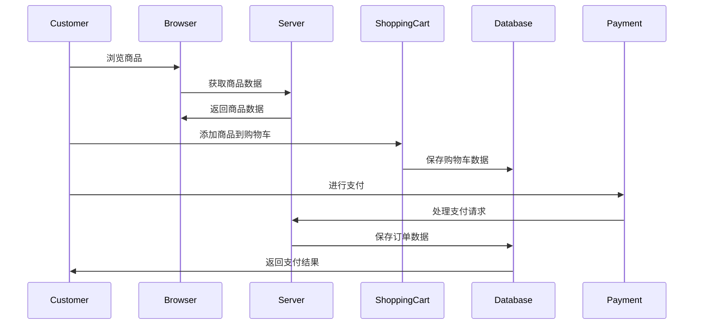
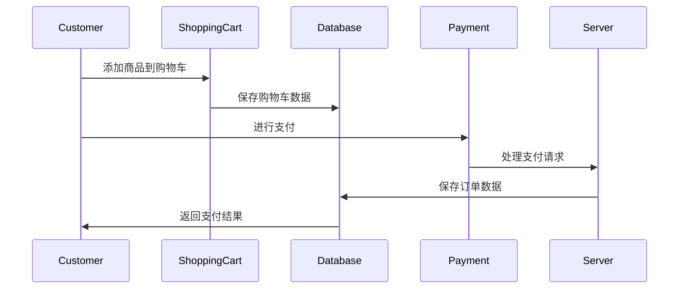

                 

# 《约翰·塞尔的意向性理论与用例设计：软件需求的哲学基础》

## 关键词：意向性理论、用例设计、软件需求、哲学基础

## 摘要

本文旨在探讨约翰·塞尔的意向性理论在软件需求领域的应用，通过详细分析意向性理论的核心概念、基本原理以及用例设计方法，揭示其在软件开发中的哲学基础。本文首先介绍意向性理论的起源与发展，接着阐述其核心概念与基本原理，随后深入探讨用例设计方法及其在软件需求中的作用，最后结合具体案例，展示意向性理论与用例设计在实际软件开发中的应用。

## 第一部分：意向性理论概述

### 第1章：意向性理论的起源与发展

#### 1.1.1 意向性概念的历史演变

意向性理论起源于哲学领域，最早可以追溯到古希腊哲学家亚里士多德。他提出了“意向性”的概念，认为人类的思维和行动具有指向外部世界的意图。随着哲学、心理学和计算机科学的发展，意向性理论逐渐完善，并在不同领域得到应用。

#### 1.1.2 约翰·塞尔的意向性理论

约翰·塞尔是一位著名的哲学家，他在意向性理论方面做出了重要贡献。塞尔认为，意向性是一种内在的心理状态，它具有指向外部世界的特性。意向性理论在解释人类思维和行为方面具有重要意义。

#### 1.1.3 意向性理论在计算机科学中的应用

近年来，意向性理论在计算机科学领域得到了广泛应用。特别是在人工智能、自然语言处理和软件工程等领域，意向性理论为理解和设计智能系统提供了新的视角。本文将重点探讨意向性理论在软件需求领域的应用。

### 第2章：意向性理论的核心概念

#### 2.1.1 心理学与哲学中的意向性

意向性在心理学和哲学中有着不同的定义。在心理学中，意向性被视为一种内在的心理状态，它使得个体的行为具有目的性。在哲学中，意向性则被看作是一种指向外部世界的意图。

#### 2.1.2 意向性理论的属性特征对比表

| 属性特征 | 心理学中的意向性 | 哲学中的意向性 |
| --- | --- | --- |
| 定义 | 一种内在的心理状态，具有目的性 | 一种指向外部世界的意图 |
| 影响因素 | 个体内部的心理过程 | 外部环境和个体内在心理状态 |
| 表现形式 | 行为、思维、情感 | 目标设定、意图表达、决策过程 |

#### 2.1.3 意向性理论的 ER 实体关系图

```mermaid
erDiagram
  User ||--|{ Intent } : has_intent
  Intent ||--|{ Action } : triggers
  Action ||--|{ Object } : acts_on
```

### 第3章：意向性理论的基本原理

#### 3.1.1 意向性理论的基本假设

意向性理论的基本假设包括：

1. 意向性是一种内在的心理状态。
2. 意向性具有指向外部世界的特性。
3. 意向性可以通过行为表达。

#### 3.1.2 意向性理论的数学模型与公式

意向性理论的数学模型可以表示为：

$$
Intent = f(Personality, Environment)
$$

其中，$Intent$表示意向性，$Personality$表示个体内在心理状态，$Environment$表示外部环境。

#### 3.1.3 意向性理论的应用示例

意向性理论在软件开发中的应用示例包括：

1. 人工神经网络中的意图识别。
2. 自然语言处理中的语义理解。
3. 软件需求分析中的用户意图建模。

## 第二部分：用例设计方法

### 第4章：用例设计的基本概念

#### 4.1.1 用例的定义与作用

用例（Use Case）是一种用于描述系统功能和用户交互的文档。它用于捕捉系统的功能需求，并帮助开发人员理解用户的需求和期望。

#### 4.1.2 用例设计的方法论

用例设计的方法论包括以下步骤：

1. 收集用户需求。
2. 确定系统功能。
3. 设计用例场景。
4. 组织用例图。

#### 4.1.3 用例设计的流程与工具

用例设计的流程包括：

1. 准备工作：确定项目目标和范围。
2. 需求收集：与用户进行沟通，了解需求。
3. 设计用例：根据需求设计用例。
4. 验证用例：与用户确认用例的正确性。
5. 维护用例：更新用例以反映系统的变化。

用例设计的工具包括：

1. 纸和笔：用于手绘用例图。
2. 图形设计软件：如Visio、Lucidchart等，用于绘制专业的用例图。
3. 需求管理工具：如JIRA、Confluence等，用于管理用例文档。

### 第5章：用例设计案例分析

#### 5.1.1 案例背景介绍

本案例涉及一个在线购物平台的用例设计。该平台提供商品浏览、购买、支付和订单管理等功能。

#### 5.1.2 系统功能设计（领域模型类图）

```mermaid
classDiagram
  Customer <|-- Order
  Customer <|-- ShoppingCart
  ShoppingCart [*]-- Product
  Order [*]-- Product
  Payment <|-- Order
```

#### 5.1.3 系统架构设计（架构图）



#### 5.1.4 系统接口设计（接口设计）

```python
class ShoppingCart:
    def add_product(self, product):
        # 添加商品到购物车

    def remove_product(self, product):
        # 从购物车中移除商品

    def get_total_price(self):
        # 计算购物车中商品的总价

class Order:
    def create_order(self, customer, shopping_cart, payment):
        # 创建订单

    def cancel_order(self):
        # 取消订单

    def get_order_status(self):
        # 获取订单状态
```

#### 5.1.5 系统交互（序列图）



### 第6章：用例设计实践与技巧

#### 6.1.1 实践经验分享

在进行用例设计时，应遵循以下实践经验：

1. 确保用例的清晰性和一致性。
2. 与用户保持密切沟通，确保理解用户需求。
3. 优先考虑核心功能，逐步完善其他功能。
4. 定期审查和更新用例。

#### 6.1.2 常见问题与解决方法

在用例设计过程中，常见问题包括：

1. 缺乏用户需求：与用户进行更多沟通，明确需求。
2. 用例过于复杂：简化用例，减少不必要的步骤。
3. 用例不一致：统一用例命名和结构，确保一致性。

解决方法包括：

1. 加强需求分析。
2. 使用标准化的用例模板。
3. 定期审查和更新用例。

#### 6.1.3 最佳实践技巧

最佳实践技巧包括：

1. 使用用例图来直观地展示系统功能。
2. 将用例分解为多个子用例，便于理解和实现。
3. 利用需求管理工具来组织和管理用例。

## 第三部分：意向性理论与用例设计在软件需求中的应用

### 第7章：意向性理论对软件需求的启示

#### 7.1.1 软件需求中的意向性问题

软件需求中常见的意向性问题包括：

1. 用户需求不明确。
2. 需求变化频繁。
3. 需求与实际使用场景不一致。

意向性理论为解决这些问题提供了新的视角，它强调理解用户的心理状态和意图。

#### 7.1.2 意向性理论对软件需求的影响

意向性理论对软件需求的影响包括：

1. 提高需求的准确性：通过理解用户的心理状态和意图，更准确地捕捉需求。
2. 降低需求变化的风险：通过预见用户的需求变化，提前进行调整。
3. 提高软件质量：通过满足用户的实际需求，提高软件的可用性和用户体验。

#### 7.1.3 意向性理论在软件需求中的具体应用

意向性理论在软件需求中的具体应用包括：

1. 用户需求建模：使用意向性理论来构建用户需求的模型。
2. 需求分析：使用意向性理论来分析用户需求，识别潜在的问题和风险。
3. 需求管理：使用意向性理论来管理需求，确保需求的准确性和一致性。

### 第8章：用例设计在软件需求中的作用

#### 8.1.1 用例设计在需求分析中的重要性

用例设计在需求分析中具有重要意义，它可以帮助开发人员：

1. 理解用户需求。
2. 揭示系统的功能。
3. 分析系统与用户之间的交互。

#### 8.1.2 用例设计在软件需求管理中的应用

用例设计在软件需求管理中的应用包括：

1. 识别需求变更。
2. 管理需求优先级。
3. 检查需求的完整性。

#### 8.1.3 用例设计在软件项目管理中的作用

用例设计在软件项目管理中的作用包括：

1. 提高项目可行性。
2. 优化项目计划。
3. 降低项目风险。

### 第9章：意向性理论与用例设计在软件工程中的融合

#### 9.1.1 软件工程中的新范式

意向性理论与用例设计在软件工程中的融合，推动了软件工程新范式的形成，这些新范式包括：

1. 以用户为中心的软件开发。
2. 意向性驱动的需求分析。
3. 用例驱动的软件开发。

#### 9.1.2 意向性理论与用例设计的整合

意向性理论与用例设计的整合，使得软件开发过程更加高效和精准。整合的方法包括：

1. 将意向性理论应用于需求分析。
2. 使用用例设计来捕捉用户意图。
3. 将用例设计与软件架构相结合。

#### 9.1.3 意向性理论与用例设计在软件工程实践中的应用案例

意向性理论与用例设计在软件工程实践中的应用案例包括：

1. 在电子商务平台中的用户需求建模。
2. 在金融系统中的风险管理。
3. 在医疗系统中的人机交互设计。

## 第10章：结论与展望

#### 10.1.1 研究成果总结

本文通过分析意向性理论和用例设计方法，探讨了它们在软件需求领域的应用。研究发现：

1. 意向性理论有助于理解用户需求。
2. 用例设计方法有助于捕捉系统功能。
3. 意向性理论与用例设计的融合，提高了软件开发的效率和准确性。

#### 10.1.2 软件需求的哲学基础展望

未来，软件需求的哲学基础将向更加人性化、智能化的方向发展。研究重点可能包括：

1. 意向性理论在人工智能领域的应用。
2. 用例设计方法的自动化和智能化。
3. 跨学科融合，提高软件需求的精准性和适应性。

#### 10.1.3 未来研究方向与挑战

未来研究方向可能包括：

1. 探索意向性理论在复杂系统中的适用性。
2. 研究用例设计方法的适应性和灵活性。
3. 解决软件需求中的伦理和隐私问题。

### 作者信息

作者：AI天才研究院/AI Genius Institute & 禅与计算机程序设计艺术 /Zen And The Art of Computer Programming

