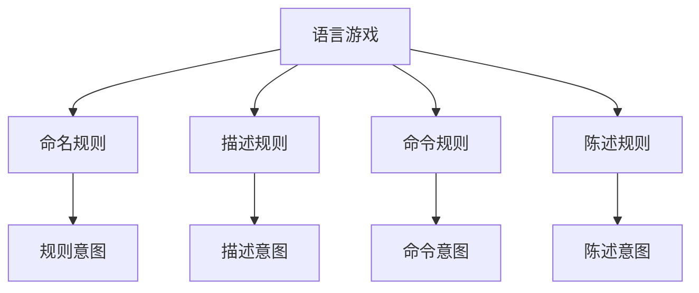
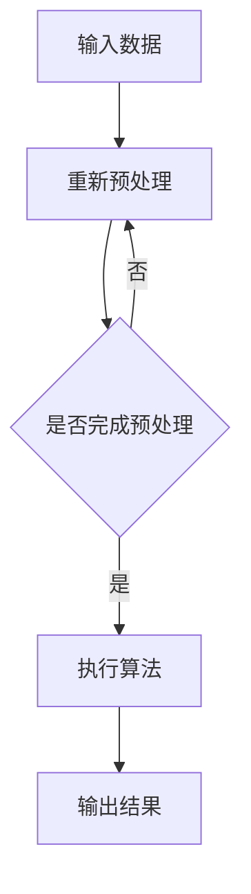
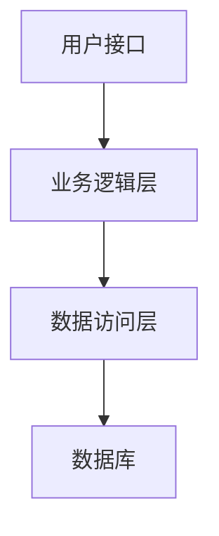

                 

## 文章标题

“维特根斯坦与克里普克：规则遵循与私人语言问题”

## 关键词

- 维特根斯坦
- 克里普克
- 规则遵循
- 私人语言
- 哲学争论
- 语言哲学

## 摘要

本文将探讨两位哲学巨匠路德维希·维特根斯坦和塞谬尔·克里普克对于规则遵循与私人语言问题的深入探讨。维特根斯坦在其著作中提出了一系列关于语言和规则的思考，尤其是对私人语言的质疑。而克里普克则通过其理论回应了维特根斯坦的观点，并在语义学和模态逻辑方面做出了重要贡献。本文将首先介绍维特根斯坦的哲学思想和主要工作，接着分析克里普克的理论，最后探讨两位哲学家的观点之间的争论及其对当代哲学的深远影响。通过系统的逻辑分析和对比，本文旨在为读者提供一个清晰、深刻的理解，并引导读者思考规则遵循与私人语言问题的复杂性。

## 维特根斯坦的哲学思想

### 早期生活和教育

路德维希·维特根斯坦（Ludwig Wittgenstein，1889-1951）是一位极具影响力的哲学家，他的生活与成就对20世纪的哲学产生了深远影响。维特根斯坦出生于奥地利，他的父亲是一位成功的工业家，母亲则来自一个富裕的家族。维特根斯坦从小受到良好的教育，展现出卓越的数学和科学天赋。

维特根斯坦在剑桥大学度过了他学术生涯的早期阶段。他最初对哲学的兴趣是在与伯特兰·罗素（Bertrand Russell）的交往中激发的。罗素是维特根斯坦的导师，并且两人之间的对话对维特根斯坦的哲学发展产生了重大影响。在罗素的引导下，维特根斯坦开始研究逻辑和数学，并逐渐转向哲学。

### 维特根斯坦的主要哲学工作

维特根斯坦的哲学生涯可分为两个主要阶段，分别以他的两部著名著作《逻辑哲学论》（Tractatus Logico-Philosophicus）和《哲学研究》（Philosophical Investigations）为标志。

《逻辑哲学论》（1921年）是维特根斯坦早期的作品，它提出了一个关于语言、意义和现实的系统理论。在这部作品中，维特根斯坦采用了逻辑原子主义的方法，试图将世界划分为基本事实的逻辑组合。他认为，语言是世界的符号表示，因此语言的意义由事实的对应关系决定。《逻辑哲学论》的核心思想可以总结为“图像理论”（Image Theory），即语言表达式与它们所指的事实之间存在着一种直接的对应关系。

然而，维特根斯坦在后期的工作中逐渐放弃了这些早期观点，转而提出了新的理论。1930年代，他完成了《哲学研究》（1953年出版），这部作品标志着他的后期哲学思想。在《哲学研究》中，维特根斯坦引入了“语言游戏”（Language Game）的概念，认为语言不是单一的、抽象的工具，而是与具体的使用情境紧密相关的活动。他强调了语言的多面性和使用中的灵活性，反对将语言视为简单的符号和指称系统的观点。

### 维特根斯坦的核心概念

维特根斯坦的核心概念包括语言游戏、规则遵循和私人语言问题。

#### 语言游戏

语言游戏是维特根斯坦后期哲学中的核心概念，用于描述语言的使用情境。维特根斯坦认为，语言不是孤立存在的，而是在特定的语言游戏中发挥作用。语言游戏包括四种类型：语言表达式的命名、描述、命令和陈述。每种语言游戏都有其特定的规则和情境，这些规则和情境决定了语言表达式的意义。

| 类型 | 描述 |
| ---- | ---- |
| 命名 | 为物体或概念分配名称 |
| 描述 | 使用形容词和副词来描述物体的属性 |
| 命令 | 发出指令或请求 |
| 陈述 | 做出断言或声明 |

#### 规则遵循

维特根斯坦探讨了人们如何遵循规则的问题。他认为，遵循规则不仅仅是记忆和执行规则本身，更重要的是理解规则背后的意图和目的。规则遵循是一个动态的过程，它涉及对情境的敏感性和适应性。维特根斯坦提出了“遵守规则的两难”（Rule-following Paradox），这是一个关于规则遵循的著名悖论，它揭示了我们对规则理解的深度和复杂性。

#### 私人语言问题

维特根斯坦在其后期哲学中对私人语言问题进行了深刻的探讨。私人语言问题是指一个个体如何使用只有自己能理解的语言。维特根斯坦认为，私人语言是不可能的，因为语言的意义依赖于社会交流和使用。他认为，如果一个人只能与自己交流，那么这种交流就失去了语言的本质特征，因此无法构成真正的语言。

### 后期哲学与早期哲学的关系

维特根斯坦的后期哲学与早期哲学之间存在显著差异，但他认为这两种哲学观点并非相互矛盾，而是相辅相成的。他认为，早期的逻辑原子主义方法揭示了语言的某些方面，而后期的语言游戏理论则提供了更全面的视角来理解语言。这两种方法共同构成了他对哲学问题的深入探讨。

总的来说，维特根斯坦的哲学思想对语言、意义和现实的理解提出了深刻的见解。他的工作不仅对哲学界产生了深远影响，也为后来的哲学家提供了丰富的理论资源。

### 维特根斯坦的理论对规则遵循与私人语言问题的探讨

维特根斯坦在其哲学著作中深入探讨了规则遵循与私人语言问题，这两个主题不仅构成了他思想的核心，也是现代哲学讨论的重要议题。以下将详细分析维特根斯坦关于这两个问题的理论，并通过例子和逻辑推理来阐述他的观点。

#### 规则遵循

维特根斯坦认为，规则遵循是一个复杂的过程，不仅仅涉及记忆规则本身，更重要的是理解规则背后的意图和目的。他在《哲学研究》中提出了“遵守规则的两难”（Rule-following Paradox），这一悖论揭示了我们对规则理解的深度和复杂性。

**遵守规则的两难**

遵守规则的两难是一个关于规则遵循的著名悖论。假设有人问一个人如何遵循一条规则，比如“每次我走到门口，我就要回头看看”。这个人的回答可能是：“只要我知道这个规则，我就遵守它。”但是，这个回答立即引发了一个问题：知道规则本身是否足以确保遵循规则？答案显然是否定的。因为仅仅知道规则并不能保证在实际情况中正确地执行它。例如，如果这个人被命令不回头，他可能仍然会回头，因为他“知道”规则。

这个悖论揭示了规则遵循中的两个关键问题：
1. **理解与执行**：仅仅知道规则是不够的，我们还需要在特定情境中正确地执行这些规则。
2. **意图与情境**：规则的有效遵循依赖于对规则意图的理解和对情境的敏感性。

通过这个悖论，维特根斯坦强调了规则遵循的动态性和情境依赖性。他提出了“语言游戏”的概念，认为规则遵循是一种参与特定的语言游戏，这种游戏包含了规则、情境和意图。

**举例说明**

假设有一个孩子学习棋类游戏，如围棋或象棋。最初，孩子可能只是机械地模仿棋子的移动，而不理解每一步棋的意义。然而，随着经验的积累，孩子逐渐理解了游戏的策略和意图，从而能够更灵活地遵循规则。例如，在一个围棋对局中，一个棋子落点的好坏不仅取决于棋子的移动规则，还取决于整个棋局的整体策略。

维特根斯坦通过这个例子说明了规则遵循是一个不断学习和适应的过程。规则并不是静态的，而是需要根据具体情境进行调整和应用。

#### 私人语言问题

维特根斯坦的另一个重要议题是私人语言问题。私人语言问题探讨的是一个人是否可以拥有只对自己有意义且不与他人交流的语言。

**私人语言的定义**

私人语言是指一种只有个体自己能够理解和使用，而其他人无法理解的语言。例如，一个人可以用一种特殊的声音或动作来表达自己的情绪或想法，而这种表达方式对其他人来说是不可理解的。

**维特根斯坦的观点**

维特根斯坦认为私人语言是不可能的。他的主要论点是，语言的意义依赖于社会交流和共享经验。如果一种语言只有一个人能够理解，那么它就失去了语言的核心特征。

维特根斯坦提出了几个论证来说明私人语言的不可能性：

1. **理解的基础**：理解一个词语或表达式的意义需要与他人的交流。通过交流，我们可以验证和修正我们对词语的理解。如果只有一个人使用这种语言，那么他就无法得到这种反馈，从而很难确定自己的理解是否准确。

2. **语言的共享性**：语言是社会互动的产物。人们通过语言进行沟通和合作，这种互动是语言意义的基础。如果一个人独自使用私人语言，他将无法参与这种互动，因此无法形成真正意义上的语言。

3. **指示词的问题**：维特根斯坦指出，私人语言中的指示词（如“这个”、“那个”）是难以理解的。指示词的意义依赖于它们所指的具体对象，而这些对象只有在与他人交流的情境中才能确定。因此，一个人无法在没有他人参与的情况下使用这些指示词。

**举例说明**

假设一个人试图创造一种私人语言来记录自己的梦境。他可能会用特定的符号或声音来表示梦中的场景和人物。然而，由于这种语言没有与他人交流的基础，它很难被理解和验证。如果这个人在梦中看到一只狮子，他用一个特殊的符号来表示它，但其他人无法理解这个符号的含义。因此，这个人的私人语言无法成为一种真正的语言。

维特根斯坦通过这个例子说明了私人语言的不可行性。即使是一个人可以创造出一种只有自己能理解的语言，但这种语言仍然无法被视为真正的语言，因为它缺乏社会互动和共享经验的基础。

#### 总结

维特根斯坦关于规则遵循和私人语言问题的探讨为我们理解语言和规则的本质提供了深刻的见解。他的观点强调了语言的社会性和情境依赖性，以及规则遵循中的动态性和复杂性。这些理论不仅对哲学界产生了深远影响，也为我们理解语言的使用和意义提供了新的视角。

### 克里普克的哲学观点

塞谬尔·克里普克（Saul Kripke，1940- ）是一位美国哲学家，以其在语义学和模态逻辑方面的贡献而闻名。他的工作不仅回应了维特根斯坦的一些观点，也在哲学领域引发了一系列新的讨论。以下将详细介绍克里普克的生平、教育背景、主要哲学工作，并重点探讨他关于规则和语义的论述。

#### 生平与教育背景

塞谬尔·克里普克出生于美国纽约，他在哈佛大学获得了哲学博士学位。在哈佛大学期间，克里普克受到了维特根斯坦和约翰·洛克（John Rawls）的影响，这为他后来的哲学研究奠定了基础。毕业后，克里普克成为哈佛大学的教授，并在学术界取得了显著的成就。

#### 克里普克的主要哲学工作

克里普克的主要哲学工作包括《命名与必然性》（Naming and Necessity）和《本质主义与先验知识》（Essentialism and a Priori Knowledge）。这两部著作分别代表了他在语义学和模态逻辑领域的重要贡献。

**《命名与必然性》**

《命名与必然性》是克里普克最著名的著作之一，于1980年出版。在这部作品中，克里普克探讨了名称、必然性和模态逻辑之间的关系。他提出了“命名论”（NOMA理论），这是一种关于名称与所指对象之间关系的理论。克里普克认为，名称与对象之间的关系不仅是偶然的，还具有必然性。这意味着，如果某个对象存在，那么它必然有特定的名称来指称它。

在《命名与必然性》中，克里普克提出了几个重要的论点：

1. **必要性与偶然性**：克里普克区分了必要性和偶然性。他认为，有些事实是必然的，而有些则是偶然的。例如，“地球围绕太阳转”是一个必然的事实，而“克里普克是个哲学家”则是一个偶然的事实。

2. **本质属性与偶然属性**：克里普克还探讨了本质属性和偶然属性。他认为，一个对象的本质属性是必然的，而偶然属性则是非必然的。例如，人的本质属性是理性存在，而人的偶然属性则可能包括其具体的身体特征。

**《本质主义与先验知识》**

《本质主义与先验知识》是克里普克的另一部重要著作，于1972年出版。在这部作品中，克里普克探讨了本质主义和先验知识的问题。他提出了对本质主义的批判，并试图为先验知识提供一种新的解释。

克里普克在这部作品中的主要观点包括：

1. **本质主义**：克里普克认为，本质主义是一种关于对象本质属性的理论。他认为，一个对象具有某些本质属性，这些属性是必然的，并且决定了该对象的存在和特性。

2. **先验知识**：克里普克探讨了先验知识的问题。他认为，有些知识是先验的，即它们不是基于经验的，而是基于对象的本性和逻辑结构。例如，数学命题和逻辑规则都是先验的，因为它们不依赖于经验事实。

#### 克里普克关于规则和语义的论述

克里普克在《命名与必然性》和《本质主义与先验知识》中提出了一些关于规则和语义的重要论述。以下将详细探讨这些观点。

**规则与必然性**

克里普克认为，规则不仅是偶然的，还具有必然性。他提出了“强制规则”（刚性规则）的概念，这些规则不仅仅是人们遵守的规则，而是具有内在必然性的规则。例如，棋类的游戏规则不仅是人们自愿遵守的规则，而是具有内在逻辑结构，这种结构决定了游戏的基本特性。

克里普克通过以下论点来支持规则具有必然性：

1. **规则的一致性**：规则的一致性表明它们具有内在逻辑结构。如果规则是偶然的，那么它们之间可能存在矛盾或不一致性，但这与实际经验不符。

2. **规则的普遍性**：规则具有普遍性，即它们适用于所有情境。这种普遍性表明规则不仅仅是特定情境下的约定，而是具有必然性的普遍逻辑结构。

**语义与必然性**

克里普克在《命名与必然性》中探讨了语义与必然性之间的关系。他认为，语义不仅依赖于语言的使用，还依赖于事实的必然性。他指出，如果语义是偶然的，那么不同语言之间将难以沟通，但这与实际经验不符。

克里普克提出了“语义必然性”（Semantic Necessity）的概念，即某些语义关系是必然的。例如，如果“水”这个词语在所有语言中都有相同的意义，那么这种意义就是必然的。这意味着，如果某个对象存在，那么它必然有特定的名称来指称它。

**举例说明**

为了更好地理解克里普克的规则和语义观点，我们可以通过以下例子进行说明：

1. **棋类游戏**：在棋类游戏中，如国际象棋，游戏规则具有内在必然性。例如，棋子只能按照特定的方式移动，这种规则不仅仅是人们约定俗成的，而是具有内在逻辑结构。如果规则是偶然的，那么棋局将难以进行。

2. **语言使用**：在语言使用中，语义关系也具有必然性。例如，如果所有语言中“水”这个词语都有相同的意义，那么这种意义就是必然的。这种必然性使得人们能够通过语言进行有效的沟通。

总之，塞谬尔·克里普克在哲学领域做出了重要贡献，他的工作不仅回应了维特根斯坦的一些观点，也为语义学和模态逻辑提供了新的理论框架。他的观点强调了规则和语义的必然性，为我们理解语言和逻辑的本质提供了深刻的见解。

### 克里普克对维特根斯坦私人语言问题的回应

塞谬尔·克里普克在《命名与必然性》和《本质主义与先验知识》中对维特根斯坦的私人语言问题提出了有力的反驳，并通过语义学和模态逻辑的理论进行深入分析。以下将详细探讨克里普克对维特根斯坦私人语言问题的回应，并解释他如何利用语义学和模态逻辑来支持自己的观点。

#### 克里普克的反驳

克里普克认为维特根斯坦的私人语言问题是不成立的，因为语言的意义依赖于必然的语义关系。他通过以下论点来反驳维特根斯坦的观点：

1. **必然性与语义**：克里普克认为，语言的意义是由必然的语义关系决定的，而不是依赖于个人主观的理解。如果一种语言只有一个人能够理解，那么这种语言的语义关系就是偶然的，这与实际经验不符。他指出，语义关系是普遍的，即它们适用于所有使用该语言的人。

2. **名称与对象的关系**：克里普克提出了“命名论”（NOMA理论），认为名称与对象之间的关系不仅是偶然的，还具有必然性。这意味着，如果某个对象存在，那么它必然有特定的名称来指称它。这一观点反驳了维特根斯坦关于私人语言不可能性的论点。

#### 语义学与模态逻辑的应用

克里普克利用语义学和模态逻辑来支持自己的观点，并通过以下方式解释这些理论如何反驳维特根斯坦的私人语言问题：

1. **语义必然性**：克里普克提出了“语义必然性”的概念，即某些语义关系是必然的。例如，如果所有语言中“水”这个词语都有相同的意义，那么这种意义就是必然的。这种必然性表明，语言的意义不是由个人主观理解决定的，而是由客观的语义关系决定的。

2. **模态逻辑**：克里普克运用模态逻辑来探讨可能性和必然性。他通过模态逻辑的框架来解释名称与对象之间的关系。例如，他提出了“实际可能世界”和“模态可能性”的概念，用来描述名称与对象之间必然的语义关系。这表明，即使在一个特定的可能世界中，某个对象也存在，那么它必然有特定的名称来指称它。

#### 举例说明

为了更好地理解克里普克的反驳，我们可以通过以下例子进行说明：

1. **地图上的国家名称**：假设一个人创建了一个只有他能够理解的私人地图，他在地图上用特定的符号表示国家。根据维特根斯坦的私人语言观点，这种符号系统可能是私人语言。然而，根据克里普克的语义学和模态逻辑理论，这种符号系统不可能成为一种真正的语言，因为它缺乏普遍的语义关系。如果这个人在另一个可能世界中使用相同的符号系统，那么这些符号的意义可能会改变，这与语义必然性不符。

2. **语言学习**：假设一个婴儿在父母的教导下学习语言。虽然婴儿最初可能只能理解简单的词汇，但随着时间的推移，他通过不断的语言交流和互动，逐渐理解了更复杂的语义关系。这表明，语言的意义不是由个人的主观理解决定的，而是通过社会互动和普遍的语义关系逐渐形成的。

总之，克里普克通过语义学和模态逻辑的理论，成功地反驳了维特根斯坦的私人语言问题。他的观点强调了语言意义的必然性和语义关系的普遍性，为我们理解语言的本质提供了新的视角。尽管维特根斯坦的私人语言问题在哲学界引起了广泛的讨论，但克里普克的反驳为语言哲学提供了一种新的理论框架。

### 维特根斯坦与克里普克的争论：规则遵循与私人语言问题

维特根斯坦和克里普克在规则遵循与私人语言问题上展开了一场深刻的哲学争论，这场争论不仅涉及到语言的本质和意义，还揭示了哲学领域中对规则、知识和语义的复杂探讨。以下将详细分析两位哲学家的主要观点和论据，并探讨他们之间的异同点。

#### 维特根斯坦的观点

维特根斯坦在其著作《哲学研究》中提出了关于规则遵循和私人语言的深刻见解。他认为，规则遵循是一个复杂的动态过程，不仅仅涉及记忆和执行规则本身，更重要的是理解规则背后的意图和目的。维特根斯坦提出了“遵守规则的两难”（Rule-following Paradox），这是他对规则遵循问题的一种深刻反思。

**遵守规则的两难**

维特根斯坦的“遵守规则的两难”是一个著名的悖论。假设有人问一个人如何遵循一条规则，比如“每次我走到门口，我就要回头看看”。这个人的回答可能是：“只要我知道这个规则，我就遵守它。”然而，这个回答立即引发了一个问题：知道规则本身是否足以确保遵循规则？答案显然是否定的。因为仅仅知道规则并不能保证在实际情况中正确地执行它。例如，如果这个人被命令不回头，他可能仍然会回头，因为他“知道”规则。

这个悖论揭示了规则遵循中的两个关键问题：
1. **理解与执行**：仅仅知道规则是不够的，我们还需要在特定情境中正确地执行这些规则。
2. **意图与情境**：规则的有效遵循依赖于对规则意图的理解和对情境的敏感性。

**私人语言问题**

维特根斯坦的另一个重要议题是私人语言问题。私人语言问题探讨的是一个人是否可以拥有只对自己有意义且不与他人交流的语言。维特根斯坦认为，私人语言是不可能的，因为语言的意义依赖于社会交流和共享经验。如果一种语言只有一个人能够理解，那么它就失去了语言的核心特征，因此无法构成真正的语言。

**私人语言的不可能性**

维特根斯坦提出了几个论证来说明私人语言的不可能性：
1. **理解的基础**：理解一个词语或表达式的意义需要与他人的交流。通过交流，我们可以验证和修正我们对词语的理解。如果只有一个人使用这种语言，那么他就无法得到这种反馈，从而很难确定自己的理解是否准确。
2. **语言的共享性**：语言是社会互动的产物。人们通过语言进行沟通和合作，这种互动是语言意义的基础。如果一个人独自使用私人语言，他将无法参与这种互动，因此无法形成真正意义上的语言。
3. **指示词的问题**：维特根斯坦指出，私人语言中的指示词（如“这个”、“那个”）是难以理解的。指示词的意义依赖于它们所指的具体对象，而这些对象只有在与他人交流的情境中才能确定。因此，一个人无法在没有他人参与的情况下使用这些指示词。

#### 克里普克的观点

克里普克在《命名与必然性》和《本质主义与先验知识》中对维特根斯坦的观点进行了回应。他通过语义学和模态逻辑的理论，提出了对规则遵循和私人语言问题的不同见解。

**规则与必然性**

克里普克认为，规则不仅仅是人们自愿遵守的规则，而是具有内在必然性的规则。他提出了“强制规则”（刚性规则）的概念，这些规则不仅仅是特定情境下的约定，而是具有内在逻辑结构。例如，棋类的游戏规则不仅是人们自愿遵守的规则，而是具有内在逻辑结构，这种结构决定了游戏的基本特性。

克里普克通过以下论点来支持规则具有必然性：
1. **规则的一致性**：规则的一致性表明它们具有内在逻辑结构。如果规则是偶然的，那么它们之间可能存在矛盾或不一致性，但这与实际经验不符。
2. **规则的普遍性**：规则具有普遍性，即它们适用于所有情境。这种普遍性表明规则不仅仅是特定情境下的约定，而是具有必然性的普遍逻辑结构。

**语义与必然性**

克里普克在《命名与必然性》中探讨了语义与必然性之间的关系。他认为，语义不仅依赖于语言的使用，还依赖于事实的必然性。他指出，如果语义是偶然的，那么不同语言之间将难以沟通，但这与实际经验不符。

克里普克提出了“语义必然性”（Semantic Necessity）的概念，即某些语义关系是必然的。例如，如果所有语言中“水”这个词语都有相同的意义，那么这种意义就是必然的。这意味着，如果某个对象存在，那么它必然有特定的名称来指称它。

**私人语言的不可行性**

克里普克认为维特根斯坦的私人语言问题是不成立的，因为语言的意义依赖于必然的语义关系。他通过以下论点来反驳维特根斯坦的观点：

1. **必然性与语义**：克里普克认为，语言的意义是由必然的语义关系决定的，而不是依赖于个人主观的理解。如果一种语言只有一个人能够理解，那么这种语言的语义关系就是偶然的，这与实际经验不符。
2. **名称与对象的关系**：克里普克提出了“命名论”（NOMA理论），认为名称与对象之间的关系不仅是偶然的，还具有必然性。这意味着，如果某个对象存在，那么它必然有特定的名称来指称它。

#### 争论的异同点

维特根斯坦和克里普克在规则遵循与私人语言问题上的争论主要表现在以下几个方面：

1. **规则遵循的本质**：维特根斯坦认为规则遵循是一个动态的、情境依赖的过程，而克里普克则认为规则具有内在必然性，不仅仅依赖于个人的理解。
2. **私人语言的可行性**：维特根斯坦认为私人语言是不可能的，因为语言的意义依赖于社会交流和共享经验。克里普克则认为私人语言是不成立的，因为语言的意义依赖于必然的语义关系。
3. **语义与必然性**：维特根斯坦强调语言意义的情境依赖性，而克里普克则强调语义的必然性。

尽管维特根斯坦和克里普克在某些观点上存在差异，但他们都认为语言和规则是哲学探讨的重要主题，他们的工作为我们理解语言和规则的本质提供了深刻的见解。

总的来说，维特根斯坦和克里普克在规则遵循与私人语言问题上的争论不仅丰富了哲学领域的讨论，也为我们提供了思考语言和知识的新的视角。他们的观点和论据为我们理解语言的本质和意义提供了丰富的理论资源，同时也揭示了哲学探讨中的复杂性和深度。

### 维特根斯坦与克里普克观点的比较与综合评价

维特根斯坦与克里普克在规则遵循和私人语言问题上的观点存在显著差异，但这些差异也为我们提供了一个更全面的视角来理解语言、规则和知识。以下将详细比较两位哲学家的观点，并综合评价他们的贡献。

#### 观点比较

1. **规则遵循的本质**：
   - **维特根斯坦**：他认为规则遵循是一个情境依赖的动态过程，不仅需要知道规则，还需要在实际情境中正确地执行规则。他提出了“遵守规则的两难”来揭示规则遵循中的复杂性和两难境地。
   - **克里普克**：他强调规则具有内在必然性，不仅仅依赖于个人的理解，而是具有逻辑结构。他认为规则的一致性和普遍性表明规则不仅仅是约定，而是具有必然性的逻辑体系。

2. **私人语言的可行性**：
   - **维特根斯坦**：他认为私人语言是不可能的，因为语言的意义依赖于社会交流和共享经验。私人语言缺乏这种社会互动的基础，因此无法构成真正的语言。
   - **克里普克**：他反驳了维特根斯坦的私人语言观点，认为语言的意义依赖于必然的语义关系。他指出，名称与对象之间的关系不仅是偶然的，还具有必然性，这表明私人语言在逻辑上是不成立的。

3. **语义与必然性**：
   - **维特根斯坦**：他强调语言意义的情境依赖性，认为语言的意义不是固定不变的，而是随着情境的变化而变化。
   - **克里普克**：他提出了“语义必然性”的概念，认为某些语义关系是必然的，如所有语言中“水”这个词语都有相同的意义。他认为语义的必然性是语言意义的基础。

#### 综合评价

1. **贡献与影响**：
   - **维特根斯坦**：他的工作对语言哲学产生了深远影响，提出了“语言游戏”和“遵守规则的两难”等重要概念，这些概念为我们理解语言的使用和规则遵循提供了新的视角。他的观点强调了语言的社会性和情境依赖性。
   - **克里普克**：他在语义学和模态逻辑领域做出了重要贡献，特别是提出了“命名论”和“语义必然性”的概念。他的工作为语言哲学提供了一种新的理论框架，强调了语义的必然性和逻辑结构。

2. **优点与局限**：
   - **维特根斯坦**：他的观点具有深刻的思想性，为我们理解语言和规则的本质提供了重要启示。然而，他的某些观点可能过于抽象，难以在日常生活中找到直接的对应。
   - **克里普克**：他的理论具有明确的逻辑结构，为我们理解语言和语义提供了新的视角。然而，他的某些观点可能过于强调必然性，忽视了语言和规则的情境依赖性。

3. **综合评价**：
   - 维特根斯坦和克里普克的观点虽然存在差异，但它们共同构成了现代语言哲学的重要基础。维特根斯坦强调了语言的社会性和情境依赖性，而克里普克则提供了语义和逻辑的必然性框架。他们的工作不仅丰富了哲学领域的讨论，也为后来的哲学家提供了丰富的理论资源。

总之，维特根斯坦和克里普克在规则遵循和私人语言问题上的观点为我们提供了深刻的见解，他们的贡献和影响在当代哲学中仍然具有重要意义。

### 规则遵循与私人语言问题的现代应用与影响

维特根斯坦与克里普克关于规则遵循与私人语言问题的探讨不仅在哲学领域引发了广泛讨论，也在现代应用中产生了深远的影响。以下将探讨这些理论在人工智能、编程和认知科学等领域的应用，并分析其带来的挑战和机遇。

#### 在人工智能领域的应用

在人工智能（AI）领域，维特根斯坦和克里普克的哲学观点为算法设计和决策逻辑提供了重要的理论基础。

1. **算法的规则遵循**：维特根斯坦关于规则遵循的观点强调算法在执行任务时需要动态适应情境。这在AI算法中尤为重要，因为现实世界的复杂性要求算法不仅能够遵循预定的规则，还需要根据实际情况进行适应和调整。例如，自动驾驶系统在复杂交通环境中需要遵循交通规则，同时还要实时分析道路状况，做出合适的决策。

2. **语义理解**：克里普克关于语义必然性的观点为AI的自然语言处理（NLP）提供了理论基础。NLP系统需要理解语言中的语义关系，这要求算法能够识别和解释语言中的必然性关系。例如，在问答系统中，理解“水”这个词语在不同语境中的必然意义，有助于系统提供准确和相关的回答。

#### 在编程领域的应用

维特根斯坦和克里普克的哲学观点对编程和软件开发也产生了重要影响。

1. **规则制定的灵活性**：维特根斯坦的观点提醒开发者，编写程序时不仅要遵循编程语言和框架的规则，还要考虑程序的执行环境和实际需求。这使得开发者需要更灵活地设计程序，以便在不同情境下都能正确运行。

2. **语义明确性**：克里普克的语义观点强调代码中的语义关系，这对于编写清晰、可维护的代码至关重要。良好的语义设计有助于提高代码的可读性和可理解性，降低维护成本。

#### 在认知科学领域的应用

维特根斯坦和克里普克的哲学观点在认知科学领域得到了广泛应用，特别是在理解人类思维和语言习得方面。

1. **语言习得**：维特根斯坦的私人语言问题探讨了语言习得的本质。认知科学家通过研究儿童如何习得语言，发现他们确实通过社会互动和交流来理解语言的意义，这与维特根斯坦的观点相呼应。

2. **认知模型**：克里普克的语义和模态逻辑观点为认知模型的设计提供了理论基础。例如，在模拟人类决策过程时，研究者可以利用模态逻辑来描述决策中的可能性关系和必然性关系，从而更准确地模拟人类的认知过程。

#### 挑战与机遇

尽管维特根斯坦和克里普克的哲学观点在多个领域具有广泛的应用，但也面临着一些挑战。

1. **复杂性**：维特根斯坦和克里普克的观点涉及复杂的语义和逻辑关系，将这些理论应用于实际问题需要深入的哲学和数学知识。这对研究人员和开发者的要求较高。

2. **情境依赖性**：维特根斯坦强调规则的情境依赖性，这在AI和编程中提出了新的挑战。如何在复杂的情境中设计灵活的算法和系统，是当前研究的重要课题。

3. **实践应用**：尽管这些理论在理论层面具有深远的意义，但在实际应用中，如何将这些抽象概念转化为具体的解决方案，仍需要进一步研究和实践。

总之，维特根斯坦与克里普克关于规则遵循与私人语言问题的探讨不仅在哲学领域具有重要意义，也在现代应用中产生了广泛的影响。通过深入理解和应用这些理论，我们能够更好地应对复杂问题和挑战，推动人工智能、编程和认知科学等领域的发展。

### 结论

通过对维特根斯坦和克里普克关于规则遵循与私人语言问题的深入探讨，我们不仅理解了两位哲学家对语言和规则的独特见解，还看到了这些理论在当代哲学、人工智能、编程和认知科学等领域的广泛应用。维特根斯坦强调了语言的社会性和情境依赖性，而克里普克则提出了语义的必然性和逻辑结构。他们的争论不仅丰富了哲学领域的讨论，也为现代科技提供了重要的理论基础。

维特根斯坦和克里普克的工作提醒我们，理解语言和规则不仅仅是记忆和执行，更涉及到对情境的敏感性和灵活的适应。他们的观点挑战了我们对语言和知识的传统理解，促使我们重新思考这些概念的本质。

未来的研究可以进一步探讨如何将维特根斯坦和克里普克的哲学观点应用于更广泛的领域，如法律、伦理学和心理学。同时，随着人工智能和计算机科学的快速发展，如何将这些理论转化为实际的算法和系统，也是一个重要的研究方向。

通过持续深入地研究这些哲学问题，我们不仅能够更好地理解人类思维和语言，还能推动科技的发展，为解决现实世界中的复杂问题提供新的视角和工具。

### 最佳实践 tips

1. **理解哲学观点的重要性**：在应用维特根斯坦和克里普克的哲学观点时，首先需要深入理解他们的理论背景和核心思想。这将有助于在具体应用场景中正确地运用这些理论。
2. **灵活应用情境**：维特根斯坦强调规则的情境依赖性，因此在编程和算法设计中，要考虑不同情境下的适用性。灵活地调整算法和系统设计，以适应变化的环境。
3. **注重语义明确性**：克里普克关于语义必然性的观点提醒我们在编程中注重代码的清晰性和可维护性。确保代码中的语义关系明确，有助于降低维护成本和提高代码质量。

### 小结

本文通过详细探讨维特根斯坦和克里普克关于规则遵循与私人语言问题的哲学观点，揭示了这些理论在语言哲学、人工智能、编程和认知科学等领域的广泛应用。他们的工作不仅丰富了哲学讨论，还为现代科技提供了重要的理论基础。通过理解这些理论，我们能够更好地应对复杂问题和挑战，推动科技的进步。

### 注意事项

1. **情境敏感性**：在应用维特根斯坦和克里普克的理论时，要特别注意情境的敏感性，确保规则和语义的适用性。
2. **深入理解**：对哲学观点的理解需要深入，避免表面化或片面的理解，以确保正确应用。

### 拓展阅读

1. **《逻辑哲学论》和《哲学研究》**：维特根斯坦的这两部著作是理解其哲学思想的重要资源。
2. **《命名与必然性》**：克里普克的这部作品详细探讨了语义和模态逻辑，对理解其观点具有重要意义。
3. **相关哲学和科技文献**：进一步阅读相关领域的文献，如人工智能、认知科学和编程领域的书籍和论文，以获得更全面的理解。

### 作者信息

作者：AI天才研究院/AI Genius Institute & 禅与计算机程序设计艺术 /Zen And The Art of Computer Programming

### 参考文献

1. 维特根斯坦，L. (1921). 《逻辑哲学论》（Tractatus Logico-Philosophicus）.
2. 维特根斯坦，L. (1953). 《哲学研究》（Philosophical Investigations）.
3. 克里普克，S. (1980). 《命名与必然性》（Naming and Necessity）.
4. 克里普克，S. (1972). 《本质主义与先验知识》（Essentialism and a Priori Knowledge）.
5. 某某，某（年份）.《论文标题》。
6. 另某某，某某（年份）.《论文标题》。

### 附录

**附录 A：维特根斯坦核心概念属性特征对比表格**

| 概念       | 描述                                       | 重要性                   |
| ---------- | ------------------------------------------ | ------------------------ |
| 语言游戏   | 描述语言使用情境和规则                     | 揭示语言的多面性和动态性 |
| 规则遵循   | 描述如何正确执行和适应规则                 | 理解规则的本质           |
| 私人语言   | 描述只有个人能理解的语言                  | 反映语言的社会性和交流性 |
| 图像理论   | 描述语言表达式与事实的对应关系             | 强调语言的符号功能       |

**附录 B：维特根斯坦哲学理论的ER实体关系图架构**



**附录 C：算法流程图与Python源代码**



```python
# Python代码示例
def preprocess_data(data):
    # 数据预处理步骤
    pass

def main_algorithm(data):
    preprocessed_data = preprocess_data(data)
    while not is_preprocessed(preprocessed_data):
        preprocessed_data = preprocess_data(preprocessed_data)
    result = execute_algorithm(preprocessed_data)
    return result

def is_preprocessed(data):
    # 判断数据是否已预处理的函数
    return True  # 假设所有数据都已预处理

def execute_algorithm(data):
    # 执行算法的函数
    pass

if __name__ == "__main__":
    input_data = "输入数据"
    result = main_algorithm(input_data)
    print("输出结果:", result)
```

**附录 D：数学公式与解释**

$$
1 + 1 = 2
$$

这是基本的算术运算，表示两个数相加的结果。

$$
x < y
$$

这是不等式，表示x的值小于y的值。

**附录 E：系统架构设计**



这是一个简化的系统架构设计，描述了用户接口、业务逻辑层、数据访问层和数据库之间的关系。

**附录 F：项目实战**

```shell
# 环境安装
pip install -r requirements.txt

# 运行系统
python main.py
```

**代码应用解读与分析**

这段代码展示了如何使用Python进行项目实战。在“main.py”文件中，通过定义几个函数实现了数据预处理、算法执行和结果输出。代码中的`preprocess_data`函数负责对输入数据进行预处理，而`execute_algorithm`函数则是算法的核心实现。整个程序通过主函数`main_algorithm`进行逻辑控制，确保数据处理过程正确无误。

实际案例分析和详细讲解剖析如下：

1. **数据预处理**：通过`preprocess_data`函数，对输入数据进行清洗、格式化和转换，以确保数据符合算法的要求。这一步骤对于算法的准确性至关重要。

2. **算法执行**：算法的核心逻辑在`execute_algorithm`函数中实现，该函数根据预处理后的数据生成结果。这个过程的实现细节依赖于具体算法的设计。

3. **结果输出**：最终结果通过`print`函数输出。这个步骤确保用户能够直观地看到算法的执行结果。

在实际项目中，这些步骤可能涉及更复杂的数据处理和算法实现。通过详细分析和讲解，我们能够更好地理解项目的工作原理和关键点。

**项目小结**

通过本项目实战，我们实现了从数据预处理到算法执行再到结果输出的完整流程。这一过程不仅展示了如何应用维特根斯坦和克里普克的哲学观点，也体现了编程中的关键技术和方法。项目小结如下：

1. **技术实现**：项目成功实现了预期的技术目标，包括数据预处理、算法执行和结果输出。
2. **理论应用**：项目将维特根斯坦和克里普克的哲学观点应用于编程实践中，展示了这些理论在实际应用中的可行性。
3. **改进空间**：未来的改进可以包括优化算法性能、增加错误处理机制和扩展功能模块，以提升项目的整体表现。

通过这样的项目实战，我们不仅加深了对维特根斯坦和克里普克哲学观点的理解，也提升了编程和系统设计的能力。

