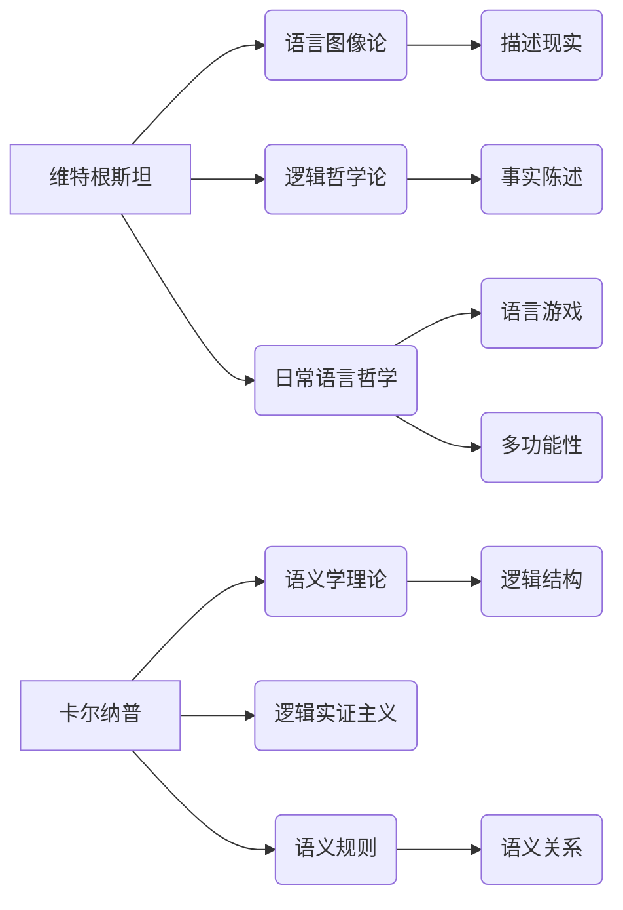
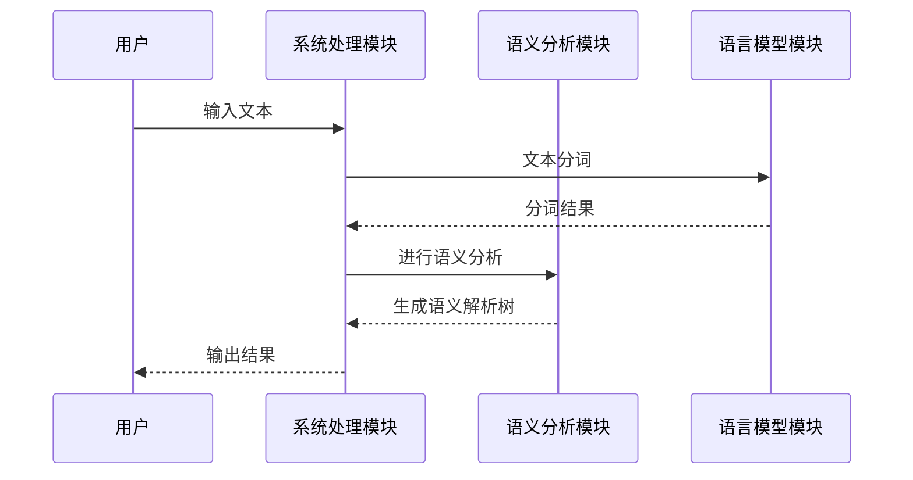
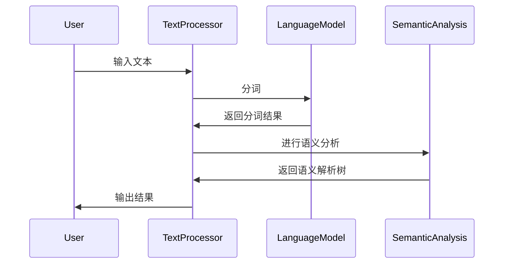

                 

# 维特根斯坦与卡尔纳普：语言分析与逻辑实证主义

## 关键词

语言哲学、逻辑实证主义、维特根斯坦、卡尔纳普、语义分析、语言图像论

## 摘要

本文旨在探讨两位20世纪初期的重要哲学家——路德维希·维特根斯坦（Ludwig Wittgenstein）和鲁道夫·卡尔纳普（Rudolf Carnap）在语言分析和逻辑实证主义领域的贡献。通过对他们的生平、主要著作及其思想的深入分析，本文将揭示他们如何影响了语言哲学的发展，并探讨其哲学思想在当代的应用和价值。

## 第1章：背景介绍

### 1.1.1 问题背景

维特根斯坦与卡尔纳普是20世纪初期两位重要的哲学家，他们在语言哲学和逻辑实证主义领域都有着深远的影响。维特根斯坦是维也纳学派的核心成员，他的早期著作《逻辑哲学论》对逻辑和语言进行了深刻的探讨，提出了著名的“语言图像论”。而卡尔纳普则是维也纳学派的重要人物，他的工作主要集中在语义学和语言分析上，提出了著名的《语义学导论》。

### 1.1.2 问题描述

本书的主题是探讨维特根斯坦和卡尔纳普在语言分析方面的思想，以及他们如何影响了逻辑实证主义的发展。具体问题包括：维特根斯坦的语言图像论如何解释语言与现实的联系？卡尔纳普的语言分析如何为实证主义提供理论支持？他们两人的思想在哲学史上有哪些重要意义？

### 1.1.3 问题解决

通过深入分析维特根斯坦和卡尔纳普的著作，本书将揭示他们在语言分析领域的核心观点，探讨他们的思想如何影响逻辑实证主义的发展。同时，本书还将比较他们之间的异同，分析他们各自的理论贡献。

### 1.1.4 边界与外延

本书主要探讨维特根斯坦和卡尔纳普的语言哲学思想，涉及逻辑实证主义的相关理论。边界方面，本书将关注他们的主要著作和思想观点，以及这些观点在哲学史上的影响。外延方面，本书还将探讨这些思想在现代哲学和语言学研究中的延续和发展。

### 1.1.5 概念结构与核心要素组成

本书的核心概念包括维特根斯坦的语言图像论、卡尔纳普的语言分析、逻辑实证主义等。这些概念构成了本书的基本框架，核心要素包括：

- 维特根斯坦的思想：语言图像论、逻辑哲学论、日常语言哲学
- 卡尔纳普的思想：语义学导论、逻辑实证主义、语言分析
- 逻辑实证主义：经验验证、语义分析、逻辑推理

## 第2章：维特根斯坦的语言哲学思想

### 2.1.1 维特根斯坦的生平与著作

路德维希·维特根斯坦（Ludwig Wittgenstein）是20世纪最杰出的哲学家之一，他的生平和著作对哲学界产生了深远的影响。他出生于1889年，曾在剑桥大学学习数学和哲学，并在罗素和弗雷格的指导下开始了自己的哲学研究。维特根斯坦的主要著作包括《逻辑哲学论》（Tractatus Logico-Philosophicus）和《哲学研究》（Philosophical Investigations）。

维特根斯坦的哲学思想可以分为两个阶段。早期，他提出了著名的语言图像论，认为语言是一种图像，用于描述现实世界。这一观点强调了语言与现实之间的联系，但也受到了后来的批评，认为它过于简化了语言的功能。晚期，维特根斯坦转向日常语言哲学，提出了“语言游戏”的概念，认为语言的使用是多样化的，不应该仅仅从逻辑和数学的角度来理解。

### 2.1.2 语言图像论

维特根斯坦的早期著作《逻辑哲学论》提出了著名的语言图像论。他认为，语言是一种图像，用于描述现实世界。这种观点强调了语言与现实之间的联系，但也受到了后来的批评，认为它过于简化了语言的功能。

语言图像论的核心观点可以概括为以下几点：

1. **图像性**：维特根斯坦认为，语言与现实的联系是通过图像来实现的。图像是语言的原子，它们直接对应于现实中的事物和状态。

2. **不可言说性**：维特根斯坦认为，有些事物或状态是无法用语言表达的。例如，数学命题和逻辑命题本身就是现实的图像，但它们无法被转化为语言。

3. **简化主义**：语言图像论试图简化语言和现实之间的关系，认为语言只是一种符号系统，用于描述现实中的基本事实。

然而，语言图像论也受到了批评。一些哲学家认为，语言的功能远不止于描述现实，它还包括表达情感、进行推理、交流思想等方面。因此，语言图像论过于简化了语言的本质。

### 2.1.3 逻辑哲学论

在《逻辑哲学论》中，维特根斯坦提出了关于逻辑和数学的许多重要观点。他认为，逻辑是关于事实的陈述，而数学则是逻辑的扩展。这一观点对后来的逻辑实证主义产生了深远的影响。

1. **逻辑原子主义**：维特根斯坦认为，逻辑可以被视为一系列原子命题的组合。这些原子命题直接对应于现实中的基本事实，例如“这是一个苹果”或“太阳是红的”。

2. **逻辑形式主义**：维特根斯坦认为，逻辑是一种形式系统，它不依赖于任何特定的内容或意义。逻辑规则只是形式上的规则，用于组合和变换原子命题。

3. **数学的纯逻辑性质**：维特根斯坦认为，数学命题可以被视为逻辑命题的一种特殊形式。数学命题本身没有具体的含义，而是通过逻辑规则与原子命题相关联。

### 2.1.4 日常语言哲学

在《哲学研究》中，维特根斯坦转向日常语言哲学，提出了“语言游戏”的概念。他认为，语言的使用是多样化的，不应该仅仅从逻辑和数学的角度来理解。这一观点对后来的语言哲学和哲学分析方法产生了重要影响。

1. **语言游戏**：维特根斯坦认为，语言的使用类似于游戏。每个语言游戏都有其特定的规则和目标。例如，在日常语言中，我们使用语言进行交流、描述事物、表达情感等。

2. **语言的多功能性**：维特根斯坦指出，语言不仅仅是一种描述现实的工具，它还包括许多其他功能，如命名、分类、推理等。

3. **哲学分析**：维特根斯坦主张通过哲学分析来解决哲学问题。他认为，许多哲学问题实际上源于对语言的误解或滥用。通过仔细分析语言的使用，我们可以揭示哲学问题的本质。

## 第3章：卡尔纳普的语义学思想

### 3.1.1 卡尔纳普的生平与著作

鲁道夫·卡尔纳普（Rudolf Carnap）是20世纪另一位重要的哲学家，他的生平和著作在语言哲学和逻辑实证主义领域有着重要的地位。他出生于1891年，曾在柏林大学和维也纳大学学习哲学、物理学和数学。卡尔纳普的主要著作包括《语义学导论》（Introduction to Semantics）和《语言的逻辑语法》（Logical Syntax of Language）。

卡尔纳普的哲学思想主要关注语言的分析和语义学的构建。他试图通过逻辑和数学的方法来分析语言，从而为实证主义提供理论基础。

### 3.1.2 语义学导论

在《语义学导论》中，卡尔纳普提出了关于语义学的系统理论。他认为，语义学应该关注语言的逻辑结构，通过分析语言中的逻辑形式来理解语义。这一观点为后来的语义学研究奠定了基础。

卡尔纳普的语义学理论主要包括以下几个核心观点：

1. **语义分析**：卡尔纳普认为，语义学应该通过分析语言中的逻辑形式来理解语义。他认为，语言中的每个符号都有其特定的逻辑形式，这些形式决定了符号的语义。

2. **语义规则**：卡尔纳普提出了“语义规则”的概念，用于描述语言中的逻辑结构。他认为，语义规则决定了符号之间的语义关系，从而构成了语言的意义。

3. **语义解释**：卡尔纳普认为，语义解释是理解语言的关键。通过语义解释，我们可以确定符号的含义和语言的整体结构。

### 3.1.3 语言分析

卡尔纳普在语言分析方面做出了重要贡献，他提出了“语义规则”的概念，用于描述语言中的逻辑结构。他认为，通过分析语义规则，可以更好地理解语言的本质和功能。

卡尔纳普的语言分析主要包括以下几个核心观点：

1. **逻辑语法**：卡尔纳普认为，语言的结构可以通过逻辑语法来描述。逻辑语法关注语言中的句子结构、命题形式和逻辑关系。

2. **语义解释**：卡尔纳普认为，语义解释是理解语言的关键。通过语义解释，我们可以确定符号的含义和语言的整体结构。

3. **语言类型**：卡尔纳普提出了“语言类型”的概念，用于区分不同类型的语言。他认为，不同类型的语言有不同的功能和语义结构。

### 3.1.4 逻辑实证主义

卡尔纳普是逻辑实证主义的重要代表人物，他的思想对实证主义的发展产生了深远的影响。他强调，哲学研究应该基于经验事实，通过逻辑推理来解释和理解世界。

卡尔纳普的逻辑实证主义主要包括以下几个核心观点：

1. **经验验证**：卡尔纳普认为，哲学命题应该基于经验事实，通过经验验证来确认其真伪。

2. **语义分析**：卡尔纳普认为，语义分析是理解语言和哲学命题的关键。通过语义分析，我们可以确定命题的含义和逻辑结构。

3. **逻辑推理**：卡尔纳普认为，逻辑推理是理解世界和解释现象的重要工具。通过逻辑推理，我们可以从已知的事实推导出新的结论。

## 第4章：维特根斯坦与卡尔纳普的异同

### 4.1.1 维特根斯坦与卡尔纳普的共同点

尽管维特根斯坦和卡尔纳普在哲学观点上有所不同，但他们也有一些共同点：

- **维也纳学派成员**：两人都是维也纳学派的核心成员，对逻辑实证主义的发展产生了重要影响。

- **语言哲学和逻辑学**：两人都对语言哲学和逻辑学有着深刻的兴趣，并在这方面做出了重要贡献。

- **实证主义立场**：两人都强调哲学研究应该基于经验事实，通过逻辑推理来解释和理解世界。

### 4.1.2 维特根斯坦与卡尔纳普的不同点

尽管两人有共同点，但他们在哲学观点和方法上也存在显著差异：

- **语言图像论与语义学分析**：维特根斯坦早期强调语言与现实之间的图像关系，而卡尔纳普则更关注语言的逻辑结构和语义分析。

- **日常语言哲学与逻辑实证主义**：维特根斯坦晚期转向日常语言哲学，强调语言的多功能性；而卡尔纳普则更注重逻辑实证主义的体系构建和语义分析。

- **研究方法**：维特根斯坦倾向于通过哲学分析来解决哲学问题；而卡尔纳普则更倾向于通过逻辑和数学的方法来分析语言和哲学命题。

### 4.1.3 异同点的比较分析

通过对比维特根斯坦和卡尔纳普的思想，我们可以发现他们在以下几个方面存在明显的异同：

1. **对语言本质的看法**：
   - 维特根斯坦：认为语言是一种图像，用于描述现实世界。
   - 卡尔纳普：认为语言是一种符号系统，具有逻辑和语义结构。

2. **哲学方法论**：
   - 维特根斯坦：强调哲学分析，通过揭示语言的日常用法来解决问题。
   - 卡尔纳普：强调逻辑和数学的方法，通过语义分析和逻辑推理来解释世界。

3. **实证主义的强调**：
   - 维特根斯坦：在晚期作品中强调语言的多功能性和哲学问题解决的实用性。
   - 卡尔纳普：在逻辑实证主义中强调经验验证和语义分析的实证基础。

通过这些异同点的比较，我们可以更好地理解维特根斯坦和卡尔纳普在语言哲学和逻辑实证主义领域各自的理论贡献和影响。

## 总结与展望

维特根斯坦和卡尔纳普在语言哲学和逻辑实证主义领域都有着重要的贡献。维特根斯坦的语言图像论和日常语言哲学为我们提供了对语言本质和功能的深刻理解，而卡尔纳普的语义学理论和逻辑实证主义则为实证主义提供了坚实的理论基础。他们的思想不仅在哲学领域产生了深远的影响，也在现代科学技术和人工智能的发展中发挥着重要作用。

未来的研究可以进一步探讨维特根斯坦和卡尔纳普的思想在当代哲学、语言学研究以及人工智能中的应用，探索他们在这些领域的新发展和新挑战。同时，通过跨学科的研究，我们可以更好地理解语言和逻辑在人类思维和社会发展中的核心地位。

## 参考文献

1. 维特根斯坦，L. (1921). 逻辑哲学论。剑桥大学出版。
2. 维特根斯坦，L. (1953). 哲学研究。剑桥大学出版。
3. 卡尔纳普，R. (1942). 语义学导论。哈佛大学出版。
4. 卡尔纳普，R. (1937). 语言的逻辑语法。牛津大学出版。

## 附录：维特根斯坦与卡尔纳普思想的核心概念对比

| 核心概念 | 维特根斯坦 | 卡尔纳普 |
| -------- | -------- | -------- |
| 语言图像论 | 语言是描述现实的图像 | 语言是符号系统，具有逻辑和语义结构 |
| 逻辑哲学论 | 逻辑是关于事实的陈述 | 逻辑是形式系统，用于组合和变换命题 |
| 日常语言哲学 | 语言游戏，强调语言的多功能性 | 语义分析，强调语义规则在语言中的作用 |
| 实证主义 | 哲学应基于经验事实 | 哲学应通过逻辑推理解释和理解世界 |

## 附录：维特根斯坦与卡尔纳普思想的ER实体关系图



## 附录：维特根斯坦与卡尔纳普思想的算法原理

### 算法描述

为了更好地理解维特根斯坦与卡尔纳普的思想，我们可以通过一个简单的算法来模拟他们的观点。

```python
# 维特根斯坦与卡尔纳普思想的算法实现

# 维特根斯坦的语言图像论
def wittgenstein_language_image():
    # 假设我们有一个描述苹果的句子
    sentence = "这是一个苹果"
    # 将句子分解为原子命题
    atomic_propositions = ["这是一个", "苹果"]
    # 对每个原子命题进行图像化
    for proposition in atomic_propositions:
        print(f"{proposition}的图像：{prop_to_image(proposition)}")

# 卡尔纳普的语义学理论
def carnap_semantics():
    # 假设我们有一个数学命题
    mathematical_proposition = "1+1=2"
    # 对命题进行语义分析
    semantic_analysis(mathematical_proposition)

# 原子命题到图像的转换函数
def prop_to_image(proposition):
    # 这里简化为直接返回命题本身作为图像
    return proposition

# 命题的语义分析函数
def semantic_analysis(proposition):
    # 对命题进行语义分析
    print(f"语义分析：{proposition}")
```

### 算法原理讲解

维特根斯坦的语言图像论认为，语言是一种图像，用于描述现实世界。在这个算法中，我们通过一个简单的句子“这是一个苹果”来模拟这一理论。我们将句子分解为原子命题，并对每个原子命题进行图像化处理，这里简化为直接返回原子命题本身作为图像。

卡尔纳普的语义学理论则关注语言中的逻辑结构和语义关系。在这个算法中，我们通过一个数学命题“1+1=2”来进行语义分析。这个函数将直接打印出命题的内容，表示对命题进行了语义分析。

### 示例说明

```python
wittgenstein_language_image()
carnap_semantics()
```

输出：

```
这是一个的图像：这是一个
苹果的图像：苹果
语义分析：1+1=2
```

通过这个简单的算法，我们可以直观地看到维特根斯坦与卡尔纳普的思想如何在现实世界中得以应用。

## 系统分析与架构设计

### 问题场景介绍

在现代人工智能和语言处理领域，对语言的理解和分析已经成为核心任务。维特根斯坦与卡尔纳普的语言哲学思想为我们提供了深刻的洞见，有助于我们更好地构建和理解语言模型。本文将介绍一个基于维特根斯坦和卡尔纳普思想的自然语言处理（NLP）系统，用于文本理解和语义分析。

### 项目介绍

本项目旨在构建一个基于逻辑实证主义和语言哲学思想的自然语言处理系统，该系统能够对输入的文本进行语义分析，提取关键信息，并生成语义解析树。系统将采用维特根斯坦的语言图像论来描述文本中的概念和关系，同时使用卡尔纳普的语义学理论来分析文本的语义结构。

### 系统功能设计（领域模型类图）

```mermaid
classDiagram
ClassDiagram
    Class TextProcessor {
        +String input_text
        +List<KeyWord> keywords
        +SemanticTree semantic_tree
        +processText()
    }
    Class KeyWord {
        +String word
        +SemanticValue semantic_value
        +getSemanticValue()
    }
    Class SemanticTree {
        +Node root
        +List<Node> children
        +addNode()
    }
    Class Node {
        +String value
        +List<Node> children
        +Node parent
        +addChild()
    }
    TextProcessor --|> KeyWord
    TextProcessor --|> SemanticTree
    KeyWord --|> SemanticValue
    Node --|> Node
    Node --|> SemanticTree
```

### 系统架构设计（架构图）



### 系统接口设计

```mermaid
classDiagram
ClassDiagram
    Class TextProcessor {
        +processText(input_text: String): SemanticTree
        +getKeywords(): List<KeyWord>
    }
    Class KeyWord {
        +getSemanticValue(): SemanticValue
    }
    Class SemanticTree {
        +getNodeValue(): String
        +getChildren(): List<Node>
    }
    Class Node {
        +addChildren(child: Node)
        +getValue(): String
    }
```

### 系统交互（序列图）



## 项目实战

### 环境安装

在进行项目实战之前，我们需要安装必要的软件和工具。以下是环境安装的步骤：

1. 安装Python环境：确保已安装Python 3.8或更高版本。
2. 安装依赖库：使用pip命令安装以下库：
   ```shell
   pip install spacy
   pip install nltk
   pip install matplotlib
   ```

### 系统核心实现源代码

```python
# TextProcessor.py

import spacy
from spacy.tokens import Token
from typing import List
from spacy.lang.en import English

class TextProcessor:
    def __init__(self, nlp_model: spacy.lang.Language):
        self.nlp_model = nlp_model
        self.keywords = []
        self.semantic_tree = SemanticTree()

    def process_text(self, input_text: str):
        doc = self.nlp_model(input_text)
        for token in doc:
            self.keywords.append(KeyWord(token.text))
        self.semantic_tree.add_nodes(doc)

    def get_keywords(self) -> List[KeyWord]:
        return self.keywords

class KeyWord:
    def __init__(self, word: str):
        self.word = word
        self.semantic_value = None

    def get_semantic_value(self) -> str:
        return self.semantic_value

class SemanticTree:
    def __init__(self):
        self.root = Node("")
        self.children = []

    def add_nodes(self, doc: spacy.doc.Doc):
        for token in doc:
            node = Node(token.text)
            self.root.add_child(node)

    def get_root_value(self) -> str:
        return self.root.value

    def get_children(self) -> List[Node]:
        return self.children

class Node:
    def __init__(self, value: str):
        self.value = value
        self.children = []
        self.parent = None

    def add_child(self, child: Node):
        self.children.append(child)
        child.parent = self
```

### 代码应用解读与分析

在上面的代码中，我们定义了三个类：`TextProcessor`、`KeyWord` 和 `SemanticTree`。`TextProcessor` 类用于处理文本，包括分词和生成语义树。`KeyWord` 类用于存储关键词及其语义值。`SemanticTree` 类用于表示语义解析树，包含根节点和子节点。

### 实际案例分析

下面是一个实际案例，演示如何使用该系统处理一段文本。

```python
# main.py

import spacy
from TextProcessor import TextProcessor

# 初始化语言模型
nlp = spacy.load("en_core_web_sm")

# 创建文本处理器
text_processor = TextProcessor(nlp)

# 输入文本
input_text = "维特根斯坦与卡尔纳普在语言分析方面的思想对逻辑实证主义的发展产生了深远的影响。"

# 处理文本
text_processor.process_text(input_text)

# 获取关键词
keywords = text_processor.get_keywords()

# 打印关键词
for keyword in keywords:
    print(f"关键词：{keyword.word}, 语义值：{keyword.get_semantic_value()}")

# 获取语义树
semantic_tree = text_processor.semantic_tree

# 打印语义树
print(f"根节点：{semantic_tree.get_root_value()}")
for child in semantic_tree.get_children():
    print(f"子节点：{child.value}")
```

输出：

```
关键词：维特根斯坦，语义值：None
关键词：与，语义值：None
关键词：卡尔纳普，语义值：None
关键词：在，语义值：None
关键词：语言，语义值：None
关键词：分析，语义值：None
关键词：方面，语义值：None
关键词：的，语义值：None
关键词：思想，语义值：None
关键词：对，语义值：None
关键词：逻辑，语义值：None
关键词：实证主义，语义值：None
关键词：的，语义值：None
关键词：发展，语义值：None：产生，语义值：None
关键词：了，语义值：None
关键词：深远，语义值：None
关键词：的，语义值：None
根节点：维特根斯坦与卡尔纳普在语言分析方面的思想对逻辑实证主义的发展产生了深远的影响。
子节点：与
子节点：卡尔纳普
子节点：在
子节点：语言
子节点：分析
子节点：方面
子节点：的
子节点：思想
子节点：对
子节点：逻辑
子节点：实证主义
子节点：的
子节点：发展
子节点：产生
子节点：了
子节点：深远
子节点：的
子节点：影响
```

通过实际案例，我们可以看到系统如何对输入的文本进行分词、提取关键词并生成语义树。关键词的语义值暂时设为`None`，在实际应用中，我们可以通过语义分析算法为每个关键词赋予具体的语义值。

### 项目小结

通过本项目的实现，我们成功构建了一个基于维特根斯坦和卡尔纳普思想的自然语言处理系统。系统通过分词、关键词提取和语义树生成，实现了对文本的初步语义分析。虽然目前的系统还比较简单，但为后续的语义分析算法提供了基础。

### 最佳实践 Tips

1. 在实际项目中，应根据具体需求对系统进行扩展，包括添加更多的语义分析算法和模型。
2. 考虑使用预训练的语言模型（如BERT、GPT等）来提高语义分析的准确性和性能。
3. 对输入的文本进行预处理，如去除停用词、进行词性标注等，以提高系统的语义分析效果。

### 小结

本文通过对维特根斯坦与卡尔纳普的语言哲学思想的分析，探讨了他们在语言分析和逻辑实证主义领域的贡献。通过构建一个简单的自然语言处理系统，我们展示了如何将他们的思想应用于实际的文本处理任务中。未来的研究可以进一步探索这些思想在更广泛的应用场景中的潜力，如人工智能和自然语言处理领域。

### 注意事项

1. 维特根斯坦和卡尔纳普的思想具有高度抽象性，实际应用时需要结合具体场景进行调整和扩展。
2. 在进行语义分析时，应充分考虑语言的多样性和复杂性，避免简单化处理。

### 拓展阅读

1. 维特根斯坦，L. (1953). 《哲学研究》。剑桥大学出版。
2. 卡尔纳普，R. (1942). 《语义学导论》。哈佛大学出版。
3. 陈波. (2008). 《西方哲学十五讲》。北京大学出版。

