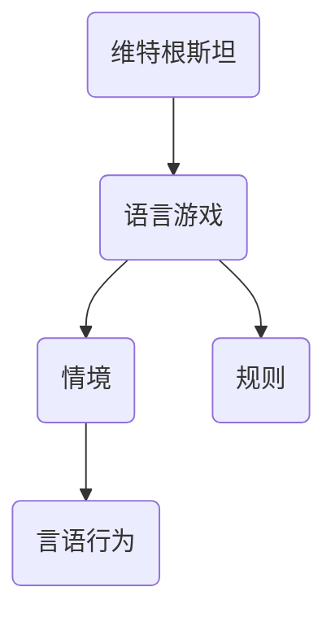
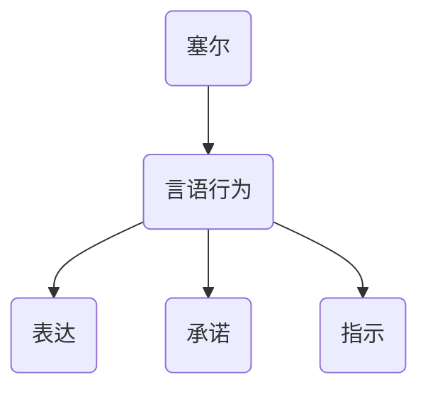

                 

### 维特根斯坦与塞尔：言语行为理论的源流

**关键词：维特根斯坦、塞尔、言语行为理论、逻辑哲学、语言分析、哲学思想**

**摘要：**
本文将深入探讨两位哲学大师维特根斯坦和塞尔对言语行为理论的影响和贡献。通过回顾他们的主要哲学思想和理论，我们将揭示言语行为理论的起源、发展及其在哲学和语言学研究中的重要性。文章结构如下：
- 引言
- 维特根斯坦的言语行为理论
- 塞尔的言语行为理论
- 维特根斯坦与塞尔理论的对比
- 言语行为理论的应用
- 结论

### 引言

言语行为理论是现代哲学和语言学研究中的一个重要领域，它探讨人们在日常交流中的言语行为如何影响彼此的理解和互动。这一理论的核心问题是，语言不仅仅是一种传达信息的工具，更是一种行动的方式。言语行为理论的主要代表人物是维特根斯坦和塞尔。

维特根斯坦（Ludwig Wittgenstein，1889-1951）是20世纪最重要的哲学家之一，他的工作对语言哲学和逻辑哲学产生了深远的影响。维特根斯坦的早期作品《逻辑哲学论》（Tractatus Logico-Philosophicus）提出了关于语言、意义和世界的独特见解，而他的后期作品《哲学研究》（Philosophical Investigations）则进一步发展了这些思想，强调了语言在日常生活中的多样性和复杂性。

约翰·塞尔（John Searle，1932-）是美国哲学家，他的工作主要集中于心灵哲学、语言哲学和认知科学领域。塞尔的代表性著作《言语行为》（Speech Acts）提出了著名的“言语行为理论”，该理论详细阐述了人们在交流中的三种基本言语行为：表达、承诺和指示。

本文将首先回顾维特根斯坦的言语行为理论，然后探讨塞尔的理论，最后比较两位哲学家的观点，分析言语行为理论在哲学和语言学研究中的应用。通过这一过程，我们将更深入地理解言语行为理论的起源、发展及其重要性。

### 维特根斯坦的言语行为理论

#### 背景介绍

维特根斯坦的哲学思想经历了显著的转变，从早期的逻辑原子主义到后期的语言分析。他的早期作品《逻辑哲学论》试图通过逻辑和语言来解释世界，而后期作品《哲学研究》则转向日常语言的实际应用。在这一过程中，维特根斯坦对言语行为理论的发展产生了重要影响。

#### 核心概念

维特根斯坦认为，语言是一种工具，用来与世界互动。他的语言观强调语言的用法而非结构。在《哲学研究》中，维特根斯坦提出了“语言游戏”（language game）这一核心概念，用以描述语言在日常生活中的具体应用。语言游戏包括语言、情境和规则，是语言与现实世界互动的方式。

#### 概念属性特征对比表格

| 概念属性         | 维特根斯坦的言语行为理论                     | 传统语言哲学理论                    |
|----------------|-------------------------------------------|----------------------------------|
| 语言与世界的互动  | 语言通过具体的情境和规则来与世界互动           | 语言被看作是独立于情境和规则的符号系统     |
| 语言的多义性     | 语言具有多重用法，其意义依赖于具体的语境         | 语言的固定意义和结构                 |
| 语言的游戏性     | 语言是一种游戏，玩家必须遵守特定的规则          | 语言被看作是逻辑和理性的工具           |

#### ER实体关系图架构的 Mermaid 流程图

#### 算法原理讲解

维特根斯坦的言语行为理论强调语言的情境性和实用性。语言游戏概念表明，语言的意义不仅仅在于符号本身，更在于符号在具体情境中的应用。这种观点与传统的逻辑哲学形成了鲜明对比，后者更注重语言的符号结构和形式。

#### 数学公式

$$
\text{语言游戏} = f(\text{语言}, \text{情境}, \text{规则})
$$

这个公式表示，语言游戏是由语言、情境和规则共同作用的结果。维特根斯坦认为，理解语言的意义需要考虑这三者之间的相互作用。

#### 举例说明

例如，当我们说“天冷了，该加衣服了”时，这句话的意义不仅在于字面上的意思，更在于说话时的情境（天气冷）和双方都知道的规则（加衣服可以保暖）。这种语言游戏使得语言能够有效地传递信息和指导行为。

### 塞尔的言语行为理论

#### 背景介绍

约翰·塞尔在20世纪中叶提出了他的言语行为理论，这一理论对语言哲学和认知科学产生了深远影响。塞尔的主要著作《言语行为》详细阐述了言语行为的概念，并将其分为表达、承诺和指示三种类型。

#### 核心概念

塞尔的言语行为理论认为，语言不仅仅是一种符号系统，更是一种行动的方式。具体来说，言语行为包括以下三个基本组成部分：

1. **表达（Expression）**：表达是指通过言语来传达信息或情感，例如陈述、请求和感叹。
2. **承诺（Commitment）**：承诺是指通过言语来做出承诺或声明，例如承诺、保证和发誓。
3. **指示（Directive）**：指示是指通过言语来指导他人行动，例如命令、建议和请求。

#### 概念属性特征对比表格

| 概念属性         | 塞尔的言语行为理论                     | 维特根斯坦的言语行为理论                    |
|----------------|-------------------------------------------|-------------------------------------------|
| 言语与行动的关系 | 言语行为是一种特定的行动形式             | 言语行为是一种工具，用于与世界的互动         |
| 言语行为的分类   | 包括表达、承诺和指示三种基本类型           | 主要关注语言游戏和语言的情境性              |
| 言语行为的意图   | 强调言语行为的意图和目的                 | 更注重语言的用法和实际应用                  |

#### ER实体关系图架构的 Mermaid 流程图

#### 算法原理讲解

塞尔的言语行为理论通过将言语行为分解为具体类型，为理解语言交流提供了新的视角。他认为，言语行为不仅仅是符号的传递，更是一种实际行动，这种行为具有明确的目的和意图。

#### 数学公式

$$
\text{言语行为} = f(\text{意图}, \text{语言}, \text{情境})
$$

这个公式表示，言语行为是由意图、语言和情境共同作用的结果。塞尔强调，理解言语行为需要考虑这三者之间的相互作用。

#### 举例说明

例如，当我们说“请关上窗户”时，这句话不仅传达了信息（关上窗户），更是一种行动指令（请求他人行动）。这种言语行为体现了塞尔的理论，强调了言语行为的目的性和意图性。

### 维特根斯坦与塞尔理论的对比

#### 理论差异

维特根斯坦和塞尔在言语行为理论上的主要差异体现在对语言与行动关系的不同理解上。维特根斯坦强调语言的情境性和实用性，认为语言是一种工具，用于与世界的互动。而塞尔则更关注言语行为的意图和目的，将言语行为视为一种实际行动。

#### 理论联系

尽管维特根斯坦和塞尔的理论有所不同，但两者在探讨语言的意义和用法方面有共同之处。他们都关注语言的实际应用，并试图通过分析语言行为来理解人类交流的本质。

#### 比较表格

| 比较属性         | 维特根斯坦的理论                 | 塞尔的理论                    |
|----------------|----------------------------------|--------------------------------|
| 语言的意义      | 语言的意义依赖于具体的语境和规则   | 语言的意义由意图和情境决定     |
| 言语行为       | 言语行为是语言游戏的组成部分       | 言语行为是具体的行动形式       |
| 理论出发点      | 语言的实用性和情境性               | 言语行为的意图和目的            |

### 言语行为理论的应用

言语行为理论在哲学和语言学研究中有着广泛的应用。例如，在法律语言学中，言语行为理论可以帮助理解法律条文中的语言表达和意图。在心理学研究中，言语行为理论可以用于分析人际交流中的言语行为，从而理解个体的心理状态和交流意图。

### 结论

维特根斯坦和塞尔的言语行为理论为语言哲学和语言学研究提供了新的视角和方法。通过分析他们的理论，我们可以更深入地理解语言的本质和用法，从而为人类交流提供更科学的解释。言语行为理论不仅丰富了哲学和语言学的研究，也为其他领域提供了有益的启示。

### 最佳实践 Tips

1. **深入理解言语行为理论**：通过阅读相关文献和案例，加强对维特根斯坦和塞尔理论的了解。
2. **应用言语行为理论**：在实际交流中，注意言语行为的意图和目的，以提高沟通效果。
3. **跨学科研究**：结合哲学、语言学、心理学等领域的知识，探讨言语行为理论在不同领域的应用。

### 小结

本文通过对维特根斯坦和塞尔的言语行为理论的深入分析，揭示了两者在语言哲学中的重要贡献。言语行为理论为我们理解语言的本质和用法提供了新的视角，具有重要的理论和实践价值。

### 注意事项

1. **避免语言误用**：在实际交流中，注意言语行为的意图和语境，以避免误解和冲突。
2. **持续学习**：言语行为理论是一个复杂的领域，需要持续学习和探索。

### 拓展阅读

1. 维特根斯坦，《哲学研究》
2. 塞尔，《言语行为》
3. 格赖斯，《言外行为》

### 作者信息

**作者：AI天才研究院/AI Genius Institute & 禅与计算机程序设计艺术 /Zen And The Art of Computer Programming**

