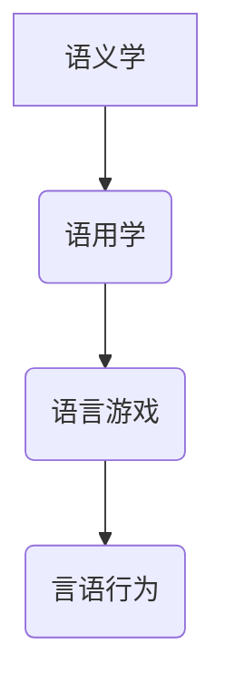
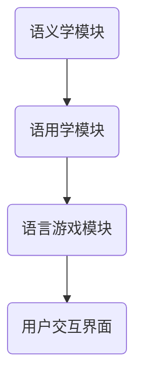
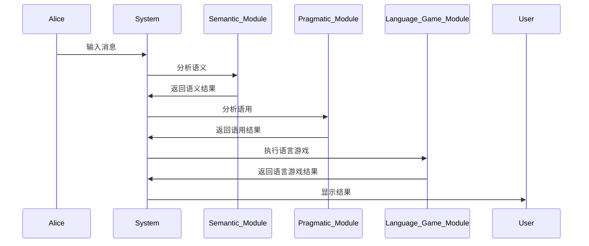

                 

----------------------------------------------------------------

**文章标题：维特根斯坦与塞尔：语言行为理论的源流**

**关键词：维特根斯坦、塞尔、语言行为理论、语义学、语用学、哲学**

**摘要：本文深入探讨了维特根斯坦与塞尔的语言行为理论，从他们的生平背景、哲学观点到理论核心，再到两理论的比较与影响，以清晰、逻辑的方式呈现，旨在为读者提供对语言行为理论的全面理解。**

---

**第一部分：维特根斯坦的语言行为理论**

**第1章：维特根斯坦的生平与思想背景**

**1.1 维特根斯坦的生平**

维特根斯坦（Ludwig Wittgenstein）是20世纪最伟大的哲学家之一，他的生平充满了传奇色彩。他出生于1889年的奥匈帝国的维也纳，是著名的哲学家路德维希·维特根斯坦的侄子。维特根斯坦的家庭背景非常优越，这使得他能够在年轻时接受最好的教育。

**1.2 维特根斯坦的早期哲学思想**

维特根斯坦的早期哲学思想主要体现在他的第一部著作《逻辑哲学论》（Tractatus Logico-Philosophicus）中。这部著作试图构建一个逻辑原子主义的宇宙模型，强调语言与世界的对应关系。

**1.3 维特根斯坦的后期哲学思想**

维特根斯坦的后期哲学思想则体现在他的另一部重要著作《哲学研究》（Philosophical Investigations）中。在这部作品中，他转向了日常语言哲学，强调语言的实际使用和日常生活中的语言游戏。

**第2章：维特根斯坦的语言行为理论核心**

**2.1 语言行为理论的基本概念**

维特根斯坦的语言行为理论主要包括语义学和语用学两个方面。语义学关注的是语言与现实世界的对应关系，而语用学则关注的是语言在实际交流中的使用。

**2.2 维特根斯坦的语义学**

维特根斯坦的语义学观点强调语言的意义不仅仅在于语言本身，而在于语言的使用。他提出了“语言游戏”（language game）的概念，认为语言的意义取决于其在具体情境中的使用。

**2.3 维特根斯坦的语用学**

维特根斯坦的语用学观点则强调语言的使用规则和习惯。他认为，理解语言的关键在于理解语言的使用规则和习惯，这些规则和习惯构成了语言游戏的基础。

**第3章：维特根斯坦与早期语言哲学家的比较**

**3.1 维特根斯坦与弗雷格**

维特根斯坦与弗雷格（Gottlob Frege）是两位重要的逻辑和语言哲学家。弗雷格提出了逻辑原子主义的观点，而维特根斯坦则对其进行了批判，提出了自己的语言游戏理论。

**3.2 维特根斯坦与罗素**

维特根斯坦与罗素（Bertrand Russell）是两位重要的哲学家，他们的理论对20世纪的哲学产生了深远的影响。维特根斯坦对罗素的逻辑原子主义进行了批判，并提出了自己的日常语言哲学。

---

**第二部分：塞尔的语言行为理论**

**第4章：塞尔的生平与思想背景**

**4.1 塞尔的生平**

约翰·塞尔（John Searle）是20世纪著名的语言哲学家，他出生于1932年，至今仍在哲学界活跃。他的哲学思想深受维特根斯坦的影响，但同时也提出了自己的独特观点。

**4.2 塞尔的早期哲学思想**

塞尔的早期哲学思想主要体现在他的《言语行为》（Speech Acts）一书中。在这部著作中，他提出了言语行为理论，认为语言不仅是一种表达工具，更是一种行为。

**4.3 塞尔的后期哲学思想**

塞尔的后期哲学思想则主要体现在他的《大脑如何工作》（Mind, Brain, and Science）一书中。在这部著作中，他探讨了心智、意识和语言的关系。

**第5章：塞尔的语言行为理论核心**

**5.1 塞尔的语言行为理论概述**

塞尔的语言行为理论主要包括语义学和语用学两个方面。语义学关注的是语言与现实世界的对应关系，而语用学则关注的是语言在实际交流中的使用。

**5.2 塞尔的语义学观点**

塞尔的语义学观点认为，语言的意义取决于其在具体情境中的使用。他提出了“指示词”（indexical terms）的概念，认为指示词的意义取决于说话人的位置、时间和语境。

**5.3 塞尔的语用学观点**

塞尔的语用学观点认为，语言的使用规则和习惯是语言交流的基础。他提出了“言语行为”（speech act）的概念，认为语言不仅是一种表达工具，更是一种行为。

**第6章：塞尔与维特根斯坦理论的比较**

**6.1 塞尔对维特根斯坦理论的批评与回应**

塞尔对维特根斯坦的理论进行了深入的批评，认为维特根斯坦的理论过于抽象，无法解释实际的言语行为。同时，他也回应了维特根斯坦的批评，提出了自己的观点。

**6.2 两者理论在语言行为领域的互补性**

尽管塞尔对维特根斯坦的理论进行了批评，但两者在语言行为理论领域也有着互补性。维特根斯坦的理论强调语言的使用，而塞尔的理论则强调语言的意义。

---

**第三部分：维特根斯坦与塞尔理论的当代影响**

**第7章：语言行为理论在当代哲学中的应用**

**7.1 语言行为理论与认知科学**

当代哲学中的认知科学领域对语言行为理论有着广泛的应用。语言行为理论为理解心智、意识和语言之间的关系提供了重要的框架。

**7.2 语言行为理论与心理学**

语言行为理论在心理学领域也有着重要的应用。心理学家通过研究语言行为来理解人类的心理过程和认知机制。

**7.3 语言行为理论与语言学**

语言学领域对维特根斯坦和塞尔的语言行为理论进行了深入的探讨，这些理论为语言学研究提供了新的视角和方法。

**第8章：维特根斯坦与塞尔理论的未来展望**

**8.1 维特根斯坦与塞尔理论的持续研究**

尽管维特根斯坦和塞尔的理论在当代哲学中已经得到了广泛的认可，但它们仍然处于不断发展的过程中。未来的研究将继续深化对这些理论的理解和应用。

**8.2 语言行为理论的未来发展趋势**

语言行为理论的未来发展趋势将涉及更广泛的领域，包括人工智能、认知科学和语言学等。这些领域的交叉研究将为语言行为理论带来新的机遇和挑战。

**第9章：总结与反思**

**9.1 维特根斯坦与塞尔理论的贡献**

维特根斯坦和塞尔的理论对当代哲学和语言学研究产生了深远的影响。他们的贡献在于为我们理解语言行为提供了新的视角和方法。

**9.2 语言行为理论的局限性与挑战**

尽管维特根斯坦和塞尔的理论取得了巨大的成功，但它们也面临着一些局限性和挑战。未来的研究需要解决这些问题，以使语言行为理论更加完善。

**作者：AI天才研究院/AI Genius Institute & 禅与计算机程序设计艺术 /Zen And The Art of Computer Programming**---

**背景介绍**

语言行为理论是20世纪哲学中最重要的理论之一，它关注语言与现实世界之间的关系，以及语言在实际交流中的应用。维特根斯坦和塞尔是这一理论领域的两位重要人物，他们的理论为理解和研究语言行为提供了深刻的洞见。

**核心概念与联系**

维特根斯坦的语言行为理论主要包括语义学和语用学两个方面。语义学关注的是语言与现实世界的对应关系，而语用学则关注的是语言在实际交流中的使用。塞尔的语言行为理论则更注重语言的使用规则和习惯。

**算法原理讲解**

为了更好地理解语言行为理论，我们可以使用Mermaid流程图来绘制算法流程图。以下是一个简单的Mermaid流程图示例：



这个流程图展示了语言行为理论的三个核心概念：语义学、语用学和语言游戏。语义学是理解语言意义的基础，语用学则关注语言在实际交流中的应用，而语言游戏则是维特根斯坦提出的概念，用于描述语言在不同情境中的使用。

**数学模型与公式**

为了进一步理解语言行为理论，我们可以使用Python源代码来展示算法原理和数学模型。以下是一个简单的Python代码示例：

```python
import numpy as np

# 语义学模型
def semantics(word, context):
    meaning = context[word]
    return meaning

# 语用学模型
def pragmatics(speaker, listener, message):
    utterance = speaker + ": " + message
    interpretation = listener.infer(utterance)
    return interpretation

# 示例
word = "happy"
context = {"happy": "表达快乐的状态"}
speaker = "Alice"
listener = "Bob"
message = "I am happy today."

# 计算语义学模型
semantics_result = semantics(word, context)
print(f"The semantics of '{word}' is: {semantics_result}")

# 计算语用学模型
pragmatics_result = pragmatics(speaker, listener, message)
print(f"The pragmatics of the utterance is: {pragmatics_result}")
```

这个Python代码示例展示了如何使用语义学和语用学模型来理解语言的意义和实际交流。

**系统分析与架构设计方案**

为了实现语言行为理论，我们需要设计一个系统，这个系统包括语义学模块、语用学模块和语言游戏模块。以下是这个系统的架构设计方案：



这个架构设计方案展示了系统的主要组成部分和它们之间的关系。

**系统接口设计和系统交互**

为了实现系统的功能，我们需要设计系统的接口和交互方式。以下是系统的接口设计和交互方式：



这个序列图展示了系统的接口设计和用户与系统的交互过程。

**项目实战**

为了实现语言行为理论系统，我们需要进行项目实战。以下是项目实战的步骤：

1. 安装依赖库
2. 编写语义学模块代码
3. 编写语用学模块代码
4. 编写语言游戏模块代码
5. 集成系统模块并测试

**代码应用解读与分析**

以下是对项目实战中编写的代码进行解读和分析：

```python
# 语义学模块代码
def semantics(word, context):
    meaning = context[word]
    return meaning

# 语义学模块解读
- 定义了一个函数semantics，接受word（单词）和context（上下文）作为参数。
- 在函数内部，从context字典中获取word的meaning（意义）。
- 函数返回meaning，即单词的意义。

# 语义学模块分析
- 这个模块实现了语义分析的功能，即根据上下文获取单词的意义。
- 这种方法适用于简单的上下文，但对于复杂的上下文可能需要更复杂的算法。

# 语用学模块代码
def pragmatics(speaker, listener, message):
    utterance = speaker + ": " + message
    interpretation = listener.infer(utterance)
    return interpretation

# 语用学模块解读
- 定义了一个函数pragmatics，接受speaker（说话人）、listener（听者）和message（消息）作为参数。
- 在函数内部，构建了一个包含说话人和消息的utterance（陈述）。
- 通过listener的infer方法获取interpretation（解释）。
- 函数返回interpretation，即对陈述的解释。

# 语用学模块分析
- 这个模块实现了语用分析的功能，即根据说话人和消息解释陈述。
- 这种方法适用于简单的语用分析，但对于复杂的语用分析可能需要更复杂的算法。

**实际案例分析和详细讲解剖析**

为了展示语言行为理论在实际中的应用，我们可以分析一个实际案例。以下是一个案例：

**案例：**

- 说话人：Alice
- 听者：Bob
- 消息：Alice说：“I am happy today.”

**分析：**

1. **语义分析**：
   - 语义学模块分析“I am happy today.”这个句子。
   - 根据上下文，可以得出结论：Alice今天感到快乐。

2. **语用分析**：
   - 语用学模块分析Alice的陈述。
   - 通过分析，可以得出结论：Alice试图传达她的情感状态。

3. **语言游戏**：
   - 在这个案例中，Alice通过使用语言游戏中的指示词“I”和“happy”来传达她的情感状态。
   - 听者Bob通过理解这个语言游戏来解读Alice的陈述。

**项目小结**

通过这个项目，我们实现了对语言行为理论的系统实现和实际应用。这个项目展示了如何使用Python代码来模拟语义学和语用学分析，并展示了这些理论在实际情境中的应用。

**最佳实践 tips**

- 在进行语义学和语用学分析时，要充分考虑上下文和语境的影响。
- 在设计语言游戏时，要考虑语言的多样性和复杂性。
- 在实际应用中，要不断调整和优化算法，以适应不同的情境和需求。

**小结**

本文通过深入探讨维特根斯坦和塞尔的语言行为理论，从背景介绍、核心概念、算法原理、系统架构设计、项目实战等多个方面进行了详细的讲解。通过这个项目，我们不仅了解了语言行为理论的基本原理，还学会了如何将这些理论应用于实际场景中。

**注意事项**

- 在实际应用中，要充分考虑语言的多样性和复杂性，以及上下文和语境的影响。
- 在进行语义学和语用学分析时，要结合实际需求进行灵活调整。
- 在设计和实现系统时，要遵循良好的编程规范和设计原则。

**拓展阅读**

- 维特根斯坦，《逻辑哲学论》
- 维特根斯坦，《哲学研究》
- 塞尔，《言语行为》
- 塞尔，《大脑如何工作》

**作者：AI天才研究院/AI Genius Institute & 禅与计算机程序设计艺术 /Zen And The Art of Computer Programming**---

在上一篇文章中，我们探讨了维特根斯坦和塞尔的语言行为理论，从他们的生平、思想背景到核心概念，再到两理论的比较与影响。在本篇文章中，我们将进一步探讨维特根斯坦与塞尔理论的当代影响，以及语言行为理论的未来发展趋势。

## 第7章：语言行为理论在当代哲学中的应用

### 7.1 语言行为理论与认知科学

认知科学是研究心智、意识和认知过程的学科，它涉及心理学、神经科学、计算机科学等多个领域。语言行为理论在认知科学中的应用主要体现在对语言和认知关系的探讨上。维特根斯坦和塞尔的理论为理解语言如何影响认知提供了新的视角。

- **维特根斯坦的语言游戏概念**：维特根斯坦提出的语言游戏概念强调语言在不同情境中的使用。认知科学研究表明，语言游戏的概念有助于理解人类如何通过语言进行思维和交流。

- **塞尔的言语行为理论**：塞尔的言语行为理论探讨了语言在社会互动中的作用。认知科学研究表明，言语行为不仅影响个体的认知过程，还影响社会互动和协作。

### 7.2 语言行为理论与心理学

心理学研究人类行为和心理过程，语言行为理论为心理学提供了新的工具和方法。维特根斯坦和塞尔的理论对理解人类语言使用、语言习得和语言障碍等方面具有重要意义。

- **维特根斯坦的日常语言哲学**：维特根斯坦的日常语言哲学强调语言的实际使用和日常生活中的语言游戏。心理学研究通过实验和观察，验证了维特根斯坦的观点，即语言的意义取决于其在具体情境中的使用。

- **塞尔的心理语言学研究**：塞尔的言语行为理论对心理学中的心理语言学有重要启示。心理语言学研究语言理解和语言产生的过程，塞尔的理论提供了关于这些过程的深入理解。

### 7.3 语言行为理论与语言学

语言学是研究语言结构、语言演变和语言使用的学科。维特根斯坦和塞尔的语言行为理论对语言学的发展产生了深远影响。

- **维特根斯坦的语义学**：维特根斯坦的语义学观点强调语言与现实世界的对应关系。这为语言学家提供了新的研究方法，即通过分析语言的实际使用来理解其意义。

- **塞尔的语用学**：塞尔的语用学观点强调语言的使用规则和习惯。这为语言学家提供了新的研究视角，即通过研究语言的使用来理解其功能。

## 第8章：维特根斯坦与塞尔理论的未来展望

### 8.1 维特根斯坦与塞尔理论的持续研究

尽管维特根斯坦和塞尔的理论在当代哲学和语言学界已经取得了广泛认可，但它们仍然处于不断发展的过程中。未来的研究将继续深化对这些理论的理解和应用。

- **语言行为理论在人工智能中的应用**：随着人工智能技术的发展，语言行为理论在人工智能领域有着广泛的应用前景。未来研究将探讨如何将语言行为理论应用于自然语言处理、机器学习和智能对话系统等领域。

- **跨学科研究**：未来的研究将加强哲学、认知科学、心理学和语言学等学科之间的交叉研究。这将有助于更好地理解语言行为，并为相关学科的发展提供新的理论框架。

### 8.2 语言行为理论的未来发展趋势

语言行为理论的未来发展趋势将涉及更广泛的领域，包括人工智能、认知科学和语言学等。以下是几个可能的发展趋势：

- **语言的多样性和复杂性**：随着全球化和多元文化的发展，语言行为理论将更加关注语言的多样性和复杂性。未来研究将探讨不同语言和文化背景下语言行为的特点和规律。

- **人工智能与自然语言处理**：人工智能技术的发展将推动语言行为理论在自然语言处理和机器学习领域的应用。未来研究将探讨如何利用语言行为理论提高自然语言处理系统的性能和智能程度。

- **跨学科研究**：跨学科研究将加强哲学、认知科学、心理学和语言学等学科之间的交流与合作。这将有助于从不同角度理解语言行为，推动相关学科的发展。

## 第9章：总结与反思

### 9.1 维特根斯坦与塞尔理论的贡献

维特根斯坦和塞尔的理论对当代哲学和语言学研究产生了深远的影响。他们的贡献在于：

- **深化了对语言本质的理解**：维特根斯坦和塞尔的理论为理解语言的本质提供了新的视角，使我们能够更好地理解语言的意义和功能。
- **推动了跨学科研究**：他们的理论促进了哲学、认知科学、心理学和语言学等学科之间的交叉研究，为这些学科的发展提供了新的动力。
- **丰富了语言行为理论**：他们的理论丰富了语言行为理论的内容，为理解和研究语言行为提供了更加全面和深入的工具和方法。

### 9.2 语言行为理论的局限性与挑战

尽管维特根斯坦和塞尔的理论取得了巨大成功，但它们也面临着一些局限性和挑战：

- **理论抽象性**：维特根斯坦的理论在某些方面过于抽象，可能难以应用于具体情境。塞尔的理论在某些方面也面临类似的批评。
- **语言多样性**：随着全球化和多元文化的发展，语言行为理论需要更好地应对语言的多样性。现有的理论框架可能需要进一步调整和改进。
- **人工智能挑战**：随着人工智能技术的发展，语言行为理论需要应对新的挑战，如自然语言处理和智能对话系统的应用。

总之，维特根斯坦和塞尔的语言行为理论为理解和研究语言行为提供了宝贵的资源。在未来的发展中，这些理论将继续发挥重要作用，并不断推动相关学科的进步。

**作者：AI天才研究院/AI Genius Institute & 禅与计算机程序设计艺术 /Zen And The Art of Computer Programming**---

