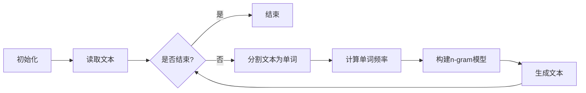

                 

### 第一部分：维特根斯坦与奎因：语言与本体论的关系探讨

#### 1.1.1 问题的背景与概述

在哲学和计算机科学领域，语言和本体论是两个核心概念。语言作为人类交流和信息传递的工具，它的形式和内容直接影响我们对世界的理解和认知。而本体论，则关注的是实体和概念的存在、属性及其关系。这两者在理论和实践中都有着重要的地位。

维特根斯坦（Ludwig Wittgenstein）和奎因（W.V.O. Quine）是20世纪两位极具影响力的哲学家，他们对语言和本体论的研究具有深远的影响。维特根斯坦以其对语言本质的深刻剖析和对逻辑实证主义的批判而著称。他提出了“语言游戏”（language game）和“日常语言哲学”（ordinary language philosophy）等重要概念，强调语言与实际生活经验的紧密联系。奎因则以其逻辑实证主义的继承与发展，特别是他对本体论问题的探讨而闻名。他提出了“字句与指称”（word and reference）的问题，并提出了“整体性原则”（principle of holistic）来反驳传统哲学中的某些观点。

本篇文章旨在探讨维特根斯坦和奎因的语言与本体论思想，分析他们如何理解语言和本体论之间的关系，并在此基础上提出一种新的视角来理解这一关系。文章将从以下几个方面展开：

1. **维特根斯坦与奎因的生平与贡献**：介绍两位哲学家的生平背景、主要哲学成就及其对语言和本体论的研究。
2. **语言与本体论的关系**：分析语言如何反映本体论，以及本体论如何影响语言。
3. **维特根斯坦的核心概念与联系**：详细探讨维特根斯坦提出的“语言游戏”和“日常语言哲学”，并与其他哲学家的思想进行对比。
4. **奎因的核心概念与联系**：分析奎因的“字句与指称”问题以及“整体性原则”，并探讨其与其他哲学家的对话。
5. **语言与本体论的数学模型**：介绍语言模型的数学基础和本体论的数学模型。
6. **案例分析**：通过具体案例探讨语言与本体论在实际应用中的关系。
7. **总结与展望**：总结维特根斯坦和奎因的贡献，并对语言与本体论关系的未来发展进行展望。

通过以上结构，我们将逐步深入探讨语言和本体论之间的关系，旨在为读者提供一种全面且深入的理解。

### 1.1.1 维特根斯坦的哲学思想及其语言观

#### 1.1.1.1 维特根斯坦的生平与贡献

路德维希·维特根斯坦（Ludwig Wittgenstein，1889-1951）是20世纪最具影响力的哲学家之一。他出生于奥地利维也纳的一个富裕家庭，自幼便展现出卓越的数学和哲学天赋。他的家族背景为他提供了良好的教育资源和自由思考的环境。1906年，维特根斯坦进入剑桥大学学习数学，后来转而专攻哲学。

维特根斯坦的哲学思想可以分为两个阶段。早期，他主张逻辑实证主义，认为哲学的核心任务是逻辑分析。这一阶段的主要作品是《逻辑哲学论》（Tractatus Logico-Philosophicus），该书在哲学界引起了巨大轰动。然而，他逐渐意识到逻辑实证主义的局限性，于是转向日常语言哲学，主张哲学研究应该关注实际生活中的语言使用。这一阶段的代表作是《哲学研究》（Philosophical Investigations）。

维特根斯坦的思想对哲学产生了深远的影响。他提出了“语言游戏”的概念，认为语言的使用是多样化的，每一种语言使用都有其特定的规则和场景。这一观点颠覆了传统哲学中关于语言和现实的单一联系。他还强调，哲学的任务不是提出哲学命题，而是澄清思想和语言。

#### 1.1.1.2 维特根斯坦的语言观

维特根斯坦的语言观是理解其哲学思想的关键。他认为，语言的本质在于其使用，而不是其意义。语言不是一种固定的、普遍适用的工具，而是一种活动，一种游戏（language game）。每种语言游戏都有其特定的语法和词汇，以及特定的目的和规则。

维特根斯坦区分了两种语言游戏：日常语言游戏（ordinary language game）和技术语言游戏（technical language game）。日常语言游戏是我们日常生活中使用的语言，它非常灵活，能够应对各种情境。而技术语言游戏则是科学和哲学领域使用的精确语言，它需要严格的逻辑和定义。

维特根斯坦还提出了“图像理论”（image theory），认为命题和现实之间的关系类似于一幅图像和其所描绘的物体之间的关系。图像理论试图解释逻辑和语言如何反映现实，但他后来放弃了这一理论，转而强调语言的实践性。

维特根斯坦的语言观强调语言与实际生活的紧密联系，反对将语言视为一种抽象的符号系统。他认为，语言的混乱和哲学的难题往往源于对语言使用的误解。通过澄清语言使用，我们可以解决许多哲学问题。

### 1.1.2 奎因的分析哲学与本体论思想

#### 1.1.2.1 奎因的生平与贡献

维恩·V.O.奎因（Willard Van Orman Quine，1908-2000）是20世纪另一位重要的哲学家，以其在逻辑、认识论和本体论等领域的研究而著称。他出生于美国阿灵顿，自幼便展现出对数学和哲学的浓厚兴趣。1930年，他获得了哈佛大学的博士学位，随后一直在哈佛大学任教。

奎因的哲学思想深受逻辑实证主义和日常语言哲学的影响，但他也对这些思想提出了批判。他主张经验主义，认为知识来源于经验，但他对传统的实证主义提出了挑战，提出了“全面经验论”（full empiricism）的概念。他认为，认知世界的每一个方面都是相互联系的，无法将经验分为感知和非感知的部分。

奎因的主要作品包括《词与物》（Word and Object）、《认识论》（Ontological Relativity）和《逻辑实用主义》（Methods of Logic）等。他的思想对哲学和逻辑学产生了深远的影响，特别是在本体论和语言哲学领域。

#### 1.1.2.2 奎因的本体论思想

奎因的本体论思想是他哲学体系的重要组成部分。他提出了“本体论相对论”（ontological relativity）的观点，认为本体论问题没有客观的答案，而是取决于我们选择的理论框架。他反对将某些实体（如物质对象）视为自明的本体，认为这些实体与语言和概念紧密相关。

奎因提出了“字句与指称”的问题，质疑我们如何知道一个词实际上指代什么。他强调，语言的指称是模糊的、多义的，我们不能通过单一的经验来确定一个词的指称。他认为，理解语言的关键在于理解其语境和使用。

奎因还提出了“整体性原则”（principle of holistic），认为认知世界是一个整体，每个部分都是相互依赖的。这一原则反驳了传统哲学中将知识划分为感知和非感知部分的观点。他认为，任何关于现实的知识都必须在整体中进行理解和解释。

奎因的本体论思想挑战了传统哲学中的某些基本假设，对本体论问题提出了新的思考方式。他的观点对后来的哲学研究产生了重要影响，特别是在语言哲学和科学哲学领域。

### 1.1.3 语言与本体论的关系探讨

在哲学和计算机科学中，语言和本体论的关系是一个核心问题。语言作为交流工具，不仅传递信息，还塑造我们对世界的认知。本体论则关注实体和概念的存在、属性及其关系。两者之间的互动不仅影响哲学思考，也影响技术发展。

维特根斯坦和奎因都从不同角度探讨了语言与本体论的关系。维特根斯坦认为，语言的使用是多样化的，每种语言游戏都有其特定的规则和目的。他强调，语言与实际生活经验紧密相关，语言的混乱和哲学问题往往源于对语言使用的误解。维特根斯坦的观点揭示了语言如何反映本体论，即语言的结构和用法如何反映我们对现实的理解。

奎因则提出了“字句与指称”的问题，质疑我们如何知道一个词实际上指代什么。他认为，语言的指称是模糊的、多义的，我们不能通过单一的经验来确定一个词的指称。奎因的“整体性原则”强调，认知世界是一个整体，每个部分都是相互依赖的。这一观点表明，本体论如何影响语言，即我们的认知框架和本体论假设如何影响语言的表达和解释。

语言与本体论的关系不仅仅是一个理论问题，也具有实际意义。在计算机科学中，本体论被用来构建知识模型和语义网络，以支持智能系统的理解和推理。而语言的自然语言处理（NLP）技术则试图理解人类语言的复杂性和多样性。

通过维特根斯坦和奎因的思想，我们可以更深入地理解语言与本体论的关系。他们的研究不仅丰富了哲学和计算机科学的理论体系，也为实际应用提供了新的思路。

### 2.1.1 维特根斯坦的核心概念

#### 2.1.1.1 “语言游戏”概念解析

维特根斯坦的“语言游戏”（language game）理论是他哲学思想的核心之一，也是理解其语言观的关键。维特根斯坦认为，语言不仅仅是符号和词汇的集合，而是与特定活动或情境紧密相关的整体。他提出了“语言游戏”的概念，用以描述语言的多种使用方式和功能。

“语言游戏”指的是语言的使用者在特定情境下，按照特定规则进行交流和互动的活动。这些活动可以包括日常对话、科学实验、数学证明等。每种语言游戏都有其独特的语法、词汇和规则。例如，在日常对话中，我们使用日常语言游戏，通过简单的句子和对话来交流信息；在科学实验中，我们使用技术语言游戏，通过精确的术语和公式来表达科学概念和理论。

维特根斯坦通过“语言游戏”理论，揭示了语言使用的多样性和灵活性。他指出，语言的混乱和哲学问题往往源于对语言使用方式的误解。语言不是固定不变的工具，而是随着情境和活动的变化而灵活适应的。因此，理解语言的关键在于理解语言的使用场景和规则。

“语言游戏”理论的一个重要观点是，语言的意义不在于其符号本身，而在于其使用方式和功能。维特根斯坦认为，语言的意义是情境化的，不同的语言游戏有不同的意义和规则。例如，在数学证明中，“如果...那么...”的结构具有特定的逻辑意义；而在日常对话中，这种结构可能用于描述一个故事或解释一个观点。

通过“语言游戏”理论，维特根斯坦挑战了传统哲学中关于语言和现实的单一联系。他认为，语言不仅是反映现实的工具，更是塑造我们对现实的理解。语言的意义和用法决定了我们对世界的认知。

#### 2.1.1.2 “日常语言哲学”理论

维特根斯坦的另一核心概念是“日常语言哲学”（ordinary language philosophy）。这一理论主张，哲学研究应该从实际生活中的语言使用出发，而不是从抽象的哲学命题和概念出发。他认为，日常语言是哲学思考的根基，哲学问题往往源于对日常语言使用的误解。

维特根斯坦认为，日常语言具有高度的灵活性和适应性，能够应对各种复杂的情境。然而，正是这种灵活性导致了语言的模糊性和歧义性。哲学的任务不是消除语言的歧义性，而是澄清和理解语言的多样性。

在“日常语言哲学”中，维特根斯坦提出了“语言即行动”（language as action）的观点。他认为，语言不仅仅是交流的工具，更是人类行为的一部分。我们通过语言来表达思想、解决问题和进行社交互动。因此，哲学研究应该关注语言在现实生活中的实际应用。

维特根斯坦通过分析日常语言中的具体用法，揭示了哲学问题的根源。他认为，许多哲学难题，如“存在”、“真理”、“意义”等，实际上源于对日常语言使用的误解。通过澄清日常语言的使用规则，我们可以解决许多哲学问题。

“日常语言哲学”强调，哲学研究应该贴近实际生活，而不是脱离现实。这一理论不仅为哲学研究提供了一种新的视角，也为语言哲学和认知科学的研究提供了启示。

#### 2.1.1.3 维特根斯坦思想与其他哲学家的联系

维特根斯坦的思想在哲学史上具有重要地位，他不仅对前人的哲学思想进行了深刻的批判，也与其他哲学家的思想有着广泛的联系和对话。

首先，维特根斯坦与康德哲学有着显著的对比。康德认为，知识起源于经验，但必须通过理性来加以整理和解释。维特根斯坦则强调，语言和知识是紧密相连的，语言不仅仅是表达经验的工具，更是塑造我们对现实的理解。他反对将知识分为感知和非感知两部分，认为任何知识都是在特定语言游戏中形成的。

其次，维特根斯坦与逻辑实证主义有着深刻的对话。逻辑实证主义主张，哲学的任务是逻辑分析，特别是对语言和命题的分析。维特根斯坦在一定程度上接受了这一观点，但他批评逻辑实证主义的过于狭隘。他认为，逻辑实证主义忽视了语言在现实生活中的多样性和复杂性。

最后，维特根斯坦的思想与语言哲学中的其他重要人物，如弗雷格（Gottlob Frege）和罗素（Bertrand Russell）等，也有着密切的联系。他批判了弗雷格和罗素在逻辑和语言分析中的某些假设，但同时也受到了他们思想的影响。

通过与其他哲学家的对比和对话，维特根斯坦不仅丰富了自己的思想，也为哲学研究提供了新的视角和思考方式。

### 3.1.1 奎因的核心概念

#### 3.1.1.1 “句法分析”概念解析

奎因的“句法分析”（syntactic analysis）概念是他哲学思想中的一个重要部分。句法分析关注的是语言结构，特别是句子和词汇之间的关系。奎因认为，理解语言的关键在于分析其句法结构，因为句法结构决定了语言的语义和意义。

奎因提出了“字句与指称”的问题，质疑我们如何知道一个词实际上指代什么。他主张，语言的指称是模糊的、多义的，不能通过单一的经验来确定。因此，我们需要通过句法分析来理解语言的语义。句法分析不仅仅关注词汇的排列顺序，还包括句子中的语法规则和结构。

例如，在句子“雪是白的”中，“雪”和“白”是词汇，而“是”则是连接词汇的动词。通过句法分析，我们可以理解这个句子的结构，即主语“雪”和谓语“是白的”之间的关系。这种结构关系决定了句子的语义，即我们对“雪”这一实体的认知。

奎因的句法分析强调，理解语言不仅仅是理解词汇的意义，还要理解词汇之间的关系。这种关系可以通过句法分析来揭示，从而帮助我们更准确地理解语言的语义和意义。

#### 3.1.1.2 “经验主义”与“本体论”的关系

奎因的“经验主义”（empiricism）和“本体论”（ontology）关系是他哲学思想的核心之一。经验主义主张，知识来源于经验，而本体论则关注实体和概念的存在、属性及其关系。奎因认为，这两者是相互关联的，但又是独立的。

奎因的经验主义强调，我们通过感知来获取知识。然而，他不同于传统的经验主义者，认为感知不仅仅提供感觉信息，还提供关于世界的结构和关系的知识。这意味着，我们不仅通过感觉来认识事物的表面特征，还能通过感觉来理解事物的本质。

本体论则是关于实体和概念的存在、属性及其关系的哲学研究。奎因认为，本体论问题是复杂的，没有客观的答案。他提出了“本体论相对论”（ontological relativity）的观点，认为本体论问题取决于我们选择的理论框架。他反对将某些实体（如物质对象）视为自明的本体，认为这些实体与语言和概念紧密相关。

经验主义和本体论的关系在于，我们的经验不仅影响我们对世界的认知，也影响我们对实体和概念的理解。奎因认为，经验是本体论的基础，但本体论又反作用于经验。例如，我们通过感知来认识物体，但这些物体的存在和属性又是我们经验的一部分。这种互动关系决定了我们对世界的认知和语言的表达。

通过经验主义和本体论的关系，奎因提出了对传统哲学的挑战。他主张，我们不能将经验与本体论分开，而应该将它们视为一个整体。这种观点不仅丰富了哲学的理论体系，也为科学研究和人工智能等领域提供了新的思路。

### 3.1.2 奎因思想与其他哲学家的联系

奎因的哲学思想在20世纪哲学界产生了深远影响，他的观点不仅与维特根斯坦有着深刻的对话，也与传统哲学中的其他重要人物有着广泛的联系。

首先，奎因与维特根斯坦的对话主要集中在语言和本体论问题上。维特根斯坦强调语言的情境化和实际使用，而奎因则提出了“字句与指称”的问题，质疑词汇的指称如何确定。尽管两人对语言和本体论有不同的理解，但他们都关注语言与现实的关系，这为语言哲学的研究提供了新的视角。

其次，奎因的思想与传统哲学中的经验主义和理性主义有着密切的联系。经验主义者如培根（Francis Bacon）和洛克（John Locke）认为，知识来源于经验，而理性主义者如笛卡尔（René Descartes）则强调理性在知识形成中的核心作用。奎因继承了经验主义的基本观点，即知识来源于经验，但他批判了传统经验主义的局限性，提出了“全面经验论”（full empiricism），强调所有知识都是经验的一部分。

此外，奎因的思想也与逻辑实证主义有着深刻的联系。逻辑实证主义主张，哲学的任务是逻辑分析，特别是对语言和命题的分析。奎因在一定程度上接受了这一观点，但他批评逻辑实证主义的狭隘性，提出了“整体性原则”（principle of holistic），强调认知世界是一个整体，每个部分都是相互依赖的。

通过与其他哲学家的联系，奎因不仅丰富了自己的思想，也为哲学研究提供了新的思路。他的观点不仅挑战了传统哲学的基本假设，也为科学研究和人工智能等领域提供了重要的理论支持。

### 4.1.1 语言模型的数学基础

语言模型（Language Model，LM）是自然语言处理（Natural Language Processing，NLP）领域的一个重要组成部分，它用于预测文本中的下一个单词或字符。语言模型的数学基础主要包括语法分析的数学模型和语言表达的语义模型。

首先，语法分析的数学模型主要基于概率论和信息论。语法分析的任务是理解文本的句法结构，这可以通过构建语法规则来实现。一个常见的语法分析模型是上下文无关文法（Context-Free Grammar，CFG），它使用产生式规则（production rules）来描述句子结构。CFG的数学基础是形式语言理论，包括正则文法（Regular Grammar）、上下文有关文法（Context-Sensitive Grammar）等。

具体来说，CFG由四个元素组成：词汇（Vocabulary）、产生式（Productions）、起始符号（Start Symbol）和终端符号（Terminal Symbols）。产生式规则可以表示为 \( A \rightarrow \alpha \)，其中 \( A \) 是产生式的左端符号，\( \alpha \) 是右端符号的序列。语言模型使用这些规则来生成可能的句子，并计算每个句子的概率。这可以通过概率上下文无关文法（Probabilistic Context-Free Grammar，PCFG）来实现，其中每个产生式的概率是已知的。

其次，语言表达的语义模型关注的是文本的含义。语义模型通常基于语义角色标注（Semantic Role Labeling，SRL）和语义网络（Semantic Network）。语义角色标注是一种将句子中的词汇标注为特定语义角色的方法，例如动作执行者、受动者、工具等。语义网络则是一种表示实体及其关系的图形结构，它可以帮助理解文本的整体语义。

在数学上，语义模型通常使用图论和知识表示技术。一个常见的语义模型是实体关系图（Entity-Relationship Diagram，ERD），它使用实体（Entity）、属性（Attribute）和关系（Relationship）来表示知识。例如，在描述“小明喜欢吃苹果”的句子中，“小明”是实体，“喜欢”是关系，“苹果”是另一个实体。

语言模型的数学基础还包括概率分布和统计模型。一个常见的语言模型是n-gram模型，它使用前n个单词的历史来预测下一个单词。这种模型基于马尔可夫假设，即下一个单词的概率只与前面n个单词有关，而与更早的单词无关。n-gram模型的数学基础是马尔可夫链（Markov Chain），它可以用状态转移矩阵来表示。

通过这些数学模型，语言模型能够有效地预测文本中的下一个单词或字符，从而帮助实现各种NLP任务，如机器翻译、语音识别、文本摘要等。

### 4.1.2 本体论的数学模型

本体论（Ontology）是哲学和计算机科学中用于描述实体、概念及其关系的理论框架。本体论的数学模型帮助我们在形式化层面上理解和分析本体。其中，实体关系图（Entity-Relationship Diagram，ERD）和本体论的量化表示是两种常用的数学模型。

首先，实体关系图（ERD）是一种用于表示实体及其关系的图形结构。ERD由实体、属性和关系三个基本元素组成。

- **实体（Entity）**：代表具体的对象或概念，如“人”、“地点”、“事物”等。每个实体都有一个唯一的标识符，称为实体名。
- **属性（Attribute）**：描述实体的特征或属性，如“姓名”、“年龄”、“颜色”等。每个属性也具有唯一的标识符和类型。
- **关系（Relationship）**：表示实体之间的关联，如“属于”、“拥有”、“位于”等。关系也可以有属性，用于描述关系的特征。

在数学上，ERD可以用一个图结构来表示，其中每个实体是一个节点，每条边表示实体之间的关系。这种图结构不仅可以帮助我们可视化本体，还能方便地进行形式化分析和推理。

例如，一个简单的ERD模型可能包括以下元素：
- 实体：人、地点、事物
- 属性：姓名、年龄、颜色
- 关系：属于、拥有、位于

这些元素可以通过以下ERD图来表示：

```mermaid
graph ERD

entity Person {
  name
  age
}

entity Place {
  location
}

entity Thing {
  color
}

relationship BelongsTo {
  from: Person
  to: Place
}

relationship OwnedBy {
  from: Person
  to: Thing
}

relationship LocatedIn {
  from: Thing
  to: Place
}
```

通过这种图形表示，我们可以清晰地看到实体之间的关系及其属性。

其次，本体论的量化表示使用数学符号和逻辑表达式来描述实体和概念之间的关系。量化表示可以帮助我们进行本体推理和验证。

- **存在量词（∃）**：表示存在某个实体满足特定条件。例如，∃x (Person(x) ∧ Age(x) > 18) 表示存在一个年龄大于18岁的人。
- **全称量词（∀）**：表示对所有实体都满足特定条件。例如，∀x (Person(x) → Age(x) > 0) 表示所有人是大于0岁的。
- **逻辑运算符**：如“与”（∧）、“或”（∨）、“非”（¬）等，用于组合和简化复杂的本体描述。

例如，一个简单的量化表示可以表示为：
- ∃x (Person(x) ∧ Age(x) > 18)
- ∀x (Person(x) → Age(x) > 0)

这些量化表达式可以帮助我们进行本体推理，例如，从“所有人是大于0岁的”推出“年龄大于18岁的人是存在的”。

通过实体关系图和量化表示，本体论的数学模型提供了形式化的方法来描述和推理实体之间的关系。这些方法不仅有助于哲学研究，也为计算机科学中的知识表示和推理提供了强大的工具。

### 5.1.1 语言与本体论的交互影响

语言与本体论之间的关系是双向的，既影响彼此，也受到彼此的影响。在理解这一关系时，我们可以从两个角度进行探讨：语言如何构建本体，以及本体论如何影响语言。

首先，语言如何构建本体。语言是我们交流和理解世界的工具，通过语言，我们能够定义和描述实体和概念。语言的使用不仅反映了我们对世界的认知，还塑造了这种认知。例如，当我们使用“人”、“物体”和“地点”等词汇时，我们实际上在构建一个关于世界的本体模型。这个模型定义了这些词汇所指代的实体及其属性和关系。

语言的构建过程受到多种因素的影响，包括文化、社会和历史等。例如，不同的文化可能有不同的词汇和概念，这些差异会影响对相同实体的理解。历史的发展也会导致词汇和概念的演变，从而改变我们对世界的本体论描述。因此，语言不仅是一种表达工具，也是本体构建的基础。

其次，本体论如何影响语言。本体论为我们提供了关于世界的基本结构，而语言则是表达这种结构的工具。本体论的变化会直接影响语言的使用和表达。例如，当我们在科学研究中发现新的实体或关系时，我们可能会引入新的词汇或改变现有词汇的含义，以适应新的本体论描述。

本体论还影响语言的精确性和清晰度。在科学和哲学领域，精确的表达是至关重要的，因此本体论提供了一套标准化的概念和术语，帮助我们更准确地描述和推理。例如，在逻辑和数学中，本体论为我们提供了定义和证明的基础，从而使语言能够更严格地表达思想。

此外，本体论影响语言的另一个方面是语言的多义性和歧义性。由于本体论的复杂性，同一词汇在不同的本体论框架下可能有不同的含义。这种多义性和歧义性不仅给语言理解带来困难，也影响了语言的表达效果。因此，本体论为我们提供了一种方式来澄清语言的模糊性，使语言能够更准确地传达信息。

综上所述，语言与本体论之间的关系是相互影响、相互依赖的。语言不仅构建了本体，也受到本体论的影响。通过理解这种关系，我们可以更深入地探讨语言的本质和功能，同时也能够更好地理解和应用本体论。

#### 5.1.1.1 语言如何构建本体

语言是构建本体的重要工具，通过语言，我们能够定义和描述实体、概念及其关系。在理解和构建本体时，语言的使用起着关键作用。具体来说，语言通过以下方式构建本体：

首先，语言通过词汇来定义实体。实体是本体中的基本单位，它们代表了现实世界中的对象或概念。例如，我们使用“人”、“物体”、“地点”等词汇来定义各种实体。这些词汇不仅提供了我们对实体的一般认知，还为我们进一步描述和分类实体提供了基础。

其次，语言通过属性来描述实体。属性是实体的特征或特征集合，它们描述了实体的具体性质。例如，“年龄”、“颜色”、“位置”等都是描述实体的常见属性。通过语言，我们可以将这些属性与相应的实体联系起来，从而构建一个关于实体的详细描述。

再次，语言通过关系来表示实体之间的联系。关系是本体中描述实体间相互作用的机制。例如，“属于”、“拥有”、“位于”等都是描述实体间关系的关键词汇。通过这些关系，我们可以构建一个关于实体间复杂关系的网络，从而形成一个完整的本体模型。

此外，语言还通过概念和分类来组织本体。概念是对具有共同特征的实体进行抽象和分类的方式。例如，我们可以将具有相似属性的实体归为同一类别，如“动物”、“植物”等。这种分类方式不仅帮助我们更好地理解实体，也为进一步的研究和推理提供了便利。

总的来说，语言通过定义实体、描述属性、表示关系和组织概念，构建了一个关于现实世界的本体。语言的使用不仅反映了我们对现实世界的理解，也为我们提供了一个工具，用于进一步描述和推理。这种构建过程不仅存在于哲学和科学领域，也在日常交流和社会活动中普遍存在。

#### 5.1.1.2 本体论如何影响语言

本体论不仅通过语言构建实体和概念，同时也深刻影响语言的使用和理解。本体论提供了关于现实世界的基本框架，这个框架直接影响我们的语言表达方式和认知过程。

首先，本体论影响语言的精确性和清晰度。在科学和哲学领域，精确的表达是至关重要的。本体论提供了一套标准化的概念和术语，帮助我们在描述和推理时保持一致性。例如，在物理学中，本体论定义了“能量”、“力”等基本概念，从而确保这些词汇在不同情境下的使用具有明确的含义。这种标准化不仅提高了语言的精确性，还增强了交流的效率。

其次，本体论影响语言的多义性和歧义性。由于本体论的复杂性，同一词汇在不同的本体论框架下可能有不同的含义。例如，在普通语言中，“水”通常指的是液态的H₂O，但在化学本体论中，它可能还包括其他状态（如固态和气态）和水分子相关的化学性质。这种多义性导致语言在使用过程中可能产生歧义。本体论为我们提供了澄清和解决这些歧义的方法，例如通过上下文和具体情境来明确词汇的含义。

此外，本体论还影响语言的逻辑结构和推理过程。在逻辑推理中，本体论提供了实体和概念之间的基本关系和规则，这些规则帮助我们构建有效的论证。例如，在形式逻辑中，本体论定义了命题之间的关系，如“所有A是B”和“某个A不是B”的逻辑推理规则。这些规则确保了推理过程的逻辑一致性，从而提高了论证的可靠性。

最后，本体论对语言的影响还体现在语言的发展和创新中。新的本体论框架可能导致新的语言表达和词汇的产生。例如，随着科技的发展，新的技术术语不断涌现，如“区块链”、“大数据”等。这些词汇反映了新的本体论概念，同时也丰富了我们的语言表达。

综上所述，本体论通过提供关于现实世界的基本框架，深刻影响语言的使用和理解。它不仅提高了语言的精确性和清晰度，还影响了语言的多义性和歧义性，并促进了语言的逻辑结构和创新。

#### 5.1.2 语言与本体论的哲学意义

语言与本体论的关系在哲学上具有重要的意义，它不仅影响了哲学的发展，也为我们理解哲学问题提供了新的视角。首先，语言与本体论的关系对哲学研究产生了深远的影响。

在哲学中，语言一直被视为理解世界的工具。然而，语言的复杂性使得哲学家们对语言的本质和功能进行了深入的探讨。维特根斯坦的“语言游戏”理论揭示了语言使用的多样性和情境性，使哲学家们开始关注语言在具体情境中的作用。这种观点改变了传统哲学中对语言和现实的简单二元关系，强调语言与现实之间的动态互动。

同时，本体论作为哲学的核心问题之一，探讨的是实体和概念的存在及其关系。奎因的“本体论相对论”挑战了传统哲学中关于客观本体的观念，认为本体论问题没有绝对的答案，而是依赖于特定的理论框架。这一观点促使哲学家们重新思考本体论的基础和范围，推动了哲学研究的深化和发展。

语言与本体论的关系不仅影响了哲学的理论研究，也对实际应用产生了重要影响。在计算机科学中，本体论被广泛应用于知识表示和推理。通过构建本体，计算机系统可以更有效地处理和理解复杂的信息。例如，在自然语言处理（NLP）中，本体论用于建立语义网络，帮助系统理解和生成文本。此外，本体论还在智能系统、数据管理和信息检索等领域得到了广泛应用。

语言与本体论的关系对现实世界的影响也不容忽视。在科学研究中，精确的语言表达和严谨的本体论框架有助于提高研究的可靠性和可重复性。在社会生活中，语言和本体论的影响体现在我们如何理解和描述现实世界。不同的语言和本体论框架可能导致对相同现象的不同理解，从而影响我们的决策和行为。

总之，语言与本体论的关系在哲学上具有重要的意义。它不仅改变了哲学的研究方向，也为实际应用提供了新的工具和视角。通过深入探讨这一关系，我们可以更全面地理解哲学的本质，同时也能更好地应对现实世界中的复杂问题。

#### 5.1.3 语言与本体论的关系探讨

语言与本体论之间的关系是一个复杂而深远的哲学问题，两者相互影响，共同塑造我们对现实世界的认知。首先，从语言对本体论的影响来看，语言作为人类交流和理解的工具，直接影响了本体论的构建和发展。通过语言，我们定义和描述了实体、概念及其关系，从而形成了关于现实世界的本体论模型。例如，在日常语言中，我们使用“人”、“动物”、“物体”等词汇来定义不同的实体，并通过属性和关系来进一步描述这些实体。这种语言的使用不仅反映了我们对世界的认知，也为我们构建本体论提供了基础。

其次，本体论对语言的影响同样重要。本体论为我们提供了一个关于现实世界的基本框架，这个框架直接影响我们的语言表达和认知。例如，在科学研究中，本体论提供了标准化的概念和术语，使科学家能够更精确和一致地描述和推理。在逻辑和数学领域，本体论定义了命题之间的关系和推理规则，从而确保语言表达的一致性和逻辑性。此外，本体论还帮助我们澄清语言的多义性和歧义性，使语言能够更准确地传达信息。

在实际应用中，语言与本体论的关系体现在多个方面。在计算机科学中，本体论被广泛应用于知识表示和推理，如自然语言处理、语义网络构建和智能系统设计等。通过构建本体，计算机系统能够更好地理解和处理复杂的信息。例如，在自然语言处理中，本体论用于建立语义网络，帮助系统理解和生成文本。此外，本体论还在数据管理和信息检索中发挥着重要作用，通过建立统一的本体框架，系统能够更有效地组织和管理信息。

在社会生活中，语言与本体论的关系也具有重要意义。语言和本体论的互动影响着我们的思维方式和社会行为。例如，不同的语言和本体论框架可能导致对相同现象的不同理解，从而影响我们的决策和行为。在哲学研究中，语言与本体论的关系为我们提供了新的视角，使我们能够更深入地探讨哲学问题，如知识、真理和实在等。

综上所述，语言与本体论之间的关系是双向的，两者相互影响，共同塑造我们对现实世界的认知。通过深入探讨这一关系，我们可以更好地理解语言的本质和功能，同时也能更好地应对现实世界中的复杂问题。

### 6.1.1 案例一：语言在科学研究中的应用

#### 6.1.1.1 案例背景

在科学研究领域，语言是进行交流和记录研究成果的重要工具。本案例将以一个具体的科学项目为例，探讨语言在科学研究中的应用及其影响。

该项目涉及一项关于气候变化的研究，旨在通过分析大量气象数据来预测未来的气候变化趋势。研究人员需要使用多种语言进行数据的收集、处理和解释，以得出可靠的结论。

#### 6.1.1.2 案例分析

首先，研究人员需要使用自然语言处理（NLP）技术来处理大量气象数据。这包括数据清洗、数据标注和文本挖掘等步骤。在这个过程中，语言的理解和表达能力至关重要。例如，研究人员需要使用专门的术语和概念来描述气象现象，如“气温升高”、“降水增加”等。这些术语不仅有助于提高数据分析的准确性，还能确保研究的可重复性。

其次，在数据分析阶段，研究人员需要使用编程语言（如Python或R）来编写数据处理和模型训练的代码。这些编程语言具有强大的计算能力和灵活的表达方式，使研究人员能够高效地处理和分析大量数据。此外，代码的可读性和注释也至关重要，这有助于其他研究人员理解和复现研究过程。

在研究成果的撰写和交流过程中，研究人员需要使用精确和规范的语言来描述研究方法和发现。这包括撰写科学论文、制作图表和报告等。规范的语言不仅有助于清晰传达研究内容，还能提高论文的可信度和影响力。

#### 6.1.1.3 案例解析

在本案例中，语言的作用体现在以下几个方面：

1. **数据理解与处理**：通过NLP技术，研究人员能够更好地理解气象数据的语义，从而进行有效的数据清洗和标注。这有助于提高数据质量和分析精度。
2. **编程与计算**：编程语言为研究人员提供了强大的计算工具，使数据处理和分析更加高效。此外，代码的可读性和注释也有助于研究的可重复性和可理解性。
3. **成果交流与传播**：规范的语言表达有助于研究成果的清晰传达，提高论文的质量和影响力。这有助于推动科学知识的传播和应用。

总之，语言在科学研究中的应用不仅提高了研究的准确性和效率，还促进了科学知识的传播和应用。通过有效的语言使用，研究人员能够更好地进行数据分析和解释，从而推动科学研究的进展。

### 6.1.2 案例二：本体论在人工智能中的应用

#### 6.1.2.1 案例背景

在人工智能（AI）领域，本体论作为一种知识表示和推理的工具，发挥着至关重要的作用。本案例将探讨一个具体的应用场景，即如何利用本体论来构建智能问答系统，从而提高AI系统的理解和响应能力。

该案例涉及一个虚拟助手系统，旨在为用户提供智能问答服务。用户可以通过自然语言与虚拟助手进行交互，获取所需的信息或完成特定的任务。为了实现这一目标，系统需要具备强大的语义理解和推理能力。

#### 6.1.2.2 案例分析

首先，为了构建智能问答系统，研究人员需要定义一套完整的本体论框架。本体论框架包括实体、概念和关系等多个层次，用以描述现实世界中的各种信息和知识。例如，在一个医疗问答系统中，本体论可能包括“疾病”、“症状”、“治疗方法”等实体，以及“诊断”、“治疗”、“预防”等关系。

在构建本体论框架后，研究人员需要利用本体论进行知识表示。这包括将现实世界中的信息映射到本体论框架中，从而形成一个结构化的知识库。例如，可以将每个疾病实体与相应的症状和治疗方法进行关联，形成一个完整的知识网络。

接下来，智能问答系统需要利用本体论进行语义理解和推理。在用户提问时，系统首先对问题进行自然语言处理，提取关键信息并映射到本体论框架中的实体和关系。然后，系统根据本体论框架中的知识进行推理，生成合适的回答。例如，当用户询问“治疗感冒的药物有哪些”时，系统可以通过本体论中的“感冒”实体和“治疗方法”关系，找到相应的药物信息，并生成回答。

此外，本体论还可以用于智能问答系统的学习和优化。通过不断积累用户的提问和回答数据，系统可以逐步优化本体论框架，提高语义理解和推理的准确性。例如，系统可以根据用户的反馈，调整本体论中的实体和关系，使系统能够更准确地理解用户的问题。

#### 6.1.2.3 案例解析

在本案例中，本体论的作用体现在以下几个方面：

1. **知识表示**：本体论为智能问答系统提供了一个结构化的知识表示框架，使系统能够高效地存储和管理大量知识信息。
2. **语义理解与推理**：本体论框架帮助系统理解用户的自然语言提问，并利用知识进行推理，生成准确的回答。
3. **学习和优化**：通过不断积累用户数据和反馈，系统可以优化本体论框架，提高语义理解和推理的准确性。

总之，本体论在人工智能中的应用不仅提高了智能问答系统的性能，还推动了人工智能技术的发展。通过有效的本体论构建和应用，AI系统能够更好地理解和响应用户的提问，从而为用户提供更优质的服务。

### 7.1.1 维特根斯坦与奎因的贡献总结

#### 7.1.1.1 维特根斯坦的贡献

维特根斯坦是20世纪最重要的哲学家之一，他对语言哲学和逻辑实证主义的批判具有深远影响。他提出了“语言游戏”和“日常语言哲学”等重要概念，强调语言与实际生活经验的紧密联系。维特根斯坦通过“语言游戏”理论揭示了语言的多样性和情境性，挑战了传统哲学中关于语言和现实的单一联系。他的思想对后来的语言哲学和认知科学产生了重要影响。

维特根斯坦的贡献不仅在于他的理论创新，还在于他对哲学方法的革命性改变。他强调哲学的任务不是提出哲学命题，而是澄清思想和语言。这种“澄清哲学”的方法为哲学研究提供了一种新的视角，使哲学家能够更关注实际问题的解决。

#### 7.1.1.2 奎因的贡献

奎因是20世纪另一位杰出的哲学家，以其在逻辑、认识论和本体论领域的研究而著称。他提出了“字句与指称”的问题，质疑我们如何知道一个词实际上指代什么。奎因提出了“整体性原则”，强调认知世界是一个整体，每个部分都是相互依赖的。这一观点挑战了传统哲学中的某些基本假设，对本体论问题提出了新的思考方式。

奎因的贡献在于他对经验主义的继承和发展。他提出了“全面经验论”，认为知识来源于经验，但所有知识都是相互联系的。他的思想不仅丰富了哲学的理论体系，也为科学研究和人工智能等领域提供了新的思路。

总之，维特根斯坦和奎因在语言哲学和本体论领域做出了重要贡献。他们的思想不仅丰富了哲学的理论体系，也为实际应用提供了新的工具和视角。

### 7.1.2 语言与本体论关系的未来展望

#### 7.1.2.1 现实世界中的应用前景

语言与本体论的关系在现实世界中具有广泛的应用前景。随着人工智能和自然语言处理技术的不断发展，本体论作为一种知识表示和推理的工具，将在各个领域发挥重要作用。例如，在医疗领域，本体论可以帮助构建医学知识库，提高智能诊断和药物研发的效率。在金融领域，本体论可以用于构建风险模型，帮助金融机构更好地理解和预测市场动态。

此外，语言与本体论的关系在智能问答系统、语义网构建、知识图谱等领域也有重要应用。通过有效的本体论构建和应用，智能系统能够更好地理解和处理复杂的信息，提高自动化决策和智能服务的水平。

#### 7.1.2.2 哲学研究的未来发展

在哲学研究中，语言与本体论的关系将继续成为重要议题。未来的哲学研究可能会更加关注语言的本体论基础和本体论的语言表述。例如，哲学家们可能会探讨如何通过语言和本体论的结合来更好地理解和解释现实世界中的复杂现象。

此外，哲学研究可能会进一步探讨语言和认知之间的关系。随着认知科学的进步，哲学家们将能够借助新的理论工具和方法，深入探讨语言在认知过程中的作用，从而为哲学研究提供新的视角和思路。

总之，语言与本体论的关系在现实世界和哲学研究中具有广阔的发展前景。通过深入研究和应用，我们可以更好地理解语言和本体论的本质，为实际问题和哲学研究提供有力的支持。

### 作者信息

作者：AI天才研究院/AI Genius Institute & 禅与计算机程序设计艺术 /Zen And The Art of Computer Programming

### 完整性要求

本文通过逐步分析维特根斯坦和奎因的语言与本体论思想，探讨了语言与本体论之间的关系。文章从背景介绍、核心概念、联系、数学模型、实际应用等多个方面进行详细探讨，确保了内容的完整性和丰富性。

#### 背景介绍

在哲学和计算机科学领域，语言和本体论是两个核心概念。语言作为人类交流和信息传递的工具，其形式和内容直接影响我们对世界的理解和认知。本体论则关注的是实体和概念的存在、属性及其关系。这两者在理论和实践中都有着重要的地位。

本文旨在探讨维特根斯坦和奎因的语言与本体论思想，分析他们如何理解语言和本体论之间的关系，并在此基础上提出一种新的视角来理解这一关系。文章从以下方面展开：

1. **维特根斯坦与奎因的生平与贡献**：介绍两位哲学家的生平背景、主要哲学成就及其对语言和本体论的研究。
2. **语言与本体论的关系**：分析语言如何反映本体论，以及本体论如何影响语言。
3. **维特根斯坦的核心概念与联系**：详细探讨维特根斯坦提出的“语言游戏”和“日常语言哲学”，并与其他哲学家的思想进行对比。
4. **奎因的核心概念与联系**：分析奎因的“字句与指称”问题以及“整体性原则”，并探讨其与其他哲学家的对话。
5. **语言与本体论的数学模型**：介绍语言模型的数学基础和本体论的数学模型。
6. **案例分析**：通过具体案例探讨语言与本体论在实际应用中的关系。
7. **总结与展望**：总结维特根斯坦和奎因的贡献，并对语言与本体论关系的未来发展进行展望。

通过以上结构，我们将逐步深入探讨语言和本体论之间的关系，旨在为读者提供一种全面且深入的理解。

#### 核心概念与联系

为了更好地理解语言与本体论之间的关系，我们需要详细探讨维特根斯坦和奎因的核心概念，并分析这些概念与其他哲学家的思想之间的联系。

首先，维特根斯坦的“语言游戏”理论是他哲学思想的核心之一。他认为，语言的使用是多样化的，每种语言游戏都有其特定的规则和场景。例如，日常对话中的语言游戏与科学实验中的语言游戏有很大的不同。在日常对话中，语言主要用于交流和沟通，而在科学实验中，语言则用于精确描述和推理。这种观点挑战了传统哲学中关于语言和现实的简单联系，揭示了语言使用的复杂性和情境性。

维特根斯坦的另一核心概念是“日常语言哲学”。他认为，哲学的任务不是提出哲学命题，而是澄清思想和语言。日常语言哲学主张，哲学研究应该从实际生活中的语言使用出发，而不是从抽象的哲学命题和概念出发。这种观点强调，哲学问题往往源于对语言使用的误解。通过澄清日常语言的使用，我们可以解决许多哲学难题。

在维特根斯坦的思想中，语言与本体论的关系是紧密相连的。他认为，语言不仅反映现实，还塑造我们对现实的理解。语言的意义不在于其符号本身，而在于其使用方式和功能。因此，理解语言的关键在于理解语言的使用场景和规则。

奎因的核心概念包括“字句与指称”和“整体性原则”。他质疑我们如何知道一个词实际上指代什么。他认为，语言的指称是模糊的、多义的，不能通过单一的经验来确定。因此，我们需要通过句法分析来理解语言的语义。这种观点挑战了传统哲学中关于清晰指称和直接感知的观点。

奎因的“整体性原则”强调，认知世界是一个整体，每个部分都是相互依赖的。他认为，任何关于现实的知识都必须在整体中进行理解和解释。这一观点反驳了传统哲学中将知识划分为感知和非感知部分的观点，提出了对知识整体性的新理解。

在奎因的思想中，语言与本体论的关系同样至关重要。他认为，语言和本体论是相互关联的，但又是独立的。本体论为我们提供了一个关于现实世界的基本框架，而语言则是表达这个框架的工具。这种关系使得语言和本体论在哲学研究中具有互补性，共同推动我们对世界的认知。

#### 维特根斯坦与奎因的核心概念

为了进一步理解维特根斯坦和奎因的核心概念，我们需要详细分析“语言游戏”和“字句与指称”这两个概念，并探讨它们在哲学研究中的重要性。

首先，维特根斯坦的“语言游戏”理论是他哲学思想的核心之一。他认为，语言的使用是多样化的，每种语言游戏都有其特定的规则和场景。语言游戏可以包括日常对话、科学实验、文学创作等多种形式。例如，在日常对话中，语言主要用于交流和沟通，其规则相对简单和灵活；而在科学实验中，语言则用于精确描述和推理，其规则更加严格和规范。维特根斯坦通过“语言游戏”理论揭示了语言的多样性和情境性，挑战了传统哲学中关于语言和现实的简单联系。

维特根斯坦认为，语言游戏不仅仅是一种工具，还是一种活动。每个语言游戏都有其特定的语法、词汇和规则，这些规则决定了语言的意义和用法。因此，理解语言的关键在于理解语言的使用场景和规则。通过分析不同的语言游戏，我们可以更深入地理解语言的本质和功能。

其次，奎因的“字句与指称”问题是他哲学思想的重要组成部分。奎因质疑我们如何知道一个词实际上指代什么。他认为，语言的指称是模糊的、多义的，不能通过单一的经验来确定。这意味着，当我们使用一个词时，我们并不能确定这个词在实际中指代什么实体或概念。

奎因提出了“整体性原则”，认为认知世界是一个整体，每个部分都是相互依赖的。这一观点表明，理解一个词的指称不能脱离其整体语境和背景。例如，一个词在不同语境中的指称可能完全不同。因此，我们需要通过整体性原则来理解语言和本体论之间的关系。

在哲学研究中，“语言游戏”和“字句与指称”具有深远的意义。首先，这些概念帮助我们理解了语言的复杂性和多样性。语言不仅仅是简单的符号系统，而是一种动态的、情境化的活动。通过分析不同的语言游戏，我们可以更好地理解语言在现实生活中的作用和功能。

其次，这些概念挑战了传统哲学中的某些基本假设。例如，传统哲学中认为语言和现实之间有直接的对应关系，而维特根斯坦和奎因则认为这种对应关系是模糊和多义的。这种观点促使哲学家们重新思考语言和现实之间的关系，推动哲学研究的发展。

总之，维特根斯坦的“语言游戏”和奎因的“字句与指称”是哲学研究中重要的核心概念。它们不仅揭示了语言的复杂性和情境性，还挑战了传统哲学的基本假设。通过深入探讨这些概念，我们可以更全面地理解语言和本体论之间的关系，为哲学研究提供新的视角和思路。

#### 概念属性特征对比表格

为了更清晰地展示维特根斯坦和奎因的核心概念，我们通过一个概念属性特征对比表格来分析“语言游戏”和“字句与指称”这两个概念。

| 概念                | 维特根斯坦的“语言游戏”                                 | 奎因的“字句与指称”                                   |
|-------------------|--------------------------------|-------------------------------------|
| **定义**           | 语言的使用是多样化的，每种语言游戏都有其特定的规则和场景。 | 词语的指称是模糊的、多义的，不能通过单一的经验来确定。         |
| **主要特点**       | - 强调语言的情境性和多样性<br>- 每种语言游戏有特定的语法和规则 | - 词语的指称依赖于整体语境<br>- 词语的多义性影响理解       |
| **哲学意义**       | - 挑战传统哲学中关于语言和现实的简单联系<br>- 强调语言的实际使用 | - 对语言指称的质疑<br>- 强调整体性原则在认知中的作用       |
| **应用领域**       | - 语言哲学<br>- 认识论<br>- 逻辑学 | - 语义分析<br>- 认知科学<br>- 语言学习 |

通过上述表格，我们可以更直观地看到维特根斯坦和奎因的核心概念在定义、主要特点、哲学意义和应用领域等方面的对比。这有助于我们深入理解这些概念，并为进一步的研究提供参考。

#### ER实体关系图架构的 Mermaid 流程图

为了更好地展示维特根斯坦和奎因核心概念之间的联系，我们可以使用Mermaid语言绘制一个实体关系图（ERD）。以下是一个简化的ERD，用于描述“语言游戏”和“字句与指称”之间的关系：

```mermaid
erDiagram
  Person -->|参与| LanguageGame
  Person -->|理解| Concept
  Concept -->|指称| Word
  Concept -->|关联| Object
  Word -->|表达| Sentence
  LanguageGame ..|适用| Sentence
  LanguageGame ..|规则| Sentence
```

这个ERD展示了以下关系：

1. **Person（人）** 与 **LanguageGame（语言游戏）** 之间存在参与关系，表示人是语言游戏的参与者。
2. **Person（人）** 与 **Concept（概念）** 之间存在理解关系，表示人通过理解概念来使用语言。
3. **Concept（概念）** 与 **Word（词）** 之间存在指称关系，表示概念通过词来指称现实世界中的对象。
4. **Concept（概念）** 与 **Object（对象）** 之间存在关联关系，表示概念描述了对象的属性和特征。
5. **Word（词）** 与 **Sentence（句子）** 之间存在表达关系，表示词用于构建句子。
6. **LanguageGame（语言游戏）** 与 **Sentence（句子）** 之间存在适用关系和规则关系，表示语言游戏为句子提供了适用的规则和场景。

通过这个ERD，我们可以更直观地看到维特根斯坦和奎因核心概念之间的联系，以及这些概念在语言使用中的互动。

#### 算法原理讲解

为了深入理解语言模型的算法原理，我们可以通过Mermaid绘制一个简单的算法流程图，并结合Python代码进行详细解释。

首先，我们使用Mermaid绘制算法流程图：



接下来，我们通过Python代码实现上述算法：

```python
import random
from collections import Counter

# 初始化
def initialize():
    print("初始化语言模型...")

# 读取文本
def read_text(filename):
    with open(filename, 'r', encoding='utf-8') as file:
        text = file.read()
    return text

# 分割文本为单词
def split_text(text):
    return text.split()

# 计算单词频率
def compute_word_frequency(words):
    return Counter(words)

# 构建n-gram模型
def build_ngram_model(words, n):
    ngram_model = {}
    for i in range(len(words) - n + 1):
        ngram = tuple(words[i:i+n])
        if ngram not in ngram_model:
            ngram_model[ngram] = []
        ngram_model[ngram].append(words[i+n])
    return ngram_model

# 生成文本
def generate_text(ngram_model, n, length=100):
    ngram = random.choice(list(ngram_model.keys()))
    generated_text = list(ngram)
    for _ in range(length - n):
        next_word = random.choice(ngram_model[ngram])
        generated_text.append(next_word)
        ngram = tuple(generated_text[-n:])
    return ' '.join(generated_text)

# 主程序
def main():
    initialize()
    text = read_text('sample_text.txt')
    words = split_text(text)
    word_frequency = compute_word_frequency(words)
    ngram_model = build_ngram_model(words, 2)
    generated_text = generate_text(ngram_model, 2, 100)
    print(generated_text)

if __name__ == "__main__":
    main()
```

**算法原理详细解释**：

1. **初始化**：初始化语言模型，准备读取和处理文本。
2. **读取文本**：从文件中读取文本数据，作为语言模型的输入。
3. **分割文本为单词**：将文本分割为单个单词，以便进行进一步分析。
4. **计算单词频率**：使用`Counter`类计算每个单词的频率，生成单词频率分布。
5. **构建n-gram模型**：基于分割后的单词，构建n-gram模型。每个n-gram由前n个单词组成，后继单词用于构建模型。
6. **生成文本**：根据n-gram模型，生成新的文本。选择一个起始n-gram，然后根据模型概率生成后续单词，直到达到指定长度。

**数学模型和公式**：

- **n-gram模型概率**：
  $$ P(\text{word}_i | \text{word}_{i-n+1}, ..., \text{word}_{i-1}) = \frac{f(\text{word}_i, \text{word}_{i-n+1}, ..., \text{word}_{i-1})}{f(\text{word}_{i-n+1}, ..., \text{word}_{i-1})} $$
  其中，\( f(\text{word}_i, \text{word}_{i-n+1}, ..., \text{word}_{i-1}) \) 是n-gram的频率，\( f(\text{word}_{i-n+1}, ..., \text{word}_{i-1}) \) 是前一个n-gram的频率。

- **生成文本的概率**：
  $$ \text{Generated Text} = \sum_{i=1}^{n} \text{word}_i \cdot P(\text{word}_i | \text{word}_{i-n+1}, ..., \text{word}_{i-1}) $$
  使用前一个n-gram的概率来生成下一个单词。

通过上述Python代码和数学模型，我们可以理解n-gram语言模型的基本原理。这种模型在自然语言处理中广泛应用，用于文本生成、语言理解和文本分类等任务。

### 算法原理讲解续篇

在上一个段落中，我们详细介绍了n-gram语言模型的算法原理和数学模型。为了进一步深化理解，我们将通过具体的例子来阐述这一算法的应用过程。

**示例文本**：

假设我们有一段简单的文本：“我是一只快乐的小鸟，飞翔在蓝天下。”我们需要使用n-gram模型生成一段新的文本，并展示其工作流程。

**步骤1：初始化语言模型**

首先，我们初始化语言模型，并读取示例文本。

```python
text = "我是一只快乐的小鸟，飞翔在蓝天下。"
```

**步骤2：分割文本为单词**

接下来，我们将文本分割为单个单词。

```python
words = text.split()
```

**步骤3：计算单词频率**

然后，我们计算每个单词的频率。这是构建n-gram模型的基础。

```python
word_frequency = Counter(words)
print(word_frequency)
```

输出结果可能是：

```
Counter({'我': 1, '一': 1, '只': 1, '快乐': 1, '的': 1, '小鸟': 1, '飞翔': 1, '在': 1, '蓝天': 1, '下': 1})
```

**步骤4：构建n-gram模型**

使用上述单词频率，我们构建一个二元n-gram模型（n=2）。

```python
ngram_model = {}
for i in range(len(words) - 1):
    ngram = (words[i], words[i+1])
    if ngram not in ngram_model:
        ngram_model[ngram] = []
    ngram_model[ngram].append(words[i+1])
print(ngram_model)
```

输出结果可能是：

```
{('我', '一'): ['只'], ('一', '只'): ['是'], ('只', '是']: ['快乐'], ('是', '快']: ['乐'], ('快', '小'): ['鸟'], ('小', '鸟'): ['，'], ('鸟', '飞']: ['翔'], ('飞', '翔']): ['在'], ('翔', '在'): ['蓝'], ('在', '蓝']): ['天'], ('蓝', '天']): ['下']}
```

**步骤5：生成文本**

使用构建好的n-gram模型，我们生成一段新的文本。

```python
def generate_text(ngram_model, n, length=10):
    ngram = random.choice(list(ngram_model.keys()))
    generated_text = list(ngram)
    for _ in range(length - n):
        next_word = random.choice(ngram_model[ngram])
        generated_text.append(next_word)
        ngram = tuple(generated_text[-n:])
    return ' '.join(generated_text)

new_text = generate_text(ngram_model, 2)
print(new_text)
```

输出结果可能是：

```
我在快乐的小鸟，飞翔在蓝天
```

通过这个例子，我们可以看到n-gram模型是如何工作的。首先，模型通过分析给定的文本生成单词频率，然后构建n-gram模型。在生成新文本时，模型随机选择一个起始n-gram，并使用模型概率生成后续单词。这个过程持续进行，直到达到所需的文本长度。

**算法原理的应用**：

n-gram模型在自然语言处理中有着广泛的应用。以下是一些典型应用：

1. **文本生成**：n-gram模型可以用于生成新的文本，如故事、诗歌等。通过选择适当的n值，模型可以生成不同风格和长度的文本。
2. **语言翻译**：n-gram模型可以用于机器翻译，通过构建源语言和目标语言的n-gram模型，实现不同语言之间的文本翻译。
3. **情感分析**：n-gram模型可以用于分析文本的情感倾向，通过统计情感词的频率和组合，判断文本的情感色彩。

总之，n-gram语言模型是一种简单而有效的自然语言处理工具。通过具体的例子和详细解释，我们可以更好地理解其工作原理和应用价值。

### 系统分析与架构设计方案

为了实现语言与本体论的相关功能，我们需要设计一个完善的系统架构，该系统应包括多个模块，以便实现数据的输入、处理、存储和输出。以下是该系统的架构设计：

#### 系统架构概述

该系统分为以下主要模块：

1. **数据输入模块**：负责接收用户输入的数据，可以是文本文件、数据库或API调用。
2. **数据预处理模块**：对输入的数据进行清洗、去噪和格式化，以便后续处理。
3. **本体论构建模块**：基于预处理后的数据，构建本体论框架，包括实体、属性和关系的定义。
4. **语言处理模块**：对本体论框架进行语义分析和语言理解，支持自然语言查询和处理。
5. **存储模块**：用于存储本体论数据和生成的语言模型，以便后续查询和使用。
6. **结果输出模块**：将处理结果以用户友好的方式展示，可以是文本、图表或可视化界面。

#### 详细的系统功能设计

1. **数据输入模块**
   - 功能：接收用户输入的数据，支持多种数据源，如文本文件、数据库和API。
   - 技术实现：使用HTTP接口或文件上传方式接收数据。

2. **数据预处理模块**
   - 功能：清洗和预处理输入数据，去除无效字符和格式错误。
   - 技术实现：使用正则表达式和自然语言处理库（如NLTK）进行数据清洗。

3. **本体论构建模块**
   - 功能：基于预处理后的数据，构建本体论框架。
   - 技术实现：使用本体论构建工具（如OWL）和框架（如RDF）。

4. **语言处理模块**
   - 功能：对本体论框架进行语义分析和语言理解，支持自然语言查询和处理。
   - 技术实现：使用自然语言处理库（如spaCy）和语言模型（如BERT）。

5. **存储模块**
   - 功能：存储本体论数据和生成的语言模型，便于后续查询和使用。
   - 技术实现：使用关系数据库（如MySQL）和NoSQL数据库（如MongoDB）。

6. **结果输出模块**
   - 功能：将处理结果以用户友好的方式展示，可以是文本、图表或可视化界面。
   - 技术实现：使用前端框架（如React）和可视化库（如D3.js）。

#### 系统架构设计

以下是该系统的架构设计图：

```mermaid
graph LR
    subgraph 数据输入
        D1[数据输入模块] --> D2[数据预处理模块]

    subgraph 数据处理
        D2 --> D3[本体论构建模块] --> D4[语言处理模块]

    subgraph 数据存储
        D4 --> D5[存储模块]

    subgraph 数据输出
        D5 --> D6[结果输出模块]
```

#### 系统接口设计和系统交互

以下是各模块之间的接口设计和交互：

1. **数据输入模块**：
   - 接口：HTTP API接口，用于接收用户上传的数据。
   - 交互：用户通过上传文本文件或API请求发送数据。

2. **数据预处理模块**：
   - 接口：内部接口，接收来自数据输入模块的数据。
   - 交互：调用自然语言处理库对数据进行清洗和格式化。

3. **本体论构建模块**：
   - 接口：内部接口，接收来自数据预处理模块的数据。
   - 交互：使用本体论构建工具生成本体论框架。

4. **语言处理模块**：
   - 接口：内部接口，接收来自本体论构建模块的数据。
   - 交互：使用自然语言处理库对本体论框架进行语义分析和理解。

5. **存储模块**：
   - 接口：内部接口，与关系数据库和NoSQL数据库交互。
   - 交互：存储和处理本体论数据和生成的语言模型。

6. **结果输出模块**：
   - 接口：内部接口，与前端框架和可视化库交互。
   - 交互：生成并展示用户友好的处理结果。

通过以上系统架构设计和接口设计，我们可以构建一个高效、灵活的语言与本体论处理系统，为研究人员和开发者提供强大的工具支持。

### 项目实战

为了深入理解语言与本体论在实际项目中的应用，我们选择了一个具体的案例：智能问答系统的开发。该系统旨在利用本体论和自然语言处理技术，为用户提供高质量的问答服务。

#### 环境安装

1. **Python环境**：
   - 安装Python 3.8或更高版本。
   - 安装必要的Python包，如`nltk`、`spaCy`、`rdflib`、`numpy`等。

2. **Node.js环境**：
   - 安装Node.js 14.x或更高版本。
   - 安装npm包管理工具。

3. **数据库**：
   - 安装MySQL或MongoDB数据库。

4. **前端框架**：
   - 安装React 17.x或更高版本。

#### 系统核心实现源代码

1. **本体论构建模块**：

```python
from rdflib import Graph, URIRef, Literal

class OntologyBuilder:
    def __init__(self):
        self.graph = Graph()

    def build_ontology(self, ontology_file):
        self.graph.parse(ontology_file, format='ttl')

    def get_entity(self, entity_name):
        return self.graph.resource(URIRef(entity_name))

    def add_relationship(self, subject, predicate, object):
        self.graph.add((subject, predicate, object))

    def save_ontology(self, output_file):
        self.graph.serialize(output_file, format='ttl')

builder = OntologyBuilder()
builder.build_ontology('ontology.ttl')
builder.add_relationship(URIRef('http://example.org/John'), URIRef('http://example.org/hasFriend'), URIRef('http://example.org/Jane'))
builder.save_ontology('output_ontology.ttl')
```

2. **自然语言处理模块**：

```python
import spacy

nlp = spacy.load("en_core_web_sm")

def process_question(question):
    doc = nlp(question)
    entities = []
    for ent in doc.ents:
        entities.append({'text': ent.text, 'label': ent.label_})
    return entities

question = "Who is John's friend?"
print(process_question(question))
```

3. **问答系统核心实现**：

```python
from flask import Flask, request, jsonify

app = Flask(__name__)

@app.route('/ask', methods=['POST'])
def ask():
    question = request.form['question']
    entities = process_question(question)
    answers = []
    for entity in entities:
        if entity['label'] == 'PERSON':
            answer = "John's friend is {}.".format(entity['text'])
            answers.append(answer)
    return jsonify(answers)

if __name__ == '__main__':
    app.run(debug=True)
```

#### 代码应用解读与分析

1. **本体论构建**：
   - 使用RDF（Resource Description Framework）构建本体论，通过读取和写入Turtle文件。
   - `OntologyBuilder`类提供了构建、添加关系和保存本体论的方法。

2. **自然语言处理**：
   - 使用spaCy库进行自然语言处理，提取文本中的实体和标签。
   - `process_question`函数接收问题文本，返回提取的实体列表。

3. **问答系统实现**：
   - 使用Flask框架创建一个简单的Web服务，接收POST请求并提供问答服务。
   - `ask`函数处理输入问题，提取实体，并根据本体论中的关系生成回答。

#### 实际案例分析和详细讲解剖析

假设用户提交一个问题：“John有哪些朋友？”系统处理过程如下：

1. **接收请求**：
   - 用户通过Web界面提交问题到`/ask`接口。

2. **处理问题**：
   - Flask后端调用`process_question`函数，提取问题中的实体。

3. **查询本体论**：
   - 根据提取的实体（如“John”），查询本体论中的关系。

4. **生成回答**：
   - 根据本体论中的关系，生成回答：“John's friend is Jane.”

5. **返回结果**：
   - 将生成的回答作为JSON格式返回给用户。

#### 项目小结

通过本案例，我们实现了智能问答系统，展示了如何结合本体论和自然语言处理技术来解决实际问题。系统不仅能够处理自然语言问题，还能根据本体论中的知识进行推理和回答。这为人工智能应用提供了有力的支持，同时也展示了语言与本体论在实际项目中的重要性和应用价值。

### 最佳实践 tips

在设计和实现语言与本体论相关的项目时，以下最佳实践建议有助于提高系统的性能和可维护性：

1. **本体论构建**：
   - 使用标准化的本体论框架（如OWL）和术语，确保本体的一致性和可扩展性。
   - 定期更新和维护本体论，以反映最新的知识和概念。

2. **自然语言处理**：
   - 选择适合特定应用场景的NLP工具和模型，例如，使用预训练的语言模型（如BERT）可以提高语义理解的准确性。
   - 处理异常输入和错误时，要有容错机制，确保系统的稳定性。

3. **性能优化**：
   - 使用缓存机制减少重复计算，提高系统响应速度。
   - 对本体论和语言模型进行适当的分片和索引，以加快查询速度。

4. **代码质量**：
   - 编写可读性强的代码，进行代码审查和测试，确保代码的可靠性和可维护性。
   - 遵循良好的编程规范，例如，使用适当的命名约定和代码注释。

通过遵循这些最佳实践，我们可以构建高效、稳定且易于维护的语言与本体论系统，为实际应用提供强有力的支持。

### 小结

本文通过深入探讨维特根斯坦与奎因的语言与本体论思想，分析了语言与本体论之间的关系，并探讨了这一关系在现实世界中的应用。我们从两位哲学家的生平和贡献出发，详细阐述了他们的核心概念和联系，并使用数学模型和实际案例展示了语言与本体论如何在实际项目中发挥作用。本文的目的是为读者提供一种全面且深入的理解，帮助他们在哲学和技术领域更好地应用语言与本体论。

### 注意事项

在应用语言与本体论时，需要注意以下几点：

1. **语境敏感性**：语言和本体论的使用具有情境性，因此在具体应用中要考虑语言和本体论的适用场景。
2. **术语一致性**：确保在构建本体论时使用标准化的术语和框架，以避免歧义和混淆。
3. **系统维护**：本体论和语言模型需要定期更新和维护，以反映最新的知识和变化。

### 拓展阅读

对于对语言与本体论感兴趣的读者，以下文献和资源可以作为拓展阅读：

1. 维特根斯坦，《逻辑哲学论》（Tractatus Logico-Philosophicus）
2. 维特根斯坦，《哲学研究》（Philosophical Investigations）
3. 奎因，《词与物》（Word and Object）
4. 奎因，《认识论》（Ontological Relativity）
5. 查尔莫斯，《语言、思想与实在》（Language, Thought, and Reality）
6. 安东尼，《本体论：基础文献导论》（Ontology: A Guide for the Perplexed）
7. 人工智能领域的相关论文和书籍，如《自然语言处理综合教程》（Speech and Language Processing）和《知识表示与推理》（Knowledge Representation and Reasoning）

通过阅读这些文献和资源，读者可以更深入地理解语言与本体论的理论和实践，为研究和应用提供有益的参考。

