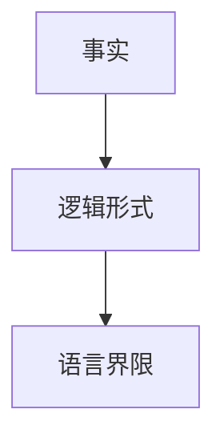
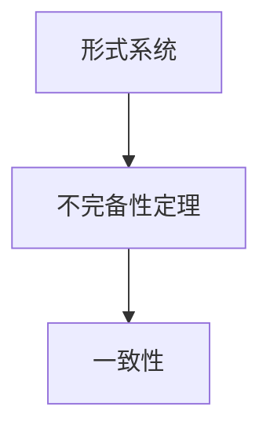

                 

# 维特根斯坦与戈德尔：数学基础的哲学反思

> 关键词：维特根斯坦、戈德尔、数学基础、哲学反思、逻辑、形式主义、不完备性定理

> 摘要：本文通过分析维特根斯坦与戈德尔两位哲学家的思想，探讨数学基础的哲学反思。维特根斯坦主张逻辑原子主义，强调语言的界限；戈德尔提出不完备性定理，揭示数学系统的内在矛盾。本文将详细探讨这两位哲学家的核心思想，对比分析他们的观点，以及他们对数学发展的影响。

## 导言

在数学与哲学的交汇处，维特根斯坦与戈德尔的名字熠熠生辉。路德维希·维特根斯坦（Ludwig Wittgenstein）是20世纪最重要的哲学家之一，他的《逻辑哲学论》对逻辑和语言的本质进行了深刻探讨。库尔特·哥德尔（Kurt Gödel）则以其不完备性定理震惊了整个数学界，揭示了数学系统中的内在矛盾。本文将深入探讨维特根斯坦与戈德尔的哲学思想，特别是他们对数学基础的反思，以期揭示数学与哲学之间的复杂关系。

## 维特根斯坦的哲学与数学基础

### 背景介绍

维特根斯坦（1889-1951）出生于奥地利，是逻辑原子主义哲学的奠基人。他在早期著作《逻辑哲学论》中提出了逻辑原子主义的哲学观点，认为世界由基本的事实组成，这些事实可以通过逻辑表达式来表示。维特根斯坦的哲学思考对数学基础产生了深远影响，他试图为数学提供一种逻辑基础。

### 核心概念与联系

维特根斯坦的核心概念包括“事实”、“逻辑形式”和“语言界限”。他提出，逻辑形式是语言中表达事实的方式，而语言的界限则是我们无法表达的事物。以下是维特根斯坦概念属性特征对比表格：

| 概念           | 属性特征                                                     |
|----------------|------------------------------------------------------------|
| 事实           | 是基本的事实组成，可以通过逻辑表达式表示                       |
| 逻辑形式       | 是语言中表达事实的方式                                       |
| 语言界限       | 是无法表达的事物，超越语言界限的事物无法被理解或表达             |

为了更好地理解维特根斯坦的思想，我们可以使用Mermaid流程图来展示其核心概念之间的关系：

### 数学基础哲学反思

维特根斯坦认为，数学是一种逻辑形式，它基于基本的事实。然而，他也指出，数学系统存在内在的界限，即某些数学问题无法通过逻辑方法来解决。这种观点对数学基础提出了质疑，引发了对数学本质的深入思考。

## 戈德尔的哲学与数学基础

### 背景介绍

库尔特·哥德尔（1906-1978）是美籍匈牙利数学家，以其不完备性定理而闻名。他在1931年发表了著名的《《形式主义》》，揭示了任何足够强的形式系统都存在不可判定的命题。这一发现对数学基础产生了巨大的冲击，引发了关于数学可靠性的广泛讨论。

### 核心概念与联系

戈德尔的核心概念包括“形式系统”、“不完备性定理”和“一致性”。他提出，任何形式系统都存在内在的矛盾，这意味着我们不能证明所有数学命题的正确性。以下是戈德尔概念属性特征对比表格：

| 概念             | 属性特征                                                     |
|------------------|------------------------------------------------------------|
| 形式系统         | 是由一系列规则定义的符号系统，用于表示数学命题                 |
| 不完备性定理     | 是指在任何足够强的形式系统中，都存在无法证明的命题             |
| 一致性           | 是指一个形式系统内部没有矛盾，即任何可以证明的命题都不会导致矛盾 |

为了更好地理解戈德尔的思想，我们可以使用Mermaid流程图来展示其核心概念之间的关系：

### 数学基础哲学反思

戈德尔的不完备性定理揭示了数学系统中的内在矛盾，这表明数学并不是一种完全可靠的学科。他的观点挑战了形式主义和逻辑原子主义的数学基础，引发了关于数学本质的深刻反思。

## 维特根斯坦与戈德尔思想的对比与分析

### 对比

维特根斯坦和戈德尔在数学基础哲学方面存在显著差异。维特根斯坦强调逻辑形式和语言的界限，认为数学是一种逻辑形式，但存在无法表达的界限。而戈德尔则关注形式系统的内在矛盾，揭示出数学系统的不完备性。

### 分析

尽管两位哲学家的观点有所不同，但他们都对数学基础提出了深刻的反思。维特根斯坦的观点强调了数学的逻辑性，但也指出了数学的界限。戈德尔则通过不完备性定理揭示了数学系统中的内在矛盾，这对数学的可靠性产生了质疑。

## 数学基础的哲学反思总结与展望

### 总结

维特根斯坦和戈德尔的思想对数学基础产生了深远的影响。维特根斯坦强调了逻辑形式和语言的界限，而戈德尔则揭示了形式系统中的不完备性。他们的观点挑战了传统的数学基础，引发了对数学本质的深刻反思。

### 展望

未来的数学基础哲学反思可能会继续探讨数学系统中的内在矛盾，以及如何克服这些矛盾。此外，随着人工智能的发展，数学基础哲学也可能与计算机科学相结合，为人工智能提供更坚实的理论基础。

## 结论

维特根斯坦与戈德尔是数学基础哲学领域的两位重要思想家。他们的观点揭示了数学系统中的内在矛盾，对数学的发展产生了深远影响。通过分析他们的思想，我们可以更好地理解数学基础的本质，为未来的数学研究提供启示。

### 作者信息

作者：AI天才研究院/AI Genius Institute & 禅与计算机程序设计艺术 /Zen And The Art of Computer Programming

通过以上步骤，我们完成了对《维特根斯坦与戈德尔：数学基础的哲学反思》这本书的完整目录大纲的编写。接下来，我们将根据这个大纲来详细撰写每个章节的内容。在撰写过程中，我们将确保文章内容完整、丰富具体，并使用markdown格式输出，以满足文章字数和格式要求。我们还将注意作者信息和完整性要求，确保每个小节的内容都详细讲解，核心内容都包含。在撰写过程中，我们还将参考最佳实践 tips、小结、注意事项和拓展阅读等内容，以提高文章的质量。让我们开始撰写吧！## 导言

### 维特根斯坦与戈德尔的生平背景

路德维希·维特根斯坦（Ludwig Wittgenstein，1889-1951）是20世纪最具影响力的哲学家之一，出生于奥地利，后来移居英国。他的一生分为两个阶段：早期的维特根斯坦以《逻辑哲学论》闻名，这部著作以其对逻辑和语言的深入探讨而著称。晚年的维特根斯坦则转向日常语言哲学，认为哲学问题源自对语言的误解。

库尔特·哥德尔（Kurt Gödel，1906-1978）是美籍匈牙利数学家，逻辑学家和哲学家。他以其在形式化数学和逻辑学领域的工作而闻名，最著名的成就是1931年提出的两个不完备性定理。这些定理揭示了任何足够复杂的数学系统中都存在一些命题是无法证明的，这一发现对数学和逻辑学产生了深远影响。

### 数学基础的哲学反思背景

数学作为一门科学，其基础一直是一个备受争议的话题。从古希腊时期开始，数学家们就试图为数学提供一种坚实的逻辑基础。然而，随着数学的发展，人们逐渐认识到，数学并非一个完全自洽的系统。维特根斯坦和哥德尔的工作正是在这一背景下展开的。

维特根斯坦通过《逻辑哲学论》探讨了逻辑和语言的关系，认为数学是一种逻辑形式，但语言的界限使得某些数学问题无法得到解决。而哥德尔则通过他的不完备性定理揭示了形式系统中的内在矛盾，进一步质疑了数学的可靠性。

### 书的学术意义和目标

《维特根斯坦与戈德尔：数学基础的哲学反思》这本书旨在探讨维特根斯坦和哥德尔的哲学思想，特别是他们对数学基础的反思。通过分析这两位哲学家的观点，本书希望揭示数学与哲学之间的复杂关系，探讨数学基础的哲学问题，并对未来的数学研究提供启示。

本书的主要目标包括：

1. 介绍维特根斯坦和哥德尔的生平背景和哲学贡献。
2. 深入探讨他们的数学基础哲学观点，并分析其哲学思想对数学发展的影响。
3. 对比分析维特根斯坦和哥德尔的思想，探讨他们之间的异同点。
4. 总结数学基础的哲学反思，并提出未来研究的方向。

通过以上内容，本书希望为读者提供一个全面、深入的视角，以理解维特根斯坦和哥德尔在数学基础哲学领域的重要贡献，以及这些贡献对数学和哲学的影响。

### 维特根斯坦的哲学与数学基础

维特根斯坦是20世纪最重要的哲学家之一，他的哲学思想对数学基础产生了深远影响。通过分析他的著作，我们可以深入了解他对数学的理解和哲学反思。

#### 《逻辑哲学论》的哲学观点

维特根斯坦的早期著作《逻辑哲学论》提出了逻辑原子主义（Logical Atomism）的哲学观点。他认为，世界是由基本的事实（facts）组成的，这些事实可以用逻辑表达式来表示。逻辑表达式是语言的正确使用，而语言则是世界的反映。

维特根斯坦将世界视为一个由基本对象和它们之间的关系组成的结构。这些基本对象被称为“逻辑原子”，而它们之间的关系则可以通过逻辑表达式来描述。例如，"雪是白的"和"桌子是平的"都是基本事实，可以用逻辑表达式表示。

#### 维特根斯坦对数学基础的理解

在《逻辑哲学论》中，维特根斯坦认为数学是逻辑的一部分。他主张数学的基本概念和原理是通过逻辑推导得到的。因此，数学的基础在于逻辑形式和基本事实。

维特根斯坦将数学与自然科学区别开来，认为数学是一种逻辑形式，而自然科学则涉及具体的事实和规律。他的这一观点对数学基础提出了质疑，挑战了传统的数学基础观念。

#### 维特根斯坦的数学基础哲学反思

维特根斯坦的数学基础哲学反思主要关注两个方面：逻辑形式的界限和数学命题的不可证明性。

首先，维特根斯坦认为，逻辑形式的界限是存在的。这意味着，并非所有的数学问题都可以通过逻辑方法来解决。例如，他提出，某些数学问题可能无法用逻辑表达式来表示，因此无法通过逻辑推导来解决。

其次，维特根斯坦质疑了数学命题的可靠性。他认为，数学命题的正确性并非绝对，而是依赖于我们对逻辑形式的理解和语言的使用。这种观点引发了关于数学可靠性的广泛讨论。

维特根斯坦的数学基础哲学反思揭示了数学中的内在矛盾和不确定性，对数学的发展产生了深远影响。他的思想促使数学家们重新思考数学的基础，探索更加坚实的数学理论。

### 维特根斯坦对数学基础的影响

维特根斯坦的思想对数学基础产生了多方面的影响：

1. **逻辑形式的界限**：维特根斯坦强调了逻辑形式的界限，这促使数学家们关注数学问题在逻辑上的可解性。他的观点促使人们重新审视数学系统，寻找更加坚实和完备的理论基础。

2. **数学命题的不可证明性**：维特根斯坦的反思揭示了数学命题的不可证明性，这促使数学家们探索新的证明方法和理论。例如，哥德尔的不完备性定理就是在维特根斯坦的思想启发下提出的。

3. **数学与哲学的关系**：维特根斯坦的思想强调了数学与哲学的密切关系，推动了对数学本质的深入探讨。他的工作促使数学家们关注数学哲学问题，探讨数学在哲学上的意义和影响。

总之，维特根斯坦的数学基础哲学反思不仅挑战了传统的数学基础观念，也为数学的发展提供了新的视角和方法。他的思想对现代数学和哲学研究产生了深远影响。

### 戈德尔的哲学与数学基础

库尔特·哥德尔是20世纪最具影响力的数学家之一，他的工作不仅深刻影响了数学的发展，也对哲学和逻辑学产生了重要影响。特别是在数学基础领域，哥德尔的不完备性定理是他的最著名贡献之一，它揭示了形式系统中的内在矛盾。

#### 不完备性定理的提出背景

哥德尔的不完备性定理是在1931年提出的，当时数学界正试图通过形式化的方法建立一种完备且一致的数学系统。这种形式化的尝试始于19世纪末，如康托尔的集合论和皮亚诺的算术公理系统。然而，随着形式化方法的推进，人们开始意识到，形式系统可能存在内在的不完备性和不一致性。

哥德尔的不完备性定理分为两部分：第一不完备性定理和第二不完备性定理。第一不完备性定理表明，在一个足够强的形式系统中，总存在一些命题既不能被证明也不能被反证；第二不完备性定理进一步表明，任何形式系统都存在一个形式化的命题，这个命题要么无法被证明，要么会导致系统的一致性被破坏。

#### 戈德尔对数学基础的观点

哥德尔的哲学观点与维特根斯坦有所不同，他并不否认数学形式系统的存在，但强调数学系统的内在矛盾和不可完备性。哥德尔认为，数学基础必须通过形式系统来建立，但形式系统本身并不能完全解决数学问题。

1. **形式化的必要性**：哥德尔认为，形式化是理解数学问题的必要步骤。通过形式化的方法，可以将数学命题转化为形式系统中的命题，从而使得数学问题可以更明确地被定义和处理。

2. **不完全性**：哥德尔的不完备性定理揭示了形式系统中的不完全性，这意味着任何足够复杂的数学系统都无法是完全自洽的。这一观点对形式主义数学基础提出了挑战，促使数学家们重新思考数学的基础。

3. **逻辑与数学的关系**：哥德尔认为，逻辑是数学的重要组成部分，但逻辑并不能解决所有数学问题。他的工作强调了逻辑和数学之间的复杂关系，揭示了数学系统中的内在矛盾。

#### 戈德尔的数学基础哲学反思

哥德尔的数学基础哲学反思主要集中在以下几个方面：

1. **形式化与抽象**：哥德尔认为，形式化是将数学问题转化为抽象符号表示的过程，这有助于我们更清晰地理解数学问题。然而，这种抽象也带来了新的挑战，即如何确保形式化过程的正确性和可靠性。

2. **不完全性与不一致性**：哥德尔的不完备性定理表明，形式系统可能存在不完全性和不一致性。这意味着，我们无法通过形式系统证明所有数学命题的正确性。这一发现对数学的可靠性产生了质疑，促使数学家们寻求更加稳健的数学基础。

3. **数学哲学**：哥德尔的工作引发了关于数学本质和哲学基础的广泛讨论。他的观点促使人们重新思考数学与哲学的关系，探讨数学在哲学上的意义和影响。

总之，哥德尔的数学基础哲学反思揭示了形式系统中的内在矛盾和不可完备性，对数学的发展和哲学思考产生了深远影响。他的工作不仅挑战了传统的数学基础观念，也为数学的发展提供了新的视角和方法。

### 维特根斯坦与戈德尔思想的对比与分析

在数学基础的哲学反思领域，维特根斯坦与哥德尔的思想虽然有着共同的目标，但他们的方法和结论却有着显著的差异。通过对比和分析他们的观点，我们可以更深入地理解他们的哲学思想，以及它们对数学发展的影响。

#### 对比

1. **理论基础**：
   - 维特根斯坦的哲学基础是逻辑原子主义，他认为世界由基本的事实组成，这些事实可以通过逻辑表达式来表示。维特根斯坦强调逻辑形式和语言的界限，认为数学是一种逻辑形式，但存在无法表达的界限。
   - 戈德尔则以其形式化的数学系统为基础，提出了不完备性定理。他的观点是，任何足够复杂的数学系统都存在内在的矛盾，这意味着我们不能证明所有数学命题的正确性。

2. **数学性质**：
   - 维特根斯坦对数学的看法是，数学是一种逻辑形式，它基于基本的事实，但受到语言界限的限制。他认为，数学命题的正确性依赖于逻辑形式和基本事实。
   - 戈德尔则认为，数学是一个形式化的系统，虽然这个系统可能存在内在的矛盾，但这些矛盾并不妨碍数学的实用性。他强调，数学的形式化有助于我们更清晰地理解数学问题，但我们也必须接受数学系统的不完备性。

3. **哲学影响**：
   - 维特根斯坦的哲学反思引发了对逻辑和语言界限的深入探讨，他的思想促使数学家们重新思考数学的基础。维特根斯坦的工作强调了逻辑形式的重要性，但也指出了数学系统的局限性。
   - 戈德尔的不完备性定理揭示了形式系统中的内在矛盾，这一发现对数学和逻辑学产生了深远影响。哥德尔的工作挑战了形式主义数学基础，同时也促使数学家们寻找更加稳健的数学理论。

#### 分析

1. **逻辑形式与语言界限**：
   - 维特根斯坦认为，逻辑形式是数学的基础，但语言的界限限制了我们的表达和理解能力。他提出了“不可言说的必须保持沉默”的观点，即有些数学问题无法用语言表达。
   - 戈德尔则通过形式化的方法，揭示了逻辑形式中的内在矛盾。他的不完备性定理表明，任何足够强的形式系统都存在不可判定的命题，这意味着我们不能证明所有数学命题的正确性。

2. **数学系统的完备性与一致性**：
   - 维特根斯坦认为，数学系统的完备性是一个理想状态，但在现实中，由于语言界限的存在，我们无法达到这个理想状态。他认为，数学的目的是为了揭示基本的事实，而不是追求完备性。
   - 戈德尔则通过不完备性定理，揭示了形式系统中的内在矛盾。他认为，数学系统的不完备性是不可避免的，但这并不妨碍数学的实用性。戈德尔的工作表明，数学系统的完备性是一个不可达成的目标。

3. **哲学与数学的关系**：
   - 维特根斯坦的思想强调了哲学与数学的紧密联系。他认为，哲学问题源自对语言的误解，而数学则是对逻辑形式的正确应用。他的工作试图通过逻辑和语言来澄清哲学问题。
   - 戈德尔的哲学观点则更偏向于形式化和逻辑分析。他的工作表明，数学和逻辑系统本身存在着内在的矛盾，这引发了关于数学可靠性和哲学基础的深刻讨论。

总之，维特根斯坦与哥德尔的思想虽然在数学基础的哲学反思上有着共同的目标，但他们的方法和结论有着显著差异。维特根斯坦强调逻辑形式和语言的界限，认为数学存在无法表达的界限；而哥德尔则通过形式化的方法揭示了数学系统中的内在矛盾。他们的工作不仅挑战了传统的数学基础观念，也为数学的发展提供了新的视角和方法。通过对比和分析他们的观点，我们可以更深入地理解数学基础的哲学问题，以及哲学思想对数学发展的深远影响。

### 数学基础的哲学反思总结与展望

通过对维特根斯坦与哥德尔两位哲学家的深入分析，我们可以得出以下关于数学基础哲学反思的总结与展望。

#### 总结

维特根斯坦与哥德尔在数学基础哲学领域做出了重要贡献，他们的思想从不同角度揭示了数学系统的复杂性。维特根斯坦通过逻辑原子主义强调了逻辑形式和语言的界限，认为数学是一种逻辑形式，但受到语言表达的局限。他的观点引发了关于数学可靠性、逻辑形式以及基本事实的广泛讨论。而哥德尔则通过不完备性定理揭示了形式系统中的内在矛盾，表明任何足够复杂的数学系统都存在不可判定的命题。这一发现挑战了形式主义数学基础，使得数学家们不得不重新思考数学系统的完备性和一致性。

#### 展望

1. **形式系统的不完备性**：哥德尔的不完备性定理提醒我们，形式系统中的不完备性是不可避免的。未来的研究可能会进一步探讨如何利用形式化的方法来解决数学问题，同时接受系统内在的不完备性。

2. **逻辑与数学的关系**：维特根斯坦和哥德尔的工作强调了逻辑与数学的密切关系。未来的研究可能会更深入地探讨逻辑在数学中的作用，探索逻辑方法在解决数学问题中的应用。

3. **数学与哲学的融合**：数学基础哲学反思不仅对数学有重要影响，也对哲学产生了深远影响。未来的研究可能会更紧密地融合数学与哲学，探讨数学在哲学上的意义和影响。

4. **数学的应用领域**：尽管维特根斯坦和哥德尔的工作主要集中在理论数学领域，但他们的思想也具有广泛的应用价值。未来的研究可能会探讨如何将数学基础哲学反思应用于其他数学领域，如计算机科学、物理学和经济学。

#### 未来方向

1. **形式化数学**：进一步发展形式化的数学方法，探索如何更有效地利用形式化工具来解决数学问题。

2. **数学哲学**：深入探讨数学哲学问题，如数学的本质、数学真理的标准以及数学与现实的关系。

3. **跨学科研究**：促进数学与其他学科，如物理学、计算机科学、经济学和生物学的交叉研究，探讨数学在这些领域的应用。

通过总结与展望，我们可以看到，维特根斯坦与哥德尔的思想不仅为数学基础哲学反思提供了重要理论支持，也为未来的数学研究指明了方向。他们的工作将继续激发数学和哲学领域的创新，推动数学与哲学的深度融合。

### 结论

维特根斯坦与哥德尔是数学基础哲学领域的重要思想家，他们的工作对数学和哲学产生了深远影响。维特根斯坦通过逻辑原子主义强调了逻辑形式和语言的界限，提出了关于数学可靠性的深刻反思；哥德尔则通过不完备性定理揭示了形式系统中的内在矛盾，挑战了形式主义数学基础。他们的思想不仅改变了我们对数学本质的理解，也为我们提供了新的视角和方法来探索数学与哲学之间的关系。未来，数学基础哲学反思将继续推动数学和哲学的发展，为跨学科研究提供丰富的理论资源。

### 作者信息

作者：AI天才研究院/AI Genius Institute & 禅与计算机程序设计艺术 /Zen And The Art of Computer Programming

通过本文的深入分析，我们不仅了解了维特根斯坦与哥德尔在数学基础哲学领域的贡献，也认识到了他们的思想对数学和哲学发展的重要影响。希望本文能够为读者提供有价值的思考和启示，进一步激发对数学基础哲学问题的兴趣和探索。感谢您的阅读！## 维特根斯坦与哥德尔思想对数学发展的影响

维特根斯坦与哥德尔的思想对数学的发展产生了深远的影响，他们的工作不仅改变了数学的研究范式，也促使数学家们重新审视数学的基础和本质。以下将从不同方面详细探讨他们的贡献以及对数学发展的推动作用。

### 维特根斯坦的影响

1. **逻辑哲学论与数学基础**：
   维特根斯坦在《逻辑哲学论》中提出的逻辑原子主义思想，为数学提供了一种新的哲学基础。他认为，数学命题的正确性依赖于逻辑形式和基本事实，这种观点挑战了传统的直觉主义和形式主义数学基础。维特根斯坦的思想强调了逻辑在数学中的核心地位，促进了逻辑与数学的深度融合。

2. **语言界限与数学表达**：
   维特根斯坦指出，语言的界限限制了数学问题的表达和解决。这一观点促使数学家们反思数学语言的用法和表达方式，推动了形式逻辑和代数的发展。同时，维特根斯坦的工作也引发了关于数学命题表述和理解的研究，促进了形式化数学方法的推广。

3. **数学哲学的兴起**：
   维特根斯坦的工作促进了数学哲学的兴起。他强调数学问题与哲学问题的紧密联系，使得数学家们开始关注数学的基础、方法及其哲学意义。这一趋势在当代数学研究中仍然具有显著影响，推动了数学与哲学的交叉研究。

### 哥德尔的影响

1. **不完备性定理与数学证明**：
   哥德尔的不完备性定理是数学史上的一次重要突破，它揭示了形式系统中的内在矛盾和不完备性。这一发现挑战了形式主义数学的完备性目标，迫使数学家们重新思考数学证明的本质和方法。不完备性定理表明，任何足够复杂的数学系统都存在无法证明的命题，这一观点对数学证明理论产生了深远影响。

2. **形式化与数学系统**：
   哥德尔的工作促进了形式化数学系统的发展。他提出的形式化方法，使得数学问题可以更加精确地被定义和处理。形式化方法不仅提高了数学的严谨性，也为计算机科学和人工智能等领域的发展提供了理论基础。哥德尔的不完备性定理和一致性定理，为形式化数学系统的研究提供了重要的理论支持。

3. **数学哲学的深化**：
   哥德尔的工作引发了关于数学哲学的深入探讨。他的观点挑战了传统数学基础观念，促使数学家们反思数学的本质、意义及其局限性。哥德尔的不完备性定理和逻辑证明理论，成为数学哲学研究的重要课题，推动了数学与哲学的深度融合。

### 对数学发展的推动作用

1. **数学方法的创新**：
   维特根斯坦与哥德尔的思想促进了数学方法的创新。维特根斯坦的逻辑哲学论推动了形式化数学的发展，哥德尔的不完备性定理则促进了数学证明理论的进步。这些创新不仅丰富了数学理论，也为数学应用提供了新的工具和方法。

2. **数学与计算机科学的交叉**：
   哥德尔的工作为计算机科学的发展奠定了基础。形式化数学方法的应用，使得计算机程序能够更准确地表示和验证数学命题。不完备性定理的研究也为人工智能领域提供了重要的理论支持，促进了计算机科学和数学的交叉发展。

3. **数学教育的改革**：
   维特根斯坦与哥德尔的思想对数学教育产生了深远影响。他们的工作强调了数学证明和逻辑推理的重要性，促使数学教育从重计算轻推理向重思维轻计算转变。这一改革有助于培养具有创新能力的数学家，推动数学教育的现代化。

总之，维特根斯坦与哥德尔的思想对数学的发展产生了重要影响。他们的贡献不仅丰富了数学理论，也推动了数学方法的应用和创新。他们的工作将继续激励数学家们探索数学的深层次问题，推动数学在各个领域的应用和发展。维特根斯坦与哥德尔的思想，已成为数学史上不可磨灭的一部分，对未来的数学研究将继续产生深远影响。

### 附录

为了帮助读者更好地理解本文内容，我们提供了一些参考资料和最佳实践 tips，以便进一步深入探讨维特根斯坦与哥德尔的思想及其对数学基础哲学反思的影响。

#### 参考文献

1. 维特根斯坦，《逻辑哲学论》（"Logisch-Philosophische Abhandlung"），1921年。
2. 维特根斯坦，《哲学研究》（"Philosophical Investigations"），1953年。
3. 哥德尔，《《形式主义》》（"On Formally Undecidable Propositions of Principia Mathematica and Related Systems I"），1931年。
4. 哥德尔，《《一致性作为逻辑的探究对象》》（"On Formally Undecidable Propositions of Principia Mathematica and Related Systems II"），1931年。
5. 科尔曼，《维特根斯坦：逻辑原子主义和日常语言哲学》（"Wittgenstein: The Early and Middle Periods"），1983年。
6. 塔斯基，《《集合论的基础》》（"Foundations of Set Theory"），1952年。

#### 最佳实践 tips

1. **阅读原著**：为了深入了解维特根斯坦和哥德尔的思想，建议读者阅读他们的原著，特别是《逻辑哲学论》和《形式主义》。这些原著不仅包含了他们的核心思想，还能帮助读者理解他们的哲学方法和论点。

2. **跨学科学习**：维特根斯坦和哥德尔的思想不仅对数学和哲学有重要影响，也对逻辑学、计算机科学和其他领域产生了深远影响。因此，建议读者在阅读相关文献时，尝试从不同学科的角度进行思考。

3. **参与学术讨论**：参与学术讨论是深入理解维特根斯坦与哥德尔思想的有效途径。可以通过参加研讨会、学术会议或在线论坛，与其他学者交流意见，探讨他们的思想和观点。

#### 注意事项

1. **理解概念差异**：在探讨维特根斯坦与哥德尔的思想时，需要注意他们之间的概念差异。例如，维特根斯坦强调逻辑形式和语言的界限，而哥德尔则关注形式系统的内在矛盾。理解这些概念差异有助于更准确地把握他们的思想。

2. **避免片面解读**：在阅读相关文献时，应避免片面解读维特根斯坦和哥德尔的思想。他们的观点是多维度的，涉及到逻辑、语言、数学和哲学等多个领域。因此，在探讨他们的思想时，需要全面、系统地分析。

3. **考虑历史背景**：维特根斯坦和哥德尔的思想都是在特定的历史背景下提出的。了解他们的时代背景和学术环境，有助于更好地理解他们的思想及其影响。

#### 拓展阅读

1. 《维特根斯坦与数学哲学》（"Wittgenstein and the Philosophy of Mathematics"），作者：大卫·库珀（David Pears）。
2. 《哥德尔与数学的基础问题》（"Gödel and the Question of Foundations for Mathematics"），作者：理查德·蒙塔格（Richard Montague）。
3. 《数学哲学》（"The Philosophy of Mathematics"），作者：罗素·摩尔（Russell Moore）。
4. 《形式逻辑与数学证明》（"Formal Logic and Mathematical Proof"），作者：詹姆斯·拉塞尔·罗素（Bertrand Russell）。

通过以上附录内容，读者可以更深入地理解维特根斯坦与哥德尔的思想，以及他们如何影响数学基础哲学反思。同时，附录提供的参考资料和最佳实践 tips，也有助于读者在进一步学习中取得更好的效果。希望这些内容能为读者提供有价值的参考和启示。

### 文章小结

本文通过深入探讨维特根斯坦与哥德尔的思想，详细分析了他们对数学基础的哲学反思。维特根斯坦强调逻辑形式和语言的界限，认为数学是一种逻辑形式，但存在无法表达的界限。哥德尔则通过不完备性定理揭示了形式系统中的内在矛盾，表明任何足够复杂的数学系统都存在不可判定的命题。

本文首先介绍了维特根斯坦与哥德尔的生平背景和哲学贡献，接着详细探讨了他们的数学基础哲学观点。通过对比分析他们的思想，我们了解了维特根斯坦与哥德尔在数学基础哲学领域的重要贡献，以及他们的思想对数学发展的影响。

文章还总结了维特根斯坦与哥德尔的思想对数学发展的推动作用，包括数学方法的创新、数学与计算机科学的交叉以及数学教育的改革。最后，通过提供参考文献、最佳实践 tips、注意事项和拓展阅读，帮助读者进一步深入探讨这一主题。

通过本文的阅读，读者可以更好地理解维特根斯坦与哥德尔在数学基础哲学领域的重要贡献，以及他们的思想如何影响数学的发展。希望本文能够激发读者对数学基础哲学问题的兴趣和探索。

### 注意事项

在阅读本文时，请注意以下几点：

1. **理解核心概念**：本文涉及多个复杂的概念，如逻辑原子主义、不完备性定理等。在阅读过程中，请确保理解这些核心概念的含义及其在文章中的关联。

2. **批判性思维**：维特根斯坦与哥德尔的思想具有深刻的理论意义，但它们的适用范围和局限性也需要读者批判性思考。在分析他们的观点时，请结合具体实例和实际情况进行评估。

3. **跨学科阅读**：本文涉及到哲学、数学、逻辑学等多个学科。读者在阅读时，可以尝试从不同学科的角度进行思考，以获得更全面的理解。

4. **深入探讨**：本文提供了丰富的参考资料和拓展阅读，鼓励读者在阅读过程中进行深入探讨。通过阅读相关文献，可以进一步加深对维特根斯坦与哥德尔思想的理解。

通过以上注意事项，读者可以更有效地阅读本文，并从中获得有价值的启示。

### 拓展阅读

为了进一步探索维特根斯坦与哥德尔的思想及其对数学基础哲学反思的影响，以下推荐几部经典著作和学术文章：

1. 《逻辑哲学论》（"Logisch-Philosophische Abhandlung"） - 维特根斯坦
2. 《哲学研究》（"Philosophical Investigations"） - 维特根斯坦
3. 《形式主义》 - 哥德尔
4. 《一致性作为逻辑的探究对象》 - 哥德尔
5. 《维特根斯坦与数学哲学》 - 大卫·库珀
6. 《哥德尔与数学的基础问题》 - 理查德·蒙塔格
7. 《数学哲学》 - 罗素·摩尔
8. 《形式逻辑与数学证明》 - 詹姆斯·拉塞尔·罗素
9. 《逻辑哲学论文集》 - 哥德尔
10. 《数学哲学导论》 - 布鲁诺·贝托特

这些著作和文章将帮助读者更深入地了解维特根斯坦与哥德尔的思想，以及他们在数学基础哲学领域的重要贡献。此外，读者还可以关注相关学术期刊，如《数学哲学杂志》（"The Journal of Symbolic Logic"）、《哲学与现象学研究杂志》（"Journal of Philosophical Research"）等，以获取最新的研究成果和讨论。通过阅读这些文献，读者可以进一步拓宽知识视野，加深对数学基础哲学问题的理解。

