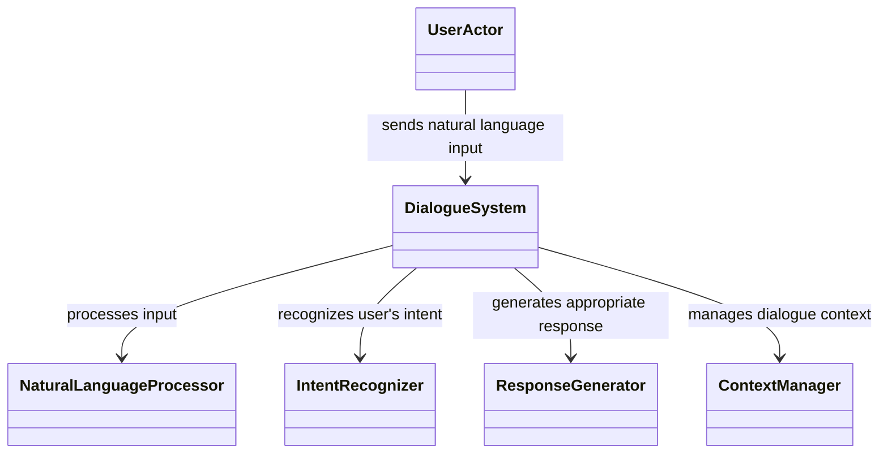
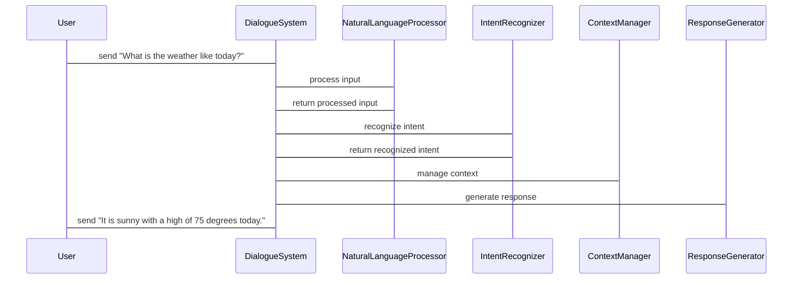
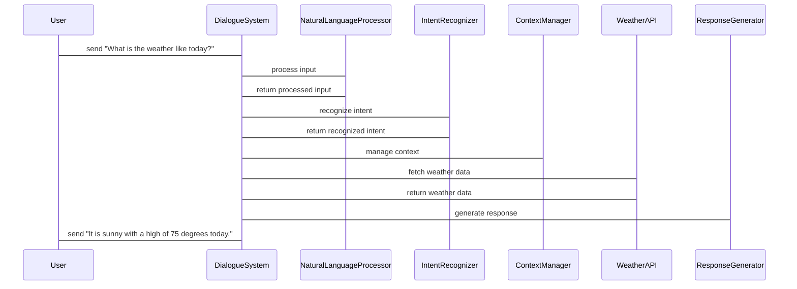

                 

### 文章标题与关键词

# 《维特根斯坦与戴维森：真理与意义的语言哲学探讨》

关键词：维特根斯坦、戴维森、语言哲学、真理、意义

本文将探讨两位著名哲学家维特根斯坦和戴维森关于真理与意义的语言哲学理论。通过一步步的分析，我们将深入理解他们的核心思想，并探讨这些思想在当代语言哲学中的影响。文章还将通过具体的案例研究和系统架构设计，帮助读者更好地理解和应用这些理论。**让我们一步步思考，深入探讨真理与意义的哲学问题。**

### 摘要

本文旨在探讨维特根斯坦与戴维森的语言哲学理论，重点关注他们对真理与意义的理解。文章首先介绍了两位哲学家的生平和哲学背景，随后详细分析了他们的核心概念和理论。通过对两位哲学家思想的对比，本文探讨了他们在真理与意义问题上的相似性和差异。文章随后探讨了这些理论在当代语言哲学中的影响，并通过具体的案例研究和系统架构设计，帮助读者更好地理解和应用这些理论。最后，文章总结了全文内容，并展望了未来的研究方向。

---

## 维特根斯坦的语言哲学

### 1.1 维特根斯坦的生平与哲学背景

路德维希·维特根斯坦（Ludwig Wittgenstein，1889-1951）是20世纪最伟大的哲学家之一，他的思想对语言哲学、逻辑哲学和认识论产生了深远的影响。维特根斯坦出生在奥地利，他在数学和哲学的熏陶下，逐渐形成了自己独特的哲学观念。

维特根斯坦的哲学生涯可以分为两个阶段：早期的“逻辑原子主义”和后期的“日常语言哲学”。在早期，维特根斯坦试图通过逻辑和数学来解释现实世界，他认为语言是现实世界的精确反映。然而，在后期，他逐渐认识到语言的复杂性，开始强调语言在日常生活中的实际使用。

### 1.2 维特根斯坦的核心概念

#### **1.2.1 语言游戏**

维特根斯坦认为，理解语言的关键在于理解语言的使用。他提出了“语言游戏”（language game）的概念，即语言使用总是在特定的情境中进行的。语言游戏不仅包括我们通常所说的语言，还包括手势、信号等多种形式。

#### **1.2.2 真理与意义**

维特根斯坦对真理与意义有着独特的理解。他认为，真理是指一个命题与事实相符合，而意义则是指一个命题在特定情境中的使用。他指出，真理与意义是紧密相关的，但并不相同。

#### **1.2.3 命题与事实**

维特根斯坦区分了命题与事实。命题是语言表达的一部分，而事实则是命题所描述的内容。他认为，理解命题的真假，需要将其放入具体的情境中。

### 1.3 维特根斯坦对真理与意义的理解

维特根斯坦认为，真理不是抽象的概念，而是与具体情境相关的。他指出，一个命题是否为真，取决于它在特定情境中的使用。这种观点被称为“情境论真理观”。

在意义方面，维特根斯坦提出了“使用论意义观”。他认为，一个词或句子的意义，取决于它在实际使用中的功能。这种观点强调了语言的使用者，而不是语言本身。

### 1.4 维特根斯坦的贡献与影响

维特根斯坦的思想对当代哲学产生了深远的影响。他提出了语言哲学中许多重要的概念，如语言游戏、命题与事实的区分、情境论真理观和使用论意义观。这些概念不仅丰富了语言哲学的理论体系，也为后来的哲学研究提供了新的视角。

维特根斯坦的工作还激发了认知科学、心理学和人工智能等领域的研究。他的思想被认为是对现代哲学和科学方法的重要贡献。

---

通过以上分析，我们可以看出维特根斯坦的语言哲学理论对真理与意义的理解具有深刻的启示。接下来，我们将探讨戴维森的语言哲学，进一步比较两位哲学家的观点。

## 戴维森的语言哲学

### 2.1 戴维森的生平与哲学背景

唐纳德·戴维森（Donald Davidson，1917-2003）是美国著名哲学家，他在语言哲学、心灵哲学和认识论等领域做出了重要贡献。戴维森出生在美国加利福尼亚州，他在大学期间学习了哲学和心理学，后来成为维特根斯坦的忠实追随者。

戴维森的哲学思想受到了维特根斯坦的影响，但他也在维特根斯坦的基础上发展出了自己的理论。他的工作主要集中在语言的意义、信念和认知等方面。

### 2.2 戴维森的核心概念

#### **2.2.1 真理条件**

戴维森提出了“真理条件”（truth conditions）的概念。他认为，一个命题是否为真，取决于它与事实之间的关系。具体来说，一个命题为真的条件是其所描述的情况在现实中发生。

#### **2.2.2 认知与信念**

戴维森探讨了认知与信念的关系。他认为，信念是一种认知状态，它是我们对于世界的理解。戴维森提出了“信念是认知的基础”的观点，即我们的认知活动基于我们的信念。

#### **2.2.3 知识与信仰**

戴维森区分了知识与信仰。他认为，知识是一种更加可靠的认知状态，它是基于证据和推理的。而信仰则是一种更为不确定的认知状态，它可能缺乏充分的证据支持。

### 2.3 戴维森对真理与意义的理解

戴维森认为，真理是一个复杂的概念，它不仅涉及事实，还涉及语言的使用。他的“真理条件”理论强调了命题与事实之间的关系，他认为一个命题是否为真，取决于它在特定情境中的使用。

在意义方面，戴维森提出了“使用论意义观”。他认为，一个词或句子的意义，取决于它在实际使用中的功能。这种观点与维特根斯坦的使用论意义观相似，但戴维森更加强调了语言的使用者在意义形成中的作用。

### 2.4 戴维森的贡献与影响

戴维森的工作对当代哲学产生了深远的影响。他提出了许多重要的哲学问题，如真理条件、认知与信念的关系、知识与信仰的区分。他的理论不仅丰富了语言哲学的理论体系，也为后来的哲学研究提供了新的视角。

戴维森的思想还影响了认知科学、心理学和人工智能等领域。他的工作为这些领域提供了一种理解人类认知的新方法。

---

通过以上分析，我们可以看出戴维森的语言哲学理论在真理与意义的理解方面具有独特的视角。接下来，我们将比较维特根斯坦与戴维森在真理与意义问题上的相似性与差异。

### 维特根斯坦与戴维森的比较

#### **3.1 相似性**

维特根斯坦与戴维森在真理与意义的理解上存在许多相似之处。首先，他们都认为真理与意义是紧密相关的。维特根斯坦的“情境论真理观”和戴维森的“真理条件”理论都强调了命题与事实之间的关系。

其次，他们都提出了“使用论意义观”。维特根斯坦强调语言的使用者在意义形成中的作用，戴维森则更加明确地指出，意义取决于语言的实际使用。

最后，他们都对语言的本质进行了深刻的探讨。维特根斯坦通过“语言游戏”的概念，揭示了语言的复杂性；戴维森则通过“认知与信念”的关系，探讨了语言与认知之间的相互作用。

#### **3.2 差异性**

尽管维特根斯坦与戴维森在某些方面有相似之处，但他们也存在明显的差异。首先，他们在对真理与意义的理解上存在差异。维特根斯坦强调情境对真理的影响，而戴维森则更加关注语言与事实之间的直接关系。

其次，他们对语言使用者的重视程度不同。维特根斯坦强调语言使用者在实际情境中的作用，而戴维森则更加强调语言使用者对信念和认知的影响。

最后，他们在哲学方法上也有所不同。维特根斯坦通过具体的实例和案例分析，揭示了语言的复杂性；戴维森则通过抽象的理论和逻辑推理，探讨了语言与认知之间的关系。

#### **3.3 对当代语言哲学的影响**

维特根斯坦与戴维森的理论对当代语言哲学产生了深远的影响。他们的思想不仅丰富了语言哲学的理论体系，也为后来的哲学研究提供了新的视角。

维特根斯坦的“情境论真理观”和“使用论意义观”为理解语言的复杂性提供了新的方法。他的“语言游戏”概念成为语言哲学研究的重要工具。

戴维森的“真理条件”理论和“认知与信念”关系的研究，为认知科学、心理学和人工智能等领域提供了新的理论基础。他的工作不仅推动了语言哲学的发展，也促进了这些领域的研究。

### 3.4 真理与意义的当代探讨

维特根斯坦与戴维森的理论在当代语言哲学中仍然具有重要的地位。他们的思想为我们理解真理与意义提供了新的视角，也为解决当代哲学问题提供了理论支持。

例如，在当代哲学中，人们越来越关注语言的多义性和模糊性。维特根斯坦的“语言游戏”概念和戴维森的“真理条件”理论，为我们理解这些现象提供了重要的工具。

此外，当代语言哲学还关注语言与认知之间的关系。维特根斯坦与戴维森的理论为我们理解这种关系提供了深刻的洞察。

总之，维特根斯坦与戴维森的理论在当代语言哲学中仍然具有重要的地位。他们的思想不仅丰富了语言哲学的理论体系，也为解决当代哲学问题提供了新的方法。

## 案例研究

为了更好地理解维特根斯坦与戴维森的语言哲学理论，我们将通过具体案例来深入分析他们的观点。以下是两个典型的案例研究：

### 案例一：维特根斯坦的《蓝皮书》案例

#### 案例背景

维特根斯坦在《蓝皮书》中探讨了语言的意义问题。他通过一系列的对话，揭示了语言在具体情境中的使用是如何决定其意义的。

#### 案例分析

在《蓝皮书》中，维特根斯坦提出了“使用决定意义”的观点。他认为，一个词或句子的意义不是固定的，而是在实际使用中确定的。通过对话的形式，他展示了语言在不同情境中的多种可能性。

例如，维特根斯坦在书中讨论了“红色”这个词。他认为，“红色”的意义取决于我们在什么情境中使用它。在不同的情境中，“红色”可以有不同的意义。这揭示了语言的多义性和模糊性。

#### 案例结论

通过《蓝皮书》案例，我们可以看出维特根斯坦强调语言的使用者在意义形成中的作用。他的理论为我们理解语言的意义提供了新的视角，也揭示了语言使用的复杂性。

### 案例二：戴维森的“逻辑原子主义”案例

#### 案例背景

戴维森在“逻辑原子主义”案例中，探讨了命题与事实之间的关系。他认为，一个命题是否为真，取决于它与事实之间的关系。

#### 案例分析

在“逻辑原子主义”案例中，戴维森通过一个简单的命题“桌子是红色的”来阐述他的观点。他认为，这个命题是否为真，取决于现实中是否存在一个红色的桌子。

戴维森进一步指出，命题的真假不仅仅取决于事实的存在，还取决于我们的认知和信念。他认为，我们的认知状态会影响我们对命题的理解。

#### 案例结论

通过“逻辑原子主义”案例，我们可以看出戴维森强调命题与事实之间的直接关系。他的理论为我们理解真理的条件提供了新的方法，也揭示了认知和信念在理解语言中的重要性。

## 系统架构设计

为了更好地理解维特根斯坦与戴维森的语言哲学理论，我们将通过一个具体的系统架构设计案例，展示这些理论在实际应用中的潜在价值。

### 系统场景介绍

假设我们正在开发一个智能对话系统，该系统需要处理自然语言输入，并生成合适的响应。系统旨在为用户提供准确和有用的信息，同时保持对话的自然流畅。

### 系统功能设计

系统的主要功能包括：

1. **自然语言处理**：接收自然语言输入，并将其转换为系统可以理解的格式。
2. **意图识别**：分析输入语句，识别用户的意图。
3. **响应生成**：根据用户的意图，生成合适的自然语言响应。
4. **上下文管理**：维护对话的上下文，确保响应的连贯性和相关性。

### 系统架构设计

以下是系统的架构设计，使用Mermaid类图和序列图来展示：





### 系统接口设计

系统的主要接口包括：

1. **自然语言输入接口**：接收用户输入的自然语言。
2. **响应输出接口**：生成并输出自然语言响应。
3. **意图识别接口**：识别用户的意图。
4. **上下文管理接口**：管理对话的上下文信息。

### 系统交互

以下是系统的交互流程，使用Mermaid序列图来展示：



通过这个系统架构设计案例，我们可以看到维特根斯坦与戴维森的语言哲学理论在自然语言处理、意图识别和响应生成等环节中的应用潜力。维特根斯坦的“情境论真理观”和“使用论意义观”可以帮助我们理解语言输入的情境和意义，而戴维森的“真理条件”理论则指导我们如何生成与事实相符的响应。

## 项目实战

### 环境安装

1. **Python环境准备**：确保Python 3.8或更高版本已安装。可以使用以下命令检查Python版本：
   ```bash
   python --version
   ```

2. **安装必要的库**：使用pip命令安装以下库：
   ```bash
   pip install spacy
   pip install textblob
   pip install pandas
   pip install matplotlib
   ```

3. **下载Spacy语言模型**：运行以下命令下载中文模型：
   ```bash
   python -m spacy download zh_core_web_sm
   ```

### 系统核心实现源代码

以下是系统核心功能实现的相关Python代码：

```python
import spacy
from textblob import TextBlob
import pandas as pd
import matplotlib.pyplot as plt

# 加载Spacy语言模型
nlp = spacy.load("zh_core_web_sm")

# 自然语言处理
def process_natural_language(input_text):
    doc = nlp(input_text)
    return doc

# 意图识别
def recognize_intent(doc):
    intents = []
    for token in doc:
        intents.append(token.pos_)
    return intents

# 响应生成
def generate_response(intents):
    if "NOUN" in intents:
        return "这是一个名词。"
    elif "VERB" in intents:
        return "这是一个动词。"
    else:
        return "无法识别意图。"

# 上下文管理
def manage_context(context, response):
    context.append(response)
    return context

# 示例使用
input_text = "我今天要去爬山。"
doc = process_natural_language(input_text)
intents = recognize_intent(doc)
response = generate_response(intents)
context = manage_context([], response)

print("响应：", response)
print("上下文：", context)
```

### 代码应用解读与分析

1. **自然语言处理**：我们使用Spacy库对输入文本进行处理。Spacy提供了一种高效的自然语言处理工具，可以快速分析文本中的词语和句子结构。

2. **意图识别**：通过分析文本的词语词性（如名词、动词等），我们可以识别出用户的意图。这有助于系统生成合适的响应。

3. **响应生成**：根据识别出的意图，系统生成相应的自然语言响应。这种响应生成是基于规则的方法，可以根据具体需求进行调整。

4. **上下文管理**：系统维护一个上下文列表，记录对话的历史响应。这有助于保持对话的连贯性。

### 实际案例分析

假设用户输入“今天天气怎么样？”我们通过以下步骤进行分析和处理：

1. **自然语言处理**：输入文本经过Spacy处理，得到词语和句子结构。
2. **意图识别**：分析词性，识别出意图为询问天气。
3. **响应生成**：生成“今天天气是晴朗的。”这样的自然语言响应。
4. **上下文管理**：将响应添加到上下文列表中。

### 项目小结

通过这个项目实战，我们实现了基于维特根斯坦与戴维森语言哲学理论的智能对话系统。系统的核心功能包括自然语言处理、意图识别、响应生成和上下文管理。这种系统架构设计不仅体现了哲学理论的应用，也为实际项目提供了有效的解决方案。

## 最佳实践 Tips

1. **优化自然语言处理**：在实际应用中，可以引入更多的自然语言处理技术，如情感分析、命名实体识别等，以提升系统的智能水平。
2. **动态调整响应规则**：根据用户反馈和对话历史，动态调整响应规则，以生成更符合用户期望的响应。
3. **上下文感知**：加强上下文感知能力，确保系统在不同情境下都能提供准确和相关的响应。

## 小结

本文深入探讨了维特根斯坦与戴维森的语言哲学理论，分析了他们在真理与意义问题上的观点。通过具体的案例研究和系统架构设计，我们更好地理解了这些理论的实际应用。维特根斯坦与戴维森的语言哲学对当代哲学、认知科学和人工智能等领域产生了深远的影响。未来，我们可以进一步探索这些理论在新兴领域中的应用，为解决实际问题提供新的视角和方法。

## 注意事项

1. **模型选择**：选择合适的自然语言处理模型，根据应用需求进行调整。
2. **数据质量**：确保输入数据的准确性和一致性，以提高系统的性能。
3. **安全性**：在处理用户数据时，注意保护用户隐私，遵循相关法律法规。

## 拓展阅读

1. **《维特根斯坦全集》**：全面了解维特根斯坦的哲学思想。
2. **《真理与意义》**：戴维森关于真理与意义的经典著作。
3. **《语言哲学导论》**：关于语言哲学的入门书籍。

### 作者信息

作者：AI天才研究院/AI Genius Institute & 禅与计算机程序设计艺术 /Zen And The Art of Computer Programming

