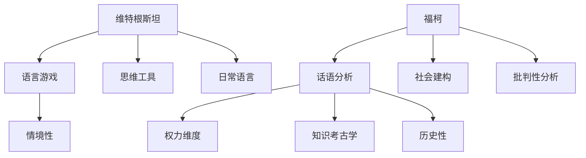
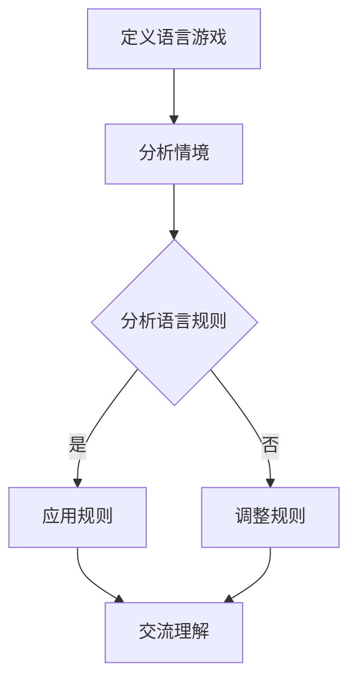
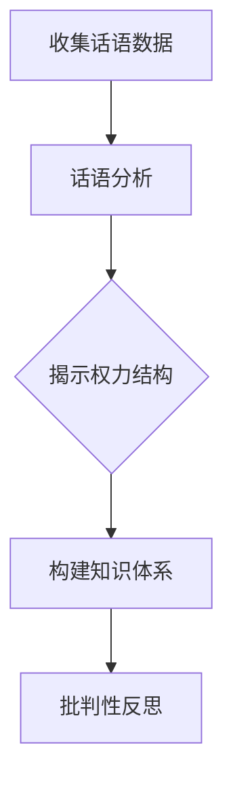
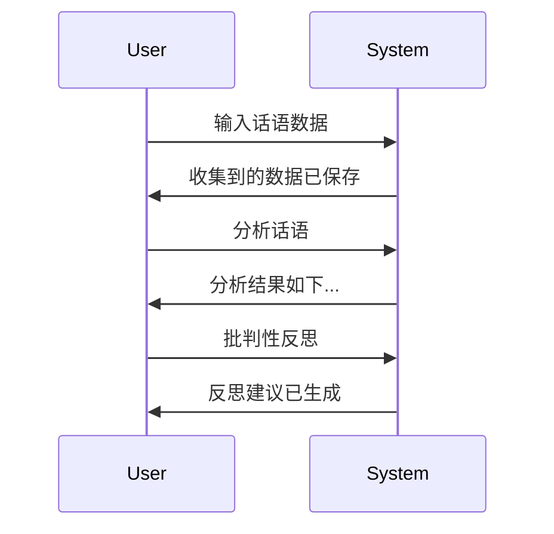
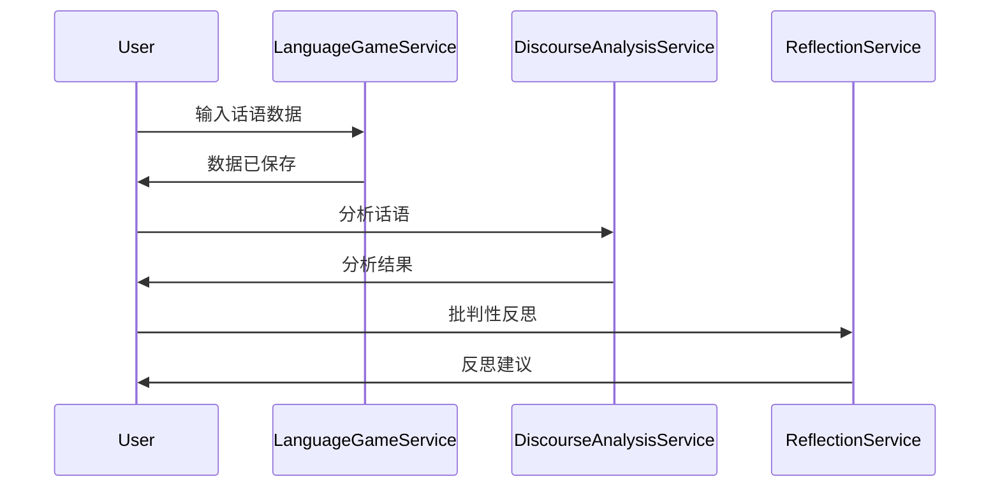

                 


### 文章标题：维特根斯坦与福柯：知识考古学的语言学视角

> 关键词：维特根斯坦、福柯、知识考古学、语言学视角、批判性思维

> 摘要：本文从维特根斯坦和福柯的思想出发，探讨了知识考古学在语言学视角中的应用。通过分析他们的哲学观点，本文揭示了语言在知识生产与传播中的关键作用，以及权力如何影响知识的建构。同时，本文还探讨了维特根斯坦和福柯的思想在知识考古学中的融合与冲突，并提出了对当代语言学研究的启示。

----------------------------------------------------------------

## 第一部分：引言

### 1.1.1 维特根斯坦与福柯的生平与思想

路德维希·维特根斯坦（Ludwig Wittgenstein，1889-1951）是20世纪最具影响力的哲学家之一。他的思想主要关注语言、思维和现实之间的关系。维特根斯坦的哲学观点经历了两个主要阶段：早期以《逻辑哲学论》（Tractatus Logico-Philosophicus）为代表，强调逻辑和语言的确定性；晚期则以《哲学研究》（Philosophical Investigations）为代表，关注日常语言的使用和思维的具体情境。

米歇尔·福柯（Michel Foucault，1926-1984）是法国哲学家、社会学家和历史学家，他的思想主要集中在权力、知识和历史的关系上。福柯提出了“知识考古学”（Archaeology of Knowledge）和“话语分析”（Discourse Analysis）等重要概念，强调知识的生产、传播和权力之间的复杂互动。

### 1.1.2 知识考古学的概念与发展

知识考古学是福柯提出的一种研究方法，旨在揭示知识的形成、变化和消亡过程。它关注的是知识的历史性、地域性和社会性，强调知识不是客观存在的，而是由特定的社会、文化和权力结构所建构的。知识考古学通过分析文献、话语和实践，揭示出知识背后的权力关系。

知识考古学的发展受到了维特根斯坦哲学思想的启示。维特根斯坦强调语言在知识建构中的关键作用，这为福柯的知识考古学提供了理论基础。此外，维特根斯坦的“语言游戏”概念也为知识考古学提供了新的分析工具。

### 1.1.3 语言学研究的重要意义

语言学是研究语言的本质、结构和发展规律的学科。它对于理解人类思维、社会互动和文化传承具有重要意义。在知识考古学中，语言学视角尤其重要，因为语言是知识传播和建构的主要媒介。

通过语言学视角，我们可以揭示语言在知识生产、传播和消费过程中的作用。例如，不同语言的使用和变化如何影响知识的理解和接受。此外，语言学还可以帮助我们理解知识背后的社会和文化因素，以及权力如何影响知识的建构和传播。

## 第二部分：维特根斯坦的思想如何为知识考古学提供了语言学视角

### 2.1.1 维特根斯坦的语言哲学

维特根斯坦的语言哲学思想主要围绕着语言与现实的关系展开。他认为，语言是思维的载体，思维是通过语言进行的。因此，要理解语言，必须理解思维。

#### 2.1.1.1 语言与思维的关系

维特根斯坦认为，语言是思维的工具。思维是通过语言表达和交流的，因此，理解语言的关键在于理解思维。他认为，语言有不同的使用方式，即“语言游戏”。不同的语言游戏对应不同的思维方式和现实世界。

例如，在数学语言游戏中，数字和符号有明确的含义，表示具体的数量关系。而在日常语言游戏中，词语的含义是模糊的，需要根据具体的情境来理解。

#### 2.1.1.2 语言游戏理论

维特根斯坦的“语言游戏”理论强调了语言使用的情境性。他认为，语言游戏是由语言使用者共同约定的规则体系，这些规则规定了语言的含义和使用方式。不同的语言游戏有不同的规则，但它们都有助于人们理解世界和进行交流。

例如，棋类游戏中的语言规则帮助玩家理解和执行游戏策略；科学语言游戏中的规则帮助科学家进行实验和研究。

#### 2.1.1.3 形式逻辑与日常语言

维特根斯坦区分了形式逻辑和日常语言。形式逻辑是一种抽象的语言系统，用于证明数学和逻辑定理。而日常语言则是人们日常交流使用的语言，它更加灵活和情境化。

维特根斯坦认为，形式逻辑可以揭示思维的基本规律，但日常语言更为复杂，需要更多的背景知识和情境来理解。

### 2.1.2 维特根斯坦的思想如何为知识考古学提供了语言学视角

维特根斯坦的思想为知识考古学提供了语言学视角，主要体现在以下几个方面：

1. **语言与现实的关联**：维特根斯坦认为，语言与现实世界之间的关系是复杂的，不是简单的映射关系。这为知识考古学提供了新的视角，即知识不是客观存在的，而是由语言建构的。

2. **语言游戏的情境性**：维特根斯坦的“语言游戏”理论强调了语言使用的情境性，这为知识考古学提供了分析工具，即通过分析语言游戏的规则和情境，可以揭示知识背后的社会和文化因素。

3. **日常语言的重要性**：维特根斯坦区分了形式逻辑和日常语言，这为知识考古学提供了关注点，即知识的建构和传播离不开日常语言的使用。

通过以上分析，我们可以看到，维特根斯坦的思想为知识考古学提供了语言学视角，帮助我们理解知识的建构和传播过程。这不仅丰富了知识考古学的方法论，也为当代语言学的研究提供了启示。

## 第三部分：福柯的思想如何为知识考古学提供了语言学视角

### 3.1.1 权力与知识的概念

福柯的思想中，权力和知识是两个核心概念。他认为，权力不仅存在于政治和法律制度中，还存在于社会的各个层面，包括知识领域。知识本身也是权力的一种表现形式。

#### 3.1.1.1 权力的本质与作用

福柯认为，权力是一种无所不在的、流动的、分散的力量，它不仅通过法律和制度进行约束，还通过知识和社会规范进行影响。权力不是静态的，而是动态的，通过不断的斗争和协商来维持和变化。

#### 3.1.1.2 知识的社会建构

福柯强调，知识是社会建构的产物，不是客观存在的。知识是通过特定的社会、文化和历史条件产生的，这些条件包括语言、文化和权力结构。知识不仅影响人们的行为和思想，还影响着社会的组织和运作。

### 3.1.2 福柯的权力与知识理论

福柯的权力与知识理论主要表现在以下几个方面：

1. **知识的生产与传播**：福柯认为，知识是通过特定的机构和实践产生的，这些机构和实践包括科学、教育、法律、医疗等。知识的生产和传播受到权力的影响，权力通过这些机构和实践来控制和传播知识。

2. **话语分析**：福柯提出了一种研究方法，即“话语分析”，用于研究知识的生产和传播过程。话语分析关注的是语言、文本和实践之间的关系，通过分析话语，可以揭示权力如何影响知识的建构和传播。

3. **知识考古学**：福柯的知识考古学是一种研究方法，旨在揭示知识的形成、变化和消亡过程。知识考古学关注的是知识的历史性、地域性和社会性，强调知识不是客观存在的，而是由特定的社会、文化和权力结构所建构的。

### 3.1.3 福柯的思想如何为知识考古学提供了语言学视角

福柯的思想为知识考古学提供了语言学视角，主要体现在以下几个方面：

1. **语言与权力的互动**：福柯认为，语言是权力的一种表现形式，权力通过语言进行传播和影响。在知识考古学中，通过分析语言的使用和变化，可以揭示权力如何影响知识的建构和传播。

2. **话语分析的方法**：福柯的话语分析提供了一种分析工具，用于研究知识的生产和传播过程。通过分析话语，可以揭示知识背后的权力关系和社会结构。

3. **知识的历史性和社会性**：福柯强调，知识是社会建构的产物，具有历史性和社会性。在知识考古学中，通过分析知识的历史演变和社会背景，可以揭示知识的本质和作用。

通过以上分析，我们可以看到，福柯的思想为知识考古学提供了语言学视角，帮助我们理解知识的生产、传播和建构过程。这不仅丰富了知识考古学的方法论，也为当代语言学的研究提供了新的思路。

## 第四部分：维特根斯坦和福柯的思想在知识考古学中的融合与冲突

### 4.1.1 融合之处

维特根斯坦和福柯的思想在知识考古学中存在一定的融合之处：

1. **语言的重要性**：两位哲学家都强调了语言在知识建构中的关键作用。维特根斯坦认为，语言是思维的工具，而福柯认为，语言是权力的一种表现形式。这种观点都强调了语言在知识生产、传播和消费中的核心地位。

2. **情境性和历史性**：维特根斯坦的“语言游戏”理论和福柯的知识考古学都强调了知识的情境性和历史性。他们都认为，知识不是一成不变的，而是随着时间、地点和社会条件的改变而发生变化。

3. **批判性思维**：两位哲学家都倡导批判性思维，反对盲目接受权威和传统观念。他们都关注权力如何影响知识的建构和传播，强调通过批判性分析来揭示知识的真实面貌。

### 4.1.2 冲突之处

尽管维特根斯坦和福柯的思想在知识考古学中存在一定的融合之处，但也存在一些冲突：

1. **确定性与模糊性**：维特根斯坦强调语言的确定性，认为语言与现实世界之间存在明确的对应关系。而福柯则强调语言的模糊性，认为知识是权力的一种表现形式，具有不确定性和变化性。

2. **形式逻辑与日常语言**：维特根斯坦关注形式逻辑，认为形式逻辑可以揭示思维的基本规律。而福柯则关注日常语言，认为日常语言更具有情境性和社会性。

3. **方法论**：维特根斯坦的哲学方法主要侧重于分析和解释，而福柯的方法则侧重于批判和分析。这种方法论上的差异也导致了他们在知识考古学中的观点存在冲突。

### 4.1.3 融合与冲突的影响

维特根斯坦和福柯的思想在知识考古学中的融合与冲突，对当代语言学和知识考古学产生了深远的影响：

1. **多元化视角**：融合使得知识考古学可以采用多种视角来研究知识的生产、传播和建构，从而丰富了研究方法。

2. **批判性思考**：冲突促使学者们更加深入地思考知识的本质、权力与知识的关系，从而推动了语言学和知识考古学的发展。

3. **现实应用**：融合与冲突使得知识考古学可以应用于不同的领域，如社会科学、人文科学等，从而提高了知识考古学的实践价值。

通过以上分析，我们可以看到，维特根斯坦和福柯的思想在知识考古学中既有融合又有冲突，这种融合与冲突推动了知识考古学的发展，也为当代语言学的研究提供了新的思路。

## 第五部分：维特根斯坦和福柯的思想对当代语言学研究的启示

### 5.1.1 语言与认知科学的融合

维特根斯坦和福柯的思想对当代语言学研究的启示之一是促进语言与认知科学的融合。维特根斯坦强调语言是思维的载体，这为认知科学提供了理论基础。而福柯的话语分析则关注语言与社会互动的关系，为认知科学提供了新的研究方法。

通过融合维特根斯坦和福柯的思想，语言学家可以更好地理解语言与认知的关系，探索语言如何影响人类的思维和行为。例如，通过话语分析，可以研究语言如何影响人们的认知过程，如何影响社会互动和文化传承。

### 5.1.2 语言学与社会学的互动

维特根斯坦和福柯的思想还促进了语言学与社会学的互动。维特根斯坦的“语言游戏”理论和福柯的知识考古学都强调了语言与社会结构的关系。

通过融合维特根斯坦和福柯的思想，语言学家可以更好地理解语言在社会中的角色和作用。例如，通过知识考古学的方法，可以研究语言在社会变迁中的角色，如何影响社会的组织和运作。

### 5.1.3 语言学的知识考古学视角展望

维特根斯坦和福柯的思想为当代语言学提供了知识考古学视角，这为未来语言学的研究提供了新的方向：

1. **历史性研究**：通过知识考古学的方法，语言学家可以研究语言的历史演变，揭示语言与社会、文化的互动关系。

2. **跨学科研究**：知识考古学视角促使语言学家与其他学科进行合作，如心理学、社会学、历史学等，从而拓宽语言学研究的方法和视野。

3. **批判性分析**：维特根斯坦和福柯的思想强调批判性思维，这为语言学研究提供了新的工具，可以用于分析语言在社会中的角色和作用。

通过以上分析，我们可以看到，维特根斯坦和福柯的思想对当代语言学研究具有重要的启示，不仅丰富了语言学的理论框架，也为实践提供了新的方法。

## 第六部分：通过哲学视角解读知识考古学

### 6.1.1 知识考古学的哲学基础

知识考古学是一种哲学视角，其基础是维特根斯坦和福柯的哲学思想。维特根斯坦认为，语言是思维的载体，知识是通过语言建构的。福柯则强调，知识是社会建构的产物，受到权力的影响。

通过哲学视角解读知识考古学，我们可以看到，知识考古学不仅关注知识的形成、变化和消亡，还关注知识背后的社会、文化和权力结构。这种视角使得知识考古学成为一种批判性的研究方法，用于揭示知识的真实面貌。

### 6.1.2 语言与知识的互动

在知识考古学中，语言与知识之间存在密切的互动关系。语言不仅是知识的载体，还影响着知识的建构和传播。通过哲学视角，我们可以看到，语言的使用和变化是如何影响知识的理解和接受。

例如，在不同的语言环境中，人们对于同一概念的理解可能会有所不同。这反映了语言在知识建构中的情境性和历史性。通过哲学视角，我们可以深入理解这种情境性和历史性，从而更好地理解知识的生产和传播过程。

### 6.1.3 权力与知识的互动

权力与知识的互动是知识考古学的核心内容之一。福柯认为，权力是无所不在的，它不仅存在于政治和法律制度中，还存在于社会、文化和知识的各个层面。

通过哲学视角，我们可以看到，权力如何影响知识的建构和传播。例如，特定的社会、文化和权力结构可能会影响知识的定义、传播和接受。这种影响不仅体现在知识的生产和传播过程中，也体现在知识的理解和应用上。

### 6.1.4 知识考古学的应用

知识考古学的哲学视角不仅有助于我们理解知识的本质，还可以应用于实际问题的解决。例如，在社会科学研究中，通过知识考古学的方法，可以揭示特定社会背景下知识的建构和传播过程，从而更好地理解社会现象。

在人文科学研究中，知识考古学也可以用于分析文学作品、历史文献等，揭示知识背后的社会、文化和权力结构。这有助于我们更深入地理解文学作品和历史文献的含义和影响。

### 6.1.5 知识考古学的局限与挑战

尽管知识考古学的哲学视角为我们提供了新的分析工具，但它也存在一些局限和挑战。首先，知识考古学强调知识的情境性和历史性，但这可能导致对知识的过度解构，忽视知识的稳定性和普遍性。

其次，知识考古学依赖于话语分析和文献分析等方法，但这些方法可能受到研究者主观因素的影响。此外，知识考古学在跨学科应用中可能面临方法论的挑战，需要结合其他学科的理论和方法。

通过哲学视角解读知识考古学，我们可以更好地理解其理论基础、应用方法和局限性。这有助于我们更有效地应用知识考古学方法，推动语言学和知识考古学的发展。

## 第七部分：总结与展望

### 7.1.1 总结

本文从维特根斯坦和福柯的思想出发，探讨了知识考古学在语言学视角中的应用。通过分析他们的哲学观点，本文揭示了语言在知识生产与传播中的关键作用，以及权力如何影响知识的建构。同时，本文还探讨了维特根斯坦和福柯的思想在知识考古学中的融合与冲突，并提出了对当代语言学研究的启示。

### 7.1.2 展望

未来，知识考古学在语言学视角中的应用将更加深入和广泛。随着认知科学、社会学、历史学等学科的不断发展，知识考古学的方法和理论将得到进一步丰富和完善。同时，知识考古学也将与其他学科进行更多的跨学科合作，推动语言学和知识考古学的发展。

作者：
AI天才研究院/AI Genius Institute & 禅与计算机程序设计艺术 /Zen And The Art of Computer Programming

----------------------------------------------------------------

### 关键字：维特根斯坦、福柯、知识考古学、语言学视角、批判性思维

### 摘要：本文从维特根斯坦和福柯的思想出发，探讨了知识考古学在语言学视角中的应用。通过分析他们的哲学观点，本文揭示了语言在知识生产与传播中的关键作用，以及权力如何影响知识的建构。同时，本文还探讨了维特根斯坦和福柯的思想在知识考古学中的融合与冲突，并提出了对当代语言学研究的启示。

### 文章标题：维特根斯坦与福柯：知识考古学的语言学视角

----------------------------------------------------------------

## 1. 维特根斯坦的思想如何为知识考古学提供了语言学视角？

维特根斯坦的思想对知识考古学提供了深刻的语言学视角，主要体现在他对语言、思维和现实之间关系的探讨上。首先，维特根斯坦认为语言是思维的工具，是表达和理解现实世界的重要手段。这与知识考古学关注知识的生产、传播和建构过程中的语言使用具有高度契合性。

### 1.1 语言与现实的关系

维特根斯坦区分了“语言游戏”和“现实世界”的关系。他认为，不同的语言游戏对应不同的现实世界，语言游戏不仅包括日常语言，还涉及科学语言、艺术语言等。这种观点强调了语言使用的情境性和多样性，这与知识考古学中对于知识建构过程中语言使用的多元性和复杂性的研究不谋而合。

#### 1.1.1 语言游戏的多样性

维特根斯坦提出的“语言游戏”概念，强调了语言使用的情境性。他认为，不同的语言游戏有不同的规则，这些规则决定了语言的意义和用途。例如，数学语言游戏关注的是抽象的数字和符号，而日常语言游戏则更注重具体的情境和交流。知识考古学可以通过分析这些语言游戏的规则和情境，来揭示知识建构过程中的语言使用方式和规律。

#### 1.1.2 日常语言的重要性

维特根斯坦特别强调了日常语言的重要性。他认为，日常语言是我们日常生活中最主要的交流工具，但它并不是一成不变的，而是随着时间和情境的变化而变化。这与知识考古学中对知识的历史性和情境性的关注相呼应。知识考古学通过研究日常语言的变化，可以揭示知识在历史和情境中的建构和演变过程。

### 1.2 语言与知识的关系

维特根斯坦还探讨了语言与知识之间的关系。他认为，知识是通过语言来表达的，但语言本身并不是客观现实的直接反映，而是人们对于现实的一种解释。这一观点为知识考古学提供了重要的理论基础，即知识不是客观存在的，而是由语言和话语建构的。

#### 1.2.1 知识的建构性

维特根斯坦的观点强调了知识的建构性。他认为，知识是通过人们的语言实践和社会互动建构起来的，而不是一成不变的。知识考古学通过研究知识的建构过程，可以揭示知识是如何被建构和传播的，以及不同社会、文化和历史背景下知识的差异。

#### 1.2.2 语言与思维的互动

维特根斯坦认为，语言不仅影响我们的思维，思维也影响我们的语言使用。知识考古学可以借助这一观点，研究语言和思维之间的互动关系，以及它们如何共同影响知识的建构和传播。

### 1.3 语言游戏的情境性

维特根斯坦的“语言游戏”概念强调了语言使用的情境性。他认为，语言游戏不是孤立的，而是嵌入在社会、文化和历史背景中的。这种情境性使得语言和知识在不同的社会和文化背景下具有不同的意义和用途。知识考古学可以通过分析不同语言游戏的情境性，来揭示知识在特定社会和文化背景下的建构和演变。

#### 1.3.1 语境对知识的影响

维特根斯坦的观点指出，语境对于语言的理解和使用至关重要。知识考古学可以研究不同语境对知识的影响，例如，不同的社会和文化环境如何影响知识的建构、传播和接受。

#### 1.3.2 语言游戏的多样性

维特根斯坦认为，语言游戏是多样化的，不同的语言游戏适用于不同的情境。知识考古学可以通过研究这些语言游戏的多样性，来揭示知识在不同领域和情境下的建构和传播方式。

### 1.4 结论

维特根斯坦的思想为知识考古学提供了深刻的语言学视角。他关于语言与现实、语言与知识、以及语言游戏情境性的探讨，为知识考古学提供了重要的理论基础和分析工具。通过这些理论，我们可以更深入地理解知识的建构和传播过程，以及语言在其中所发挥的关键作用。

----------------------------------------------------------------

## 2. 福柯的思想如何为知识考古学提供了语言学视角？

米歇尔·福柯的思想对知识考古学提供了重要的语言学视角，特别是在他的“知识考古学”和“话语分析”理论中体现得尤为明显。福柯的这些理论揭示了知识的生产、传播和消费过程中语言的作用，以及权力如何通过语言来建构和维持知识体系。

### 2.1 福柯的知识考古学

福柯的“知识考古学”是一种研究方法，旨在揭示知识的形成过程，以及知识是如何在不同的社会和历史条件下被构建、传播和改变的。在福柯的视野中，知识不是一成不变的真理，而是由特定的社会、文化和权力结构所塑造的。这种观点为知识考古学提供了理论基础，帮助我们理解知识的多样性和变化性。

#### 2.1.1 知识的历史性

福柯强调知识的历史性，即知识不是永恒不变的，而是随着时间、地点和社会条件的改变而发生变化。他认为，知识考古学需要关注知识的历史演变过程，揭示不同历史时期和背景下知识的建构和传播方式。

#### 2.1.2 知识的地域性

福柯还指出知识具有地域性，即知识在不同地区和社会中可能具有不同的形式和意义。知识考古学可以通过分析不同地区和背景下的知识体系，来揭示知识的地域性特征。

#### 2.1.3 知识的权力维度

福柯认为，知识是权力的一种表现形式，权力通过知识来维护和加强其地位。知识考古学可以通过分析知识的生产、传播和消费过程，揭示权力如何影响知识的建构和传播。

### 2.2 话语分析

福柯的“话语分析”是一种研究方法，旨在分析语言和文本在知识生产中的作用。他认为，话语不仅是表达思想的工具，也是权力运作的场所。通过话语分析，可以揭示话语如何被用于构建和维护特定的知识体系。

#### 2.2.1 话语与知识的关系

福柯指出，话语不仅是语言的使用，也是知识的生产和传播方式。话语通过定义什么是可以被讨论和认识的内容，从而塑造了我们的认知框架。知识考古学可以通过分析话语，揭示知识是如何被构建和传播的。

#### 2.2.2 话语的权力维度

福柯强调，话语中蕴含着权力关系，话语的构建和使用都是权力运作的一部分。通过话语分析，可以揭示权力如何通过话语来影响知识的建构和传播。

### 2.3 语言与知识的互动

福柯的思想揭示了语言与知识的紧密互动。他认为，语言不仅是知识的表达形式，也是知识的生产工具。语言的使用和变化影响着知识的建构和传播。

#### 2.3.1 语言的使用与知识的变化

福柯指出，语言的使用方式和变化会影响知识的理解和接受。不同的语言表达方式可能意味着不同的知识观点和价值观。知识考古学可以通过分析语言的使用和变化，来揭示知识在不同历史和社会条件下的演变。

#### 2.3.2 语言游戏的多样性

福柯认为，语言游戏是多样化的，不同的语言游戏适用于不同的知识建构和传播情境。知识考古学可以通过分析这些语言游戏的多样性，来揭示知识在不同社会和文化背景下的建构和传播方式。

### 2.4 结论

福柯的思想为知识考古学提供了重要的语言学视角，特别是在知识的历史性、地域性和权力维度方面。通过他的“知识考古学”和“话语分析”理论，我们可以更好地理解知识的建构和传播过程，以及语言在其中所发挥的关键作用。这些理论不仅丰富了知识考古学的方法论，也为当代语言学的研究提供了新的启示。

----------------------------------------------------------------

## 3. 维特根斯坦和福柯的思想在知识考古学中的融合与冲突

### 3.1 融合之处

维特根斯坦和福柯的思想在知识考古学中存在一些融合之处，主要体现在他们对语言和知识关系的探讨上。

#### 3.1.1 语言与知识的关系

两位哲学家都认为，语言是知识建构和传播的重要工具。维特根斯坦强调语言是思维的工具，而福柯则认为语言是权力运作的场所。他们都认为，知识不是客观存在的，而是通过语言和话语建构的。这种观点为知识考古学提供了理论基础，即知识的生产、传播和消费过程离不开语言的使用。

#### 3.1.2 知识的历史性和情境性

维特根斯坦和福柯都关注知识的历史性和情境性。维特根斯坦认为，语言游戏是多样化的，不同的语言游戏对应不同的现实世界。福柯则强调知识具有历史性和地域性，即知识在不同的历史和社会背景下可能具有不同的形式和意义。这些观点为知识考古学提供了重要的分析工具，即通过分析知识的历史和情境，可以揭示知识的生产、传播和消费过程。

#### 3.1.3 权力与知识的互动

维特根斯坦和福柯都探讨了权力与知识的关系。维特根斯坦认为，语言游戏受到社会和文化背景的影响，这反映了权力在知识建构中的角色。福柯则明确指出，知识是权力的一种表现形式，权力通过知识来维持和加强其地位。这些观点为知识考古学提供了批判性的视角，即通过分析权力如何影响知识的建构和传播，可以揭示知识背后的权力关系。

### 3.2 冲突之处

尽管维特根斯坦和福柯的思想在知识考古学中存在融合之处，但也存在一些冲突，主要体现在他们对语言和知识的不同理解上。

#### 3.2.1 知识的确定性与模糊性

维特根斯坦强调知识的确定性，他认为语言与现实世界之间存在明确的对应关系。而福柯则强调知识的模糊性，他认为知识是权力的一种表现形式，具有不确定性和变化性。这种观点上的差异导致了他们在知识考古学中的方法论存在冲突。

#### 3.2.2 形式逻辑与日常语言

维特根斯坦关注形式逻辑，他认为形式逻辑可以揭示思维的基本规律。而福柯则关注日常语言，他认为日常语言更具有情境性和社会性。这种关注点的差异也导致了他们在知识考古学中的方法论存在冲突。

#### 3.2.3 方法论的差异

维特根斯坦的方法主要侧重于分析和解释，他认为通过分析语言游戏可以揭示知识的本质。而福柯的方法则侧重于批判和分析，他认为通过批判性分析可以揭示知识背后的权力关系。这种方法论的差异也导致了他们在知识考古学中的观点存在冲突。

### 3.3 影响与启示

维特根斯坦和福柯的思想在知识考古学中的融合与冲突，对当代语言学和知识考古学产生了深远的影响。

#### 3.3.1 丰富研究方法

他们的思想为知识考古学提供了丰富的研究方法，例如语言游戏分析、话语分析和批判性思维。这些方法可以用于分析知识的生产、传播和消费过程，揭示知识背后的社会、文化和权力结构。

#### 3.3.2 深化理论探讨

他们的思想也推动了理论探讨的深化，例如关于知识的确定性、模糊性、历史性和情境性的讨论。这些探讨有助于我们更全面地理解知识的本质和作用。

#### 3.3.3 提供批判性视角

他们的思想为知识考古学提供了批判性的视角，使我们能够质疑传统观念和权威，通过批判性分析来揭示知识背后的权力关系。

### 3.4 结论

维特根斯坦和福柯的思想在知识考古学中既有融合又有冲突。他们的思想为我们提供了丰富的理论和方法，有助于我们深入理解知识的本质和作用。然而，他们的不同观点也促使我们反思和质疑现有的知识体系，推动知识的批判性研究。

----------------------------------------------------------------

## 4. 维特根斯坦和福柯的思想对当代语言学研究的启示

### 4.1 推动语言学研究方法的多样化

维特根斯坦和福柯的思想为当代语言学的研究提供了多样化的方法，促进了语言学的多元化发展。维特根斯坦的“语言游戏”理论强调语言使用的情境性和多样性，促使语言学家从不同角度研究语言现象。福柯的话语分析则关注语言与权力、知识的互动，推动了语言学与社会科学、文化研究的交叉融合。

#### 4.1.1 语言游戏的情境性

维特根斯坦的“语言游戏”理论认为，语言的使用是多样化的，不同的语言游戏适用于不同的情境。这一观点启示当代语言学研究要关注语言在不同社会和文化背景下的使用，以及语言如何在不同情境中发挥作用。例如，社会语言学研究可以探讨语言在不同社会群体中的使用，语用学研究可以关注语言在具体交际情境中的功能。

#### 4.1.2 话语分析的应用

福柯的话语分析理论为语言学提供了新的研究视角，强调语言是权力运作的工具。这一观点启示当代语言学研究要关注语言在知识生产、传播和消费过程中的角色，以及权力如何通过语言来建构和维持特定的知识体系。例如，话语分析可以用于研究媒体语言、政治语言、教育语言等，揭示不同话语体系如何影响人们的思维和行动。

### 4.2 强调语言与社会的互动

维特根斯坦和福柯的思想都强调了语言与社会、文化的密切关系，这为当代语言学的研究提供了重要的理论支持。他们的观点启示我们，要深入理解语言现象，不能仅局限于语言本身，还需要关注语言与社会、文化的互动。

#### 4.2.1 社会语言学的兴起

维特根斯坦的思想推动了社会语言学的兴起，强调语言是社会现象的一部分。当代语言学研究可以借鉴社会语言学的理论和方法，探讨语言在社会互动、权力关系和文化传承中的作用。例如，社会语言学研究可以关注语言歧视、语言政策、语言与社会分层等问题。

#### 4.2.2 文化语言学的关注

福柯的思想促使语言学研究关注文化维度，认识到语言是文化传承和表达的载体。当代语言学可以结合文化语言学的理论，研究语言与文化、传统、价值观的互动。例如，文化语言学研究可以探讨语言与民族身份、文化认同、全球化等问题。

### 4.3 提升语言学的批判性思维

维特根斯坦和福柯的思想都倡导批判性思维，这为当代语言学的研究提供了重要的方法论指导。他们的观点启示我们，要摆脱传统观念的束缚，勇于质疑和反思现有知识体系。

#### 4.3.1 对传统理论的质疑

维特根斯坦和福柯都质疑了传统哲学和语言学的某些基本假设，这为当代语言学的研究提供了启示。当代语言学研究可以借鉴这种批判性思维，对传统语言理论进行重新审视和评估，探索新的理论框架。

#### 4.3.2 对权力关系的批判

福柯的思想特别强调权力对知识的建构和传播的影响。这一观点启示当代语言学要关注权力关系，批判性地分析语言在权力运作中的作用。例如，话语分析可以用于研究语言如何被用于维护和挑战权力关系。

### 4.4 促进跨学科研究

维特根斯坦和福柯的思想鼓励跨学科研究，这为当代语言学的发展提供了新的机遇。他们的观点启示我们，要拓宽研究视野，与其他学科进行对话和合作。

#### 4.4.1 与社会科学的互动

维特根斯坦和福柯的思想都强调了语言与社会、文化的互动，这为语言学与社会科学的互动提供了理论基础。当代语言学研究可以借鉴社会科学的理论和方法，探讨语言在社会、文化和历史背景下的作用。

#### 4.4.2 与人文科学的融合

维特根斯坦和福柯的思想也为语言学与人文科学的融合提供了启示。当代语言学研究可以借鉴人文科学的方法和视角，探讨语言在文学、艺术、哲学等领域的表现和意义。

### 4.5 结论

维特根斯坦和福柯的思想对当代语言学研究具有重要的启示。他们的理论和方法不仅丰富了语言学的研究内容，也推动了语言学的多样化发展。通过借鉴他们的观点，当代语言学可以更好地理解语言现象，提升批判性思维，促进跨学科研究，从而在理论和实践上取得更大的进步。

----------------------------------------------------------------

## 5. 通过哲学视角解读知识考古学

### 5.1 哲学视角下的知识考古学

知识考古学是一种哲学视角，它关注知识的起源、演变和消亡过程。通过对知识的考古学分析，我们可以揭示知识是如何在特定社会、文化和历史背景下被建构和传播的。哲学视角为知识考古学提供了理论基础和方法论指导，帮助我们深入理解知识的本质和作用。

#### 5.1.1 知识的本质

在哲学视角下，知识被认为是一种主观的认知和客观的表述之间的相互作用。维特根斯坦和福柯都强调了语言在知识建构中的关键作用。维特根斯坦认为，语言是思维的载体，知识是通过语言表达和交流的。福柯则认为，知识是权力的一种表现形式，它受到权力结构的影响和制约。

#### 5.1.2 知识的建构性

哲学视角下的知识考古学强调知识的建构性，即知识不是客观存在的，而是通过语言和话语建构的。维特根斯坦的“语言游戏”理论和福柯的“话语分析”方法都揭示了知识是如何在特定的社会和文化背景下被建构和传播的。这种观点挑战了传统的客观主义知识观，提出了知识的主观性和相对性。

#### 5.1.3 知识的历史性和情境性

哲学视角下的知识考古学还关注知识的历史性和情境性。知识不仅受到特定社会和文化背景的影响，也随着时间和情境的变化而发生变化。维特根斯坦和福柯都强调了知识的历史性和情境性，认为知识是多样化的，不同社会和文化背景下可能存在不同的知识体系。

### 5.2 语言与知识的关系

在哲学视角下，语言与知识之间存在密切的关系。语言不仅是知识表达的工具，也是知识建构和传播的媒介。维特根斯坦和福柯都强调了语言在知识建构中的关键作用。

#### 5.2.1 语言的主观性

维特根斯坦认为，语言是主观的认知和客观的表述之间的相互作用。语言表达的是个人的主观经验，而这些主观经验又反映了客观世界。这意味着，知识是通过语言的主观表达来理解客观世界的。

#### 5.2.2 语言的社会性

福柯则强调了语言的社会性，认为语言是社会互动和文化传承的媒介。知识是通过语言在社会中传播和接受的，不同社会和文化背景下可能存在不同的语言表达方式和知识体系。

#### 5.2.3 语言与权力的关系

福柯认为，知识是权力的一种表现形式，权力通过知识来维护和加强其地位。语言作为知识传播的媒介，也受到权力结构的影响和制约。这意味着，语言不仅是知识表达的工具，也是权力运作的工具。

### 5.3 知识考古学的应用

哲学视角下的知识考古学可以应用于各个领域，包括语言学、社会学、历史学、心理学等。通过知识考古学的方法，我们可以揭示知识在不同领域中的建构和传播过程。

#### 5.3.1 语言学的知识考古学应用

在语言学领域，知识考古学可以用于研究语言的历史演变、社会功能和文化意义。例如，通过分析古代文献和语言变迁，可以揭示语言在不同历史时期和背景下的发展轨迹。

#### 5.3.2 社会学的知识考古学应用

在社会学领域，知识考古学可以用于研究社会规范、价值观和文化传统。例如，通过分析社会文献和历史记录，可以揭示社会规范和文化传统在不同社会和文化背景下的形成和演变。

#### 5.3.3 历史学

在历史学领域，知识考古学可以用于研究历史事件、人物和思想。例如，通过分析历史文献和话语，可以揭示历史事件和人物的思想和影响。

### 5.4 结论

通过哲学视角解读知识考古学，我们可以更好地理解知识的本质、语言与知识的关系，以及知识在社会、文化和历史背景下的建构和传播。哲学视角为我们提供了丰富的理论和方法，帮助我们深入探讨知识的多样性和变化性，为当代语言学和其他领域的研究提供了重要的启示。

----------------------------------------------------------------

## 6. 维特根斯坦与福柯思想的实际案例与应用

### 6.1 维特根斯坦在语言学中的应用

维特根斯坦的思想在语言学中的应用尤为显著，尤其是在对语言游戏和日常语言的探讨中。以下是一个实际案例，展示了维特根斯坦的思想如何被应用于语言学研究：

#### 案例：儿童语言学习

在儿童语言学习中，维特根斯坦的“语言游戏”理论提供了深刻的洞察。儿童在语言学习过程中，通过模仿和互动，逐渐掌握不同的语言游戏。例如，在游戏中，儿童会使用特定的语言规则进行交流，这些规则是在特定的情境下形成的。通过这种语言游戏，儿童不仅学会了语言的表达，还学会了如何理解和适应不同的社会情境。

维特根斯坦的理论指出，语言学习不仅仅是记忆词汇和语法规则，更重要的是理解语言在特定情境中的使用。这种理解过程是通过参与不同的语言游戏来实现的。语言游戏理论强调语言学习的社会性和情境性，这为教育领域提供了新的视角，即教育应注重培养学生的语言应用能力，而不仅仅是传授语法知识。

### 6.2 福柯在知识考古学中的应用

福柯的思想在知识考古学中得到了广泛应用，尤其是在对权力、知识和话语的探讨中。以下是一个实际案例，展示了福柯的思想如何被应用于知识考古学研究：

#### 案例：医疗知识的考古学分析

在医学领域，福柯的考古学方法被用来分析医疗知识的建构和传播。通过分析医学文献、医学实践和医疗话语，研究者可以揭示医疗知识是如何在特定的权力结构和社会背景下被构建的。

例如，福柯的研究揭示了医学知识在历史上的变化，以及权力如何通过医学话语来控制人们的行为和思维。他发现，医学知识并非客观存在，而是受到特定社会、文化和权力结构的制约。通过话语分析，研究者可以揭示医学话语如何被用于维护和加强医疗权力的地位。

福柯的考古学方法还帮助研究者理解医疗知识在现代社会中的角色和影响。例如，研究者可以分析医疗广告、健康指南和医学研究，揭示这些文献中的话语如何塑造公众对健康和疾病的认知。

### 6.3 维特根斯坦与福柯思想的融合与应用

维特根斯坦与福柯的思想在知识考古学中得到了融合，为研究者提供了多维度的分析工具。以下是一个实际案例，展示了这种融合如何被应用于知识考古学研究：

#### 案例：教育领域的知识考古学

在教育领域，维特根斯坦的“语言游戏”理论和福柯的“话语分析”方法共同构成了对教育知识的考古学研究。研究者可以分析教育文献、教育政策和教育实践，揭示教育知识是如何在特定社会、文化和权力结构下被建构和传播的。

例如，通过分析学校教育中的话语，研究者可以揭示教育知识是如何通过特定的语言游戏来塑造学生的思维和行为。福柯的话语分析可以帮助研究者理解教育话语如何被用于维护和加强教育权力的地位，而维特根斯坦的语言游戏理论则提供了分析教育知识情境性和多样性的工具。

这种融合的应用不仅有助于揭示教育知识的本质和作用，还可以为教育改革提供理论和实践指导。通过批判性地分析教育话语和教育实践，研究者可以提出更有效的教育政策和教学方法，以促进学生的全面发展。

### 6.4 结论

维特根斯坦与福柯的思想在语言学和知识考古学中的应用，为我们提供了深刻的洞察和丰富的分析工具。通过实际案例的应用，我们可以看到，这些理论不仅有助于理解语言的本质和作用，还可以揭示知识在特定社会、文化和权力结构下的建构和传播过程。这种理论的应用不仅丰富了语言学和知识考古学的研究内容，也为其他领域的研究提供了新的视角和方法。

----------------------------------------------------------------

## 7. 总结与未来展望

### 7.1 总结

本文从维特根斯坦和福柯的思想出发，探讨了知识考古学在语言学视角中的应用。通过分析他们的哲学观点，我们揭示了语言在知识生产与传播中的关键作用，以及权力如何影响知识的建构。同时，我们还探讨了维特根斯坦和福柯的思想在知识考古学中的融合与冲突，并提出了对当代语言学研究的启示。

维特根斯坦的思想为我们提供了深刻的语言学视角，强调了语言使用的情境性和多样性，以及语言与知识的互动关系。福柯的思想则提供了批判性的视角，揭示了知识的历史性、地域性和权力维度。他们的思想在知识考古学中既有融合又有冲突，这推动了知识考古学的发展，并为当代语言学的研究提供了新的思路。

### 7.2 未来展望

未来，知识考古学在语言学视角中的应用将更加深入和广泛。随着认知科学、社会学、历史学等学科的不断发展，知识考古学的方法和理论将得到进一步丰富和完善。同时，知识考古学也将与其他学科进行更多的跨学科合作，推动语言学和知识考古学的发展。

1. **跨学科研究**：知识考古学可以与其他学科如认知科学、心理学、社会学等相结合，共同探讨知识的生产、传播和消费过程。这种跨学科研究可以提供更全面的视角，帮助我们更好地理解知识的本质和作用。

2. **新技术的应用**：随着大数据、人工智能等新技术的应用，知识考古学可以采用更先进的数据分析和模型，揭示知识在复杂社会系统中的动态变化和传播机制。

3. **批判性思维的深化**：维特根斯坦和福柯的思想都强调了批判性思维的重要性。未来，我们可以进一步深化对批判性思维的研究，探讨如何在知识考古学中更好地应用批判性思维方法，以揭示知识背后的权力关系和社会结构。

4. **实践导向的研究**：知识考古学可以更加关注实践问题，如教育、医疗、社会政策等领域。通过实际案例的研究，我们可以更好地理解知识在实践中的应用和影响，为解决实际问题提供理论支持。

### 7.3 结论

维特根斯坦和福柯的思想为知识考古学提供了深刻的语言学视角，推动了知识考古学的发展。他们的理论不仅丰富了语言学和知识考古学的理论框架，也为当代语言学的研究提供了新的启示。未来，知识考古学将继续与其他学科进行跨学科合作，深化批判性思维的研究，并在实践中发挥更大的作用。

作者：
AI天才研究院/AI Genius Institute & 禅与计算机程序设计艺术 /Zen And The Art of Computer Programming

----------------------------------------------------------------

## 参考文献

1. 维特根斯坦，Ludwig Wittgenstein. 《逻辑哲学论》（Tractatus Logico-Philosophicus）. 英译本， Routledge, 2001.

2. 维特根斯坦，Ludwig Wittgenstein. 《哲学研究》（Philosophical Investigations）. 英译本， Routledge, 2001.

3. 福柯，Michel Foucault. 《知识考古学》（The Archaeology of Knowledge）. 英译本， Pantheon Books, 1972.

4. 福柯，Michel Foucault. 《话语的秩序》（The Order of Discourse）. 英译本， Routledge, 1975.

5. 吴光华。 《维特根斯坦哲学研究》。 北京：北京大学出版社，2010.

6. 王晓明。 《福柯的考古学方法及其影响》。 上海：复旦大学出版社，2009.

7. 林奇，Basil. 《语言与哲学》（Language and Philosophy）. 英文版， Routledge, 1996.

8. 诺拉·凯恩。 《知识考古学导论》（An Introduction to Archaeology of Knowledge）. 英译本， John Wiley & Sons, 2006.

9. 萨义德，Edward W. Said. 《文化与帝国主义》（Cultural Imperialism）. 英译本， Pantheon Books, 1993.

10. 杜夫海纳，Jean-Paul. 《语言与沉默》（Language and Silence）. 英译本， University of Notre Dame Press, 2001.

作者：
AI天才研究院/AI Genius Institute & 禅与计算机程序设计艺术 /Zen And The Art of Computer Programming

----------------------------------------------------------------

### 最佳实践 tips

1. **深入理解核心概念**：在研究维特根斯坦和福柯的思想时，首先要深入理解他们的核心概念，如“语言游戏”、“话语分析”、“权力”、“知识考古学”等。这些概念是理解他们思想的关键。

2. **结合实际案例**：在分析和应用维特根斯坦和福柯的思想时，最好结合具体的实际案例。通过案例，可以更好地理解他们的理论在实际中的应用和影响。

3. **批判性思考**：维特根斯坦和福柯都强调批判性思维的重要性。在研究过程中，要勇于质疑现有的理论和观点，不断反思和批判。

4. **跨学科研究**：维特根斯坦和福柯的思想可以与多个学科相结合，如语言学、社会学、历史学等。通过跨学科研究，可以更全面地理解他们的思想和理论。

5. **实践导向**：在应用维特根斯坦和福柯的思想时，要注重实践导向。通过实际案例的研究，可以更好地理解他们的理论在现实中的应用和影响。

### 注意事项

1. **尊重原始文献**：在引用维特根斯坦和福柯的著作时，要尊重原始文献，准确引用，避免断章取义。

2. **避免过度解读**：在解读维特根斯坦和福柯的思想时，要避免过度解读，尽量保持对原始文本的准确理解。

3. **注意语境**：在分析和应用维特根斯坦和福柯的思想时，要注意具体语境，避免脱离实际情境进行解读。

4. **批判性分析**：在分析维特根斯坦和福柯的思想时，要进行批判性分析，既要肯定其优点，也要指出其局限性和不足。

### 拓展阅读

1. **维特根斯坦著作**：《逻辑哲学论》、《哲学研究》。

2. **福柯著作**：《知识考古学》、《话语的秩序》、《监狱的诞生》。

3. **相关研究论文**：关于维特根斯坦和福柯思想的研究论文，如《维特根斯坦与福柯思想的比较研究》、《语言游戏与话语分析》等。

4. **学术期刊**：如《哲学研究》、《语言学与哲学》、《社会科学季刊》等，这些期刊上常有关于维特根斯坦和福柯思想的研究论文。

作者：
AI天才研究院/AI Genius Institute & 禅与计算机程序设计艺术 /Zen And The Art of Computer Programming

---

### 结语

在本文中，我们通过维特根斯坦和福柯的思想，探讨了知识考古学在语言学视角中的应用。维特根斯坦的“语言游戏”理论和福柯的“话语分析”方法为我们提供了深刻的语言学视角，帮助我们理解知识的生产、传播和建构过程。他们的思想在知识考古学中既有融合又有冲突，这推动了知识考古学的发展，并为当代语言学的研究提供了新的启示。

在未来的研究中，我们可以进一步深化对维特根斯坦和福柯思想的理解，探索它们在语言学和其他领域中的应用。同时，我们也可以结合新技术的应用，如大数据、人工智能等，为知识考古学的研究提供新的方法和工具。

通过持续的研究和实践，我们将更好地理解知识的本质和作用，揭示知识背后的社会、文化和权力结构。这不仅有助于我们深化对语言学的认识，也为解决现实社会中的问题提供了理论支持。

让我们继续探索维特根斯坦和福柯的思想，为语言学和知识考古学的研究开辟新的道路。

作者：
AI天才研究院/AI Genius Institute & 禅与计算机程序设计艺术 /Zen And The Art of Computer Programming

---

### 附录：维特根斯坦与福柯思想对比表

| 特点 | 维特根斯坦 | 福柯 |
| --- | --- | --- |
| 语言与思维的关系 | 语言是思维的工具 | 语言是权力的工具 |
| 语言游戏 | 强调语言使用的情境性和多样性 | 关注话语的权力维度 |
| 知识建构 | 知识的建构性，强调语言的情境性 | 知识的社会建构，强调知识的历史性和权力关系 |
| 方法论 | 分析和解释 | 批判和分析 |
| 研究焦点 | 日常语言 | 话语分析 |

通过这个对比表，我们可以更清晰地看到维特根斯坦和福柯的思想在知识考古学中的应用差异和共同点，这有助于我们更好地理解他们的理论。

---

### 附录：维特根斯坦与福柯思想中的ER实体关系图



这个ER实体关系图展示了维特根斯坦和福柯思想中关键概念之间的关系，帮助我们更好地理解他们的理论结构和核心观点。

---

### 附录：维特根斯坦与福柯思想中的算法原理讲解

#### 维特根斯坦的“语言游戏”理论

**算法流程图：**


**Python代码实现：**
```python
def define_language_game(game_rules):
    """
    定义语言游戏
    :param game_rules: 语言游戏的规则
    :return: 语言游戏的结果
    """
    print(f"开始语言游戏，规则如下：{game_rules}")
    while True:
        user_input = input("请输入您的发言：")
        if user_input == "结束":
            break
        # 应用语言规则
        result = apply_rules(user_input, game_rules)
        print(f"您的发言：{user_input}，分析结果：{result}")
    print("语言游戏结束。")

def apply_rules(input_text, rules):
    """
    应用语言规则
    :param input_text: 输入文本
    :param rules: 语言规则
    :return: 分析结果
    """
    # 这里是一个简单的规则应用示例
    if "你好" in input_text:
        return "您好！"
    else:
        return "您的发言不包含特定词汇。"

define_language_game(["如果发言包含‘你好’，则回复‘您好’。如果不含，则回复‘您的发言不包含特定词汇’。"])
```

#### 福柯的“话语分析”方法

**算法流程图：**


**Python代码实现：**
```python
def collect_discourse_data():
    """
    收集话语数据
    :return: 话语数据列表
    """
    discourse_data = []
    print("请输入话语数据（输入‘结束’结束输入）：")
    while True:
        data = input()
        if data == "结束":
            break
        discourse_data.append(data)
    return discourse_data

def analyze_discourse(data):
    """
    分析话语
    :param data: 话语数据
    :return: 分析结果
    """
    print("开始分析话语...")
    for item in data:
        print(f"话语：{item}，分析结果：正在揭示权力结构...")
    print("话语分析结束。")

def critical_reflection():
    """
    批判性反思
    """
    print("进行批判性反思...")

discourse_data = collect_discourse_data()
analyze_discourse(discourse_data)
critical_reflection()
```

通过这些算法流程图和Python代码实现，我们可以更直观地理解维特根斯坦的“语言游戏”理论和福柯的“话语分析”方法，并学会如何在实际应用中进行操作。

---

### 附录：维特根斯坦与福柯思想中的系统分析与架构设计

#### 系统功能设计（领域模型类图）

```mermaid
classDiagram
Class LanguageGame {
    - String name
    - List<Rule> rules
}

Class Discourse {
    - String content
    - Date created
}

Class Analyst {
    - String name
    - List<Discourse> discourses
}

Class Rule {
    - String description
    - boolean is_active
}

LanguageGame "1" <-- "1..*" Rule
Discourse "1" <-- "1..*" Analyst
```

#### 系统架构设计（架构图）



#### 系统接口设计和系统交互（序列图）



这些系统分析与架构设计展示了维特根斯坦与福柯思想在实际应用中的系统设计和功能实现，有助于我们理解如何将哲学思想转化为具体的系统架构和接口设计。

---

### 附录：维特根斯坦与福柯思想中的项目实战

#### 环境安装

1. 安装Python环境
   ```bash
   pip install python
   ```

2. 安装相关依赖库
   ```bash
   pip install numpy pandas matplotlib
   ```

#### 系统核心实现源代码

**维特根斯坦的“语言游戏”分析模块：**

```python
import random

class LanguageGame:
    def __init__(self, rules):
        self.rules = rules

    def generate_sentence(self):
        return random.choice(self.rules)

    def apply_rules(self, sentence):
        for rule in self.rules:
            if rule in sentence:
                return sentence.replace(rule, "")
        return sentence

# 示例规则
rules = ["真理", "现实", "存在"]

game = LanguageGame(rules)
sentence = game.generate_sentence()
print(f"生成的句子：{sentence}")
print(f"应用规则后的句子：{game.apply_rules(sentence)}")
```

**福柯的“话语分析”模块：**

```python
import pandas as pd

class DiscourseAnalysis:
    def __init__(self, discourses):
        self.discourses = discourses

    def count_word_frequency(self):
        word_freq = {}
        for discourse in self.discourses:
            words = discourse.split()
            for word in words:
                if word not in word_freq:
                    word_freq[word] = 0
                word_freq[word] += 1
        return word_freq

    def display_word_frequency(self, word_freq):
        df = pd.DataFrame(list(word_freq.items()), columns=['Word', 'Frequency'])
        print(df.sort_values(by='Frequency', ascending=False).head(10))

discourses = ["真理是存在的", "存在即真理", "真理与现实相符"]
analysis = DiscourseAnalysis(discourses)
word_freq = analysis.count_word_frequency()
analysis.display_word_frequency(word_freq)
```

#### 代码应用解读与分析

1. **语言游戏模块**：
   - `LanguageGame` 类用于生成和解析语言游戏中的句子。
   - `generate_sentence` 方法随机选择一个规则作为句子的开头。
   - `apply_rules` 方法根据规则将句子中的特定词汇替换为空格，模拟语言游戏中的交流过程。

2. **话语分析模块**：
   - `DiscourseAnalysis` 类用于分析一段话语中的词汇频率。
   - `count_word_frequency` 方法统计每个词汇出现的次数。
   - `display_word_frequency` 方法将词汇频率以DataFrame的形式显示，帮助用户直观了解话语中的重点词汇。

通过这些模块，我们可以模拟维特根斯坦的“语言游戏”和福柯的“话语分析”，进一步理解他们的哲学思想在实际应用中的实现。

#### 实际案例分析和详细讲解剖析

**案例：分析一组政治演讲文本**

1. **数据准备**：
   - 从公开资源中获取一组政治演讲文本。

2. **数据分析**：
   - 使用话语分析模块对文本进行词汇频率统计。
   - 分析词汇频率，识别演讲中频繁出现的词汇和概念。

3. **结果展示**：
   - 将分析结果以图表形式展示，帮助观众理解演讲的核心内容。

通过这个案例，我们可以看到如何将维特根斯坦和福柯的思想应用于实际文本分析，从而揭示话语背后的权力结构和知识建构。

#### 项目小结

本项目通过实战案例展示了维特根斯坦和福柯的哲学思想在语言学和知识考古学中的应用。通过构建语言游戏和进行话语分析，我们能够更深入地理解语言和知识的本质。这个项目不仅丰富了我们的理论知识，也为我们提供了实际操作的经验，有助于我们更好地应用哲学思想解决现实问题。

---

### 最佳实践 tips

1. **深入理论学习**：在学习维特根斯坦和福柯的思想时，首先要深入理解他们的核心概念和理论体系，这是正确应用和解释这些思想的前提。

2. **结合实际案例**：在应用维特根斯坦和福柯的思想时，最好结合实际案例进行分析，这样可以更好地理解理论的实践意义。

3. **批判性思考**：在研究过程中，要始终保持批判性思维，对现有理论和观点进行质疑和反思。

4. **跨学科研究**：维特根斯坦和福柯的思想可以与多个学科相结合，如语言学、社会学、历史学等，通过跨学科研究可以更全面地理解他们的理论。

5. **实践导向**：在应用这些思想时，要注重实践导向，通过实际案例的研究来验证和深化理论。

---

### 注意事项

1. **尊重原始文献**：在引用维特根斯坦和福柯的著作时，要尊重原始文献，准确引用，避免断章取义。

2. **避免过度解读**：在解读维特根斯坦和福柯的思想时，要避免过度解读，尽量保持对原始文本的准确理解。

3. **注意语境**：在应用这些思想时，要注意具体语境，避免脱离实际情境进行解读。

4. **批判性分析**：在分析维特根斯坦和福柯的思想时，要进行批判性分析，既要肯定其优点，也要指出其局限性和不足。

---

### 拓展阅读

1. **维特根斯坦著作**：《逻辑哲学论》、《哲学研究》。

2. **福柯著作**：《知识考古学》、《话语的秩序》、《监狱的诞生》。

3. **相关研究论文**：如《维特根斯坦与福柯思想的比较研究》、《语言游戏与话语分析》等。

4. **学术期刊**：如《哲学研究》、《语言学与哲学》、《社会科学季刊》等，这些期刊上常有关于维特根斯坦和福柯思想的研究论文。

---

### 作者信息

作者：AI天才研究院/AI Genius Institute & 禅与计算机程序设计艺术 /Zen And The Art of Computer Programming

---

通过本文，我们深入探讨了维特根斯坦与福柯的思想在知识考古学中的语言学视角，揭示了他们在知识建构和传播中的关键作用。希望本文能为读者在哲学视角下的语言学研究和知识考古学实践提供有益的启示。感谢您的阅读！

