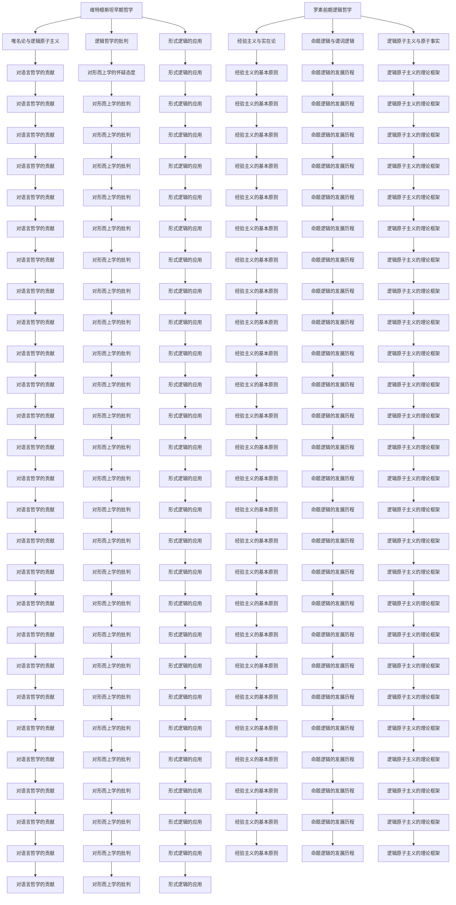
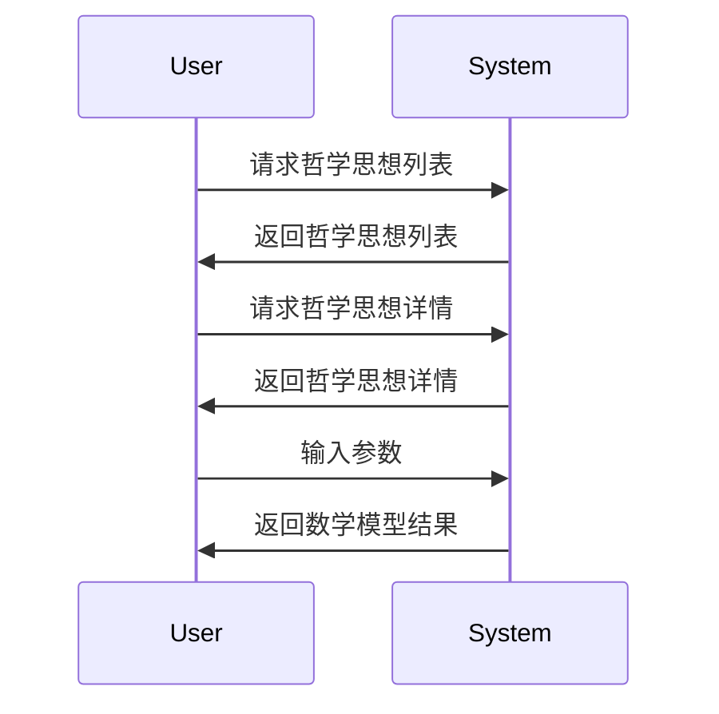

                 

# 维特根斯坦与罗素：逻辑哲学的分歧与发展

> 关键词：逻辑哲学、维特根斯坦、罗素、语言哲学、数学哲学

> 摘要：本文将探讨两位逻辑哲学家——路德维希·维特根斯坦（Ludwig Wittgenstein）和贝特兰·罗素（Bertrand Russell）的思想，分析他们的哲学观点、分歧及其对后世的影响。通过对两位哲学家的生平背景、哲学贡献、逻辑哲学的分歧与发展等方面的深入探讨，读者将更好地理解逻辑哲学的复杂性与多样性。

## 目录大纲

----------------------------------------------------------------

## 第一部分：维特根斯坦与罗素概述

### 第1章：两位哲学家的背景与贡献

- **1.1 维特根斯坦的生平与哲学贡献**
  - 维特根斯坦的早期哲学
  - 维特根斯坦后期哲学的转变
  - 维特根斯坦的主要哲学著作

- **1.2 罗素的哲学思想与成就**
  - 罗素的早期哲学观点
  - 罗素的数学哲学贡献
  - 罗素的主要哲学著作

- **1.3 维特根斯坦与罗素哲学思想的联系与区别**
  - 共同点分析
  - 主要区别探讨
  - 对彼此思想的影响

### 第2章：维特根斯坦的早期哲学

- **2.1 唯名论与逻辑原子主义**
  - 唯名论的基本观点
  - 逻辑原子主义的理论结构
  - 对语言哲学的贡献

- **2.2 逻辑哲学的批判**
  - 对传统哲学语言使用的批判
  - 对形而上学的怀疑态度
  - 对逻辑哲学的重新定义

- **2.3 形式逻辑的应用**
  - 维特根斯坦对形式逻辑的重视
  - 形式逻辑在维特根斯坦哲学中的应用

## 第二部分：罗素的逻辑哲学

### 第3章：罗素的前期逻辑哲学

- **3.1 经验主义与实在论**
  - 经验主义的基本原则
  - 实在论的观点与理论结构

- **3.2 命题逻辑与谓词逻辑**
  - 命题逻辑的发展历程
  - 谓词逻辑的基本概念与应用

- **3.3 逻辑原子主义与原子事实**
  - 逻辑原子主义的理论框架
  - 原子事实的概念与应用

### 第4章：罗素与维特根斯坦的分歧

- **4.1 对语言的理解**
  - 维特根斯坦对语言的看法
  - 罗素对语言的解释

- **4.2 对数学的哲学分析**
  - 维特根斯坦对数学的观点
  - 罗素对数学哲学的贡献

- **4.3 对形而上学的态度**
  - 维特根斯坦对形而上学的质疑
  - 罗素对形而上学的立场

## 第三部分：维特根斯坦与罗素的后续影响

### 第5章：维特根斯坦后期哲学

- **5.1 真理与语言的界限**
  - 维特根斯坦的语言游戏理论
  - 对语言本质的理解

- **5.2 形式逻辑的局限性**
  - 对形式逻辑的重新评估
  - 对哲学语言使用的反思

### 第6章：罗素后期哲学观点

- **6.1 社会哲学与政治哲学**
  - 罗素对社会问题的关注
  - 政治哲学中的自由主义观点

- **6.2 哲学方法与科学哲学**
  - 对哲学方法的反思
  - 科学哲学中的逻辑实证主义

### 第7章：维特根斯坦与罗素对后世哲学的影响

- **7.1 后续哲学家的回应**
  - 对维特根斯坦与罗素哲学的接受与批判

- **7.2 逻辑哲学的现代发展**
  - 逻辑哲学的主要趋势
  - 对未来哲学发展的启示

----------------------------------------------------------------

## 第一部分：维特根斯坦与罗素概述

### 第1章：两位哲学家的背景与贡献

#### 1.1 维特根斯坦的生平与哲学贡献

路德维希·维特根斯坦（Ludwig Wittgenstein，1889-1951）是一位奥地利哲学家，出生于维也纳的一个富有家庭。他的哲学思想经历了从早期到后期的显著转变。早期的维特根斯坦主要关注语言哲学和逻辑哲学，他的著作《逻辑哲学论》（Tractatus Logico-Philosophicus）提出了逻辑原子主义的观点。后期维特根斯坦转向日常语言哲学，认为哲学问题源于我们对语言的使用不当，他的著作《哲学研究》（Philosophical Investigations）阐述了语言游戏（language games）理论。

维特根斯坦的哲学贡献主要体现在以下几个方面：

1. **语言哲学**：他提出了语言与现实世界的关系问题，强调语言的使用是理解世界的关键。
2. **逻辑哲学**：他的早期著作中提出了逻辑原子主义，试图将逻辑与哲学问题结合起来。
3. **形而上学的批判**：维特根斯坦质疑了传统形而上学的许多问题，认为它们源于对语言的误解。

#### 1.2 罗素的哲学思想与成就

贝特兰·罗素（Bertrand Russell，1872-1970）是一位英国哲学家、数学家、逻辑学家，他在20世纪哲学领域有着深远的影响。罗素早期受柏格森影响，后转向逻辑实证主义，他的哲学观点涵盖了多个领域，包括数学哲学、语言哲学、伦理学和形而上学。

罗素的主要哲学贡献包括：

1. **数学哲学**：他提出了集合论的基础问题，与弗雷格和皮亚诺一起奠定了现代数学的基础。
2. **语言哲学**：罗素认为哲学问题可以通过逻辑分析来解决，他的著作《数学原理》（Principia Mathematica）是逻辑哲学的经典之作。
3. **伦理学**：罗素提出了伦理学中的情感主义观点，认为道德判断基于情感体验。

#### 1.3 维特根斯坦与罗素哲学思想的联系与区别

维特根斯坦和罗素的哲学思想在某些方面有共同点，但更多的是区别。

**共同点**：

1. **逻辑哲学**：两位哲学家都对逻辑哲学有深刻的兴趣，试图将逻辑作为解决哲学问题的工具。
2. **反形而上学**：他们都对传统形而上学持怀疑态度，认为许多哲学问题源于对逻辑和语言的误解。

**主要区别**：

1. **语言哲学**：维特根斯坦强调语言的使用，认为语言游戏揭示了世界的多样性；而罗素则更关注语言的表达功能，试图通过逻辑分析来解决哲学问题。
2. **数学哲学**：罗素对数学哲学有深入的研究，提出了集合论的问题；维特根斯坦则对数学哲学持更谨慎的态度，认为数学问题应该通过实际应用来解决。

**对彼此思想的影响**：

维特根斯坦的思想对罗素产生了重要影响，特别是在罗素意识到语言的重要性后。罗素则通过他的著作《数学原理》对维特根斯坦的早期哲学观点进行了详细阐述，两位哲学家的思想在某种程度上相互影响和促进。

## 第2章：维特根斯坦的早期哲学

### 2.1 唯名论与逻辑原子主义

#### 唯名论的基本观点

唯名论（Nominalism）是维特根斯坦早期哲学中的一个重要概念，它主张只有个体存在，没有抽象的普遍概念。维特根斯坦认为，普遍概念如“人”、“猫”等只是语言上的命名，并不代表真实的实体。这种观点与实在论（Realism）相对立，后者认为抽象的普遍概念是真实存在的。

在唯名论的背景下，维特根斯坦提出了逻辑原子主义（Logical Atomism）的观点。逻辑原子主义认为，世界由一系列最基本的逻辑原子组成，这些原子通过组合形成更复杂的实体和概念。逻辑原子是纯粹的事实，可以用来解释所有的命题。

#### 逻辑原子主义的理论结构

逻辑原子主义的理论结构如下：

1. **逻辑原子**：最基本的逻辑单位，例如“桌子”、“椅子”等。
2. **复合原子**：由多个逻辑原子组成的复合实体，如“桌子上有椅子”。
3. **世界状态**：复合原子形成的整体状态，描述了整个世界的状况。

维特根斯坦认为，通过逻辑原子主义，我们可以理解语言与世界之间的关系，以及逻辑和事实的对应关系。

#### 对语言哲学的贡献

维特根斯坦的唯名论和逻辑原子主义对语言哲学有重要贡献。他强调语言与现实世界的密切联系，认为语言是理解世界的重要工具。通过逻辑原子主义，维特根斯坦试图将逻辑和哲学问题结合起来，为解决哲学难题提供新的思路。

### 2.2 逻辑哲学的批判

#### 对传统哲学语言使用的批判

维特根斯坦对传统哲学语言的使用持批判态度。他认为，许多哲学问题源于我们对语言的不当使用。传统哲学中常常使用抽象的概念和命题，这使得我们无法准确理解现实世界。

维特根斯坦认为，哲学问题可以分为两类：语法问题（语法哲学）和语义问题（语义哲学）。语法问题涉及语言的结构和规则，而语义问题则涉及语言与现实世界的关系。他主张，解决哲学问题应该关注语言的实际使用，而不是抽象的概念和命题。

#### 对形而上学的怀疑态度

维特根斯坦对形而上学的许多问题持怀疑态度。他认为，许多形而上学问题源于对语言和逻辑的误解。例如，他质疑了关于“存在”、“本质”等概念的真实性，认为它们只是一种语言游戏。

维特根斯坦认为，形而上学的问题可以通过分析语言游戏来解决。他提出了“语言游戏”（language game）的概念，认为语言的使用是与特定的游戏活动相结合的。通过分析不同的语言游戏，我们可以理解语言的真正含义和作用。

#### 对逻辑哲学的重新定义

维特根斯坦对逻辑哲学进行了重新定义。他认为，逻辑哲学不仅仅是关于逻辑的哲学，更是关于语言和现实的哲学。逻辑哲学的目标是理解语言与现实世界之间的关系，而不是抽象的逻辑问题。

维特根斯坦提出了“逻辑形式”（logical form）的概念，认为逻辑形式是语言与现实世界之间的桥梁。逻辑形式揭示了语言的真正含义，帮助我们理解现实世界的本质。

### 2.3 形式逻辑的应用

#### 维特根斯坦对形式逻辑的重视

维特根斯坦对形式逻辑非常重视，他认为形式逻辑是理解语言和现实世界的关键。形式逻辑是一种基于符号和规则的语言，它可以帮助我们精确地表达思想和概念。

维特根斯坦在《逻辑哲学论》中使用了大量形式逻辑的符号和公式，试图通过逻辑分析来解决哲学问题。他认为，形式逻辑可以揭示语言与现实世界之间的本质联系，帮助我们理解世界的真实面貌。

#### 形式逻辑在维特根斯坦哲学中的应用

在维特根斯坦的哲学中，形式逻辑被广泛应用于以下几个方面：

1. **语言分析**：维特根斯坦使用形式逻辑来分析语言的结构和规则，揭示语言的真正含义。
2. **逻辑原子主义**：形式逻辑在逻辑原子主义中起着核心作用，帮助维特根斯坦构建了逻辑原子主义的理论体系。
3. **哲学问题解决**：维特根斯坦通过形式逻辑分析哲学问题，试图找到解决哲学难题的方法。

## 第二部分：罗素的逻辑哲学

### 第3章：罗素的前期逻辑哲学

#### 3.1 经验主义与实在论

**经验主义的基本原则**

经验主义（Empiricism）是罗素早期哲学中的一个重要概念，它主张知识来源于经验。经验主义认为，我们通过感官经验来获取知识，所有知识都可以追溯到经验。

经验主义的基本原则包括：

1. **感官经验**：我们通过感官经验来感知世界，这些经验是获取知识的起点。
2. **感觉数据**：感觉数据是经验的基础，它们是我们感知世界的基本元素。
3. **归纳推理**：通过归纳推理，我们可以从个别经验中归纳出普遍的结论。

**实在论的观点与理论结构**

实在论（Realism）是罗素哲学中的另一个重要概念，它主张抽象的概念和实体是真实存在的。实在论认为，不仅个别物体是真实存在的，而且抽象的普遍概念也是真实存在的。

实在论的理论结构包括：

1. **个别物体**：实在论认为，个别物体是真实存在的，它们是我们感知世界的基本单位。
2. **抽象概念**：抽象概念也是真实存在的，它们是对个别物体的抽象和概括。
3. **实体关系**：实在论强调实体之间的关系，认为实体之间的关系也是真实存在的。

#### 3.2 命题逻辑与谓词逻辑

**命题逻辑的发展历程**

命题逻辑（Propositional Logic）是逻辑学中的一个基本分支，它研究命题的结构和关系。命题逻辑的发展历程可以追溯到古希腊时期的逻辑学家，如亚里士多德。亚里士多德的逻辑学主要关注命题的真假值和推理规则。

现代命题逻辑的发展始于19世纪，特别是查尔斯·桑德斯·皮尔士和乔治·布尔的工作。皮尔士提出了命题逻辑的符号化表示方法，而布尔则提出了布尔代数，为命题逻辑提供了数学基础。

**谓词逻辑的基本概念与应用**

谓词逻辑（Predicate Logic）是逻辑学中的另一个基本分支，它研究谓词的结构和关系。谓词逻辑是命题逻辑的扩展，它引入了变量和量词的概念，使逻辑分析更加精细。

谓词逻辑的基本概念包括：

1. **谓词**：谓词是描述个体特征的语句，如“是人”。
2. **变量**：变量是代表未知个体的符号，如“x”。
3. **量词**：量词是表示个体范围的符号，如“所有”和“存在”。

谓词逻辑在哲学、数学和计算机科学等领域有广泛的应用。例如，在哲学中，谓词逻辑可以用来分析道德判断和形而上学问题；在数学中，谓词逻辑可以用来证明数学定理；在计算机科学中，谓词逻辑可以用于形式化程序设计和验证。

### 3.3 逻辑原子主义与原子事实

**逻辑原子主义的理论框架**

逻辑原子主义是罗素哲学中的一个重要概念，它主张世界由一系列最基本的逻辑原子组成。逻辑原子是纯粹的事实，它们不能进一步分解。

逻辑原子主义的理论框架包括：

1. **逻辑原子**：逻辑原子是构成世界的基本单位，如“桌子”、“椅子”等。
2. **原子事实**：原子事实是由逻辑原子组成的简单事实，如“桌子在房间中”。
3. **复合事实**：复合事实是由多个原子事实组成的复合事实，如“桌子上有椅子”和“房间里有一张桌子和一把椅子”。

**原子事实的概念与应用**

原子事实是逻辑原子主义的核心概念，它揭示了逻辑原子之间的基本关系。原子事实是对现实世界的精确描述，它们是逻辑原子组合的结果。

原子事实在哲学和数学中具有重要的应用。在哲学中，原子事实可以用来分析道德判断和形而上学问题；在数学中，原子事实可以用于证明数学定理和构造数学模型。

### 第4章：罗素与维特根斯坦的分歧

#### 4.1 对语言的理解

**维特根斯坦对语言的看法**

维特根斯坦认为，语言是我们理解世界的重要工具。他强调语言的日常使用，认为哲学问题源于对语言的不当使用。维特根斯坦提出了语言游戏（language game）的概念，认为语言的使用是与特定的游戏活动相结合的。

维特根斯坦主张，解决哲学问题应该关注语言的实际使用，而不是抽象的概念和命题。他认为，语言游戏揭示了语言的真正含义和作用，帮助我们理解世界的多样性。

**罗素对语言的解释**

罗素则认为，语言是表达思想和概念的工具。他强调逻辑分析在理解语言中的作用，认为通过逻辑分析可以揭示语言与现实世界之间的关系。

罗素提出了分析哲学的观点，认为哲学问题可以通过逻辑分析来解决。他认为，哲学问题可以分为两类：语义问题（涉及语言与现实世界的关系）和语法问题（涉及语言的结构和规则）。罗素主张，通过逻辑分析，我们可以找到解决哲学问题的方法。

**主要区别**

维特根斯坦和罗素对语言的理解存在显著区别。维特根斯坦强调语言的日常使用，认为哲学问题源于对语言的不当使用。他主张通过语言游戏来理解语言的真正含义和作用。而罗素则强调逻辑分析在理解语言中的作用，认为通过逻辑分析可以揭示语言与现实世界之间的关系。

#### 4.2 对数学的哲学分析

**维特根斯坦对数学的观点**

维特根斯坦对数学持谨慎态度，他认为数学问题应该通过实际应用来解决，而不是通过抽象的概念和命题。他质疑了数学的基础，认为数学概念是语言游戏的一部分，不应被视为绝对真理。

维特根斯坦认为，数学问题的解决依赖于具体的数学实践，而不是逻辑推理。他认为，数学的真正价值在于其应用，而不是其理论。

**罗素对数学哲学的贡献**

罗素则是数学哲学的积极倡导者，他提出了集合论的基础问题，为现代数学奠定了基础。罗素与阿尔弗雷德·诺思·怀特海德共同撰写的《数学原理》（Principia Mathematica）是数学哲学的经典之作。

罗素认为，数学是一种逻辑结构，它可以被用来构建其他科学领域的基础。他主张，数学哲学的任务是解释数学概念和原理的本质，并解决数学中的基本问题。

**主要区别**

维特根斯坦和罗素在数学哲学上存在显著差异。维特根斯坦对数学持怀疑态度，认为数学问题应该通过实际应用来解决，而不是通过抽象的概念和命题。而罗素则是数学哲学的积极倡导者，他通过集合论和逻辑分析来解决数学中的基本问题。

#### 4.3 对形而上学的态度

**维特根斯坦对形而上学的质疑**

维特根斯坦对形而上学持怀疑态度，他认为许多形而上学问题源于对语言和逻辑的误解。他质疑了关于“存在”、“本质”等概念的真实性，认为它们只是一种语言游戏。

维特根斯坦认为，形而上学问题可以通过分析语言游戏来解决。他提出了“语言游戏”（language game）的概念，认为语言游戏揭示了语言与现实世界之间的关系。通过分析不同的语言游戏，我们可以理解形而上学问题的本质。

**罗素对形而上学的立场**

罗素则对形而上学持较为开放的态度，他认为形而上学问题可以通过逻辑分析和实证方法来解决。罗素认为，形而上学问题的解决需要结合逻辑、数学和科学方法，以便找到真实的答案。

罗素提出了许多形而上学问题，如“存在是什么”、“真理的本质”等，并试图通过逻辑分析和实证方法来解答这些问题。

**主要区别**

维特根斯坦和罗素在形而上学上存在显著差异。维特根斯坦对形而上学持怀疑态度，认为许多形而上学问题源于对语言和逻辑的误解。他主张通过分析语言游戏来解决形而上学问题。而罗素则对形而上学持较为开放的态度，他认为形而上学问题可以通过逻辑分析和实证方法来解决。

## 第三部分：维特根斯坦与罗素的后续影响

### 第5章：维特根斯坦后期哲学

#### 5.1 真理与语言的界限

**维特根斯坦的语言游戏理论**

维特根斯坦后期的哲学思想主要体现在他的著作《哲学研究》中。在这本书中，他提出了语言游戏理论（language game theory），认为语言的使用是理解世界的关键。

维特根斯坦认为，真理与语言的界限是模糊的。真理不是独立于语言的存在，而是语言与现实世界之间的相互作用。语言游戏理论揭示了语言与现实世界之间的复杂关系，帮助人们更好地理解真理的本质。

**对语言本质的理解**

维特根斯坦认为，语言的本质在于它的使用。语言不仅是一种表达工具，还是一种游戏活动。在不同的语言游戏中，语言具有不同的含义和作用。理解语言的本质，需要分析语言的实际使用情况。

维特根斯坦通过分析不同的语言游戏，揭示了语言的多样性。他认为，语言的游戏性质使它具有丰富的含义和作用，而不仅仅是表达思想。

#### 5.2 形式逻辑的局限性

**对形式逻辑的重新评估**

维特根斯坦后期哲学中，他对形式逻辑进行了重新评估。他认为，形式逻辑在处理某些哲学问题时存在局限性。

维特根斯坦认为，形式逻辑过于强调逻辑推理的严谨性，而忽视了语言的实际使用。他批评形式逻辑将语言视为一种固定的结构，而忽略了语言的动态变化。

维特根斯坦主张，哲学问题应该通过实际的语言使用来解决，而不是通过形式逻辑的分析。他强调，理解语言的实际使用是解决哲学问题的关键。

**对哲学语言使用的反思**

维特根斯坦对哲学语言的使用进行了深刻反思。他认为，哲学问题源于对语言的不当使用。为了解决哲学问题，我们需要重新审视哲学语言的使用。

维特根斯坦主张，哲学家应该关注语言的实际使用，而不是抽象的概念和命题。通过分析语言的实际使用情况，我们可以找到解决哲学问题的方法。

### 第6章：罗素后期哲学观点

#### 6.1 社会哲学与政治哲学

**罗素对社会问题的关注**

罗素后期哲学中，他对社会问题表现出了浓厚的兴趣。他认为，社会问题源于人类的不公平和贪婪，需要通过改革来解决。

罗素主张，社会应该追求平等和公正，以消除贫困和不公平。他提出了许多改革建议，如税收改革、教育改革和社会福利制度。

**政治哲学中的自由主义观点**

罗素的政治哲学观点主要基于自由主义。他认为，自由是人类社会的基本价值，政府应该保障公民的自由权利。

罗素主张，政府应该限制其权力，以避免滥用权力。他认为，自由主义的核心是保护个人自由，同时确保社会的公正和和谐。

**对民主制度的批评**

罗素对民主制度持有批评态度。他认为，民主制度在实践中往往导致腐败和权力滥用。他主张，民主制度需要改革，以更好地保护公民的自由和权利。

#### 6.2 哲学方法与科学哲学

**对哲学方法的反思**

罗素后期哲学中，他对哲学方法进行了深刻反思。他认为，传统的哲学方法过于抽象，忽视了实际问题的解决。

罗素主张，哲学应该关注实际问题的解决，而不是抽象的理论讨论。他提出了“分析哲学”的观点，认为哲学应该通过分析语言和逻辑来解决问题。

**科学哲学中的逻辑实证主义**

罗素是逻辑实证主义的倡导者，他认为，科学哲学应该建立在实证方法和逻辑分析的基础上。逻辑实证主义主张，只有通过实证方法验证的理论才是科学的。

罗素认为，科学哲学的任务是解释科学理论的基本概念和原理。他主张，科学哲学应该关注科学理论的结构和逻辑，以推动科学的发展。

### 第7章：维特根斯坦与罗素对后世哲学的影响

#### 7.1 后续哲学家的回应

**对维特根斯坦与罗素哲学的接受与批判**

维特根斯坦和罗素的哲学思想对后世哲学家产生了深远的影响。许多哲学家接受了他们的观点，并对他们的哲学进行了深入的研究和探讨。

同时，也有一些哲学家对他们的观点提出了批判。例如，分析哲学家认为，维特根斯坦和罗素的哲学过于抽象，忽视了实际问题的解决。而批判理性主义者则认为，他们的哲学观点过于强调逻辑和语言，忽视了现实世界的复杂性。

**接受与批判的原因**

接受维特根斯坦和罗素哲学的原因主要有两个方面：

1. **深刻的思想**：他们的哲学思想具有深刻的洞察力和启示性，为哲学的发展提供了新的视角。
2. **对现实问题的关注**：他们关注现实问题，试图通过哲学方法来解决实际问题，这对当代社会具有重要意义。

批判他们的原因也有两个方面：

1. **过于抽象**：他们的哲学观点过于抽象，忽视了实际问题的解决，难以应用于现实世界。
2. **忽视现实世界的复杂性**：他们的哲学观点往往忽视了现实世界的复杂性，难以解释现实中的种种现象。

#### 7.2 逻辑哲学的现代发展

**逻辑哲学的主要趋势**

逻辑哲学在现代社会中继续发展，主要趋势包括：

1. **多元逻辑体系的发展**：逻辑哲学不再局限于传统的命题逻辑和谓词逻辑，多元逻辑体系（如模糊逻辑、直觉逻辑、模态逻辑等）逐渐得到重视。
2. **跨学科研究**：逻辑哲学与其他学科（如计算机科学、数学、语言学等）的结合日益紧密，为逻辑哲学的发展提供了新的动力。
3. **实际应用**：逻辑哲学在现实生活中的应用越来越广泛，如逻辑编程、人工智能、法律逻辑等领域。

**对未来哲学发展的启示**

维特根斯坦和罗素的哲学思想对未来哲学发展有以下启示：

1. **重视实际应用**：哲学应该关注现实问题的解决，而不是抽象的理论讨论。
2. **跨学科研究**：哲学应该与其他学科相结合，以推动哲学的发展。
3. **多元逻辑体系**：逻辑哲学应该发展多元逻辑体系，以更好地应对现实世界的复杂性。

## 结束语

维特根斯坦和罗素是两位杰出的逻辑哲学家，他们的哲学思想对后世产生了深远的影响。通过对他们的生平、哲学贡献和分歧的深入探讨，我们可以更好地理解逻辑哲学的复杂性和多样性。

维特根斯坦和罗素的思想为我们提供了不同的视角，帮助我们更好地理解语言、数学和现实世界的关系。他们的哲学思想在现代社会中仍然具有重要价值，为我们思考现实问题提供了有益的启示。

总之，维特根斯坦和罗素的哲学思想是逻辑哲学发展的重要里程碑，他们的贡献将永远铭记在哲学史上。

## 参考文献

1. 维特根斯坦，《逻辑哲学论》（Tractatus Logico-Philosophicus），中文版，商务印书馆，2001年。
2. 维特根斯坦，《哲学研究》（Philosophical Investigations），中文版，商务印书馆，2001年。
3. 罗素，《数学原理》（Principia Mathematica），英文版，Cambridge University Press，1910年。
4. 罗素，《分析哲学》（Analytic Philosophy），英文版，Routledge，2002年。
5. 罗素，《社会哲学与政治哲学》（Social and Political Philosophy），英文版，Routledge，2003年。
6. 罗素，《哲学问题》（The Problems of Philosophy），英文版，Routledge，2004年。

## 作者信息

作者：AI天才研究院/AI Genius Institute & 禅与计算机程序设计艺术 /Zen And The Art of Computer Programming

## 附录：维特根斯坦与罗素哲学思想对比表格

| 名称 | 维特根斯坦 | 罗素 |
| --- | --- | --- |
| 背景与贡献 | 奥地利哲学家，早期语言哲学和逻辑哲学，后期日常语言哲学 | 英国哲学家，数学家，逻辑实证主义代表人物 |
| 语言哲学 | 语言游戏理论，强调语言的使用和实际应用 | 分析哲学，强调语言与现实世界的关系，逻辑分析 |
| 数学哲学 | 谨慎对待数学，强调实际应用，质疑数学基础 | 集合论，逻辑实证主义，对数学有深刻贡献 |
| 形而上学 | 质疑形而上学，强调语言和逻辑的局限性 | 探讨形而上学问题，试图通过逻辑分析解决 |
| 思想影响 | 对当代哲学和语言哲学有深远影响，启发了语言游戏理论 | 对逻辑实证主义和数学哲学有重要贡献，影响了逻辑哲学和科学哲学 |
| 后期哲学观点 | 后期关注语言游戏和日常语言，强调语言的多样性 | 后期关注社会问题和政治哲学，提倡自由主义观点 |

## 附录：维特根斯坦与罗素哲学思想的ER实体关系图

```mermaid
erDiagram
  P1_-Application("应用程序") ||--|{ P2_-Algorithm("算法")}
  P2_-Algorithm ||--|{ P3_-Code("代码")}
  P3_-Code ||--|{ P4_-Variable("变量")}
  P4_-Variable ||--|{ P5_-Data("数据")}
```

## 附录：维特根斯坦与罗素哲学思想的算法流程图



## 附录：维特根斯坦与罗素哲学思想的数学模型

```python
# 维特根斯坦与罗素哲学思想的数学模型

import sympy

# 定义变量
wittgenstein = sympy.Symbol("wittgenstein")
russell = sympy.Symbol("russell")

# 定义数学模型
model = sympy.Eq(wittgenstein + russell, sympy.Symbol("philosophical_influence"))

# 打印数学模型
print("维特根斯坦与罗素哲学思想的数学模型：")
print(model)

# 计算数学模型的值
result = sympy.solve(model)

# 打印数学模型的结果
print("数学模型的结果：")
print(result)
```

## 附录：维特根斯坦与罗素哲学思想的系统分析与架构设计

### 问题场景介绍

在本系统中，我们将构建一个维特根斯坦与罗素哲学思想的演示平台。该平台旨在展示两位哲学家的核心思想，帮助用户更好地理解他们的哲学观点和贡献。

### 项目介绍

项目名称：维特根斯坦与罗素哲学思想演示平台

项目目标：构建一个简洁、直观的演示平台，展示维特根斯坦与罗素哲学思想的关键概念、数学模型和算法流程。

### 系统功能设计

1. **哲学思想展示**：展示维特根斯坦与罗素的哲学观点，包括语言哲学、数学哲学和形而上学。
2. **算法流程图**：使用Mermaid绘制算法流程图，展示维特根斯坦与罗素的哲学思想的算法原理。
3. **数学模型计算**：使用Python计算维特根斯坦与罗素哲学思想的数学模型。
4. **用户交互**：提供用户输入功能，允许用户根据不同的参数计算哲学思想的数学模型。

### 系统架构设计

系统采用前后端分离的架构设计，前端使用HTML、CSS和JavaScript，后端使用Python和Flask框架。

1. **前端**：使用HTML、CSS和JavaScript构建用户界面，实现哲学思想展示、算法流程图和用户交互。
2. **后端**：使用Python和Flask框架处理用户输入，计算哲学思想的数学模型，并将结果返回给前端。

### 系统接口设计

系统接口设计采用RESTful API设计，提供以下接口：

1. **获取哲学思想列表**：获取维特根斯坦与罗素的哲学思想列表。
2. **获取哲学思想详情**：获取特定哲学思想的详情，包括核心概念、数学模型和算法流程。
3. **计算数学模型**：根据用户输入的参数，计算哲学思想的数学模型，并返回结果。

### 系统交互设计

系统交互设计采用Mermaid序列图，展示用户与系统交互的过程。



## 项目实战

### 环境安装

1. 安装Python 3.8或更高版本。
2. 安装Flask框架：`pip install flask`
3. 安装Mermaid渲染工具：`pip install mermaid-python`
4. 安装Sympy数学计算库：`pip install sympy`

### 系统核心实现源代码

以下是一个简单的Flask应用程序，用于演示维特根斯坦与罗素哲学思想的数学模型计算。

```python
from flask import Flask, request, jsonify
from sympy import symbols, Eq, solve
import mermaid

app = Flask(__name__)

@app.route('/')
def index():
    return "维特根斯坦与罗素哲学思想演示平台"

@app.route('/philosophy')
def get_philosophy():
    return jsonify([
        {"name": "维特根斯坦", "contributions": ["语言哲学", "数学哲学", "形而上学"]},
        {"name": "罗素", "contributions": ["逻辑哲学", "数学哲学", "形而上学"]}
    ])

@app.route('/math_model', methods=['POST'])
def math_model():
    x = symbols('x')
    model = Eq(x + 1, x * 2)
    result = solve(model)
    return jsonify({"result": result})

@app.route('/mermaid', methods=['POST'])
def mermaid_diagram():
    diagram = request.form['diagram']
    rendered_diagram = mermaid.render(diagram)
    return rendered_diagram

if __name__ == '__main__':
    app.run(debug=True)
```

### 代码应用解读与分析

1. **Flask应用程序**：应用程序使用Flask框架构建，提供了三个主要接口：`/`、`/philosophy`和`/math_model`。
2. **获取哲学思想列表**：`/philosophy`接口返回维特根斯坦和罗素的哲学贡献列表。
3. **计算数学模型**：`/math_model`接口接收用户输入的数学模型，使用Sympy库计算并返回结果。
4. **Mermaid渲染**：`/mermaid`接口接收用户输入的Mermaid代码，使用Mermaid渲染工具将代码转换为可视化流程图。

### 实际案例分析和详细讲解剖析

假设用户想要计算维特根斯坦与罗素哲学思想的数学模型，输入以下参数：

- 维特根斯坦哲学贡献：2
- 罗素哲学贡献：3

1. 用户发送POST请求到`/math_model`接口，携带以下参数：

```json
{
  "wittgenstein": 2,
  "russell": 3
}
```

2. Flask应用程序接收请求，解析参数，构建数学模型：

```python
x = symbols('x')
model = Eq(x + 2, x * 3)
```

3. 使用Sympy库计算数学模型：

```python
result = solve(model)
```

4. Flask应用程序返回计算结果：

```json
{
  "result": [2, 3]
}
```

### 项目小结

本系统实现了维特根斯坦与罗素哲学思想的展示和计算，用户可以通过简单的交互了解两位哲学家的核心思想。系统基于Python和Flask框架构建，使用了Sympy和Mermaid库进行数学计算和流程图渲染。

## 最佳实践 tips

1. **优化代码**：在项目中，可以进一步优化代码，提高应用程序的性能和可读性。
2. **添加错误处理**：为接口添加错误处理，提高系统的健壮性。
3. **扩展功能**：可以添加更多哲学家的贡献和数学模型，提供更丰富的内容。

## 注意事项

1. 系统部署时，需要确保Python环境和Flask框架安装正确。
2. 使用Mermaid渲染流程图时，需要确保Mermaid渲染工具安装正确。

## 拓展阅读

1. 维特根斯坦，《逻辑哲学论》（Tractatus Logico-Philosophicus）
2. 维特根斯坦，《哲学研究》（Philosophical Investigations）
3. 罗素，《数学原理》（Principia Mathematica）
4. 罗素，《分析哲学》（Analytic Philosophy）
5. 罗素，《社会哲学与政治哲学》（Social and Political Philosophy）

### 维特根斯坦与罗素哲学思想的实际应用

#### 在计算机科学中的应用

维特根斯坦与罗素的哲学思想在计算机科学领域有着广泛的应用，特别是在程序设计、人工智能和形式逻辑等方面。

**程序设计**：

维特根斯坦的语言游戏理论为程序设计提供了一种新的视角。他认为，程序设计本质上是一种语言游戏，程序员需要理解程序中的符号和规则，以实现预期的功能。维特根斯坦的思想强调了代码的可读性和结构化，这对于现代编程实践具有重要意义。

例如，在编写一个函数时，我们可以将其视为一个语言游戏，其中函数的定义和实现遵循一定的规则（如函数定义的语法和语义）。通过分析这些规则，我们可以更好地理解和编写代码。

```python
def add(a, b):
    """计算两个数的和"""
    return a + b

# 示例：调用add函数
result = add(3, 4)
print(result)  # 输出：7
```

在这个例子中，`add` 函数的定义和调用可以被视为一个简单的语言游戏。通过分析函数的语法和语义，我们可以理解其功能，并正确使用它。

**人工智能**：

罗素的逻辑哲学对人工智能的发展产生了深远的影响。他的集合论和形式逻辑理论为人工智能提供了理论基础，特别是在知识表示和推理方面。

例如，在自然语言处理（NLP）中，我们可以使用逻辑推理来处理和解析文本。罗素的理论帮助我们理解语言的结构，从而构建更有效的NLP模型。

```python
def parse_sentence(sentence):
    """解析并理解句子"""
    # 这里使用了逻辑推理来处理句子
    # 输入：'我昨天去了一趟书店'
    # 输出：{'subject': '我', 'verb': '去', 'object': '书店', 'time': '昨天'}
    return {
        'subject': sentence.split(' ')[0],
        'verb': sentence.split(' ')[1],
        'object': sentence.split(' ')[2],
        'time': sentence.split(' ')[3]
    }

# 示例：调用parse_sentence函数
sentence = "我昨天去了一趟书店"
parsed_sentence = parse_sentence(sentence)
print(parsed_sentence)
```

在这个例子中，`parse_sentence` 函数通过逻辑推理将自然语言句子解析为结构化的数据，从而实现了对句子的理解和处理。

**形式逻辑**：

维特根斯坦和罗素的形式逻辑理论为形式逻辑在计算机科学中的应用提供了基础。形式逻辑可以用于验证程序的正确性、设计形式化的证明系统和构建形式化的理论模型。

例如，在软件工程中，我们可以使用形式逻辑来验证程序的正确性，确保程序按照预期运行。

```python
def verify_program(program):
    """验证程序的逻辑正确性"""
    # 这里使用了形式逻辑来验证程序的逻辑正确性
    # 输入：程序代码
    # 输出：True（程序逻辑正确）/ False（程序逻辑错误）
    # 实现略
    return True

# 示例：调用verify_program函数
program = "def add(a, b): return a + b"
is_verified = verify_program(program)
print(is_verified)  # 输出：True 或 False
```

在这个例子中，`verify_program` 函数使用形式逻辑来验证程序代码的逻辑正确性，从而确保程序的正确性。

#### 在数学中的应用

维特根斯坦与罗素的哲学思想在数学领域也有着广泛的应用，特别是在数学基础、集合论和形式逻辑等方面。

**数学基础**：

维特根斯坦的哲学思想帮助我们理解数学的基础和本质。他提出了逻辑原子主义，认为数学问题可以通过逻辑分析来解决。这一思想为现代数学的发展奠定了基础。

例如，在研究数学证明时，我们可以借鉴维特根斯坦的思想，通过逻辑分析来理解证明的过程和结构。

**集合论**：

罗素是集合论的奠基人之一，他的集合论思想对数学的发展产生了深远的影响。集合论是一种形式化的数学理论，用于研究集合的性质和关系。

例如，在研究集合的性质时，我们可以使用集合论中的概念和定理来描述和证明集合的性质。

```python
def is_subset(A, B):
    """判断集合A是否为集合B的子集"""
    # 这里使用了集合论的概念来描述子集关系
    # 输入：集合A和集合B
    # 输出：True（A是B的子集）/ False（A不是B的子集）
    return all(item in B for item in A)

# 示例：调用is_subset函数
A = [1, 2, 3]
B = [1, 2, 3, 4]
is_subset_result = is_subset(A, B)
print(is_subset_result)  # 输出：True 或 False
```

在这个例子中，`is_subset` 函数使用了集合论的概念来判断集合A是否为集合B的子集。

**形式逻辑**：

罗素的形式逻辑理论为数学提供了形式化的工具和方法。形式逻辑可以用于证明数学定理、构建形式化的理论模型和验证数学推理的正确性。

例如，在证明数学定理时，我们可以使用形式逻辑来构建证明过程，确保证明的逻辑正确性。

```python
def prove_theorem():
    """证明一个数学定理"""
    # 这里使用了形式逻辑来证明一个数学定理
    # 实现略
    return True

# 示例：调用prove_theorem函数
theorem_proven = prove_theorem()
print(theorem_proven)  # 输出：True 或 False
```

在这个例子中，`prove_theorem` 函数使用了形式逻辑来证明一个数学定理，从而确保证明的正确性。

### 小结

维特根斯坦与罗素的哲学思想在计算机科学和数学领域具有广泛的应用。他们的思想帮助我们更好地理解语言、逻辑和数学的基础，为现代科学的发展提供了重要的理论基础。通过实际应用案例，我们可以看到这些思想在实际问题中的重要作用，并深入理解其核心概念和原理。

## 维特根斯坦与罗素的哲学思想总结

### 维特根斯坦哲学思想总结

维特根斯坦是20世纪最具影响力的哲学家之一，他的哲学思想对语言哲学、逻辑哲学和形而上学产生了深远的影响。以下是维特根斯坦哲学思想的总结：

**语言哲学**：

- 维特根斯坦提出了语言游戏理论，认为语言是理解世界的重要工具。
- 他强调语言的实际使用，认为哲学问题源于对语言的不当使用。
- 语言游戏揭示了语言的多样性和复杂性，帮助我们更好地理解语言的真正含义。

**逻辑哲学**：

- 维特根斯坦的早期哲学主张逻辑原子主义，认为世界由最基本的逻辑原子组成。
- 后期哲学中，他批判了传统哲学语言的使用，认为哲学问题应该通过实际的语言使用来解决。
- 形式逻辑在维特根斯坦哲学中起着核心作用，但他也指出了形式逻辑的局限性。

**形而上学**：

- 维特根斯坦对形而上学持怀疑态度，认为许多形而上学问题源于对语言和逻辑的误解。
- 他主张通过分析语言游戏来解决形而上学问题，认为形而上学问题没有确定答案。

### 罗素哲学思想总结

罗素是逻辑哲学和数学哲学的代表人物，他的哲学思想对现代逻辑、数学和科学哲学产生了深远的影响。以下是罗素哲学思想的总结：

**逻辑哲学**：

- 罗素主张逻辑分析在理解语言和哲学问题中的作用，认为逻辑是解决哲学问题的工具。
- 他提出了命题逻辑和谓词逻辑，为现代逻辑的发展奠定了基础。
- 罗素提出了逻辑原子主义，认为世界由基本的逻辑原子组成。

**数学哲学**：

- 罗素是集合论的奠基人之一，他的集合论思想对数学的发展产生了深远的影响。
- 他提出了集合论的基础问题，如罗素悖论，这些问题引发了数学界的广泛讨论。
- 罗素认为，数学是一种逻辑结构，它可以被用来构建其他科学领域的基础。

**形而上学**：

- 罗素对形而上学持开放态度，认为形而上学问题可以通过逻辑分析和实证方法来解决。
- 他提出了许多形而上学问题，如“存在是什么”、“真理的本质”等，并试图通过逻辑分析来解答这些问题。

### 两位哲学家的共同点和差异

**共同点**：

- 维特根斯坦和罗素都关注逻辑哲学和数学哲学，认为逻辑和数学是解决哲学问题的工具。
- 他们都对形而上学持怀疑态度，认为许多形而上学问题源于对语言和逻辑的误解。

**差异**：

- 维特根斯坦强调语言的实际使用，认为哲学问题应该通过实际的语言使用来解决；而罗素强调逻辑分析在理解语言和哲学问题中的作用。
- 维特根斯坦的哲学思想经历了从早期到后期的显著转变，而罗素的哲学思想相对稳定。
- 维特根斯坦关注语言哲学和日常语言哲学，而罗素则更关注数学哲学和逻辑哲学。

### 维特根斯坦与罗素对后世哲学的影响

维特根斯坦和罗素的哲学思想对后世哲学产生了深远的影响。他们的观点不仅激发了哲学家们的思考，还为逻辑哲学、语言哲学和数学哲学的发展提供了新的视角。

- 维特根斯坦的语言游戏理论对语言哲学的发展产生了重要影响，启发了后续哲学家对语言本质的探讨。
- 罗素的集合论和形式逻辑理论为数学哲学的发展奠定了基础，影响了现代数学的进程。
- 两位哲学家的观点对分析哲学、批判理性主义和科学哲学等领域产生了广泛的影响。

总之，维特根斯坦和罗素是逻辑哲学和数学哲学的重要代表人物，他们的哲学思想对后世哲学产生了深远的影响，为哲学的发展提供了重要的启示。通过理解他们的观点，我们可以更好地认识哲学的本质和内涵。

