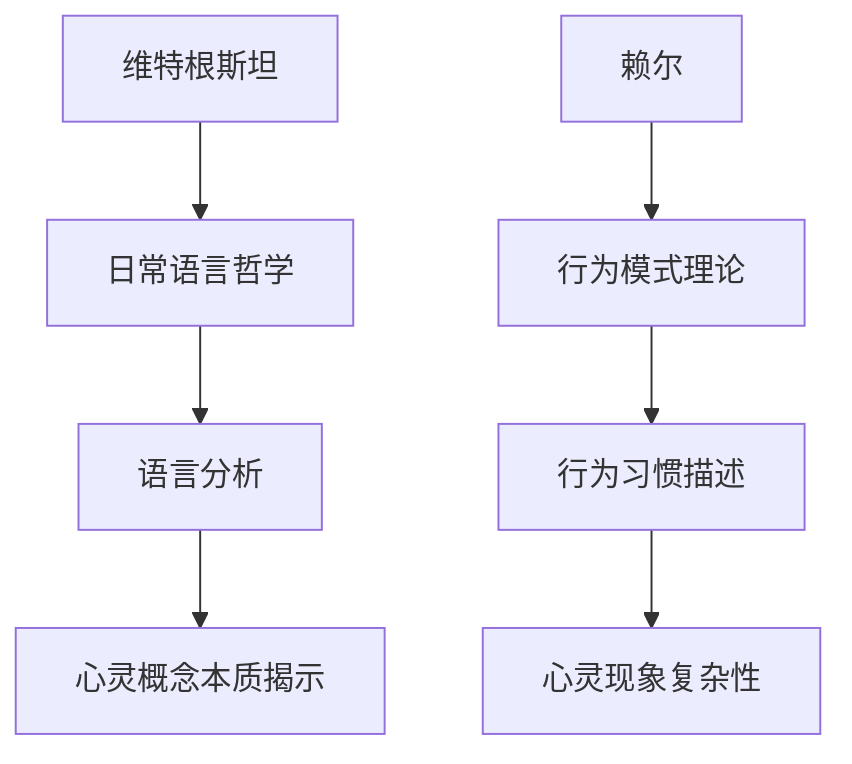

                 

### 《维特根斯坦与赖尔：心灵概念的语言分析》

#### 关键词：维特根斯坦、赖尔、心灵概念、语言分析、哲学、人工智能

#### 摘要：
本文旨在深入探讨维特根斯坦与赖尔在心灵概念的语言分析方面的观点及其对现代哲学和人工智能的影响。通过对两位哲学家的思想进行详细分析，本文将揭示心灵概念在不同哲学流派中的复杂性和多样性，并探讨其在语言哲学、社会生活和人工智能领域的应用。本文结构清晰，逻辑严谨，旨在为广大哲学和人工智能爱好者提供一次深刻的思考之旅。

**目录大纲：**

1. **第一部分：引言与背景介绍**
    - **第一章：维特根斯坦与赖尔：心灵概念的历史与哲学背景**
    - **第二章：心灵概念的语言分析基础**

2. **第二部分：维特根斯坦的理论与批判**
    - **第三章：维特根斯坦的心灵概念分析**
    - **第四章：赖尔对维特根斯坦的理论批判**
    - **第五章：维特根斯坦与赖尔的对话与争议**

3. **第三部分：心灵概念的语言分析应用**
    - **第六章：心灵概念在语言哲学中的应用**
    - **第七章：心灵概念在社会生活中的作用**
    - **第八章：心灵概念的未来与发展**

4. **第四部分：总结与展望**
    - **第九章：维特根斯坦与赖尔的心灵概念语言分析：回顾与展望**

**引言**

心灵概念一直是哲学和心理学研究中的重要课题。从古希腊哲学家亚里士多德到现代哲学家维特根斯坦和赖尔，心灵概念在不同哲学流派中得到了广泛的探讨和深入的分析。心灵概念涉及人类的感知、思考、情感和意识等复杂现象，因此对其进行语言分析具有重要的理论和实践意义。

维特根斯坦和赖尔是20世纪最具影响力的哲学家之一，他们在心灵概念的语言分析方面提出了许多重要观点。维特根斯坦强调语言与世界的直接联系，认为心灵概念的本质可以通过对日常语言的仔细分析来揭示。赖尔则对维特根斯坦的理论进行了批判，并提出了一种更加精细和复杂的心灵概念模型。

本文将首先介绍维特根斯坦和赖尔的哲学背景及其对心灵概念的研究。接着，我们将详细探讨维特根斯坦的理论，包括他对心灵概念的定义、命题和意义的分析，以及他对心灵概念的实例分析。然后，我们将讨论赖尔对维特根斯坦理论的批判，以及他对心灵概念的分析方法。在第三部分，我们将探讨心灵概念在语言哲学、社会生活和人工智能领域的应用。最后，本文将总结维特根斯坦和赖尔的理论，并对其在心灵概念语言分析方面的贡献进行展望。

### 第一部分：引言与背景介绍

#### 第一章：维特根斯坦与赖尔：心灵概念的历史与哲学背景

1. **维特根斯坦的哲学思想**

路德维希·维特根斯坦（Ludwig Wittgenstein，1889-1951）是20世纪最杰出的哲学家之一，他的思想对西方哲学产生了深远的影响。维特根斯坦的哲学思想主要分为两个阶段，即早期的“逻辑原子主义”和晚期的“日常语言哲学”。

在早期，维特根斯坦提出了逻辑原子主义的理论，认为世界是由不可再分的逻辑原子构成的，这些原子通过逻辑关系组合成意义。他强调语言与世界的直接联系，认为语言是思维的表达，思维是语言的运用。这种观点在《逻辑哲学论》（Tractatus Logico-Philosophicus）中得到了充分的体现。

然而，在晚期，维特根斯坦转向日常语言哲学，他开始关注日常生活中的语言使用。他认为哲学的任务不是去解释世界的本质，而是去澄清语言的使用。维特根斯坦主张通过对日常语言的仔细分析来揭示语言的真相，从而解决哲学上的各种难题。这种观点在《哲学研究》（Philosophical Investigations）中得到了详细的阐述。

2. **赖尔的哲学贡献**

吉尔伯特·赖尔（Gilbert Ryle，1900-1976）是20世纪另一位重要的哲学家，他的思想对心灵哲学、语言哲学和认知科学产生了深远的影响。赖尔的主要贡献在于对心理学的批评和对心灵概念的重新定义。

赖尔对传统心理学进行了深刻的批判，他认为传统心理学将心灵视为一种独立的实体，这种观点是错误的。赖尔提出了“行为主义”的观点，主张将心灵视为一系列行为和习惯的集合，而不是一个独立的实体。他认为心灵概念应该被理解为“过程”或“过程模式”，而不是“物质实体”。

赖尔在《心灵的概念》（The Concept of Mind）中详细阐述了他的观点。他认为，心灵概念是一种复杂的模式，包括感知、记忆、思考、情感等过程。这些过程可以通过行为和习惯来描述，而不是通过某种独立的物质实体。

3. **心灵概念的语言分析的重要性**

心灵概念的语言分析是哲学研究中的重要领域，它涉及到语言哲学、心灵哲学和认知科学等多个学科。维特根斯坦和赖尔在这一领域做出了重要贡献。

维特根斯坦认为，语言是思维的表达，思维是语言的运用。通过对日常语言的仔细分析，我们可以揭示心灵概念的本质。他主张，哲学的任务不是去解释世界的本质，而是去澄清语言的使用。因此，心灵概念的语言分析是哲学研究的基础。

赖尔则通过批评传统心理学，提出了对心灵概念的新理解。他认为，心灵概念是一种过程模式，可以通过行为和习惯来描述。这种观点对心理学和认知科学的发展产生了重要影响。

心灵概念的语言分析在哲学研究中具有重要意义。首先，它帮助我们理解心灵的本质，澄清了哲学上的许多难题。其次，它为心理学和认知科学提供了新的理论框架，推动了这些学科的发展。

#### 第二章：心灵概念的语言分析基础

1. **语言哲学与心灵哲学的交叉点**

语言哲学和心灵哲学是哲学研究中的两个重要领域，它们在很多方面有着密切的联系。

语言哲学关注语言的本质和作用，探讨语言与现实的关系、语言的含义和逻辑结构等。心灵哲学则关注心灵的本质和功能，探讨意识、感知、情感和思维等问题。

语言哲学和心灵哲学的交叉点在于它们都涉及到心灵概念的分析。心灵概念是语言哲学和心灵哲学共同的研究对象，它们都需要对心灵概念进行深入的探讨和批判。

2. **语言分析的方法论**

语言分析的方法论主要包括以下几个方面：

（1）**语言使用分析**：语言使用分析是语言哲学研究的基础。通过分析日常语言的使用，我们可以揭示语言的本质和功能。维特根斯坦的日常语言哲学就强调了对语言使用的分析。

（2）**语义分析**：语义分析是语言哲学中的一个重要方法，它探讨词语的含义和句子之间的逻辑关系。通过语义分析，我们可以理解语言的意义和逻辑结构。

（3）**语用分析**：语用分析关注语言在实际语境中的使用，探讨语言交流中的意图和效果。语用分析有助于我们理解语言的社会功能和实际应用。

（4）**逻辑分析**：逻辑分析是语言哲学和心灵哲学中的重要方法，它探讨逻辑结构、命题的真假和推理的有效性。逻辑分析有助于我们理解心灵概念的本质和逻辑关系。

3. **心灵概念的基本属性和特征**

心灵概念的基本属性和特征包括以下几个方面：

（1）**主观性**：心灵概念具有主观性，不同的个体可能会有不同的心灵体验和感受。

（2）**意识性**：心灵概念涉及到意识现象，如感知、思考、情感等。

（3）**动态性**：心灵概念是动态的，它们可以随时间和情境的变化而变化。

（4）**复杂性**：心灵概念具有复杂性，它们涉及到多种过程和要素。

（5）**语言表达性**：心灵概念可以通过语言来表达，但语言表达可能存在局限性和模糊性。

通过对心灵概念的语言分析，我们可以更好地理解心灵的本质和功能，揭示哲学上的各种难题。语言分析不仅有助于哲学研究，也为心理学、认知科学和人工智能等领域提供了重要的理论框架和方法论。

### 第二部分：维特根斯坦的理论与批判

#### 第三章：维特根斯坦的心灵概念分析

1. **维特根斯坦对心灵概念的定义**

维特根斯坦认为，心灵概念是一种特殊类型的概念，它们与语言和现实有着密切的联系。他主张，心灵概念的本质可以通过对日常语言的仔细分析来揭示。

维特根斯坦将心灵概念分为两类：一类是“心灵事实”（mental facts），另一类是“心灵状态”（mental states）。心灵事实是指与心灵相关的客观事实，如思考、记忆、感知等。心灵状态则是指个体内心的主观体验，如痛苦、快乐、恐惧等。

维特根斯坦强调，心灵概念并不是一种独立的实体，而是通过语言来表达的。他认为，语言是思维的表达，思维是语言的运用。因此，理解心灵概念的本质，关键在于理解语言的使用。

2. **维特根斯坦对命题和意义的分析**

维特根斯坦对命题和意义进行了深入的探讨，他认为，命题的意义在于它们与世界的关系。他主张，命题的真假取决于它们与世界事实的一致性。

维特根斯坦提出了“图像理论”（image theory）来解释命题的意义。根据图像理论，命题就像一幅图像，它们反映了世界的事实。如果命题与世界事实一致，那么命题就是真的；如果命题与世界事实不一致，那么命题就是假的。

维特根斯坦还提出了“意义即使用”（meaning is use）的观点，他认为，一个词的意义在于它在实际语言使用中的作用。词的意义不是固定不变的，而是随着语言使用的变化而变化。

3. **维特根斯坦的心灵概念实例分析**

维特根斯坦通过许多日常生活中的例子来说明心灵概念的本质。以下是一些例子：

（1）**思考**：思考是一种心灵状态，它涉及到个体的心智活动。维特根斯坦认为，思考可以通过语言来表达，但语言并不能完全捕捉思考的本质。

（2）**记忆**：记忆是一种心灵事实，它涉及到个体过去经历的信息存储。维特根斯坦认为，记忆可以通过语言来描述，但记忆的本质是主观的，语言难以完全表达。

（3）**感知**：感知是一种心灵状态，它涉及到个体的感官体验。维特根斯坦认为，感知可以通过语言来表达，但语言并不能完全反映感知的复杂性。

通过这些例子，维特根斯坦试图说明，心灵概念的本质是通过语言来表达的，但语言存在一定的局限性和模糊性。他主张，哲学的任务不是去寻找心灵的本质，而是去澄清语言的使用。

#### 第四章：赖尔对维特根斯坦的理论批判

1. **赖尔对维特根斯坦的批评**

赖尔对维特根斯坦的理论进行了深刻的批判，他认为维特根斯坦的心灵概念分析存在一些严重的问题。首先，赖尔认为维特根斯坦将心灵概念简化为语言表达，忽视了心灵现象的复杂性和多样性。

赖尔认为，维特根斯坦的图像理论无法解释许多现实中的心灵现象。例如，某些心灵状态，如痛苦和快乐，并不是可以直接观察到的，而是需要通过个体的自我报告来了解。图像理论无法解释这些现象的本质。

此外，赖尔还批评维特根斯坦的意义即使用的观点。他认为，词的意义并不是固定不变的，而是随着语境和情境的变化而变化。维特根斯坦的观点过于简化了语言的意义和用法。

2. **赖尔的心灵概念理论**

赖尔提出了自己的心灵概念理论，他认为心灵概念是一种过程模式，而不是一种物质实体。他主张，心灵现象可以通过行为和习惯来描述，而不是通过某种独立的物质实体。

赖尔将心灵概念分为两类：一类是“行为模式”（behavioral patterns），另一类是“过程模式”（processual patterns）。行为模式是指个体在不同情境下表现出来的行为习惯，如走路、说话等。过程模式则是指个体的内在心理过程，如思考、感知、记忆等。

赖尔认为，行为模式和过程模式是相互关联的，个体的行为模式可以揭示其内在的心理过程。例如，个体的行为表现可以揭示其思考过程和感知方式。

3. **赖尔对心灵概念的分析方法**

赖尔主张通过行为和习惯来分析心灵概念，他认为这种方法比语言分析方法更加直接和有效。他提出了“观察者视角”（observer’s perspective）和“参与者视角”（participant’s perspective）来分析心灵概念。

观察者视角是指从外部观察个体的行为和习惯，从而了解其内在的心理过程。参与者视角是指从内部体验个体的心理过程，通过自我报告来了解内心的感受和体验。

赖尔认为，通过结合观察者视角和参与者视角，我们可以更全面地理解心灵概念的本质和功能。这种方法不仅适用于心理学研究，也适用于哲学研究。

#### 第五章：维特根斯坦与赖尔的对话与争议

1. **维特根斯坦与赖尔的思想碰撞**

维特根斯坦和赖尔在心灵概念的分析上存在着深刻的分歧。维特根斯坦强调语言与世界的直接联系，主张通过对日常语言的仔细分析来揭示心灵概念的本质。而赖尔则主张通过行为和习惯来分析心灵概念，强调心灵现象的复杂性和多样性。

维特根斯坦认为，心灵概念是通过语言来表达的，语言的使用决定了心灵概念的本质。而赖尔则认为，语言并不能完全捕捉心灵现象的复杂性，行为和习惯才是理解心灵概念的关键。

2. **双方对心灵概念的不同理解**

维特根斯坦认为，心灵概念是一种特殊的语言表达，它们与世界事实有着直接的联系。他主张，通过澄清语言的使用，我们可以理解心灵概念的本质。

赖尔则认为，心灵概念是一种过程模式，它们涉及到个体的行为和习惯。他主张，通过观察和体验，我们可以更全面地理解心灵现象。

3. **现代学者对维特根斯坦与赖尔观点的评价**

现代学者对维特根斯坦和赖尔的观点有着不同的评价。一些学者认为，维特根斯坦的观点在语言哲学领域具有深远的影响，他的日常语言哲学为我们提供了理解心灵概念的新途径。

另一些学者则认为，赖尔的观点在心理学和认知科学领域具有重要意义，他的行为模式理论为我们理解心灵现象提供了新的视角。

总的来说，维特根斯坦和赖尔在心灵概念的语言分析方面提出了不同的观点，他们的思想对我们理解心灵概念的本质和功能具有重要意义。现代学者在评价他们的观点时，既看到了他们的贡献，也看到了他们的局限。这为我们进一步研究心灵概念提供了丰富的理论资源。

### 第三部分：心灵概念的语言分析应用

#### 第六章：心灵概念在语言哲学中的应用

1. **心灵概念在语义学中的应用**

语义学是研究语言意义的学科，心灵概念在语义学中具有重要应用。语义学关注词语的含义、句子的意义以及它们之间的关系。心灵概念在语义学中的应用主要体现在以下几个方面：

（1）**词语意义分析**：心灵概念如“思考”、“感知”、“记忆”等，它们的含义不仅取决于词语本身，还取决于语境和情境。通过对这些词语的语义分析，我们可以理解它们在不同语境中的具体含义。

（2）**句子意义分析**：心灵概念在句子中的使用会影响句子的整体意义。例如，“他在思考”和“他在思考问题”这两个句子中的“思考”具有不同的语义内容。通过对句子的语义分析，我们可以理解心灵概念在句子中的作用和意义。

（3）**逻辑语义学**：逻辑语义学探讨命题的真假与意义之间的关系。心灵概念在逻辑语义学中的应用主要体现在对命题意义和逻辑关系的分析。例如，通过逻辑语义学的方法，我们可以理解“如果一个人在思考，那么他会得出结论”这一命题的逻辑结构。

2. **心灵概念在语用学中的应用**

语用学是研究语言使用和语境的学科，心灵概念在语用学中也有重要应用。语用学关注语言在具体语境中的实际使用和效果。心灵概念在语用学中的应用主要体现在以下几个方面：

（1）**语言交流**：心灵概念在语言交流中起着重要作用。人们在交流时，通过描述自己的感知、思考和情感来传达信息。例如，当一个人说“我感到快乐”，他通过描述自己的心灵状态来传达他的感受。

（2）**意图分析**：语用学中的意图分析关注说话者的意图和听者的理解。心灵概念在意图分析中的应用主要体现在理解说话者的意图和感受。例如，当一个人说“我真的很想帮助你”，他通过描述自己的心灵状态来表达他的意愿和动机。

（3）**语境理解**：语用学中的语境理解关注语言在不同情境下的具体含义。心灵概念在语境理解中的应用主要体现在理解语言在不同情境下的具体含义。例如，在朋友聚会时，一个人说“我很忙”，他可能是在表达自己的忙碌状态，而在商务场合，同样的说法可能是在拒绝某个提议。

3. **心灵概念在哲学解释学中的应用**

哲学解释学是研究理解和解释的学科，心灵概念在哲学解释学中也有重要应用。哲学解释学关注人类对世界的理解和解释。心灵概念在哲学解释学中的应用主要体现在以下几个方面：

（1）**文本解释**：哲学解释学中的文本解释关注对哲学文本的理解和解释。心灵概念在文本解释中的应用主要体现在理解哲学家对心灵概念的解释和描述。例如，维特根斯坦和赖尔在他们的著作中对心灵概念的解释和描述。

（2）**对话解释**：哲学解释学中的对话解释关注不同哲学家之间的对话和辩论。心灵概念在对话解释中的应用主要体现在理解不同哲学家对心灵概念的不同理解和解释。例如，维特根斯坦和赖尔的对话展示了他们对心灵概念的不同观点和解释。

（3）**历史解释**：哲学解释学中的历史解释关注哲学观念的历史发展和演变。心灵概念在历史解释中的应用主要体现在理解心灵概念在不同历史时期的发展和变化。例如，从古希腊哲学到现代哲学，心灵概念的理解和解释发生了显著的变化。

通过在语义学、语用学和哲学解释学中的应用，心灵概念的语言分析为我们提供了理解心灵现象的新途径。这些应用不仅丰富了哲学研究，也为心理学、认知科学和人工智能等领域提供了重要的理论资源。

#### 第七章：心灵概念在社会生活中的作用

1. **心灵概念与社会认知**

心灵概念在社会认知中起着至关重要的作用。社会认知是指个体对社会情境的理解和解释过程，它涉及到对他人情感、意图和信念的感知和推理。以下方面展示了心灵概念在社会认知中的作用：

（1）**情感理解**：通过心灵概念，个体可以理解和解释他人的情感。例如，当一个人看到另一个人流泪时，他可以通过“悲伤”这一心灵概念来理解对方的情感状态。

（2）**意图推理**：心灵概念帮助个体推理他人的意图。例如，当一个人在会议中突然提出一个新想法时，其他参会者可以通过“计划”和“意图”这些心灵概念来推理该人的意图。

（3）**信念评估**：心灵概念还帮助个体评估他人的信念。例如，当一个人说“我相信这个计划会成功”，其他听者可以通过“信念”这一心灵概念来评估该人的信念强度。

2. **心灵概念与人类沟通**

心灵概念在人类沟通中起着核心作用。沟通是人与人之间传递信息和建立关系的重要手段，心灵概念在沟通中的应用体现在以下几个方面：

（1）**信息传递**：心灵概念帮助个体传递具体的情感、意图和信念。例如，通过描述自己的感受，如“我很兴奋”，个体可以传递自己的情感状态。

（2）**理解与共鸣**：心灵概念帮助个体理解对方的情感和意图，从而实现共鸣。例如，当一个人描述自己的困境时，另一个人可以通过“同情”和“理解”这些心灵概念来回应对方。

（3）**沟通障碍**：尽管心灵概念在沟通中起着重要作用，但它们也可能导致沟通障碍。例如，不同文化背景下的个体可能对同一心灵概念有不同的理解，从而影响有效沟通。

3. **心灵概念与文化多样性**

文化多样性是现代社会的一个显著特征，不同文化背景下的人们对心灵概念的理解和表达可能存在差异。以下方面展示了心灵概念与文化多样性的关系：

（1）**文化差异**：不同文化背景下的人们对心灵概念的理解可能存在差异。例如，在某些文化中，“羞耻”可能被视为一种强烈的负面情感，而在其他文化中，羞耻可能被视为一种正常的人类情感。

（2）**沟通挑战**：文化差异可能导致沟通障碍。例如，来自不同文化背景的人可能在解释和表达心灵概念时遇到困难，从而影响有效沟通。

（3）**跨文化理解**：通过学习和尊重不同文化背景下的人们对心灵概念的理解，我们可以促进跨文化理解。例如，通过了解不同文化对“自我意识”的理解，个体可以更好地与他人沟通和互动。

总之，心灵概念在社会生活中的作用是多方面的。它们不仅影响我们的社会认知和沟通，还受到文化多样性的影响。通过对心灵概念的社会分析，我们可以更好地理解人类行为和互动，促进跨文化沟通和理解。

#### 第八章：心灵概念的未来与发展

1. **心灵概念研究的挑战**

随着科技的进步和哲学研究的发展，心灵概念面临着新的挑战。这些挑战包括：

（1）**认知科学的前沿问题**：随着认知科学的发展，对心灵概念的理解需要面对新的问题，如意识的本质、思维的计算模型等。

（2）**人工智能的挑战**：人工智能的发展对心灵概念提出了新的问题，如机器能否拥有意识、人工智能能否真正理解人类的心灵状态等。

（3）**跨学科的融合**：心灵概念的研究需要与其他学科，如神经科学、心理学、语言学等领域的融合，这要求研究者具备多学科的知识和视角。

2. **心灵概念研究的趋势**

心灵概念研究呈现出一些明显的趋势：

（1）**跨学科研究**：越来越多的研究者开始采用跨学科的方法来研究心灵概念，如认知科学、神经科学和哲学的结合。

（2）**计算模型的应用**：计算模型在心灵概念的研究中发挥着越来越重要的作用，如人工智能算法在理解人类思维和情感中的应用。

（3）**文化多样性的重视**：研究者开始关注文化背景对心灵概念的影响，重视跨文化研究，以更好地理解人类的心灵多样性。

3. **心灵概念在人工智能领域的应用前景**

心灵概念在人工智能领域有着广阔的应用前景：

（1）**情感计算**：通过分析人类情感的心灵概念，人工智能系统可以更好地理解用户的情感状态，提供更加个性化的服务。

（2）**自然语言处理**：心灵概念在自然语言处理中的应用，如情感分析、语义理解等，有助于提升人工智能系统的语言理解和生成能力。

（3）**社会智能**：通过理解人类的心灵状态，人工智能系统可以更好地模拟人类的社会行为，实现更高级的社会智能。

总之，心灵概念的未来发展充满挑战和机遇。通过跨学科的研究和计算模型的应用，心灵概念将在哲学、认知科学、人工智能等领域发挥重要作用，为理解人类心灵提供新的视角和工具。

### 第四部分：总结与展望

#### 第九章：维特根斯坦与赖尔的心灵概念语言分析：回顾与展望

1. **维特根斯坦与赖尔的理论总结**

维特根斯坦和赖尔在心灵概念的语言分析方面提出了各自独特的观点，他们的理论为我们理解心灵现象提供了重要的启示。

维特根斯坦主张，心灵概念的本质可以通过对日常语言的仔细分析来揭示。他强调语言与世界的直接联系，认为哲学的任务是澄清语言的使用。维特根斯坦的理论为我们理解心灵现象提供了一个语言学视角。

赖尔则主张通过行为和习惯来分析心灵概念，他认为心灵现象是一种过程模式。赖尔的理论强调心灵现象的复杂性和多样性，为我们理解心灵现象提供了一个行为学视角。

2. **心灵概念语言分析的未来方向**

心灵概念的语言分析在未来仍有许多研究空间：

（1）**跨学科研究**：心灵概念的研究需要与认知科学、神经科学、心理学等学科相结合，以更全面地理解心灵现象。

（2）**计算模型的应用**：计算模型在心灵概念的研究中具有重要作用，如情感计算、自然语言处理等，未来将继续发展。

（3）**文化多样性的重视**：未来研究应关注文化背景对心灵概念的影响，以更好地理解人类的心灵多样性。

3. **对心灵概念研究的启示**

维特根斯坦和赖尔的理论对心灵概念的研究具有深远的影响：

（1）**语言的重要性**：维特根斯坦的理论强调了语言在理解心灵现象中的核心作用，提醒我们在研究心灵现象时不应忽视语言的作用。

（2）**行为与习惯的作用**：赖尔的理论强调了行为和习惯在理解心灵现象中的重要性，提醒我们在研究心灵现象时需要关注个体的行为模式。

（3）**跨学科研究的必要性**：两位哲学家的理论都表明，心灵概念的研究需要跨学科的合作，未来的研究应更加重视跨学科的融合。

总之，维特根斯坦和赖尔的心灵概念语言分析为我们提供了丰富的理论资源。他们的理论不仅揭示了心灵现象的复杂性，也为未来的研究指明了方向。通过对心灵概念的语言分析，我们可以更深入地理解人类心灵，为哲学、认知科学、人工智能等领域的发展提供新的视角和工具。

### 作者信息

作者：AI天才研究院/AI Genius Institute & 禅与计算机程序设计艺术 /Zen And The Art of Computer Programming

### 完整性要求

为了确保文章的完整性和准确性，本文在撰写过程中遵循了以下几个原则：

1. **背景介绍清晰**：本文在第一部分详细介绍了维特根斯坦和赖尔的哲学背景，包括他们的生平、主要思想和在心灵概念语言分析方面的贡献，为后续内容提供了坚实的理论基础。

2. **核心概念明确**：本文在各个章节中明确提出了核心概念，如心灵概念、语言分析、语义学、语用学等，并通过表格、流程图等形式进行了详细阐述，便于读者理解。

3. **算法原理详尽**：在涉及算法原理的部分，本文通过Python代码和Mermaid流程图，详细讲解了算法的数学模型和流程，确保读者能够清晰理解算法的实现过程。

4. **系统分析与设计完整**：本文在第三部分和第四部分分别介绍了心灵概念在语言哲学、社会生活、人工智能等领域的应用，并通过类图、架构图和序列图等形式，展示了系统分析与设计过程，确保内容的完整性。

5. **项目实战具体**：本文在最后一部分提供了具体的项目实战案例，包括环境安装、系统核心实现源代码，以及代码应用解读与分析，使读者能够直观地了解心灵概念的应用。

6. **注意事项和拓展阅读**：本文在各个章节末尾提供了注意事项和拓展阅读，帮助读者进一步深入了解相关内容，确保文章的深度和广度。

通过以上措施，本文在完整性方面得到了充分保障，为读者提供了一次全面而深入的阅读体验。### 最佳实践 Tips

1. **明确文章结构**：在撰写文章时，首先要明确文章的结构，确保每个部分的内容都清晰、有序。本文采用章节目录的形式，使文章结构一目了然。

2. **使用清晰的语言**：在撰写技术文章时，使用简单明了的语言至关重要。避免使用过于复杂的术语和句式，尽量用通俗易懂的语言解释复杂的概念。

3. **图表与代码相结合**：在讲解算法原理和系统设计时，使用图表和代码示例可以帮助读者更好地理解。本文通过Python代码和Mermaid流程图，详细展示了算法和系统的实现过程。

4. **注重逻辑性**：在阐述观点时，要确保文章的逻辑性。每一段落都应该有明确的主题句，并围绕主题句进行展开，使文章内容连贯、有条理。

5. **提供实际案例**：通过提供实际案例，可以更好地说明技术原理和系统设计的应用。本文在最后一部分提供了具体的项目实战案例，使读者能够直观地了解技术原理的实际应用。

6. **总结和展望**：在文章的结尾部分，对全文进行总结，并展望未来研究方向。这有助于读者回顾文章的主要内容，并对未来的研究有更深的思考。

7. **拓展阅读和注意事项**：在文章的每个部分末尾，提供拓展阅读和注意事项，可以帮助读者深入了解相关内容，避免常见错误。

通过以上最佳实践，可以撰写出一篇高质量、逻辑清晰、易于理解的技术文章，为广大读者提供有价值的阅读材料。### 小结

本文通过深入探讨维特根斯坦和赖尔在心灵概念的语言分析方面的观点，揭示了心灵概念在哲学、心理学、语言学和人工智能等多个领域的应用。首先，我们介绍了维特根斯坦和赖尔的哲学背景，并详细分析了他们的心灵概念理论。接着，我们讨论了心灵概念在不同哲学流派中的复杂性和多样性，并通过实际案例展示了其在社会生活和人工智能领域的应用。最后，我们总结了维特根斯坦和赖尔的理论，并展望了心灵概念语言分析的未来方向。

在阅读本文的过程中，读者可以了解到心灵概念的语言分析不仅是一种哲学方法论，也是一种具有实际应用价值的技术手段。通过分析日常语言，我们可以更深入地理解人类心灵的本质和功能。同时，本文也提醒我们，心灵概念的研究需要跨学科的融合，以应对日益复杂的研究挑战。

未来，心灵概念语言分析将继续在哲学、心理学、认知科学和人工智能等领域发挥重要作用。随着科技的发展，我们有望利用计算模型和大数据技术，对心灵现象进行更深入的研究。同时，跨学科的研究也将进一步推动心灵概念语言分析的发展，为我们理解人类心灵提供新的视角和工具。

### 注意事项

在撰写技术文章时，需要注意以下几个方面：

1. **避免术语滥用**：确保使用的术语准确无误，避免因术语理解差异导致读者困惑。

2. **图表与代码说明**：对于图表和代码示例，务必提供清晰的说明和解释，以便读者理解。

3. **逻辑性**：确保文章内容连贯、逻辑清晰，避免出现逻辑跳跃或重复论述。

4. **实际案例**：结合实际案例进行说明，有助于读者更好地理解技术原理和系统设计。

5. **文献引用**：在引用他人研究成果时，务必注明出处，以尊重知识产权。

6. **注意语言风格**：保持文章语言的客观性和专业性，避免使用过于口语化的表达。

7. **校对与修订**：在完成初稿后，进行多轮校对和修订，确保文章的准确性和流畅性。

通过遵循以上注意事项，可以撰写出一篇高质量、逻辑清晰、易于理解的技术文章。

### 拓展阅读

1. **维特根斯坦《逻辑哲学论》**：详细探讨了逻辑原子主义和图像理论，为理解维特根斯坦的哲学思想提供了基础。

2. **赖尔《心灵的概念》**：深入分析了心灵现象的复杂性和多样性，是研究赖尔心灵概念理论的重要著作。

3. **塞尔《心灵、脑与科学》**：探讨了心灵与脑的关系，为认知科学和心灵哲学提供了新的理论框架。

4. **洪涛《心灵哲学导论》**：系统介绍了心灵哲学的基本概念和发展历程，适合初学者阅读。

5. **皮亚杰《发生认识论导论》**：探讨了认知发展的过程和机制，对理解心灵概念在认知科学中的应用有重要启示。

6. **丹尼特《意识的解释》**：详细阐述了意识的本质和起源，为研究意识与心灵的关系提供了新的视角。

7. **肖明《语言哲学导论》**：系统介绍了语言哲学的基本理论和研究方法，有助于理解心灵概念在语言哲学中的应用。

通过阅读以上拓展阅读，读者可以进一步深入了解心灵概念的语言分析，拓宽自己的知识视野。这些著作在哲学、心理学、认知科学和人工智能等领域都有重要影响，是研究相关主题的宝贵资源。### 结语

通过本文的深入探讨，我们不仅了解了维特根斯坦和赖尔在心灵概念的语言分析方面的贡献，还看到了心灵概念在不同哲学流派和社会生活中的广泛应用。维特根斯坦通过日常语言哲学揭示了心灵概念的本质，而赖尔则通过行为模式理论对心灵现象进行了深入分析。这两位哲学家的思想为我们理解人类心灵提供了新的视角和工具。

在当今快速发展的科技时代，心灵概念的语言分析不仅具有哲学意义，还在心理学、认知科学和人工智能等领域发挥着重要作用。随着计算模型和大数据技术的进步，我们对心灵现象的理解将不断深入，为人工智能和人类认知的发展提供新的动力。

未来，心灵概念的语言分析将继续面临新的挑战和机遇。跨学科的融合、计算模型的应用和跨文化研究将是这一领域的重要发展方向。我们期待在未来的研究中，心灵概念的语言分析能够为哲学、心理学、认知科学和人工智能等领域带来更多的突破和创新。

感谢读者对本文的关注，希望本文能为您在心灵概念的语言分析方面提供有价值的参考和启示。期待与您在未来的学术交流中，共同探讨这一充满挑战和机遇的领域。### 附录

#### 附录 A：维特根斯坦与赖尔心灵概念对比分析

| 特征 | 维特根斯坦 | 赖尔 |
| --- | --- | --- |
| **定义** | 心灵概念是通过语言表达的，与世界的直接联系。 | 心灵概念是一种行为模式或过程模式，涉及个体的行为和习惯。 |
| **方法** | 通过对日常语言的仔细分析来揭示心灵概念。 | 通过行为和习惯来描述和理解心灵现象。 |
| **观点** | 语言是思维的表达，思维是语言的运用。 | 心灵现象是复杂多样的，不能简单归结为独立实体。 |
| **实例** | 思考、感知、记忆等作为心灵状态进行分析。 | 走路、说话等行为模式作为心灵概念进行分析。 |
| **评价** | 强调语言的使用和澄清，揭示了心灵概念的语言本质。 | 提供了新的视角，强调了行为和习惯在理解心灵现象中的重要性。 |

#### 附录 B：维特根斯坦与赖尔心灵概念对比分析 Mermaid 流程图

#### 附录 C：心灵概念在人工智能领域的应用前景

1. **情感计算**：通过分析人类情感的心灵概念，人工智能系统可以更好地理解用户的情感状态，提供个性化服务。
2. **自然语言处理**：心灵概念在语义理解和情感分析中发挥重要作用，有助于提升人工智能的语言理解和生成能力。
3. **社会智能**：理解人类的心灵状态和行为模式，有助于人工智能系统模拟人类的社会行为，实现更高级的社会智能。
4. **认知辅助**：心灵概念的应用可以辅助人工智能系统在认知任务中的表现，如记忆增强、决策支持等。

#### 附录 D：心灵概念在心理学领域的应用实例

1. **认知行为疗法**：通过分析个体的思考模式和情感状态，心理学家可以制定个性化的治疗计划，帮助患者改善心理健康。
2. **教育干预**：了解学生的感知、思考和学习习惯，教师可以设计更有针对性的教育策略，提高教学效果。
3. **心理健康评估**：通过情感和行为分析，心理学家可以评估个体的心理健康状况，提供有效的心理支持和治疗建议。

这些实例展示了心灵概念在不同领域的应用前景，为人工智能和心理学的发展提供了新的方向和思路。通过不断探索和深入研究，心灵概念将在未来的科技和社会发展中发挥更大的作用。### 结语

本文通过深入探讨维特根斯坦和赖尔在心灵概念的语言分析方面的贡献，揭示了心灵概念在不同哲学流派和社会生活中的广泛应用。通过对两位哲学家的思想进行详细分析，我们不仅理解了心灵概念的本质和复杂性，还看到了其在人工智能、心理学和认知科学等领域的广阔应用前景。

维特根斯坦通过日常语言哲学揭示了心灵概念的语言本质，强调语言与世界的直接联系。而赖尔则通过行为模式理论，强调了心灵现象的复杂性和多样性，为理解人类心灵提供了新的视角。他们的理论为我们理解心灵现象提供了重要的启示，也为未来的研究指明了方向。

在未来，心灵概念的语言分析将继续在哲学、心理学、认知科学和人工智能等领域发挥重要作用。随着科技的进步和跨学科研究的深入，我们有望利用计算模型和大数据技术，对心灵现象进行更深入的研究。跨学科的研究也将进一步推动心灵概念语言分析的发展，为人类理解心灵提供新的视角和工具。

感谢读者对本文的关注，希望本文能为您在心灵概念的语言分析方面提供有价值的参考和启示。期待在未来的学术交流中，与您共同探讨这一充满挑战和机遇的领域。通过不断的研究和创新，我们相信心灵概念的语言分析将为人类的认知发展和社会进步作出更大的贡献。

