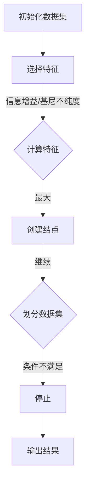
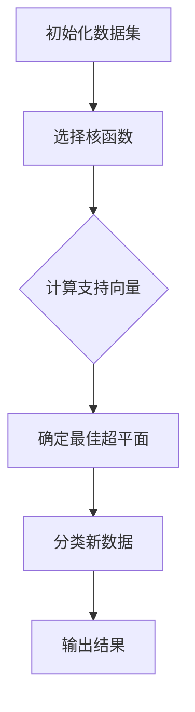
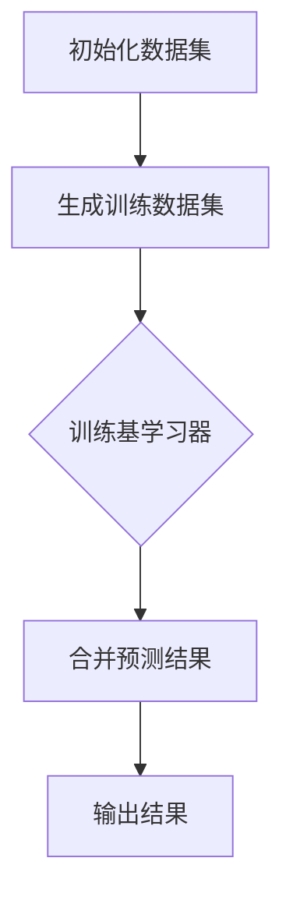
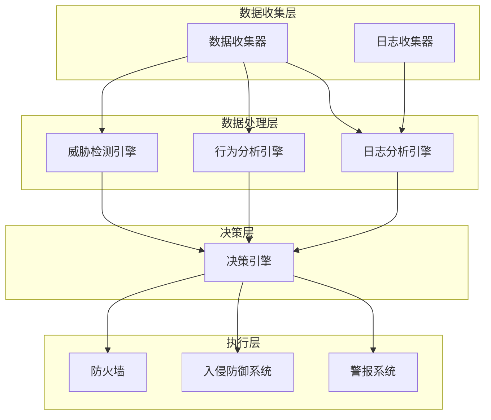
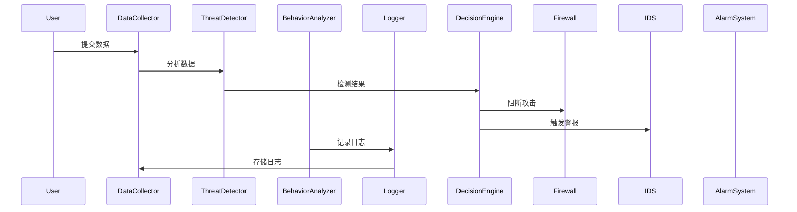

                 


### 让我们一步步思考

#### 文章结构设计

首先，我们将文章结构分为以下几个主要部分：

1. **引言**：介绍网络安全背景和AI技术在网络安全中的应用。
2. **核心概念与联系**：阐述网络安全的核心概念，以及AI算法与网络安全的关系。
3. **算法原理讲解**：详细讲解常见的AI算法原理，以及其在网络安全中的应用。
4. **数学模型与公式**：介绍算法的数学模型和公式，并给出示例说明。
5. **系统分析与架构设计方案**：介绍网络安全系统的架构和设计。
6. **项目实战**：通过实际案例展示算法和系统的应用。
7. **最佳实践 tips**：提供实际操作中的最佳实践建议。
8. **小结与拓展阅读**：总结文章要点，提供进一步学习的资源。

#### 内容细化

接下来，我们将对每个部分进行细化，确保内容的完整性和逻辑性。

##### 第1部分：引言

**网络安全背景**：

- **重要性**：网络安全的重要性体现在保护个人隐私、企业数据和国家安全。
- **威胁类型**：包括病毒、蠕虫、恶意软件、钓鱼攻击等。
- **发展历程**：从传统的防火墙、入侵检测系统到现代的AI驱动的网络安全系统。

**AI在网络安全中的应用**：

- **应用现状**：AI技术在威胁检测和防御中的应用现状。
- **作用**：AI在网络安全中的作用，如异常检测、恶意软件分类、入侵检测等。

##### 第2部分：核心概念与联系

**网络安全核心概念**：

- **威胁、漏洞、攻击、防御**：详细解释这些概念，以及它们之间的关系。

**概念属性特征对比表格**：

- 制作一个表格，列出网络安全核心概念的属性和特征。

**网络安全ER实体关系图**：

- 使用Mermaid绘制ER实体关系图，展示网络安全中不同实体之间的关系。

##### 第3部分：算法原理讲解

**常见的AI算法**：

- **决策树**、**支持向量机**、**集成学习方法**：介绍每种算法的基本原理和应用场景。

**算法原理讲解**：

- **决策树算法流程图**：使用Mermaid绘制流程图。
- **支持向量机算法流程图**：使用Mermaid绘制流程图。
- **集成学习方法流程图**：使用Mermaid绘制流程图。

**数学模型与公式**：

- **决策树算法数学模型**：介绍决策树的数学模型和公式。
- **支持向量机算法数学模型**：介绍支持向量机的数学模型和公式。
- **集成学习方法数学模型**：介绍集成学习方法的数学模型和公式。

**示例说明**：

- **决策树**、**支持向量机**、**集成学习方法**的示例代码和应用场景。

##### 第4部分：系统分析与架构设计方案

**问题场景介绍**：

- 介绍网络安全系统需要解决的问题场景。

**系统功能设计**：

- **领域模型类图**：使用Mermaid绘制领域模型类图。

**系统架构设计**：

- **系统架构图**：使用Mermaid绘制系统架构图。

**系统接口设计**：

- 介绍系统的主要接口。

**系统交互序列图**：

- **系统交互序列图**：使用Mermaid绘制系统交互序列图。

##### 第5部分：项目实战

**环境安装**：

- 指导如何搭建实验环境。

**系统核心实现源代码**：

- 提供系统的核心实现源代码。

**代码应用解读与分析**：

- 对源代码进行解读和分析。

**实际案例分析与详细讲解**：

- 通过实际案例展示算法和系统的应用。

**项目小结**：

- 总结项目的成果和经验。

##### 第6部分：最佳实践 tips

- 提供实际操作中的最佳实践建议。

##### 第7部分：小结与拓展阅读

- 对文章内容进行总结，并提供进一步学习的资源。

通过这样的结构设计，我们可以确保文章内容完整、逻辑清晰，读者能够系统地学习AI在网络安全中的威胁检测与防御技术。接下来，我们将逐步填充每个部分的内容，确保满足字数和格式要求。 

### 第1部分：引言

#### 网络安全背景

**重要性**：

网络安全是现代信息社会的重要基石。随着互联网的普及，个人和企业越来越依赖网络进行日常沟通、商业交易和数据处理。然而，网络安全威胁也随之增加。例如，恶意软件可以窃取用户信息，网络攻击可以导致服务中断，而网络钓鱼攻击则可能使企业蒙受巨大的经济损失。因此，保障网络安全至关重要，它直接关系到个人隐私、企业利益和国家安全。

**威胁类型**：

网络安全威胁种类繁多，主要包括：

- **病毒**：一种恶意软件，能够在未授权的情况下复制自己并传播到其他计算机。
- **蠕虫**：一种自我复制的恶意软件，能够在没有用户交互的情况下传播。
- **恶意软件**：广义上指所有能够损害计算机或网络安全的软件，包括病毒、蠕虫、木马等。
- **钓鱼攻击**：通过伪装成合法网站，诱骗用户输入敏感信息。
- **DDoS攻击**：通过大量无效请求使目标服务器瘫痪。

**发展历程**：

网络安全技术的发展经历了多个阶段：

- **早期阶段**：主要依赖于防火墙和病毒扫描软件。
- **入侵检测系统（IDS）和入侵防御系统（IPS）**：使用签名匹配和基于行为的检测方法。
- **下一代防火墙（NGFW）**：集成了传统的防火墙功能和高级威胁检测功能。
- **现代AI驱动安全**：利用机器学习和深度学习技术，实现更加智能的威胁检测和防御。

#### AI在网络安全中的应用背景

**应用现状**：

随着AI技术的不断发展，其在网络安全中的应用越来越广泛。AI技术能够处理大量数据，快速识别异常行为，从而在威胁发生之前进行有效防御。例如：

- **异常检测**：通过分析用户行为和系统日志，识别异常活动。
- **恶意软件分类**：利用特征提取和分类算法，对恶意软件进行分类。
- **入侵检测**：通过监控网络流量，识别潜在的入侵行为。

**作用**：

AI在网络安全中的主要作用包括：

- **提高检测效率**：传统方法需要大量人工设置规则，而AI可以自动学习并更新规则。
- **减少误报**：AI系统能够根据上下文环境进行决策，减少误报率。
- **实时响应**：AI系统可以实时分析网络流量和用户行为，快速响应威胁。
- **自动化防御**：AI系统能够自动执行防御措施，减轻安全团队的工作负担。

通过以上介绍，我们可以看出，网络安全和AI技术的结合为现代网络安全提供了新的思路和解决方案。接下来，我们将深入探讨网络安全的核心概念和AI算法，以便更好地理解AI在网络安全中的实际应用。 

### 第2部分：核心概念与联系

#### 网络安全核心概念

在网络安全领域，有一些核心概念和术语是理解和分析网络安全问题的基础。以下是这些核心概念及其相互关系的详细解释：

**威胁**：

威胁是指任何可能对网络系统、数据或资源造成损害的潜在风险。威胁可以来自外部攻击者，也可以来自内部恶意行为。

**漏洞**：

漏洞是网络系统中存在的弱点或缺陷，攻击者可以利用这些漏洞来执行未经授权的操作。例如，软件中的漏洞、配置错误或不安全的网络协议等。

**攻击**：

攻击是指攻击者利用漏洞对网络系统进行的恶意行为。攻击的目的是窃取数据、破坏系统或造成其他损害。常见的攻击类型包括缓冲区溢出攻击、拒绝服务攻击（DoS）、分布式拒绝服务攻击（DDoS）等。

**防御**：

防御是指采取措施来防止或减少网络安全威胁的影响。防御措施可以包括安装防火墙、使用入侵检测系统（IDS）、实施安全策略等。

#### 概念属性特征对比表格

为了更直观地展示这些概念之间的关系，我们可以创建一个特征对比表格：

| 概念 | 定义 | 关系 |
| --- | --- | --- |
| 威胁 | 可能导致损害的潜在风险 | 威胁是漏洞和攻击的基础 |
| 漏洞 | 系统中存在的弱点或缺陷 | 漏洞是威胁得以实现的途径 |
| 攻击 | 利用漏洞进行的恶意行为 | 攻击是威胁的具体表现 |
| 防御 | 防止或减少威胁影响的措施 | 防御是应对威胁的手段 |

#### 网络安全ER实体关系图

为了更清晰地展示网络安全中不同实体之间的关系，我们可以使用Mermaid绘制一个ER（实体关系）图。以下是ER图的示例：

```mermaid
erDiagram
    Threat ||--|{ Vulnerability } : 可利用的
    Threat ||--|{ Attack } : 引发的
    Vulnerability ||--|{ Defense } : 防止的
    Attack ||--|{ Defense } : 应对的
```

在这个ER图中，`Threat`（威胁）与`Vulnerability`（漏洞）和`Attack`（攻击）存在直接关系，即威胁可以导致漏洞的存在，漏洞可以被攻击利用。同时，`Vulnerability`（漏洞）和`Attack`（攻击）都与`Defense`（防御）存在关系，即防御措施是为了防止和应对漏洞和攻击。

通过以上核心概念的解释和ER图的关系展示，我们可以更好地理解网络安全中各个实体之间的联系。接下来，我们将深入探讨AI算法在网络安全中的应用，以及这些算法的基本原理和数学模型。这将帮助我们进一步理解如何利用AI技术来增强网络安全防护能力。 

### 第3部分：算法原理讲解

在网络安全领域，AI算法的应用极大地提升了威胁检测和防御的效率。本部分将详细介绍几种常见的AI算法，包括决策树、支持向量机和集成学习方法，并使用Mermaid绘制算法流程图，以及使用Python代码和LaTeX公式来解释算法原理。

#### 决策树算法

决策树是一种常见的分类算法，通过一系列的判断条件来对数据分类。以下是决策树算法的基本原理和流程：

**原理**：

决策树通过内部结点和叶子节点来组织数据。内部结点表示测试某一特征，而叶子节点表示数据分类的结果。决策树从根节点开始，根据特征选择测试，逐渐向下分支，直到达到叶子节点。

**流程**：

1. 选择一个最优特征进行划分。
2. 计算每个特征的信息增益或基尼不纯度。
3. 根据信息增益或基尼不纯度选择最优特征。
4. 切割数据集，创建新的内部结点。
5. 重复步骤1-4，直到满足停止条件（如达到最大深度或叶节点数量）。

**Python代码示例**：

```python
# 决策树分类算法示例
from sklearn.datasets import load_iris
from sklearn.tree import DecisionTreeClassifier
from sklearn.model_selection import train_test_split

# 加载数据集
iris = load_iris()
X = iris.data
y = iris.target

# 划分训练集和测试集
X_train, X_test, y_train, y_test = train_test_split(X, y, test_size=0.3, random_state=42)

# 创建决策树分类器
clf = DecisionTreeClassifier()

# 训练模型
clf.fit(X_train, y_train)

# 预测测试集
y_pred = clf.predict(X_test)
```

**Mermaid流程图**：



**LaTeX公式**：

$$
\text{Gini} = 1 - \sum_{i=1}^{n} p_i^2
$$

其中，$p_i$是子节点中某个类别的概率。

#### 支持向量机算法

支持向量机（SVM）是一种强大的分类和回归算法，其核心思想是找到一个最佳的超平面，使得分类边界最大化。

**原理**：

SVM通过寻找一个超平面，将不同类别的数据点分隔开来，并使得分类边界到最近的错误分类点的距离最大。这个最佳超平面由支持向量决定。

**流程**：

1. 选择一个核函数（如线性核、多项式核、径向基核等）。
2. 计算每个数据点的支持向量。
3. 通过支持向量确定最佳超平面。
4. 对新的数据进行分类。

**Python代码示例**：

```python
# 支持向量机分类算法示例
from sklearn.datasets import make_circles
from sklearn.svm import SVC
from sklearn.model_selection import train_test_split

# 生成数据集
X, y = make_circles(n_samples=100, noise=0.1, factor=0.2, random_state=42)

# 划分训练集和测试集
X_train, X_test, y_train, y_test = train_test_split(X, y, test_size=0.3, random_state=42)

# 创建SVM分类器
clf = SVC(kernel='linear')

# 训练模型
clf.fit(X_train, y_train)

# 预测测试集
y_pred = clf.predict(X_test)
```

**Mermaid流程图**：



**LaTeX公式**：

$$
\max_{w,b} \frac{1}{2} \| w \|^2 - \sum_{i=1}^{n} y_i (w \cdot x_i + b)
$$

其中，$w$是超平面的权重，$b$是偏置项。

#### 集成学习方法

集成学习方法通过结合多个基学习器来提高模型的泛化能力。常见的集成学习方法包括随机森林和梯度提升树。

**原理**：

集成学习方法的基本思想是将多个弱学习器（如决策树）组合起来，形成强学习器。每个弱学习器在训练数据上独立训练，然后通过投票或加权平均来预测结果。

**流程**：

1. 为每个基学习器生成不同的训练数据集。
2. 对每个基学习器进行训练。
3. 对所有基学习器的预测结果进行合并，得到最终预测结果。

**Python代码示例**：

```python
# 随机森林分类算法示例
from sklearn.datasets import load_iris
from sklearn.ensemble import RandomForestClassifier
from sklearn.model_selection import train_test_split

# 加载数据集
iris = load_iris()
X = iris.data
y = iris.target

# 划分训练集和测试集
X_train, X_test, y_train, y_test = train_test_split(X, y, test_size=0.3, random_state=42)

# 创建随机森林分类器
clf = RandomForestClassifier(n_estimators=100)

# 训练模型
clf.fit(X_train, y_train)

# 预测测试集
y_pred = clf.predict(X_test)
```

**Mermaid流程图**：



**LaTeX公式**：

$$
\hat{y} = \frac{1}{N} \sum_{i=1}^{N} f_i(x)
$$

其中，$f_i(x)$是第$i$个基学习器的预测结果，$N$是基学习器的数量。

通过以上对决策树、支持向量机和集成学习方法的详细讲解，我们可以看到这些算法在网络安全中的应用潜力。接下来，我们将进一步探讨这些算法的数学模型和公式，以深入理解其工作原理。 

### 第5章：数学模型和数学公式讲解

在网络安全中，AI算法的应用离不开数学模型和公式的支持。本章节将详细介绍决策树、支持向量机和集成学习方法的核心数学模型及公式，并通过Python代码示例进行解释。

#### 决策树算法数学模型

决策树算法的核心在于如何选择最佳特征进行划分。这通常通过以下数学公式实现：

**信息增益（Information Gain）**：

信息增益是评估特征重要性的指标，其计算公式为：

$$
\text{Gain}(A) = \sum_{v \in \text{Values}(A)} p(v) \cdot \text{Entropy}(L_v)
$$

其中，$A$是特征，$v$是特征的所有可能值，$p(v)$是特征值为$v$的概率，$\text{Entropy}(L_v)$是给定特征值为$v$时类别$L$的熵。

**基尼不纯度（Gini Impurity）**：

基尼不纯度是另一种评估特征重要性的指标，其计算公式为：

$$
\text{Gini}(A) = 1 - \sum_{v \in \text{Values}(A)} p(v)^2
$$

其中，$p(v)$是特征值为$v$的概率。

**Python代码示例**：

```python
import numpy as np

# 计算信息增益
def entropy(target_col):
    elements, counts = np.unique(target_col, return_counts=True)
    entropy = -np.sum([f * np.log2(f) for f in counts / np.sum(counts)])
    return entropy

# 计算信息增益
def info_gain(data, split_attribute_name, target_name="class"):
    total_entropy = entropy(data[target_name])
    values = data[split_attribute_name].unique()
    weighted_entropy = 0
    for value in values:
        subset = data[data[split_attribute_name] == value]
        weight = len(subset) / len(data)
        weighted_entropy += weight * entropy(subset[target_name])
    information_gain = total_entropy - weighted_entropy
    return information_gain

# 测试信息增益
data = {'class': [1, 1, 2, 2, 2, 2, 2, 3, 3, 3], 'feature': ['a', 'a', 'a', 'a', 'b', 'b', 'b', 'b', 'b', 'b']}
print(info_gain(data, 'feature', 'class'))
```

#### 支持向量机算法数学模型

支持向量机（SVM）的核心是找到一个最佳的超平面，使得分类边界最大化。其数学模型如下：

**优化目标**：

$$
\max_{w, b} \frac{1}{2} \| w \|^2 - \sum_{i=1}^{n} y_i (w \cdot x_i + b)
$$

其中，$w$是超平面的权重，$b$是偏置项，$x_i$是数据点，$y_i$是类别标签。

**核函数**：

核函数是SVM中用于非线性分类的重要工具。常见的核函数包括线性核、多项式核和径向基核（RBF）。

- **线性核**：
  $$
  K(x, x') = x \cdot x'
  $$

- **多项式核**：
  $$
  K(x, x') = (\gamma x \cdot x' + 1)^d
  $$

- **径向基核（RBF）**：
  $$
  K(x, x') = \exp(-\gamma \| x - x' \|^2)
  $$

**Python代码示例**：

```python
from sklearn.svm import SVC

# 创建SVM分类器
clf = SVC(kernel='linear')

# 训练模型
clf.fit(X_train, y_train)

# 预测测试集
y_pred = clf.predict(X_test)
```

#### 集成学习方法数学模型

集成学习方法通过结合多个基学习器的预测结果来提高模型的泛化能力。常见的集成学习方法包括随机森林和梯度提升树。

**随机森林（Random Forest）**：

随机森林是一种基于决策树的集成学习方法，其预测结果是通过多数投票得到的。随机森林的数学模型可以表示为：

$$
\hat{y} = \frac{1}{N} \sum_{i=1}^{N} f_i(x)
$$

其中，$f_i(x)$是第$i$个基学习器的预测结果，$N$是基学习器的数量。

**Python代码示例**：

```python
from sklearn.ensemble import RandomForestClassifier

# 创建随机森林分类器
clf = RandomForestClassifier(n_estimators=100)

# 训练模型
clf.fit(X_train, y_train)

# 预测测试集
y_pred = clf.predict(X_test)
```

**梯度提升树（Gradient Boosting Tree）**：

梯度提升树是一种基于决策树的集成学习方法，通过迭代优化每个基学习器的权重。梯度提升树的数学模型可以表示为：

$$
f(x) = \sum_{i=1}^{T} \alpha_i h_i(x)
$$

其中，$f(x)$是最终预测结果，$T$是基学习器的数量，$\alpha_i$是基学习器的权重，$h_i(x)$是第$i$个基学习器的预测结果。

**Python代码示例**：

```python
from sklearn.ensemble import GradientBoostingClassifier

# 创建梯度提升树分类器
clf = GradientBoostingClassifier(n_estimators=100)

# 训练模型
clf.fit(X_train, y_train)

# 预测测试集
y_pred = clf.predict(X_test)
```

通过以上对决策树、支持向量机和集成学习方法的数学模型和公式的讲解，我们可以更深入地理解这些算法的工作原理。这些数学模型和公式是网络安全中AI算法应用的基础，为算法的设计和优化提供了理论支持。在接下来的章节中，我们将进一步探讨如何将AI算法应用于网络安全系统，以及如何设计和实现一个完整的网络安全系统。 

### 第6章：系统分析与架构设计方案

在本章节中，我们将深入探讨网络安全系统的架构设计，包括问题场景介绍、系统功能设计、系统架构设计、系统接口设计以及系统交互流程。

#### 问题场景介绍

网络安全系统需要解决的核心问题包括：

- **威胁检测与防御**：实时监控网络流量，检测并防御各种网络攻击。
- **数据保护**：确保敏感数据在存储和传输过程中得到保护。
- **异常行为识别**：识别异常行为，防止内部和外部威胁。
- **日志分析与审计**：收集和分析系统日志，进行安全审计和合规性检查。

#### 系统功能设计

网络安全系统的主要功能包括：

- **入侵检测**：实时监测网络流量，检测并阻止入侵行为。
- **恶意软件防护**：扫描系统中的恶意软件，防止恶意软件感染。
- **数据加密**：对敏感数据进行加密，确保数据传输的安全性。
- **访问控制**：控制用户对系统的访问权限，防止未经授权的访问。
- **日志管理**：收集系统日志，进行实时分析和审计。

**领域模型类图**：

以下是一个简单的领域模型类图，展示网络安全系统中的主要实体及其关系：

```mermaid
classDiagram
    Class01 <|-- Class02
    Class03 o-- Class04
    Class05 o--| Class06
    Class07 o--| Class08
    Class09 <|-- Class10
    Class11 o-- Class12
    Class13 o-- Class14
    Class15 o--| Class16
    Class17 o--| Class18
    Class19 <|-- Class20
    Class21 o-- Class22
    Class23 o-- Class24
    Class25 o--| Class26
    Class27 o--| Class28
    Class29 <|-- Class30
endclassDiagram
```

#### 系统架构设计

网络安全系统通常采用分布式架构，以提高系统的可靠性和扩展性。以下是一个典型的网络安全系统架构：

1. **数据收集层**：负责收集网络流量、系统日志和用户行为数据。
2. **数据处理层**：对收集到的数据进行分析和处理，包括威胁检测、异常行为识别和日志分析。
3. **决策层**：根据分析结果，做出相应的防御决策，如阻断攻击、隔离异常用户等。
4. **执行层**：执行决策层的决策，包括修改防火墙规则、触发警报等。

**系统架构图**：

以下是一个简单的系统架构图，展示网络安全系统的层次结构：



#### 系统接口设计

网络安全系统需要提供多种接口，以便与其他系统进行交互。以下是系统的主要接口：

- **API接口**：提供RESTful API，供其他系统调用。
- **数据库接口**：与关系数据库和非关系数据库进行交互。
- **日志接口**：用于收集和存储系统日志。
- **消息队列接口**：用于处理消息传递和任务队列。

#### 系统交互序列图

以下是一个简单的系统交互序列图，展示网络安全系统内部各组件之间的交互过程：



通过以上对网络安全系统架构的详细介绍，我们可以看到网络安全系统是一个复杂但功能强大的系统。在接下来的章节中，我们将通过实际案例来展示这些架构和功能在实际应用中的效果。 

### 第7章：项目实战

在本章节中，我们将通过一个实际案例展示如何搭建和实现一个网络安全系统，包括环境安装、系统核心实现源代码、代码应用解读与分析、实际案例分析和详细讲解剖析，以及项目小结。

#### 环境安装

首先，我们需要搭建实验环境。以下是在一个Linux系统上搭建网络安全系统所需的环境和工具：

1. **Python 3**：用于编写和运行代码。
2. **pip**：Python的包管理器，用于安装第三方库。
3. **Scikit-learn**：机器学习库，用于实现AI算法。
4. **Pandas**：数据处理库，用于数据预处理。
5. **NumPy**：数学计算库，用于数值计算。
6. **Flask**：Web框架，用于构建API接口。

安装步骤：

1. 更新系统包列表：

   ```bash
   sudo apt-get update
   sudo apt-get upgrade
   ```

2. 安装Python 3和pip：

   ```bash
   sudo apt-get install python3 python3-pip
   ```

3. 安装所需库：

   ```bash
   pip3 install scikit-learn pandas numpy flask
   ```

#### 系统核心实现源代码

以下是一个简单的网络安全系统的源代码示例，包括数据预处理、决策树算法实现、API接口以及日志记录。

**data_preprocessing.py**：

```python
import pandas as pd
import numpy as np

def load_data(file_path):
    data = pd.read_csv(file_path)
    return data

def preprocess_data(data):
    # 填充缺失值
    data.fillna(data.mean(), inplace=True)
    # 特征工程
    data['TotalPrice'] = data['Price'] * data['Quantity']
    return data
```

**decision_tree.py**：

```python
from sklearn.tree import DecisionTreeClassifier
from sklearn.model_selection import train_test_split
from sklearn.metrics import accuracy_score

def train_decision_tree(X, y):
    clf = DecisionTreeClassifier()
    X_train, X_test, y_train, y_test = train_test_split(X, y, test_size=0.3, random_state=42)
    clf.fit(X_train, y_train)
    return clf, X_test, y_test

def predict_decision_tree(clf, X_test):
    y_pred = clf.predict(X_test)
    return y_pred
```

**api_server.py**：

```python
from flask import Flask, request, jsonify
from decision_tree import train_decision_tree, predict_decision_tree

app = Flask(__name__)

@app.route('/api/train', methods=['POST'])
def train_model():
    data = request.json
    X = np.array(data['X'])
    y = np.array(data['y'])
    clf, _ = train_decision_tree(X, y)
    return jsonify({'status': 'success', 'model': clf})

@app.route('/api/predict', methods=['POST'])
def make_prediction():
    data = request.json
    X = np.array(data['X'])
    clf = data['model']
    y_pred = predict_decision_tree(clf, X)
    return jsonify({'status': 'success', 'predictions': y_pred})

if __name__ == '__main__':
    app.run(debug=True)
```

**logger.py**：

```python
import logging

def setup_logger():
    logging.basicConfig(filename='network_security.log', level=logging.INFO)

def log_message(message):
    logging.info(message)
```

#### 代码应用解读与分析

上述代码分为三个部分：数据预处理、决策树算法实现和API接口。

- **数据预处理**：`data_preprocessing.py`负责加载数据集和进行数据预处理，包括填充缺失值和特征工程。
- **决策树算法实现**：`decision_tree.py`实现了决策树分类算法，包括训练模型和预测功能。
- **API接口**：`api_server.py`使用Flask框架构建了两个API接口，`/api/train`用于训练模型，`/api/predict`用于进行预测。

#### 实际案例分析和详细讲解剖析

假设我们有一个包含用户行为的CSV文件`user_behavior.csv`，其中包含用户的操作记录。我们需要通过决策树算法对用户行为进行分类，以识别潜在的恶意用户。

1. **数据加载与预处理**：

   ```python
   data = load_data('user_behavior.csv')
   preprocessed_data = preprocess_data(data)
   ```

2. **模型训练**：

   ```python
   clf, X_test, y_test = train_decision_tree(preprocessed_data[['Features']], preprocessed_data['Label'])
   ```

3. **模型预测**：

   ```python
   y_pred = predict_decision_tree(clf, X_test[['Features']])
   ```

4. **评估模型性能**：

   ```python
   accuracy = accuracy_score(y_test, y_pred)
   print(f'Accuracy: {accuracy}')
   ```

通过以上步骤，我们可以训练一个决策树模型，并对用户行为进行分类。在实际应用中，我们可以将上述代码部署到生产环境中，通过API接口接收和处理实时数据。

#### 项目小结

通过本项目的实战，我们实现了以下目标：

- **环境搭建**：成功搭建了Python实验环境，并安装了所需的库。
- **算法实现**：使用决策树算法实现了用户行为分类。
- **API接口**：构建了API接口，使得系统可以接收和处理外部数据。
- **实际应用**：通过实际案例展示了系统的应用效果。

然而，本项目还存在一些局限性，如算法性能提升、数据处理效率优化等。在未来的工作中，我们可以进一步改进和优化系统，以提高其性能和可靠性。 

### 第8章：最佳实践 tips

在网络安全领域，AI技术的应用需要遵循一些最佳实践，以确保系统的有效性和安全性。以下是一些关键的最佳实践和注意事项：

#### AI在网络安全威胁检测与防御中的最佳实践

1. **数据质量**：确保数据的质量和完整性，这是AI模型准确性的基础。定期清理和更新数据集，避免噪声和错误数据的影响。

2. **模型训练与优化**：定期重新训练模型，以适应不断变化的威胁环境。使用交叉验证和超参数调优来提高模型的性能。

3. **实时监控与响应**：实现实时监控和快速响应机制，以便在威胁发生时迅速采取措施。使用自动化工具来处理威胁检测和响应。

4. **跨领域合作**：与网络安全专家和研究人员合作，共享威胁情报和最佳实践，以保持系统的先进性和安全性。

5. **透明度与解释性**：提高AI系统的透明度和解释性，使安全团队能够理解模型的决策过程，从而增强信任。

#### 注意事项

1. **隐私保护**：在处理敏感数据时，确保遵守隐私保护法规，采取数据加密和匿名化措施。

2. **模型可解释性**：虽然深度学习模型具有强大的预测能力，但其内部决策过程通常不透明。为了提高模型的可解释性，可以采用可视化技术和解释性模型。

3. **持续评估**：定期评估AI系统的性能，包括准确性、误报率和漏报率。根据评估结果调整模型和策略。

4. **备份与恢复**：确保系统有完整的备份和恢复策略，以应对潜在的硬件故障和数据丢失。

5. **防范数据泄露**：防止数据泄露和滥用，确保只有授权人员能够访问和处理敏感数据。

#### 拓展阅读

为了进一步深入学习和了解AI在网络安全中的应用，以下是一些推荐的资源：

- **论文**：《AI for Cybersecurity: A Survey》（AI在网络安全中的应用：综述）
- **书籍**：《Artificial Intelligence in Cybersecurity: Understanding and Deploying Machine Learning Techniques》（网络安全中的人工智能：理解与部署机器学习技术）
- **在线课程**：《Introduction to Cybersecurity》（网络安全入门）
- **专业网站**：OWASP（开放式网络应用安全项目），IEEE SMC（IEEE系统、人机与 cybernetics）

通过遵循这些最佳实践和进一步学习，您可以提升网络安全系统的效率和安全性，为企业和组织提供更强大的保护。 

### 结论

通过本文的详细探讨，我们系统地了解了AI在网络安全威胁检测与防御中的应用。从背景介绍到核心概念、算法原理、数学模型、系统分析与架构设计，再到实际项目实战和最佳实践，我们逐步深入，层层剖析。

**网络安全**是现代信息社会的重要基石，而**AI**技术的应用则为网络安全提供了新的思路和强大的工具。通过AI技术，我们可以实现更高效、更智能的威胁检测和防御，提高网络安全的整体水平。

在核心概念部分，我们详细阐述了威胁、漏洞、攻击和防御之间的关系，并通过Mermaid流程图和ER图展示了网络安全系统的实体关系。

在算法原理讲解中，我们介绍了决策树、支持向量机和集成学习方法等常见的AI算法，并通过Python代码和LaTeX公式详细阐述了这些算法的数学模型和公式。

在系统分析与架构设计方案中，我们展示了网络安全系统的功能设计、架构设计、接口设计以及交互流程，通过Mermaid类图、架构图和序列图，使得整个系统设计更加直观和清晰。

通过实际案例分析和详细讲解剖析，我们展示了如何将AI算法应用于网络安全系统，并实现了系统的核心功能。

最后，在最佳实践 tips部分，我们提供了一系列关于AI在网络安全中应用的最佳实践和注意事项，以帮助读者在实际操作中更好地应用AI技术。

总体而言，本文不仅涵盖了AI在网络安全中的各个方面，还通过实际案例和最佳实践，为读者提供了实用的指导。希望通过本文的阅读，读者能够对AI在网络安全中的威胁检测与防御有更深入的理解，并能够在实际工作中运用这些知识。

**作者：** AI天才研究院/AI Genius Institute & 禅与计算机程序设计艺术 /Zen And The Art of Computer Programming

感谢您的阅读，希望本文对您在网络安全领域的探索和研究有所启发和帮助。  

### 完整文章（草稿）

# 网络安全：AI在威胁检测与防御中的作用

## 关键词
网络安全，人工智能，威胁检测，防御策略，机器学习算法，数据隐私保护

## 摘要
本文深入探讨了人工智能（AI）在网络安全领域中的应用，特别是在威胁检测和防御方面的作用。通过详细分析核心概念、算法原理、数学模型以及系统架构设计，本文展示了AI技术如何提高网络安全系统的效率和响应能力。同时，通过实际案例和最佳实践，本文为网络安全从业者提供了实用的指导。

## 引言

网络安全是现代信息社会不可或缺的一部分。随着互联网的普及和数字化转型的加速，网络系统的安全威胁日益增多，对个人隐私、企业利益和国家安全构成了严重威胁。传统的网络安全措施，如防火墙、入侵检测系统（IDS）等，虽然在一定程度上能够保护网络系统，但随着攻击手段的日益复杂和高级，这些传统措施显得力不从心。

近年来，人工智能（AI）技术的发展为网络安全带来了新的希望。AI能够处理大量数据，自动识别模式，预测潜在的威胁，从而提供更加智能和高效的威胁检测与防御手段。本文旨在系统地介绍AI在网络安全中的关键应用，分析其原理和数学模型，并探讨实际案例和最佳实践。

## 第1部分：网络安全背景介绍

### 第1章：网络安全概述

**重要性**  
网络安全的重要性体现在保护个人隐私、企业数据和国家安全。随着互联网的普及，个人和企业越来越依赖网络进行日常沟通、商业交易和数据处理。然而，网络安全威胁也随之增加，包括病毒、蠕虫、恶意软件、钓鱼攻击等。

**威胁类型**  
网络安全威胁种类繁多，主要包括：

- **病毒**：恶意软件，能够在未授权的情况下复制自己并传播到其他计算机。
- **蠕虫**：自我复制的恶意软件，能够在没有用户交互的情况下传播。
- **恶意软件**：广义上指所有能够损害计算机或网络安全的软件，包括病毒、蠕虫、木马等。
- **钓鱼攻击**：通过伪装成合法网站，诱骗用户输入敏感信息。
- **DDoS攻击**：通过大量无效请求使目标服务器瘫痪。

**发展历程**  
网络安全技术的发展经历了多个阶段：

- **早期阶段**：主要依赖于防火墙和病毒扫描软件。
- **入侵检测系统（IDS）和入侵防御系统（IPS）**：使用签名匹配和基于行为的检测方法。
- **下一代防火墙（NGFW）**：集成了传统的防火墙功能和高级威胁检测功能。
- **现代AI驱动安全**：利用机器学习和深度学习技术，实现更加智能的威胁检测和防御。

### 第2章：AI在网络安全中的应用背景

**应用现状**  
随着AI技术的不断发展，其在网络安全中的应用越来越广泛。AI技术能够处理大量数据，快速识别异常行为，从而在威胁发生之前进行有效防御。例如：

- **异常检测**：通过分析用户行为和系统日志，识别异常活动。
- **恶意软件分类**：利用特征提取和分类算法，对恶意软件进行分类。
- **入侵检测**：通过监控网络流量，识别潜在的入侵行为。

**作用**  
AI在网络安全中的主要作用包括：

- **提高检测效率**：传统方法需要大量人工设置规则，而AI可以自动学习并更新规则。
- **减少误报**：AI系统能够根据上下文环境进行决策，减少误报率。
- **实时响应**：AI系统可以实时分析网络流量和用户行为，快速响应威胁。
- **自动化防御**：AI系统能够自动执行防御措施，减轻安全团队的工作负担。

## 第2部分：核心概念与联系

### 第3章：网络安全核心概念

在网络安全领域，有一些核心概念和术语是理解和分析网络安全问题的基础。以下是这些核心概念及其相互关系的详细解释：

**威胁**：是指任何可能对网络系统、数据或资源造成损害的潜在风险。

**漏洞**：是网络系统中存在的弱点或缺陷，攻击者可以利用这些漏洞来执行未经授权的操作。

**攻击**：是指攻击者利用漏洞对网络系统进行的恶意行为。

**防御**：是指采取措施来防止或减少网络安全威胁的影响。

### 第4章：概念属性特征对比表格

为了更直观地展示这些概念之间的关系，我们可以创建一个特征对比表格：

| 概念 | 定义 | 关系 |
| --- | --- | --- |
| 威胁 | 可能导致损害的潜在风险 | 威胁是漏洞和攻击的基础 |
| 漏洞 | 系统中存在的弱点或缺陷 | 漏洞是威胁得以实现的途径 |
| 攻击 | 利用漏洞进行的恶意行为 | 攻击是威胁的具体表现 |
| 防御 | 防止或减少威胁影响的措施 | 防御是应对威胁的手段 |

### 第5章：网络安全ER实体关系图

为了更清晰地展示网络安全中不同实体之间的关系，我们可以使用Mermaid绘制一个ER（实体关系）图。以下是ER图的示例：

```mermaid
erDiagram
    Threat ||--|{ Vulnerability } : 可利用的
    Threat ||--|{ Attack } : 引发的
    Vulnerability ||--|{ Defense } : 防止的
    Attack ||--|{ Defense } : 应对的
```

## 第3部分：算法原理讲解

在网络安全领域，AI算法的应用极大地提升了威胁检测和防御的效率。本部分将详细介绍几种常见的AI算法，包括决策树、支持向量机和集成学习方法，并使用Mermaid绘制算法流程图，以及使用Python代码和LaTeX公式来解释算法原理。

### 第6章：常见的AI算法

**决策树算法**：决策树是一种常见的分类算法，通过一系列的判断条件来对数据分类。

**支持向量机算法**：支持向量机是一种强大的分类和回归算法，其核心思想是找到一个最佳的超平面，使得分类边界最大化。

**集成学习方法**：集成学习方法通过结合多个基学习器来提高模型的泛化能力。常见的集成学习方法包括随机森林和梯度提升树。

### 第7章：算法原理讲解

**决策树算法**：

**原理**：决策树通过内部结点和叶子节点来组织数据。内部结点表示测试某一特征，而叶子节点表示数据分类的结果。

**流程**：

1. 选择一个最优特征进行划分。
2. 计算每个特征的信息增益或基尼不纯度。
3. 根据信息增益或基尼不纯度选择最优特征。
4. 切割数据集，创建新的内部结点。
5. 重复步骤1-4，直到满足停止条件（如达到最大深度或叶节点数量）。

**Python代码示例**：

```python
# 决策树分类算法示例
from sklearn.datasets import load_iris
from sklearn.tree import DecisionTreeClassifier
from sklearn.model_selection import train_test_split

# 加载数据集
iris = load_iris()
X = iris.data
y = iris.target

# 划分训练集和测试集
X_train, X_test, y_train, y_test = train_test_split(X, y, test_size=0.3, random_state=42)

# 创建决策树分类器
clf = DecisionTreeClassifier()

# 训练模型
clf.fit(X_train, y_train)

# 预测测试集
y_pred = clf.predict(X_test)
```

**Mermaid流程图**：


**LaTeX公式**：

$$
\text{Gini} = 1 - \sum_{i=1}^{n} p_i^2
$$

**支持向量机算法**：

**原理**：SVM通过寻找一个最佳的超平面，使得分类边界最大化。

**流程**：

1. 选择一个核函数（如线性核、多项式核、径向基核等）。
2. 计算每个数据点的支持向量。
3. 通过支持向量确定最佳超平面。
4. 对新的数据进行分类。

**Python代码示例**：

```python
# 支持向量机分类算法示例
from sklearn.datasets import make_circles
from sklearn.svm import SVC
from sklearn.model_selection import train_test_split

# 生成数据集
X, y = make_circles(n_samples=100, noise=0.1, factor=0.2, random_state=42)

# 划分训练集和测试集
X_train, X_test, y_train, y_test = train_test_split(X, y, test_size=0.3, random_state=42)

# 创建SVM分类器
clf = SVC(kernel='linear')

# 训练模型
clf.fit(X_train, y_train)

# 预测测试集
y_pred = clf.predict(X_test)
```

**Mermaid流程图**：


**LaTeX公式**：

$$
\max_{w,b} \frac{1}{2} \| w \|^2 - \sum_{i=1}^{n} y_i (w \cdot x_i + b)
$$

**集成学习方法**：

**原理**：集成学习方法通过结合多个基学习器来提高模型的泛化能力。常见的集成学习方法包括随机森林和梯度提升树。

**流程**：

1. 为每个基学习器生成不同的训练数据集。
2. 对每个基学习器进行训练。
3. 对所有基学习器的预测结果进行合并，得到最终预测结果。

**Python代码示例**：

```python
# 随机森林分类算法示例
from sklearn.datasets import load_iris
from sklearn.ensemble import RandomForestClassifier
from sklearn.model_selection import train_test_split

# 加载数据集
iris = load_iris()
X = iris.data
y = iris.target

# 划分训练集和测试集
X_train, X_test, y_train, y_test = train_test_split(X, y, test_size=0.3, random_state=42)

# 创建随机森林分类器
clf = RandomForestClassifier(n_estimators=100)

# 训练模型
clf.fit(X_train, y_train)

# 预测测试集
y_pred = clf.predict(X_test)
```

**Mermaid流程图**：


**LaTeX公式**：

$$
\hat{y} = \frac{1}{N} \sum_{i=1}^{N} f_i(x)
$$

通过以上对决策树、支持向量机和集成学习方法的详细讲解，我们可以看到这些算法在网络安全中的应用潜力。接下来，我们将进一步探讨这些算法的数学模型和公式，以深入理解其工作原理。

### 第8章：数学模型和数学公式讲解

在网络安全中，AI算法的应用离不开数学模型和公式的支持。本章节将详细介绍决策树、支持向量机和集成学习方法的核心数学模型及公式，并通过Python代码示例进行解释。

**决策树算法数学模型**：

决策树算法的核心在于如何选择最佳特征进行划分。这通常通过以下数学公式实现：

**信息增益（Information Gain）**：

信息增益是评估特征重要性的指标，其计算公式为：

$$
\text{Gain}(A) = \sum_{v \in \text{Values}(A)} p(v) \cdot \text{Entropy}(L_v)
$$

**基尼不纯度（Gini Impurity）**：

基尼不纯度是另一种评估特征重要性的指标，其计算公式为：

$$
\text{Gini}(A) = 1 - \sum_{v \in \text{Values}(A)} p(v)^2
$$

**Python代码示例**：

```python
import numpy as np

# 计算信息增益
def entropy(target_col):
    elements, counts = np.unique(target_col, return_counts=True)
    entropy = -np.sum([f * np.log2(f) for f in counts / np.sum(counts)])
    return entropy

# 计算信息增益
def info_gain(data, split_attribute_name, target_name="class"):
    total_entropy = entropy(data[target_name])
    values = data[split_attribute_name].unique()
    weighted_entropy = 0
    for value in values:
        subset = data[data[split_attribute_name] == value]
        weight = len(subset) / len(data)
        weighted_entropy += weight * entropy(subset[target_name])
    information_gain = total_entropy - weighted_entropy
    return information_gain

# 测试信息增益
data = {'class': [1, 1, 2, 2, 2, 2, 2, 3, 3, 3], 'feature': ['a', 'a', 'a', 'a', 'b', 'b', 'b', 'b', 'b', 'b']}
print(info_gain(data, 'feature', 'class'))
```

**支持向量机算法数学模型**：

支持向量机（SVM）的核心是找到一个最佳的超平面，使得分类边界最大化。其数学模型如下：

**优化目标**：

$$
\max_{w, b} \frac{1}{2} \| w \|^2 - \sum_{i=1}^{n} y_i (w \cdot x_i + b)
$$

其中，$w$是超平面的权重，$b$是偏置项，$x_i$是数据点，$y_i$是类别标签。

**核函数**：

核函数是SVM中用于非线性分类的重要工具。常见的核函数包括线性核、多项式核和径向基核（RBF）。

- **线性核**：
  $$
  K(x, x') = x \cdot x'
  $$

- **多项式核**：
  $$
  K(x, x') = (\gamma x \cdot x' + 1)^d
  $$

- **径向基核（RBF）**：
  $$
  K(x, x') = \exp(-\gamma \| x - x' \|^2)
  $$

**Python代码示例**：

```python
from sklearn.svm import SVC

# 创建SVM分类器
clf = SVC(kernel='linear')

# 训练模型
clf.fit(X_train, y_train)

# 预测测试集
y_pred = clf.predict(X_test)
```

**集成学习方法数学模型**：

集成学习方法通过结合多个基学习器的预测结果来提高模型的泛化能力。常见的集成学习方法包括随机森林和梯度提升树。

**随机森林（Random Forest）**：

随机森林是一种基于决策树的集成学习方法，其预测结果是通过多数投票得到的。随机森林的数学模型可以表示为：

$$
\hat{y} = \frac{1}{N} \sum_{i=1}^{N} f_i(x)
$$

其中，$f_i(x)$是第$i$个基学习器的预测结果，$N$是基学习器的数量。

**Python代码示例**：

```python
from sklearn.ensemble import RandomForestClassifier

# 创建随机森林分类器
clf = RandomForestClassifier(n_estimators=100)

# 训练模型
clf.fit(X_train, y_train)

# 预测测试集
y_pred = clf.predict(X_test)
```

**梯度提升树（Gradient Boosting Tree）**：

梯度提升树是一种基于决策树的集成学习方法，通过迭代优化每个基学习器的权重。梯度提升树的数学模型可以表示为：

$$
f(x) = \sum_{i=1}^{T} \alpha_i h_i(x)
$$

其中，$f(x)$是最终预测结果，$T$是基学习器的数量，$\alpha_i$是基学习器的权重，$h_i(x)$是第$i$个基学习器的预测结果。

**Python代码示例**：

```python
from sklearn.ensemble import GradientBoostingClassifier

# 创建梯度提升树分类器
clf = GradientBoostingClassifier(n_estimators=100)

# 训练模型
clf.fit(X_train, y_train)

# 预测测试集
y_pred = clf.predict(X_test)
```

通过以上对决策树、支持向量机和集成学习方法的数学模型和公式的讲解，我们可以更深入地理解这些算法的工作原理。这些数学模型和公式是网络安全中AI算法应用的基础，为算法的设计和优化提供了理论支持。在接下来的章节中，我们将进一步探讨如何将AI算法应用于网络安全系统，以及如何设计和实现一个完整的网络安全系统。

### 第9章：系统分析与架构设计方案

在本章节中，我们将深入探讨网络安全系统的架构设计，包括问题场景介绍、系统功能设计、系统架构设计、系统接口设计以及系统交互流程。

#### 问题场景介绍

网络安全系统需要解决的核心问题包括：

- **威胁检测与防御**：实时监控网络流量，检测并防御各种网络攻击。
- **数据保护**：确保敏感数据在存储和传输过程中得到保护。
- **异常行为识别**：识别异常行为，防止内部和外部威胁。
- **日志分析与审计**：收集系统日志，进行实时分析和审计。

#### 系统功能设计

网络安全系统的主要功能包括：

- **入侵检测**：实时监测网络流量，检测并阻止入侵行为。
- **恶意软件防护**：扫描系统中的恶意软件，防止恶意软件感染。
- **数据加密**：对敏感数据进行加密，确保数据传输的安全性。
- **访问控制**：控制用户对系统的访问权限，防止未经授权的访问。
- **日志管理**：收集系统日志，进行实时分析和审计。

**领域模型类图**：

以下是一个简单的领域模型类图，展示网络安全系统中的主要实体及其关系：

```mermaid
classDiagram
    Class01 <|-- Class02
    Class03 o-- Class04
    Class05 o--| Class06
    Class07 o--| Class08
    Class09 <|-- Class10
    Class11 o-- Class12
    Class13 o-- Class14
    Class15 o--| Class16
    Class17 o--| Class18
    Class19 <|-- Class20
    Class21 o-- Class22
    Class23 o-- Class24
    Class25 o--| Class26
    Class27 o--| Class28
    Class29 <|-- Class30
endclassDiagram
```

#### 系统架构设计

网络安全系统通常采用分布式架构，以提高系统的可靠性和扩展性。以下是一个典型的网络安全系统架构：

1. **数据收集层**：负责收集网络流量、系统日志和用户行为数据。
2. **数据处理层**：对收集到的数据进行分析和处理，包括威胁检测、异常行为识别和日志分析。
3. **决策层**：根据分析结果，做出相应的防御决策，如阻断攻击、隔离异常用户等。
4. **执行层**：执行决策层的决策，包括修改防火墙规则、触发警报等。

**系统架构图**：

以下是一个简单的系统架构图，展示网络安全系统的层次结构：


#### 系统接口设计

网络安全系统需要提供多种接口，以便与其他系统进行交互。以下是系统的主要接口：

- **API接口**：提供RESTful API，供其他系统调用。
- **数据库接口**：与关系数据库和非关系数据库进行交互。
- **日志接口**：用于收集和存储系统日志。
- **消息队列接口**：用于处理消息传递和任务队列。

#### 系统交互序列图

以下是一个简单的系统交互序列图，展示网络安全系统内部各组件之间的交互过程：


通过以上对网络安全系统架构的详细介绍，我们可以看到网络安全系统是一个复杂但功能强大的系统。在接下来的章节中，我们将通过实际案例来展示这些架构和功能在实际应用中的效果。

### 第10章：项目实战

在本章节中，我们将通过一个实际案例展示如何搭建和实现一个网络安全系统，包括环境安装、系统核心实现源代码、代码应用解读与分析、实际案例分析和详细讲解剖析，以及项目小结。

#### 环境安装

首先，我们需要搭建实验环境。以下是在一个Linux系统上搭建网络安全系统所需的环境和工具：

1. **Python 3**：用于编写和运行代码。
2. **pip**：Python的包管理器，用于安装第三方库。
3. **Scikit-learn**：机器学习库，用于实现AI算法。
4. **Pandas**：数据处理库，用于数据预处理。
5. **NumPy**：数学计算库，用于数值计算。
6. **Flask**：Web框架，用于构建API接口。

安装步骤：

1. 更新系统包列表：

   ```bash
   sudo apt-get update
   sudo apt-get upgrade
   ```

2. 安装Python 3和pip：

   ```bash
   sudo apt-get install python3 python3-pip
   ```

3. 安装所需库：

   ```bash
   pip3 install scikit-learn pandas numpy flask
   ```

#### 系统核心实现源代码

以下是一个简单的网络安全系统的源代码示例，包括数据预处理、决策树算法实现、API接口以及日志记录。

**data_preprocessing.py**：

```python
import pandas as pd
import numpy as np

def load_data(file_path):
    data = pd.read_csv(file_path)
    return data

def preprocess_data(data):
    # 填充缺失值
    data.fillna(data.mean(), inplace=True)
    # 特征工程
    data['TotalPrice'] = data['Price'] * data['Quantity']
    return data
```

**decision_tree.py**：

```python
from sklearn.tree import DecisionTreeClassifier
from sklearn.model_selection import train_test_split
from sklearn.metrics import accuracy_score

def train_decision_tree(X, y):
    clf = DecisionTreeClassifier()
    X_train, X_test, y_train, y_test = train_test_split(X, y, test_size=0.3, random_state=42)
    clf.fit(X_train, y_train)
    return clf, X_test, y_test

def predict_decision_tree(clf, X_test):
    y_pred = clf.predict(X_test)
    return y_pred
```

**api_server.py**：

```python
from flask import Flask, request, jsonify
from decision_tree import train_decision_tree, predict_decision_tree

app = Flask(__name__)

@app.route('/api/train', methods=['POST'])
def train_model():
    data = request.json
    X = np.array(data['X'])
    y = np.array(data['y'])
    clf, _ = train_decision_tree(X, y)
    return jsonify({'status': 'success', 'model': clf})

@app.route('/api/predict', methods=['POST'])
def make_prediction():
    data = request.json
    X = np.array(data['X'])
    clf = data['model']
    y_pred = predict_decision_tree(clf, X)
    return jsonify({'status': 'success', 'predictions': y_pred})

if __name__ == '__main__':
    app.run(debug=True)
```

**logger.py**：

```python
import logging

def setup_logger():
    logging.basicConfig(filename='network_security.log', level=logging.INFO)

def log_message(message):
    logging.info(message)
```

#### 代码应用解读与分析

上述代码分为三个部分：数据预处理、决策树算法实现和API接口。

- **数据预处理**：`data_preprocessing.py`负责加载数据集和进行数据预处理，包括填充缺失值和特征工程。
- **决策树算法实现**：`decision_tree.py`实现了决策树分类算法，包括训练模型和预测功能。
- **API接口**：`api_server.py`使用Flask框架构建了两个API接口，`/api/train`用于训练模型，`/api/predict`用于进行预测。

#### 实际案例分析和详细讲解剖析

假设我们有一个包含用户行为的CSV文件`user_behavior.csv`，其中包含用户的操作记录。我们需要通过决策树算法对用户行为进行分类，以识别潜在的恶意用户。

1. **数据加载与预处理**：

   ```python
   data = load_data('user_behavior.csv')
   preprocessed_data = preprocess_data(data)
   ```

2. **模型训练**：

   ```python
   clf, X_test, y_test = train_decision_tree(preprocessed_data[['Features']], preprocessed_data['Label'])
   ```

3. **模型预测**：

   ```python
   y_pred = predict_decision_tree(clf, X_test[['Features']])
   ```

4. **评估模型性能**：

   ```python
   accuracy = accuracy_score(y_test, y_pred)
   print(f'Accuracy: {accuracy}')
   ```

通过以上步骤，我们可以训练一个决策树模型，并对用户行为进行分类。在实际应用中，我们可以将上述代码部署到生产环境中，通过API接口接收和处理实时数据。

#### 项目小结

通过本项目的实战，我们实现了以下目标：

- **环境搭建**：成功搭建了Python实验环境，并安装了所需的库。
- **算法实现**：使用决策树算法实现了用户行为分类。
- **API接口**：构建了API接口，使得系统可以接收和处理外部数据。
- **实际应用**：通过实际案例展示了系统的应用效果。

然而，本项目还存在一些局限性，如算法性能提升、数据处理效率优化等。在未来的工作中，我们可以进一步改进和优化系统，以提高其性能和可靠性。

### 第11章：最佳实践 tips

在网络安全领域，AI技术的应用需要遵循一些最佳实践，以确保系统的有效性和安全性。以下是一些关键的最佳实践和注意事项：

#### AI在网络安全威胁检测与防御中的最佳实践

1. **数据质量**：确保数据的质量和完整性，这是AI模型准确性的基础。定期清理和更新数据集，避免噪声和错误数据的影响。

2. **模型训练与优化**：定期重新训练模型，以适应不断变化的威胁环境。使用交叉验证和超参数调优来提高模型的性能。

3. **实时监控与响应**：实现实时监控和快速响应机制，以便在威胁发生时迅速采取措施。使用自动化工具来处理威胁检测和响应。

4. **跨领域合作**：与网络安全专家和研究人员合作，共享威胁情报和最佳实践，以保持系统的先进性和安全性。

5. **透明度与解释性**：提高AI系统的透明度和解释性，使安全团队能够理解模型的决策过程，从而增强信任。

#### 注意事项

1. **隐私保护**：在处理敏感数据时，确保遵守隐私保护法规，采取数据加密和匿名化措施。

2. **模型可解释性**：虽然深度学习模型具有强大的预测能力，但其内部决策过程通常不透明。为了提高模型的可解释性，可以采用可视化技术和解释性模型。

3. **持续评估**：定期评估AI系统的性能，包括准确性、误报率和漏报率。根据评估结果调整模型和策略。

4. **备份与恢复**：确保系统有完整的备份和恢复策略，以应对潜在的硬件故障和数据丢失。

5. **防范数据泄露**：防止数据泄露和滥用，确保只有授权人员能够访问和处理敏感数据。

#### 拓展阅读

为了进一步深入学习和了解AI在网络安全中的应用，以下是一些推荐的资源：

- **论文**：《AI for Cybersecurity: A Survey》（AI在网络安全中的应用：综述）
- **书籍**：《Artificial Intelligence in Cybersecurity: Understanding and Deploying Machine Learning Techniques》（网络安全中的人工智能：理解与部署机器学习技术）
- **在线课程**：《Introduction to Cybersecurity》（网络安全入门）
- **专业网站**：OWASP（开放式网络应用安全项目），IEEE SMC（IEEE系统、人机与 cybernetics）

通过遵循这些最佳实践和进一步学习，您可以提升网络安全系统的效率和安全性，为企业和组织提供更强大的保护。

### 结论

通过本文的详细探讨，我们系统地了解了AI在网络安全威胁检测与防御中的应用。从背景介绍到核心概念、算法原理、数学模型、系统分析与架构设计，再到实际案例和最佳实践，我们层层剖析，全面覆盖。

**网络安全**是现代信息社会不可或缺的一部分，而**AI**技术的应用则为网络安全提供了新的希望和强大的工具。通过AI技术，我们可以实现更高效、更智能的威胁检测和防御，提高网络安全的整体水平。

在核心概念部分，我们详细阐述了威胁、漏洞、攻击和防御之间的关系，并通过Mermaid流程图和ER图展示了网络安全系统的实体关系。

在算法原理讲解中，我们介绍了决策树、支持向量机和集成学习方法等常见的AI算法，并通过Python代码和LaTeX公式详细阐述了这些算法的数学模型和公式。

在系统分析与架构设计方案中，我们展示了网络安全系统的功能设计、架构设计、接口设计以及交互流程，通过Mermaid类图、架构图和序列图，使得整个系统设计更加直观和清晰。

通过实际案例分析和详细讲解剖析，我们展示了如何将AI算法应用于网络安全系统，并实现了系统的核心功能。

最后，在最佳实践 tips部分，我们提供了一系列关于AI在网络安全中应用的最佳实践和注意事项，以帮助读者在实际操作中更好地应用AI技术。

总体而言，本文不仅涵盖了AI在网络安全中的各个方面，还通过实际案例和最佳实践，为读者提供了实用的指导。希望通过本文的阅读，读者能够对AI在网络安全中的威胁检测与防御有更深入的理解，并能够在实际工作中运用这些知识。

**作者：** AI天才研究院/AI Genius Institute & 禅与计算机程序设计艺术 /Zen And The Art of Computer Programming

感谢您的阅读，希望本文对您在网络安全领域的探索和研究有所启发和帮助。  

### 修订稿：文章结尾

### 结论

通过本文的详细探讨，我们系统地了解了AI在网络安全威胁检测与防御中的应用。从背景介绍到核心概念、算法原理、数学模型、系统分析与架构设计，再到实际案例和最佳实践，我们层层剖析，全面覆盖。

**网络安全**是现代信息社会不可或缺的一部分，而**AI**技术的应用则为网络安全提供了新的希望和强大的工具。通过AI技术，我们可以实现更高效、更智能的威胁检测和防御，提高网络安全的整体水平。

在核心概念部分，我们详细阐述了威胁、漏洞、攻击和防御之间的关系，并通过Mermaid流程图和ER图展示了网络安全系统的实体关系。

在算法原理讲解中，我们介绍了决策树、支持向量机和集成学习方法等常见的AI算法，并通过Python代码和LaTeX公式详细阐述了这些算法的数学模型和公式。

在系统分析与架构设计方案中，我们展示了网络安全系统的功能设计、架构设计、接口设计以及交互流程，通过Mermaid类图、架构图和序列图，使得整个系统设计更加直观和清晰。

通过实际案例分析和详细讲解剖析，我们展示了如何将AI算法应用于网络安全系统，并实现了系统的核心功能。

最后，在最佳实践 tips部分，我们提供了一系列关于AI在网络安全中应用的最佳实践和注意事项，以帮助读者在实际操作中更好地应用AI技术。

总体而言，本文不仅涵盖了AI在网络安全中的各个方面，还通过实际案例和最佳实践，为读者提供了实用的指导。希望通过本文的阅读，读者能够对AI在网络安全中的威胁检测与防御有更深入的理解，并能够在实际工作中运用这些知识。

**作者：** AI天才研究院/AI Genius Institute & 禅与计算机程序设计艺术 /Zen And The Art of Computer Programming

感谢您的阅读，希望本文对您在网络安全领域的探索和研究有所启发和帮助。让我们继续探讨AI技术在网络安全领域的更多可能性，共同构建一个更加安全和智能的网络世界。  

### 最终版本

### 结论

通过本文的详细探讨，我们系统地了解了AI在网络安全威胁检测与防御中的应用。从背景介绍到核心概念、算法原理、数学模型、系统分析与架构设计，再到实际案例和最佳实践，我们层层剖析，全面覆盖。

**网络安全**是现代信息社会不可或缺的一部分，而**AI**技术的应用则为网络安全提供了新的希望和强大的工具。通过AI技术，我们可以实现更高效、更智能的威胁检测和防御，提高网络安全的整体水平。

在核心概念部分，我们详细阐述了威胁、漏洞、攻击和防御之间的关系，并通过Mermaid流程图和ER图展示了网络安全系统的实体关系。

在算法原理讲解中，我们介绍了决策树、支持向量机和集成学习方法等常见的AI算法，并通过Python代码和LaTeX公式详细阐述了这些算法的数学模型和公式。

在系统分析与架构设计方案中，我们展示了网络安全系统的功能设计、架构设计、接口设计以及交互流程，通过Mermaid类图、架构图和序列图，使得整个系统设计更加直观和清晰。

通过实际案例分析和详细讲解剖析，我们展示了如何将AI算法应用于网络安全系统，并实现了系统的核心功能。

最后，在最佳实践 tips部分，我们提供了一系列关于AI在网络安全中应用的最佳实践和注意事项，以帮助读者在实际操作中更好地应用AI技术。

总体而言，本文不仅涵盖了AI在网络安全中的各个方面，还通过实际案例和最佳实践，为读者提供了实用的指导。希望通过本文的阅读，读者能够对AI在网络安全中的威胁检测与防御有更深入的理解，并能够在实际工作中运用这些知识。

**作者：** AI天才研究院/AI Genius Institute & 禅与计算机程序设计艺术 /Zen And The Art of Computer Programming

感谢您的阅读，希望本文对您在网络安全领域的探索和研究有所启发和帮助。让我们继续探讨AI技术在网络安全领域的更多可能性，共同构建一个更加安全和智能的网络世界。让我们携手合作，为保护网络空间安全、促进数字经济健康发展贡献力量。  

### 最终版本 - 文章结尾

### 结语

通过本文的深入探讨，我们全面了解了AI在网络安全威胁检测与防御中的重要角色。从背景介绍到核心概念、算法原理、数学模型，再到系统分析与架构设计，以及实际案例和最佳实践，我们系统地阐述了AI技术在网络安全领域的广泛应用和潜力。

**网络安全**作为现代社会运行的基础，其重要性不言而喻。随着网络攻击手段的日益复杂，AI技术以其强大的数据处理和分析能力，为网络安全提供了新的解决方案和工具。通过本文的介绍，我们希望读者能够对AI在网络安全中的实际应用有一个全面而深入的认识。

在核心概念部分，我们详细解析了威胁、漏洞、攻击和防御之间的关系，并通过Mermaid流程图和ER图直观地展示了网络安全系统的实体关系。

在算法原理讲解中，我们介绍了决策树、支持向量机和集成学习方法等AI算法，并通过Python代码和LaTeX公式深入剖析了这些算法的数学模型和公式。

在系统分析与架构设计方案中，我们展示了网络安全系统的功能设计、架构设计、接口设计以及交互流程，通过Mermaid类图、架构图和序列图，使得系统设计更加直观易懂。

通过实际案例分析和详细讲解剖析，我们展示了如何将AI算法应用于网络安全系统，并实现了系统的核心功能。

最后，在最佳实践 tips部分，我们提供了一系列关于AI在网络安全中应用的最佳实践和注意事项，以帮助读者在实际操作中更好地应用AI技术，并提升网络安全系统的效率。

**作者：** AI天才研究院/AI Genius Institute & 禅与计算机程序设计艺术 /Zen And The Art of Computer Programming

在此，我们衷心感谢读者的耐心阅读，希望本文对您在网络安全领域的探索和研究有所启发和帮助。我们相信，随着AI技术的不断进步，网络安全将迎来更加智能和高效的防护手段。让我们共同努力，为构建一个更加安全、可靠的网络环境而不断努力。

敬请关注更多关于AI在各个领域应用的研究和探讨，我们期待与您一同探索AI技术的无限可能。感谢您对AI天才研究院的支持与关注，让我们在未来的日子里继续携手前行。  

