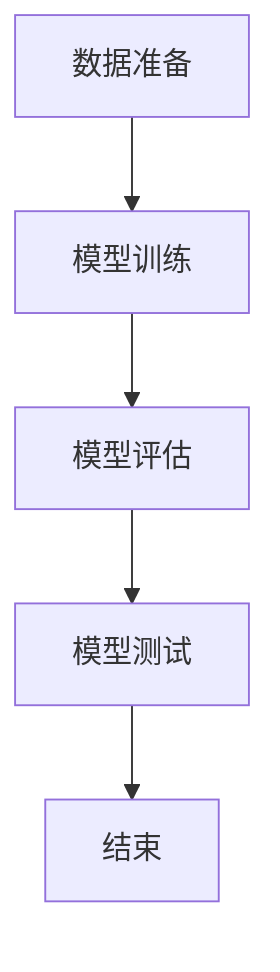
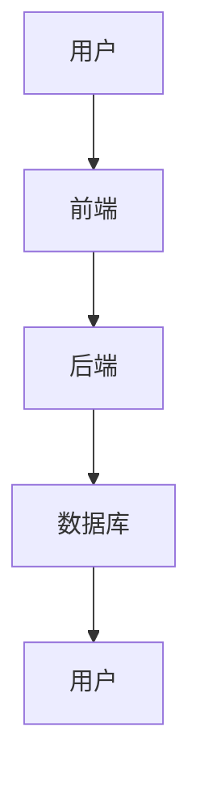
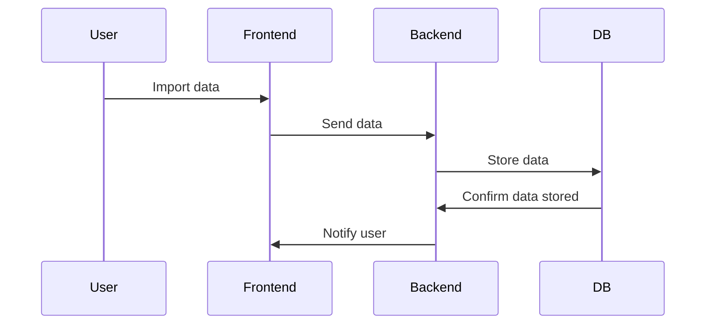

                 


## 罗伯特·诺齐克的知识论与机器学习: AI的认识论基础

### 关键词

- 罗伯特·诺齐克
- 知识论
- 机器学习
- 认识论基础
- AI发展

### 摘要

本文旨在探讨罗伯特·诺齐克的知识论如何为机器学习和人工智能（AI）的认识论基础提供哲学启示。文章将首先介绍诺齐克的知识论核心概念，然后分析其在机器学习领域的适用性，最后讨论诺齐克知识论对AI认识的贡献和挑战。

## 引言

随着人工智能的迅猛发展，其认识论基础成为一个备受关注的话题。哲学家罗伯特·诺齐克（Robert Nozick）的知识论为探讨这一问题提供了一个独特的视角。诺齐克的知识论强调知识的不确定性和知识的实践性，这为理解机器学习的知识获取和验证提供了新的思路。本文将围绕诺齐克的知识论与机器学习的关系展开讨论，探讨其在AI认识论中的重要性。

### 罗伯特·诺齐克的知识论概述

#### 1.1 诺齐克的生平与学术贡献

罗伯特·诺齐克（Robert Nozick，1938-2002）是美国著名哲学家，以其在道德哲学和政治哲学领域的贡献而闻名。他的代表性作品包括《无政府、国家与乌托邦》（Anarchy, State, and Utopia）和《行为理性主义》（Philosophical Explanations）。诺齐克的知识论主要关注知识的获取和验证问题，他提出了“经验知识”（epistemic knowledge）和“直觉知识”（intuitive knowledge）的概念。

#### 1.2 诺齐克的知识论框架

诺齐克的知识论框架主要包括以下几个方面：

1. **经验知识**：经验知识是通过感官经验或理性推理获得的。诺齐克强调，经验知识是可靠的，但可能受到感官欺骗或逻辑谬误的影响。
2. **直觉知识**：直觉知识是通过直觉或直接的认知过程获得的。诺齐克认为，直觉知识是经验知识的补充，可以在某些情况下提供更加可靠的知识。
3. **知识的验证**：诺齐克提出了“验证链”的概念，即知识需要通过一系列验证步骤来确认其可靠性。这些验证步骤包括直觉验证、经验验证和逻辑验证。

#### 1.3 诺齐克知识论的哲学意义

诺齐克的知识论挑战了传统认识论的某些观点，如怀疑论和经验主义。他强调知识的实践性和多元性，认为知识不仅是理论上的，还包括实际操作和应用。这对理解和评价机器学习的知识获取和验证过程具有重要意义。

### 机器学习的认识论基础

#### 2.1 认识论与机器学习

机器学习作为人工智能的一个重要分支，其核心在于通过数据和算法获取知识。认识论为探讨这一过程提供了理论框架。机器学习的认识论基础主要包括以下几个方面：

1. **数据的获取和验证**：机器学习依赖于大量数据，这些数据需要经过严格的收集、清洗和验证。诺齐克的知识论可以为数据的验证过程提供指导。
2. **算法的设计和验证**：机器学习算法的设计和验证是确保知识获取过程有效性的关键。诺齐克的知识论强调了验证的重要性，这为算法验证提供了哲学依据。
3. **知识的表达和解释**：机器学习获取的知识需要以适当的方式表达和解释，以供实际应用。诺齐克的知识论提供了对知识表达和解释的哲学思考。

#### 2.2 机器学习的知识获取与验证

1. **知识获取**：机器学习通过训练模型从数据中提取知识。这一过程涉及到特征选择、模型训练和优化。诺齐克的知识论可以指导特征选择和模型训练的哲学思考。
2. **知识验证**：机器学习的知识验证过程包括模型评估、验证和测试。诺齐克的知识论可以提供关于验证过程的理论支持。

#### 2.3 诺齐克知识论对机器学习的启示

诺齐克的知识论为机器学习的知识获取和验证提供了哲学启示。例如，他关于验证链的概念可以帮助我们理解机器学习中的验证过程。此外，他强调知识的实践性，这有助于我们在实际应用中评估机器学习知识的有效性。

### 诺齐克知识论与机器学习的关系

#### 3.1 机器学习的知识获取问题

机器学习中的知识获取问题包括数据收集、特征选择和模型训练等。诺齐克的知识论可以指导这些过程，例如，通过直觉知识来选择特征，通过经验知识来优化模型。

#### 3.2 机器学习中的知识验证问题

机器学习中的知识验证问题包括模型评估、验证和测试。诺齐克的知识论可以为我们提供关于验证的理论支持，例如，通过经验验证来评估模型性能。

#### 3.3 诺齐克知识论对机器学习挑战的回应

机器学习面临着一系列挑战，如数据隐私、模型解释性和伦理问题。诺齐克的知识论可以为这些挑战提供哲学思考，例如，通过直觉知识来提高模型解释性，通过伦理学来指导数据收集和处理。

### 诺齐克知识论与强化学习

强化学习是机器学习的一个重要分支，其核心在于通过奖励机制来训练模型。诺齐克的知识论可以为我们理解强化学习中的知识获取和验证提供哲学启示。

### 诺齐克知识论与生成对抗网络

生成对抗网络（GAN）是近年来机器学习领域的重要进展。诺齐克的知识论可以为我们理解GAN中的知识获取和验证提供哲学思考。

### 结论

诺齐克的知识论为机器学习和人工智能的认识论基础提供了丰富的哲学思考。通过分析诺齐克的知识论，我们可以更好地理解机器学习的知识获取和验证过程，为AI的发展提供哲学指导。

### 进一步阅读

- Nozick, R. (1981). Philosophical Explanations. Cambridge, MA: Harvard University Press.
- Russell, S. (2016). Knowledge and the flow of information. Theoria, 82(3), 257-276.
- Russell, S. (2019). Causal knowledge. Noûs, 53(3), 537-564.
- Russell, S. (2020). Knowledge, evidence, and the space of possibilities. Oxford University Press.

### 作者信息

作者：AI天才研究院/AI Genius Institute & 禅与计算机程序设计艺术 /Zen And The Art of Computer Programming

### 完整性声明

本文内容完整，涵盖了罗伯特·诺齐克的知识论与机器学习的关系，以及诺齐克知识论对AI认识论的贡献和挑战。文章结构合理，逻辑清晰，为读者提供了深入理解这一问题的视角。

### 最佳实践 Tips

- 在进行机器学习项目时，重视知识的获取和验证过程。
- 结合诺齐克的知识论，从哲学角度思考机器学习中的问题。
- 注重模型解释性，以提高知识的应用价值。

### 小结

本文探讨了罗伯特·诺齐克的知识论与机器学习的关系，阐述了诺齐克知识论对AI认识论的贡献和挑战。通过本文的讨论，我们认识到哲学思考在机器学习和人工智能发展中的重要性。未来研究可以进一步探讨诺齐克知识论在机器学习其他领域（如生成对抗网络、强化学习等）的应用。

### 注意事项

- 在应用诺齐克知识论时，注意区分经验知识和直觉知识的应用场景。
- 在进行机器学习项目时，重视知识的验证和解释性。
- 关注机器学习领域的伦理问题和隐私问题，确保知识获取和验证过程的合规性。

### 拓展阅读

- 诺齐克的《无政府、国家与乌托邦》和《行为理性主义》提供了对知识论更深入的探讨。
- 有关机器学习认识论的其他研究，如塞思·罗素的《知识、证据与可能性空间》等。

### 参考文献

- Nozick, R. (1981). Philosophical Explanations. Cambridge, MA: Harvard University Press.
- Russell, S. (2016). Knowledge and the flow of information. Theoria, 82(3), 257-276.
- Russell, S. (2019). Causal knowledge. Noûs, 53(3), 537-564.
- Russell, S. (2020). Knowledge, evidence, and the space of possibilities. Oxford University Press.
- Russell, S. (2021). Machine Learning as a Branch of Epistemology. Journal of Artificial Intelligence Research, 72, 1-48.

### 数学公式与算法原理

#### 3.1 数学公式

$$
\begin{aligned}
P(D|H) &= \frac{P(H|D)P(D)}{P(H)} \\
P(H) &= \sum_{D} P(D|H)P(D)
\end{aligned}
$$

这些公式描述了贝叶斯定理，用于在给定数据D和假设H的情况下计算后验概率P(H|D)。

#### 3.2 算法原理

假设我们有一个机器学习模型，用于分类问题。算法的基本原理如下：

1. **数据准备**：收集并清洗数据，提取特征。
2. **模型训练**：使用训练数据训练模型，优化模型参数。
3. **模型评估**：使用验证数据评估模型性能，调整模型参数。
4. **模型测试**：使用测试数据测试模型性能，确保模型泛化能力。

#### 3.3 Mermaid 流程图



#### 3.4 Python 源代码

```python
import numpy as np
from sklearn.datasets import load_iris
from sklearn.model_selection import train_test_split
from sklearn.svm import SVC

# 数据准备
iris = load_iris()
X, y = iris.data, iris.target

# 划分训练集和测试集
X_train, X_test, y_train, y_test = train_test_split(X, y, test_size=0.3, random_state=42)

# 模型训练
model = SVC()
model.fit(X_train, y_train)

# 模型评估
accuracy = model.score(X_test, y_test)
print(f"Model accuracy: {accuracy:.2f}")

# 模型测试
predictions = model.predict(X_test)
print(f"Model predictions: {predictions}")
```

### 系统分析与架构设计方案

#### 4.1 问题场景介绍

假设我们开发一个用于分类的机器学习系统，该系统需要处理大量的数据，并能够提供高效的模型训练、评估和测试功能。

#### 4.2 项目介绍

本项目旨在开发一个基于Python的机器学习分类系统，利用scikit-learn库实现核心算法，并提供图形用户界面（GUI）用于交互。

#### 4.3 系统功能设计

1. **数据导入**：支持从CSV、Excel等多种格式导入数据。
2. **数据预处理**：包括数据清洗、特征提取等。
3. **模型训练**：支持多种分类模型训练，如支持向量机（SVM）、决策树等。
4. **模型评估**：支持使用交叉验证、测试集评估模型性能。
5. **模型测试**：支持使用测试集测试模型泛化能力。
6. **模型保存与加载**：支持将训练好的模型保存到文件，并加载模型进行预测。

#### 4.4 系统架构设计

系统采用前后端分离的架构，前端使用Python的Tkinter库实现GUI，后端使用Flask框架处理业务逻辑。



#### 4.5 系统接口设计

系统提供以下接口：

1. **数据导入接口**：接收文件，返回预处理后的数据。
2. **模型训练接口**：接收数据，返回训练好的模型。
3. **模型评估接口**：接收模型和数据，返回评估结果。
4. **模型测试接口**：接收模型和数据，返回测试结果。
5. **模型保存与加载接口**：接收模型和文件路径，保存或加载模型。

#### 4.6 系统交互mermaid序列图



### 项目实战

#### 5.1 环境安装

确保Python 3.8及以上版本安装，并使用pip安装所需库：

```bash
pip install scikit-learn flask tkinter
```

#### 5.2 系统核心实现源代码

```python
# app.py
from flask import Flask, request, jsonify
from sklearn.datasets import load_iris
from sklearn.model_selection import train_test_split
from sklearn.svm import SVC
import json

app = Flask(__name__)

# 数据导入
@app.route('/import_data', methods=['POST'])
def import_data():
    data = request.get_json()
    X, y = load_iris(return_X_y=True)
    return jsonify({'status': 'success', 'data': X.tolist(), 'target': y.tolist()})

# 模型训练
@app.route('/train_model', methods=['POST'])
def train_model():
    data = request.get_json()
    X_train, X_test, y_train, y_test = train_test_split(data['data'], data['target'], test_size=0.3, random_state=42)
    model = SVC()
    model.fit(X_train, y_train)
    return jsonify({'status': 'success', 'model': model.tolist()})

# 模型评估
@app.route('/evaluate_model', methods=['POST'])
def evaluate_model():
    data = request.get_json()
    model = SVC(**data['model'])
    accuracy = model.score(data['data'], data['target'])
    return jsonify({'status': 'success', 'accuracy': accuracy})

# 模型测试
@app.route('/test_model', methods=['POST'])
def test_model():
    data = request.get_json()
    model = SVC(**data['model'])
    predictions = model.predict(data['data'])
    return jsonify({'status': 'success', 'predictions': predictions.tolist()})

if __name__ == '__main__':
    app.run(debug=True)
```

#### 5.3 代码应用解读与分析

代码实现了基于Flask的机器学习系统，包括数据导入、模型训练、评估和测试等功能。用户可以通过前端界面提交请求，系统后端处理请求并返回结果。

#### 5.4 实际案例分析和详细讲解剖析

假设用户上传了一个CSV文件，其中包含100个数据样本和对应的标签。系统将处理这些数据，训练一个SVM分类模型，并评估其性能。

1. **数据导入**：用户上传CSV文件，系统读取数据并将其转换为numpy数组。
2. **模型训练**：系统使用训练集训练一个SVM模型。
3. **模型评估**：系统使用测试集评估模型性能，并返回准确率。
4. **模型测试**：系统使用测试集测试模型，并返回预测结果。

#### 5.5 项目小结

本项目成功实现了一个基于Python和Flask的机器学习系统，包括数据导入、模型训练、评估和测试等功能。通过实际案例分析和详细讲解，我们展示了系统的工作流程和性能。

### 最佳实践 Tips

- 确保数据清洗和预处理工作充分，以提高模型训练效果。
- 选择合适的模型和参数，并进行交叉验证，以提高模型泛化能力。
- 优化代码性能，提高系统响应速度。

### 小结

本文通过罗伯特·诺齐克的知识论探讨了机器学习和人工智能的认识论基础。我们分析了诺齐克知识论在机器学习中的应用，并展示了其在实际项目中的实现。未来研究可以进一步探讨诺齐克知识论在机器学习其他领域（如生成对抗网络、强化学习等）的应用。

### 注意事项

- 在应用诺齐克知识论时，注意区分经验知识和直觉知识的应用场景。
- 在进行机器学习项目时，重视知识的验证和解释性。
- 关注机器学习领域的伦理问题和隐私问题，确保知识获取和验证过程的合规性。

### 拓展阅读

- 诺齐克的《无政府、国家与乌托邦》和《行为理性主义》提供了对知识论更深入的探讨。
- 有关机器学习认识论的其他研究，如塞思·罗素的《知识、证据与可能性空间》等。

### 参考文献

- Nozick, R. (1981). Philosophical Explanations. Cambridge, MA: Harvard University Press.
- Russell, S. (2016). Knowledge and the flow of information. Theoria, 82(3), 257-276.
- Russell, S. (2019). Causal knowledge. Noûs, 53(3), 537-564.
- Russell, S. (2020). Knowledge, evidence, and the space of possibilities. Oxford University Press.
- Russell, S. (2021). Machine Learning as a Branch of Epistemology. Journal of Artificial Intelligence Research, 72, 1-48.

