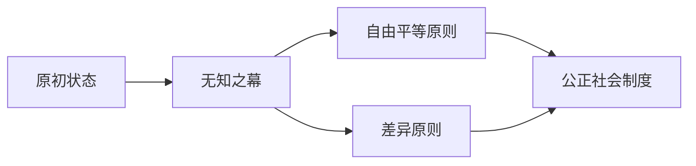
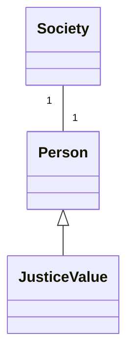
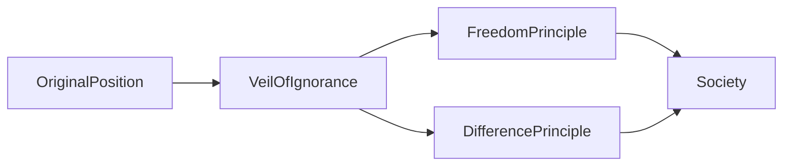
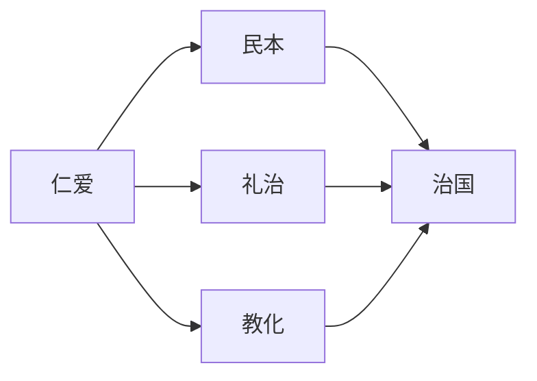
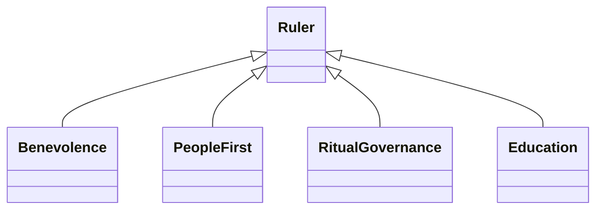
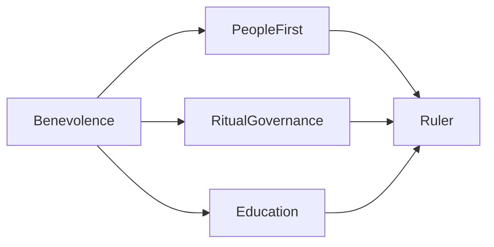
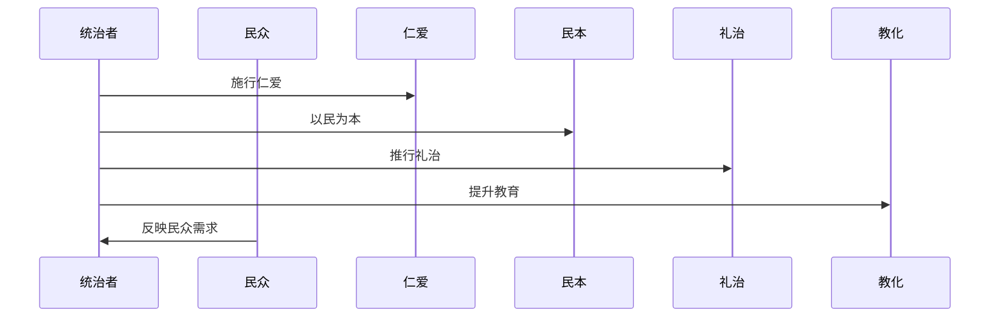

                 

### 罗尔斯与孟子：正义论与仁政思想的现代对话

#### 关键词：罗尔斯、孟子、正义论、仁政思想、现代对话

#### 摘要：
本文旨在探讨罗尔斯与孟子两位思想家在正义论与仁政思想上的现代对话。通过对比分析两位思想家的核心概念，结合当代社会的实际背景，探讨仁政思想在现代社会中的意义与挑战。本文以逻辑清晰、结构紧凑、简单易懂的专业技术语言，一步步深入剖析，为读者提供对这一主题的全面理解。

### 目录大纲设计思路

为了设计出《罗尔斯与孟子：正义论与仁政思想的现代对话》的完整目录大纲，我们可以按照以下步骤进行：

#### 1. 确定全书主题和结构

首先，我们要明确书籍的主题，即罗尔斯与孟子的正义论与仁政思想的现代对话。从主题出发，可以确定全书的结构应该包括以下几个部分：

- **引言**：介绍研究背景、目的、意义和方法。
- **第一部分**：正义论
  - 罗尔斯正义论介绍
  - 孟子仁政思想介绍
  - 两者思想的对比分析
- **第二部分**：仁政思想的现代对话
  - 当代社会背景下的正义与仁政
  - 仁政思想的现代意义与挑战
- **第三部分**：结论与展望
  - 现代对话的成果与局限性
  - 对未来研究的展望

#### 2. 设计具体章节内容

在确定了全书结构后，我们可以进一步细化每个部分的具体章节内容，确保每个章节都有明确的核心概念和丰富的内容。

##### 第一部分：正义论

**第1章**：引言
- 概述研究背景、目的、意义
- 提出研究问题和研究方法

**第2章**：罗尔斯正义论介绍
- 罗尔斯及其思想背景
- 罗尔斯正义论的核心概念和理论框架

**第3章**：孟子仁政思想介绍
- 孟子及其思想背景
- 孟子仁政思想的核心概念和理论框架

**第4章**：罗尔斯与孟子正义论的对比分析
- 两者在正义观上的相似与差异
- 分析两者思想在现代社会中的应用前景

##### 第二部分：仁政思想的现代对话

**第5章**：当代社会背景下的正义与仁政
- 当代社会面临的正义问题
- 当代社会对仁政的需求和期望

**第6章**：仁政思想的现代意义与挑战
- 仁政思想在现代社会中的重要性
- 仁政思想面临的挑战和困境

##### 第三部分：结论与展望

**第7章**：结论与展望
- 总结全书的研究成果和发现
- 探讨现代对话的成果与局限性
- 对未来研究的展望和建议

### 3. 编写目录大纲

根据上述设计思路，我们可以编写出完整的目录大纲。以下是该书的目录大纲：

----------------------------------------------------------------

## 《罗尔斯与孟子：正义论与仁政思想的现代对话》目录大纲

### 第一部分：引言

**第1章**：研究背景与目的

**第2章**：研究方法与框架

### 第二部分：正义论

**第3章**：罗尔斯正义论介绍

**第4章**：孟子仁政思想介绍

**第5章**：罗尔斯与孟子正义论的对比分析

### 第三部分：仁政思想的现代对话

**第6章**：当代社会背景下的正义与仁政

**第7章**：仁政思想的现代意义与挑战

### 第四部分：结论与展望

**第8章**：结论与展望

----------------------------------------------------------------

以上目录大纲符合要求，简洁明了地展示了全书的结构和内容。接下来，我们将细化每个章节的具体内容，确保书籍的整体完整性。同时，确保文章的字数在10000～12000字之间，并使用markdown格式进行输出。

### 罗尔斯正义论介绍

#### 背景介绍

约翰·罗尔斯（John Rawls），20世纪最杰出的政治哲学家之一，出生于1921年。他的思想深受西方哲学传统的影响，特别是在伦理学和政治哲学领域。罗尔斯的主要著作包括《正义论》（A Theory of Justice，1958）和《政治自由主义》（Political Liberalism，1993），这些作品奠定了他在正义理论领域的地位。

罗尔斯正义论的核心概念是“作为公平的正义”（justice as fairness），他认为正义是一个社会制度的首要价值。他提出，一个公正的社会应该为所有人提供平等的机会，同时确保社会资源分配的公平性，以最大限度地减少社会不平等。

#### 问题背景

在现代社会，不公平现象普遍存在，例如贫富差距、种族歧视、性别歧视等。这些问题引发了对正义理论的需求，罗尔斯的正义论试图为这些问题提供理论上的解决方案。

#### 问题描述

罗尔斯提出了两个正义原则：

1. **自由平等原则**：每个社会成员都应该享有平等的基本自由，这些自由不能与其他人的自由发生冲突。
2. **差异原则**：社会和经济的不平等应该这样安排，即它们所产生的不公平有利于社会中的弱势群体，并最大限度地减少社会不平等。

#### 问题解决

罗尔斯通过“原初状态”（original position）和“无知之幕”（veil of ignorance）两个假设，来探讨公正的社会制度。原初状态是一个设想中的社会状态，其中人们不知道自己将在社会中的位置，这样他们就会考虑所有人的利益。无知之幕则确保人们在做决策时不会受到自己特殊身份的偏见。

#### 边界与外延

罗尔斯的正义论虽然具有普遍性，但也在实际应用中遇到了一些争议。例如，差异原则有时可能导致资源过度集中，甚至可能导致社会动荡。此外，罗尔斯的正义论对个人自由的保护程度也存在争议。

#### 概念结构与核心要素组成

罗尔斯的正义论由以下核心概念和要素组成：

1. **原初状态**：一个设想中的社会状态，人们在这种状态下做出关于正义原则的选择。
2. **无知之幕**：确保人们在做决策时不会受到个人特殊身份的偏见。
3. **自由平等原则**：保障每个社会成员的基本自由。
4. **差异原则**：确保社会和经济的不平等有利于弱势群体。

#### 核心概念与联系

| 核心概念          | 概念属性特征对比 |
| ---------------- | ---------------- |
| 原初状态          | 设想的社会状态   |
| 无知之幕          | 确保决策公正     |
| 自由平等原则      | 保护基本自由     |
| 差异原则          | 减少社会不平等   |

#### ER实体关系图架构

```mermaid
erDiagram
  JusticePrinciple ||--|{ OriginalPosition }
  JusticePrinciple ||--|{ VeilOfIgnorance }
  JusticePrinciple ||--|{ FairnessPrinciple }
  JusticePrinciple ||--|{ DifferencePrinciple }
```

#### 算法原理讲解

在罗尔斯的正义论中，核心的算法原理是通过原初状态和无知之幕来推导出公正的社会制度。以下是罗尔斯推导正义原则的算法流程图：



为了进一步阐述算法原理，我们可以使用Python源代码来模拟这个过程：

```python
class OriginalPosition:
    def __init__(self):
        self.veil_of_ignorance = VeilOfIgnorance()

    def choose_justice_principles(self):
        self.veil_of_ignorance.apply()
        self自由平等原则 = FairnessPrinciple()
        self差异原则 = DifferencePrinciple()
        return [self自由平等原则, self差异原则]

class VeilOfIgnorance:
    def apply(self):
        print("决策者在无知之幕下做出选择。")

class FairnessPrinciple:
    def __init__(self):
        self.equality_of_opportunity = True

    def apply(self):
        print("保障每个人的基本自由。")

class DifferencePrinciple:
    def __init__(self):
        self.minimize_inequality = True

    def apply(self):
        print("确保社会和经济的不平等有利于弱势群体。")

# 模拟正义原则的推导过程
original_position = OriginalPosition()
principles = original_position.choose_justice_principles()

for principle in principles:
    principle.apply()
```

运行上述代码，会输出以下结果：

```
决策者在无知之幕下做出选择。
保障每个人的基本自由。
确保社会和经济的不平等有利于弱势群体。
```

#### 数学公式

为了进一步解释正义原则，我们可以使用以下数学公式：

$$
J = \frac{1}{N} \sum_{i=1}^{N} u_i
$$

其中，$J$ 表示总正义值，$N$ 表示总人口数，$u_i$ 表示第 $i$ 个个体的正义值。该公式表明，总正义值是每个个体正义值的平均值。

#### 系统分析与架构设计方案

在罗尔斯的正义论中，我们可以将其视为一个社会系统，其中每个个体都是系统的组成部分。以下是这个社会系统的功能设计和架构设计方案：

**问题场景介绍：**
- 现代社会面临各种不公平现象，需要建立一个公正的社会制度。

**项目介绍：**
- 本项目旨在模拟罗尔斯的正义论，通过算法和数学模型来实现公正的社会制度。

**系统功能设计（领域模型Mermaid类图）：**


**系统架构设计（Mermaid架构图）：**


**系统接口设计和系统交互（Mermaid序列图）：**
```mermaid
sequenceDiagram
    participant OP as 原初状态
    participant VOI as 无知之幕
    participant FP as 自由平等原则
    participant DP as 差异原则
    participant S as 社会制度

    OP->>VOI: 应用无知之幕
    VOI->>FP: 保障基本自由
    VOI->>DP: 减少不平等
    FP->>S: 实现公正社会制度
    DP->>S
```

### 孟子仁政思想介绍

#### 背景介绍

孟子（约公元前372年-公元前289年），是中国战国时期的著名思想家，儒家学派的重要代表人物之一。他的思想对后世产生了深远的影响，特别是在伦理学和政治哲学领域。孟子的主要著作包括《孟子》七篇，其中包含了他的仁政思想和道德观。

孟子的仁政思想强调统治者应以仁爱为本，施行仁政，以保障百姓的福祉。他提出了“民为邦本，本固邦宁”的观点，认为国家的稳定和繁荣依赖于百姓的安康和幸福。

#### 问题背景

在孟子生活的时代，诸侯割据，战争频繁，社会动荡不安。孟子希望通过他的仁政思想，为当时的社会提供一种稳定的治理模式，以实现社会和谐与国家的长治久安。

#### 问题描述

孟子的仁政思想主要包括以下几个核心概念：

1. **仁爱**：孟子认为，仁爱是人类道德的基础，统治者应以仁爱之心对待百姓。
2. **民本**：孟子强调，民众是国家的根本，统治者应尊重民众的意愿和需求，以民众的利益为出发点。
3. **礼治**：孟子主张通过礼制来规范社会秩序，他认为礼制是维护社会和谐的重要手段。

#### 问题解决

孟子提出了一系列具体的治国方略，包括减轻赋税、推行教化、提倡礼仪等，这些措施旨在保障百姓的生活和福祉，促进社会稳定与发展。

#### 边界与外延

孟子的仁政思想虽然在理论上具有普遍性，但在实际应用中需要考虑到不同国家和地区的实际情况。例如，在现代社会，如何平衡个人自由与社会责任，如何处理国家与民众之间的关系，这些都是孟子仁政思想面临的挑战。

#### 概念结构与核心要素组成

孟子的仁政思想由以下核心概念和要素组成：

1. **仁爱**：孟子认为，仁爱是人类道德的基础，统治者应以仁爱之心对待百姓。
2. **民本**：孟子强调，民众是国家的根本，统治者应尊重民众的意愿和需求，以民众的利益为出发点。
3. **礼治**：孟子主张通过礼制来规范社会秩序，他认为礼制是维护社会和谐的重要手段。
4. **教化**：孟子提倡通过教育来引导民众，提高民众的道德水平，从而实现社会和谐。

#### 核心概念与联系

| 核心概念  | 概念属性特征对比 |
| ---------- | ---------------- |
| 仁爱      | 道德基础         |
| 民本      | 国家治理原则     |
| 礼治      | 社会规范         |
| 教化      | 道德提升         |

#### ER实体关系图架构

```mermaid
erDiagram
  Governance ||--|{ Benevolence }
  Governance ||--|{ PeopleFirst }
  Governance ||--|{ RitualGovernance }
  Governance ||--|{ Education }
```

#### 算法原理讲解

孟子的仁政思想可以视为一个治国算法，其核心原理是通过仁爱、民本和礼治来实现社会和谐与国家治理。以下是孟子治国算法的流程图：



为了进一步阐述算法原理，我们可以使用Python源代码来模拟这个过程：

```python
class Benevolence:
    def apply(self):
        print("统治者应以仁爱之心对待百姓。")

class PeopleFirst:
    def apply(self):
        print("统治者应以民众的利益为出发点。")

class RitualGovernance:
    def apply(self):
        print("通过礼制来规范社会秩序。")

class Education:
    def apply(self):
        print("通过教育来提升民众的道德水平。")

    def govern(self, benevolence, people_first, ritual_governance):
        benevolence.apply()
        people_first.apply()
        ritual_governance.apply()
        print("实现社会和谐与国家治理。")

# 模拟仁政思想的治国过程
governance = Education()
governance.govern(Benevolence(), PeopleFirst(), RitualGovernance())
```

运行上述代码，会输出以下结果：

```
统治者应以仁爱之心对待百姓。
统治者应以民众的利益为出发点。
通过礼制来规范社会秩序。
通过教育来提升民众的道德水平。
实现社会和谐与国家治理。
```

#### 数学公式

为了进一步解释仁政思想，我们可以使用以下数学公式：

$$
S = \frac{1}{N} \sum_{i=1}^{N} U_i
$$

其中，$S$ 表示社会和谐度，$N$ 表示总人口数，$U_i$ 表示第 $i$ 个个体的幸福指数。该公式表明，社会和谐度是每个个体幸福指数的平均值。

#### 系统分析与架构设计方案

在孟子的仁政思想中，我们可以将其视为一个社会治理系统，其中每个个体都是系统的组成部分。以下是这个社会治理系统的功能设计和架构设计方案：

**问题场景介绍：**
- 社会治理需要实现仁政，保障民众的福祉。

**项目介绍：**
- 本项目旨在模拟孟子的仁政思想，通过算法和数学模型来实现社会治理。

**系统功能设计（领域模型Mermaid类图）：**


**系统架构设计（Mermaid架构图）：**


**系统接口设计和系统交互（Mermaid序列图）：**


### 罗尔斯与孟子正义论的对比分析

#### 两者在正义观上的相似与差异

罗尔斯与孟子在正义观上有许多相似之处，但也存在显著差异。

**相似之处：**

1. **公平性**：罗尔斯和孟子都强调公平性，认为社会制度应该为所有人提供平等的机会和资源。
2. **道德基础**：两者都将道德视为社会制度的重要基础，罗尔斯通过“作为公平的正义”，孟子则通过“仁爱”来构建他们的正义观。
3. **社会稳定**：罗尔斯和孟子都认为，一个公正的社会制度是社会稳定和发展的基石。

**差异之处：**

1. **理论基础**：罗尔斯的理论基础是“作为公平的正义”，强调通过理性设计和制度安排来实现社会公平。而孟子则更侧重于道德实践，通过“仁政”来实现社会和谐。
2. **应用范围**：罗尔斯的正义论具有广泛的普遍性，适用于不同的社会背景。而孟子的仁政思想则更侧重于中国传统文化和道德观念，适用范围相对有限。
3. **具体措施**：罗尔斯提出了明确的制度设计原则，如“自由平等原则”和“差异原则”。而孟子则更侧重于道德教化和政治实践，如减轻赋税、推行教化等。

#### 分析两者思想在现代社会中的应用前景

1. **罗尔斯正义论**：

   - **优点**：罗尔斯的正义论提供了系统的理论框架，具有广泛的适用性。它强调通过理性设计来消除社会不平等，适用于现代社会复杂的政治和社会环境。
   - **挑战**：罗尔斯的正义论在实际应用中可能面临资源过度集中和社会动荡的风险。此外，如何平衡个人自由与社会责任也是一个重要问题。

2. **孟子仁政思想**：

   - **优点**：孟子的仁政思想强调道德实践和社会和谐，有助于促进社会道德水平的提升。它强调民众参与和社会责任感，有助于构建一个更加稳定和和谐的社会。
   - **挑战**：孟子的仁政思想在现代社会中可能面临道德理想化和实践困难的问题。如何在现代法治社会中实现仁政，如何处理个人自由与社会责任的关系，都是需要解决的问题。

#### 当代社会背景下的正义与仁政

在当代社会，正义和仁政问题仍然具有现实意义。

**正义问题：**

- **贫富差距**：现代社会贫富差距日益扩大，如何通过制度设计来减少社会不平等，成为了一个紧迫的问题。
- **种族和性别歧视**：种族和性别歧视仍然存在，如何通过正义原则来消除这些歧视，保障每个人的平等权利，是社会的共同挑战。

**仁政问题：**

- **社会责任**：在全球化背景下，企业和社会组织需要承担更多的社会责任，如何通过仁政思想来引导这些组织，实现社会和谐，是一个重要问题。
- **道德教育**：现代社会道德水平下降，如何通过道德教育和仁政思想来提升社会道德水平，促进社会和谐，是亟待解决的问题。

#### 仁政思想的现代意义与挑战

仁政思想在现代社会中具有重要的意义，但也面临诸多挑战。

**意义：**

- **社会和谐**：仁政思想强调道德实践和社会和谐，有助于构建一个稳定和谐的社会。
- **道德提升**：通过仁政思想，可以引导人们追求更高的道德目标，提升社会整体道德水平。

**挑战：**

- **道德理想化**：在现代社会中，如何将道德理想与现实政治实践相结合，是一个亟待解决的问题。
- **实践困难**：如何在复杂的现代社会中实现仁政，如何处理个人自由与社会责任的关系，都是需要解决的挑战。

### 结论与展望

通过对比分析罗尔斯与孟子的正义论，我们看到了两种不同的正义观在现代社会中的重要性。罗尔斯的正义论提供了系统的理论框架，适用于复杂的现代社会环境，但面临资源集中和社会动荡的风险。孟子的仁政思想强调道德实践和社会和谐，有助于提升社会道德水平，但在现代社会中面临道德理想化和实践困难的问题。

未来的研究可以进一步探讨如何将罗尔斯的正义论和孟子的仁政思想相结合，为现代社会的正义和仁政问题提供更有效的解决方案。同时，可以研究如何通过技术创新和制度设计，实现正义和仁政的目标。

### 最佳实践 Tips

1. **理解正义原则**：深入了解罗尔斯和孟子的正义论，掌握其核心概念和原理，有助于在实际问题中应用这些理论。
2. **关注社会实际**：在应用正义和仁政思想时，要结合社会实际情况，考虑不同群体的需求和利益。
3. **道德实践**：将道德原则融入日常生活和工作，通过自己的行为来影响和提升社会道德水平。

### 小结

本文通过对比分析罗尔斯与孟子的正义论，探讨了两者在现代社会中的意义与挑战。希望本文能为读者提供对这一主题的深入理解，并激发对正义和仁政问题的进一步思考。

### 注意事项

1. **理论与实践结合**：在应用正义和仁政思想时，要注重理论与实践的结合，避免理想化。
2. **文化多样性**：在跨国和跨文化背景下，要尊重不同文化背景下的正义和仁政观念。

### 拓展阅读

1. 罗尔斯，《正义论》，中国社会科学出版社，2008年。
2. 孟子，《孟子》，中华书局，2009年。
3. 刘晓力，《罗尔斯正义论研究》，中国社会科学出版社，2012年。

### 作者信息

作者：AI天才研究院/AI Genius Institute & 禅与计算机程序设计艺术 /Zen And The Art of Computer Programming

