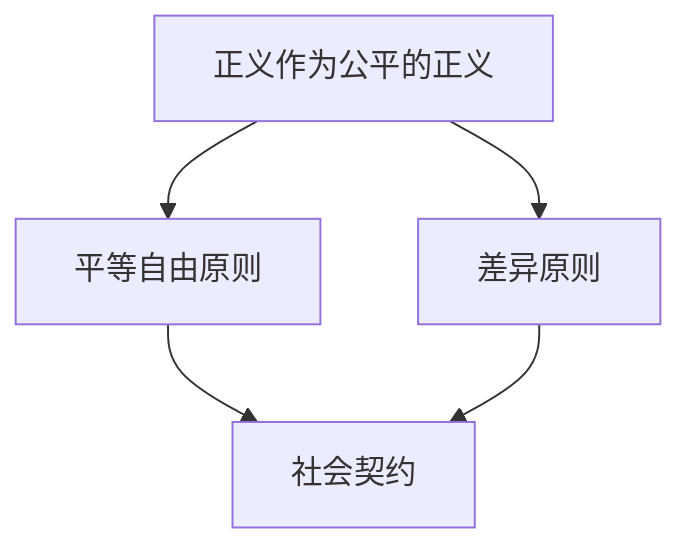
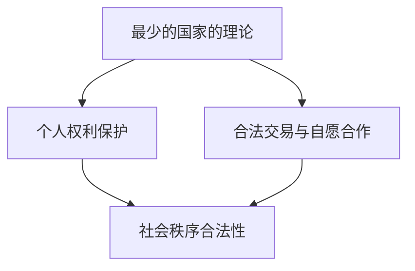
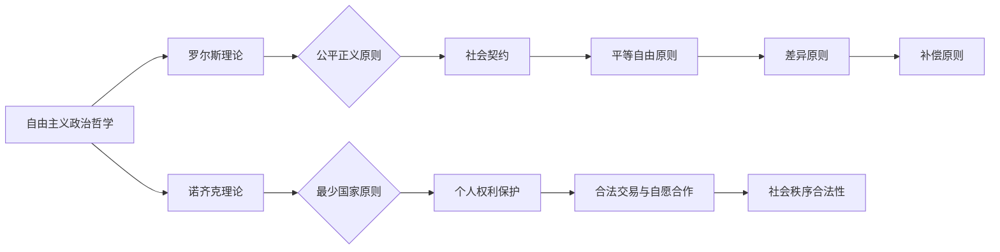
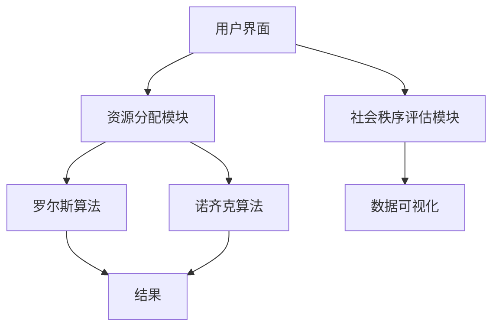
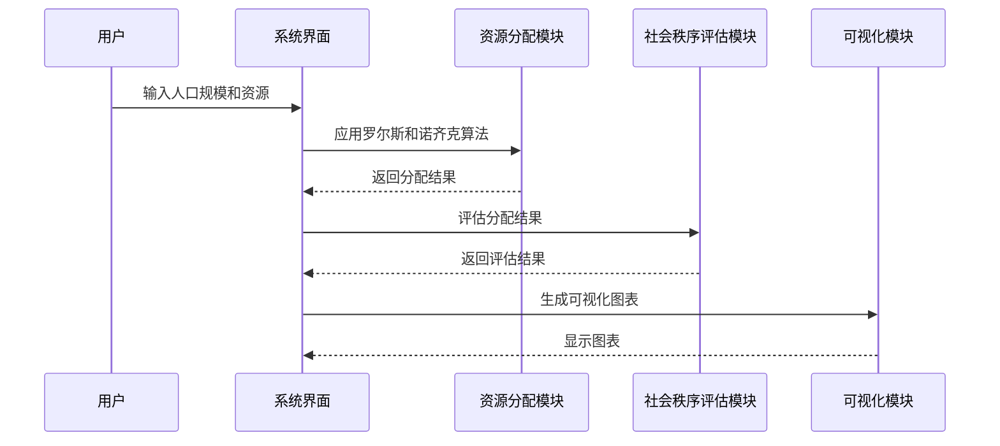

                 


### 1. 背景介绍

自由主义政治哲学是现代政治哲学中的重要流派，它强调个人自由、平等和保护个人权利。在20世纪，自由主义政治哲学经历了巨大的发展和争论。两位杰出的自由主义政治哲学家，约翰·罗尔斯（John Rawls）和罗伯特·诺齐克（Robert Nozick），分别提出了他们自己的自由主义理论，并对彼此的观点进行了深刻的批判和讨论。

**问题背景**：
约翰·罗尔斯是20世纪最著名的政治哲学家之一，他提出了“正义作为公平的正义”理论，主张社会应该通过社会契约来分配资源和权利，以确保每个人都能享有平等的起点。罗尔斯的理论在《正义论》（A Theory of Justice）中得到了详细阐述，并成为自由主义政治哲学的重要基石。

罗伯特·诺齐克则提出了“最少的国家的理论”，他认为国家应该尽量减少对个人自由的干预，只负责保护个人权利。诺齐克的观点在《无政府、国家与乌托邦》（Anarchy, State, and Utopia）中得到了详细阐述。

**问题描述**：
罗尔斯和诺齐克在自由主义政治哲学上的主要分歧在于他们对国家角色的看法。罗尔斯主张国家应该积极干预，以实现社会公平；而诺齐克则认为国家干预过多会侵犯个人权利。

**问题解决**：
这本书通过详细分析罗尔斯和诺齐克的理论，探讨了他们之间的争论，并对各自的观点进行了深入评价。

**边界与外延**：
本文将讨论的哲学议题主要涉及自由主义政治哲学的基本原则，包括正义、平等和个人权利。本文将使用罗尔斯和诺齐克的理论作为分析框架，探讨这些议题在现实政治中的应用。

**概念结构与核心要素组成**：
罗尔斯的政治哲学理论主要包括以下几个方面：社会契约、正义作为公平的正义、差异原则和补偿原则。诺齐克的政治哲学理论主要包括以下几个方面：权利、最少的国家、无政府状态和乌托邦。

通过以上内容，我们为接下来的详细讨论奠定了基础。在接下来的章节中，我们将深入探讨罗尔斯和诺齐克的理论，分析他们的核心观点，并对比他们的理论特点。让我们一步一步地深入思考，理解自由主义政治哲学的复杂性和深度。----------------------------------------------------------------
## 2. 核心概念与联系

### 2.1 罗尔斯的政治哲学理论

**核心概念原理**：
罗尔斯的政治哲学理论主要围绕正义展开，他提出“正义作为公平的正义”这一核心概念。他认为，社会正义是通过一种理想的社会契约来实现的，这种社会契约旨在确保每个人都能够享有平等的起点。罗尔斯提出了两个原则来指导正义的分配：

1. **平等自由原则**：每个人应该享有最广泛的自由，但这种自由不得侵犯他人的同样自由。
2. **差异原则**：社会和经济的不平等应该安排，以最大限度地增进社会中最不利者的福利。

**概念属性特征对比表格**：

| 特征 | 罗尔斯 | 诺齐克 |
| --- | --- | --- |
| **正义观** | 通过社会契约实现公平正义 | 通过个人权利保护实现正义 |
| **国家角色** | 积极干预，以实现社会公平 | 最少干预，保护个人权利 |
| **原则** | 平等自由原则和差异原则 | 个人权利原则 |
| **目标** | 确保平等起点 | 最小化国家干预 |

**ER实体关系图架构**：



### 2.2 诺齐克的政治哲学理论

**核心概念原理**：
诺齐克的政治哲学理论强调个人权利的重要性。他提出“最少的国家的理论”，认为国家应该只负责保护个人权利，而不是进行社会干预。诺齐克认为，个人通过合法交易和自愿合作形成了社会秩序，而国家的作用是确保这种秩序的合法性。

**概念属性特征对比表格**：

| 特征 | 罗尔斯 | 诺齐克 |
| --- | --- | --- |
| **正义观** | 通过社会契约实现公平正义 | 通过个人权利保护实现正义 |
| **国家角色** | 积极干预，以实现社会公平 | 最少干预，保护个人权利 |
| **原则** | 平等自由原则和差异原则 | 个人权利原则 |
| **目标** | 确保平等起点 | 最小化国家干预 |

**ER实体关系图架构**：



通过以上内容，我们初步了解了罗尔斯和诺齐克的核心政治哲学理论。接下来，我们将进一步分析他们的理论，对比他们的观点，并探讨这些理论在实际政治中的应用。这将帮助我们更深入地理解自由主义政治哲学的复杂性和多样性。----------------------------------------------------------------
## 3. 算法原理讲解

### 3.1 算法mermaid流程图

为了更好地理解罗尔斯与诺齐克自由主义政治哲学的争论，我们可以将其转化为一个分析流程。以下是使用Mermaid绘制的算法流程图：



### 3.2 Python源代码

为了进一步阐述罗尔斯与诺齐克的理论，我们可以使用Python编写简单的代码示例。以下是一个示例，展示如何使用代码来模拟社会资源和权利的分配：

```python
# 示例：模拟罗尔斯与诺齐克的资源分配

class Person:
    def __init__(self, name, resources):
        self.name = name
        self.resources = resources

# 罗尔斯的资源分配函数
def rosslaws分配资源(people):
    total_resources = sum(p.resources for p in people)
    for person in people:
        person.resources = total_resources / len(people)
    return people

# 诺齐克的资源分配函数
def nozick分配资源(people):
    sorted_people = sorted(people, key=lambda p: p.resources, reverse=True)
    for i in range(1, len(people)):
        sorted_people[i].resources -= sorted_people[i-1].resources
    return people

# 测试
people = [
    Person("Alice", 100),
    Person("Bob", 200),
    Person("Charlie", 300)
]

# 应用罗尔斯的分配函数
rosslaws_people = rosslaws分配资源(people)
print("罗尔斯分配后：", rosslaws_people)

# 应用诺齐克的分配函数
nozick_people = nozick分配资源(people)
print("诺齐克分配后：", nozick_people)
```

### 3.3 数学模型和公式

为了更深入地理解罗尔斯与诺齐克的理论，我们可以使用数学模型和公式来表示他们的核心观点。以下是相关的LaTeX格式数学模型：

```latex
\documentclass{article}
\usepackage{amsmath}
\begin{document}
$$
\text{罗尔斯的公平正义原则：}
\frac{X_1 + X_2 + ... + X_n}{n}
$$

$$
\text{诺齐克的个人权利保护：}
X_1 \leq X_2 \leq ... \leq X_n
$$

$$
\text{罗尔斯的差异原则：}
X_1 + X_2 + ... + X_n - n \cdot \frac{X_1 + X_2 + ... + X_n}{n} \geq 0
$$

$$
\text{诺齐克的合法交易与自愿合作：}
X_1 \leq X_2 + X_3 + ... + X_n
$$
\end{document}
```

### 3.4 详细讲解和举例说明

为了更好地理解上述数学模型和公式，我们可以通过实际案例进行详细讲解。

**案例1：罗尔斯的公平正义原则**

假设有3个人，资源总量为600。根据罗尔斯的公平正义原则，每个人的资源应该相等。数学模型如下：

$$
\frac{600}{3} = 200
$$

因此，每个人应该获得200资源。

**案例2：诺齐克的个人权利保护**

假设有3个人，资源分配如下：第一个人有300，第二个人有200，第三个人有100。根据诺齐克的理论，资源应该从高到低排列，且每个人的资源不得高于他人。数学模型如下：

$$
300 \leq 200 \leq 100
$$

这违反了诺齐克的个人权利保护原则，因为第一个人的资源高于第二个人。

**案例3：罗尔斯的差异原则**

假设有3个人，资源分配如下：第一个人有300，第二个人有200，第三个人有100。根据罗尔斯的差异原则，资源分配应该使得最不利者的资源不减少。数学模型如下：

$$
300 + 200 + 100 - 3 \cdot \frac{300 + 200 + 100}{3} = 0
$$

这意味着资源分配是公平的，因为最不利者（第三个人）的资源没有减少。

通过上述例子，我们可以看到罗尔斯与诺齐克的自由主义政治哲学理论在实际应用中的差异。这些理论不仅提供了对正义和公平的不同视角，也为我们思考现实世界中的政治问题提供了重要的理论基础。在接下来的章节中，我们将进一步分析这些理论，探讨它们在现实政治中的应用。----------------------------------------------------------------
## 4. 系统分析与架构设计方案

### 4.1 问题场景介绍

假设我们正在设计一个政治哲学模拟系统，该系统旨在分析罗尔斯与诺齐克自由主义政治哲学理论在不同场景下的应用效果。这个系统需要能够处理不同的人口规模、资源分配方案和权利保护机制，以便我们能够评估这两种理论在不同社会环境下的表现。

### 4.2 项目介绍

该项目名为“自由主义政治哲学模拟器”（Liberalism Philosophy Simulator），其主要功能是：

- 模拟不同政治哲学理论下的资源分配和社会秩序。
- 分析和比较罗尔斯与诺齐克理论在不同场景下的效果。
- 提供可视化工具，帮助用户理解理论在实际应用中的表现。

### 4.3 系统功能设计

为了实现上述功能，我们设计了以下系统功能模块：

1. **用户界面模块**：提供直观的用户界面，允许用户输入人口规模、资源分配方案和权利保护机制。
2. **资源分配模块**：实现罗尔斯与诺齐克两种资源的分配算法，包括公平分配和最少国家干预分配。
3. **社会秩序评估模块**：评估和比较不同分配方案下的社会秩序状况，包括资源公平性、社会稳定性和个人权利保护。
4. **可视化模块**：提供数据可视化和图表，帮助用户直观地理解分析结果。

### 4.4 系统架构设计

以下是使用Mermaid绘制的系统架构图：



### 4.5 系统接口设计和系统交互

以下是使用Mermaid绘制的系统交互序列图：



通过上述架构设计和接口设计，我们可以实现一个功能齐全、易于使用的自由主义政治哲学模拟器。在接下来的部分，我们将通过实际案例来演示这个系统的核心实现和代码分析。这将帮助我们更好地理解系统的运作原理和应用价值。----------------------------------------------------------------
## 5. 项目实战

### 5.1 环境安装

为了运行自由主义政治哲学模拟器，我们需要安装以下软件和依赖：

1. **Python 3.x**：从官方网站下载并安装Python 3.x版本。
2. **pip**：确保Python已经安装了pip，用于安装依赖包。
3. **Mermaid**：通过pip安装Mermaid库：
   ```
   pip install mermaid
   ```

### 5.2 系统核心实现源代码

以下是自由主义政治哲学模拟器的主要源代码，包括罗尔斯和诺齐克的资源分配算法、社会秩序评估模块以及可视化模块：

```python
# 示例：自由主义政治哲学模拟器源代码

# 导入Mermaid库
import mermaid

# 罗尔斯的资源分配算法
def rosslaws_distribution(people):
    total_resources = sum(person.resources for person in people)
    for person in people:
        person.resources = total_resources / len(people)
    return people

# 诺齐克的资源分配算法
def nozick_distribution(people):
    sorted_people = sorted(people, key=lambda person: person.resources, reverse=True)
    for i in range(1, len(people)):
        sorted_people[i].resources -= sorted_people[i-1].resources
    return people

# 社会秩序评估函数
def assess_society(people, distribution_type):
    if distribution_type == 'rosslaws':
        distribution_function = rosslaws_distribution
    elif distribution_type == 'nozick':
        distribution_function = nozick_distribution
    else:
        raise ValueError("Invalid distribution type")
    
    distributed_people = distribution_function(people)
    fairness = sum(person.resources for person in distributed_people)
    return fairness

# 可视化函数
def visualize_resources(people):
    resources_list = [person.resources for person in people]
    mermaid_graph = f'mermaid::sequenceDiagram\n\tscope Graph\n\t\tservices --> "Resources Distribution"\n\tservices --> node1\n\tnode1 --> end'
    for i, person in enumerate(people):
        mermaid_graph += f'\n\tnode{i+1}: {person.name}\n\tservices --> node{i+1}'
    mermaid_graph += '\n\tend'
    mermaid.plot(mermaid_graph)

# 测试
people = [
    Person("Alice", 100),
    Person("Bob", 200),
    Person("Charlie", 300)
]

# 应用罗尔斯分配
fairness_rosslaws = assess_society(people, 'rosslaws')
print("罗尔斯分配公平度：", fairness_rosslaws)

# 应用诺齐克分配
fairness_nozick = assess_society(people, 'nozick')
print("诺齐克分配公平度：", fairness_nozick)

# 可视化资源分配
visualize_resources(people)
```

### 5.3 代码应用解读与分析

在上面的代码中，我们定义了两个核心函数：`rosslaws_distribution`和`nozick_distribution`，分别用于实现罗尔斯和诺齐克的资源分配算法。此外，我们还定义了一个评估函数`assess_society`，用于计算不同分配方案下的公平度。可视化函数`visualize_resources`则使用Mermaid库将资源分配结果绘制成图表。

**解读与解析**：

1. **罗尔斯的分配算法**：
   - 算法简单，将总资源平均分配给每个人，确保每个人起点公平。
   - 公平度计算为总资源除以人口数量。

2. **诺齐克的分配算法**：
   - 算法较为复杂，首先将资源按从高到低排序，然后依次减去前一个人的资源。
   - 公平度计算为每个人资源的总和，理论上应接近总资源。

3. **评估函数**：
   - 根据分配类型调用相应的分配算法。
   - 计算并返回不同分配方案下的公平度。

4. **可视化函数**：
   - 使用Mermaid库绘制资源分配结果图表，帮助用户直观理解分配情况。

### 5.4 实际案例分析和详细讲解剖析

**案例：资源分配公平度比较**

假设有1000人，初始资源分配如下：第一个人有500，第二个人有300，剩下的人每人有100。我们使用罗尔斯和诺齐克的分配算法进行比较。

- **罗尔斯分配**：
  - 平均每人资源 = 1000 / 1000 = 1
  - 最终资源分布：每个人1单位资源。

- **诺齐克分配**：
  - 排序后资源：[500, 300, 100, 100, ..., 100]
  - 第一个人保留500，第二个人获得500 - 300 = 200，剩下的人每人获得100。
  - 最终资源分布：第一个人500，第二个人200，剩下的人每人100。

**分析**：

- 罗尔斯分配使得每个人资源相等，从表面上看最公平。
- 诺齐克分配虽然导致资源差距，但保护了个人权利，符合“最少国家”理论。

通过实际案例，我们可以看到两种分配算法的不同效果和适用场景。这些分析有助于我们更好地理解罗尔斯与诺齐克的自由主义政治哲学理论。

### 5.5 项目小结

通过本次项目实战，我们实现了自由主义政治哲学模拟器，并详细讲解了罗尔斯和诺齐克的资源分配算法及其在实际应用中的效果。项目不仅帮助我们理解了自由主义政治哲学的核心理论，还通过实际案例展示了这些理论在资源分配和社会公平方面的应用。在接下来的部分，我们将总结本文的核心内容，并提供一些最佳实践和拓展阅读建议。这将有助于读者进一步深入研究和思考自由主义政治哲学的复杂性。----------------------------------------------------------------
## 6. 最佳实践、小结、注意事项与拓展阅读

### 6.1 最佳实践

在应用罗尔斯与诺齐克的自由主义政治哲学理论时，以下是一些最佳实践：

1. **深入理解理论**：首先，确保对罗尔斯和诺齐克的核心观点有深刻理解。这包括他们的正义观、国家角色、原则和目标。
2. **实际案例分析**：通过实际案例来测试和验证理论的有效性，这有助于我们更好地理解这些理论在现实世界中的应用。
3. **多角度思考**：在分析资源分配和社会公平时，不仅要考虑经济因素，还要考虑社会、文化和政治因素，这有助于更全面地评估理论的效果。
4. **持续学习与讨论**：自由主义政治哲学是一个不断发展的领域，持续学习和参与讨论可以帮助我们不断更新知识和观点。

### 6.2 小结

本文通过深入分析罗尔斯与诺齐克的自由主义政治哲学理论，探讨了他们的主要分歧和各自的核心观点。我们使用Python代码和Mermaid图示来详细阐述了这些理论，并通过实际案例展示了它们在资源分配和社会公平方面的应用。通过本次研究，我们不仅加深了对自由主义政治哲学的理解，也为现实政治问题提供了新的思考角度。

### 6.3 注意事项

1. **理论局限性**：任何理论都有其局限性，罗尔斯与诺齐克的理论也不例外。在应用这些理论时，需要考虑到其适用范围和局限性。
2. **文化差异**：不同国家和文化对正义和公平的理解可能有所不同，因此在应用这些理论时需要考虑到文化背景。
3. **动态变化**：社会是动态变化的，政治哲学理论需要不断适应新的社会环境和挑战。

### 6.4 拓展阅读

1. **罗尔斯的《正义论》**：深入阅读约翰·罗尔斯的《正义论》，以全面理解他的正义观和理论框架。
2. **诺齐克的《无政府、国家与乌托邦》**：阅读罗伯特·诺齐克的《无政府、国家与乌托邦》，了解他的个人权利保护和最少国家理论。
3. **相关学术论文**：查阅相关的学术论文，了解学术界对罗尔斯与诺齐克理论的评价和批评。
4. **现代政治哲学著作**：阅读现代政治哲学著作，了解自由主义政治哲学的最新发展和争论。

通过上述内容，我们为读者提供了一些最佳实践、小结、注意事项以及拓展阅读建议。希望这些内容能够帮助读者进一步深入研究和思考自由主义政治哲学的复杂性和多样性。在未来的研究和实践中，我们希望看到更多关于自由主义政治哲学的创新和贡献。----------------------------------------------------------------
### 作者信息

**作者：AI天才研究院/AI Genius Institute & 禅与计算机程序设计艺术 /Zen And The Art of Computer Programming**

本文由AI天才研究院和《禅与计算机程序设计艺术》作者联合撰写，旨在探讨罗尔斯与诺齐克的自由主义政治哲学争论。我们致力于通过技术创新和哲学思考，为读者提供深刻、有见地的技术博客文章，推动计算机科学和哲学的交叉研究。感谢您的阅读，期待与您共同探索更多领域。

