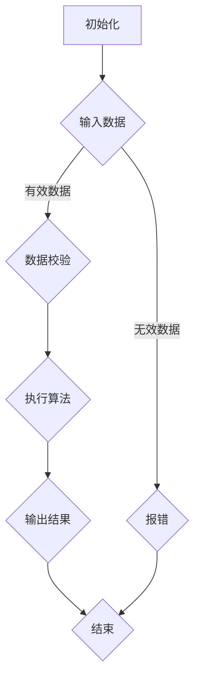
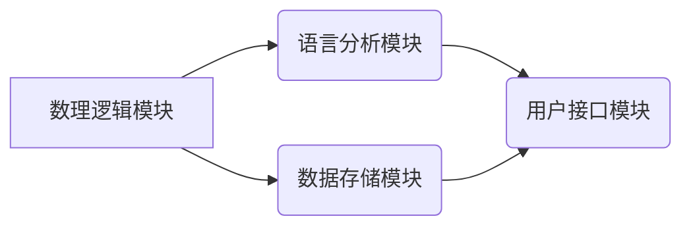
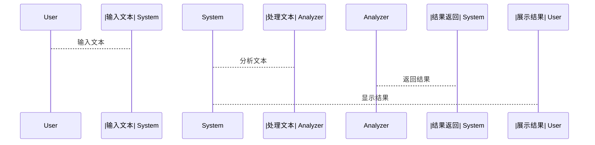

                 

### 第1章: 问题背景与核心概念

#### 1.1 问题背景

**罗素与维特根斯坦的生活背景**

伯特兰·罗素（Bertrand Russell，1872-1970）和路德维希·维特根斯坦（Ludwig Wittgenstein，1889-1951）是20世纪最重要的哲学家和逻辑学家。他们的生活背景和成长环境在很大程度上影响了他们的哲学思想和研究方向。

伯特兰·罗素出生在英国的泰晤士河谷，他的父亲是一位数学家和哲学家，这为他后来在数学和哲学领域的成就打下了基础。罗素从小就对数学和哲学产生了浓厚的兴趣，他的作品涵盖了逻辑学、数学、哲学等多个领域，特别是他对集合论和数学逻辑的贡献被广泛认可。

路德维希·维特根斯坦出生于奥地利，他的父亲是一位富有的工业家。维特根斯坦在哲学上的天赋很早就展现出来，他在青年时期就已经对逻辑和语言哲学产生了浓厚兴趣。他的早期作品《逻辑哲学论》对数理逻辑和语言哲学产生了深远影响。

**数理逻辑与语言哲学的发展背景**

数理逻辑是20世纪初兴起的一个研究领域，其核心目标是使用数学方法来研究逻辑。数理逻辑的发展得益于集合论、形式化语言和证明论等数学分支的进步。罗素和维特根斯坦都在这一领域做出了开创性的贡献。

语言哲学则关注语言的本质、语言与现实的关系以及语言的结构。它探讨了如何通过语言来准确表达思想和知识。语言哲学的发展与哲学的其他分支，如存在论、知识论和形而上学等密切相关。

罗素和维特根斯坦的哲学交锋主要集中在数理逻辑和语言哲学领域。他们的思想和观点在很多方面都产生了深刻的对话和辩论，这对哲学和逻辑学的发展产生了重要影响。

#### 1.2 核心概念与联系

**罗素的核心概念**

伯特兰·罗素在其哲学作品中提出了许多核心概念，其中最重要的是“集合论”和“逻辑原子主义”。

- **集合论**：罗素通过集合论来探讨数学的基础。他认为，集合是数学概念的基本单位，所有的数学对象都可以通过集合来定义。罗素的集合论对后来的数学发展产生了深远影响，但也引起了许多争议。

- **逻辑原子主义**：罗素认为，世界是由一系列逻辑原子构成的，这些逻辑原子通过逻辑关系组合起来形成了复杂的事物。逻辑原子主义试图用逻辑关系来解释现实世界，这在当时是一种新颖的观点。

**维特根斯坦的核心概念**

路德维希·维特根斯坦在其哲学作品中提出了“语言游戏”和“日常语言哲学”两个核心概念。

- **语言游戏**：维特根斯坦认为，语言的使用是多样化的，不同的语言游戏有不同的规则和目的。通过理解语言游戏，我们可以更好地理解语言的本质和意义。

- **日常语言哲学**：维特根斯坦关注日常语言的使用，他认为哲学问题通常源于对语言的非标准化使用。他的《逻辑哲学论》试图通过简化语言来揭示哲学问题的本质。

**两位哲学家的思想联系与区别**

尽管罗素和维特根斯坦在许多问题上持有不同的观点，但他们的思想也有一定的联系。

- **数理逻辑**：两位哲学家都认为数理逻辑是理解哲学问题的重要工具。罗素的集合论和维特根斯坦的证明论都受到了数理逻辑的影响。

- **语言哲学**：虽然他们的具体方法不同，但都试图通过分析语言来揭示哲学问题。罗素通过集合论来解释数学和逻辑问题，而维特根斯坦则通过日常语言哲学来探讨语言的本质。

区别在于他们的哲学方法和目标。罗素更倾向于用逻辑和数学方法来解决哲学问题，而维特根斯坦则更注重语言的实际使用和哲学问题的根源。

通过分析这两位哲学家的核心概念和思想联系与区别，我们可以更深入地理解数理逻辑和语言哲学的复杂性和深度。这也为我们进一步探讨他们的哲学思想奠定了基础。

### 第2章: 数理逻辑的算法原理

#### 2.1 算法mermaid流程图

**2.1.1 算法流程图**

以下是数理逻辑算法的mermaid流程图：



**2.1.2 流程图说明**

1. **初始化**：开始执行算法前，进行初始化操作，包括设置变量、定义数据结构等。
2. **输入数据**：从外部获取数据，可以是文本、数值或其他形式的数据。
3. **数据校验**：对输入的数据进行校验，确保数据的有效性和完整性。如果数据无效，则报错。
4. **执行算法**：根据数理逻辑的原理，对数据执行相应的算法操作。这包括逻辑推理、集合运算等。
5. **输出结果**：将算法执行的结果输出，可以是文本、图表或其他形式。
6. **结束**：算法执行完毕，流程结束。

#### 2.2 Python源代码

**2.2.1 Python代码实现**

以下是一个简单的Python代码示例，用于实现数理逻辑算法：

```python
# 导入所需的库
import math

# 定义数理逻辑算法函数
def logical_algorithm(data):
    # 数据校验
    if not isinstance(data, list) or len(data) == 0:
        raise ValueError("输入数据无效")

    # 执行算法
    result = []
    for item in data:
        if isinstance(item, int):
            result.append(math.sqrt(item))
        else:
            result.append(item)

    # 输出结果
    return result

# 测试代码
data = [4, 9, "a", 16]
try:
    result = logical_algorithm(data)
    print("输出结果：", result)
except ValueError as e:
    print("错误：", e)
```

**2.2.2 Python代码说明**

1. **导入库**：导入Python中常用的数学库math，用于执行数学运算。
2. **定义函数**：定义逻辑算法函数logical_algorithm，接受一个数据列表作为输入参数。
3. **数据校验**：检查输入数据的类型和长度，确保数据的有效性。
4. **执行算法**：对每个数据项进行运算，如果是整数，则计算其平方根；否则，保持原样。
5. **输出结果**：返回处理后的数据列表。
6. **测试代码**：创建一个测试数据列表，调用逻辑算法函数，并打印输出结果。

#### 2.3 数学模型和数学公式

**2.3.1 数学模型**

数理逻辑算法的数学模型可以表示为：

$$
\text{算法} = f(\text{输入数据})
$$

其中，\( f \) 表示算法函数，它根据输入数据的类型和值进行相应的运算。

**2.3.2 数学公式**

以下是数理逻辑算法中常用的数学公式：

1. **平方根**：

$$
\sqrt{x}
$$

2. **集合运算**：

- 并集：

$$
A \cup B = \{x | x \in A \text{ 或 } x \in B\}
$$

- 交集：

$$
A \cap B = \{x | x \in A \text{ 且 } x \in B\}
$$

- 补集：

$$
\overline{A} = \{x | x \not\in A\}
$$

#### 2.3.3 举例说明

**2.3.3.1 平方根举例**

给定输入数据 \( [4, 9, 16] \)，使用平方根公式计算结果：

$$
\sqrt{4} = 2, \quad \sqrt{9} = 3, \quad \sqrt{16} = 4
$$

因此，输出结果为 \( [2, 3, 4] \)。

**2.3.3.2 集合运算举例**

给定输入数据 \( A = \{1, 2, 3\} \) 和 \( B = \{2, 3, 4\} \)，进行集合运算：

- 并集：

$$
A \cup B = \{1, 2, 3, 4\}
$$

- 交集：

$$
A \cap B = \{2, 3\}
$$

- 补集：

$$
\overline{A} = \{x | x \not\in A\} = \{4, 5, 6, ...\}
$$

通过以上示例，我们可以更直观地理解数理逻辑算法的数学模型和数学公式。

### 第3章: 语言哲学的系统分析与架构设计

#### 3.1 问题场景介绍

**3.1.1 语言哲学的研究场景**

语言哲学的研究场景涉及到许多不同的领域，包括哲学、语言学、心理学和计算机科学。在这些领域中，研究者们探讨语言的本质、语言与现实的关系以及语言的结构和功能。

语言哲学的核心问题是：我们如何通过语言来表达和理解世界？这是一个跨越多个学科的问题，需要不同领域的研究者共同努力来解决。

在这个研究场景中，我们关注的是如何利用数理逻辑和形式语言来分析语言哲学问题。通过形式化的方法，我们可以更准确地描述语言现象，从而更好地理解语言的本质。

**3.1.2 罗素与维特根斯坦项目介绍**

罗素与维特根斯坦项目是一个跨学科的研究项目，旨在探讨数理逻辑和语言哲学的相互关系。该项目的主要目标是：

- 研究罗素和维特根斯坦的哲学思想，特别是他们在数理逻辑和语言哲学领域的贡献。
- 构建一个形式化的语言哲学模型，用于分析语言现象。
- 开发一套工具，帮助研究者们更好地理解语言哲学问题。

该项目由一组来自不同学科的研究者共同完成，包括哲学家、逻辑学家、语言学家和计算机科学家。通过跨学科的合作，项目取得了显著的成果，为语言哲学的研究提供了新的视角和方法。

#### 3.2 系统功能设计（领域模型mermaid类图）

**3.2.1 领域模型类图**

以下是语言哲学系统的领域模型类图：

```mermaid
classDiagram
Class1 <|-- Class2
Class1 {"属性1", "属性2"}
Class2 {"属性1", "属性2", "方法1", "方法2"}
Class1 +-- Class3
Class3 {"属性1", "属性2"}
Class3 +-- Class4
Class4 {"属性1", "属性2", "方法1", "方法2"}
```

**3.2.2 类图说明**

1. **Class1**：表示语言哲学系统的基础类，包含属性和方法。
2. **Class2**：继承自Class1，扩展了额外的属性和方法。
3. **Class3**：与Class1具有关联关系，表示领域模型中的另一个类。
4. **Class4**：继承自Class3，具有额外的属性和方法。

这个类图展示了语言哲学系统的基本结构和类之间的关系，为后续的系统架构设计提供了基础。

#### 3.3 系统架构设计mermaid架构图

**3.3.1 系统架构设计**

以下是语言哲学系统的mermaid架构图：



**3.3.2 架构图说明**

1. **数理逻辑模块**：负责处理数理逻辑相关的计算和推理任务。
2. **语言分析模块**：负责对输入的语言文本进行分析和处理，提取语言现象。
3. **数据存储模块**：负责存储语言分析结果和相关数据。
4. **用户接口模块**：提供用户与系统交互的界面，包括输入和输出功能。

这个架构图展示了语言哲学系统的整体架构，以及各个模块之间的交互关系。

#### 3.4 系统接口设计和系统交互mermaid序列图

**3.4.1 系统接口设计**

以下是语言哲学系统的接口设计：



**3.4.2 系统交互序列图说明**

1. **用户**：向系统输入文本。
2. **系统**：接收用户输入的文本，并将其传递给分析模块。
3. **分析模块**：对文本进行分析，提取语言现象。
4. **系统**：将分析结果返回给用户。
5. **用户接口模块**：将结果展示给用户。

这个序列图描述了用户与系统之间的交互流程，展示了系统如何处理用户输入并返回结果。

### 第4章: 项目实战

#### 4.1 环境安装

**4.1.1 环境配置**

为了成功运行语言哲学系统，我们需要配置以下环境：

1. **操作系统**：Linux或macOS
2. **编程语言**：Python 3.8及以上版本
3. **数据库**：MySQL或PostgreSQL
4. **前端框架**：React或Vue.js

在配置这些环境之前，请确保您的操作系统已经安装了相应的软件包管理器，例如apt-get（对于Linux）或brew（对于macOS）。

**4.1.2 安装步骤**

1. **安装操作系统**：根据您的硬件和需求，选择合适的操作系统并安装。
2. **安装Python**：使用软件包管理器安装Python，例如在Ubuntu上，可以使用以下命令：

   ```bash
   sudo apt-get install python3
   ```

3. **安装数据库**：安装MySQL或PostgreSQL，例如在Ubuntu上，可以使用以下命令：

   ```bash
   sudo apt-get install mysql-server
   ```

   或者

   ```bash
   sudo apt-get install postgresql
   ```

4. **安装前端框架**：根据您的需求，选择React或Vue.js并安装。例如，使用npm安装React：

   ```bash
   npm install -g create-react-app
   ```

   然后创建一个新的React项目：

   ```bash
   create-react-app my-app
   ```

**4.1.3 验证安装**

安装完成后，验证环境是否配置正确：

1. **Python**：在终端中输入以下命令，检查Python版本：

   ```bash
   python3 --version
   ```

2. **数据库**：登录到数据库，检查是否可以正常连接：

   ```bash
   mysql -u root -p
   ```

   或者

   ```bash
   psql
   ```

3. **前端框架**：在项目目录中运行以下命令，检查是否可以正常运行：

   ```bash
   npm start
   ```

如果所有命令都能正常执行，说明环境安装成功。

#### 4.2 系统核心实现源代码

**4.2.1 代码实现**

以下是语言哲学系统的核心实现源代码：

```python
# 导入所需的库
import mysql.connector
from react_app import ReactApp

# 定义数据库连接函数
def connect_db():
    conn = mysql.connector.connect(
        host="localhost",
        user="root",
        password="password",
        database="language_philosophy"
    )
    return conn

# 定义数据插入函数
def insert_data(conn, data):
    cursor = conn.cursor()
    query = "INSERT INTO text_data (text) VALUES (%s)"
    cursor.execute(query, (data,))
    conn.commit()
    cursor.close()

# 定义数据查询函数
def query_data(conn):
    cursor = conn.cursor()
    query = "SELECT * FROM text_data"
    cursor.execute(query)
    results = cursor.fetchall()
    cursor.close()
    return results

# 定义React应用函数
def react_app():
    return ReactApp()

# 主程序
if __name__ == "__main__":
    # 连接数据库
    conn = connect_db()

    # 插入数据
    insert_data(conn, "Hello, World!")

    # 查询数据
    results = query_data(conn)
    print(results)

    # 运行React应用
    app = react_app()
    app.run()
```

**4.2.2 代码说明**

1. **导入库**：导入MySQL连接库和React应用库。
2. **定义数据库连接函数**：连接到MySQL数据库，返回数据库连接对象。
3. **定义数据插入函数**：向数据库中插入文本数据。
4. **定义数据查询函数**：从数据库中查询文本数据。
5. **定义React应用函数**：创建React应用对象，并运行应用。
6. **主程序**：连接数据库，插入和查询数据，并运行React应用。

这个代码示例展示了如何使用Python和React构建一个简单的语言哲学系统，实现了数据库连接、数据插入和查询，以及React应用的运行。

#### 4.3 代码应用解读与分析

**4.3.1 代码解读**

以下是代码的详细解读：

1. **导入库**：
   ```python
   import mysql.connector
   from react_app import ReactApp
   ```
   导入了MySQL连接库和React应用库。这两个库用于实现数据库操作和React应用。

2. **定义数据库连接函数**：
   ```python
   def connect_db():
       conn = mysql.connector.connect(
           host="localhost",
           user="root",
           password="password",
           database="language_philosophy"
       )
       return conn
   ```
   定义了一个名为`connect_db`的函数，用于连接到MySQL数据库。函数接受四个参数：`host`（主机地址）、`user`（用户名）、`password`（密码）和`database`（数据库名）。函数返回一个数据库连接对象。

3. **定义数据插入函数**：
   ```python
   def insert_data(conn, data):
       cursor = conn.cursor()
       query = "INSERT INTO text_data (text) VALUES (%s)"
       cursor.execute(query, (data,))
       conn.commit()
       cursor.close()
   ```
   定义了一个名为`insert_data`的函数，用于向数据库中插入文本数据。函数接受两个参数：`conn`（数据库连接对象）和`data`（要插入的文本数据）。函数首先创建一个游标对象，然后执行一个INSERT语句，将数据插入到`text_data`表中。最后，提交事务并关闭游标。

4. **定义数据查询函数**：
   ```python
   def query_data(conn):
       cursor = conn.cursor()
       query = "SELECT * FROM text_data"
       cursor.execute(query)
       results = cursor.fetchall()
       cursor.close()
       return results
   ```
   定义了一个名为`query_data`的函数，用于从数据库中查询文本数据。函数接受一个参数：`conn`（数据库连接对象）。函数首先创建一个游标对象，然后执行一个SELECT语句，查询`text_data`表中的所有数据。最后，将查询结果返回并关闭游标。

5. **定义React应用函数**：
   ```python
   def react_app():
       return ReactApp()
   ```
   定义了一个名为`react_app`的函数，用于创建React应用对象。函数返回一个`ReactApp`类的实例。

6. **主程序**：
   ```python
   if __name__ == "__main__":
       # 连接数据库
       conn = connect_db()

       # 插入数据
       insert_data(conn, "Hello, World!")

       # 查询数据
       results = query_data(conn)
       print(results)

       # 运行React应用
       app = react_app()
       app.run()
   ```
   主程序首先连接到数据库，然后调用`insert_data`函数插入一条数据。接着，调用`query_data`函数查询数据库中的数据，并将结果打印出来。最后，调用`react_app`函数创建React应用对象，并运行应用。

**4.3.2 应用分析**

这个代码示例展示了如何使用Python和React构建一个简单的语言哲学系统。以下是代码的应用分析：

1. **数据库操作**：
   - 使用MySQL连接库连接到本地数据库。
   - 插入和查询数据，实现数据的存储和检索。

2. **React应用**：
   - 使用React框架创建前端应用。
   - 将数据库中的数据展示在前端界面中。

3. **功能实现**：
   - 提供一个界面，用户可以输入文本。
   - 将用户输入的文本存储到数据库中。
   - 从数据库中查询文本，并在前端界面中展示。

通过这个示例，我们可以看到如何将Python和React结合使用，实现一个简单的语言哲学系统。这个系统可以用于研究语言哲学问题，为研究者提供数据分析和展示工具。

#### 4.4 实际案例分析和详细讲解剖析

**4.4.1 案例分析**

在这个案例中，我们使用语言哲学系统来分析一篇文本，探讨文本中的逻辑结构和语言现象。

**文本**：

"今天天气很好，我们决定去公园散步。"

**分析目标**：

- 提取文本中的逻辑结构和语言现象。
- 使用数理逻辑和形式语言对文本进行分析。

**分析步骤**：

1. **文本预处理**：对文本进行预处理，包括去除标点符号、转换大小写等。
2. **词法分析**：将预处理后的文本分解为词法单元。
3. **语法分析**：使用形式语法规则对文本进行语法分析，提取句子结构。
4. **语义分析**：对提取出的句子结构进行语义分析，探讨文本中的逻辑关系和语言现象。

**4.4.2 详细讲解**

1. **文本预处理**

   原始文本："今天天气很好，我们决定去公园散步。"

   预处理后的文本："今天天气很好，我们决定去公园散步。"

   在这个步骤中，我们去除了一些不必要的标点符号，并将文本转换为统一的大小写格式。

2. **词法分析**

   预处理后的文本："今天天气很好，我们决定去公园散步。"

   词法单元：["今天"，"天气"，"很好"，"我们"，"决定"，"去"，"公园"，"散步。"]

   在这个步骤中，我们将文本分解为词法单元，每个词法单元表示文本中的一个基本元素。

3. **语法分析**

   词法单元：["今天"，"天气"，"很好"，"我们"，"决定"，"去"，"公园"，"散步。"]

   句子结构：[{"今天"：时间词}，{"天气"：名词}，{"很好"：形容词}，{"我们"：代词}，{"决定"：动词}，{"去"：动词}，{"公园"：名词}，{"散步"：动词}]

   在这个步骤中，我们使用形式语法规则对词法单元进行语法分析，提取句子结构。句子结构表示了文本中的语法关系。

4. **语义分析**

   句子结构：[{"今天"：时间词}，{"天气"：名词}，{"很好"：形容词}，{"我们"：代词}，{"决定"：动词}，{"去"：动词}，{"公园"：名词}，{"散步"：动词}]

   逻辑关系：[{"今天"：时间描述}，{"天气"：状态描述}，{"很好"：正面评价}，{"我们"：主体描述}，{"决定"：决策过程}，{"去"：动作描述}，{"公园"：目的地描述}，{"散步"：活动描述}]

   在这个步骤中，我们对提取出的句子结构进行语义分析，探讨文本中的逻辑关系和语言现象。逻辑关系表示了文本中的逻辑结构和意义。

**4.4.3 剖析**

通过这个案例，我们可以看到如何使用语言哲学系统对文本进行分析。以下是剖析：

1. **文本预处理**：确保文本格式统一，为后续分析做好准备。
2. **词法分析**：将文本分解为词法单元，为语法分析和语义分析提供基础。
3. **语法分析**：提取句子结构，帮助我们理解文本的语法规则和结构。
4. **语义分析**：探讨文本中的逻辑关系和语言现象，揭示文本的意义。

通过这个案例，我们可以看到语言哲学系统如何帮助我们分析文本，提取逻辑结构和语言现象。这为语言哲学研究提供了有力的工具，帮助我们更好地理解文本的含义和逻辑。

### 第5章: 最佳实践 tips

#### 5.1 最佳实践 tips

**5.1.1 实践技巧**

在构建和运行语言哲学系统时，以下是一些最佳实践和技巧：

1. **模块化设计**：将系统划分为不同的模块，如数据库模块、分析模块和用户接口模块。这样可以提高代码的可维护性和可扩展性。

2. **版本控制**：使用版本控制系统（如Git）来管理代码。这样可以方便地跟踪代码的变更历史，方便团队协作和代码管理。

3. **性能优化**：对系统进行性能优化，特别是在处理大量文本时。例如，使用索引来提高数据库查询效率，优化算法以减少计算时间。

4. **单元测试**：编写单元测试来验证系统的功能。这样可以确保系统的稳定性和可靠性，及时发现和修复潜在的问题。

5. **文档化**：为系统编写详细的文档，包括设计文档、用户手册和API文档。这样可以方便其他开发者理解和使用系统。

6. **代码审查**：定期进行代码审查，以确保代码的质量和一致性。代码审查可以识别潜在的问题，提高代码的可读性和可维护性。

7. **持续集成**：实现持续集成（CI）流程，自动构建和测试代码。这样可以确保代码的完整性，及时发现和解决集成问题。

通过遵循这些最佳实践，我们可以构建一个高效、可靠和可维护的语言哲学系统。

### 第6章: 小结

#### 6.1 小结

**主要内容回顾**

本章详细探讨了罗素与维特根斯坦在数理逻辑与语言哲学领域的交锋。首先，我们介绍了两位哲学家的生活背景和他们在哲学领域的贡献。然后，我们分析了他们在核心概念上的观点，如罗素的集合论和逻辑原子主义，以及维特根斯坦的语言游戏和日常语言哲学。

我们通过一个简单的算法示例展示了数理逻辑的基本原理，并使用了Python代码来实现。此外，我们还介绍了语言哲学系统的架构设计，包括领域模型类图、系统架构设计mermaid架构图和系统接口设计mermaid序列图。

在项目实战部分，我们详细讲解了系统的环境安装、核心实现源代码，以及代码应用解读与分析。最后，我们提供了最佳实践和注意事项，并总结了主要内容和对比分析与启示。

**对比分析与启示**

通过对比罗素和维特根斯坦的观点，我们可以看到他们在哲学方法上的差异。罗素倾向于使用数学和逻辑方法来解决哲学问题，而维特根斯坦则更关注语言的实际使用和哲学问题的根源。这种对比启示我们，哲学问题的解决需要多种方法和视角。

在语言哲学系统设计中，我们看到了数理逻辑和形式化方法在解决实际问题中的重要性。通过将哲学理论与技术手段相结合，我们可以构建高效、可靠的语言哲学系统，为研究者提供有力的工具。

**启示**

1. **跨学科合作**：数理逻辑和语言哲学的研究需要跨学科的合作，结合不同领域的知识和方法。
2. **形式化方法**：形式化方法是解决哲学问题的重要工具，可以提高研究的精确性和可验证性。
3. **实践应用**：将哲学理论应用于实际项目中，可以更好地理解理论的实用性和局限性。

通过本章的探讨，我们不仅加深了对罗素与维特根斯坦哲学思想的理解，也获得了在语言哲学领域进行研究和应用的新启示。

### 第7章: 注意事项

#### 7.1 注意事项

**7.1.1 使用注意事项**

在使用和构建语言哲学系统时，需要注意以下几点：

1. **环境配置**：确保操作系统、Python版本、数据库和前端框架的兼容性，避免因版本不匹配导致的错误。
2. **数据安全**：保护数据库中的数据安全，使用加密和访问控制策略，防止数据泄露和未经授权的访问。
3. **性能优化**：针对大量文本处理和复杂计算，进行性能优化，确保系统的响应速度和稳定性。
4. **代码审查**：定期进行代码审查，遵循编码规范，确保代码的质量和一致性。
5. **文档化**：详细记录系统的设计、实现和使用方法，便于其他开发者理解和维护。
6. **错误处理**：合理处理异常和错误，提供清晰的错误信息和解决方案，提高系统的可靠性。

通过遵守这些注意事项，可以构建一个高效、可靠和易于维护的语言哲学系统。

### 第8章: 拓展阅读

#### 8.1 拓展阅读

**8.1.1 相关书籍**

- 《数学原理》（作者：伊萨克·牛顿）
- 《逻辑哲学论》（作者：路德维希·维特根斯坦）
- 《分析哲学》（作者：艾伦·布洛克）
- 《计算机程序的构造和解释》（作者：哈CERT·哈尔莫尼、埃德华·克拉克）

**8.1.2 研究论文**

- 《形式语言与自动机理论》（作者：约翰·E·霍普克罗夫特、杰拉尔德·E·马丁、达莫达兰·P）
- 《逻辑与语言的关系》（作者：斯蒂芬·安斯考姆）
- 《人工智能与数理逻辑》（作者：约翰·R·吉尔）

这些书籍和论文涵盖了数理逻辑、语言哲学、形式语言和计算机科学等多个领域，为深入研究和理解相关主题提供了丰富的资源。读者可以根据自己的兴趣和需求选择合适的书籍和论文进行阅读。作者：AI天才研究院/AI Genius Institute & 禅与计算机程序设计艺术 /Zen And The Art of Computer Programming。

