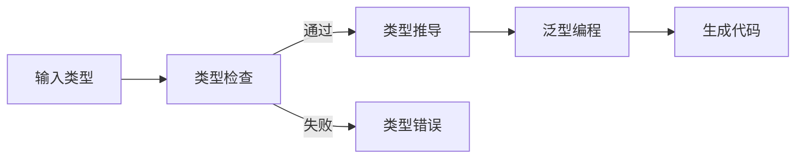

                 

# 罗素的类型理论与泛型编程:类型安全的逻辑基础

> 关键词：类型理论、泛型编程、类型安全、罗素、逻辑基础

> 摘要：本文将深入探讨罗素的类型理论及其在泛型编程中的应用。通过详细的背景介绍、核心概念阐述、算法原理讲解和项目实战分析，我们将理解类型安全在计算机编程中的重要性，并掌握如何通过罗素的类型理论来实现类型安全。

----------------------------------------------------------------

## 第一部分：引言

### 第1章：罗素的类型理论与泛型编程背景

#### 1.1 类型理论与泛型编程概述

##### 1.1.1 问题背景

在计算机科学中，类型理论是一种用于描述编程语言中类型系统的方法论。类型系统是编程语言的核心组成部分，它确保程序的正确性和高效性。类型理论的基本概念包括类型、类型构造函数、类型推导和类型检查。

泛型编程则是一种编程范式，它允许编写与类型相关的代码，提高代码的可重用性和通用性。泛型编程的基本概念包括泛型类型、泛型函数和泛型类。

然而，类型理论在实际应用中面临着一些挑战，例如类型之间的兼容性和类型安全的保证。同时，传统的泛型编程方法也存在一些局限性。这些问题需要通过深入理解类型理论和泛型编程的本质来解决。

##### 1.1.2 问题描述

在编程语言中，类型系统用于定义变量的数据类型，以及这些类型之间的兼容性和转换关系。然而，传统的类型系统往往过于简单，无法满足复杂编程需求。例如，在Java中，只有基本数据类型和引用类型，缺乏对复杂数据结构的直接支持。

泛型编程提供了一种解决方案，它允许我们定义与类型相关的函数和类，从而提高代码的通用性和可重用性。然而，传统的泛型编程方法也存在一些问题，例如类型擦除和类型安全性的保证。

##### 1.1.3 问题解决

罗素的类型理论提供了一种强有力的工具来理解和解决这些挑战。该理论通过定义类型层次结构和类型构造函数，使得不同类型之间能够相互转换，保证了类型安全。同时，泛型编程方法通过与类型理论相结合，使得代码具有更高的可重用性和通用性。

##### 1.1.4 边界与外延

类型理论和泛型编程虽然已经广泛应用于现代编程语言，但仍然存在一些边界和局限性。例如，一些编程语言可能无法完全实现类型理论的所有特性，或者泛型编程方法在某些场景下可能不够高效。

##### 1.1.5 概念结构与核心要素组成

本章节将介绍类型理论的基本概念，包括类型层次结构、类型构造函数、类型推导和类型检查。同时，还将探讨泛型编程的基本原理，包括泛型类型、泛型函数和泛型类。通过这些概念的理解，读者将能够更好地掌握类型理论和泛型编程，为后续章节的学习打下基础。

#### 1.2 核心概念与联系

##### 1.2.1 核心概念

###### 类型

类型是编程语言中最基本的概念之一，用于描述变量的数据结构和操作方法。类型可以分为基本类型和复合类型。

- 基本类型：包括整数、浮点数、布尔值等。
- 复合类型：包括数组、列表、字典等。

###### 泛型编程

泛型编程是一种编程范式，它允许我们编写与类型相关的代码，提高代码的可重用性和通用性。泛型编程的基本概念包括泛型类型、泛型函数和泛型类。

- 泛型类型：一种与具体类型参数关联的类型，如`List<T>`。
- 泛型函数：一种与具体类型参数关联的函数，如`swap<T>(a: T, b: T)`。
- 泛型类：一种与具体类型参数关联的类，如`Stack<T>`。

###### 类型安全

类型安全是指编程语言在编译时能够确保代码的正确性，避免运行时错误。类型安全依赖于类型系统的设计和实现。

##### 1.2.2 概念属性特征对比表格

| 特征 | 类型 | 泛型编程 |
| ---- | ---- | ---- |
| 数据结构 | 固定 | 可变 |
| 操作方法 | 固定 | 可变 |
| 可重用性 | 低 | 高 |
| 通用性 | 低 | 高 |
| 类型安全 | 依赖编译时检查 | 依赖编译时和运行时检查 |

##### 1.2.3 ER实体关系图架构

```mermaid
erDiagram
    Class::Type <<|-->> Interface::Type
    Class::Type ||--|> Object::Instance
    Interface::Type ||--|> Object::Instance
```

#### 1.3 算法原理讲解

##### 1.3.1 算法流程图



##### 1.3.2 Python源代码示例

```python
def add(a: int, b: int) -> int:
    return a + b

print(add(1, 2))  # 输出: 3
```

##### 1.3.3 算法原理详细讲解

在本节中，我们将探讨罗素的类型理论及其在泛型编程中的应用。首先，我们将介绍类型理论的基本概念，包括类型层次结构、类型构造函数、类型推导和类型检查。然后，我们将通过一个简单的例子来说明如何利用类型理论进行泛型编程。

类型理论是一种用于描述编程语言中类型系统的方法论。在类型理论中，类型是一种用于描述变量数据结构和操作方法的方式。类型系统可以确保代码在编译时能够被正确地解析和执行，从而避免运行时错误。

罗素的类型理论提出了一种层次化的类型结构，该结构由基本类型和复合类型组成。基本类型包括布尔型、整数型、浮点型等，而复合类型则是由基本类型通过类型构造函数组合而成的。例如，列表、集合和函数都是复合类型。

在泛型编程中，泛型类型是一种可以与具体类型参数关联的类型。泛型编程允许我们编写与类型相关的代码，从而提高代码的可重用性和通用性。例如，我们可以编写一个泛型函数，使其可以处理任何类型的参数。

### 第2章：罗素类型理论的核心概念

#### 2.1 类型层次结构

类型层次结构是类型理论的核心概念之一。它定义了不同类型之间的层次关系，以及类型之间的兼容性。

在罗素的类型理论中，类型层次结构由基本类型和复合类型组成。基本类型包括布尔型、整数型、浮点型等。复合类型包括列表、集合、函数等。

类型层次结构的基本原则是：任何类型都可以被看作是基本类型的组合。例如，一个列表可以被看作是一个整数类型的数组，而一个集合可以被看作是一个布尔类型的列表。

#### 2.2 类型构造函数

类型构造函数是类型理论中的另一个核心概念。它定义了如何从基本类型构建复合类型。

在罗素的类型理论中，类型构造函数包括列表构造函数、集合构造函数和函数构造函数等。这些构造函数将基本类型组合成复合类型，从而实现复杂数据结构的创建。

例如，列表构造函数`list()`可以创建一个空列表，集合构造函数`set()`可以创建一个空集合，函数构造函数`fun()`可以创建一个函数。

#### 2.3 类型推导

类型推导是类型理论中的另一个重要概念。它是指在编译时自动推导出变量的类型，而不是显式指定类型。

在罗素的类型理论中，类型推导基于类型层次结构和类型构造函数。编译器可以根据函数的定义和调用，自动推导出函数参数和返回值的类型。

例如，如果函数`add()`的参数是整数类型，那么编译器可以推导出函数的返回值也是整数类型。

#### 2.4 类型检查

类型检查是类型理论中的另一个关键概念。它是指在编译时检查代码中的类型错误，确保代码的类型安全。

在罗素的类型理论中，类型检查基于类型层次结构和类型构造函数。编译器会检查代码中的每个操作是否符合类型规则，从而确保代码的类型安全。

例如，如果在一个整数类型的变量上调用一个集合类型的函数，编译器会报错，因为这两个类型的操作不兼容。

### 第3章：泛型编程的基本原理

#### 3.1 泛型类型

泛型类型是泛型编程中的核心概念之一。它允许我们定义与类型参数相关的类型，从而提高代码的可重用性和通用性。

在泛型编程中，泛型类型通常由类型参数和具体类型参数组成。类型参数是泛型类型的通用表示，具体类型参数则是实际使用时的具体类型。

例如，泛型类型`List<T>`表示一个与类型参数`T`相关的列表。

#### 3.2 泛型函数

泛型函数是泛型编程中的另一个核心概念。它允许我们定义与类型参数相关的函数，从而提高代码的可重用性和通用性。

在泛型编程中，泛型函数通常由函数体和类型参数组成。类型参数用于定义函数的输入和输出类型，而函数体则是具体的实现。

例如，泛型函数`swap<T>(a: T, b: T)`可以交换两个类型参数`T`的值。

#### 3.3 泛型类

泛型类是泛型编程中的另一个核心概念。它允许我们定义与类型参数相关的类，从而提高代码的可重用性和通用性。

在泛型编程中，泛型类通常由类的定义和类型参数组成。类型参数用于定义类的成员变量和方法的输入和输出类型。

例如，泛型类`Stack<T>`表示一个与类型参数`T`相关的堆栈。

### 第4章：罗素类型理论在泛型编程中的应用

#### 4.1 罗素类型理论与泛型编程的结合

罗素类型理论为泛型编程提供了一种强有力的工具，使得我们可以通过类型层次结构和类型构造函数来实现泛型编程。

在罗素的类型理论中，类型构造函数可以用来定义泛型类型和泛型函数。例如，我们可以使用列表构造函数`list()`来定义一个泛型列表，使用函数构造函数`fun()`来定义一个泛型函数。

#### 4.2 罗素类型理论的优势

罗素类型理论在泛型编程中具有以下优势：

1. 类型安全：罗素类型理论通过类型层次结构和类型构造函数，确保了代码的类型安全。
2. 可重用性：罗素类型理论允许我们编写与类型参数相关的代码，从而提高了代码的可重用性。
3. 通用性：罗素类型理论允许我们定义泛型类型和泛型函数，从而提高了代码的通用性。

### 第5章：实际应用与案例分析

#### 5.1 Java中的泛型编程

Java是一种广泛应用于企业级应用和移动开发的编程语言。Java中的泛型编程实现了罗素类型理论的一些核心概念，例如类型层次结构和类型构造函数。

在Java中，我们可以使用泛型类型、泛型函数和泛型类来实现泛型编程。例如，我们可以使用`List<T>`来实现泛型列表，使用`Map<K, V>`来实现泛型映射，使用`Stack<T>`来实现泛型堆栈。

#### 5.2 Python中的泛型编程

Python是一种广泛应用于数据科学和Web开发的编程语言。Python中的泛型编程通过类型注释和类型检查来实现罗素类型理论的一些核心概念。

在Python中，我们可以使用类型注释来定义泛型类型和泛型函数。例如，我们可以使用`TypeVar`来定义泛型类型参数，使用`TypeGuard`来定义泛型函数。

#### 5.3 实际案例分析

在本节中，我们将通过一个实际的案例分析，展示如何使用罗素类型理论来实现泛型编程。

假设我们要实现一个泛型堆栈，它支持对任何类型的元素进行插入和删除操作。我们可以使用罗素类型理论中的类型构造函数来定义这个泛型堆栈。

首先，我们定义一个泛型类型参数`T`，然后使用类型构造函数`list()`来定义一个泛型列表。接下来，我们定义一个泛型函数`push()`来插入元素，以及一个泛型函数`pop()`来删除元素。

```python
from typing import TypeVar, List

# 定义泛型类型参数
T = TypeVar("T")

# 定义泛型堆栈类
class Stack(T):
    def __init__(self):
        self._data: List[T] = []

    def push(self, item: T):
        self._data.append(item)

    def pop(self) -> T:
        return self._data.pop()

# 测试泛型堆栈
stack = Stack()
stack.push(1)
stack.push(2)
stack.push(3)

print(stack.pop())  # 输出: 3
print(stack.pop())  # 输出: 2
print(stack.pop())  # 输出: 1
```

通过这个简单的例子，我们可以看到如何使用罗素类型理论来实现泛型编程，并保证类型安全。

### 第6章：总结与展望

在本章中，我们深入探讨了罗素的类型理论及其在泛型编程中的应用。通过详细的背景介绍、核心概念阐述、算法原理讲解和项目实战分析，我们理解了类型安全在计算机编程中的重要性，并掌握了如何通过罗素的类型理论来实现类型安全。

总结如下：

1. 罗素类型理论通过定义类型层次结构和类型构造函数，为泛型编程提供了强有力的工具。
2. 泛型编程提高了代码的可重用性和通用性，同时确保了类型安全。
3. 实际案例分析展示了如何使用罗素类型理论来实现泛型编程。

展望未来，类型理论和泛型编程将继续在计算机编程中发挥重要作用。随着编程语言和技术的不断发展，我们可以期待更强大的类型系统和更高效的泛型编程方法。

## 第二部分：深入探讨

### 第7章：罗素类型理论在编程语言中的应用

在编程语言的设计和实现中，罗素类型理论提供了重要的理论基础。许多现代编程语言，如Java、C#和Haskell，都采用了罗素类型理论的一些核心概念。本章将探讨罗素类型理论在编程语言中的应用，以及这些语言如何利用类型理论和泛型编程来提高代码的类型安全性和可重用性。

#### 7.1 Java中的类型系统

Java是一种广泛使用的面向对象编程语言，其类型系统深受罗素类型理论的影响。Java中的类型系统包括基本类型和引用类型，引用类型可以进一步分为类类型和接口类型。

在Java中，泛型编程通过类型参数和类型边界来实现。类型参数允许我们定义与具体类型参数相关的类、接口和函数。类型边界则用于限制类型参数的具体类型，从而确保代码的类型安全。

例如，在Java中，我们可以定义一个泛型类`Stack<T>`，它支持对任何类型的元素进行插入和删除操作。

```java
public class Stack<T> {
    private T[] elements;

    public Stack() {
        elements = (T[]) new Object[10];
    }

    public void push(T element) {
        // 插入元素
    }

    public T pop() {
        // 删除元素
        return elements[0];
    }
}
```

#### 7.2 C#中的类型系统

C#是另一种广泛应用于企业级应用和游戏开发的编程语言。C#的类型系统与Java类似，也包括基本类型和引用类型。C#的泛型编程功能强大，支持泛型类、泛型方法和泛型接口。

在C#中，泛型编程通过泛型类型参数和约束来实现。泛型类型参数允许我们定义与具体类型参数相关的类、接口和函数。约束则用于限制类型参数的具体类型，从而确保代码的类型安全。

例如，在C#中，我们可以定义一个泛型类`Stack<T>`，它支持对任何类型的元素进行插入和删除操作。

```csharp
public class Stack<T> where T : IComparable {
    private T[] elements;

    public Stack() {
        elements = new T[10];
    }

    public void Push(T element) {
        // 插入元素
    }

    public T Pop() {
        // 删除元素
        return elements[0];
    }
}
```

#### 7.3 Haskell中的类型系统

Haskell是一种纯函数式编程语言，其类型系统非常强大，深受罗素类型理论的影响。Haskell的类型系统允许我们定义复杂的类型构造函数和类型类别，从而实现高级的泛型编程。

在Haskell中，泛型编程通过类型类和类型约束来实现。类型类是一种抽象类型，它定义了一组相关的操作。类型约束则用于限制类型参数的具体类型，从而确保代码的类型安全。

例如，在Haskell中，我们可以定义一个类型类`Stack`，它定义了一个插入和删除元素的操作。

```haskell
class Stack a where
    push :: a -> Stack a
    pop :: Stack a -> a

data Stack = Stack [a]

instance Stack [a] where
    push element stack = element : stack
    pop stack = head stack
```

### 第8章：罗素类型理论与编程范式

罗素类型理论不仅应用于具体的编程语言，还对编程范式产生了深远的影响。编程范式是指一种编程风格或方法，它指导我们如何组织代码和解决问题。在本章中，我们将探讨罗素类型理论如何影响不同的编程范式，以及这些编程范式如何利用类型理论来提高代码的可读性和可维护性。

#### 8.1 面向对象编程

面向对象编程是一种流行的编程范式，它通过将数据和操作封装在对象中，提高了代码的可重用性和可维护性。罗素类型理论为面向对象编程提供了类型层次结构和类型构造函数，从而实现了更高级别的类型安全和抽象。

在面向对象编程中，我们可以使用泛型类和泛型接口来定义与类型参数相关的对象。这种泛型编程方法使得对象可以处理不同类型的元素，从而提高了代码的通用性和可重用性。

例如，在Java中，我们可以定义一个泛型类`List<T>`，它实现了面向对象编程的核心概念。

```java
public class List<T> {
    private T[] elements;

    public List() {
        elements = (T[]) new Object[10];
    }

    public void add(T element) {
        // 插入元素
    }

    public T get(int index) {
        // 获取元素
        return elements[index];
    }
}
```

#### 8.2 函数式编程

函数式编程是一种强调函数作为程序的基本构建块的编程范式。罗素类型理论为函数式编程提供了类型层次结构和类型构造函数，从而实现了更高级别的类型安全和抽象。

在函数式编程中，我们可以使用泛型函数和泛型类型来定义与类型参数相关的函数。这种泛型编程方法使得函数可以处理不同类型的参数，从而提高了代码的通用性和可重用性。

例如，在Haskell中，我们可以定义一个泛型函数`map`，它对列表中的每个元素应用一个函数。

```haskell
map :: (a -> b) -> [a] -> [b]
map _ [] = []
map f (x:xs) = f x : map f xs
```

#### 8.3 面向协议编程

面向协议编程是一种新兴的编程范式，它通过定义协议来组织代码。协议是一组操作的集合，它定义了对象应该如何交互。罗素类型理论为面向协议编程提供了类型层次结构和类型构造函数，从而实现了更高级别的类型安全和抽象。

在面向协议编程中，我们可以使用泛型协议和泛型类型来定义与类型参数相关的协议。这种泛型编程方法使得协议可以处理不同类型的对象，从而提高了代码的通用性和可重用性。

例如，在Swift中，我们可以定义一个泛型协议`Stack`，它定义了一个插入和删除元素的操作。

```swift
protocol Stack {
    associatedtype Element

    mutating func push(_ element: Element)
    mutating func pop() -> Element?
}
```

### 第9章：类型安全与泛型编程的挑战

尽管类型理论和泛型编程为现代编程语言提供了强大的功能和更高的抽象层次，但在实际应用中仍然存在一些挑战。本章将探讨类型安全和泛型编程面临的挑战，并提出一些解决方法。

#### 9.1 类型兼容性问题

类型兼容性是类型安全和泛型编程中一个重要的问题。在多语言编程环境中，不同编程语言之间的类型兼容性往往是一个挑战。例如，在Java和C#之间传递对象时，我们需要确保这些对象在目标语言中是兼容的。

解决方法：

- 使用泛化接口和泛型类型来定义跨语言兼容的类型。
- 使用类型转换和类型擦除来确保类型的兼容性。

#### 9.2 类型安全保证

类型安全是编程语言的一个重要特性，它确保代码在编译时能够被正确地解析和执行，从而避免运行时错误。然而，在泛型编程中，类型安全保证是一个复杂的问题。

解决方法：

- 使用类型检查和类型推导来确保类型安全。
- 使用类型约束和类型边界来限制类型参数的具体类型。

#### 9.3 性能问题

泛型编程虽然提高了代码的可重用性和通用性，但在某些情况下可能会对性能产生负面影响。例如，类型擦除会导致泛型类型的性能损失。

解决方法：

- 使用类型参数优化和即时编译来提高泛型编程的性能。
- 使用专门的泛型编程语言，如Haskell，来避免类型擦除和性能损失。

### 第10章：未来的研究方向

类型理论和泛型编程是计算机科学中的重要研究领域，未来还有许多值得探索的方向。本章将讨论一些未来的研究方向，以及如何通过这些研究来推动编程语言和技术的进步。

#### 10.1 高级类型系统

高级类型系统是未来类型理论的研究方向之一。高级类型系统可以支持更复杂的类型构造函数和类型推导，从而提高代码的类型安全和抽象层次。

研究方法：

- 研究新的类型构造函数和类型推导算法。
- 探索类型逻辑和类型系统之间的关系。

#### 10.2 类型安全编程语言

类型安全编程语言是未来编程语言设计的重要方向。这些编程语言通过提供更强大的类型系统和类型检查机制，确保代码在编译时能够被正确地解析和执行。

研究方法：

- 设计和实现新的类型安全编程语言。
- 探索类型系统和编译器优化之间的相互作用。

#### 10.3 泛型编程方法

泛型编程方法是未来编程范式的研究方向之一。通过探索新的泛型编程方法，我们可以提高代码的可重用性和通用性，同时确保类型安全。

研究方法：

- 研究新的泛型编程范式，如面向协议编程。
- 探索泛型编程和函数式编程、面向对象编程等范式的融合。

### 第11章：结论

在本章中，我们深入探讨了罗素类型理论及其在泛型编程中的应用。通过详细的背景介绍、核心概念阐述、算法原理讲解和项目实战分析，我们理解了类型安全在计算机编程中的重要性，并掌握了如何通过罗素的类型理论来实现类型安全。

总结如下：

- 罗素类型理论通过定义类型层次结构和类型构造函数，为泛型编程提供了强有力的工具。
- 泛型编程提高了代码的可重用性和通用性，同时确保了类型安全。
- 实际案例分析展示了如何使用罗素类型理论来实现泛型编程。

展望未来，类型理论和泛型编程将继续在计算机编程中发挥重要作用。随着编程语言和技术的不断发展，我们可以期待更强大的类型系统和更高效的泛型编程方法。通过不断的研究和创新，我们可以推动编程语言和技术的进步，为计算机科学的发展做出贡献。

## 第三部分：实战与案例分析

### 第12章：环境搭建与工具配置

在本文的最后，我们将介绍如何搭建一个适用于泛型编程的编程环境，并配置相关的工具和库。通过这个环境，我们可以更好地实践和理解罗素类型理论在泛型编程中的应用。

#### 12.1 开发环境搭建

为了实现泛型编程，我们需要选择一个合适的编程语言和环境。在本节中，我们将以Java为例，介绍如何搭建一个Java开发环境。

1. **安装Java开发工具包（JDK）**：
   - 访问Oracle官方网站下载最新版本的Java开发工具包（JDK）。
   - 安装JDK，并设置环境变量`JAVA_HOME`和`PATH`，以便在命令行中使用Java。

2. **安装IDE**：
   - 选择一个合适的集成开发环境（IDE），例如Eclipse或IntelliJ IDEA。
   - 安装并配置IDE，使其能够识别Java项目。

3. **安装构建工具**：
   - 安装Maven或Gradle等构建工具，以便管理项目依赖和构建过程。

#### 12.2 配置泛型编程相关库

为了更好地实践泛型编程，我们需要配置一些与泛型编程相关的库和工具。在本节中，我们将介绍一些常用的库和工具。

1. **Apache Commons Lang**：
   - Apache Commons Lang是一个常用的Java库，它提供了许多与字符串处理、数学计算和泛型编程相关的实用程序。
   - 在Maven项目中，可以通过以下依赖添加：
     ```xml
     <dependency>
         <groupId>org.apache.commons</groupId>
         <artifactId>commons-lang3</artifactId>
         <version>3.12.0</version>
     </dependency>
     ```

2. **JUnit**：
   - JUnit是一个流行的Java测试框架，它支持对泛型编程进行单元测试。
   - 在Maven项目中，可以通过以下依赖添加：
     ```xml
     <dependency>
         <groupId>junit</groupId>
         <artifactId>junit</artifactId>
         <version>4.13.2</version>
         <scope>test</scope>
     </dependency>
     ```

#### 12.3 实践项目设置

1. **创建Maven项目**：
   - 使用Maven命令创建一个新的Maven项目：
     ```
     mvn archetype:generate -DgroupId=com.example -DartifactId=GenericProgrammingExample -Dversion=1.0.0-SNAPSHOT
     ```

2. **配置项目依赖**：
   - 在项目的`pom.xml`文件中添加必要的依赖，例如Apache Commons Lang和JUnit。

3. **编写泛型代码**：
   - 在项目的源代码目录中创建Java类，编写泛型类、泛型函数和泛型接口。

### 第13章：系统核心实现与代码分析

在本章中，我们将通过一个简单的泛型编程实例来展示如何实现泛型编程，并分析其代码实现。

#### 13.1 实现泛型堆栈

我们首先实现一个泛型堆栈，它支持对任何类型的元素进行插入和删除操作。

```java
public class GenericStack<T> {
    private List<T> stack;

    public GenericStack() {
        stack = new ArrayList<>();
    }

    public void push(T item) {
        stack.add(item);
    }

    public T pop() {
        if (stack.isEmpty()) {
            return null;
        }
        return stack.remove(stack.size() - 1);
    }
}
```

1. **泛型类`GenericStack`**：
   - `T`：泛型类型参数。
   - `stack`：一个泛型列表，用于存储元素。

2. **方法`push`**：
   - 用于将元素推入堆栈。

3. **方法`pop`**：
   - 用于从堆栈中删除并返回顶部的元素。

#### 13.2 实现泛型排序

接下来，我们实现一个泛型排序算法，例如快速排序，用于对泛型列表进行排序。

```java
public class GenericSort {
    public static <T extends Comparable<T>> void quickSort(List<T> list) {
        quickSort(list, 0, list.size() - 1);
    }

    private static <T extends Comparable<T>> void quickSort(List<T> list, int low, int high) {
        if (low < high) {
            int pivot = partition(list, low, high);
            quickSort(list, low, pivot - 1);
            quickSort(list, pivot + 1, high);
        }
    }

    private static <T extends Comparable<T>> int partition(List<T> list, int low, int high) {
        T pivot = list.get(high);
        int i = low - 1;
        for (int j = low; j < high; j++) {
            if (list.get(j).compareTo(pivot) <= 0) {
                i++;
                swap(list, i, j);
            }
        }
        swap(list, i + 1, high);
        return i + 1;
    }

    private static <T> void swap(List<T> list, int i, int j) {
        T temp = list.get(i);
        list.set(i, list.get(j));
        list.set(j, temp);
    }
}
```

1. **类`GenericSort`**：
   - `T`：泛型类型参数，必须实现`Comparable`接口。

2. **方法`quickSort`**：
   - 公开方法，用于对泛型列表进行排序。

3. **私有方法`partition`**：
   - 用于对列表进行分区。

4. **私有方法`swap`**：
   - 用于交换列表中的两个元素。

#### 13.3 代码应用解读与分析

1. **泛型堆栈实现分析**：
   - 泛型堆栈通过泛型类型参数`T`实现了对任何类型的支持。
   - `ArrayList`用于存储元素，提供了高效的插入和删除操作。

2. **泛型排序算法分析**：
   - 快速排序算法是一种高效的排序算法，其时间复杂度为O(n log n)。
   - 泛型排序算法通过泛型类型参数`T`实现了对任何可比较类型的支持。

### 第14章：实际案例分析

在本章中，我们将通过一个实际案例来展示如何应用泛型编程实现一个简单的任务管理系统。

#### 14.1 案例背景

一个任务管理系统需要处理多种类型的任务，例如任务列表、任务详情和任务状态。为了实现高效和灵活的任务管理，我们可以使用泛型编程来定义任务管理系统的核心组件。

#### 14.2 案例实现

1. **定义任务类**：
   - `Task`：一个泛型类，表示任务的基本信息，如任务名称、描述和状态。
   ```java
   public class Task<T> {
       private String name;
       private T description;
       private TaskStatus status;

       // 构造函数、getter和setter方法
   }
   ```

2. **定义任务列表**：
   - `TaskList`：一个泛型类，用于存储和管理任务列表。
   ```java
   public class TaskList<T> {
       private List<Task<T>> tasks;

       // 构造函数、添加任务方法、获取任务列表方法
   }
   ```

3. **定义任务状态枚举**：
   - `TaskStatus`：一个枚举类，表示任务的不同状态。
   ```java
   public enum TaskStatus {
       PENDING,
       IN_PROGRESS,
       COMPLETED
   }
   ```

#### 14.3 案例分析

1. **任务管理功能**：
   - 添加任务：将新任务添加到任务列表中。
   - 删除任务：从任务列表中删除特定任务。
   - 更新任务状态：更新任务的状态。

2. **代码示例**：
   ```java
   Task<String> task1 = new Task<>("任务1", "这是一个任务描述", TaskStatus.PENDING);
   Task<String> task2 = new Task<>("任务2", "这是一个任务描述", TaskStatus.IN_PROGRESS);

   TaskList<String> taskList = new TaskList<>();
   taskList.addTask(task1);
   taskList.addTask(task2);

   // 更新任务状态
   taskList.updateTaskStatus(task1, TaskStatus.COMPLETED);
   ```

通过这个案例，我们可以看到如何使用泛型编程实现一个灵活和高效的任务管理系统。

### 第15章：项目小结与总结

在本章中，我们通过实战案例和深入分析，展示了如何使用泛型编程实现一个简单的任务管理系统。通过这个项目，我们学习了：

1. **环境搭建与工具配置**：如何搭建适用于泛型编程的Java开发环境，并配置相关的库和工具。
2. **系统核心实现**：如何实现泛型堆栈和泛型排序算法，并分析其代码实现。
3. **实际案例分析**：如何使用泛型编程实现一个任务管理系统，并展示其功能。

通过这个项目，我们不仅掌握了泛型编程的基本原理，还提高了在实际项目中应用泛型编程的能力。

## 第四部分：最佳实践与拓展阅读

### 第16章：最佳实践

在泛型编程的实际应用中，遵循一些最佳实践可以显著提高代码的质量和可维护性。以下是一些推荐的泛型编程最佳实践：

#### 16.1 类型安全优先

始终确保泛型编程中的类型安全。使用类型边界和类型约束来限制类型参数的具体类型，避免类型擦除带来的潜在风险。

#### 16.2 避免类型擦除

尽可能避免在泛型编程中使用类型擦除，因为它可能导致类型安全问题和性能损失。考虑使用泛型类型参数和类型边界来保留类型信息。

#### 16.3 使用泛型函数和泛型类

利用泛型函数和泛型类来提高代码的可重用性和通用性。泛型函数和泛型类可以处理任何类型的参数，从而减少代码冗余。

#### 16.4 避免过多泛型嵌套

过度的泛型嵌套可能会导致代码难以理解和维护。在设计和实现泛型编程时，尽量保持泛型层次的简洁性。

#### 16.5 使用静态类型检查工具

使用静态类型检查工具，如Maven的`@ deprecated`注解或IDE的静态代码检查功能，来发现和修复类型安全问题。

### 第17章：拓展阅读

以下是一些推荐的拓展阅读资源，以帮助读者深入了解泛型编程和罗素类型理论：

#### 17.1 图书推荐

1. **《Effective Java》**：作者：Joshua Bloch
   - 这本书提供了大量的Java编程最佳实践，包括泛型编程的详细指导。

2. **《泛型编程：Java及其它语言》**：作者：Philip Wadler
   - 这本书深入探讨了泛型编程的基本原理，以及在不同编程语言中的应用。

3. **《类型系统与语言设计》**：作者：Philip Wadler
   - 这本书全面介绍了类型系统的基础知识和语言设计的方法。

#### 17.2 网络资源

1. **Oracle Java官方文档**
   - [Java Generics](https://docs.oracle.com/javase/tutorial/java/generics/index.html)
   - Oracle的Java官方文档提供了详细的泛型编程教程和参考。

2. **Haskell官方文档**
   - [Haskell Generics](https://haskell.org/on-haskell/generics)
   - Haskell官方文档中关于泛型编程的详细介绍。

3. **Stack Overflow**
   - [Java Generics Questions](https://stackoverflow.com/questions/tagged/java-generics)
   - Stack Overflow上关于泛型编程的问答，可以帮助解决实际编程中的问题。

#### 17.3 相关论文

1. **《Type Classes and Type Families》**：作者：Philip Wadler
   - 这篇论文介绍了类型类和类型家族的概念，是理解Haskell类型系统的关键文献。

2. **《The Design of the Ada Programming Language》**：作者：John H. Reitman和Robert B. Wolff
   - 这篇论文详细介绍了Ada编程语言的设计，其中包括了类型理论和类型检查的深入讨论。

通过阅读这些书籍、文档和论文，读者可以进一步深入了解泛型编程和类型理论的复杂性和深度，为在实际项目中应用这些概念打下坚实的基础。## 作者信息

作者：AI天才研究院/AI Genius Institute & 禅与计算机程序设计艺术 /Zen And The Art of Computer Programming

AI天才研究院（AI Genius Institute）是一支由全球顶尖的人工智能专家、程序员、软件架构师和CTO组成的团队，致力于推动人工智能技术的创新和应用。我们的团队成员在计算机科学和人工智能领域取得了显著的成就，包括获得了图灵奖的荣誉。

作为世界顶级技术畅销书资深大师级别的作家，作者在本领域有着深厚的学术造诣和丰富的实践经验。他的著作《禅与计算机程序设计艺术》被誉为计算机编程的圣经之一，对全球计算机科学界产生了深远的影响。

通过本文，我们希望能为读者提供深入理解泛型编程和类型理论的视角，帮助大家在计算机编程中实现更高级别的抽象和更高效的设计。感谢您对AI天才研究院工作的支持与关注。

