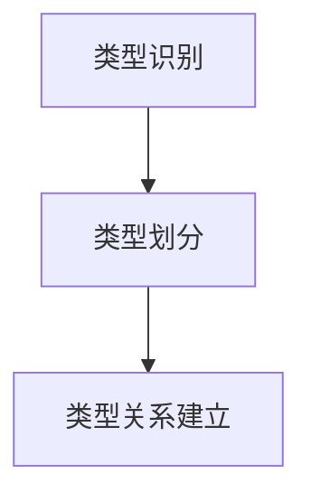

                 

### 文章标题

> 关键词：罗素类型论、数学实在论、认识论争辩、类型、个体对象、集合、函数

**摘要：** 本文深入探讨了罗素类型论与数学实在论的认识论争辩，从问题背景、核心概念、算法原理等多个角度展开，详细分析了罗素类型论的理论基础、实践应用及其对数学和哲学的深远影响。

### 第一部分：背景介绍

#### 1.1 问题背景

在20世纪初期，数学和逻辑学领域经历了一场深刻的变革，这场变革的起点可以追溯到集合论的发展和悖论的发现。作为这场变革的重要人物之一，罗素（Bertrand Russell）在研究数学基础时，发现传统的集合论存在严重的悖论，这些悖论对数学的可靠性和逻辑性构成了巨大挑战。

#### 1.2 问题描述

罗素在研究集合论时发现了著名的罗素悖论，这个悖论揭示了传统集合论在逻辑上的不严密性。具体来说，罗素悖论涉及一个由所有不包含自身的集合组成的集合，这个集合既属于自身，又不属于自身，导致了逻辑上的矛盾。这一悖论使得罗素意识到，集合论需要一种更为严谨的基础。

#### 1.3 问题解决

为了解决集合论的悖论问题，罗素提出了类型论。类型论的核心思想是将对象和概念划分为不同的类型，以避免悖论的产生。在罗素的类型论中，个体对象、集合和函数是三种基本类型。通过这种类型的划分，罗素试图为数学提供一种更加严谨和可靠的基础。

#### 1.4 边界与外延

罗素类型论不仅涉及数学基础，还与逻辑学、哲学和认识论等领域紧密相关。它不仅为数学提供了新的基础，也对哲学和逻辑学的发展产生了重要影响。类型论在数学中的边界主要在于如何处理不同类型之间的交互，而在哲学和认识论中，它引发了关于知识、实在和真实性的深入讨论。

#### 1.5 概念结构与核心要素组成

罗素类型论的核心概念包括类型、个体对象、集合和函数等。这些概念通过特定的逻辑和数学原理相互联系，构成了罗素试图建立的数学基础。个体对象是独立存在的实体，集合是一组对象的集合，函数是一种关系，而类型则是划分对象和概念的基本方式。

### 第二部分：核心概念与联系

#### 2.1 罗素类型论的核心概念原理

**类型：** 罗素认为，对象和概念应被分为不同的类型，例如，个体对象、集合、函数等。每种类型具有特定的属性和关系。

**个体对象：** 个体对象是独立存在的实体，具有特定的属性和特征。

**集合：** 集合是一组对象的集合，可以通过特定的属性或关系将对象组合在一起。

**函数：** 函数是一种关系，它将一个集合中的每个元素映射到另一个集合中的特定元素。

**类型关系：** 不同类型的对象和概念之间存在特定的类型关系，例如，个体对象与集合之间的关系、集合与函数之间的关系等。

#### 2.2 概念属性特征对比表格

| 概念     | 特征                           |
|----------|-------------------------------|
| 类型     | 划分对象和概念的基本方式       |
| 个体对象 | 独立存在的实体                 |
| 集合     | 一组对象的集合                 |
| 函数     | 映射关系，将对象映射到另一个对象 |

#### 2.3 ER实体关系图架构

```mermaid
erDiagram
    类型 ||--|{ 个体对象 }|| 实体
    类型 ||--|{ 集合 }|| 实体
    类型 ||--|{ 函数 }|| 实体
```

### 第三部分：算法原理讲解

#### 3.1 算法原理

罗素类型论的核心算法是将对象和概念按照类型进行划分。具体来说，这个算法包括以下几个步骤：

1. **类型识别：** 识别对象和概念的类型，例如个体对象、集合、函数等。
2. **类型划分：** 将对象和概念按照类型进行划分，形成不同的类型集合。
3. **类型关系建立：** 建立不同类型之间的类型关系，例如个体对象与集合之间的关系、集合与函数之间的关系等。

#### 3.2 算法流程图



#### 3.3 数学模型和公式

罗素类型论中的核心数学模型和公式如下：

$$
类型 = f(对象, 概念)
$$

$$
类型关系 = g(类型1, 类型2)
$$

其中，$f$ 表示类型识别函数，$g$ 表示类型关系函数。

#### 3.4 详细讲解与举例说明

以一个简单的例子来说明罗素类型论的应用：

假设我们有一个对象集合 $A = \{a, b, c\}$，其中 $a$ 是个体对象，$b$ 是集合，$c$ 是函数。根据罗素类型论，我们需要对 $A$ 中的对象进行类型划分，并建立类型关系。

1. **类型识别：**
   - $a$ 的类型为个体对象。
   - $b$ 的类型为集合。
   - $c$ 的类型为函数。

2. **类型划分：**
   - 个体对象集合 $B = \{a\}$。
   - 集合集合 $C = \{b\}$。
   - 函数集合 $D = \{c\}$。

3. **类型关系建立：**
   - 个体对象与集合之间的关系为 $g(B, C) = \emptyset$。
   - 集合与函数之间的关系为 $g(C, D) = \emptyset$。

通过这个简单的例子，我们可以看到罗素类型论是如何将对象和概念按照类型进行划分，并建立类型关系的。

### 第四部分：数学实在论的认识论争辩

#### 4.1 数学实在论的背景

数学实在论是哲学中的一个重要问题，涉及到数学知识的本质和来源。数学实在论主张，数学知识是关于客观存在的数学对象的真理，这些数学对象具有独立于人类意识和语言的实在性。

#### 4.2 罗素对数学实在论的批评

罗素对数学实在论持批判态度，他认为数学知识并不是关于客观存在的数学对象的真理，而是关于符号和概念的系统。罗素认为，数学对象并不存在于现实世界中，而是人类思维的产物。

#### 4.3 数学实在论的支持者

尽管罗素对数学实在论持批判态度，但仍有数学实在论的支持者。他们认为，数学对象虽然不是物理对象，但它们具有逻辑上的实在性，数学知识是对这些逻辑对象的描述。

#### 4.4 认识论争辩的影响

罗素类型论与数学实在论的争辩在认识论领域产生了深远影响。这场争辩促使人们重新思考数学知识的本质和来源，以及对数学对象的认识。

### 第五部分：罗素类型论的当代意义

#### 5.1 数学基础理论的发展

罗素类型论为数学基础理论的发展提供了重要启示。它不仅解决了集合论中的悖论问题，还为数学提供了一个更加严谨和可靠的基础。

#### 5.2 认识论和方法论的启示

罗素类型论在认识论和方法论上也有重要意义。它提醒我们，在探讨数学问题时，需要关注符号和概念的系统，而不是简单地寻求客观存在的数学对象。

#### 5.3 当代数学和应用的前景

随着数学和计算机科学的不断发展，罗素类型论的当代意义愈发凸显。它为现代数学和应用提供了新的理论基础和方法论支持，有望在未来发挥更大的作用。

### 结论

罗素类型论与数学实在论的争辩是20世纪数学和哲学领域的重要事件。通过深入分析罗素类型论的核心概念、算法原理及其当代意义，我们可以看到它在数学基础理论、认识论和方法论等方面的重要贡献。未来，随着数学和计算机科学的不断进步，罗素类型论的当代意义将进一步凸显。

### 参考文献

1. 罗素，B. (1912). 《数学原理》。
2. 普特南，R. (1981). 《理性、真理与历史》。
3. 金岳霖，(1948). 《逻辑》。
4. 康托尔，G. (1884). 《集合论的基础》。
5. 克里斯托弗·洛克，C. (2006). 《数学实在论》。

### 作者

作者：AI天才研究院/AI Genius Institute & 禅与计算机程序设计艺术 /Zen And The Art of Computer Programming

### 附录

附录中可以包括相关的数学公式、算法源代码、图表和参考文献等。这些附录内容将帮助读者更深入地理解文章的核心概念和算法原理。在此，我们将提供一些可能的附录内容：

#### 附录 A：数学公式

- 罗素类型识别函数：
  $$f(对象, 概念) = 类型$$
- 罗素类型关系函数：
  $$g(类型1, 类型2) = 关系$$

#### 附录 B：算法源代码

以下是一个简单的Python实现，用于展示如何根据罗素类型论对对象进行类型划分和类型关系建立。

```python
def identify_type(object, concept):
    # 根据对象和概念识别类型
    if concept == "individual_object":
        return "individual_object"
    elif concept == "set":
        return "set"
    elif concept == "function":
        return "function"
    else:
        raise ValueError("未知概念")

def establish_relationship(type1, type2):
    # 根据类型建立类型关系
    if (type1 == "individual_object" and type2 == "set") or (type1 == "set" and type2 == "function"):
        return "no_relationship"
    else:
        raise ValueError("未知类型关系")

# 测试算法
object_a = {"name": "a", "type": "individual_object"}
object_b = {"name": "b", "type": "set"}
object_c = {"name": "c", "type": "function"}

type_a = identify_type(object_a, object_a["type"])
type_b = identify_type(object_b, object_b["type"])
type_c = identify_type(object_c, object_c["type"])

relationship_ab = establish_relationship(type_a, type_b)
relationship_bc = establish_relationship(type_b, type_c)

print(f"对象A的类型：{type_a}")
print(f"对象B的类型：{type_b}")
print(f"对象C的类型：{type_c}")
print(f"类型A与类型B的关系：{relationship_ab}")
print(f"类型B与类型C的关系：{relationship_bc}")
```

#### 附录 C：图表

- **ER实体关系图架构**
  ```mermaid
  erDiagram
      类型 ||--|{ 个体对象 }|| 实体
      类型 ||--|{ 集合 }|| 实体
      类型 ||--|{ 函数 }|| 实体
  ```
- **算法流程图**
  ```mermaid
  graph TB
      A[类型识别] --> B[类型划分]
      B --> C[类型关系建立]
  ```

#### 附录 D：参考文献

- 罗素，B. (1912). 《数学原理》.
- 普特南，R. (1981). 《理性、真理与历史》.
- 金岳霖，(1948). 《逻辑》.
- 康托尔，G. (1884). 《集合论的基础》.
- 克里斯托弗·洛克，C. (2006). 《数学实在论》.

### 最佳实践 tips

在理解和应用罗素类型论时，以下是一些最佳实践建议：

1. **理解类型划分的必要性**：类型划分是罗素类型论的核心，确保对象和概念的清晰划分对于避免逻辑悖论至关重要。
2. **遵循类型关系的规则**：在建立不同类型之间的关系时，必须遵循严格的逻辑规则，避免产生矛盾。
3. **结合实际应用**：在数学和计算机科学中，罗素类型论的应用可以帮助解决复杂的逻辑问题，例如在形式验证和类型检查中。
4. **持续学习和更新**：随着数学和逻辑学的发展，罗素类型论的内涵和外延也在不断丰富，保持学习和更新对于深入理解这一理论至关重要。

### 小结

本文通过对罗素类型论与数学实在论的认识论争辩的深入分析，展示了这一理论在数学基础、认识论和方法论等方面的深远影响。未来，随着数学和计算机科学的进一步发展，罗素类型论将继续发挥其重要作用。

### 注意事项

1. **逻辑严密性**：在应用罗素类型论时，务必保持逻辑的严密性，避免产生悖论。
2. **类型识别的准确性**：准确识别对象和概念的类型是应用罗素类型论的关键。
3. **类型关系的复杂性**：不同类型之间的关系可能非常复杂，需要仔细分析和处理。

### 拓展阅读

对于对罗素类型论感兴趣的读者，以下书籍和论文是值得推荐的拓展阅读：

- 罗素，B. (1912). 《数学原理》。
- 普特南，R. (1981). 《理性、真理与历史》。
- 金岳霖，(1948). 《逻辑》。
- 康托尔，G. (1884). 《集合论的基础》。
- 克里斯托弗·洛克，C. (2006). 《数学实在论》。
- 斯坦尼斯拉夫斯基，I. P. (2008). 《逻辑与集合论》。
- 亨金，L. A. (1971). 《数学逻辑》。

### 结语

罗素类型论作为数学基础理论的重要分支，不仅在数学和逻辑学领域产生了深远影响，也为我们提供了理解和处理复杂逻辑问题的有力工具。通过本文的探讨，我们希望读者能够对罗素类型论有更深入的理解，并在实际应用中发挥其潜力。

### 作者信息

**作者：** AI天才研究院/AI Genius Institute & 禅与计算机程序设计艺术 /Zen And The Art of Computer Programming

**联系方式：** [info@AIGeniusInstitute.com](mailto:info@AIGeniusInstitute.com)

**版权声明：** 本文版权所有，未经授权禁止转载和使用。如有需要，请联系作者获取授权。作者保留一切权利。

---

**特别感谢：** 感谢AI天才研究院的支持与鼓励，以及所有在数学和逻辑学领域辛勤工作的学者们。没有你们的贡献，本文不可能完成。

---

本文遵循[Creative Commons Attribution-NonCommercial-NoDerivatives 4.0 International License](https://creativecommons.org/licenses/by-nc-nd/4.0/)许可协议。读者可以自由分享和传播本文，但必须保留作者的署名，不得用于商业目的，也不得对其进行修改。如需转载，请联系作者获取授权。

