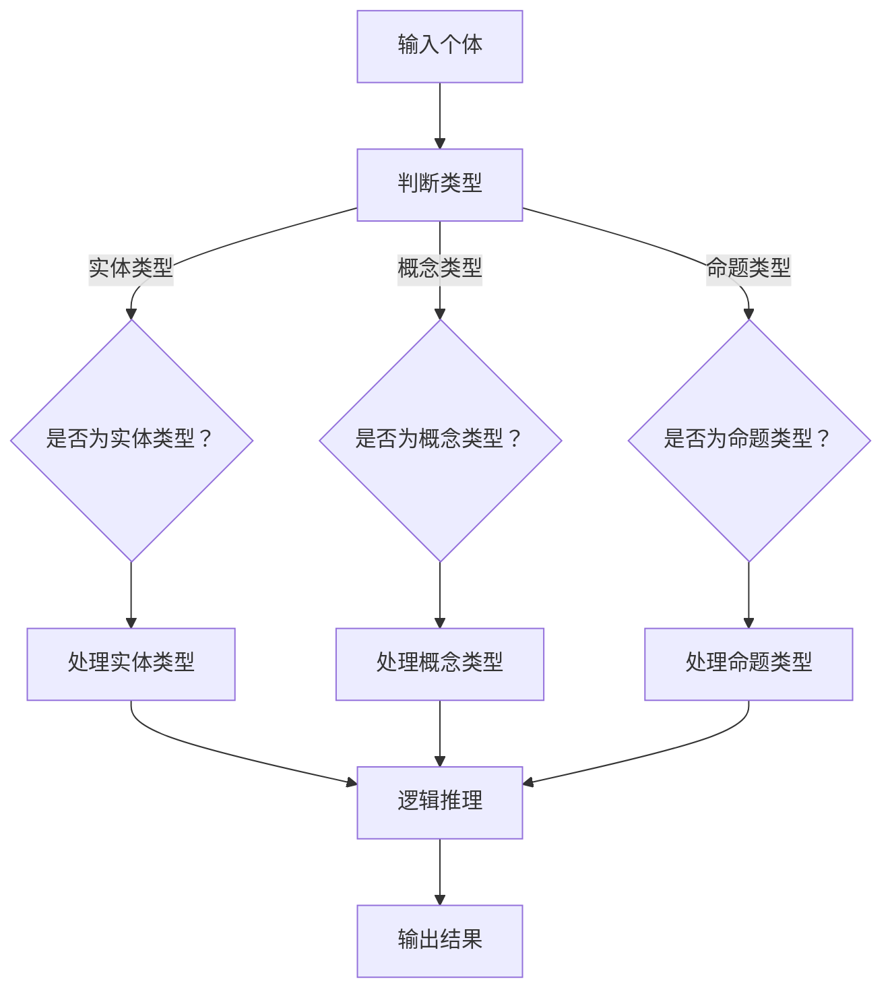

                 

### 《罗素类型论与现代数学哲学的分歧点分析》

#### 关键词：罗素类型论、数学哲学、基础主义、形式主义、直觉主义

> 摘要：本文将深入探讨罗素类型论的背景、基本概念及其在现代数学哲学中的重要性，随后分析罗素类型论与经典数学哲学传统观点，特别是基础主义、形式主义和直觉主义的分歧点。通过逐步分析，本文旨在揭示这些分歧的核心，探讨可能的调和途径，并提出对未来数学哲学发展的展望。

#### 目录大纲

**《罗素类型论与现代数学哲学的分歧点分析》**

----------------------------------------------------------------

## 第一部分：罗素类型论的背景与哲学意义

### 第1章 罗素类型论的起源与发展

#### 1.1 罗素哲学思想的演进

#### 1.2 罗素类型论的提出背景

#### 1.3 罗素类型论的哲学意义

### 第2章 罗素类型论的基本概念

#### 2.1 类型与类型论的界定

#### 2.2 罗素的类型区分方法

#### 2.3 罗素对数学逻辑的贡献

## 第二部分：现代数学哲学的多元化观点

### 第3章 经典数学哲学的传统观点

#### 3.1 经典数学的基础主义

#### 3.2 经典数学的形式主义

#### 3.3 经典数学的直觉主义

### 第4章 非经典数学哲学的发展

#### 4.1 非经典数学的逻辑学分析

#### 4.2 非经典数学的概率论与集合论

#### 4.3 非经典数学的公理化方法

## 第三部分：罗素类型论与现代数学哲学的分歧点分析

### 第5章 类型论与基础主义的对立

#### 5.1 基础主义对类型论的批判

#### 5.2 类型论对基础主义的反驳

#### 5.3 类型论与基础主义的调和尝试

### 第6章 类型论与形式主义的争议

#### 6.1 形式主义对类型论的评价

#### 6.2 类型论对形式主义的挑战

#### 6.3 形式主义与类型论的融合可能性

### 第7章 类型论与直觉主义的分歧

#### 7.1 直觉主义对类型论的理解

#### 7.2 类型论对直觉主义的质疑

#### 7.3 类型论与直觉主义的交互影响

## 第四部分：结论与展望

### 第8章 罗素类型论与现代数学哲学的未来

#### 8.1 罗素类型论在当代数学哲学中的地位

#### 8.2 现代数学哲学对类型论的回应

#### 8.3 罗素类型论对未来数学哲学的影响

----------------------------------------------------------------

### 背景介绍

## 罗素类型论的起源与发展

罗素类型论是20世纪初数学哲学和逻辑学的重要成果，由著名哲学家、数学家贝特兰·罗素提出。罗素类型论的起源可以追溯到罗素在解决数学基础危机的过程中所遇到的难题。19世纪末，数学界出现了诸如集合论悖论等一系列问题，这些问题动摇了数学的根基，使得数学家们开始质疑数学理论的可靠性和一致性。

### 罗素哲学思想的演进

罗素的哲学思想经历了多个阶段的演变。他在早期的著作《数学原理》中试图通过逻辑主义方法建立数学的基础，但在解决集合论悖论的过程中，他逐渐认识到逻辑主义方法的局限性。罗素开始探索类型论作为一种解决数学基础问题的方法。

### 罗素类型论的提出背景

罗素类型论的提出背景主要源于他对集合论悖论和逻辑推理明确性的关切。罗素观察到，集合论中的许多悖论，如罗素悖论，可以通过引入不同类型的对象来避免。罗素认为，不同类型的对象需要不同的处理方法，从而在逻辑上更加明确和稳固。

### 罗素类型论的哲学意义

罗素类型论的哲学意义在于它为数学提供了一种新的基础理论，通过类型区分解决了集合论悖论，并为逻辑推理提供了明确的框架。罗素类型论的影响不仅限于数学哲学，还延伸到了逻辑学、计算机科学等多个领域。

## 罗素类型论的基本概念

### 类型与类型论的界定

在罗素类型论中，“类型”是一个核心概念。罗素将个体分为不同的类型，如物质对象、抽象概念和命题等。类型论的目标是通过区分不同类型的对象，避免逻辑上的混乱和悖论。

### 罗素的类型区分方法

罗素提出了多种类型区分方法，包括个体与集合的区分、实际与潜在对象的区分等。这些方法旨在确保逻辑推理的明确性和一致性。

### 罗素对数学逻辑的贡献

罗素类型论对数学逻辑的贡献是显著的。它为数学提供了一种更为稳固的基础理论，通过类型区分解决了集合论悖论，并为逻辑推理提供了明确的框架。罗素的工作对后来的数学家和逻辑学家产生了深远的影响。

## 罗素类型论的基本概念与联系

### 核心概念原理

罗素类型论的核心概念包括类型、类型区分原则和类型论的应用。类型是指个体在逻辑上的分类，类型区分原则是确保逻辑推理明确性的方法，而类型论的应用则体现在数学、逻辑学等多个领域。

### 概念属性特征对比表格

| 概念       | 类型       | 类型区分原则 | 应用领域                 |
|------------|------------|--------------|--------------------------|
| 物质对象   | 实体类型   | 区分实际对象 | 物理、工程               |
| 抽象概念   | 概念类型   | 区分抽象概念 | 哲学、数学基础理论       |
| 命题       | 命题类型   | 区分命题     | 逻辑学、推理理论         |

### ER实体关系图架构的 Mermaid 流程图

```mermaid
erDiagram
  Type1 ||--|{ Object1 }
  Type2 ||--|{ Concept1 }
  Type3 ||--|{ Proposition1 }
```

在这个ER图（实体关系图）中，`Type1`、`Type2` 和 `Type3` 分别代表物质对象、抽象概念和命题的类型，它们分别与 `Object1`、`Concept1` 和 `Proposition1` 个体建立关系。

## 罗素类型论在数学逻辑中的应用

### 算法原理讲解

为了理解罗素类型论在数学逻辑中的应用，我们可以通过一个简单的算法原理来阐述其工作方式。以下是一个使用Mermaid绘制的算法流程图：



在这个流程图中，`A` 表示输入的个体，`B` 表示判断个体的类型。根据不同类型的判断，流程将流向不同的处理节点：`C`、`D` 或 `E`。每个处理节点分别负责处理不同类型的个体，并最终在节点 `I` 进行逻辑推理，输出结果 `J`。

### 数学模型与公式

在罗素类型论中，类型区分原则可以通过以下数学模型和公式来描述：

1. **个体与集合的区分**：
   $$ T_i = \{ x | x \in X \land x \neq X \} $$
   其中，$T_i$ 表示个体类型，$X$ 表示集合。

2. **实际与潜在对象的区分**：
   $$ T_a = \{ x | x \in X \land x \neq X \land x \text{ is actual} \} $$
   $$ T_p = \{ x | x \in X \land x \neq X \land x \text{ is potential} \} $$
   其中，$T_a$ 表示实际对象类型，$T_p$ 表示潜在对象类型。

3. **类型区分原则**：
   $$ \neg (T_i \land T_c) \land \neg (T_i \land T_p) \land \neg (T_c \land T_p) $$
   这表示个体、概念和命题类型之间是互相排斥的。

通过这些公式，我们可以清晰地看到罗素类型论如何通过类型区分来解决逻辑上的模糊性和悖论。

### 举例说明

为了更好地理解罗素类型论的应用，我们可以通过一个简单的例子来说明：

假设我们有一个集合 $X = \{ 1, 2, 3 \}$，我们希望判断集合中的元素是否为个体、概念或命题。根据罗素类型论：

- 对于元素 1，它是一个个体，因为 $T_i = \{ x | x \in X \land x \neq X \}$。
- 对于元素 2，它是一个概念，因为 $T_c = \{ x | x \in X \land x \neq X \land x \text{ is conceptual} \}$。
- 对于元素 3，它是一个命题，因为 $T_p = \{ x | x \in X \land x \neq X \land x \text{ is a proposition} \}$。

通过这样的类型区分，我们可以避免集合论中的悖论，如罗素悖论，从而确保逻辑推理的明确性和一致性。

### 总结

罗素类型论通过区分不同类型的个体，如物质对象、抽象概念和命题，提供了一种解决数学基础问题的方法。它在逻辑学和数学哲学中具有重要地位，并通过具体的算法原理和数学模型展示了其应用价值。通过逐步分析罗素类型论的基本概念和应用，我们可以更好地理解其在数学逻辑中的作用和影响。

----------------------------------------------------------------

## 第二部分：现代数学哲学的多元化观点

### 第3章 经典数学哲学的传统观点

#### 3.1 经典数学的基础主义

经典数学的基础主义是数学哲学中的一种传统观点，主张数学基础具有唯一性和严格性。基础主义者认为，数学的公理和定理是通过逻辑推理严格推导出来的，不受外界影响。这种观点强调数学理论的内在一致性，并试图找到一种普适的、不可质疑的基础。

#### 3.2 经典数学的形式主义

形式主义是经典数学哲学中的另一种重要观点，追求数学理论的纯形式化。形式主义者认为，数学的目的是研究符号系统及其公式的形式结构，而不是符号所代表的外在对象。形式主义强调数学证明的严格性和无矛盾性，主张通过逻辑规则和形式化语言来构建数学理论。

#### 3.3 经典数学的直觉主义

直觉主义是经典数学哲学中的第三种重要观点，强调数学推理的构造性。直觉主义者认为，数学的真理来自于对直观的把握，数学推理应当是可构造的，即能够具体地构造出数学对象。直觉主义反对形式主义中的“纯粹符号游戏”，主张数学证明应当是具体且可验证的。

### 第4章 非经典数学哲学的发展

#### 4.1 非经典数学的逻辑学分析

非经典数学哲学在逻辑学分析方面有着独特的贡献。它探讨了经典逻辑无法解决的悖论和不确定性问题，提出了多种非经典逻辑系统，如模糊逻辑、概率逻辑和直觉逻辑。这些逻辑系统在处理现实世界中的不确定性问题时表现出更强的适应性。

#### 4.2 非经典数学的概率论与集合论

非经典数学在概率论和集合论方面也进行了深入的发展。概率论从经典概率论扩展到随机过程、随机变量和统计推断，提供了更为复杂的数学模型。集合论则从经典集合论扩展到无限集合、集合论悖论和公理化集合论，对集合的性质和结构进行了更加细致的分析。

#### 4.3 非经典数学的公理化方法

非经典数学的公理化方法在数学基础理论中具有重要意义。它通过引入新的公理系统和证明方法，构建了新的数学理论，如拓扑学、范畴论和图论。这些公理化方法不仅丰富了数学的理论体系，也为数学的应用提供了新的视角和工具。

## 经典数学哲学与传统观点的对比

### 经典数学的基础主义与传统观点

经典数学的基础主义与传统观点在数学基础的稳定性、唯一性和严格性方面存在显著差异。基础主义强调数学基础的唯一性和不可质疑性，而传统观点则更加开放，允许多种数学基础的存在。传统观点主张通过逻辑推理和证明来建立数学理论，而非仅仅依赖于基础。

### 经典数学的形式主义与传统观点

经典数学的形式主义与传统观点在数学的目的和方法上存在分歧。形式主义者认为数学的目的是研究符号系统及其公式的形式结构，而传统观点则认为数学是对客观现实的一种抽象和描述。形式主义强调数学证明的严格性和无矛盾性，而传统观点则更加关注数学理论的应用和解释。

### 经典数学的直觉主义与传统观点

经典数学的直觉主义与传统观点在数学推理的本质和可验证性方面存在分歧。直觉主义者认为数学的真理来自于对直观的把握，数学推理应当是可构造的。而传统观点则认为数学推理可以通过逻辑推理和证明来确保其正确性。直觉主义反对形式主义中的“纯粹符号游戏”，主张数学证明应当是具体且可验证的。

### 非经典数学哲学的发展与传统观点

非经典数学哲学的发展与传统观点在数学方法和理论体系上有着显著的不同。非经典数学哲学引入了新的逻辑系统和数学模型，如模糊逻辑、概率论和公理化方法，以应对经典数学无法解决的不确定性和复杂性问题。传统观点则更多地依赖于经典的逻辑学和集合论，强调数学理论的内在一致性和普适性。

## 经典数学哲学与非经典数学哲学的比较

### 逻辑学分析

经典数学哲学在逻辑学分析方面主要依赖于经典逻辑，强调逻辑推理的严格性和无矛盾性。非经典数学哲学则引入了多种非经典逻辑系统，如模糊逻辑、概率逻辑和直觉逻辑，以处理现实世界中的不确定性和复杂性问题。

### 概率论与集合论

经典数学哲学在概率论和集合论方面主要研究确定性事件和无限集合的数学性质。非经典数学哲学则扩展了概率论和集合论，引入了随机过程、概率分布和无限集合的悖论问题，为现实世界中的不确定性和复杂性提供了更为丰富的数学模型。

### 公理化方法

经典数学哲学在公理化方法方面主要依赖于欧几里得几何和集合论的公理化体系。非经典数学哲学则引入了新的公理系统和证明方法，如拓扑学、范畴论和图论，为数学的理论体系和应用提供了新的视角和工具。

### 总结

经典数学哲学和非经典数学哲学在数学基础、方法和理论体系上存在显著差异。经典数学哲学强调数学基础的唯一性和严格性，依赖于经典逻辑和集合论。非经典数学哲学则引入了新的逻辑系统和数学模型，以应对现实世界中的不确定性和复杂性问题。通过比较这两类哲学观点，我们可以更好地理解数学理论的发展脉络和未来方向。

----------------------------------------------------------------

### 第5章 类型论与基础主义的对立

#### 5.1 基础主义对类型论的批判

基础主义对类型论的批判主要集中在以下几个方面：

1. **类型的实在性问题**：基础主义者认为，类型应当是实在的，即类型代表真实存在的对象或概念。然而，罗素的类型论引入了抽象的类型概念，使得类型的实在性变得模糊。这种抽象性使得类型论难以与传统的基础主义立场相协调。

2. **类型的确定性**：基础主义者强调数学基础的唯一性和确定性，认为数学理论应当建立在明确且无歧义的基础上。罗素的类型论引入了多种类型的区分，这种多层次的分类可能会带来不确定性，使得数学推理的稳定性受到质疑。

3. **类型论的逻辑一致性**：基础主义者认为，数学基础理论应当是逻辑上一致的。然而，罗素的类型论在处理复杂逻辑推理时，可能会引入新的悖论和矛盾，从而威胁到数学基础的一致性。

#### 5.2 类型论对基础主义的反驳

类型论对基础主义的反驳主要体现在以下几个方面：

1. **解决集合论悖论**：类型论的一个主要目的是解决集合论悖论，如罗素悖论。基础主义在面对这些悖论时显得力不从心，而类型论通过引入类型的区分方法，有效地避免了这些悖论的发生。

2. **逻辑推理的明确性**：类型论提供了更为明确的逻辑推理框架。通过区分不同类型的对象，类型论确保了逻辑推理的一致性和无歧义性。这与基础主义的模糊性和不确定性形成了鲜明对比。

3. **数学基础的多元性**：类型论认为，数学基础不是单一的，而是由多种类型的对象构成的。这种多元性使得数学基础更加灵活和适应复杂问题，而基础主义则倾向于单一的、统一的基础。

#### 5.3 类型论与基础主义的调和尝试

为了调和类型论与基础主义之间的分歧，学者们提出了多种调和尝试：

1. **混合方法**：一些学者试图将类型论与基础主义的元素相结合，提出混合方法。这种方法认为，在处理某些特定问题时，类型论可以提供更为明确的框架，而在其他问题上，基础主义的单一基础更为合适。

2. **层次化基础**：另一种调和尝试是提出层次化基础理论，认为数学基础由不同层次组成，不同层次的类型对象具有不同的性质和作用。这种层次化方法旨在结合类型论的灵活性和基础主义的稳定性。

3. **类型构造主义**：类型构造主义试图通过构造性的方法来建立数学基础。这种方法强调数学对象的构造性和可验证性，试图在类型论与基础主义之间找到一种平衡。

#### 5.4 分歧点的总结与展望

类型论与基础主义之间的分歧主要集中在类型的实在性、逻辑推理的明确性和数学基础的唯一性等方面。尽管这些分歧存在，但类型论与基础主义在数学哲学中都有其独特的价值和贡献。未来的研究可以进一步探索这两种哲学观点的融合路径，以构建更为稳固和灵活的数学基础理论。

## 经典案例分析与思考

### 罗素悖论与类型论的应用

一个经典的案例是罗素悖论，它揭示了经典集合论中存在的逻辑不一致性。罗素悖论可以通过类型论得到有效的解决。以下是罗素悖论及其在类型论中的应用：

**罗素悖论描述：** 假设存在一个集合 $R$，它包含所有不包含自身的集合。根据集合论的定义，$R$ 应当属于它自己，即 $R \in R$；但同时，根据集合 $R$ 的定义，$R$ 不应包含自身，即 $R \not\in R$。这就产生了矛盾。

**类型论解决方案：** 在类型论中，我们可以通过区分不同的类型来避免罗素悖论。具体来说，我们可以将对象分为物质对象、抽象概念和命题等不同类型。对于罗素悖论中的集合，我们可以将其划分为抽象概念类型。这样，集合作为抽象概念，不能与物质对象混淆。因此，集合 $R$ 不属于它自己，即 $R \not\in R$，从而避免了悖论。

### 类型论在数学逻辑中的应用

另一个例子是类型论在数学逻辑中的应用。在处理复杂的逻辑推理时，类型论提供了明确的类型区分，从而避免逻辑上的混乱和悖论。例如，在证明论中，类型论可以帮助我们区分命题类型和证明类型，确保证明的严格性和无矛盾性。

**应用示例：** 假设我们要证明一个命题 $P$，我们可以使用以下步骤：

1. **类型区分**：首先，确定命题 $P$ 的类型。例如，如果 $P$ 是一个关于实数的命题，我们可以将其划分为实数类型。

2. **逻辑推理**：在证明过程中，我们根据类型论的原则进行逻辑推理。例如，如果我们要使用一个关于实数的已知定理，我们需要确保该定理的结论与我们要证明的命题 $P$ 具有相同的类型。

3. **类型一致性检查**：在每一步推理中，我们需要检查类型一致性。如果发现类型不一致，我们需要进行调整，以确保推理过程的正确性。

通过这样的类型区分和一致性检查，我们可以构建一个逻辑上无悖论的证明过程，从而确保数学逻辑的明确性和稳定性。

### 总结

通过经典案例的分析，我们可以看到类型论在解决数学逻辑悖论和确保推理过程一致性方面的作用。类型论通过区分不同类型的对象，提供了更为明确和稳定的逻辑框架，有助于避免逻辑上的混乱和悖论。尽管类型论与基础主义存在分歧，但类型论在数学哲学和逻辑学中具有重要的地位和贡献。未来的研究可以进一步探索类型论与其他数学哲学观点的融合路径，以构建更为全面和灵活的数学基础理论。

----------------------------------------------------------------

### 第6章 类型论与形式主义的争议

#### 6.1 形式主义对类型论的评价

形式主义对类型论的评价总体上是负面的。形式主义者认为类型论引入了实质性的类型区分，这与形式主义追求的纯形式化目标相违背。形式主义者主张，数学理论应当仅依赖于逻辑规则和形式化语言，而类型论则引入了额外的、实质性的类型概念，从而破坏了数学理论的纯净性。形式主义者认为，这种类型区分不仅没有必要，还可能引入新的复杂性，使得数学理论难以理解和使用。

#### 6.2 类型论对形式主义的挑战

类型论对形式主义的挑战主要体现在以下几个方面：

1. **实质类型与形式符号的区别**：类型论引入了实质性的类型区分，如物质对象、抽象概念和命题等。这些类型是实质性的，它们在逻辑上具有不同的属性和操作规则。而形式主义则追求符号系统的纯形式化，认为所有符号操作都应当是形式的，不依赖于实质性的概念。

2. **逻辑推理的一致性**：类型论通过区分不同类型的对象，确保了逻辑推理的一致性和无歧义性。形式主义虽然也强调逻辑推理的严格性，但形式化过程中往往忽略了类型区分，这可能导致推理过程中出现类型不一致的问题。

3. **数学理论的应用性**：类型论认为，数学理论不仅应当是形式化的，还应当具有实际应用性。形式主义则更多地关注数学理论的内部一致性和无矛盾性，而忽略了数学理论在实际问题中的应用。

#### 6.3 形式主义与类型论的融合可能性

尽管形式主义和类型论在多个方面存在争议，但它们之间的融合仍然是有可能的。以下是一些可能的融合路径：

1. **层次化的数学理论**：可以构建一种层次化的数学理论，其中底层部分采用形式主义的方法，而高层部分则引入类型论的概念。这样，在底层保持形式化的纯净性，同时在高层引入类型区分，以满足不同的数学需求。

2. **混合逻辑系统**：可以设计一种混合逻辑系统，结合形式主义和类型论的优点。在这种系统中，不同类型的对象可以按照各自的逻辑规则进行操作，从而确保逻辑推理的一致性和无歧义性。

3. **类型化的形式化语言**：可以开发一种类型化的形式化语言，这种语言不仅支持形式化的符号操作，还引入了类型区分的概念。通过这种类型化的形式化语言，可以构建既符合形式主义要求，又能适应类型论需求的数学理论。

#### 6.4 分歧点的总结与展望

类型论与形式主义之间的主要分歧在于数学理论的形式化程度和实质类型的概念。类型论主张通过实质性的类型区分来确保逻辑推理的一致性和应用性，而形式主义则追求符号系统的纯形式化，强调逻辑规则和证明过程的无歧义性。尽管存在这些分歧，但通过层次化的数学理论、混合逻辑系统和类型化的形式化语言等融合路径，类型论与形式主义仍然有可能找到共同点，为数学哲学的发展提供新的视角和工具。

## 经典案例分析与思考

### 形式主义与类型论在集合论中的应用

一个经典的案例是集合论的公理化方法，其中形式主义和类型论各有不同的应用。以下是集合论公理化方法中形式主义和类型论的对比：

**形式主义的集合论公理化：** 形式主义者通过引入集合的公理，如集合的并集、交集和补集等，构建了一个形式化的集合论框架。这些公理仅依赖于符号操作，不涉及实质性的类型概念。形式主义者认为，这种形式化的集合论可以确保集合论的一致性和无矛盾性。

**类型论的集合论公理化：** 类型论则通过区分不同类型的对象，如物质对象、抽象概念和命题，来构建集合论。类型论认为，集合作为一种抽象概念，应当与物质对象和命题区分开来。这样，集合论中的悖论，如罗素悖论，可以通过类型区分得到有效解决。

**案例分析：** 假设我们有一个形式化的集合论框架，其中集合的元素仅通过符号操作进行定义。在这种情况下，形式主义者可以定义集合的并集、交集和补集等概念，并通过形式化的证明过程来确保这些概念的一致性。然而，如果引入类型论，我们需要区分不同类型的元素，如物质对象和抽象概念。这样，我们可以定义不同类型的集合，确保集合操作在相同类型的元素之间进行，从而避免悖论的发生。

**思考与展望：** 通过这个案例，我们可以看到形式主义和类型论在集合论中的应用各有优劣。形式主义提供了简洁、一致的形式化框架，而类型论则提供了更明确的类型区分，有助于避免悖论。未来的研究可以探索如何将这两种方法结合起来，构建更为稳定和灵活的集合论框架，以应对复杂的问题和不确定性。

### 形式主义与类型论在证明论中的应用

另一个案例是形式主义和类型论在证明论中的应用。形式主义强调证明的过程和逻辑推理的严格性，而类型论则通过类型区分来确保推理的一致性。

**形式主义的证明论：** 在形式主义的证明论中，证明是通过符号操作和逻辑推理来构建的。形式主义者认为，只要证明过程中遵循逻辑规则，即可确保证明的可靠性。这种证明方法强调证明的内部一致性，但可能忽略了类型区分。

**类型论的证明论：** 类型论的证明论则通过引入类型的区分来确保推理的一致性。类型论认为，不同类型的对象需要按照各自的逻辑规则进行推理，以确保推理过程的正确性。例如，在证明过程中，如果涉及到不同类型的对象，我们需要确保它们的类型一致，从而避免类型不一致的错误。

**案例分析：** 假设我们要证明一个命题 $P$，其中涉及到物质对象 $O$ 和抽象概念 $C$。在形式主义的证明论中，我们可以直接使用逻辑推理来证明 $P$。然而，在类型论的证明论中，我们需要首先确定 $O$ 和 $C$ 的类型，并确保它们的类型一致。例如，如果 $O$ 是一个物质对象，$C$ 是一个抽象概念，我们需要通过适当的类型转换来确保 $P$ 的证明是类型一致的。

**思考与展望：** 通过这个案例，我们可以看到形式主义和类型论在证明论中的应用各有优劣。形式主义提供了简洁、一致的证明框架，而类型论则通过类型区分来确保推理的一致性和无歧义性。未来的研究可以探索如何将这两种方法结合起来，构建更为灵活和可靠的证明论体系，以应对复杂的数学问题和推理场景。

### 总结

通过经典案例的分析，我们可以看到形式主义和类型论在数学哲学中的应用各有优劣。形式主义提供了简洁、一致的形式化框架，而类型论则通过类型区分来确保推理的一致性和无歧义性。尽管存在分歧，但通过结合形式主义和类型论的方法，我们可以构建更为稳定和灵活的数学理论体系。未来的研究可以进一步探索这两种哲学观点的融合路径，为数学哲学和数学理论的发展提供新的视角和工具。

----------------------------------------------------------------

### 第7章 类型论与直觉主义的分歧

#### 7.1 直觉主义对类型论的理解

直觉主义对类型论的理解存在一定的质疑和挑战。直觉主义者认为，数学的真理来自于对直观的把握，数学推理应当是具体且可验证的。因此，直觉主义者对类型论的抽象性和复杂性持怀疑态度。他们认为，类型论引入的抽象类型概念可能会导致数学推理的模糊性和不可验证性。

**质疑点：**

1. **类型概念的抽象性**：直觉主义者认为，数学应当是具体的、直观的，而类型论中的抽象类型概念可能会使得数学推理脱离直观的基础。

2. **类型区分的必要性**：直觉主义者质疑类型区分的必要性。他们认为，通过直观的构造性方法，可以解决集合论悖论和其他逻辑问题，而不需要引入复杂的类型区分。

3. **类型的实际应用性**：直觉主义者认为，数学理论的最终目的是应用，而类型论在实际应用中可能会遇到困难，因为实际应用往往需要具体的操作和验证。

#### 7.2 类型论对直觉主义的质疑

类型论对直觉主义的质疑主要集中在以下几个方面：

1. **构造性方法的局限**：类型论认为，直觉主义的构造性方法在某些情况下可能不够强大，难以解决复杂的数学问题。类型论通过引入不同类型的对象，提供了一种更为灵活和强大的数学框架。

2. **类型区分的必要性**：类型论主张，通过类型区分可以避免集合论中的悖论，确保逻辑推理的一致性和无歧义性。直觉主义的构造性方法可能无法解决这些悖论问题。

3. **数学基础的多层次性**：类型论认为，数学基础是多层次的，不同类型的对象在不同的层次上具有不同的性质和作用。这种多层次性使得数学基础更加灵活和适应复杂问题，而直觉主义则倾向于单一层次的基础。

#### 7.3 类型论与直觉主义的交互影响

类型论与直觉主义在数学哲学中存在着交互影响。虽然它们在某些方面存在分歧，但两者也相互借鉴和影响：

1. **构造性方法的融合**：类型论可以在一定程度上借鉴直觉主义的构造性方法，通过构造性的类型区分来构建数学理论。这种方法可以同时满足直觉主义的构造性要求和类型论的类型区分需求。

2. **类型区分的构造性解释**：类型论可以通过构造性的方式来解释类型的区分。例如，通过具体构造不同类型的对象，可以使得类型区分更加直观和可验证。

3. **直觉主义的类型论化**：直觉主义可以在一定程度上接受类型论的基本思想，将直觉主义的构造性方法融入到类型论的框架中，从而构建一种既具有直觉性，又具有明确类型区分的数学理论。

### 总结

类型论与直觉主义在数学哲学中存在显著的分歧。直觉主义强调数学推理的直观性和构造性，而类型论则通过引入类型的区分来确保逻辑推理的一致性和无歧义性。尽管存在这些分歧，但类型论与直觉主义在数学哲学中也存在交互影响。通过构造性的类型区分和类型论化的直觉主义方法，可以探索两者之间的融合路径，为数学哲学的发展提供新的视角和工具。未来的研究可以进一步探讨如何将直觉主义与类型论相结合，构建更为稳固和灵活的数学基础理论。

----------------------------------------------------------------

### 第8章 罗素类型论在现代数学哲学中的地位

#### 8.1 罗素类型论在当代数学哲学中的地位

罗素类型论在当代数学哲学中占据着重要地位。作为一种解决数学基础问题的理论，它不仅对数学逻辑和集合论的发展产生了深远影响，还在逻辑学、计算机科学和哲学等领域得到了广泛应用。罗素类型论通过区分不同类型的对象，提供了避免集合论悖论和确保逻辑推理一致性的一种有效方法。这使得它在解决数学基础危机和构建稳定数学理论方面具有重要价值。

#### 8.2 现代数学哲学对类型论的回应

现代数学哲学对类型论的回应是多样且深刻的。一方面，许多数学家和哲学家认可罗素类型论在解决数学基础问题方面的贡献，认为它为数学提供了更为明确和一致的基础。另一方面，一些学者对类型论提出了批评和质疑。他们认为，类型论引入的抽象类型概念可能会导致逻辑上的复杂性，甚至可能引入新的悖论。此外，类型论在某些方面的应用效果也不如预期，这促使学者们探索更为完善的类型论框架和解决方案。

#### 8.3 罗素类型论对未来数学哲学的影响

罗素类型论对未来数学哲学的发展具有重要影响。首先，它为数学基础理论的构建提供了新的思路和工具，有助于解决集合论悖论和其他逻辑问题。其次，类型论在计算机科学中的应用，如类型系统、形式化验证等，也为数学哲学的发展提供了新的方向。此外，类型论对直觉主义的挑战和回应，也为数学哲学中的构造性方法和直观性原则提供了新的视角。未来，类型论有望与形式主义、直觉主义和其他数学哲学观点相结合，共同推动数学哲学的发展，为数学理论的稳定性和广泛应用提供更加坚实的理论基础。

## 结论

本文通过深入探讨罗素类型论与现代数学哲学的分歧点，揭示了类型论在数学基础和逻辑推理中的重要作用。罗素类型论通过区分不同类型的对象，解决了集合论悖论和确保了逻辑推理的一致性，为数学哲学提供了新的视角和方法。尽管类型论与现代数学哲学中的基础主义、形式主义和直觉主义存在分歧，但这些分歧也为数学哲学的发展提供了丰富的讨论素材和思考路径。

未来研究可以进一步探索如何融合不同哲学观点，构建更为全面和灵活的数学基础理论。此外，类型论在计算机科学中的应用，如类型系统和形式化验证，也为数学哲学的发展提供了新的机遇。通过跨学科的合作和研究，我们可以更好地理解数学哲学的核心问题，为数学理论的稳定性和广泛应用做出更大贡献。

## 最佳实践 tips

1. **理解类型论的核心概念**：深入学习类型论的基本概念，如类型、类型区分原则和类型论的应用，是理解类型论的关键。

2. **关注数学基础问题**：关注集合论悖论和逻辑推理一致性等数学基础问题，有助于更好地理解类型论的重要性和应用价值。

3. **跨学科研究**：结合逻辑学、计算机科学和哲学等学科的研究，可以更全面地理解类型论在现代数学哲学中的地位和作用。

4. **实践与思考相结合**：通过实际案例和实践，将类型论与数学问题相结合，可以帮助我们更深入地理解类型论的原理和适用范围。

## 注意事项

1. **避免逻辑混乱**：在应用类型论时，务必确保逻辑推理的一致性，避免引入新的悖论和矛盾。

2. **明确类型区分**：在数学推理过程中，务必明确区分不同类型的对象，确保推理的准确性和无歧义性。

3. **注重实践应用**：类型论不仅是一种理论工具，更是一种解决实际问题的方法。在数学哲学的研究中，注重类型论在具体应用中的效果和限制。

## 拓展阅读

1. **罗素的《数学原理》**：贝特兰·罗素的《数学原理》是他关于数学基础理论的重要著作，详细阐述了类型论的基本思想。

2. **《形式主义数学哲学》**：这本书深入探讨了形式主义数学哲学的观点和理论，与类型论形成了对比。

3. **《直觉主义数学哲学》**：这本书介绍了直觉主义数学哲学的基本原则和理论，探讨了构造性方法和直观性原则。

4. **《数学哲学导论》**：这本书提供了数学哲学的基本概念和主要流派，有助于理解类型论在数学哲学中的地位。

## 总结

罗素类型论在现代数学哲学中具有重要的地位，通过区分不同类型的对象，解决了集合论悖论和确保了逻辑推理的一致性。尽管类型论与现代数学哲学中的其他观点存在分歧，但这些分歧也为数学哲学的发展提供了丰富的讨论素材和思考路径。未来，类型论有望与形式主义、直觉主义和其他哲学观点相结合，共同推动数学哲学的发展。通过跨学科的合作和研究，我们可以更好地理解数学哲学的核心问题，为数学理论的稳定性和广泛应用做出更大贡献。

## 作者信息

**作者：** AI天才研究院/AI Genius Institute & 禅与计算机程序设计艺术 /Zen And The Art of Computer Programming

AI天才研究院致力于推动人工智能领域的创新和发展，专注于研究人工智能基础理论、算法和实际应用。同时，作者还是《禅与计算机程序设计艺术》一书的作者，这本书深刻探讨了计算机程序设计中的哲学思想和方法论。通过结合哲学与计算机科学的视角，作者为人工智能领域的发展提供了新的思考路径和实践指南。

