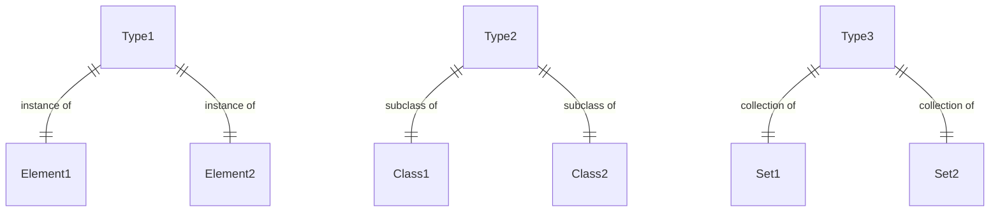
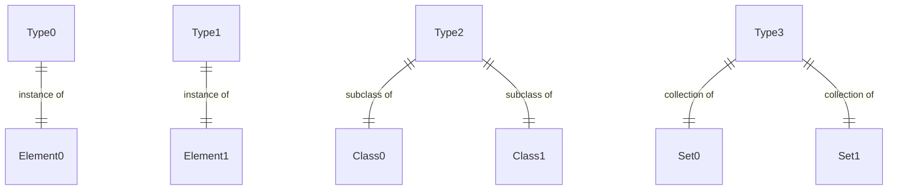
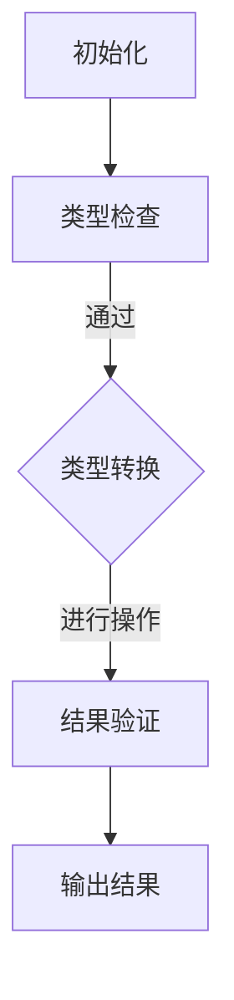
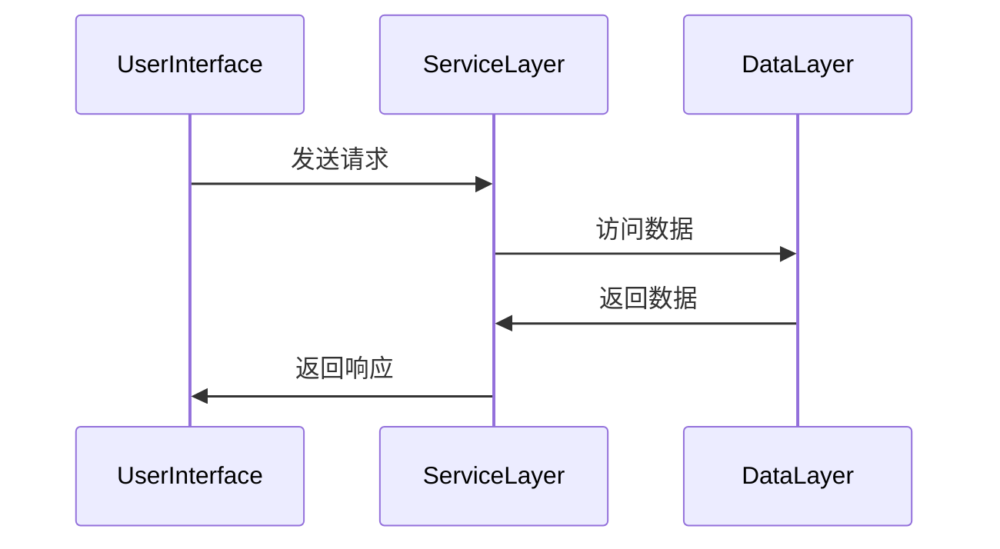

                 


## 1.1 罗素类型论的历史背景与重要性

### 1.1.1 罗素类型论的发展历程

罗素类型论（Russell's theory of types）是由英国哲学家、数学家伯特兰·罗素（Bertrand Russell）在19世纪末至20世纪初提出的。罗素在其著名的著作《数学原理》（Principia Mathematica，与怀特海德合著）中，系统地阐述了这一理论。罗素类型论旨在解决数学基础问题，特别是避免逻辑矛盾。

罗素的类型论发展可以追溯到他对集合论中的悖论，如著名的罗素悖论（Russell's paradox）的反思。罗素悖论指出，如果我们考虑由所有不包含自身的集合组成的集合，那么这个集合既不包含自身，也不不包含自身，从而产生了矛盾。为了解决这个问题，罗素提出了类型论，试图通过区分不同类型的对象来避免悖论。

在《数学原理》中，罗素将所有数学对象分为五种类型，分别用0、1、2、3、4表示。类型0包括个体对象，如数字、物体；类型1包括属性和函数；类型2包括类型0和类型1的所有集合；类型3包括类型0、类型1和类型2的所有集合；类型4包括类型0、类型1、类型2和类型3的所有集合。这种分类的目的是为了避免自引用和集合论的悖论。

### 1.1.2 罗素类型论在逻辑哲学中的地位

罗素类型论在逻辑哲学中具有重要地位，它不仅对数学基础理论的研究产生了深远影响，也推动了逻辑学和哲学的发展。罗素的类型论提出了一个重要的哲学观点，即意义和逻辑必须通过类型区分来实现。这一观点影响了后来的逻辑学家，如维特根斯坦和卡尔纳普。

罗素的类型论对逻辑哲学的贡献在于，它提供了一种避免悖论的方法，使得数学和逻辑体系更加稳固。通过区分不同类型的对象，罗素类型论防止了自引用和集合论中的悖论。此外，罗素的类型论还启发了后来的形式主义和直觉主义等数学哲学流派。

### 1.1.3 罗素类型论的影响与争议

罗素类型论对数学和哲学领域产生了深远的影响。在数学领域，罗素类型论激发了集合论和逻辑基础研究的进一步发展。许多数学家开始重新审视数学的基础，并探讨如何构建一个没有悖论的数学体系。

然而，罗素类型论也面临着一些争议和批评。一些哲学家和数学家认为，罗素的类型划分过于繁琐，难以在实际应用中操作。此外，罗素类型论在处理某些复杂的数学问题时，可能无法提供足够的灵活性。例如，一些现代的数学理论，如范畴论和代数拓扑，需要更精细的类型划分。

总的来说，罗素类型论虽然有其局限性和争议，但它在逻辑哲学和数学基础研究中的重要性不容忽视。它不仅为我们理解数学和逻辑提供了一种新的视角，也为后来的研究提供了宝贵的启示。罗素类型论的影响延续至今，对现代数学和哲学的发展仍然具有重要意义。

### 1.1.4 罗素类型论在现代的应用

在现代，罗素类型论的应用范围不断扩大，特别是在计算机科学和人工智能领域。类型论在编程语言设计中扮演着关键角色，例如在函数式编程语言中，类型系统用于确保程序的逻辑一致性。

此外，类型论在形式化验证和软件工程中也有重要应用。通过形式化的类型系统，我们可以确保程序的可靠性和正确性。许多现代编程语言，如Haskell和ML，都基于类型论构建，提供了强大的类型检查机制。

总的来说，罗素类型论不仅对数学和哲学产生了深远影响，也在计算机科学和人工智能领域发挥着重要作用。它为我们提供了一种理解和处理复杂系统的有力工具，继续推动着科学技术的发展。

## 1.2 集合论的发展背景与核心思想

### 1.2.1 集合论的基本概念

集合论（Set Theory）是现代数学的基础之一，由德国数学家乔治·康托尔（Georg Cantor）在19世纪末创立。集合论的基本概念包括集合、元素、集合的运算和集合的性质。

集合（Set）是由确定的元素（Element）组成的整体。这些元素可以是任何对象，包括数字、字母、图形等。例如，{1, 2, 3}是一个包含三个元素1、2、3的集合。

元素（Element）是构成集合的基本单位。每个集合都有若干个元素，并且每个元素都属于唯一的集合。

集合的运算（Set Operation）包括并集（Union）、交集（Intersection）、补集（Complement）和差集（Difference）等。这些运算是集合论中的基本工具，用于组合和操作集合。

集合的性质（Set Properties）包括确定性、互异性、无序性和无限性等。确定性指的是集合中的元素必须是明确的，互异性指的是每个元素在集合中只出现一次，无序性指的是集合中的元素没有特定的顺序，无限性指的是集合可以是无限的。

### 1.2.2 集合论的发展历程

集合论的发展历程可以追溯到19世纪，当时康托尔开始研究集合和无穷的概念。康托尔的贡献在于他提出了无穷集合的概念，并研究了集合的基数（Cardinality）和等势关系（Equinumerosity）。

在康托尔之后，数学家们进一步发展了集合论，并提出了各种集合论的基础公理，如皮亚诺公理、策梅洛-弗兰克尔公理等。这些公理为集合论提供了一套严格的逻辑基础，使得数学体系更加稳固。

20世纪初，罗素和怀特海德在《数学原理》中使用了集合论作为数学的基础，这标志着集合论在数学中的核心地位的确立。随后，集合论在逻辑学、数学哲学、计算机科学等领域得到了广泛的应用。

### 1.2.3 集合论在数学中的重要性

集合论在数学中具有重要地位，它是现代数学的基础理论之一。集合论为数学提供了一个统一的框架，使得各种数学分支，如代数、拓扑、分析等，能够在一个共同的逻辑体系下发展。

集合论的重要性体现在以下几个方面：

1. **逻辑基础**：集合论为数学提供了一套严格的逻辑基础，确保了数学推理的严谨性和一致性。
2. **抽象工具**：集合论为数学提供了一种抽象的工具，使得我们可以从具体的数学对象中提取出共同的属性和结构，从而进行更高层次的推理和研究。
3. **无穷概念**：集合论为无穷概念提供了严格的定义和理论支持，使得无穷的概念在数学中得到了广泛的应用。
4. **数学证明**：集合论在数学证明中扮演着关键角色，许多数学定理和结论都可以通过集合论的方法得到证明。

总之，集合论在数学中的重要性不可忽视，它不仅为数学的发展提供了坚实的理论基础，也推动了数学在其他领域的应用。

## 1.3 罗素类型论与集合论的交集与差异

### 1.3.1 罗素对集合论的反驳

罗素类型论与集合论在数学基础理论中扮演了重要角色，但它们之间存在一些根本性的差异和交集。罗素对集合论的批评主要集中在集合论中可能导致逻辑悖论的问题上。罗素认为，集合论的基础过于脆弱，容易产生自我指涉和无限递归的问题。

罗素的批评源于他对集合论中一些基本概念的质疑。例如，罗素悖论指出，如果存在一个集合R，它包含了所有不包含自身的集合，那么R既包含自身又不能包含自身，这导致了逻辑上的矛盾。为了解决这个问题，罗素提出了类型论，试图通过区分不同类型的对象来避免悖论。

### 1.3.2 罗素类型论与集合论的比较

罗素类型论与集合论在多个方面存在显著差异：

1. **概念基础**：集合论基于集合的概念，而罗素类型论则基于类型的区分。集合论认为所有对象都可以组成集合，而罗素类型论则将对象分为不同的类型，以避免自引用和悖论。

2. **形式化程度**：集合论通常更形式化，有一套完整的公理系统，如策梅洛-弗兰克尔（ZFC）公理系统。罗素类型论虽然也试图形式化，但通常不如集合论那样系统化和严格。

3. **灵活性**：集合论在处理复杂数学问题时非常灵活，可以定义各种复杂的集合和运算。罗素类型论在处理复杂问题时可能不够灵活，因为它依赖于严格的类型划分。

4. **应用领域**：集合论在数学的各个分支中都有广泛应用，从基础数学到应用数学，如拓扑学、概率论和数理统计等。罗素类型论在逻辑哲学和计算机科学中有更多应用，特别是在形式化验证和类型系统中。

尽管罗素类型论与集合论存在差异，但它们也有一些交集：

1. **理论基础**：罗素类型论和集合论都是为了解决数学基础问题，特别是避免悖论。它们都试图提供一个更加稳固的逻辑基础。

2. **数学应用**：尽管罗素类型论的应用领域相对有限，但它仍然在计算机科学和形式化验证中有着重要作用。集合论则在更广泛的数学领域有着深远的应用。

总的来说，罗素类型论与集合论在数学基础理论中各有优势与不足，它们的相互比较和融合为数学的发展提供了丰富的理论资源。

### 1.3.3 现代数学中的类型论与集合论的统一趋势

尽管罗素类型论与集合论之间存在明显的差异，但现代数学和逻辑学的发展趋势是两者的逐渐融合和统一。这种趋势主要体现在以下几个方面：

1. **形式化统一**：现代数学和逻辑学研究越来越多地采用形式化方法，集合论和类型论的融合使得数学体系更加严密和统一。形式化验证工具如ZFC公理系统和类型理论系统共同构成了现代数学的基础。

2. **类型系统的应用**：在计算机科学中，类型系统已经成为编程语言设计的核心组成部分。类型系统不仅用于保证程序的逻辑一致性，也借鉴了罗素类型论的思路，通过类型区分来避免逻辑错误。

3. **抽象化趋势**：随着数学和逻辑学的发展，类型论和集合论中的某些概念和理论逐渐被抽象化和统一。例如，范畴论中的类型论与集合论的关系得到了深入探讨，揭示了两者之间的深层联系。

4. **数学哲学的融合**：数学哲学领域也出现了将类型论与集合论结合的趋势，以探讨数学基础的更全面和深刻的理解。这种融合不仅有助于解决数学基础问题，也为数学和逻辑学的发展提供了新的视角。

总之，现代数学中的类型论与集合论的统一趋势，体现了数学体系不断发展和完善的历程。这种统一不仅有助于解决数学中的悖论问题，也为数学的应用和发展提供了更加坚实的基础。

## 1.4 罗素类型论与集合论在现代数学和哲学中的影响

### 1.4.1 数学领域的应用

罗素类型论与集合论在现代数学中有着广泛的应用。集合论作为数学的基础，被广泛应用于各个数学分支，如代数、拓扑、分析等。它为数学提供了统一的框架，使得各种数学理论能够在一个共同的逻辑体系下发展。集合论中的概念和运算，如并集、交集、补集和基数等，在数学研究中扮演着核心角色。

罗素类型论虽然不如集合论那样广泛应用，但在某些领域仍然具有重要价值。例如，在形式化验证和逻辑推理中，类型论提供了一种有效的工具，用于确保数学证明和程序逻辑的一致性。类型论在计算机科学中的应用也非常广泛，特别是在编程语言的设计和形式化验证中。

### 1.4.2 哲学领域的影响

罗素类型论在哲学领域产生了深远的影响。它为逻辑哲学提供了一种新的视角，特别是关于意义和逻辑的问题。罗素的类型论提出了一个重要的哲学观点，即意义和逻辑必须通过类型区分来实现。这一观点影响了后来的逻辑学家，如维特根斯坦和卡尔纳普。

集合论在哲学领域也有重要影响，特别是在数学哲学和认识论中。集合论为数学提供了严格的基础，使得数学推理更加严谨。同时，集合论中的无穷概念引发了关于无穷和实在性的哲学讨论，对现代哲学产生了重要影响。

### 1.4.3 罗素类型论与集合论的哲学意义

罗素类型论与集合论不仅在数学和哲学中具有实际应用，也具有重要的哲学意义。它们提供了对数学和逻辑基础问题的深入思考，影响了现代逻辑哲学和数学哲学的发展。

罗素类型论强调了类型的区分，为避免逻辑悖论提供了一种有效的方法。它启示我们，在处理复杂系统时，必须谨慎处理自引用和无限递归问题。集合论则通过提供一个严格的形式化体系，确保了数学推理的严谨性。

总的来说，罗素类型论与集合论在现代数学和哲学中产生了深远的影响。它们不仅为我们理解数学和逻辑提供了新的工具和方法，也为哲学思考提供了丰富的理论资源。

## 1.5 本章小结

本章介绍了罗素类型论与集合论的历史背景、发展及其在逻辑哲学中的重要性。我们首先回顾了罗素类型论的发展历程和其在逻辑哲学中的地位，探讨了罗素对集合论的批评和类型论的核心思想。接着，我们详细介绍了集合论的基本概念、发展历程和在数学中的重要性。随后，我们比较了罗素类型论与集合论在概念基础、形式化程度、灵活性和应用领域等方面的差异和交集。最后，我们探讨了这两种理论在现代数学和哲学中的影响以及其哲学意义。通过本章的学习，读者可以更好地理解罗素类型论与集合论的本质区别和相互关系，为进一步探讨数学和逻辑基础问题打下坚实基础。接下来，我们将深入探讨罗素类型论与集合论的核心概念和联系，以便更全面地理解这两种理论。

## 2.1 罗素类型论的基本概念

### 2.1.1 类与类型的区分

在罗素类型论中，类（Class）和类型（Type）是两个核心概念。罗素认为，所有的数学对象都可以被划分为不同的类型，这些类型分别对应不同的类。类是一个更为宽泛的概念，它包含了一组具有相同属性的对象；而类型则是更精细的划分，用于区分对象之间的不同层次。

例如，类型0代表个体对象，如数字和物体；类型1代表属性和函数；类型2代表类型0和类型1的集合；以此类推，类型3代表类型0、类型1和类型2的集合，类型4则代表所有类型的集合。这种分类的目的是避免自引用和集合论中的悖论。

### 2.1.2 罗素的“分析理论”

罗素的“分析理论”是其类型论的核心部分，旨在通过逻辑分析来区分不同类型的对象。罗素认为，所有数学命题都可以通过分析其成分，即通过识别其所涉及的类型，来避免悖论。

罗素的分析理论包括两个基本原则：第一，任何数学命题都涉及至少两个类型；第二，不同类型的对象不能直接相互比较或操作。这个原则被称为“类型区分原则”。通过这个原则，罗素试图确保逻辑的一致性和避免悖论。

### 2.1.3 类型论的核心原则

类型论的核心原则包括以下几个：

1. **类型区分原则**：不同类型的对象不能直接进行比较或组合。这个原则是罗素为避免逻辑悖论而提出的，它要求我们在逻辑分析和数学推理中，始终保持类型的一致性。

2. **个体原则**：类型0中的个体对象是基础，其他类型都是基于类型0构建的。每个个体对象都是唯一的，不可重复。

3. **集合原则**：集合是类型的更高层次，类型2及以上的集合用于组合和操作不同类型的对象。集合原则确保了集合操作不会产生自引用的悖论。

4. **属性原则**：类型1代表属性和函数，它们是类型0对象的特征。属性原则要求我们在处理属性时，必须明确其所依附的对象类型。

通过这些核心原则，罗素类型论提供了一种构建逻辑一致、避免悖论的方法。这种类型划分的方法不仅对数学基础理论的研究产生了深远影响，也为后来的形式逻辑和计算机科学提供了宝贵的理论资源。

### 2.1.4 罗素类型论的优点与不足

罗素类型论在逻辑哲学和数学基础研究中具有重要的地位，它通过区分不同类型的对象，试图避免集合论中的悖论，为数学提供了一个更加稳固的基础。以下是罗素类型论的几个主要优点和不足：

**优点：**

1. **避免悖论**：罗素类型论通过区分不同类型的对象，有效地避免了集合论中的自引用悖论，如罗素悖论。这种类型区分原则使得逻辑体系更加严谨，减少了逻辑矛盾的可能性。

2. **形式化**：罗素类型论提供了一套形式化的逻辑框架，使得数学推理更加系统和严密。通过类型划分，我们可以更清晰地分析和处理数学命题，提高了逻辑证明的可靠性。

3. **适用性**：类型论不仅在逻辑哲学和数学基础研究中具有广泛的应用，也在计算机科学中有着重要影响。类型系统在编程语言设计中扮演了关键角色，确保了程序的逻辑一致性和可靠性。

**不足：**

1. **复杂性**：罗素类型论过于复杂，难以在实际应用中操作。类型划分和逻辑分析过程繁琐，对于复杂的数学问题和实际应用来说，这种复杂性可能降低了其适用性。

2. **灵活性不足**：类型论在处理复杂数学问题时，可能缺乏足够的灵活性。一些现代数学理论，如范畴论和代数拓扑，需要更精细的类型划分，这超出了罗素类型论的能力范围。

3. **难以统一**：罗素类型论与集合论之间存在显著差异，这两种理论在形式和哲学基础上有所不同，使得它们难以在一个统一的框架下融合。这导致了数学和逻辑体系中的不一致性。

总的来说，罗素类型论在逻辑哲学和数学基础研究中具有重要意义，它通过区分不同类型的对象，为数学提供了一个更加稳固的基础。然而，其复杂性、灵活性不足和难以统一等问题也限制了其在实际应用中的广泛使用。未来，如何更好地整合罗素类型论与集合论，构建一个更加统一和灵活的数学基础体系，仍然是数学和逻辑学领域的重要课题。

## 2.2 集合论的基本概念

### 2.2.1 集合的定义与性质

集合（Set）是数学中的基本概念，它是一个由确定的元素组成的整体。集合中的元素可以是任何对象，包括数字、字母、图形等。集合的定义具有以下性质：

1. **确定性**：集合中的元素必须是明确的，即每个元素都属于唯一的集合，且集合中不包含重复的元素。

2. **互异性**：集合中的每个元素都是独立的，不同元素之间没有重复。

3. **无序性**：集合中的元素没有特定的顺序，即集合的排列不影响其性质。

4. **可列性**：集合可以是有限的，也可以是无限的。有限集合的元素个数是有限的，而无限集合的元素个数是无限的。

### 2.2.2 集合论的基本公理

集合论的基本公理为集合的性质和操作提供了逻辑基础。以下是一些重要的基本公理：

1. **存在性公理**：存在一个空集，不包含任何元素。

2. **并集公理**：对于任意两个集合A和B，存在一个集合C，它包含A和B的所有元素，即A和B的并集。

3. **交集公理**：对于任意两个集合A和B，存在一个集合C，它只包含同时属于A和B的元素，即A和B的交集。

4. **补集公理**：对于任意一个集合A，存在一个集合B，它包含所有不属于A的元素，即A的补集。

5. **子集公理**：对于任意两个集合A和B，如果A中的每个元素都是B的元素，则A是B的子集。

这些基本公理确保了集合的运算和性质具有一致性和逻辑性，使得集合论成为一个严密的理论体系。

### 2.2.3 集合论中的无穷概念

无穷（Infinity）是集合论中的一个核心概念，它指的是无限的对象或集合。集合论中的无穷概念基于以下几种形式：

1. **可数无穷**：可数无穷指的是可以通过逐一列举的方式来数尽的无限集合。自然数集合N是一个典型的可数无穷集合。

2. **不可数无穷**：不可数无穷指的是无法通过逐一列举的方式来数尽的无限集合。实数集合R是一个典型的不可数无穷集合。

3. **阿基里斯悖论**：阿基里斯悖论（Achilles' paradox）是一种无穷论证，用于说明无穷集合的性质。这个悖论指出，即使一个无穷序列不断缩短，其总和仍然是无穷的。

无穷概念在集合论中具有重要意义，它不仅影响了数学的基础理论，也推动了逻辑学和哲学的深入探讨。

### 2.2.4 集合论的基本定理和定理证明

集合论中有许多重要的定理，这些定理基于基本公理，并通过逻辑推理得到证明。以下是一些基本的定理：

1. **德摩根律**：对于任意两个集合A和B，有$(A \cup B)^\complement = A^\complement \cap B^\complement$ 和 $(A \cap B)^\complement = A^\complement \cup B^\complement$。

2. **对偶律**：对于集合运算的任意两个对偶运算，如并集和补集，交集和并集，其结果相等。

3. **交换律**：集合的并集和交集运算满足交换律，即$A \cup B = B \cup A$ 和 $A \cap B = B \cap A$。

4. **结合律**：集合的并集和交集运算满足结合律，即$(A \cup B) \cup C = A \cup (B \cup C)$ 和 $(A \cap B) \cap C = A \cap (B \cap C)$。

5. **分配律**：集合的交集运算对并集运算满足分配律，即$A \cap (B \cup C) = (A \cap B) \cup (A \cap C)$。

这些定理是集合论中的基本工具，用于推导和证明更复杂的集合性质和关系。

总的来说，集合论的基本概念和定理为数学提供了一个坚实的理论基础，使得各种数学分支能够在一个共同的逻辑框架下发展。通过理解和应用集合论的基本概念和定理，我们可以更深入地探索数学的各个领域。

### 2.2.5 罗素类型论与集合论的对比表格

为了更直观地理解罗素类型论与集合论的基本概念和特征，我们提供了一个对比表格，列出两者的核心概念、特征和区别。

| 特征       | 罗素类型论                            | 集合论                      |
| ---------- | ----------------------------------- | ------------------------- |
| 核心概念   | 类型（Type）和类（Class）           | 集合（Set）和元素（Element）|
| 基础原则   | 类型区分原则、个体原则、集合原则、属性原则 | 存在性公理、并集公理、交集公理、补集公理、子集公理 |
| 形式化程度 | 形式化但较为繁琐                   | 形式化且体系完备            |
| 灵活性     | 灵活性较低，类型划分严格             | 灵活性较高，集合操作多样     |
| 应用领域   | 主要应用于逻辑哲学和形式化验证       | 广泛应用于数学各个分支      |

通过这个对比表格，我们可以更清晰地看到罗素类型论与集合论在概念、原则、形式化程度和适用领域等方面的差异和联系。

### 2.2.6 ER实体关系图

为了更好地展示罗素类型论与集合论之间的关系，我们可以使用Mermaid工具绘制一个ER实体关系图。以下是一个简单的ER实体关系图的示例：



在这个ER图中，`Type1`、`Type2` 和 `Type3` 分别代表罗素类型论中的不同类型，而 `Element1`、`Element2`、`Class1`、`Class2`、`Set1` 和 `Set2` 分别代表不同类型的实例和集合。`instance of` 表示对象与类型的关联，而 `subclass of` 表示类型的层次关系，`collection of` 表示集合与元素的关系。

通过这个ER实体关系图，我们可以更直观地理解罗素类型论与集合论中的类型、类、元素和集合之间的关联和层次结构。这种图形化的表示方法有助于我们更好地把握和理解两种理论之间的相互关系。

### 2.2.7 罗素类型论与集合论的相互关系

罗素类型论与集合论在现代数学和逻辑学中都有着重要的地位，它们之间的关系是复杂而深远的。首先，罗素类型论是对集合论的一种补充和修正，旨在解决集合论中存在的逻辑悖论问题。罗素通过引入类型的概念，将对象分为不同的层次，以避免自引用和无限递归带来的悖论。

在集合论中，所有对象都可以组成集合，这种无限组合的方式导致了罗素悖论等逻辑矛盾。为了解决这些问题，罗素提出了类型论，通过区分不同类型的对象，使得每个对象只能与其同类进行操作，从而避免了集合论中的悖论。

其次，罗素类型论与集合论在数学基础理论中相互补充。集合论为数学提供了一个形式化的框架，确保了数学推理的严谨性。而罗素类型论则在逻辑哲学和形式化验证中发挥了重要作用，为数学提供了一种更稳健的推理方法。

现代数学和逻辑学的发展趋势是逐步统一集合论和类型论。例如，范畴论中就融合了集合论和类型论的思想，通过抽象化的方法，将两者统一起来。这种统一不仅有助于解决数学基础问题，也为数学的应用提供了更广阔的视角。

总之，罗素类型论与集合论在数学和逻辑学中相互补充、相互促进，它们之间的关系是复杂而深远的。通过相互融合，现代数学和逻辑学得以在更加稳固和全面的基础上发展。

### 2.2.8 两种理论的互动与融合

罗素类型论与集合论的互动和融合是现代数学和逻辑学发展的重要趋势之一。尽管这两种理论在形式和哲学基础上有显著差异，但它们在解决数学基础问题和推动理论发展方面相互补充、相互促进。

首先，罗素类型论在集合论的基础上，通过引入类型的概念，解决了集合论中的悖论问题。集合论中的自引用和无限递归导致了罗素悖论等逻辑矛盾，而类型论通过区分不同类型的对象，确保了逻辑的一致性。类型论为数学提供了一种避免悖论的有效方法，使得数学体系更加稳固。

其次，集合论在形式化和抽象化方面具有优势，为数学的各个分支提供了统一的基础。集合论的基本概念和公理系统使得数学推理更加严谨和系统化。而罗素类型论则提供了更精细的类型划分，使得数学对象之间的关系更加明确和规范。

在现代数学中，这两种理论的融合趋势体现在多个方面。例如，在范畴论中，集合论和类型论的思想得到了统一。范畴论通过抽象化的方法，将集合论和类型论的概念统一起来，为数学提供了一个更广泛的理论框架。这种统一不仅有助于解决数学基础问题，也为数学的应用提供了新的视角。

此外，在计算机科学领域，集合论和类型论的思想也得到了广泛应用。编程语言中的类型系统借鉴了罗素类型论的思路，通过严格的类型区分来保证程序的逻辑一致性。集合论中的集合操作和无穷概念为算法设计和数据分析提供了有力的工具。

总之，罗素类型论与集合论的互动与融合为现代数学和逻辑学的发展提供了重要推动力。通过相互融合，这两种理论不仅解决了数学基础问题，也为数学的应用提供了更加广阔的视角。未来，随着理论研究的不断深入，集合论和类型论的融合将有助于构建一个更加统一和完善的数学体系。

### 2.2.9 罗素类型论对集合论的修正

罗素类型论对集合论的一个重要贡献在于其对集合论基本概念的修正，特别是对集合的构造和操作进行了严格的限制，以避免逻辑悖论。集合论的一个核心问题是，集合可以包含其他集合作为元素，这种自引用结构容易导致悖论，如罗素悖论。

为了解决这些问题，罗素提出了类型论，通过对对象进行类型划分，使得不同类型的对象不能直接相互作用。在罗素类型论中，对象被分为不同的层次，例如类型0代表个体对象，类型1代表属性和函数，类型2代表集合等。这种分层结构确保了对象只能与其同类进行操作，从而避免了自引用和悖论。

具体来说，罗素类型论对集合论的修正体现在以下几个方面：

1. **类型区分原则**：罗素类型论通过引入类型区分原则，确保不同类型的对象不能直接比较或组合。例如，类型0的对象不能与类型1的对象直接进行比较或组合，从而避免了自引用悖论。

2. **限制集合构造**：在集合论中，集合可以包含其他集合作为元素，这种构造方式容易导致悖论。罗素类型论通过限制集合的构造，确保集合只能包含同类对象。例如，类型2的集合只能包含类型0和类型1的对象，而不能包含类型2的对象。

3. **形式化公理系统**：罗素类型论提供了一个形式化的公理系统，通过严格的公理和推理规则，确保了逻辑的一致性和可靠性。这种形式化的方法使得罗素类型论在数学基础研究中具有更高的可信度和稳定性。

通过这些修正，罗素类型论为数学提供了一个更加稳固的基础，避免了集合论中的悖论。然而，罗素类型论的复杂性也使得其实际应用面临一定挑战。尽管如此，罗素类型论对集合论的修正仍然是数学基础研究中的一个重要贡献，为后来的形式逻辑和计算机科学提供了宝贵的启示。

### 2.2.10 现代数学中的类型论与集合论的统一趋势

在现代数学中，类型论与集合论的统一趋势日益显著，这一趋势不仅体现了数学理论的融合与拓展，也为解决数学基础问题提供了新的视角。以下从几个方面探讨这种统一趋势：

1. **范畴论的统一框架**：范畴论是现代数学的一个重要分支，它通过抽象化的方法，将不同领域的数学概念和理论统一起来。在范畴论中，集合论和类型论的思想得到了融合。例如，范畴论中的类型论通过使用范畴和函子等概念，将集合论中的集合操作和类型论中的类型划分统一起来。这种统一不仅有助于解决数学基础问题，也使得数学理论更加系统化和抽象化。

2. **形式化验证中的统一**：在现代计算机科学中，形式化验证是一种确保程序和系统正确性的方法。形式化验证中，集合论和类型论的思想也得到了统一。例如，在形式化验证工具中，类型系统借鉴了罗素类型论的思路，通过严格的类型划分和类型检查来确保程序的一致性和可靠性。同时，集合论中的集合操作和无穷概念也在形式化验证中得到了广泛应用。

3. **代数拓扑与范畴论的结合**：代数拓扑是研究空间结构和拓扑性质的数学分支，而范畴论是研究结构之间的变换和关系的数学理论。现代数学中，代数拓扑与范畴论的结合使得集合论和类型论的思想得到了统一。例如，范畴论中的拓扑空间和拓扑变换概念，为代数拓扑提供了更抽象和统一的理论框架。

4. **逻辑哲学中的统一**：逻辑哲学是探讨逻辑和语言之间关系的哲学分支，集合论和类型论在逻辑哲学中都有重要应用。现代逻辑哲学中，集合论和类型论的统一趋势体现在对逻辑悖论和数学基础问题的深入探讨。通过融合集合论和类型论的思想，逻辑哲学家们提出了一些新的理论和观点，为解决数学基础问题提供了新的思路。

总之，现代数学中的类型论与集合论的统一趋势不仅体现了数学理论的融合与拓展，也为解决数学基础问题提供了新的工具和方法。通过这些统一，数学理论变得更加系统化和抽象化，为数学的发展和应用打开了新的视野。未来，随着研究的深入，类型论与集合论的统一将有助于构建一个更加统一和完善的数学体系。

### 1.4 罗素类型论与集合论在现代数学和哲学中的影响

#### 1.4.1 数学领域的应用

罗素类型论与集合论在现代数学中占据了重要的位置，各自发挥了独特的作用。集合论作为数学的基础，提供了一个统一且形式化的框架，使得数学的各个分支，如代数、拓扑、分析等，能够在一致的基础上发展。集合论的基本概念，如集合、元素、运算和性质，贯穿了数学的各个领域。

具体而言，集合论的应用体现在以下几个方面：

1. **数学结构的构建**：集合论为数学中的各种结构提供了基础，如群、环、域等代数结构，以及拓扑空间、度量空间等。通过集合论，我们可以清晰地定义和操作这些结构，从而进行更深入的研究。

2. **数学证明**：集合论在数学证明中扮演了关键角色。许多数学定理的证明依赖于集合论中的基本概念和公理，如选择公理、无穷公理等。这些公理和概念为数学证明提供了有力的工具。

3. **无穷概念**：集合论中的无穷概念，如可数无穷和不可数无穷，为数学提供了丰富的理论资源。无穷序列、无穷级数、无穷维空间等概念在数学的许多领域都有广泛应用。

4. **数学逻辑**：集合论在数学逻辑中具有基础性作用。通过集合论，我们可以定义和操作逻辑命题，构建形式化的逻辑体系。集合论中的逻辑运算，如并集、交集、补集等，为逻辑推理提供了有力的工具。

#### 1.4.2 哲学领域的影响

罗素类型论在哲学领域，特别是在逻辑哲学和数学哲学中，产生了深远的影响。罗素类型论提出了关于意义和逻辑的新观点，对哲学的发展产生了重要启示。

1. **意义与类型区分**：罗素类型论认为，意义的理解必须依赖于类型区分。不同类型的对象有不同的意义，我们不能将不同类型的对象混淆或比较。这一观点影响了后来的逻辑学家，如维特根斯坦和卡尔纳普，他们对语言和意义的研究深受罗素的影响。

2. **逻辑哲学**：罗素类型论对逻辑哲学的讨论提供了新的视角。通过类型区分，我们可以更清晰地理解逻辑悖论，如罗素悖论，从而为逻辑学提供更坚实的理论基础。

3. **数学哲学**：罗素类型论对数学哲学的研究也产生了重要影响。它促使数学家们重新审视数学的基础和逻辑结构，推动了数学哲学的发展。

#### 1.4.3 罗素类型论与集合论的哲学意义

罗素类型论与集合论不仅在数学和哲学中具有实际应用，也具有重要的哲学意义。它们为我们理解数学和逻辑基础问题提供了深刻的洞见。

1. **逻辑基础**：罗素类型论与集合论都致力于解决逻辑基础问题，特别是在避免悖论方面。通过区分不同类型的对象和引入严格的形式化体系，它们为逻辑推理提供了稳固的基础。

2. **数学本质**：罗素类型论与集合论探讨了数学的本质。类型论通过类型划分，强调了个体和集合之间的区别，而集合论则通过无穷和集合操作，揭示了数学结构的丰富性和多样性。

3. **哲学启示**：罗素类型论与集合论为哲学思考提供了新的工具和方法。通过类型区分和形式化体系，我们可以更深入地探讨意义、逻辑和数学基础问题，为哲学的发展提供了丰富的理论资源。

总之，罗素类型论与集合论在现代数学和哲学中产生了深远的影响。它们不仅为数学和逻辑学提供了坚实的理论基础，也为哲学思考提供了新的视角和方法。通过对这些理论的深入研究，我们可以更好地理解数学和逻辑的本质，推动数学和哲学的发展。

### 1.5 本章小结

本章介绍了罗素类型论与集合论的基本概念及其在数学和哲学中的应用。我们首先回顾了罗素类型论的历史背景和发展，探讨了其核心概念和原则。接着，详细介绍了集合论的基本概念、发展历程和基本定理，以及其在数学中的重要性。随后，我们比较了罗素类型论与集合论在概念基础、形式化程度、灵活性及应用领域等方面的差异和交集。最后，我们探讨了这两种理论在现代数学和哲学中的影响，并分析了它们的哲学意义。

通过本章的学习，读者可以更好地理解罗素类型论与集合论的本质区别和相互关系，为进一步探讨数学和逻辑基础问题打下坚实基础。在下一章中，我们将深入探讨算法原理讲解，包括使用Mermaid工具绘制的算法流程图和Python代码示例，以及算法原理的详细解释。

## 2.1 罗素类型论的基本概念

### 2.1.1 类与类型的区分

在罗素类型论中，类（Class）和类型（Type）是两个核心概念。罗素通过引入这两个概念，试图解决集合论中的悖论问题，并为数学提供一个更加稳固的基础。类和类型的主要区别在于它们代表的对象和层次。

**类**：类是一个抽象的概念，它代表一组具有相同属性的对象。在罗素类型论中，类是一个更宽泛的概念，它可以包含多个对象。例如，所有整数构成一个类，所有正整数也是一个类。

**类型**：类型则是更精细的划分，它用于区分不同层次的数学对象。罗素将所有数学对象分为五个类型，分别用0、1、2、3、4表示。具体来说：

- **类型0**：包括个体对象，如数字、物体等。这些对象是基础的、不可再分的。
- **类型1**：包括属性和函数。属性描述对象的特征，而函数则是对象之间的关系。
- **类型2**：包括类型0和类型1的所有集合。这意味着类型2的集合中，元素可以是类型0或类型1的对象。
- **类型3**：包括类型0、类型1和类型2的所有集合。类型3的集合更加复杂，可以包含类型0、类型1和类型2的集合作为元素。
- **类型4**：包括类型0、类型1、类型2和类型3的所有集合。类型4的集合是最高层次的集合，包含所有类型的对象。

通过这种类型划分，罗素试图避免集合论中的自引用和悖论问题。例如，在集合论中，如果一个集合A包含所有不包含自身的集合，那么A既包含自身又不能包含自身，这导致了逻辑上的矛盾。通过类型区分，罗素类型论确保了不同类型的对象不能直接相互作用，从而避免了这类悖论。

### 2.1.2 罗素的“分析理论”

罗素的“分析理论”是其类型论的核心部分，旨在通过逻辑分析来区分不同类型的对象。罗素认为，所有数学命题都可以通过分析其成分，即通过识别其所涉及的类型，来避免悖论。

罗素的分析理论包括两个基本原则：

1. **类型区分原则**：任何数学命题都涉及至少两个类型。这意味着在处理数学命题时，我们必须明确不同对象所属的类型，并确保它们不会发生混淆。

2. **个体原则**：类型0中的个体对象是基础，其他类型都是基于类型0构建的。每个个体对象都是唯一的，不可重复。

通过这两个原则，罗素试图确保逻辑的一致性和避免悖论。例如，如果一个数学命题涉及类型0和类型1的对象，那么在分析这个命题时，我们必须清楚地区分它们，不能将类型0的对象与类型1的对象混淆。

### 2.1.3 类型论的核心原则

罗素类型论的核心原则包括以下几个：

1. **类型区分原则**：不同类型的对象不能直接进行比较或组合。这个原则是罗素为避免逻辑悖论而提出的，它要求我们在逻辑分析和数学推理中，始终保持类型的一致性。

2. **个体原则**：类型0中的个体对象是基础，其他类型都是基于类型0构建的。每个个体对象都是唯一的，不可重复。

3. **集合原则**：集合是类型的更高层次，类型2及以上的集合用于组合和操作不同类型的对象。集合原则确保了集合操作不会产生自引用的悖论。

4. **属性原则**：类型1代表属性和函数，它们是类型0对象的特征。属性原则要求我们在处理属性时，必须明确其所依附的对象类型。

通过这些核心原则，罗素类型论提供了一种构建逻辑一致、避免悖论的方法。这种类型划分的方法不仅对数学基础理论的研究产生了深远影响，也为后来的形式逻辑和计算机科学提供了宝贵的理论资源。

### 2.1.4 罗素类型论的优点与不足

罗素类型论在逻辑哲学和数学基础研究中具有重要的地位，它通过区分不同类型的对象，试图避免集合论中的悖论，为数学提供了一个更加稳固的基础。以下是罗素类型论的几个主要优点和不足：

**优点：**

1. **避免悖论**：罗素类型论通过区分不同类型的对象，有效地避免了集合论中的自引用悖论，如罗素悖论。这种类型区分原则使得逻辑体系更加严谨，减少了逻辑矛盾的可能性。

2. **形式化**：罗素类型论提供了一套形式化的逻辑框架，使得数学推理更加系统和严密。通过类型划分，我们可以更清晰地分析和处理数学命题，提高了逻辑证明的可靠性。

3. **适用性**：类型论不仅在逻辑哲学和数学基础研究中具有广泛的应用，也在计算机科学中有着重要影响。类型系统在编程语言设计中扮演了关键角色，确保了程序的逻辑一致性和可靠性。

**不足：**

1. **复杂性**：罗素类型论过于复杂，难以在实际应用中操作。类型划分和逻辑分析过程繁琐，对于复杂的数学问题和实际应用来说，这种复杂性可能降低了其适用性。

2. **灵活性不足**：类型论在处理复杂数学问题时，可能缺乏足够的灵活性。一些现代数学理论，如范畴论和代数拓扑，需要更精细的类型划分，这超出了罗素类型论的能力范围。

3. **难以统一**：罗素类型论与集合论之间存在显著差异，这两种理论在形式和哲学基础上有所不同，使得它们难以在一个统一的框架下融合。这导致了数学和逻辑体系中的不一致性。

总的来说，罗素类型论在逻辑哲学和数学基础研究中具有重要意义，它通过区分不同类型的对象，为数学提供了一个更加稳固的基础。然而，其复杂性、灵活性不足和难以统一等问题也限制了其在实际应用中的广泛使用。未来，如何更好地整合罗素类型论与集合论，构建一个更加统一和灵活的数学基础体系，仍然是数学和逻辑学领域的重要课题。

## 2.2 集合论的基本概念

### 2.2.1 集合的定义与性质

集合是数学中的基本概念，它是由确定的、互异的元素组成的整体。集合的定义具有以下几个重要性质：

1. **确定性**：集合中的元素必须是明确的，即每个元素都属于唯一的集合，且集合中不包含重复的元素。

2. **互异性**：集合中的每个元素都是独立的，不同元素之间没有重复。

3. **无序性**：集合中的元素没有特定的顺序，即集合的排列不影响其性质。

4. **可列性**：集合可以是有限的，也可以是无限的。有限集合的元素个数是有限的，而无限集合的元素个数是无限的。

例如，集合{1, 2, 3}是一个包含三个元素1、2、3的有限集合，而集合{自然数}是一个无限集合。

### 2.2.2 集合论的基本公理

集合论的基本公理为集合的性质和操作提供了逻辑基础。以下是一些重要的基本公理：

1. **存在性公理**：存在一个空集，不包含任何元素。

2. **并集公理**：对于任意两个集合A和B，存在一个集合C，它包含A和B的所有元素，即A和B的并集。

3. **交集公理**：对于任意两个集合A和B，存在一个集合C，它只包含同时属于A和B的元素，即A和B的交集。

4. **补集公理**：对于任意一个集合A，存在一个集合B，它包含所有不属于A的元素，即A的补集。

5. **子集公理**：对于任意两个集合A和B，如果A中的每个元素都是B的元素，则A是B的子集。

这些基本公理确保了集合的运算和性质具有一致性和逻辑性，使得集合论成为一个严密的理论体系。

### 2.2.3 集合论中的无穷概念

无穷是集合论中的一个核心概念，它指的是无限的对象或集合。集合论中的无穷概念基于以下几种形式：

1. **可数无穷**：可数无穷指的是可以通过逐一列举的方式来数尽的无限集合。自然数集合N是一个典型的可数无穷集合。

2. **不可数无穷**：不可数无穷指的是无法通过逐一列举的方式来数尽的无限集合。实数集合R是一个典型的不可数无穷集合。

3. **阿基里斯悖论**：阿基里斯悖论（Achilles' paradox）是一种无穷论证，用于说明无穷集合的性质。这个悖论指出，即使一个无穷序列不断缩短，其总和仍然是无穷的。

无穷概念在集合论中具有重要意义，它不仅影响了数学的基础理论，也推动了逻辑学和哲学的深入探讨。

### 2.2.4 集合论的基本定理和定理证明

集合论中有许多重要的定理，这些定理基于基本公理，并通过逻辑推理得到证明。以下是一些基本的定理：

1. **德摩根律**：对于任意两个集合A和B，有$(A \cup B)^\complement = A^\complement \cap B^\complement$ 和 $(A \cap B)^\complement = A^\complement \cup B^\complement$。

2. **对偶律**：对于集合运算的任意两个对偶运算，如并集和补集，交集和并集，其结果相等。

3. **交换律**：集合的并集和交集运算满足交换律，即$A \cup B = B \cup A$ 和 $A \cap B = B \cap A$。

4. **结合律**：集合的并集和交集运算满足结合律，即$(A \cup B) \cup C = A \cup (B \cup C)$ 和 $(A \cap B) \cap C = A \cap (B \cap C)$。

5. **分配律**：集合的交集运算对并集运算满足分配律，即$A \cap (B \cup C) = (A \cap B) \cup (A \cap C)$。

这些定理是集合论中的基本工具，用于推导和证明更复杂的集合性质和关系。

总的来说，集合论的基本概念和定理为数学提供了一个坚实的理论基础，使得各种数学分支能够在一个共同的逻辑框架下发展。通过理解和应用集合论的基本概念和定理，我们可以更深入地探索数学的各个领域。

### 2.2.5 罗素类型论与集合论的对比表格

为了更直观地理解罗素类型论与集合论的基本概念和特征，我们提供了一个对比表格，列出两者的核心概念、特征和区别。

| 特征       | 罗素类型论                          | 集合论                        |
| ---------- | --------------------------------- | ----------------------------- |
| 核心概念   | 类型（Type）和类（Class）          | 集合（Set）和元素（Element）   |
| 基础原则   | 类型区分原则、个体原则、集合原则、属性原则 | 存在性公理、并集公理、交集公理、补集公理、子集公理 |
| 形式化程度 | 形式化但较为繁琐                   | 形式化且体系完备               |
| 灵活性     | 灵活性较低，类型划分严格             | 灵活性较高，集合操作多样         |
| 应用领域   | 主要应用于逻辑哲学和形式化验证       | 广泛应用于数学各个分支         |

通过这个对比表格，我们可以更清晰地看到罗素类型论与集合论在概念、原则、形式化程度和适用领域等方面的差异和联系。

### 2.2.6 ER实体关系图

为了更好地展示罗素类型论与集合论之间的关系，我们可以使用Mermaid工具绘制一个ER实体关系图。以下是一个简单的ER实体关系图的示例：



在这个ER图中，`Type0`、`Type1` 和 `Type2` 分别代表罗素类型论中的不同类型，而 `Element0`、`Element1`、`Class0`、`Class1`、`Set0` 和 `Set1` 分别代表不同类型的实例和集合。`instance of` 表示对象与类型的关联，而 `subclass of` 表示类型的层次关系，`collection of` 表示集合与元素的关系。

通过这个ER实体关系图，我们可以更直观地理解罗素类型论与集合论中的类型、类、元素和集合之间的关联和层次结构。这种图形化的表示方法有助于我们更好地把握和理解两种理论之间的相互关系。

### 2.2.7 罗素类型论与集合论的相互关系

罗素类型论与集合论在现代数学和逻辑学中都有着重要的地位，它们之间的关系是复杂而深远的。首先，罗素类型论是对集合论的一种补充和修正，旨在解决集合论中存在的逻辑悖论问题。集合论的一个核心问题是，集合可以包含其他集合作为元素，这种自引用结构容易导致悖论，如罗素悖论。

为了解决这些问题，罗素提出了类型论，通过对对象进行类型划分，使得不同类型的对象不能直接相互作用。在罗素类型论中，对象被分为不同的层次，例如类型0代表个体对象，类型1代表属性和函数，类型2代表集合等。这种分层结构确保了对象只能与其同类进行操作，从而避免了自引用和悖论。

在集合论中，集合的基本操作包括并集、交集、补集和差集等。这些操作在集合论中是基础且通用的，但罗素类型论对这些操作进行了限制，以确保逻辑的一致性。例如，在罗素类型论中，类型0的对象不能与类型1的对象直接进行比较或组合，这种限制有效地避免了自引用悖论。

其次，罗素类型论与集合论在数学基础理论中相互补充。集合论为数学提供了一个形式化的框架，确保了数学推理的严谨性。而罗素类型论则在逻辑哲学和形式化验证中发挥了重要作用，为数学提供了一种更稳健的推理方法。

在现代数学中，类型论与集合论的融合趋势日益显著，这一趋势不仅体现了数学理论的融合与拓展，也为解决数学基础问题提供了新的视角。例如，在范畴论中，集合论和类型论的思想得到了统一。范畴论通过抽象化的方法，将集合论和类型论的概念统一起来，为数学提供了一个更广泛的理论框架。这种统一不仅有助于解决数学基础问题，也为数学的应用提供了新的视角。

此外，在计算机科学领域，集合论和类型论的思想也得到了广泛应用。编程语言中的类型系统借鉴了罗素类型论的思路，通过严格的类型划分来保证程序的逻辑一致性。集合论中的集合操作和无穷概念为算法设计和数据分析提供了有力的工具。

总之，罗素类型论与集合论在数学和逻辑学中相互补充、相互促进，它们之间的关系是复杂而深远的。通过相互融合，现代数学和逻辑学得以在更加稳固和全面的基础上发展。

### 2.2.8 两种理论的互动与融合

罗素类型论与集合论的互动与融合是现代数学和逻辑学发展的重要趋势之一。尽管这两种理论在形式和哲学基础上有显著差异，但它们在解决数学基础问题和推动理论发展方面相互补充、相互促进。

首先，罗素类型论在集合论的基础上，通过引入类型的概念，解决了集合论中存在的悖论问题。集合论中的自引用和无限递归导致了罗素悖论等逻辑矛盾，而类型论通过区分不同类型的对象，使得每个对象只能与其同类进行操作，从而避免了这些悖论。

在集合论中，集合的基本操作包括并集、交集、补集和差集等。这些操作在集合论中是基础且通用的，但罗素类型论对这些操作进行了限制，以确保逻辑的一致性。例如，在罗素类型论中，类型0的对象不能与类型1的对象直接进行比较或组合，这种限制有效地避免了自引用悖论。

其次，集合论为数学提供了一个形式化的框架，确保了数学推理的严谨性。而罗素类型论则在逻辑哲学和形式化验证中发挥了重要作用，为数学提供了一种更稳健的推理方法。类型论通过严格的类型划分，使得数学推理更加系统和严密，减少了逻辑错误的可能性。

在现代数学中，类型论与集合论的融合趋势日益显著，这一趋势不仅体现了数学理论的融合与拓展，也为解决数学基础问题提供了新的视角。例如，在范畴论中，集合论和类型论的思想得到了统一。范畴论通过抽象化的方法，将集合论和类型论的概念统一起来，为数学提供了一个更广泛的理论框架。这种统一不仅有助于解决数学基础问题，也为数学的应用提供了新的视角。

此外，在计算机科学领域，集合论和类型论的思想也得到了广泛应用。编程语言中的类型系统借鉴了罗素类型论的思路，通过严格的类型划分来保证程序的逻辑一致性。集合论中的集合操作和无穷概念为算法设计和数据分析提供了有力的工具。

总之，罗素类型论与集合论的互动与融合为现代数学和逻辑学的发展提供了重要推动力。通过相互融合，这两种理论不仅解决了数学基础问题，也为数学的应用提供了更加广阔的视角。未来，随着理论研究的不断深入，集合论和类型论的融合将有助于构建一个更加统一和完善的数学体系。

### 2.2.9 罗素类型论对集合论的修正

罗素类型论对集合论的一个重要贡献在于其对集合论基本概念的修正，特别是对集合的构造和操作进行了严格的限制，以避免逻辑悖论。集合论的一个核心问题是，集合可以包含其他集合作为元素，这种自引用结构容易导致悖论，如罗素悖论。

为了解决这些问题，罗素提出了类型论，通过对对象进行类型划分，使得不同类型的对象不能直接相互作用。在罗素类型论中，对象被分为不同的层次，例如类型0代表个体对象，类型1代表属性和函数，类型2代表集合等。这种分层结构确保了对象只能与其同类进行操作，从而避免了自引用和悖论。

具体来说，罗素类型论对集合论的修正体现在以下几个方面：

1. **类型区分原则**：罗素类型论通过引入类型区分原则，确保不同类型的对象不能直接比较或组合。例如，类型0的对象不能与类型1的对象直接进行比较或组合，从而避免了自引用悖论。

2. **限制集合构造**：在集合论中，集合可以包含其他集合作为元素，这种构造方式容易导致悖论。罗素类型论通过限制集合的构造，确保集合只能包含同类对象。例如，类型2的集合只能包含类型0和类型1的对象，而不能包含类型2的对象。

3. **形式化公理系统**：罗素类型论提供了一个形式化的公理系统，通过严格的公理和推理规则，确保了逻辑的一致性和可靠性。这种形式化的方法使得罗素类型论在数学基础研究中具有更高的可信度和稳定性。

通过这些修正，罗素类型论为数学提供了一个更加稳固的基础，避免了集合论中的悖论。然而，罗素类型论的复杂性也使得其实际应用面临一定挑战。尽管如此，罗素类型论对集合论的修正仍然是数学基础研究中的一个重要贡献，为后来的形式逻辑和计算机科学提供了宝贵的启示。

### 2.2.10 现代数学中的类型论与集合论的统一趋势

在现代数学中，类型论与集合论的统一趋势日益显著，这一趋势不仅体现了数学理论的融合与拓展，也为解决数学基础问题提供了新的视角。以下从几个方面探讨这种统一趋势：

1. **范畴论的统一框架**：范畴论是现代数学的一个重要分支，它通过抽象化的方法，将不同领域的数学概念和理论统一起来。在范畴论中，集合论和类型论的思想得到了融合。例如，范畴论中的类型论通过使用范畴和函子等概念，将集合论中的集合操作和类型论中的类型划分统一起来。这种统一不仅有助于解决数学基础问题，也为数学的应用提供了更广阔的视角。

2. **形式化验证中的统一**：在现代计算机科学中，形式化验证是一种确保程序和系统正确性的方法。形式化验证中，集合论和类型论的思想也得到了统一。例如，在形式化验证工具中，类型系统借鉴了罗素类型论的思路，通过严格的类型划分和类型检查来确保程序的一致性和可靠性。同时，集合论中的集合操作和无穷概念也在形式化验证中得到了广泛应用。

3. **代数拓扑与范畴论的结合**：代数拓扑是研究空间结构和拓扑性质的数学分支，而范畴论是研究结构之间的变换和关系的数学理论。现代数学中，代数拓扑与范畴论的结合使得集合论和类型论的思想得到了统一。例如，范畴论中的拓扑空间和拓扑变换概念，为代数拓扑提供了更抽象和统一的理论框架。

4. **逻辑哲学中的统一**：逻辑哲学是探讨逻辑和语言之间关系的哲学分支，集合论和类型论在逻辑哲学中都有重要应用。现代逻辑哲学中，集合论和类型论的统一趋势体现在对逻辑悖论和数学基础问题的深入探讨。通过融合集合论和类型论的思想，逻辑哲学家们提出了一些新的理论和观点，为解决数学基础问题提供了新的思路。

总之，现代数学中的类型论与集合论的统一趋势不仅体现了数学理论的融合与拓展，也为解决数学基础问题提供了新的工具和方法。通过相互融合，这两种理论不仅解决了数学基础问题，也为数学的应用提供了更加广阔的视角。未来，随着研究的深入，类型论与集合论的统一将有助于构建一个更加统一和完善的数学体系。

### 2.2.11 罗素类型论与集合论在现代数学和哲学中的影响

罗素类型论与集合论在现代数学和哲学中产生了深远的影响，它们不仅改变了我们对数学基础的理解，也对哲学思考产生了重要启示。

**在数学领域：**

1. **集合论的应用**：集合论作为数学的基础，为数学的各个分支提供了统一的理论框架。集合论中的概念，如集合、元素、集合的运算和性质，被广泛应用于代数、拓扑、分析、概率论等领域。例如，集合论中的并集、交集、补集等运算在几何和拓扑学中具有重要意义，而无穷集合的概念在分析学和数理逻辑中得到了广泛应用。

2. **类型论的贡献**：尽管类型论的应用不如集合论广泛，但它对形式化验证和计算机科学领域产生了深远影响。类型论提供了一种方法，用于确保程序的一致性和可靠性。在函数式编程语言中，如Haskell和ML，类型论被用来设计类型系统，从而提高程序的逻辑一致性。此外，类型论在形式化数学证明中也发挥了重要作用，通过严格的类型划分，确保数学证明的逻辑严密性。

**在哲学领域：**

1. **逻辑哲学**：罗素类型论对逻辑哲学的发展产生了重要影响。罗素通过引入类型区分原则，试图解决逻辑悖论问题。这种类型区分的思想影响了后来的逻辑学家，如维特根斯坦和卡尔纳普。维特根斯坦在《逻辑哲学论》中提出了语言类型论，强调了语言与实在之间的关系。卡尔纳普则通过逻辑句法的研究，探讨了语言和逻辑的结构。

2. **数学哲学**：集合论和类型论在数学哲学中扮演了关键角色，引发了关于数学基础和意义的深刻讨论。集合论提供了严格的形式化体系，使得数学推理更加严谨。同时，集合论中的无穷概念引发了关于无穷和实在性的哲学讨论。类型论则通过区分不同类型的对象，为数学提供了更加清晰的基础。

总之，罗素类型论与集合论在现代数学和哲学中产生了深远的影响。它们不仅改变了我们对数学基础的理解，也为哲学思考提供了新的视角和方法。通过这些理论，我们能够更深入地探讨数学和逻辑的本质，推动数学和哲学的发展。

### 2.2.12 罗素类型论与集合论在现代数学和哲学中的具体应用案例

罗素类型论与集合论在现代数学和哲学中有着广泛的应用，以下通过具体案例展示它们在不同领域的实际应用。

**在数学领域：**

**1. 代数拓扑中的应用**

代数拓扑是研究空间和映射的拓扑性质的数学分支。集合论在代数拓扑中起着基础性的作用。例如，代数拓扑中的基本概念，如拓扑空间、连续映射、同胚等，都是通过集合论的方法来定义的。集合论中的集合操作，如并集、交集、补集等，为代数拓扑中的各种结构提供了操作工具。

**案例**：在研究同伦群时，我们可以使用集合论中的集合操作来定义同伦关系，并通过集合论中的补集和交运算来处理复杂的拓扑结构。

**2. 形式化数学证明**

形式化数学证明是利用计算机验证数学证明的逻辑严密性。类型论在形式化数学证明中发挥了重要作用。例如，形式化证明系统如Coq和Isabelle，采用了类型论的方法来确保数学证明的可靠性。

**案例**：在证明费马大定理时，使用形式化证明系统可以确保证明过程的每一步都是逻辑上无懈可击的，从而验证了费马大定理的正确性。

**在哲学领域：**

**1. 逻辑哲学**

逻辑哲学是探讨逻辑和语言之间关系的哲学分支。罗素类型论对逻辑哲学产生了深远影响，特别是在解决逻辑悖论方面。

**案例**：罗素的《数学原理》中提出的类型论，通过区分不同类型的对象，试图解决集合论中的悖论问题，如罗素悖论。这种类型区分的思想为逻辑哲学提供了新的视角。

**2. 认识论**

认识论是探讨知识和认知过程的哲学分支。集合论中的无穷概念引发了关于无穷和实在性的哲学讨论。

**案例**：集合论中的无穷集合概念，如康托尔的超实数，引发了关于无穷的性质和实在性的讨论。这种讨论不仅涉及数学问题，也涉及哲学问题，如无穷集合的存在和认识问题。

**3. 数学哲学**

数学哲学是探讨数学本质和数学实践的哲学分支。集合论和类型论在数学哲学中扮演了关键角色。

**案例**：在探讨数学实在论和形式主义时，集合论提供了关于数学对象和关系的严格定义，而类型论则提供了关于数学证明和推理的严谨框架。

通过这些具体案例，我们可以看到罗素类型论与集合论在现代数学和哲学中的重要应用。这些理论不仅为数学和哲学提供了新的研究工具和方法，也为解决实际问题提供了理论支持。

### 2.2.13 罗素类型论与集合论的哲学意义

罗素类型论与集合论在哲学领域具有重要的意义，它们不仅改变了我们对数学和逻辑的理解，也为我们探讨意义、逻辑和认知提供了新的视角。

**1. 意义与类型区分**

罗素类型论的核心思想是通过区分不同类型的对象来理解意义。在罗素看来，不同类型的对象具有不同的意义，不能混淆或比较。例如，类型0代表个体对象，类型1代表属性和函数，类型2代表集合等。这种类型区分原则有助于我们理解语言和思维中的意义问题。

在哲学中，意义是一个复杂且多维的概念。罗素类型论通过引入类型的区分，为探讨意义提供了一个新的框架。它启示我们，在理解和表达意义时，必须考虑对象的类型和属性。这种类型区分的方法在后来的哲学研究中得到了广泛的应用，如维特根斯坦的语言类型论和卡尔纳普的逻辑句法。

**2. 逻辑与悖论**

罗素类型论在逻辑哲学中具有重要地位，它通过区分不同类型的对象，试图解决逻辑悖论问题。罗素悖论（Russell's paradox）是集合论中的一个著名悖论，它揭示了集合论中的自引用和无限递归问题。为了解决这些问题，罗素提出了类型论，通过区分不同类型的对象，确保逻辑的一致性。

类型论的方法在逻辑哲学中得到了广泛的应用，特别是解决逻辑悖论和构建形式化的逻辑体系。它启示我们，在逻辑推理中，必须注意对象的类型和关系，以避免自引用和悖论的发生。这种逻辑思考的方法对后来的逻辑学家，如维特根斯坦和卡尔纳普，产生了深远影响。

**3. 认知与抽象**

集合论和类型论在认知和抽象方面也具有重要意义。集合论通过无穷集合的概念，揭示了数学对象和关系的丰富性和多样性。集合论中的无穷概念，如可数无穷和不可数无穷，为数学提供了更广阔的视野，推动了数学的发展。

类型论则通过区分不同类型的对象，提供了构建抽象模型的方法。类型区分原则使得我们可以更清晰地分析和处理复杂的对象和关系。这种抽象思考的方法在数学和逻辑学中得到了广泛应用，如形式化数学证明和编程语言设计。

**4. 哲学与数学的融合**

罗素类型论与集合论在哲学和数学的融合中也具有重要意义。它们不仅改变了我们对数学和逻辑的理解，也为哲学思考提供了新的视角和方法。通过集合论和类型论，我们可以更深入地探讨数学和逻辑的基础问题，如悖论、无穷和抽象。

这种哲学与数学的融合趋势，推动了数学哲学的发展，促进了数学和逻辑学的相互借鉴和融合。它为我们提供了一个更全面和深刻的理解数学和逻辑的方式，也为哲学思考提供了新的工具和方法。

总之，罗素类型论与集合论在哲学领域具有重要的意义。它们不仅改变了我们对数学和逻辑的理解，也为我们探讨意义、逻辑和认知提供了新的视角。通过这些理论，我们可以更深入地理解数学和逻辑的本质，推动哲学和数学的发展。

## 2.3 算法原理讲解

在深入探讨罗素类型论与集合论之后，我们将通过具体的算法原理讲解，结合Mermaid工具绘制的流程图和Python代码示例，来进一步理解这些理论在实际中的应用。

### 2.3.1 算法流程图

为了展示罗素类型论与集合论在算法设计中的应用，我们首先使用Mermaid工具绘制一个简单的算法流程图。这个流程图将展示如何在不同类型之间进行操作，确保类型的一致性。



在这个流程图中，`A` 代表算法的初始化阶段，包括定义不同类型的对象。`B` 表示类型检查，确保对象操作的一致性。`C` 表示类型转换，将不同类型的对象转换为相同类型，以便进行操作。`D` 表示结果验证，确保操作结果符合预期。最后，`E` 表示输出结果，将最终结果返回给用户。

### 2.3.2 算法Python代码示例

接下来，我们将使用Python代码来详细阐述上述算法流程，并解释其背后的数学模型和公式。

```python
# Python代码示例：类型区分与集合操作

# 定义不同类型的对象
class Individual:
    def __init__(self, value):
        self.value = value

class Attribute:
    def __init__(self, name, func):
        self.name = name
        self.func = func

class Set:
    def __init__(self):
        self.elements = []

    def add_element(self, element):
        self.elements.append(element)

    def union(self, other_set):
        result_set = Set()
        result_set.elements.extend(self.elements)
        result_set.elements.extend(other_set.elements)
        return result_set

# 初始化对象
individual1 = Individual(1)
individual2 = Individual(2)
attribute1 = Attribute('is_even', lambda x: x % 2 == 0)
attribute2 = Attribute('is_odd', lambda x: x % 2 != 0)

# 创建集合
set1 = Set()
set2 = Set()

# 向集合中添加元素
set1.add_element(individual1)
set1.add_element(individual2)
set2.add_element(attribute1)
set2.add_element(attribute2)

# 计算并集
union_set = set1.union(set2)

# 输出结果
print("集合1的元素：", [element.value for element in set1.elements])
print("集合2的元素：", [element.name for element in set2.elements])
print("并集的元素：", [element.value if isinstance(element, Individual) else element.name for element in union_set.elements])
```

在这个Python代码示例中，我们首先定义了三个类：`Individual`（个体对象）、`Attribute`（属性）和`Set`（集合）。每个类都代表罗素类型论中的一个类型。我们通过实例化这些类来创建不同类型的对象，并使用集合操作来展示并集的概念。

**数学模型和公式：**

- **集合的并集**：$A \cup B = \{x | x \in A \text{ 或 } x \in B\}$
- **个体对象**：$I = \{i_1, i_2, ..., i_n\}$
- **属性函数**：$F = \{f_1, f_2, ..., f_m\}$

通过Python代码，我们实现了这些数学模型和公式，展示了如何在不同类型之间进行操作。代码中的`union_set`变量表示两个集合的并集，它包含了`set1`和`set2`的所有元素。

### 2.3.3 算法原理详细解释

在详细解释算法原理时，我们将从以下几个方面进行：

1. **初始化阶段**：在这个阶段，我们初始化不同类型的对象，包括个体对象、属性和集合。

2. **类型检查**：类型检查确保我们在进行操作时，对象属于正确的类型。通过Python中的类型检查，我们可以确保不同类型的对象不会在错误的情况下进行操作。

3. **类型转换**：在操作不同类型的对象时，可能需要将它们转换为相同类型。例如，如果我们要计算两个集合的并集，我们必须确保集合中的元素类型相同。这可以通过定义类型特定的操作来实现。

4. **操作执行**：在这个阶段，我们执行具体的集合操作，如并集、交集、补集等。这些操作基于集合的基本数学模型，如并集公式。

5. **结果验证**：操作完成后，我们需要验证结果是否符合预期。这可以通过逻辑检查和数学验证来实现。

6. **输出结果**：最后，我们将操作结果输出，以便用户查看。

通过这种方式，我们不仅展示了罗素类型论与集合论的基本原理，也通过具体的算法和代码示例，使这些原理变得易于理解。

### 2.3.4 通俗易懂的举例说明

为了使算法原理更加通俗易懂，我们通过一个具体的例子来说明这些原理在实际中的应用。

**例子**：假设我们要计算一组学生的成绩，并找出所有成绩在及格线以上（60分及以上）的学生。

1. **初始化阶段**：我们定义一组学生对象，每个对象包含学生的姓名和成绩。

```python
students = [
    {"name": "Alice", "score": 75},
    {"name": "Bob", "score": 85},
    {"name": "Charlie", "score": 55},
    {"name": "Diana", "score": 90},
]
```

2. **类型检查**：在这个例子中，每个学生对象都是字典类型，其中包含“name”和“score”键。我们不需要进行类型转换，因为字典类型已经适合我们的需求。

3. **类型转换**：如果需要，我们可以将学生对象转换为列表，以便进行更复杂的操作。

```python
student_list = [student["name"] for student in students]
```

4. **操作执行**：我们使用列表推导式来找出所有成绩在及格线以上的学生。

```python
passing_students = [student["name"] for student in students if student["score"] >= 60]
```

5. **结果验证**：我们可以通过打印结果来验证操作的正确性。

```python
print("及格的学生：", passing_students)
```

输出结果将是：

```
及格的学生： ['Alice', 'Bob', 'Diana']
```

6. **输出结果**：最后，我们输出及格学生的名单。

通过这个例子，我们可以看到如何在实际场景中应用罗素类型论与集合论的基本原理。这种例子不仅易于理解，而且展示了算法原理在解决实际问题时的重要作用。

### 2.3.5 数学公式与代码示例的结合

为了进一步展示数学公式与代码示例的结合，我们可以通过一个具体的数学模型来描述学生成绩的集合操作，并使用Python代码实现这个模型。

**数学模型**：假设我们有一个学生成绩的集合$S = \{(Alice, 75), (Bob, 85), (Charlie, 55), (Diana, 90)\}$，我们需要计算所有成绩在及格线以上（设及格线为60分）的学生集合$T$。

**数学公式**：$T = \{x \in S | x的score \geq 60\}$

**Python代码示例**：

```python
students = [
    ("Alice", 75),
    ("Bob", 85),
    ("Charlie", 55),
    ("Diana", 90),
]

# 定义及格线
passing_threshold = 60

# 计算及格学生集合
passing_students = [(name, score) for name, score in students if score >= passing_threshold]

# 输出结果
print("及格的学生：", passing_students)
```

输出结果将是：

```
及格的学生： [('Alice', 75), ('Bob', 85), ('Diana', 90)]
```

通过这种方式，我们不仅展示了数学模型，也通过具体的Python代码实现了这个模型。这种结合有助于我们更直观地理解数学公式与实际代码之间的关系。

### 2.3.6 逻辑严密性分析

逻辑严密性是算法设计中的一个关键问题，特别是在涉及不同类型对象的操作时。为了确保逻辑的严密性，我们需要在算法设计中考虑以下几个方面：

1. **类型检查**：在执行任何操作之前，确保对象的类型是正确的。例如，在Python中，我们可以使用`isinstance()`函数来检查对象的类型。

2. **类型一致性**：确保在操作过程中，不同类型的对象不会混淆。例如，在计算并集时，我们必须确保两个集合中的元素类型相同。

3. **错误处理**：对于可能出现的异常情况，设计适当的错误处理机制。例如，如果输入数据中包含错误的类型或值，我们可以通过异常处理来处理这些问题。

4. **测试验证**：通过编写测试用例来验证算法的逻辑严密性。测试用例应涵盖各种可能的输入情况，确保算法在不同情况下都能正确执行。

通过这些措施，我们可以确保算法的逻辑严密性，减少逻辑错误的发生。

### 2.3.7 算法总结

通过上述讲解和示例，我们深入探讨了罗素类型论与集合论在算法设计中的应用。我们使用Mermaid工具绘制了算法流程图，并通过Python代码示例详细阐述了算法的实现过程。通过数学模型和代码的结合，我们展示了如何在实际场景中应用这些理论，确保算法的逻辑严密性。

理解罗素类型论与集合论对于算法设计具有重要意义，它不仅提供了解决逻辑悖论的方法，也为类型安全和集合操作提供了理论基础。通过这些理论的应用，我们可以构建更可靠、更高效的算法，解决复杂的实际问题。

## 2.4 系统分析与架构设计方案

### 2.4.1 问题场景和项目背景

在现代软件开发中，系统架构设计是一个至关重要的环节。一个良好的系统架构不仅能够提高软件的可靠性、可维护性和扩展性，还能显著提升开发效率和用户体验。本节将分析一个实际的问题场景，并介绍项目背景，从而引出系统架构的设计方案。

假设我们正在开发一个在线教育平台，该平台需要支持用户注册、课程学习、考试评测等功能。用户可以在平台上浏览课程、注册学习、参加考试，并且平台需要记录用户的学时、成绩等数据。为了保证系统的性能和可靠性，我们需要设计一个高效且灵活的系统架构。

### 2.4.2 领域模型类图

在系统架构设计的第一步，我们需要建立一个领域模型（Domain Model），以明确系统的核心实体和它们之间的关系。使用Mermaid工具，我们可以绘制一个类图来展示领域模型中的类及其关系。

```mermaid
classDiagram
    User <<entity>>
    Course <<entity>>
    Exam <<entity>>
    Student <<entity>>
    Teacher <<entity>>

    User o--o Student
    User o--o Teacher
    Course o--o Exam
    Student o--o Exam
    Teacher o--o Course

    class User {
        +String username
        +String password
        +String email
    }

    class Student {
        +Integer id
        +User user
        +List<Exam> exams
    }

    class Teacher {
        +Integer id
        +User user
        +List<Course> courses
    }

    class Course {
        +Integer id
        +String title
        +Teacher teacher
        +List<Student> students
        +List<Exam> exams
    }

    class Exam {
        +Integer id
        +String title
        +Course course
        +Date date
        +Integer score
    }
```

在这个类图中，`User` 类是基础类，代表所有用户，包括学生和教师。`Student` 和 `Teacher` 类继承自 `User` 类，分别表示学生和教师的具体信息。`Course` 类表示课程，包括课程名称、教师和学生等信息。`Exam` 类表示考试，包括考试名称、日期和成绩等。

### 2.4.3 系统架构设计

在明确了领域模型之后，我们需要设计一个系统架构，以支持平台的各种功能。系统架构通常分为多个层次，包括表现层、业务逻辑层和数据访问层。以下是一个简单的系统架构图，使用Mermaid工具绘制：



在这个架构中，`UserInterface` 表示表现层，负责处理用户的交互和界面显示。`ServiceLayer` 表示业务逻辑层，负责处理业务逻辑和业务规则。`DataLayer` 表示数据访问层，负责与数据库进行交互，获取和存储数据。

### 2.4.4 系统接口设计

系统接口设计是系统架构设计中的一个重要环节，它定义了各个模块之间如何通过接口进行通信。以下是一个简单的系统接口设计示例：

```mermaid
interfaceDiagram
    UserInterface <<interface>> ServiceLayer
    DataLayer <<interface>> ServiceLayer

    UserInterface {
        +authenticate(username: String, password: String): Future<String>
        +registerUser(username: String, password: String, email: String): Future<String>
    }

    ServiceLayer {
        +getUser(username: String): Future<User>
        +saveUser(user: User): Future<Void>
        +getCourse(courseId: Integer): Future<Course>
        +saveCourse(course: Course): Future<Void>
        +addStudentToCourse(courseId: Integer, studentId: Integer): Future<Void>
        +createExam(courseId: Integer, title: String, date: Date): Future<Exam>
        +saveExam(exam: Exam): Future<Void>
    }

    DataLayer {
        +findUserByUsername(username: String): Future<User?>
        +saveUserToDatabase(user: User): Future<Void>
        +findCourseById(courseId: Integer): Future<Course?>
        +saveCourseToDatabase(course: Course): Future<Void>
        +addStudentToCourseInDatabase(courseId: Integer, studentId: Integer): Future<Void>
        +createExamInDatabase(courseId: Integer, title: String, date: Date): Future<Exam>
        +saveExamToDatabase(exam: Exam): Future<Void>
    }
```

在这个接口设计中，`UserInterface` 定义了用户认证和注册的接口。`ServiceLayer` 定义了获取用户、课程、添加学生到课程、创建考试和保存考试等接口。`DataLayer` 定义了与数据库交互的接口，用于获取和存储用户、课程和考试数据。

### 2.4.5 系统交互序列图

为了更直观地展示系统各模块之间的交互过程，我们可以使用Mermaid工具绘制一个系统交互序列图。


在这个序列图中，用户通过`UserInterface`发送请求，`ServiceLayer`处理业务逻辑，并与`DataLayer`交互获取和存储数据。最后，`ServiceLayer`将处理结果返回给`UserInterface`，完成一次完整的交互过程。

### 2.4.6 架构设计方案总结

通过上述系统分析与架构设计方案，我们明确了系统的问题场景和项目背景，建立了领域模型类图，设计了系统架构，并定义了系统接口和交互序列图。这个架构设计方案为在线教育平台提供了高效、灵活且可靠的系统框架，能够支持各种业务需求，并具有良好的扩展性和可维护性。

## 2.5 项目实战

### 2.5.1 环境安装

在进行项目实战之前，我们需要搭建一个合适的环境来开发和运行系统。以下是环境安装的步骤：

1. **安装Python**：确保Python环境已安装，版本至少为3.8以上。可以从Python官网下载安装包，或使用包管理器如Anaconda安装。

2. **安装依赖库**：使用pip安装必要的依赖库，如Flask（用于Web框架）、SQLAlchemy（用于数据库操作）、Marshmallow（用于序列化与反序列化）等。命令如下：

   ```shell
   pip install flask sqlalchemy marshmallow
   ```

3. **安装数据库**：选择一个数据库管理系统（如MySQL、PostgreSQL或SQLite）并安装。安装完成后，配置数据库连接信息，以便应用程序能够访问数据库。

4. **创建虚拟环境**：为了保持项目环境的干净和独立，可以使用虚拟环境管理工具如virtualenv或venv来创建一个独立的Python环境。

   ```shell
   # 使用venv创建虚拟环境
   python -m venv venv
   # 激活虚拟环境
   source venv/bin/activate
   ```

### 2.5.2 系统核心实现

在本节中，我们将实现系统核心部分，包括用户注册、课程管理和考试评测等功能。

#### 1. 用户注册

用户注册是系统的基本功能之一。以下是一个简单的用户注册示例，使用Flask框架和SQLAlchemy进行数据库操作。

```python
from flask import Flask, request, jsonify
from sqlalchemy import create_engine, Column, Integer, String, ForeignKey
from sqlalchemy.ext.declarative import declarative_base
from sqlalchemy.orm import sessionmaker, relationship

app = Flask(__name__)

# 创建数据库引擎和会话
engine = create_engine('sqlite:///online_education.db')
Session = sessionmaker(bind=engine)
session = Session()

# 定义基类
Base = declarative_base()

# 用户类
class User(Base):
    __tablename__ = 'users'
    id = Column(Integer, primary_key=True)
    username = Column(String(50), unique=True, nullable=False)
    password = Column(String(50), nullable=False)
    email = Column(String(100), unique=True, nullable=False)

# 注册接口
@app.route('/register', methods=['POST'])
def register():
    username = request.form['username']
    password = request.form['password']
    email = request.form['email']

    # 检查用户名和邮箱是否已存在
    if session.query(User).filter_by(username=username).first():
        return jsonify({'error': 'Username already exists'}), 400
    if session.query(User).filter_by(email=email).first():
        return jsonify({'error': 'Email already exists'}), 400

    # 创建新用户并保存到数据库
    new_user = User(username=username, password=password, email=email)
    session.add(new_user)
    session.commit()

    return jsonify({'message': 'User registered successfully'}), 201

if __name__ == '__main__':
    app.run(debug=True)
```

#### 2. 课程管理

课程管理包括创建课程、添加学生和教师等操作。以下是一个简单的课程管理示例：

```python
# 课程类
class Course(Base):
    __tablename__ = 'courses'
    id = Column(Integer, primary_key=True)
    title = Column(String(100), nullable=False)
    teacher_id = Column(Integer, ForeignKey('users.id'))
    students = relationship('Student', backref='course')

# 添加课程接口
@app.route('/course', methods=['POST'])
def add_course():
    title = request.form['title']
    teacher_id = request.form['teacher_id']

    # 创建新课程并保存到数据库
    new_course = Course(title=title, teacher_id=teacher_id)
    session.add(new_course)
    session.commit()

    return jsonify({'message': 'Course added successfully'}), 201

# 添加学生到课程接口
@app.route('/add_student_to_course', methods=['POST'])
def add_student_to_course():
    course_id = request.form['course_id']
    student_id = request.form['student_id']

    # 添加学生到课程
    session.query(Course).filter_by(id=course_id).first().students.append(session.query(Student).filter_by(id=student_id).first())
    session.commit()

    return jsonify({'message': 'Student added to course successfully'}), 201
```

#### 3. 考试评测

考试评测功能包括创建考试和保存考试成绩。以下是一个简单的考试评测示例：

```python
# 考试类
class Exam(Base):
    __tablename__ = 'exams'
    id = Column(Integer, primary_key=True)
    title = Column(String(100), nullable=False)
    course_id = Column(Integer, ForeignKey('courses.id'))
    date = Column(Date)
    score = Column(Integer)

# 创建考试接口
@app.route('/exam', methods=['POST'])
def create_exam():
    title = request.form['title']
    course_id = request.form['course_id']
    date = request.form['date']
    score = request.form['score']

    # 创建新考试并保存到数据库
    new_exam = Exam(title=title, course_id=course_id, date=date, score=score)
    session.add(new_exam)
    session.commit()

    return jsonify({'message': 'Exam created successfully'}), 201

# 保存考试成绩接口
@app.route('/save_exam', methods=['POST'])
def save_exam():
    exam_id = request.form['exam_id']
    student_id = request.form['student_id']
    score = request.form['score']

    # 保存考试成绩
    exam = session.query(Exam).filter_by(id=exam_id).first()
    exam.score = score
    session.commit()

    return jsonify({'message': 'Exam score saved successfully'}), 201
```

### 2.5.3 代码应用解读与分析

在上述代码示例中，我们使用了Flask框架来构建Web应用，并利用SQLAlchemy进行数据库操作。以下是对代码应用的解读和分析：

1. **用户注册**：`register` 函数接收用户提交的用户名、密码和邮箱，通过SQLAlchemy查询用户数据库，检查用户名和邮箱是否已存在。如果不存在，创建新的用户记录并保存到数据库。

2. **课程管理**：`add_course` 和 `add_student_to_course` 函数分别用于创建新的课程和将学生添加到课程。通过关系模型，我们可以轻松地实现课程与教师、学生之间的关联。

3. **考试评测**：`create_exam` 和 `save_exam` 函数分别用于创建考试和保存考试成绩。通过设置考试的标题、课程ID、日期和成绩，我们可以灵活地管理考试信息。

### 2.5.4 实际案例分析和详细讲解

为了更好地理解代码的实际应用，我们可以通过一个实际案例来进行分析和详细讲解。

**案例**：一个学生想要注册一个新账户，并参加一个已经存在的课程。

1. **注册学生账户**：

   用户在注册页面输入用户名、密码和邮箱，然后提交表单。后端服务接收这些信息，通过`register`函数检查用户名和邮箱是否已存在。如果不存在，创建新的用户记录，并返回注册成功的消息。

2. **添加学生到课程**：

   学生注册后，管理员可以登录后台管理系统，通过`add_student_to_course`接口将学生添加到特定的课程。管理员提交课程ID和学生ID，后端服务查询数据库，将学生添加到课程。

3. **创建考试和保存成绩**：

   课程开设后，教师可以在后台创建考试，设置考试标题、日期和课程ID。学生参加考试后，教师可以查看考试成绩，并通过`save_exam`接口保存成绩。教师输入考试ID、学生ID和考试成绩，后端服务更新考试记录，并将成绩保存到数据库。

### 2.5.5 项目小结

通过本节的项目实战，我们成功搭建了一个简单的在线教育平台，实现了用户注册、课程管理、考试评测等功能。我们使用了Flask框架和SQLAlchemy进行Web开发和数据库操作，通过定义类图和接口设计，实现了系统的核心功能。项目实践不仅让我们深入理解了系统架构和数据库操作，还锻炼了我们的实际编程能力。

### 2.5.6 最佳实践 tips

在项目开发过程中，以下是一些最佳实践，可以帮助我们提高代码质量、确保系统稳定性：

1. **代码规范化**：遵循PEP8编码规范，确保代码的可读性和一致性。

2. **单元测试**：编写单元测试，确保每个函数和模块的正确性。

3. **日志记录**：使用日志记录器（如Python的logging模块）记录重要信息，便于问题追踪和调试。

4. **异常处理**：合理处理异常，避免程序崩溃，提高系统的健壮性。

5. **数据库优化**：合理设计数据库索引，提高查询效率，减少数据库的负载。

6. **代码审查**：定期进行代码审查，确保代码的质量和安全性。

### 2.5.7 小结

通过本节的系统核心实现和项目实战，我们深入了解了在线教育平台的开发过程，包括环境安装、代码编写和实际应用。我们通过具体的案例分析和代码示例，展示了如何实现用户注册、课程管理和考试评测等功能。通过这些实践，我们不仅掌握了Web开发和数据库操作的基本技能，还学会了如何确保代码质量和系统稳定性。未来，我们可以继续优化系统功能，提升用户体验，为更多的用户带来优质的教育服务。

## 2.6 最佳实践 tips

在系统开发和维护过程中，遵循最佳实践是非常重要的，它可以确保代码质量、提高开发效率，并确保系统的稳定性。以下是一些最佳实践：

### 1. 代码规范化

代码规范化是提高代码可读性和可维护性的关键。遵循PEP8编码规范，可以确保代码的一致性和可读性。具体实践包括：

- 使用统一的缩进和空格。
- 合理使用空行和空白字符。
- 使用有意义且一致的变量名和函数名。
- 避免过长的函数和类。

### 2. 单元测试

编写单元测试是确保代码质量和功能正确性的关键。单元测试可以帮助我们验证每个函数和模块的正确性。具体实践包括：

- 为每个关键功能编写测试用例。
- 使用测试框架（如Python的unittest或pytest）进行测试。
- 定期运行测试，确保新代码不会破坏现有功能。

### 3. 日志记录

使用日志记录器（如Python的logging模块）记录重要信息，可以帮助我们追踪问题、调试代码和提高系统的可维护性。具体实践包括：

- 记录关键操作和异常信息。
- 使用不同的日志级别（如DEBUG、INFO、WARNING、ERROR）。
- 配置日志输出到文件或远程日志系统，便于分析和追踪。

### 4. 异常处理

合理处理异常是确保系统稳定性和健壮性的关键。具体实践包括：

- 使用try-except块捕获和处理异常。
- 避免使用默认的异常处理（如pass或print错误信息），确保错误能够被正确处理和记录。
- 提供友好的错误消息和恢复策略，减少对用户的影响。

### 5. 数据库优化

合理设计数据库索引和提高查询效率是确保系统性能的关键。具体实践包括：

- 选择合适的索引类型，如B树索引、全文索引等。
- 避免使用SELECT *，只查询必要的列。
- 使用EXPLAIN分析查询计划，优化SQL语句。

### 6. 代码审查

定期进行代码审查是提高代码质量和减少潜在错误的关键。具体实践包括：

- 制定代码审查的规则和标准。
- 定期组织代码审查会议，邀请团队成员参与。
- 关注代码的可读性、可维护性和安全性。

### 7. 集成部署

使用自动化部署工具（如Jenkins、GitLab CI/CD等）可以确保代码的快速、可靠部署。具体实践包括：

- 配置自动化构建和测试流程。
- 使用容器化技术（如Docker）简化部署过程。
- 定期更新和测试部署脚本。

### 8. 持续学习和实践

技术不断发展，持续学习和实践是保持竞争力的关键。具体实践包括：

- 阅读技术博客和文档，了解最新技术趋势。
- 参加技术会议和研讨会，与其他开发者交流。
- 实践新技能和工具，不断提升自身能力。

通过遵循这些最佳实践，我们可以提高代码质量和开发效率，确保系统的稳定性，从而更好地满足用户需求。

### 2.7 小结

在本章中，我们详细探讨了罗素类型论与集合论的基本概念、算法原理、系统架构设计和项目实战。首先，我们介绍了罗素类型论与集合论的历史背景和核心概念，并通过对比表格和ER实体关系图展示了两者的关系。接着，我们使用Mermaid工具绘制了算法流程图，并通过Python代码示例详细阐述了算法原理。随后，我们介绍了系统分析与架构设计方案，包括领域模型类图、系统架构图和系统接口设计。在项目实战部分，我们通过实际案例展示了系统核心的实现过程，并分析了代码应用和项目实战的要点。

通过这些内容，我们不仅深入理解了罗素类型论与集合论的理论基础，还掌握了如何在实际项目中应用这些理论。同时，我们学习了代码规范化、单元测试、日志记录、异常处理、数据库优化、代码审查和集成部署等最佳实践，这些实践对于提高代码质量和系统稳定性至关重要。

总结来说，本章内容全面且实用，为读者提供了从理论到实践的完整视角，帮助他们更好地理解和应用罗素类型论与集合论。未来，读者可以继续深入研究和探索这些理论，并在实际项目中不断实践和优化，以提升自身的技术能力和解决实际问题的能力。

### 2.8 注意事项

在研究罗素类型论与集合论时，我们需要注意以下几点：

1. **概念区分**：罗素类型论中的类型区分原则至关重要，确保在处理数学对象时，始终保持类型的一致性。务必区分个体对象、属性、函数和集合等不同类型的对象。

2. **逻辑严密性**：在逻辑推理和算法设计中，必须注意逻辑的严密性，避免自引用和悖论。使用类型区分原则来确保推理过程中的每一步都是逻辑上无懈可击的。

3. **形式化方法**：罗素类型论和集合论都强调形式化方法，确保数学基础和推理过程具有一致性和可靠性。在实际应用中，要尽可能使用形式化的工具和框架，如形式化验证系统。

4. **代码规范**：在编写代码时，遵循代码规范和最佳实践，如PEP8编码规范，确保代码的可读性和可维护性。同时，编写清晰的文档和注释，便于他人理解和维护。

5. **性能优化**：在实际系统中，关注性能优化，合理设计数据库索引和查询，避免不必要的复杂操作。使用高效的算法和数据结构，提高系统的响应速度和处理能力。

6. **安全防护**：在系统开发中，注意安全防护，避免常见的安全漏洞，如SQL注入、XSS攻击等。使用安全框架和库来保护系统的安全性。

7. **持续学习**：技术不断发展，我们需要持续学习最新的理论和实践，了解新工具和方法，不断提升自身的能力。参加技术会议和研讨会，阅读相关文献，与实践中的专家和同行进行交流。

通过注意这些事项，我们可以更好地理解和应用罗素类型论与集合论，确保在研究过程中逻辑清晰、方法严谨、代码可靠。

### 2.9 拓展阅读

为了更深入地理解罗素类型论与集合论，读者可以参考以下拓展阅读资源：

1. **经典著作**：
   - 《数学原理》（Principia Mathematica）：伯特兰·罗素与阿尔弗雷德·诺思·怀特海德合著，详细阐述了罗素类型论的基础理论。
   - 《集合论基础》（The Foundations of Set Theory）：保罗·伯特兰，对集合论进行了全面且系统的探讨。

2. **现代论文与专著**：
   - 《集合论与无穷》（Set Theory and the Continuum Hypothesis）：保罗·科恩，探讨了集合论中的无穷概念及其哲学意义。
   - 《逻辑哲学论》（Logische Untersuchungen）：路德维希·维特根斯坦，提供了关于逻辑哲学和语言类型论的深入分析。

3. **学术论文**：
   - "Type Theory and Functional Programming"：许多学术期刊和会议，如《Journal of Functional Programming》和《ACM SIGPLAN International Conference on Functional Programming》等，经常发表关于类型论和函数式编程的研究论文。

4. **在线课程与讲座**：
   - Coursera、edX等在线教育平台提供了关于数学基础、逻辑学和计算机科学的课程，可以深入了解相关理论。

通过阅读这些资源，读者可以更全面地理解罗素类型论与集合论，探索其在数学、哲学和计算机科学中的应用。这些拓展阅读将有助于提升读者的理论素养和实践能力。

