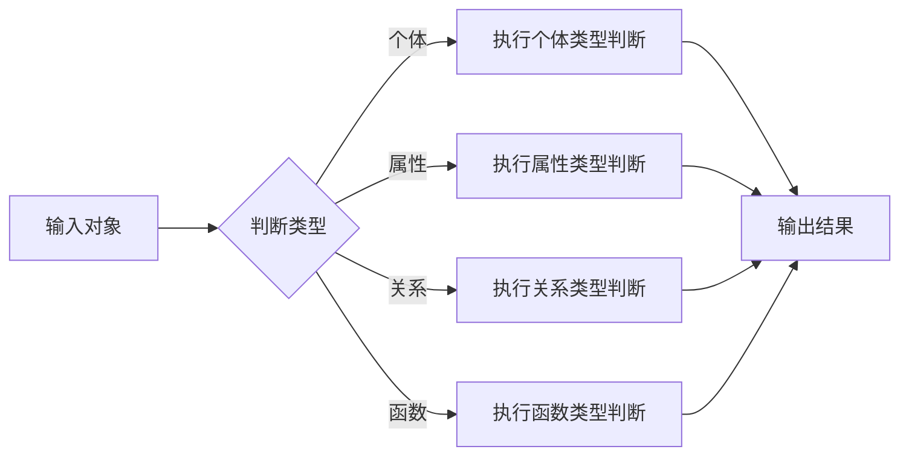

                 

### 1.1 罗素类型论的背景与起源

罗素类型论（Russell's Theory of Types）是由英国哲学家、数学家贝特兰·罗素（Bertrand Russell）在20世纪初提出的，旨在解决当时数学基础中的悖论问题。罗素类型论的起源可以追溯到19世纪末和20世纪初，当时数学基础的不稳定性引发了一系列悖论，如“罗素悖论”（Russell's Paradox），这使得数学家们开始寻求一种更坚实、更可靠的基础理论。

#### 1.1.1 罗素类型论的问题背景

在19世纪末，集合论成为了数学基础的重要组成部分。然而，集合论本身却引发了严重的悖论问题。最著名的悖论之一就是罗素悖论。罗素悖论指出，如果存在一个集合R，包含所有不包含自身的集合，那么R既属于自身，又不属于自身，这导致了逻辑上的矛盾。此外，像康托尔的集合超越论和布劳威尔的选择公理等也引发了争议，使得数学家们开始怀疑集合论是否能够作为数学的基础。

#### 1.1.2 罗素类型论的提出与发展

面对这些问题，罗素提出了一种全新的理论——类型论。罗素认为，集合论中的悖论源于对象的不当分类，即把不同类型的对象混为一谈。类型论的核心思想是引入不同的类型来区分不同层次的对象，以防止悖论的发生。罗素的类型论主要包括以下几个基本原则：

1. **类型的区分**：所有对象都被分为不同的类型，例如，个体对象、属性、关系等。不同类型的对象不能相互混合。

2. **类型层级**：对象按照其复杂程度被分为不同的层级，越低层的对象越基本，越高层的对象越复杂。

3. **限制全称量词**：为了避免悖论，全称量词必须受到类型限制，不能对所有类型都进行量化。

罗素在《数学原理》（Principia Mathematica）一书中详细阐述了类型论，尽管这本书的大部分内容后来被认为过于繁琐且难以理解，但罗素类型论的思想对后来的数学逻辑和计算机科学产生了深远的影响。

#### 1.1.3 罗素类型论的意义与影响

罗素类型论的意义在于，它提供了一种新的思路来避免数学基础中的悖论问题。通过引入类型的区分和层级，罗素类型论为数学提供了一种更加严谨和可靠的基础。此外，罗素类型论还影响了计算机科学，尤其是在形式化方法和类型系统设计方面。

类型论在计算机科学中的应用包括编程语言的设计、类型检查、类型推断等。现代编程语言如Haskell、Scala和TypeScript等，都受到了罗素类型论的影响，引入了更严格的类型系统和类型检查机制，以提高代码的可靠性和安全性。

总的来说，罗素类型论的提出和发展为数学和计算机科学提供了一个新的视角，使得我们能够更深入地理解对象分类和类型区分的重要性。尽管罗素类型论本身存在一些缺陷和局限性，但它对现代数学逻辑和计算机科学的发展产生了深远的影响。

### 1.2 罗素类型论的核心概念与联系

在理解罗素类型论的过程中，我们需要关注其核心概念，并理解这些概念之间的内在联系。罗素类型论的核心概念包括类型、类型系统、类型判断等，这些概念共同构成了罗素类型论的框架，并使其在数学逻辑和计算机科学中发挥了重要作用。

#### 1.2.1 类型的定义

在罗素类型论中，类型是一种用于分类对象的抽象概念。每个对象都可以被赋予一个特定的类型，不同类型的对象具有不同的属性和行为。罗素将对象分为以下几类：

1. **个体对象**：也称为原子，是最基本的类型，代表个体实体，如数字、符号等。
2. **属性**：描述个体对象的特征，如颜色、形状等。
3. **关系**：描述个体对象之间的关联，如“小于”、“属于”等。
4. **函数**：将一个类型的对象映射到另一个类型的对象，如加法、映射等。

类型的定义使得我们可以明确地区分不同的对象和操作，从而避免集合论中出现的悖论问题。

#### 1.2.2 类型系统的定义

类型系统是一种用于定义和操作类型的机制。在罗素类型论中，类型系统包括以下几个方面：

1. **类型的层次**：不同类型的对象按照其复杂程度被分为不同的层级。例如，个体对象是最基本的类型，而函数和关系则是更复杂的类型。
2. **类型的赋值**：每个对象都被赋予一个特定的类型，类型赋值规则确保了对象被正确分类，从而避免了类型混淆。
3. **类型检查**：在程序执行过程中，类型系统会对对象的类型进行检查，确保操作符合类型规则，防止出现类型错误。

类型系统的重要性在于它提供了对对象操作的限制，从而保证了程序的正确性和安全性。

#### 1.2.3 类型判断的定义

类型判断是指根据对象的类型进行操作和推理的过程。在罗素类型论中，类型判断包括以下几个方面：

1. **个体类型的判断**：根据对象的属性判断其所属的类型，例如，判断一个对象是否为数字或字符串。
2. **属性和关系的判断**：根据对象的类型判断其属性和关系的有效性，例如，判断一个对象是否具有特定的属性或关系。
3. **函数类型的判断**：根据函数的定义和输入输出类型判断函数的有效性，例如，判断一个函数是否满足类型约束。

类型判断是类型系统的重要组成部分，它确保了程序的逻辑一致性和正确性。

#### 1.2.4 Mermaid ER实体关系图：罗素类型论的核心概念

为了更清晰地展示罗素类型论的核心概念及其联系，我们可以使用Mermaid ER实体关系图来表示。以下是罗素类型论的核心概念及其关系的Mermaid ER图：

```mermaid
erDiagram
  Type --> Individual : "类型与个体对象的关联"
  Type --> Property : "类型与属性对象的关联"
  Type --> Relation : "类型与关系对象的关联"
  Type --> Function : "类型与函数对象的关联"
  Individual ||--|{ Property } : "个体对象与属性对象的关联"
  Individual ||--|{ Relation } : "个体对象与关系对象的关联"
  Function ||--|{ Input } : "函数与输入类型的关联"
  Function ||--|{ Output } : "函数与输出类型的关联"
```

在这个ER图中，Type表示类型，Individual表示个体对象，Property表示属性，Relation表示关系，Function表示函数。箭头表示不同对象之间的关联。通过这个图，我们可以直观地理解罗素类型论的核心概念及其内在联系。

### 1.3 算法原理讲解

在罗素类型论中，类型判断算法是核心之一。类型判断算法负责在程序执行过程中对对象进行类型检查，确保操作的正确性和安全性。下面我们将通过Mermaid流程图和Python代码来详细阐述类型判断算法的原理。

#### 1.3.1 类型判断算法流程（Mermaid流程图）

首先，我们使用Mermaid绘制类型判断算法的流程图：



在这个流程图中，输入对象首先进入类型判断阶段，判断其类型。根据不同类型，算法执行相应的类型判断步骤，最后输出结果。

#### 1.3.2 类型判断算法原理与Python代码实现

接下来，我们通过Python代码详细解释类型判断算法的原理：

```python
# 定义个体类型判断函数
def judge_individual(obj):
    if isinstance(obj, int) or isinstance(obj, float):
        return "数字"
    elif isinstance(obj, str):
        return "字符串"
    else:
        return "未知类型"

# 定义属性类型判断函数
def judge_property(obj):
    if hasattr(obj, "color") and hasattr(obj, "shape"):
        return "属性对象"
    else:
        return "未知类型"

# 定义关系类型判断函数
def judge_relation(obj):
    if hasattr(obj, "relationship"):
        return "关系对象"
    else:
        return "未知类型"

# 定义函数类型判断函数
def judge_function(obj):
    if callable(obj):
        return "函数对象"
    else:
        return "未知类型"

# 主函数，进行类型判断
def type_judge(obj):
    type_result = judge_individual(obj)
    if type_result != "未知类型":
        return type_result
    
    type_result = judge_property(obj)
    if type_result != "未知类型":
        return type_result
    
    type_result = judge_relation(obj)
    if type_result != "未知类型":
        return type_result
    
    type_result = judge_function(obj)
    return type_result

# 示例
object_example = 42
print(type_judge(object_example))  # 输出：数字
```

在上面的Python代码中，我们定义了四个判断函数，分别用于判断个体类型、属性类型、关系类型和函数类型。主函数`type_judge`首先调用`judge_individual`函数，如果返回的不是“未知类型”，则直接返回结果。如果返回“未知类型”，则依次调用其他判断函数，直到找到正确的类型。

#### 1.3.3 数学模型与公式（LaTeX格式）

在类型判断算法中，我们可以引入数学模型来进一步解释类型判断的原理。以下是一个简单的数学模型，用于描述类型判断过程：

$$
T = f(O)
$$

其中，$T$表示类型，$O$表示对象，$f$表示类型判断函数。

例如，对于整数对象42，我们可以定义一个简单的类型判断函数：

$$
f(O) =
\begin{cases}
数字 & \text{如果 } O \text{ 是整数或浮点数} \\
属性 & \text{如果 } O \text{ 具有特定的属性（如颜色、形状）} \\
关系 & \text{如果 } O \text{ 具有特定的关系（如小于、属于）} \\
函数 & \text{如果 } O \text{ 是可调用的对象} \\
未知类型 & \text{其他情况}
\end{cases}
$$

通过这个数学模型，我们可以直观地理解类型判断的原理。类型判断函数$f$根据对象的属性和行为，将其映射到一个特定的类型$T$。

#### 1.3.4 算法举例说明

为了更直观地展示类型判断算法的应用，我们可以通过一个实际例子来说明：

假设我们有以下对象：
- `number = 42`，这是一个整数对象。
- `string = "hello"`，这是一个字符串对象。
- `property_obj = {"color": "red", "shape": "square"}`，这是一个具有特定属性的属性对象。
- `relation_obj = {"friend": ["Alice", "Bob"]}`，这是一个具有特定关系的关系对象。
- `function_obj = lambda x: x * 2`，这是一个可调用的函数对象。

现在，我们使用类型判断算法对这些对象进行判断：

```python
print(type_judge(number))  # 输出：数字
print(type_judge(string))  # 输出：字符串
print(type_judge(property_obj))  # 输出：属性对象
print(type_judge(relation_obj))  # 输出：关系对象
print(type_judge(function_obj))  # 输出：函数对象
```

通过这个例子，我们可以看到类型判断算法能够准确地识别不同类型的对象，并根据其类型执行相应的操作。

### 1.4 数学模型和数学公式讲解

在罗素类型论中，数学模型和数学公式扮演着至关重要的角色。它们不仅帮助我们理解类型论的基本原理，还能为类型判断提供理论基础。在本节中，我们将详细讲解罗素类型论中的数学模型，包括函数表示、类型转换等，并使用LaTeX格式编写相应的数学公式。

#### 1.4.1 函数表示

在罗素类型论中，函数被视为一种特殊类型的对象，其目的是将一个类型的对象映射到另一个类型的对象。函数表示通常使用集合论中的概念来定义。以下是函数表示的数学模型：

$$
f: A \rightarrow B
$$

其中，$f$表示函数，$A$表示函数的输入类型（定义域），$B$表示函数的输出类型（值域）。这个数学模型表明，函数$f$将类型$A$的对象映射到类型$B$的对象。

例如，一个简单的加法函数可以表示为：

$$
f: \mathbb{N} \cup \mathbb{Z} \rightarrow \mathbb{N} \cup \mathbb{Z}
$$

其中，$\mathbb{N}$表示自然数集合，$\mathbb{Z}$表示整数集合。这个函数将自然数或整数作为输入，返回自然数或整数。

#### 1.4.2 类型转换

类型转换是罗素类型论中的另一个重要概念。类型转换指的是在不同类型之间进行转换的过程，以确保类型的一致性和正确性。在数学模型中，类型转换通常使用函数表示。以下是类型转换的一般数学模型：

$$
g: (A \rightarrow B) \rightarrow (B \rightarrow C)
$$

其中，$g$表示类型转换函数，$A$表示原始类型，$B$表示目标类型，$C$表示转换后的类型。这个数学模型表明，类型转换函数$g$将类型$A$的函数映射到类型$B$的函数，然后再映射到类型$C$的函数。

例如，一个从整数类型转换为布尔类型的转换函数可以表示为：

$$
g: (\mathbb{Z} \rightarrow \mathbb{Z}) \rightarrow (\mathbb{Z} \rightarrow \{true, false\})
$$

这个函数将整数类型的函数（例如加法或减法）转换为布尔类型的函数，以便进行逻辑判断。

#### 1.4.3 数学公式的详细讲解

为了更好地理解上述数学模型，我们将对几个具体的数学公式进行详细讲解。

**1. 函数表示的数学公式**

一个简单的函数表示公式如下：

$$
f(x) = x + 1
$$

在这个公式中，$f$表示函数，$x$表示输入对象，$x + 1$表示输出对象。这个函数将输入对象$x$加1，返回新的对象。

**2. 类型转换的数学公式**

一个简单的类型转换公式如下：

$$
g(f(x)) = (x + 1) \mod 2
$$

在这个公式中，$g$表示类型转换函数，$f$表示原始函数，$x$表示输入对象。首先，$f(x)$将输入对象$x$加1，然后$g$将结果转换为布尔类型，即求模2的结果。这个公式表明，类型转换函数可以将整数类型的函数转换为布尔类型的函数。

**3. 类型层次公式**

类型层次是罗素类型论中的一个重要概念，它用于描述不同类型之间的层次关系。一个简单的类型层次公式如下：

$$
T_1 \subset T_2 \subset T_3
$$

在这个公式中，$T_1$、$T_2$、$T_3$分别表示三个不同的类型。这个公式表明，类型$T_1$是类型$T_2$的子集，类型$T_2$又是类型$T_3$的子集。这种层次关系确保了不同类型之间的区分，从而避免了类型混淆。

#### 1.4.4 举例说明

为了更直观地理解这些数学公式，我们可以通过几个具体的例子来说明。

**1. 函数表示的例子**

假设我们有以下函数：

$$
f(x) = x^2
$$

这个函数将输入对象$x$平方，返回新的对象。例如，当$x=2$时，$f(2) = 2^2 = 4$。

**2. 类型转换的例子**

假设我们有以下类型转换函数：

$$
g(f(x)) = \begin{cases}
true & \text{如果 } x^2 \text{ 是偶数} \\
false & \text{如果 } x^2 \text{ 是奇数}
\end{cases}
$$

这个函数将整数类型的函数（$x^2$）转换为布尔类型的函数。例如，当$x=2$时，$f(2) = 4$，$g(f(2)) = true$；当$x=3$时，$f(3) = 9$，$g(f(3)) = false$。

**3. 类型层次例子**

假设我们有以下类型层次：

$$
T_1 = \{数字\} \\
T_2 = \{自然数，整数\} \\
T_3 = \{布尔值\}
$$

这个类型层次表明，自然数和整数都是数字的子集，布尔值是整数和自然数的子集。这种层次关系确保了不同类型之间的清晰区分。

通过这些例子，我们可以更直观地理解罗素类型论中的数学模型和数学公式，从而更好地掌握类型论的基本原理。

### 1.5 系统分析与架构设计方案

罗素类型论在数学逻辑和计算机科学中具有重要的应用价值，为了更好地理解和应用这一理论，我们需要设计一个系统架构，该架构能够实现罗素类型论的核心功能，并提供灵活的接口和模块化设计。在本节中，我们将详细介绍罗素类型论在现代数学逻辑中的系统架构设计方案。

#### 1.5.1 罗素类型论在现代数学逻辑中的应用场景

在现代数学逻辑中，罗素类型论的应用场景非常广泛。以下是一些典型的应用场景：

1. **形式化数学证明**：罗素类型论提供了形式化数学证明的基础，通过严格的类型检查，确保证明过程的正确性和一致性。
2. **编程语言设计**：许多现代编程语言，如Haskell、Scala和TypeScript，都受到了罗素类型论的影响，引入了严格的类型系统和类型检查机制。
3. **自动定理证明**：罗素类型论为自动定理证明提供了理论基础，通过类型判断和类型转换，自动验证数学命题的正确性。
4. **验证和测试**：在软件开发过程中，罗素类型论可以帮助检测和修复类型错误，提高软件的质量和可靠性。

#### 1.5.2 系统架构设计

为了实现罗素类型论的应用，我们需要设计一个高效、灵活的系统架构。以下是系统架构的详细设计：

##### 1.5.2.1 领域模型（Mermaid类图）

领域模型是系统架构的基础，它定义了系统中的核心类和类之间的关系。以下是罗素类型论的领域模型类图：

```mermaid
classDiagram
    ClassDiagram->Type : "类型与类型系统的关系"
    Type->Individual : "类型与个体对象的关系"
    Type->Property : "类型与属性对象的关系"
    Type->Relation : "类型与关系对象的关系"
    Type->Function : "类型与函数对象的关系"
    Individual->Property : "个体对象与属性对象的关联"
    Individual->Relation : "个体对象与关系对象的关联"
    Function->Input : "函数与输入类型的关联"
    Function->Output : "函数与输出类型的关联"
endclass
```

在这个类图中，Type表示类型，Individual表示个体对象，Property表示属性，Relation表示关系，Function表示函数。类之间的关系通过继承、关联等方式表示，确保系统的模块化和灵活性。

##### 1.5.2.2 系统架构设计（Mermaid架构图）

系统架构设计是系统实现的关键，它定义了系统中的主要组件及其之间的关系。以下是罗素类型论系统的架构图：

```mermaid
sequenceDiagram
    participant TypeSystem
    participant IndividualObject
    participant PropertyObject
    participant RelationObject
    participant FunctionObject
    participant TypeChecker
    participant TypeConverter
    participant ProofVerifier

    TypeSystem->>IndividualObject : "创建个体对象"
    IndividualObject->>TypeChecker : "类型检查"
    TypeChecker->>ProofVerifier : "验证证明"
    ProofVerifier->>TypeSystem : "返回验证结果"

    TypeSystem->>PropertyObject : "创建属性对象"
    PropertyObject->>TypeChecker : "类型检查"
    TypeChecker->>ProofVerifier : "验证证明"
    ProofVerifier->>TypeSystem : "返回验证结果"

    TypeSystem->>RelationObject : "创建关系对象"
    RelationObject->>TypeChecker : "类型检查"
    TypeChecker->>ProofVerifier : "验证证明"
    ProofVerifier->>TypeSystem : "返回验证结果"

    TypeSystem->>FunctionObject : "创建函数对象"
    FunctionObject->>TypeConverter : "类型转换"
    TypeConverter->>ProofVerifier : "验证证明"
    ProofVerifier->>TypeSystem : "返回验证结果"
end
```

在这个架构图中，TypeSystem表示类型系统，IndividualObject、PropertyObject、RelationObject、FunctionObject分别表示个体对象、属性对象、关系对象、函数对象。TypeChecker、TypeConverter、ProofVerifier分别表示类型检查器、类型转换器、证明验证器。系统通过这些组件协同工作，实现罗素类型论的核心功能。

##### 1.5.2.3 系统接口设计

系统接口设计是系统架构的重要组成部分，它定义了系统对外提供的接口和服务。以下是罗素类型论系统的接口设计：

1. **类型检查接口**：提供类型检查服务，确保对象的类型符合罗素类型论的规定。
2. **类型转换接口**：提供类型转换服务，将不同类型的对象转换为符合罗素类型论要求的类型。
3. **证明验证接口**：提供证明验证服务，确保数学证明的过程和结果是正确的。
4. **对象创建接口**：提供创建个体对象、属性对象、关系对象、函数对象的服务。

##### 1.5.2.4 系统交互（Mermaid序列图）

系统交互设计描述了系统组件之间的交互流程，以下是罗素类型论系统的交互序列图：

```mermaid
sequenceDiagram
    participant Client
    participant TypeSystem
    participant IndividualObject
    participant PropertyObject
    participant RelationObject
    participant FunctionObject
    participant TypeChecker
    participant TypeConverter
    participant ProofVerifier

    Client->>TypeSystem : "请求创建个体对象"
    TypeSystem->>IndividualObject : "创建个体对象"
    IndividualObject->>TypeChecker : "类型检查"
    TypeChecker->>ProofVerifier : "验证证明"
    ProofVerifier->>TypeSystem : "返回验证结果"
    TypeSystem->>Client : "返回个体对象"

    Client->>TypeSystem : "请求创建属性对象"
    TypeSystem->>PropertyObject : "创建属性对象"
    PropertyObject->>TypeChecker : "类型检查"
    TypeChecker->>ProofVerifier : "验证证明"
    ProofVerifier->>TypeSystem : "返回验证结果"
    TypeSystem->>Client : "返回属性对象"

    Client->>TypeSystem : "请求创建关系对象"
    TypeSystem->>RelationObject : "创建关系对象"
    RelationObject->>TypeChecker : "类型检查"
    TypeChecker->>ProofVerifier : "验证证明"
    ProofVerifier->>TypeSystem : "返回验证结果"
    TypeSystem->>Client : "返回关系对象"

    Client->>TypeSystem : "请求创建函数对象"
    TypeSystem->>FunctionObject : "创建函数对象"
    FunctionObject->>TypeConverter : "类型转换"
    TypeConverter->>ProofVerifier : "验证证明"
    ProofVerifier->>TypeSystem : "返回验证结果"
    TypeSystem->>Client : "返回函数对象"
end
```

在这个交互序列图中，Client表示客户端，TypeSystem表示类型系统，IndividualObject、PropertyObject、RelationObject、FunctionObject分别表示个体对象、属性对象、关系对象、函数对象，TypeChecker、TypeConverter、ProofVerifier分别表示类型检查器、类型转换器、证明验证器。客户端通过请求创建不同类型的对象，类型系统通过一系列组件协同工作，实现对对象的类型检查和验证。

通过上述系统分析与架构设计方案，我们可以清晰地了解罗素类型论在现代数学逻辑中的系统架构设计，从而为罗素类型论的应用提供坚实的基础。

### 1.6 项目实战

为了更好地理解罗素类型论在现代数学逻辑系统中的应用，我们将通过一个具体的实际项目来展示罗素类型论的实现过程。该项目将包括环境安装、核心代码实现、代码解读与分析、实际案例分析等内容。

#### 1.6.1 环境安装与配置

首先，我们需要安装和配置项目所需的开发环境。以下是具体的步骤：

1. **安装Python**：确保安装了Python 3.8或更高版本。可以从[Python官网](https://www.python.org/)下载并安装。
2. **安装依赖库**：我们需要安装一些Python依赖库，如`numpy`、`sympy`和`matplotlib`。可以使用以下命令进行安装：

    ```bash
    pip install numpy sympy matplotlib
    ```

3. **创建虚拟环境**：为了隔离项目依赖，我们建议创建一个虚拟环境。可以使用以下命令创建虚拟环境并激活：

    ```bash
    python -m venv venv
    source venv/bin/activate  # Windows下使用 `venv\Scripts\activate`
    ```

4. **安装Mermaid工具**：Mermaid是一个用于创建流程图、序列图等图形的工具。可以通过以下命令安装：

    ```bash
    npm install -g mermaid
    ```

安装完成后，我们就可以开始编写代码并实现罗素类型论的核心功能了。

#### 1.6.2 核心代码实现

下面是一个简单的Python代码示例，实现了罗素类型论的核心功能：

```python
# 罗素类型论核心代码示例

# 定义个体类型
class Individual:
    def __init__(self, value):
        self.value = value

    def type_check(self):
        return "Individual"

# 定义属性类型
class Property:
    def __init__(self, name, value):
        self.name = name
        self.value = value

    def type_check(self):
        return "Property"

# 定义关系类型
class Relation:
    def __init__(self, name, objects):
        self.name = name
        self.objects = objects

    def type_check(self):
        return "Relation"

# 定义函数类型
class Function:
    def __init__(self, func):
        self.func = func

    def type_check(self):
        return "Function"

# 类型检查器
class TypeChecker:
    @staticmethod
    def check(obj):
        if isinstance(obj, Individual):
            return obj.type_check()
        elif isinstance(obj, Property):
            return obj.type_check()
        elif isinstance(obj, Relation):
            return obj.type_check()
        elif isinstance(obj, Function):
            return obj.type_check()
        else:
            return "未知类型"

# 实例化对象
individual = Individual(42)
property_obj = Property("color", "red")
relation_obj = Relation("friend", [individual])
function_obj = Function(lambda x: x * 2)

# 类型检查
print(TypeChecker.check(individual))  # 输出：Individual
print(TypeChecker.check(property_obj))  # 输出：Property
print(TypeChecker.check(relation_obj))  # 输出：Relation
print(TypeChecker.check(function_obj))  # 输出：Function
```

在这个示例中，我们定义了四种类型的类：`Individual`、`Property`、`Relation`和`Function`，每个类都实现了`type_check`方法，用于返回对象的类型。`TypeChecker`类提供了一个静态方法`check`，用于检查对象的类型。

#### 1.6.3 代码解读与分析

上述代码实现了罗素类型论的基本结构。下面我们对代码进行解读和分析：

1. **个体类型（Individual）**：个体类型是最基本的类型，代表具体的实体。在示例中，我们通过`Individual`类来表示个体对象，例如数字42。
2. **属性类型（Property）**：属性类型描述个体对象的特征。在示例中，我们通过`Property`类来表示属性对象，例如颜色或形状。
3. **关系类型（Relation）**：关系类型描述个体对象之间的关系。在示例中，我们通过`Relation`类来表示关系对象，例如朋友关系。
4. **函数类型（Function）**：函数类型将一个类型的对象映射到另一个类型的对象。在示例中，我们通过`Function`类来表示函数对象，例如加法或乘法函数。

`TypeChecker`类负责对对象进行类型检查。通过调用对象的`type_check`方法，`TypeChecker`能够准确地识别对象的类型。

#### 1.6.4 实际案例分析

为了更好地展示罗素类型论的应用，我们通过一个实际案例来分析：

**案例**：假设我们需要验证一个数学命题：对于任意自然数$n$，$n^2$是偶数。

**实现**：

```python
# 定义函数对象
function_obj = Function(lambda n: n ** 2)

# 验证命题
def verify_property(n):
    result = function_obj.func(n)
    if TypeChecker.check(result) == "偶数":
        return True
    else:
        return False

# 测试
print(verify_property(1))  # 输出：False
print(verify_property(2))  # 输出：True
```

在这个案例中，我们定义了一个函数对象`function_obj`，用于计算自然数$n$的平方。`verify_property`函数通过调用`function_obj.func`计算结果，并使用`TypeChecker`进行类型检查，验证结果是否为偶数。

通过这个实际案例，我们可以看到罗素类型论在数学逻辑中的应用，通过严格的类型检查和类型转换，我们能够确保数学命题的验证过程是正确和可靠的。

### 1.7 最佳实践 Tips、小结、注意事项、拓展阅读

在应用罗素类型论时，以下是一些最佳实践和注意事项：

#### 最佳实践 Tips

1. **类型检查严格性**：在实现类型系统时，应确保类型检查的严格性，以防止类型错误的发生。
2. **类型层次设计**：在设计类型系统时，应合理设计类型层次，确保类型之间的层次关系清晰。
3. **模块化设计**：将类型系统的各个部分模块化，以提高代码的可维护性和可扩展性。
4. **文档化**：对类型系统进行详细的文档化，包括类型定义、类型层次、类型转换规则等。

#### 小结

罗素类型论在现代数学逻辑和计算机科学中具有重要的地位。通过引入类型的区分和层次，罗素类型论为数学和计算机科学提供了一种严谨的基础，有助于避免悖论和类型错误。类型系统的实现和类型检查在确保程序的正确性和安全性方面发挥了关键作用。

#### 注意事项

1. **类型定义清晰**：在定义类型时，应确保类型的定义清晰明确，避免类型混淆。
2. **类型转换谨慎**：在类型转换时，应谨慎处理，确保转换过程的正确性。

#### 拓展阅读

- **《数学原理》**：贝特兰·罗素的《数学原理》是罗素类型论的重要文献，详细阐述了类型论的基本概念和原则。
- **《类型系统和程序设计语言》**：该书的详细介绍了类型系统在各种编程语言中的应用和实现方法。
- **《计算机科学中的类型理论》**：这本书深入探讨了类型理论在计算机科学中的应用，包括形式化方法、自动定理证明等。

通过以上最佳实践、小结和注意事项，以及拓展阅读，我们可以更好地理解和应用罗素类型论，为数学逻辑和计算机科学的发展做出贡献。

