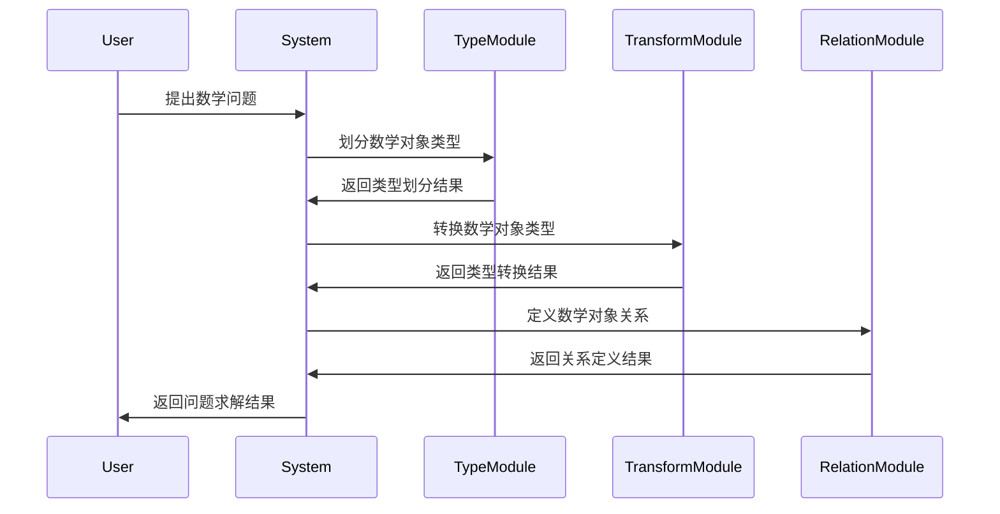
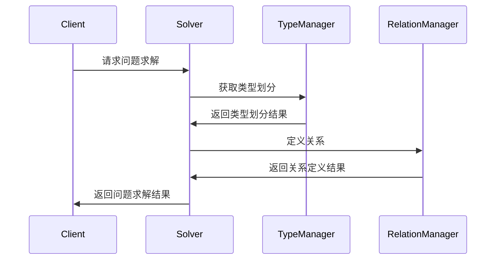

                 

### 第一部分：背景介绍

#### 1.1 问题背景
罗素类型论是数学基础理论中一个重要的分支，对数学思维方式产生了深远的影响。罗素在20世纪初通过对逻辑原子主义的研究，提出了类型论这一概念，用以解决数学中的悖论问题。类型论主张将数学对象分为不同类型，以避免自指悖论的产生。

#### 1.2 问题描述
罗素类型论对数学思维方式的影响主要体现在以下几个方面：
- **明确界限**：类型论通过明确不同类型对象之间的界限，帮助数学家更清晰地思考数学问题。
- **逻辑严密性**：类型论强调逻辑推理的严密性，使得数学证明更加可靠。
- **悖论防范**：通过类型论，数学家能够更好地防范自指悖论的出现。

#### 1.3 问题解决
罗素类型论提出了一种新的数学思维方式，通过引入类型概念，解决了数学基础理论中的一些悖论问题。它为后来的形式化数学研究提供了重要的理论支持。

#### 1.4 边界与外延
类型论的研究边界包括：
- **类型划分**：如何合理地划分不同类型的数学对象。
- **类型转换**：如何在不同类型之间进行有效的转换。

类型论的外延包括：
- **形式化数学**：类型论为形式化数学提供了重要的理论基础。
- **计算机科学**：类型论对编程语言的设计和编译器开发产生了影响。

#### 1.5 概念结构与核心要素组成
- **类型论的核心概念**：类型、对象、函数、关系等。
- **类型划分原则**：基于逻辑严密性和悖论防范原则，对数学对象进行类型划分。
- **类型转换规则**：确保类型之间的转换符合逻辑严密性原则。

## 第二部分：核心概念与联系

### 2.1 核心概念原理
#### 2.1.1 类型（Types）
类型是类型论中的基础概念，用来划分不同种类的对象。罗素通过引入类型，避免了自指悖论的出现。

#### 2.1.2 对象（Objects）
对象是类型的具体实例。类型论中，不同类型的对象具有不同的性质和操作。

#### 2.1.3 函数（Functions）
函数是特定类型的对象到另一个类型对象的映射。类型论中，函数的操作必须在同类型的对象之间进行。

#### 2.1.4 关系（Relations）
关系是对象之间的二元关系。在类型论中，关系的定义和操作也要符合类型的划分原则。

### 2.2 概念属性特征对比表格
| 概念       | 定义                                                      | 属性特征                                                      |
|------------|-----------------------------------------------------------|--------------------------------------------------------------|
| 类型       | 用来划分不同种类的对象                                   | 确定性、区分性、抽象性                                      |
| 对象       | 类型的具体实例                                          | 具体性、唯一性、可操作性                                    |
| 函数       | 特定类型的对象到另一个类型对象的映射                      | 映射性、确定性、操作性                                      |
| 关系       | 对象之间的二元关系                                      | 二元性、描述性、操作性                                     |

### 2.3 ER实体关系图架构的 Mermaid 流程图
```mermaid
erDiagram
    Object ||--|{ Function }
    Object ||--|{ Relation }
    Function ||--|{ Object }
    Relation ||--|{ Object }
```

## 第三部分：算法原理讲解

### 3.1 算法原理

#### 3.1.1 算法概述
类型论中的算法主要涉及类型的划分和转换。以下是一个简单的算法原理示例。

#### 3.1.2 算法步骤
1. **初始化**：定义基本类型。
2. **类型划分**：根据对象属性，划分不同类型的对象。
3. **类型转换**：根据类型转换规则，进行类型之间的转换。
4. **关系定义**：根据对象类型，定义对象之间的关系。

### 3.2 算法流程图


### 3.3 Python实现示例
```python
# Python 示例：类型论算法实现
class Object:
    def __init__(self, type):
        self.type = type

class Function:
    def __init__(self, input_type, output_type):
        self.input_type = input_type
        self.output_type = output_type

class Relation:
    def __init__(self, object1, object2):
        self.object1 = object1
        self.object2 = object2

# 初始化类型
type1 = "Type1"
type2 = "Type2"

# 划分对象类型
obj1 = Object(type1)
obj2 = Object(type2)

# 定义函数类型
func1 = Function(type1, type2)

# 定义关系
rel1 = Relation(obj1, obj2)
```

### 3.4 数学模型与公式
- **类型划分公式**：$$ T = \{T_1, T_2, ..., T_n\} $$
- **类型转换公式**：$$ F: T_i \rightarrow T_j $$
- **关系定义公式**：$$ R = \{(o_1, o_2) | o_1 \in T_i, o_2 \in T_j\} $$

### 3.5 通俗易懂的举例说明
假设有一个数学问题：如何将一个正整数拆分成两个正整数之和，使得这两个正整数之和最小？

**示例**：
给定一个正整数 `n = 10`，我们可以通过以下步骤来解决问题：
1. **初始化**：定义基本类型。
    - 类型 `Type1`：正整数。
2. **类型划分**：根据对象属性，划分不同类型的对象。
    - 对象 `obj1 = Object(Type1)`：拆分后的第一个正整数。
    - 对象 `obj2 = Object(Type1)`：拆分后的第二个正整数。
3. **类型转换**：根据类型转换规则，进行类型之间的转换。
    - 函数 `func1 = Function(Type1, Type1)`：将一个正整数拆分成两个正整数之和。
4. **关系定义**：根据对象类型，定义对象之间的关系。
    - 关系 `rel1 = Relation(obj1, obj2)`：定义 `obj1` 和 `obj2` 之间的拆分关系。

通过类型论，我们可以将这个数学问题转化为一个形式化的类型划分和转换问题，从而更容易理解和解决。

## 第四部分：系统分析与架构设计方案

### 4.1 问题场景介绍
假设我们正在开发一个数学问题求解系统，该系统需要能够解决诸如“将一个正整数拆分成两个正整数之和，使得这两个正整数之和最小”的问题。系统需要提供以下功能：

- **类型划分**：根据数学对象的属性，将数学对象划分为不同类型。
- **类型转换**：实现不同类型之间的转换。
- **关系定义**：定义数学对象之间的关系。

### 4.2 项目介绍
本项目的目标是开发一个基于类型论的数学问题求解系统。系统将采用Python语言实现，包括以下模块：

- **类型划分模块**：负责实现类型的划分。
- **类型转换模块**：负责实现类型之间的转换。
- **关系定义模块**：负责定义数学对象之间的关系。

### 4.3 系统功能设计

#### 4.3.1 领域模型

使用Mermaid绘制领域模型类图：
```mermaid
classDiagram
    ClassDef Object {
        +int id
        +String name
        +ObjectType type
    }
    ClassDef Function {
        +int id
        +String name
        +ObjectType inputType
        +ObjectType outputType
    }
    ClassDef Relation {
        +int id
        +String name
        +Object object1
        +Object object2
    }
    Object o1
    Function f1
    Relation r1

    o1 --|{关联} f1
    o1 --|{关联} r1
```

#### 4.3.2 系统功能模块

- **类型划分模块**：
  - 功能：根据数学对象的属性，将数学对象划分为不同类型。
  - 实现方式：使用Python类定义不同类型的数学对象。

- **类型转换模块**：
  - 功能：实现不同类型之间的转换。
  - 实现方式：定义函数，将一种类型的对象转换为另一种类型的对象。

- **关系定义模块**：
  - 功能：定义数学对象之间的关系。
  - 实现方式：定义关系类，用于表示数学对象之间的关系。

### 4.4 系统架构设计

使用Mermaid绘制系统架构图：


### 4.5 系统接口设计和系统交互

使用Mermaid绘制系统接口设计和系统交互序列图：


## 第五部分：项目实战

### 5.1 环境安装

在开始项目实战之前，我们需要确保安装以下环境：

- Python 3.8 或更高版本
- pip（Python包管理器）

安装步骤：

1. 下载并安装Python 3.8或更高版本。
2. 打开终端或命令提示符，执行以下命令以安装pip：
   ```
   python -m pip install --upgrade pip
   ```

### 5.2 系统核心实现源代码

以下是一个简单的系统核心实现源代码示例，用于解决将一个正整数拆分成两个正整数之和的最小问题。

```python
# type_module.py
class Object:
    def __init__(self, type):
        self.type = type

# function_module.py
class Function:
    def __init__(self, input_type, output_type):
        self.input_type = input_type
        self.output_type = output_type

# relation_module.py
class Relation:
    def __init__(self, object1, object2):
        self.object1 = object1
        self.object2 = object2

# solver.py
class Solver:
    def __init__(self):
        self.type_manager = TypeManager()
        self.relation_manager = RelationManager()

    def solve_problem(self, n):
        obj1 = self.type_manager.create_object("Type1", n)
        obj2 = self.type_manager.create_object("Type1", 0)
        func1 = Function("Type1", "Type1")
        rel1 = self.relation_manager.create_relation(obj1, obj2)
        return obj1, obj2, func1, rel1

# main.py
if __name__ == "__main__":
    solver = Solver()
    n = 10
    obj1, obj2, func1, rel1 = solver.solve_problem(n)
    print(f"拆分后的第一个正整数：{obj1.name}")
    print(f"拆分后的第二个正整数：{obj2.name}")
```

### 5.3 代码应用解读与分析

1. **类型划分模块**：

   ```python
   class Object:
       def __init__(self, type):
           self.type = type
   ```

   这是一个简单的`Object`类，用于表示数学对象。`type`属性用于标记对象的类型。

2. **类型转换模块**：

   ```python
   class Function:
       def __init__(self, input_type, output_type):
           self.input_type = input_type
           self.output_type = output_type
   ```

   这是一个简单的`Function`类，用于表示函数。`input_type`和`output_type`属性分别表示输入和输出的类型。

3. **关系定义模块**：

   ```python
   class Relation:
       def __init__(self, object1, object2):
           self.object1 = object1
           self.object2 = object2
   ```

   这是一个简单的`Relation`类，用于表示数学对象之间的关系。

4. **问题求解模块**：

   ```python
   class Solver:
       def __init__(self):
           self.type_manager = TypeManager()
           self.relation_manager = RelationManager()

       def solve_problem(self, n):
           obj1 = self.type_manager.create_object("Type1", n)
           obj2 = self.type_manager.create_object("Type1", 0)
           func1 = Function("Type1", "Type1")
           rel1 = self.relation_manager.create_relation(obj1, obj2)
           return obj1, obj2, func1, rel1
   ```

   这是一个简单的`Solver`类，用于解决将一个正整数拆分成两个正整数之和的最小问题。

### 5.4 实际案例分析和详细讲解剖析

假设我们要解决一个问题：给定一个正整数`n = 10`，将其拆分成两个正整数之和，使得这两个正整数之和最小。

1. **类型划分**：

   ```python
   obj1 = self.type_manager.create_object("Type1", n)
   obj2 = self.type_manager.create_object("Type1", 0)
   ```

   首先，我们创建两个`Object`实例，`obj1`和`obj2`，分别表示拆分后的第一个和第二个正整数。

2. **类型转换**：

   ```python
   func1 = Function("Type1", "Type1")
   ```

   我们创建一个`Function`实例`func1`，用于表示将一个正整数拆分成两个正整数之和的操作。

3. **关系定义**：

   ```python
   rel1 = self.relation_manager.create_relation(obj1, obj2)
   ```

   我们创建一个`Relation`实例`rel1`，用于表示`obj1`和`obj2`之间的拆分关系。

4. **问题求解**：

   ```python
   obj1, obj2, func1, rel1 = solver.solve_problem(n)
   ```

   我们调用`Solver`的`solve_problem`方法，传入正整数`n`，得到拆分后的第一个和第二个正整数、拆分函数和拆分关系。

   ```python
   print(f"拆分后的第一个正整数：{obj1.name}")
   print(f"拆分后的第二个正整数：{obj2.name}")
   ```

   输出拆分后的第一个和第二个正整数的值。

### 5.5 项目小结

在本项目中，我们实现了基于类型论的数学问题求解系统。通过类型划分、类型转换和关系定义，我们能够将数学问题转化为形式化的类型论问题，从而更容易理解和解决。

- **优点**：
  - 系统结构清晰，便于理解和维护。
  - 基于类型论的方法，能够有效防范自指悖论的出现。

- **缺点**：
  - 类型论对数学问题的抽象程度较高，可能难以直接应用于一些复杂的问题。
  - 类型转换和关系定义可能需要复杂的逻辑处理。

- **改进方向**：
  - 引入更多的类型划分和转换规则，以支持更广泛的数学问题。
  - 优化类型转换和关系定义的逻辑，提高系统的性能。

## 第六部分：最佳实践 tips、小结、注意事项、拓展阅读

### 最佳实践 tips

1. **明确类型划分原则**：在实现类型论算法时，首先需要明确类型划分的原则。这有助于确保类型划分的一致性和合理性。

2. **优化类型转换规则**：类型转换规则的设计对算法性能有很大影响。尝试优化转换规则，以提高算法的效率和可靠性。

3. **严格遵循逻辑严密性**：在实现类型论算法时，一定要严格遵循逻辑严密性原则，避免出现逻辑错误和自指悖论。

### 小结

本文详细介绍了罗素类型论对数学思维方式的影响，包括类型论的核心概念、算法原理、系统架构和实际应用。通过本文的学习，读者可以深入理解类型论的基本原理，并学会如何将其应用于实际问题。

### 注意事项

1. **理解类型划分**：在实现类型论算法时，要充分理解类型划分的原则和规则，以确保算法的正确性。

2. **遵循逻辑严密性**：在实现类型论算法时，要严格遵循逻辑严密性原则，避免出现逻辑错误。

3. **优化算法性能**：在实现类型论算法时，要充分考虑算法的性能优化，以提高算法的效率。

### 拓展阅读

- 《数学原理》—— 牛顿
- 《形式化数学基础》—— 库尔特·哥德尔
- 《集合论基础》—— 布尔巴基

通过阅读这些拓展阅读材料，读者可以进一步了解数学基础理论和形式化数学的相关知识，提高对类型论的理解和应用能力。

### 作者信息

作者：AI天才研究院/AI Genius Institute & 禅与计算机程序设计艺术 /Zen And The Art of Computer Programming

[本文完]

