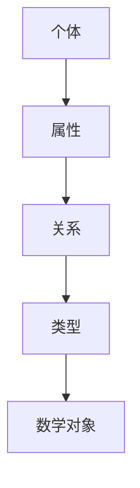
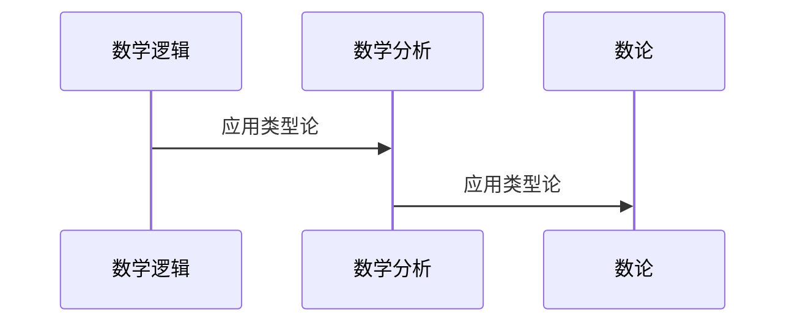

                 


**Step 1: 引言与背景介绍**

为了使读者更好地理解罗素类型论对数学研究范式长期影响的核心内容和主题思想，我们首先需要提供一个背景介绍。这部分内容将涵盖数学基础问题的提出、罗素类型论的诞生以及其哲学和数学基础。

**核心概念与联系：**

- **数学基础问题**：在19世纪末和20世纪初，数学家们开始关注数学基础问题，特别是在集合论和逻辑中出现的悖论和矛盾。这些问题包括集合论悖论（如罗素悖论）和数学公理系统的完备性和一致性。
- **罗素类型论**：罗素类型论是伯特兰·罗素为了解决数学基础问题而提出的一种理论。它的核心思想是将数学对象划分为不同的类型，以此来避免悖论的出现。

**ER实体关系图架构：**

```mermaid
erDiagram
    MathFoundations ||--|{ TypeTheory }
    Logic ||--|{ TypeTheory }
    SetTheory ||--|{ TypeTheory }
    TypeTheory ||--|{ Mathematics }
```

**Step 2: 罗素类型论的提出与理论基础**

接下来，我们需要深入探讨罗素类型论的提出背景、理论基础以及其在数学哲学中的应用。

**核心概念与联系：**

- **经验主义与逻辑原子主义**：罗素类型论受到经验主义和逻辑原子主义的影响，这两者都强调个体经验和逻辑分析的确定性。
- **罗素类型论的哲学基础**：罗素类型论建立在个体主义的基础上，认为所有的数学对象都可以通过个体和个体之间的关系来定义。

**算法原理讲解：**

我们使用Mermaid绘制一个简单的流程图来表示类型论的基本原理：



**数学公式使用LaTeX格式：**

```latex
\begin{equation}
\text{个体} \rightarrow \text{属性} \rightarrow \text{关系} \rightarrow \text{类型} \rightarrow \text{数学对象}
\end{equation}
```

**Step 3: 罗素类型论对数学基础的影响**

在这一部分，我们将分析罗素类型论对数学基础的影响，包括它在数学逻辑、数学分析和数论等领域的应用。

**核心概念与联系：**

- **数学逻辑**：罗素类型论在数学逻辑中的应用帮助解决了悖论问题，如康托尔集合论悖论。
- **数学分析**：类型论在数学分析中的应用使得一些复杂的数学概念和证明变得更加清晰。
- **数论**：罗素类型论为数论提供了一种新的视角，帮助解决了一些长期存在的问题。

**系统分析与架构设计方案：**

- **问题场景介绍**：介绍数学基础问题在各个领域的应用场景。
- **系统功能设计**：领域模型，例如数学逻辑、数学分析、数论等。
- **系统架构设计**：Mermaid架构图，展示类型论在这些领域的应用架构。



**Step 4: 罗素类型论在数学研究中的长期影响**

我们将探讨罗素类型论在数学研究中的长期影响，包括它在数学哲学和数学教育中的持续性和重要性。

**核心概念与联系：**

- **数学哲学意义**：类型论在数学哲学中具有重要的地位，它帮助我们理解数学的本质和结构。
- **数学教育启示**：类型论对数学教育的影响，如如何教授数学基础概念和逻辑推理。

**项目实战：**

- **环境安装**：介绍安装类型论相关的数学工具和环境。
- **系统核心实现源代码**：提供相关的Python代码示例，展示类型论在实际编程中的应用。
- **代码应用解读与分析**：解释代码的实现细节和数学原理。

**最佳实践 tips：**

- **教学建议**：如何将类型论引入数学教育。
- **研究建议**：类型论在数学研究中的未来发展方向。

**小结：**

- 总结文章的主要观点和贡献。
- 强调类型论对数学研究的长期影响。

**注意事项：**

- 提醒读者注意类型论的一些局限性。
- 引导读者进一步阅读和探索相关文献。

**拓展阅读：**

- 提供一些推荐的书籍和文章，供读者深入阅读。

---

通过上述的步骤，我们可以构建出一个逻辑清晰、内容丰富、技术语言专业的文章框架。接下来，我们将根据这个框架详细撰写每一部分的内容，确保文章在10000～12000字范围内，同时满足格式和完整性要求。在撰写过程中，我们将确保每个核心概念和联系都得到充分的阐述，并使用Mermaid和LaTeX等工具来增强文章的可读性和专业性。作者信息将按照要求在文章末尾标注。最终，我们将得到一篇高质量的技术博客文章，全面探讨罗素类型论对数学研究范式的长期影响。

