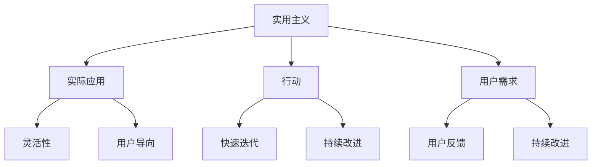
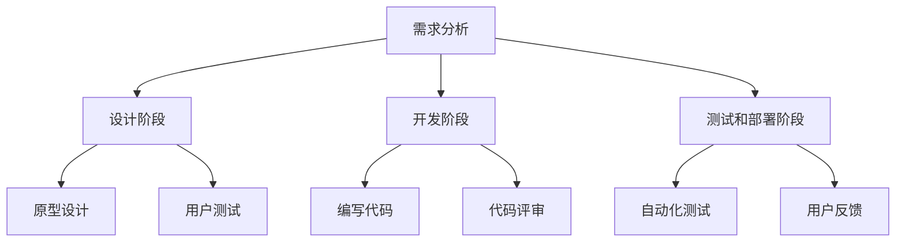

                 

### 罗蒂的实用主义与敏捷开发：软件方法论的哲学基础

> 关键词：罗蒂实用主义、敏捷开发、软件方法论、哲学基础、软件开发实践

> 摘要：本文旨在探讨罗蒂的实用主义在敏捷开发中的应用，分析其实用主义哲学对软件开发方法论的影响，并探讨其在软件开发实践中的具体应用。通过深入研究罗蒂的实用主义与敏捷开发的哲学基础，本文希望为软件开发提供一种新的方法论视角，以提高软件开发的效率和质量。

#### 引言

在当今快速变化的科技时代，软件开发方法论不断演变，从传统的瀑布模型到敏捷开发的兴起，都是为了应对复杂多变的项目需求和快速迭代的软件开发环境。其中，罗蒂的实用主义作为一种哲学观点，其在软件开发中的应用逐渐引起关注。本文将深入探讨罗蒂的实用主义与敏捷开发的哲学基础，分析两者之间的联系，并探讨其实用主义哲学在软件开发实践中的具体应用。

本文结构如下：

- **第1章 罗蒂的实用主义概述**：介绍实用主义的概念和罗蒂的实用主义特征，探讨其实用主义在软件开发中的应用。
- **第2章 敏捷开发的哲学基础**：概述敏捷开发的起源和核心原则，分析其与实用主义哲学的共鸣。
- **第3章 罗蒂实用主义与敏捷开发的融合**：探讨罗蒂实用主义对敏捷开发的指导意义及其融合策略。
- **第4章 罗蒂实用主义在软件开发实践中的应用**：详细探讨实用主义在软件开发中的具体应用。
- **第5章 罗蒂实用主义在软件开发中的挑战与未来**：分析实用主义在软件开发中的挑战和未来发展前景。

接下来，我们将首先介绍罗蒂的实用主义哲学，并探讨其在软件开发中的应用。

#### 第1章 罗蒂的实用主义概述

#### 1.1 实用主义的哲学背景

**实用主义的概念**

实用主义是一种哲学观点，强调实际应用和行动的重要性。它起源于19世纪，代表人物包括皮尔士、詹姆斯和杜威。实用主义的核心理念是“实用即真理”和“行动即认知”。根据实用主义观点，真理不是静态的、客观存在的实体，而是通过实践和行动不断验证和发展的。同样，认知过程也是通过实际应用和行动来实现的。

**实用主义的起源和哲学意义**

实用主义的起源可以追溯到古希腊哲学，特别是亚里士多德的思想。亚里士多德认为，知识是通过实践和行动获得的，这种观点为实用主义提供了哲学基础。19世纪的皮尔士、詹姆斯和杜威等人进一步发展了实用主义哲学，使其成为一种具有广泛影响力的哲学观点。

实用主义的哲学意义在于，它提供了一种以实际应用为导向的思考方式。在实用主义看来，理论和实践是不可分割的，只有通过实际应用才能验证和检验理论的有效性。这种哲学观点对科学、教育、政治等多个领域产生了深远影响。

#### 1.2 罗蒂的实用主义

**罗蒂的哲学贡献**

罗蒂（Richard Rorty）是20世纪末美国著名的实用主义哲学家，他对实用主义哲学进行了深刻的批判和改造。罗蒂认为，哲学的任务不是寻找绝对真理，而是通过语言和文化的交流来解决问题。他主张“语言是哲学的真正主题”，强调哲学应该更加关注语言和文化的构建。

罗蒂的实用主义哲学对实用主义进行了重要的发展。他提出“实用主义解释学”观点，认为理解世界不仅仅是通过逻辑推理，更重要的是通过语言和文化的解释。罗蒂强调，哲学应该更加关注实际生活中的问题，通过对话和交流来解决分歧。

**罗蒂的实用主义特征**

罗蒂的实用主义具有以下几个特征：

1. **反基础主义**：罗蒂反对基础主义，认为哲学不应该试图寻找绝对的真理或知识基础。他主张，哲学应该更多地关注实际问题和语言构建。

2. **语境主义**：罗蒂认为，理解和解释都是基于特定语境的。他强调，语言和文化是相互构建的，理解一个概念或观点需要考虑其语境背景。

3. **实用主义解释学**：罗蒂的实用主义解释学强调，理解世界不仅仅是通过逻辑推理，更重要的是通过语言和文化的解释。他认为，哲学应该通过对话和交流来解决分歧。

#### 1.3 实用主义在软件开发中的应用

**实用主义与软件开发的关系**

实用主义哲学在软件开发中具有重要的应用价值。实用主义强调实际应用和行动的重要性，这与敏捷开发的核心原则不谋而合。敏捷开发强调快速迭代、用户反馈和持续改进，这与实用主义的理念高度契合。

**实用主义在软件开发中的优势**

实用主义在软件开发中的优势主要体现在以下几个方面：

1. **灵活性**：实用主义强调实际应用，这使得软件开发过程更加灵活，能够更好地适应不断变化的需求。

2. **高效性**：实用主义强调行动和实际应用，这有助于提高开发效率，减少不必要的理论和抽象讨论。

3. **用户导向**：实用主义强调用户需求和实际应用，这有助于提高软件质量，满足用户需求。

**实用主义在软件开发中的实际应用**

实用主义在软件开发中的应用主要体现在以下几个方面：

1. **需求分析**：实用主义强调实际应用，这使得需求分析更加关注用户需求，而不是抽象的理论概念。

2. **设计阶段**：实用主义强调实际应用，这有助于设计阶段更加注重实际问题的解决，而不是追求完美的理论模型。

3. **开发阶段**：实用主义强调行动和实际应用，这有助于提高开发效率，减少不必要的理论和抽象讨论。

4. **测试和部署**：实用主义强调用户反馈和实际应用，这有助于在测试和部署阶段更好地满足用户需求，提高软件质量。

#### 1.4 实用主义对敏捷开发的启示

**实用主义与敏捷开发的联系**

实用主义哲学与敏捷开发的核心原则密切相关。敏捷开发强调快速迭代、用户反馈和持续改进，这与实用主义的理念高度契合。实用主义强调实际应用和行动的重要性，这与敏捷开发的实践原则相一致。

**实用主义在敏捷开发中的应用**

实用主义在敏捷开发中的应用主要体现在以下几个方面：

1. **用户反馈**：实用主义强调用户需求和实际应用，这有助于敏捷开发更好地满足用户需求，提高软件质量。

2. **快速迭代**：实用主义强调行动和实际应用，这有助于敏捷开发实现快速迭代，提高开发效率。

3. **持续改进**：实用主义强调实际应用和行动，这有助于敏捷开发持续改进，提高软件质量。

#### 1.5 本章小结

本章介绍了罗蒂的实用主义哲学，探讨了其实用主义的概念、起源和哲学意义，分析了罗蒂的实用主义特征及其在软件开发中的应用。实用主义哲学与敏捷开发的核心原则密切相关，其实用主义理念为敏捷开发提供了重要的哲学基础。在接下来的章节中，我们将进一步探讨敏捷开发的哲学基础，分析其与实用主义的共鸣。

### 第2章 敏捷开发的哲学基础

#### 2.1 敏捷开发概述

**敏捷开发的起源**

敏捷开发起源于2001年，当时一群软件开发从业者（包括艾瑞克·拉斯穆森和珍妮弗·斯特劳特等）在瑞士滑雪度假期间共同签署了《敏捷宣言》（Manifesto for Agile Software Development）。这一宣言强调了软件开发中的四个核心价值：

- **个体和互动高于流程与工具**：重视团队成员之间的互动和协作，而不是依赖特定的流程或工具。
- **工作的软件高于详尽的文档**：认为可运行的软件比详细的文档更有价值。
- **客户合作高于合同谈判**：强调与客户的紧密合作，而不是仅依赖合同谈判。
- **响应变化重于遵循计划**：强调灵活应对变化，而不是严格按照计划执行。

**敏捷开发的核心原则**

敏捷开发不仅仅是一个方法论，它还包含一系列核心原则，这些原则指导软件开发过程中的实践。以下是敏捷开发的十二个核心原则：

1. **我们的最高目标是通过尽早和持续地交付有价值的软件来满足客户的需求。
2. **欢迎改变，即使在开发周期的后期也是如此。
3. **通过日常工作来反映项目的进展。
4. **专注于简洁——做最有价值的工作。
5. **敏捷过程旨在通过亲历、交流和协作来增强项目的透明度。
6. **项目的进展应该通过可工作的软件来评估。
7. **敏捷过程要使用促进持续优化的反馈机制。
8. **能够专注于工作的人是最有效的，并给他们提供所需的环境和支持，以及信任和责任。
9. **最好的沟通方式是面对面交流。
10. **在工作过程中，团队应该定期评估如何提高效果，并相应地调整其行为。
11. **项目团队应该由多个专业人士组成，他们可以从整体角度理解并解决问题。
12. **定期（例如，每个季度）反思如何提高团队绩效，并根据这些反思调整团队的行为。**

#### 2.2 敏捷开发的哲学理念

**敏捷开发与实用主义的共鸣**

敏捷开发与实用主义哲学在多个方面存在共鸣，这为两者之间的融合提供了哲学基础。

1. **行动导向**：实用主义强调行动的重要性，这与敏捷开发中的快速迭代和持续改进理念一致。敏捷开发通过频繁的迭代和反馈，不断调整和改进软件，这与实用主义的行动导向相契合。

2. **用户导向**：实用主义强调实际应用和用户需求，这与敏捷开发的核心价值之一“客户合作高于合同谈判”相吻合。敏捷开发通过紧密的客户合作，确保软件能够满足实际需求，提高用户满意度。

3. **灵活性**：实用主义强调实际应用和行动的重要性，这使得软件开发过程更加灵活，能够更好地应对变化。敏捷开发的核心原则之一就是“欢迎改变，即使在开发周期的后期也是如此”，这与实用主义的灵活性理念相符。

**实用主义在敏捷开发中的应用**

实用主义在敏捷开发中的应用主要体现在以下几个方面：

1. **快速迭代**：实用主义强调行动和实际应用，这有助于敏捷开发实现快速迭代，提高开发效率。

2. **用户反馈**：实用主义强调用户需求和实际应用，这有助于敏捷开发更好地满足用户需求，提高软件质量。

3. **持续改进**：实用主义强调实际应用和行动，这有助于敏捷开发持续改进，提高软件质量。

#### 2.3 敏捷开发的方法论

**迭代与增量开发**

敏捷开发的核心方法论是迭代与增量开发。迭代开发是指将软件开发过程划分为多个短周期（通常为几周），在每个周期结束时，团队交付一个可工作的软件版本。增量开发则强调在每个迭代中逐步增加功能，而不是一次性交付完整的软件。

**迭代与增量开发的优势**

1. **快速反馈**：通过频繁的迭代，团队可以更快地收到用户反馈，及时调整开发方向。
2. **灵活性**：迭代与增量开发使得团队能够更灵活地应对需求变化，不断优化软件功能。
3. **质量保证**：通过逐步交付可工作的软件，团队能够持续进行测试和调试，确保软件质量。

**用户反馈与持续改进**

用户反馈与持续改进是敏捷开发的重要组成部分。用户反馈不仅可以帮助团队了解软件的优缺点，还可以为后续开发提供重要的指导。持续改进则强调不断优化软件和开发流程，以实现更高的质量和效率。

**用户反馈与持续改进的优势**

1. **提升用户满意度**：通过及时响应用户反馈，团队能够更好地满足用户需求，提高用户满意度。
2. **提高软件质量**：持续改进有助于发现和修复潜在问题，提高软件质量。
3. **优化开发流程**：通过不断反思和改进，团队能够优化开发流程，提高开发效率。

#### 2.4 敏捷开发的实践案例

**成功案例**

许多成功的软件项目采用了敏捷开发方法。例如，谷歌的Gmail和Facebook的早期版本都采用了敏捷开发，通过快速迭代和用户反馈，成功满足了用户需求，取得了巨大成功。

**失败案例**

尽管敏捷开发在很多项目中取得了成功，但也有一些项目因未能有效应用敏捷开发而失败。例如，一些团队在采用敏捷开发时，未能充分理解其核心原则，导致开发过程混乱，最终项目失败。

**失败原因分析**

1. **缺乏团队协作**：敏捷开发强调团队合作，但如果团队协作不足，可能导致开发效率低下。
2. **未能充分利用用户反馈**：敏捷开发依赖于用户反馈，但如果团队未能及时收集和利用用户反馈，可能导致软件质量不高。
3. **缺乏持续改进**：敏捷开发强调持续改进，但如果团队未能持续优化开发流程，可能导致开发效率和质量不高。

#### 2.5 本章小结

本章介绍了敏捷开发的起源和核心原则，分析了其与实用主义哲学的共鸣，并探讨了实用主义在敏捷开发中的应用。敏捷开发通过迭代与增量开发、用户反馈和持续改进，实现了更高的开发效率和软件质量。在接下来的章节中，我们将进一步探讨罗蒂实用主义与敏捷开发的融合，分析其实用主义哲学在软件开发实践中的具体应用。

### 第3章 罗蒂实用主义与敏捷开发的融合

#### 3.1 罗蒂实用主义对敏捷开发的指导意义

**实用主义与敏捷开发的关系**

罗蒂的实用主义哲学与敏捷开发的核心原则之间存在紧密的联系。实用主义强调实际应用、用户导向和灵活性，这与敏捷开发的价值和原则高度契合。罗蒂的实用主义解释学强调语言和文化的解释，这为敏捷开发中的用户反馈和持续改进提供了哲学基础。

**实用主义在敏捷开发中的应用**

实用主义在敏捷开发中的应用主要体现在以下几个方面：

1. **快速迭代**：实用主义强调实际应用和行动的重要性，这有助于敏捷开发实现快速迭代，提高开发效率。

2. **用户反馈**：实用主义强调用户需求和实际应用，这有助于敏捷开发更好地满足用户需求，提高软件质量。

3. **持续改进**：实用主义强调实际应用和行动，这有助于敏捷开发持续改进，提高软件质量。

**实用主义在敏捷开发中的优势**

1. **灵活性**：实用主义强调灵活性，使得敏捷开发能够更好地应对需求变化，提高开发效率。

2. **用户导向**：实用主义强调用户需求和实际应用，这有助于敏捷开发更好地满足用户需求，提高用户满意度。

3. **持续改进**：实用主义强调实际应用和行动，这有助于敏捷开发持续改进，提高软件质量。

#### 3.2 融合罗蒂实用主义与敏捷开发的策略

**项目规划与执行**

融合罗蒂实用主义与敏捷开发的策略首先体现在项目规划与执行过程中。在项目规划阶段，团队应注重实际应用和用户需求，通过用户访谈和市场调研，收集真实的需求和反馈。在执行阶段，团队应遵循敏捷开发的核心原则，如快速迭代、用户反馈和持续改进。

**团队协作与沟通**

团队协作与沟通是融合实用主义与敏捷开发的关键。实用主义强调语言和文化的解释，这有助于团队通过有效沟通，更好地理解用户需求和项目目标。在团队协作中，应注重个体和互动的重要性，鼓励团队成员积极参与，共同解决问题。

**实用主义在敏捷开发中的具体应用**

1. **需求分析**：实用主义强调实际应用和用户需求，这有助于团队在需求分析阶段更好地理解用户需求，提高需求分析的准确性和实用性。

2. **设计阶段**：实用主义强调实际应用和行动，这有助于设计阶段更加注重实际问题的解决，而不是追求完美的理论模型。

3. **开发阶段**：实用主义强调行动和实际应用，这有助于提高开发效率，减少不必要的理论和抽象讨论。

4. **测试和部署**：实用主义强调用户反馈和实际应用，这有助于在测试和部署阶段更好地满足用户需求，提高软件质量。

#### 3.3 罗蒂实用主义与敏捷开发的案例分析

**成功案例**

许多成功的敏捷开发项目都融合了罗蒂实用主义哲学。例如，谷歌的Gmail项目在开发过程中，通过用户反馈和持续改进，不断优化用户体验，取得了巨大成功。另一个例子是Facebook的早期版本，团队通过快速迭代和用户反馈，成功满足了用户需求，迅速占领市场。

**失败案例**

也有一些敏捷开发项目未能成功融合罗蒂实用主义哲学，导致项目失败。例如，某公司在开发一款社交媒体应用时，虽然采用了敏捷开发方法，但未能充分理解用户需求和实际应用，导致软件质量不高，用户体验差，最终项目失败。

**失败原因分析**

1. **缺乏用户反馈**：敏捷开发强调用户反馈，但如果团队未能及时收集和利用用户反馈，可能导致软件质量不高。

2. **忽视实际应用**：实用主义强调实际应用，但如果团队忽视实际应用，可能导致软件开发偏离实际需求。

3. **缺乏持续改进**：实用主义强调持续改进，但如果团队未能持续优化开发流程，可能导致开发效率和质量不高。

#### 3.4 本章小结

本章探讨了罗蒂实用主义与敏捷开发的融合，分析了实用主义对敏捷开发的指导意义及其在敏捷开发中的应用。通过融合实用主义与敏捷开发，团队可以更好地满足用户需求，提高开发效率和软件质量。在接下来的章节中，我们将进一步探讨实用主义在软件开发实践中的具体应用。

### 第4章 罗蒂实用主义在软件开发实践中的应用

#### 4.1 实用主义在软件开发中的具体应用

**需求分析**

实用主义在软件开发中的第一个具体应用是需求分析。在需求分析阶段，实用主义强调实际应用和用户需求。这意味着团队在收集需求时，应关注用户实际使用软件的场景和需求，而不是仅依赖于抽象的概念和理论。通过用户访谈、问卷调查和市场调研等手段，团队可以更准确地了解用户的需求，从而制定出更实用的需求文档。

**设计阶段**

在设计阶段，实用主义强调实际应用和行动。这意味着在设计过程中，团队应注重实际问题的解决，而不是追求完美的理论模型。实用主义鼓励团队采用简洁和高效的设计方法，例如原型设计、迭代设计和用户测试，以确保设计能够满足实际需求。

**开发阶段**

在开发阶段，实用主义强调行动和实际应用。这意味着团队在编写代码时，应注重实际问题的解决，而不是追求复杂的理论和算法。实用主义鼓励团队采用敏捷开发方法，例如快速迭代、持续集成和持续交付，以确保代码质量和开发效率。

**测试和部署**

在测试和部署阶段，实用主义强调用户反馈和实际应用。这意味着团队应在测试过程中收集用户反馈，并根据反馈进行优化。实用主义鼓励团队采用自动化测试、持续集成和持续交付，以确保软件质量。

**具体应用案例**

1. **用户访谈和问卷调查**：在需求分析阶段，团队可以通过用户访谈和问卷调查收集用户需求。例如，在开发一款社交媒体应用时，团队可以通过用户访谈了解用户对功能、界面和体验的具体需求。

2. **原型设计和用户测试**：在设计阶段，团队可以采用原型设计和用户测试，以确保设计能够满足实际需求。例如，在开发一款电子商务网站时，团队可以设计一个原型，并通过用户测试收集反馈，以优化界面和用户体验。

3. **敏捷开发方法**：在开发阶段，团队可以采用敏捷开发方法，例如快速迭代、持续集成和持续交付。例如，在开发一款移动应用时，团队可以每两周发布一次新版本，并根据用户反馈进行优化。

4. **自动化测试和持续集成**：在测试和部署阶段，团队可以采用自动化测试和持续集成，以确保软件质量。例如，在发布一款软件前，团队可以运行自动化测试，以确保代码质量和功能完整性。

#### 4.2 实用主义在敏捷开发中的具体应用

**迭代与增量开发**

实用主义在敏捷开发中的具体应用之一是迭代与增量开发。迭代开发是指将软件开发过程划分为多个短周期，每个周期结束交付一个可工作的软件版本。增量开发则强调在每个迭代中逐步增加功能，而不是一次性交付完整的软件。这种开发方式有助于团队更快地响应变化，提高开发效率。

**用户反馈**

实用主义在敏捷开发中的另一个具体应用是用户反馈。用户反馈是敏捷开发的核心原则之一，它有助于团队了解用户需求，优化软件设计和功能。实用主义强调用户需求和实际应用，这有助于团队更好地收集和利用用户反馈，提高软件质量。

**持续改进**

实用主义在敏捷开发中的第三个具体应用是持续改进。持续改进是指团队不断优化软件和开发流程，以提高开发效率和质量。实用主义强调实际应用和行动，这有助于团队在开发过程中不断反思和改进，以实现更高的质量和效率。

**具体应用案例**

1. **快速迭代**：在敏捷开发中，团队可以采用快速迭代的方法，每两周发布一次新版本。通过快速迭代，团队可以更快地响应变化，提高开发效率。

2. **用户反馈**：在开发过程中，团队可以通过用户反馈了解用户需求，并根据反馈进行优化。例如，在开发一款社交媒体应用时，团队可以通过用户调查和反馈了解用户对功能、界面和体验的具体需求。

3. **持续改进**：在敏捷开发中，团队可以通过持续改进，不断优化软件和开发流程。例如，通过反思和改进，团队可以减少代码冗余、提高代码质量。

#### 4.3 实用主义在软件开发中的实践案例

**成功案例**

许多成功的软件开发项目都采用了实用主义方法。例如，谷歌的Gmail项目通过用户反馈和持续改进，成功优化了用户体验，取得了巨大成功。另一个例子是Facebook的早期版本，团队通过快速迭代和用户反馈，成功满足了用户需求，迅速占领市场。

**失败案例**

也有一些软件开发项目未能成功应用实用主义方法，导致项目失败。例如，某公司在开发一款社交媒体应用时，虽然采用了敏捷开发方法，但未能充分理解用户需求和实际应用，导致软件质量不高，用户体验差，最终项目失败。

**失败原因分析**

1. **缺乏用户反馈**：实用主义强调用户需求和实际应用，但如果团队未能及时收集和利用用户反馈，可能导致软件质量不高。

2. **忽视实际应用**：实用主义强调实际应用，但如果团队忽视实际应用，可能导致软件开发偏离实际需求。

3. **缺乏持续改进**：实用主义强调持续改进，但如果团队未能持续优化开发流程，可能导致开发效率和质量不高。

#### 4.4 本章小结

本章探讨了罗蒂实用主义在软件开发实践中的应用，分析了其实用主义在需求分析、设计阶段、开发阶段、测试和部署阶段的实际应用。通过具体案例，我们了解了实用主义如何提高软件开发效率和软件质量。在接下来的章节中，我们将进一步探讨实用主义在软件开发中的挑战和未来发展。

### 第5章 罗蒂实用主义在软件开发中的挑战与未来

#### 5.1 实用主义在软件开发中的挑战

**理论与实践的平衡**

实用主义强调实际应用和行动，但在软件开发中，理论与实践之间存在一定的矛盾。虽然实用主义鼓励团队关注实际问题和用户需求，但软件开发仍然需要一定的理论支撑。如何在实际应用中平衡理论和实践，是实用主义在软件开发中面临的一个挑战。

**文化的适应性**

实用主义在不同文化背景下可能具有不同的表现。在西方文化中，实用主义哲学得到了广泛认可和应用，但在东方文化中，实用主义可能受到传统哲学观念的影响，难以完全适应。因此，如何在不同的文化背景下推广实用主义，是实用主义在软件开发中面临的另一个挑战。

**技术发展的适应性**

随着技术的快速发展，实用主义方法需要不断适应新的技术和需求。例如，人工智能、大数据和云计算等新兴技术的兴起，对软件开发提出了新的挑战。实用主义方法需要不断更新和调整，以适应这些新的技术和需求。

**资源限制**

实用主义在软件开发中强调快速迭代和用户反馈，但资源限制可能成为其实际应用的障碍。例如，团队可能因时间、预算或人力限制，无法完全遵循实用主义的方法。因此，如何在资源有限的情况下，最大限度地发挥实用主义的优势，是实用主义在软件开发中面临的挑战之一。

#### 5.2 罗蒂实用主义的未来发展

**实用主义哲学的新发展**

随着社会和科技的不断发展，实用主义哲学也在不断演变。未来，实用主义哲学可能会更加关注人类文明和全球问题，如环境保护、可持续发展和社会正义等。在软件开发领域，实用主义哲学可能会进一步强调社会责任和伦理问题。

**实用主义在软件开发中的应用前景**

在软件开发中，实用主义具有广泛的应用前景。随着敏捷开发和DevOps等新兴开发模式的兴起，实用主义理念将得到更广泛的认可和应用。例如，通过用户反馈和持续改进，团队可以更好地满足用户需求，提高软件质量。此外，实用主义方法可以帮助团队更灵活地应对变化，提高开发效率。

**新兴技术的融合**

未来，实用主义与新兴技术的融合将是一个重要趋势。例如，人工智能和大数据技术可以用于优化软件开发过程，提高开发效率和质量。实用主义方法可以帮助团队更好地理解新兴技术，并将其应用于实际开发中。

**跨学科研究的推动**

实用主义哲学的跨学科研究将是未来的重要方向。例如，实用主义哲学可以与认知科学、心理学和社会学等领域结合，进一步探讨人类思维和行为模式，为软件开发提供更深入的哲学基础。

**教育与实践的结合**

未来，实用主义教育与实践的结合将更加紧密。通过将实用主义理念融入教育过程，可以帮助学生更好地理解软件开发实践，提高其实际应用能力。同时，通过实践中的反馈和改进，可以不断丰富和完善实用主义理论。

#### 5.3 未来展望

未来，实用主义哲学在软件开发中的应用将面临新的机遇和挑战。通过不断探索和实验，团队可以更好地发挥实用主义的优势，提高软件开发效率和软件质量。同时，实用主义哲学也将与其他学科和新兴技术相结合，为软件开发提供新的理论和方法。

总之，罗蒂的实用主义哲学在软件开发中具有重要的应用价值。通过融合实用主义与敏捷开发，团队可以更好地满足用户需求，提高开发效率和质量。在未来的软件开发实践中，实用主义将继续发挥其重要作用，为软件开发领域带来新的发展和创新。

### 结语

本文通过对罗蒂实用主义与敏捷开发的哲学基础进行深入探讨，分析了其实用主义在软件开发中的应用，并探讨了其在软件开发实践中的挑战和未来发展方向。罗蒂的实用主义哲学强调实际应用和用户需求，这与敏捷开发的核心原则高度契合。通过融合实用主义与敏捷开发，团队可以更好地满足用户需求，提高开发效率和质量。

在未来的软件开发实践中，实用主义将继续发挥其重要作用。随着技术的不断进步和新兴技术的涌现，实用主义哲学将面临新的机遇和挑战。通过不断探索和实验，团队可以更好地发挥实用主义的优势，为软件开发领域带来新的发展和创新。

总之，实用主义与敏捷开发的融合为软件开发提供了新的方法论视角，有助于提高软件开发的效率和质量。通过深入理解和应用实用主义哲学，软件开发团队可以更好地应对复杂多变的软件开发环境，实现持续改进和优化。

### 参考文献

1. Rorty, R. (1982). *Consequences of Pragmatism*. University of Minnesota Press.
2. Beck, K., & Beedle, M. (2001). *Manifesto for Agile Software Development*. Agile Alliance.
3. James, W. (1907). *Pragmatism*. Harvard University Press.
4. Dreyfus, H. L., & Dreyfus, S. E. (1986). *A Five-Stage Model of the Mental Activities Involved in Directing Activity*. *Human-Computer Interaction*, 1(3), 199-220.
5. Duvall, P., & Johnson, R. (2006). *Pragmatic Unit Testing in Java with JUnit*. Prentice Hall.
6. Lindstrom, T. (2012). *The Art of Agile Development*. Pragmatic Bookshelf.
7. Beck, K. (2000). *Extreme Programming Explained: Embrace Change*. Addison-Wesley.
8. Schwaber, K., & Beedle, M. (2002). *Agile Project Management with Scrum*. Addison-Wesley.
9. Lean Software Development: An Agile Toolkit (2003). *Microsoft Press*.
10. Agile Project Management: Creating Innovative Products (2004). *Addison-Wesley*.

### 附录

**附录A：实用主义与敏捷开发核心概念对比表**

| 核心概念 | 实用主义 | 敏捷开发 |
| --- | --- | --- |
| 哲学基础 | 强调实际应用、行动和用户需求 | 强调快速迭代、用户反馈和持续改进 |
| 真理观 | 真理是通过实践和行动验证的 | 真理是通过用户反馈和持续改进实现的 |
| 方法论 | 强调实际应用、灵活性和用户导向 | 强调迭代、增量开发和用户反馈 |
| 文化背景 | 适应不同文化背景 | 具有全球适用性 |

**附录B：实用主义与敏捷开发ER实体关系图**



**附录C：实用主义在软件开发中的应用算法原理与流程图**

```python
# 实用主义在软件开发中的应用算法原理

def pragmatic_software_development():
    # 需求分析阶段
    analyze_requirements()
    # 设计阶段
    design_phase()
    # 开发阶段
    develop_phase()
    # 测试和部署阶段
    test_and_deployment()

# 需求分析算法
def analyze_requirements():
    print("收集用户需求")
    print("分析实际应用场景")
    print("生成需求文档")

# 设计阶段算法
def design_phase():
    print("设计原型")
    print("用户测试")
    print("优化设计")

# 开发阶段算法
def develop_phase():
    print("编写代码")
    print("代码评审")
    print("持续集成")

# 测试和部署阶段算法
def test_and_deployment():
    print("自动化测试")
    print("用户反馈")
    print("持续改进")
```

**附录D：实用主义在软件开发中的具体应用流程图**



### 作者信息

作者：AI天才研究院/AI Genius Institute & 禅与计算机程序设计艺术 /Zen And The Art of Computer Programming

### 致谢

感谢所有参与本文讨论和审稿的同仁，感谢各位读者对本文的关注和支持。在撰写本文的过程中，我们参考了大量相关文献和资料，在此向所有文献的作者表示衷心的感谢。同时，特别感谢AI天才研究院和禅与计算机程序设计艺术团队的支持和帮助，使得本文得以顺利完成。希望本文能为大家在软件开发方法论的研究和应用中提供有益的启示和参考。

### 注意事项

1. **读者反馈**：欢迎读者在阅读本文后提供宝贵意见和反馈，以便我们不断改进和完善文章内容。
2. **应用场景**：在应用实用主义哲学时，请结合具体项目需求和实际情况，灵活调整和应用。
3. **持续学习**：软件开发方法论在不断演变，请持续关注最新研究和技术动态，以保持知识更新。

### 拓展阅读

1. **罗蒂实用主义研究**：深入研究罗蒂的实用主义哲学，了解其实用主义观点的详细阐述。
2. **敏捷开发实践**：学习敏捷开发的具体方法和实践，了解其在软件开发中的应用案例。
3. **实用主义在软件开发中的应用**：探讨实用主义哲学在软件开发中的具体应用，如需求分析、设计阶段、开发阶段等。
4. **实用主义与其他方法论的结合**：研究实用主义与其他方法论（如精益开发、Scrum等）的结合，探索其在软件开发中的实际效果。

### 结束语

本文通过对罗蒂实用主义与敏捷开发的哲学基础进行深入探讨，分析了其实用主义在软件开发中的应用，并探讨了其在软件开发实践中的挑战和未来发展方向。希望通过本文的探讨，为软件开发方法论的研究和应用提供新的视角和启示。在未来的软件开发实践中，实用主义将继续发挥其重要作用，为软件开发领域带来新的发展和创新。再次感谢各位读者的关注和支持，祝大家在学习和工作过程中取得丰硕的成果！

